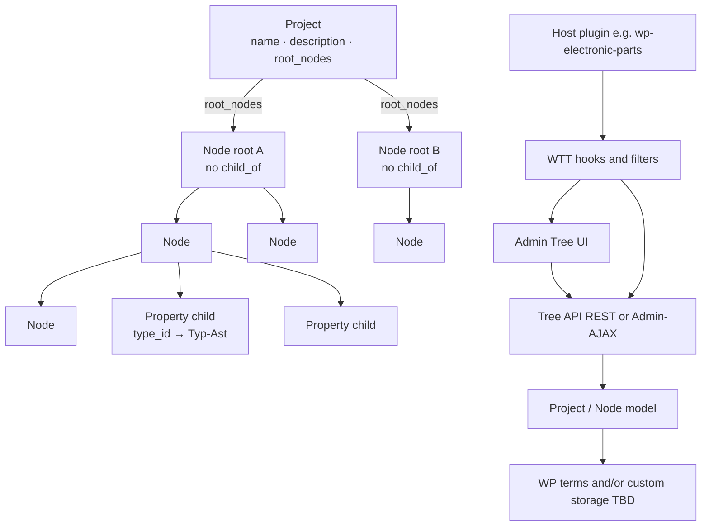
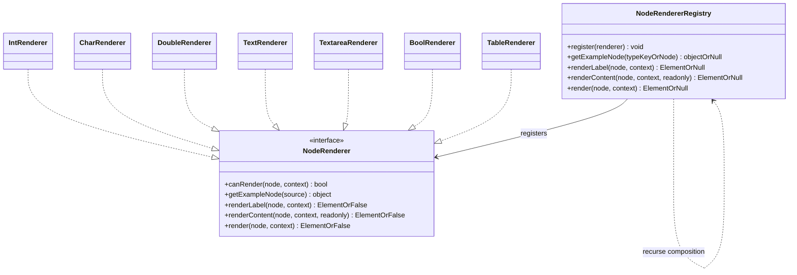
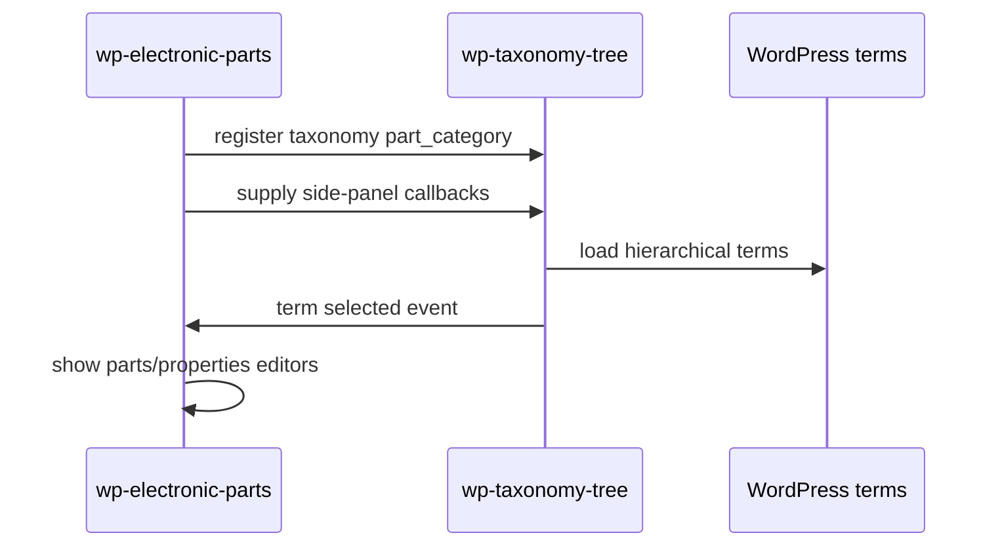

# Architecture

> Living technical documentation. Keep this aligned with [`docs/plans/project-plan.md`](plans/project-plan.md).

**Status:** Target architecture — domain model still planning; **scaffold ≈ `0.0.270`** ships a term-based admin tree on **`wtt_tree`** (BOM) and parallel **`wtt_fs`** (Fallstudie, slim UI — **not** model sign-off) + Relations (Q74–Q78) + set=`composition` (Q75) + catalog type inherit interim (Q76/Q77) + **Q88 hierarchy datatype = parent (no Data type UI)** + **Q90 Complex enum/list/table parked** + **Q91 Registry ≠ one renderer** + Form(1)/Table(n) object surfaces + **Q92 `chooser_root`/`chooser_focus`** + Fill Model Data + Sample_Data + BOM Name+Tabelle / **Q83 Bauteilarten vs Bauteile** / **Q85 composition-first** / **Q86 inherit=`child_of`** / **Q87 attributes** / table bands (legacy) / Bindings→Rules→Fixes (Q80) + Trash soft-delete (Q89) + preview UX. **Parameter class discarded** (slots = typed child Nodes). Docs absorb Fallstudie (plan **0.7.30**); status stays scaffolding.

## Planning note

Sections without an “Implemented scaffold” label describe the **intended** domain shape. The early scaffold is a thin preview over WP terms — not the final DTO/service architecture.

## High-level shape



## Principles

- **Taxonomy-agnostic:** core code never hard-codes a single taxonomy slug.
- **WordPress-first:** prefer `WP_Term_Query`, term APIs, and capabilities over custom tables.
- **Thin UI over clear model:** nesting, ancestors, and delete policies live in PHP services, not only in JavaScript. Node **presentation** uses context renderers (see Node presentation below).
- **Secure by default:** capability checks, nonces/permission callbacks, sanitized input, escaped output.
- **Extensible:** host plugins register participation and UI additions through hooks.

## Layers (not classic MVC)

WordPress has **no classic MVC controller**. Prefer **DTO + Domain Service + Repository (+ WP adapter)**.

```text
Admin UI / REST / Admin-AJAX          ← thin adapters (caps, nonces, i18n)
        ↓
Domain Services                       ← Tree_Service, Relation_Service / TypeBinding_Service, Project_Service
        ↓
DTOs / value objects                  ← Project, Node, Relation, RelationType, Changelog, Change, …
        ↓
Repositories (DAO)                    ← Project_Repository, Node_Repository, Relation_Repository
        ↓
WordPress storage                     ← terms / meta / $wpdb (TBD Q19)
```

| Layer | Responsibility | Examples |
|-------|----------------|----------|
| **DTO / value** | Data + local pure helpers | `Project`, `Node`, `Relation`, `NodeConfig`, `CompositionFooter`, `FooterCell`, `CompositionRow`, `QuantityReading` (RelationType = Node; no Parameter class) |
| **Domain service** | Invariants & workflows (no WP I/O) | tree walk/move/delete policy; `bindType` / `bindRefScope` / `assertTypeBindingsComplete`; `copyFromTemplate` |
| **Repository (DAO)** | Load/save/map | `*_Repository` — only place that talks to WP storage |
| **WP adapter** | Hooks, Admin, REST | `class-plugin.php`, screens, REST routes; host filters = extension surface |

**Not used as architecture terms here:** classic MVC `Controller`/`Model`/`View`, generic “Service Provider” (DI). Hooks/filters are the WordPress **extension** surface, not a container Provider pattern.

**RelationType invariants:** static contract on the type object (`key`, `label`, display flags); **application** to the graph (e.g. `node_embed` requires `ref_scope`) in a domain service.

**Class diagram note:** methods shown on DTOs in [`data-structure.md`](plans/data-structure.md) are a **conceptual API wish-list**. Graph queries, mutations, and binding checks belong on **services/repos** at implementation time (Q20) — do not ship fat entities.

## PHP representation (**Q20 decided**)

Prefer **typed PHP classes (DTOs)** for `Project`, `Node`, `Changelog`, `Change`, `CompositionRow`, ….  
**Q64 superseded (2026-08-02):** no **Parameter** class — property slots are **typed child Nodes** (`type_id` → Typ-Ast). **`int` / `media` / …** are Type Nodes in that branch.  
**Q54 / Q35:** Hierarchy = protected Relation **`child_of`**. **`child_of` = inheritance / specialization only** (not attributes). Other Relations additive. RelationTypes = Nodes under **`relation_type_node`**. No dual writable `parent_id` + hierarchy edges.  
**Q66:** descendants inherit property-slot **definitions** along the **`child_of`** chain (hosts inherit attribute defs; slots are Bindung members).  
**Q70 / Q61:** **BOM** = Name + Tabelle via `composition` (scaffold); table bands Zeile (+ optional Kopf/Fuss); legacy `slot_scope` for header vs column filtering.

**Q85:** Prefer **composition-first objects**: Platine `besteht_aus`→ named typed properties incl. BOM; BOM `besteht_aus`→ line parts. **Composition ≈ class; member ≈ attribute (Name + Typ + Mult.).** Table bands / Collection-table block = **views**. RelationType key **`besteht_aus`** (alias `composition`).
**Q86:** Inheritance along **`child_of` only** (`erbt_von` removed). Attributes merge by name (child wins); inherited may be hidden (`_wtt_hidden_attributes`); Festwert on host (`_wtt_attribute_fixed_values`).
**Q87:** Attributes = Name + Typ + Mult. via **`besteht_aus` / `aggregation` only** — **never** `child_of` to the host. Slot meta `_wtt_attribute_slot`; hidden from tree under host (≈ **0.0.254**).
**Q88 (general rule):** Hierarchy datatype mapped **only through `child_of` / WP parent**. Root is a node (**Knoten** / Fallstudie). **Everyone else inherits** — datatype = father. **No Data type row** in node detail (removed; type is the parent). Scaffold derives `typeId` from parent at read time and persists `type_id`=parent on create/reparent/repair (`apply_parent_as_type` / `ensure_hierarchy_datatype_inheritance`). Attribute members excluded (own catalog types via Attributes panel, Q87). Q76 Inheriting chrome not used for hierarchy.
**Q90:** Complex catalog kinds **`enum` / `list` / `table` parked** (2026-08-06). Not active product types; closed values → hierarchy + attributes / Festwerte. Scaffold may still ship leftover Complex leaves, Enum values UI, and `taxo/collection-table` until an explicit removal slice. Do not extend; warn before reintroducing (`.cursor/rules/parked-complex-types.mdc`).

**CatalogChoice (Q90 note, confirmed 2026-08-06 — Preis/Währung):** For an attribute whose **type node has specialization children** (hierarchy under the type; Q88/Q90 — not catalog `enum`):

1. Compute **max depth** of the type’s choice subtree (direct kids only → depth `1`; any grandchild → depth `≥ 2`).
2. **Depth ≤ 1** → flat **`<select>`** / simple list of leaf options.
3. **Depth ≥ 2** → **tree chooser** (existing node tree picker chrome).
4. Default/Festwert seeds the selected value when present.

Scope = **typed choice / specialization trees** under a type host (e.g. Währung → Euro/Dollar). Not automatic for every node picker in the product — deep taxonomy browse / model-binding may still prefer tree chrome; when choosing among options under a type host, use this depth rule. Admin UX: `.cursor/rules/admin-ux-controls.mdc`.

**Value SoT (TBD → Q93):** When the type host and/or the selected specialization child has its own attributes — store only the selected **node id**, or also **instance values** for attributes of host, child, or both (pick + fill)? Not decided; do not invent a Choice object (Q90).

**Q92:** Catalog folders via option **`wtt_catalog_bindings`** (term ids per taxonomy), not display names. Attribute type chooser: **`chooser_root`** (subtree shown, e.g. Fallstudie) + **`chooser_focus`** (default node) + picker flag **`expandFocusBranch: true`** (open path and expand that branch). Legacy keys `data_types` / `simple` / `complex` remain helpers (`data_types` migrates to `chooser_focus` when focus empty). Class `Catalog_Bindings`; Settings shows current bindings (≈ **0.0.271**).
Exploring **Relation** + **RelationType** for typed edges (Q35, Q41–Q43).  
RelationType leaning: one **`label`** only; no `inverse` field.  
Optional **`directed`** (Q44, unsure): graph chrome arrow vs line — separate from `DisplayHint` (structural role).  
Quantity spin (Q45): value may sit on Relation; **Praefix+Basiseinheit form a unit group**.  
Unit/prefix (**Q51** + **Q75**): allowlist per Basiseinheit; multiplikator on Praefix; display = Praefix+Kuerzel (mm / kΩ). Unit typed **`set`**; members via **`composition`** Relations (**scaffold ≈ 0.0.140** — migrate from children when empty). Fallstudie Präfixe seed (**≈ 0.0.287**) uses **full SI display names** (pico/nano/Micro/Milli/Centi/Kilo/Mega); letter symbols live in `short_description`. `ensure_term` accepts **aliases** / slug so renames stay idempotent; obsolete short siblings are moved to Trash when the canonical exists.
Schema-as-Nodes spin (Q46): **BOM / Recipe / builds** configurable as Node templates — hard `BomList` classes optional views only.
Display leaning: part-of nodes as attributes of parent; inheritable along is_a (later).  
`Project` stores required **Definitionsbaum** anchors. `Node.template` marks template trees.  
Domain branches (e.g. **Bauteile**) hang under `definition_root` — not separate catalog roots.  
**Eigenschaften:** typed children under a domain Node; not a separate class.  
Filled **quantity** (*Größe*, not Messung) composes as **value + prefix + unit** (e.g. `10 mm`); composite over `int`/`double`.  
**Type catalog (Q36 / Q90):** template holds **simples** (`int`…`bool`, **`date`**, **`display_node_name`**, `node_ref`, **`media`**) + **quantity** / units + hierarchy (Q88) + attributes (Q87). Former Collection kinds **`list` / `table` / `enum` are parked (Q90)** — legacy scaffold only; do not treat as required core types. `display_node_name` is read-only host `Node.name`. **`date`:** one simple type with mode `date` | `datetime` (term meta `_wtt_date_mode` on the catalog type; UI: Date settings). **Store SoT = Unix timestamp** (decimal string in instance/sample values); controls use site/local timezone. Aliases `datetime` / `timestamp` normalize to type key `date`. **`media` (Q65):** MediaRef — Library (`attachment_id`), URL-only (`url`), or **mirror** (`url` + `attachment_id` via sideload). MIME-based render; config `allow_upload` / `allow_url` / **`allow_url_mirror`** / **`allowed_kinds`** (default empty — must enable kinds). Re-fetch policy open (**Q67**).
**Bauteilarten vs Bauteile (Q83):** **Bauteilarten** = category/schema under Definition; **Bauteile** = MPN master records under Implementation (`type_id` → kind). BOM picks records via **`node_embed`** + `ref_scope` → Bauteile. Instance: values on nodes / CompositionRow cells.  
**Q71:** Type-node settings = slot presets (copy-on-assign). **Q72:** node_embed embeds target fields; node_ref is id-only under ref_scope. **Q73:** parent type **`node_pick`**; shared `ref_scope` + allowed catalog children (default all).  
**Q74 (scaffold ≈ 0.0.174):** Reusable **Relation picker**; additive Relations in `_wtt_relations` (edge ids); **`has_type`** selectable in Relations UI (persists as `type_id` meta — one SoT, not a stored edge); **To** target editable in Relations for stored / `has_type` / `ref_scope` (not **`child_of`** — reparent only); add/remove/duplicate/reorder for stored edges.  
**Q75 (scaffold ≈ 0.0.140):** **`set` members = `composition` Relation targets** (not hierarchy children); refine Q51 unit sets; auto-migrate children → composition when empty.  
**Q76 (scaffold interim):** Catalog type **inherit (vererbend)** + child **override** → `effectiveTypeId()`. **Superseded for hierarchy datatype by Q88** — keep only where scaffold still wires catalog-type chains.  
**Q77 (scaffold):** **Type chooser** = forest of **`is_datatype`** nodes (attribute/catalog + root **Knoten**); **`is_abstract`** is **local only**; **datatype nodes may also have a `type_id`**.  
**Q79 (scaffold ≈ 0.0.175):** Node identity = **`term_id`**. Instance display names may collide across parents; **datatype** display names unique in the taxonomy (case-insensitive).  
**Types = Nodes with `is_datatype`** (typically under Typen; inherit flags). Hierarchy classes used as parent datatypes must be assignable (scaffold promotes via `is_datatype`).  
**Q26:** type resolution for **catalog** targets datatype catalog nodes; hierarchy datatype resolution = parent (Q88).  
**Q59:** `Project.start_node` from Setup.  
**Q63:** Tree = definition (structure + property children with `slot_scope`); WP page = instance values / rows.  
**Q61 / Q70:** Tree structure **`BOM`** = `composition` of **Name** (text) + **Tabelle** (`type=table`) in the scaffold.  
**Q85:** Prefer **composition-first**: Composition ≈ class; members ≈ attributes (**Name + Typ**) via `besteht_aus`. Table UI = view. `child_of` = hierarchy + inheritance + hierarchy datatype (Q88).
**Q86:** Inheritance = **`child_of` only** (`erbt_von` removed).  
**Q54:** Tree UI = `child_of` only; Node UI = Relations von/an; Relationstypen-Ast user-editable.  
**BOM (Q57/Q58/Q60/Q62):** table bands + field members as interim UI; optional Fuss; Menge = Stück; allowlists; block fills rows (instance Name UI removed). Table validator gates preview/save. Scaffold: `taxo/collection-table` (namespace **`taxo/`**, titles start with **Taxo**) — reshape toward Composition instance. Schema drift → **Q69**.  
**Q50 leaning:** copy template Project into new Projects.  
**Template vs demo:** Template read-only; demo editable.  
**Q34/Q49 proposal:** simples `capabilities.originate_relations = false`.  
See Q16, Q20–Q39, Q49–Q51, Q54–Q70, Q76–Q88 and [`docs/plans/data-structure.md`](plans/data-structure.md).

Current class diagram lives in [`docs/plans/data-structure.md`](plans/data-structure.md) and must be refreshed on every structure change.

## Versioning

- Plugin version always starts at **`0.0.1`** when coding begins.
- The first digit (`MAJOR`) changes **only on official releases** (for example `1.0.0`, then later `2.0.0`).
- While `MAJOR` is `0`, development may bump `MINOR` / `PATCH` as needed.
- Keep plugin header, PHP version constant, and any package metadata aligned.
- Details: [`.cursor/rules/versioning.mdc`](../.cursor/rules/versioning.mdc).

## Implemented scaffold (≈ `0.0.267`)

```text
wp-taxonomy-tree/
  wp-taxonomy-tree.php              # bootstrap, WTT_VERSION
  includes/
    class-plugin.php                # wires hooks
    class-taxonomy.php              # wtt_tree + wtt_fs (not bound to posts)
    class-case-data.php             # Fallstudie seed (Definition / Implementation)
    class-media-render.php          # Q65 MediaRef SSR + enqueue
    class-object-render.php         # Object View DTO + Form HTML (block + shared)
    class-model-data.php            # Instance rows for Fill Model Data (option store)
    class-model-data-admin.php      # Admin working page + AJAX CRUD
    class-sample-data.php           # Central type → sample map (PHP)
    class-composition.php           # table Collections + column schema
    class-blocks.php                # taxo/collection-table, taxo/object-view + REST
    class-relation.php              # Q74/Q75 additive Relations (_wtt_relations; composition)
    class-tree-model.php
    class-tree-admin.php
    class-tree-ajax.php
    class-capabilities.php
    class-node-type.php             # types, Q76 inherit, Q77 flags
    class-demo-data.php
    class-settings.php              # Settings submenu (always last)
  src/blocks/collection-table/      # Gutenberg source
  src/blocks/object-view/           # Object View block (bind node → properties)
  build/blocks/…                    # npm run build output
  assets/
    css/wtt-media-render.css
    css/wtt-object-render.css
    css/model-data-admin.css
    css/tree-admin.css
    js/wtt-media-render.js
    js/wtt-node-render.js           # NodeRendererRegistry + Int/Char (preview/backend/frontend)
    js/wtt-object-render.js         # Form(1)/Table(n) object surfaces (≠ parked catalog table)
    js/wtt-sample-data.js           # type/name → sample values (preview fill)
    js/model-data-admin.js          # Fill Model Data UI
    js/tree-admin.js
    js/settings-admin.js
  package.json / webpack.config.js
  docs/ + prototypes/
```

**Structures vs instances (scaffold):** The taxonomy tree holds **definitions** (hosts, attributes, types). **Fill Model Data** (`wp-taxonomy-tree-model-data`, menu before Settings) stores **instance** values in option `wtt_model_instances`, keyed by `taxonomy:structureId` — not as attribute slots themselves. Field chrome reuses `WTTNodeRender` + `Sample_Data` / `WTTSampleData`.

**Q62 slice 2:** `taxo/collection-table` (title **Taxo Model table**) — bind a model/schema host via **in-canvas TreeChooser** (`collectionTermId`; sidebar mirrors Change…); for `kind=model`, pick/create a **Model_Data instance** (`instanceId`) then edit one table row synced via REST `wtt/v1/model-data/{id}`; catalog/table kinds keep prior rows flow. Shared bind UI: `src/blocks/shared/` (`ModelTreeChooser` tree|flat|auto by choice depth, `ModelInstancePicker`). Orphans soft-hidden. **Q69** deferred. Block naming: [`.cursor/rules/block-naming.mdc`](../.cursor/rules/block-naming.mdc).
**Chooser depth rule:** when picking among options under a type with specialization children — max choice depth ≤ 1 → flat list; ≥ 2 → TreeChooser. Taxonomy browse (Model table bind) stays tree.
**Object View (`taxo/object-view`, ≈ `0.0.288`):** bind a scaffold node (`termId` + `taxonomy`) and optional **Model_Data** `instanceId`; dynamic PHP render via `Object_Render::render_html()` / `get_view()`; editor preview via `WTTObjectRender.mount`. Shows name, short/description, type, and effective attributes (own + inherited, hides hidden). Block attrs: `layout`, **`renderDepth`** (0=meta-only, 1=attrs, 2+ reserved for nest; clamp 0–5), **`referenceMode`** (`none`|`link`|`summary`|`embed` — embed currently summary stub until nested fetch). In the **block editor**, when an instance is bound, attribute fields mount with `mode: 'edit'` and debounce-save to `POST wtt/v1/model-data/{termId}` (same pattern as Model table); meta pills stay readonly; frontend SSR stays display-only. REST: `wtt/v1/object-view/*`. **TODO:** per-attribute renderDepth / referenceMode overrides (block-level defaults only for now).
**Media display (Q65):** one shared module for admin preview and later frontend page/block view — `Media_Render::render_html()` / `enqueue_assets()` (PHP) and `window.WTTMediaRender` (JS). Do not fork admin-only MIME chrome. Mirror mode: surface may expose **original URL** and **local attachment** download. **Host override of chrome (Ampel, …) → open Q68.**
**Q74 Relations:** outgoing stored edges on from-term `_wtt_relations` `[{id,typeId,toId,typeKey,multiplicity}]`; add/remove/move/type/multiplicity/**change To**; Relationstypen under demo seed; `child_of` To fixed (reparent); **`has_type`** mirrors **`type_id`** (SoT = properties Data-type picker; Relations shows the same 0..1 binding); `ref_scope` synthetic but To pickable.  
**Q75 Set members:** `Node_Type::get_set_members` reads outgoing `composition` targets (order = edge order); `Demo_Data::ensure_set_composition_members` seeds from hierarchy children when none exist.  
**Q78:** edge **multiplicity** `0..1` \| `1` \| `0..*` \| `1..*` (definition cardinality; default `0..*`). **`child_of` fixed to `1`** (API + UI lock + repair on read); `has_type` / `ref_scope` fixed to `0..1`.
**Q76/Q77:** `_wtt_type_inheriting` / `_wtt_type_override` (catalog interim); `is_datatype` inherits; `is_abstract` local-only.
**Q88:** hierarchy child datatype = parent (derived + persisted); root → **Knoten**; **no Data type UI**; attribute members excluded.
**Deletable:** `_wtt_deletable` — seeded standard/complex catalog types and Relationstypen are `0` (not deletable); missing meta or `1` = deletable (user-created default). Nodes under “Eigene Datentypen” stay deletable even when `is_datatype`.
**Table bands:** Kopf / Zeile / Fuss identity = **`_wtt_prop_bindings`** on the table instance (type prop key → direct child term id). Child **display names are labels only** — not how bands are resolved. Columns = fields of the bound Zeile child. Fuss cell aggregate = **`_wtt_footer_op`** on each Fuss field (not a type); catalog under **`Definition/Aggregate`**.

**Bindings → Rules → Fixes (direction, ≈ `0.0.188`):** Bindings are checked by **rules**. A failing rule may expose **0..n optional fixes** (user-triggered; e.g. create missing Kopf/Fuss fields from Zeile). Fixes are optional — ask when adding a rule. Rule: [`.cursor/rules/bindings-rules-fixes.mdc`](../.cursor/rules/bindings-rules-fixes.mdc).

**Trash / soft-delete (Q89, ≈ `0.0.239`):** Node delete is soft-delete. Mark the node **and all descendants** with `_wtt_trashed=1`; keep WP `term_parent` / hierarchy links. A special **Trash** bin term (`_wtt_is_trash=1`, not deletable) holds `_wtt_trash_item_ids` (JSON list of soft-delete roots). Normal tree hides trashed nodes; under Trash the UI shows the trashed forest (not real WP children). Empty Trash permanently `wp_delete_term`s all trashed ids and clears the list. Service: `Trash` + `Tree_Model::delete_term` / `empty_trash`; AJAX `wtt_empty_trash`. Rule: [`.cursor/rules/trash-soft-delete.mdc`](../.cursor/rules/trash-soft-delete.mdc).

| Concern | Scaffold approach | Target (later) |
|---------|-------------------|----------------|
| Node storage | `WP_Term` + term meta | Domain Node DTO + repo (Q11/Q19) |
| Types | Term meta type id + set children as terms | Typ-Ast + Relations `has_type` |
| Q51 allowlist | `_wtt_allowed_prefix_ids` JSON on unit | Relation `allows_prefix` |
| Unit shape | Unit node typed `set` (Typ, Praefix?, Kuerzel) | Same conceptual; cleaner persistence |
| short_description | `_wtt_short_description` term meta | Node.short_description |
| deletable | `_wtt_deletable` (`0` = catalog/system) | Node.deletable |
| Set display | separator / join-units / label-children meta | Set config on NodeConfig |
| Set members | `composition` Relation targets (fallback: children) | Same; drop child fallback later |
| Additive Relations | `_wtt_relations` JSON on from-term (Q74; edge ids) | Relation edge table / DTO |
| Type inherit | Q88 hierarchy datatype = parent; Q76 catalog inherit+override interim | Same; drop free hierarchy type pick |
| Preview | Form×Table × edit/display; set = one field | Instance values on WP page (Q63) |
| Quantity display | Compose Praefix name + Kuerzel → `mm` / `kΩ` | Same; instance readings |
| Instance rows (Fill Model Data) | Option `wtt_model_instances` via `Model_Data` | Domain instance / CompositionRow (Q16/Q63) |
| Transport | Admin-AJAX only | REST optional (Q1) |
| JS | Vanilla admin JS | Vanilla until complexity forces `@wordpress/scripts` (Q2) |
| Preview | Form/Table × edit/display; units = Definition + composed usage | Align with instance vs definition (Q63) |

## Proposed module layout (target beyond scaffold)

Same tree plus Domain Service / Repository / DTO layers (see Layers above). REST module optional. Exact names may still change.

## Data model

Core stored objects: **Project** and **Node**. A **tree is not a stored object** — it is defined by a **root node**. See [`docs/plans/data-structure.md`](plans/data-structure.md).

### Project (conceptual)

| Field | Required | Meaning |
|-------|----------|---------|
| `id` | yes | Stable project identity |
| `name` | yes | Display name |
| `description` | yes | Project description (may be empty) |
| `taxonomy` | ? | **Strong leaning (Q18):** Project ≈ taxonomy; slug / identity on Project |
| `root_nodes` | yes | All root nodes |
| `definition_root` | yes | Required Definition tree root |
| `type_node` | yes | Required Type anchor — only branch for type resolution (**Q26**) |
| `prefix_node` | yes | Required Präfix anchor |
| `base_unit_node` | yes | Required Basiseinheit anchor |
| `start_node` | yes | Default UI focus from **Setup** (**Q59**) |
| `changelog` | yes | Changelog of Change entries |

Default Nodes (anchors + fixed simples): **generate on create** **or** **copy from a template Project** — open **Q50**.

### Node (conceptual)

| Field | Required | Meaning |
|-------|----------|---------|
| `id` | yes | Stable node identity (**Q79**: identity = ID, not name) |
| `name` | yes | Display name |
| `template` | yes | `true` = template tree marker |
| `config` | ? | Slot: `required` / `slot_scope` (Q70) / `footer_op` / capabilities (Q34); RelationType Nodes: `system` / `display` / `directed`; Composition: allowlists + footer (Q57/Q60) |
| `project_id` | ? | Optional reverse link |
| `changelog` | yes | Changelog of Change entries |

Hierarchy parent is **derived** from Relation **`child_of`** — not a writable `parent_id` dual SoT (**Q54**).  
Root node = the **same Node object** with **no** `child_of`. That root **defines a tree**.  
**Hierarchy datatype (Q88):** root `type_id` → **Knoten**; every other hierarchy node `type_id` → parent. Attribute members keep catalog `type_id` (Q87).  
Template trees use `template = true`. Persistence: Q19.  
**Taxonomy:** **Project ≈ taxonomy** (strong leaning Q18) — Node has **no** `taxonomy` field.  
**Defaults:** seed via generate **or** template-Project copy (**Q50**). Persistence: Q19.
**Project anchors:** `definition_root`, `type_node`, `prefix_node`, `base_unit_node`, **`relation_type_node`**, `start_node`.

### Eigenschaften (property slots) — Q64 superseded

There is **no Parameter class**. Configurable attributes are **typed members** under the owning Node (`type_id` → Typ-Ast catalog — **not** hierarchy parent).

| Field / idea | Required | Meaning |
|--------------|----------|---------|
| child Node `name` | **yes** | Slot label (Wert, Bauform, Name, …) |
| `type_id` | **yes** (for typed slots) | **Node** under `project.type_node` (Typ-Ast only) — orthogonal to hierarchy datatype (Q88) |
| `config.slot_scope` | **yes (Q70)** on Composition-related slots | `composition` (whole Composition) \| `row` (table column) |
| `prefix` / `base_unit` | optional | On the slot Node when the type needs them |
| filled value | **?** | Instance value on leaf / page / CompositionRow (Q16/Q63) |

**Agreed:** slots = typed children; Type Nodes under Typ-Ast.  
**Q66:** inherit slot definitions along the `child_of` chain (incl. `slot_scope`).  
**Q70 / Q61:** BOM Name is a composition member of BOM (not a table column); table columns = Zeile fields; optional Kopf/Fuss bands.  
**Q54:** Node UI Relations von/an; tree paints only `child_of`.  
**Open (Q49):** may simples originate Relations — special kind vs config disable.

### Changelog / Change (shared)

| Class | Fields | Meaning |
|-------|--------|---------|
| `Changelog` | `changes: Change[]` | History container on each auditable object |
| `Change` | `timestamp`, `changer`, `change`, `version` | When, who, what, version (details Q21–Q23) |

Applied to **Project** and **Node** via composition (`changelog` field).

### Property type and unit composition

| Field | Source | Example |
|-------|--------|---------|
| `type_id` | under Project.`type_node` | `quantity`, `text` |
| `prefix` | under Project.`prefix_node` | `k`, `m` |
| `base_unit` | under Project.`base_unit_node` | `Ohm`, `Meter` |
| `value` | instance reading (Q16) | `10` |

**Quantity reading (agreed):** `value` + `prefix` + `base_unit` → e.g. `10` + `m` + `Meter` = `10 mm`.  
`quantity` is **composite** (uses `number` or `integer`), not a rival scalar.  
Dimension group **Maße**: `10 mm × 5 mm × 2 mm` (Länge / Breite / Höhe) under the **Definitionsbaum**.

Project always has Definitionsbaum anchors. Nodes may be **templates** via `Node.template`.

Details: Q24–Q39 in [`docs/OPEN-QUESTIONS.md`](OPEN-QUESTIONS.md).

### Trees (derived)

| Concept | Meaning |
|---------|---------|
| Tree | **Not an object** — defined by a root node (same Node with parent null) + descendants |
| RootNode | **Not an object** — role of Node when parent is null |
| Project trees | A project may include several such root-defined trees |
| Parent link | One node can have one parent node (or none) |
| Children | One node can have several child nodes (or none) |
| Eigenschaften | Typed child Nodes (Q64 superseded) |
| Property inheritance | Along `child_of` (Q66 slots; **Q88** hierarchy datatype = parent); instances fill values |
| Simple types & Relations | Typically no originating Relations — special kind vs config (**Q49**) |
| Typed edges | Exploratory Relation + RelationType (`consists_of`↔`is_part_of`, …) — Q35/Q41 |
| Relation display | part-of → attributes of parent; inherit along is_a — Q42/Q43 |

Nested `children` is only a view over parent links. Cycles and multi-parent links are forbidden.

### Storage (leaning)

- **Nodes:** likely WordPress terms (Q11) or custom — undecided.
- **Property slots:** same as Node (**Q15** lean / Q11).
- **Projects:** TBD (Q19).

If custom tables appear, follow repository relational-database rules.

### Backup / migrate (Q94 — open)

**Inventory (scaffold):** almost all plugin data = WP **terms** + `_wtt_*` **term meta** + **options** (e.g. `wtt_model_instances`, `wtt_catalog_bindings`). **No custom tables.**

**Leaning (not decided):** Primary disaster recovery = **full site/DB backup (+ uploads)** — not a plugin Export button. Native Tools → Export (WXR) alone is insufficient (`wtt_tree` / `wtt_fs` unbound to posts; option-stored Model_Data; ID-keyed graphs break on WXR remap). A plugin **JSON** export/import (remap by path/slug) may come later for copy-between-sites; **MVP non-goal** — do not build admin Export now for “security.”

## Tree model responsibilities (planned)

- Treat trees as root nodes + descendants (no Tree entity).
- Load nodes for a project (possibly multiple roots / trees).
- Build nested views from parent links efficiently (avoid N+1).
- Resolve ancestors and descendants.
- Support delete strategies:
  - **promote:** reparent children to the deleted node’s parent (or make them roots)
  - **cascade:** delete the node and its descendants
- Resolve inherited property-slot definitions along `child_of` (Q66) once rules are locked.

## Node presentation (renderers)

**Direction (scaffold + future domain UI):** separate node **data** from **view**. Display always goes through a **`NodeRendererRegistry`** (dispatcher) that picks a registered **renderer** by node type and **context** (`tree`, `form`, `table`, …). Child/slot nodes with **composition** members recurse through the same `Registry.render`.

**Q91:** A node-only domain (Q90) does **not** mean one renderer class. **One Registry pipeline**, **many type-specific renderers** (simples now; more later when a type needs custom chrome). Parked Complex catalog kinds `enum` / `list` / `table` are **not** active product renderers — do not extend them; warn before reintroducing (`.cursor/rules/parked-complex-types.mdc`).

**Design principle — class renderer + example (confirmed ≈ `0.0.187`):**

1. Resolve type → registered renderer class.
2. Sample / preview **values** → central **type→value map** (`WTT\Sample_Data` / `WTTSampleData.forType`) — **not** methods on nodes. Renderers’ **`getExampleNode()`** builds example **structure** DTOs and pulls scalar samples from that map.
3. Live node supplies **structure** (bindings, column order, Kopf labels); example DTOs supply **sample cell/field content**. Do not leave typed preview cells blank when an example exists; do not invent a parallel preview stack.

**Preview / backend / frontend:** one pipeline — sample map for values + `getExampleNode` for preview DTOs, then `WTTNodeRender.Registry.render(node, context)`. Empty `previewValues` fall back to the map; session edits are never overwritten.

**Object / attribute-host surfaces (scaffold ≈ `0.0.276`):** `WTTObjectRender` paints **Form(1 instance)**, **Table(n instances)**, and **Compact(1 instance, horizontal + vertical dense strips)** over a schema node’s attributes — not the parked Collection catalog type `table` (Q90). Field cells call `Registry.renderContent` by `typeKey`. Admin preview shows Form×{edit,display} + Table×{edit,display} + Compact×{H,V}×{edit,display}. A preferred page-view surface is **not** stored on the node yet — later Gutenberg block (or node) setting may choose Form / Table / Compact. Samples: central **name→then type** map (`Sample_Data` / Herbert persona); Kontakt rows reuse that persona; **Platine** uses static Name=`Prototype PCB`. Seed: `Fallstudie/Model/Kontakt` + Name(`text`) + E-Mail(`email`), and `Fallstudie/Model/Platine` + Name(`text`) via `Case_Data::ensure_kontakt_model` / `ensure_platine_model`.

**Object View block:** whole-node chrome (`Object_Render` / `WTTObjectRender.mount`) binds a live node (+ optional instance). Canonical layout (**Form + Table auto**): horizontal readonly meta strip (ID / Parent / Slug / …) → Form for attributes with Mult ≤ 1 → Table for Mult many (`0..*` / `1..*`). Overrides: Table (all) / Compact. Block-level **`renderDepth`** / **`referenceMode`** control nest vs ref paint (editor editable when instance bound). Per-attribute render settings deferred.

**Scaffold ≈ `0.0.192`:** Scalar renderers + **`getExampleNode`**; live table instance preview = bound Kopf/Zeile/Fuss + Zeile cells from field-type examples; Fuss **`_wtt_footer_op`** + **`Definition/Aggregate`** catalog (`sum` / `avg` / `min` / `max` / `count` / `text` / `none`). PHP: `WTT\Footer_Ops`.

Rule: [`.cursor/rules/node-renderers.mdc`](../.cursor/rules/node-renderers.mdc).



## Admin UI responsibilities (planned)

- Render a left-hand tree (or equivalent tree-first layout).
- Emit selection events for extension panes.
- Provide create-root / create-child / delete flows.
- Remain usable for large-but-reasonable term sets; document limits until Phase 3 performance work.
- Node chrome (tree / list / form / table / preview) follows the renderer pipeline above.

## Extension points (planned names TBD)

| Hook / filter (names TBD) | Purpose |
|---------------------------|---------|
| Filter: registered taxonomies | Which hierarchical taxonomies use the tree environment |
| Action: enqueue host assets | Let hosts add scripts on the tree screen |
| Action/filter: selected term panel | Render host UI when a term is selected |
| Filter: delete strategies | Customize available delete behaviors |

Finalize concrete hook names during planning / Phase 2 design and list them here before implementation relies on them.

## Security boundaries (planned)

- Managing terms requires the taxonomy’s `manage_terms` (or equivalent) capability.
- Mutations go through authorized endpoints only.
- Any direct SQL uses `$wpdb->prepare()`.
- All user-facing strings are translatable (`wp-taxonomy-tree` text domain).

## Integration sketch: electronic parts (future)



## Open technical choices

Tracked in [`docs/OPEN-QUESTIONS.md`](OPEN-QUESTIONS.md). Summary:

| Topic | Options | Current leaning |
|-------|---------|-----------------|
| Transport | REST API vs Admin-AJAX | **Scaffold:** Admin-AJAX. Still open whether REST is added for hosts (Q1) |
| JS stack | Vanilla JS vs `@wordpress/scripts` | **Scaffold:** vanilla. Upgrade if UI complexity grows (Q2) |
| Packaging | Single plugin only vs Composer library + plugin | Single plugin first |

Record final choices in the plan decision log and update this section when questions close.
