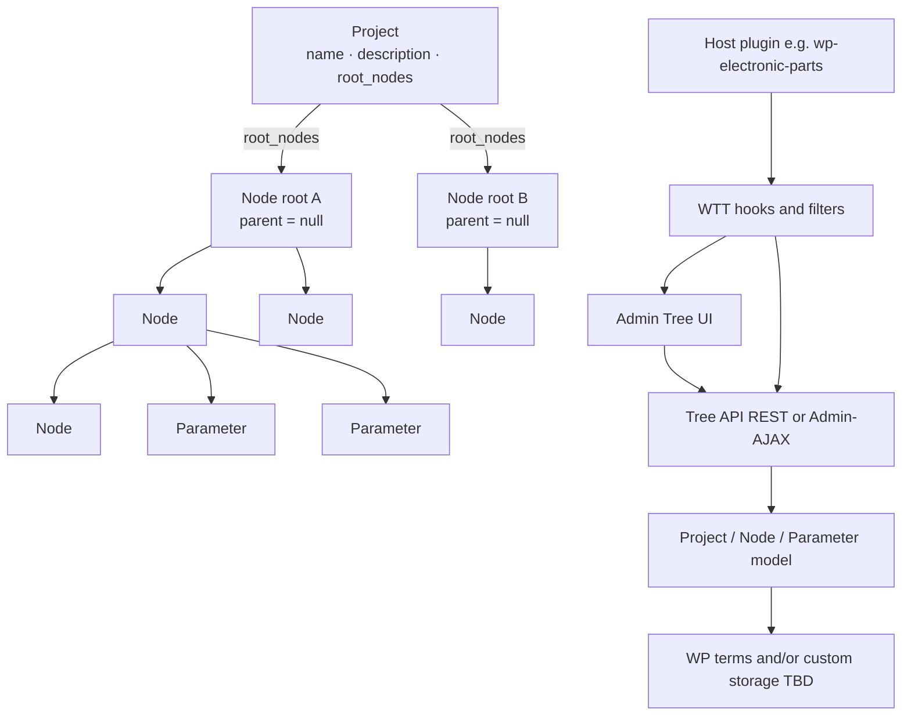
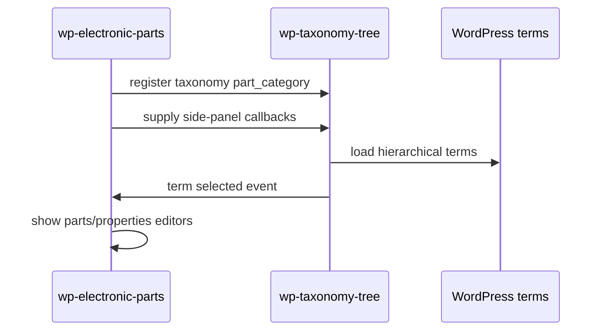

# Architecture

> Living technical documentation. Keep this aligned with [`docs/plans/project-plan.md`](plans/project-plan.md).

**Status:** Target architecture — **planning only** (implementation not started)

## Planning note

This document describes the **intended** shape of the plugin. File layout and APIs below are proposals to refine during planning. Do not treat them as implemented.

## High-level shape



## Principles

- **Taxonomy-agnostic:** core code never hard-codes a single taxonomy slug.
- **WordPress-first:** prefer `WP_Term_Query`, term APIs, and capabilities over custom tables.
- **Thin UI over clear model:** nesting, ancestors, and delete policies live in PHP services, not only in JavaScript.
- **Secure by default:** capability checks, nonces/permission callbacks, sanitized input, escaped output.
- **Extensible:** host plugins register participation and UI additions through hooks.

## PHP representation (leaning)

## PHP representation (leaning)

Prefer **typed PHP classes (DTOs)** for `Project`, `Node`, `Parameter`, `Changelog`, and `Change`.  
`Project` includes `name`, `description`, and `root_nodes` (list of root `Node`). Every Project/Node/Parameter has `changelog`. Keep behavior in services/repositories. Do not add `Tree` or `RootNode` classes. See Q20–Q24 and [`docs/plans/data-structure.md`](plans/data-structure.md).

Current class diagram lives in [`docs/plans/data-structure.md`](plans/data-structure.md) and must be refreshed on every structure change.

## Versioning

- Plugin version always starts at **`0.0.1`** when coding begins.
- The first digit (`MAJOR`) changes **only on official releases** (for example `1.0.0`, then later `2.0.0`).
- While `MAJOR` is `0`, development may bump `MINOR` / `PATCH` as needed.
- Keep plugin header, PHP version constant, and any package metadata aligned.
- Details: [`.cursor/rules/versioning.mdc`](../.cursor/rules/versioning.mdc).

## Proposed module layout (not created yet)

```text
wp-taxonomy-tree/
  wp-taxonomy-tree.php          # bootstrap
  includes/
    class-plugin.php            # wires hooks
    class-tree-model.php        # nest / walk / descendants
    class-tree-admin.php        # admin page + assets
    class-tree-rest.php         # or class-tree-ajax.php
    class-capabilities.php      # capability helpers
  assets/
    css/
    js/
  docs/
```

Exact file names may adjust before implementation; update this document when decisions change.

## Data model

Core stored objects: **Project**, **Node**, and **Parameter**. A **tree is not a stored object** — it is defined by a **root node**. See [`docs/plans/data-structure.md`](plans/data-structure.md).

### Project (conceptual)

| Field | Required | Meaning |
|-------|----------|---------|
| `id` | yes | Stable project identity |
| `name` | yes | Display name |
| `description` | yes | Project description (may be empty) |
| `root_nodes` | yes | List of root **Node** objects (each `parent_id = null`) |
| `changelog` | yes | Changelog of Change entries |

A project consists of different trees via `root_nodes`. Persistence: Q19. Taxonomy mapping: Q18.

### Node (conceptual)

| Field | Required | Meaning |
|-------|----------|---------|
| `id` | yes | Stable node identity |
| `parent_id` | yes (`null` = root) | Optional single parent node |
| `name` | yes | Display name |
| `project_id` | ? | Optional reverse link — primary link is `Project.root_nodes` |
| `changelog` | yes | Changelog of Change entries |

Root node = the **same Node object** with `parent_id = null` (not a separate type). That root **defines a tree**.

### Parameter (conceptual)

| Field | Required | Meaning |
|-------|----------|---------|
| `id` | yes | Stable parameter identity |
| `node_id` | ? | Owning node — only if single-owner model is confirmed |
| `key` | likely | Machine key |
| `label` | likely | Human-readable name |
| `type` | **yes** | Parameter type — always required (allowed values Q24) |
| `changelog` | yes | Changelog of Change entries |

**Agreed:** one node can have **several parameters**.  
**Tentative (?):** one parameter is always assigned to exactly one node — decide later (Q14).

### Changelog / Change (shared)

| Class | Fields | Meaning |
|-------|--------|---------|
| `Changelog` | `changes: Change[]` | History container on each auditable object |
| `Change` | `timestamp`, `changer`, `change`, `version` | When, who, what, version (details Q21–Q23) |

Applied to **Project**, **Node**, and **Parameter** via composition (`changelog` field).

### Trees (derived)

| Concept | Meaning |
|---------|---------|
| Tree | **Not an object** — defined by a root node (same Node with parent null) + descendants |
| RootNode | **Not an object** — role of Node when parent is null |
| Project trees | A project may include several such root-defined trees |
| Parent link | One node can have one parent node (or none) |
| Children | One node can have several child nodes (or none) |
| Parameters | One node can have several parameters (or none) |
| Parameter owner | One parameter → one node (?) — undecided (Q14) |

Nested `children` is only a view over parent links. Cycles and multi-parent links are forbidden.

### Storage (leaning)

- **Nodes:** likely WordPress terms (Q11) or custom — undecided.
- **Parameters:** TBD (Q15).
- **Projects:** TBD (Q19).

If custom tables appear, follow repository relational-database rules.

## Tree model responsibilities (planned)

- Treat trees as root nodes + descendants (no Tree entity).
- Load nodes for a project (possibly multiple roots / trees).
- Build nested views from parent links efficiently (avoid N+1).
- Resolve ancestors and descendants.
- Support delete strategies:
  - **promote:** reparent children to the deleted node’s parent (or make them roots)
  - **cascade:** delete the node and its descendants
- Model Parameter definitions on nodes (one node → several parameters) once types/storage are settled.

## Admin UI responsibilities (planned)

- Render a left-hand tree (or equivalent tree-first layout).
- Emit selection events for extension panes.
- Provide create-root / create-child / delete flows.
- Remain usable for large-but-reasonable term sets; document limits until Phase 3 performance work.

## Extension points (planned names TBD)

| Hook / filter (names TBD) | Purpose |
|---------------------------|---------|
| Filter: registered taxonomies | Which hierarchical taxonomies use the tree environment |
| Action: enqueue host assets | Let hosts add scripts on the tree screen |
| Action/filter: selected term panel | Render host UI when a term is selected |
| Filter: delete strategies | Customize available delete behaviors |

Finalize concrete hook names during planning / Phase 2 design and list them here before implementation relies on them.

## Security boundaries (planned)

- Managing terms requires the taxonomy’s `manage_terms` (or equivalent) capability.
- Mutations go through authorized endpoints only.
- Any direct SQL uses `$wpdb->prepare()`.
- All user-facing strings are translatable (`wp-taxonomy-tree` text domain).

## Integration sketch: electronic parts (future)



## Open technical choices

Tracked in [`docs/OPEN-QUESTIONS.md`](OPEN-QUESTIONS.md). Summary:

| Topic | Options | Current leaning |
|-------|---------|-----------------|
| Transport | REST API vs Admin-AJAX | REST if straightforward; Admin-AJAX acceptable for MVP admin UI |
| JS stack | Vanilla JS vs `@wordpress/scripts` | Vanilla for MVP tree; upgrade if UI complexity grows |
| Packaging | Single plugin only vs Composer library + plugin | Single plugin first |

Record final choices in the plan decision log and update this section when questions close.
