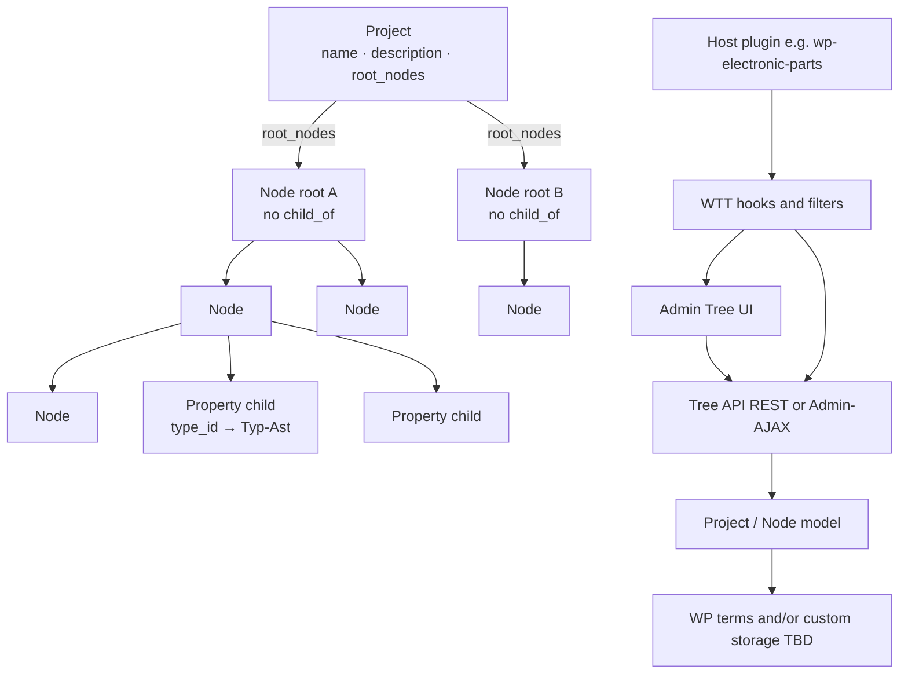
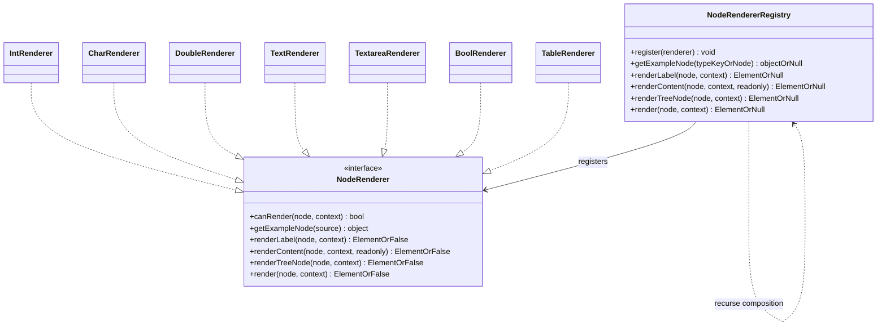
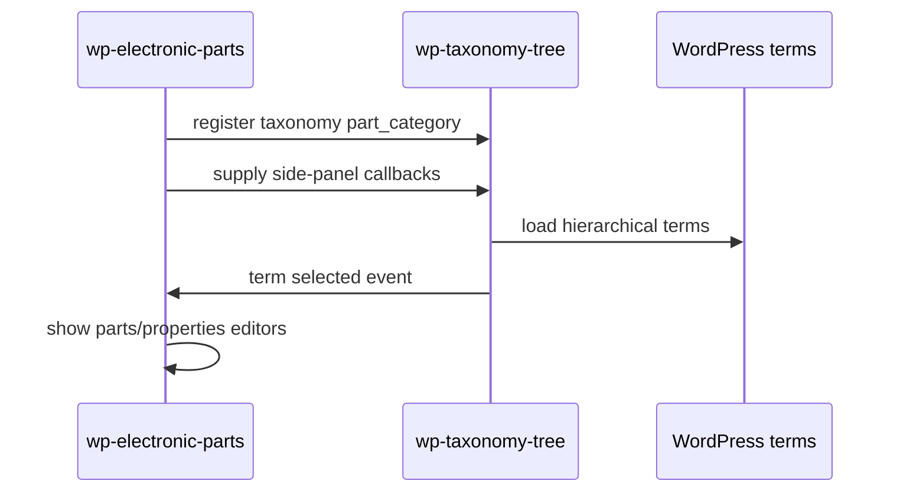

# Architecture

> Living technical documentation. Keep this aligned with [`docs/plans/project-plan.md`](plans/project-plan.md).

**Status:** Target architecture — domain model still planning; **scaffold ≈ `0.0.533`** on **`wtt_fs` (Fallstudie)** only (`wtt_tree` retired). **Q123 locked** — Relation-only attributes, `Settings.data`/`view`, recursive walk ([`DEVELOPER-ATTRIBUTE-MODEL.md`](DEVELOPER-ATTRIBUTE-MODEL.md)); migrate remaps slots → named edges; `Settings_Walk` + own-attr edge SoT + **Walk Settings** (≈ 0.0.441+; nested **table chrome** + deferred Choices ≈ **0.0.531**): path-keyed deltas on the attribute Relation; depth-0 Default → `edge.default`; admin Preview = **host Preferred only**; structure hosts never list heirs as CatalogChoice; Preferred default = **type node** (no display-name heuristics — debt to finish stripping). **Q126:** ConfigPage without `childNodes` box — Child-list Choices under Display when Preferred = `ChildListRenderer` (≈ **0.0.532**). **Implementation/BOM seed retired** (≈ **0.0.533**). **Q125 `calc`**. Q90 parked `enum`/`list`/`table` / `node_*`. **Gold = Fallstudie**; status stays scaffolding. Parity matrix: [`plans/settings-ui-parity.md`](plans/settings-ui-parity.md).

## Planning note

Sections without an “Implemented scaffold” label describe the **intended** domain shape. The early scaffold is a thin preview over WP terms — not the final DTO/service architecture.

**Collaboration (process):** Parallel agents own **lanes** (blocks / tree-admin / shared-render / model / planning) — [`.cursor/rules/agent-lanes.mdc`](../.cursor/rules/agent-lanes.mdc). Design intent stays in the project plan; lanes **append** decisions and do not stomp. Gutenberg implementation backlog: [`docs/plans/blocks-lane.md`](plans/blocks-lane.md).

## High-level shape



## Principles

- **Taxonomy-agnostic:** core code never hard-codes a single taxonomy slug.
- **WordPress-first:** prefer `WP_Term_Query`, term APIs, and capabilities over custom tables.
- **Thin UI over clear model:** nesting, ancestors, and delete policies live in PHP services, not only in JavaScript. Node **presentation** uses context renderers (see Node presentation below).
- **Presentation parity:** the same object paint path (**Registry** + `WTTObjectRender` / `Object_Render`) serves **admin preview**, **block editor**, and **frontend SSR**. Gaps are wiring bugs, not a second UI stack. Complements **Q63** (definition vs instance) and **Q91** (many type renderers). Gutenberg blocks are **views** (**Q85**), not the domain SoT — see [Presentation surfaces](plans/project-plan.md#presentation-surfaces-architecture) in the project plan.
- **Config page parity (Q126):** admin node configuration is one vertical **`WTTConfigRender.renderPage`** stack: Actions → Meta → IdentitySettings → Bools → ChildNodes? → Display → Attributes → Preview → Relations. Each box is its own renderer; ChildNodes omitted when unused. Rule: [`.cursor/rules/config-renderers.mdc`](../.cursor/rules/config-renderers.mdc).
- **Secure by default:** capability checks, nonces/permission callbacks, sanitized input, escaped output.
- **Extensible:** host plugins register participation and UI additions through hooks.

## Layers (not classic MVC)

WordPress has **no classic MVC controller**. Prefer **DTO + Domain Service + Repository (+ WP adapter)**.

```text
Admin UI / REST / Admin-AJAX          ← thin adapters (caps, nonces, i18n)
        ↓
Domain Services                       ← Tree_Service, Relation_Service / TypeBinding_Service, Project_Service
        ↓
DTOs / value objects                  ← Project, Node, Relation, RelationType, Changelog, Change, …
        ↓
Repositories (DAO)                    ← Project_Repository, Node_Repository, Relation_Repository
        ↓
WordPress storage                     ← terms / meta / $wpdb (TBD Q19)
```

| Layer | Responsibility | Examples |
|-------|----------------|----------|
| **DTO / value** | Data + local pure helpers | `Project`, `Node`, `Relation`, `NodeConfig`, `CompositionFooter`, `FooterCell`, `CompositionRow`, `QuantityReading` (RelationType = Node; no Parameter class) |
| **Domain service** | Invariants & workflows (no WP I/O) | tree walk/move/delete policy; `bindType` / `bindRefScope` / `assertTypeBindingsComplete`; `copyFromTemplate` |
| **Repository (DAO)** | Load/save/map | `*_Repository` — only place that talks to WP storage |
| **WP adapter** | Hooks, Admin, REST | `class-plugin.php`, screens, REST routes; host filters = extension surface |

**Not used as architecture terms here:** classic MVC `Controller`/`Model`/`View`, generic “Service Provider” (DI). Hooks/filters are the WordPress **extension** surface, not a container Provider pattern.

**RelationType invariants:** static contract on the type object (`key`, `label`, display flags); **application** to the graph (e.g. `node_ref` requires `ref_scope`) in a domain service.

**Class diagram note:** methods shown on DTOs in [`data-structure.md`](plans/data-structure.md) are a **conceptual API wish-list**. Graph queries, mutations, and binding checks belong on **services/repos** at implementation time (Q20) — do not ship fat entities.

## PHP representation (**Q20 decided**)

Prefer **typed PHP classes (DTOs)** for `Project`, `Node`, `Changelog`, `Change`, `CompositionRow`, ….  
**Q64 superseded (2026-08-02):** no **Parameter** class — property slots are **typed child Nodes** (`type_id` → Typ-Ast). **`int` / `media` / …** are Type Nodes in that branch.  
**Q54 / Q35:** Hierarchy = protected Relation **`child_of`**. **`child_of` = inheritance / specialization only** (not attributes). Other Relations additive. RelationTypes = Nodes under **`relation_type_node`**. No dual writable `parent_id` + hierarchy edges.  
**Q66:** descendants inherit attribute **definitions** along the **`child_of`** chain. Heir host overrides (Default, **`choiceFilter`**, RO/Hide, **Preferred / Walk Settings** via `_wtt_attribute_settings_overrides` ≈ **0.0.462**) store on the **child host** — father’s Relation edge unchanged. Abstract diagram: [`docs/plans/attribute-choice-inheritance.md`](plans/attribute-choice-inheritance.md) (≈ **0.0.455** Choices-on-heir).  
**Q70 / Q61:** **BOM** = Name + Tabelle via `composition` (scaffold); table bands Zeile (+ optional Kopf/Fuss); legacy `slot_scope` for header vs column filtering.

**Q85:** Prefer **composition-first objects**: Platine `besteht_aus`→ named typed properties incl. BOM; BOM `besteht_aus`→ line parts. **Composition ≈ class; member ≈ attribute (Name + Typ + Mult.).** Table bands / Collection-table block = **views**. RelationType key **`besteht_aus`** (alias `composition`).
**Q86:** Inheritance along **`child_of` only** (`erbt_von` removed). Attributes merge by name (child wins); inherited may be hidden (`_wtt_hidden_attributes`); Festwert on host (`_wtt_attribute_fixed_values`).
**Relation vs Object / Q123 (locked 2026-08-09, OQ-W1…W16):** Attributes = **`besteht_aus` / `aggregation` Relation only** (`name` + target + override deltas) — **no** slot terms. Type = Relation target. **`Settings.data`** + **`Settings.view`**; hybrid live resolve; recursive Settings/Render walk (node = attribute UI). Instance keys = Relation id. Delete cascade by Bindung (Q111). Attributes panel = wizard; Relations panel = general. Deprecated: `node_ref` / `ref_scope` / `node_embed` / `node_pick`. Canonical diagrams: [`docs/DEVELOPER-ATTRIBUTE-MODEL.md`](DEVELOPER-ATTRIBUTE-MODEL.md). Decision log: [`plans/q123-doc-pass-questions.md`](plans/q123-doc-pass-questions.md). Scaffold slots / Preferred meta = migrate debt.

**Q87:** Product = Relation-only attributes (above). Scaffold may still create `_wtt_attribute_slot` until migrate — **debt**. Never `child_of` to the host for attributes.
**OQ-A3 / Q115 — Read-only vs Default (≈ 0.0.390):** Attribute **Read-only** (host `_wtt_attribute_readonly`, default **off**; heir may switch **on**) is the lock SoT — syncs to slot `_wtt_readonly`. Settings shows the same **Read-only** slide; **grayed** unless the node is an attribute slot. **Default value** seeds empty instances only — not a lock. **Node** defaults use `_wtt_fixed_*` (UI “Default value”; grayed on **builtin Simple** catalog leaves; editable on specializations / typed fields). **Attribute** instance defaults stay host `_wtt_attribute_fixed_values` (Q106). Legacy slot `fixedEnabled` still paints as RO (meta kept). **Q104 Mandatory** is separate. **Rule ≈ 0.0.409:** RO without default (non-computed) is illegal — fixes: clear RO or set default (`Attribute_Validator`).

**Q116 — Sole required list-select (≈ 0.0.392):** Any ListChooser / flat `<select>` that is **required** (no zero-lower multiplicity) and has **exactly one** real option → auto-select that option and **disable (gray)**. Multiple options stay selectable. Optional Mult (`0` / `0..1` / `0..*`) stays open even with one choice. Shared helper `applySoleRequiredListLock`; wired in admin Preferred R/C, `renderOptionsSelect`, CatalogChoice (admin + object-render).

**Q117 — Node presentation store (≈ 0.0.393):** Locale-aware texts (`form` / `table` / `select` / `symbol` / `help`) and locale-invariant **`icon`** in table `wtt_node_presentation` (same technique; icon locale `*`). Admin submenu **Presentation** (WP_List_Table, incomplete filter, edit form, deep-link `term_id`) before Settings. AJAX `wtt_get_node_presentation` / `wtt_save_node_presentation` for tree foldable. Migrate from term description / short_description / `_wtt_icon`. Resolve falls back to legacy meta then term name.
**Settings (OQ-W16 locked):** **`Settings.data`** (validators, allowlists, defaults, …) + **`Settings.view`** (Preferred renderer/converter, …). Same recursive walk + hybrid override deltas. **Presentation** (Q117 texts/icon) remains its own store. Scaffold `_wtt_preferred_*` / flat typeExtras = migrate debt.

- **Preferred render** (`_wtt_preferred_render`, ≈ 0.0.358+): object layouts (`FormRenderer`|`TableRenderer`|`CompactRenderer`|`CompactVerticalRenderer`|`EmbeddedRenderer`|`ChildListRenderer`) **or** field Registry renderer ids (`int`, `bool`, …). UI lists **only** options that `canRender` the node. Admin preview / Object View `layout=auto` use preferred; **`embed`** = pick + fill layout; **`ChildListRenderer`** = list of hierarchy children (default for Konstanten hosts with children, ≈ 0.0.483).
- **Preferred converter** (`_wtt_preferred_converter`, ≈ 0.0.359+; legacy fallback `_wtt_int_display_format`): JS `WTTConverter.Registry` lists converters that `canConvert` the node. **Int:** `arabic` (default) / `roman` / `binary` / `octal` / `hex`. **Char (≈ 0.0.520):** same int formats via **Unicode codepoint** (e.g. `A`→hex `41`), plus `glyph` (default, character as-is), `ascii` (printable / `\xHH`; outside ASCII → `U+…`), `unicode` (`U+0041`). Edit stays the stored character; Display paints via preferred converter. Attribute override keeps typeExtras `preferredConverter`/`displayFormat`.
- **Validators** (`_wtt_validators`, ≈ 0.0.367+): **0..n** entries `{ id, errorText, expression?, params?, isDefault?, fixes? }`. JS `WTTValidator.Registry` + PHP `WTT\Validator` (parallel to converters/renderers). **Simple type defaults** when empty: `int`→`integer_shape`, `double`→`number_shape`, `email`→`email_shape`, `char`→`char_shape`, `date`→`date_shape`, `media`→`media_shape`. **Optional bounds (≈ 0.0.514):** `int_min` / `int_max` / `double_min` / `double_max` with `params.value` (not type defaults — add when needed). **Chrome (≈ 0.0.517):** Range Preferred always uses those bounds as the slider window (fallback 0…min+100 if unbound); Spinner Preferred sets HTML `min`/`max` only when validators are present; Int/Double field keep text inputs (validation via Registry). Preview field DTOs carry `validators` / `typeValidators`. **Optional length (≈ 0.0.515):** `text_min_length` / `text_max_length` on `text`/`textarea` (`params.value`; seed min=0 max=100) → HTML `minlength`/`maxlength` when set. **Optional charset (≈ 0.0.519)** on `char`/`text`/`textarea`: `charset_range` (`a-z,A-Z,0-9` or `U+0041-U+005A`), `charset_allowlist` (comma-separated graphemes; `\,` for comma), `charset_regex` (full-string match, auto-anchored). Range/allowlist check **every grapheme**; regex checks the **whole value**. Bound column uses a text field for charset specs. Message-only (no auto-fix). **Textarea layout (≈ 0.0.516):** `cols` (chars/line) + `rows` (lines) on type meta `_wtt_textarea_cols` / `_wtt_textarea_rows` (defaults 40×4); attribute override via Settings.data `textareaCols`/`textareaRows`. **UI (≈ 0.0.518):** one shared validators table (`buildValidatorsEditor`) on type Settings, attribute detail, and Settings walk — empty list shows a hint row (no separate checkbox/`ul` chrome). **`text` / `textarea` / `bool`:** no default validator. **Bool** default **switch** render (admin UX rule). Shape validators follow **Binding → Rule → Fix** (Q80): report via error text; optional fix labels never auto-run. Int edit uses `Registry.validateAll`.
- **Registry bind (Q96 decided, scaffold ≈ `0.0.385`):** Catalog option bindings **`builtin.<id>` → term id** (same `wtt_catalog_bindings` family as Q92). Resolve Registry renderer/converter/validator by **id**, not leaf name (`Catalog_Bindings::registry_id_for_term` / `Node_Type::registry_id_for_type_term`). Rename-safe; `ensure_builtins` fills bindings on install/ensure. **≈ 0.0.521:** `KEY_SIMPLE` / builtins always prefer **Definition/Data Types/Simple** (with `node_presentation`); stale bindings to legacy **Simple Datatypes** are rebound and that folder is purged. Scaffold name-match = **debt** until migrate.
**Q88 (general rule):** Hierarchy datatype mapped **only through `child_of` / WP parent**. Root is a node (Fallstudie). **Except on the root, `has_type` / effective type is always the father.** **No Data type row** in hierarchy node detail. Scaffold derives `typeId` from parent at read time and persists `type_id`=parent on create/reparent/repair. **Free `set_type` is dropped from admin** (hierarchy + root). Root `type_id` → **Knoten** is **seed-only** (`set_type_id(…, allow_seed)` / ensure). Do not require `_wtt_is_datatype` / promote for parent-as-type. Attribute members excluded (own catalog types via Attributes panel, Q87). Q76 Inheriting chrome not used for hierarchy.
**Q90:** Complex catalog kinds **`enum` / `list` / `table` parked** (2026-08-06). **≈ 0.0.463:** Fallstudie removes `enum`/`list`/`node_pick`(+embed/ref) from the tree (soft-trash; no seed/restore). Legacy **`table`** leaf kept for BOM::Tabelle only. Closed values → hierarchy + attributes / Festwerte (Bauart under Complex). Do not extend; warn before reintroducing (`.cursor/rules/parked-complex-types.mdc`).

**CatalogChoice (Q90 note, confirmed 2026-08-06 — Preis/Währung):** For an attribute whose **type node has specialization children** (hierarchy under the type; Q88/Q90 — not catalog `enum`):

1. Compute **max depth** of the type’s choice subtree (direct kids only → depth `1`; any grandchild → depth `≥ 2`).
2. **Depth ≤ 1** → flat **`<select>`** / simple list of leaf options.
3. **Depth ≥ 2** → **tree chooser** (existing node tree picker chrome).
4. Default/Festwert seeds the selected value when present.

Scope = **typed choice / specialization trees** under a type host (e.g. Währung → Euro/Dollar). Not automatic for every node picker in the product — deep taxonomy browse / model-binding may still prefer tree chrome; when choosing among options under a type host, use this depth rule. Admin UX: `.cursor/rules/admin-ux-controls.mdc`. Chooser design (TreeChooser / ListChooser, `rootId`+`focusId`): [`.cursor/rules/choosers.mdc`](../.cursor/rules/choosers.mdc).

**Value SoT (Q93 / Q97 / Q111 revised):** **Bindung** = storage: **Composition** → embedded values/rows in the parent instance bag; **Aggregation** → linked Model_Data + `links[]` (id on host; fill on referenced instance where applicable). Preferred render key **`embed`**, UI **Embedded renderer** = pick+fill chrome (**Q112**). Picker **`inline`/`popup`** (Q74/Q84) = chooser presentation — not storage.
**Q92 (+ datatype job #6, 2026-08-07):** Catalog folders **and any special branch/leaf** the product must address → option **`wtt_catalog_bindings`** (named keys → term ids per taxonomy). Shared **`chooser_root`** = catalog/tree branch root (e.g. Fallstudie; used by type chooser, Object View, pickable nodes — not chooser-only). Chooser API: caller **`focusId`** wins; **`chooser_focus`** = fallback only when none passed (e.g. attribute type picker → Data Types). Object View / Model table pass explicit **`model`** as focus — do not override with `chooser_focus`. Picker flag **`expandFocusBranch: true`**. Resolve **by id only** — **never select nodes by name** in product logic (named config bindings → ids are the allowed name→id bridge). Name lookup fallbacks in scaffold = **debt to remove**. Legacy keys `data_types` / `simple` / `complex` remain helpers (`data_types` migrates to `chooser_focus` when focus empty). Class `Catalog_Bindings`; Settings shows compact read-only Binding/Key/ID/Node table with **Change** → edit selects, then Save / Undo (≈ **0.0.323**).
Exploring **Relation** + **RelationType** for typed edges (Q35, Q41–Q43).  
RelationType leaning: one **`label`** only; no `inverse` field.  
Optional **`directed`** (Q44, unsure): graph chrome arrow vs line — separate from `DisplayHint` (structural role).  
Quantity spin (Q45): value may sit on Relation; **Praefix+Basiseinheit form a unit group**.  
Unit/prefix (**Q51** + **Q75**): allowlist per Basiseinheit; multiplikator on Praefix; display = Praefix+Kuerzel (mm / kΩ). **SI vocab lock (2026-08-11):** Praefix/unit names, symbols, and prefix factors align **BIPM SI Brochure** + **ISO/IEC 80000**; binary Ki/Mi = IEC 80000-13 only. Product engines (allowlists, Q109, inch/affine/packaging) stay ours — see [`attribute-choice-inheritance.md`](plans/attribute-choice-inheritance.md). Unit typed **`set`**; members via **`composition`** Relations (**scaffold ≈ 0.0.140** — migrate from children when empty). Fallstudie Präfixe seed (**≈ 0.0.287**) uses **full SI display names** (pico/nano/Micro/Milli/Centi/Kilo/Mega); letter symbols live in `short_description`. `ensure_term` accepts **aliases** / slug so renames stay idempotent; obsolete short siblings are moved to Trash when the canonical exists. **Q109 decided:** store the **display triple**; on Präfix change (same Basiseinheit) **rescale Typ** so the physical quantity stays constant; no silent cross-Basiseinheit switch. **Q120 lean:** Quantity = Value + Prefix? + Unit; catalog folders are **knots**; difference = **rules** on the unit (prefix allowlist, dimension, conversion engine) — meter↔inch and EUR↔GBP same story, different engine. **Scaffold tree ≈ 0.0.402:** no **Konstanten**; **Data Types / Präfixe** + **Data Types / Unit / {With prefix, Without prefix}** + Bauformen; legacy Konstanten migrated then trashed on ensure. **Q121:** money → canonical EUR + foreign snapshot. **Q119 (money, same-currency):** store precise **major unit** (e.g. EUR). **Währung leaves align ISO 4217:** `currencyCode`, `currencyNumber`, `currencyExponent` (minor → Cent). ISO does **not** define FX, rounding, or store format — those stay ours (entry scale, Preferred converters, Q110/Q121). Display/rounding via converters (adaptive fraction digits lean) — not hard-coded Preis. **FX = Q110** (parked). See [`attribute-choice-inheritance.md`](plans/attribute-choice-inheritance.md) Application B. **Scaffold ≈ 0.0.386:** `WTTConverter.Quantity.rescaleOnPrefixChange` + quantity Präfix `<select>` in `wtt-node-render` (and join-units shared Praefix in tree-admin); `quantitySchema.prefixRootToSi` + prefix `multiplikator` on type-branch options. Digits-only switch is not the default. **Q110 (parked):** currency/money conversion is **not** this path — FX rates, not multiplikator.


Schema-as-Nodes spin (Q46): **BOM / Recipe / builds** configurable as Node templates — hard `BomList` classes optional views only.
Display leaning: part-of nodes as attributes of parent; inheritable along is_a (later).  
`Project` stores required **Definitionsbaum** anchors. `Node.template` marks template trees.  
Domain branches (e.g. **Bauteile**) hang under `definition_root` — not separate catalog roots.  
**Eigenschaften:** typed children under a domain Node; not a separate class.  
Filled **quantity** (*Größe*, not Messung) composes as **value + prefix + unit** (e.g. `10 mm`); composite over `int`/`double`. Informal alias **`measure`** (and DE `größe`/`groesse`) normalizes to type key **`quantity`** — catalog leaf stays `quantity`.  
**Type catalog (Q36 / Q90):** template holds **simples** (`int`…`bool`, **`date`**, **`time`**, **`datetime`**, **`color`**, **`node_presentation`** (alias `display_node_name`), `node_ref`, **`media`**) + **quantity** / units + hierarchy (Q88) + attributes (Q87). Former Collection kinds **`list` / `table` / `enum` are parked (Q90)** — legacy scaffold only; do not treat as required core types. `node_presentation` is read-only host presentation (Q117 context). **`date` / `time` / `datetime`:** three Simple catalog leaves. `date` may still carry optional `_wtt_date_mode` (`date`|`datetime`) for legacy Date settings UI; **`datetime` is its own type key** (aliases `date_time` / `date-time` / `timestamp` → `datetime`, not collapsed onto `date`). **Store SoT:** `date`/`datetime` = Unix timestamp (decimal string); `time` = `HH:MM` string. Controls use site/local timezone where applicable. **`media` (Q65):** MediaRef — Library (`attachment_id`), URL-only (`url`), or **mirror** (`url` + `attachment_id` via sideload). MIME-based render; config `allow_upload` / `allow_url` / **`allow_url_mirror`** / **`allowed_kinds`** (default empty — must enable kinds). Re-fetch policy open (**Q67**).
**Bauteile catalog (Q83 superseded / OQ-B2):** **Model/Bauteil** holds **kinds and part records** (address by id). **No product Implementation/ branch** — BOM/line refs target **Model** only. Scaffold `Implementation/` seeds = **debt**. No Lieferant/Bestellnummer/Hersteller on kinds.  
**Q72 superseded / deprecated (hardened 2026-08-09):** pick+fill = preferred **`embed`**. Catalog **`node_embed`**, **`node_ref`**, **`node_pick`**, and RelationType **`ref_scope`** are **deprecated** (scaffold debt). **Q73/Q84** superseded with that.

**Attribute typing (Q108 superseded 2026-08-09):** Type of an attribute = **target of `besteht_aus` / `aggregation`**. No RelationType **`attribute_typeof`**. Type **Settings** → Settings capsule on that Relation (shape of target, e.g. `size`). Scaffold may still use `_wtt_type_id` on slots until migrate. **Q49:** Simples may have specialization children (Config presets); soft lean no attrs-as-host / no outgoing Relations.

**RelationTypes (product lean 0.7.95):** **`child_of`**, **`besteht_aus`**, **`aggregation`**. Legacy name `composition` = migrate/alias only. **`ref_scope` / `node_embed` / `node_ref` / `node_pick` deprecated** (Q72/Q73/Q84). **`has_type` / `erbt_von` / `attribute_typeof`** out.

**Attribute Options UI (scaffold ≈ 0.0.531):** Attributes table row has foldable **Options**. **Soll / mostly Ist:** one **Settings walk** (Attribut-Walk = Knoten-Walk from target) when `attributeSettingsWalkCovers`; nested children = Attributes-like table; Choices save on leave; legacy Choices+overrides only as fallback. Edge fields stay in the table row (not Settings). **Next:** presentationContext/compute into the same walk. Detail: [`plans/settings-ui-parity.md`](plans/settings-ui-parity.md).

**Embed pick+create (UR-B6; Preferred `EmbeddedRenderer`):** Popup Kind → Dataset filter/create → bind instance id (Q93). **Aggregation targets** (e.g. Kontakt) may use the **type itself** as sole kind when there are no specialization children (≈ 0.0.531). Bauteil keeps kind-tree children when present. Extend TreeChooser + ModelInstancePicker — no third picker.  
**Q74 (scaffold ≈ 0.0.174):** Reusable **Relation picker**; additive Relations in `_wtt_relations` (edge ids); **`has_type`** in Relations UI mirrors **`type_id`** (one SoT) for attribute / catalog field types. Product model (2026-08-07): **except root, `has_type` = father** (Q88); root type is seed-only — Relations shows protected readout, not free pick. **To** editable for stored / attribute `has_type` / `ref_scope` (not **`child_of`** — reparent only).  
**Q75 (scaffold ≈ 0.0.140):** **`set` members = `composition` Relation targets** (not hierarchy children); refine Q51 unit sets; auto-migrate children → composition when empty.  
**Q76 (scaffold interim):** Catalog type **inherit (vererbend)** + child **override** → `effectiveTypeId()`. **Superseded for hierarchy datatype by Q88** — keep only where scaffold still wires catalog-type chains.  
**Q77 (revised 2026-08-07):** **Type chooser = nodes** scoped by Q92 bindings / `chooser_root` — **not** gated by `_wtt_is_datatype`. **`is_abstract`** local only (folders visible, not selectable — keep until #12 decide). Flag `_wtt_is_datatype` = **scaffold debt**; **#6 decided** (address special leaves/branches by id in settings); **#12 open** (conceptual “type role” vs `type_id` — see OPEN-QUESTIONS). Catalog lock (#5) → **`_wtt_is_template`**.  
**Q79 (revised 2026-08-07):** Node identity / selection = **`term_id`**. Never select by name (config bindings → ids OK). Former “datatype names unique” rule = optional UX debt, not selection SoT.  
**Types = Nodes** (catalog leaves under Type branch; hierarchy classes are nodes too). Do **not** treat `_wtt_is_datatype` as the product gate for “is a type.” Hierarchy parent-as-type needs no promote flag (Q88).  
**Q26:** catalog targets live under Type/Präfix/Basiseinheit anchors; chooser scope = Q92, not the datatype flag. Hierarchy datatype = parent (Q88).  
**Q59:** `Project.start_node` from Setup.  
**Q63:** Tree = definition (structure + property children with `slot_scope`); WP page = instance values / rows.  
**Q61 / Q70:** Tree structure **`BOM`** = `composition` of **Name** (text) + **Tabelle** (`type=table`) in the scaffold.  
**Q85:** Prefer **composition-first**: Composition ≈ class; members ≈ attributes (**Name + Typ**) via `besteht_aus`. Table UI = view. `child_of` = hierarchy + inheritance + hierarchy datatype (Q88).
**Q86:** Inheritance = **`child_of` only** (`erbt_von` removed).  
**Q54:** Tree UI = `child_of` only; Node UI = Relations von/an; Relationstypen-Ast user-editable.  
**BOM (Q57/Q58/Q60/Q62):** table bands + field members as interim UI; optional Fuss; Menge = Stück; allowlists; block fills rows (instance Name UI removed). Table validator gates preview/save. Scaffold: `taxo/collection-table` (namespace **`taxo/`**, titles start with **Taxo**) — reshape toward Composition instance. Schema drift → **Q69**.  
**Q50 leaning:** copy template Project into new Projects.  
**Template vs demo:** Template read-only; demo editable.  
**Q34/Q48/Q49:** **Q34 decided** — special *behavior* via **config** (+ Relations); no PHP subclass / hard kind. **Q49 revised** — Simples may specialize via `child_of` (reusable Config); soft lean no attrs-as-host / no outgoing Relations. **Q48 lean** — scalars = Typ-Ast Nodes + type link; hardcoding visible (`implementationKey` / NodeConfig / composition). Detail: [`OPEN-QUESTIONS.md`](OPEN-QUESTIONS.md).  
**`int` value path (scaffold ≈ 0.0.369):** Renderer + Converter registry + **Validators 0..n** (`wtt-validator.js` / `class-validator.php`). Canonical storage = decimal integer string. Preferred converter SoT `_wtt_preferred_converter`. Validators SoT `_wtt_validators` (default `integer_shape` + optional expression). Same pattern for other Simple defaults (double/email/char/date/media; not text/bool). **Bool:** switch render, no default validator. **Date:** `date_shape` flexible parse. Template for further simples (Q47).  
See Q16, Q20–Q39, Q49–Q51, Q54–Q70, Q76–Q88 and [`docs/plans/data-structure.md`](plans/data-structure.md).

Current class diagram lives in [`docs/plans/data-structure.md`](plans/data-structure.md) and must be refreshed on every structure change.

## Versioning

- Plugin version always starts at **`0.0.1`** when coding begins.
- The first digit (`MAJOR`) changes **only on official releases** (for example `1.0.0`, then later `2.0.0`).
- While `MAJOR` is `0`, development may bump `MINOR` / `PATCH` as needed.
- Keep plugin header, PHP version constant, and any package metadata aligned.
- Details: [`.cursor/rules/versioning.mdc`](../.cursor/rules/versioning.mdc).

## Implemented scaffold (≈ `0.0.267`)

```text
wp-taxonomy-tree/
  wp-taxonomy-tree.php              # bootstrap, WTT_VERSION
  includes/
    class-plugin.php                # wires hooks
    class-taxonomy.php              # wtt_fs standard scaffold; wtt_tree legacy constant only
    class-case-data.php             # Fallstudie seed (Definition / Implementation)
    class-media-render.php          # Q65 MediaRef SSR + enqueue
    class-object-render.php         # Object View DTO + Form HTML (block + shared)
    class-model-data.php            # Instance rows for Fill Model Data (option store)
    class-model-data-admin.php      # Admin working page + AJAX CRUD
    class-model-version.php         # UR-S1 schema version meta + conflict summaries
    class-model-version-admin.php   # Model versions admin shell (before Cleanup / Settings)
    class-cleanup-admin.php         # Cleanup v1: version-conflict health + link to Model versions
    class-sample-data.php           # Central type → sample map (PHP)
    class-composition.php           # table Collections + column schema
    class-blocks.php                # taxo/collection-table, taxo/object-view + REST
    class-relation.php              # Q74/Q75 additive Relations (_wtt_relations; composition)
    class-tree-model.php
    class-tree-admin.php
    class-tree-ajax.php
    class-capabilities.php
    class-node-type.php             # types, Q76 inherit, Q77 flags
    class-tree-icons.php            # Q95 optional tree icons (allowlist + meta)
    class-demo-data.php
    class-settings.php              # Settings submenu (always last)
  src/blocks/collection-table/      # Gutenberg source
  src/blocks/object-view/           # Object View block (bind node → properties)
  build/blocks/…                    # npm run build output
  assets/
    css/wtt-media-render.css
    css/wtt-object-render.css
    css/model-data-admin.css
    css/model-version-admin.css
    css/cleanup-admin.css
    css/tree-admin.css
    js/wtt-media-render.js
    js/wtt-node-render.js           # NodeRendererRegistry + Int/Char (preview/backend/frontend)
    js/wtt-object-render.js         # Form(1)/Table(n) object surfaces (≠ parked catalog table)
    js/wtt-sample-data.js           # type/name → sample values (preview fill)
    js/wtt-node-picker.js           # Shared admin TreeChooser (WTTNodePicker)
    js/model-data-admin.js          # Fill Model Data UI (Structure = TreeChooser)
    js/tree-admin.js
    js/settings-admin.js
  package.json / webpack.config.js
  docs/ + prototypes/
```

**Structures vs instances (scaffold):** The taxonomy tree holds **definitions** (hosts, attributes, types). **Fill Model Data** (`wp-taxonomy-tree-model-data`, menu before Settings) stores **instance** values in option `wtt_model_instances`, keyed by `taxonomy:structureId` — not as attribute slots themselves. Structure pick uses shared **TreeChooser** (`WTTNodePicker`; `rootId`=`chooser_root`, `focusId`=`model`). Field chrome reuses `WTTNodeRender` + `Sample_Data` / `WTTSampleData`. **Tree label counts (≈ `0.0.380`):** option `wtt_show_model_data_counts` (default OFF; tree toolbar **Counts** switch + Settings mirror) appends linked `(N)` non-trashed instance counts on attribute-schema hosts → deep-link `…model-data&host_id={id}`.

**Model versions (Q98 / UR-S1, ≈ `0.0.373`; warn UX ≈ `0.0.374`; conflict badge ≈ `0.0.376`):** Structure host term meta **`_wtt_model_version`** (int generation, starts at 1). Instances store **`modelVersion`** (distinct from row revision `version`); stamped to the current host schema on Model_Data create/save. Load backfills missing stamps to `1`. **UI (locked concept):** show **Revision `G.e`** = `{modelVersion}.{editsSinceThisGeneration}` plus **Model version G**; change-log / Undo = **parked**. Admin page **Model versions** (submenu before Cleanup / Settings) lists hosts with attributes and/or instances, counts per stamp, and **conflicts** (stamp ≠ schema). **Structural attribute edits** (add / remove / type / Mult / binding / duplicate) auto-**bump** the host schema via `Model_Version::bump` after a successful AJAX mutation. Cosmetic (rename, description, icon, preferred, Hide) → no bump. Settings option **`wtt_warn_structural_model_change`** (default ON): tree-admin shows a confirm popup before structural edits **only when** the host has ≥1 non-trashed Model_Data instance (`hasModelInstances` on the node payload); setting OFF or zero instances → no popup (bump still runs). **Duplicate attr:** bump; if instances exist, popup asks whether to **copy values** into the new slot (else empty). **Mult:** 1→many auto-wrap single value; many→1 with 2+ values → resolver. **Remove field:** keep orphan keys; resolver actions = 1:1 map / regex+preview / discard (cross-model later). **Type change:** red badge only if validators fail. **Conflict badge (≈ `0.0.376`):** when `conflictCount > 0`, red **!** on Taxonomy Tree **Attributes** and **Fill Model Data** is a **click** deep-link to `admin.php?page=wp-taxonomy-tree-model-versions&host_id={id}`; no auto-redirect. Mapping UI / Revision `G.e` display / change log = TODO. Orphan attr keys retained under `values` on save.

**Cleanup (v1, ≈ `0.0.375`):** Admin submenu **Cleanup** (after Model versions, before Settings). Health line counts **hosts** where `Model_Version::list_host_summaries` reports `conflictCount > 0`. Primary action links to **Model versions**. No purge, no mapping DSL, no destructive cleanup yet.

**Q62 slice 2 / Table view (≈ `0.0.336`):** `taxo/collection-table` (title **Taxo Table view**) — bind a structure host via **in-canvas TreeChooser** (`collectionTermId`; `rootId`=`chooser_root`, focus=`model`); for `kind=model`, show **all Model_Data instances** as rows (columns = attribute schema; Create new / cell edit → `POST wtt/v1/model-data/{id}` per row). No intermediate single-instance picker in this block. Catalog/table kinds keep prior rows flow. Shared bind UI: `src/blocks/shared/` (`ModelTreeChooser`; `ModelInstancePicker` remains for **Object View**). Orphans soft-hidden. **Q69** deferred. Block naming: [`.cursor/rules/block-naming.mdc`](../.cursor/rules/block-naming.mdc).
**Chooser depth rule:** when picking among options under a type with specialization children — max choice depth ≤ 1 → flat list; ≥ 2 → TreeChooser. Taxonomy browse (Model table bind) stays tree. Full chooser rules: [`.cursor/rules/choosers.mdc`](../.cursor/rules/choosers.mdc).
**Object View (`taxo/object-view`, ≈ `0.0.288`; default depth Setting ≈ `0.0.379`):** bind a scaffold node (`termId` + `taxonomy`) and optional **Model_Data** `instanceId`; dynamic PHP render via `Object_Render::render_html()` / `get_view()`; editor preview via `WTTObjectRender.mount`. Shows name, short/description, type, and effective attributes (own + inherited, hides hidden). Block attrs: `layout`, **`renderDepth`** (0=meta-only, 1=direct attrs, 2+ nest; clamp 0–5), **`referenceMode`** (`none`|`link`|`summary`|`embed` — embed currently summary stub until nested fetch). Site Setting **`wtt_default_render_depth`** (default **1**) seeds new blocks and SSR fallback; per-block override in the inspector remains. In the **block editor** (wp-admin authors), when an instance is bound, attribute fields mount with `mode: 'edit'`; **Q103:** per-block **Save mode** = `autosave` \| **`button`** (default **`button`**). **Public frontend SSR = display-only** (no visitor Model_Data entry in R1). Community suggest/review flows (BOM improvements, alternate parts) = **later release — parked**. REST: `wtt/v1/object-view/*`. **Parity:** same chrome as admin attribute-host preview — fix shared renderers / wiring, not a block-only fork (plan **0.7.49**). **TODO:** per-attribute renderDepth / referenceMode overrides (block-level defaults only for now).
**Media display (Q65):** one shared module for admin preview and later frontend page/block view — `Media_Render::render_html()` / `enqueue_assets()` (PHP) and `window.WTTMediaRender` (JS). Do not fork admin-only MIME chrome. Mirror mode: surface may expose **original URL** and **local attachment** download. **Host override of chrome (Ampel, …) → open Q68.**
**Q74 Relations:** outgoing stored edges on from-term `_wtt_relations` `[{id,typeId,toId,typeKey,multiplicity}]`; add/remove/move/type/multiplicity/**change To**; Relationstypen under demo seed; `child_of` To fixed (reparent); **`has_type`** mirrors **`type_id`** (SoT = properties Data-type picker; Relations shows the same 0..1 binding); `ref_scope` synthetic but To pickable. **Lazy panel (≈ `0.0.405`):** Relations section is **collapsed by default**; RelationType catalog (`relationTypeTree` / options) is **not** on every `get_node` — AJAX `wtt_get_relation_types` on first expand (session-cached). Stored edge payload (`relationsStored`) still rides with the node for badges / composition consumers.

**Unit↔prefix UX (≈ `0.0.406`):** Unit detail shows **Allowed prefixes** wizard (checkbox allowlist + factors) even in Fallstudie — Child extras / Type branch were skipped in `caseStudyMode`. Quantity empty-prefix option label = **—** (tooltip “No prefix”); tighter magnitude/prefix/symbol gaps.  
**Q75 Set members:** `Node_Type::get_set_members` reads outgoing `composition` targets (order = edge order); `Demo_Data::ensure_set_composition_members` seeds from hierarchy children when none exist.  
**Q78:** edge **multiplicity** `0..1` \| `1` \| `0..*` \| `1..*` (definition cardinality; default `0..*`). **`child_of` fixed to `1`** (API + UI lock + repair on read); `has_type` / `ref_scope` fixed to `0..1`.
**Q76/Q77:** `_wtt_type_inheriting` / `_wtt_type_override` (catalog interim); `_wtt_is_datatype` still written/read in scaffold (**debt** — product chooser no longer gated by it); `is_abstract` local-only.
**Q88:** hierarchy child datatype = parent (derived + persisted); root → **Knoten** seed-only; **no free set_type UI**; attribute members excluded.
**Template / deletable (#5, ≈ `0.0.315`):** `_wtt_is_template` marks protected catalog / system template nodes. `lock_seeded_catalog_deletable` locks on **`is_template`** (sets `_wtt_deletable=0`); one-time migrate from former `is_datatype` lock. Admin: Meta always shows Template Yes/No; Flags checkbox editable only when **Development mode** (`wtt_development_mode`) is on — server rejects writes otherwise. Relationstypen extras also get `is_template`.
**Deletable:** `_wtt_deletable` — seeded templates / Relationstypen are `0` (not deletable); missing meta or `1` = deletable (user-created default). Development mode forces deletable for all except Trash / Hidden bins.
**Table bands:** Kopf / Zeile / Fuss identity = **`_wtt_prop_bindings`** on the table instance (type prop key → direct child term id). Child **display names are labels only** — not how bands are resolved. Columns = fields of the bound Zeile child. Fuss cell aggregate = **`_wtt_footer_op`** on each Fuss field (not a type); catalog under **`Definition/Aggregate`**.

**Attribute defaults / Festwerte (Q106, scaffold ≈ `0.0.383`):** Defaults are **schema templates** attached to the attribute (UI “Default value”), not live `Model_Data`. Shape = **list**: Mult `0`/`1` → at most one entry; Mult `0..*`/`1..*` → many. Scalar types store value strings; related Mult (composition/aggregation to a structure, e.g. Position lines) stores **nested value maps** (default rows). **Create / open-new / fill-samples** seed **all** scalar defaults when Mult allows many (store = JSON array when >1; Mult-1 stays single). Related nested maps materialize via `create_linked` on parent create when templates exist. **Delete attribute** removes templates with the definition (host map cleanup + slot delete) — no orphan “default instances”. Changing defaults does **not** bump `_wtt_model_version` (seed-only; existing instances unchanged). Target SoT = slot meta list; scaffold still uses host `_wtt_attribute_fixed_values` (string \| list \| nested maps) as interim. **TODO:** admin Form/Table chrome to edit related-Mult default rows (storage + materialize path ready; tree-admin Default value UI already supports multi scalar entry).

**Q122 — Type properties + composed components (2026-08-09):** Properties on the type; override along inheritance. Composed types expose **component** surfaces dynamically. **Q123 walk:** opening Settings (or paint) for an attribute = **recurse** the `besteht_aus`/`aggregation` target tree and gather Settings / renderers for every node below — one coherent surface (scaffold not there yet).

**Bindings → Rules → Fixes (direction, ≈ `0.0.188`; severity Q107 ≈ `0.0.382`):** Bindings are checked by **rules**. Envelope shape: `{ ok, errors[], warnings[], fixes[] }`. **Error** = illegal (red !); **Warning** = soft/amber (incomplete or risky but legal). A failing rule may expose **0..n optional fixes** (user-triggered; never auto-run). **Save with warnings** always allowed. **Save with errors** is context-split: **data entry** (Fill Model Data / Gutenberg) may persist drafts and keep the invalid badge; **model/schema admin** (Taxonomy Tree definition) blocks illegal schema writes that break invariants. Settings section **Confirm dialogs** groups optional popups: `wtt_warn_structural_model_change` (default ON; pre-mutate UX, not a rule `warnings[]` row), `wtt_confirm_node_delete` (Test-mode default), `wtt_dialog_on_validation_warnings` (default OFF — optional confirm when `warnings[]` non-empty). Fixes are optional — ask when adding a rule. Rule: [`.cursor/rules/bindings-rules-fixes.mdc`](../.cursor/rules/bindings-rules-fixes.mdc).

**Trash / soft-delete (Q89, ≈ `0.0.239`; promote fixed ≈ `0.0.297`; attr cascade ≈ `0.0.370`):** Node delete is soft-delete. **Cascade** (delete branch): mark the node **and all WP descendants** with `_wtt_trashed=1`; keep WP `term_parent` among them. Also soft-delete **attribute slots** owned via `besteht_aus` / `aggregation` (Q87 — not hierarchy children). **Promote** (delete node only): reparent direct children to the deleted node’s parent, then soft-delete **that node + its attribute slots**. A special **Trash** bin term (`_wtt_is_trash=1`) holds `_wtt_trash_item_ids` (JSON list of soft-delete roots). Empty Trash permanently `wp_delete_term`s all trashed ids. Service: `Trash` + `Tree_Model::delete_term` / `empty_trash`. Rule: [`.cursor/rules/trash-soft-delete.mdc`](../.cursor/rules/trash-soft-delete.mdc).

**Instance storage & cascade (Q97, ≈ `0.0.370`; BOM UX ≈ `0.0.371`; Object View edit ≈ `0.0.372`; UR-S1 stamps ≈ `0.0.373`; Q102 orphans; **Q111**):** `Model_Data` bags stay per structure host (`taxonomy:structureId`). **Inline (Q111):** Simples + `quantity` values live in the host instance bag (from attribute type — no `is_datatype` flag). **Linked:** parent instances do **not** embed child structure payloads; they store **`links[]`** (`relation` = `besteht_aus` \| `aggregation`, `structureId`, `instanceId`). Soft-delete (`trashed`) on composition-linked children when the parent is deleted; aggregation children remain. `Model_Data::list_related` / `create_linked` / REST `GET …/model-data/{id}/related/{instanceId}`, `POST …/link`, and `POST …/create-linked` support BOM line tables scoped to one Bauteilliste. **Fill Model Data** and **Object View** (SSR + block editor `mount`): Mult many structured attrs (Position) paint via collection `renderTable` over **related** rows; edit mode **Add line** → `create_linked`, cell save → child `Model_Data::save` — not a host-attr JSON blob. Schema: Bauteilliste **Position** uses **`besteht_aus`** (composition). Supersedes inline `lines[]` on the list blob. **Schema stamp:** host `_wtt_model_version` + instance `modelVersion` (see Model versions above). **Q102:** happy path = create child via parent (`create_linked`). Composition child without incoming parent link = **invalid** (red **!**; fix later: link or discard) — never silent-create a parent. Aggregation without Platine stays valid.

**Hidden nodes (tree visibility, ≈ `0.0.305`):** Separate from Trash and from attribute Hide (`_wtt_hidden_attributes`). Per-node meta `_wtt_hidden=1` keeps the term and parent links but omits the node from the normal tree (descendants disappear with the parent until it is shown again). A special **Hidden nodes** bin (`_wtt_is_hidden_bin=1`, not deletable) lists explicitly hidden terms and shows each hidden root with its WP subtree for browsing; unhide clears the flag so the node reappears under its WP parent when that parent is visible. Service: `Hidden_Nodes` + `Tree_Model::hide_term` / `unhide_term`; AJAX `wtt_hide_term` / `wtt_unhide_term`.

**Optional tree icons (Q95, ≈ `0.0.366`+):** Every node may store optional term meta **`_wtt_icon`** (Dashicon key without `dashicons-` prefix). Default = empty (no icon). **Settings → Tree icons** = allowlist option `wtt_tree_icon_keys` (curated Dashicon catalog in `Tree_Icons`). **Admin detail UI split:** **Identity** (name + short description + description) vs **Display** (icon picker — presentation chrome; key on the node, allowlist external in Settings). **Create** (`Tree_Icons::apply_on_create`): (1) standard icon by term name when mapped (`standard_for_name`); (2) else copy parent icon once when parent has one. **Later parent icon changes do not cascade** to children. **Render:** no father-walk / name lookup — `WTTNodeRender.Registry.renderTreeNode` paints the stored icon **before** the display name when present and still allowed. Seed: Simple → **`marker`**; known scalars use the same name→icon map when meta empty or orphaned (`Case_Data`). Class: `WTT\Tree_Icons`. Former CSS example keys `circle` / `dot` were removed.

| Concern | Scaffold approach | Target (later) |
|---------|-------------------|----------------|
| Node storage | `WP_Term` + term meta | Domain Node DTO + repo (Q11/Q19) |
| Types | Term meta type id + set children as terms | Typ-Ast + Relations `has_type` |
| Q51 allowlist | `_wtt_allowed_prefix_ids` JSON on unit | Relation `allows_prefix` |
| Unit shape | Unit node typed `set` (Typ, Praefix?, Kuerzel) | Same conceptual; cleaner persistence |
| short_description | `_wtt_short_description` term meta | Node.short_description |
| icon (Q95) | `_wtt_icon` + Settings allowlist; create: standard-by-name else parent copy; Identity vs Display UI | Node.icon (optional) |
| preferred_render | `_wtt_preferred_render`; ensure when empty; no live cascade | Node.preferred_render |
| preferred_converter | `_wtt_preferred_converter`; ensure when empty | Node.preferred_converter |
| validators | `_wtt_validators` 0..n; type defaults when empty; Fix optional | Node.validators |
| deletable | `_wtt_deletable` (`0` = catalog/system) | Node.deletable |
| is_template | `_wtt_is_template` (`1` = protected catalog template) | Node.template / `isTemplate()` |
| Set display | separator / join-units / label-children meta | Set config on NodeConfig |
| Set members | `composition` Relation targets (fallback: children) | Same; drop child fallback later |
| Additive Relations | `_wtt_relations` JSON on from-term (Q74; edge ids) | Relation edge table / DTO |
| Type inherit | Q88 hierarchy datatype = parent; Q76 catalog inherit+override interim | Same; drop free hierarchy type pick |
| Preview | Form×Table × edit/display; set = one field | Instance values on WP page (Q63) |
| Quantity display | Compose Praefix name + Kuerzel → `mm` / `kΩ` | Same; instance readings |
| Instance rows (Fill Model Data) | Option `wtt_model_instances` via `Model_Data` | Domain instance / CompositionRow (Q16/Q63) |
| Model schema version (UR-S1) | Host meta `_wtt_model_version` + instance `modelVersion`; auto-bump on structural attr edits; Settings warn when instances exist | Mapping / migrator DSL (stub) |
| Transport | Admin-AJAX + REST | **Q1 decided:** AJAX tree/admin; REST blocks/hosts |
| JS | Vanilla admin JS | Vanilla until complexity forces `@wordpress/scripts` (Q2) |
| Preview | Form/Table × edit/display; units = Definition + composed usage | Align with instance vs definition (Q63) |

## Proposed module layout (target beyond scaffold)

Same tree plus Domain Service / Repository / DTO layers (see Layers above). REST module optional. Exact names may still change.

## Data model

Core stored objects: **Project** and **Node**. A **tree is not a stored object** — it is defined by a **root node**. See [`docs/plans/data-structure.md`](plans/data-structure.md).

### Project (conceptual)

| Field | Required | Meaning |
|-------|----------|---------|
| `id` | yes | Stable project identity |
| `name` | yes | Display name |
| `description` | yes | Project description (may be empty) |
| `taxonomy` | ? | **Strong leaning (Q18):** Project ≈ taxonomy; slug / identity on Project |
| `root_nodes` | yes | All root nodes |
| `definition_root` | yes | Required Definition tree root |
| `type_node` | yes | Required Type anchor — only branch for type resolution (**Q26**) |
| `prefix_node` | yes | Required Präfix anchor |
| `base_unit_node` | yes | Required Basiseinheit anchor |
| `start_node` | yes | Default UI focus from **Setup** (**Q59**) |
| `changelog` | yes | Changelog of Change entries |

Default Nodes (anchors + fixed simples): **generate on create** **or** **copy from a template Project** — open **Q50**.

### Node (conceptual)

| Field | Required | Meaning |
|-------|----------|---------|
| `id` | yes | Stable node identity (**Q79**: identity = ID, not name) |
| `name` | yes | Display name |
| `template` | yes | `true` = template tree marker |
| `config` | ? | Slot: `required` / `slot_scope` (Q70) / `footer_op` / capabilities (Q34); RelationType Nodes: `system` / `display` / `directed`; Composition: allowlists + footer (Q57/Q60) |
| `project_id` | ? | Optional reverse link |
| `changelog` | yes | Changelog of Change entries |

Hierarchy parent is **derived** from Relation **`child_of`** — not a writable `parent_id` dual SoT (**Q54**).  
Root node = the **same Node object** with **no** `child_of`. That root **defines a tree**.  
**Hierarchy datatype (Q88):** root `type_id` → **Knoten** (seed-only); every other hierarchy node `type_id` → parent. Attribute members keep catalog `type_id` (Q87).  
Template trees use `template = true`. Persistence: Q19.  
**Taxonomy:** **Project ≈ taxonomy** (strong leaning Q18) — Node has **no** `taxonomy` field.  
**Defaults:** seed via generate **or** template-Project copy (**Q50**). Persistence: Q19.
**Project anchors:** `definition_root`, `type_node`, `prefix_node`, `base_unit_node`, **`relation_type_node`**, `start_node`.

### Eigenschaften (property slots) — Q64 superseded

There is **no Parameter class**. Configurable attributes are **typed members** under the owning Node (`type_id` → Typ-Ast catalog — **not** hierarchy parent).

| Field / idea | Required | Meaning |
|--------------|----------|---------|
| child Node `name` | **yes** | Slot label (Wert, Bauform, Name, …) |
| `type_id` | **yes** (for typed slots) | **Node** under `project.type_node` (Typ-Ast only) — orthogonal to hierarchy datatype (Q88) |
| `config.slot_scope` | **yes (Q70)** on Composition-related slots | `composition` (whole Composition) \| `row` (table column) |
| `prefix` / `base_unit` | optional | On the slot Node when the type needs them |
| filled value | **?** | Instance value on leaf / page / CompositionRow (Q16/Q63) |

**Agreed:** slots = typed children; Type Nodes under Typ-Ast.  
**Q66:** inherit slot definitions along the `child_of` chain (incl. `slot_scope`).  
**Q70 / Q61:** BOM Name is a composition member of BOM (not a table column); table columns = Zeile fields; optional Kopf/Fuss bands.  
**Q54:** Node UI Relations von/an; tree paints only `child_of`.  
**Decided (Q49 revised):** Simples may have specialization children (Config presets); soft lean no outgoing Relations / no attrs as host; `attribute_typeof` targets OK (incl. children).

### Changelog / Change (shared)

| Class | Fields | Meaning |
|-------|--------|---------|
| `Changelog` | `changes: Change[]` | History container on each auditable object |
| `Change` | `timestamp`, `changer`, `change`, `version` | When, who, what, version (details Q21–Q23) |

Applied to **Project** and **Node** via composition (`changelog` field).

### Property type and unit composition

| Field | Source | Example |
|-------|--------|---------|
| `type_id` | under Project.`type_node` | `quantity`, `text` |
| `prefix` | under Project.`prefix_node` | `k`, `m` |
| `base_unit` | under Project.`base_unit_node` | `Ohm`, `Meter` |
| `value` | instance reading (Q16) | `10` |

**Quantity reading (agreed):** `value` + `prefix` + `base_unit` → e.g. `10` + `m` + `Meter` = `10 mm`.  
`quantity` is **composite** (uses `number` or `integer`), not a rival scalar.  
Dimension group **Maße**: `10 mm × 5 mm × 2 mm` (Länge / Breite / Höhe) under the **Definitionsbaum**.

Project always has Definitionsbaum anchors. Nodes may be **templates** via `Node.template`.

Details: Q24–Q39 in [`docs/OPEN-QUESTIONS.md`](OPEN-QUESTIONS.md).

### Trees (derived)

| Concept | Meaning |
|---------|---------|
| Tree | **Not an object** — defined by a root node (same Node with parent null) + descendants |
| RootNode | **Not an object** — role of Node when parent is null |
| Project trees | A project may include several such root-defined trees |
| Parent link | One node can have one parent node (or none) |
| Children | One node can have several child nodes (or none) |
| Eigenschaften | Typed child Nodes (Q64 superseded) |
| Property inheritance | Along `child_of` (Q66 slots; **Q88** hierarchy datatype = parent); instances fill values |
| Simple types & Relations | **Q49:** specialization children OK (Config presets); soft lean no outgoing Relations / no attrs as host; `attribute_typeof` target OK |
| Typed edges | Exploratory Relation + RelationType (`consists_of`↔`is_part_of`, …) — Q35/Q41 |
| Relation display | part-of → attributes of parent; inherit along is_a — Q42/Q43 |

Nested `children` is only a view over parent links. Cycles and multi-parent links are forbidden.

### Storage (leaning)

- **Nodes:** WordPress hierarchical terms + `_wtt_*` meta (**Q11 decided**).
- **Property / attribute nodes:** same term storage (**Q11**); link via `besteht_aus` / `aggregation` (Q87).
- **Projects:** TBD (Q19).

If custom tables appear, follow repository relational-database rules.

### Backup / migrate (Q94 — decided for R1)

**Primary DR** = full site/DB backup (+ uploads). **WXR alone insufficient** (`wtt_fs` unbound; Model_Data in options; ID graphs). Plugin **JSON** export/import = later (copy tree); **MVP non-goal** — **no** admin Export button in R1 “for security.”

**Inventory (scaffold):** almost all plugin data = WP **terms** + `_wtt_*` **term meta** + **options** (e.g. `wtt_model_instances`, `wtt_catalog_bindings`). **No custom tables.**

## Tree model responsibilities (planned)

- Treat trees as root nodes + descendants (no Tree entity).
- Load nodes for a project (possibly multiple roots / trees).
- Build nested views from parent links efficiently (avoid N+1).
- Resolve ancestors and descendants.
- Support delete strategies:
  - **promote:** reparent children to the deleted node’s parent (or make them roots)
  - **cascade:** delete the node and its descendants
- Resolve inherited property-slot definitions along `child_of` (Q66) once rules are locked.

## Node presentation (renderers)

**Direction (scaffold + future domain UI):** separate node **data** from **view**. Display always goes through a **`NodeRendererRegistry`** (dispatcher) that picks a registered **renderer** by node type and **context** (`tree`, `form`, `table`, …). Child/slot nodes with **composition** members recurse through the same `Registry.render`.

**Q91:** A node-only domain (Q90) does **not** mean one renderer class. **One Registry pipeline**, **many type-specific renderers** (simples now; more later when a type needs custom chrome). Parked Complex catalog kinds `enum` / `list` / `table` are **not** active product renderers — do not extend them; warn before reintroducing (`.cursor/rules/parked-complex-types.mdc`).

**Tree row chrome (Q95):** `Registry.renderTreeNode(node, context)` paints the taxonomy admin tree name. Optional `node.icon` (from `_wtt_icon`) appears **before** the label when set and allowlisted — no type→icon lookup and no father-walk at paint time.

**Design principle — class renderer + example (confirmed ≈ `0.0.187`):**

1. Resolve type → registered renderer class.
2. Sample / preview **values** → central **type→value map** (`WTT\Sample_Data` / `WTTSampleData.forType`) — **not** methods on nodes. Renderers’ **`getExampleNode()`** builds example **structure** DTOs and pulls scalar samples from that map.
3. Live node supplies **structure** (bindings, column order, Kopf labels); example DTOs supply **sample cell/field content**. Do not leave typed preview cells blank when an example exists; do not invent a parallel preview stack.

**Preview / backend / frontend:** one pipeline — sample map for values + `getExampleNode` for preview DTOs, then `WTTNodeRender.Registry.render(node, context)`. Empty `previewValues` fall back to the map; session edits are never overwritten.

**Surfaces & parity (plan 0.7.49):** Definition tree (admin) ≠ instances (Fill Model Data / page) ≠ presentation. Presentation chrome for attribute hosts must match across (1) admin object/preview, (2) `taxo/object-view` editor + SSR, (3) Taxo Table view rows where they reuse object/table paint. Ties **Q63** + **Q91** + **Q85** + **Q62** + **Q123**; does not reopen **Q90**.

**Preferred / view chrome (Q123):** Live in **`Settings.view`** on the type/target tree; Relation stores **override deltas only** (hybrid — OQ-W2/W16). Scaffold `_wtt_preferred_*` create-time seed = debt toward that resolve. **Presentation** (Q117 texts/icon) stays a separate store.

**Recursive boxed paint (canonical — must use):** Same graph walk as Settings (OQ-R8 + Q123 Render walk). Attribute edge = `besteht_aus`/`aggregation` Relation (`name` + target). Admin / Gutenberg / frontend share this path (Parity). Do not invent parallel paint stacks.

```text
render(node):
  resolve Settings.view (live target + override deltas) → preferred renderer/converter
  paint this node (Registry / preferred / surface)
  for each attribute Relation (besteht_aus | aggregation):
    Mult ≤ 1 → render(target)                    // recurse
    Mult > 1 → collectionRender(list)            // default Table frame
                 for each item → render(item)    // recurse
  cycle guard: node already on path → stop
```

**Quantity / Unit (Q120 + Q91 — scaffold ≈ `0.0.411`):** Same law — not a second concept. **UnitRenderer** = Prefix? + Symbol (unit↔prefix marriage; renderable alone). **QuantityRenderer** = one-row box that calls Value (e.g. Double) + Unit renderers. Do not hardcode Typ/Praefix/Kuerzel in tree-admin; Prefer Registry. Catalog folders (With/Without prefix) remain browse knots / CatalogChoice roots.
- **Mult > 1** = data is a **list of objects**. **Table** = presentation when items have attributes (row = item, columns = item attrs, cell = unit/field renderer).
- Preferred / Registry paints the **unit**; Mult does **not** overwrite Preferred — collection is an **additional** box.
- Nested boxing intentional (Platine → …). `renderDepth` only limits depth. Related Model_Data (Q97) → `list_related` into the collection renderer.
- Heterogeneous nested kinds under a ref (diode vs capacitor) parked; preferred on the target may suffice later.

**Object / attribute-host surfaces (scaffold ≈ `0.0.333`):** `WTTObjectRender` paints **Form(1 instance)**, **Table(n instances)**, and **Compact(1 instance, horizontal + vertical dense strips)** over a schema node’s attributes — not the parked Collection catalog type `table` (Q90). Field cells call `Registry.renderContent` by `typeKey`. Admin preview shows **only the node’s preferred render** (`_wtt_preferred_render`) as Editable + Display (not all surfaces). Object View block `layout=auto` uses that preferred; explicit block layout overrides. Samples: central **name→then type** map (`Sample_Data` / Herbert persona); Kontakt rows reuse that persona; **Platine** mirrors Retro Projekt post tables in full (`Name`, `Version`; Fakten: `Gerber vorhanden`, `Gerberdatei`→media, `Bestellt wo`→Kontakt, `Stück`, `Preis`, `Besonderheiten`; `Optionen`; Aufbau: `Erfolgreich`, `Preis Pro Stück`, `Lötdauer`, `Schwierigkeitsgrad`, `Funktion`, `Lohnt es sich`, `Einschränkungen`; `Protokoll`). Seed: `Fallstudie/Model/Kontakt`, `Fallstudie/Model/Platine`, and single `Fallstudie/Model/Bauteil` via `Case_Data::ensure_kontakt_model` / `ensure_platine_model` / `ensure_bauteil_model` (merges stray hierarchy Bauteil hosts; keeps Bom Zeile’s Bauteil attribute slot).

**Object View block:** whole-node chrome (`Object_Render` / `WTTObjectRender.mount`) binds a live node (+ optional instance). Canonical layout (**Form + Table auto**): horizontal readonly meta strip (ID / Parent / Slug / …) → Form for attributes with Mult ≤ 1 → Table for Mult many (`0..*` / `1..*`). Related Mult many (Q97) uses `relatedInstances` + edit via `create-linked` / child save (≈ `0.0.372`). Overrides: Table (all) / Compact. Block-level **`renderDepth`** / **`referenceMode`** control nest vs ref paint (editor editable when instance bound). Per-attribute render settings deferred.

**Scaffold ≈ `0.0.192`:** Scalar renderers + **`getExampleNode`**; live table instance preview = bound Kopf/Zeile/Fuss + Zeile cells from field-type examples; Fuss **`_wtt_footer_op`** + **`Definition/Aggregate`** catalog (`sum` / `avg` / `min` / `max` / `count` / `text` / `none`). PHP: `WTT\Footer_Ops`.

Rule: [`.cursor/rules/node-renderers.mdc`](../.cursor/rules/node-renderers.mdc).



## Admin UI responsibilities (planned)

- Render a left-hand tree (or equivalent tree-first layout).
- Emit selection events for extension panes.
- Provide create-root / create-child / delete flows.
- Remain usable for large-but-reasonable term sets; document limits until Phase 3 performance work.
- Node chrome (tree / list / form / table / preview) follows the renderer pipeline above.

## Extension points (planned names TBD)

| Hook / filter (names TBD) | Purpose |
|---------------------------|---------|
| Filter: registered taxonomies | Which hierarchical taxonomies use the tree environment |
| Action: enqueue host assets | Let hosts add scripts on the tree screen |
| Action/filter: selected term panel | Render host UI when a term is selected |
| Filter: delete strategies | Customize available delete behaviors |

Finalize concrete hook names during planning / Phase 2 design and list them here before implementation relies on them.

## Security boundaries (planned)

- Managing terms requires the taxonomy’s `manage_terms` (or equivalent) capability.
- Mutations go through authorized endpoints only.
- Any direct SQL uses `$wpdb->prepare()`.
- All user-facing strings are translatable (`wp-taxonomy-tree` text domain).

## Integration sketch: electronic parts (future)



## Open technical choices

Tracked in [`docs/OPEN-QUESTIONS.md`](OPEN-QUESTIONS.md). Summary:

| Topic | Options | Current leaning |
|-------|---------|-----------------|
| Transport | REST API vs Admin-AJAX | **Q1 decided:** both — AJAX tree/admin; REST blocks/hosts |
| JS stack | Vanilla JS vs `@wordpress/scripts` | **Scaffold:** vanilla. Upgrade if UI complexity grows (Q2) |
| Packaging | Single plugin only vs Composer library + plugin | Single plugin first |

Record final choices in the plan decision log and update this section when questions close.
