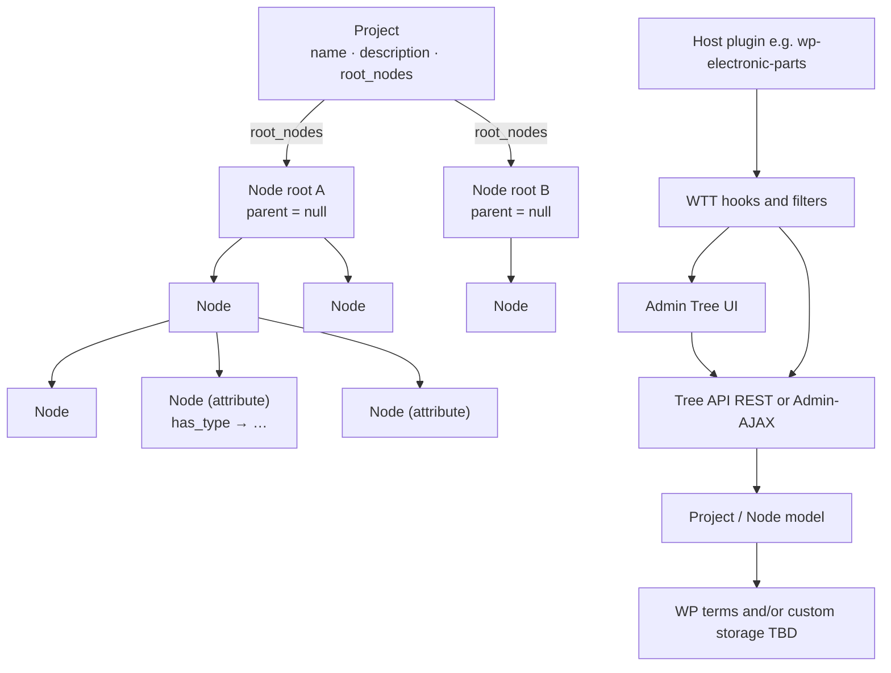
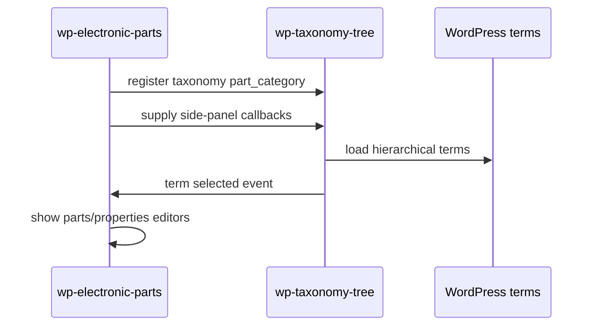

# Architecture

> Living technical documentation. Keep this aligned with [`docs/plans/project-plan.md`](plans/project-plan.md).

**Status:** Target architecture — **planning only** (implementation not started)

## Planning note

This document describes the **intended** shape of the plugin. File layout and APIs below are proposals to refine during planning. Do not treat them as implemented.

## High-level shape



## Principles

- **Taxonomy-agnostic:** core code never hard-codes a single taxonomy slug.
- **WordPress-first:** prefer `WP_Term_Query`, term APIs, and capabilities over custom tables.
- **Thin UI over clear model:** nesting, ancestors, and delete policies live in PHP services, not only in JavaScript.
- **Secure by default:** capability checks, nonces/permission callbacks, sanitized input, escaped output.
- **Extensible:** host plugins register participation and UI additions through hooks.

## Layers (not classic MVC)

WordPress has **no classic MVC controller**. Prefer **DTO + Domain Service + Repository (+ WP adapter)**.

```text
Admin UI / REST / Admin-AJAX          ← thin adapters (caps, nonces, i18n)
        ↓
Domain Services                       ← Tree_Service, Relation_Service / TypeBinding_Service, Project_Service
        ↓
DTOs / value objects                  ← Project, Node, Relation, RelationType, Changelog, Change, …
        ↓
Repositories (DAO)                    ← Project_Repository, Node_Repository, Relation_Repository
        ↓
WordPress storage                     ← terms / meta / $wpdb (TBD Q19)
```

| Layer | Responsibility | Examples |
|-------|----------------|----------|
| **DTO / value** | Data + local pure helpers | `Project`, `Node`, `Parameter`, `Relation`, `RelationType`, `NodeConfig`, `CompositionFooter`, `FooterCell`, `ParameterValue`, `CompositionRow`, `QuantityReading` |
| **Domain service** | Invariants & workflows (no WP I/O) | tree walk/move/delete policy; `bindType` / `bindRefScope` / `assertTypeBindingsComplete`; `copyFromTemplate` |
| **Repository (DAO)** | Load/save/map | `*_Repository` — only place that talks to WP storage |
| **WP adapter** | Hooks, Admin, REST | `class-plugin.php`, screens, REST routes; host filters = extension surface |

**Not used as architecture terms here:** classic MVC `Controller`/`Model`/`View`, generic “Service Provider” (DI). Hooks/filters are the WordPress **extension** surface, not a container Provider pattern.

**RelationType invariants:** static contract on the type object (`key`, `label`, display flags); **application** to the graph (e.g. `subtree` requires `ref_scope`) in a domain service.

**Class diagram note:** methods shown on DTOs in [`data-structure.md`](plans/data-structure.md) are a **conceptual API wish-list**. Graph queries, mutations, and binding checks belong on **services/repos** at implementation time (Q20) — do not ship fat entities.

## PHP representation (**Q20 decided**)

Prefer **typed PHP classes (DTOs)** for `Project`, `Node`, **`Parameter`**, `Changelog`, `Change`, `ParameterValue`, ….  
**Decided (Q64 / Q33 revised):** **Parameter class** — `name` (user text) + `type` (Node under Typ-Ast); every Node may own Parameters.  
Exploring **Relation** + **RelationType** for typed edges (Q35, Q41–Q43).  
RelationType leaning: one **`label`** only; no `inverse` field.  
Optional **`directed`** (Q44, unsure): graph chrome arrow vs line — separate from `DisplayHint` (structural role).  
Quantity spin (Q45): value may sit on Relation; **Präfix+Basiseinheit form a unit group**.  
Unit/prefix (**Q51 decided**): Basiseinheit ─[allows_prefix]→ Präfix; Präfix ─[multiplikator]→ int (`props.value`); UI derives Ohm/kOhm/…; Node has **description**.  
Schema-as-Nodes spin (Q46): **BOM / Recipe / builds** configurable as Node templates — hard `BomList` classes optional views only.
Display leaning: part-of nodes as attributes of parent; inheritable along is_a.  
`Project` stores required **Definitionsbaum** anchors. `Node.template` marks template trees.  
Domain branches (e.g. **Bauteile**) hang under `definition_root` — not separate catalog roots.  
Attribute Nodes bind `type` (and optional prefix / base_unit) via config and/or Relations.  
Filled **quantity** (*Größe*, not Messung) composes as **value + prefix + unit** (e.g. `10 mm`); composite over `int`/`double`.  
**Type catalog (Q36/Q52 decided):** template holds simples + **quantity** + **Collection** (`list` / `table` / `enum` — enum created like list).  
**Bauteil vs Composition:** Bauteil = Katalogteil (Widerstand, GPU). **Composition** = Zusammenstellung (columns+rows); Bauteile only via column type **`subtree`** + `ref_scope` (UX label e.g. „Bauteil Wahl“ / Bauteil-Ref). Instance: ParameterValues on Bauteil; CompositionRow cells on Composition. Naming Zusammenstellung/Composition decided.  
**Types = Nodes under `type_node` (Typ-Ast)** — no `TypeKind` class.  
**Q64:** `Parameter { name, type }` on any Node; `type` ∈ Typ-Ast.  
**Q26:** type Nodes only under `type_node`.  
**Q59:** `Project.start_node` from Setup.  
**Q63:** Tree = definition (Parameter defs); WP page = instance (ParameterValues / rows).  
**Q61:** Tree structure **`BOM`**; Parameter **Projektname** on Collection (inherited); title from instance.  
**BOM (Q57/Q58/Q60/Q62):** columns = Parameters; Fußzeile; Menge = Stück; allowlists; block fills Parameters + rows.  
**Q50 leaning:** copy template Project into new Projects.  
**Template vs demo:** Template read-only; demo editable.  
**Q34/Q49 proposal:** simples `capabilities.originate_relations = false`.  
See Q16, Q20–Q39, Q49–Q51, Q55–Q64 and [`docs/plans/data-structure.md`](plans/data-structure.md).

Current class diagram lives in [`docs/plans/data-structure.md`](plans/data-structure.md) and must be refreshed on every structure change.

## Versioning

- Plugin version always starts at **`0.0.1`** when coding begins.
- The first digit (`MAJOR`) changes **only on official releases** (for example `1.0.0`, then later `2.0.0`).
- While `MAJOR` is `0`, development may bump `MINOR` / `PATCH` as needed.
- Keep plugin header, PHP version constant, and any package metadata aligned.
- Details: [`.cursor/rules/versioning.mdc`](../.cursor/rules/versioning.mdc).

## Proposed module layout (not created yet)

```text
wp-taxonomy-tree/
  wp-taxonomy-tree.php          # bootstrap
  includes/
    class-plugin.php            # wires hooks
    class-tree-model.php        # nest / walk / descendants
    class-tree-admin.php        # admin page + assets
    class-tree-rest.php         # or class-tree-ajax.php
    class-capabilities.php      # capability helpers
  assets/
    css/
    js/
  docs/
```

Exact file names may adjust before implementation; update this document when decisions change.

## Data model

Core stored objects: **Project** and **Node**. A **tree is not a stored object** — it is defined by a **root node**. See [`docs/plans/data-structure.md`](plans/data-structure.md).

### Project (conceptual)

| Field | Required | Meaning |
|-------|----------|---------|
| `id` | yes | Stable project identity |
| `name` | yes | Display name |
| `description` | yes | Project description (may be empty) |
| `taxonomy` | ? | **Strong leaning (Q18):** Project ≈ taxonomy; slug / identity on Project |
| `root_nodes` | yes | All root nodes |
| `definition_root` | yes | Required Definition tree root |
| `type_node` | yes | Required Type anchor — only branch for type resolution (**Q26**) |
| `prefix_node` | yes | Required Präfix anchor |
| `base_unit_node` | yes | Required Basiseinheit anchor |
| `start_node` | yes | Default UI focus from **Setup** (**Q59**) |
| `changelog` | yes | Changelog of Change entries |

Default Nodes (anchors + fixed simples): **generate on create** **or** **copy from a template Project** — open **Q50**.

### Node (conceptual)

| Field | Required | Meaning |
|-------|----------|---------|
| `id` | yes | Stable node identity |
| `parent_id` | yes (`null` = root) | Catalog/taxonomy parent (**Q54 lean:** categorize Bestandteile + inheritance path). Not Collection schema; not Relation-edge cache. |
| `name` | yes | Display name |
| `template` | yes | `true` = template tree marker |
| `config` | ? | Slot: `required` / `footer_op` / capabilities (Q34); Composition: `allowed_types`, `allowed_base_units`, `footer` (Q57/Q60) |
| `project_id` | ? | Optional reverse link |
| `changelog` | yes | Changelog of Change entries |

Root node = the **same Node object** with `parent_id = null`. That root **defines a tree**.  
Template trees use `template = true`. Persistence: Q19.  
**Taxonomy:** **Project ≈ taxonomy** (strong leaning Q18) — Node has **no** `taxonomy` field.  
**Defaults:** seed via generate **or** template-Project copy (**Q50**). Persistence: Q19.

### Parameter (Q64 — class reintroduced)

**Parameter** is a class again (revises Q33). Every **Node** may own Parameters. A Parameter is **not** a tree Node.

| Field | Required | Meaning |
|-------|----------|---------|
| `name` | **yes** | User text when assigning the Parameter to a Node |
| `type` | **yes** | **Node** under `project.type_node` (Typ-Ast only) |
| `prefix` | optional | Node under `project.prefix_node` (when type needs it) |
| `base_unit` | optional | Node under `project.base_unit_node` |
| filled value | **?** | **ParameterValue** (e.g. quantity reading); storage Q16 |

**Agreed:** Parameter class with `name` + `type`; fixed simple types per project.  
**Open (Q49):** may simples originate Relations — special kind vs config disable.

### Changelog / Change (shared)

| Class | Fields | Meaning |
|-------|--------|---------|
| `Changelog` | `changes: Change[]` | History container on each auditable object |
| `Change` | `timestamp`, `changer`, `change`, `version` | When, who, what, version (details Q21–Q23) |

Applied to **Project** and **Node** via composition (`changelog` field).

### Parameter type and unit composition

| Field | Source | Example |
|-------|--------|---------|
| `type` | under Project.`type_node` | `quantity`, `text` |
| `prefix` | under Project.`prefix_node` | `k`, `m` |
| `base_unit` | under Project.`base_unit_node` | `Ohm`, `Meter` |
| `value` | ParameterValue / filled reading (Q16) | `10` |

**Quantity reading (agreed):** `value` + `prefix` + `base_unit` → e.g. `10` + `m` + `Meter` = `10 mm`.  
`quantity` is **composite** (uses `number` or `integer`), not a rival scalar.  
Dimension group **Maße**: `10 mm × 5 mm × 2 mm` (Länge / Breite / Höhe) under the **Definitionsbaum**.

Project always has Definitionsbaum anchors. Nodes may be **templates** via `Node.template`.

Details: Q24–Q39 in [`docs/OPEN-QUESTIONS.md`](OPEN-QUESTIONS.md).

### Trees (derived)

| Concept | Meaning |
|---------|---------|
| Tree | **Not an object** — defined by a root node (same Node with parent null) + descendants |
| RootNode | **Not an object** — role of Node when parent is null |
| Project trees | A project may include several such root-defined trees |
| Parent link | One node can have one parent node (or none) |
| Children | One node can have several child nodes (or none) |
| Parameters | **Parameter class (Q64)** — `name` + `type` on any Node |
| Parameter inheritance | Along `parent_id`; instances fill ParameterValue |
| Simple types & Relations | Typically no originating Relations — special kind vs config (**Q49**) |
| Typed edges | Exploratory Relation + RelationType (`consists_of`↔`is_part_of`, …) — Q35/Q41 |
| Relation display | part-of → attributes of parent; inherit along is_a — Q42/Q43 |

Nested `children` is only a view over parent links. Cycles and multi-parent links are forbidden.

### Storage (leaning)

- **Nodes:** likely WordPress terms (Q11) or custom — undecided.
- **Parameters:** TBD (Q15).
- **Projects:** TBD (Q19).

If custom tables appear, follow repository relational-database rules.

## Tree model responsibilities (planned)

- Treat trees as root nodes + descendants (no Tree entity).
- Load nodes for a project (possibly multiple roots / trees).
- Build nested views from parent links efficiently (avoid N+1).
- Resolve ancestors and descendants.
- Support delete strategies:
  - **promote:** reparent children to the deleted node’s parent (or make them roots)
  - **cascade:** delete the node and its descendants
- Model Parameter definitions on nodes (one node → several parameters) once types/storage are settled.

## Admin UI responsibilities (planned)

- Render a left-hand tree (or equivalent tree-first layout).
- Emit selection events for extension panes.
- Provide create-root / create-child / delete flows.
- Remain usable for large-but-reasonable term sets; document limits until Phase 3 performance work.

## Extension points (planned names TBD)

| Hook / filter (names TBD) | Purpose |
|---------------------------|---------|
| Filter: registered taxonomies | Which hierarchical taxonomies use the tree environment |
| Action: enqueue host assets | Let hosts add scripts on the tree screen |
| Action/filter: selected term panel | Render host UI when a term is selected |
| Filter: delete strategies | Customize available delete behaviors |

Finalize concrete hook names during planning / Phase 2 design and list them here before implementation relies on them.

## Security boundaries (planned)

- Managing terms requires the taxonomy’s `manage_terms` (or equivalent) capability.
- Mutations go through authorized endpoints only.
- Any direct SQL uses `$wpdb->prepare()`.
- All user-facing strings are translatable (`wp-taxonomy-tree` text domain).

## Integration sketch: electronic parts (future)



## Open technical choices

Tracked in [`docs/OPEN-QUESTIONS.md`](OPEN-QUESTIONS.md). Summary:

| Topic | Options | Current leaning |
|-------|---------|-----------------|
| Transport | REST API vs Admin-AJAX | REST if straightforward; Admin-AJAX acceptable for MVP admin UI |
| JS stack | Vanilla JS vs `@wordpress/scripts` | Vanilla for MVP tree; upgrade if UI complexity grows |
| Packaging | Single plugin only vs Composer library + plugin | Single plugin first |

Record final choices in the plan decision log and update this section when questions close.
