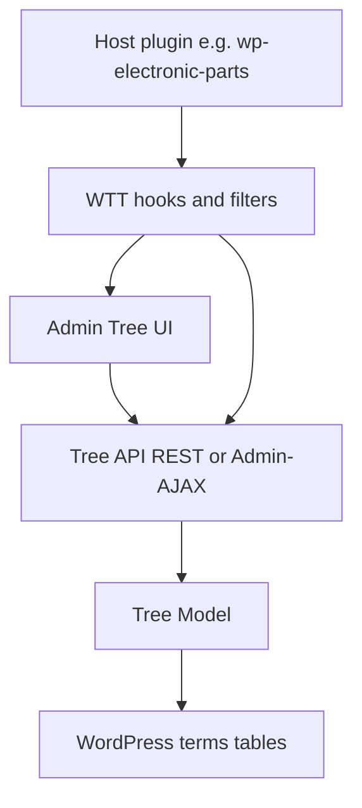
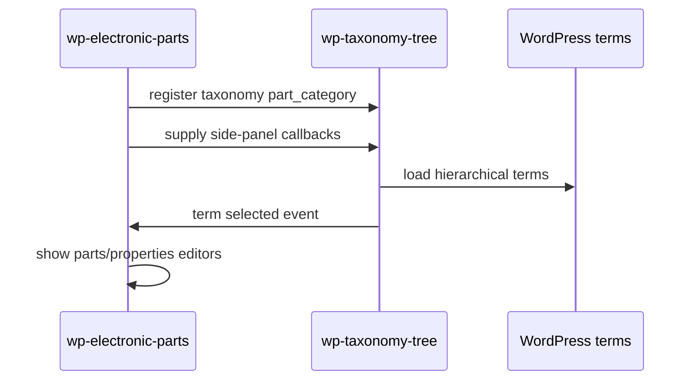

# Architecture

> Living technical documentation. Keep this aligned with [`docs/plans/project-plan.md`](plans/project-plan.md).

**Status:** Target architecture for MVP (implementation pending)

## High-level shape



## Principles

- **Taxonomy-agnostic:** core code never hard-codes a single taxonomy slug.
- **WordPress-first:** prefer `WP_Term_Query`, term APIs, and capabilities over custom tables.
- **Thin UI over clear model:** nesting, ancestors, and delete policies live in PHP services, not only in JavaScript.
- **Secure by default:** capability checks, nonces/permission callbacks, sanitized input, escaped output.
- **Extensible:** host plugins register participation and UI additions through hooks.

## Versioning

- Plugin version always starts at **`0.0.1`**.
- The first digit (`MAJOR`) changes **only on official releases** (for example `1.0.0`, then later `2.0.0`).
- While `MAJOR` is `0`, development may bump `MINOR` / `PATCH` as needed.
- Keep plugin header, PHP version constant, and any package metadata aligned.
- Details: [`.cursor/rules/versioning.mdc`](../.cursor/rules/versioning.mdc).

## Proposed module layout

```text
wp-taxonomy-tree/
  wp-taxonomy-tree.php          # bootstrap
  includes/
    class-plugin.php            # wires hooks
    class-tree-model.php        # nest / walk / descendants
    class-tree-admin.php        # admin page + assets
    class-tree-rest.php         # or class-tree-ajax.php
    class-capabilities.php      # capability helpers
  assets/
    css/
    js/
  docs/
```

Exact file names may adjust during implementation; update this document when they do.

## Data model

MVP uses native WordPress taxonomy tables:

- `wp_terms`
- `wp_term_taxonomy` (`parent`, `count`, `taxonomy`)
- `wp_termmeta` only if a later phase needs plugin-owned meta

No custom relational tables are required for the MVP tree. If custom tables appear later, they must follow the repository relational-database rules (keys, prepared SQL, migrations).

## Tree model responsibilities

- Load terms for one or more taxonomies.
- Build nested arrays / adjacency structures efficiently (avoid N+1).
- Resolve ancestors and descendants.
- Support delete strategies:
  - **promote:** reparent children to the deleted node’s parent
  - **cascade:** delete the node and its descendants

## Admin UI responsibilities

- Render a left-hand tree (or equivalent tree-first layout).
- Emit selection events for extension panes.
- Provide create-root / create-child / delete flows.
- Remain usable for large-but-reasonable term sets; document limits until Phase 3 performance work.

## Extension points (planned)

| Hook / filter (names TBD) | Purpose |
|---------------------------|---------|
| Filter: registered taxonomies | Which hierarchical taxonomies use the tree environment |
| Action: enqueue host assets | Let hosts add scripts on the tree screen |
| Action/filter: selected term panel | Render host UI when a term is selected |
| Filter: delete strategies | Customize available delete behaviors |

Finalize concrete hook names during Phase 2 and list them here.

## Security boundaries

- Managing terms requires the taxonomy’s `manage_terms` (or equivalent) capability.
- Mutations go through authorized endpoints only.
- Any direct SQL uses `$wpdb->prepare()`.
- All user-facing strings are translatable (`wp-taxonomy-tree` text domain).

## Integration sketch: electronic parts



## Open technical choices

| Topic | Options | Current leaning |
|-------|---------|-----------------|
| Transport | REST API vs Admin-AJAX | REST if straightforward; Admin-AJAX acceptable for MVP admin UI |
| JS stack | Vanilla JS vs `@wordpress/scripts` | Vanilla for MVP tree; upgrade if UI complexity grows |
| Packaging | Single plugin only vs Composer library + plugin | Single plugin first |

Record the final choice in the plan decision log and update this section.
