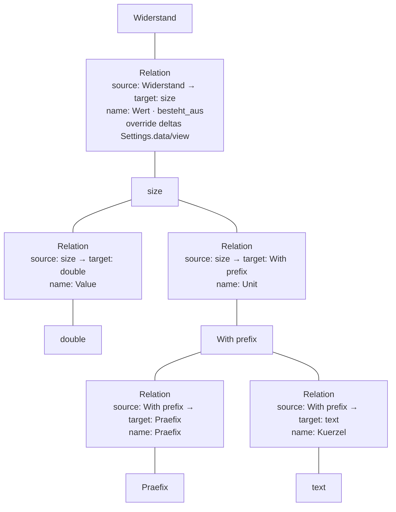
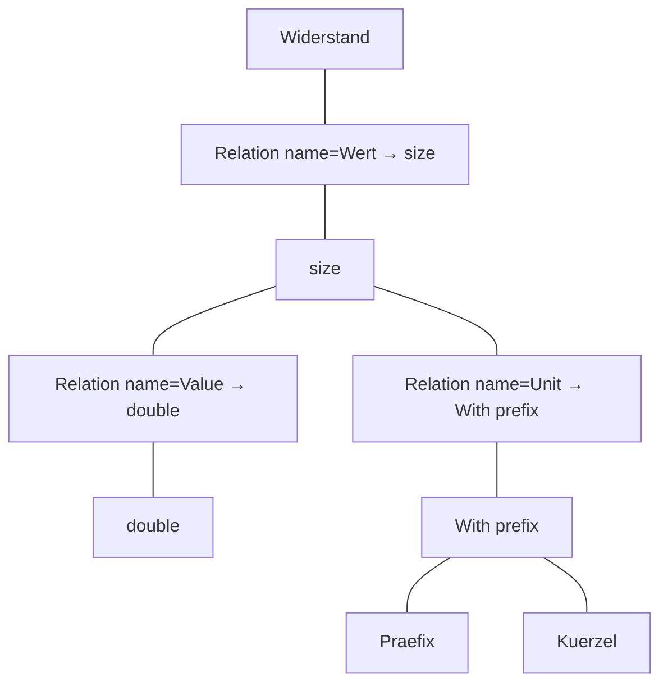
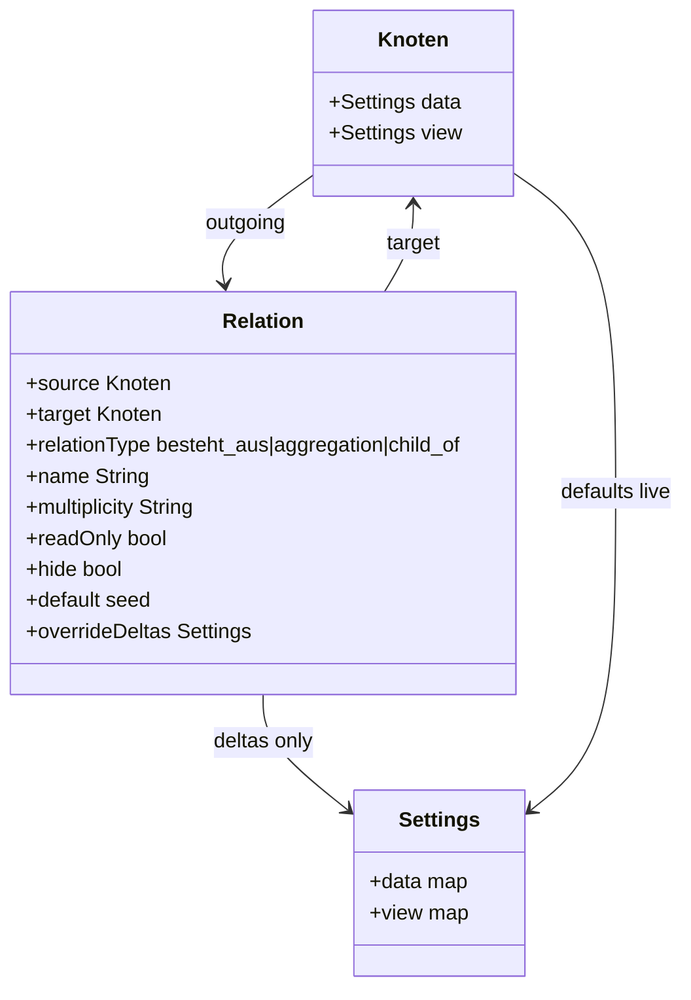

# Developer guide — Attribute / Relation / Settings model

**Audience:** developers (scaffold migrate + future product). Diagrams here are also suitable to adapt later into **user documentation**.

**Status:** Agreed planning model (**2026-08-09**). Scaffold still uses attribute **slot terms** + `_wtt_type_id` / Preferred term meta — **debt** toward this model. Decisions: [`q123-doc-pass-questions.md`](plans/q123-doc-pass-questions.md) (OQ-W1…W16). Whiteboard history: [`relation-vs-object-concept.md`](plans/relation-vs-object-concept.md).

---

## Locked summary

| Topic | Decision |
|-------|----------|
| Attribute | **`besteht_aus` / `aggregation` Relation only** — no slot term |
| Relation fields | `name`, target, Bindung, Mult, RO, Hide/BO, Default seed |
| Type | **Relation target** (no `attribute_typeof`) |
| Settings | **`Settings.data`** + **`Settings.view`** on node; Relation stores **override deltas only** |
| Resolve | **Hybrid** — live from target tree; local delta wins if key present |
| UI | Same **recursive walk** for node detail and attribute Settings (to leaf; break cycles) |
| Write | Override on **current** context only — do not push defaults into subnodes |
| Inherit | Along host `child_of` (Q66); hide inherited; merge by name |
| Instance keys | **Relation id** |
| Delete host | Composition data/links **die with** host; aggregation **targets remain**, Relation removed (Q111) |
| UI panels | Relations = general; Attributes = **wizard** over comp/agg |
| RelationTypes | `child_of`, `besteht_aus`, `aggregation` only (product) |
| Deprecated | `node_ref`, `ref_scope`, `node_embed`, `node_pick`, product `composition` alias, `attribute_typeof` |
| Measure | `quantity` general; `size` = inheriting child with extra settings |
| `With prefix` | Father knot; **composed of** Praefix + Kuerzel Relations; then Settings |
| Presentation | Q117 texts/icon — **separate** from Settings.data/view |

```text
Settings
  data:  validators, allowlists, defaults, dateMode, compute, …
  view:  preferredRenderer, preferredConverter, …
Presentation (Q117): locale texts + icon
```

---

## Diagram — Widerstand / Wert → Unit (source → target)

Attribute **Unit** on `size` targets **`With prefix`** directly (no intermediate Unit node).

| Relation | source | target | name |
|----------|--------|--------|------|
| R1 | Widerstand | size | Wert |
| R2 | size | double | Value |
| R3 | size | With prefix | Unit |
| R4 | With prefix | Praefix | Praefix |
| R5 | With prefix | text | Kuerzel |



---

## Diagram — Settings / Render walk

Opening **node** `size` or attribute **Wert** = **same graph walk**. Settings UI collects `Settings.data` + `Settings.view`; paint uses the same edges and resolves **Preferred** from `Settings.view` (hybrid + deltas) then **Registry**.



```text
Settings(node|attr) = walk to leaves + live Settings + override deltas
Render(node)        = resolve Settings.view → Preferred → Registry.paint(node)
                      then for each attr Relation: Render(target)  (Mult>1 → collection box)
Cycle guard         = node already on path → stop
Surfaces            = same path admin preview ↔ block editor ↔ frontend (parity)
```

**Not the same as Q117 Presentation** (locale texts / icon) — that store is labels/chrome identity, not Preferred renderer selection.

---

## Class sketch — Relation



---

## Scaffold debt (do not implement in this doc)

- Remove / stop creating `_wtt_attribute_slot`; migrate values keys slot id → Relation id
- Fold `_wtt_preferred_*` / typeExtras into `Settings.data` / `Settings.view`
- Attribute Options UI → full walk surface
- Drop seeding / teaching `ref_scope` / `node_ref` as product

---

## For later user documentation

Reuse the **flowchart** (Widerstand → Wert → size → Unit) and the short tables above. Keep class diagrams and debt lists in **developer** docs.
