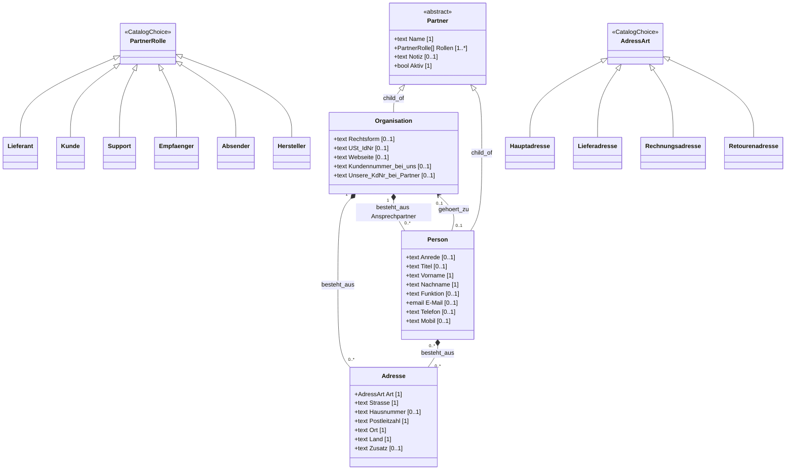
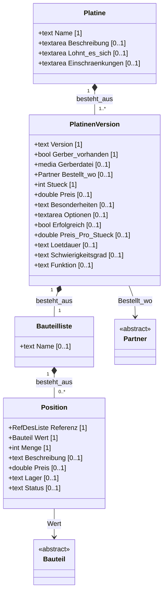

# Model catalog (Fallstudie / `wtt_fs`)

Snapshot of **Model/** attribute hosts and Bauteil kinds as seeded in the scaffold.

> **Update policy:** Agents refresh this file **only when the user explicitly asks**
> (e.g. “Model-Katalog aktualisieren”, “Modelle speichern”, “update model catalog”).
> Do **not** rewrite it on routine seed/ensure/UI work.

| Field | Value |
|-------|--------|
| Taxonomy | `wtt_fs` |
| Path | `Fallstudie/Model/…` |
| Last snapshot | 2026-08-07 |
| Plugin ≈ | `0.0.343` |

---

## Partner (planned — replace flat Kontakt)

> **Status:** Planning agreed 2026-08-07. **Not yet seeded** under `Fallstudie/Model`.  
> Adopt into the tree later: replace flat `Model/Kontakt` with this host family.  
> Until then, the scaffold still seeds **Kontakt** (see [Current scaffold: Kontakt](#current-scaffold-kontakt)).

B2B-style partner model for BOM / procurement / returns:

- One **Organisation** (e.g. Conrad, Reichelt) has many **Person** contacts.
- Roles are **multi-valued** (Lieferant *and* Kunde / Empfänger) — not `child_of` kinds.
- **Adresse** is a reusable composition host (billing / shipping / returns).

### Intended tree shape

```text
Model/
  Partner/                 ← abstract host (is_abstract)
    Organisation/          ← child_of Partner
    Person/                ← child_of Partner
  Adresse/                 ← schema host (composition target)
  PartnerRolle/            ← CatalogChoice (depth ≤ 1 → ListChooser)
    Lieferant | Kunde | Support | Empfänger | Absender | Hersteller
  AdressArt/               ← CatalogChoice
    Hauptadresse | Lieferadresse | Rechnungsadresse | Retourenadresse
```

### Class diagram



### Partner (abstract host)

| Attribute | Type | Mult. | Notes |
|-----------|------|-------|--------|
| Name | text | 1 | Display name (org or person label) |
| Rollen | PartnerRolle | 1..* | Multi-role; not hierarchy kinds |
| Notiz | text | 0..1 | Free note |
| Aktiv | bool | 1 | Soft disable |

### Organisation (`child_of` Partner)

| Attribute | Type | Mult. | Notes |
|-----------|------|-------|--------|
| Rechtsform | text | 0..1 | GmbH, SE, … |
| USt-IdNr | text | 0..1 | VAT id |
| Webseite | text | 0..1 | |
| Kundennummer bei uns | text | 0..1 | Our account number for this partner |
| Unsere KdNr bei Partner | text | 0..1 | Their customer number for us |
| Adresse | Adresse | 0..* | `besteht_aus` |
| Ansprechpartner | Person | 0..* | `besteht_aus` — people at this org |

### Person (`child_of` Partner)

| Attribute | Type | Mult. | Notes |
|-----------|------|-------|--------|
| Anrede | text | 0..1 | |
| Titel | text | 0..1 | Dr., … |
| Vorname | text | 1 | |
| Nachname | text | 1 | |
| Funktion | text | 0..1 | Job role at org / context |
| E-Mail | email | 0..1 | |
| Telefon | text | 0..1 | |
| Mobil | text | 0..1 | |
| gehört zu | Organisation | 0..1 | Optional; private customer has none |
| Adresse | Adresse | 0..* | `besteht_aus` when person has own address |

### Adresse

| Attribute | Type | Mult. | Notes |
|-----------|------|-------|--------|
| Art | AdressArt | 1 | CatalogChoice |
| Strasse | text | 1 | |
| Hausnummer | text | 0..1 | |
| Postleitzahl | text | 1 | |
| Ort | text | 1 | |
| Land | text | 1 | |
| Zusatz | text | 0..1 | c/o, floor, … |

### PartnerRolle (CatalogChoice)

Lieferant, Kunde, Support, Empfänger, Absender, Hersteller.

### AdressArt (CatalogChoice)

Hauptadresse, Lieferadresse, Rechnungsadresse, Retourenadresse.

### Migration notes (when adopting into tree)

| Current scaffold | Planned |
|------------------|---------|
| `Model/Kontakt` (flat person+address) | `Model/Partner` + `Organisation` / `Person` + `Adresse` |
| Platine **Bestellt wo** → Kontakt | → Partner (prefer Organisation / Lieferant) |
| Relais attribute named Kontakt (text) | Unrelated — keep as text slot on Relais |

Open decisions before seed: Person without Organisation (yes for private customers); whether `Bestellt wo` binds `Partner` or only `Organisation`.

---

## Platine + Bauteilliste (planned)

> **Status:** Planning in progress 2026-08-07. **Not yet seeded** in this shape.  
> Live scaffold still has a flat `Model/Platine` and `Model/Bauteilliste/Position` (see [Current scaffold](#current-scaffold-platine--bauteilliste)).

### Intended tree shape

```text
Model/
  Platine/                      ← board project
    → PlatinenVersion [1..*]    ← besteht_aus (Rev A, v1.1, …)
      → Bauteilliste [1]        ← besteht_aus — always owned by that version
        → Position [0..*]       ← besteht_aus BOM lines
  Bauteil/                      ← catalog (unchanged kinds) — Position.Wert picks here
  Partner/                      ← PlatinenVersion.Bestellt_wo
```

**Invariants**

- A Platine has **one or more** versions.
- Every version has **exactly one** Bauteilliste (may have 0 positions).
- No Bauteilliste without a PlatinenVersion.
- **Protokoll** is out (not modeled).

### Class diagram



### Platine

| Attribute | Type | Mult. | Notes |
|-----------|------|-------|--------|
| Name | text | 1 | Board project title |
| Beschreibung | textarea | 0..1 | Optional overview |
| Lohnt es sich | textarea | 0..1 | Cross-version review |
| Einschränkungen | textarea | 0..1 | Cross-version notes |
| Versionen | PlatinenVersion | 1..* | `besteht_aus` |

### PlatinenVersion

| Attribute | Type | Mult. | Notes |
|-----------|------|-------|--------|
| Version | text | 1 | e.g. Rev A, v1.1 |
| Gerber vorhanden | bool | 1 | |
| Gerberdatei | media | 0..1 | |
| Bestellt wo | Partner | 0..1 | Fab / vendor |
| Stück | int | 1 | Order qty for this revision |
| Preis | double | 0..1 | |
| Besonderheiten | text | 0..1 | |
| Optionen | textarea | 0..1 | |
| Erfolgreich | bool | 0..1 | Build review |
| Preis Pro Stück | double | 0..1 | |
| Lötdauer | text | 0..1 | |
| Schwierigkeitsgrad | text | 0..1 | |
| Funktion | text | 0..1 | |
| Bauteilliste | Bauteilliste | 1 | `besteht_aus` — always |

### Bauteilliste

| Attribute | Type | Mult. | Notes |
|-----------|------|-------|--------|
| Name | text | 0..1 | Optional list label |
| Positionen | Position | 0..* | `besteht_aus` |

### Position

| Attribute | Type | Mult. | Notes |
|-----------|------|-------|--------|
| Referenz | RefDesListe | 1 | Board placements — see below |
| Wert | Bauteil | 1 | Catalog pick (`Model/Bauteil`) |
| Menge | int | 1 | Stück; should match expanded RefDes count |
| Beschreibung | text | 0..1 | |
| Preis | double | 0..1 | |
| Lager | text | 0..1 | |
| Status | text | 0..1 | e.g. bestellt / da / DNI |

### Design requirement — Referenz (RefDes)

**UX (preferred input):** compact board notation the user already uses:

- Single: `R1`
- List: `R1, R4, R6`
- Range: `R1-R5`
- Mixed: `R1-R5, R8` / `C1, C3-C6, C10`

**Storage (canonical):** expand to an ordered list of **positions** (individual RefDes strings), e.g. `R1-R5, R8` → `["R1","R2","R3","R4","R5","R8"]`.

| Layer | Shape | Job |
|-------|-------|-----|
| Input / display | compact string | Authoring comfort |
| Stored value | `string[]` positions | Query, validate, interactive BOM |
| Menge | `int` | = `len(positions)` (derive or check — Q58) |

**Why expand:** enables an **interactive BOM** — when the user selects a catalog Bauteil (or a Position line), highlight the corresponding placements on the board (by RefDes). Compact form alone is awkward for hit-testing and uniqueness checks.

**Rules (planning)**

- Token: letter prefix + integer (`R1`, `C12`, `U3`); range keeps same prefix, start ≤ end.
- Separators: comma; whitespace ignored.
- Within one **PlatinenVersion**, each expanded RefDes is unique across all positions.
- Type ownership / converter+validators follow **Q47** (same pattern as `int`: input form ≠ canonical store).

### Design note — scaling (same idea as Rezept)

Stored line quantities are for **one** board (one PlatinenVersion Bauteilliste).  
**Umrechnen auf mehrere Platinen:** multiply each Position.Menge by board count *N*.

| Domain | Base | Scale factor | Result |
|--------|------|--------------|--------|
| Bauteilliste / BOM | Mengen for **1** Platine | *N* Platinen | Einkauf / Bestellung × *N* |
| Rezept / Zutatenliste | Mengen for base **Portionen** | *P* Personen / Portionen | Zutaten × (*P* / base) |

Same pattern, different unit of “copies”: boards vs portions. Scaling UI/host — not a separate stored list per *N*.

### Design note — nested composition (Gerät / Menü)

A higher-level composition may **bundle several** lower compositions — not only catalog leaves.

| Domain | Leaf line | Bundle (nested compositions) |
|--------|-----------|------------------------------|
| Electronics | Position.Wert → **Bauteil** | **Gerät** / Zusammenstellung → mehrere **Platinen** (+ ggf. Bauteile) |
| Kitchen | Zutatenzeile.Wert → **Zutat** | **Menü** → mehrere **Rezepte** (Vorspeise, Haupt, Dessert, …) |

Examples:

- Gerät besteht aus Platine A + Platine B (+ Gehäuse-Bauteile …).
- Menü besteht aus Suppe-Rezept + Hauptgericht-Rezept + Dessert-Rezept.

Planning shape (same spine):

```text
Gerät / Zusammenstellung
  → Zeile: Wert = Platine | Bauteil, Menge = int

Menü
  → Zeile: Wert = Rezept, Portionen/Faktor = …
```

Optional later: a Rezept may still reference another Rezept as Unterrezept (Sauce/Teig) — separate from **Menü**, which is the clear parallel to Gerät.

Rules (leaning):

- Nested target is a **composition host** (Platine / Rezept), not a flattened copy of its list at edit time.
- Scaling still applies: *N* devices → each nested Platine’s Bauteilliste; Menü for *P* Personen → each Rezept scaled (host may expand for shopping list).
- Avoid cycles: A must not nest A (directly or indirectly).

### Design note — order / shopping list (Lieferant ↔ REWE)

After scaling (and expanding nested Gerät/Menü), the flattened line list feeds **procurement**:

| Domain | Action | Partner / channel |
|--------|--------|-------------------|
| Bauteilliste / BOM | Bestellung beim **Lieferant** aufgeben | Partner (Rolle Lieferant), z. B. Conrad, Reichelt |
| Rezept / Menü | **Einkaufsliste** erstellen bzw. Lieferung bestellen | Partner (Rolle Lieferant/Kunde-Kanal), z. B. REWE |

Same pipeline: composition → scale → aggregate lines → send/order.  
UI and checkout = host; Partner model supplies who/where.

### Migration notes (when adopting into tree)

| Current scaffold | Planned |
|------------------|---------|
| Flat `Platine.Version` text | `PlatinenVersion` composition [1..*] |
| `Platine` owns order/build fields | Move to `PlatinenVersion` |
| `Platine.Protokoll` | **Dropped** |
| `Bauteilliste` sibling under Model | Owned by `PlatinenVersion` (`besteht_aus` [1]) |
| `Position.Wert` text + optional `Bauteil` | Single **Wert → Bauteil** (catalog) |
| `Position.Referenz` free text | RefDesListe: compact UX → expanded positions |
| `Bestellt wo` → Kontakt | → Partner |

---

## Current scaffold: Kontakt

> Live seed today (`ensure_kontakt_model`). Superseded by [Partner (planned)](#partner-planned--replace-flat-kontakt) when adopted.

Person + address (also used as type for Platine **Bestellt wo**).

| Attribute | Type | Mult. |
|-----------|------|-------|
| Titel | text | 1 |
| Name | text | 1 |
| Vorname | text | 1 |
| E-Mail | email | 1 |
| Telefon | text | 1 |
| Strasse | text | 1 |
| Hausnummer | text | 1 |
| Postleitzahl | text | 1 |
| Ort | text | 1 |

---

## Current scaffold: Platine / Bauteilliste

> Live seed today (`ensure_platine_model`, `ensure_bauteilliste_model`). Superseded by [Platine + Bauteilliste (planned)](#platine--bauteilliste-planned) when adopted.

### Platine (flat)

PCB / board — mirrors Retro Projekt post tables (Fakten, Optionen, Aufbau, Protokoll).

| Attribute | Type | Mult. | Notes |
|-----------|------|-------|--------|
| Name | text | 1 | Board title |
| Version | text | 0..1 | e.g. Meine Version — **planned:** own object |
| Gerber vorhanden | bool | 1 | |
| Gerberdatei | media | 1 | |
| Bestellt wo | Kontakt | 1 | Fab / vendor — **planned:** Partner |
| Stück | int | 1 | Order qty |
| Preis | double | 1 | Order total (aliases: Preis inclusive, …) |
| Besonderheiten | text | 1 | Lead-free, color, … |
| Optionen | textarea | 0..1 | Variants table |
| Erfolgreich | bool | 1 | Build review |
| Preis Pro Stück | double | 1 | |
| Lötdauer | text | 1 | |
| Schwierigkeitsgrad | text | 1 | alias: Schwierigkeitsfaktor |
| Funktion | text | 1 | Schlecht / OK / Gut / Klasse |
| Lohnt es sich | textarea | 1 | |
| Einschränkungen | textarea | 1 | |
| Protokoll | textarea | 0..1 | **Planned: drop** |

### Bauteilliste → Position

| Attribute | Type | Mult. | Notes |
|-----------|------|-------|--------|
| Referenz | text | 1 | **Planned:** RefDesListe |
| Wert | text | 1 | **Planned:** Bauteil catalog |
| Menge | int | 1 | |
| Beschreibung | text | 0..1 | |
| Preis | double | 0..1 | |
| Lager | text | 0..1 | |
| Status | text | 0..1 | |
| Bauteil | Bauteil | 0..1 | **Planned:** merge into Wert |

---

## Bauteil

Kind host under `Model/Bauteil`. Groups = inheritance folders (Q88). MPN records live under Implementation/Bauteile when that branch exists (Q83).

### Passiv

#### Widerstand

| Attribute | Type |
|-----------|------|
| Wert | double |
| Praefix | Präfixe |
| Einheit | Basiseinheiten |
| Bauform | text |
| Toleranz | text |
| Nennleistung | text |
| Datenblatt | media |

#### Kondensator

| Attribute | Type |
|-----------|------|
| Wert | double |
| Praefix | Präfixe |
| Einheit | Basiseinheiten |
| Nennspannung | text |
| Dielektrikum | text |
| Bauform | text |
| Datenblatt | media |

#### Spule

| Attribute | Type |
|-----------|------|
| Wert | double |
| Praefix | Präfixe |
| Einheit | Basiseinheiten |
| Nennstrom | text |
| Bauform | text |
| Datenblatt | media |

### Halbleiter

#### Dioden

CatalogChoice Arten (no extra slots on the kind host):

- Schalt, Schottky, Zener, Gleichrichter, TVS, LDD

#### Transistor

| Attribute | Type |
|-----------|------|
| Transistortyp | text |
| U_max | text |
| I_max | text |
| Bauform | text |
| Datenblatt | media |

#### LED

| Attribute | Type |
|-----------|------|
| Farbe | text |
| U_f | text |
| I_f | text |
| Bauform | text |
| Datenblatt | media |

#### IC

| Attribute | Type |
|-----------|------|
| Funktion | text |
| Gehaeuse | text |
| Versorgung | text |
| Datenblatt | media |

### Elektromechanik

#### Relais

| Attribute | Type |
|-----------|------|
| Spulenspannung | text |
| Kontakt | text |
| Bauform | text |
| Datenblatt | media |

#### Steckverbinder

| Attribute | Type |
|-----------|------|
| Steckertyp | text |
| Polzahl | int |
| Bauform | text |
| Datenblatt | media |

#### Schalter

| Attribute | Type |
|-----------|------|
| Schaltertyp | text |
| Pole | text |
| Bauform | text |
| Datenblatt | media |

### Sonstige

#### Quarz

| Attribute | Type |
|-----------|------|
| Wert | double |
| Praefix | Präfixe |
| Einheit | Basiseinheiten |
| Lastkapazitaet | text |
| Bauform | text |
| Datenblatt | media |

#### Sicherung

| Attribute | Type |
|-----------|------|
| Nennstrom | text |
| Charakteristik | text |
| Nennspannung | text |
| Bauform | text |
| Datenblatt | media |

---

## Rezept (thought experiment — same composition spine)

Mirror of Platine/BOM (not seeded): Rezept → RezeptVersion[1..*] → Zutatenliste[1] → Zutatenzeile*; Wert → Zutat catalog; Menge = `quantity`.

**Scaling (recorded):** Umrechnen Rezept auf mehrere Personen — same idea as Bauteilliste × mehrere Platinen (see [scaling note](#design-note--scaling-same-idea-as-rezept)).

**Nested (recorded):** **Menü** = mehrere Rezepte — same idea as **Gerät** = mehrere Platinen (see [nested composition](#design-note--nested-composition-gerät--menü)).

---

## How to refresh

User phrase examples (German or English):

- „Model-Katalog aktualisieren“
- „Modelle speichern“
- „update model catalog“

Then: re-read live `Fallstudie/Model` (Attribute::list_own + Bauteil groups/kinds) and replace the **seeded** snapshot tables above; bump **Last snapshot** / plugin version note.

Do **not** drop planned sections on a routine refresh — only change them when the user revises the plan or asks to adopt into the tree seed:

- [Partner (planned)](#partner-planned--replace-flat-kontakt)
- [Platine + Bauteilliste (planned)](#platine--bauteilliste-planned)
- [Rezept (thought experiment)](#rezept-thought-experiment--same-composition-spine) / scaling note
