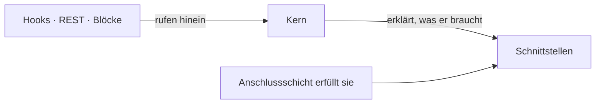

# Vision and scope

> **Status: `draft`.** Contains the owner's spoken statement of 2026-08-22, written down but
> **not yet confirmed**. Nothing here is `agreed` until the owner has checked the wording —
> in particular the points marked ⚠️. Do not implement from this file.

## Product statement

**A taxonomy modeller.** It lets a user build **data models** — and it models them the way
the world is shaped, as **objects and their relationships**, not as relational tables.

The user builds a model by building a **tree**.

## Core shape — as stated by the owner (2026-08-22)

Numbered so later documents and decisions can cite them.

| # | Statement |
|---|---|
| **V1** | The model consists of **nodes and edges**. |
| **V2** | The nodes sit in a **tree**. |
| **V3** | The tree represents the **inheritance hierarchy only** — nothing else. |
| **V4** | The **root node has no parent**. Every other node inherits from its ancestors. |
| **V5** | **Fundamentally all nodes are the same.** There is one kind of node, not a class hierarchy of node kinds. |
| **V6** | There are a few **special nodes**, for **data types** and for **calculations**. |
| **V7** | Those special nodes are **created in the configuration**. |
| **V8** | Essentially every node has: **one renderer** (responsible for display), **one converter** (may manipulate the output), and **one or more validators** (check whether user input is correct). |
| **V9** | The validator concept is deliberately special: a validator can, at the same time, **offer a way to correct** the invalid data. |

### What V3 and V5 rule out

Stated here because both cut against the seed sketches, and that is the point:

- **V3** means the tree is *not* the general-purpose relationship graph. If there are edges
  that are not inheritance, they are a separate concern from the tree. → drives
  [OQ-002](91-open-questions.md).
- **V5** means the `DomainNode` / `ValueNode` / `I18nValueNode` split in
  [`I18nMeremaid.md`](I18nMeremaid.md) is, as drawn, **against the vision**. Differences
  between nodes come from configuration (V7, V8), not from subclassing. → drives
  [OQ-003](91-open-questions.md).

## ⚠️ Transcription notes

The statement above was dictated. These readings need an explicit yes/no:

| Heard | Read as | Confidence |
|---|---|---|
| "Taximodeller" | *taxonomy modeller* | high |
| "über die Gastronomie auf" | dictation noise, dropped | medium — say if something was meant here |
| "Hutknoten" | *root node* (Wurzelknoten) | high |
| "Grundmenüs sind alle Knoten gleich" | *fundamentally, all nodes are the same* | medium |

## Delivery target

**A WordPress plugin, and WordPress is used to the full** ([D-169](90-decision-log.md)). Nothing is
reimplemented to stay neutral and no capability is passed over because another framework might lack
it. Portability is served by **knowing what was borrowed**, not by borrowing less.

WordPress is **not underneath the core but around it**, and every arrow points inward
([D-171](90-decision-log.md)). The core declares the interfaces it needs — storage, translation,
clock, id allocation — and the boundary fulfils them; the boundary **translates and does not
decide** ([D-170](90-decision-log.md)). That is what allows a second boundary to be placed beside
the first later without the core noticing.

Two things keep this honest rather than aspirational:

- **The core's tests run without a WordPress bootstrap**, the boundary's with one. Two runs, so a
  WordPress call drifting into the core fails immediately instead of years later.
- **A ledger of what was borrowed** — one line per capability and what would have to replace it —
  because a namespace catches WordPress *calls* but not WordPress *assumptions*
  ([D-170](90-decision-log.md)).

## Content packs

A model can be shipped, installed and removed again as a **pack**: a named set of model content and
optionally some data ([D-175](90-decision-log.md)). Recipes, PC hardware, ESP projects — and the
seed that ships with the product is simply the pack that comes in the box.

The point is that a person can **look and then remove**, which is clean by construction: whoever
only looked built nothing on top of it.

## Non-goals, so far

| Not this | Instead | Where |
|---|---|---|
| Importing existing tables as part of the product | a separate boundary tool | [D-173](90-decision-log.md) |
| Views — named computations belonging to no node | a computed attribute, until a figure appears that belongs nowhere | [OQ-069](91-open-questions.md) |
| Packs that carry code | a pack is data and *declares* the behaviour it needs | [D-175](90-decision-log.md) |
| Data entry that creates model | the model declares in advance where it may be extended | [OQ-074](91-open-questions.md) |

## Still to write in this document

- Who the users are, and what they are trying to achieve.
- The boundary against host plugins such as `wp-electronic-parts`.
- Success criteria per phase.

## Harvest candidates

| Source | What is in it |
|---|---|
| [`NewConcept.md`](NewConcept.md) | Restart rationale; *model the world, not relational tables*. Largely superseded by the statement above. |
| [`../legacy/PRODUCT.md`](../legacy/PRODUCT.md) | Old product statement. |
| [`../legacy/plans/project-plan.md`](../legacy/plans/project-plan.md) | Sections *Problem*, *Goal*, *Non-goals*, *Success criteria*, *Relationship to wp-electronic-parts*. |
| [`../legacy/plans/mvp-requirements.md`](../legacy/plans/mvp-requirements.md) | Personas, FR1–FR7, explicit non-requirements. |
| [`../legacy/plans/use-cases.md`](../legacy/plans/use-cases.md) | Use-case cards — a reality check on scope. |
