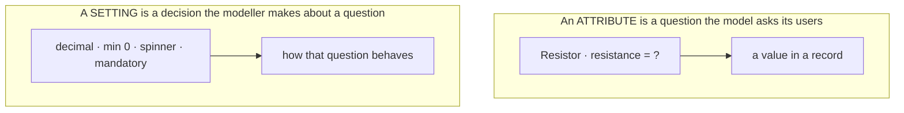
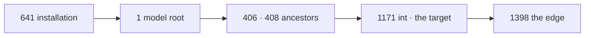

# Glossary

One word per concept. Every term here is used in exactly this sense throughout
`NewConcept/`, and nowhere in a second sense.

**Why this file exists.** The previous round drifted between *Eigenschaft*, *Attribute*,
*Parameter*, *Slot* and *Property* for overlapping ideas, and the model became impossible to
hold in one head. This round has already produced one collision of its own — *Label* was used
both as the umbrella for all display texts and as the name of one particular role
([D-023](90-decision-log.md)) — which is what prompted writing this down.

## The two halves

| Term | Deutsch | Means |
|---|---|---|
| **Model** | Modell | Everything that *describes*: nodes, relations, settings, labels. |
| **Data** | Daten | Everything entered *afterwards*, as a whole. |
| **Record** | Datensatz | One single piece of it ([D-176](90-decision-log.md)). |

The two do **not** share an identity space: model ids and record ids are allocated
independently ([D-164](90-decision-log.md)).

## The model

| Term | Deutsch | Means |
|---|---|---|
| **Identity** | Identität | The common base of everything the model persists. Carries the `id` and a `version` — and nothing else ([D-080](90-decision-log.md)). `Node` and `Relation` are its two shapes and draw ids from **one** space, which is what lets `owner_id` be a single real foreign key ([C11](10-domain-core.md), [D-164](90-decision-log.md)). |
| **Node** | Knoten | A thing in the model. All nodes are fundamentally the same kind ([V5](00-vision-and-scope.md)); differences come from configuration, not from subclassing. Exactly four fixed attributes: `id`, `version`, `name`, `path` ([D-082](90-decision-log.md)). |
| **Relation** | Kante, Verbindung | A directed edge from one node to another. **One construct** — inheritance, composition and aggregation are its *kinds*, not separate classes ([D-012](90-decision-log.md)). |
| **Kind** (of a relation) | Art | Which of the three a relation is. **Never chosen** — it is read off the branch the target sits in ([D-161](90-decision-log.md)). Not to be confused with *type*. |
| **Inheritance** | Vererbung | The relation kind that forms the tree. At most one parent per node, acyclic, protected, and the only kind exempt from edge settings ([C9](10-domain-core.md)). A node's **type** *is* its inheritance branch ([D-041](90-decision-log.md)). |
| **Composition** | Komposition | A relation kind whose target belongs to the whole and **is deleted with it** ([C12](10-domain-core.md)). Requires sole ownership: a record with several users cannot be composed into one of them ([D-162](90-decision-log.md)). |
| **Aggregation** | Aggregation | A relation kind whose target is **independent** and survives its whole ([C13](10-domain-core.md)). |
| **Attribute** | Attribut | **A relation, seen from the node that owns it** ([D-031](90-decision-log.md)). Its `kind` is the connection, its `to` is the type, its name and multiplicity and defaults hang on it as name, labels and settings. There is no separate attribute object — the *wrapper* the author edits is a screen, not a table. |
| **Use site** | Verwendungsstelle | A relation, seen as the place where a shared node is used. Configuration that applies to one use only lives here, not on the node ([C8](10-domain-core.md)). |
| **Binding** | Bindung | A named slot in the installation configuration pointing at a node ([D-120](90-decision-log.md)). The engine asks for the slot and never names an id or a node name, so ids may shift freely. Carries **only** the pointer. |

## The three branches

The branch a node sits in is load-bearing: it decides the relation kind that reaches it
([D-161](90-decision-log.md)) and whether it holds data at all ([D-183](90-decision-log.md)).

| Branch | Holds data | Means |
|---|---|---|
| **`Model`** | yes | The things the installation is actually about — parts, orders, recipes. |
| **`Compositions`** | yes | Things that exist only as part of a whole. A contact without its part does not exist ([D-135](90-decision-log.md)). |
| **`Primitives`** | **no** | What models are built *out of*. Values live **inside** the record, by path ([D-232](90-decision-log.md)). Means to an end, never a place anything is kept ([D-185](90-decision-log.md)). Splits one level further, and that split decides the relation kind ([D-193](90-decision-log.md)). |
| ↳ **Data Types** | no | `int`, `text`. The value lives **in the record** — reached by **composition**. |
| ↳ **Constants** | no | Units, currencies. The value is a **reference to a node** ([D-131](90-decision-log.md)) — reached by **aggregation**. |

## Configuration and text

| Term | Deutsch | Means |
|---|---|---|
| **Setting** | Einstellung | A configuration value on an identity: `key` + typed `value`. Conceptually an attribute ([D-011](90-decision-log.md)), stored in its own table. **One construct and one mechanism**, with a reserved namespace for engine-owned keys ([D-084](90-decision-log.md)). |
| **Override** | Überschreibung | A setting or label on a use site that replaces the base value. Resettable to *inherited*, which is not the same as storing an empty value ([D-266](90-decision-log.md)). Stored **sparsely** — only what differs — so a change to the base reaches every use site that did not override it ([D-015](90-decision-log.md)). |
| **Resolution chain** | Auflösungskette | Installation → model root → ancestors → node → use site. Walked **key by key**, so a consumer may take a mix ([D-079](90-decision-log.md), [D-093](90-decision-log.md)). |
| **Label** | Bezeichnung | The human-readable text of an identity, in one **role** and one **locale** ([D-019](90-decision-log.md)). Also carries author-written validator messages, addressed by `path` ([D-158](90-decision-log.md)). |
| **Role** (of a label) | Rolle | Which label this is — the seeded set is `form`, `table`, `symbol`, `help` — `select` left it again with [D-264](90-decision-log.md) ([D-196](90-decision-log.md)). Roles are **nodes**: seeded and extensible ([D-151](90-decision-log.md)). Written **without** a prefix ([D-023](90-decision-log.md)). |
| **Icon** | Icon | A glyph chosen from the installation allow-list. A **setting**, language-neutral ([D-252](90-decision-log.md)). Shown in the tree too ([D-251](90-decision-log.md)). Not to be confused with the `symbol` role. |
| **Base name** | Basisname | `Node.name`. Required, locale-neutral, entered at creation. Display of last resort, **never** a lookup key. Not unique ([D-022](90-decision-log.md)). |
| **Owner** | Eigentümer | The single identity a setting, label or changelog item belongs to. One column, because model ids come from one space. |
| **Data Pack** | Datenpaket | A named, installable set of model content and optionally some data ([D-175](90-decision-log.md)). The shipped seed is simply the pack that comes with the product. May **add** to another pack's branch, never **alter** its nodes ([D-177](90-decision-log.md)). |

## Presentation

| Term | Deutsch | Means |
|---|---|---|
| **Renderer** | Renderer | The only thing that produces display ([R1](30-renderer.md)). PHP ([D-021](90-decision-log.md)). Returns strings, never echoes (**CD-8**). A node carries an **ordered list**: one mandatory, further ones appended ([D-236](90-decision-log.md)). |
| **Purpose** | Zweck | What a render is *for*: display, edit, or **search**. Passed to the renderer in the context; a renderer declares which purposes it serves via `supports()`. **Not** part of the registry key ([D-217](90-decision-log.md)). |
| **Registry** | Registrierung | The one place all renderers register. Two jobs: *give me this renderer* at render time, and *which renderers are eligible for this node* at configuration time ([R12–R14](30-renderer.md), [D-217](90-decision-log.md)). |
| **Variant** | Variante | A fundamentally different presentation — field, spinner, slider. **Own renderer each** ([D-018](90-decision-log.md)). |
| **Circumstance** | Umstand | Level (admin / block / frontend), editable or not, hidden. **Option inside** one renderer ([D-018](90-decision-log.md)). |
| **Converter** | Converter | Turns input into a value and a value into output. Runs on input too where it is invertible ([D-077](90-decision-log.md)) — and it is the converter that silently strips leading and trailing whitespace, because nobody ever meant it ([D-166](90-decision-log.md)). |
| **Validator** | Validator | Checks user input, and may **offer a correction** ([V9](00-vision-and-scope.md)). Several per attribute, each with its own message ([D-158](90-decision-log.md)). Where intent is ambiguous — an interior space — it asks rather than acts ([D-166](90-decision-log.md)). |
| **Preview** | Vorschau | Every node has one. Rendered from a **test data pack**, not from empty defaults, because a filled form shows whether it *reads* ([D-160](90-decision-log.md)). |
| **Reference renderer** | Verweisrenderer | Draws the target label plus a link and **does not descend** ([D-105](90-decision-log.md)). The default for aggregation; composition expands instead. |

## Data, search and change

| Term | Deutsch | Means |
|---|---|---|
| **Search column** | Suchspalte | A normalised column per record, written on save from the shown fields ([D-167](90-decision-log.md)). One normalisation function, shared with duplicate detection. |
| **Projection** | Projektion | A flat table per model, one column per attribute, for the reporting case. A **cache, never a place values live** ([D-165](90-decision-log.md)). |
| **Changelog** | Änderungsprotokoll | Every change, with before and after. It **is** the migration script ([D-061](90-decision-log.md)), and `creation_date` is read from it ([D-080](90-decision-log.md)). |
| **Model version** | Modellversion | Stamped on the record ([D-060](90-decision-log.md)). Numbers **order** events; **shape** decides compatibility ([D-172](90-decision-log.md)). |
| **Conflict resolver** | Konfliktlöser | Where a model that no longer fits its data is reported and settled ([D-054](90-decision-log.md)). Reports rather than blocks — except for data entry against a broken model, which stays barred ([D-157](90-decision-log.md)). |
| **Parking** | Papierkorb | Deletion in two stages: park, then purge ([D-123](90-decision-log.md)). A parked record keeps its `unique` values blocked ([D-154](90-decision-log.md)). Undo reaches exactly as far as the trash ([D-172](90-decision-log.md)). |
| **Backward aggregate** | Rückwärtsaggregat | A computed value read from the things that point *at* this one. Calculated at read time, in no index, therefore **not searchable** ([D-140](90-decision-log.md)). |
| **Expression** | Formel | A computation over values ([D-130](90-decision-log.md)). ⚠️ In German **Formel**, never *Ausdruck* — that word is taken by the next row. |
| **Printout** | Ausdruck | A **frozen** rendering of a report, kept as a document ([D-242](90-decision-log.md)). A report is live and recomputes; an invoice is a printout, not a report. |

## Code shape

| Term | Deutsch | Means |
|---|---|---|
| **Core** | Kern | The domain model and everything reasoning about it. Calls no WordPress function (**CD-1**). Declares the interfaces it needs; the boundary fulfils them ([D-170](90-decision-log.md)). |
| **Boundary** | Anschlussschicht | The WordPress-facing layer. **Not underneath the core — around it**, with every arrow pointing inward ([D-171](90-decision-log.md)). It translates; it does not decide ([D-170](90-decision-log.md)). |

## Process

| Term | Means |
|---|---|
| **Owner statement** | Something the project owner said, written down verbatim in meaning and given an id (`V<n>`, `C<n>`, `R<n>`, `P<n>`, `I<n>`, `U<n>`). The raw material of the concept. |
| **Decision** | An entry `D-<nnn>` in [the decision log](90-decision-log.md). **Nothing is decided until it is there.** |
| **Open question** | An entry `OQ-<nnn>` in [open questions](91-open-questions.md). Where anything undecided goes, instead of being invented. |
| **Harvest** | Taking content out of `legacy/` through a reviewed sheet, item by item, with an explicit *take / rework / drop*. Never inheritance. |
| **Seed sketch** | One of the four original restart files. Input, not concept. |

## Rejected words

Kept so a discarded term cannot quietly return under another name.

| Word | Why not |
|---|---|
| *Eigenschaft*, *Parameter*, *Slot*, *Property* | All meant roughly *attribute* in the previous round, in slightly different and drifting senses. Use **attribute**. |
| *Translation* | Rejected by the owner ([I8](40-i18n.md)): these are not translations in the software sense, they are the same name in another language. Use **label**. |
| *`label.form`* as a role name | The `label.` prefix made *label* look like both the umbrella and the role ([D-023](90-decision-log.md)). The role is **`form`**. |
| *Type node* / *domain node* / *value node* | Presume node subtypes, which [V5](00-vision-and-scope.md) argues against. |
| *Primary key* for an attribute | The primary key is the **`id`** ([D-055](90-decision-log.md)). Use **`unique`** ([D-115](90-decision-log.md)). |
| *Bestand* | Proposed as a collective for the data half and rejected by the owner as unnecessary ([D-176](90-decision-log.md)). **Daten** already reads perfectly well. |
| *Definition* as a branch name | A model node is a definition too, so the word separates nothing. The branch is **`Primitives`** ([D-185](90-decision-log.md)). |
| *hide* as a flag on a node | The legacy control that went unused because it sat on the wrong object. What may be picked belongs to the **use site** ([D-181](90-decision-log.md)). |
| *View* as a catch-all for anything reusable | A **view** is a deferred *calculation* belonging to no node ([OQ-069](91-open-questions.md)); a **report** is prepared *output* — an exported parts list, an invoice — and belongs to the renderer side. Two concepts, two homes, never one word ([D-201](90-decision-log.md)). |

## Dictation notes

The owner statements were dictated, and speech recognition produces a few recurring substitutions.
Recorded so that a later reader — or a fresh session quoting the raw statements — does not stumble
over them.

| Heard | Means |
|---|---|
| *Rennrad*, *Renntrainer*, *Rennerad*, *Ränderer*, *Intranderer*, *eränderer* | **Renderer** |
| *Renderengten* | **Renderer registry** |
| *ohne IT* | **owner_id** |
| *gelockt* | **geloggt** — logged, not locked ([C85](10-domain-core.md)) |
| *Blogs* | **blocks** |
| *Hutknoten* | **root node** |
| *Bombe*, *Bombes* | **BOM** — parts list |
| *OML* | **UML** |
| *Beschichtung* | **Schachtelung** — nesting |
| *vermisst* | **vermischst** — mixing, not missing |
| *schonenswert*, *wieder schonenswert* | **Resistance** — resistance value |
| *Waldkatz* | **wildcard** |
| *Fahrrad*, *Nanofahrrad* | **Farad**, nanofarad |
| *Lebensraum* | **Namensraum** — namespace |
| *Applikation* | **Aggregation** |
| *Heid* | **hide** |
| *Track and Drop* | **drag and drop** |
| *Andofall* | **Undo-Fall** |
| *Inumwerte* | **Enum-Werte** |
| *aufplänen* | **aufblähen** — to bloat |

## ⚠️ Inheritance is not the resolution chain

Both terms are in the table above and both are precise. They get confused all the same, and it
happened on 2026-08-26: I explained why hiding a node hides its subtree by saying *inheritance*, and
the owner cut it off — *your argument for `hide` was inheritance, but a setting on a node has nothing
to do with attribute inheritance. Perhaps we need to sharpen the terms.*

He is right that they must not be one word.

| | It answers | Its mechanism |
|---|---|---|
| **Inheritance** · *Vererbung* | **what a node has** — `Resistor` has `resistance` because `Bauteil` declared it | the relation **kind** that forms the tree ([D-031](90-decision-log.md), [D-041](90-decision-log.md)) |
| **Resolution chain** · *Auflösungskette* | **what a key answers here** — `hide` is true on `yotta` because somebody wrote it there | installation → model root → ancestors → node → use site, walked **key by key** ([D-079](90-decision-log.md), [D-093](90-decision-log.md)) |

**Why they are confusable, and it is not carelessness:** the chain's middle section *is* the
inheritance edges. Same ancestors, same walk upwards — so *a child of a hidden node is hidden* is true
through the **chain** and would be equally true-sounding said as *inheritance*. The difference only
shows where they disagree:

- An **attribute** is inherited and a **setting** is not: the setting is *resolved*. Nothing is copied
  down, nothing is owned twice, and a value written at the node simply wins over one written above it.
- An attribute may be **moved down** to a subtype ([D-155](90-decision-log.md)); a setting cannot be
  moved anywhere, because it was never in one place to begin with.
- Multiplicity is **edge-only** ([D-351](90-decision-log.md)) and still travels the chain — which is
  impossible to state at all if the two words are one.

⚠️ **The rule for writing about it: say *the chain* for a setting and *inheritance* for an attribute,
and never the other way round.** *Where a sentence would be true either way, it is about the ancestors
and should name them instead of picking a mechanism.*

## Two concepts, not two kinds of the same thing

The owner, after three rounds of tables: *the distinction between settings and attributes is missing
for me. We have to show that these are two different concepts.* **He is right that the tables below
compare them without ever saying what each one is.**

**An attribute is a question. A setting is a decision about a question.** Everything else follows from
that, including every row of the tables below.

| | **Attribute** | **Setting** |
|---|---|---|
| **What it is** | a **question the model asks its users** — *what is this resistor's resistance?* | a **decision the modeller makes** about that question — *it is a decimal, minimum 0, drawn as a spinner* |
| **Who answers it** | whoever **uses** the model, once per record | whoever **authors** the model, once |
| **What it produces** | **data** — a value in a record | **behaviour** — how the field looks, what it accepts, whether it is kept |
| **Where it exists** | **only where somebody declared it**, and downwards from there — *local by construction* | **on every node, always** — *global by construction* ([D-378](90-decision-log.md)) |
| **Who invents it** | a person, freely, with a name they choose | **nobody.** Sixteen engine keys; a reserved name cannot be invented ([D-084](90-decision-log.md)) |
| **What it is called** | a **name**, which is user-visible text | a **key**, which is a token and never translated |

### The test that decides it, and it is the owner's own

> ***How does the user know he needs the multiplier?***

He asked that twice on 2026-08-25 and it settled [D-378](90-decision-log.md). **A reserved setting key
cannot answer it.** Measured rather than argued: `SettingKey::applyingTo()` offers **eleven** keys on a
node with no type at all — so *a text node was being offered a prefix exponent*. **Nothing says where a
reserved key belongs, because a reserved name is global by construction.**

**An attribute answers it with inheritance**: `Prefixes` declares `exponent`, so *whoever hangs under
`Prefixes` has one and nobody else does*.

⚠️ **So the test is: «how would a person know this applies to them?»**

| If the answer is | then it is |
|---|---|
| *because an ancestor declared it, and I am under that ancestor* | an **attribute** |
| *because it is one of the sixteen and it always applies* | a **setting** |
| **nothing** | a setting key used where an attribute belonged — *which is the mistake [D-378](90-decision-log.md) caught* |

⚠️ *And the owner tested the alternative to destruction before accepting it. He proposed a
`Berechnungsgrundlage` data type, then found its flaw himself: **how would the renderer know which
attribute to use?** Finding an attribute by the name of the node it points at is special-casing by
name, which the code standard forbids outright.*

### Why they blur, and it is not carelessness

Four things make them look alike, and all four are true:

1. **Both hang off a node.** An attribute is an edge from it; a setting is a row keyed by its id.
2. **Both are configured in the same panel**, one above the other, on the same screen.
3. **Both travel downwards.** An attribute by inheritance, a setting by the chain — [and those are not
   the same mechanism](#-inheritance-is-not-the-resolution-chain), which is its own section for the
   same reason.
4. **A setting can be *about* an attribute.** `mandatory` at a use site is a decision about a question
   — so the sentence *«the attribute is mandatory»* is true and describes a **setting**.

⚠️ **The fourth is the real trap.** *«This attribute is mandatory, has a range of 0 to 10 and is drawn
as a spinner»* is one sentence describing **one attribute and three settings** — and nothing in the
sentence marks where one ends and the others begin. **The tables below are for exactly that sentence.**
## Truth table — an attribute is not a setting

The owner, 2026-08-26: *let us set up a truth table with three columns — claim, attributes, settings.*
Then, once it existed: *can you number the rows, then it is easier to talk about* — and the reason he
wanted it at all: ***there are a lot of wrong claims in there that I probably read past while
conceiving.***

⚠️ **So the table is numbered and it says which cells are sourced and which are mine.** A cell with a
`D-` id was read; a cell marked ⚠️ was **asserted by me while filling the table in** and is exactly
what he is looking for. *Two were already wrong before he looked — see rows 4 and 8.*

| # | Claim | Attribute | Setting |
|---|---|---|---|
| **1** | **It is inherited** | **yes** — the relation kind *is* the tree ([D-031](90-decision-log.md), [D-041](90-decision-log.md)). *The owner: **attributes behave like OO in inheritance*** | ⚠️ **«no» was too sharp.** **What you get is inherited** — the owner, as fact: *as long as he changes no settings, all of `int`'s settings apply; if he changes something, those override* ([D-402](90-decision-log.md)). **How** differs: a setting is **answered by walking**, not copied down ([D-079](90-decision-log.md), [D-093](90-decision-log.md)), and overriding is **per key** — set `range_min` and you still get `int`'s `default` |
| **2** | **It can be moved down to a subtype** | **yes** ([D-155](90-decision-log.md)) | **no** — it was never in one place to be moved from |
| **3** | **It has a multiplicity** | **yes**, and only on the edge ([D-351](90-decision-log.md)) | ⚠️ **undecided, and I wrote «no».** *Multiplicity **is** a setting key, so the claim reads oddly; what it should ask is whether **one key may hold several values**, and that is [OQ-092](91-open-questions.md) — open, and it blocks three decided things* |
| **4** | **Its name is a label, per locale** | ⚠️ **no — I had this wrong.** An attribute's name is a **plain column** on the relation. *Measured: 17 edges carry a name, **zero** labels belong to an edge; all 46 labels belong to nodes.* Whether an edge *may* own labels is undecided | **no** — a setting has a **key**, which is a token and never translated |
| **5** | **It exists as a row when nobody set it** | **yes** — an edge is either there or it is not | **no** — settings are **sparse**: written only where they differ ([D-015](90-decision-log.md)) |
| **6** | **It may be left unsaid** | **no** — an attribute is declared or absent | **yes**, and that is the normal case |
| **7** | **It holds a value in a record** | **yes** — that is what a record *is* | **no** — a setting is about the **model**; at model level there are no values, only defaults ([D-026](90-decision-log.md)) |
| **8** | **It may be narrowed downwards and never widened** | ⚠️ **the cell was «not applicable» and that is wrong.** An attribute's **multiplicity** is a bounding setting *on the edge*, so an attribute **is** narrowed downwards — through its settings | **some of them.** Bounding: permitted set, range, multiplicity, `mandatory` ([D-311](90-decision-log.md), [D-312](90-decision-log.md)). Free: default, renderer, converter, labels, icon, order — **and `hide`, `read_only`** ([D-399](90-decision-log.md)) |
| **9** | **It can sit on a node *and* on a use site** | it **is** the use site, seen from the owner ([10 Domain core](10-domain-core.md)) | **yes** — both. *Measured: 36 settings on nodes, 11 on edges* |
| **10** | **A renderer draws it** | **yes** — its value | **yes** — its control. *Both go through `R1`; neither is exempt* |
| **11** | **It is recorded in the changelog** | **yes** — `attribute added` / `removed` / `restored` | ⚠️ **no, and that breaks a decision.** [D-081](90-decision-log.md): *every object has at least one changelog item*, and [D-061](90-decision-log.md) makes the changelog **the migration script**. Measured: **591 setting rows, zero changelog entries about settings** — `owner_kind` knows only `node` and `relation`. *A migration replaying it would produce a model with no settings* |
| **12** | **A `bool` has exactly two states** | — | **yes, and «not set» is not a third one** ([D-401](90-decision-log.md)) |

### Row 12 — settled by the owner, and it corrected me twice

I had offered two ways out and he refused both: ***neither a nor b. We said a bool can have only two
states, «not set» does not exist. If a value is there then the value, otherwise the default.***

⚠️ **The mistake in both my candidates was the same**: I treated *unset* as something the control has
to **express**. It is not a state of the value at all — it is a fact about **storage**, and settings
being sparse ([D-015](90-decision-log.md)) is why storage is empty most of the time. **That «set true»
and «defaulted true» look identical on screen is correct, not a defect.**

⚠️ **What it demands in the code is one home for the default.** `persistent` resolved to `true` in a
**reader** — `?? true` inside the data layer — while the switch drew *off*, and the same invention
appears **eight times** across renderers and services as `?? false` or `?? true`. *That is the
duplicated-fact prohibition: one place owns each piece of state.* **The key owns what it stands for
when nobody said anything**, and both the control and every reader ask it.

### The worked example — `my_int` under `int`

The owner asked to settle the table *against a few simple examples* rather than by argument. This is
the first, in his words: *I have a node `my_int` that inherits from `int`, so it would have all
attributes of `int` (there are none) but also all settings of `int`.*

⚠️ **Built and measured on 2026-08-26**, on the owner's word — *`my_int` is only an example, but we can
create it to verify everything.* `int` carries three own settings — `default = 300`,
`range_min = 3333`, `renderer = field` — which is enough to make every interesting case concrete.

| What `my_int` does | What it gets | Measured |
|---|---|---|
| **nothing** | `default 300`, `range_min 3333`, `renderer field` — all `← von 1171` | ✔ **exactly as he stated** |
| sets **`range_min = 0`** | **refused** — `CannotWiden`: *«range_min» is inherited as 3333 and may only be narrowed, not set to 0* | ⚠️ **the exception his sentence did not mention** |
| sets **`range_min = 5000`** | `range_min 5000` here, `default` and `renderer` still `← von 1171` | ✔ overriding is **per key** |
| sets **`renderer = spinner`** | `renderer spinner` here | ✔ a **choosing** setting is free in either direction |
| then `int`'s `default` changes to `1` | `default 1 ← von 1171`, reaching `my_int` at once | ✔ nothing was copied |

⚠️ **The refusal is the finding.** *«If he changes something, those override»* holds for **choosing**
settings without qualification, and for **bounding** settings **only in the narrowing direction**
([D-312](90-decision-log.md)). `range_min` is bounding, so `3333 → 0` is not an override but a
widening, and the core stops it. **The same split that [D-399](90-decision-log.md) had just taken
`hide` and `read_only` out of** — which is why it is worth measuring rather than reasoning about.

⚠️ **Why the third row is the argument for the whole mechanism.** If a subtype took a **copy** of its
ancestor's settings and edited that, changing `int` later would stop reaching `my_int` — and a
classification whose parent cannot be corrected is worth little. *That is the same reason settings are
sparse rather than materialised ([D-015](90-decision-log.md)).*

⚠️ *One thing this example cannot settle is whether a record typed `int` may hold a `my_int` —
[OQ-096](91-open-questions.md). `typeOf()` already walks ancestors to find a simple type, so **drawing**
says yes; validation and storage say nothing.*
### What data type a setting has — and where its default lives

The owner: *what we also have not defined is which data types settings have. With attributes it is
clear, I set it — but with settings it is currently only a text, or?* Then: *hold the types down in
the docs, and a setting can have a default — where could that be stored?*

⚠️ **Not text. Five shapes, and four keys take the type of the *subject*.**

| Shape | Its data type | Keys |
|---|---|---|
| `Switch` | `bool` | `mandatory`, `hide`, `read_only`, `persistent` |
| `LikeTheSubject` | **whatever the subject is** | `range_min`, `range_max`, `range_step`, `default` |
| `Exact` | `decimal` | `factor`, `offset` |
| `Whole` | `int` | `order` |
| `OneOfFour`, `ARegisteredName` | **none — a choice, not a value** | `multiplicity`, `renderer`, `converter`, `validator`, `icon` |

⚠️ **`LikeTheSubject` is the one that answers his question properly.** On `int`, `range_min` **is** an
`int`; on `decimal` it is a `decimal`. *A minimum typed as text would be sortable as `"10" < "9"`, and
a `default` that is not the type it defaults for is not a default.* Measured against the code, not
recalled.

⚠️ **The five shapes are not five storage columns.** `record_values` and `settings` both carry
`value_int`, `value_decimal`, `value_text`, `value_date`, `value_ref` — so a setting is stored in the
column its type names, exactly as a record value is. *One mechanism, two uses.*

#### Where a key's own default lives: at the installation identity

**Nowhere new.** [D-079](90-decision-log.md) decided in 2026-08-22 that *an installation-wide default
is a setting on a reserved installation identity, and that identity is the **first link** of the
resolution chain*. So a key's default is **a setting like any other**, written one link above the
model root.

⚠️ **Measured, 2026-08-26.** `chainFor()` returns `[installationId(), …ancestors, node]`. Writing
`persistent = true` at identity `641` made `my_int` resolve it as `1 ← von 641`; removing it made
`my_int` empty again. **The mechanism was already there and nothing had used it.**

| Where a default could have gone | Why not |
|---|---|
| **hard-coded on the key**, in PHP | it is then not a *default* but a law: nobody can change what `persistent` means for their installation |
| **on each type node** | right for a fact *about that type* — `int`'s `step = 1` — and wrong for a fact about the *key*, which would then be repeated on every type |
| **on the installation identity** | ✔ it is the first link of a walk that already exists, it is data, and it is editable |

⚠️ *This is what [D-401](90-decision-log.md) needs and it is better than what D-401 asked for.* That
decision wanted the key to own «what it stands for when nobody said anything»; putting it at the
installation makes the same answer **visible and changeable** instead of compiled in. **`persistent`
stops being a `?? true` buried in a reader** and becomes one row a person can see.
### Settings on an attribute — the use site is the last link

The third column the owner asked for: *then on with attribute settings and a table for it.* Everything
below is **measured on 2026-08-26** against attribute `1398` («int» on `Parts List`, pointing at
`int` = `1171`), not recalled.

**The chain of a use site is the chain of its *target* plus the edge**, and the edge is **last** — so a
setting written at the attribute wins over the type it points at, over the type's ancestors, and over
the installation. *Measured: `641 → 1 → 406 → 408 → 1171 → 1398`.*

| # | Claim | Setting on a **node** | Setting at a **use site** (an attribute) |
|---|---|---|---|
| **13** | **Where it sits in the walk** | one of the links — installation, root, an ancestor, or the node | **the last link, always.** Nothing resolves after it |
| **14** | **Whose type its value takes** | the node's own, where the key is `LikeTheSubject` | **the target's.** `range_min` on an attribute pointing at `int` is an `int` |
| **15** | **Keys that exist only here** | — | **`multiplicity`** ([D-351](90-decision-log.md)) and **`order`**, because ordering is per parent. *Measured: `multiplicity` on a node is refused — «belongs to a use of a node, not to the node itself — set it on the attribute»* |
| **16** | **Narrowing a bound** | may narrow what an ancestor said | **may narrow, and is the narrowest point there is.** *Measured: `range_min = 10` took at the edge while `range_max` and `renderer` still read `← von 1171`* |
| **17** | **Its own name** | a plain `name` column, and labels beside it | **a plain `name` column only.** *Measured: 17 edges carry a name, **zero** labels belong to an edge* — [OQ-095](91-open-questions.md) asks whether that is a rule or an accident |
| **18** | **Renaming it** | free | **only where the attribute is declared** ([D-376](90-decision-log.md)). *An inherited attribute belongs to the ancestor, and renaming it from a descendant would rename it for everybody, silently* |
| **19** | **It is journalled** | as `node` | as `relation` — same table, same shape ([D-403](90-decision-log.md)) |

#### Where the two are stored — the owner: *even if they are almost the same*

He asked for the storage places to be in the table *even though they are nearly identical* — and the
«nearly» is the interesting part.

| # | Claim | Setting on a **node** | Setting at a **use site** |
|---|---|---|---|
| **20** | **Which table** | `taxmod_settings` | **the same table.** Not a second one, not a second column |
| **21** | **What `owner_id` holds** | the node's id | the **edge's** id |
| **22** | **Why one column can hold both** | **one id space.** *Measured: highest node `10047`, highest edge `10048` — they interleave, and **zero** ids are shared* | ditto. [D-340](90-decision-log.md) — an id once handed out is never reissued, and the allocator does not care what asked for one |
| **23** | **Which column the value goes in** | `value_int` · `value_decimal` · `value_text` · `value_date` · `value_ref`, chosen by the key's type | identical |
| **24** | **How many rows one key may have** | **one** — `UNIQUE (owner_id, setting_key)` | **one.** *Which is [OQ-092](91-open-questions.md): there is no `path` column, so «several values under one key» has nowhere to go, and it blocks three decided things* |
| **25** | **What it is journalled as** | `owner_kind = node` | `owner_kind = relation` ([D-403](90-decision-log.md)) |

⚠️ **So the storage is genuinely the same and that is the design, not an economy.** [D-019](90-decision-log.md)
made every settable thing an **identity**, and a node and an edge are two kinds of identity — so
`owner_id` addresses «whatever this belongs to» and the difference lives entirely in **where that id
sits in the walk**.

⚠️ **The one asymmetry worth knowing.** A node has an id *and a place in the tree*, so its chain is
found by walking its ancestors. An edge has an id and **two ends**, so its chain is *its target's whole
chain, then itself* — which is why row 13 says the edge is always last. *Same table, same column,
different question asked of it.*

⚠️ *And a third kind of owner exists that is neither: the **installation identity**, which holds a
key's own default ([D-404](90-decision-log.md)) and has no node behind it. That is why `owner_kind`
needed a third value.*
#### Why this is the answer to «what is the difference between an attribute and a setting»

The owner asked it while looking at `int`'s bounds: *that is sort of the difference between attribute
and setting, we will come to it later.* **Rows 13 to 19 are that difference, and it is not a list of
features:**

- **An attribute is a *thing* in the model.** It has an identity, a name, a target, and it is
  inherited — the owner's own anchor: *attributes behave like OO in inheritance*.
- **A setting is an *answer* to a question, at a place.** It has no identity a person navigates to; it
  has a key, a place in a walk, and a value.

⚠️ **Which is why the same key means different things at different places, and that is a feature.**
`range_min` on `int` says *what an integer is*; `range_min` on **this attribute** says *what this
field accepts*. **Same key, same type, different scope** — and the walk is what tells them apart.

⚠️ *And it is why a setting on a **constant** reaches every attribute pointing at it — which surprised
the owner when `persistent = 0` on `Base units` stopped a unit from being stored
([D-400](90-decision-log.md)). Nothing was inherited; the constant is simply **in the walk**.*
### The three words that keep getting swapped

| Word | It answers | Not to be used for |
|---|---|---|
| **Inheritance** | what a node **has** | a setting — say *the chain* |
| **Resolution chain** | what a **key** answers *here* | an attribute — say *inheritance* |
| **Bounding** | which **direction** a setting may move | a whole category — [D-399](90-decision-log.md) took two keys out of it |

⚠️ **Why this section exists at all.** The two got confused **four times in one day**, each time by me
and each time differently: `hide` argued as *inheritance* when it travels the *chain*; `hide` filed as
*bounding* because a table said so; a switch drawn *off* for a key whose default is `true`; and
`label_role` reported as *built* when it was storable, resolvable and unreachable. *A rule recalled is
not a rule read (`PR-10`).*
