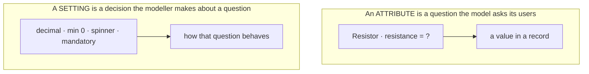
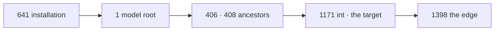

# Felder — und die eine Angabe, die früher «Einstellung» hiess

> ⚠️ **Dieses Dokument hiess bis zum 2026-08-29 «Field and setting — two concepts», und der Titel
> ist falsch geworden.** *[D-506](90-decision-log.md), auf das Wort des Eigentümers: «wir
> unterscheiden jetzt nur noch anhand eines Merkmals, ist es eine Einstellung oder ist es ein Feld.
> **Somit ist im Grunde alles ein Feld**, und wir haben nur noch: die Einstellung kann in der Kante
> überschrieben werden.»*
>
> ⚠️ **Alles unterhalb von [«Zwei Konzepte»](#two-concepts-not-two-kinds-of-the-same-thing) bis zu
> den Abschnitten vom 2026-08-29 beschreibt den Weg dorthin, nicht den Stand.** *Es bleibt stehen,
> weil die Begründungen dort dreimal an diesem Tag den Fehler gefunden haben — aber **es gilt
> nicht**. Wer wissen will, was ist, liest die vier Abschnitte am Ende.*

## Was gilt — Stand 2026-08-29

**Es gibt nur Felder.** Ein Feld trägt zwei Angaben, und sie sind unabhängig:

| | Frage | Werte |
|---|---|---|
| **1** | wo liegt der Wert? | im **Datensatz** (der Benutzer schreibt ihn) · am **Modell** (der Autor) |
| **2** | darf eine Verwendungsstelle ihn überschreiben? | nein · ja · **nur dort** |

*Was früher «eine Einstellung» hiess, ist ein Feld mit «am Modell» und «ja».* Die Belege, die
Messungen und die Gegenrechnungen stehen in den vier Abschnitten am Ende dieses Dokuments:
[Warum Settings und Feldwerte zusammengehören](#warum-settings-und-feldwerte-zusammengehören--stand-2026-08-29) ·
[Es gibt nur noch Felder](#es-gibt-nur-noch-felder--stand-2026-08-29) ·
[Ein Feld trägt zwei Angaben](#ein-feld-trägt-zwei-angaben--stand-2026-08-29)

⚠️ **Und es ist keine Kehrtwende, sondern eine Rückkehr.** *[D-011](90-decision-log.md), 2026-08-22,
erster Tag, Status `agreed`, **nie überholt**: «**A setting is an attribute.** Not a second
concept.» Sieben Tage lang ist darauf ein zweites Konzept gewachsen, gegen eine Entscheidung, die
niemand zurückgenommen hat.*

⚠️ *Der Eigentümer hat am 2026-08-26 das Gegenteil gesagt — «mir fehlt die Unterscheidung zwischen
Settings und Attributen, wir müssen zeigen, dass das zwei verschiedene Konzepte sind» — und am
2026-08-29 sich selbst korrigiert. **Beides bleibt zitiert und keines überschrieben**, wie
[D-434](90-decision-log.md) es vorgemacht hat: «he is correcting himself, and the log argued the
other way in his own words, which is why it is quoted rather than quietly overwritten».*

---

## Der Weg dorthin — nicht mehr gültig, aber lehrreich

*Ab hier steht der Stand vor dem 2026-08-29.*

> ⚠️ **The word is «field» since 2026-08-28 ([D-459](90-decision-log.md)).** The owner: *maybe we should
> rename our attribute — it always causes confusion between a class attribute and our definition. Let us
> call them **fields**, because what we do is define fields in a record.*
>
> **And the sentence below is the evidence he was right:** written on 2026-08-26, it says *«with
> attributes I configure additional **fields**»* — **both words, for one thing, in one line.** *The code
> had the same split: `attribute` 498 times in the modelling half, `field` 305 in the drawing half.*
>
> **What was renamed and what was not.** *The **code** is renamed throughout — classes, methods, tokens,
> and the words a person reads on screen. The **decision log** and the **open questions** are not: they
> record what was said, with dates and quotations, and 561 of the 1142 mentions live there. Renaming
> inside testimony would falsify it. The remaining prose in the living concept documents — 178 sentences
> in [`10-domain-core.md`](10-domain-core.md) alone — is [row 62](97-implementation-plan.md#the-working-list),
> because it has to be read sentence by sentence and is not a sweep.*

**With attributes I configure additional fields on a node. With settings I say how those fields should
behave.** — the owner, 2026-08-26, correcting an earlier attempt of mine.

⚠️ **His line replaced «an attribute is a question, a setting is a decision about a question», and it
earned the replacement.** Mine put the *user* at the centre and was not wrong; **his puts the field at
the centre, and only his explains where things go.** *I had the focus wrong, which is how a definition
that reads well can still be the wrong tool.*

⚠️ **Why it is its own document.** It grew inside [`01-glossary.md`](01-glossary.md) over one day —
2026-08-26 — until it was three hundred of that file's four hundred and sixty lines. *A glossary is
where a word is looked up; this is an argument with measurements in it, and the owner asked for it to
have its own place.*

⚠️ **Every claim here was measured against the running model, not recalled.** That is deliberate and it
is `PR-10`'s doing: the two concepts were confused **four times in one day**, each time by the agent
and each time differently — `hide` argued as *inheritance* when it travels the *chain*, `hide` filed as
*bounding* because a table said so, a switch drawn `off` for a key whose default is `true`, and
`label_role` reported as *built* when it was storable, resolvable and unreachable. **A rule recalled is
not a rule read.**

| What is here | |
|---|---|
| [Where the settings discussion stands](#where-the-settings-discussion-stands--2026-08-26) | **start here** — what is settled, what is open, and the one column that unblocks five things |
| [Inheritance is not the resolution chain](#-inheritance-is-not-the-resolution-chain) | the two mechanisms that share an ancestor walk |
| [Two concepts, not two kinds of the same thing](#two-concepts-not-two-kinds-of-the-same-thing) | what each one **is**, and the test that decides which you are holding |
| [Truth table](#truth-table--an-attribute-is-not-a-setting) | rows 1–12, node against attribute |
| [The worked example](#the-worked-example--my_int-under-int) | `my_int` under `int`, built and measured |
| [What data type a setting has](#what-data-type-a-setting-has--and-where-its-default-lives) | five shapes, and where a key's default lives |
| [Settings on an attribute](#settings-on-an-attribute--the-attribute-is-the-last-link) | rows 13–19, the attribute |
| [Where the two are stored](#where-the-two-are-stored--the-owner-even-if-they-are-almost-the-same) | rows 20–25, one table and one id space |

⚠️ *An open question is being argued against this document right now:
[OQ-097](91-open-questions.md) asks whether settings should be **materialised** into the inheriting
node instead of resolved. If it lands, **eight of the twenty-five rows change and two of them reverse**
— which is counted there, not here.*

## Where the settings discussion stands — 2026-08-26

The owner: *I am slowly losing the overview in the settings discussion. Can you update the docs so I can
read, and then we talk.* **This page is that.** One line per thing, pointing into the detail rather than
repeating it.

### Settled today — twelve decisions

| | | |
|---|---|---|
| [D-399](90-decision-log.md) | **`hide` and `read_only` leave the bounding category** | they are settings, not classification — hiding promises nobody anything. ⚠️ *`hide` went further and stopped being a setting at all: [Hiding](10-domain-core.md#hiding--hide-is-one-column-and-it-is-on-the-edge) ([D-467](90-decision-log.md))* |
| [D-400](90-decision-log.md) | **a constant is drawn as a reference; no bare id reaches a surface** | and a renderer that cannot serve gives way to the **type's default**, not to the fallback |
| [D-401](90-decision-log.md) | **a `bool` has two states; «not set» is not a third** | the control shows the stored value, else the default |
| [D-402](90-decision-log.md) | **a subtype has its ancestor's settings until it says otherwise — *per key*** | set `range_min` and you still get the ancestor's `default` |
| [D-403](90-decision-log.md) | **every setting write is journalled**, against its owner | 591 rows had no history at all; `owner_kind` gained `installation` |
| [D-404](90-decision-log.md) | **a key's own default lives at the installation identity** | [D-079](90-decision-log.md) had said so four days earlier and nothing had used it |
| [D-405](90-decision-log.md) | **`mandatory` is gone** — the multiplicity's floor *is* mandatoriness | and the guarantee got **stronger**: one edge, nowhere to loosen it |
| [D-406](90-decision-log.md) | **`hide`/`read_only` free in the code too** | D-399's other half, which had been written and not built |
| [D-407](90-decision-log.md) | **the `order` key is removed** | ordering is the `position` column, which 84 edges use and nothing else ever read |
| [D-408](90-decision-log.md) | **the screen gets its first script** — eight lines, one number | a `#fragment` can place a row and cannot preserve an offset |
| [D-409](90-decision-log.md) | **a setting has no multiplicity** | one key, one answer, per place |
| [D-410](90-decision-log.md) | **an attribute has a name in every language** | it carries labels, like a node — closes [OQ-095](91-open-questions.md) |
| [D-411](90-decision-log.md) | **the narrowing rule is gone** | an attribute may reopen anything a node said. ⚠️ *Narrowed back on 2026-08-28 for exactly two keys — `min` and `max` still refuse a widening ([D-468](90-decision-log.md)): [Row 8 in full](#row-8-in-full--what-a-field-may-set-anew-and-the-two-keys-that-refuse)* |
| [D-412](90-decision-log.md) | **a `bool` may not have a floor of zero** | two states means it is always answered |

### Open — and what each one is actually asking

| | The question in one line | Weight |
|---|---|---|
| [OQ-092](91-open-questions.md) | **does `settings` need a `path` column?** | ⚠️ **the bottleneck — five things wait on it** |
| [OQ-099](91-open-questions.md) | where does a **descendant's** value for an **inherited** attribute live? | *the same column, found from the other end* |
| [OQ-097](91-open-questions.md) | should settings be **written into** the inheriting node instead of resolved? | eight of twenty-five table rows change; two reverse |
| [OQ-098](91-open-questions.md) | is a value that can live in **only one place** a **field** rather than a setting? | `multiplicity`, `order` — and `order` is already stored twice |
| [OQ-093](91-open-questions.md) | how does a key say **which subjects** it applies to? | a text node is still offered `factor` |
| [OQ-095](91-open-questions.md) | may an **attribute own labels**, or is its name only a column? | measured: 17 edge names, **zero** edge labels |
| [OQ-096](91-open-questions.md) | is a **subtype substitutable** where a reference is typed? | drawing already says yes; validation says nothing |
| [OQ-094](91-open-questions.md) | how does a person type `Ω`, `µ`, `£`? | not a settings question, but it sits in the same panel |

### The one thing that unblocks the most

⚠️ **[OQ-092](91-open-questions.md)'s `path` column on `settings`.** It is the address for *«this
place's value for that key»*, and **five separate things wait for it**:

| | |
|---|---|
| several **renderers** and several **validators** | [D-236](90-decision-log.md), [D-158](90-decision-log.md) — decided, unbuildable |
| several **defaults** | [C30](10-domain-core.md) — decided, unbuildable |
| the **prefix exponent** working at all | [D-378](90-decision-log.md) — decided, and **measured not to function** |
| **`factor`/`offset` as attributes** | the owner said yes; it needs the address first |
| **materialised settings** | [OQ-097](91-open-questions.md) needs a per-`(node, edge)` row |

*Three of those five are **already decided**. That is the argument: the column is not a new feature, it
is the thing four decisions assumed existed.*

### Buildable now, no decision needed

| | |
|---|---|
| **`exponent`, `factor`, `multiplicator` as subtypes of `int`/`decimal`** | a node under `int` **is** an `int` — `my_int` proves it. Each carries its own bounds and renderer, which is the owner's *«we would know what is used in the renderer»* |
| **`order` retires in favour of the `position` column** | nothing reads the key; 84 edges use the column ([row 30](97-implementation-plan.md)) |
| **a required field marked as required** | `Multiplicity::requiresOne()` exists and had no caller ([row 31](97-implementation-plan.md)) |
| **the tidying** | 590 orphaned rows, 8 empty rows ([rows 28–29](97-implementation-plan.md)) |

### What kept going wrong today, so it is not repeated

⚠️ **Four decisions were written and not built**, and every one was found by the owner looking at the
screen rather than by a green test run:

| | |
|---|---|
| `hide` stored correctly and **nothing read it** | [D-396](90-decision-log.md) |
| `label_role` storable, resolvable and **unreachable** — no control | [row 20](97-implementation-plan.md) |
| `hide`/`read_only` **half-built** — the renderer greyed out, the refusal stayed | [D-406](90-decision-log.md) |
| the **prefix exponent** written and **not connected** | [OQ-099](91-open-questions.md) |

⚠️ **And three facts were stored twice**: `mandatory` beside the multiplicity ([D-405](90-decision-log.md)),
`order` beside `position` ([row 30](97-implementation-plan.md)), and a bool's default invented eight
times in readers ([D-404](90-decision-log.md)). *The same shape every time: something derivable was
given a home of its own.*

---
## ⚠️ Inheritance is not the resolution chain

Both terms are in the table above and both are precise. They get confused all the same, and it
happened on 2026-08-26: I explained why hiding a node hides its subtree by saying *inheritance*, and
the owner cut it off — *your argument for `hide` was inheritance, but a setting on a node has nothing
to do with attribute inheritance. Perhaps we need to sharpen the terms.*

He is right that they must not be one word.

| | It answers | Its mechanism |
|---|---|---|
| **Inheritance** · *Vererbung* | **what a node has** — `Resistor` has `resistance` because `Bauteil` declared it | the relation **kind** that forms the tree ([D-031](90-decision-log.md), [D-041](90-decision-log.md)) |
| **Resolution chain** · *Auflösungskette* | **what a key answers here** — `read_only` is true on `yotta` because somebody wrote it there. ⚠️ *This example used to be `hide`, and `hide` is **not in the chain any more** ([Hiding](10-domain-core.md#hiding--hide-is-one-column-and-it-is-on-the-edge)) — a stale example in the very section about confusing two mechanisms would be the joke writing itself* | installation → model root → ancestors → node → attribute, walked **key by key** ([D-079](90-decision-log.md), [D-093](90-decision-log.md)) |

**Why they are confusable, and it is not carelessness:** the chain's middle section *is* the
inheritance edges. Same ancestors, same walk upwards — so *a child of a hidden node is hidden* is true
through the **chain** and would be equally true-sounding said as *inheritance*. The difference only
shows where they disagree:

- An **attribute** is inherited and a **setting** is not: the setting is *resolved*. Nothing is copied
  down, nothing is owned twice, and a value written at the node simply wins over one written above it.
- An attribute may be **moved down** to a subtype ([D-155](90-decision-log.md)); a setting cannot be
  moved anywhere, because it was never in one place to begin with.
- Multiplicity is **edge-only** ([D-351](90-decision-log.md)) and still travels the chain — which is
  impossible to state at all if the two words are one.

⚠️ **The rule for writing about it: say *the chain* for a setting and *inheritance* for an attribute,
and never the other way round.** *Where a sentence would be true either way, it is about the ancestors
and should name them instead of picking a mechanism.*

## Two concepts, not two kinds of the same thing

> ⚠️ **Überholt durch [D-506](90-decision-log.md) am 2026-08-29: es ist **ein** Konzept.**
> *Der Eigentümer hat die Unterscheidung, die er hier verlangt hatte, drei Tage später selbst
> zurückgenommen. Was unten steht, ist die Begründung von damals — und sie ist es wert gelesen zu
> werden, weil aus ihr die bessere Fassung entstand. **Die Überschrift bleibt, damit jeder Verweis
> darauf heil bleibt.***

The owner, after three rounds of tables: *the distinction between settings and attributes is missing
for me. We have to show that these are two different concepts.* **He is right that the tables below
compare them without ever saying what each one is.**



**An attribute puts a field on a node. A setting says how that field behaves.** Everything else follows
from that, including every row of the tables below.

⚠️ **And the test of a definition is whether it tells you where a thing goes.** His does:

| Key | Why it is a setting, in his terms |
|---|---|
| **`multiplicity`** | *how many fields hang there* — a statement about the field, not a field of its own |
| **`persistent`** | *is the field saved along* — likewise |
| **`renderer`, `converter`, `range_*`, `default`** | plainly *how it behaves* |
| **`mandatory`** | ⚠️ **it is not one.** *See below — the multiplicity already says it.* |

| | **Attribute** | **Setting** |
|---|---|---|
| **What it is** | a **question the model asks its users** — *what is this resistor's resistance?* | a **decision the modeller makes** about that question — *it is a decimal, minimum 0, drawn as a spinner* |
| **Who answers it** | whoever **uses** the model, once per record | whoever **authors** the model, once |
| **What it produces** | **data** — a value in a record | **behaviour** — how the field looks, what it accepts, whether it is kept |
| **Where it exists** | **only where somebody declared it**, and downwards from there — *local by construction* | **on every node, always** — *global by construction* ([D-378](90-decision-log.md)) |
| **Who invents it** | a person, freely, with a name they choose | **nobody.** Sixteen engine keys; a reserved name cannot be invented ([D-084](90-decision-log.md)) |
| **What it is called** | a **name**, which is user-visible text | a **key**, which is a token and never translated |

### `mandatory` is redundant — the multiplicity already says it

> *With `mandatory` opinions differ. Thinking about it, it is basically a concept error — because
> whether a field is mandatory is already determined by the multiplicity: whether it runs from zero to
> something or from one to something. **From one it means it is mandatory.***

⚠️ **He is right, and the code already agrees with him without anybody noticing.**

| Multiplicity | Lower bound | Mandatory? |
|---|---|---|
| `0..1` | 0 | no |
| `1..1` | 1 | **yes** |
| `0..*` | 0 | no |
| `1..*` | 1 | **yes** |

**There is no fifth combination.** `0..1` *and* mandatory would mean *at most one, and you must give
one* — which is `1..1`. `0..*` and mandatory is `1..*`. **So the two keys can never disagree, and a
fact that cannot disagree with another fact is the same fact.**

⚠️ **Measured, 2026-08-26, and it is worse than redundant:**

- `Multiplicity::requiresOne()` **already exists** — `$this === ExactlyOne || $this === OneToMany` —
  and is **called from nowhere outside its own class.** *The derived answer was written and never
  asked for.*
- `mandatory` is threaded through **23 files** as a key of its own: its shape, its category, the
  renderers that draw it, the narrowing rules, four checks and five tests.
- In the database: **3 `mandatory` rows against 9 `multiplicity` rows.**

⚠️ **And it dissolves the argument I had built against materialising settings.**
[D-311](90-decision-log.md)'s *«every bird has a name»* was the strongest thing I had — and it is
expressed by a **multiplicity of `1..*`**, on the edge, where it can only be. *So the guarantee needs
one key, not two, and it was never `mandatory` that carried it.*

⚠️ *This is the **third** duplicated fact found in one day, and the pattern is the same every time: a
value that is derivable was given a home of its own. The others were `order` versus `position`
([OQ-098](91-open-questions.md), list row 30) and a bool's default invented eight times in readers
([D-401](90-decision-log.md), [D-404](90-decision-log.md)).*
### The test that decides it, and it is the owner's own

> ***How does the user know he needs the multiplier?***

He asked that twice on 2026-08-25 and it settled [D-378](90-decision-log.md). **A reserved setting key
cannot answer it.** Measured rather than argued: `SettingKey::applyingTo()` offers **eleven** keys on a
node with no type at all — so *a text node was being offered a prefix exponent*. **Nothing says where a
reserved key belongs, because a reserved name is global by construction.**

**An attribute answers it with inheritance**: `Prefixes` declares `exponent`, so *whoever hangs under
`Prefixes` has one and nobody else does*.

⚠️ **So the test is: «how would a person know this applies to them?»**

| If the answer is | then it is |
|---|---|
| *because an ancestor declared it, and I am under that ancestor* | an **attribute** |
| *because it is one of the sixteen and it always applies* | a **setting** |
| **nothing** | a setting key used where an attribute belonged — *which is the mistake [D-378](90-decision-log.md) caught* |

⚠️ *And the owner tested the alternative to destruction before accepting it. He proposed a
`Berechnungsgrundlage` data type, then found its flaw himself: **how would the renderer know which
attribute to use?** Finding an attribute by the name of the node it points at is special-casing by
name, which the code standard forbids outright.*

### Why they blur, and it is not carelessness

Four things make them look alike, and all four are true:

1. **Both hang off a node.** An attribute is an edge from it; a setting is a row keyed by its id.
2. **Both are configured in the same panel**, one above the other, on the same screen.
3. **Both travel downwards.** An attribute by inheritance, a setting by the chain — [and those are not
   the same mechanism](#-inheritance-is-not-the-resolution-chain), which is its own section for the
   same reason.
4. **A setting can be *about* an attribute.** `mandatory` on an attribute is a decision about a question
   — so the sentence *«the attribute is mandatory»* is true and describes a **setting**.

⚠️ **The fourth is the real trap.** *«This attribute is mandatory, has a range of 0 to 10 and is drawn
as a spinner»* is one sentence describing **one attribute and three settings** — and nothing in the
sentence marks where one ends and the others begin. **The tables below are for exactly that sentence.**
## Truth table — an attribute is not a setting

> ⚠️ **Der Titel ist falsch seit [D-506](90-decision-log.md): ein «Setting» **ist** ein Feld.**
> *Die Zeilen der Tabelle bleiben brauchbar — sie messen, worin sich die beiden Fälle verhalten,
> und genau daraus wurden die zwei Angaben aus [D-508](90-decision-log.md). **Lies sie als
> Bestandsaufnahme, nicht als Regel.***

Twelve statements, checked against both. **The table says what is true and points at the decision; the
reasoning lives there, not here** — the owner asked for it that way: *put a reference to a decision, and
if the reader wants to know more they can go to it.*

| # | Statement | Attribute | Setting | Decision |
|---|---|---|---|---|
| **1** | is inherited | **yes** | **no — it is a copy** | [D-031](90-decision-log.md) · [OQ-097](91-open-questions.md) |
| **2** | can be moved down to a subtype | **yes** | **possible, not built** | [D-155](90-decision-log.md) |
| **3** | has a multiplicity | **yes** | **no** | [D-351](90-decision-log.md) · [D-409](90-decision-log.md) |
| **4** | has a name in every language | **yes** | **no — a key is a token** | [D-410](90-decision-log.md) · [OQ-100](91-open-questions.md) |
| **5** | exists as a row when nobody set it | **yes** | **open** | [OQ-097](91-open-questions.md) |
| **6** | may be left unsaid | **no** | **open** | [OQ-097](91-open-questions.md) |
| **7** | holds a value in a record | **yes** — several where the multiplicity allows | **no** | [D-026](90-decision-log.md) |
| **8** | may only ever become stricter | **no** | **no — a field sets anew, except `min` and `max`** | [D-399](90-decision-log.md) · [D-411](90-decision-log.md) · [D-468](90-decision-log.md) |
| **9** | sits on a node **and** on an attribute | it **is** the attribute | **yes, both** | [D-381](90-decision-log.md) |
| **10** | a renderer draws it | **yes** | **yes** | [D-098](90-decision-log.md) · `R1` |
| **11** | is recorded in the changelog | **yes** | **yes** | [D-403](90-decision-log.md) |
| **12** | a `bool` has exactly two states | **yes** | **yes** | [D-401](90-decision-log.md) · [D-412](90-decision-log.md) |

### Reading the table

**Rows 5 and 6 are the only open ones**, and they are one question: if a setting is written into the
inheriting node rather than looked up ([OQ-097](91-open-questions.md)), then every setting has a row and
none may be left unsaid. *Until that is settled, the built behaviour is the opposite of what row 1 now
says — the code still looks a setting up rather than copying it.*

⚠️ **Row 8 is a thread rather than a fact, and it did not stop moving.** The short form — *a field
sets anew what a node said* — is right for every key but two, and the whole history sits in
[Row 8 in full](#row-8-in-full--what-a-field-may-set-anew-and-the-two-keys-that-refuse) below.

⚠️ **Row 12 has a second half.** A `bool` has two states, so it is always answered — which means **a
`bool` attribute may not have a floor of zero** ([D-412](90-decision-log.md)). *`0..1` on a `bool` says
«maybe true, maybe false, maybe neither», and there is no neither.*

#### Row 8 in full — what a field may set anew, and the two keys that refuse

**This is the owning place of the thread.** The worked example below measures it; the tables above and
the summary list at the top only point here.

| When | What was said | What is left of it |
|---|---|---|
| 2026-08-26 | settings are split into **bounding** — only ever stricter — and **choosing**, which is free in either direction ([D-312](90-decision-log.md)) | the split survives, and it now covers **two keys** |
| 2026-08-26 | `hide` and `read_only` leave the bounding category ([D-399](90-decision-log.md)) | stands |
| 2026-08-26 | **the narrowing rule is gone** — *I can simply set the setting on the attribute and override it. If something is hidden I can make it visible elsewhere; **if it is read-only here I can make it editable there*** ([D-411](90-decision-log.md)) | stands, and this sentence of his is what decided the two rows below |
| 2026-08-28 | `read_only` **stays a setting** and is freely settable at the field, in **both** directions ([D-461](90-decision-log.md)) | ⚠️ *He had floated bringing the tightening rule back for it, and withdrew it on being shown that it would reverse his own sentence above: **«no, forget the tightening. You laid that out nicely. We set it anew and we leave it in the settings.»*** |
| 2026-08-28 | **a widening stays refused for `min` and `max`** ([D-468](90-decision-log.md)) | *now the question with min and max, whether a widening is possible. The node says minus ten to ten and we say minus twenty to twenty. **Not nice.** It would rather contradict the contract I gave earlier at the node … but those two, min and max, we can forbid a widening* |

⚠️ **The last two are not in conflict, and what separates them is what a key promises.**
*[D-411](90-decision-log.md) argued that a range on a node is a **default** for its fields and not a
promise about a group. For these two the owner now says the opposite — **a range is a promise**. What
changed is not the argument but which keys it covers: `hide` has left the settings altogether
([Hiding](10-domain-core.md#hiding--hide-is-one-column-and-it-is-on-the-edge)), `read_only` and
`persistent` are free in both directions ([D-460](90-decision-log.md), [D-461](90-decision-log.md)),
and what is left bounded is exactly the two keys that state a range ([D-468](90-decision-log.md)).*

⚠️ **This closed a contradiction that stood inside this document.** *Where the pointer above now
stands, it used to say «the narrowing rule is gone», full stop — while
[the worked example](#the-worked-example--my_int-under-int) just below measured a refusal and reported
it as its finding. **No code ever changed**: `min` refuses downwards, `max` upwards, and five
core tests drove the refusal and it fired. The measurement was right and what was missing was the
decision it was waiting for ([D-468](90-decision-log.md)).*

⚠️ **`multiplicity` is explicitly not part of this ruling** ([D-468](90-decision-log.md)). *The owner:
«multiplicity, as I said, is something else. That hangs on the edge.» Its own refusal is untouched, and
whether it is redundant — because an inherited attribute **is** the same edge — is not decided here.*

⚠️ **The word is «set anew», not «override», and the difference is not cosmetic**
([D-461](90-decision-log.md)). The owner: *that is, we do not override, we **set it anew**.*
*«Override» says the node's value is still there, being masked; «set anew» says the field states its
own value, and that is simply what applies — which is also why a reset is a **pull** from above and not
the removal of a mask.* **Where this document still says «override» of a setting below, it is quoting
testimony from before this decision.**

### The worked example — `my_int` under `int`

The owner asked to settle the table *against a few simple examples* rather than by argument. This is
the first, in his words: *I have a node `my_int` that inherits from `int`, so it would have all
attributes of `int` (there are none) but also all settings of `int`.*

⚠️ **Built and measured on 2026-08-26**, on the owner's word — *`my_int` is only an example, but we can
create it to verify everything.* `int` carries three own settings — `default = 300`,
`range_min = 3333`, `renderer = field` — which is enough to make every interesting case concrete.

| What `my_int` does | What it gets | Measured |
|---|---|---|
| **nothing** | `default 300`, `range_min 3333`, `renderer field` — all `← von 1171` | ✔ **exactly as he stated** |
| sets **`range_min = 0`** | **refused** — `CannotWiden`: *«range_min» is inherited as 3333 and may only be narrowed, not set to 0* | ⚠️ **the exception his sentence did not mention** |
| sets **`range_min = 5000`** | `range_min 5000` here, `default` and `renderer` still `← von 1171` | ✔ setting anew is **per key** |
| sets **`renderer = spinner`** | `renderer spinner` here | ✔ a **choosing** setting is free in either direction |
| then `int`'s `default` changes to `1` | `default 1 ← von 1171`, reaching `my_int` at once | ✔ nothing was copied |

⚠️ **The refusal is the finding.** *«If he changes something, those override»* holds for **choosing**
settings without qualification, and for **bounding** settings **only in the narrowing direction**
([D-312](90-decision-log.md)). `range_min` is bounding, so `3333 → 0` is not an override but a
widening, and the core stops it. **The same split that [D-399](90-decision-log.md) had just taken
`hide` and `read_only` out of** — which is why it is worth measuring rather than reasoning about.

⚠️ **And this row outlived a decision that looked as though it had killed it.**
*[D-411](90-decision-log.md) removed the narrowing rule the same day, which would have made the
refusal above simply wrong; [D-468](90-decision-log.md) narrowed that back for exactly `min` and
`max`, so **the measurement stands unchanged**. The thread is in
[Row 8 in full](#row-8-in-full--what-a-field-may-set-anew-and-the-two-keys-that-refuse). The key is
called `min` today ([D-466](90-decision-log.md)); the example was measured under the older name.*

⚠️ **Why the third row is the argument for the whole mechanism.** If a subtype took a **copy** of its
ancestor's settings and edited that, changing `int` later would stop reaching `my_int` — and a
classification whose parent cannot be corrected is worth little. *That is the same reason settings are
sparse rather than materialised ([D-015](90-decision-log.md)).*

⚠️ *One thing this example cannot settle is whether a record typed `int` may hold a `my_int` —
[OQ-096](91-open-questions.md). `typeOf()` already walks ancestors to find a simple type, so **drawing**
says yes; validation and storage say nothing.*
### What data type a setting has — and where its default lives

The owner: *what we also have not defined is which data types settings have. With attributes it is
clear, I set it — but with settings it is currently only a text, or?* Then: *hold the types down in
the docs, and a setting can have a default — where could that be stored?*

⚠️ **Not text. Five shapes, and four keys take the type of the *subject*.**

| Shape | Its data type | Keys |
|---|---|---|
| `Switch` | `bool` | `read_only`, `persistent` |
| `LikeTheSubject` | **whatever the subject is** | `min`, `max`, `step`, `default` |
| `Exact` | `decimal` | `factor`, `offset` |
| `Whole` | `int` | — *nothing left*: `order` was the only one and it is gone ([D-407](90-decision-log.md)) |

⚠️ **Four keys left this table and none of them was a rename of taste.** *`mandatory` is the
multiplicity's floor ([D-405](90-decision-log.md)); `hide` is a column on the edge
([D-467](90-decision-log.md), [Hiding](10-domain-core.md#hiding--hide-is-one-column-and-it-is-on-the-edge)); `order` is the `position` column
([D-407](90-decision-log.md)); and `range_min`/`range_max`/`range_step` were shortened to
`min`/`max`/`step` in schema 11 ([D-466](90-decision-log.md)) — **the `range_` prefix said `range`
three times and `step` is not part of a range at all.***
| `OneOfFour`, `ARegisteredName` | **none — a choice, not a value** | `multiplicity`, `renderer`, `converter`, `validator`, `icon` |

⚠️ **`LikeTheSubject` is the one that answers his question properly.** On `int`, `range_min` **is** an
`int`; on `decimal` it is a `decimal`. *A minimum typed as text would be sortable as `"10" < "9"`, and
a `default` that is not the type it defaults for is not a default.* Measured against the code, not
recalled.

⚠️ **The five shapes are not five storage columns.** `record_values` and `settings` both carry
`value_int`, `value_decimal`, `value_text`, `value_date`, `value_ref` — so a setting is stored in the
column its type names, exactly as a record value is. *One mechanism, two uses.*

#### Where a key's own default lives: at the installation identity

**Nowhere new.** [D-079](90-decision-log.md) decided in 2026-08-22 that *an installation-wide default
is a setting on a reserved installation identity, and that identity is the **first link** of the
resolution chain*. So a key's default is **a setting like any other**, written one link above the
model root.

⚠️ **Measured, 2026-08-26.** `chainFor()` returns `[installationId(), …ancestors, node]`. Writing
`persistent = true` at identity `641` made `my_int` resolve it as `1 ← von 641`; removing it made
`my_int` empty again. **The mechanism was already there and nothing had used it.**

| Where a default could have gone | Why not |
|---|---|
| **hard-coded on the key**, in PHP | it is then not a *default* but a law: nobody can change what `persistent` means for their installation |
| **on each type node** | right for a fact *about that type* — `int`'s `step = 1` — and wrong for a fact about the *key*, which would then be repeated on every type |
| **on the installation identity** | ✔ it is the first link of a walk that already exists, it is data, and it is editable |

⚠️ *This is what [D-401](90-decision-log.md) needs and it is better than what D-401 asked for.* That
decision wanted the key to own «what it stands for when nobody said anything»; putting it at the
installation makes the same answer **visible and changeable** instead of compiled in. **`persistent`
stops being a `?? true` buried in a reader** and becomes one row a person can see.
### Settings on an attribute — the attribute is the last link

The third column the owner asked for: *then on with attribute settings and a table for it.* Everything
below is **measured on 2026-08-26** against attribute `1398` («int» on `Parts List`, pointing at
`int` = `1171`), not recalled.



**The chain of a attribute is the chain of its *target* plus the edge**, and the edge is **last** — so a
setting written at the attribute wins over the type it points at, over the type's ancestors, and over
the installation. *Measured: `641 → 1 → 406 → 408 → 1171 → 1398`.*

| # | Statement | On a **node** | On an **attribute** |
|---|---|---|---|
| **13** | where it sits in the walk | one of the links | **the last one, always** |
| **14** | **Whose type its value takes** | the node's own, where the key is `LikeTheSubject` | **the target's.** `range_min` on an attribute pointing at `int` is an `int` |
| **15** | **Keys that exist only here** | — | **`multiplicity`** ([D-351](90-decision-log.md)) and **`order`**, because ordering is per parent. *Measured: `multiplicity` on a node is refused — «belongs to a use of a node, not to the node itself — set it on the attribute»* |
| **16** | **Narrowing a bound** | may narrow what an ancestor said | **may narrow, and is the narrowest point there is.** *Measured: `range_min = 10` took at the edge while `range_max` and `renderer` still read `← von 1171`* |
| **17** | **Its own name** | a plain `name` column, and labels beside it | **a plain `name` column only.** *Measured: 17 edges carry a name, **zero** labels belong to an edge* — [OQ-095](91-open-questions.md) asks whether that is a rule or an accident |
| **18** | **Renaming it** | free | **only where the attribute is declared** ([D-376](90-decision-log.md)). *An inherited attribute belongs to the ancestor, and renaming it from a descendant would rename it for everybody, silently* |
| **19** | **It is journalled** | as `node` | as `relation` — same table, same shape ([D-403](90-decision-log.md)) |

#### Where the two are stored — the owner: *even if they are almost the same*

He asked for the storage places to be in the table *even though they are nearly identical* — and the
«nearly» is the interesting part.

| # | Claim | Setting on a **node** | Setting on an **attribute** |
|---|---|---|---|
| **20** | **Which table** | `taxmod_settings` | **the same table.** Not a second one, not a second column |
| **21** | **What `owner_id` holds** | the node's id | the **edge's** id |
| **22** | **Why one column can hold both** | **one id space.** *Measured: highest node `10047`, highest edge `10048` — they interleave, and **zero** ids are shared* | ditto. [D-340](90-decision-log.md) — an id once handed out is never reissued, and the allocator does not care what asked for one |
| **23** | **Which column the value goes in** | `value_int` · `value_decimal` · `value_text` · `value_date` · `value_ref`, chosen by the key's type | identical |
| **24** | **How many rows one key may have** | **one** — `UNIQUE (owner_id, setting_key)` | **one.** *Which is [OQ-092](91-open-questions.md): there is no `path` column, so «several values under one key» has nowhere to go, and it blocks three decided things* |
| **25** | **What it is journalled as** | `owner_kind = node` | `owner_kind = relation` ([D-403](90-decision-log.md)) |

⚠️ **So the storage is genuinely the same and that is the design, not an economy.** [D-019](90-decision-log.md)
made every settable thing an **identity**, and a node and an edge are two kinds of identity — so
`owner_id` addresses «whatever this belongs to» and the difference lives entirely in **where that id
sits in the walk**.

⚠️ **The one asymmetry worth knowing.** A node has an id *and a place in the tree*, so its chain is
found by walking its ancestors. An edge has an id and **two ends**, so its chain is *its target's whole
chain, then itself* — which is why row 13 says the edge is always last. *Same table, same column,
different question asked of it.*

⚠️ *And a third kind of owner exists that is neither: the **installation identity**, which holds a
key's own default ([D-404](90-decision-log.md)) and has no node behind it. That is why `owner_kind`
needed a third value.*
#### Why this is the answer to «what is the difference between an attribute and a setting»

The owner asked it while looking at `int`'s bounds: *that is sort of the difference between attribute
and setting, we will come to it later.* **Rows 13 to 19 are that difference, and it is not a list of
features:**

- **An attribute is a *thing* in the model.** It has an identity, a name, a target, and it is
  inherited — the owner's own anchor: *attributes behave like OO in inheritance*.
- **A setting is an *answer* to a question, at a place.** It has no identity a person navigates to; it
  has a key, a place in a walk, and a value.

⚠️ **Which is why the same key means different things at different places, and that is a feature.**
`range_min` on `int` says *what an integer is*; `range_min` on **this attribute** says *what this
field accepts*. **Same key, same type, different scope** — and the walk is what tells them apart.

⚠️ *And it is why a setting on a **constant** reaches every attribute pointing at it — which surprised
the owner when `persistent = 0` on `Base units` stopped a unit from being stored
([D-400](90-decision-log.md)). Nothing was inherited; the constant is simply **in the walk**.*
### The same key means related but different things at a node and at an attribute

The owner asked for this list to sit beside the comparison tables, and gave the two entries that make
the point:

> *`hide` on the node has a slightly different nuance than on the attribute. `hide` on the node:
> **hide it from the tree view**. `hide` on the attribute: **the user does not get to see it on input
> or output**. Both are hiding, but nuances.*

> *Even though we used it as an example — a **type** cannot be persistent or not. **It can make a
> default.***

⚠️ **His two nuances turned out to be one mechanism, and the mechanism arrived later than the
sentence.** *He said it while `hide` was still a setting. It is now **one column on the edge**
([D-467](90-decision-log.md), owned by [Hiding](10-domain-core.md#hiding--hide-is-one-column-and-it-is-on-the-edge)) — and his two nuances fall out of it
exactly, because there are two kinds of edge:*

| His words | Which edge carries it | What stops |
|---|---|---|
| *«hide it from the tree view»* | the **inheritance** edge — what puts the node in the tree | the row **and its subtree** |
| *«the user does not get to see it on input or output»* | an **attribute** edge | that field |

⚠️ *So this row is **no longer a key in the tables below** and is kept here only because the
distinction he drew is right and worth reading. **Nothing resolves `hide` along the chain any more** —
that is the whole point of it having left.*

⚠️ **`persistent` is confirmed by the code the same way:** `DataEntry::keepsValues(Relation $edge)`
takes an **edge** — *the question «is this kept» is only ever asked of an attribute, so whatever a
type says can only ever be a default travelling down the chain.*

| Key | At a **node** (a type, a constant, a subject area) | At an **attribute** (a attribute) |
|---|---|---|
| **`persistent`** | **a default** for attributes that point here — a type cannot itself be kept or not kept | **whether this field's value is kept** ([D-377](90-decision-log.md)); `keepsValues()` asks only this |
| **`default`** | the default for **anything** of this type | the default for **this field** |
| **`renderer`**, `converter`, `validator` | how **anything** of this type is drawn, converted, checked | how **this field** is |
| **`range_min`/`max`/`step`** | what **the type permits** — `int` is bounded by its column | what **this field accepts**, which may be narrower |
| **`multiplicity`** | — *does not apply*: a thing has no multiplicity ([D-351](90-decision-log.md)) | **how many of this field** there are, and its floor is mandatoriness ([D-405](90-decision-log.md)) |
| **`read_only`** | **a Vorgabe** for attributes pointing here, which the attribute may set **or revoke again** — the owner, 2026-08-26. *Nothing reads it about the node itself: all three readers ask about drawing a **field*** | the field is **shown and not editable** ([D-406](90-decision-log.md) makes revoking possible; until then it was refused) |
| **`icon`** | the node's **own** icon, in the tree and wherever it is named ([D-390](90-decision-log.md)) | **possible and purposeless — for now.** The owner: *it could be overridden at the attribute but makes no sense, **unless** it is used in the front end or in the renderer for the presentation.* ⚠️ *So it stays offered and undefined on purpose: the meaning arrives with the renderer that wants it, and inventing one before then would be deciding for a caller that does not exist* |
| **`factor`**, **`offset`** | a **unit's** conversion to its parent's reference unit ([D-274](90-decision-log.md)) — a fact about the node, **and in use**: `Celsius` carries `factor = 1.0`, `offset = -273.15` | ⚠️ **unclear** — nothing says what they would mean on an attribute |

#### The two switches, and why neither acts on the node

The owner settled `read_only` the same way he settled `persistent`, and the two answers together make a
pattern worth stating:

| Switch | At a node it is… | Measured |
|---|---|---|
| **`read_only`** | **a Vorgabe only** — *it gives what the attribute can additionally set, or revoke again* | all three readers are about drawing a **field**; nothing asks it about a node |
| **`persistent`** | **a Vorgabe only** | `keepsValues(Relation $edge)` takes an **edge**; the question is never put to a type |

⚠️ **The exception left, and the rule got simpler for it.** *`hide` stood in this table as the one
switch that acted on the **node** — and it is not a switch any more ([D-467](90-decision-log.md),
[Hiding](10-domain-core.md#hiding--hide-is-one-column-and-it-is-on-the-edge)). **What remains is one sentence with no exception in it**: a switch at a node
says nothing about the node, only about the fields that reach it. «Editable» and «kept» are things
only a field can be — and «drawn» turned out to be a thing only a **placement** can be.*

⚠️ **And both are revocable at the field since [D-406](90-decision-log.md) — in both directions, and
that is now decided rather than inherited from an argument** ([D-460](90-decision-log.md) for
`persistent`, [D-461](90-decision-log.md) for `read_only`). That is what makes «Vorgabe» the right
word rather than «rule»: *a Vorgabe that could not be revoked would be a bound, and the owner took
these two out of bounding for exactly that reason.*

⚠️ **Corrected: this used to say «all three» and counted `hide` among them.** *`hide` is not a
setting any more, so there is nothing to revoke at a field
([Hiding](10-domain-core.md#hiding--hide-is-one-column-and-it-is-on-the-edge)) — and with it gone,
[OQ-114](91-open-questions.md) closes with one sentence: **only `hide` leaves the settings**
([D-461](90-decision-log.md)).*

⚠️ **`read_only` is the one he nearly took back, and his reason for floating it is worth keeping.**
*«The node has `read_only`, so the node can only be displayed» — a **guarantee about the thing**
rather than a Vorgabe for its uses, which is precisely the bounding argument the row above rejected.
**What decided it was that he did not want the guarantee**, not that the argument was bad
([D-461](90-decision-log.md)); the full thread is in
[Row 8 in full](#row-8-in-full--what-a-field-may-set-anew-and-the-two-keys-that-refuse).*
⚠️ **The pattern is one sentence: at a node the setting is about *the kind of thing*; at an attribute
it is about *this field*.** *And it has no exception left to explain away — see above.*

⚠️ **Two of the three unclear rows were answered by the owner within the hour**, and the third stands.
*`read_only` at a node is a Vorgabe the attribute may set or revoke; `icon` at an attribute is possible
and purposeless until a renderer wants it; `factor` and `offset` on an attribute still mean nothing that
anybody has written down.*

#### `factor` was not replaced — the prefix exponent was

The owner, 2026-08-26: *`factor` does not exist any more, we replaced it with the attribute solution.
`offset` — I do not know where that comes from.*

⚠️ **Measured, and it is the other way round on both counts.**

| His memory | What the documents and the database say |
|---|---|
| *`factor` does not exist any more* | it exists and **it is in use**: `Celsius` carries `factor = 1.0` and `offset = -273.15`, which is Kelvin ↔ Celsius working exactly as [D-274](90-decision-log.md) describes |
| *replaced by the attribute solution* | **[D-378](90-decision-log.md) replaced the *prefix exponent*, not `factor`.** No decision after D-274 mentions `factor` at all |
| *I do not know where `offset` comes from* | **from his own requirement in [D-274](90-decision-log.md)**: *temperature needs **more than a factor** — °C → °F is `×1.8 + 32`, an **offset** — so the rule is factor **and** offset* |

⚠️ **But the argument he remembers is real, and it does apply.** [D-378](90-decision-log.md)'s reason
for making the exponent an attribute was: *a reserved setting key is **global by construction** — a
text node was being offered a prefix exponent — while an attribute is local, because `Prefixes` declares
it and only its descendants have it.* **That is word for word true of `factor`**: it is offered on every
node in the tree, and only units can use it.

⚠️ **So this is a decision waiting to be made, not a decision already made** — `PR-3`: *a decision
reached in chat and not written down did not happen.* If D-378's argument is extended, `Celsius`'s two
values become **attributes of the unit** and the two keys go the way `mandatory` went
([D-405](90-decision-log.md)). *That is a migration of six rows, four of which are empty junk anyway.*

### The three words that keep getting swapped

| Word | It answers | Not to be used for |
|---|---|---|
| **Inheritance** | what a node **has** | a setting — say *the chain* |
| **Resolution chain** | what a **key** answers *here* | an attribute — say *inheritance* |
| **Bounding** | which **direction** a setting may move | a whole category — [D-399](90-decision-log.md) took two keys out of it, and since [D-468](90-decision-log.md) it is **two keys wide**: [Row 8 in full](#row-8-in-full--what-a-field-may-set-anew-and-the-two-keys-that-refuse) |

⚠️ **Why this section exists at all.** The two got confused **four times in one day**, each time by me
and each time differently: `hide` argued as *inheritance* when it travels the *chain*; `hide` filed as
*bounding* because a table said so; a switch drawn *off* for a key whose default is `true`; and
`label_role` reported as *built* when it was storable, resolvable and unreachable. *A rule recalled is
not a rule read (`PR-10`).*

## Die Vorgabe der Multiplizität, und was daran nicht mehr gefragt wird — Stand 2026-08-29

⚠️ **Diese Stelle besitzt den Faden**, damit die Frage nicht ein drittes Mal gestellt wird
([D-469](90-decision-log.md), [D-496](90-decision-log.md)).

| | |
|---|---|
| Die Vorgabe ist **`1`** | [D-434](90-decision-log.md) — der Eigentümer: *«weil das der Standard beim Eingeben ist»* |
| Eine Multiplizität ist **nie nichts** | [D-379](90-decision-log.md), von D-434 ausdrücklich behalten |
| Sie wird **nicht** auf jede Kante geschrieben | [D-379](90-decision-log.md) über [D-015](90-decision-log.md) — Settings sind dünn besetzt, eine fehlende Zeile **bedeutet** die Vorgabe |
| Ein Mensch liest **`1`**, gespeichert wird `1..1` | [D-376](90-decision-log.md) |
| Eine Untergrenze von eins **ist** Pflicht | [D-405](90-decision-log.md) |

⚠️ **Die drei Sätze zusammen ergeben etwas, das leicht überrascht, und D-434 sagt es selbst hin:**
*«this makes every new attribute mandatory by default. **That is the whole content of the
decision, stated plainly rather than discovered later.**»* Wer die Zahl später misst, misst eine
**bekannte** Folge, keinen Fund.

⚠️ *Gemessen am 2026-08-26: **23 von 32** Feldkanten ohne eigene Angabe. Am 2026-08-29: **25 von
34**, davon 5 Testmüll — also **20 echte**. Dieselbe Messung, drei Tage später.*

### Was durchgesetzt wird und was noch nicht

Heute **nichts**: `Multiplicity::requiresOne()` hat keinen Aufrufer, der eine leere Antwort
verweigert, und kein Steuerelement sagt `required`
([Zeile 31](97-implementation-plan.md#the-working-list)).

⚠️ **Das ist kein Versäumnis, sondern die Reihenfolge, die D-434 festlegt:** *«when the validators
of S6 arrive, those 23 attributes begin refusing empty saves. **Which is the right order — the
rule first, the enforcement second — but only if the rule is known before the enforcement
lands.**»* Zeile 31 wartet damit auf [Zeile 8](97-implementation-plan.md#the-working-list).

⚠️ *Drei Felder sehen beim Bau der Durchsetzung nach Kann-Feldern aus und wären dann anzufassen:
`Adresse · hausnummer`, `Adresse · land`, `Passiv · Präfix` — beim Einheitenwert steht `prefix`
bereits ausdrücklich auf «keins oder eins», derselbe Gedanke am anderen Knoten.*

### Zwei gemessene Richtigstellungen

⚠️ **Der Schirm zeigt für ein stummes Feld `1`, keinen Gedankenstrich.** *Am echten Markup des
Knotens «Adresse» nachgemessen: fünf Multiplizitäts-Zellen gezeichnet, in jeder `1` gewählt.
`Rendering::settingsFor()` zeichnet **jeden Schlüssel, der zutrifft, nicht nur die
geschriebenen** — der `null`-Zweig von `FieldRowRenderer::multiplicity()` wird für ein Feld gar
nicht erreicht.*

⚠️ **Und `1..1` erreicht keinen Leser.** *14 Knoten mit Feldern gezeichnet, in keinem steht die
Speicherform im sichtbaren Text. Bewacht in `package7-check`: Attribute weg, nur der Text zählt —
`value="1..1"` ist die Speicherform und darf dastehen.*

---

## Warum Settings und Feldwerte zusammengehören — Stand 2026-08-29

[D-503](90-decision-log.md) legt die Richtung fest. **Nicht «eine Tabelle ist schöner», sondern eine
gemessene Beobachtung des Eigentümers:** *«wir haben einen ganzen Tag daran gearbeitet, fehlende
Definitionen für Settings einzufügen und Fehler auszubügeln, **nur weil wir uns nicht an unsere
Standards gehalten haben** — und haben es immer wieder erweitert.»*

### Das Muster

| | |
|---|---|
| Schemaschritte insgesamt | 13 |
| davon die Settings betreffend | **4** — und jeder gab ihnen zurück, was Feldwerte schon hatten |
| Schritt 8 | `settings.path` — die **Adresse** |
| als nächstes fehlend | **Sprache** und **Mehrfachheit** |

*Am 2026-08-28/29 lief dieselbe Wand dreimal an: die Renderer-Liste braucht Mehrfachheit, ein
`default` kann nicht pro Sprache verschieden sein, und Validator-Nachrichten bekamen ihre
`path`-Spalte in einer **dritten** Tabelle.*

### Der wirkliche Unterschied ist die Vererbungsregel

| | Feld | Setting |
|---|---|---|
| **erbt** | **dieselbe Kante**, geteilt | eine **Kopie**, hineingeschrieben ([D-423](90-decision-log.md)) |
| **zurücknehmen** | — | `reset` holt vom Elternteil zurück |
| **Schlüsselraum** | Identität (`edge_id`) | **Name** (varchar) — ein zweiter Raum ([D-458](90-decision-log.md)) |
| **wer bestimmt die Schlüssel** | der Modellautor | **die Engine** — 15 an einem Knoten, 16 an einem Feld |

⚠️ **Der letzte Punkt macht den Umbau kleiner, als er aussieht:** *es wandern nicht beliebig viele
Namen in einen Id-Raum, sondern **sechzehn**. Der Autor bestimmt nur die Werte.*

### Der Schwanzbiss, an einem Beispiel

**`hide` musste aus den Settings heraus**, weil es *als Setting an einem Typ jedes Feld dieses Typs
leerte* — die Kette eines Feldes enthält seinen Zielknoten (Schemaschritt 10, [D-467](90-decision-log.md)).
`hide` an `Text` gesetzt hätte jedes Textfeld im Modell verschwinden lassen.

⚠️ **Dieselbe Eigenschaft, die das Überschreiben am Feld erlaubt, macht sie für alles falsch, was
*die Stelle* meint statt *den Typ*.** *Gelöst wurde es mit einer **Ausnahme** — einer Spalte auf der
Kante — statt mit einer Regel. `multiplicity` ist die zweite Ausnahme derselben Art.*

### Die vier leihenden Schlüssel, und wie sie aufhören ein Sonderfall zu sein

`default`, `min`, `max`, `step` nehmen ihren Typ vom Gegenstand. Heute ist das
`SettingShape::LikeTheSubject`, ein Zweig im Code, dessen Kommentar den Satz des Eigentümers schon
wörtlich enthält: *«a default for a text is a text; a minimum for a decimal is a decimal»*.

**Sein Kunstgriff:** daraus einen **Typ** machen — «derselbe wie der Vaterknoten». *Derselbe Zug wie
[D-482](90-decision-log.md), wo ein Anspruch, der an Daten hing, zu einem Typ wurde. Dann braucht ein
Setting keinen Sonderfall mehr, um ein Feld zu sein.*

⚠️ **Und die Regel, die er dazu verallgemeinert hat:** *«ein Knoten kann keine Felder haben, die auf
den eigenen Knoten zeigen»* — nicht nur für einfache Typen, für alle. **Gemessen: 0 solche Kanten
heute, und nichts verweigert sie.** Wie weit die Prüfung läuft, ist [OQ-133](91-open-questions.md);
die Antwort dürfte dieselbe sein wie beim Zeichnen ([D-497](90-decision-log.md)): **hochlaufen und
eine Schleife verweigern, statt eine Tiefe zu raten.**

### Der geliehene Typ kommt vom Vaterknoten, nicht von einer Kante

[D-504](90-decision-log.md), auf sein Wort: *«entscheiden wir uns für den Typ vom Vaterknoten. Ich
glaub, das ist eindeutiger. **Dann können wir die Regel behalten. Die ist wichtiger.**»*

Die Alternative wäre gewesen, das Feld wirklich auf den Besitzer zeigen zu lassen — `int.min → int`.
**Das wäre `from_id = to_id`**, also genau die Kante, die [D-503](90-decision-log.md) verbietet: die
Regel bekäme eine Ausnahme für Settings und wäre keine Regel mehr.

⚠️ **Nicht die Erkennbarkeit gibt den Ausschlag, und das ist eine Richtigstellung.** *Ich hatte
eingewandt, ein Selbstbezug sei «nur erkennbar». **Der Eigentümer: «wir arbeiten ja nur mit Ids —
ist Typ-Knoten-Id gleich Besitzer-Knoten-Id, ist das durchaus vergleichbar.»** Er hat recht,
`from_id === to_id` ist exakt. **Der Grund ist, dass «Typ des Vaterknotens» gar keine Kante erzeugt**
— es gibt nichts zu erlauben und nichts zu prüfen.*

⚠️ *Und es ist kein neuer Mechanismus: `SettingShape::LikeTheSubject` tut das heute schon, als Zweig
im Code statt als Typ. Gemessen tragen genau **vier** Schlüssel diese Form — `min`, `max`, `step`,
`default`.*

### Was offen bleibt

| | |
|---|---|
| **[OQ-132](91-open-questions.md)** | ist «Kopie beim Erben» eine Beziehungs**art** oder eine **Eigenschaft**? |
| **[OQ-133](91-open-questions.md)** | wie weit läuft die Selbstbezugs-Prüfung? |
| **der Bootstrap** | die Engine liest ihre Konfiguration durch dieselbe Maschine wie Benutzerdaten |
| **`record_id` gegen `owner_id`** | einer der beiden Umwege verschwindet, und welcher ist offen |

⚠️ *Die Oberfläche ändert sich dabei **nicht**: weiterhin ein eigener Bereich, weiterhin
«Einstellungen» — nur mit demselben Motor darunter. Das ist ausdrücklich sein Wunsch.*

---

## Es gibt nur noch Felder — Stand 2026-08-29

[D-505](90-decision-log.md), auf sein Wort: *«wir unterscheiden jetzt eigentlich nur noch anhand
eines Merkmals, ist es eine Einstellung oder ist es ein Feld. **Somit ist im Grunde alles ein Feld**,
und wir haben nur noch: die Einstellung kann in der Kante überschrieben werden.»*

**Das ist das Ende des Settings-Konzepts als zweiter Mechanismus.** Kein zweiter Schlüsselraum, kein
zweiter Speicher, keine zweite Vererbungsregel.

### Das Merkmal hat drei Stufen, und sie decken alles ab

| Stufe | Beispiel | heute ein Sonderfall namens |
|---|---|---|
| nur am Knoten | `factor`, `offset` | — |
| am Knoten, **überschreibbar an der Kante** | `min`, `default`, `renderer` | «Setting» |
| **nur** an der Kante | `multiplicity` | `SettingKey::isEdgeOnly()` |

### Vererbung statt Kopie

⚠️ **Gemessen, was die Kopie kostet: von 326 Settings-Zeilen sind 191 reine Kopien des
Elternwerts.** *Nach [D-266](90-decision-log.md)s eigener Regel — «ein Schlüssel, der da ist, hält
Änderungen von oben ab» — behaupten diese 191 Zeilen eine Entscheidung, die niemand getroffen hat.
**Mit der Vererbung verschwinden sie, und D-266 bekommt seinen Träger zurück.***

⚠️ **Was dafür fällt, und es ist benannt statt entdeckt:** *[D-423](90-decision-log.md)s
Materialisierung und mit ihr das **Nachfragen beim Ändern**, das der Eigentümer damals wollte. Eine
Änderung oben erreicht jetzt jeden darunter, es sei denn, jemand hat unten etwas gesagt.*

⚠️ *Und [D-364](90-decision-log.md)s Test überlebt als **Kriterium**, nicht als Trennung: «does a
record answer it?» sagt weiterhin, ob etwas zur **Modellzeit** oder zur **Benutzungszeit** entsteht —
nur ist die Antwort nicht mehr «zwei Mechanismen», sondern «ein Merkmal».*

---

## Ein Feld trägt zwei Angaben — Stand 2026-08-29

[D-508](90-decision-log.md) schliesst eine Lücke, die [D-506](90-decision-log.md) offen liess. Der
Eigentümer: *«die Felder, die wir hier definieren, definieren **Daten des Modells** und nicht Daten,
die durch den Benutzer eingegeben werden — das ist der grosse Unterschied.»*

⚠️ **Die Lücke war meine.** *D-506 sagte «ein Merkmal, nämlich überschreibbar an der Kante» und nahm
«der Wert liegt in einem Datensatz» als stillschweigenden Normalfall. **Sobald alles ein Feld ist,
gibt es keinen stillschweigenden Normalfall mehr.***

| Feld | **wo liegt der Wert** | **darf eine Verwendungsstelle überschreiben** |
|---|---|---|
| `Adresse . strasse` | im **Datensatz** — der Benutzer schreibt ihn | nein |
| `Prefixes . exponent` | am **Modell** — der Autor schreibt ihn | — |
| `int . factor` | am **Modell** | nein |
| `int . min` | am **Modell** | **ja** |
| `multiplicity` | am **Modell** | **nur dort** |

**Die beiden Spalten sind unabhängig.** Die zweite ist [D-506](90-decision-log.md); die erste ist
neu und ersetzt `persistent`.

### `persistent` beantwortet die erste Frage halb und negativ

⚠️ **Gemessen sagen genau zwei Stellen `persistent = 0`, und eine davon ist `Prefixes . exponent`** —
*ein Feld, dessen Wert nicht in einem Datensatz landet, sondern am Modell steht: `kilo` trägt seine
3 als `default`. `DataEntry::keepsValues()` verweigert dort das Schreiben. **Der Fall existiert seit
[D-378](90-decision-log.md)** — er hatte nur keinen Namen.*

⚠️ *`persistent = false` sagt, **wo der Wert nicht liegt**, nicht wo er stattdessen liegt. Heute
ergibt sich das aus einer **Kombination** — `persistent = false` **plus** ein `default` am Knoten.
**Zwei Angaben, die übereinstimmen müssen**, und genau das verbietet `CD`.*

⚠️ **Die Angabe gehört an die Felddeklaration, nicht an den Knoten** — *`Prefixes . exponent` ist
nicht-persistent, während `Adresse . strasse` es ist. Dort sitzt `persistent` auch heute schon, auf
der Kante.*

⚠️ *Und der Eingabemechanismus existiert bereits: **die Einstellungsseite**. Was sich ändert, ist nur,
wie sie zu verstehen ist — «hier schreibt der Autor Feldwerte am Modell» statt «hier stehen
Einstellungen».*

---

### Der Wurzelknoten trägt Felder — Stand 2026-08-29

[D-514](90-decision-log.md) und [D-515](90-decision-log.md), auf seinen Bauauftrag:

```text
Root
├── renderer  → Compositions › DisplayOption   (1..*, Komposition)
└── validator → Constants › Validator          (Aggregation)

Compositions › DisplayOption
├── render    → Constants › Renderer
└── converter → Constants › Converter

Data Types › Same as owner        ← D-504s Kunstgriff, jetzt ein Knoten
Data Types › Integer
├── min → Same as owner
└── max → Same as owner
```

⚠️ **Der Zweig entscheidet die Art, und die zwei Wurzelfelder fallen darum verschieden aus**
([D-497](90-decision-log.md)): *`renderer` ist eine **Komposition** — jeder Knoten bekommt seine
eigene DisplayOption. `validator` ist eine **Aggregation** — ein Verweis auf einen geteilten Knoten.
**Niemand hat das gewählt; es folgt daraus, wo das Ziel liegt.***

⚠️ **Ein Feld an der Wurzel erbt jeder: gemessen alle 124 lebenden Knoten.** *Und `DisplayOption` erbt
`renderer` **mit sich selbst als Ziel** — die Lage, die [D-503](90-decision-log.md) verbietet, ohne
die Kante, an der [D-504](90-decision-log.md) sie erkennen wollte. Siehe
[OQ-133](91-open-questions.md).*

⚠️ **Und was noch fehlt, ist [D-508](90-decision-log.md)s erste Angabe — «wo liegt der Wert».**
*Solange die fehlt, stehen `wert`, `prefix`, `einheit` (Daten des Benutzers) und `renderer`,
`validator` (Daten des Autors) in **einer** Liste. Zwei Prüfungen sind daran rot geworden und rechnen
die Wurzelfelder jetzt heraus — **das ist ein Abzug, kein Ersatz für die Angabe**.*

---

### Eine Angabe wird ein Kindknoten ihres Typs — Stand 2026-08-29

[D-516](90-decision-log.md), seine Idee, gemessen bestätigt:

```text
Data Types › Integer
├── min   ← Spezialisierung, löst zu int auf
└── max   ← Spezialisierung, löst zu int auf

Integer.min → Integer › min      (Typ = int)
Integer.max → Integer › max      (Typ = int)
```

⚠️ **Warum das den erfundenen Typ ersetzt:** *`Rendering::typeOf()` läuft die Vorfahren hoch, also
**erbt eine Spezialisierung den Typ ihres Elternknotens**. `Integer › min` löst zu `int` auf; ein
Knoten `Same as owner` direkt unter `Data Types` löst zu **nichts** auf, weil kein Vorfahre ein Typ
ist. **Keine Zeile neuen Code gegen eine Auflösung, die es nicht gibt.***

⚠️ *Und es gilt allgemein: `Decimal › min` wäre decimal, `Text › default` wäre text. **Der Satz «ein
Standardwert für einen Text ist ein Text» fällt aus der Vererbung heraus**, statt als Regel irgendwo
zu stehen.*

⚠️ **Ein eigener Knoten je Angabe ist auch, was eine Markierung am Knoten möglich macht.** *Die
Kollision, die dagegen sprach — `Integer` ist Ziel von Autoren- **und** Benutzerdaten — trifft
`Integer › min` nicht, weil das ein anderer Knoten ist.*

⚠️ *Der Selbstbezug bleibt: **`Integer › min` erbt `min` mit sich selbst als Ziel** — dieselbe Form
wie bei `DisplayOption`. Die Bedingung «das Ziel liegt unter dem Besitzer» ist bei `addField()`
prüfbar, **aber als Verbot unbrauchbar**: alles liegt unter der Wurzel. Siehe
[OQ-133](91-open-questions.md).*

---

### Wo die Angabe «Feld oder Einstellung» sitzt — geplant 2026-08-29

[D-518](90-decision-log.md): **eine Spalte am Knoten**, auf sein Wort — *«der Knoten bekommt eine
zusätzliche Spalte, wie es die Kante auch hat»*.

| | gehört wohin | Grund |
|---|---|---|
| `multiplicity` | Setting-Zeile | **erbt** und ist einschränkbar — die Auflösungskette macht das gratis |
| `hide` | Spalte an der Kante | darf **nicht** erben; sie meint *diese eine Stelle* |
| **die neue Angabe** | **Spalte am Knoten** | erbt — aber über den **Vorfahrenlauf**, nicht über die Settings-Kette |

⚠️ **Seine Analogie stimmt, nur mit einem anderen Vorbild als genannt:** *gemessen hat `relations`
**keine** Multiplizitäts-Spalte — Multiplizität liegt in `settings`. Was sie als Spalte hat, ist
`hide`, und der Grund steht in [50 Persistence](50-wordpress-persistence.md): «multiplicity stays a
setting rather than a column because it inherits and can be narrowed».*

⚠️ **Der Wert besteht dieses Kriterium trotzdem, über einen dritten Mechanismus:**
*`Rendering::typeOf()` löst den Typ über den **Vorfahrenlauf** auf — genau das, was
[D-516](90-decision-log.md) gemessen hat. **Eine Spalte plus Vorfahrenlauf gibt Vererbung ohne die
Settings-Maschinerie.***

⚠️ *Offen: wie der Wert heisst, ob eine Verwendungsstelle ihn überschreiben darf, und woher die 375
bestehenden Setting-Zeilen ihren bekommen. Dazu sein Einwand, der hierhin gehört: **«wir legen
eigentlich Records im Modell an, tun aber so, als wären es Defaults»** — gemessen 21 `default`-Zeilen,
**14 davon die Exponenten der Präfixe**.*

---

### Gebaut — Stand 2026-08-29

[D-519](90-decision-log.md). `nodes.kind`, Schema 14, nullbar.

```text
Integer          Fields 0 «None yet»   Settings 4  (renderer, validator, min, max)
Parts List       Fields 2              Settings 2  (renderer, validator — geerbt)
Root             Fields 0 «None yet»   Settings 2  (renderer, validator — eigen)
```

⚠️ **Der Vorfahrenlauf kostet zwei Abfragen, unabhängig von Anzahl und Tiefe.** *Der Pfad ist
materialisiert, also stehen alle Vorfahren-Ids schon da — kein Aufstieg je Stufe (`CD-7`).*

⚠️ **Drei Zustände am Wähler:** *«erbt — field», «field», «setting». **«Erbt» nennt, was dabei
herauskäme** ([R14b](30-renderer.md): «nichts» muss eine Entscheidung sein), und ohne diesen Eintrag
liesse sich eine geerbte Antwort nicht zurücknehmen.*

⚠️ **`$wpdb->prepare('%s', null)` schreibt `''` und nicht NULL.** *Das erzeugte zwei Darstellungen
desselben Zustands — `fromStorage()` liest beide als «nichts gesagt», `WHERE kind IS NOT NULL` findet
nur eine. `$wpdb->update()` schreibt echtes NULL; eine Zusicherung hält es fest.*

---

### Was ein Datensatz bedeutet, steht nicht an ihm — Stand 2026-08-29

[D-521](90-decision-log.md), sein Einwand: *«ich möchte keine Parallelwelten erzeugen.»*

```text
ein Datensatz an einem Knoten
└── Werte, verschlüsselt nach edge_id          ← die Felddeklaration

was ein Wert bedeutet:
   Ziel ist ein Feld        → Vorgabe
   Ziel ist eine Einstellung → die Einstellung
```

⚠️ **Keine zweite Marke am Datensatz.** *Die Sorte des Ziels sagt es schon
([D-519](90-decision-log.md)) — und eine Spalte daneben wäre wörtlich das erste Verbot des Standards:
«Duplicating a fact. One place owns each piece of state; everything else derives.»*

⚠️ **Der Speicher trägt es bereits, gemessen:** *`record_values` ist nach `edge_id` verschlüsselt und
hat `path` und `locale`. Eine Setting-Zeile `(owner_id=kilo, setting_key='default', path='4654',
value_int=3)` ist Zeichen für Zeichen ein Datensatz an `kilo` mit einem Wert an der
`exponent`-Kante. **Der Unterschied ist ein Name gegen eine Id** — der Tausch, den
[D-458](90-decision-log.md) ohnehin verlangt.*

⚠️ *`is_test` bleibt unberührt: [C28](10-domain-core.md) beantwortet eine **andere** Frage als «wem
gehört diese Zeile», und beides in eine Spalte zu legen wäre dieselbe Doppelung eine Ebene tiefer.*

---

### Ein Knoten trägt Datensätze für seine Felder — Stand 2026-08-29

[D-522](90-decision-log.md). *Das Tor fragt nach **Feldern**, nicht nach dem Zweig.*

```text
kilo (unter Constants)
└── erbt «exponent» als Kante 4654
    record_values   edge_id=4654  path='4654'  value_int=3     ← neu
    settings        owner_id=kilo setting_key='default' … =3   ← dasselbe, heute
```

⚠️ **[D-183](90-decision-log.md)s Satz «everything under Definition has none» war schon falsch:**
*gemessen **232 Setting-Zeilen** an Knoten ausserhalb von `Model` und `Compositions`. Die Daten waren
da — in einer anderen Tabelle und unter einem anderen Namen.*

⚠️ **Additiv:** *Zweig hält Daten **oder** der Knoten hat Felder. Ein Modellknoten ohne Felder ist
eine Baustelle und darf weiter anlegen — das hat ein Kerntest erzwungen.*

⚠️ **Und die unbequeme Folge, gemessen: von 129 Knoten hat _keiner_ null Felder**, weil die Wurzel
`renderer` und `validator` erklärt. *Der Datensätze-Bereich zeigt also überall. **Eine Ausnahme für
Maschinerie nähme die Wurzel mit** — und ein Datensatz an der Wurzel ist der nützliche Fall.*

---
