# Domain core — the model

> **Status: `draft`.** Contains owner statements of 2026-08-22, written down but **not yet
> confirmed**. Legacy material has not been harvested into this document yet.
>
> **This is the document that must reach `locked` first** ([D-004](90-decision-log.md)).
> Renderer, i18n and persistence all hang off it.

## Purpose

The one file for the model. Everything the system rests on lives here: identity, node,
edge, attribute, type, configuration and settings, change history.

It stays one file on purpose ([D-010](90-decision-log.md)). What keeps it readable is not
splitting but its **structure**: a chain of small units, each one diagram plus explanation
([98 Documentation style](98-documentation-style.md)). A contradiction between two small
diagrams is visible; a contradiction inside 1589 lines of prose is not — that is how the
previous round lost track.

## Owner statements — 2026-08-22

Continues the numbering from [Vision and scope](00-vision-and-scope.md) (V1–V9).

| # | Statement |
|---|---|
| **C1** | **As in object orientation, every node has attributes.** |
| **C2** | An attribute carries a **name**, a **type**, and a **kind of connection to another node**. |

Directly relevant statements from other documents, repeated here because the model has to
satisfy them:

| # | From | Statement |
|---|---|---|
| **V1–V5** | [Vision](00-vision-and-scope.md) | Nodes and edges. Tree = inheritance only. Root has no parent. All nodes fundamentally the same. |
| **V6, V7** | [Vision](00-vision-and-scope.md) | Special nodes for data types and calculations, created in the configuration. |
| **V8, V9** | [Vision](00-vision-and-scope.md) | Every node has one renderer, one converter, one-or-more validators; a validator may offer a correction. |
| **P2** | [Persistence](50-wordpress-persistence.md) | A node *may* have settings, stored generically. |

### What C2 implies, and what it leaves open

C2 describes an attribute as something that *points at another node* — an attribute looks like
a **named, typed edge**, not like a scalar field inside the node. That is the same conclusion
the legacy round reached and locked as *Attribute = Relation*
([`../legacy/DEVELOPER-ATTRIBUTE-MODEL.md`](../legacy/DEVELOPER-ATTRIBUTE-MODEL.md)) — which
makes that file the first legacy document worth harvesting, as a cross-check rather than as an
inheritance.

Left open → [OQ-010](91-open-questions.md), [OQ-011](91-open-questions.md):

- Is *attribute* the same construct as the *edge* of V1, or two things that merely resemble
  each other?
- What is the attribute's **type**? C2 lists *type* and *connection kind* as two separate
  items, so they are apparently not the same thing.
- Where does a plain value live — a number, a string? In a node the attribute points at, or in
  the attribute itself?

### C3 — A setting is an attribute

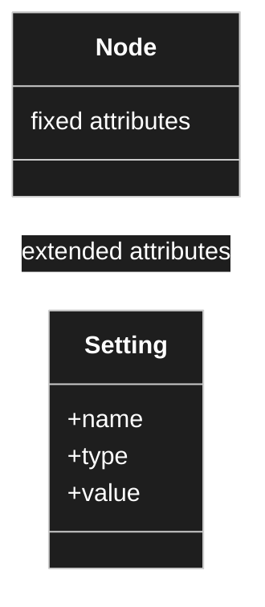

**Settings and attributes are the same kind of thing.** A setting is not a second concept
beside the attribute — it is simply an **additional** attribute that a node carries beyond the
set every node has. What differs is only *where the value is stored*, not *what it is*.

| # | Statement (owner, 2026-08-22) |
|---|---|
| **C3** | Settings and attributes are the same kind of thing. The settings of a node are the group of **additional** attributes it carries. |
| **C4** | The attributes that **every** node has are stored **on the node itself**. |
| **C5** | The attributes that appear only through **specialisation** — an integer node carrying min, max, step — are stored **generically, in the settings table**. |
| **C6** | For display the two sets are re-joined: the fixed ones first, the extended ones beneath. How exactly is a renderer concern and is not settled here. |

**Working names:** *fixed attribute* (C4) and *extended attribute* (C5). Both are attributes.
Glossary candidate — the previous round lost two years to *Eigenschaft / Attribute /
Parameter / Slot* drifting apart, so the words are fixed before the model is.

### Why this split, and what it costs

**For it.** The fixed set becomes real columns: indexable, sortable, joinable, type-checked by
the database, and one row reads a whole node. The extended set is genuinely open-ended, so a
generic table is the honest shape for it. This hybrid is also what WordPress itself does
(`wp_posts` columns beside `wp_postmeta`), which makes it idiomatic for the environment
rather than exotic.

**Against it.** Reading a node now touches two places, and display has to re-join them. The
owner judged this acceptable, and that judgement holds: the fixed attributes are the same for
every node, which gives the user something recognisable, and the extended ones can simply
appear beneath.

**One constraint that follows.** The re-join must load in **batches**, never per node — a
settings lookup inside a tree walk is exactly the N+1 that `CD-7` forbids.

### Open, and deliberately not answered here

- **Is "setting" one thing or two?** [OQ-016](91-open-questions.md) — C5 describes domain
  content (min, max, step), while [`TreeMeremaid.md`](TreeMeremaid.md) puts `order`, `hide`,
  `read_only`, `renderer`, `converter`, `validators[]` in the same box. Those are tool
  behaviour. Whether they are the same construct is not decided.
- **Which attributes are the fixed set?** [OQ-017](91-open-questions.md) — C4 turns them into
  columns, so the list has to be enumerated and then frozen.
- **Where does an extended attribute's value live?** [OQ-018](91-open-questions.md) — C2 says
  an attribute connects to another node; C5 puts it in a settings table as a value. Those are
  different storage locations for the same concept.

### C7–C10 — settings hang on edges too

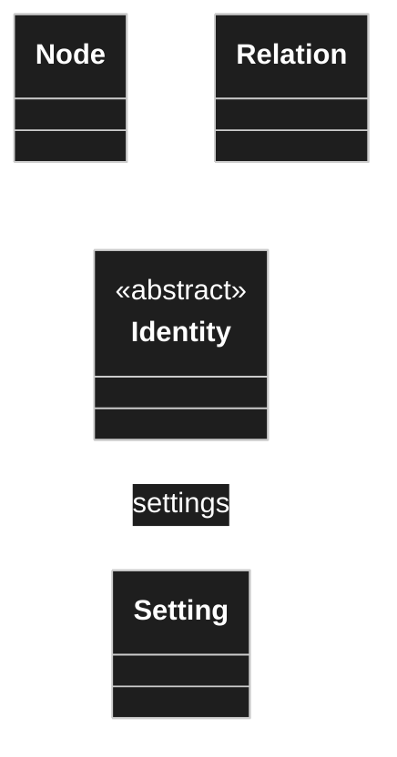

| # | Statement (owner, 2026-08-22) |
|---|---|
| **C7** | Every child node **inherits the attributes of its parent** and either takes them over unchanged, or **overrides** them. |
| **C8** | To record an override, the describing data has to live somewhere. Therefore settings are also **hung on the edges** — on the connection itself, not only on the node. |
| **C9** | For the **inheritance** edge this is not needed; other rules already apply there. |
| **C10** | For **composition and aggregation** edges it is needed. Currently those are believed to be the only edge kinds that need settings. ⚠️ *stated with "I believe"* |

**The seed already anticipated this.** In [`TreeMeremaid.md`](TreeMeremaid.md), `Configuration`
hangs off `WPClassHead`, and both `Node` and `Relation` extend it. So configuration on edges was
drawn before it was argued for. C8 confirms the diagram rather than changing it — the settings
owner is *anything with identity*, not *a node*.

### Why an edge needs its own settings

C8 is the per-use-site case. A node describes a thing **once**; the same thing can be used in
several places, and each use may need to look different — a different label, read-only here but
editable there, a different multiplicity. That configuration cannot live on the node, because
the node is shared by every use site. It belongs on the **edge**, because the edge *is* the use
site.

Inheritance is exempt (C9) because it is not a use site: a child that wants a different value
simply states its own, and the inheritance rules resolve it. There is only one inheritance edge
per node, so there is nothing to distinguish.

**C10 also names edge kinds for the first time** — inheritance, composition, aggregation. That
is a partial answer to [OQ-002](91-open-questions.md), which asked what the non-inheritance
edges are. It was said with "I believe", so it is recorded, not locked.

**Open:** [OQ-021](91-open-questions.md) — what distinguishes composition from aggregation
here, and does the model need both? [OQ-022](91-open-questions.md) — one settings table with a
polymorphic owner, or one per owner kind?

## Owner statement — 2026-08-22, third pass

| # | Statement |
|---|---|
| **C11** | `Identity` is shared by nodes and edges and carries **more than an id** — a version number among other things. Drawing ids from **one common space** is acceptable. |
| **C12** | **Composition** means the part is part of the model and is **deleted with it**. |
| **C13** | **Aggregation** always points at another node. Composition may point at another node too — but since a composed part is firmly bound to its whole, its data could in principle be held in the attribute itself. No mechanism exists for that yet. |
| **C14** | Inheritance resolution walks from the child **up to the last ancestor**, in case of doubt to the root. It may stop as soon as no ancestor contributes an attribute. |
| **C15** | Attribute settings resolve **downwards**: an attribute references a node, that node may have children, and the settings have to reach into all of them. |

**Open, and put to the writer of this document by the owner:** should the inheritance edge be
one edge kind among others with extra rules, or a separate construct altogether?
→ [OQ-023](91-open-questions.md).

### C12/C13 — composition and aggregation do differ

This answers [OQ-021](91-open-questions.md). The distinction is the UML one, and both are needed:

| | Points at another node | Lifecycle |
|---|---|---|
| **Aggregation** | always | the target is independent and survives the whole |
| **Composition** | yes | the target belongs to the whole and **is deleted with it** |

The worked example the owner raised — a parts list made of positions, where a position is used
nowhere else — is the case where composition earns its keep. It is discussed under
[OQ-026](91-open-questions.md), because the tempting answer (store the position inline instead
of as a node) would create a second form of structure, and two forms of structure is what the
previous round died of.

### C14/C15 — resolution runs in two directions

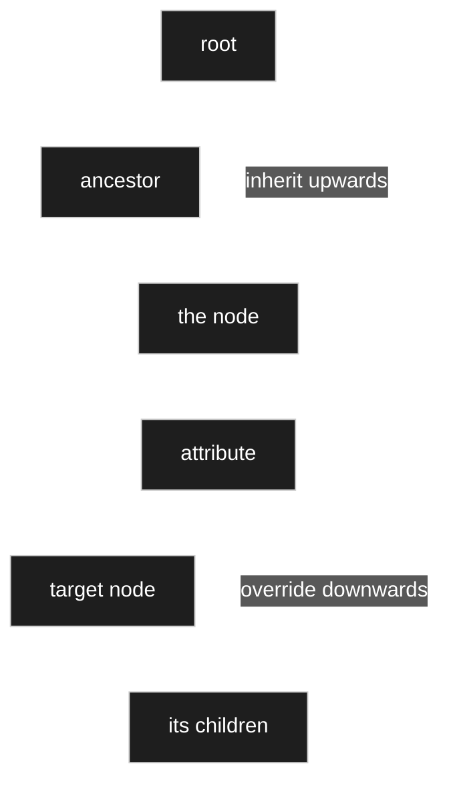

Two different walks, easily confused because both are called *resolution*:

- **Upwards (C14).** What attributes does this node have at all? Answered by walking the
  inheritance chain toward the root. Bounded: the chain is a path in a tree.
- **Downwards (C15).** How is this attribute configured, including deep inside its target?
  Answered by walking into the target and its children. **Not** bounded by anything stated
  so far — the target is a graph, not a path.

The downwards walk is the expensive one and the one that broke the previous project as trees
grew. How it is resolved and cached is [OQ-024](91-open-questions.md); how an override deep in
the target is addressed and stored is [OQ-025](91-open-questions.md).

## Owner statement — 2026-08-22, fourth pass: versioning

| # | Statement |
|---|---|
| **C16** | A version makes visible that **something was changed** on a node or an edge. |
| **C17** | It also matters for the **data** later. If the model changes and data already exists: in the best case the old data carries into the new model — a field was simply added. In the worst case it becomes a **new model version** and a **mapping** from old to new is required. |
| **C18** | The user must **not have to re-enter data**. A model change creates a discrepancy, and the user has to be able to resolve it with suitable means. |

**This changes how `version` should be read.** It is not primarily an audit marker. It is the
anchor for surviving a model change with the data intact — which makes it a load-bearing part
of the model rather than bookkeeping. The mechanism is [OQ-031](91-open-questions.md), and it
cannot be settled before [OQ-015](91-open-questions.md) says where content lives at all.

## Owner statement — 2026-08-22, fifth pass: names, and two attribute settings

| # | Statement |
|---|---|
| **C19** | An attribute can be set **read-only** and **hidden**. Hidden matters in its own right: hidden fields can be created and used later for **calculation**. |
| **C20** | A node **needs a name**, and that name is the model author's own. |
| **C21** | **Names are not unique, and duplicates are expected.** Two attributes may share a name; two different nodes may each have a child of the same name. |
| **C22** | **A decision is never made on the basis of a name.** References always use the **id**. Searching by name is fine; resolving by name is not. |
| **C23** | The id stays the same — that is the point of it. **The name may change.** For a child, the name is only a textual description so the user can recognise it, and carries no meaning for the code. |

C20–C23 close [OQ-032](91-open-questions.md): the base name is **required**, and it is
explicitly **not unique** — so the sibling-uniqueness idea raised there is rejected, on the
grounds that duplicate names are a normal modelling outcome rather than a mistake to prevent.

C19 adds two attribute settings, and *hidden* turns out not to be only a display concern: a
hidden attribute still exists, still holds a value, and is meant to feed calculations. It is
invisible, not absent.

## Owner statement — 2026-08-22, sixth pass: model and instance

| # | Statement |
|---|---|
| **C24** | **Modelling view and data view are separate.** The model and an instance of it are different things. |
| **C25** | An attribute carries a **type**, and that type **is the node the relation points to**. |
| **C26** | In the modelling view a **default** may be given, and that default may be **a whole record — the data of an instance**, not only a scalar. |

### C24 — the two layers

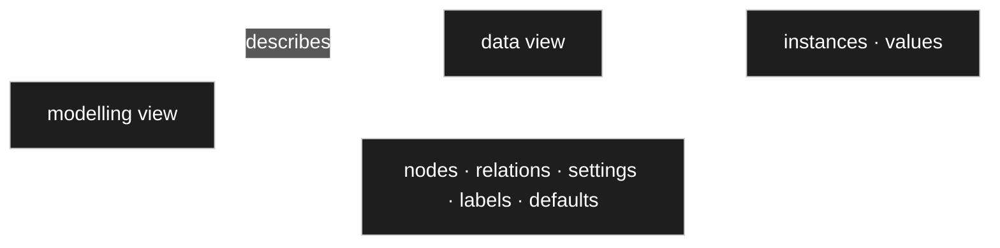

**What this settles: at model level there are no values, only defaults.** A value belongs to an
instance. Half of [OQ-018](91-open-questions.md) was therefore the wrong question — it mixed the
two layers and asked where *the value* of a model-level attribute lives. There is none.

C25 answers [OQ-011](91-open-questions.md) outright: [C2](#owner-statement--2026-08-22)
listed *type* and *connection kind* as two separate things, and now it is clear why. They are
**two fields of the same edge** — `to` is the type, `kind` is the connection.

### C26 — a default can be an instance

This is the part that does *not* simplify. A scalar default (`step = 1`) is an ordinary setting.
A default that is **an entire record** is a reference to something in the data layer, from an
object in the model layer. That needs somewhere to point → [OQ-035](91-open-questions.md), and it
depends on whether instances share the identity space → [OQ-036](91-open-questions.md).

**It also probably removes a question.** [R22](30-renderer.md) said the preview runs on *test
data*, and [OQ-033](91-open-questions.md) asked where that data lives. If a node can carry a
default instance, the preview has nothing left to invent: **it renders the node with its default
instance.** No separate test-data mechanism, and the sample updates itself whenever the default
does.

## Owner statement — 2026-08-22, seventh pass: three layers, and defaults

| # | Statement |
|---|---|
| **C27** | There are **three** layers, not two: the **model**, the **data** entered into it, and the **presentation** — the latter being what the renderer concept covers. |
| **C28** | **Test data is ordinary data, marked as such.** Rows can be flagged as test data, and the preview renderer uses those. The default value is checked at the same point. |
| **C29** | A **default** says how data is filled by default. An integer with default `10` means a new record starts at `10`. |
| **C30** | Defaults work **with multiplicity**: several defaults, several pre-filled rows. |
| **C31** | A default may be a **node reference**. Given an attribute that chooses from four options, options one and two can be the defaults — and those options are nodes too. |
| **C32** | The same holds for an **aggregation**: take the target node, look at which values get filled, and pre-fill them. |
| **C33** | **The default is entered in the attribute, but it looks exactly like entering data into the model.** Same display, same interaction. |

### C33 — the default editor *is* the data editor

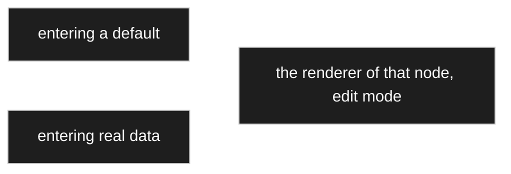

This is the strongest reuse statement in the concept so far, and it costs nothing to honour —
it is [R1](30-renderer.md) and [R4](30-renderer.md) applied one level up. Filling a default is
filling data; the only difference is where the result is written. **One editor, built once.**

It also gives the answer to the usability worry in C30–C32: entering a default for an aggregation
with multiplicity `1..*` is intimidating only if it is a separate, unfamiliar screen. As the
ordinary data editor, it is something the author already knows how to use.

### C28 — test data stops being a third kind of thing

[OQ-033](91-open-questions.md) asked where preview data lives, having noted it was neither model
nor content. C28 answers: **it is content, with a flag.** No new storage, no new concept — the
preview renders the node in the data view over rows marked as test data, and falls back to the
defaults where none exist.

### C31, C32 — a default is a reference, not only a scalar

This narrows [OQ-035](91-open-questions.md) to its smallest option: a default is stored as a
**setting whose value is an identity reference**, and multiplicity means several such settings.
`Relation.from` and `Relation.to` stay pointing at nodes; nothing widens.

## Owner statement — 2026-08-22, eighth pass: the two-fold principle

| # | Statement |
|---|---|
| **C34** | **Two-foldness.** For a whole class of behaviours there are two levels: a **default behaviour configured in the admin menu**, and the **choice the user makes in the moment**. This concept is to be kept and applied wherever it fits. |
| **C35** | An override whose path has disappeared — the parent deleted the thing it pointed at — is **not** cascade-deleted. **The user decides.** Either delete them, or **promote the override into an attribute of its own** at the level where it was overridden: if it was worth overriding, it is evidently needed. |

### C34 — a pattern, not a single rule

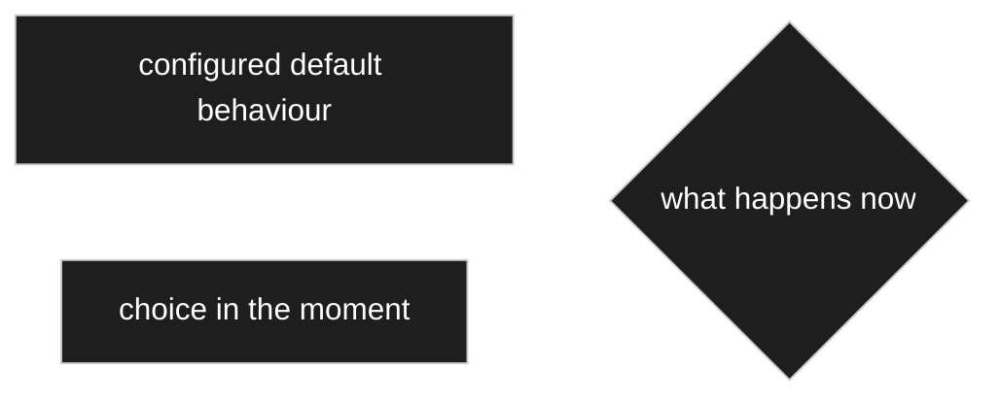

The two levels are not competing answers to one question; they are **two questions**. *What
should normally happen* is configuration. *What happens this time* is the user. Anywhere the
concept applies, both have to exist — the configured default alone makes the system rigid, the
choice alone makes it tedious.

It already applies in three places named so far: the orphaned override (C35), inline-versus-dialog
selection ([R24](30-renderer.md)), and the renderer choice, which has a node default that a use
site may override.

### C35 — the second option is the interesting one

Deleting an orphaned override is obvious. **Promoting it is not**, and it is the better default
to offer: the override exists because someone needed that value at that place. Losing the target
does not make the need go away — it means the value should now stand on its own, as an attribute
at that level, rather than as a correction to something that no longer exists.

Mechanically that is a new relation plus its settings, created from what the override already
held. Nothing new is required, but **it is an operation, not just a dialog** — see
[OQ-037](91-open-questions.md).

## Owner statement — 2026-08-22, ninth pass: the settings hierarchy inside an attribute

| # | Statement |
|---|---|
| **C36** | **An attribute contains a hierarchy of its own.** There are settings for the target; beneath them, settings for each of the target's attributes; beneath those, settings for *their* attributes. At every level the author either **overrides** or **leaves it as inherited**. |
| **C37** | **Sharing a node requires an identical definition.** A parts list and a quotation would not share a *position* — their positions differ. They would share an *article*. Sharing happens at the reusable end of the graph, not at the composed end. |
| **C38** | When overrides are orphaned, a **dialog** shows where they are defined and asks whether to keep them. Keeping means **taking the override over as an attribute of its own, inside that hierarchy**. |

### C36 — the override path *is* the hierarchy

This restates [C15](#c14c15--resolution-runs-in-two-directions) more precisely than it was
written. Configuring an attribute is not filling in one form; it is walking a tree whose shape is
the target's own structure, deciding at each node whether to accept what is inherited or to state
something else. The **override path is that tree**, and it is sparse because most levels are
accepted unchanged ([D-015](90-decision-log.md)).

### C37 corrects a worked example

The scenario drawn for [OQ-037](91-open-questions.md) had a parts list and a quotation sharing
one `Position`. The owner is right that they would not: a position in a parts list and a position
in a quotation carry different attributes, so they are different nodes. **The sharing happens one
level deeper, at `Artikel`** — which is the node whose attribute the scenario deletes. The example
was drawn at the wrong edge, not built on a wrong idea.

### C38 — and the mechanism it needs

*Keep it as an attribute of its own* is clear from the author's side. Mechanically it cannot mean
*add the attribute back to the target*, because the target is shared — that would restore it for
everyone, which is what the deletion was undoing. It has to mean **specialise**: create an
inheriting child of the target that carries the attribute, and point this one use site at the
child.

That is inheritance being used for exactly what it exists for — a use-site-specific variant of a
shared node — and it follows the precedent of [D-017](90-decision-log.md): the node is created in
place, so the author never experiences having made a separate global object. → the fourth option
in [OQ-037](91-open-questions.md).

## Owner statement — 2026-08-22, tenth pass: units, and what inheritance buys

| # | Statement |
|---|---|
| **C39** | A good deal is fixed **through inheritance**. A weight is not a bare double — it has its own type node that takes a numeric value *and* a unit, prefix included. |
| **C40** | There are several kinds of unit value: **base units**, and **currencies**. A two-part split. |
| **C41** | **Composed types** are defined and reused elsewhere; **models** are then built on top of them. |
| **C42** | A type already anticipates part of how it is composed, and its settings. |
| **C43** | Because a child inherits its parent's attributes, using a node means looking **only at that node** — not walking back up to the parent. This makes the attribute structure **flatter** in use. |
| **C44** | ⚠️ **Correction, made by the owner mid-thought:** the numeric field does **not** belong to the base unit. A **unit value** is its own composed type — a value field (integer or double) **plus** a base unit. |

### C44 — the correction is the load-bearing part

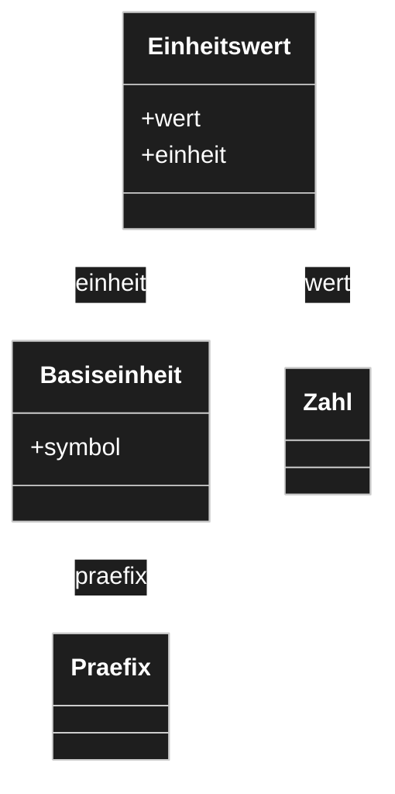

The first version of the thought put the double on the base unit. That would make *gram* a
number, which it is not — a gram is a **definition**. The number belongs to the **unit value**,
which is an ordinary composed node with two attributes. `Gewicht` is then a specialisation of
`Einheitswert`.

Nothing new is needed for this: it is [D-031](90-decision-log.md) — attributes are relations —
applied twice.

### C39, C41, C42 — the type layer

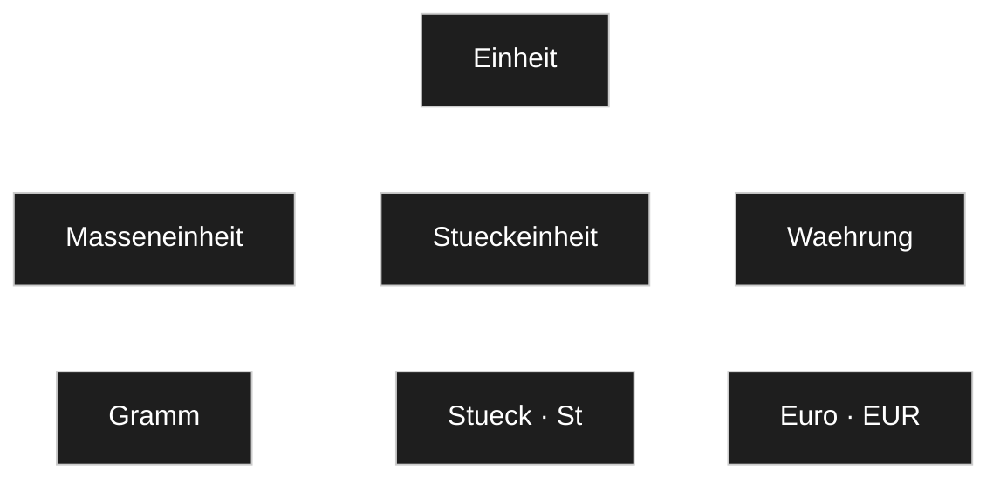

Types are built by inheritance, reused by composition, and models are assembled from them. The
tree of units is itself model — authored once, referenced everywhere.

### C43 — flatter for the author, not for the machine

The claim is right and worth stating exactly: **a concrete type presents its whole inherited
attribute set**, so whoever uses it never walks the hierarchy. Inheritance is a *definition-time*
mechanism; at use time one sees the resolved whole.

What it does **not** do is make the work go away. The resolution still happens — it is
[C14](#c14c15--resolution-runs-in-two-directions), the upward walk — and it happens on every
read. That is precisely why [D-014](90-decision-log.md) puts an indexed ancestor structure into
the schema rather than treating it as a later optimisation. **The structure is flatter; the
lookup is not free.**

### What this raises

Four questions, and the third is the largest thing to come up since the attribute question:

| | |
|---|---|
| [OQ-040](91-open-questions.md) | Is a currency a branch of units, or a separate concept? |
| [OQ-041](91-open-questions.md) | Is a prefix a node or an enum? |
| [OQ-042](91-open-questions.md) | **Does an attribute's type name one node, or a branch?** |
| [OQ-043](91-open-questions.md) | Is the unit tree shipped with the plugin, or authored? |

## Owner statement — 2026-08-22, eleventh pass: units, prefixes, and what a type names

| # | Statement |
|---|---|
| **C45** | The nodes describing relation kinds **do not belong in the tree**. They were only there to show which kinds exist. |
| **C46** | The duplication of `Praefix` and `Kuerzel` on parent *and* child in the old tree **was wrong**. The intent was: constants define the prefixes, each with a hidden field carrying its **multiplier**; unit types then use those. Define once through inheritance, then use that node as an attribute type. |
| **C47** | There is **one** notion: the **unit value**. It is composed of a **value**, an optional **prefix**, and a **unit**. |
| **C48** | Which part varies is determined by the sense of the unit value: converting euro to dollar changes the **unit**; metre to kilometre changes the **prefix**. |
| **C49** | When defining a unit, the author wants to say **which prefixes are permitted** — no gigametres. This must be **generic, definable in the modeller**, not a coded data type. The previous attempt hard-coded a type and kept breaking whenever a new case appeared. |
| **C50** | If the type of an attribute is a plain node, it is clear — there is no branch behind it. |
| **C51** | If the type is a **branch**, the type is *of branch kind*: **polymorphic**, one substitutable for another — and at data entry **a node from that branch must be chosen**. |
| **C52** | Some types need only the node chosen, because they have no attributes. Where the chosen node **has** attributes, the user must then fill them. |
| **C53** | Hence a **multi-step input**: first choose the node, then enter data if needed. |

### C50–C53 — this answers [OQ-042](91-open-questions.md)

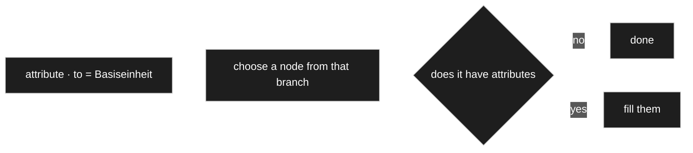

**The type of an attribute is a branch, and the branch is polymorphic** — any descendant may
stand where the branch root is named. That is inheritance doing what inheritance is for, and it
makes three things fall together that looked separate:

1. **The chooser is the type system.** [R25](30-renderer.md) already gives a chooser a *branch
   node* and a *default node*. An attribute gives exactly those two — `to` is the branch, its
   default is the default.
2. **A choice list stops being special.** `Konstanten › Bauformen` is an attribute whose branch
   happens to be shallow. No separate mechanism.
3. **The multi-step input (C53) is the chooser followed by the editor** — [R25](30-renderer.md)
   then [D-029](90-decision-log.md), which already says the editor is the same one that enters
   real data.

C50 is the degenerate case: a branch with no descendants and no attributes is simply a value.

### C49 — allowed prefixes, and the question the owner asked

The owner asked which is better: two branches (`With prefix` / `Without prefix`, as the old tree
has) or **one** branch where the prefix is always present and hidden where it does not apply.

**Recommendation: neither. Make the permitted set a setting, and both cases fall out.**

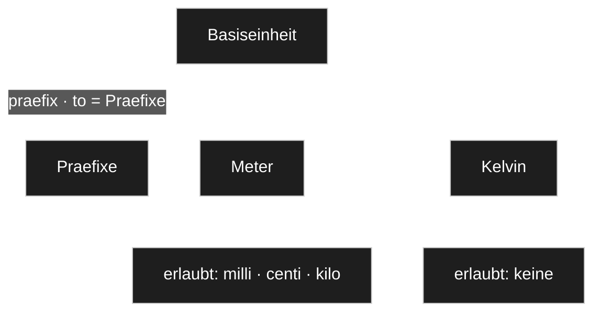

There is one `Basiseinheit` with one `praefix` attribute pointing at the prefix branch. What each
unit permits is an **allow-list setting on that attribute**, inherited and overridable like every
other setting ([D-015](90-decision-log.md)).

- **Metre** permits milli, centi, kilo — and not giga, exactly as C49 asks.
- **Kelvin** permits **nothing**. The control disappears because the permitted set is empty, not
  because someone configured *hide*.

Why this beats both alternatives:

| | Problem |
|---|---|
| Two branches | *Takes a prefix* is a yes/no, but the real requirement is *which ones* (C49). Two branches answer the coarse question and leave the fine one unsolved. A unit that later gains prefixes has to move in the tree. |
| One branch, hidden | Uses a **display** setting to encode a **modelling** fact. The data model would still permit Kelvin a prefix; only the screen would hide it. |
| Allow-list | One mechanism answers both. *No prefix* is *the empty allow-list* — a special case that needs no special case. And it is generic and author-definable, which is what C49 demands. |

This is also the shape [OQ-042](91-open-questions.md) needs anyway: **an attribute names a branch
and may narrow it.** The prefix allow-list is the first instance of a general capability, not a
unit-specific feature.

## Owner statement — 2026-08-22, twelfth pass: type node or model node?

| # | Statement |
|---|---|
| **C54** | The recurring question is: when do I have a **model node** — a finished model the user enters data into — and when do I define a node **as a type**, simple or composed? |
| **C55** | **The two do not really differ. They are all nodes.** A single type can be used exactly like a model type. What differs is that the input becomes **nested and more complex**. |
| **C56** | **That is why the renderer concept exists** — to display nested data simply, and to let the user shape the output by choosing a renderer and refining it with the renderer's settings. |

### C55 — one construct, three roles

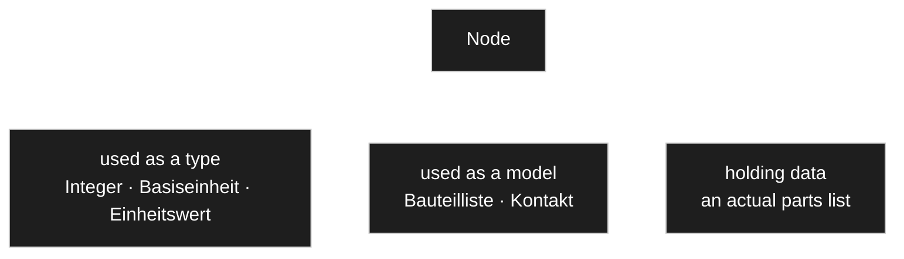

**This is [V5](00-vision-and-scope.md) in its strongest form.** *Type* and *model* are not two
kinds of node — they are the same construct in two **roles**, and the role is a matter of where a
node sits and how it is used, not of what it is. A composed type is a small model; a model is a
large type. Nothing in the engine needs to tell them apart.

Note this is a **different axis** from [D-026](90-decision-log.md). That decision separates the
**model layer** from the **data layer**; C55 says that *within* the model layer, type and model
are one thing. Both hold at once:

| | Layer | Role |
|---|---|---|
| `Integer`, `Basiseinheit` | model | used as a type |
| `Bauteilliste` | model | used as a model |
| a specific parts list | data | — |

**C56 states why the renderer concept had to exist at all**, and it is worth recording as the
reason rather than as a feature: if a model is just a deeply composed type, then entering and
showing one *is* the hard problem. [R1](30-renderer.md) — everything through a renderer — is the
answer to a consequence of C55, not a preference.

**Open:** if nothing structural separates the roles, how does the tool know where to offer *enter
data*? The standard tree answers by **placement** — `Definition` versus `Model` versus
`Implementation` are branches, not node kinds. Whether that is pure convention or wants a marker
is [OQ-048](91-open-questions.md).

## Owner statement — 2026-08-22, thirteenth pass: when is the content determined?

| # | Statement |
|---|---|
| **C57** | **Pure data-type nodes hold no data.** Nodes that are *used* hold data. (The owner deliberately avoids the word *model node* here.) |
| **C58** | There will also be **data types that are filled** — a choice list, an enumeration node. What is stored in them can then be used in other models. |
| **C59** | The difference: for those, the **contents are fixed at modelling time**. For the other kind, the contents are **decided at input time**. |
| **C60** | A permitted-prefix restriction was set up by **activating and deactivating the inheriting sub-nodes at the attribute**, and that worked well in practice. |

### C57–C59 — a better axis than "type or model"

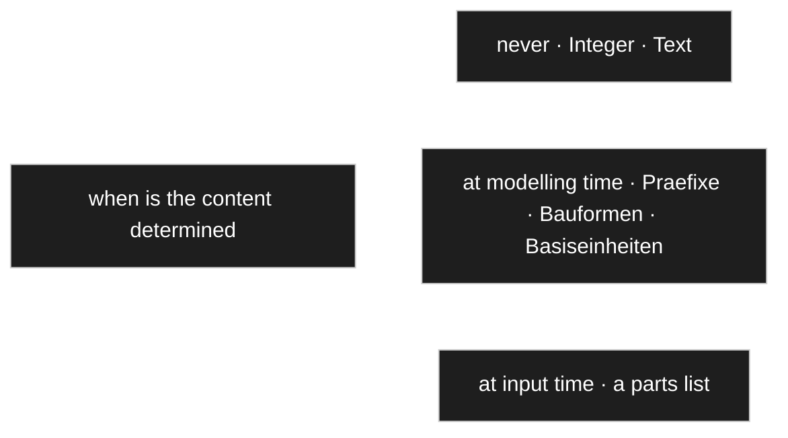

This sharpens [C55](#c55--one-construct-three-roles). *Type versus model* was the wrong axis
because it has no crisp test. **When the content is determined** has one, and it produces three
positions instead of two — with the middle one being exactly the branches the standard tree
calls `Konstanten`.

The middle case is worth naming because it is easy to lose: `Präfixe`, `Bauformen`,
`Basiseinheiten` are **data authored in the modeller**. They are not types in the sense that
`Integer` is, and they are not user input either. [D-041](90-decision-log.md) already covers how
they are used — an attribute names their branch and an instance picks from it.

**This also half-answers [OQ-048](91-open-questions.md):** content determined at modelling time is
edited in the modeller; content determined at input time is edited in the data view. The question
of how the tool *knows which is which* remains.

### C60 — we are on the same line, with one refinement

The owner's mechanism — tick the sub-nodes of the branch on or off at the attribute — and the
allow-list proposed here are **the same thing described from two sides**. The interface is a list
of checkboxes either way, and that is the part that already worked.

One thing does need deciding, because it changes behaviour later:

| | Stored | When a new prefix is added to the branch |
|---|---|---|
| **Deactivations** (opt-out) | what is excluded | it becomes available everywhere automatically |
| **Activations** (allow-list) | what is permitted | it stays unavailable until permitted |

Opt-out matches [D-015](90-decision-log.md) — a change to the base reaches every use site that did
not override. But it makes *no prefix at all* awkward: Kelvin would have to exclude every prefix
individually, and would silently gain each new one.

**Recommendation: store a mode plus a list** — *all except {…}* or *only {…}*. The default mode is
*all except {}*, so a fresh attribute permits everything; Kelvin sets *only {}*. Two words of
schema, and the checkbox list stays exactly as it was.

The one thing that must not change: this is a **setting**, inheritable and overridable per use
site, never a coded type. That was the owner's requirement after the previous attempt kept
breaking on new cases.

## Owner statement — 2026-08-22, fourteenth pass: do not ask what cannot matter

| # | Statement |
|---|---|
| **C61** | Whether permitted sub-nodes are handled by activating or by deactivating should be **the user's choice**, made when a new sub-node is created. |
| **C62** | **But if the type is not used anywhere yet, the question is pointless and would only get in the way.** It should be suppressed. |
| **C63** | **The same principle applies to model versioning.** With no data present, a new version causes no break, whatever it changes. |
| **C64** | Test data are a possible exception, and the lean is: **do not take them into account**, but **warn** that they may need adjusting. |
| **C65** | How test data come about is open — a checkbox *is test data* / *is default value* would do it. |
| **C66** | Storage of a unit value is undecided. Either always store the base unit and keep the prefix for output, or bind value and prefix one to one — in which case changing the prefix to kilo must change an already entered value. **What matters is that data go in correctly and come back out correctly.** |

### C62/C63 — a principle worth naming

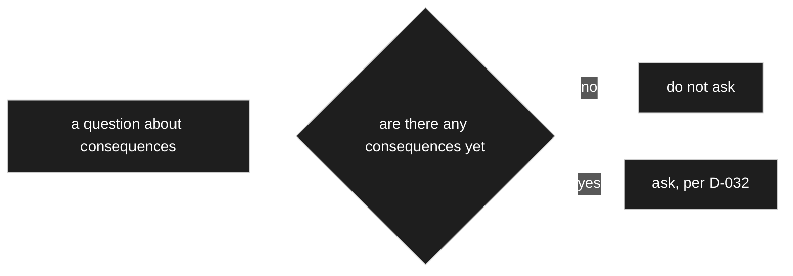

**Do not ask what cannot matter.** If nothing uses a type, nothing can break, so there is nothing
to decide. If no data exist, a model change cannot be breaking. Both are **checkable** — *is this
used anywhere*, *does data exist* are queries the system can answer for itself.

This extends [D-032](90-decision-log.md) rather than competing with it. The two-fold principle
says *a configured default plus the choice in the moment*; this adds a step in front: **and no
question at all when the answer changes nothing.** It is also what keeps a dialog-heavy design
from becoming exhausting — the dialogs appear exactly where something is at stake.

C64 is the same rule with one exception carved out: test data are consequences, but cheap ones.
**Warn, do not block** — and say which test data are affected.

### C66 — proposal: store canonical, display with the prefix

The owner asked for a proposal and said the choice does not matter as long as data go in and come
out correctly. It does matter, in one specific way — **aggregation**.

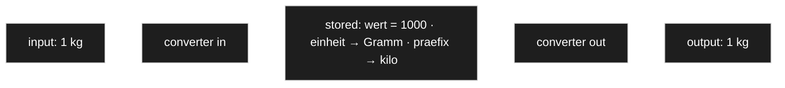

**Recommendation: store the value in the base unit; store the chosen prefix beside it as the
display form.**

| | |
|---|---|
| **Why** | [D-045](90-decision-log.md) sums across a collection. Adding `5 kg` and `300 g` is only possible on a common scale — with values stored as entered, every aggregate has to convert first, and a missed conversion is a silently wrong total. |
| **The owner's worry disappears** | *Change the prefix to kilo and the entered value must change* — with canonical storage only the **display** changes. `1000 g` shown as kilo is `1 kg`. Nothing is migrated, nothing is at risk. |
| **When conversion happens** | At the renderer boundary, both ways — which is exactly what the **converter** of [V8](00-vision-and-scope.md) is for, and what [D-043](90-decision-log.md) already called a converter rather than a calculation. |
| **Precision** | Store a decimal or scaled integer, never a float. Repeated conversion of a binary float drifts, and a total that is off by a cent is worse than no total. |

**One exception, and it follows from [C48](#owner-statement--2026-08-22-eleventh-pass-units-prefixes-and-what-a-type-names):**
a **prefix normalises, a unit does not.** `1 kg` and `1000 g` are the same quantity; `10 EUR` and
`11 USD` are not — the rate is a time series, so a currency amount stays in the currency it was
entered in. Which is why C48 said a currency changes its *unit* while a length changes its
*prefix*.

### C65 — where test data come from

Three sources, in fallback order, so the preview always has something and the author invests only
as much as they want:

1. **A record flagged as test data** ([D-028](90-decision-log.md)) — entered in the ordinary data
   editor with a checkbox, which is [D-029](90-decision-log.md) working.
2. **Otherwise the defaults** of the attributes ([D-030](90-decision-log.md)) assembled into a
   sample.
3. **Otherwise generated from the settings** — type, `min`, `max`, `step` already describe what a
   valid value looks like.

Answering the owner's *how do I even get to test data*: by entering a record and ticking a box.
Nothing new to learn, and step 3 means a brand-new type previews immediately without anyone
entering anything.

## Owner statement — 2026-08-22, fifteenth pass: precision and money

| # | Statement |
|---|---|
| **C67** | Numbers are **whole numbers or decimals**. The underlying data type does not matter — if floating point is unsuitable, it is left out. |
| **C68** | **Money is the special case again.** Full precision is stored, including places that are never shown. |
| **C69** | Below the visible cent, **rounding rules** take over. An amount smaller than one cent must still show that *something* is owed — not zero, but a minimum of one cent. |
| **C70** | Hence: **calculate and store at full precision, display in a form a person can read.** |

### C67–C70 — one rule with two axes

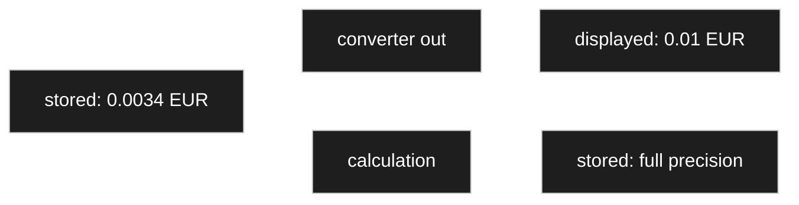

C70 is [D-051](90-decision-log.md) again along a second axis. That decision said *store canonical,
display with the prefix*; this says *store at full precision, display rounded*. Same shape: **the
stored form serves correctness, the shown form serves the reader**, and the converter sits between
them.

It also has the same consequence: aggregation runs on the stored values. Summing displayed,
already-rounded amounts accumulates the rounding error — a hundred lines rounded up individually
can miss the true total by a euro.

**C69 is a genuine constraint, not a detail.** A rounding rule that turns `0.003 €` into `0.00 €`
does not merely lose precision — it reads as *free*, which is a different statement. Rounding to
the nearest is wrong here; a nonzero amount must not display as zero.

### C71–C73 — the rate, and when it has to be frozen

| # | Statement (owner, 2026-08-22) |
|---|---|
| **C71** | Euro normalisation was **not** meant. An amount may perfectly well be stored in dollars. |
| **C72** | There is an **exchange rate**, and sometimes it has to be **frozen**. Ordering for ten dollars, which is eight euros fifty that day, means that price has to stay put. |
| **C73** | So either convert to euro **on that day** and keep the result, or **store the rate** of that day alongside. |

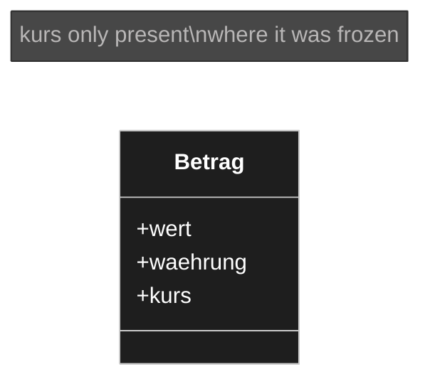

**Recommendation: store the amount in its own currency, plus the rate that was frozen. Derive the
converted figure.**

Of the owner's two options, the second. Storing only the converted result loses what was actually
agreed — *ten dollars* becomes unrecoverable, and *what did we order for* stops being answerable.
Storing both amounts would record one fact twice, which the code standard forbids, since
`converted = amount × rate`.

Ten dollars at a frozen rate of `0.85` yields eight euros fifty whenever it is asked, next week
and next year. **The frozen rate is the thing that makes the price stay put**, and it is smaller
and more honest than a second amount.

**The exception, stated so it is not discovered later:** where a converted figure is *legally*
fixed — a posted invoice, a booking — the booked amount may have to be stored as well, because it
must not shift if a rounding rule is ever corrected. That is a genuine exception to *never store a
fact twice*, justified by law rather than by convenience, and it needs saying out loud when the
case arrives rather than being smuggled in.

### Freezing here is right, and freezing a label was not

Two things that both looked like *freeze or track* get opposite answers, and the reason is worth
keeping:

| | | |
|---|---|---|
| **A label** | a **name** for a thing | names **track** — [D-053](90-decision-log.md) |
| **A rate** | a **term of an agreement** | terms **freeze** |

Renaming a unit does not change what was agreed; the rate on the day *is* part of what was agreed.
So the rule is not *always track* or *always freeze* but: **track what describes, freeze what was
agreed.**

**Where the freezing is switched on** follows [D-032](90-decision-log.md): the *model* says whether
this amount freezes its rate — a setting on the attribute — and the *record* carries the rate that
was frozen.

### C74–C77 — the rate needs a direction, and that is where the confusion came from

| # | Statement (owner, 2026-08-22) |
|---|---|
| **C74** | The freezing could be an **additional attribute**, so it hangs on the record: a price of ten dollars plus a hidden field *conversion rate dollar to euro*. |
| **C75** | ⚠️ *"But then which currency do I hold? Do I always convert dollars and store dollars plus the day rate to euro — or, being in euro anyway, need no conversion? There is still an inconsistency in my head."* |
| **C76** | The day rate would have to be fetched from the internet — and that is where the **rate table** comes in: ask once per day, for the currencies already known, and it is then fixed in the table under that date. |
| **C77** | Whether intraday fluctuations need to be captured is an open question the owner has no basis to judge. |

**The inconsistency has one cause: a rate is between *two* currencies, and only one of them has
been named.** `0.85` means nothing on its own. Once the second currency is fixed, the confusion
goes away.

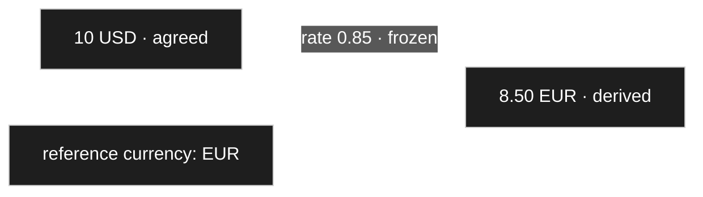

**Recommendation: the model declares one reference currency. A frozen rate always points at it.**

| | |
|---|---|
| **What is held** | the currency that was **agreed**. Ten dollars stays ten dollars. |
| **What the rate means** | *this amount's currency → the reference currency*, at the moment it was frozen. One direction, never ambiguous. |
| **When the amount is already in the reference currency** | the rate is 1 and nothing is stored. Which answers C75 directly: **no conversion, no rate, no special case.** |

The reference currency is a setting — per model, or per installation
([OQ-039](91-open-questions.md) is the same question about where installation-wide settings live).

### C74 — yes, but not as a hand-made hidden field

The instinct is right: it belongs on the record. But it should not be a hidden field the modeller
has to remember to add. **It belongs to the money type itself**, appearing when freezing is
switched on for that attribute.

Otherwise every author must remember it, and forgetting it loses the rate **silently** — the
amount still looks fine, and only later does anyone notice that eight euros fifty cannot be
reproduced. Structure, not convention.

### C76 — fetch at the boundary, read from the table

The owner's own sketch is the right architecture, and it fits `CD-1` exactly:

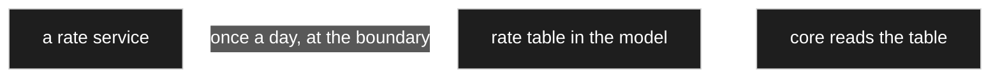

The core never calls out. A fetch is a boundary job that fills the table; everything inside reads
ordinary nodes. If the service is unreachable the table simply has yesterday's rate, and nothing
breaks — which is the whole reason for putting a table in between rather than calling out at the
moment of use.

### C77 — intraday rates are not needed

The owner asked for a judgement here rather than a guess, so: **a daily rate is the normal unit,
and for this product it is generous.**

- **Foreign exchange markets do move continuously**, and on a volatile day a rate can shift by
  more than a percent between morning and evening. So the fluctuation is real.
- **Almost nobody accounts on it.** The European Central Bank publishes euro reference rates
  **once per working day**, around 16:00 CET, and that is what most European bookkeeping is done
  against.
- **German VAT practice is coarser still:** the Federal Ministry of Finance publishes **monthly
  average** conversion rates for turnover tax, and those are what a tax office expects to see.

So the granularity that matters for ordering, pricing a parts list or issuing an invoice is
**daily at finest, monthly in practice**. Intraday would add precision nobody asks for and a great
deal of data.

**And the freezing is what actually protects the number, not the granularity.** Once
[D-064](90-decision-log.md) has stored the rate on the record, the price is stable no matter how
coarse the source was.

Two details the table will need either way: **weekends and holidays have no published rate**, so a
rule is required — *use the last published one* is the usual answer — and rates are quoted to
**four to six decimal places**, which the precision rule of [D-057](90-decision-log.md) already
covers.

### C78–C80 — money is a type with behaviour, and the currencies are model data

| # | Statement (owner, 2026-08-22) |
|---|---|
| **C78** | This implies a **type of its own for money — a currency value** — with additional functionality. |
| **C79** | **Which currencies exist is held in the model.** |
| **C80** | And things like **conversion into cents or other smallest units** belong to it. |

**C78 does not mean a subclass.** [D-036](90-decision-log.md) settled that: one node class, and
type-specific behaviour lives in **registered strategies** looked up by the type. So a currency
value is an ordinary composed node — value, currency, and a frozen rate where freezing is on —
whose *behaviour* is a registered converter and validator. Worth restating, because *this type
needs its own functions* is exactly the step that leads back to subclassing.

C79 fits [D-048](90-decision-log.md) without adjustment: currencies are **content determined at
modelling time**, like prefixes and base units — nodes in the model, not an enum in code.

### C80 — the minor unit, and what it does *not* decide

Each currency declares how many decimal places its smallest unit has. This is not uniform, which
is the reason it has to be data rather than a constant:

| | minor unit |
|---|---|
| Euro, US dollar | 2 |
| Japanese yen | 0 |
| Kuwaiti dinar | 3 |

**The minor unit governs display and rounding — not storage.** Storing amounts as whole minor
units (cents) is the common trick and it is not enough here, because
[C69](#c67c70--one-rule-with-two-axes) requires sub-cent amounts to survive: `0.003 €` has to stay
`0.003 €` internally and appear as at least one cent.

So: **store with more decimal places than the minor unit; round to the minor unit only for
display**, exactly as [D-057](90-decision-log.md) already says along the precision axis. The
currency node supplies the number of places to round to.

### ⚠️ One reading I did not adopt

The statement contains the phrase *always stored in euro with all decimal places, or something
like that*. Read strictly, that would mean **normalising every currency to euro**, and
[D-051](90-decision-log.md) deliberately does the opposite: a prefix normalises, a unit does not.

The reason is that normalising a currency requires an exchange rate **at the moment of storage**,
which silently freezes a rate into the data. Two records entered a week apart would then no longer
be comparable, and the original amount could not be recovered.

**Recorded as: store in the currency that was entered, at full precision.** If euro normalisation
was actually meant, this needs reversing — and then the rate used has to be stored beside the
amount, or the number becomes meaningless. → [OQ-054](91-open-questions.md).

## `Identity` — proposal closing [OQ-001](91-open-questions.md)

> ⚠️ **Proposal, 2026-08-22.** Three of the four points were already settled by earlier decisions;
> the fourth is a call of mine and is marked.

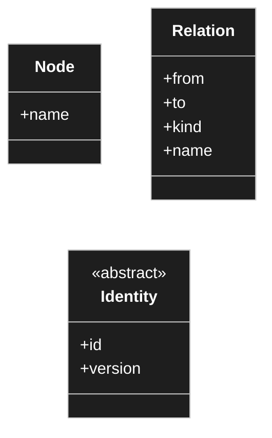

| | Decision | Why |
|---|---|---|
| **name** | **`Identity`** | `WPClassHead` puts WordPress into the name of the most central domain class, and `CD-1` forbids the core knowing WordPress exists. A name that lies goes first. |
| **`type`** | **not on the base** | A node's type **is its inheritance branch** ([D-041](90-decision-log.md)). There is nothing left for a `type` column to hold. A relation has a `kind`, which is its own field. |
| **`version`** | **stays — as a row change counter** | [D-060](90-decision-log.md) moved the *model* version to the record, so the two numbers are now demonstrably different things. What remains here is *this object changed*, which serves optimistic locking and cache invalidation ([D-016](90-decision-log.md)). |
| **`creation_date`** | ⚠️ **off the base, derived from the changelog** | [D-061](90-decision-log.md) makes the changelog load-bearing, so creation is always logged and the timestamp is already there. Storing it again records one fact twice. **My call** — if the join proves to hurt when listing trees, it becomes a materialised column like a computed value ([D-072](90-decision-log.md)), which is a cache and not a second truth. |

### What the base class is *for* — owner, 2026-08-22

| # | Statement |
|---|---|
| **C85** | The purpose was twofold: **realise the shared ids**, and **pin down the versions** so that changes are **logged** — including **which employee** they came from. ✏️ *Corrected: the first transcription read "locked"; the owner meant **logged**. Locking turned out to be a real question anyway, and is [OQ-060](91-open-questions.md).* |
| **C86** | A parent class is **not strictly necessary** for that — but it is simpler if it carries all the attributes that relations and nodes have in common. |

That settles what belongs on it: **whatever serves those two purposes, and nothing else.**

| Purpose | Served by |
|---|---|
| shared ids | `id`, drawn from one space ([C11](#owner-statement--2026-08-22-third-pass)) |
| locking | `version` |
| **which employee** | the **changelog**, not the base class |

Attribution sits in the changelog because *who changed it* is a property of **the change**, not of
the object. Putting a *last changed by* on the base would record what the log already holds, and
it would answer only the last change rather than the history the owner is asking for.

### What `version` has to cover

If someone edits only a **setting** of a node, has the node changed? For locking, **yes** —
otherwise two people editing two different settings of the same node both succeed and neither sees
the other.

So: **`version` is bumped by any write to the identity or to the rows it owns** — its settings, its
labels. Deliberately coarse. The cost is an occasional false conflict when two people touch
different settings of the same node at the same moment; the benefit is that no change is ever
silently lost. In a modelling tool that trade goes the right way.

### Optimistic or pessimistic? — [OQ-060](91-open-questions.md)

`version` supports **optimistic** locking: read it, and refuse the save if it moved in the
meantime. That is what is proposed, because it has no lock lifetime to manage and no stale locks
left behind by someone who closed their laptop.

**Pessimistic** locking — claiming a node while editing it — is a different thing and can be added
later as `locked_by` / `locked_at` without disturbing the model. Worth knowing which the owner
meant by *changes are locked*.

### And this closes [OQ-008](91-open-questions.md) too

The seed drew `1..*` — no object without at least one changelog item — and the question was
whether that was intended. **It was, and now there is a reason:** if the changelog is the
migration script ([D-061](90-decision-log.md)) and `creation_date` is derived from it, then
creation must always be logged. `1..*` is correct.

**`undo()`**, also from the seed, is a different matter. The changelog *enables* it; nothing so
far *requires* it. Recorded as deliberately deferred rather than designed — see
[OQ-057](91-open-questions.md).

### [OQ-017](91-open-questions.md) — which attributes every node has

Four, and the shortness is a good sign:

| | |
|---|---|
| `id` | from the identity space |
| `version` | row change counter |
| `name` | required, locale-neutral, **not unique** ([D-022](90-decision-log.md)) |
| `path` | materialised ancestor path — **derived**, rebuildable, for [D-014](90-decision-log.md)'s indexed walk |

Everything else that looked like a candidate turned out to belong elsewhere: **`type`** is the
inheritance branch, **`order`** belongs to the *edge* because ordering is per parent, and
**`hide`, `read_only`, renderer and converter choices** are system-scope settings.

## Owner statement — 2026-08-22, sixteenth pass: an override owner may be a node

| # | Statement |
|---|---|
| **C81** | There is **no separate type-definition view**, because a type is a node like any other. |
| **C82** | **Overrides sit on the node anyway** — practically the same as at an attribute. |
| **C83** | And a **child node may hide inherited attributes or override their properties**. |

### C82/C83 — one override shape, two possible owners

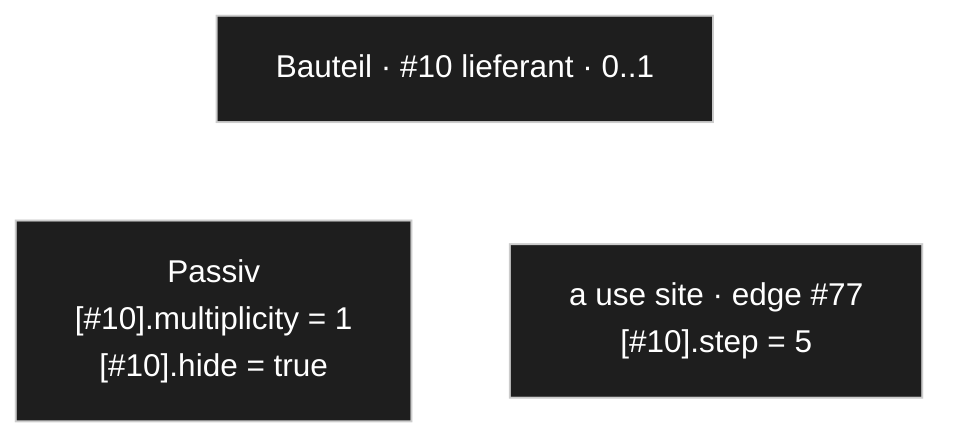

This answers [OQ-058](91-open-questions.md), and with the wider reading C83 gives it: **an
override is the same thing wherever it sits. Only its owner differs.**

| Owner | Means |
|---|---|
| a **node** | *for this subtype*, the inherited attribute is narrowed, hidden or reconfigured |
| an **edge** | *for this one use*, the attribute is narrowed, hidden or reconfigured |

Both address the target the same way — a path of edge ids ([D-045](90-decision-log.md)) — and both
are read by the same walk, which already passes through ancestors and then the use site
([D-079](90-decision-log.md)). Nothing new is needed, and [C9](#c7c10--settings-hang-on-edges-too)
stays intact: **the inheritance edge still carries nothing.** The override hangs on the *node*, and
names the inherited edge by id.

C81 is [D-042](90-decision-log.md) stated once more from the other side: there is no type-definition
screen because there is nothing separate to define. Configuring a type is configuring a node.

### C84 — and both directions are allowed

| # | Statement (owner, 2026-08-22) |
|---|---|
| **C84** | `1` and `0..1` **apply only to edges, that is to attributes**. Overriding `1` with `0..1` makes it optional for that node; overriding `0..1` with `1` tightens it, and it must then be given. **Both should be possible.** |

I had worried that widening breaks the guarantee a subtype just made. **The owner's first sentence
dissolves that worry**, and it does so more thoroughly than the permission does.

**Multiplicity is a statement about a use, not about a thing.** There is no *Passiv guarantees a
supplier* — there is only *this edge, in this context, requires one*. A component in a catalogue
may need a supplier while the same component in a draft parts list does not, and both are true
statements about different uses.

That generalises, and it is the actual reason no direction has to be forbidden:

> **Every constraint is evaluated where it resolves. There is no global guarantee to break.**

`min`, `max`, an allow-list — each is read at the point of use, by the validator running there.
Nothing anywhere else assumed the tighter value, so nothing anywhere else can be invalidated by
loosening it.

**And this removes a concept I was about to add.** A moment earlier I proposed marking each key as
*constraint-like* or *presentation-like*, so that constraints could only be narrowed. That
distinction is now unnecessary — one fewer property in every key definition, and one fewer thing
to get wrong.

### The modelling rule that follows

If something must be true of a thing **always and everywhere**, an attribute constraint is the
wrong place for it, because any use site may loosen it. It belongs in the **type hierarchy**:

- *A passive component must name a supplier, no exceptions* → not `multiplicity = 1` on an
  attribute, but a subtype that has the supplier as part of what it is.
- *A passive component in the catalogue must name a supplier* → exactly `multiplicity = 1`, at
  that use site.

Worth writing down, because this is the question someone will actually be standing in front of.

## Owner statement — 2026-08-22, seventeenth pass: unique attributes

| # | Statement |
|---|---|
| **C87** | An attribute such as an **article number** may carry a **`unique`** setting: it must be unique. If someone then enters another record with an article number that already exists, **an error follows**. |

This closes the remainder of [OQ-063](91-open-questions.md): there are **two** mechanisms, and they
are deliberately different in strength.

| | Setting | Effect |
|---|---|---|
| **identifying** | which fields the duplicate search matches ([D-112](90-decision-log.md)) | **warns** — shows what already exists |
| **unique** | this value may occur once | **refuses** — the record cannot be saved |

### Uniqueness comes out of inheritance for free

An attribute is an edge ([D-031](90-decision-log.md)), and a subtype **inherits** that edge rather
than getting its own. So `Passiv` and `Halbleiter` both use `Bauteil`'s `artikelnummer` — edge
`#10` — and a uniqueness check on `(edge_id, value)` covers **every record of every subtype at
once**.

That is exactly the semantics one would want and nobody had to design it: *unique among all
Bauteile, including the specialised ones.*

### Enforced in two layers, like everything else

```mermaid
---
config:
  theme: dark
  themeVariables:
    mainBkg: "#1e1e1e"
    background: "#1e1e1e"
    primaryColor: "#1e1e1e"
    classText: "#ffffff"
    textColor: "#ffffff"
    lineColor: "#ffffff"
---
flowchart LR
    V["validator · the user meets this"] --> D["a real unique index · the last line"]
```

Same shape as [D-074](90-decision-log.md): the **validator** is what a person encounters, with a
message and an offered correction; the **index** is the last line that catches what concurrency
slips past. A user should never meet a database error.

The index cannot sit on `record_values` directly — it would have to apply to every attribute, not
just the unique ones, and a filtered index is not available. So it lives in the **derived search
structure** of [OQ-064](91-open-questions.md), which is being built anyway: one row per unique
attribute value, with a real unique constraint. Derived, rebuildable, never a second truth.

**Empty does not participate.** A record with no article number does not collide with another that
also has none.

### The best response to a violation is not an error

[V9](00-vision-and-scope.md) says a validator may **offer a correction**, and here the correction is
the whole point:

> *This article number belongs to «Widerstand 10k 0805». Did you mean to use that one?*
> — with the action to select it instead of creating.

**A uniqueness violation is the duplicate detection succeeding.** The user was about to create
something that exists; the useful reply is the record they actually wanted, not a refusal. Refusing
is the fallback for when they insist the number is right — and then the real problem is elsewhere.

## Owner statement — 2026-08-22, eighteenth pass: a primary-key flag?

| # | Statement |
|---|---|
| **C88** | Could an attribute carry a flag *is primary key*, so that duplicates are checked against it? |

**The intent is right and it is already what `unique` does — but the name should not be used.**

### Why not *primary key*

```mermaid
---
config:
  theme: dark
  themeVariables:
    mainBkg: "#1e1e1e"
    background: "#1e1e1e"
    primaryColor: "#1e1e1e"
    classText: "#ffffff"
    textColor: "#ffffff"
    lineColor: "#ffffff"
---
flowchart LR
    I["id · the primary key"] --- H["hard identity · never resolved on"]
    A["artikelnummer · unique"] --- S["soft identity · may change"]
```

**The primary key is the `id`** ([D-055](90-decision-log.md)). Calling an article number a primary
key re-opens exactly the distinction that took effort to establish: an article number is
*human-meaningful*, it can be corrected, and a record survives changing it. An `id` cannot and does
not. Two different things need two different words, and the glossary exists for precisely this.

`unique` also says what it does, and there may be **several** of them — an article number and an
EAN, each unique on its own — where *primary key* implies one.

### What the idea does add: unique **groups**

The part of C88 worth taking is that a key is often **composite**. *Manufacturer* alone is not
unique and *type designation* alone is not, but together they are.

**Proposal: `unique` optionally names a group.** Attributes sharing a group name form one composite
constraint; an attribute with `unique` and no group is unique by itself.

| attribute | `unique` |
|---|---|
| `artikelnummer` | *(on its own)* |
| `ean` | *(on its own)* |
| `hersteller` | `typkennung` |
| `typbezeichnung` | `typkennung` |

Three independent constraints, one of them over two attributes. That is everything a primary key
would have given, without borrowing a word that already means something else here.

### And the duplicate check follows from it

A unique attribute is, by construction, the strongest possible duplicate check — which is what C88
was reaching for. Nothing extra is needed: the search matches the shown fields
([D-112](90-decision-log.md)), and where one of them is unique the warning becomes a refusal with
an offered correction ([D-114](90-decision-log.md)).

## Owner statement — 2026-08-22, nineteenth pass: why the enum type was dropped

| # | Statement |
|---|---|
| **C89** | The previous project had an **enum type**, introduced early because fixed values seemed to be needed. |
| **C90** | It turned out that **fixed values sometimes carry further properties** — not just the one value an enum member has, but several. So the enum type was **dropped and modelled as nodes** instead. |
| **C91** | ⚠️ The same for a *set* or *table* type: **it is only a node with several attributes, practically a row** — and *that it is one* is expressed through the **render mechanism**, by rendering it differently. |

### C90 is the argument, and it is better than the criterion

[OQ-041](91-open-questions.md) can be answered from the rule alone — the engine multiplies by a
prefix's factor and never branches on *which* prefix, so a prefix is data. **The owner's history
says the same thing from experience:** an enum member starts as one value and grows properties, and
at that moment the enum type has to be abandoned mid-project.

> **A fixed value that might one day carry properties is a node.**

Which is every fixed value, given enough time. A prefix already proves it: it looked like a name
and turned out to need a **multiplier** ([C46](#owner-statement--2026-08-22-eleventh-pass-units-prefixes-and-what-a-type-names)).

### C91 — and this sorts out the old *Complex Datatypes* branch

```mermaid
---
config:
  theme: dark
  themeVariables:
    mainBkg: "#1e1e1e"
    background: "#1e1e1e"
    primaryColor: "#1e1e1e"
    classText: "#ffffff"
    textColor: "#ffffff"
    lineColor: "#ffffff"
---
flowchart TD
    C["old: Complex Datatypes"] --> S["Unit type · Preis<br/>real composed nodes"]
    C --> R["set · table<br/>renderers, not types"]
```

The branch held two different things under one heading
([harvest 01](_harvest/01-standard-tree.md)):

| | What it really is |
|---|---|
| `Unit type`, `quantity › Preis` | **genuine composed types** — a node with attributes ([C44](#c44--the-correction-is-the-load-bearing-part)) |
| `set`, `table` | **presentation of a multi-valued edge** — container renderers ([D-097](90-decision-log.md)) |
| the dropped `enum` | **an attribute whose branch is one level deep**, drawn as a list ([D-109](90-decision-log.md)) |

So two of the three dissolve into things already decided, and neither needed to be a type. That is
C91 stated generally: **what a structure *looks like* is a renderer; what it *is* is a node with
attributes.**

⚠️ *The transcription of C91 named the second type indistinctly; read as `set` or `table`, both of
which fit "a node with several attributes, practically a row". Correct if a third thing was meant.*

## Owner statement — 2026-08-22, twentieth pass: the scaffold and its bindings

| # | Statement |
|---|---|
| **C92** | A **base scaffold tree must be installed** — the simple data types and so on have to be there. |
| **C93** | Base units are sensible too, a few currencies, and the **general settings**. **Everything else the user defines.** |
| **C94** | On insert the **node ids may shift** — one can of course supply them, but they need not stay the same. |
| **C95** | In the **admin configuration** every special node was additionally defined as a **constant**, with the corresponding node assigned to it. |
| **C96** | One could also set the renderer or the defaults there — **but that is not actually needed**, since the node itself already carries its default settings. |

### C95 — a binding, and it answers C94 by itself

```mermaid
---
config:
  theme: dark
  themeVariables:
    mainBkg: "#1e1e1e"
    background: "#1e1e1e"
    primaryColor: "#1e1e1e"
    classText: "#ffffff"
    textColor: "#ffffff"
    lineColor: "#ffffff"
---
flowchart LR
    E["engine / configuration"] -->|asks for a slot| B["binding<br/>datatype.integer"]
    B -->|points at| N["node #12"]
```

**A binding is a named slot in the installation configuration that points at a node.** The engine
and the configuration ask for the slot; nothing anywhere names an id or a node name.

**And that is why C94 costs nothing.** Ids may shift on insert, be renumbered, differ between two
installations — **the binding absorbs it**, because it is set to whatever the node got when it
arrived. Nothing else in the system holds an id it did not read from a binding.

It also settles two things that were open with a proposal rather than a mechanism:

| | Was proposed as | Is really |
|---|---|---|
| the declared data-type root ([D-099](90-decision-log.md), [OQ-048](91-open-questions.md)) | *an installation setting naming the branch* | **a binding** |
| installation-wide settings ([D-079](90-decision-log.md)) | a reserved installation identity | still that — and bindings live there |

### C96 — a binding points, and does nothing else

The restraint is the valuable part. If a binding could also carry a renderer or defaults, there
would be **two places** configuring the same node, competing — exactly the duplication this concept
keeps refusing. The node carries its own defaults ([D-015](90-decision-log.md),
[D-098](90-decision-log.md)); the binding only says *which node*.

### Bindings and machine keys divide cleanly

Two anchoring mechanisms are now on the table, and each has its own job:

| | For | Example |
|---|---|---|
| **binding** | a **singular** well-known thing — one slot, one node | `datatype.integer`, `unit.root`, `currency.root` |
| **`unique` machine key** ([D-115](90-decision-log.md)) | a **member of a set**, where each needs matching | the ISO code on every currency |

One would not create a hundred and eighty bindings for currencies, and one would not give *the
integer type* an ISO code. The rule: **bindings for roots and singletons, machine keys for
members.**

### C92/C93 — what ships

Simple data types · base units · a few currencies · the general settings. **Everything beyond that
is authored** — which keeps the seed small and matches [V7](00-vision-and-scope.md).

## Owner statement — 2026-08-22, twenty-first pass: protecting the scaffold

| # | Statement |
|---|---|
| **C97** | In the previous project the corresponding nodes were marked as **template**, so that the user cannot delete them. |

**The need is real. A flag is the wrong instrument** — it protects too much and too little.

| | |
|---|---|
| **too much** | a shipped currency the author never uses cannot be deleted, for no reason anyone can state |
| **too little** | a node the author binds to a slot **themselves** is not protected, and that is the same hazard |

### What actually must not vanish

The hazard is not *being shipped*. It is **being pointed at**:

```mermaid
---
config:
  theme: dark
  themeVariables:
    mainBkg: "#1e1e1e"
    background: "#1e1e1e"
    primaryColor: "#1e1e1e"
    classText: "#ffffff"
    textColor: "#ffffff"
    lineColor: "#ffffff"
---
flowchart TD
    D{delete a node} --> B{is a binding on it}
    B -->|yes| R["refused — repoint the binding first"]
    B -->|no| C{does anything else reference it}
    C -->|yes| K["a conflict, resolved by the user"]
    C -->|no| G[deleted]
```

| What references it | On delete |
|---|---|
| a **binding** | **refused** until the binding is repointed or removed — the engine needs the slot filled, and *the integer type is missing* is not a state anyone can work in |
| an **attribute** (`to`) | a **conflict**, resolved with the moves of [D-062](90-decision-log.md) — remap, or delete |
| a **record value** | the same conflict, the same resolver |

**This is derived, not flagged.** It protects exactly what needs protecting, it protects nodes the
author bound themselves, and it lets the author delete a shipped currency they do not want — which
[D-119](90-decision-log.md) already promised them, since after import the content is theirs.

### And the marker still has a job, a different one

*This came from the seed* is worth knowing — but as **provenance**, for the update flow: which
items were shipped, so an update can offer only what is genuinely new rather than re-offering
everything.

That is not protection, and it may not even need a flag: matching on the `unique` machine key
([D-115](90-decision-log.md)) tells an update what is already present. Worth deciding when the
update flow is actually built rather than now. → [OQ-065](91-open-questions.md).

## Owner statement — 2026-08-22, twenty-second pass: framework types, developer flag, trash

| # | Statement |
|---|---|
| **C98** | An **inexperienced user can break more by deleting**. Fundamental things such as `Integer` must **not** be deletable — they are part of the **framework**, as good as written into the code. |
| **C99** | The previous project had a **developer flag**: with it set, one may delete and move anything. |
| **C100** | **Moving is unproblematic**, since everything acts by **id**. The id is unique within the tree, and whether a node sits under *data types* or somewhere else does not matter. |
| **C101** | **Deletion is two-stage:** deleted nodes and relations are first **marked deleted** and **parked** in a separate node under the root. Only from there can they be removed for good. |

### C98 — and [D-121](90-decision-log.md) was wrong

I argued that protection should be **derived** from references rather than marked, because derived
is more precise. **Precision was the wrong goal.**

| | |
|---|---|
| my rule said | *a binding points at this, so deletion is refused* |
| the user needs to hear | *this is a framework type* |

The first is a technicality that explains nothing to the person in front of it. And the argument
that a marker *protects too little* falls too: a marker and a reference check are not alternatives.

**So: both, and they answer different questions.**

| | Protects | Message |
|---|---|---|
| **framework marker** | the types the engine is built on | *this belongs to the framework* |
| **reference check** ([D-121](90-decision-log.md)) | anything else something points at | *this is still in use here* |

### C99 — the developer flag is the right escape

Protection by default, lifted deliberately. It is [D-032](90-decision-log.md) with friction added
on purpose: a normal author never meets the question, and someone who genuinely must restructure
the framework can — having said so first.

### C100 — true for references, with one caveat

Ids are stable and nothing resolves on position ([D-055](90-decision-log.md),
[D-120](90-decision-log.md)), so moving breaks no reference. **But moving between branches changes
the node's inheritance**, and therefore which attributes it has
([D-041](90-decision-log.md), [C43](#c43--flatter-for-the-author-not-for-the-machine)).

So moving is **referentially** free and **semantically** a model change — which means it goes
through the same check as any other: does existing data still fit ([D-037](90-decision-log.md))?
Usually yes; for a move that drops an inherited attribute, no. → [OQ-066](91-open-questions.md).

### C101 — soft delete, and it changes the earlier answer again

```mermaid
---
config:
  theme: dark
  themeVariables:
    mainBkg: "#1e1e1e"
    background: "#1e1e1e"
    primaryColor: "#1e1e1e"
    classText: "#ffffff"
    textColor: "#ffffff"
    lineColor: "#ffffff"
---
flowchart LR
    A[in the model] -->|delete| B[parked · marked deleted]
    B -->|restore| A
    B -->|purge| C[gone]
```

Two-stage deletion makes the whole deletion question **gentler**, because nothing is lost at the
first step:

- A reference to a parked node **does not dangle** — the node is still there.
- Conflicts ([D-062](90-decision-log.md)) can be resolved *after* parking, in peace, rather than in
  a dialog blocking the delete.
- The irreversible moment is the **purge**, and that is where the reference check belongs in full
  force.

**One subtlety worth naming now:** a parked node with a `unique` article number
([D-114](90-decision-log.md)) — does its number still block a new record? If it does, the author
cannot reuse a number they just deleted. If it does not, **restoring** it creates a collision.
→ [OQ-067](91-open-questions.md).

## Owner statement — 2026-08-22, twenty-third pass: deleting a referenced node

| # | Statement |
|---|---|
| **C102** | The **reference check must apply equally to nodes that are referenced** — nodes an edge points at. They **may not be deleted while the dependencies are unresolved**. |
| **C103** | If the author says *delete anyway*, there must be an **active confirmation** — not *yes / no / OK / cancel*, but the user **actively confirming**. The connections to other nodes are then deleted with it. |
| **C104** | Example: a node has an attribute of type `mein int`, itself a child of `int` and therefore deletable. Deleting `mein int` means **the attribute must be marked deleted too**. |
| **C105** | The connection is still there, but the **edge is marked deleted**. **How to show that well to the user is not yet clear.** |

### C104 is the same event we already handled, seen from the other end

```mermaid
---
config:
  theme: dark
  themeVariables:
    mainBkg: "#1e1e1e"
    background: "#1e1e1e"
    primaryColor: "#1e1e1e"
    classText: "#ffffff"
    textColor: "#ffffff"
    lineColor: "#ffffff"
---
flowchart LR
    A["delete «mein int»"] --> B["every edge with to = mein int<br/>is parked with it"]
    B --> C["each owning node loses an attribute"]
    C --> D["its records hold orphaned values"]
```

**For every referencing node, this is exactly *an attribute was deleted*** — which
[M17](70-migration.md) and [D-063](90-decision-log.md) already cover: warn at the moment of the
change, the existing records still hold that field, and the author decides delete or transfer.

So nothing new is needed for the *consequence*. What C103 adds is the **weight of the moment**.

### C103 — what an active confirmation has to do

A dialog whose safest answer is one click away will be clicked. So the confirmation must

1. **name the consequences concretely** — not *are you sure*, but *what exactly falls*:

   > Deleting **«mein int»** also removes
   > · attribute **«menge»** from **Position** — 1 243 records hold a value
   > · attribute **«anzahl»** from **Kontakt** — 12 records

2. **require an act that cannot be reflexive** — typing the node's name, rather than a button
   positioned where *cancel* usually is.

That is [V9](00-vision-and-scope.md)'s spirit again: the system knows what will happen, so it says
so, instead of asking a person to imagine it.

### The trash holds *deletion events*, not objects

This follows from C104 and matters more than it looks:

If parking cascades — the node **and** every edge that pointed at it — then **restoring must cascade
too**. Otherwise a restore brings back a node whose attributes stayed in the trash, and nobody can
reason about the result.

> **A trash entry is one deletion, with everything that fell with it. Restore puts back the whole
> event.**

### C105 — a proposal for the display

Three things want showing, and they are different:

| | Where | How |
|---|---|---|
| **the parked node** | the trash | listed as its own entry, with what fell with it |
| **the parked attribute**, in its owning node | **hidden by default** | a model full of ghost attributes is unreadable; a *show deleted* toggle reveals them, greyed, with *deleted with «mein int»* and a restore action |
| **the orphaned values** in records | the **conflict list** ([D-054](90-decision-log.md)) | this is where they must be findable, because this is where they get resolved |

The reasoning behind hiding by default: the modelling view answers *what does this node look like
now*. A deleted attribute is not part of that answer — but it must not become invisible either,
which is why it stays one toggle away and why the records surface separately.

## Owner statement — 2026-08-22, twenty-fourth pass: the `Kompositionen` branch

| # | Statement |
|---|---|
| **C106** | Pairing compositions with all the other models feels wrong. Better: **a `Kompositionen` branch**, and all compositions live under it. |
| **C107** | When a composition with a higher multiplicity is created, the tool should **make an entry there automatically**. |
| **C108** | If a composition later becomes an **aggregation**, the node can simply be **moved** from the compositions branch into the normal model branch. |
| **C109** | The reverse — aggregation to composition — is **only possible if the aggregation is used by one model**. |

### C106 catches an error in [D-017](90-decision-log.md)

I had written that a composed-only node *lives beneath its whole*. **The tree is inheritance and
nothing else** ([V3](00-vision-and-scope.md)), so hanging `Position` under `Bauteilliste` means
`Position` **inherits** the parts list — it would acquire `bezeichnung` and `bauart`. I had mixed
*organisational placement* with *inheritance parent*, and in this model those are the same thing.

A `Kompositionen` branch is an **organisational container** carrying no attributes, like
`Konstanten` or `Definition`, so nothing meaningful is inherited.

**And locality is not lost — it was never a tree question.** The model view shows the composed
structure inline at its owner by following the edge. Presentation, not structure.

### C108/C109 — the asymmetry

```mermaid
---
config:
  theme: dark
  themeVariables:
    mainBkg: "#1e1e1e"
    background: "#1e1e1e"
    primaryColor: "#1e1e1e"
    classText: "#ffffff"
    textColor: "#ffffff"
    lineColor: "#ffffff"
---
flowchart LR
    K[Kompositionen] -->|move · free if mult > 1| M[model branch]
    M -->|move · only if singly used| K
```

**Composition → aggregation** is a move. With multiplicity above 1 the data are already separate
records ([D-133](90-decision-log.md)), so nothing migrates; with multiplicity 1 the embedded path
rows must become records.

**Aggregation → composition** needs **two** checks, and C109 names only the first:

| | Check |
|---|---|
| model level | only **one** edge points at it |
| data level | each target **record** is referenced by **at most one** owner record |

The second is sharper and can fail while the first holds: `Position.artikel → Bauteil` is one edge,
but one *Widerstand 10k* record hangs on five hundred positions. Converting that is not a conversion
but a **duplication** — offerable, never silent.

### What C106 quietly bought

**Placement follows the kind, so the tree is self-checking.** A node under `Kompositionen` that an
aggregation points at is a **detectable inconsistency** — the branch is not merely tidiness, it is a
checkable assurance.

## Owner statement — 2026-08-22, twenty-fifth pass: what has data, decided by placement

| # | Statement |
|---|---|
| **C110** | A composition edge may point at a node under **`Kompositionen`** — and at **simple data types that have no data**. |
| **C111** | **A node that lies neither in the model branch nor in the composition branch has no data of its own.** Its values live in the model that uses it. |

C111 settles the question that kept coming back, and it settles it **visibly**: the answer is read
off the tree rather than derived.

| | Lies under | Own records? |
|---|---|---|
| `Bauteil` | model | yes, standalone |
| `Position` | `Kompositionen` | yes, owned |
| `Preis` | data types | **no** — inline in whoever uses it |
| `Gramm` | constants | **no** — referenced as a value |

**And it agrees with [D-133](90-decision-log.md).** Kind-plus-multiplicity and placement give the
same answer for every case above — two derivations, one result.

### Where they disagree, and what follows

Set a multiplicity above 1 on a **data type** — `Bauteil.preisverlauf → Preis`, `1..*` — and
[D-133](90-decision-log.md) says *own records* while placement says *no own data*.

**The resolution is [D-136](90-decision-log.md)'s automatic creation:** the tool creates a node
under `Kompositionen` **that inherits from `Preis`** — `Bauteil-Preisverlauf`. It has records;
`Preis` is untouched; every other use of `Preis` notices nothing.

That is inheritance used for what it exists for — a **use-site-specific variety of a shared type**,
the same movement as the specialisation in [D-105](90-decision-log.md).

### A consequence the owner accepted, and why it is safe

A composed price **dies with its parts list**. That is correct — the prices of a deleted parts list
are not history, they went with the document.

Two things make it harmless:

- **The evaluation still works while the data exist.** *Which prices exist for this kind of part?*
  finds positions whose `artikel` is X and reads their `einzelpreis.wert` — the search does not care
  about nesting ([D-134](90-decision-log.md)).
- **Durability is a lifecycle question, not a storage-shape question.** If an order must survive,
  it is not deleted — [D-123](90-decision-log.md)'s park-and-purge already separates *preserve* from
  *destroy*, and purging an order would simply be forbidden.

**And how order prices are modelled already follows from [D-065](90-decision-log.md):** a list price
*describes* and therefore tracks; a price in an order line *was agreed* and therefore freezes,
along with its exchange rate ([D-064](90-decision-log.md)). Both are prices on the same part, and
they behave oppositely because they are different statements.

## Where the model stands

Three small views of what is settled. What is deliberately **not** in them is listed after.

### The two shapes of one identity

```mermaid
---
config:
  theme: dark
  themeVariables:
    mainBkg: "#1e1e1e"
    background: "#1e1e1e"
    primaryColor: "#1e1e1e"
    classText: "#ffffff"
    textColor: "#ffffff"
    lineColor: "#ffffff"
---
classDiagram
    class Identity {
        <<abstract>>
        +id
        +version
    }
    class Node {
        +name
    }
    class Relation {
        +from
        +to
        +kind
    }
    Node --|> Identity
    Relation --|> Identity
    Relation --> Node : from
    Relation --> Node : to
```

Everything in the model is one of two things, and both have identity ([C11](#owner-statement--2026-08-22-third-pass)).
`Relation` is a single construct; **inheritance is one of its kinds**, not a separate class
([D-012](90-decision-log.md)). `Node.name` is the required, locale-neutral base name
([D-020](90-decision-log.md), C20) — a label of last resort, never a lookup key (C22).

### What hangs off an identity

```mermaid
---
config:
  theme: dark
  themeVariables:
    mainBkg: "#1e1e1e"
    background: "#1e1e1e"
    primaryColor: "#1e1e1e"
    classText: "#ffffff"
    textColor: "#ffffff"
    lineColor: "#ffffff"
---
classDiagram
    class Identity {
        <<abstract>>
        +id
    }
    class Setting {
        +owner
        +key
        +value
    }
    class Label {
        +owner
        +role
        +locale
        +text
    }
    class ChangeLogItem {
        +owner
        +changed_at
        +changed_by
    }
    Setting --> Identity : owner
    Label --> Identity : owner
    ChangeLogItem --> Identity : owner
```

**The reference sits on the row, not on the identity.** Each setting, label and changelog item
names the **one** identity it belongs to — and that identity is either a node or an edge. This
is what the diagram is saying, and it was worth drawing explicitly.

`owner` is a **single column** only because nodes and edges draw their ids from one space
([C11](#owner-statement--2026-08-22-third-pass)). Without that it would take two — *which kind*
plus *which id* — and no database could check the foreign key.

All three hang off **`Identity`** rather than off `Node`, which is what lets a *relation* carry
settings ([C8](#c7c10--settings-hang-on-edges-too)) — the mechanism behind per-use-site
configuration. Settings and labels are stored apart because their shapes differ, but resolve
through one shared walk ([D-019](90-decision-log.md)).

The `ChangeLogItem` cardinality shown as `0..*` is **not** settled — the seed drew `1..*`, which
would mean no object can exist without one ([OQ-008](91-open-questions.md)).

### The three kinds of edge

```mermaid
---
config:
  theme: dark
  themeVariables:
    mainBkg: "#1e1e1e"
    background: "#1e1e1e"
    primaryColor: "#1e1e1e"
    classText: "#ffffff"
    textColor: "#ffffff"
    lineColor: "#ffffff"
---
flowchart TD
    R[Relation] --> I[inheritance]
    R --> C[composition]
    R --> A[aggregation]
    I -.- IN[one parent · no cycles · protected · no edge settings]
    C -.- CN[target dies with the whole]
    A -.- AN[target is independent]
```

One shape, three sets of rules ([D-012](90-decision-log.md), [C12/C13](#c12c13--composition-and-aggregation-do-differ)).
Inheritance is the one exempt from edge settings ([C9](#c7c10--settings-hang-on-edges-too)), and
the one that forms the tree; the other two form a graph, which is why the render descent needs a
cycle guard ([OQ-019](91-open-questions.md)).

### What is deliberately missing from these diagrams

**`Attribute` is not drawn.** It is the most-used word in this concept and the least decided
thing in it. Drawing it as a box would silently answer three open questions:

| | |
|---|---|
| [OQ-010](91-open-questions.md) | Is an attribute the same construct as an edge, or its own thing that uses one? |
| [OQ-011](91-open-questions.md) | What is an attribute's *type* — a data type, the target's type, or the kind of connection? |
| [OQ-018](91-open-questions.md) | Where does the value live — as an edge to a node, or inline in a settings row? |

Also absent on purpose: whether `Relation.kind` is a node or an enum ([OQ-003](91-open-questions.md)),
whether nodes have subtypes at all ([OQ-004](91-open-questions.md)), and the full field list of
`Identity` ([OQ-001](91-open-questions.md), [OQ-017](91-open-questions.md)).

## What belongs here

**Objects and their shape**

- Identity: what every persisted object carries.
- Node: fields, invariants, what a node may *not* carry.
- Edge / relation: the inheritance edge and any other kind.
- Attribute: name, type, connection — and its relationship to the edge.
- Type: how a type is expressed, and whether it is data (a node) or code (an enum).
- Change history: what is recorded, and whether undo is in scope.

**Configuration and settings** — folded in here, because `Configuration` hangs off the root
object in [`TreeMeremaid.md`](TreeMeremaid.md) and is therefore part of the model, not a
neighbour of it:

- `Configuration` and `Setting`: fields, allowed value types.
- Which objects carry configuration, and which do not.
- The resolution walk: what wins when an ancestor and a descendant both define something.
- Where the renderer / converter / validator assignment of a node is recorded (V8).
- Where hide, read-only and order live.
- **The one-sentence distinction between a setting and an attribute** — both are name/type/value
  triples hanging off a node, and without that sentence they will keep collapsing into each
  other ([OQ-013](91-open-questions.md)).

**Proof**

- Worked examples that show the model can express a real case.

## What does NOT belong here

- Storage, tables, column types. That is [50 Persistence](50-wordpress-persistence.md).
- Rendering, forms, tables, the renderer contract. That is [30 Renderer](30-renderer.md).
- Translation mechanics. That is [40 I18n](40-i18n.md).

## Harvest candidates

Worked through **after** the concept is written from the statements of the owner
([D-006](90-decision-log.md)).

| Source | What is in it |
|---|---|
| [`TreeMeremaid.md`](TreeMeremaid.md) | Seed: `WPClassHead`, `Configuration`, `Setting`, `Node`, `Relation`, `ChangeLog`. The closest thing to a current model. |
| [`../legacy/DEVELOPER-ATTRIBUTE-MODEL.md`](../legacy/DEVELOPER-ATTRIBUTE-MODEL.md) | The old *Attribute = Relation* lock, its class sketch, and the Settings/Render walk. **Start here** — direct counterpart to C1/C2. |
| [`I18nMeremaid.md`](I18nMeremaid.md) | Seed: `Identity`, `DomainNode`, `ValueNode`, `I18nValueNode` — contradicts `TreeMeremaid.md` ([OQ-001](91-open-questions.md)) and V5 ([OQ-004](91-open-questions.md)). |
| [`../legacy/plans/relation-vs-object-concept.md`](../legacy/plans/relation-vs-object-concept.md) | Short, agreed summary of relation-vs-object. Read before the 1589-line file. |
| [`../legacy/plans/attribute-choice-inheritance.md`](../legacy/plans/attribute-choice-inheritance.md) | Inheritance of choices along the tree — settings resolution. |
| [`../legacy/plans/settings-ui-parity.md`](../legacy/plans/settings-ui-parity.md) | Parity requirements between settings surfaces. |
| [`../legacy/plans/data-structure.md`](../legacy/plans/data-structure.md) | 1589 lines: node, root, hierarchy vs relation, invariants, worked examples. Largest quarry — expect to drop most of it. |
| [`../legacy/plans/part-identity-layers.md`](../legacy/plans/part-identity-layers.md) | kind / package / catalog part / BOM usage — a hard test case for any core model. |
| [`../legacy/plans/project-plan.md`](../legacy/plans/project-plan.md) | Section *Settings cascade → paint*. |
