# Domain core — the model

> **Status: `draft`, and ready to be judged for `locked`.** The legacy has been harvested — see
> [`_harvest/03`](_harvest/03-legacy-inspiration.md) and [`04`](_harvest/04-legacy-code-inspiration.md),
> both closed. No question is open and no contradiction stands.
>
> **This is the document that must reach `locked` first** ([D-004](90-decision-log.md)).
> Renderer, i18n and persistence all hang off it.
>
> **Three ways in, by what you need.**
>
> | You want to | Read |
> |---|---|
> | **judge whether code fits the model** | [The core, on one page](#the-core-on-one-page) — fourteen sentences |
> | **build** | [The model as it stands](#the-model-as-it-stands) — complete, no history |
> | **know why something is so** | everything after that — the reasoning |
>
> Everything after it is the **reasoning** — twenty-five passes of owner statements and the
> discussion each produced. Kept deliberately: more than one rule was rescued by reading why it
> said what it said. ⚠️ Those passages were written while questions were still open and still read
> that way; every `OQ-nnn` they cite is answered, and the table at the end names by what.

## Purpose

The one file for the model. Everything the system rests on lives here: identity, node,
edge, attribute, type, configuration and settings, change history.

It stays one file on purpose ([D-010](90-decision-log.md)). What keeps it readable is not
splitting but its **structure**: a chain of small units, each one diagram plus explanation
([98 Documentation style](98-documentation-style.md)). A contradiction between two small
diagrams is visible; a contradiction inside 1589 lines of prose is not — that is how the
previous round lost track.

## The core, on one page

**Hold these fourteen sentences and you can judge any line of code without reading the rest.** That
is what they are for: everything below this section follows from them, and nothing below
contradicts them.

⚠️ **This page exists because of a finding by the owner**, and it is worth repeating: the
specification is complete but *too large for one head*. If the only reader who can hold the model is
the thing that also writes the code, nobody can check the code. So the test for `locked` is not
*can a person build from this* — it is **can a person check what was built**.

---

1. **Model and data are two halves.** The model describes; the data are what someone entered. They
   do **not** share an id space.

2. **Everything the model persists carries an `id` and a `version`, and nothing else.** The `id` is
   meaningless, stable and never resolved on.

3. **There are nodes and relations. Nothing else.** A node has exactly four fixed attributes: `id`,
   `version`, `name`, `path`.

4. **The tree is inheritance, and only inheritance.** A node's **type** *is* its branch.

5. **A relation has three kinds — inheritance, composition, aggregation — and the kind is never
   chosen.** It is read off the branch the target sits in.

6. **An attribute *is* a relation**, seen from the node that owns it. There is no separate attribute
   object.

7. **There are three branches: `Model`, `Compositions`, `Primitives`** — and `Primitives` splits
   once more into **Data Types** and **Constants**.

8. **The branch decides three things:** which relation kind reaches the node, whether it holds data,
   and **where a value is stored** — inside the record by path, as its own records, or as an
   external reference. **Multiplicity plays no part in that.**

9. **Settings resolve along one chain:** installation → model root → ancestors → node → use site,
   walked key by key, stored sparsely.

10. **Bounding settings may only be tightened downwards; choosing settings are free.** Permitted
    set, range, multiplicity, mandatory, `hide`, `read_only` narrow only. Default, renderer,
    converter, labels, icon, order are free.

11. **A label is text in one role and one locale.** Roles are nodes, seeded and extensible.

12. **Seven tables, and no table per model — the model *is* the schema.** A per-model projection may
    exist only as a rebuildable cache.

13. **Deletion has two stages: park, then purge.** Undo reaches exactly as far as the trash, and a
    renderer never writes.

14. **Everything a person sees comes from a renderer.** A node carries an ordered list of them, one
    mandatory; the purpose — display, edit, search — is passed in, not keyed on.

---

**Two sentences that are not rules but decide how to work in this model:**

> **What a group of things has in common belongs at the highest level where it is true** — not
> where you first needed it, and not one level too high either. The tree is a taxonomy: what stands
> at a level holds for everything beneath it.

> **When something does not fit, cut the tree differently before adding an exception.** An exception
> is cheaper than a rethink, which is exactly why it is the more expensive choice a year later.

---

## The model as it stands

**This is the part to build from.** It states the model once, completely, without how it came
about. Everything behind it — the twenty-five owner-statement passes — is the **reasoning**, and it
is kept because more than once a rule was saved by reading why it said what it said. But nobody
should have to read it in order to write the code.

⚠️ **If a sentence here and a sentence further down disagree, this one is current** and the other
belongs to the conversation that produced it.

---

### The two halves

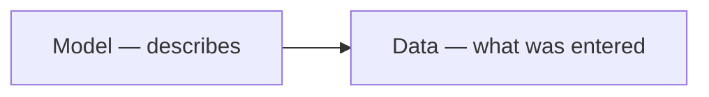

| | Deutsch | Is |
|---|---|---|
| **Model** | Modell | everything that **describes**: nodes, relations, settings, labels |
| **Data** | Daten | everything entered **afterwards**, as a whole |
| **Record** | Datensatz | one single piece of it |

They do **not** share an identity space. Model ids and record ids are allocated independently, each
by its own `AUTO_INCREMENT` ([D-164](90-decision-log.md)).

---

### Identity, node, relation

Everything the model persists carries an identity: an `id` and a `version`, and **nothing else**
([D-080](90-decision-log.md)). `Node` and `Relation` are its two shapes, and they draw ids from
**one shared space** — which is what lets a settings row name one `owner_id` as a real foreign key
([C11](#owner-statement--2026-08-22-third-pass), [D-090](90-decision-log.md)).

```php
CONTRACT

final class Identity {
    public function __construct(
        public readonly int $id,
        public readonly int $version,   // row change counter: optimistic locking, cache invalidation
    ) {}
}
```

**A node has exactly four fixed attributes** ([D-082](90-decision-log.md)):

| Field | |
|---|---|
| `id` | the primary key. Meaningless, stable, **never resolved on** ([D-055](90-decision-log.md)) |
| `version` | row change counter |
| `name` | the **base name**: required, locale-neutral, entered at creation. Display of last resort, never a lookup key, **not unique** ([D-022](90-decision-log.md)) |
| `path` | the materialised ancestor path — derived and rebuildable |

⚠️ **`type` is not among them.** A node's type **is** its inheritance branch
([D-041](90-decision-log.md)).

**A relation is one construct with three kinds** ([D-012](90-decision-log.md)):

```php
CONTRACT

final class Relation {
    public function __construct(
        public readonly Identity $identity,
        public readonly int $fromId,
        public readonly int $toId,
        public readonly Kind $kind,        // derived, see below — stored so reading needs no walk
        public readonly ?string $name,     // the attribute name, where it has one
        public readonly int $position,     // ordering belongs to the edge, not to the node
    ) {}
}

enum Kind { case Inheritance; case Composition; case Aggregation; }
```

| Kind | |
|---|---|
| **Inheritance** | forms the tree. At most one parent, acyclic, protected, the only kind exempt from edge settings |
| **Composition** | the target belongs to the whole and **dies with it**. Requires sole ownership |
| **Aggregation** | the target is **independent** and survives its whole |

⚠️ **At most one composition edge may point at a node** ([D-137](90-decision-log.md),
[D-214](90-decision-log.md)). A part that *can* belong to two wholes is not a part; make it an
aggregation, or two specialised nodes.

**Every foreign key column ends in `_id`** ([D-090](90-decision-log.md)).

---

### An attribute is a relation

**There is no separate attribute object** ([D-031](90-decision-log.md)). An attribute *is* a
relation, seen from the node that owns it:

| What the author calls it | What it is |
|---|---|
| the attribute's **name** | `Relation.name` |
| its **type** | `Relation.toId` — and that names a **branch**, so it is polymorphic ([D-041](90-decision-log.md)) |
| its **connection** | `Relation.kind` |
| multiplicity, default, `min`, `max`, renderer choice … | **settings** on the relation |
| its **caption**, its **help text** | **labels** on the relation |

The wrapper the author edits is a **screen**, not a table: one dialogue writes one relation row and
a few settings rows.

⚠️ **A duplicate edge is refused** — same `from`, `kind`, `to` **and name**
([D-281](90-decision-log.md)). `Breite` and `Höhe` both reach `int` and are two different things;
the name is part of what makes an edge itself.

---

### The three branches

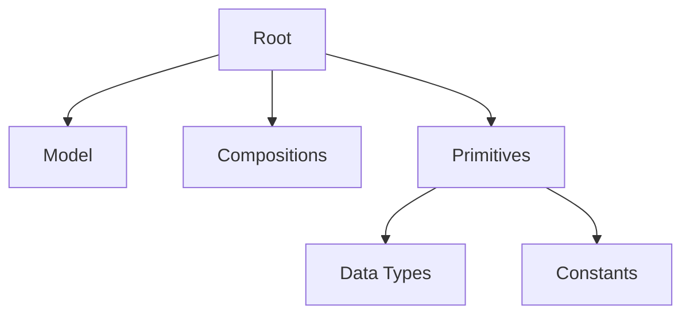

**The branch a node sits in decides three things**, and none of them is a switch anyone sets:

| Branch | Has data | Reached by | Value stored |
|---|---|---|---|
| **`Model`** | yes, standalone | **aggregation** | external reference |
| **`Compositions`** | yes, owned | **composition** | its own records |
| **`Primitives › Data Types`** | no | **composition** | **inside** the record, by path |
| **`Primitives › Constants`** | no | **aggregation** | a reference to a **node** |

Decided by [D-161](90-decision-log.md) (kind), [D-183](90-decision-log.md) (data),
[D-232](90-decision-log.md) (storage), split one level deeper by [D-193](90-decision-log.md).

⚠️ **The relation kind is never asked.** The author picks a **target**; the kind follows. This
removes the error the whole storage rule exists to prevent — a supplier accidentally composed into
an order, so every order breeds its own supplier — not by validating it afterwards but by never
offering it.

⚠️ **Multiplicity plays no part in storage.** Five integers are five **paths** in one record, not
five records ([D-232](90-decision-log.md)).

**Moving a node between branches rewrites every edge that points at it**
([D-162](90-decision-log.md)). `Compositions` → `Model` always works; `Model` → `Compositions` only
where each affected record has a single user, otherwise the conflict resolver offers *a copy per
using record*.

---

### Multiplicity, restriction, and what may be picked

**Multiplicity** sits on the edge and is inherited and narrowable ([D-086](90-decision-log.md)).

**There is no *fixed value*** ([D-221](90-decision-log.md)). A restriction that collapses to one
**is** the fixed value, and the control disappears by itself, because a control with one possible
outcome is not a choice ([D-198](90-decision-log.md), [D-227](90-decision-log.md) — the rule counts
**possibilities**, not entries; at `0..1` with one entry, *nothing* is a second possibility).

**A use site is an attribute** — the same relation seen from the owning node. **Bounding settings may only
be tightened downwards; choosing settings are free** ([D-312](90-decision-log.md)):

| Kind | Examples | Direction |
|---|---|---|
| **bounding** | permitted set · range · multiplicity · mandatory · `hide` · `read_only` | **narrower only** |
| **choosing** | default value · renderer · converter · labels · icon · order | **free** |

So a child may **hide** what the parent shows and never reveal what it hid; may **fix** what the
parent left editable and never unfix what it computed. A **default** is not a bound but a choice
inside the permitted set, and stays free. Where more is genuinely needed it is added **at the type**,
where it is visible in one place.

⚠️ **One axis is strict: what an ancestor declares **mandatory** stays mandatory for every descendant** ([D-311](90-decision-log.md)). It may be tightened downwards, never loosened — otherwise *every bird has a name* would never hold, and a classification that guarantees nothing about a group is worth nothing. An attribute that does not apply to a descendant is **moved down** ([D-155](90-decision-log.md)), not refused.

⚠️ **An attribute whose permitted set is empty is a model conflict** — reported where the narrowing
happens, not at data-entry time; the model may be temporarily inconsistent, but **data entry
against it stays barred** ([D-157](90-decision-log.md)).

**What may be picked belongs to the use site, not to the node** ([D-181](90-decision-log.md)).
Default: **everything except the branch root** ([D-238](90-decision-log.md)) — *leaves only* is
available and is not the default, because an intermediate node is often the honest answer.

---

### Settings and the resolution chain

A setting is `owner_id` + `key` + a **typed** value. Conceptually an attribute
([D-011](90-decision-log.md)); **one construct, one mechanism**, with a reserved namespace for
engine-owned keys ([D-084](90-decision-log.md)).


Walked **key by key**, so a consumer may take a mix ([D-079](90-decision-log.md),
[D-093](90-decision-log.md)). Overrides are stored **sparsely** — only what differs — so a change at
the base reaches every use site that did not override it ([D-015](90-decision-log.md)).

⚠️ **An override can be reset to *inherited*, and that is not storing an empty value**
([D-266](90-decision-log.md)):

| Action | Stored | Effect |
|---|---|---|
| **reset** | the key **disappears** | inherits again; later changes at the base arrive |
| **set empty** | the key stays, holding nothing | deliberately nothing here; base changes do **not** arrive |

*Inherited* and *empty here* must look **different**, and returning to inherited is an explicit
action, not the side effect of clearing a field.

**Anything chosen automatically is a default, never a fact** ([D-223](90-decision-log.md)): it is
revocable at the use site and must be **visible**.

**The unit of saving is the group that belongs together** ([D-300](90-decision-log.md)) — an
allow-list is **one** value that happens to be a set; a switch is a group of one and waits for
nobody.

---

### Labels

The human-readable text of an identity: `owner_id` + `role` + `locale` + `number` + `text`, in its
own table ([D-019](90-decision-log.md)).

| | |
|---|---|
| **Roles** are **nodes** — seeded and extensible ([D-151](90-decision-log.md)). Seeded set: `form`, `table`, `symbol`, `help` ([D-196](90-decision-log.md), [D-264](90-decision-log.md)) |
| **`number`** holds a **plural category** — `one`, `other`, and where a language needs them `zero`, `two`, `few`, `many` ([D-216](90-decision-log.md)) |
| **`path`** addresses a validator, so a message can belong to one validator among several ([D-158](90-decision-log.md)) |
| **A translatable mark** decides whether translation fields are offered at all; `symbol` defaults to **not** ([D-261](90-decision-log.md), [D-262](90-decision-log.md)) |

**Fallback chain:** `<role>` → `help` → `node.name` ([D-020](90-decision-log.md),
[D-209](90-decision-log.md)).

⚠️ **`icon` is not a label.** It is a glyph chosen from the installation's allow-list, a **setting**,
language-neutral. `symbol` is a very short **text** and is translated ([D-252](90-decision-log.md)).

---

### Where a value is stored

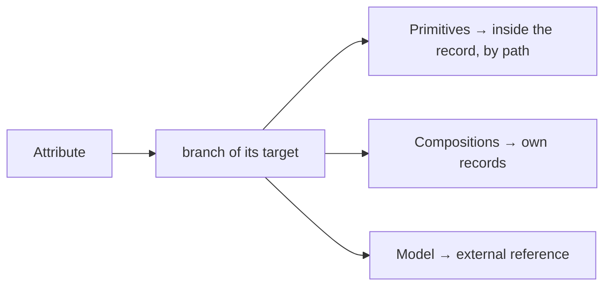

`record_values` keys on a **path**, with the last edge kept in `edge_id`
([D-134](90-decision-log.md)). That makes `WHERE edge_id = … AND value_decimal > 1000` find every
price over a thousand wherever it sits, and adding `path` narrows it to one attribute.

**Typed value columns, never one stringly value** ([D-071](90-decision-log.md),
[D-074](90-decision-log.md)).

⚠️ **A value reference resolves either to a node or to a record, and the target type's placement
decides which** ([D-131](90-decision-log.md)) — modelling-time content (`Base unit` → `Gramm`)
yields a **node** reference; input-time content yields a **record** reference.

---

### The tables

```php
CONTRACT — model side

nodes        id · version · name · path
relations    id · version · from_id · to_id · kind · name · position
settings     id · owner_id · key · value_* (typed)
labels       id · owner_id · role_id · locale · number · path · text · translatable
changelog    id · owner_id · owner_kind · at · by_user_id · before · after
```

```php
CONTRACT — data side, its own id space

records        id · model_id · model_version · created_at
record_values  id · record_id · edge_id · path · value_* (typed) · value_ref
```

Seven tables ([D-083](90-decision-log.md)). **No table per model** — the model **is** the schema
([D-066](90-decision-log.md)); a per-model **projection** may exist as a rebuildable **cache**, opt
in and few, never a place where anything is kept ([D-228](90-decision-log.md)).

**A search column per record**, written on save from the identifying fields — normalised, lowercased,
spacing and punctuation stripped, sharing **one** normalisation function with duplicate detection
([D-167](90-decision-log.md), [D-237](90-decision-log.md)).

---

### Change, versions, deletion

**Every object has at least one changelog item** — creation must be logged, because `creation_date`
is read from it ([D-081](90-decision-log.md), [D-080](90-decision-log.md)).

**A record carries the model version it was written against** ([D-060](90-decision-log.md)), and it
**keeps** it: only what actually conflicted is touched, so records at several versions are a normal
steady state ([D-210](90-decision-log.md)). **Numbers order events; shape decides compatibility**
([D-172](90-decision-log.md)).

**An unchanged save does not raise the version** ([D-282](90-decision-log.md)).

**A machine change is recorded as the machine**, never as whichever administrator was logged in
([D-296](90-decision-log.md)).

**Deletion is two-stage: park, then purge** ([D-123](90-decision-log.md)). A parked record keeps its
`unique` values blocked ([D-154](90-decision-log.md)). **Undo reaches exactly as far as the trash**
([D-172](90-decision-log.md)) — and a renderer never writes, not even to tidy up
([D-159](90-decision-log.md)).

---

### Data packs and provenance

A **data pack** is a named, installable set of model content and optionally some data
([D-175](90-decision-log.md), [D-215](90-decision-log.md)). The shipped seed is simply the pack that
comes in the box.

⚠️ **A pack is data, never code.** One that needs behaviour **declares a dependency** on it.

**Provenance sits on the individual node** — which pack it came from, and whether it has been
changed since ([D-174](90-decision-log.md)). Untouched is updated silently
([D-213](90-decision-log.md)); changed is left alone and reported. That per-node mark is what lets a
pack **deliver into** another pack's branch: **add yes, alter never**
([D-177](90-decision-log.md)).

**Provenance is information; `framework` is protection**, and it covers only the few nodes the
machinery stands on ([D-194](90-decision-log.md)).

---

### Extending the model while entering data

A branch **declares** that it may be extended, and the same declaration says **by whom**
([D-204](90-decision-log.md), [D-292](90-decision-log.md)). The value is **usable at once and judged
afterwards** — the pending state is a provenance mark, the list has the shape of the conflict
resolver, and a refusal is an ordinary two-stage deletion. Once approved it is an ordinary node.

---

### One tree, all subject areas

Recipes, PC hardware and ESP projects live **side by side under `Model`**; there are no separate
model roots and no *projects* ([D-273](90-decision-log.md)). The top level of `Model` **is** the
list of subject areas.

⚠️ **Sharing is the point:** recipes and hardware both use `Gramm`, `Anzahl`, `Medium`, and separate
trees would hold each of them more than once. **The price:** what is shared acts everywhere —
narrowing or renaming `Gramm` touches both.

---

### Bindings — how the engine finds anything

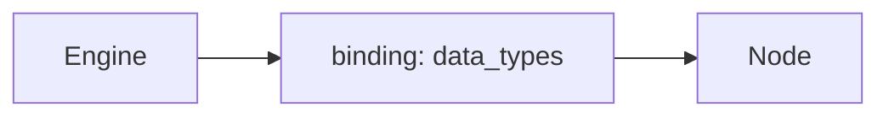

**The engine never names an id and never names a node name.** It asks for a **named slot** in the
installation configuration, and the slot points at a node ([D-120](90-decision-log.md)). Ids may
therefore shift freely and nodes may be renamed.

A binding carries **only the pointer** — no renderer, no defaults. Bindings name the model root,
the `data_types` root ([D-235](90-decision-log.md)), the built-in types, and the few nodes the
machinery stands on.

⚠️ **`framework` protection keys on exactly those** ([D-194](90-decision-log.md)): what a binding
points at may not be deleted, and the refusal says *this is a framework type* rather than *a binding
points at this* ([D-122](90-decision-log.md)). A **developer flag** lifts it — protection by
default, deliberately liftable, with friction on purpose ([D-122](90-decision-log.md),
[D-248](90-decision-log.md)).

---

### Soft identity: `unique`

The hard identity is the `id`. Beside it a node may declare one or more attributes **`unique`**, and
there may be several such constraints — an article number, an EAN — optionally grouped for a
composite one ([D-115](90-decision-log.md)).

⚠️ **The term *primary key* is refused** ([D-055](90-decision-log.md)): an article number is
human-meaningful, correctable, and a record survives its change.

A violation is a **refusal with an offered correction**, and it names the reason and the two ways
out ([D-114](90-decision-log.md)) — including when the holder is **parked**, since a parked record
keeps its unique values blocked ([D-154](90-decision-log.md)).

**Finding a duplicate before creating one** uses the identifying fields — the ones by which a person
recognises the record, a property of the **type** ([D-112](90-decision-log.md),
[D-237](90-decision-log.md)) — matched as *contains*. The check happens because it cannot be
skipped: as the author types, matches appear beneath, and *create new* is never the only visible
path ([D-111](90-decision-log.md)).

---

### Defaults, and the two-fold principle

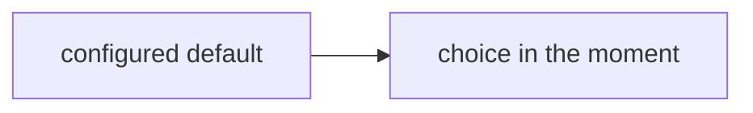

**A configured default plus a choice in the moment** is one pattern, not two rules
([D-032](90-decision-log.md)) — and it falls out of the resolution chain, whose two ends are the
installation and the use site ([D-079](90-decision-log.md)).

**A default may be a reference, not only a scalar** ([D-031](90-decision-log.md) family): it is
chosen with the **same chooser** as data entry, never a special widget, and **nothing is edited
inside the field** — a chip is the reference renderer, label plus link ([D-197](90-decision-log.md)).

**A field may take its default — or its restriction — from the record that encloses it**
([D-293](90-decision-log.md)). *Everything on this parts list is through-hole* preselects, or
restricts, the parts that may be chosen. The addressing is the relative edge path
([D-045](90-decision-log.md)); what is new is only that the value is read at **entry time** from the
whole.

**Small lists do not get a second storage mechanism, they get a cheaper editor**
([D-184](90-decision-log.md)). Five enum values **are** five nodes — referenceable, translatable,
extensible without touching code.

---

### Quantities, units, prefixes and money

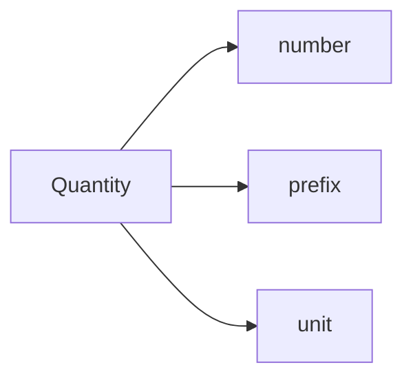

**A unit value is one notion**: value + optional prefix + unit ([D-039](90-decision-log.md)). Which
part varies follows from its sense — a length changes its **prefix**, a currency changes its
**unit**. Base units and currencies are **two branches of one shape**, not two mechanisms.

**Units of one dimension share a parent, and that parent is their type**
([D-274](90-decision-log.md)). Each unit carries its **factor**, and where needed an **offset**, to
the reference unit of that parent — so `Zoll → Millimeter` is a multiplication, and `°C → °F` is
`×1.8 + 32`. ⚠️ **Anything that is neither factor nor offset is a converter**, not a calculation:
wire gauge to cross-section is a table.

⚠️ **And a conversion may depend on a third thing.** A tablespoon of flour is 10 g, of sugar 12 g:
there the factor belongs to the **pairing**, so a **conversion is a record** — from unit, to unit,
for substance, factor ([D-306](90-decision-log.md)). [D-274](90-decision-log.md)'s factor on the
unit is the special case where the substance does not matter.

**Stored canonical, displayed with the prefix** ([C66](#c66--proposal-store-canonical-display-with-the-prefix)):
a common scale is what makes aggregates possible at all, and storing as entered makes every sum
conversion-dependent and a missed conversion silently wrong.

**Money is a type with behaviour, and currencies are model data**
([D-078](90-decision-log.md) family). ⚠️ **A rate needs a direction**, and where a price was
**agreed**, the rate is **frozen on the record** ([D-064](90-decision-log.md),
[D-065](90-decision-log.md)) — *track what describes, freeze what was agreed*. Intraday rates are
not needed.

**Precision is a property of the type**, and rounding happens once, at the boundary of the
calculation, never repeatedly along it.

---

### Date and time

**One type with a precision setting**, not three ([D-291](90-decision-log.md)):

| Precision | Example | Timezone-bearing |
|---|---|---|
| year | year of publication, 1981 | no |
| month | shelf life `03/2027` | no |
| **date** | birthday, invoice date | **no** |
| time of day | opening at 18:00 | no |
| **point in time** | created at, measured at | **yes** |

Stored **UTC**, entered and displayed in the **site's** timezone — both directions.

⚠️ **A plain date has no timezone.** A birthday is 14 March everywhere; stored as `00:00 UTC` it
becomes the 13th for everyone west of that. The precision therefore governs **meaning**, not only
appearance.

⚠️ **A duration is not a point in time** but a **quantity**, and belongs to the units above.

---

### Media

**A medium is an ordinary type under `Model`** with attachment id, URL, source and licence — an
ordinary record, aggregated by whoever uses it ([D-229](90-decision-log.md)).

⚠️ **Two locations on purpose** ([D-211](90-decision-log.md)): the **URL** is the living source, the
**copy** is the snapshot. One tracks, the other freezes.

The **file** lives in the WordPress media library; our model holds the identifier as **text** — an
opaque key of a foreign system, so the core knows nothing of WordPress. Existence is checked **at
display time**, and a missing file degrades to its link rather than to an error.

The **MIME type is detected** at the boundary and **stored**; the renderer dispatches on it, and a
new kind of file means registering one more, never extending a switch. **Refreshing the copy is
manual**, and either replaces it or adds a **version with a description**
([D-294](90-decision-log.md)).

---

### Validators, converters and what they may do

| | Does | May not |
|---|---|---|
| **Converter** | turns input into a value and a value into output; runs on input where it is invertible ([D-077](90-decision-log.md)) | — |
| **Validator** | checks, and may **offer a correction** ([V9](00-vision-and-scope.md)); several per attribute, each with its own message addressed by `path` ([D-158](90-decision-log.md)) | change behaviour: the author writes **what went wrong**, not what the system should do about it |

⚠️ **What cannot have been meant is removed by the converter; what might have been meant is
questioned by the validator** ([D-166](90-decision-log.md)). Leading and trailing whitespace is
stripped silently — and **before** duplicate detection and the uniqueness check, or `Part` and
`Part ` become two records nobody can tell apart. Interior spacing is a validator that **offers**
the corrected form.

**An error blocks; a warning stays visible and does not** ([D-288](90-decision-log.md)). A validator
therefore yields **severity** as well as a message and possibly a correction. The way through an
error is to relax the rule deliberately, not to click past it.

⚠️ **A read-only attribute with neither a calculation nor a default is a model conflict**
([D-218](90-decision-log.md)) — a dead field that looks like part of the form. Reported when it is
configured, with the two repairs named.

---

### Representation: how one value can be written more than one way

**A representation is a converter plus a renderer, and the mapping is model data**
([D-219](90-decision-log.md)). Colour rings, `2k7`, `104`, a traffic light and stars are all
instances of one mechanism; standards ship as data packs, and users build their own the same way.

⚠️ **The only axis is invertible or not:** an invertible converter can be **written into**
([D-076](90-decision-log.md)) — rings, shorthand notations; a non-invertible one is output only —
traffic light, stars. **Whether a form replaces the value or sits beside it is a free choice**, not
a consequence of that axis ([D-226](90-decision-log.md)).

⚠️ **Notation is not structure** ([D-149](90-decision-log.md)): a second writing of the same value is
**never a second field**, because two stored values drift apart.

**Where several fields belong together in one notation, they are one composed type**
([D-220](90-decision-log.md)) — `Resistance` is value plus tolerance
([D-150](90-decision-log.md)), a quantity is number plus prefix plus unit. The **composed type is
the unit of rendering**, and its members stay individually searchable because they live inside the
record by path.

**Code is needed only where the mapping cannot be written as a table or a rule.**

---

### The `Compositions` branch declares, it does not contain

⚠️ **It is not a container** ([D-135](90-decision-log.md)). It is an ordinary node that **declares**
*only composition edges may point at me*, and inheritance passes that declaration to its children.
An aggregation pointing at a descendant of `Compositions` is therefore a **contradiction in the
model**, not a convention.

**Locality is not lost:** the model view shows the composed structure inline at its owner by
following the edge — presentation, not storage.

**A multi-valued composition creates its node automatically**
([D-136](90-decision-log.md)), named from owner and attribute (`Parts list-Position`) and
renameable. Duplicate names are no problem, because base names are explicitly not unique.

> *In the author's head: one model with a repeating group. In the tree: a node under
> `Compositions`. Shown: at the parts list, where it belongs.*

---

### Moving, and what happens to what pointed at it

**Moving is one rule with two subjects — a node between branches, and an attribute up to the parent
or down to a child — and it never loses data** ([D-155](90-decision-log.md)). Up is additive; down
is removing; a **mandatory** attribute makes even the additive direction a break.

**An orphaned override is promoted** ([D-156](90-decision-log.md)): with **one** user the attribute
is restored on the target; with **several**, a specialised child is created under `Compositions` and
this one use site is repointed.

⚠️ **At multiplicity 1 under `Model` the branch chooses an own record where inline would have been
natural, and the author is told** ([D-163](90-decision-log.md)) — the value becomes an independent
thing that can be found, referenced and deleted on its own. Never a surprise found later in a
search result.

---

### Deletion, in detail

**Two stages: park, then purge** ([D-123](90-decision-log.md)).

| | |
|---|---|
| **The trash holds deletion *events*, not objects** ([D-127](90-decision-log.md)) | so what was deleted together comes back together |
| **Deleting a node asks: the branch, or this node alone** ([D-180](90-decision-log.md)) | *alone* reattaches the children to the grandparent — which is [D-155](90-decision-log.md)'s move, with everything that follows |
| **A confirmation names consequences** ([D-126](90-decision-log.md)) | *this is used in 14 places* — not *are you sure* |
| **A stopped descent is an event, not a nothing** ([D-100](90-decision-log.md)) | it is reported, not silently skipped |

**`Cleanup` is the repair surface** for what deliberate non-tidying leaves behind
([D-247](90-decision-log.md)): nodes without connections, settings broken by a deletion. Shown and
removed deliberately, never automatically.

---

### Test data and sample values

Three layers feed a preview ([D-240](90-decision-log.md)):

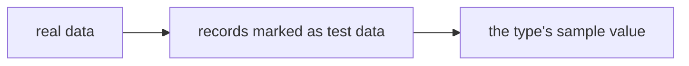

**The sample value belongs to the type**, not to the renderer — a node carries several renderers,
and a sample is a value. It must be **valid**, or the preview shows what the model forbids.

**Samples that appear together are coherent** ([D-290](90-decision-log.md)) — one persona, so
`Herbert Müller · herbert@home.de · Muster GmbH · Berlin` rather than three unrelated placeholders.
⚠️ **Coherence can be shipped, never guessed:** for built-in types we lay it down; for anything the
user creates it comes from his own marked test data.

**The test-data mark governs front-end visibility and nothing else**
([D-241](90-decision-log.md)). In every other respect such a record is ordinary — it counts for
uniqueness, appears in the administration, and travels through migrations.

---

### The two layers, and why they never mix

**Modelling view and data view are separate layers** ([D-026](90-decision-log.md)). The model says
what a thing is; the data are what someone entered. A screen belongs to one of them, never to both.

⚠️ **But the editor is the same** ([D-029](90-decision-log.md)): **the default editor *is* the data
editor.** Setting a default means filling in the very form a data-enterer will see, which is why a
default can be a reference and not only a scalar ([D-030](90-decision-log.md)) — and why nobody has
to learn a second way of entering things.

**Standalone-versus-composed applies only to nodes whose instances are records**
([D-132](90-decision-log.md)). For a data type the question is meaningless: it has no instances of
its own.

**And the two resolutions must never be mixed** ([D-013](90-decision-log.md)): resolving a
**setting** walks the chain; resolving a **value** walks the record. They look alike and answer
different questions.

---

### Numbers and storage types

⚠️ **Numbers are whole or decimal, never floating point** ([D-057](90-decision-log.md)). A price, a
resistance and a tolerance are exact quantities; binary floating point cannot represent `0.1`, and
the error surfaces first in a sum that is one cent off and nobody can explain.

**Typed value columns** ([D-071](90-decision-log.md), [D-074](90-decision-log.md)) — an integer
column, a decimal column, a text column, a date column, a reference column — never one stringly
value that everything is cast in and out of.

---

### Prefixes and permitted sets

**A prefix is a node, not an enum** ([D-116](90-decision-log.md)), and the general rule behind it is
that a fixed list of things a user may extend is **always** nodes.

**Permitted prefixes are an allow-list setting on the attribute**
([D-040](90-decision-log.md)) — a resistance may allow `k` and `M` and not `µ`, without a second
type existing for it.

**Permitted sub-nodes are a setting holding a mode plus a list**
([D-046](90-decision-log.md)): the mode says how the list is read, the list says which nodes.

**A unit value is stored in its base unit, with the chosen prefix beside it**
([D-047](90-decision-log.md), [D-051](90-decision-log.md)) — `Gramm` is the base and the prefix
carries the *kilo*. That is what makes a sum over mixed prefixes possible at all.

---

### Overrides — the fine print

**An override is the same thing wherever it sits; only its owner differs**
([D-087](90-decision-log.md)). There is no separate *node override* and *use-site override*, only
one construct with a different `owner_id`.

⚠️ **An override may narrow *and* widen — there is no monotonicity rule**
([D-088](90-decision-log.md)). A use site may allow something the node did not.

> ✅ **Settled the same evening by [D-310](90-decision-log.md):** [D-088](90-decision-log.md) stands.
> The *never widen* sentence was my over-generalisation of [D-221](90-decision-log.md)'s unit case.

**Orphaned overrides are never cascade-deleted** ([D-033](90-decision-log.md)); they are promoted
([D-156](90-decision-log.md)) or shown, never quietly removed.

---

### Money, in detail

**The model declares one reference currency**, and a frozen rate always points at it
([D-067](90-decision-log.md)) — otherwise a rate is a fact without a direction.

**The frozen rate belongs to the money type**, not to a hand-made hidden field beside it
([D-068](90-decision-log.md)).

**Rates are fetched at the boundary into a rate table; the core only reads it**
([D-069](90-decision-log.md)) — so the core never reaches out to a network and stays testable
without one.

**A currency value is an ordinary composed node with registered behaviour**
([D-073](90-decision-log.md)), not a special case in the engine.

**A valuation method is a registered strategy, and there may be several**
([D-145](90-decision-log.md)) — average, last price, replacement value — chosen per use site like
any other setting.

---

### Concurrency

**Answered per layer** ([D-089](90-decision-log.md)): the `version` on the identity is the guard for
model rows — read it, write it back with the change, and a second writer whose version no longer
matches is refused rather than silently overwriting. The data layer answers it its own way.

---

### Deletion — the remaining surfaces

**Deleting a referenced node parks every edge that points at it**
([D-125](90-decision-log.md)) — the edge keeps its type and its name, which is what makes promotion
possible later ([D-156](90-decision-log.md)).

**Three surfaces for a deletion, and they are different**
([D-128](90-decision-log.md)): the tree, the detail view and the conflict resolver each show it in
their own terms.

**Moving a node is referentially free and semantically a model change**
([D-124](90-decision-log.md)): nothing breaks — the ids are unchanged — but what the thing **means**
has changed, so it is a change with a history like any other.

---

### Model change and migration

**A model change is breaking or not depending on the existing data, not on the change**
([D-037](90-decision-log.md)). Adding a mandatory attribute is harmless with no records and a break
with a thousand. **The data decide**, so the answer is computed, never assumed.

**Migration needs the changes, not the snapshots — the changelog *is* the migration script**
([D-061](90-decision-log.md)).

**Durability is a lifecycle question, not a storage-shape question**
([D-141](90-decision-log.md)): where a document must survive it is **not deleted**; purging an order
is simply forbidden.

---

### What ships

**A base scaffold ships and is imported once; afterwards it is ordinary authored content**
([D-119](90-decision-log.md)) — with [D-174](90-decision-log.md)'s provenance deciding what a later
update may touch.

**A demo pack ships beside it** ([D-129](90-decision-log.md)): an example tree with data, optional
and removable ([D-175](90-decision-log.md)).

**`Compositions` gets a binding like every other root the engine must find**
([D-138](90-decision-log.md)), and what has data of its own is decided by **placement, visibly**
([D-139](90-decision-log.md)) — the answer is read off the tree, not derived.

---

### One piece of modelling guidance that belongs here

**A symmetric relationship is better modelled as membership of a group than as two mirrored edges**
([D-102](90-decision-log.md)) — *these three parts are interchangeable* is one fact, not six.

### How to think in this model

⚠️ **The concept can express more than it teaches**, and that gap is where models rot. A short
**pattern book** carries the moves ([D-307](90-decision-log.md)):

| Move | Instead of |
|---|---|
| a relationship with its own values becomes a **node** | `Supplier`, then `Supplier2` |
| a repeating group becomes a **composition** | ten numbered attributes |
| the same thing in two roles is **one node, two relationships** | two copies |
| a **version** is a record under the thing | a versioning mechanism |
| a **conversion** is a record | a factor hard-coded somewhere |
| a characteristic that does not hold for all is **cut differently** — moved down, or made a property with values | *birds fly, except these* |

### What is deliberately not in the model

| Not modelled | Because |
|---|---|
| `slug` | a boundary concern ([D-195](90-decision-log.md)) |
| a *fixed value* | a restriction collapsing to one ([D-221](90-decision-log.md)) |
| `set`, `table` as constructs | a composed type plus a renderer ([D-246](90-decision-log.md)) |
| a per-node *hide* flag | selectability belongs to the use site ([D-181](90-decision-log.md)) |
| record versioning as a mechanism | versions are records under the thing ([D-305](90-decision-log.md)) |
| conversion as a property of a unit | a conversion is a record ([D-306](90-decision-log.md)) |
| a running number per record | the `id` identifies; a number circle is parked ([D-267](90-decision-log.md), [D-268](90-decision-log.md)) |

---

## How the model was arrived at

*Everything from here on is the **reasoning**: twenty-five passes of owner statements with the
discussion each produced. It is kept because a rule is only safe while the reason for it can
still be read — more than one rule was saved this way. It is **not** what to build from; that
is the section above.*

## Owner statements — 2026-08-22

Continues the numbering from [Vision and scope](00-vision-and-scope.md) (V1–V9).

| # | Statement |
|---|---|
| **C1** | **As in object orientation, every node has attributes.** |
| **C2** | An attribute carries a **name**, a **type**, and a **kind of connection to another node**. |

Directly relevant statements from other documents, repeated here because the model has to
satisfy them:

| # | From | Statement |
|---|---|---|
| **V1–V5** | [Vision](00-vision-and-scope.md) | Nodes and edges. Tree = inheritance only. Root has no parent. All nodes fundamentally the same. |
| **V6, V7** | [Vision](00-vision-and-scope.md) | Special nodes for data types and calculations, created in the configuration. |
| **V8, V9** | [Vision](00-vision-and-scope.md) | Every node has one renderer, one converter, one-or-more validators; a validator may offer a correction. |
| **P2** | [Persistence](50-wordpress-persistence.md) | A node *may* have settings, stored generically. |

### What C2 implies, and what it leaves open

C2 describes an attribute as something that *points at another node* — an attribute looks like
a **named, typed edge**, not like a scalar field inside the node. That is the same conclusion
the legacy round reached and locked as *Attribute = Relation*
([`../legacy/DEVELOPER-ATTRIBUTE-MODEL.md`](../legacy/DEVELOPER-ATTRIBUTE-MODEL.md)) — which
makes that file the first legacy document worth harvesting, as a cross-check rather than as an
inheritance.

Left open → [OQ-010](91-open-questions.md), [OQ-011](91-open-questions.md):

- Is *attribute* the same construct as the *edge* of V1, or two things that merely resemble
  each other?
- What is the attribute's **type**? C2 lists *type* and *connection kind* as two separate
  items, so they are apparently not the same thing.
- Where does a plain value live — a number, a string? In a node the attribute points at, or in
  the attribute itself?

### C3 — A setting is an attribute

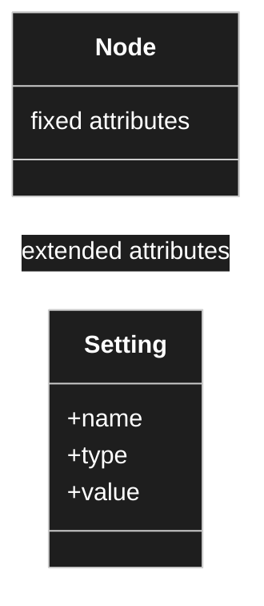

**Settings and attributes are the same kind of thing.** A setting is not a second concept
beside the attribute — it is simply an **additional** attribute that a node carries beyond the
set every node has. What differs is only *where the value is stored*, not *what it is*.

| # | Statement (owner, 2026-08-22) |
|---|---|
| **C3** | Settings and attributes are the same kind of thing. The settings of a node are the group of **additional** attributes it carries. |
| **C4** | The attributes that **every** node has are stored **on the node itself**. |
| **C5** | The attributes that appear only through **specialisation** — an integer node carrying min, max, step — are stored **generically, in the settings table**. |
| **C6** | For display the two sets are re-joined: the fixed ones first, the extended ones beneath. How exactly is a renderer concern and is not settled here. |

**Working names:** *fixed attribute* (C4) and *extended attribute* (C5). Both are attributes.
Glossary candidate — the previous round lost two years to *Eigenschaft / Attribute /
Parameter / Slot* drifting apart, so the words are fixed before the model is.

### Why this split, and what it costs

**For it.** The fixed set becomes real columns: indexable, sortable, joinable, type-checked by
the database, and one row reads a whole node. The extended set is genuinely open-ended, so a
generic table is the honest shape for it. This hybrid is also what WordPress itself does
(`wp_posts` columns beside `wp_postmeta`), which makes it idiomatic for the environment
rather than exotic.

**Against it.** Reading a node now touches two places, and display has to re-join them. The
owner judged this acceptable, and that judgement holds: the fixed attributes are the same for
every node, which gives the user something recognisable, and the extended ones can simply
appear beneath.

**One constraint that follows.** The re-join must load in **batches**, never per node — a
settings lookup inside a tree walk is exactly the N+1 that `CD-7` forbids.

### Open, and deliberately not answered here

- **Is "setting" one thing or two?** [OQ-016](91-open-questions.md) — C5 describes domain
  content (min, max, step), while [`TreeMeremaid.md`](TreeMeremaid.md) puts `order`, `hide`,
  `read_only`, `renderer`, `converter`, `validators[]` in the same box. Those are tool
  behaviour. Whether they are the same construct is not decided.
- **Which attributes are the fixed set?** [OQ-017](91-open-questions.md) — C4 turns them into
  columns, so the list has to be enumerated and then frozen.
- **Where does an extended attribute's value live?** [OQ-018](91-open-questions.md) — C2 says
  an attribute connects to another node; C5 puts it in a settings table as a value. Those are
  different storage locations for the same concept.

### C7–C10 — settings hang on edges too

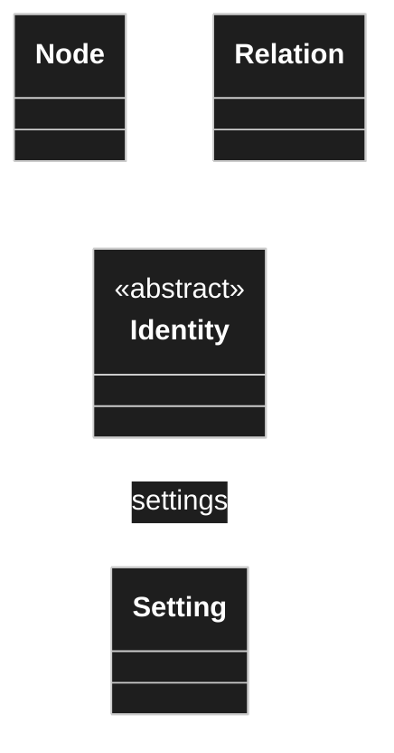

| # | Statement (owner, 2026-08-22) |
|---|---|
| **C7** | Every child node **inherits the attributes of its parent** and either takes them over unchanged, or **overrides** them. |
| **C8** | To record an override, the describing data has to live somewhere. Therefore settings are also **hung on the edges** — on the connection itself, not only on the node. |
| **C9** | For the **inheritance** edge this is not needed; other rules already apply there. |
| **C10** | For **composition and aggregation** edges it is needed. Currently those are believed to be the only edge kinds that need settings. ⚠️ *stated with "I believe"* |

**The seed already anticipated this.** In [`TreeMeremaid.md`](TreeMeremaid.md), `Configuration`
hangs off `WPClassHead`, and both `Node` and `Relation` extend it. So configuration on edges was
drawn before it was argued for. C8 confirms the diagram rather than changing it — the settings
owner is *anything with identity*, not *a node*.

### Why an edge needs its own settings

C8 is the per-use-site case. A node describes a thing **once**; the same thing can be used in
several places, and each use may need to look different — a different label, read-only here but
editable there, a different multiplicity. That configuration cannot live on the node, because
the node is shared by every use site. It belongs on the **edge**, because the edge *is* the use
site.

Inheritance is exempt (C9) because it is not a use site: a child that wants a different value
simply states its own, and the inheritance rules resolve it. There is only one inheritance edge
per node, so there is nothing to distinguish.

**C10 also names edge kinds for the first time** — inheritance, composition, aggregation. That
is a partial answer to [OQ-002](91-open-questions.md), which asked what the non-inheritance
edges are. It was said with "I believe", so it is recorded, not locked.

**Open:** [OQ-021](91-open-questions.md) — what distinguishes composition from aggregation
here, and does the model need both? [OQ-022](91-open-questions.md) — one settings table with a
polymorphic owner, or one per owner kind?

## Owner statement — 2026-08-22, third pass

| # | Statement |
|---|---|
| **C11** | `Identity` is shared by nodes and edges and carries **more than an id** — a version number among other things. Drawing ids from **one common space** is acceptable. |
| **C12** | **Composition** means the part is part of the model and is **deleted with it**. |
| **C13** | **Aggregation** always points at another node. Composition may point at another node too — but since a composed part is firmly bound to its whole, its data could in principle be held in the attribute itself. No mechanism exists for that yet. |
| **C14** | Inheritance resolution walks from the child **up to the last ancestor**, in case of doubt to the root. It may stop as soon as no ancestor contributes an attribute. |
| **C15** | Attribute settings resolve **downwards**: an attribute references a node, that node may have children, and the settings have to reach into all of them. |

**Open, and put to the writer of this document by the owner:** should the inheritance edge be
one edge kind among others with extra rules, or a separate construct altogether?
→ [OQ-023](91-open-questions.md).

### C12/C13 — composition and aggregation do differ

This answers [OQ-021](91-open-questions.md). The distinction is the UML one, and both are needed:

| | Points at another node | Lifecycle |
|---|---|---|
| **Aggregation** | always | the target is independent and survives the whole |
| **Composition** | yes | the target belongs to the whole and **is deleted with it** |

The worked example the owner raised — a parts list made of positions, where a position is used
nowhere else — is the case where composition earns its keep. It is discussed under
[OQ-026](91-open-questions.md), because the tempting answer (store the position inline instead
of as a node) would create a second form of structure, and two forms of structure is what the
previous round died of.

### C14/C15 — resolution runs in two directions

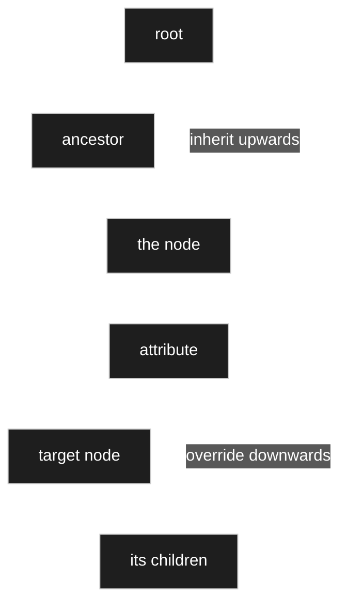

Two different walks, easily confused because both are called *resolution*:

- **Upwards (C14).** What attributes does this node have at all? Answered by walking the
  inheritance chain toward the root. Bounded: the chain is a path in a tree.
- **Downwards (C15).** How is this attribute configured, including deep inside its target?
  Answered by walking into the target and its children. **Not** bounded by anything stated
  so far — the target is a graph, not a path.

The downwards walk is the expensive one and the one that broke the previous project as trees
grew. How it is resolved and cached is [OQ-024](91-open-questions.md); how an override deep in
the target is addressed and stored is [OQ-025](91-open-questions.md).

## Owner statement — 2026-08-22, fourth pass: versioning

| # | Statement |
|---|---|
| **C16** | A version makes visible that **something was changed** on a node or an edge. |
| **C17** | It also matters for the **data** later. If the model changes and data already exists: in the best case the old data carries into the new model — a field was simply added. In the worst case it becomes a **new model version** and a **mapping** from old to new is required. |
| **C18** | The user must **not have to re-enter data**. A model change creates a discrepancy, and the user has to be able to resolve it with suitable means. |

**This changes how `version` should be read.** It is not primarily an audit marker. It is the
anchor for surviving a model change with the data intact — which makes it a load-bearing part
of the model rather than bookkeeping. The mechanism is [OQ-031](91-open-questions.md), and it
cannot be settled before [OQ-015](91-open-questions.md) says where content lives at all.

## Owner statement — 2026-08-22, fifth pass: names, and two attribute settings

| # | Statement |
|---|---|
| **C19** | An attribute can be set **read-only** and **hidden**. Hidden matters in its own right: hidden fields can be created and used later for **calculation**. |
| **C20** | A node **needs a name**, and that name is the model author's own. |
| **C21** | **Names are not unique, and duplicates are expected.** Two attributes may share a name; two different nodes may each have a child of the same name. |
| **C22** | **A decision is never made on the basis of a name.** References always use the **id**. Searching by name is fine; resolving by name is not. |
| **C23** | The id stays the same — that is the point of it. **The name may change.** For a child, the name is only a textual description so the user can recognise it, and carries no meaning for the code. |

C20–C23 close [OQ-032](91-open-questions.md): the base name is **required**, and it is
explicitly **not unique** — so the sibling-uniqueness idea raised there is rejected, on the
grounds that duplicate names are a normal modelling outcome rather than a mistake to prevent.

C19 adds two attribute settings, and *hidden* turns out not to be only a display concern: a
hidden attribute still exists, still holds a value, and is meant to feed calculations. It is
invisible, not absent.

## Owner statement — 2026-08-22, sixth pass: model and instance

| # | Statement |
|---|---|
| **C24** | **Modelling view and data view are separate.** The model and an instance of it are different things. |
| **C25** | An attribute carries a **type**, and that type **is the node the relation points to**. |
| **C26** | In the modelling view a **default** may be given, and that default may be **a whole record — the data of an instance**, not only a scalar. |

### C24 — the two layers

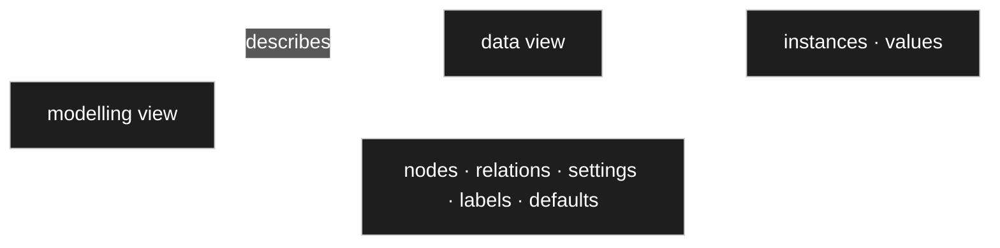

**What this settles: at model level there are no values, only defaults.** A value belongs to an
instance. Half of [OQ-018](91-open-questions.md) was therefore the wrong question — it mixed the
two layers and asked where *the value* of a model-level attribute lives. There is none.

C25 answers [OQ-011](91-open-questions.md) outright: [C2](#owner-statement--2026-08-22)
listed *type* and *connection kind* as two separate things, and now it is clear why. They are
**two fields of the same edge** — `to` is the type, `kind` is the connection.

### C26 — a default can be an instance

This is the part that does *not* simplify. A scalar default (`step = 1`) is an ordinary setting.
A default that is **an entire record** is a reference to something in the data layer, from an
object in the model layer. That needs somewhere to point → [OQ-035](91-open-questions.md), and it
depends on whether instances share the identity space → [OQ-036](91-open-questions.md).

**It also probably removes a question.** [R22](30-renderer.md) said the preview runs on *test
data*, and [OQ-033](91-open-questions.md) asked where that data lives. If a node can carry a
default instance, the preview has nothing left to invent: **it renders the node with its default
instance.** No separate test-data mechanism, and the sample updates itself whenever the default
does.

## Owner statement — 2026-08-22, seventh pass: three layers, and defaults

| # | Statement |
|---|---|
| **C27** | There are **three** layers, not two: the **model**, the **data** entered into it, and the **presentation** — the latter being what the renderer concept covers. |
| **C28** | **Test data is ordinary data, marked as such.** Rows can be flagged as test data, and the preview renderer uses those. The default value is checked at the same point. |
| **C29** | A **default** says how data is filled by default. An integer with default `10` means a new record starts at `10`. |
| **C30** | Defaults work **with multiplicity**: several defaults, several pre-filled rows. |
| **C31** | A default may be a **node reference**. Given an attribute that chooses from four options, options one and two can be the defaults — and those options are nodes too. |
| **C32** | The same holds for an **aggregation**: take the target node, look at which values get filled, and pre-fill them. |
| **C33** | **The default is entered in the attribute, but it looks exactly like entering data into the model.** Same display, same interaction. |

### C33 — the default editor *is* the data editor

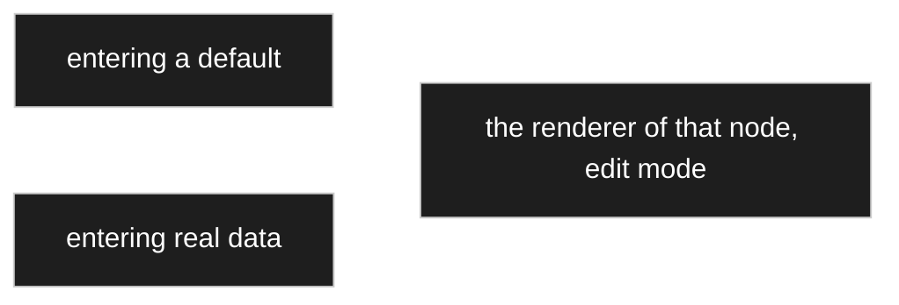

This is the strongest reuse statement in the concept so far, and it costs nothing to honour —
it is [R1](30-renderer.md) and [R4](30-renderer.md) applied one level up. Filling a default is
filling data; the only difference is where the result is written. **One editor, built once.**

It also gives the answer to the usability worry in C30–C32: entering a default for an aggregation
with multiplicity `1..*` is intimidating only if it is a separate, unfamiliar screen. As the
ordinary data editor, it is something the author already knows how to use.

### C28 — test data stops being a third kind of thing

[OQ-033](91-open-questions.md) asked where preview data lives, having noted it was neither model
nor content. C28 answers: **it is content, with a flag.** No new storage, no new concept — the
preview renders the node in the data view over rows marked as test data, and falls back to the
defaults where none exist.

### C31, C32 — a default is a reference, not only a scalar

This narrows [OQ-035](91-open-questions.md) to its smallest option: a default is stored as a
**setting whose value is an identity reference**, and multiplicity means several such settings.
`Relation.from` and `Relation.to` stay pointing at nodes; nothing widens.

## Owner statement — 2026-08-22, eighth pass: the two-fold principle

| # | Statement |
|---|---|
| **C34** | **Two-foldness.** For a whole class of behaviours there are two levels: a **default behaviour configured in the admin menu**, and the **choice the user makes in the moment**. This concept is to be kept and applied wherever it fits. |
| **C35** | An override whose path has disappeared — the parent deleted the thing it pointed at — is **not** cascade-deleted. **The user decides.** Either delete them, or **promote the override into an attribute of its own** at the level where it was overridden: if it was worth overriding, it is evidently needed. |

### C34 — a pattern, not a single rule

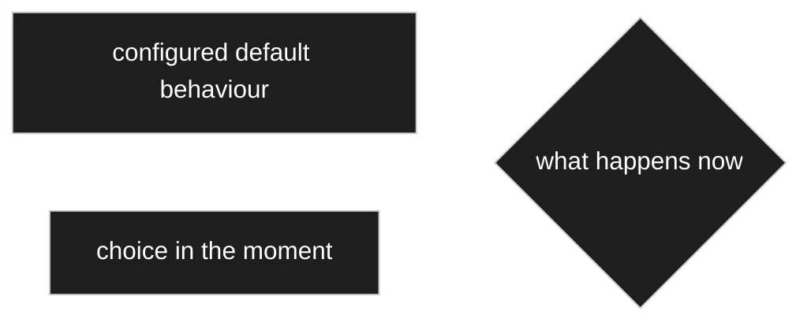

The two levels are not competing answers to one question; they are **two questions**. *What
should normally happen* is configuration. *What happens this time* is the user. Anywhere the
concept applies, both have to exist — the configured default alone makes the system rigid, the
choice alone makes it tedious.

It already applies in three places named so far: the orphaned override (C35), inline-versus-dialog
selection ([R24](30-renderer.md)), and the renderer choice, which has a node default that a use
site may override.

### C35 — the second option is the interesting one

Deleting an orphaned override is obvious. **Promoting it is not**, and it is the better default
to offer: the override exists because someone needed that value at that place. Losing the target
does not make the need go away — it means the value should now stand on its own, as an attribute
at that level, rather than as a correction to something that no longer exists.

Mechanically that is a new relation plus its settings, created from what the override already
held. Nothing new is required, but **it is an operation, not just a dialog** — see
[OQ-037](91-open-questions.md).

## Owner statement — 2026-08-22, ninth pass: the settings hierarchy inside an attribute

| # | Statement |
|---|---|
| **C36** | **An attribute contains a hierarchy of its own.** There are settings for the target; beneath them, settings for each of the target's attributes; beneath those, settings for *their* attributes. At every level the author either **overrides** or **leaves it as inherited**. |
| **C37** | **Sharing a node requires an identical definition.** A parts list and a quotation would not share a *position* — their positions differ. They would share an *article*. Sharing happens at the reusable end of the graph, not at the composed end. |
| **C38** | When overrides are orphaned, a **dialog** shows where they are defined and asks whether to keep them. Keeping means **taking the override over as an attribute of its own, inside that hierarchy**. |

### C36 — the override path *is* the hierarchy

This restates [C15](#c14c15--resolution-runs-in-two-directions) more precisely than it was
written. Configuring an attribute is not filling in one form; it is walking a tree whose shape is
the target's own structure, deciding at each node whether to accept what is inherited or to state
something else. The **override path is that tree**, and it is sparse because most levels are
accepted unchanged ([D-015](90-decision-log.md)).

### C37 corrects a worked example

The scenario drawn for [OQ-037](91-open-questions.md) had a parts list and a quotation sharing
one `Position`. The owner is right that they would not: a position in a parts list and a position
in a quotation carry different attributes, so they are different nodes. **The sharing happens one
level deeper, at `Artikel`** — which is the node whose attribute the scenario deletes. The example
was drawn at the wrong edge, not built on a wrong idea.

### C38 — and the mechanism it needs

*Keep it as an attribute of its own* is clear from the author's side. Mechanically it cannot mean
*add the attribute back to the target*, because the target is shared — that would restore it for
everyone, which is what the deletion was undoing. It has to mean **specialise**: create an
inheriting child of the target that carries the attribute, and point this one use site at the
child.

That is inheritance being used for exactly what it exists for — a use-site-specific variant of a
shared node — and it follows the precedent of [D-017](90-decision-log.md): the node is created in
place, so the author never experiences having made a separate global object. → the fourth option
in [OQ-037](91-open-questions.md).

## Owner statement — 2026-08-22, tenth pass: units, and what inheritance buys

| # | Statement |
|---|---|
| **C39** | A good deal is fixed **through inheritance**. A weight is not a bare double — it has its own type node that takes a numeric value *and* a unit, prefix included. |
| **C40** | There are several kinds of unit value: **base units**, and **currencies**. A two-part split. |
| **C41** | **Composed types** are defined and reused elsewhere; **models** are then built on top of them. |
| **C42** | A type already anticipates part of how it is composed, and its settings. |
| **C43** | Because a child inherits its parent's attributes, using a node means looking **only at that node** — not walking back up to the parent. This makes the attribute structure **flatter** in use. |
| **C44** | ⚠️ **Correction, made by the owner mid-thought:** the numeric field does **not** belong to the base unit. A **unit value** is its own composed type — a value field (integer or double) **plus** a base unit. |

### C44 — the correction is the load-bearing part


The first version of the thought put the double on the base unit. That would make *gram* a
number, which it is not — a gram is a **definition**. The number belongs to the **unit value**,
which is an ordinary composed node with two attributes. `Gewicht` is then a specialisation of
`Einheitswert`.

Nothing new is needed for this: it is [D-031](90-decision-log.md) — attributes are relations —
applied twice.

⚠️ **`Base unit +symbol` in the diagram above is contested.**
[D-252](90-decision-log.md) makes `symbol` a **label role** — a translated text in the labels table —
and [40 I18n](40-i18n.md) already carries `Ω` and `St` that way. The diagram models it as an
attribute of the unit node, which would put the same fact in two homes. Raised in
[contradictions](_harvest/contradictions.md); **not settled here** ([PR-4](../../CLAUDE.md)).

### C39, C41, C42 — the type layer

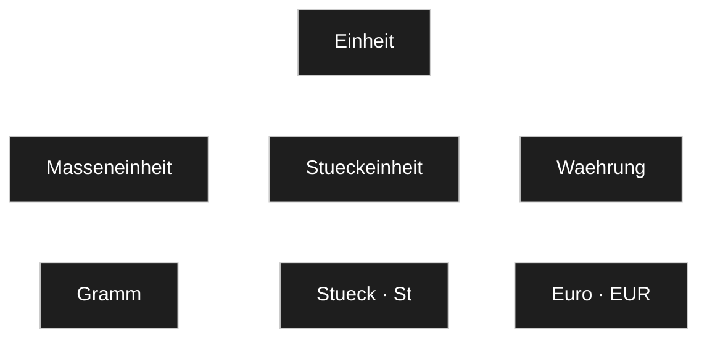

Types are built by inheritance, reused by composition, and models are assembled from them. The
tree of units is itself model — authored once, referenced everywhere.

### C43 — flatter for the author, not for the machine

The claim is right and worth stating exactly: **a concrete type presents its whole inherited
attribute set**, so whoever uses it never walks the hierarchy. Inheritance is a *definition-time*
mechanism; at use time one sees the resolved whole.

What it does **not** do is make the work go away. The resolution still happens — it is
[C14](#c14c15--resolution-runs-in-two-directions), the upward walk — and it happens on every
read. That is precisely why [D-014](90-decision-log.md) puts an indexed ancestor structure into
the schema rather than treating it as a later optimisation. **The structure is flatter; the
lookup is not free.**

### What this raises

Four questions, and the third is the largest thing to come up since the attribute question:

| | |
|---|---|
| [OQ-040](91-open-questions.md) | Is a currency a branch of units, or a separate concept? |
| [OQ-041](91-open-questions.md) | Is a prefix a node or an enum? |
| [OQ-042](91-open-questions.md) | **Does an attribute's type name one node, or a branch?** |
| [OQ-043](91-open-questions.md) | Is the unit tree shipped with the plugin, or authored? |

## Owner statement — 2026-08-22, eleventh pass: units, prefixes, and what a type names

| # | Statement |
|---|---|
| **C45** | The nodes describing relation kinds **do not belong in the tree**. They were only there to show which kinds exist. |
| **C46** | The duplication of `Praefix` and `Kuerzel` on parent *and* child in the old tree **was wrong**. The intent was: constants define the prefixes, each with a hidden field carrying its **multiplier**; unit types then use those. Define once through inheritance, then use that node as an attribute type. |
| **C47** | There is **one** notion: the **unit value**. It is composed of a **value**, an optional **prefix**, and a **unit**. |
| **C48** | Which part varies is determined by the sense of the unit value: converting euro to dollar changes the **unit**; metre to kilometre changes the **prefix**. |
| **C49** | When defining a unit, the author wants to say **which prefixes are permitted** — no gigametres. This must be **generic, definable in the modeller**, not a coded data type. The previous attempt hard-coded a type and kept breaking whenever a new case appeared. |
| **C50** | If the type of an attribute is a plain node, it is clear — there is no branch behind it. |
| **C51** | If the type is a **branch**, the type is *of branch kind*: **polymorphic**, one substitutable for another — and at data entry **a node from that branch must be chosen**. |
| **C52** | Some types need only the node chosen, because they have no attributes. Where the chosen node **has** attributes, the user must then fill them. |
| **C53** | Hence a **multi-step input**: first choose the node, then enter data if needed. |

### C50–C53 — this answers [OQ-042](91-open-questions.md)

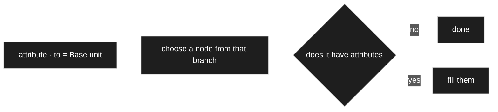

**The type of an attribute is a branch, and the branch is polymorphic** — any descendant may
stand where the branch root is named. That is inheritance doing what inheritance is for, and it
makes three things fall together that looked separate:

1. **The chooser is the type system.** [R25](30-renderer.md) already gives a chooser a *branch
   node* and a *default node*. An attribute gives exactly those two — `to` is the branch, its
   default is the default.
2. **A choice list stops being special.** `Konstanten › Bauformen` is an attribute whose branch
   happens to be shallow. No separate mechanism.
3. **The multi-step input (C53) is the chooser followed by the editor** — [R25](30-renderer.md)
   then [D-029](90-decision-log.md), which already says the editor is the same one that enters
   real data.

C50 is the degenerate case: a branch with no descendants and no attributes is simply a value.

### C49 — allowed prefixes, and the question the owner asked

The owner asked which is better: two branches (`With prefix` / `Without prefix`, as the old tree
has) or **one** branch where the prefix is always present and hidden where it does not apply.

**Recommendation: neither. Make the permitted set a setting, and both cases fall out.**

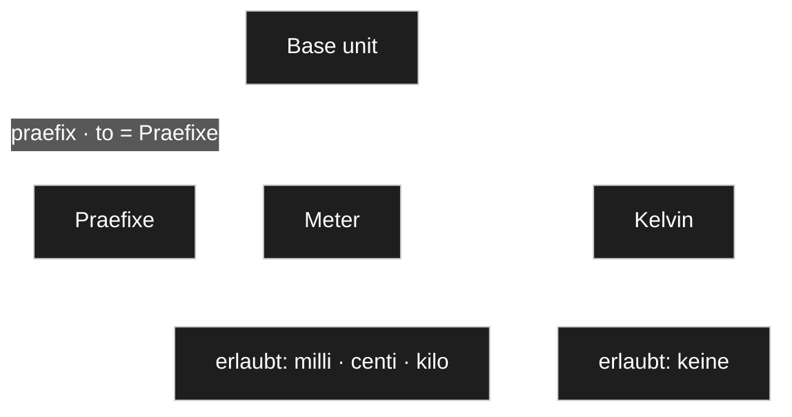

There is one `Base unit` with one `praefix` attribute pointing at the prefix branch. What each
unit permits is an **allow-list setting on that attribute**, inherited and overridable like every
other setting ([D-015](90-decision-log.md)).

- **Metre** permits milli, centi, kilo — and not giga, exactly as C49 asks.
- **Kelvin** permits **nothing**. The control disappears because the permitted set is empty, not
  because someone configured *hide*.

Why this beats both alternatives:

| | Problem |
|---|---|
| Two branches | *Takes a prefix* is a yes/no, but the real requirement is *which ones* (C49). Two branches answer the coarse question and leave the fine one unsolved. A unit that later gains prefixes has to move in the tree. |
| One branch, hidden | Uses a **display** setting to encode a **modelling** fact. The data model would still permit Kelvin a prefix; only the screen would hide it. |
| Allow-list | One mechanism answers both. *No prefix* is *the empty allow-list* — a special case that needs no special case. And it is generic and author-definable, which is what C49 demands. |

This is also the shape [OQ-042](91-open-questions.md) needs anyway: **an attribute names a branch
and may narrow it.** The prefix allow-list is the first instance of a general capability, not a
unit-specific feature.

## Owner statement — 2026-08-22, twelfth pass: type node or model node?

| # | Statement |
|---|---|
| **C54** | The recurring question is: when do I have a **model node** — a finished model the user enters data into — and when do I define a node **as a type**, simple or composed? |
| **C55** | **The two do not really differ. They are all nodes.** A single type can be used exactly like a model type. What differs is that the input becomes **nested and more complex**. |
| **C56** | **That is why the renderer concept exists** — to display nested data simply, and to let the user shape the output by choosing a renderer and refining it with the renderer's settings. |

### C55 — one construct, three roles


**This is [V5](00-vision-and-scope.md) in its strongest form.** *Type* and *model* are not two
kinds of node — they are the same construct in two **roles**, and the role is a matter of where a
node sits and how it is used, not of what it is. A composed type is a small model; a model is a
large type. Nothing in the engine needs to tell them apart.

Note this is a **different axis** from [D-026](90-decision-log.md). That decision separates the
**model layer** from the **data layer**; C55 says that *within* the model layer, type and model
are one thing. Both hold at once:

| | Layer | Role |
|---|---|---|
| `Integer`, `Base unit` | model | used as a type |
| `Parts list` | model | used as a model |
| a specific parts list | data | — |

**C56 states why the renderer concept had to exist at all**, and it is worth recording as the
reason rather than as a feature: if a model is just a deeply composed type, then entering and
showing one *is* the hard problem. [R1](30-renderer.md) — everything through a renderer — is the
answer to a consequence of C55, not a preference.

**Open:** if nothing structural separates the roles, how does the tool know where to offer *enter
data*? The standard tree answers by **placement** — `Definition` versus `Model` versus
`Implementation` are branches, not node kinds. Whether that is pure convention or wants a marker
is [OQ-048](91-open-questions.md).

## Owner statement — 2026-08-22, thirteenth pass: when is the content determined?

| # | Statement |
|---|---|
| **C57** | **Pure data-type nodes hold no data.** Nodes that are *used* hold data. (The owner deliberately avoids the word *model node* here.) |
| **C58** | There will also be **data types that are filled** — a choice list, an enumeration node. What is stored in them can then be used in other models. |
| **C59** | The difference: for those, the **contents are fixed at modelling time**. For the other kind, the contents are **decided at input time**. |
| **C60** | A permitted-prefix restriction was set up by **activating and deactivating the inheriting sub-nodes at the attribute**, and that worked well in practice. |

### C57–C59 — a better axis than "type or model"

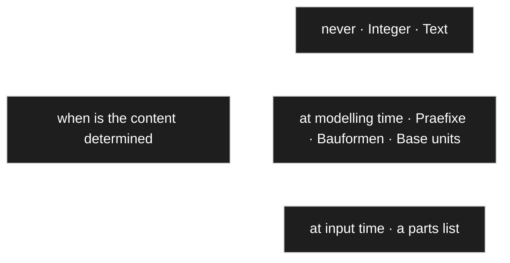

This sharpens [C55](#c55--one-construct-three-roles). *Type versus model* was the wrong axis
because it has no crisp test. **When the content is determined** has one, and it produces three
positions instead of two — with the middle one being exactly the branches the standard tree
calls `Konstanten`.

The middle case is worth naming because it is easy to lose: `Prefixes`, `Bauformen`,
`Base units` are **data authored in the modeller**. They are not types in the sense that
`Integer` is, and they are not user input either. [D-041](90-decision-log.md) already covers how
they are used — an attribute names their branch and an instance picks from it.

**This also half-answers [OQ-048](91-open-questions.md):** content determined at modelling time is
edited in the modeller; content determined at input time is edited in the data view. The question
of how the tool *knows which is which* remains.

### C60 — we are on the same line, with one refinement

The owner's mechanism — tick the sub-nodes of the branch on or off at the attribute — and the
allow-list proposed here are **the same thing described from two sides**. The interface is a list
of checkboxes either way, and that is the part that already worked.

One thing does need deciding, because it changes behaviour later:

| | Stored | When a new prefix is added to the branch |
|---|---|---|
| **Deactivations** (opt-out) | what is excluded | it becomes available everywhere automatically |
| **Activations** (allow-list) | what is permitted | it stays unavailable until permitted |

Opt-out matches [D-015](90-decision-log.md) — a change to the base reaches every use site that did
not override. But it makes *no prefix at all* awkward: Kelvin would have to exclude every prefix
individually, and would silently gain each new one.

**Recommendation: store a mode plus a list** — *all except {…}* or *only {…}*. The default mode is
*all except {}*, so a fresh attribute permits everything; Kelvin sets *only {}*. Two words of
schema, and the checkbox list stays exactly as it was.

The one thing that must not change: this is a **setting**, inheritable and overridable per use
site, never a coded type. That was the owner's requirement after the previous attempt kept
breaking on new cases.

## Owner statement — 2026-08-22, fourteenth pass: do not ask what cannot matter

| # | Statement |
|---|---|
| **C61** | Whether permitted sub-nodes are handled by activating or by deactivating should be **the user's choice**, made when a new sub-node is created. |
| **C62** | **But if the type is not used anywhere yet, the question is pointless and would only get in the way.** It should be suppressed. |
| **C63** | **The same principle applies to model versioning.** With no data present, a new version causes no break, whatever it changes. |
| **C64** | Test data are a possible exception, and the lean is: **do not take them into account**, but **warn** that they may need adjusting. |
| **C65** | How test data come about is open — a checkbox *is test data* / *is default value* would do it. |
| **C66** | Storage of a unit value is undecided. Either always store the base unit and keep the prefix for output, or bind value and prefix one to one — in which case changing the prefix to kilo must change an already entered value. **What matters is that data go in correctly and come back out correctly.** |

### C62/C63 — a principle worth naming

```mermaid
---
config:
  theme: dark
  themeVariables:
    mainBkg: "#1e1e1e"
    background: "#1e1e1e"
    primaryColor: "#1e1e1e"
    classText: "#ffffff"
    textColor: "#ffffff"
    lineColor: "#ffffff"
---
flowchart LR
    A[a question about consequences] --> Q{are there any consequences yet}
    Q -->|no| S[do not ask]
    Q -->|yes| B[ask, per D-032]
```

**Do not ask what cannot matter.** If nothing uses a type, nothing can break, so there is nothing
to decide. If no data exist, a model change cannot be breaking. Both are **checkable** — *is this
used anywhere*, *does data exist* are queries the system can answer for itself.

This extends [D-032](90-decision-log.md) rather than competing with it. The two-fold principle
says *a configured default plus the choice in the moment*; this adds a step in front: **and no
question at all when the answer changes nothing.** It is also what keeps a dialog-heavy design
from becoming exhausting — the dialogs appear exactly where something is at stake.

C64 is the same rule with one exception carved out: test data are consequences, but cheap ones.
**Warn, do not block** — and say which test data are affected.

### C66 — proposal: store canonical, display with the prefix

The owner asked for a proposal and said the choice does not matter as long as data go in and come
out correctly. It does matter, in one specific way — **aggregation**.

```mermaid
---
config:
  theme: dark
  themeVariables:
    mainBkg: "#1e1e1e"
    background: "#1e1e1e"
    primaryColor: "#1e1e1e"
    classText: "#ffffff"
    textColor: "#ffffff"
    lineColor: "#ffffff"
---
flowchart LR
    I["input: 1 kg"] --> C1[converter in]
    C1 --> S["stored: wert = 1000 · einheit → Gramm · praefix → kilo"]
    S --> C2[converter out]
    C2 --> O["output: 1 kg"]
```

**Recommendation: store the value in the base unit; store the chosen prefix beside it as the
display form.**

| | |
|---|---|
| **Why** | [D-045](90-decision-log.md) sums across a collection. Adding `5 kg` and `300 g` is only possible on a common scale — with values stored as entered, every aggregate has to convert first, and a missed conversion is a silently wrong total. |
| **The owner's worry disappears** | *Change the prefix to kilo and the entered value must change* — with canonical storage only the **display** changes. `1000 g` shown as kilo is `1 kg`. Nothing is migrated, nothing is at risk. |
| **When conversion happens** | At the renderer boundary, both ways — which is exactly what the **converter** of [V8](00-vision-and-scope.md) is for, and what [D-043](90-decision-log.md) already called a converter rather than a calculation. |
| **Precision** | Store a decimal or scaled integer, never a float. Repeated conversion of a binary float drifts, and a total that is off by a cent is worse than no total. |

**One exception, and it follows from [C48](#owner-statement--2026-08-22-eleventh-pass-units-prefixes-and-what-a-type-names):**
a **prefix normalises, a unit does not.** `1 kg` and `1000 g` are the same quantity; `10 EUR` and
`11 USD` are not — the rate is a time series, so a currency amount stays in the currency it was
entered in. Which is why C48 said a currency changes its *unit* while a length changes its
*prefix*.

### C65 — where test data come from

Three sources, in fallback order, so the preview always has something and the author invests only
as much as they want:

1. **A record flagged as test data** ([D-028](90-decision-log.md)) — entered in the ordinary data
   editor with a checkbox, which is [D-029](90-decision-log.md) working.
2. **Otherwise the defaults** of the attributes ([D-030](90-decision-log.md)) assembled into a
   sample.
3. **Otherwise generated from the settings** — type, `min`, `max`, `step` already describe what a
   valid value looks like.

Answering the owner's *how do I even get to test data*: by entering a record and ticking a box.
Nothing new to learn, and step 3 means a brand-new type previews immediately without anyone
entering anything.

## Owner statement — 2026-08-22, fifteenth pass: precision and money

| # | Statement |
|---|---|
| **C67** | Numbers are **whole numbers or decimals**. The underlying data type does not matter — if floating point is unsuitable, it is left out. |
| **C68** | **Money is the special case again.** Full precision is stored, including places that are never shown. |
| **C69** | Below the visible cent, **rounding rules** take over. An amount smaller than one cent must still show that *something* is owed — not zero, but a minimum of one cent. |
| **C70** | Hence: **calculate and store at full precision, display in a form a person can read.** |

### C67–C70 — one rule with two axes

```mermaid
---
config:
  theme: dark
  themeVariables:
    mainBkg: "#1e1e1e"
    background: "#1e1e1e"
    primaryColor: "#1e1e1e"
    classText: "#ffffff"
    textColor: "#ffffff"
    lineColor: "#ffffff"
---
flowchart LR
    S["stored: 0.0034 EUR"] --> C[converter out]
    C --> D["displayed: 0.01 EUR"]
    S --> K[calculation]
    K --> S2["stored: full precision"]
```

C70 is [D-051](90-decision-log.md) again along a second axis. That decision said *store canonical,
display with the prefix*; this says *store at full precision, display rounded*. Same shape: **the
stored form serves correctness, the shown form serves the reader**, and the converter sits between
them.

It also has the same consequence: aggregation runs on the stored values. Summing displayed,
already-rounded amounts accumulates the rounding error — a hundred lines rounded up individually
can miss the true total by a euro.

**C69 is a genuine constraint, not a detail.** A rounding rule that turns `0.003 €` into `0.00 €`
does not merely lose precision — it reads as *free*, which is a different statement. Rounding to
the nearest is wrong here; a nonzero amount must not display as zero.

### C71–C73 — the rate, and when it has to be frozen

| # | Statement (owner, 2026-08-22) |
|---|---|
| **C71** | Euro normalisation was **not** meant. An amount may perfectly well be stored in dollars. |
| **C72** | There is an **exchange rate**, and sometimes it has to be **frozen**. Ordering for ten dollars, which is eight euros fifty that day, means that price has to stay put. |
| **C73** | So either convert to euro **on that day** and keep the result, or **store the rate** of that day alongside. |

```mermaid
---
config:
  theme: dark
  themeVariables:
    mainBkg: "#1e1e1e"
    background: "#1e1e1e"
    primaryColor: "#1e1e1e"
    classText: "#ffffff"
    textColor: "#ffffff"
    lineColor: "#ffffff"
---
classDiagram
    class Betrag {
        +wert
        +waehrung
        +kurs
    }
    note for Betrag "kurs only present\nwhere it was frozen"
```

**Recommendation: store the amount in its own currency, plus the rate that was frozen. Derive the
converted figure.**

Of the owner's two options, the second. Storing only the converted result loses what was actually
agreed — *ten dollars* becomes unrecoverable, and *what did we order for* stops being answerable.
Storing both amounts would record one fact twice, which the code standard forbids, since
`converted = amount × rate`.

Ten dollars at a frozen rate of `0.85` yields eight euros fifty whenever it is asked, next week
and next year. **The frozen rate is the thing that makes the price stay put**, and it is smaller
and more honest than a second amount.

**The exception, stated so it is not discovered later:** where a converted figure is *legally*
fixed — a posted invoice, a booking — the booked amount may have to be stored as well, because it
must not shift if a rounding rule is ever corrected. That is a genuine exception to *never store a
fact twice*, justified by law rather than by convenience, and it needs saying out loud when the
case arrives rather than being smuggled in.

### Freezing here is right, and freezing a label was not

Two things that both looked like *freeze or track* get opposite answers, and the reason is worth
keeping:

| | | |
|---|---|---|
| **A label** | a **name** for a thing | names **track** — [D-053](90-decision-log.md) |
| **A rate** | a **term of an agreement** | terms **freeze** |

Renaming a unit does not change what was agreed; the rate on the day *is* part of what was agreed.
So the rule is not *always track* or *always freeze* but: **track what describes, freeze what was
agreed.**

**Where the freezing is switched on** follows [D-032](90-decision-log.md): the *model* says whether
this amount freezes its rate — a setting on the attribute — and the *record* carries the rate that
was frozen.

### C74–C77 — the rate needs a direction, and that is where the confusion came from

| # | Statement (owner, 2026-08-22) |
|---|---|
| **C74** | The freezing could be an **additional attribute**, so it hangs on the record: a price of ten dollars plus a hidden field *conversion rate dollar to euro*. |
| **C75** | ⚠️ *"But then which currency do I hold? Do I always convert dollars and store dollars plus the day rate to euro — or, being in euro anyway, need no conversion? There is still an inconsistency in my head."* |
| **C76** | The day rate would have to be fetched from the internet — and that is where the **rate table** comes in: ask once per day, for the currencies already known, and it is then fixed in the table under that date. |
| **C77** | Whether intraday fluctuations need to be captured is an open question the owner has no basis to judge. |

**The inconsistency has one cause: a rate is between *two* currencies, and only one of them has
been named.** `0.85` means nothing on its own. Once the second currency is fixed, the confusion
goes away.

```mermaid
---
config:
  theme: dark
  themeVariables:
    mainBkg: "#1e1e1e"
    background: "#1e1e1e"
    primaryColor: "#1e1e1e"
    classText: "#ffffff"
    textColor: "#ffffff"
    lineColor: "#ffffff"
---
flowchart LR
    A["10 USD · agreed"] -->|rate 0.85 · frozen| B["8.50 EUR · derived"]
    R["reference currency: EUR"] -.- B
```

**Recommendation: the model declares one reference currency. A frozen rate always points at it.**

| | |
|---|---|
| **What is held** | the currency that was **agreed**. Ten dollars stays ten dollars. |
| **What the rate means** | *this amount's currency → the reference currency*, at the moment it was frozen. One direction, never ambiguous. |
| **When the amount is already in the reference currency** | the rate is 1 and nothing is stored. Which answers C75 directly: **no conversion, no rate, no special case.** |

The reference currency is a setting — per model, or per installation
([OQ-039](91-open-questions.md) is the same question about where installation-wide settings live).

### C74 — yes, but not as a hand-made hidden field

The instinct is right: it belongs on the record. But it should not be a hidden field the modeller
has to remember to add. **It belongs to the money type itself**, appearing when freezing is
switched on for that attribute.

Otherwise every author must remember it, and forgetting it loses the rate **silently** — the
amount still looks fine, and only later does anyone notice that eight euros fifty cannot be
reproduced. Structure, not convention.

### C76 — fetch at the boundary, read from the table

The owner's own sketch is the right architecture, and it fits `CD-1` exactly:

```mermaid
---
config:
  theme: dark
  themeVariables:
    mainBkg: "#1e1e1e"
    background: "#1e1e1e"
    primaryColor: "#1e1e1e"
    classText: "#ffffff"
    textColor: "#ffffff"
    lineColor: "#ffffff"
---
flowchart LR
    N[a rate service] -->|once a day, at the boundary| T[rate table in the model]
    T --> C[core reads the table]
```

The core never calls out. A fetch is a boundary job that fills the table; everything inside reads
ordinary nodes. If the service is unreachable the table simply has yesterday's rate, and nothing
breaks — which is the whole reason for putting a table in between rather than calling out at the
moment of use.

### C77 — intraday rates are not needed

The owner asked for a judgement here rather than a guess, so: **a daily rate is the normal unit,
and for this product it is generous.**

- **Foreign exchange markets do move continuously**, and on a volatile day a rate can shift by
  more than a percent between morning and evening. So the fluctuation is real.
- **Almost nobody accounts on it.** The European Central Bank publishes euro reference rates
  **once per working day**, around 16:00 CET, and that is what most European bookkeeping is done
  against.
- **German VAT practice is coarser still:** the Federal Ministry of Finance publishes **monthly
  average** conversion rates for turnover tax, and those are what a tax office expects to see.

So the granularity that matters for ordering, pricing a parts list or issuing an invoice is
**daily at finest, monthly in practice**. Intraday would add precision nobody asks for and a great
deal of data.

**And the freezing is what actually protects the number, not the granularity.** Once
[D-064](90-decision-log.md) has stored the rate on the record, the price is stable no matter how
coarse the source was.

Two details the table will need either way: **weekends and holidays have no published rate**, so a
rule is required — *use the last published one* is the usual answer — and rates are quoted to
**four to six decimal places**, which the precision rule of [D-057](90-decision-log.md) already
covers.

### C78–C80 — money is a type with behaviour, and the currencies are model data

| # | Statement (owner, 2026-08-22) |
|---|---|
| **C78** | This implies a **type of its own for money — a currency value** — with additional functionality. |
| **C79** | **Which currencies exist is held in the model.** |
| **C80** | And things like **conversion into cents or other smallest units** belong to it. |

**C78 does not mean a subclass.** [D-036](90-decision-log.md) settled that: one node class, and
type-specific behaviour lives in **registered strategies** looked up by the type. So a currency
value is an ordinary composed node — value, currency, and a frozen rate where freezing is on —
whose *behaviour* is a registered converter and validator. Worth restating, because *this type
needs its own functions* is exactly the step that leads back to subclassing.

C79 fits [D-048](90-decision-log.md) without adjustment: currencies are **content determined at
modelling time**, like prefixes and base units — nodes in the model, not an enum in code.

### C80 — the minor unit, and what it does *not* decide

Each currency declares how many decimal places its smallest unit has. This is not uniform, which
is the reason it has to be data rather than a constant:

| | minor unit |
|---|---|
| Euro, US dollar | 2 |
| Japanese yen | 0 |
| Kuwaiti dinar | 3 |

**The minor unit governs display and rounding — not storage.** Storing amounts as whole minor
units (cents) is the common trick and it is not enough here, because
[C69](#c67c70--one-rule-with-two-axes) requires sub-cent amounts to survive: `0.003 €` has to stay
`0.003 €` internally and appear as at least one cent.

So: **store with more decimal places than the minor unit; round to the minor unit only for
display**, exactly as [D-057](90-decision-log.md) already says along the precision axis. The
currency node supplies the number of places to round to.

### ⚠️ One reading I did not adopt

The statement contains the phrase *always stored in euro with all decimal places, or something
like that*. Read strictly, that would mean **normalising every currency to euro**, and
[D-051](90-decision-log.md) deliberately does the opposite: a prefix normalises, a unit does not.

The reason is that normalising a currency requires an exchange rate **at the moment of storage**,
which silently freezes a rate into the data. Two records entered a week apart would then no longer
be comparable, and the original amount could not be recovered.

**Recorded as: store in the currency that was entered, at full precision.** If euro normalisation
was actually meant, this needs reversing — and then the rate used has to be stored beside the
amount, or the number becomes meaningless. → [OQ-054](91-open-questions.md).

## `Identity` — proposal closing [OQ-001](91-open-questions.md)

> ⚠️ **Proposal, 2026-08-22.** Three of the four points were already settled by earlier decisions;
> the fourth is a call of mine and is marked.

```mermaid
---
config:
  theme: dark
  themeVariables:
    mainBkg: "#1e1e1e"
    background: "#1e1e1e"
    primaryColor: "#1e1e1e"
    classText: "#ffffff"
    textColor: "#ffffff"
    lineColor: "#ffffff"
---
classDiagram
    class Identity {
        <<abstract>>
        +id
        +version
    }
    class Node {
        +name
    }
    class Relation {
        +from
        +to
        +kind
        +name
    }
    Node --|> Identity
    Relation --|> Identity
```

| | Decision | Why |
|---|---|---|
| **name** | **`Identity`** | `WPClassHead` puts WordPress into the name of the most central domain class, and `CD-1` forbids the core knowing WordPress exists. A name that lies goes first. |
| **`type`** | **not on the base** | A node's type **is its inheritance branch** ([D-041](90-decision-log.md)). There is nothing left for a `type` column to hold. A relation has a `kind`, which is its own field. |
| **`version`** | **stays — as a row change counter** | [D-060](90-decision-log.md) moved the *model* version to the record, so the two numbers are now demonstrably different things. What remains here is *this object changed*, which serves optimistic locking and cache invalidation ([D-016](90-decision-log.md)). |
| **`creation_date`** | ⚠️ **off the base, derived from the changelog** | [D-061](90-decision-log.md) makes the changelog load-bearing, so creation is always logged and the timestamp is already there. Storing it again records one fact twice. **My call** — if the join proves to hurt when listing trees, it becomes a materialised column like a computed value ([D-072](90-decision-log.md)), which is a cache and not a second truth. |

### What the base class is *for* — owner, 2026-08-22

| # | Statement |
|---|---|
| **C85** | The purpose was twofold: **realise the shared ids**, and **pin down the versions** so that changes are **logged** — including **which employee** they came from. ✏️ *Corrected: the first transcription read "locked"; the owner meant **logged**. Locking turned out to be a real question anyway, and is [OQ-060](91-open-questions.md).* |
| **C86** | A parent class is **not strictly necessary** for that — but it is simpler if it carries all the attributes that relations and nodes have in common. |

That settles what belongs on it: **whatever serves those two purposes, and nothing else.**

| Purpose | Served by |
|---|---|
| shared ids | `id`, drawn from one space ([C11](#owner-statement--2026-08-22-third-pass)) |
| locking | `version` |
| **which employee** | the **changelog**, not the base class |

Attribution sits in the changelog because *who changed it* is a property of **the change**, not of
the object. Putting a *last changed by* on the base would record what the log already holds, and
it would answer only the last change rather than the history the owner is asking for.

### What `version` has to cover

If someone edits only a **setting** of a node, has the node changed? For locking, **yes** —
otherwise two people editing two different settings of the same node both succeed and neither sees
the other.

So: **`version` is bumped by any write to the identity or to the rows it owns** — its settings, its
labels. Deliberately coarse. The cost is an occasional false conflict when two people touch
different settings of the same node at the same moment; the benefit is that no change is ever
silently lost. In a modelling tool that trade goes the right way.

### Optimistic or pessimistic? — [OQ-060](91-open-questions.md)

`version` supports **optimistic** locking: read it, and refuse the save if it moved in the
meantime. That is what is proposed, because it has no lock lifetime to manage and no stale locks
left behind by someone who closed their laptop.

**Pessimistic** locking — claiming a node while editing it — is a different thing and can be added
later as `locked_by` / `locked_at` without disturbing the model. Worth knowing which the owner
meant by *changes are locked*.

### And this closes [OQ-008](91-open-questions.md) too

The seed drew `1..*` — no object without at least one changelog item — and the question was
whether that was intended. **It was, and now there is a reason:** if the changelog is the
migration script ([D-061](90-decision-log.md)) and `creation_date` is derived from it, then
creation must always be logged. `1..*` is correct.

**`undo()`**, also from the seed, is a different matter. The changelog *enables* it; nothing so
far *requires* it. Recorded as deliberately deferred rather than designed — see
[OQ-057](91-open-questions.md).

### [OQ-017](91-open-questions.md) — which attributes every node has

Four, and the shortness is a good sign:

| | |
|---|---|
| `id` | from the identity space |
| `version` | row change counter |
| `name` | required, locale-neutral, **not unique** ([D-022](90-decision-log.md)) |
| `path` | materialised ancestor path — **derived**, rebuildable, for [D-014](90-decision-log.md)'s indexed walk |

Everything else that looked like a candidate turned out to belong elsewhere: **`type`** is the
inheritance branch, **`order`** belongs to the *edge* because ordering is per parent, and
**`hide`, `read_only`, renderer and converter choices** are system-scope settings.

## Owner statement — 2026-08-22, sixteenth pass: an override owner may be a node

| # | Statement |
|---|---|
| **C81** | There is **no separate type-definition view**, because a type is a node like any other. |
| **C82** | **Overrides sit on the node anyway** — practically the same as at an attribute. |
| **C83** | And a **child node may hide inherited attributes or override their properties**. |

### C82/C83 — one override shape, two possible owners

```mermaid
---
config:
  theme: dark
  themeVariables:
    mainBkg: "#1e1e1e"
    background: "#1e1e1e"
    primaryColor: "#1e1e1e"
    classText: "#ffffff"
    textColor: "#ffffff"
    lineColor: "#ffffff"
---
flowchart TD
    B["Part · #10 lieferant · 0..1"] --> P["Passiv<br/>[#10].multiplicity = 1<br/>[#10].hide = true"]
    B --> U["a use site · edge #77<br/>[#10].step = 5"]
```

This answers [OQ-058](91-open-questions.md), and with the wider reading C83 gives it: **an
override is the same thing wherever it sits. Only its owner differs.**

| Owner | Means |
|---|---|
| a **node** | *for this subtype*, the inherited attribute is narrowed, hidden or reconfigured |
| an **edge** | *for this one use*, the attribute is narrowed, hidden or reconfigured |

Both address the target the same way — a path of edge ids ([D-045](90-decision-log.md)) — and both
are read by the same walk, which already passes through ancestors and then the use site
([D-079](90-decision-log.md)). Nothing new is needed, and [C9](#c7c10--settings-hang-on-edges-too)
stays intact: **the inheritance edge still carries nothing.** The override hangs on the *node*, and
names the inherited edge by id.

C81 is [D-042](90-decision-log.md) stated once more from the other side: there is no type-definition
screen because there is nothing separate to define. Configuring a type is configuring a node.

### C84 — and both directions are allowed

| # | Statement (owner, 2026-08-22) |
|---|---|
| **C84** | `1` and `0..1` **apply only to edges, that is to attributes**. Overriding `1` with `0..1` makes it optional for that node; overriding `0..1` with `1` tightens it, and it must then be given. **Both should be possible.** |

I had worried that widening breaks the guarantee a subtype just made. **The owner's first sentence
dissolves that worry**, and it does so more thoroughly than the permission does.

**Multiplicity is a statement about a use, not about a thing.** There is no *Passiv guarantees a
supplier* — there is only *this edge, in this context, requires one*. A component in a catalogue
may need a supplier while the same component in a draft parts list does not, and both are true
statements about different uses.

That generalises, and it is the actual reason no direction has to be forbidden:

> **Every constraint is evaluated where it resolves. There is no global guarantee to break.**

`min`, `max`, an allow-list — each is read at the point of use, by the validator running there.
Nothing anywhere else assumed the tighter value, so nothing anywhere else can be invalidated by
loosening it.

**And this removes a concept I was about to add.** A moment earlier I proposed marking each key as
*constraint-like* or *presentation-like*, so that constraints could only be narrowed. That
distinction is now unnecessary — one fewer property in every key definition, and one fewer thing
to get wrong.

### The modelling rule that follows

If something must be true of a thing **always and everywhere**, an attribute constraint is the
wrong place for it, because any use site may loosen it. It belongs in the **type hierarchy**:

- *A passive component must name a supplier, no exceptions* → not `multiplicity = 1` on an
  attribute, but a subtype that has the supplier as part of what it is.
- *A passive component in the catalogue must name a supplier* → exactly `multiplicity = 1`, at
  that use site.

Worth writing down, because this is the question someone will actually be standing in front of.

## Owner statement — 2026-08-22, seventeenth pass: unique attributes

| # | Statement |
|---|---|
| **C87** | An attribute such as an **article number** may carry a **`unique`** setting: it must be unique. If someone then enters another record with an article number that already exists, **an error follows**. |

This closes the remainder of [OQ-063](91-open-questions.md): there are **two** mechanisms, and they
are deliberately different in strength.

| | Setting | Effect |
|---|---|---|
| **identifying** | which fields the duplicate search matches ([D-112](90-decision-log.md)) | **warns** — shows what already exists |
| **unique** | this value may occur once | **refuses** — the record cannot be saved |

### Uniqueness comes out of inheritance for free

An attribute is an edge ([D-031](90-decision-log.md)), and a subtype **inherits** that edge rather
than getting its own. So `Passiv` and `Halbleiter` both use `Part`'s `artikelnummer` — edge
`#10` — and a uniqueness check on `(edge_id, value)` covers **every record of every subtype at
once**.

That is exactly the semantics one would want and nobody had to design it: *unique among all
Parts, including the specialised ones.*

### Enforced in two layers, like everything else

```mermaid
---
config:
  theme: dark
  themeVariables:
    mainBkg: "#1e1e1e"
    background: "#1e1e1e"
    primaryColor: "#1e1e1e"
    classText: "#ffffff"
    textColor: "#ffffff"
    lineColor: "#ffffff"
---
flowchart LR
    V["validator · the user meets this"] --> D["a real unique index · the last line"]
```

Same shape as [D-074](90-decision-log.md): the **validator** is what a person encounters, with a
message and an offered correction; the **index** is the last line that catches what concurrency
slips past. A user should never meet a database error.

The index cannot sit on `record_values` directly — it would have to apply to every attribute, not
just the unique ones, and a filtered index is not available. So it lives in the **derived search
structure** of [OQ-064](91-open-questions.md), which is being built anyway: one row per unique
attribute value, with a real unique constraint. Derived, rebuildable, never a second truth.

**Empty does not participate.** A record with no article number does not collide with another that
also has none.

### The best response to a violation is not an error

[V9](00-vision-and-scope.md) says a validator may **offer a correction**, and here the correction is
the whole point:

> *This article number belongs to «Widerstand 10k 0805». Did you mean to use that one?*
> — with the action to select it instead of creating.

**A uniqueness violation is the duplicate detection succeeding.** The user was about to create
something that exists; the useful reply is the record they actually wanted, not a refusal. Refusing
is the fallback for when they insist the number is right — and then the real problem is elsewhere.

## Owner statement — 2026-08-22, eighteenth pass: a primary-key flag?

| # | Statement |
|---|---|
| **C88** | Could an attribute carry a flag *is primary key*, so that duplicates are checked against it? |

**The intent is right and it is already what `unique` does — but the name should not be used.**

### Why not *primary key*

```mermaid
---
config:
  theme: dark
  themeVariables:
    mainBkg: "#1e1e1e"
    background: "#1e1e1e"
    primaryColor: "#1e1e1e"
    classText: "#ffffff"
    textColor: "#ffffff"
    lineColor: "#ffffff"
---
flowchart LR
    I["id · the primary key"] --- H["hard identity · never resolved on"]
    A["artikelnummer · unique"] --- S["soft identity · may change"]
```

**The primary key is the `id`** ([D-055](90-decision-log.md)). Calling an article number a primary
key re-opens exactly the distinction that took effort to establish: an article number is
*human-meaningful*, it can be corrected, and a record survives changing it. An `id` cannot and does
not. Two different things need two different words, and the glossary exists for precisely this.

`unique` also says what it does, and there may be **several** of them — an article number and an
EAN, each unique on its own — where *primary key* implies one.

### What the idea does add: unique **groups**

The part of C88 worth taking is that a key is often **composite**. *Manufacturer* alone is not
unique and *type designation* alone is not, but together they are.

**Proposal: `unique` optionally names a group.** Attributes sharing a group name form one composite
constraint; an attribute with `unique` and no group is unique by itself.

| attribute | `unique` |
|---|---|
| `artikelnummer` | *(on its own)* |
| `ean` | *(on its own)* |
| `hersteller` | `typkennung` |
| `typbezeichnung` | `typkennung` |

Three independent constraints, one of them over two attributes. That is everything a primary key
would have given, without borrowing a word that already means something else here.

### And the duplicate check follows from it

A unique attribute is, by construction, the strongest possible duplicate check — which is what C88
was reaching for. Nothing extra is needed: the search matches the shown fields
([D-112](90-decision-log.md)), and where one of them is unique the warning becomes a refusal with
an offered correction ([D-114](90-decision-log.md)).

## Owner statement — 2026-08-22, nineteenth pass: why the enum type was dropped

| # | Statement |
|---|---|
| **C89** | The previous project had an **enum type**, introduced early because fixed values seemed to be needed. |
| **C90** | It turned out that **fixed values sometimes carry further properties** — not just the one value an enum member has, but several. So the enum type was **dropped and modelled as nodes** instead. |
| **C91** | ⚠️ The same for a *set* or *table* type: **it is only a node with several attributes, practically a row** — and *that it is one* is expressed through the **render mechanism**, by rendering it differently. |

### C90 is the argument, and it is better than the criterion

[OQ-041](91-open-questions.md) can be answered from the rule alone — the engine multiplies by a
prefix's factor and never branches on *which* prefix, so a prefix is data. **The owner's history
says the same thing from experience:** an enum member starts as one value and grows properties, and
at that moment the enum type has to be abandoned mid-project.

> **A fixed value that might one day carry properties is a node.**

Which is every fixed value, given enough time. A prefix already proves it: it looked like a name
and turned out to need a **multiplier** ([C46](#owner-statement--2026-08-22-eleventh-pass-units-prefixes-and-what-a-type-names)).

### C91 — and this sorts out the old *Complex Datatypes* branch

```mermaid
---
config:
  theme: dark
  themeVariables:
    mainBkg: "#1e1e1e"
    background: "#1e1e1e"
    primaryColor: "#1e1e1e"
    classText: "#ffffff"
    textColor: "#ffffff"
    lineColor: "#ffffff"
---
flowchart TD
    C["old: Complex Datatypes"] --> S["Unit type · Preis<br/>real composed nodes"]
    C --> R["set · table<br/>renderers, not types"]
```

The branch held two different things under one heading
([harvest 01](_harvest/01-standard-tree.md)):

| | What it really is |
|---|---|
| `Unit type`, `quantity › Preis` | **genuine composed types** — a node with attributes ([C44](#c44--the-correction-is-the-load-bearing-part)) |
| `set`, `table` | **presentation of a multi-valued edge** — container renderers ([D-097](90-decision-log.md)) |
| the dropped `enum` | **an attribute whose branch is one level deep**, drawn as a list ([D-109](90-decision-log.md)) |

So two of the three dissolve into things already decided, and neither needed to be a type. That is
C91 stated generally: **what a structure *looks like* is a renderer; what it *is* is a node with
attributes.**

⚠️ *The transcription of C91 named the second type indistinctly; read as `set` or `table`, both of
which fit "a node with several attributes, practically a row". Correct if a third thing was meant.*

**Since then both have been retired outright** — see
[C119](#c119--set-and-table-are-retired-as-constructs) ([D-246](90-decision-log.md)).

## Owner statement — 2026-08-22, twentieth pass: the scaffold and its bindings

| # | Statement |
|---|---|
| **C92** | A **base scaffold tree must be installed** — the simple data types and so on have to be there. |
| **C93** | Base units are sensible too, a few currencies, and the **general settings**. **Everything else the user defines.** |
| **C94** | On insert the **node ids may shift** — one can of course supply them, but they need not stay the same. |
| **C95** | In the **admin configuration** every special node was additionally defined as a **constant**, with the corresponding node assigned to it. |
| **C96** | One could also set the renderer or the defaults there — **but that is not actually needed**, since the node itself already carries its default settings. |

### C95 — a binding, and it answers C94 by itself

```mermaid
---
config:
  theme: dark
  themeVariables:
    mainBkg: "#1e1e1e"
    background: "#1e1e1e"
    primaryColor: "#1e1e1e"
    classText: "#ffffff"
    textColor: "#ffffff"
    lineColor: "#ffffff"
---
flowchart LR
    E["engine / configuration"] -->|asks for a slot| B["binding<br/>datatype.integer"]
    B -->|points at| N["node #12"]
```

**A binding is a named slot in the installation configuration that points at a node.** The engine
and the configuration ask for the slot; nothing anywhere names an id or a node name.

**And that is why C94 costs nothing.** Ids may shift on insert, be renumbered, differ between two
installations — **the binding absorbs it**, because it is set to whatever the node got when it
arrived. Nothing else in the system holds an id it did not read from a binding.

It also settles two things that were open with a proposal rather than a mechanism:

| | Was proposed as | Is really |
|---|---|---|
| the declared data-type root ([D-099](90-decision-log.md), [OQ-048](91-open-questions.md)) | *an installation setting naming the branch* | **a binding** |
| installation-wide settings ([D-079](90-decision-log.md)) | a reserved installation identity | still that — and bindings live there |

### C96 — a binding points, and does nothing else

The restraint is the valuable part. If a binding could also carry a renderer or defaults, there
would be **two places** configuring the same node, competing — exactly the duplication this concept
keeps refusing. The node carries its own defaults ([D-015](90-decision-log.md),
[D-098](90-decision-log.md)); the binding only says *which node*.

### Bindings and machine keys divide cleanly

Two anchoring mechanisms are now on the table, and each has its own job:

| | For | Example |
|---|---|---|
| **binding** | a **singular** well-known thing — one slot, one node | `datatype.integer`, `unit.root`, `currency.root` |
| **`unique` machine key** ([D-115](90-decision-log.md)) | a **member of a set**, where each needs matching | the ISO code on every currency |

One would not create a hundred and eighty bindings for currencies, and one would not give *the
integer type* an ISO code. The rule: **bindings for roots and singletons, machine keys for
members.**

### C92/C93 — what ships

Simple data types · base units · a few currencies · the general settings. **Everything beyond that
is authored** — which keeps the seed small and matches [V7](00-vision-and-scope.md).

## Owner statement — 2026-08-22, twenty-first pass: protecting the scaffold

| # | Statement |
|---|---|
| **C97** | In the previous project the corresponding nodes were marked as **template**, so that the user cannot delete them. |

**The need is real. A flag is the wrong instrument** — it protects too much and too little.

| | |
|---|---|
| **too much** | a shipped currency the author never uses cannot be deleted, for no reason anyone can state |
| **too little** | a node the author binds to a slot **themselves** is not protected, and that is the same hazard |

### What actually must not vanish

The hazard is not *being shipped*. It is **being pointed at**:

```mermaid
---
config:
  theme: dark
  themeVariables:
    mainBkg: "#1e1e1e"
    background: "#1e1e1e"
    primaryColor: "#1e1e1e"
    classText: "#ffffff"
    textColor: "#ffffff"
    lineColor: "#ffffff"
---
flowchart TD
    D{delete a node} --> B{is a binding on it}
    B -->|yes| R["refused — repoint the binding first"]
    B -->|no| C{does anything else reference it}
    C -->|yes| K["a conflict, resolved by the user"]
    C -->|no| G[deleted]
```

| What references it | On delete |
|---|---|
| a **binding** | **refused** until the binding is repointed or removed — the engine needs the slot filled, and *the integer type is missing* is not a state anyone can work in |
| an **attribute** (`to`) | a **conflict**, resolved with the moves of [D-062](90-decision-log.md) — remap, or delete |
| a **record value** | the same conflict, the same resolver |

**This is derived, not flagged.** It protects exactly what needs protecting, it protects nodes the
author bound themselves, and it lets the author delete a shipped currency they do not want — which
[D-119](90-decision-log.md) already promised them, since after import the content is theirs.

### And the marker still has a job, a different one

*This came from the seed* is worth knowing — but as **provenance**, for the update flow: which
items were shipped, so an update can offer only what is genuinely new rather than re-offering
everything.

That is not protection, and it may not even need a flag: matching on the `unique` machine key
([D-115](90-decision-log.md)) tells an update what is already present. Worth deciding when the
update flow is actually built rather than now. → [OQ-065](91-open-questions.md).

## Owner statement — 2026-08-22, twenty-second pass: framework types, developer flag, trash

| # | Statement |
|---|---|
| **C98** | An **inexperienced user can break more by deleting**. Fundamental things such as `Integer` must **not** be deletable — they are part of the **framework**, as good as written into the code. |
| **C99** | The previous project had a **developer flag**: with it set, one may delete and move anything. |
| **C100** | **Moving is unproblematic**, since everything acts by **id**. The id is unique within the tree, and whether a node sits under *data types* or somewhere else does not matter. |
| **C101** | **Deletion is two-stage:** deleted nodes and relations are first **marked deleted** and **parked** in a separate node under the root. Only from there can they be removed for good. |

### C98 — and [D-121](90-decision-log.md) was wrong

I argued that protection should be **derived** from references rather than marked, because derived
is more precise. **Precision was the wrong goal.**

| | |
|---|---|
| my rule said | *a binding points at this, so deletion is refused* |
| the user needs to hear | *this is a framework type* |

The first is a technicality that explains nothing to the person in front of it. And the argument
that a marker *protects too little* falls too: a marker and a reference check are not alternatives.

**So: both, and they answer different questions.**

| | Protects | Message |
|---|---|---|
| **framework marker** | the types the engine is built on | *this belongs to the framework* |
| **reference check** ([D-121](90-decision-log.md)) | anything else something points at | *this is still in use here* |

### C99 — the developer flag is the right escape

Protection by default, lifted deliberately. It is [D-032](90-decision-log.md) with friction added
on purpose: a normal author never meets the question, and someone who genuinely must restructure
the framework can — having said so first.

### C100 — true for references, with one caveat

Ids are stable and nothing resolves on position ([D-055](90-decision-log.md),
[D-120](90-decision-log.md)), so moving breaks no reference. **But moving between branches changes
the node's inheritance**, and therefore which attributes it has
([D-041](90-decision-log.md), [C43](#c43--flatter-for-the-author-not-for-the-machine)).

So moving is **referentially** free and **semantically** a model change — which means it goes
through the same check as any other: does existing data still fit ([D-037](90-decision-log.md))?
Usually yes; for a move that drops an inherited attribute, no. → [OQ-066](91-open-questions.md).

### C101 — soft delete, and it changes the earlier answer again

```mermaid
---
config:
  theme: dark
  themeVariables:
    mainBkg: "#1e1e1e"
    background: "#1e1e1e"
    primaryColor: "#1e1e1e"
    classText: "#ffffff"
    textColor: "#ffffff"
    lineColor: "#ffffff"
---
flowchart LR
    A[in the model] -->|delete| B[parked · marked deleted]
    B -->|restore| A
    B -->|purge| C[gone]
```

Two-stage deletion makes the whole deletion question **gentler**, because nothing is lost at the
first step:

- A reference to a parked node **does not dangle** — the node is still there.
- Conflicts ([D-062](90-decision-log.md)) can be resolved *after* parking, in peace, rather than in
  a dialog blocking the delete.
- The irreversible moment is the **purge**, and that is where the reference check belongs in full
  force.

**One subtlety worth naming now:** a parked node with a `unique` article number
([D-114](90-decision-log.md)) — does its number still block a new record? If it does, the author
cannot reuse a number they just deleted. If it does not, **restoring** it creates a collision.
→ [OQ-067](91-open-questions.md).

## Owner statement — 2026-08-22, twenty-third pass: deleting a referenced node

| # | Statement |
|---|---|
| **C102** | The **reference check must apply equally to nodes that are referenced** — nodes an edge points at. They **may not be deleted while the dependencies are unresolved**. |
| **C103** | If the author says *delete anyway*, there must be an **active confirmation** — not *yes / no / OK / cancel*, but the user **actively confirming**. The connections to other nodes are then deleted with it. |
| **C104** | Example: a node has an attribute of type `mein int`, itself a child of `int` and therefore deletable. Deleting `mein int` means **the attribute must be marked deleted too**. |
| **C105** | The connection is still there, but the **edge is marked deleted**. **How to show that well to the user is not yet clear.** |

### C104 is the same event we already handled, seen from the other end

```mermaid
---
config:
  theme: dark
  themeVariables:
    mainBkg: "#1e1e1e"
    background: "#1e1e1e"
    primaryColor: "#1e1e1e"
    classText: "#ffffff"
    textColor: "#ffffff"
    lineColor: "#ffffff"
---
flowchart LR
    A["delete «mein int»"] --> B["every edge with to = mein int<br/>is parked with it"]
    B --> C["each owning node loses an attribute"]
    C --> D["its records hold orphaned values"]
```

**For every referencing node, this is exactly *an attribute was deleted*** — which
[M17](70-migration.md) and [D-063](90-decision-log.md) already cover: warn at the moment of the
change, the existing records still hold that field, and the author decides delete or transfer.

So nothing new is needed for the *consequence*. What C103 adds is the **weight of the moment**.

### C103 — what an active confirmation has to do

A dialog whose safest answer is one click away will be clicked. So the confirmation must

1. **name the consequences concretely** — not *are you sure*, but *what exactly falls*:

   > Deleting **«mein int»** also removes
   > · attribute **«menge»** from **Position** — 1 243 records hold a value
   > · attribute **«anzahl»** from **Contact** — 12 records

2. **require an act that cannot be reflexive** — typing the node's name, rather than a button
   positioned where *cancel* usually is.

That is [V9](00-vision-and-scope.md)'s spirit again: the system knows what will happen, so it says
so, instead of asking a person to imagine it.

### The trash holds *deletion events*, not objects

This follows from C104 and matters more than it looks:

If parking cascades — the node **and** every edge that pointed at it — then **restoring must cascade
too**. Otherwise a restore brings back a node whose attributes stayed in the trash, and nobody can
reason about the result.

> **A trash entry is one deletion, with everything that fell with it. Restore puts back the whole
> event.**

### C105 — a proposal for the display

Three things want showing, and they are different:

| | Where | How |
|---|---|---|
| **the parked node** | the trash | listed as its own entry, with what fell with it |
| **the parked attribute**, in its owning node | **hidden by default** | a model full of ghost attributes is unreadable; a *show deleted* toggle reveals them, greyed, with *deleted with «mein int»* and a restore action |
| **the orphaned values** in records | the **conflict list** ([D-054](90-decision-log.md)) | this is where they must be findable, because this is where they get resolved |

The reasoning behind hiding by default: the modelling view answers *what does this node look like
now*. A deleted attribute is not part of that answer — but it must not become invisible either,
which is why it stays one toggle away and why the records surface separately.

## Owner statement — 2026-08-22, twenty-fourth pass: the `Compositions` branch

| # | Statement |
|---|---|
| **C106** | Pairing compositions with all the other models feels wrong. Better: **a `Compositions` branch**, and all compositions live under it. |
| **C107** | When a composition with a higher multiplicity is created, the tool should **make an entry there automatically**. |
| **C108** | If a composition later becomes an **aggregation**, the node can simply be **moved** from the compositions branch into the normal model branch. |
| **C109** | The reverse — aggregation to composition — is **only possible if the aggregation is used by one model**. |

### C106 catches an error in [D-017](90-decision-log.md)

I had written that a composed-only node *lives beneath its whole*. **The tree is inheritance and
nothing else** ([V3](00-vision-and-scope.md)), so hanging `Position` under `Parts list` means
`Position` **inherits** the parts list — it would acquire `bezeichnung` and `bauart`. I had mixed
*organisational placement* with *inheritance parent*, and in this model those are the same thing.

A `Compositions` branch is an **organisational container** carrying no attributes, like
`Konstanten` or `Definition`, so nothing meaningful is inherited.

**And locality is not lost — it was never a tree question.** The model view shows the composed
structure inline at its owner by following the edge. Presentation, not structure.

### C108/C109 — the asymmetry

```mermaid
---
config:
  theme: dark
  themeVariables:
    mainBkg: "#1e1e1e"
    background: "#1e1e1e"
    primaryColor: "#1e1e1e"
    classText: "#ffffff"
    textColor: "#ffffff"
    lineColor: "#ffffff"
---
flowchart LR
    K[Compositions] -->|move · records travel| M[model branch]
    M -->|move · only if singly used| K
```

**Composition → aggregation** is a move, and **nothing migrates**. ⚠️ *This paragraph used to make
the answer depend on the multiplicity, following [D-133](90-decision-log.md); that is corrected by
[D-232](90-decision-log.md)* — a target under `Compositions` has records of its own whatever its
multiplicity, and a target under `Model` does too, so the records are the same records on both sides
and simply travel with the node. The only move that rewrites storage is one that leaves
`Primitives`, where a value becomes a row — see
[C114](#c114--the-branch-also-decides-where-the-value-lives).

**Aggregation → composition** needs **two** checks, and C109 names only the first:

| | Check |
|---|---|
| model level | only **one** edge points at it |
| data level | each target **record** is referenced by **at most one** owner record |

The second is sharper and can fail while the first holds: `Position.artikel → Part` is one edge,
but one *Widerstand 10k* record hangs on five hundred positions. Converting that is not a conversion
but a **duplication** — offerable, never silent.

### What C106 quietly bought

**Placement follows the kind, so the tree is self-checking.** A node under `Compositions` that an
aggregation points at is a **detectable inconsistency** — the branch is not merely tidiness, it is a
checkable assurance.

## Owner statement — 2026-08-22, twenty-fifth pass: what has data, decided by placement

| # | Statement |
|---|---|
| **C110** | A composition edge may point at a node under **`Compositions`** — and at **simple data types that have no data**. |
| **C111** | **A node that lies neither in the model branch nor in the composition branch has no data of its own.** Its values live in the model that uses it. |

C111 settles the question that kept coming back, and it settles it **visibly**: the answer is read
off the tree rather than derived.

| | Lies under | Own records? |
|---|---|---|
| `Part` | model | yes, standalone |
| `Position` | `Compositions` | yes, owned |
| `Preis` | data types | **no** — inline in whoever uses it |
| `Gramm` | constants | **no** — referenced as a value |

**And placement is now the only derivation** ([D-232](90-decision-log.md)). ⚠️ *This section used to
read «and it agrees with [D-133](90-decision-log.md)» — kind-plus-multiplicity and placement giving
the same answer twice — and then had to spend a subsection on the case where the two disagreed. The
second derivation is gone: the branch decides, and the multiplicity does not enter into it.*

### Where they used to disagree, and why the case has dissolved

Set a multiplicity above 1 on a **data type** — `Part.preisverlauf → Preis`, `1..*` — and
[D-133](90-decision-log.md) said *own records* while placement said *no own data*. The old
resolution was [D-136](90-decision-log.md)'s automatic creation: a node under `Compositions`
inheriting from `Preis`, so that there was something to hold the records.

**[D-232](90-decision-log.md) removes the case rather than resolving it.** The owner's example broke
the old rule open — *if I have five integers I can simply store them there* — where the old rule
produced five records plus an auto-created node for five numbers. `Preis` lies under `Primitives`,
so its values live **inside** the using record by path, indexed where there are several:
`preisverlauf[0]`, `preisverlauf[1]`.

⚠️ **What survives of [D-136](90-decision-log.md)** is the auto-creation for targets that are
genuinely rows; it is no longer invoked to give a primitive somewhere to live. And
[D-134](90-decision-log.md)'s storage migration for *1 → `1..*`* disappears for primitives — only an
index joins the path. It remains where it is genuinely unavoidable: when a value becomes a row.

### A consequence the owner accepted, and why it is safe

A composed price **dies with its parts list**. That is correct — the prices of a deleted parts list
are not history, they went with the document.

Two things make it harmless:

- **The evaluation still works while the data exist.** *Which prices exist for this kind of part?*
  finds positions whose `artikel` is X and reads their `einzelpreis.wert` — the search does not care
  about nesting ([D-134](90-decision-log.md)).
- **Durability is a lifecycle question, not a storage-shape question.** If an order must survive,
  it is not deleted — [D-123](90-decision-log.md)'s park-and-purge already separates *preserve* from
  *destroy*, and purging an order would simply be forbidden.

**And how order prices are modelled already follows from [D-065](90-decision-log.md):** a list price
*describes* and therefore tracks; a price in an order line *was agreed* and therefore freezes,
along with its exchange rate ([D-064](90-decision-log.md)). Both are prices on the same part, and
they behave oppositely because they are different statements.

## The branches, and what they decide

C110 and C111 were the first sight of something that turned out to carry more weight than a
placement convention. The branch a node sits in decides **two** things, and neither is a switch
anyone sets.

```mermaid
flowchart TB
  R["Root"] --> M["Model"]
  R --> C["Compositions"]
  R --> P["Primitives"]
  P --> DT["Data Types"]
  P --> K["Constants"]
```

| Branch | Has data | Reached by |
|---|---|---|
| **`Model`** | yes, standalone | aggregation |
| **`Compositions`** | yes, owned | composition |
| **`Primitives` › Data Types** | no | composition — the value lives **in** the record |
| **`Primitives` › Constants** | no | aggregation — the value is a **reference to a node** |

The names are English throughout ([D-187](90-decision-log.md), [D-188](90-decision-log.md));
`Primitives` was chosen over `Building Blocks`, which would have collided with Gutenberg blocks in
every conversation ([D-185](90-decision-log.md)).

### C114 — the branch also decides where the value lives

```mermaid
---
config:
  theme: dark
  themeVariables:
    mainBkg: "#1e1e1e"
    background: "#1e1e1e"
    primaryColor: "#1e1e1e"
    classText: "#ffffff"
    textColor: "#ffffff"
    lineColor: "#ffffff"
---
flowchart TD
    T["branch of the target"] --> P["Primitives → inside the record, by path"]
    T --> C["Compositions → records of its own"]
    T --> M["Model → an external reference"]
```

**The branch decides storage, not the multiplicity** ([D-232](90-decision-log.md), superseding
[D-133](90-decision-log.md)). The multiplicity does not enter the rule at all: several primitives
are the same path with an index — `groessen[0]`, `groessen[1]` — and several compositions are
several records, exactly as one composition is one.

| Target lies under | The value is |
|---|---|
| **`Primitives`** | **inside** the using record, addressed by path, indexed where there are several |
| **`Compositions`** | **records of its own**, owned and cascade-deleted with the whole ([C12](#c12c13--composition-and-aggregation-do-differ)) |
| **`Model`** | an **external reference** |

**The reason underneath is the owner's own question: does the member need an identity?** A row does
— you point at it, order it, delete a single one. A number in a list does not. He drew the same line
himself: *simple types and composed types can just be stored there; where it gets harder is whole
row types, whole tables — there I would insist it is external.*

It holds on every example the earlier rule was built from. *A price is not a record* — `Preis` lies
under `Primitives`, so inside ✔. *A position is a thing in a list* — `Position` lies under
`Compositions`, so a record ✔.

⚠️ **And it removes a cost that had been accepted as honest.** [D-134](90-decision-log.md) recorded
that changing a multiplicity from `1` to `1..*` is a **storage migration**; for primitives that is
now only an index joining the path. The migration remains exactly where it is unavoidable — when a
value becomes a row. [D-137](90-decision-log.md)'s conversion asymmetry should be re-read against
this.

**Same construction as [D-161](90-decision-log.md) and [D-183](90-decision-log.md): the place says
it.** One switch fewer, one rule fewer.

### The relation kind is never chosen

```mermaid
flowchart LR
  A["Autor waehlt ein Ziel"] --> B["Ast des Ziels"]
  B --> C["Kantenart"]
```

The author picks a **target**; the kind follows ([D-161](90-decision-log.md)). This removes the
error [D-133](90-decision-log.md) exists to prevent — a supplier accidentally composed into an
order, so every order breeds its own supplier and the catalogue dissolves into copies — not by
validating it afterwards but by never offering it.

⚠️ **The rule had a hole for two days.** It named `Model` and `Compositions` and said nothing about
`Primitives`, which is where the data types live. The owner found it by asking whether the rule was
really safe. The split above closes it ([D-193](90-decision-log.md)) — and the split is not new:
C110 and C111 already distinguished `Preis` from `Gramm`. It was lost when the branch was given one
name, which is why [98 Documentation style](98-documentation-style.md) now warns that simplifying
is the dangerous step.

### One composing edge per node

A part that **can** belong to two different wholes is not a part. So at most one composition edge
may point at a node ([D-137](90-decision-log.md), upheld by [D-214](90-decision-log.md)); wanting a
second means the thing is an aggregation, or two specialised nodes
([D-156](90-decision-log.md)).

That is a **model-level** rule and it sits beside a **data-level** one: each record may have at
most one owner. They are different checks at different levels, and the resolution when the data
check fails is *a copy per using record*.

### Moving between branches

Because the branch decides the kind, moving a node **rewrites every edge that points at it**
([D-162](90-decision-log.md)). There is no per-use-site exception — that would make the node both,
and the branch would stop being the truth.

| Direction | What happens | Condition |
|---|---|---|
| `Compositions` → `Model` | the part stops being owned and becomes independent | always works |
| `Model` → `Compositions` | the record becomes owned | **only if each record has a single user** |

The kinds differ in **ownership**, not in layout, so between these two branches the records are the
same records either way and simply travel with the node.

⚠️ *An earlier version named an exception here — multiplicity 1 being stored inside the owning
record ([D-133](90-decision-log.md)) — and [D-232](90-decision-log.md) has moved it.* The lifting of
values into records of their own is not a question of multiplicity but of **leaving `Primitives`**
([C114](#c114--the-branch-also-decides-where-the-value-lives)): a value becomes a row. That is
mechanical and lossless, but announced in numbers before it happens, never performed quietly
([D-163](90-decision-log.md)).

## Data packs

```mermaid
flowchart LR
  P["Data Pack"] --> M["model nodes"]
  P --> D["example data"]
  P -.provenance per node.-> N["Node"]
```

A **data pack** is a named, installable set of model content and optionally some data
([D-175](90-decision-log.md), [D-215](90-decision-log.md)). The seed that ships with the product is
simply the pack that comes in the box — which unified four things the concept had been carrying
separately: seeded nodes, the test data the preview renders ([D-160](90-decision-log.md)), the
standard tree harvested from the legacy project, and the owner's recipes and hardware sets.

⚠️ **A pack is data and never code.** Nodes, relations, settings, labels and example records yes;
its own renderers, validators or converters no — a pack that needs behaviour **declares a
dependency** on it. Otherwise *install a pack* eventually means *run someone else's code*, which is
a wholly different question from *let me look at the recipes*. The name carries the rule, which is
why it is `Data Pack` and not `Pack`.

### Provenance is per node, and that is what makes packs composable

Every node carries **which pack it came from** and **whether it has been changed since**
([D-174](90-decision-log.md)). Two marks, because one is not enough: *came from the seed* says an
update **may** feel responsible, not whether it still **should**.

| State | On update |
|---|---|
| untouched | corrected silently ([D-213](90-decision-log.md)) |
| changed since | left alone, reported as a model conflict |

Because the mark sits on the **individual node** rather than on the pack as a lump, a pack can
deliver **into** an existing branch without it becoming unclear who owns what
([D-177](90-decision-log.md)). So what a pack *requires* is factored out and declared as a
dependency, and what it *contributes* carries its own mark. **Add yes, alter never** — without that
rule two packs come to disagree about one node and no update can decide who is right.

Removal is answerable for the same reason: a pack lifts out cleanly exactly when nothing outside
points into it and nothing inside was changed. The try-it-and-remove-it case is clean by
construction, since whoever only looked built nothing on top.

⚠️ **Provenance is information, not protection.** *Came from the shipped pack* is far too wide to
protect by — a sample recipe ships from us too and must be deletable. The **framework** mark is
separate and covers only the few nodes the machinery itself stands on, those the bindings point at
([D-194](90-decision-log.md)). The legacy `Is template` toggle is retired: provenance says what it
said, and neither is a switch a user sets.

## Extending the model while entering data

The owner's case: sitting in Gutenberg, needing one more value in a list, and having no wish to go
back into the design view for it.

```mermaid
flowchart LR
  A["branch declares itself extensible"] --> B["value added during data entry"]
  B --> C["usable at once"]
  C --> D["judged afterwards"]
```

**The boundary holds because the model opens it in advance.** Data entry does not create model on
its own; a branch **declares** that it may be extended, and the same declaration says **by whom**
([D-204](90-decision-log.md)) — one more field, inherited along the resolution chain
([D-015](90-decision-log.md)), not a new concept.

**Used at once, judged afterwards.** If the value were unusable until approved, the block this
feature exists to remove would simply move somewhere else: waiting for a person is worse than
going yourself.

Nothing new is built for the review. The addition carries a provenance mark — *made during data
entry, not yet reviewed* — the pending list has the shape of the conflict resolver
([D-054](90-decision-log.md)), and a **no** is an ordinary deletion, two-stage
([D-123](90-decision-log.md)), with whatever used the value becoming a conflict the resolver
already handles.

**Afterwards it is an ordinary node.** Distinguishable while pending, indistinguishable once
approved — a permanent second class would have to be known to every code path, and how it came
about is the changelog's job.

## Representation, restriction, media

Four things the model has to carry that are neither a node's shape nor its storage. They arrived on
2026-08-23 while walking a resistor through the configuration, and each of them turned out to need
**no new construct**.

### C115 — a representation is a converter plus a renderer

```mermaid
---
config:
  theme: dark
  themeVariables:
    mainBkg: "#1e1e1e"
    background: "#1e1e1e"
    primaryColor: "#1e1e1e"
    classText: "#ffffff"
    textColor: "#ffffff"
    lineColor: "#ffffff"
---
flowchart LR
    V["value"] --> C["converter · the mapping"]
    C --> R["renderer · the form"]
    R --> O["rings · 2k7 · green · stars"]
```

⚠️ *A split had been proposed between a **notation** — the same information written differently, like
a resistor's colour rings — and an **encoding**, a user-defined mapping like a traffic light. The
owner destroyed it in one sentence: **a traffic light with ten colours is a resistor colour code.**
The line was a count of members, not a property of the thing.*

**One construct instead, out of two that already exist** ([V8](00-vision-and-scope.md),
[D-219](90-decision-log.md)): the **converter** is the mapping — value → rings, value → `2k7`,
value → `104`, value → green — and the **renderer** is the form — text, one colour, a sequence of
colours, stars.

⚠️ **Several converters may be *eligible* for a type; exactly one is *in effect* per rendering** —
the same shape [D-217](90-decision-log.md) gives renderers. That is how [V8](00-vision-and-scope.md)'s
*one converter* and [D-077](90-decision-log.md)'s *may carry several* fit together: the first is the
effect side, the second the stock side. Which one applies is a setting with a default and a
per-use-site override.

**The surviving distinction is one the concept already had:** an **invertible** converter can be
**written into** ([D-076](90-decision-log.md)) — colour rings, `2k7`, `104`, a coil code — and a
non-invertible one is output only — traffic light, stars, maturity levels. Invertibility answers
**that one question and nothing else** ([D-226](90-decision-log.md)); whether a form replaces the
value or stands beside it is a free, explicit choice at the use site.

**Code is needed only where the mapping cannot be written as a table or a rule.** That is the
boundary the owner was looking for, and it does not run between traffic light and colour code but
between *writable down* and *must be computed*. Standards ship as data packs
([D-175](90-decision-log.md)); users build their own the same way.

**A converter attaches at the level whose value it encodes.** `2k7` encodes number and prefix, so it
hangs on `quantity` and works at once for capacitances, lengths and baking recipes; the colour rings
also encode tolerance, so they hang one level up.

### C116 — the composed type is the unit of rendering

```mermaid
---
config:
  theme: dark
  themeVariables:
    mainBkg: "#1e1e1e"
    background: "#1e1e1e"
    primaryColor: "#1e1e1e"
    classText: "#ffffff"
    textColor: "#ffffff"
    lineColor: "#ffffff"
---
flowchart LR
    I["typed: 2k7"] --> C["converter"]
    C --> V["one value · Resistance"]
    V --> M["members · number · prefix"]
```

**Whether something is one field or several is decided by the model, not by the display**
([D-220](90-decision-log.md)). The owner: *I type `2k7` and it lands in two different fields, the
`2.7` and the `k` — I think we need some kind of combinatorial renderer here.*

⚠️ **No new kind of renderer is needed**, because those are not two fields: they are **members of one
value** that is incomplete without them. [D-150](90-decision-log.md) had already made
`Resistance` a composed type so that the colour code could stay an ordinary attribute renderer;
the prefix is the same move one level down.

**Members stay individually reachable**, because a target under `Primitives` lives inside the record
addressed by path ([C114](#c114--the-branch-also-decides-where-the-value-lives)) — so *tolerance
≤ 5 %* is searchable without tolerance being an attribute of its own.

| Stage | What it is |
|---|---|
| **generic composite renderer** | draws **any** composed type — one control per member, each drawn by the member's own renderer. A new composed type works immediately: dimensions, addresses, baking recipes |
| **shorthand control** | accepts `2k7`. It is a **converter** ([C115](#c115--a-representation-is-a-converter-plus-a-renderer)) and exists only where a shorthand exists |

⚠️ **This does not mean two converters at once.** One renderer with one converter serves **both
directions** — drawing the form and parsing what is typed into it
([D-149](90-decision-log.md)). Showing a value in two forms **at the same time** is two renderings of
one attribute, not one rendering with two converters; both controls stand side by side and write
into the same value.

**Choosing is two settings that narrow each other:** the renderer decides the **form** and declares
which result shape it can draw; the eligible converters are those producing that shape. Pick the
renderer and the converter list narrows itself. ⚠️ *Where one converter remains, the control
disappears — but only that control:* [D-223](90-decision-log.md) corrected an earlier reading here.
*Which* converter may have one answer; *whether* this use site wants that form at all always has two
([U18](20-interaction.md)).

### C117 — there is no fixed value, only a restriction

```mermaid
---
config:
  theme: dark
  themeVariables:
    mainBkg: "#1e1e1e"
    background: "#1e1e1e"
    primaryColor: "#1e1e1e"
    classText: "#ffffff"
    textColor: "#ffffff"
    lineColor: "#ffffff"
---
flowchart LR
    A["permitted set"] --> B["narrowed at a use site"]
    B --> C["one member left"]
    C --> D["that is the fixed value"]
```

Walking a resistor through the configuration turned up that the unit has to be pinned to `Ohm`, or
every author picks it again on every part — and the legacy settings screen carried a **fixed value**
on composite members for exactly that. Two designs were available: state the fixed value directly,
or **forbid everything else** and let it follow ([D-221](90-decision-log.md)).

⚠️ **The restriction wins, because it is not a second construct.** Say *only `Ohm` is permitted* and
that **is** the fixed value; the interface follows for free, since a control with one possibility
disappears ([U0b](20-interaction.md)). A separate *fixed* setting beside the permitted set would be
the classic duplicated fact — *fixed = Ohm* against *permitted = {Ohm, Volt}*, with nothing to say
which wins.

**Restrictions narrow downwards and never widen.** A use site further down may restrict further; it
may not reopen, or *only Ohm* guaranteed nothing in the first place. Whoever genuinely needs another
unit does not need a `Resistance`.

### C118 — a medium is an ordinary type, and it knows its MIME type

```mermaid
---
config:
  theme: dark
  themeVariables:
    mainBkg: "#1e1e1e"
    background: "#1e1e1e"
    primaryColor: "#1e1e1e"
    classText: "#ffffff"
    textColor: "#ffffff"
    lineColor: "#ffffff"
---
flowchart LR
    U["whoever uses it"] -->|aggregation| M["Medium · a type under Model"]
    M --> A["attachment id · url · source · licence"]
    M --> T["mime type · detected, stored"]
```

A medium is **an ordinary type under `Model`**, not a special construct
([D-229](90-decision-log.md)) — an ordinary record in the record tables, aggregated by whoever uses
it ([D-161](90-decision-log.md)). **It needs no new table.**

⚠️ *The alternative had been a composed type with the attachment id as an inline text member. What
killed it: [D-211](90-decision-log.md)'s source attribution is a fact about the **file**, not about
the part.* One photo used by fifty parts would write the photographer's name into fifty records, and
correcting it would mean correcting fifty — the duplicated fact the rules forbid outright. Three
more followed: *which records use this file* became a scan, the same file could not be shared, and
width, height, checksum and licence had no home.

As an ordinary type all of that is already solved: *what uses this image* is the ordinary **Used by**
([D-199](90-decision-log.md)); deletion is the ordinary trash ([D-123](90-decision-log.md));
[D-211](90-decision-log.md)'s *is the file still there* check lives on the medium record, in one
place. The attachment id survives as a **text** attribute — an opaque key of a foreign system, so
the core sees text and knows nothing of WordPress ([D-171](90-decision-log.md)).

**The medium detects its own MIME type** — image, source code, document. Detected at the boundary,
since WordPress already knows it, and **stored**, or every display would have to touch the file. The
renderer then dispatches on the MIME family to a registered presentation, so supporting a new kind
of file means **registering one more**, never extending a switch.

**The only cost is comfort:** attaching an image now creates a record, and the user must not notice.

### C119 — `set` and `table` are retired as constructs

```mermaid
---
config:
  theme: dark
  themeVariables:
    mainBkg: "#1e1e1e"
    background: "#1e1e1e"
    primaryColor: "#1e1e1e"
    classText: "#ffffff"
    textColor: "#ffffff"
    lineColor: "#ffffff"
---
flowchart LR
    S["old: set · table"] --> T["the thing → a composed type · C116"]
    S --> D["the drawing → compact horizontal · compact vertical · table renderer"]
```

*Let us throw set and table out* ([D-246](90-decision-log.md)). ⚠️ *Read as retiring the
**constructs**, not the renderers.*

Nothing is lost, because [D-245](90-decision-log.md) had already moved their work to two places that
exist: the **thing** is a composed type
([C116](#c116--the-composed-type-is-the-unit-of-rendering)) and the **drawing** is one of **compact
horizontal**, **compact vertical** or the **table renderer**. A node that was both at once was the
legacy conflation, and the exported tree had already parked them.

**Consequences to carry through:** the old `Complex Datatypes` branch loses two of its three
inhabitants ([C91](#c91--and-this-sorts-out-the-old-complex-datatypes-branch)); the legacy setting
*Show set child properties* dies with them; and the standard tree, when harvested, brings neither
across.

**Nothing has to be built to replace them** — that is the test a retirement has to pass, and this
one passes it.

### C120 — `icon` is a setting, `symbol` is a label role

```mermaid
---
config:
  theme: dark
  themeVariables:
    mainBkg: "#1e1e1e"
    background: "#1e1e1e"
    primaryColor: "#1e1e1e"
    classText: "#ffffff"
    textColor: "#ffffff"
    lineColor: "#ffffff"
---
flowchart LR
    N["a node"] --> I["icon → settings table"]
    N --> S["symbol → labels table"]
    I --> IL["one value for every locale"]
    S --> SL["one value per locale"]
```

*The icon is a little picture you can pick; the symbol is something like `Ω`, or `Pos.` — a very
short form* ([D-252](90-decision-log.md)). Two different things that merely sit next to each other.

| | Is | Lives in | Per locale |
|---|---|---|---|
| **`icon`** | a glyph chosen from the installation's allow-list | the **settings** table ([D-019](90-decision-log.md)) | **no** — the same in every locale |
| **`symbol`** | a very short text | the **labels** table, as a **role** ([D-196](90-decision-log.md)) | **yes** — translated like any other label |

⚠️ *Recorded because the legacy detail screen puts them side by side in one presentation panel, which
is why they had already been confused once — and because a language-neutral value in the labels
table, or a translated one in the settings table, would each be wrong in a way that only shows up in
the second locale.*

The icon is drawn in the tree as well, where a glyph is read faster than a word
([D-251](90-decision-log.md), [U21](20-interaction.md)).

## Where the model stood — the first summary, kept for its diagrams

> ⚠️ **Superseded as a specification by [The model as it stands](#the-model-as-it-stands)**, which
> is complete and current. This section was the first attempt at a summary and is kept for its
> three overview diagrams and for what it says about **what is deliberately not drawn**.

Three small views of what is settled. What is deliberately **not** in them is listed after.

### The two shapes of one identity

```mermaid
---
config:
  theme: dark
  themeVariables:
    mainBkg: "#1e1e1e"
    background: "#1e1e1e"
    primaryColor: "#1e1e1e"
    classText: "#ffffff"
    textColor: "#ffffff"
    lineColor: "#ffffff"
---
classDiagram
    class Identity {
        <<abstract>>
        +id
        +version
    }
    class Node {
        +name
    }
    class Relation {
        +from
        +to
        +kind
    }
    Node --|> Identity
    Relation --|> Identity
    Relation --> Node : from
    Relation --> Node : to
```

Everything in the model is one of two things, and both have identity ([C11](#owner-statement--2026-08-22-third-pass)).
`Relation` is a single construct; **inheritance is one of its kinds**, not a separate class
([D-012](90-decision-log.md)). `Node.name` is the required, locale-neutral base name
([D-020](90-decision-log.md), C20) — a label of last resort, never a lookup key (C22).

### What hangs off an identity

```mermaid
---
config:
  theme: dark
  themeVariables:
    mainBkg: "#1e1e1e"
    background: "#1e1e1e"
    primaryColor: "#1e1e1e"
    classText: "#ffffff"
    textColor: "#ffffff"
    lineColor: "#ffffff"
---
classDiagram
    class Identity {
        <<abstract>>
        +id
    }
    class Setting {
        +owner
        +key
        +value
    }
    class Label {
        +owner
        +role
        +locale
        +text
    }
    class ChangeLogItem {
        +owner
        +changed_at
        +changed_by
    }
    Setting --> Identity : owner
    Label --> Identity : owner
    ChangeLogItem --> Identity : owner
```

**The reference sits on the row, not on the identity.** Each setting, label and changelog item
names the **one** identity it belongs to — and that identity is either a node or an edge. This
is what the diagram is saying, and it was worth drawing explicitly.

`owner` is a **single column** only because nodes and edges draw their ids from one space
([C11](#owner-statement--2026-08-22-third-pass)). Without that it would take two — *which kind*
plus *which id* — and no database could check the foreign key.

> **Records are not in that space** ([D-164](90-decision-log.md)). The shared space covers
> **nodes and edges** — the model — because there the ambiguity is real: a setting hangs on a node
> or on an edge and nothing says in advance which. Records get their own space, so `AUTO_INCREMENT`
> can allocate them; a shared space would need a hand-built allocator sitting on the hottest write
> path in the system. It also keeps the two layers honestly apart, model tables in the hundreds and
> data tables in the millions.

All three hang off **`Identity`** rather than off `Node`, which is what lets a *relation* carry
settings ([C8](#c7c10--settings-hang-on-edges-too)) — the mechanism behind per-use-site
configuration. Settings and labels are stored apart because their shapes differ, but resolve
through one shared walk ([D-019](90-decision-log.md)).

The `ChangeLogItem` cardinality is `1..*` — every object has at least one item, because creation
must be logged if `creation_date` is read from the changelog ([D-081](90-decision-log.md), [D-080](90-decision-log.md)).

### The three kinds of edge

```mermaid
---
config:
  theme: dark
  themeVariables:
    mainBkg: "#1e1e1e"
    background: "#1e1e1e"
    primaryColor: "#1e1e1e"
    classText: "#ffffff"
    textColor: "#ffffff"
    lineColor: "#ffffff"
---
flowchart TD
    R[Relation] --> I[inheritance]
    R --> C[composition]
    R --> A[aggregation]
    I -.- IN[one parent · no cycles · protected · no edge settings]
    C -.- CN[target dies with the whole]
    A -.- AN[target is independent]
```

One shape, three sets of rules ([D-012](90-decision-log.md), [C12/C13](#c12c13--composition-and-aggregation-do-differ)).
Inheritance is the one exempt from edge settings ([C9](#c7c10--settings-hang-on-edges-too)), and
the one that forms the tree; the other two form a graph, which is why the render descent needs a
cycle guard ([OQ-019](91-open-questions.md)).

**And the kind is never chosen.** It is read off the branch the target sits in
([D-161](90-decision-log.md), [D-193](90-decision-log.md)) — see [The branches, and what they
decide](#the-branches-and-what-they-decide). The enum stays in the data so that reading an edge
does not require walking to its target, but it is a **derived** value, never an input
([D-036](90-decision-log.md)).

### What the diagrams still leave out — and what has since been drawn

**`Attribute` is now decidable, and it is not a box.** It was the least settled word in this
concept when these diagrams were made. It is settled: **an attribute *is* a relation, seen from the
node that owns it** ([D-031](90-decision-log.md)). Its `kind` is the connection, its `to` is the
type, and its name, multiplicity and defaults hang off it as a name, labels and settings. The
*wrapper* the owner described is real, but it lives in the interface — one dialogue writing one
relation row and a few settings rows — not in the model.

That closed the three questions this section was written to avoid answering:

| | Where it went |
|---|---|
| Is an attribute the same construct as an edge? | yes — [D-031](90-decision-log.md) |
| What is an attribute's *type*? | its `to`, which names a **branch** and is polymorphic — [D-041](90-decision-log.md) |
| Where does the value live? | decided by the **branch of the target** — [D-232](90-decision-log.md), superseding [D-133](90-decision-log.md) |

Also settled since: `Relation.kind` is an **enum** ([D-036](90-decision-log.md)) and is never
chosen but read off the target's branch ([D-161](90-decision-log.md)); `Identity` carries `id` and
`version` and nothing else ([D-080](90-decision-log.md)); a node has exactly four fixed attributes,
`id`, `version`, `name`, `path` ([D-082](90-decision-log.md)).

**What is still deliberately not drawn:** the record side. Records live in their own tables and
their own id space ([D-164](90-decision-log.md)), and mixing them into a model diagram is what
makes people build the two layers into one.
## What belongs here

**Objects and their shape**

- Identity: what every persisted object carries.
- Node: fields, invariants, what a node may *not* carry.
- Edge / relation: the inheritance edge and any other kind.
- Attribute: name, type, connection — and its relationship to the edge.
- Type: how a type is expressed, and whether it is data (a node) or code (an enum).
- Change history: what is recorded, and whether undo is in scope.

**Configuration and settings** — folded in here, because `Configuration` hangs off the root
object in [`TreeMeremaid.md`](TreeMeremaid.md) and is therefore part of the model, not a
neighbour of it:

- `Configuration` and `Setting`: fields, allowed value types.
- Which objects carry configuration, and which do not.
- The resolution walk: what wins when an ancestor and a descendant both define something.
- Where the renderer / converter / validator assignment of a node is recorded (V8).
- Where hide, read-only and order live.
- **The one-sentence distinction between a setting and an attribute** — both are name/type/value
  triples hanging off a node, and without that sentence they will keep collapsing into each
  other ([OQ-013](91-open-questions.md)).

**Proof**

- Worked examples that show the model can express a real case.

## What does NOT belong here

- Storage, tables, column types. That is [50 Persistence](50-wordpress-persistence.md).
- Rendering, forms, tables, the renderer contract. That is [30 Renderer](30-renderer.md).
- Translation mechanics. That is [40 I18n](40-i18n.md).


## The questions this document cites, and what settled them

Every one of them is answered. The prose above was written while they were open and still
reads that way; until it is rewritten, this table is the shortcut.

| Question | | Settled by |
|---|---|---|
| [OQ-001](91-open-questions.md) | What is in the shared base of node and relation? | [D-080](90-decision-log.md) |
| [OQ-002](91-open-questions.md) | If the tree is inheritance only, what are the other edges? | [D-012](90-decision-log.md), [D-161](90-decision-log.md) |
| [OQ-004](91-open-questions.md) | Do node subtypes exist at all? | [D-036](90-decision-log.md) |
| [OQ-008](91-open-questions.md) | Must every object have a changelog entry? | [D-081](90-decision-log.md) |
| [OQ-010](91-open-questions.md) | Is an *attribute* the same thing as an *edge*? | [D-031](90-decision-log.md) |
| [OQ-011](91-open-questions.md) | What is an attribute's *type*? | [D-025](90-decision-log.md) |
| [OQ-013](91-open-questions.md) | What exactly is a *setting*, versus an attribute? | [D-011](90-decision-log.md) |
| [OQ-015](91-open-questions.md) | Where does the content live? | [D-083](90-decision-log.md), then [D-232](90-decision-log.md) (superseding [D-133](90-decision-log.md)) |
| [OQ-016](91-open-questions.md) | Is "setting" one thing, or two? | [D-084](90-decision-log.md), [D-078](90-decision-log.md) |
| [OQ-017](91-open-questions.md) | Which attributes does every node have? | [D-082](90-decision-log.md) |
| [OQ-018](91-open-questions.md) | Where does the value of an extended attribute live? | [D-026](90-decision-log.md) |
| [OQ-019](91-open-questions.md) | Cycles and depth in the render descent | [D-100](90-decision-log.md) |
| [OQ-021](91-open-questions.md) | Composition and aggregation: what is the difference here? | C12/C13 — lifecycle |
| [OQ-022](91-open-questions.md) | One settings table, or one per owner kind? | C11 — one id space |
| [OQ-023](91-open-questions.md) | Is inheritance one edge kind, or a separate construct? | [D-012](90-decision-log.md) |
| [OQ-024](91-open-questions.md) | How are resolved settings computed without melting down? | [D-014](90-decision-log.md) |
| [OQ-025](91-open-questions.md) | How is a deep override addressed and stored? | [D-015](90-decision-log.md) |
| [OQ-026](91-open-questions.md) | A part used in only one place: a node, or something smaller? | [D-017](90-decision-log.md) |
| [OQ-031](91-open-questions.md) | How does existing data survive a model change? | [D-054](90-decision-log.md) |
| [OQ-032](91-open-questions.md) | Is the base name required, and unique anywhere? | [D-022](90-decision-log.md) |
| [OQ-033](91-open-questions.md) | Where does preview test data live? | [D-028](90-decision-log.md) |
| [OQ-035](91-open-questions.md) | Can a relation reach something that is not a model node? | [D-030](90-decision-log.md) |
| [OQ-036](91-open-questions.md) | Do instances share the identity space? | [D-164](90-decision-log.md) |
| [OQ-037](91-open-questions.md) | What exactly happens when an override is promoted? | [D-156](90-decision-log.md) |
| [OQ-039](91-open-questions.md) | Where do installation-wide settings live? | [D-079](90-decision-log.md) |
| [OQ-040](91-open-questions.md) | Is a currency a branch of units, or a separate concept? | [D-039](90-decision-log.md) |
| [OQ-041](91-open-questions.md) | Is a prefix a node or an enum? | [D-116](90-decision-log.md) |
| [OQ-042](91-open-questions.md) | Does an attribute's type name one node, or a branch? | [D-041](90-decision-log.md) |
| [OQ-043](91-open-questions.md) | Is the unit tree shipped, or authored? | [D-119](90-decision-log.md) |
| [OQ-048](91-open-questions.md) | How does the tool know where data may be entered? | [D-131](90-decision-log.md), [D-132](90-decision-log.md) |
| [OQ-054](91-open-questions.md) | Is a currency amount stored as entered, or normalised? | [D-064](90-decision-log.md) |
| [OQ-057](91-open-questions.md) | Is undo in scope? | [D-172](90-decision-log.md) |
| [OQ-058](91-open-questions.md) | How does a subtype narrow an inherited attribute? | [D-087](90-decision-log.md) |
| [OQ-060](91-open-questions.md) | Optimistic or pessimistic locking? | [D-089](90-decision-log.md) |
| [OQ-063](91-open-questions.md) | What identifies a record, for finding duplicates? | [D-112](90-decision-log.md), [D-114](90-decision-log.md) |
| [OQ-064](91-open-questions.md) | How is a contains-search made fast? | [D-167](90-decision-log.md) |
| [OQ-065](91-open-questions.md) | Does a seed item need a provenance marker? | [D-174](90-decision-log.md) |
| [OQ-066](91-open-questions.md) | What happens to data when a node is moved? | [D-155](90-decision-log.md) |
| [OQ-067](91-open-questions.md) | Does a parked record still hold its unique values? | [D-154](90-decision-log.md) |

## Harvest candidates

Worked through **after** the concept is written from the statements of the owner
([D-006](90-decision-log.md)).

| Source | What is in it |
|---|---|
| [`TreeMeremaid.md`](TreeMeremaid.md) | Seed: `WPClassHead`, `Configuration`, `Setting`, `Node`, `Relation`, `ChangeLog`. The closest thing to a current model. |
| [`../legacy/DEVELOPER-ATTRIBUTE-MODEL.md`](../legacy/DEVELOPER-ATTRIBUTE-MODEL.md) | The old *Attribute = Relation* lock, its class sketch, and the Settings/Render walk. **Start here** — direct counterpart to C1/C2. |
| [`I18nMeremaid.md`](I18nMeremaid.md) | Seed: `Identity`, `DomainNode`, `ValueNode`, `I18nValueNode` — contradicts `TreeMeremaid.md` ([OQ-001](91-open-questions.md)) and V5 ([OQ-004](91-open-questions.md)). |
| [`../legacy/plans/relation-vs-object-concept.md`](../legacy/plans/relation-vs-object-concept.md) | Short, agreed summary of relation-vs-object. Read before the 1589-line file. |
| [`../legacy/plans/attribute-choice-inheritance.md`](../legacy/plans/attribute-choice-inheritance.md) | Inheritance of choices along the tree — settings resolution. |
| [`../legacy/plans/settings-ui-parity.md`](../legacy/plans/settings-ui-parity.md) | Parity requirements between settings surfaces. |
| [`../legacy/plans/data-structure.md`](../legacy/plans/data-structure.md) | 1589 lines: node, root, hierarchy vs relation, invariants, worked examples. Largest quarry — expect to drop most of it. |
| [`../legacy/plans/part-identity-layers.md`](../legacy/plans/part-identity-layers.md) | kind / package / catalog part / BOM usage — a hard test case for any core model. |
| [`../legacy/plans/project-plan.md`](../legacy/plans/project-plan.md) | Section *Settings cascade → paint*. |
