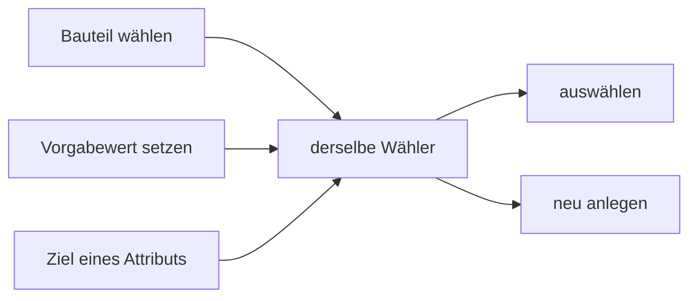
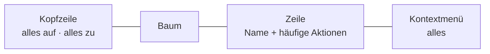
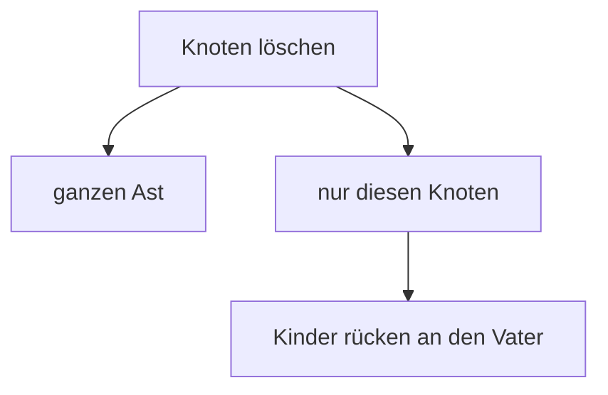
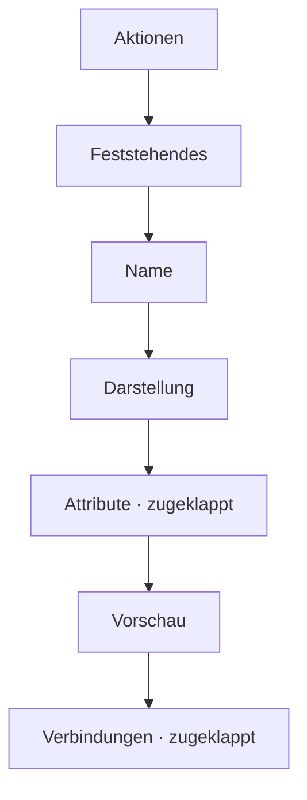
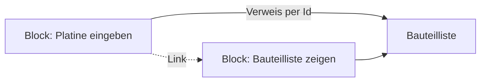

# 20 · Interaction — what a person may do

*Status:* `open` · started 2026-08-23 from owner statements
*Companion to* [30 Renderer](30-renderer.md), which answers *how a thing is drawn*. This one
answers *what someone is allowed to do with it*.

---

## Principles

These hold everywhere in the interface. They are listed first because every later section
assumes them, and because the previous project lost most of its consistency by deciding them
case by case.

### U0 · One chooser

**There is one chooser in this product.** It may take options for different scenarios, but it
**always looks the same**. The owner had to explain this at length to the previous assistant and
states it as a design rule for the whole interface, not as a preference for one screen.

Two things follow that are easy to get wrong separately:

- **It picks and it creates.** A target that does not exist yet has to be enterable, and that is
  true of **aggregation as much as composition** — with composition creating is simply the usual
  path and with aggregation picking is. ⚠️ *An earlier draft of this document split the two into
  different widgets — a list of references for aggregation, a blueprint for composition. The owner
  corrected it: the split is too sharp, and we lose nothing by making composition just as
  enterable.*
- **Inline selection is the exception.** In many places it makes no sense; where the choice is
  genuinely hard, a proper dialogue that helps is the better answer.

### U0b · A control's state follows from what is actually choosable

The owner's example: a select with **one** entry is **greyed out** — there is nothing to choose.
With more than one, a choice genuinely exists and the control is live.

This is [D-050](90-decision-log.md) — *do not ask what cannot matter* — applied to controls rather
than to dialogues, and it is worth checking **everywhere** rather than deciding per screen. A
control that asks a question with one possible answer is not being helpful; it is making a person
prove they have read it.

## The tree

The tree is where the model is built. The legacy project had one and, in the owner's words, it
*proved really good* — so this section starts from it rather than from a blank page, and records
what was right, what was crowded, and what is missing.

### U1 · The row shows the frequent, the menu holds everything

The legacy row carried seven controls — add, duplicate, up, down, hide, delete, hierarchy — and the
owner's own reading is that it is **a bit overloaded**. The fix is not to remove abilities but to
separate two different jobs:

| | Holds | Reached by |
|---|---|---|
| **The row** | what is used constantly | always visible |
| **The menu** | everything the row can do, plus the rest | right-click, and a `⋯` on the row |

The same action appearing in both places is not duplication to be avoided — it is a second route to
one behaviour. And the `⋯` is not decoration: **touch has no right-click**, so without it the menu
would be unreachable on half the devices this will run on.

### U2 · Up and down stay, even though dragging exists

They look redundant beside drag and drop and are not. Moving one position with a mouse drag is
fiddly, needs a steady hand and a visible drop target; a button press is exact. The two serve
different intents — **reorder by one** versus **move somewhere else** — and only the second is a
dragging job.

### U3 · The header's `+` and the row's `+` mean different things

*Expand all* in the header, *add a child* in the row. The owner felt the header icons wanted
replacing; the reason is not that they are ugly but that **one of them wears the other's sign**.
Whatever replaces them, the two meanings must not share a symbol.

### U4 · Deleting asks one question: the branch, or only this node

The owner: *when the node is deleted, the children get hung on the father*. Both operations are
wanted and neither is the obvious default, so it is asked rather than guessed.

⚠️ **Neither needs new machinery, and the second is not as harmless as it looks.** The tree is
inheritance ([D-041](90-decision-log.md)), so children reattached to the grandparent **lose
whatever they inherited from the deleted node**. That is exactly the move of
[D-155](90-decision-log.md), with orphaned overrides promoted per
[D-156](90-decision-log.md) — the same rules, reached from a different button.

### U5 · Dragging moves whole branches, and several at once

Drop a node on another and its **entire branch** goes with it. Select several and drop them
together and all their branches move. The owner calls this *rather practical*, and it is the
operation the tree exists for — restructuring is the daily work of modelling, and doing it one node
at a time is what makes people avoid it.

Every such move runs through [D-155](90-decision-log.md): moving never loses data, and where the
target branch changes the relation kind it goes through the conflict resolver
([D-162](90-decision-log.md)).

### U6 · Duplicating puts the copy directly beneath, with an indexed name

Not at the end of the list, not in some default position: **immediately under the node it came
from**, named with a trailing index. The reason is the working rhythm the owner described —
duplicate several times in a row, then rename each — and that only works if every copy lands where
the eye already is.

### U7 · What may be picked belongs to the place doing the picking

The legacy `eye` hid a node and went unused. Its aim was to stop some nodes being **selectable** —
when choosing a type, the person should land on a **leaf** rather than an intermediate node. It sat
on the wrong object: the same node is a fair choice when **modelling** (*something from this
branch* is how a type is named) and a mistake when **entering data**. So it is a setting at the use
site, arriving in the render context, inheriting along the chain — **leaves only by default**
([D-181](90-decision-log.md)).

### U8 · What cannot apply is not shown

Visible in the legacy screenshot: the last child has no *down* arrow, some rows have no hierarchy
control. Not greyed out — **absent**. This is [D-050](90-decision-log.md) applied to a toolbar, and
it is what keeps a seven-control row readable at all.

---

---

## The detail view

### U9 · The order is the order of dealing with a node

Not taste — the sequence in which a person works. **What acts** sits at the top; **what cannot be
changed** underneath it, as a band of chips; the **name** next, because it is what you change first;
then **display**, which is changed occasionally; then the **attributes**, which are the real work;
then the **preview**, which shows what came of it; and last the **relations**, which are consulted
rather than edited.

### U10 · Attributes show their core and hide their detail

A row shows name, type, multiplicity, kind, default, read-only, hidden, inherited. Everything else
is behind an expander, per attribute.

This is **two arguments pointing the same way**, which is rare enough to record: it keeps the
screen legible, **and** it means the detail of an attribute is only loaded when it is opened — not
the whole node's worth of settings on every page view. Density and loading agree here, so a later
rebuild must not discard it as mere styling.

The same reasoning puts **relations** at the bottom, collapsed, and not even queried until opened.

### U11 · Density is a requirement, not polish

The owner on the legacy screen: *it is all still relatively large; it would be good if it could be
made smaller in area so that more fits on one screen, while still staying clear*. Two rules that
follow, and they cost nothing to keep:

- **Fields are sized to their content, not to the container.** A name of ten characters does not
  need a field spanning the window.
- **Fixed facts are chips, not rows.** The legacy meta band already does this and it is the densest
  part of the screen. It is the pattern to extend, not the exception.

### U12 · Three sections the legacy screen has no place for

They arrived with decisions taken after that screen was built:

| Section | Why | Where |
|---|---|---|
| **Conflicts** | [D-054](90-decision-log.md) reports rather than blocks — but a report nobody sees is a block with extra steps. If this node has an unresolved conflict it belongs at the **top**, because it is actionable. | above the name |
| **Provenance** | Which pack a node came from and whether it has been changed since ([D-174](90-decision-log.md), [D-175](90-decision-log.md)) — it decides whether an update will touch it. | in the fixed band, as chips |
| **History** | Every change with before and after ([D-061](90-decision-log.md)); this is where taking something back lives ([D-172](90-decision-log.md)). *Last modified by* is already there and is one line of it. | bottom, collapsed, beside relations |

A parked node ([D-123](90-decision-log.md)) must say so too — but that is a state of the whole
screen, not a section of it.

### U13 · `Used by` — the one direction nothing else shows

The legacy screen ended with `Relations`, collapsed: *all connections to and from the node*. Half of
that is already on the page and nobody had noticed:

| Direction | Where it already is |
|---|---|
| outgoing, non-inheritance | **the attributes table** — an attribute *is* a relation seen from its owner ([D-031](90-decision-log.md)) |
| the parent edge | the fixed band, as a chip |
| the children | the tree |
| **incoming** | **nowhere else** |

So the section holds exactly one direction, and it is renamed for it: **`Used by`** — *Verwendet
von*. Not `Incoming`, which describes the arrow rather than the meaning, and not `Referenced by`,
because *reference* is already carrying three jobs here.

**It is not a listing, it is an impact estimate.** It answers the question a person has before every
larger change:

| Intending to | It says |
|---|---|
| delete | who breaks ([D-122](90-decision-log.md)) |
| move | where the relation kind flips ([D-162](90-decision-log.md)) |
| remove a pack | what points in from outside ([D-177](90-decision-log.md)) |
| rename | who inherits the label ([D-015](90-decision-log.md)) |

The same list the conflict resolver would pull anyway — but beforehand and voluntarily, rather than
afterwards and as a complaint.

⚠️ **The condition, in the owner's words: *as long as that stays so*.** The section is allowed to
hold one direction only because every outgoing edge is currently visible elsewhere. If an outgoing
edge ever appears that is neither an attribute nor inheritance, this section has to grow back —
otherwise it silently stops being complete.

**And model must not blur into data here.** On a **node**, `Used by` lists the **attributes of other
nodes that have this node as their type**. *Which records point at a record* is a different
question and belongs on the record's own screen.

### U14 · A pending review is visible from the outside of a collapsed branch

A value added during data entry is usable at once and reviewed afterwards
([D-204](90-decision-log.md)). The tree has to show that something is waiting.

The marker on the node itself is the easy half and the useless half — the node is normally inside a
collapsed branch, and nobody expands a whole tree on the off-chance. So **it propagates upwards**:

| Marker | Means |
|---|---|
| filled | this node is waiting |
| outline | something beneath it is |

Following the outline downwards is how the node is found without searching for it. **Not red** —
red is deletion and conflict, and a pending review is neither wrong nor destructive, only
unfinished. And distinct from the `Counts` badge ([D-189](90-decision-log.md)), which answers a
different question in the same corner of the row.

---

## Blocks

Dictated by the owner on 2026-08-23 from what he already runs on his own site: printed circuit
boards from open-source projects, their parts lists, retro PC components and the tests that belong
to them, manufacturers, recipes.

### U15 · Small blocks, one node each — the reference does the joining

The owner: *I would rather not build one huge block that queries all the data for several connected
nodes. I would enter the board, which has the parts list as an attribute — but only an id is set
there. Further down the page, at a suitable place, I would then display the parts list.*

**This is [D-105](90-decision-log.md) arriving in the front end.** A reference is drawn as label plus
link and **does not descend**, so the board block cannot pull the parts list in even if someone
wanted it to. Whether the list appears further down the same page or on another one is then the page
builder's free choice — and in both cases it is **a second block**, never a larger first one.

The link needs no dynamism: it is a label and an address, so *many things can be done after saving*,
as the owner put it.

### U16 · Comparison resolves to the nearest common ancestor

The owner compares mainboards: P4 against P4, but also 286 against 386 against 486. *It is a
comparison of similar data types — similar, because there may be differences in detail. Then I would
have to fall back on the parent node and compare only what they have in common, and show the rest
separately.*

**That is not a workaround, it is the tree doing its job.** A node's type **is** its inheritance line
([D-041](90-decision-log.md)), so the nearest ancestor covering every subject **is** the set of
shared attributes. The block does not have to guess what is comparable:

1. Walk up until all subjects lie beneath one node.
2. Compare the attributes found there, side by side.
3. Show what each subject additionally carries beneath its own column.

**Confirmed 2026-08-23**, with a refinement: what is not comparable is moved **below** the comparison, and may additionally be **hidden behind a disclosure** and shown only on request ([D-207](90-decision-log.md)). The shared attributes are what the block is for; letting specialities interleave would bury the rows someone came to read.

### U17 · A list is a node plus a restriction

*A list of manufacturers — in a larger sense persons, or organisations rather — I would like to show
as a list. So I choose a node, and restrict the data I want to display.*

Two inputs, both already modelled: **which node** supplies the records, and **which of their
attributes** are shown. No new concept — the restriction is a choice of attributes, and the drawing
of each is the ordinary renderer under the display purpose ([D-168](90-decision-log.md)).

### Candidates not yet dictated

- **A test belonging to a component.** The owner: *a card always has a test as well — not sound
  cards, but graphics cards or mainboards.* Whether that is its own block or a section of the
  comparison is open.
- **Nesting.** A recipe resembles a parts list but may contain **sub-recipes**; the nesting is the
  same shape as board → parts list. Whether that needs anything beyond U15 is open.

## Still to be dictated

- How blocks are assembled.
- What is special in Gutenberg and in the front end.
