# 20 · Interaction — what a person may do

*Status:* `open` · started 2026-08-23 from owner statements
*Companion to* [30 Renderer](30-renderer.md), which answers *how a thing is drawn*. This one
answers *what someone is allowed to do with it*.

---

## Principles

These hold everywhere in the interface. They are listed first because every later section
assumes them, and because the previous project lost most of its consistency by deciding them
case by case.

### U0 · One chooser

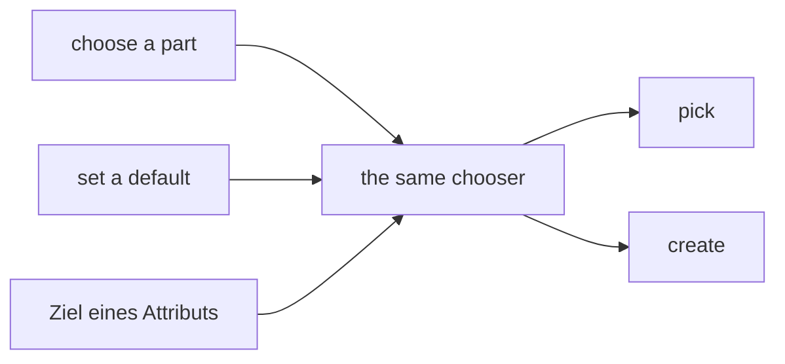

**There is one chooser in this product.** It may take options for different scenarios, but it
**always looks the same**. The owner had to explain this at length to the previous assistant and
states it as a design rule for the whole interface, not as a preference for one screen.

Two things follow that are easy to get wrong separately:

- **It picks and it creates.** A target that does not exist yet has to be enterable, and that is
  true of **aggregation as much as composition** — with composition creating is simply the usual
  path and with aggregation picking is. ⚠️ *An earlier draft of this document split the two into
  different widgets — a list of references for aggregation, a blueprint for composition. The owner
  corrected it: the split is too sharp, and we lose nothing by making composition just as
  enterable.*
- **Inline selection is the exception.** In many places it makes no sense; where the choice is
  genuinely hard, a proper dialogue that helps is the better answer. **The default is therefore the
  dialog**, with inline kept available where the choice really is simple
  ([D-244](90-decision-log.md), flipping the default of [D-108](90-decision-log.md)). The two are
  **separate chooser renderers**, not one renderer with a switch, and which of them applies is a
  setting on the resolution chain. ⚠️ *This concerns the chooser only — what is drawn **after** a
  node has been chosen is the chosen node's own renderer, which is a separate matter.*

### U0b · A control's state follows from what is actually choosable

The owner's example: a select with **one** entry is **greyed out** — there is nothing to choose.
With more than one, a choice genuinely exists and the control is live.

**Corrected 2026-08-23: the test counts possibilities, not entries** ([D-227](90-decision-log.md)).

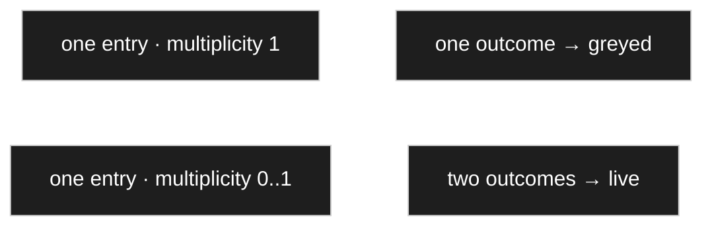

| Entries offered | Multiplicity | Outcomes the control can produce | State |
|---|---|---|---|
| one | `1` | one — that entry | **greyed** |
| one | `0..1` | two — that entry, or **nothing** | **live** |
| several | any | several | live |

The short form — *a select with one entry is greyed* ([D-198](90-decision-log.md)) — was true only
of the first row, and it collided with [D-056](90-decision-log.md), which had said a single entry
under an **optional** multiplicity must not be greyed. Both stand: at `0..1` the second possibility
is *nothing*, and clearing an optional selection is a real outcome.

> **The test is never *how many rows are in the list* but *how many outcomes can this control
> produce*.**

This is [D-050](90-decision-log.md) — *do not ask what cannot matter* — applied to controls rather
than to dialogues, and it is worth checking **everywhere** rather than deciding per screen. A
control that asks a question with one possible answer is not being helpful; it is making a person
prove they have read it.

### U18 · Automatic is a default, never a fact

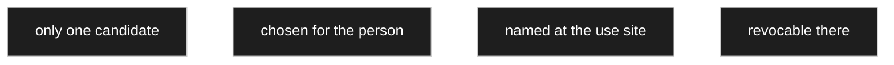

U0b removes controls, and that power has a limit ([D-223](90-decision-log.md)). **Two questions get
confused and only one of them is dead:** *which* converter supplies a colour sequence may genuinely
have one answer, so that control disappears; *whether* this use site wants a colour form **at all**
always has two, so that control stays.

The general rule — [D-032](90-decision-log.md)'s two-fold principle applied to automatic choices:

| | |
|---|---|
| **Revocable** | anything the system chooses on a person's behalf can be refused at the use site |
| **Visible** | and it must say that it was chosen |

A field showing red-blue-green with nothing anywhere saying *presentation: colour code*, and no
place to change it, is the kind of magic nobody can switch off later because nobody can find where
it came from.

Concretely: the shorthand control accepting `2k7` appears **automatically wherever an invertible
text converter exists, and can be switched off**; refusing a colour form needs nothing special,
since choosing the ordinary composite renderer at that use site already **is** the refusal.

### U19 · A restriction that collapses to one *is* the fixed value

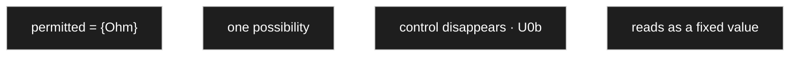

There is no *fixed value* control ([D-221](90-decision-log.md)). Say **only `Ohm` is permitted** and
that **is** the fixed value: one possibility remains, the control disappears by U0b, and no author
picks the unit again on every part. A separate *fixed* setting beside the permitted set would be the
classic duplicated fact — *fixed = Ohm* against *permitted = {Ohm, Volt}*, with nothing to say which
wins.

**Restrictions narrow downwards and never widen.** A use site further down may restrict further; it
may not reopen, or *only Ohm* guaranteed nothing in the first place. Whoever genuinely needs another
unit does not need this type at all. The model side is
[C117](10-domain-core.md#c117--there-is-no-fixed-value-only-a-restriction).

### U20 · The chooser also works value-first

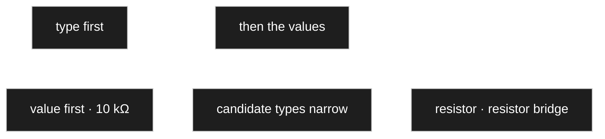

The concept had only ever assumed one direction — pick a type, then fill in the values. The reverse
works too ([D-239](90-decision-log.md)): entering `10 kΩ` **before** choosing anything leaves the
types that can have such a value, and if only one can, the type follows from the entry.

It is the **same chooser** (U0) and the same search ([D-167](90-decision-log.md)); the only
difference is that the search runs **across types** instead of inside one already chosen.

It is also why U7 has to allow intermediate nodes: a value-first search narrows to *some kind of
resistor* and stops there, and forcing a leaf would demand a decision the data do not contain.

## The tree

The tree is where the model is built. The legacy project had one and, in the owner's words, it
*proved really good* — so this section starts from it rather than from a blank page, and records
what was right, what was crowded, and what is missing.

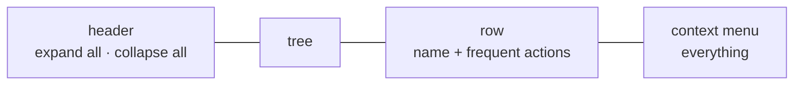

### U1 · The row shows the frequent, the menu holds everything

The legacy row carried seven controls — add, duplicate, up, down, hide, delete, hierarchy — and the
owner's own reading is that it is **a bit overloaded**. The fix is not to remove abilities but to
separate two different jobs:

| | Holds | Reached by |
|---|---|---|
| **The row** | what is used constantly | always visible |
| **The menu** | everything the row can do, plus the rest | right-click, and a `⋯` on the row |

The same action appearing in both places is not duplication to be avoided — it is a second route to
one behaviour. And the `⋯` is not decoration: **touch has no right-click**, so without it the menu
would be unreachable on half the devices this will run on.

### U2 · Up and down stay, even though dragging exists

They look redundant beside drag and drop and are not. Moving one position with a mouse drag is
fiddly, needs a steady hand and a visible drop target; a button press is exact. The two serve
different intents — **reorder by one** versus **move somewhere else** — and only the second is a
dragging job.

### U3 · The header's `+` and the row's `+` mean different things

*Expand all* in the header, *add a child* in the row. The owner felt the header icons wanted
replacing; the reason is not that they are ugly but that **one of them wears the other's sign**.
Whatever replaces them, the two meanings must not share a symbol.

### U4 · Deleting asks one question: the branch, or only this node

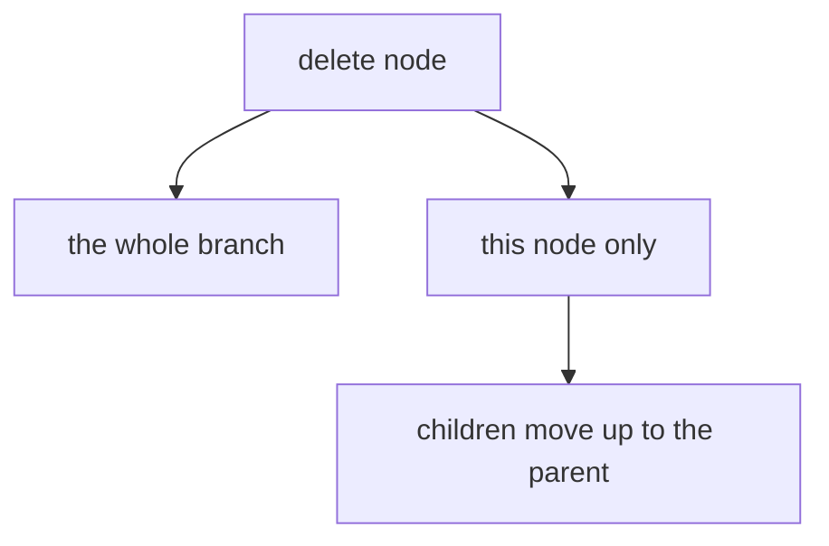

The owner: *when the node is deleted, the children get hung on the father*. Both operations are
wanted and neither is the obvious default, so it is asked rather than guessed.

⚠️ **Neither needs new machinery, and the second is not as harmless as it looks.** The tree is
inheritance ([D-041](90-decision-log.md)), so children reattached to the grandparent **lose
whatever they inherited from the deleted node**. That is exactly the move of
[D-155](90-decision-log.md), with orphaned overrides promoted per
[D-156](90-decision-log.md) — the same rules, reached from a different button.

### U5 · Dragging moves whole branches, and several at once

Drop a node on another and its **entire branch** goes with it. Select several and drop them
together and all their branches move. The owner calls this *rather practical*, and it is the
operation the tree exists for — restructuring is the daily work of modelling, and doing it one node
at a time is what makes people avoid it.

Every such move runs through [D-155](90-decision-log.md): moving never loses data, and where the
target branch changes the relation kind it goes through the conflict resolver
([D-162](90-decision-log.md)).

### U6 · Duplicating puts the copy directly beneath, with an indexed name

Not at the end of the list, not in some default position: **immediately under the node it came
from**, named with a trailing index. The reason is the working rhythm the owner described —
duplicate several times in a row, then rename each — and that only works if every copy lands where
the eye already is.

### U7 · What may be picked belongs to the place doing the picking

The legacy `eye` hid a node and went unused. Its aim was to stop some nodes being **selectable** —
when choosing a type, the person should land on a **leaf** rather than an intermediate node. It sat
on the wrong object: the same node is a fair choice when **modelling** (*something from this
branch* is how a type is named) and a mistake when **entering data**. So it is a setting at the use
site, arriving in the render context, inheriting along the chain ([D-181](90-decision-log.md)).

**Corrected 2026-08-23 — the default is everything except the branch root**
([D-238](90-decision-log.md)). An earlier version of this section said *leaves only*; that was
[D-181](90-decision-log.md)'s default and it has been reversed, upholding
[D-110](90-decision-log.md), which had already refused *leaves only* with the owner's departments
counter-case.

| | |
|---|---|
| What stands from [D-181](90-decision-log.md) | selectability belongs to the **use site**, not to the node — the real finding, and the reason the legacy `eye` went unused |
| What is withdrawn | the **default**. *Leaves only* would break the departments case at every new use site and have to be reopened each time |
| What it is now | **everything but the branch root** is selectable; whoever needs leaves enforces it where they need it |

The owner's own example settles it: entering `10 kΩ` may leave both a resistor and a resistor bridge
in play. The data do not support the decision, so an intermediate node is the honest answer, not a
gate to be forced past — see U20.

### U8 · What cannot apply is not shown

Visible in the legacy screenshot: the last child has no *down* arrow, some rows have no hierarchy
control. Not greyed out — **absent**. This is [D-050](90-decision-log.md) applied to a toolbar, and
it is what keeps a seven-control row readable at all.

### U21 · The tree row draws the node's icon

Where a node has an icon set, the tree shows it ([D-251](90-decision-log.md)) — the node renderer in
the tree takes the icon into account when one is present.

Small, and it is the reason the icon exists at all: the tree is where a person scans a hundred rows,
and a glyph is read faster than a word. It costs nothing, since the icon is already resolved with
everything else along the chain.

⚠️ **The icon is not the `symbol`.** An icon is a glyph chosen from the installation's allow-list, a
**setting**, language-neutral and the same in every locale ([D-019](90-decision-log.md),
[D-252](90-decision-log.md)); `symbol` is a very short **text** — `Ω`, `Pos.` — and a translated
label **role** ([D-196](90-decision-log.md)). The legacy detail screen put them side by side in one
panel, which is how they came to be confused once already.

---

---

## The detail view

⚠️ **Where it sits: to the right of the tree** ([D-343](90-decision-log.md)). The screen is one
surface in two parts — the tree on the left, the properties of the **selected** node on the
right. There is no separate *open* step and no second screen to navigate to and back from.

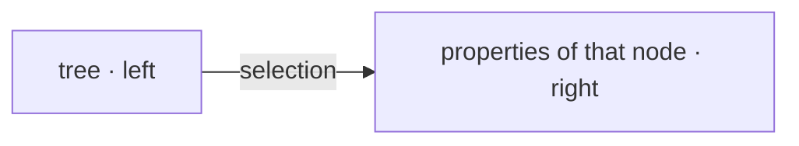

**That the tree has a selection at all follows from this**, and it is what makes
[U10](#u10--attributes-show-their-core-and-hide-their-detail)'s loading argument work: the detail
is fetched for **one** node, at the moment it is chosen — not for the whole tree on every view.

*Open: whether the split is resizable, whether the selection survives a reload or can be reached
by URL, and what the right-hand side shows when nothing is selected —
[OQ-082](91-open-questions.md).*

**What it contains, and in which order:**
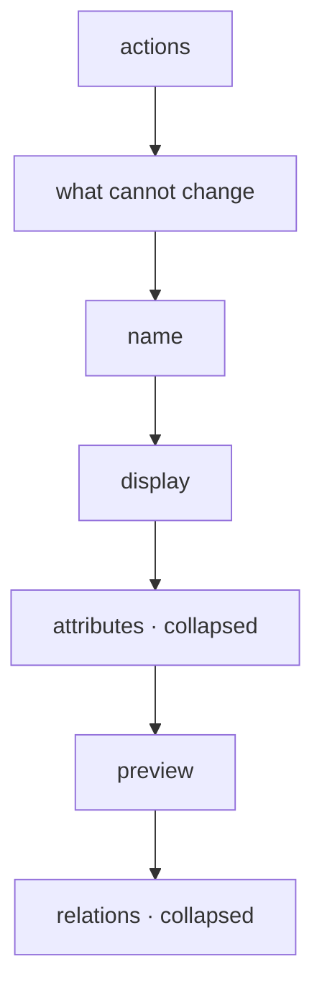

### U9 · The order is the order of dealing with a node

Not taste — the sequence in which a person works. **What acts** sits at the top; **what cannot be
changed** underneath it, as a band of chips; the **name** next, because it is what you change first;
then **display**, which is changed occasionally; then the **attributes**, which are the real work;
then the **preview**, which shows what came of it; and last the **relations**, which are consulted
rather than edited.

### U10 · Attributes show their core and hide their detail

A row shows name, type, multiplicity, kind, default, read-only, hidden, inherited. Everything else
is behind an expander, per attribute.

This is **two arguments pointing the same way**, which is rare enough to record: it keeps the
screen legible, **and** it means the detail of an attribute is only loaded when it is opened — not
the whole node's worth of settings on every page view. Density and loading agree here, so a later
rebuild must not discard it as mere styling.

The same reasoning puts **relations** at the bottom, collapsed, and not even queried until opened.

### U11 · Density is a requirement, not polish

The owner on the legacy screen: *it is all still relatively large; it would be good if it could be
made smaller in area so that more fits on one screen, while still staying clear*. Two rules that
follow, and they cost nothing to keep:

- **Fields are sized to their content, not to the container.** A name of ten characters does not
  need a field spanning the window.
- **Fixed facts are chips, not rows.** The legacy meta band already does this and it is the densest
  part of the screen. It is the pattern to extend, not the exception.

### U12 · Three sections the legacy screen has no place for

They arrived with decisions taken after that screen was built:

| Section | Why | Where |
|---|---|---|
| **Conflicts** | [D-054](90-decision-log.md) reports rather than blocks — but a report nobody sees is a block with extra steps. If this node has an unresolved conflict it belongs at the **top**, because it is actionable. | above the name |
| **Provenance** | Which pack a node came from and whether it has been changed since ([D-174](90-decision-log.md), [D-175](90-decision-log.md)) — it decides whether an update will touch it. | in the fixed band, as chips |
| **History** | Every change with before and after ([D-061](90-decision-log.md)); this is where taking something back lives ([D-172](90-decision-log.md)). *Last modified by* is already there and is one line of it. | bottom, collapsed, beside relations |

A parked node ([D-123](90-decision-log.md)) must say so too — but that is a state of the whole
screen, not a section of it.

### U13 · `Used by` — the one direction nothing else shows

The legacy screen ended with `Relations`, collapsed: *all connections to and from the node*. Half of
that is already on the page and nobody had noticed:

| Direction | Where it already is |
|---|---|
| outgoing, non-inheritance | **the attributes table** — an attribute *is* a relation seen from its owner ([D-031](90-decision-log.md)) |
| the parent edge | the fixed band, as a chip |
| the children | the tree |
| **incoming** | **nowhere else** |

So the section holds exactly one direction, and it is renamed for it: **`Used by`** — *Verwendet
von*. Not `Incoming`, which describes the arrow rather than the meaning, and not `Referenced by`,
because *reference* is already carrying three jobs here.

**It is not a listing, it is an impact estimate.** It answers the question a person has before every
larger change:

| Intending to | It says |
|---|---|
| delete | who breaks ([D-122](90-decision-log.md)) |
| move | where the relation kind flips ([D-162](90-decision-log.md)) |
| remove a pack | what points in from outside ([D-177](90-decision-log.md)) |
| rename | who inherits the label ([D-015](90-decision-log.md)) |

The same list the conflict resolver would pull anyway — but beforehand and voluntarily, rather than
afterwards and as a complaint.

⚠️ **The condition, in the owner's words: *as long as that stays so*.** The section is allowed to
hold one direction only because every outgoing edge is currently visible elsewhere. If an outgoing
edge ever appears that is neither an attribute nor inheritance, this section has to grow back —
otherwise it silently stops being complete.

**And model must not blur into data here.** On a **node**, `Used by` lists the **attributes of other
nodes that have this node as their type**. *Which records point at a record* is a different
question and belongs on the record's own screen.

### U14 · A pending review is visible from the outside of a collapsed branch

A value added during data entry is usable at once and reviewed afterwards
([D-204](90-decision-log.md)). The tree has to show that something is waiting.

The marker on the node itself is the easy half and the useless half — the node is normally inside a
collapsed branch, and nobody expands a whole tree on the off-chance. So **it propagates upwards**:

| Marker | Means |
|---|---|
| filled | this node is waiting |
| outline | something beneath it is |

Following the outline downwards is how the node is found without searching for it. **Not red** —
red is deletion and conflict, and a pending review is neither wrong nor destructive, only
unfinished. And distinct from the `Counts` badge ([D-189](90-decision-log.md)), which answers a
different question in the same corner of the row.

---

## The administration surface

How the configuration screens behave, as opposed to what they show. Dictated 2026-08-23 while going
through the legacy settings page.

### U22 · Settings apply immediately; the save button stays for one named reason

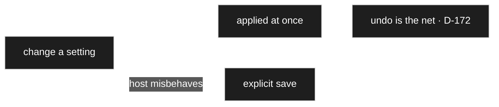

*Basically it is nicer if I make a setting and it is simply taken; at worst I can undo it*
([D-249](90-decision-log.md)). So immediate is the default.

⚠️ **But the button is not superstition.** In WordPress the page sometimes jumps when a setting is
changed, loses focus, and the person does something else entirely. That is a real failure of the
host, not a preference, so the switch stays — **immediate by default, explicit save where the
environment misbehaves.**

Immediate saving is only defensible **because undo exists** ([D-172](90-decision-log.md)). Without
it, *applied at once* would mean *lost at once*.

### U23 · One mode, not two — test mode folds into developer mode

The legacy settings screen carried both: *Test mode*, which changed other defaults (confirm-delete
off while testing), and *Development only*, which lifted deletion protection. They become one
([D-248](90-decision-log.md)).

Two modes that overlap are two things to explain and two ways to be in a surprising state. The
developer flag already exists as the deliberate escape from protection
([D-122](90-decision-log.md)), and it sits at the head of the resolution chain
([D-079](90-decision-log.md)) — where a posture belongs.

### U24 · `Cleanup` is the repair surface for what deliberate non-tidying leaves behind

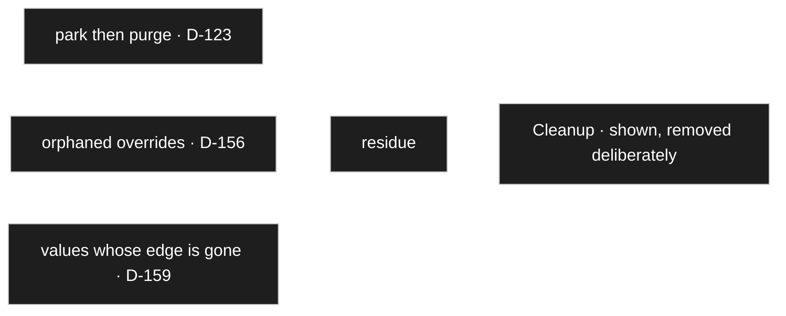

*Cleanup was meant for tidying — nodes that have no connections any more, or settings that broke
because something was deleted* ([D-247](90-decision-log.md)). It is **not a feature but a repair
surface**, and this concept needs one precisely because so much is derived.

Each of the three sources above was decided as *leave it alone rather than tidy it silently*, which
is the right call at the moment of the change and leaves residue over years. **Cleanup is where the
residue is shown and removed deliberately** — never automatically.

### U25 · Two legacy constructs retired, with nothing to put in their place

| Retired | Why, and what took over |
|---|---|
| **`Fill Model Data`** | it injected test data into the tree; data packs ([D-175](90-decision-log.md)) and the type's own sample value ([D-240](90-decision-log.md)) do that now, so it dissolves with nothing left over |
| **`node_presentation`** | *you could assign icons or something with it, I am not even sure* — the owner could no longer name its purpose |

Both by [D-250](90-decision-log.md). ⚠️ *A construct nobody can any longer say what it was for is
exactly what should not survive a restart* ([PR-1](../../CLAUDE.md)): legacy is quoted, never
inherited. If a need turns up later it will arrive with a reason attached.

---

## Entering data

### U26 · The test-data mark governs front-end visibility and nothing else

*In the data one can mark that these are test data — not yet visible in the front end, used only for
testing* ([D-241](90-decision-log.md)).

| | A record carrying the mark |
|---|---|
| front end | **not shown** |
| administration | shown like any other record |
| uniqueness | counts, exactly as any other ([D-154](90-decision-log.md)) |
| model changes and migrations | travels like any other |

⚠️ **Deliberately no further special-casing.** A second class of record would have to be known to
every code path, which is the cost this concept has refused everywhere else. **One flag, one
effect.**

The preview reads the marked records as its middle layer — real data, test-marked records, then the
type's own sample ([D-240](90-decision-log.md)) — but that is a *use* of the flag, not a second
effect of it.

### U27 · The editor supplies the data; visitor entry is foreseen without a use case

*Basically the editor provides the data for now. It may be that we also collect user data — I have
no use case for it yet* ([D-258](90-decision-log.md)).

That costs nothing to leave open, because the mechanism already exists: **editable** is a
circumstance of a renderer ([D-018](90-decision-log.md)), so a field can be declared enterable by
the visitor and they get an input. Foreseen, and unused.

⚠️ **What is deliberately not decided with it:** who may, what is checked, how abuse is prevented.
Those questions belong to the first real use case; inventing them now would produce rules nobody can
test against anything.

---

## Blocks

Dictated by the owner on 2026-08-23 from what he already runs on his own site: printed circuit
boards from open-source projects, their parts lists, retro PC components and the tests that belong
to them, manufacturers, recipes.

### U15 · Small blocks, one node each — the reference does the joining

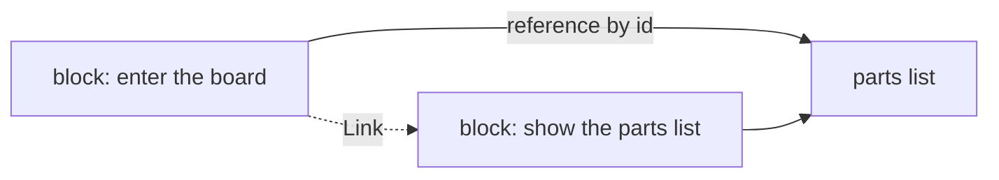

The owner: *I would rather not build one huge block that queries all the data for several connected
nodes. I would enter the board, which has the parts list as an attribute — but only an id is set
there. Further down the page, at a suitable place, I would then display the parts list.*

**This is [D-105](90-decision-log.md) arriving in the front end.** A reference is drawn as label plus
link and **does not descend**, so the board block cannot pull the parts list in even if someone
wanted it to. Whether the list appears further down the same page or on another one is then the page
builder's free choice — and in both cases it is **a second block**, never a larger first one.

The link needs no dynamism: it is a label and an address, so *many things can be done after saving*,
as the owner put it.

### U16 · Comparison resolves to the nearest common ancestor

The owner compares mainboards: P4 against P4, but also 286 against 386 against 486. *It is a
comparison of similar data types — similar, because there may be differences in detail. Then I would
have to fall back on the parent node and compare only what they have in common, and show the rest
separately.*

**That is not a workaround, it is the tree doing its job.** A node's type **is** its inheritance line
([D-041](90-decision-log.md)), so the nearest ancestor covering every subject **is** the set of
shared attributes. The block does not have to guess what is comparable:

1. Walk up until all subjects lie beneath one node.
2. Compare the attributes found there, side by side.
3. Show what each subject additionally carries beneath its own column.

**Confirmed 2026-08-23**, with a refinement: what is not comparable is moved **below** the comparison, and may additionally be **hidden behind a disclosure** and shown only on request ([D-207](90-decision-log.md)). The shared attributes are what the block is for; letting specialities interleave would bury the rows someone came to read.

### U17 · A list is a node plus a restriction

*A list of manufacturers — in a larger sense persons, or organisations rather — I would like to show
as a list. So I choose a node, and restrict the data I want to display.*

Two inputs, both already modelled: **which node** supplies the records, and **which of their
attributes** are shown. No new concept — the restriction is a choice of attributes, and the drawing
of each is the ordinary renderer under the display purpose ([D-168](90-decision-log.md)).

### U28 · Three surfaces, three jobs

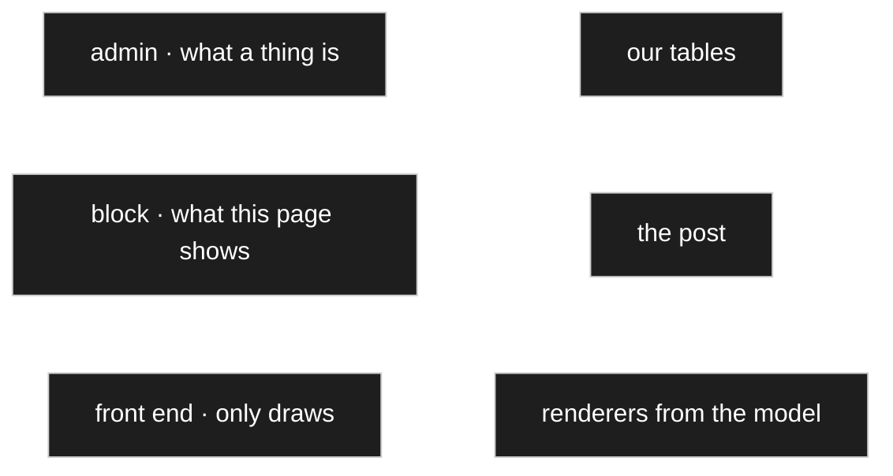

The owner was unsure where the line ran — *I am not so confident about the boundary between front
end, Gutenberg and the settings page* — and his own description drew it
([D-253](90-decision-log.md)).

| Surface | Decides | Stored in |
|---|---|---|
| **Admin** | what a thing **is** — attributes, types, which renderers, defaults | **our tables** ([AR-1](../../CLAUDE.md)) |
| **Block** | what **this page** shows — which node, which record, which fields are visible | **the post**, WordPress-standard, as the owner asked |
| **Front end** | nothing of its own; it draws what the block names, with the renderers resolved from the model, exactly as the admin does | — |

⚠️ **And this withdraws the last link of [D-226](90-decision-log.md).** The resolution chain had been
extended by an *occurrence in a block*, so that a value and its colour rings could stand side by
side. The owner did not recognise the need — *the data already have a renderer, you would just fetch
it from the registry in the front end too* — and [D-226](90-decision-log.md) itself had already made
*value, plus colour rings* **one setting at the use site**. **So the chain ends at the use site**,
and there is no hole in the block, because nothing belongs there. Listing one attribute twice in a
block is dropped with it: two occurrences would now render identically.

⚠️ *That also makes the storage question harmless.* Visibility is a statement about **this page**, so
losing it when a page is copied is annoying and breaks nothing — where a renderer choice living in
post content could have gone missing from the model.

**The block selects and hides; it does not choose renderers** — with the one deliberate exception in
U30.

### U29 · One block for a node, and the layout follows the content

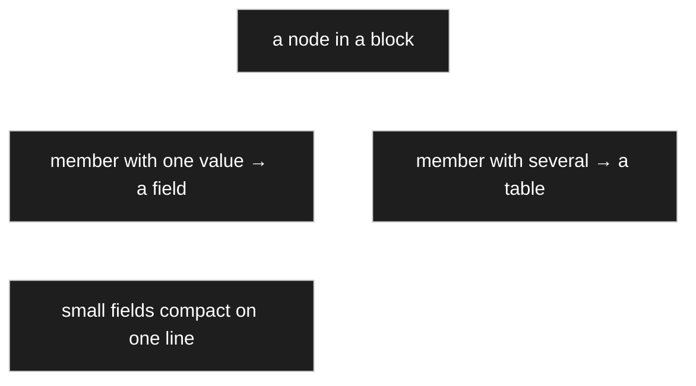

Asked whether the parts-list example — a form on top, a table of positions below — was a second kind
of block, the owner said it is **the standard**: *basically we have only one block that can display
a node, and how it is displayed follows from the contents* ([D-255](90-decision-log.md)). Simple
rules: fixed data give a form; a multiplicity gives a table beneath it; small fields go compactly on
one line, the same compact renderer as on the settings screen ([D-245](90-decision-log.md)).

⚠️ **That is a rule of the node renderer, not of the block.** [D-234](90-decision-log.md) stands —
the block selects, the renderer draws — and [D-256](90-decision-log.md) corrected the placement
once: the **composite** renderer draws one composed *value* (`2,7 kΩ ±5 %`), while a form above and a
positions table below is a whole *node* with its attributes. Node renderer and page renderer are the
same renderer ([D-233](90-decision-log.md), [D-091](90-decision-log.md)), used in different places.

**Hiding works one level coarser than assumed:** not only single fields but **whole parts** — leave
the form out and show only the positions, or show one of two multiplicities and not the other. For a
composition that is right in substance too, since it exists only in connection with its whole.

**Other block shapes stay possible and are not now:** the owner named a timeline as something that
would arrange the same data differently.

### U30 · A block may override presentation, and such an override is page-local

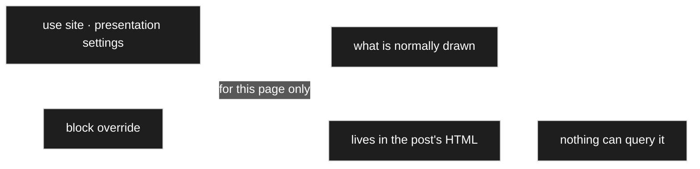

This reopens what U28 closed, and does so deliberately ([D-257](90-decision-log.md)). The owner:
*hiding matters to me in any case, but I do not see why we should forbid something that gives us
more flexibility later.* The stronger argument is his: the presentation is fixed in the back end and
seen in the preview ([D-231](90-decision-log.md)), and the block is where one adjusts **for this one
page** — forbidding it means changing the model instead, which hits every other page.

⚠️ **The cost is stated rather than hidden.** The override lives in the post's HTML, where **nothing
can query it**. *Where is this attribute shown as a colour code?* becomes unanswerable, and the
conflict resolver ([D-054](90-decision-log.md)) will not find it when the model changes. So it is
allowed **and labelled page-local** — a deliberate choice rather than a trap.

**Open:** *which* settings may be overridden. **Visibility is certain**; the rest is a list to be
drawn up when the block is built, on the owner's own instruction
([D-257](90-decision-log.md)).

### Candidates not yet dictated

- **A test belonging to a component.** The owner: *a card always has a test as well — not sound
  cards, but graphics cards or mainboards.* Whether that is its own block or a section of the
  comparison is open.
- **Nesting.** A recipe resembles a parts list but may contain **sub-recipes**; the nesting is the
  same shape as board → parts list. Whether that needs anything beyond U15 is open.

## Still to be dictated

- How blocks are assembled. *Partly answered by U29 — one block per node, the layout following the
  content — but not the composing itself.*
- ~~What is special in Gutenberg and in the front end.~~ → **answered by U28**
  ([D-253](90-decision-log.md)), with the server-side rendering of blocks decided alongside it
  ([D-254](90-decision-log.md), in [30 Renderer](30-renderer.md)).
