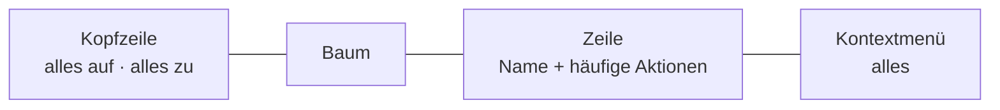
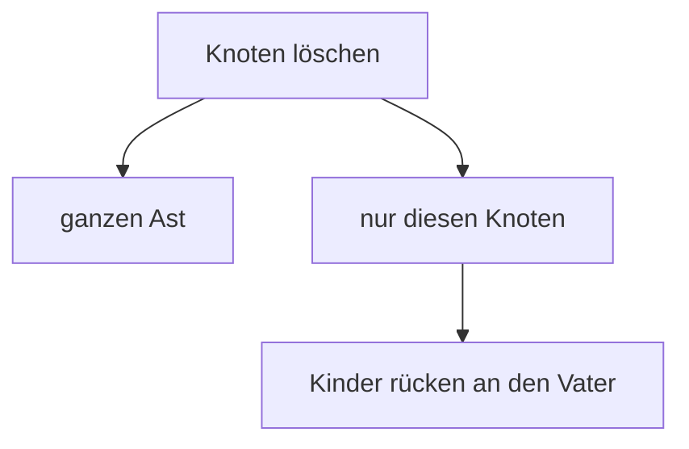

# 20 · Interaction — what a person may do

*Status:* `open` · started 2026-08-23 from owner statements
*Companion to* [30 Renderer](30-renderer.md), which answers *how a thing is drawn*. This one
answers *what someone is allowed to do with it*.

---

## The tree

The tree is where the model is built. The legacy project had one and, in the owner's words, it
*proved really good* — so this section starts from it rather than from a blank page, and records
what was right, what was crowded, and what is missing.

### U1 · The row shows the frequent, the menu holds everything

The legacy row carried seven controls — add, duplicate, up, down, hide, delete, hierarchy — and the
owner's own reading is that it is **a bit overloaded**. The fix is not to remove abilities but to
separate two different jobs:

| | Holds | Reached by |
|---|---|---|
| **The row** | what is used constantly | always visible |
| **The menu** | everything the row can do, plus the rest | right-click, and a `⋯` on the row |

The same action appearing in both places is not duplication to be avoided — it is a second route to
one behaviour. And the `⋯` is not decoration: **touch has no right-click**, so without it the menu
would be unreachable on half the devices this will run on.

### U2 · Up and down stay, even though dragging exists

They look redundant beside drag and drop and are not. Moving one position with a mouse drag is
fiddly, needs a steady hand and a visible drop target; a button press is exact. The two serve
different intents — **reorder by one** versus **move somewhere else** — and only the second is a
dragging job.

### U3 · The header's `+` and the row's `+` mean different things

*Expand all* in the header, *add a child* in the row. The owner felt the header icons wanted
replacing; the reason is not that they are ugly but that **one of them wears the other's sign**.
Whatever replaces them, the two meanings must not share a symbol.

### U4 · Deleting asks one question: the branch, or only this node

The owner: *when the node is deleted, the children get hung on the father*. Both operations are
wanted and neither is the obvious default, so it is asked rather than guessed.

⚠️ **Neither needs new machinery, and the second is not as harmless as it looks.** The tree is
inheritance ([D-041](90-decision-log.md)), so children reattached to the grandparent **lose
whatever they inherited from the deleted node**. That is exactly the move of
[D-155](90-decision-log.md), with orphaned overrides promoted per
[D-156](90-decision-log.md) — the same rules, reached from a different button.

### U5 · Dragging moves whole branches, and several at once

Drop a node on another and its **entire branch** goes with it. Select several and drop them
together and all their branches move. The owner calls this *rather practical*, and it is the
operation the tree exists for — restructuring is the daily work of modelling, and doing it one node
at a time is what makes people avoid it.

Every such move runs through [D-155](90-decision-log.md): moving never loses data, and where the
target branch changes the relation kind it goes through the conflict resolver
([D-162](90-decision-log.md)).

### U6 · Duplicating puts the copy directly beneath, with an indexed name

Not at the end of the list, not in some default position: **immediately under the node it came
from**, named with a trailing index. The reason is the working rhythm the owner described —
duplicate several times in a row, then rename each — and that only works if every copy lands where
the eye already is.

### U8 · What may be picked belongs to the place doing the picking

The legacy `eye` hid a node and went unused. Its aim was to stop some nodes being **selectable** —
when choosing a type, the person should land on a **leaf** rather than an intermediate node. It sat
on the wrong object: the same node is a fair choice when **modelling** (*something from this
branch* is how a type is named) and a mistake when **entering data**. So it is a setting at the use
site, arriving in the render context, inheriting along the chain — **leaves only by default**
([D-181](90-decision-log.md)).

### U7 · What cannot apply is not shown

Visible in the legacy screenshot: the last child has no *down* arrow, some rows have no hierarchy
control. Not greyed out — **absent**. This is [D-050](90-decision-log.md) applied to a toolbar, and
it is what keeps a seven-control row readable at all.

---

## Still to be dictated

- What **Counts** counts.
- The detail view.
- How blocks are assembled.
- What is special in Gutenberg and in the front end.
