# Renderer

> **Status: `draft`.** Contains owner statements of 2026-08-22, written down but **not yet
> confirmed**. Legacy material has not been harvested into this document yet.

## Purpose

Define how a node becomes visible output: the renderer contract, how a renderer is chosen for
a node, and how single nodes and sets of nodes differ. Also covers the **converter** and
**validator** contracts, which sit on the same pipeline.

## Owner statement — 2026-08-22

| # | Statement |
|---|---|
| **R1** | **Display happens only through a renderer.** No other path produces output. This is a hard rule. |
| **R2** | There are several renderers, producing different representations of the same thing. |
| **R3** | A renderer always receives **a node** — or possibly **a set of nodes**. ⚠️ *Explicitly stated as not yet certain.* |

Related, from [Vision and scope](00-vision-and-scope.md):

- **V8** — essentially every node has one renderer, one converter, and one or more validators.
- **V9** — a validator may, at the same time, offer a way to correct the invalid data.

## Owner statement — 2026-08-22, second pass

| # | Statement |
|---|---|
| **R4** | There is a renderer for **every** kind of display. The point is that **no display logic is implemented twice**. |
| **R5** | A renderer may work with trees and **call other renderers**. |
| **R6** | A node is handed to the **registry**, not to a renderer directly. The registry looks up the node's **default renderer** and that renderer renders the node. |
| **R7** | The renderer then reads the node's **attributes**. Attributes point at nodes; those nodes have their own renderers, which render them. The descent repeats. |
| **R8** | Three display levels: the **admin module** (where models are rendered), **Gutenberg blocks** (fill data, make it available to the site), and the **frontend** (display, and possibly user input). |
| **R9** | A renderer — an integer renderer, say — must carry **options for these different circumstances**. |
| **R10** | Every renderer must support **editable / not editable**. |
| **R11** | A renderer must honour whether a node is **visible** (`hide`), as set on the attributes. |

### R6, R7 — how a node finds its renderer, and how the descent works

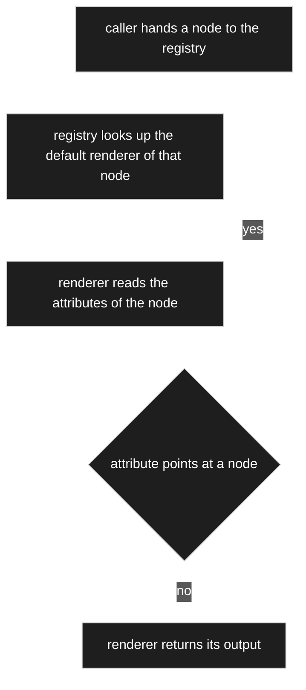

Nothing calls a renderer directly. The caller names a **node**, and the registry answers with
the renderer that node declares. A composed node therefore renders itself by handing each of
its attribute targets back to the registry — every part is drawn by the renderer that part
declares, not by the renderer of the whole. That is what makes R4 hold: a node type is
implemented once and every context reuses it.

**Open:** the descent has no stated limit — see [OQ-019](91-open-questions.md) (cycles and
depth) and [OQ-020](91-open-questions.md) (loading the subgraph without an N+1).

### R8 — one renderer, three levels

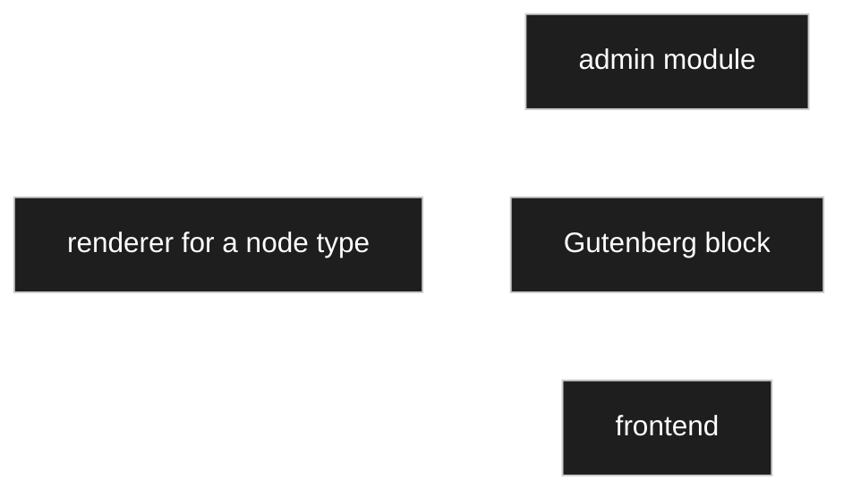

The same renderer serves all three levels; the level is a **circumstance** it is given (R9),
not a reason for a second implementation. Two circumstances are named so far: the level
itself, and **editable / not editable** (R10). `hide` (R11) is a third input, but it comes
from the node's settings rather than from the caller.

**Open:** [OQ-014](91-open-questions.md) — whether these renderers are PHP, JavaScript, or
both. R8 is the reason the question matters: the frontend and the admin module can be served
by PHP, but the Gutenberg *editor* is React by construction.

## Owner statement — 2026-08-22, third pass: the registry

| # | Statement |
|---|---|
| **R12** | The registry is the **one place** where all renderers are registered. |
| **R13** | A node carries only the **name** of its renderer. Handing the node to the registry means: look up that name, fetch the renderer. |
| **R14** | Every renderer records **which node types it is responsible for** when it registers — so the settings UI can offer a choice. |
| **R15** | **One renderer per presentation variant.** An integer node can be shown as a plain field, a spinner, or a slider: three renderers, not one renderer with three modes. |
| **R16** | Creating an attribute means choosing: the target node, composition or aggregation, a name, and optionally a **different default renderer** — the renderer choice is part of the settings. |
| **R17** | Integer and double nodes need **min**, **max** and **step** as settings. The same renderers serve both, with small deviations. |

### R12–R14 — name in, renderer out

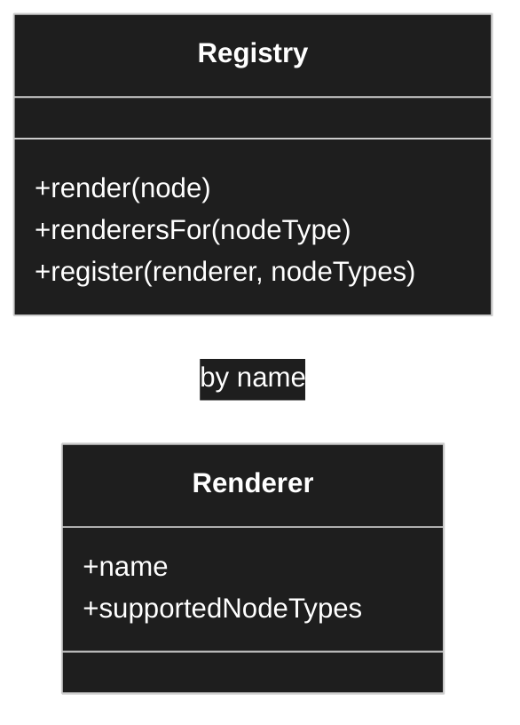

The registry serves two different questions, and R14 is what makes the second one possible:

1. **At render time** — *this node names renderer X, give me X.* A lookup by name.
2. **At configuration time** — *this node is an integer, which renderers could I choose?* A
   lookup by node type, answered from what each renderer declared when registering.

Without the second, the settings UI would have no list to offer and the choice in R16 could
not exist. This settles the *lookup* half of [OQ-005](91-open-questions.md).

### R15 — variant and circumstance are different axes

R15 and [R9](#owner-statement--2026-08-22-second-pass) look contradictory and are not. They cut
along different lines:

| | Decided by | Realised as |
|---|---|---|
| **Variant** — field, spinner, slider | the model author, in the settings | a **separate renderer** each |
| **Circumstance** — admin / block / frontend, editable / read-only, hidden | the caller and the node settings | **options inside** one renderer |

A slider is a different renderer from a spinner. A read-only slider is the same renderer as an
editable slider, given a different option. Keeping the split this way is what stops the renderer
count from multiplying: three variants × three levels × two edit modes would otherwise be
eighteen classes instead of three.

## Owner statement — 2026-08-22, fourth pass: surfaces and preview

| # | Statement |
|---|---|
| **R18** | The **tree view** consists of nodes too, so a node can be drawn in the tree by a renderer. Another renderer role. |
| **R19** | The modelling admin screen is **split in two**: the tree on the left, the settings of the selected node on the right. Concept taken from the predecessor — but **not one to one**, it is believed to contain errors. |
| **R20** | The settings side is itself a **page renderer**, and it follows special steps. Also described in the old concept, same caveat. |
| **R21** | **Every node has a preview**, assembled from its chosen renderer, with an **edit view** and a **display view**. |
| **R22** | The preview runs on **test data**, which has to be stored somewhere — for instance a separate test-data source holding sample data per node type, which the preview draws on. |
| **R23** | Switching a node's renderer, or changing a setting on the node or on its attributes, **changes the preview accordingly** — multiplicity, type, read-only, hidden, all of it. |

### R18–R20 — the surfaces are renderers, all the way up

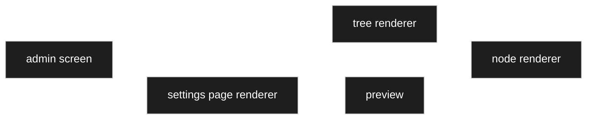

R18 and R20 extend [R1](#consequences-of-r1) further than it first looked: not only the *values*
go through renderers, but the surfaces that show them. A tree row is a rendered node; the
settings page is a rendered page. Nothing is drawn by hand anywhere.

This makes [OQ-014](91-open-questions.md) — PHP or JavaScript — larger, not smaller. The
split-screen admin with a live preview is the most interaction-heavy surface in the product,
and it is now also a renderer.

### R21–R23 — the preview is the feedback loop

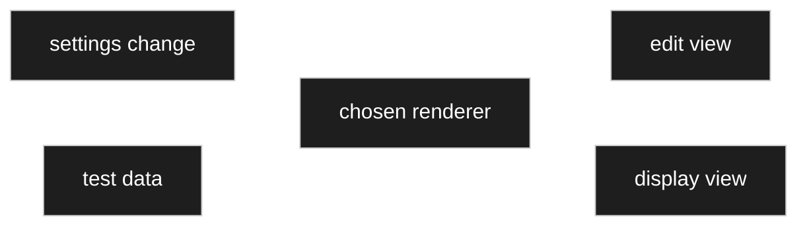

The preview is what makes the settings comprehensible: the author changes `step`, or switches
from spinner to slider, or marks an attribute hidden, and sees the result immediately in both
views. It is the reason the settings are worth configuring at all.

Two things follow that are not yet decided:

- **Where the test data lives** → [OQ-033](91-open-questions.md). It is neither model nor
  content — it is sample material per node type, and it is the first thing in this concept that
  is neither.
- **Whether the preview is a renderer or a caller** → [OQ-034](91-open-questions.md). R21 says
  it is *assembled from* the chosen renderer, which reads as a caller. But R20 makes the page
  around it a renderer, so the boundary needs stating.

## Owner statement — 2026-08-22, fifth pass: unified input, and the chooser

| # | Statement |
|---|---|
| **R24** | **Input interactions are unified.** Selecting a node happens either **inline** in the settings or **through a dialog**. Which is preferred is a setting in the admin menu; a particular place may insist on the dialog. |
| **R25** | A **chooser** is given two nodes: a **branch node**, whose subtree it shows, and a **default node**, down to whose children the tree is expanded. |
| **R26** | The user picks from those children — but may also move into any other branch that is on screen. |
| **R27** | The branch node is what scopes the choice: picking any node means the whole tree; picking a model means the *models* branch is put in front. |

### R25–R27 — one chooser, two parameters

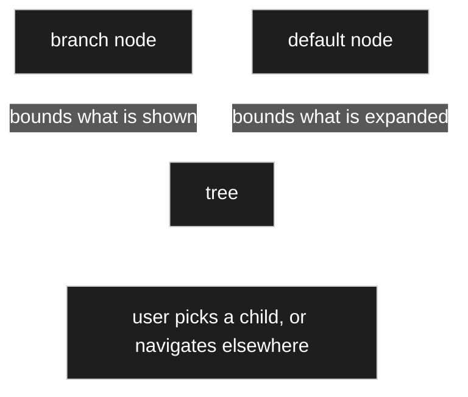

Two parameters doing two different jobs, and keeping them apart is what makes one chooser serve
every case. The **branch** decides *what the choice is about*; the **default** decides *where the
user lands*. R26 keeps the tree navigable rather than caging the user in the expanded part — the
default is a starting point, not a boundary.

Together with [R24](#owner-statement--2026-08-22-fifth-pass-unified-input-and-the-chooser) this is
[C34](10-domain-core.md) again: a configured default way of choosing, and the freedom to do
otherwise.

**Legacy note.** The previous round had a chooser design with the same two parameters under
different names, in [`../legacy/ARCHITECTURE.md`](../legacy/ARCHITECTURE.md). The owner points at
it as background and warns that **it contains wrong conclusions** — so it is a harvest candidate
and a cross-check, never an inheritance ([PR-1](../../CLAUDE.md)).

**Open:** is the chooser itself a renderer? [R1](#consequences-of-r1) says all display goes
through one, and a chooser displays a tree — which [R18](#owner-statement--2026-08-22-fourth-pass-surfaces-and-preview)
already made a renderer. → [OQ-038](91-open-questions.md).

## Owner statement — 2026-08-22, sixth pass: a control offers only real choices

| # | Statement |
|---|---|
| **R28** | If a selection has **zero or one** entry, then only that one entry or nothing can be the answer. |
| **R29** | Whether *nothing* is allowed follows from the **multiplicity**: `0..1` and `0..*` may be empty; `1` and `1..*` must always have a selection. |
| **R30** | So with multiplicity `1` or `1..*` and exactly **one** available entry, that entry is **selected and the field greyed out**. |
| **R31** | With **no** available entry there is nothing to choose and the control is **disabled**. |
| **R32** | This principle is to be held for **all inputs**, not only this one. |

### R28–R32 — the rule, complete

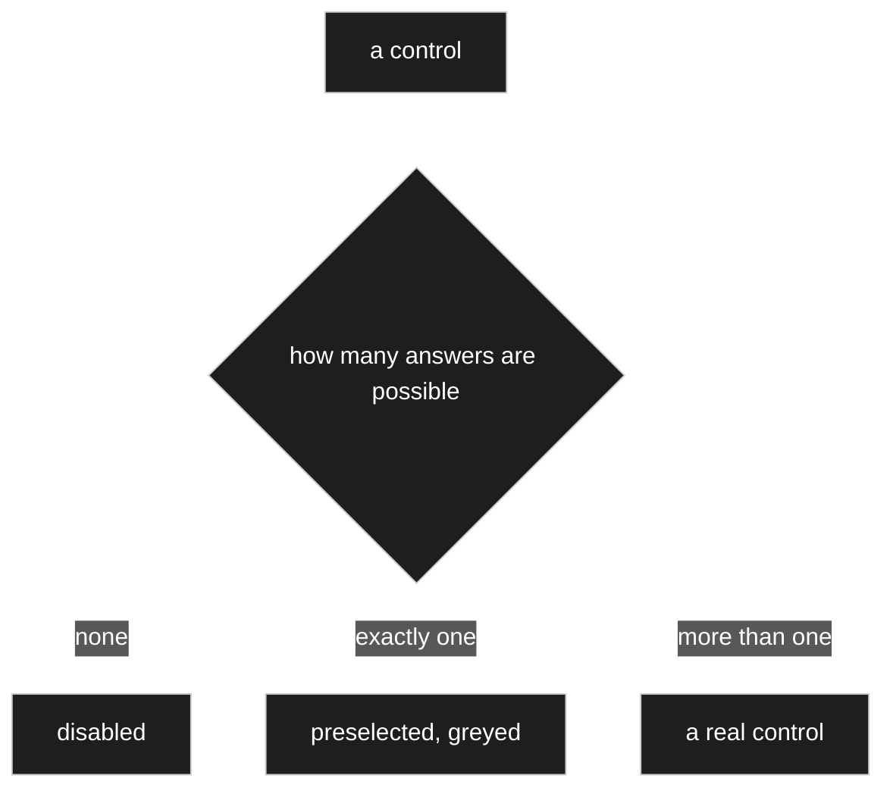

This is [D-050](90-decision-log.md) at widget scale, and the two together make one rule that runs
from a whole dialog down to a single field: **never present a decision that has already been
made by the circumstances.**

Worked out against multiplicity, since that is what decides whether *nothing* counts as an
answer:

| available entries | multiplicity | possible answers | control |
|---|---|---|---|
| 0 | `0..1`, `0..*` | 1 — only *nothing* | **disabled**, empty |
| 0 | `1`, `1..*` | **0** | ⚠️ **the model cannot be satisfied** — see below |
| 1 | `1`, `1..*` | 1 — only that entry | **preselected, greyed** |
| 1 | `0..1`, `0..*` | 2 — that entry, or nothing | **stays a real control** |
| more than 1 | any | more than 1 | ordinary chooser |

**The fourth row is where the rule must not be over-applied.** One available entry with an
optional multiplicity still leaves a genuine decision — take it or leave it — so greying it out
would remove a choice the user actually has. Only the third row is truly decided.

**The second row is not a control state at all.** Requiring at least one entry where none exists
is a model that cannot be filled in. That belongs to the modeller, as an error surfaced when the
restriction is set — the natural way to reach it is an allow-list ([D-046](90-decision-log.md))
narrowed to nothing on an attribute whose multiplicity demands one.
→ [OQ-053](91-open-questions.md).

## Owner statement — 2026-08-22, seventh pass: converters, and how many

| # | Statement |
|---|---|
| **R33** | A node **can have several converters**. |
| **R34** | One thing they could do: show a number as **binary, hexadecimal, octal or in Roman numerals**. |
| **R35** | ⚠️ *"Whether this form is really hung on as a converter, I am not sure — but we should keep it in mind. Storing the twelve is one thing, showing it as Roman twelve another."* |
| **R36** | And: *"if I say **greater than Roman twelve**, values greater than that should be shown — which ought to be no obstacle if it is stored as a decimal number underneath."* |

### R34/R35 — yes, it is a converter, by the test already agreed

[D-043](90-decision-log.md) settled the test: **a calculation produces a value that did not exist;
a converter changes the form of one that did.** `XII` and `12` are the same number written
differently — nothing gained, nothing lost. So a numeral-system converter is a converter, exactly
as gram-to-kilogram is.

### R36 — and this splits converters into two kinds

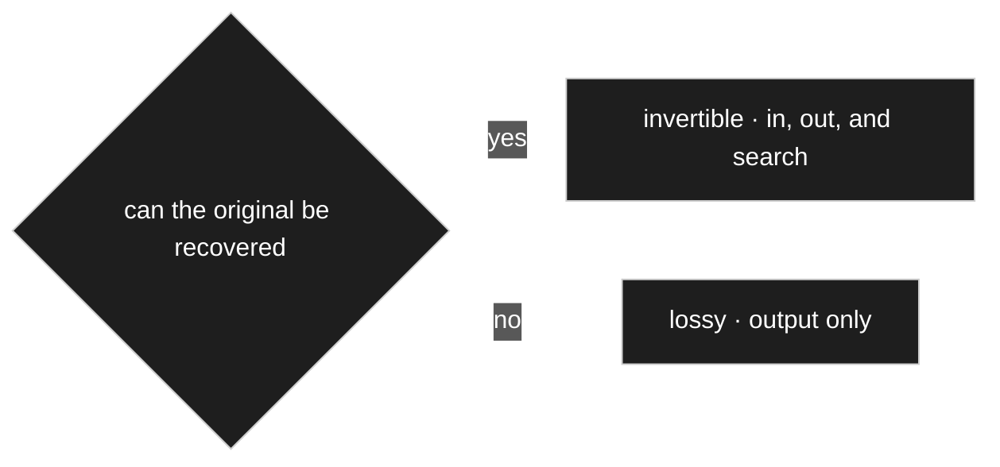

R36 asks for `> XII` in a search box to find everything above twelve. That works — and it works
because the converter runs **on the way in as well**, parsing `XII` to `12` before the query
touches the database. Which is the same bidirectional behaviour
[D-051](90-decision-log.md) already requires for units.

But not every converter can do that, and the difference has to be stated or someone will build a
search on one that cannot:

| | Examples | May serve |
|---|---|---|
| **Invertible** | gram ↔ kilogram · decimal ↔ Roman · decimal ↔ hex | display, **input**, and **search** |
| **Lossy** | rounding to two places, truncation, uppercase | **display only** |

**The consequence that matters:** rounding for display ([D-057](90-decision-log.md)) is lossy, so
**a search must never run against the rounded form**. `> 8.50 €` has to be evaluated on the stored
value, not on what the screen shows — otherwise a row displayed as `8.50` but holding `8.4999`
answers the wrong way.

### R33 — several converters, and which one applies

If a node offers binary, hexadecimal and Roman, something has to choose. That is
[D-032](90-decision-log.md) once more: the node carries a **default**, and a use site may
**override** it — the same shape as the renderer choice in [R16](#owner-statement--2026-08-22-third-pass-the-registry).

So a converter behaves like a renderer variant, not like a fixed property: registered, chosen by
setting, resolvable per use site. This also answers part of [OQ-007](91-open-questions.md), which
asked whether *one converter* was a hard limit. **It is not.**

## Owner statement — 2026-08-22, eighth pass: the descent, step by step

| # | Statement |
|---|---|
| **R37** | The registry's `render` is only an **entry point**. The registry itself neither represents nor renders anything. |
| **R38** | A basic renderer simply **receives a node**, and renders it down to the leaves. |
| **R39** | The sequence: from the node take the **renderer name** → via the **registry** get the renderer → call it for this node → it renders the node's **own properties**, context-dependent → then it reaches the node's **edges**. |
| **R40** | Each edge is rendered the same way: take the edge, see what renderer is there, render it. **So both nodes and edges must be renderable** — the owner calls this *a small break*. |
| **R41** | **If the edge carries no renderer, take the one from the connected node**, because nothing was overridden. **The highest override wins — for the renderer as for everything else.** |

### The descent

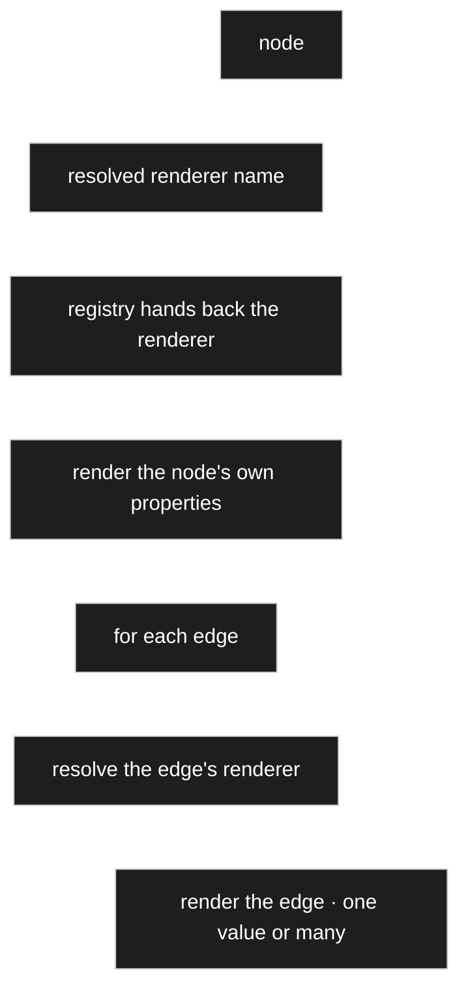

The loop closes at the target node, which starts the same walk again. Nothing else is needed to
render a whole parts list down to the last unit symbol.

### R40 — it is not a break

The unease is understandable and the structure does not share it. **A node and an edge are both an
`Identity`** ([C11](10-domain-core.md)): both can carry a resolved renderer setting, and both have
something below them to descend into. So the contract takes an identity, and *which* kind it is
only decides which renderer is registered for it — the same way `owner_id` is one column for
exactly the same reason.

Two different jobs, one interface:

| | renders |
|---|---|
| a **node** renderer | the node's own properties, then hands each edge onward |
| an **edge** renderer | the attribute — its label, and its value or **values** |

### R38 also answers R3, and better than the earlier proposal

An earlier draft had the context carry a **list of entries**, so that one renderer could serve one
node or many. That is heavier than needed. The owner's shape is simpler and lands the multiplicity
where it already lives:

**Multiplicity belongs to the edge** ([D-086](90-decision-log.md)) — so the **edge** renderer is
where one-or-many is handled. A node renderer always renders exactly one node.

### R41 — the resolution order

Reading the chain from the specific end, which is what *the highest override wins* means:

```
the edge's own setting  →  the target node's setting  →  its ancestors  →  the fallback renderer
```

That is [D-079](90-decision-log.md)'s walk, and R41 confirms it holds for the renderer choice as it
does for every other setting. Nothing separate to build.

### The contract, revised

```php
// CONTRACT
interface Renderer
{
    /** which node types or edge kinds this serves — R14, feeds the choice list */
    public function supports(): array;

    /** $subject is a node or an edge; both are identities */
    public function render(Identity $subject, RenderContext $context): RenderResult;
}
```

`RenderContext` carries the loaded subgraph ([D-014](90-decision-log.md)), the level, editable or
not, the resolved settings and the locale. `RenderResult` carries the markup and the attribute
metadata that was used ([D-021](90-decision-log.md)).

`renderTable` and `renderForm` disappear — those are **variants**
([D-018](90-decision-log.md)), so separate renderers. `IPageRendere` needs no interface of its own:
a page is a rendered node ([R20](#r18r20--the-surfaces-are-renderers-all-the-way-up)).

### One thing the descent does not yet say — [OQ-061](91-open-questions.md)

R38–R41 describe walking the **model**. But rendering real data walks the same structure while the
**values** come from a record ([D-083](90-decision-log.md)). So the descent has two inputs, not
one: the model says *what to draw*, the record says *what is in it*.

That is also what makes the preview ordinary rather than special — there the record is simply the
test data or the defaults ([D-052](90-decision-log.md)).

## Owner statement — 2026-08-22, ninth pass: two worked examples

| # | Statement |
|---|---|
| **R42** | **The preview shows both**: once editable and once not. That is a **special case** — everywhere else the mode is given by the caller. |
| **R43** | If the attribute is **read-only** there is no input. That has to be taken into account here too. |
| **R44** | **When rendering, always honour every attribute. A ground rule — no special arrangements, the same everywhere.** |
| **R45** | Rendering a type that has `int` as an attribute with `max`, `min` and `step` overridden but **not** the renderer: the edge has no renderer, so go one deeper to the node and take its renderer — and for the settings the same, taking the overridden `max`. |

### R45 — the precision this example reveals

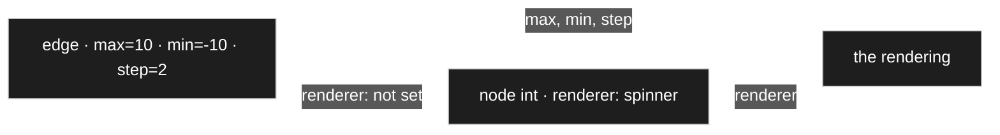

**Each key resolves on its own.** The renderer comes from the node because the edge did not
override it; `max`, `min` and `step` come from the edge because it did. The configuration that
reaches the renderer is **assembled key by key**, not taken wholesale from whichever level
happened to say something.

This is worth stating because the natural mistake is the other one — *the edge overrides something,
so take everything from the edge*. That would silently discard the node's renderer choice and
every setting the edge did not mention.

It is the same rule as sparse overrides ([D-015](90-decision-log.md)), seen from the reading side:
sparse storage only works if reading merges per key.

### R44 — the ground rule, and what it forbids

*Always honour every attribute, no special arrangements.* Concretely, a renderer that draws a value
must take account of **all** of these, every time:

`hide` · `read_only` · the chosen converter · `min` · `max` · `step` · multiplicity · the label in
the right role and locale.

Not *the ones this renderer cares about* — **all of them.** A renderer that ignores `hide` produces
a visible field that the model says is invisible, and the bug shows up somewhere else entirely.

This pairs with [D-056](90-decision-log.md): *a control offers only real choices.* One rule says
never present a decision already made; this one says never ignore what the model stated.

### R42/R43 — and R49 removes the exception again

| # | Statement (owner, 2026-08-22) |
|---|---|
| **R46** | With **multiplicity** another renderer can be named — a container: a compact row or column, a **table** renderer, a **form** renderer. |
| **R47** | It then takes the table's render function first, but for the **individual field functions** it looks **one level deeper** again. |
| **R48** | *The data say what is in it* — the two-input reading of the descent is right. |
| **R49** | **The preview needs no special arrangement.** Simply call render **twice** — once editable, once not. |

**R43 confirmed:** `read_only` removes the **input**, not the field. A read-only attribute still
appears in a form, as a locked control, because the value is still information the reader needs.

**R49 supersedes the exception R42 described.** The preview is not a mode the contract has to know
about; it is a **caller that invokes twice**. Nothing in the renderer changes, nothing branches on
*am I a preview*, and [D-095](90-decision-log.md)'s *the preview is the one place the mode is not
supplied* falls away. The mode is always supplied — the preview just supplies both, in turn.

That also closes [OQ-034](91-open-questions.md): the preview is a **caller**, not a renderer, and
[R1](#consequences-of-r1) keeps no exception.

### R46/R47 — a container renderer is the same recursion

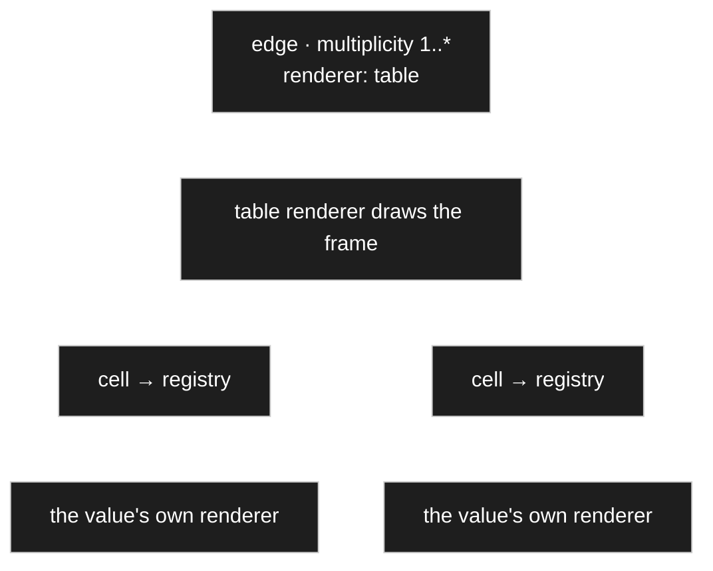

A container renderer draws the **frame** — rows, columns, the compact line — and hands every cell
back to the registry, where the value's own renderer takes over. **One level down, same walk**, so
nothing new is invented for collections.

### R50 — and the container is *not* chosen only at the edge

| # | Statement (owner, 2026-08-22) |
|---|---|
| **R50** | A container renderer is **not** only chosen on the attribute. A model — say `Bauteilliste` — is first of all a **node**, and one can say **on the node** that it should always be drawn as a table by default. |

**A correction to what stood here.** I had written *the container is chosen at the edge, because
that is where multiplicity lives.* That quietly invented a special case. Multiplicity does live at
the edge ([D-086](90-decision-log.md)) — but **the renderer choice follows the ordinary chain like
every other setting**: default on the node, override at the use site ([D-015](90-decision-log.md),
[R41](#owner-statement--2026-08-22-eighth-pass-the-descent-step-by-step)).

So `Bauteilliste` states *draw me as a table*, and any particular use of it may say otherwise.
Nothing about containers is exceptional.

### What multiplicity actually constrains

Not **where** the renderer is chosen — **which ones are eligible**. An edge with multiplicity
`1..*` needs a renderer that can draw many; a slider cannot.

So `supports()` ([R14](#r12r14--name-in-renderer-out)) declares not only the node types a renderer
serves but whether it handles one value or many, and the choice list at configuration time offers
**only renderers that fit the multiplicity**. Which is [D-056](90-decision-log.md) again — a control
offers only real choices.

### R51 — grouping renderers are not for data types

| # | Statement (owner, 2026-08-22) |
|---|---|
| **R51** | Choosing these renderers for **data-type nodes** makes no sense — they all have their own. The grouping renderers are for nodes that **do not inherit from a data type**. |

A second eligibility rule, beside the multiplicity one. A spinner belongs to an integer; a table
belongs to something with structure. Offering *render as a table* for `Integer` is noise in a
choice list that [D-056](90-decision-log.md) says should hold only real choices.

**But it needs something the concept does not yet have: a way to know what a data type is.**

The standard tree answered by **placement** — `Simple Datatypes` and `Complex Datatypes` are
branches ([harvest 01](_harvest/01-standard-tree.md)). Descending from one of them makes a node a
data type. That works, and it must not become a node name hard-coded in the engine, which the code
standard forbids.

**Proposal: the data-type root is *declared*, not hard-coded** — an installation-level setting
naming the branch or branches under which data types live ([D-079](90-decision-log.md) already
provides the place for such a setting). Configuration rather than a magic name, and a second
installation can arrange its tree differently.

**This is [OQ-048](91-open-questions.md) again**, from another direction: that question asked how
the tool knows *where data may be entered*, and it needs the same classification. Answering one
answers both — worth doing in one sitting rather than twice.

### And a cell never inherits the container's renderer

The table decides how the frame looks; each cell resolves its own, per
[D-093](90-decision-log.md)'s key-by-key rule. Table, compact row, compact column and form remain
**variants** ([D-018](90-decision-log.md)) — which is why `renderTable` and `renderForm` were right
to disappear as methods and return as renderers.

## Owner statement — 2026-08-22, tenth pass: stopping the descent

| # | Statement |
|---|---|
| **R52** | Detecting cycles is right, and the same node **should not be rendered twice**. The reference is exactly the right answer. |
| **R53** | A depth limit **can be done, but it can cause errors**: if the depth really is greater than expected, something simply is not shown and the user does not know. **A warning has to appear that the depth was exceeded.** |

### The two stops are not the same event

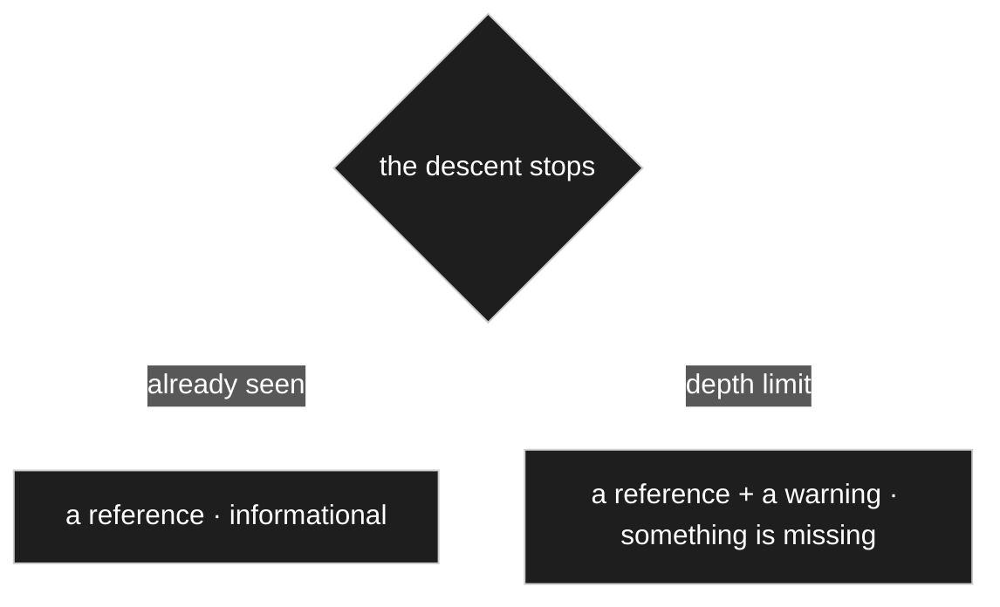

R53 draws a line I had blurred by proposing one treatment for both:

| | Means | Is it a problem |
|---|---|---|
| **cycle** | *you have already seen this* | **no** — the content is on the page, just further up. A reference is complete information. |
| **depth limit** | *there is more here and I stopped* | **yes** — the model holds something the reader is not being shown. |

So the depth stop needs more than a link: a **warning**, because the reader would otherwise have no
way of knowing that anything is missing. The cycle stop does not — nothing is missing there.

### Who sees the warning

**The author always. The visitor, depending on the level.**

| Level | Behaviour |
|---|---|
| admin, preview | the warning is **shown**, loudly — this is where it can be acted on |
| frontend | the reference is shown gracefully, and the overrun is **recorded for the author** |

A public visitor gains nothing from *maximum depth exceeded* and can do nothing about it. The
author can — and usually must, because a depth overrun means either the limit is wrong or the model
is deeper than anyone intended. It is a signal to a person who can fix it, so it has to reach that
person rather than the nearest screen.

### The rules, together

1. **Cycles are detected, not forbidden** — mutual references are ordinary modelling. Forbidden
   only for **inheritance** (meaningless) and **composition** (a whole cannot be its own part).
   ⚠️ *That prohibition is my call; correct it if aggregation is not meant to be the permissive one.*
2. **Visited identities are remembered**; meeting one again does not descend.
3. **A stop draws a reference** to where the node was already rendered — a placeholder only where
   the level cannot carry links, such as a PDF export.
4. **A depth limit exists**, as a **setting with a default** rather than a constant, so the preview
   may be stricter than the frontend.
5. **Exceeding it warns**, per the table above.

The principle underneath, which R53 sharpened: **a stopped descent is an event, not a nothing.**

### Where cycles actually come from

The owner asked, reasonably, whether cycles occur at all in a structure this hierarchical. They do
— but only through **aggregation**. Inheritance and composition cannot form one, which is why they
are the two where a cycle is forbidden outright.

**And the cycle that bites first is in the model, not in the data.**

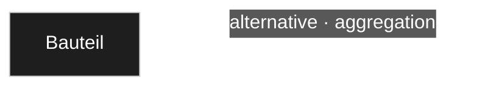

A `Bauteil` with an attribute `alternative` of type `Bauteil` makes the **structure preview**
infinite on day one, with an empty database and no record anywhere. And a self-referential type is
not a contrived requirement — the same shape carries *replacement part*, *successor type*,
*similar part*, *parent category*, *see also*, and *line manager* on a contact.

| | |
|---|---|
| **model cycle** | a type referencing its own type — hits immediately, before any data exist |
| **data cycle** | part A's alternative is B, B's alternative is A — entered perfectly sensibly |
| **BOM in BOM** | a position whose article is an assembly with its own parts list. Accidental self-containment is a **known hazard in parts management**, which is why every ERP checks for it — and here it would hit the [calculation walk](60-calculation.md) as well as the renderer |

### The owner's counter-proposal: model it as a group

Instead of `Bauteil.alternative → Bauteil`, introduce an **interchange group**: parts point at the
group, the group holds its members.

**That is the better model** — and it does **not** remove the cycle:


The loop is one hop longer, not gone. Making it acyclic would mean the group could not list its
members — and then it cannot show alternatives, which was the whole point.

**What the group form does buy** is worth keeping anyway, and it generalises:

> **A symmetric relationship — *alternative to*, *similar to*, *belongs with* — is better modelled
> as membership in a group than as pairwise links.** Pairwise links must be maintained in both
> directions and drift out of sync; membership is stated once and is symmetric by construction.

So the owner's instinct improves the model and leaves the guard exactly as necessary — which is
what they concluded.

## Owner statement — 2026-08-22, eleventh pass: the preview is the pre-flight check

| # | Statement |
|---|---|
| **R54** | The warning could be shown **in the preview**, because the preview is exactly what renders it **in advance**. |
| **R55** | In the preview the author sees **how the model will later appear on the page** — once for input and once for output. |

### This is a third job, and it outweighs the first two

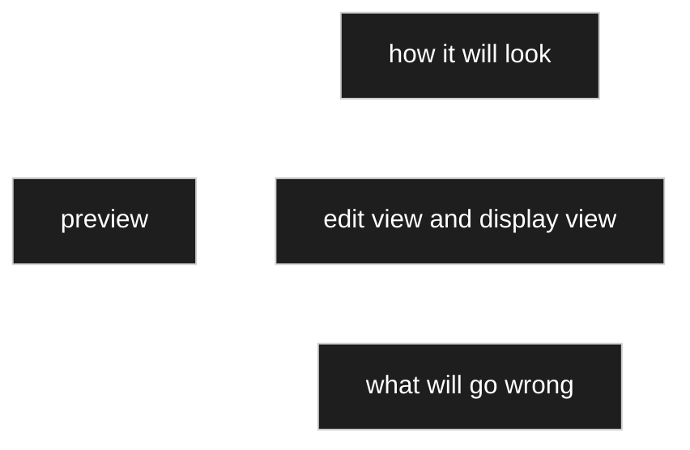

The preview was described as *see the effect of a setting* ([R21–R23](#r21r23--the-preview-is-the-feedback-loop))
and as *a caller that renders twice* ([D-096](90-decision-log.md)). R54 adds the one that matters
most: **the preview is where rendering problems are found before a visitor meets them.**

And it generalises past the depth warning. Everything the descent can run into belongs there:

| | |
|---|---|
| depth exceeded | something is being withheld |
| no renderer found for a type | the fallback is drawing it |
| a label missing in this locale | the fallback chain is being used |
| a reference that resolves to nothing | the model has a hole |

**None of these are errors that stop anything** — the renderer carries on and produces something.
That is exactly why they need a place to surface: a page that renders *almost* right, silently, is
the hardest kind of fault to notice.

### One consequence: the preview previews a *level*

If the preview is to warn about what the frontend will do, it has to render **at the frontend's
settings**. A preview with its own stricter depth limit would warn about something the frontend
handles fine — a false alarm — and a looser one would miss what the frontend will hit, which is
worse.

So the preview should let the author choose **which level** is being previewed — admin, block or
frontend ([R8](#r8--one-renderer-three-levels)). It arguably needs that anyway, since the same
model may legitimately look different in each. Then the limits arrive with the level and the
warning is accurate rather than approximate.

## Owner statement — 2026-08-22, twelfth pass: who sets the depth

| # | Statement |
|---|---|
| **R56** | It is not yet clear **where rendering — or other functions — stop**. |
| **R57** | In **Gutenberg** a depth could be given for the **table blocks** — which the old model already provided for. |

### Depth belongs to the rendering, not to the node

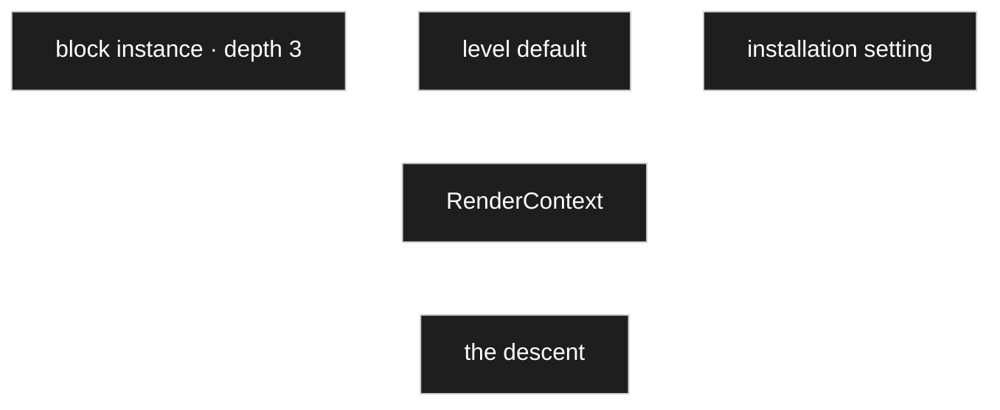

R57 settles the shape: a **block instance** carries its own depth. That is not a node and not an
edge, so it is not a model setting — it is a **block attribute**, and it reaches the renderer the
way every circumstance does, **through the context**.

So the answer to *where do we stop*: **the caller decides, and the context carries it.**

| Asked in this order | |
|---|---|
| what the **caller** passes | the block's depth setting; the preview's chosen level |
| otherwise the **level** default | frontend, block, admin |
| otherwise the **installation** setting | [D-079](90-decision-log.md) |

A node has no depth; a *rendering* of it does. Two blocks may show the same parts list two levels
deep and five levels deep on the same page, and both are right.

A node-level cap — *never draw me deeper than two* — would be possible as a model setting, but
nobody has asked for it and it is not invented here.

**And the old model had this already**, which is a harvest confirmation rather than an inheritance
([PR-1](../../CLAUDE.md)).

### R56 — and *other functions* get the opposite answer

This is the part that must not be missed:

| | May the walk stop early | Why |
|---|---|---|
| **rendering** | **yes** | the result is visibly incomplete, and [D-100](90-decision-log.md) says so with a warning |
| **calculation** | **no** | a total that stopped at depth three is not incomplete — it is **wrong**, and it looks exactly like a right one |

A truncated rendering shows less than the truth. A truncated sum **states an untruth**, in the same
typeface as a correct number, and nothing about it looks unfinished.

So the depth limit is a **rendering** concern only. The [calculation walk](60-calculation.md) needs
the **cycle** guard — without it, it never terminates — but must not carry a depth cap. If a
calculation cannot complete for any reason, its result is **not a number**: it is marked
*not computable*, and every renderer shows that rather than a value.

→ [OQ-062](91-open-questions.md), for what *not computable* looks like where a number was expected.

## Owner statement — 2026-08-22, thirteenth pass: the reference renderer

| # | Statement |
|---|---|
| **R58** | One possibility is a **manual stop at an aggregation**, by having a **reference renderer**: it does not render further, it only shows a reference. |

**This is the right shape, and it is stronger than a stopping device.**

### 1 · It bounds the *load*, not only the display

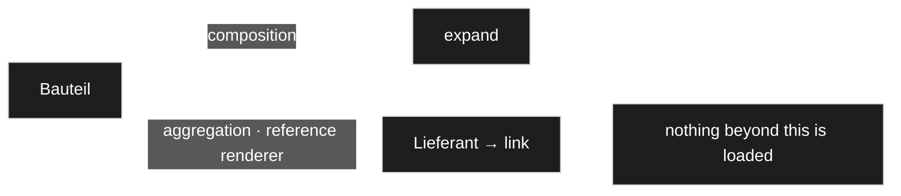

[D-014](90-decision-log.md) loads the subgraph in one batched pass — but **how far?** Without a
declared boundary the loader either guesses a depth or fetches more than it needs.

A reference renderer answers that: **behind it nothing is loaded.** The batched load becomes finite
**by design** rather than by depth guessing, and that is a bigger gain than the stopping itself.

### 2 · It expresses intent, so the guard becomes a backstop

Three ways a descent can end, and they now mean different things:

| | Meaning | Draws | Warns |
|---|---|---|---|
| **reference renderer** | *the author decided to stop here* | a reference | no |
| **cycle guard** | *you have seen this already* | a reference | no |
| **depth limit** | *there is more and I stopped* | a reference | **yes** |

The first two look the same on the page and are not the same event. In the **preview** the
automatic ones should be marked as such ([D-101](90-decision-log.md)) — the deliberate one needs no
marking, because it is what the author asked for.

### 3 · And it aligns with what the kinds already mean

This is the part worth keeping:

> **Composition expands by default; aggregation references by default.**

A composed part *belongs to* its whole, so showing the whole means showing the parts. An aggregated
target is **independent** ([C13](10-domain-core.md)) — showing a component's supplier should show
the supplier's name and a link, not unfold the entire supplier record inline.

So the kind carries its own natural presentation, and it costs nothing: it is only a **default
renderer per kind**, overridable by the ordinary chain ([D-098](90-decision-log.md)).

**And it makes cycles rare in practice.** Aggregation is the only kind that can form one
([D-100](90-decision-log.md)), and it now defaults to not descending. Cycles remain possible —
an author may override — so the guard stays. But it moves from *the thing that saves us* to *the
thing that catches a mistake*.

### R59 — a reference is not read-only, and not the only option

| # | Statement (owner, 2026-08-22) |
|---|---|
| **R59** | There are still cases where an aggregation is to be **directly selected and filled in** — the part in a parts list, for instance. |

Two things were sitting under one word and have to come apart:

| | Question | Answered by |
|---|---|---|
| **display** | how much of the target is shown | the renderer on the edge |
| **input** | **which** target is chosen | the **chooser** ([D-035](90-decision-log.md)) |

**They are independent.** An aggregation in edit mode shows a chooser — you pick the part — no
matter how little of it is displayed afterwards. *Not descending* never meant *not editable*.

### And the display is not binary either

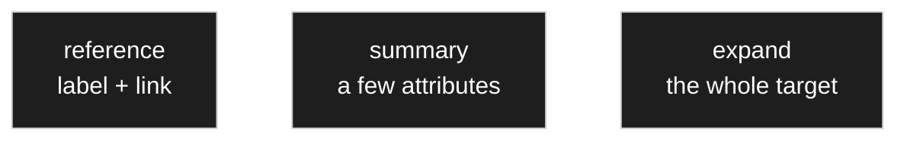

The parts-list row wants the middle one: the part's number, its name, perhaps its price — **some**
of the target's attributes, not a bare link and not the entire record. That is an ordinary
renderer choice on the edge ([D-098](90-decision-log.md)); a compact row or table renderer
([R46](#r46r47--a-container-renderer-is-the-same-recursion)) descends **one level, into selected
attributes**.

So the reference renderer is the **default**, not the rule. And it is the conservative default for
a reason worth stating: it is the only one that loads **nothing** beyond itself, so an author opts
*into* fetching more rather than having to notice they should opt out.

If it turns out that most aggregations in practice want a summary, changing the default costs
nothing — it is a default, and the ordinary chain overrides it either way.

### A convergence worth noting

A reference renderer draws the target's **label** plus a link. That is
[`display_node_name`](_harvest/01-standard-tree.md) from the previous project, which
[D-044](90-decision-log.md) already reworked into *a renderer over a node reference with a role
setting* — arrived at here from a completely different direction, for a completely different
reason.

## Owner statement — 2026-08-22, fourteenth pass: the chooser

| # | Statement |
|---|---|
| **R60** | A chooser is **in principle also a renderer**, but it has more functions — at least two render forms: **inline**, and **button plus popup**. |
| **R61** | ⚠️ *"The popup is, I think, not quite render-conform — unless we make it a part of it, an inline/popup context option."* |

### R60 answers [OQ-038](91-open-questions.md): yes, a renderer

Nothing about a chooser sits outside the contract. It renders an identity, it takes a context, it
returns markup — and it already has its two parameters from [D-035](90-decision-log.md): a **branch
node** and a **default node**. Those arrive the way every other input does, through the context.

### R61 — why the popup felt wrong, and why it is not

The unease is real and points at something true: **a renderer returns a string** (`CD-8`), and a
popup is not a string, it is a behaviour — open, search, select, close.

The resolution is [D-021](90-decision-log.md), which already drew this line for a different reason:

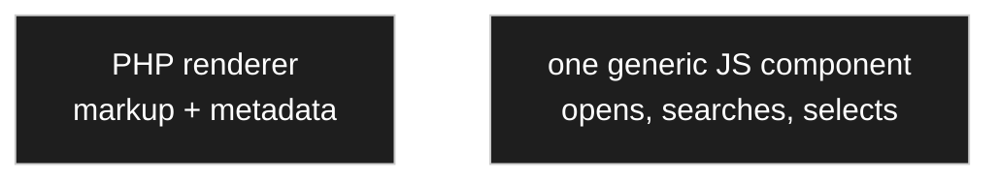

The renderer produces the **markup** — a button, and the metadata the behaviour needs: which
branch, which default, which allow-list, what multiplicity. A **single generic** JavaScript
component supplies the interaction, driven by that metadata.

**So a renderer may have a behaviour partner, and the partner is generic.** That is not an
exception to [D-021](90-decision-log.md) — it *is* D-021: JavaScript is used where interaction
requires it and never re-implements a renderer, and it is metadata-driven so no node type ever
needs its own.

## Owner statement — 2026-08-22, fifteenth pass: two chooser renderers

| # | Statement |
|---|---|
| **R62** | **Two separate renderers** — an inline chooser and a popup chooser — and the author states which makes sense in a given place. |
| **R63** | If the selectable set has **no children — only one level** — it is really a **selection list**, and the renderer should show it that way. **One level → list, several levels → tree view.** That is a property of the renderer, not a new one. |
| **R64** | The **initial node handed in** — the branch root — **does not normally count** as a choice. Open whether that must be configurable or is a general rule. |

### R62 — and both of my objections were wrong

I recorded inline-versus-popup as a **setting** and wrote that
[D-018](90-decision-log.md)'s variant rule *could not cleanly decide it*. The owner chose two
renderers. Re-checking, **the rule decides it fine and my two objections do not hold:**

| My objection | Why it fails |
|---|---|
| *two entries in the choice list for one logical thing* | That is equally true of field, spinner and slider, and it was accepted there without complaint. Not an objection, just unfamiliarity. |
| *an installation-wide preference is awkward, a renderer choice is per node or edge* | [D-079](90-decision-log.md) puts the installation at the head of the settings chain, and the renderer choice **is** a setting. An installation-level default renderer works exactly like any other default. |

So this is an ordinary application of D-018 — completely different presentation, separate
renderers — and the *decided on use rather than on the rule* note is withdrawn. The rule was
sound; I had talked myself out of it. **Inline remains the default**, now as the default
*renderer* rather than the default *option*.

### R63 — list or tree is derived, not chosen

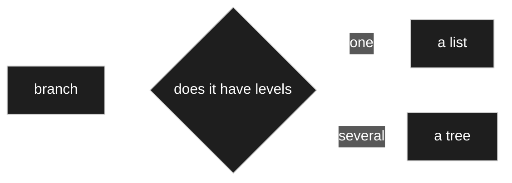

**Not a third renderer, and not a setting either — it follows from the branch.** A tree control
for a flat set is furniture with nothing to do, which is [D-056](90-decision-log.md) again:
a control offers only what is really there.

This is also why `Konstanten › Bauformen` never needed to be a special *choice list* type — it is
an attribute whose branch happens to be one level deep ([D-041](90-decision-log.md)), and the
chooser simply draws it as a list.

### R64 — the branch root: a rule with a setting

`Gewicht.einheit → Masseneinheit` should offer *Gramm*, *Kilogramm* — not *Masseneinheit* itself.
So the general rule is **the root does not count**.

But it is not always so. A department chooser rooted at the company may legitimately allow the
company itself; a category tree may allow the top category. Both are real.

**Recommendation: general rule that the root is excluded, plus a setting to include it.** One
boolean that sits at its default almost everywhere — and [D-050](90-decision-log.md) is satisfied
because it is a default, not a question anyone is asked.

⚠️ **Why not derive it:** the tempting rule is *a node with children is a category, a leaf is a
choice*. That works for units and breaks immediately for organisational units, where a department
with sub-departments is still a valid answer. Deriving it would be elegant and wrong.

### Inline or popup — the earlier reasoning, now superseded

**A setting on the chooser**, per [D-034](90-decision-log.md), and **the default is inline** (owner,
2026-08-22). The preferred way is configured at
installation level and a particular place may insist on the dialog. Exactly the option R61
proposes.

But it is worth admitting that [D-018](90-decision-log.md)'s line — *completely different
presentation is a separate renderer, a parameterisable detail is a setting* — **does not cleanly
decide this one.** An inline tree and a button are quite different markup, so the variant reading
is defensible.

D-034 settles it on a practical criterion instead:

| | If separate renderers | If a setting |
|---|---|---|
| the author picks | *chooser-inline* or *chooser-popup* from the renderer list | *chooser*, then how it opens |
| an installation-wide preference | awkward — a renderer choice is per node or edge | natural — one setting, overridable per place |
| the choice list | two entries for one logical thing | one |

The rule was not able to decide it; the use was. Recorded rather than smoothed over, because the
next borderline case will be decided the same way and someone should know that.

## Owner statement — 2026-08-22, sixteenth pass: the multi-step input

| # | Statement |
|---|---|
| **R65** | The **multi-step renderer**: the user first chooses a node, then has to enter data for that node. Changing the selection calls the **tree chooser** again. |
| **R66** | The row of the model to be filled in then appears, driven by JavaScript. |
| **R67** | **Two possibilities at that point: enter, or search among what already exists.** Before creating something new one must always check whether it is already there. |

### The shape

```mermaid
---
config:
  theme: dark
  themeVariables:
    mainBkg: "#1e1e1e"
    background: "#1e1e1e"
    primaryColor: "#1e1e1e"
    classText: "#ffffff"
    textColor: "#ffffff"
    lineColor: "#ffffff"
---
flowchart LR
    A[chooser · pick the type] --> B[the model's row appears]
    B --> C[search existing]
    B --> D[enter new]
```

Step one is the chooser ([D-035](90-decision-log.md), [D-108](90-decision-log.md)), reusable and
re-openable. Step two is the ordinary editor ([D-029](90-decision-log.md)) rendering the chosen
type's attributes, metadata-driven so no type needs its own JavaScript
([D-021](90-decision-log.md)). Nothing new so far — R65 and R66 are existing parts in sequence.

### R67 is the new part — and the rule should not rely on discipline

*Before creating something new, always check whether it already exists.* Left as an instruction to
the user, that rule is broken every busy afternoon.

**Proposal: the create form *is* the search field.** As the author types the identifying values,
matching existing records appear beneath. *Create new* is offered when nothing matches, or
explicitly as a second action — never as the only visible path.

The check then happens because it cannot be skipped, not because someone remembered. Same spirit
as [D-050](90-decision-log.md): the system does what it can do itself rather than asking a person
to be careful.

### R68–R72 — and most of the gap closes itself

| # | Statement (owner, 2026-08-22) |
|---|---|
| **R68** | The search runs on the **human-readable values** — enter *10 kilo* and find the resistor that already has *10 kilo*, and it need not be entered again. |
| **R69** | The input is treated with a **wildcard before and after** — a *contains* search. |
| **R70** | A part may hold many more attributes, **but not all of them need to be visible**. Which fields of an aggregation or composition are shown is a choice, exactly as with allowing sub-nodes. |
| **R71** | **And those visible fields are the general search criteria.** |
| **R72** | Open: what happens to the remaining fields when it comes to real input — and there a **popup** is probably unavoidable, or should be planned for anyway, since the search itself is already complex. |

### R70/R71 — the shown fields are the searched fields

```mermaid
---
config:
  theme: dark
  themeVariables:
    mainBkg: "#1e1e1e"
    background: "#1e1e1e"
    primaryColor: "#1e1e1e"
    classText: "#ffffff"
    textColor: "#ffffff"
    lineColor: "#ffffff"
---
flowchart LR
    S["summary renderer<br/>picks the columns"] --> D[shown in the row]
    S --> Q[searched against]
```

**This answers the hardest part of [OQ-063](91-open-questions.md) without a new setting.** The
columns a summary renderer already chooses ([D-106](90-decision-log.md)) do a second job: they are
what a person reads to recognise the record, so they are what the search should match. Show article
number and name in the parts-list row, and those are what you type into.

**One caveat, and a safety net.** The shown fields are per **use site**, so the same type could be
searched differently in two places. Usually right — context-appropriate — but duplicate
*prevention* wants consistency. So: **the visible fields are the default search fields, and a type
may declare its own identifying set** that applies wherever it is used. The default covers the
common case; the declaration exists for types where it genuinely matters, such as an article
number.

### R69 — contains-matching, and what it costs

*10 kilo* has to find *10 kilo*, and `BC547B` should find `BC 547 B`. A wildcard on both sides is
the right call.

**It has a price worth naming now rather than discovering later:** a `LIKE '%x%'` cannot use an
ordinary index. On a catalogue of a few hundred parts nobody notices; on tens of thousands it is a
table scan on every keystroke.

So the search fields need their own structure — a full-text index, or a normalised search column
holding the values stripped of spacing and punctuation, which is also what makes `BC 547 B` match
`BC547B` at all. → [OQ-064](91-open-questions.md).

### R72 — inline for searching, popup for creating

Both, and split along what each actually needs:

| | Where | Why |
|---|---|---|
| **search** | inline | you are filling a row; typing and picking keeps the flow, and a popup per row is tedious |
| **create** | popup | a new part with fifteen attributes cannot live in a row |

And it is [D-032](90-decision-log.md) again, so it need not be absolute: a configured default with
the freedom to insist on the popup where a place calls for it.

### And what remains of the gap — [OQ-063](91-open-questions.md)

**Matching against what?** Nothing in the concept says which attributes identify a record.

[D-022](90-decision-log.md) settles that the *base name* is not unique and nothing resolves on it —
that stands, and it is about **hard** identity, which is the `id`. What R67 needs is **soft**
identity: the human-meaningful values by which a person would recognise *this is the same part* —
an article number, or manufacturer plus type designation together.

The two must not be confused. A duplicate search that **warns** is right; a uniqueness constraint
on the base name would contradict D-022.

## Owner statement — 2026-08-22, seventeenth pass: the order in which a node lays itself out

| # | Statement |
|---|---|
| **R73** | There were rules for **when what is rendered** — in which order a node's properties appear. The same rules hold for the **admin background, Gutenberg and the frontend**. |
| **R74** | **First the single values, then those with higher multiplicity.** |
| **R75** | Within the single values: first the **fixed values the user cannot change** — not shown at every level, but **at least in the admin**; then the **ordinary fields and settings**; then, **collected**, the **boolean values** — tick boxes, drawn as switches at the time. |
| **R76** | The booleans run **along a row as far as it fits, then the next row** — but still **column-aligned**, so it looks tidy. |

### The default layout

```mermaid
---
config:
  theme: dark
  themeVariables:
    mainBkg: "#1e1e1e"
    background: "#1e1e1e"
    primaryColor: "#1e1e1e"
    classText: "#ffffff"
    textColor: "#ffffff"
    lineColor: "#ffffff"
---
flowchart TD
    A["1 · read-only values"] --> B["2 · ordinary fields"]
    B --> C["3 · booleans, collected"]
    C --> D["4 · multi-valued attributes"]
```

**Why this order is right**, written down so nobody improves it away later:

| | |
|---|---|
| **read-only first** | they are *context* — what you are looking at — not something to fill in |
| **single before multiple** | a table or list is visually heavy and breaks the reading flow; after the scalars, a form stays scannable |
| **booleans collected** | one switch per row wastes the row; together they read as one set of options |
| **multi-valued last** | it is where the eye is meant to settle, and it may be arbitrarily tall |

### How it fits with the author's own ordering

`position` on the edge orders siblings ([D-082](90-decision-log.md)). If the layout rule simply
regrouped everything, an author who ordered attributes carefully would find them rearranged.

**So: the rule defines the groups, and `position` orders *within* a group.** Both survive — the
form stays tidy and the sequence stays the author's.

And because it is [D-032](90-decision-log.md), the grouping is a **configured default**: a renderer
or a use site may switch to strict author order, for the case where a boolean genuinely belongs
between two text fields and moving it to the end would break the sense.

### R75's level dependency

*Not shown at every level, but at least in the admin* is a **circumstance**
([R9](#owner-statement--2026-08-22-second-pass)), not a new mechanism: read-only values default to
visible in the admin and hidden in the frontend, and `hide` overrides that wherever it matters.

### Consequences of R1

R1 is a constraint on the whole codebase, not just on this document: any admin screen, block,
table, form, export or REST response that shows model data has to go through the renderer
contract. Worth writing as an explicit invariant once the contract exists, because it is the
kind of rule that erodes quietly.

### R3 is the open one

Whether the unit of rendering is one node or a set decides the shape of the interface. The
seed sketch in [`RendererMeremaid.md`](RendererMeremaid.md) hedges — it declares
`canRender(IRenderable render_list[])` and `render(IRenderable render_list[], bool displayOnly)`
on arrays, but the PHP sketch writes `renderSingle(IRenderable object)` and
`renderCollection(...)` as separate methods. Both readings are present; one has to win.
→ [OQ-006](91-open-questions.md).

## What belongs here

- The renderer interface and its contract.
- The registry: how renderers are registered and looked up (by node type, by renderer type).
- Fallback behaviour when no renderer matches.
- Single node vs. set of nodes; list/table vs. form.
- Display-only vs. editable mode.
- **Converter**: what it may change on the way out, and whether it also runs on the way in.
- **Validator**: the check contract, plus the *offer a correction* capability (V9).

## What does NOT belong here

- Concrete Gutenberg block implementations — those are consumers of this contract.
- Which settings a renderer reads. That is [10 Domain core](10-domain-core.md).

## Harvest candidates

| Source | What is in it |
|---|---|
| [`RendererMeremaid.md`](RendererMeremaid.md) | Seed: `IRenderer`, `RendererRegistry`, `IRenderable`, `IPageRendere`, PHP sketches. Contains duplicate classes and PHP-invalid overloads — [OQ-005](91-open-questions.md), [OQ-006](91-open-questions.md). |
| `../../.cursor/rules/bindings-rules-fixes.mdc` | Old *bindings → rules → optional fixes* pattern — the direct ancestor of V9's validator-with-correction. |
| [`../legacy/ARCHITECTURE.md`](../legacy/ARCHITECTURE.md) | Presentation surfaces; how views were meant to line up. |
| [`../legacy/plans/blocks-lane.md`](../legacy/plans/blocks-lane.md) | Blocks as views over the same model. |
