# Renderer

> **Status: `draft`.** Contains owner statements of 2026-08-22, written down but **not yet
> confirmed**. Legacy material has not been harvested into this document yet.
>
> **Caught up 2026-08-23** with the decisions taken after the first draft. The ones that changed
> the shape of this document: **purpose** as part of the context and of the registry key
> ([D-168](90-decision-log.md)), the descent taking a **model and a record**
> ([D-159](90-decision-log.md)), the preview rendering a **test data pack**
> ([D-160](90-decision-log.md)), the **search** surface ([D-167](90-decision-log.md)), the
> **detail view** being no special screen ([D-190](90-decision-log.md)), **front-end blocks**
> of one node each ([D-206](90-decision-log.md)) and the **comparison block**
> ([D-207](90-decision-log.md)). Also folded in: [D-091](90-decision-log.md)–[D-118](90-decision-log.md),
> [D-126](90-decision-log.md), [D-128](90-decision-log.md), [D-136](90-decision-log.md),
> [D-144](90-decision-log.md), [D-147](90-decision-log.md)–[D-150](90-decision-log.md),
> [D-157](90-decision-log.md), [D-158](90-decision-log.md), [D-166](90-decision-log.md),
> [D-181](90-decision-log.md), [D-201](90-decision-log.md), [D-202](90-decision-log.md).
>
> **Caught up a second time 2026-08-23** with [D-217](90-decision-log.md)–[D-258](90-decision-log.md).
> **Six of those reverse a position this document had stated**, so they are corrected *in place*
> rather than appended underneath — an appended correction leaves the old sentence readable as if
> it still held, which is how a document comes to carry two answers at once
> ([D-222](90-decision-log.md)):
>
> | Corrected in place | This document said | It now says |
> |---|---|---|
> | [D-236](90-decision-log.md) | one node, **one** renderer, with a decorator beside it ([D-224](90-decision-log.md)) | a node carries an **ordered list** of renderers — one mandatory, further ones appended. The decorator is no longer a configuration concept |
> | [D-217](90-decision-log.md) | purpose is part of the **registry key** ([D-168](90-decision-log.md)) | purpose travels in the **context**; a renderer declares which purposes it serves through `supports()` |
> | [D-226](90-decision-log.md) | invertible **replaces**, non-invertible **decorates** ([D-225](90-decision-log.md)) | invertibility decides only whether a form can be **written into**. Replace or decorate is a free choice at the use site |
> | [D-232](90-decision-log.md) | **multiplicity** decides where a value is stored ([D-133](90-decision-log.md)) | the **branch** decides: primitives inside the record by path, compositions own records, `Model` an external reference |
> | [D-244](90-decision-log.md) | the chooser defaults to **inline** ([D-108](90-decision-log.md)) | it defaults to the **dialog**; inline stays available for the simple case |
> | [D-256](90-decision-log.md) | *one value a field, several a table* is a rule of the **composite** renderer ([D-255](90-decision-log.md)) | it belongs to the **node** renderer — and node renderer and page renderer are the same renderer |
>
> Also folded in: [D-218](90-decision-log.md) (read-only renders under **display**),
> [D-219](90-decision-log.md)/[D-220](90-decision-log.md) (a representation is converter plus
> renderer; the composed type is the unit of rendering), [D-223](90-decision-log.md) (automatic is
> a default, never a fact), [D-227](90-decision-log.md) (the rule counts **possibilities**),
> [D-229](90-decision-log.md)/[D-230](90-decision-log.md) (the medium),
> [D-231](90-decision-log.md) (the preview shows the front end),
> [D-233](90-decision-log.md)–[D-235](90-decision-log.md) (page, block, eligibility),
> [D-237](90-decision-log.md) (identifying fields belong to the type),
> [D-238](90-decision-log.md) (the leaves-only default reversed),
> [D-240](90-decision-log.md) (three layers feed a preview),
> [D-243](90-decision-log.md) (a report is selection + grouping + expression),
> [D-245](90-decision-log.md)/[D-246](90-decision-log.md) (`set` and `table` retired),
> [D-251](90-decision-log.md) (the tree shows the icon),
> [D-253](90-decision-log.md)/[D-254](90-decision-log.md) (three surfaces; blocks render on the
> server on every request) and [D-257](90-decision-log.md) (a page-local block override).
>
> ✔ **The fifteen contradictions raised while catching this document up are all resolved**, and
> every ⚠️ below that pointed at
> [`_harvest/contradictions.md`](_harvest/contradictions.md) now names the decision that settled
> it. Where this text and a decision still disagree, the disagreement is **not** resolved here —
> it goes back into that sheet for the owner ([PR-4](../../CLAUDE.md)).

## Purpose

Define how a node becomes visible output: the renderer contract, how a renderer is chosen for
a node, what a render is **for**, and how single nodes and sets of nodes differ. Also covers the
**converter** and **validator** contracts, which sit on the same pipeline.

**Why this document exists at all.** A composed type is a small model and a model is a large
type — nothing in the engine tells them apart ([D-042](90-decision-log.md)). If that is so, then
entering and showing one deeply composed thing *is* the hard problem, and
[R1](#consequences-of-r1) is the answer to it.

## Owner statement — 2026-08-22

| # | Statement |
|---|---|
| **R1** | **Display happens only through a renderer.** No other path produces output. This is a hard rule. |
| **R2** | There are several renderers, producing different representations of the same thing. |
| **R3** | A renderer always receives **a node** — or possibly **a set of nodes**. ⚠️ *Explicitly stated as not yet certain.* |

Related, from [Vision and scope](00-vision-and-scope.md):

- **V8** — essentially every node has one renderer, one converter, and one or more validators.
- **V9** — a validator may, at the same time, offer a way to correct the invalid data.

## Owner statement — 2026-08-22, second pass

| # | Statement |
|---|---|
| **R4** | There is a renderer for **every** kind of display. The point is that **no display logic is implemented twice**. |
| **R5** | A renderer may work with trees and **call other renderers**. |
| **R6** | A node is handed to the **registry**, not to a renderer directly. The registry looks up the node's **default renderer** and that renderer renders the node. |
| **R7** | The renderer then reads the node's **attributes**. Attributes point at nodes; those nodes have their own renderers, which render them. The descent repeats. |
| **R8** | Three display levels: the **admin module** (where models are rendered), **Gutenberg blocks** (fill data, make it available to the site), and the **frontend** (display, and possibly user input). |
| **R9** | A renderer — an integer renderer, say — must carry **options for these different circumstances**. |
| **R10** | Every renderer must support **editable / not editable**. |
| **R11** | A renderer must honour whether a node is **visible** (`hide`), as set on the attributes. |

### R6, R7 — how a node finds its renderer, and how the descent works

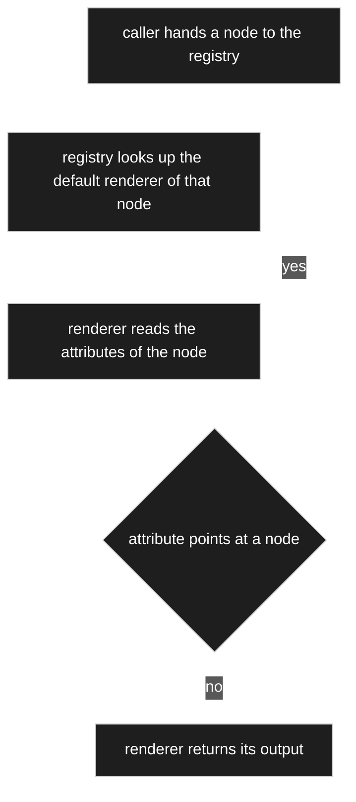

Nothing calls a renderer directly. The caller names a **node**, and the registry answers with
the renderer that node declares. A composed node therefore renders itself by handing each of
its attribute targets back to the registry — every part is drawn by the renderer that part
declares, not by the renderer of the whole. That is what makes R4 hold: a node type is
implemented once and every context reuses it.

**Both openings here have since been answered.** The descent's limit — cycles and depth —
is settled by [D-100](90-decision-log.md) and worked out under
[R52/R53](#owner-statement--2026-08-22-tenth-pass-stopping-the-descent); loading the subgraph
without an N+1 is settled by [D-014](90-decision-log.md): the subgraph and every settings row it
touches are loaded in a small fixed number of batched queries **before** rendering begins, and
the renderer never touches the database.

### R8 — one renderer, three levels

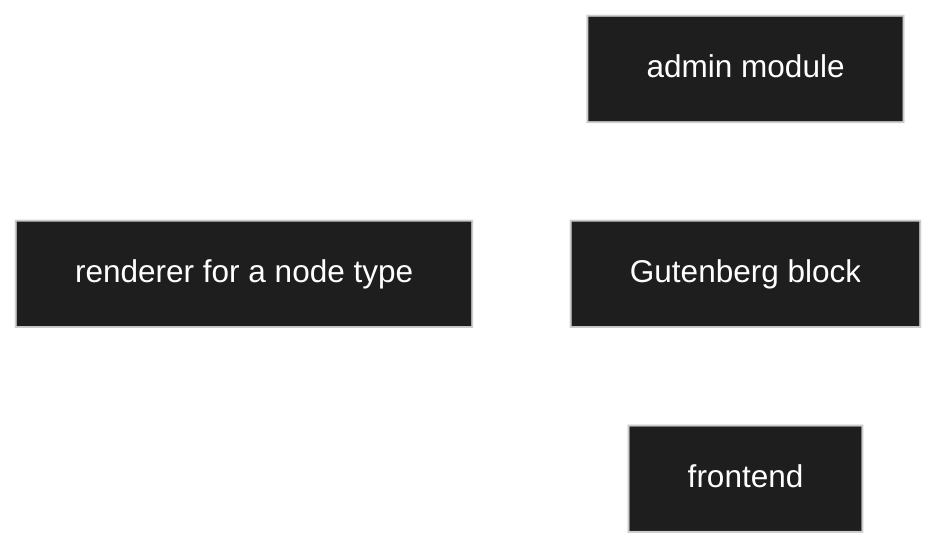

The same renderer serves all three levels; the level is a **circumstance** it is given (R9),
not a reason for a second implementation. Two circumstances are named so far: the level
itself, and **editable / not editable** (R10). `hide` (R11) is a third input, but it comes
from the node's settings rather than from the caller.

**Answered:** [D-021](90-decision-log.md) settles what was [OQ-014](91-open-questions.md).
**Renderers are PHP**, and they serve all three levels, all three of which WordPress renders in
PHP by convention. JavaScript is used only where interaction requires it and **never
re-implements a renderer**. Because the Gutenberg editor is React by construction, its editing
controls are **metadata-driven**: the editor receives a node's attributes with their types and
settings and draws them with one generic control set, so a new node type costs no JavaScript.
That is why `RenderResult` has to carry the attribute metadata a renderer used, not only
finished markup. Frontend interactivity uses the WordPress Interactivity API on server-rendered
markup.

**What each of the three levels is *for* was settled later** — [D-253](90-decision-log.md), worked
out at [R76d](#r76d--three-surfaces-three-jobs). The short form: the admin says what a thing **is**,
the block says what a page **shows**, and the front end draws what the block names and owns nothing
of its own.

### R9a — purpose is the fourth thing the context carries, and searching is one of them

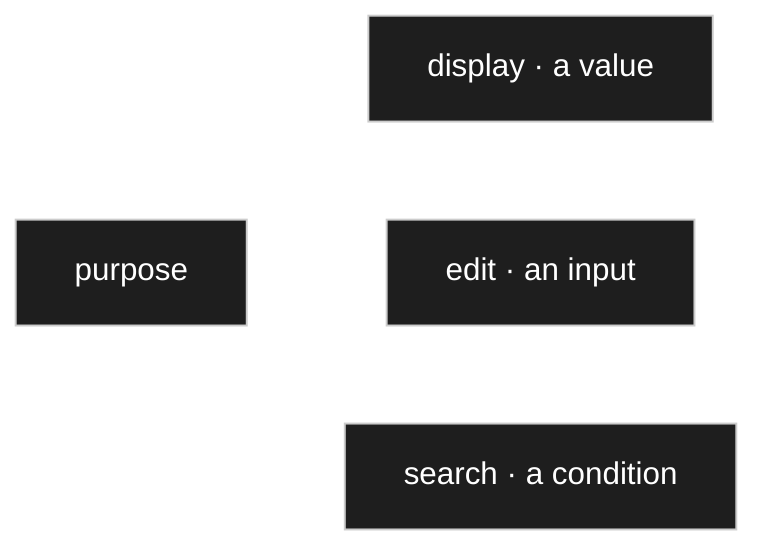

[D-168](90-decision-log.md) adds **purpose** to the render context. Two of the three were already
distinguished in all but name — **display** and **edit**, which the renderer options carry as
*editable / not* ([R10](#owner-statement--2026-08-22-second-pass)). **Search** is the third, and
it is the one that was missing.

⚠️ **Corrected in place.** This unit used to add a second sentence: *and it makes purpose part of
the **registry key**, so a renderer is looked up by type **and** purpose.*
[D-217](90-decision-log.md) supersedes that half of [D-168](90-decision-log.md). A key of type ×
purpose implies a node holding three renderers at once, one per purpose, and the owner ruled it
out: **a node cannot have several renderers at the same time.** Purpose stays where the valuable
half of D-168 put it — **in the context** — and a renderer declares which purposes it can serve
through `supports()`. See [R14a](#r14a--the-key-is-the-type-purpose-travels-in-the-context).

**Why the search surface is a purpose rather than a widget of its own.** Which operators make
sense depends on the **type** — text has *contains* and *begins with*, a number has *greater*
and *between*, a date has *before* and *after* — and that knowledge already sits with the type's
renderer and converter. A separate search surface would be a second place that knows what a
number is, and the two would drift.

Three consequences, all from [D-168](90-decision-log.md):

| | |
|---|---|
| **A search renderer returns a condition, not a value** | operator plus operand, which feeds the generic query builder ([D-165](90-decision-log.md)) directly. The filter's operator field is therefore not a component of its own — it is *what a text renderer looks like when its purpose is search*. |
| **The offered operators are declared at the type** | once, beside the converter. Never a switch on a type name, which [`CD-9`](../../CLAUDE.md) and the *no special-casing* rule forbid outright. |
| **Not searchable needs no special case** | a backward-read computed value ([D-140](90-decision-log.md)) is calculated at read time and stands in no index, so its renderer simply **does not declare `search`** and the attribute never appears in the filter ([D-217](90-decision-log.md)). A missing **capability**, not a missing registration. No greyed-out option, no error message. |

**The price D-168 named has been paid off rather than paid.** It said the lookup now takes type
**and** purpose and therefore needs a **fallback** — the edit renderer plus the type's default
operators where no search renderer is registered — or every type would need three renderers before
anything worked. With the key back down to the type ([D-217](90-decision-log.md)) there is nothing
to fall back *from*: one renderer is asked, and it either serves the purpose or the purpose is not
offered. What remains is the last-resort renderer, and that is a **fault indicator**, not a floor —
see [R14b](#r14b--the-last-resort-renderer-is-a-fault-indicator-not-a-floor).

✔ **What purpose does to the display/edit split is now settled.**
[R15](#r15--variant-and-circumstance-are-different-axes) classifies *editable / read-only* as a
**circumstance** — an option inside one renderer — and [D-096](90-decision-log.md) has the preview
call the same renderer twice. Both stand untouched, because purpose never became a key
([D-217](90-decision-log.md)). The knock-on question — what a read-only attribute gets inside an
edit form — is answered by [D-218](90-decision-log.md) at
[R9b](#r9b--read-only-renders-under-the-display-purpose).

### R9b — read-only renders under the display purpose

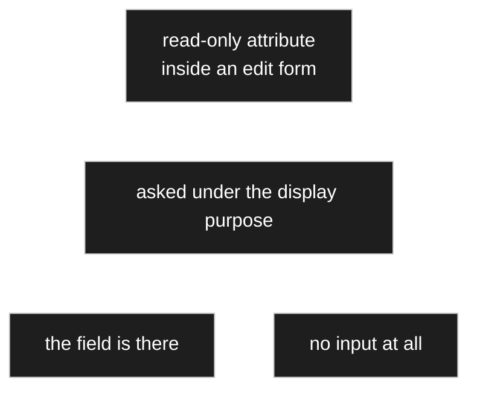

[D-218](90-decision-log.md). Asked whether a read-only attribute in an edit form gets the *edit*
purpose with its input suppressed, the owner was unambiguous: **no input at all** — *I fixed that
as the tree builder, and then there is no input there.* So the purpose asked for is **display**,
and [D-095](90-decision-log.md) stands unchanged: `read_only` removes the **input**, not the
**field**. A form is therefore not uniformly one purpose — it is a series of attributes, each
asked for the purpose its own configuration earns.

**And the same decision adds a check nobody asked for.** A read-only attribute with **no
calculation** and **no default** can never hold anything: it is a dead field that looks like part
of the form. It is reported as a **model conflict** ([D-054](90-decision-log.md)) at the moment it
is configured ([D-050](90-decision-log.md)), naming the two repairs — **set a default**, or
**remove the read-only**. That is [V9](00-vision-and-scope.md)'s offered correction turned on the
model itself rather than on data.

## Owner statement — 2026-08-22, third pass: the registry

| # | Statement |
|---|---|
| **R12** | The registry is the **one place** where all renderers are registered. |
| **R13** | A node carries only the **name** of its renderer. Handing the node to the registry means: look up that name, fetch the renderer. |
| **R14** | Every renderer records **which node types it is responsible for** when it registers — so the settings UI can offer a choice. |
| **R15** | **One renderer per presentation variant.** An integer node can be shown as a plain field, a spinner, or a slider: three renderers, not one renderer with three modes. |
| **R16** | Creating an attribute means choosing: the target node, composition or aggregation, a name, and optionally a **different default renderer** — the renderer choice is part of the settings. |
| **R17** | Integer and double nodes need **min**, **max** and **step** as settings. The same renderers serve both, with small deviations. |

### R12–R14 — name in, renderer out

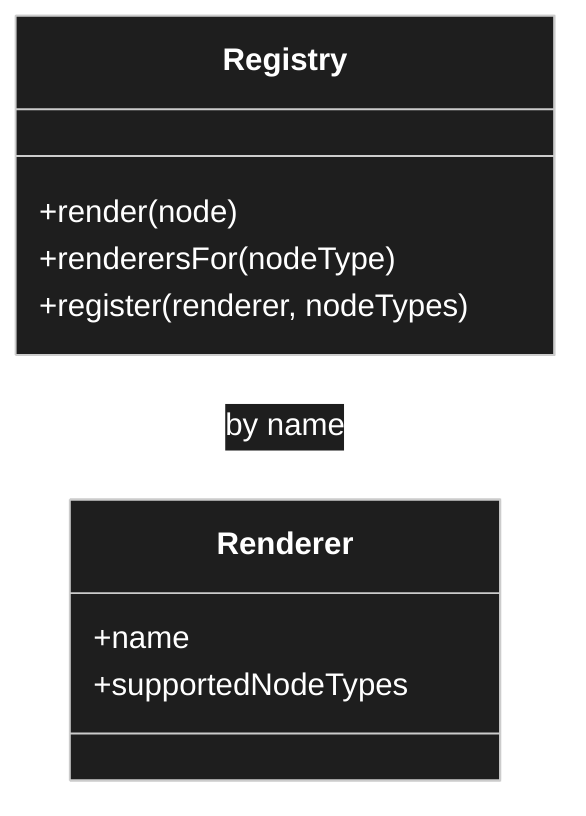

The registry serves two different questions, and R14 is what makes the second one possible:

1. **At render time** — *this node names renderer X, give me X.* A lookup by name.
2. **At configuration time** — *this node is an integer, which renderers could I choose?* A
   lookup by node type, answered from what each renderer declared when registering.

Without the second, the settings UI would have no list to offer and the choice in R16 could
not exist. This settles the *lookup* half of [OQ-005](91-open-questions.md), which
[D-091](90-decision-log.md) then closed.

### R13a — a node carries an ordered list of renderers, one of them mandatory

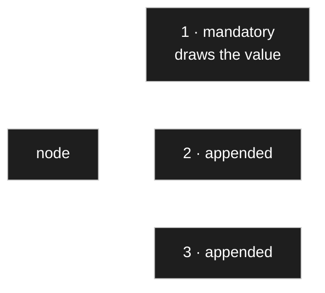

[D-236](90-decision-log.md) widens [R13](#owner-statement--2026-08-22-third-pass-the-registry):
what a node names is not one renderer but an **ordered list** of them. The owner: *of course I can
also assign a traffic light to an int value. Perhaps instead of decorating we should simply allow
several renderers — by default one, the others can be selected in addition, but there must always
be one.*

**Two conditions travel with it**, and neither is decoration:

| | |
|---|---|
| **the list is ordered** | and that order is what is seen — number first, then the red dot beside it |
| **exactly one is mandatory** | the owner's own rule, or a node draws nothing at all |

⚠️ **This reverses the owner's own statement of the same morning** — *a node cannot have several
renderers at the same time* ([D-217](90-decision-log.md)) — and it **replaces
[D-224](90-decision-log.md)'s decorator** as a configuration concept. What is gained is one list
instead of two notions: no *base here, decoration there*, just *this draws the value, and this as
well*, which is a button in the interface rather than a concept needing explanation. What is given
up is that a decorator could **alter** the inner renderer's output — colouring the number itself —
where a list can only **append**. The trade holds because *beside* covers every case named
(traffic light, stars, colour rings, captions), and *alter* is rare enough to deserve its own
renderer. A decorator survives as an **implementation** pattern — a renderer wrapping another is
still just a renderer — but it is no longer something a user configures.

**The cost is not queries.** Nothing extra is fetched: the data are fully loaded before the descent
begins ([D-159](90-decision-log.md)), so a second renderer builds a second string and that is all.

### R14a — the key is the type; purpose travels in the context

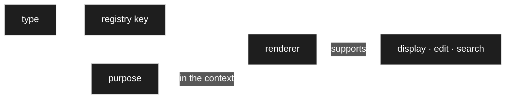

⚠️ **This unit used to read *the key is type **and** purpose*, and that is now wrong.**
[D-217](90-decision-log.md) supersedes the registry-key half of [D-168](90-decision-log.md). The
lookup is by **type**; the purpose rides in the render context and the renderer answers for it —
or does not, which `supports()` is where it says so.

**The registry still serves two questions**, and the owner named the second himself as *a
connection to the possible users*:

1. **At render time** — *this node names these renderers, give me them.* A lookup by name.
2. **At configuration time** — *which renderers are eligible for this node at all?* Answered from
   what each renderer declared when registering.

**Choosing among the eligible ones is the chain that already exists** ([D-015](90-decision-log.md),
[D-084](90-decision-log.md)): the list stands on the node, and the **using attribute may override
it** — the owner: *I give the whole thing a new look by using it.* Where several are eligible and
nobody has chosen, one is marked **default per type** and applies until someone does. The eligible
set is narrowed further by two rules — multiplicity ([D-098](90-decision-log.md)) and the grouping
rule ([D-099](90-decision-log.md), keyed by [D-235](90-decision-log.md)) — both worked out below.

### R14b — the last-resort renderer is a fault indicator, not a floor

A node with no renderer at all is an **error**, and [D-217](90-decision-log.md) is explicit that it
must **look** like one. A last-resort renderer is allowed, and it exists to make the fault visible
rather than to make the page presentable: covering a missing renderer with a quiet grey default is
how such a fault survives three weeks unnoticed.

That is a different thing from the purpose fallback [D-168](90-decision-log.md) needed, which
disappeared with the registry key
([R9a](#r9a--purpose-is-the-fourth-thing-the-context-carries-and-searching-is-one-of-them)). Under
[D-236](90-decision-log.md) the same rule reads one step tighter still: the list must hold at least
one renderer, so *empty list* and *no renderer* are the same fault.

### R15 — variant and circumstance are different axes

R15 and [R9](#owner-statement--2026-08-22-second-pass) look contradictory and are not. They cut
along different lines:

| | Decided by | Realised as |
|---|---|---|
| **Variant** — field, spinner, slider | the model author, in the settings | a **separate renderer** each |
| **Circumstance** — admin / block / frontend, editable / read-only, hidden | the caller and the node settings | **options inside** one renderer |

A slider is a different renderer from a spinner. A read-only slider is the same renderer as an
editable slider, given a different option. Keeping the split this way is what stops the renderer
count from multiplying: three variants × three levels × two edit modes would otherwise be
eighteen classes instead of three.

✔ **Both rows survive the second catch-up unchanged.** *Purpose* did not become a third column of
this table, because [D-217](90-decision-log.md) kept it out of the registry key; and *editable /
read-only* did not become a variant, because [D-218](90-decision-log.md) resolves the read-only
case by asking for the **display purpose** rather than by registering a second renderer.

### R15a — the renderer list is a third axis, and it multiplies nothing

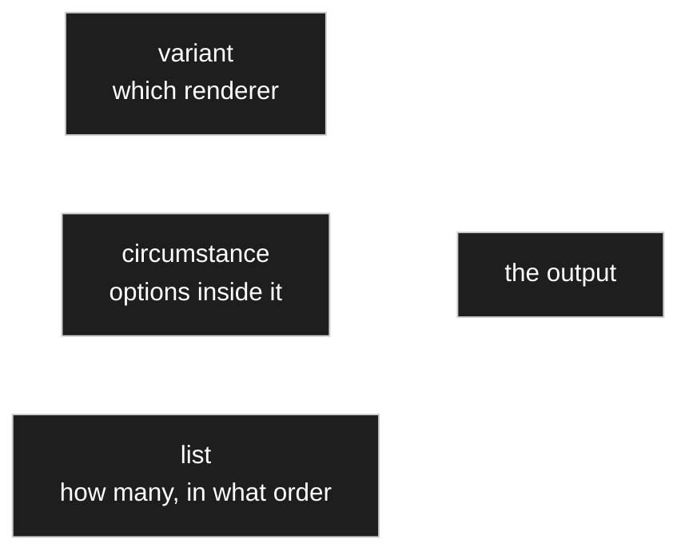

[D-236](90-decision-log.md) adds a third axis beside the two above, and it is the one that costs
nothing: **how many renderers are asked, and in which order.** A traffic light beside an integer is
not a new integer renderer and not an option of the spinner — it is a second entry in the node's
list. So the eighteen-classes argument of [R15](#r15--variant-and-circumstance-are-different-axes)
holds a second time: combinations live in the **configuration**, never in the class count.

| Axis | Decided by | Realised as |
|---|---|---|
| **Variant** | the model author | a separate renderer |
| **Circumstance** | the caller and the node settings | options inside one renderer |
| **List** | the model author, per node or use site | **several renderers, drawn in order** |

## Owner statement — 2026-08-22, fourth pass: surfaces and preview

| # | Statement |
|---|---|
| **R18** | The **tree view** consists of nodes too, so a node can be drawn in the tree by a renderer. Another renderer role. |
| **R19** | The modelling admin screen is **split in two**: the tree on the left, the settings of the selected node on the right. Concept taken from the predecessor — but **not one to one**, it is believed to contain errors. |
| **R20** | The settings side is itself a **page renderer**, and it follows special steps. Also described in the old concept, same caveat. |
| **R21** | **Every node has a preview**, assembled from its chosen renderer, with an **edit view** and a **display view**. |
| **R22** | The preview runs on **test data**, which has to be stored somewhere — for instance a separate test-data source holding sample data per node type, which the preview draws on. |
| **R23** | Switching a node's renderer, or changing a setting on the node or on its attributes, **changes the preview accordingly** — multiplicity, type, read-only, hidden, all of it. |

### R18–R20 — the surfaces are renderers, all the way up


R18 and R20 extend [R1](#consequences-of-r1) further than it first looked: not only the *values*
go through renderers, but the surfaces that show them. A tree row is a rendered node; the
settings page is a rendered page. Nothing is drawn by hand anywhere.

This made [OQ-014](91-open-questions.md) — PHP or JavaScript — larger rather than smaller, since
the split-screen admin with a live preview is the most interaction-heavy surface in the product
and is now also a renderer. [D-021](90-decision-log.md) answered it anyway: **PHP**, with generic
metadata-driven JavaScript wherever interaction is required.

### R18a — the tree row draws the node's icon

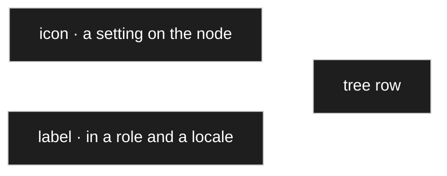

[D-251](90-decision-log.md). The owner: *the node renderer in the tree takes the icon into account
when one is present.* Small, and it is the reason the icon exists at all — the tree is where a
person scans a hundred rows, and a glyph is read faster than a word. It costs nothing, because the
icon is a **setting** resolved along the ordinary chain with everything else
([D-252](90-decision-log.md)).

⚠️ **Not the `symbol` role.** An icon is a chosen glyph from the installation's allow-list,
language-neutral; a `symbol` is a very short **text** — `Ω`, `Pos.` — and is a label, translated
like any other ([D-252](90-decision-log.md)). They sit next to each other on the screen and are
different mechanisms.

### R20a — the detail view is not a special screen

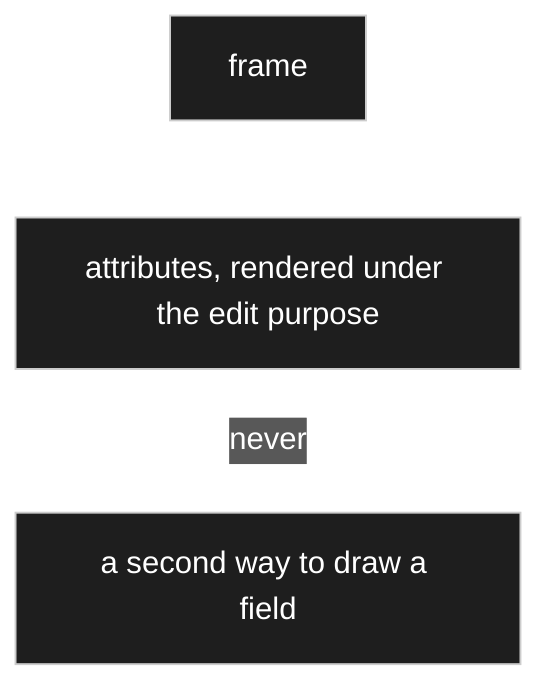

[D-190](90-decision-log.md) settles what [R20](#owner-statement--2026-08-22-fourth-pass-surfaces-and-preview)
left as *it follows special steps*: **the settings side is a series of attributes rendered under
the edit purpose ([D-168](90-decision-log.md)) inside a frame.** Nothing about it is
special-cased. The reason is the one this whole document keeps returning to: otherwise there are
two ways to draw a field — the official one, and the one the admin screen was built with — and
they drift.

**The order of the frame is decided and is not taste.** Top to bottom: **what acts** (buttons) ·
**what cannot be changed** (a band of chips) · the **name**, *because that is what you change
first* · **display** · the **attributes** · the **preview** · and last the **relations**,
collapsed. The owner walked that order out loud as the sequence in which a person actually works
on a node, and it is written down so a rebuild does not reshuffle it for looks.

### R20b — what the modelling surface shows about a deletion

Two decisions land on this surface rather than on the model:

| | |
|---|---|
| **A parked attribute is hidden by default** ([D-128](90-decision-log.md)) | a model full of ghost attributes is unreadable. It is one *show deleted* toggle away, drawn greyed, labelled *deleted with «X»*, with a restore action. The modelling view answers *what does this node look like now* — and a deleted attribute is not part of that answer, but it must not become invisible either. |
| **A confirmation names the consequences** ([D-126](90-decision-log.md)) | not *are you sure* but *what exactly falls*: which attributes leave which nodes, and how many records hold a value for each — then an act that cannot be reflexive, such as typing the node's name, rather than a button sitting where *cancel* usually is. |

Both are [V9](00-vision-and-scope.md) applied to the admin surface: the system knows what will
happen, so it says so instead of asking a person to imagine it.

### R20c — the node renderer and the page renderer are one renderer

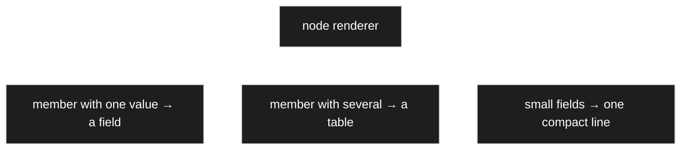

[D-233](90-decision-log.md) reads [D-091](90-decision-log.md) correctly at last: what was rejected
was an **interface** — `IPageRendere` — not the idea. The owner: *I have nothing against a page
renderer. I hand over a node here too and can render it, and then I have a config page renderer.*
So a configuration page renderer is an ordinary renderer whose subject happens to be a node
standing for the page. No exception and no second entry point, and
[R20](#owner-statement--2026-08-22-fourth-pass-surfaces-and-preview)'s *page renderer* is
rehabilitated rather than retired.

**And [D-256](90-decision-log.md) says the two are the same renderer**, so no third word is needed.
It also corrects where the layout rule lives:

| | Draws | Rule |
|---|---|---|
| **composite renderer** | **one composed value** — `2,7 kΩ ±5 %`, number and prefix and tolerance side by side | one control per member ([D-220](90-decision-log.md)) |
| **node renderer** *(= page renderer)* | **a whole node with its attributes** — a form above, a positions table below | one value → a field · several → a table · small fields compactly on one line |

⚠️ **[D-255](90-decision-log.md) had put the second rule in the composite renderer, and that was
wrong.** Two different jobs at two different scales. The rule itself is the owner's and is
unchanged: *if I have fixed data I show only a form; if I have fixed data and a multiplicity, I
show one multiplicity after another below, as a table. Simple rules.* The compact line is the same
compact renderer the settings screen uses ([D-245](90-decision-log.md)).

**Hiding works one level coarser than had been assumed** ([D-255](90-decision-log.md)): not only
single fields but **whole parts** — leave the form out and show only the positions, or show one of
two multiplicities and not the other. For a composition that is right in substance too, since it
exists only in connection with its whole. Other arrangements of the same data — the owner named a
timeline — stay possible and are **not** built now.

### R21–R23 — the preview is the feedback loop

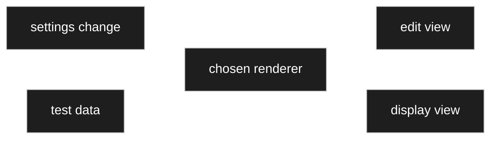

The preview is what makes the settings comprehensible: the author changes `step`, or switches
from spinner to slider, or marks an attribute hidden, and sees the result immediately in both
views. It is the reason the settings are worth configuring at all.

Two things followed that were open when this was written, and both are now decided:

- **Where the test data lives** — [OQ-033](91-open-questions.md), closed by
  [D-028](90-decision-log.md) and [D-052](90-decision-log.md). **Test data is ordinary data,
  flagged**: rows carry an `is_test` mark and the preview renders the node over those rows. No
  separate test-data store and no third kind of thing. See [R22a](#r22a--the-preview-renders-a-test-data-pack).
- **Whether the preview is a renderer or a caller** — [OQ-034](91-open-questions.md), closed by
  [D-096](90-decision-log.md): a **caller**, which invokes render twice. Worked out at
  [R49](#r42r43--and-r49-removes-the-exception-again).

### R21a — the preview shows the front end, and may only bound the size

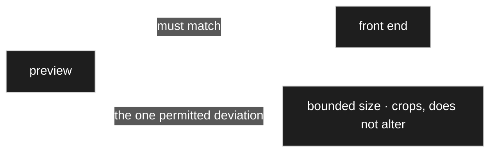

[D-231](90-decision-log.md). The owner noticed the two had never been separated and concluded they
should not be: *the preview always shows how it will look in the front end. If I change something
my preview may become enormous — maybe limit the size there — but it should look the way it really
will.*

**A preview that differs from the result is worse than none:** someone configures, it looks right,
and publishing produces something else. Bounding the height is the one allowed deviation precisely
because it **claims nothing about appearance** — it crops the view rather than altering it.

This sharpens [D-160](90-decision-log.md), which said what the preview renders without saying whose
appearance it must match. It also tightens
[the level-choice note](#one-consequence-the-preview-previews-a-level) below: previewing *a level*
remains right, and the front end is the one that must be reproduced faithfully.

### R22a — the preview renders a test data pack

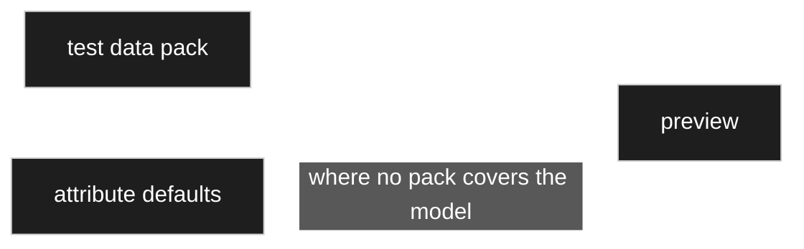

[D-160](90-decision-log.md) settles what [R22](#owner-statement--2026-08-22-fourth-pass-surfaces-and-preview)
only sketched: **the preview loads the test data and renders that**, not an empty shell. The
owner's reason is the whole of it — *so I have data available too*. A form of empty fields shows
that the structure exists; a filled one shows whether it **reads**.

It is still the same single mode, fed with realistic values instead of defaults. **Defaults
remain the fallback** where no pack covers the model. And the test data earns a second job beyond
testing, which is what keeps it maintained — those packs are ordinary **data packs**
([D-175](90-decision-log.md), [D-215](90-decision-log.md)), installable and removable like any
other.

✔ **The third source is settled, and it moved.** [D-052](90-decision-log.md) had given test data a
third source — *generated from the settings* where neither a flagged record nor a default exists —
which [D-160](90-decision-log.md) did not restate. [D-240](90-decision-log.md) closes it, and not
by reinstating generation: see [R22b](#r22b--three-layers-feed-a-preview) below.

**The model editor is not covered by this and does not need to be.** It walks the same edges; it
merely pulls a different renderer set out of the registry. **One descent, two renderer sets — not
two descents** ([D-160](90-decision-log.md)).

### R22b — three layers feed a preview

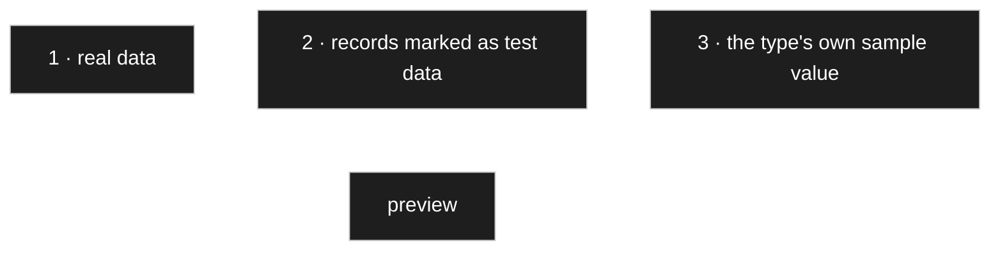

[D-240](90-decision-log.md) closes the [D-052](90-decision-log.md)/[D-160](90-decision-log.md) gap
with a layer the concept did not have, supplied by the owner out of the legacy project: **every
data type brings its own sample** — *`int` already has the value forty-two when no other data are
there, text has a sample text, a name a sample name.* Because data packs are removable
([D-175](90-decision-log.md)), without this layer removing a pack could take a model's preview with
it — which is the empty state [D-160](90-decision-log.md) exists to avoid.

**The sample belongs to the type, not to the renderer** ⚠️ *(the owner left the placement to me)*,
for three reasons:

| | |
|---|---|
| a node now carries **several** renderers ([D-236](90-decision-log.md)) | it would be unclear whose sample wins |
| a sample is a **value** | values belong to types; a renderer draws whatever it is given |
| placed on the type | it serves display, edit and search alike |

As a **setting** on the type node it follows the resolution chain, so an author may set a better
sample for their own type. ⚠️ **One condition: the sample must be valid** — it has to pass its
type's validators, or the preview shows something the model forbids and the fault gets hunted in
the wrong place.

**And the test-data mark does exactly one thing** ([D-241](90-decision-log.md)): such a record is
**not visible in the front end**. In every other respect it is ordinary — it counts for uniqueness
([D-154](90-decision-log.md)), appears in the administration, and travels through model changes
like any other. One flag, one effect; a second class of record would have to be known to every
code path.

## Owner statement — 2026-08-22, fifth pass: unified input, and the chooser

| # | Statement |
|---|---|
| **R24** | **Input interactions are unified.** Selecting a node happens either **inline** in the settings or **through a dialog**. Which is preferred is a setting in the admin menu; a particular place may insist on the dialog. |
| **R25** | A **chooser** is given two nodes: a **branch node**, whose subtree it shows, and a **default node**, down to whose children the tree is expanded. |
| **R26** | The user picks from those children — but may also move into any other branch that is on screen. |
| **R27** | The branch node is what scopes the choice: picking any node means the whole tree; picking a model means the *models* branch is put in front. |

### R25–R27 — one chooser, two parameters

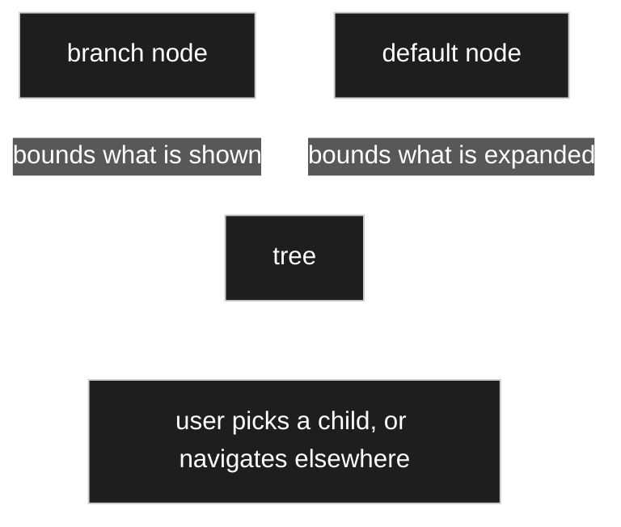

Two parameters doing two different jobs, and keeping them apart is what makes one chooser serve
every case. The **branch** decides *what the choice is about*; the **default** decides *where the
user lands*. R26 keeps the tree navigable rather than caging the user in the expanded part — the
default is a starting point, not a boundary.

Together with [R24](#owner-statement--2026-08-22-fifth-pass-unified-input-and-the-chooser) this is
[C34](10-domain-core.md) again: a configured default way of choosing, and the freedom to do
otherwise.

**Legacy note.** The previous round had a chooser design with the same two parameters under
different names, in [`../legacy/ARCHITECTURE.md`](../legacy/ARCHITECTURE.md). The owner points at
it as background and warns that **it contains wrong conclusions** — so it is a harvest candidate
and a cross-check, never an inheritance ([PR-1](../../CLAUDE.md)).

**Open:** is the chooser itself a renderer? [R1](#consequences-of-r1) says all display goes
through one, and a chooser displays a tree — which [R18](#owner-statement--2026-08-22-fourth-pass-surfaces-and-preview)
already made a renderer. → [OQ-038](91-open-questions.md).

## Owner statement — 2026-08-22, sixth pass: a control offers only real choices

| # | Statement |
|---|---|
| **R28** | If a selection has **zero or one** entry, then only that one entry or nothing can be the answer. |
| **R29** | Whether *nothing* is allowed follows from the **multiplicity**: `0..1` and `0..*` may be empty; `1` and `1..*` must always have a selection. |
| **R30** | So with multiplicity `1` or `1..*` and exactly **one** available entry, that entry is **selected and the field greyed out**. |
| **R31** | With **no** available entry there is nothing to choose and the control is **disabled**. |
| **R32** | This principle is to be held for **all inputs**, not only this one. |

### R28–R32 — the rule, complete

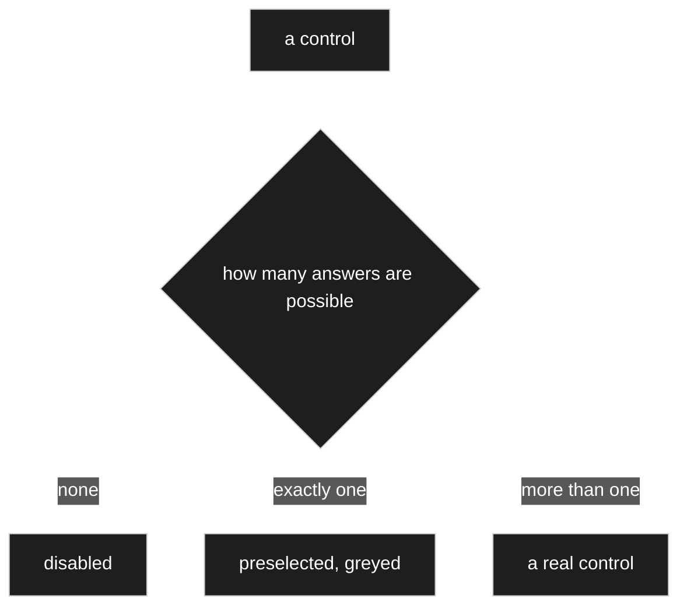

This is [D-050](90-decision-log.md) at widget scale, and the two together make one rule that runs
from a whole dialog down to a single field: **never present a decision that has already been
made by the circumstances.**

Worked out against multiplicity, since that is what decides whether *nothing* counts as an
answer:

| available entries | multiplicity | possible answers | control |
|---|---|---|---|
| 0 | `0..1`, `0..*` | 1 — only *nothing* | **disabled**, empty |
| 0 | `1`, `1..*` | **0** | ⚠️ **the model cannot be satisfied** — see below |
| 1 | `1`, `1..*` | 1 — only that entry | **preselected, greyed** |
| 1 | `0..1`, `0..*` | 2 — that entry, or nothing | **stays a real control** |
| more than 1 | any | more than 1 | ordinary chooser |

**The fourth row is where the rule must not be over-applied.** One available entry with an
optional multiplicity still leaves a genuine decision — take it or leave it — so greying it out
would remove a choice the user actually has. Only the third row is truly decided.
This is [D-056](90-decision-log.md) verbatim. ✔ **[D-198](90-decision-log.md) had appeared to say
the opposite about the same case** — *a select holding one entry is greyed out* —
and [D-227](90-decision-log.md) settles it in favour of the table as it stands: see
[R31b](#r31b--the-rule-counts-possibilities-not-entries).

### R31a — the second row is not a control state, it is a broken model

**Requiring at least one entry where none exists is a model that cannot be filled in.**
[D-157](90-decision-log.md) closes what stood here as [OQ-053](91-open-questions.md), and it
places the event three steps earlier than the form:

| | |
|---|---|
| **Caught where it is created** | at the moment of narrowing — setting an allow-list ([D-046](90-decision-log.md)) to nothing, or deleting the last member of a branch. Catching it at data-entry time would be far too late: a different person, weeks later, in front of a form they cannot fill in. |
| **Reported, not blocked** | an author may legitimately be mid-rebuild and about to refill the branch. It is a **model conflict** ([D-054](90-decision-log.md)) and it is shown in the **preview** ([D-101](90-decision-log.md)). |
| **But data entry stays barred** | for that model, until it is resolved. There the conflict is not a message but a dead end. |

### R31b — the rule counts possibilities, not entries

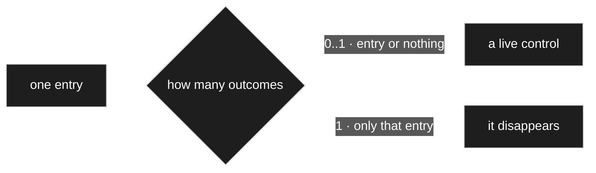

[D-227](90-decision-log.md) refines [D-198](90-decision-log.md) rather than choosing between it and
[D-056](90-decision-log.md): **both stand, and D-198 was simply too short.** At `0..1` there are
**two** possibilities — the one entry, or nothing — so the control is alive; at `1` there is
genuinely one and it disappears.

> **The test is never *how many rows are in the list* but *how many outcomes can this control
> produce*.**

⚠️ Same shape as the correction in [D-223](90-decision-log.md): *which* converter supplies a form
may have one answer, while *whether* to use that form at all always has two. Counting rows conflates
the two questions; counting outcomes keeps them apart.

## Owner statement — 2026-08-22, seventh pass: converters, and how many

| # | Statement |
|---|---|
| **R33** | A node **can have several converters**. |
| **R34** | One thing they could do: show a number as **binary, hexadecimal, octal or in Roman numerals**. |
| **R35** | ⚠️ *"Whether this form is really hung on as a converter, I am not sure — but we should keep it in mind. Storing the twelve is one thing, showing it as Roman twelve another."* |
| **R36** | And: *"if I say **greater than Roman twelve**, values greater than that should be shown — which ought to be no obstacle if it is stored as a decimal number underneath."* |

### R34/R35 — yes, it is a converter, by the test already agreed

[D-043](90-decision-log.md) settled the test: **a calculation produces a value that did not exist;
a converter changes the form of one that did.** `XII` and `12` are the same number written
differently — nothing gained, nothing lost. So a numeral-system converter is a converter, exactly
as gram-to-kilogram is — recorded as [D-075](90-decision-log.md).

### R36 — and this splits converters into two kinds

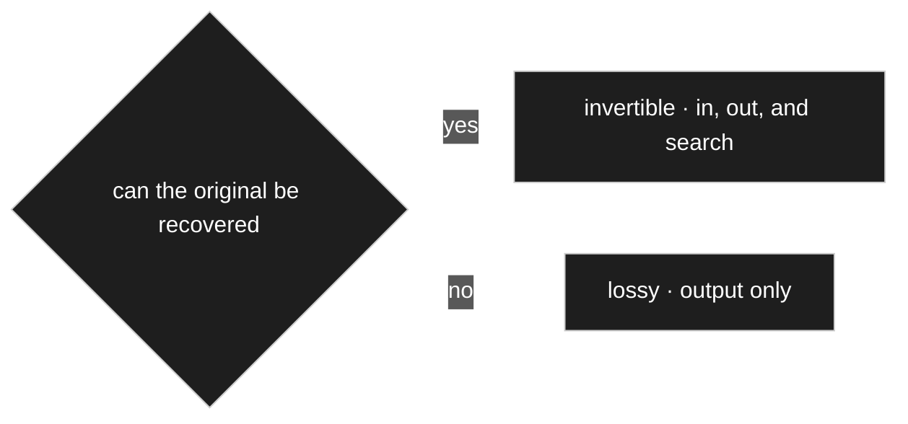

R36 asks for `> XII` in a search box to find everything above twelve. That works — and it works
because the converter runs **on the way in as well**, parsing `XII` to `12` before the query
touches the database. Which is the same bidirectional behaviour
[D-051](90-decision-log.md) already requires for units.

But not every converter can do that, and the difference has to be stated or someone will build a
search on one that cannot:

| | Examples | May serve |
|---|---|---|
| **Invertible** | gram ↔ kilogram · decimal ↔ Roman · decimal ↔ hex | display, **input**, and **search** |
| **Lossy** | rounding to two places, truncation, uppercase | **display only** |

Recorded as [D-076](90-decision-log.md).

**The consequence that matters:** rounding for display ([D-057](90-decision-log.md)) is lossy, so
**a search must never run against the rounded form**. `> 8.50 €` has to be evaluated on the stored
value, not on what the screen shows — otherwise a row displayed as `8.50` but holding `8.4999`
answers the wrong way.

### R33 — several converters, and which one applies

If a node offers binary, hexadecimal and Roman, something has to choose. That is
[D-032](90-decision-log.md) once more: the node carries a **default**, and a use site may
**override** it — the same shape as the renderer choice in [R16](#owner-statement--2026-08-22-third-pass-the-registry).

So a converter behaves like a renderer variant, not like a fixed property: registered, chosen by
setting, resolvable per use site. This also answers part of [OQ-007](91-open-questions.md), which
asked whether *one converter* was a hard limit. **It is not** — [D-077](90-decision-log.md).

### R33a — there are a few *kinds* of converter, parameterised by data

```mermaid
---
config:
  theme: dark
  themeVariables:
    mainBkg: "#1e1e1e"
    background: "#1e1e1e"
    primaryColor: "#1e1e1e"
    classText: "#ffffff"
    textColor: "#ffffff"
    lineColor: "#ffffff"
---
flowchart TD
    C[converter] --> L["lookup · a table"]
    C --> T["threshold · bounds to output"]
    C --> S["scale · factor and unit"]
    C --> F["format · a pattern"]
```

[D-148](90-decision-log.md): the engine branches on the **form** of the mapping, never on its
content — the same criterion [D-085](90-decision-log.md) uses for settings. Four forms cover
every case raised so far: **lookup** (AWG ↔ mm², digit ↔ colour) · **threshold** (a traffic
light, tolerance classes, size charts) · **scale** (prefixes, the capacitor code) · **format**
(dates, part numbers).

**The consequence that pays for the classification:** a traffic light becomes **data an author
enters**, not work for a developer. And a threshold mapping is **readable backwards**, so *show
me all the red ones* becomes a range query on the real value — indexed, exact, and nothing can go
stale, which is why no derived field is needed for it. Genuine algorithms remain available as a
**registered strategy** ([D-130](90-decision-log.md)), as the exception rather than the rule.

### R33b — several are eligible, exactly one is in effect

```mermaid
---
config:
  theme: dark
  themeVariables:
    mainBkg: "#1e1e1e"
    background: "#1e1e1e"
    primaryColor: "#1e1e1e"
    classText: "#ffffff"
    textColor: "#ffffff"
    lineColor: "#ffffff"
---
flowchart LR
    S["eligible for the type<br/>the stock side"] --> C["chosen · default + override"]
    C --> E["in effect for this rendering<br/>exactly one"]
```

[D-219](90-decision-log.md) settles how [V8](00-vision-and-scope.md)'s *one converter* and
[D-077](90-decision-log.md)'s *a node may carry several* fit together — they were never about the
same side. **Several may be *eligible*; exactly one is *in effect* per rendering.** The owner put
the effect side plainly: *we currently allow only one converter, not several.* Which one applies is
a setting with a default and a per-use-site override — the same shape
[R14a](#r14a--the-key-is-the-type-purpose-travels-in-the-context) gives renderers.

⚠️ **This is the one place where the converter and the renderer list do *not* run parallel.**
[D-236](90-decision-log.md) lets a node draw with several renderers at once; nothing extends that to
converters, and nothing should be assumed from the symmetry.

**A consequence found while walking a resistor through** ([D-219](90-decision-log.md)): a converter
attaches **at the level whose value it encodes**. `2k7` encodes number and prefix, so it hangs on
`quantity` and works at once for capacitances, lengths and baking recipes; the colour rings also
encode tolerance, so they hang one level up.

### R33c — automatic is a default, never a fact

```mermaid
---
config:
  theme: dark
  themeVariables:
    mainBkg: "#1e1e1e"
    background: "#1e1e1e"
    primaryColor: "#1e1e1e"
    classText: "#ffffff"
    textColor: "#ffffff"
    lineColor: "#ffffff"
---
flowchart TD
    Q1["which converter supplies this form"] -->|may have one answer| H[the control disappears]
    Q2["whether this use site wants the form at all"] -->|always has two| K[the control stays]
```

[D-223](90-decision-log.md) corrects a misreading of [D-198](90-decision-log.md) I had written into
the converter case: *where only one converter qualifies it is taken without being asked.* The owner
caught it — he may want to say **no colour code here, it bothers me**, and under that wording he had
nowhere to say it.

> **Anything the system chooses on the user's behalf must be revocable at the use site.**

That is [D-032](90-decision-log.md)'s two-fold principle applied to automatic choices, and it has a
second half: **an automatic choice must be visible.** A field showing red-blue-green with nothing
anywhere saying *presentation: colour code*, and no place to change it, is magic nobody can switch
off later because nobody can find where it came from.

Concretely: the shorthand control accepting `2k7` appears **automatically wherever an invertible
text converter exists, and can be switched off**. Refusing a colour form needs nothing special —
choosing the ordinary composite renderer at that use site **is** the refusal.

### R35a — notation is not structure

```mermaid
---
config:
  theme: dark
  themeVariables:
    mainBkg: "#1e1e1e"
    background: "#1e1e1e"
    primaryColor: "#1e1e1e"
    classText: "#ffffff"
    textColor: "#ffffff"
    lineColor: "#ffffff"
---
flowchart LR
    V["one stored value"] --> R[one renderer]
    R --> C1["control · canonical form"]
    R --> C2["control · the other notation"]
```

[D-149](90-decision-log.md) answers the doubt [R35](#owner-statement--2026-08-22-seventh-pass-converters-and-how-many)
recorded. If a second form carries nothing the first lacks, it is a **writing of the same
value** — a converter plus a renderer, **never a second field**, because two stored values can
drift apart. So: **one attribute, one stored value, one renderer with two coupled controls.** The
renderer uses the converter twice — once to display the code, once to parse input from the code
side — and wherever the user types, the canonical value is what is stored. The pattern is
general: a hex field beside a colour picker, a text field beside a calendar, decimal degrees
beside degrees-minutes-seconds.

**And a renderer that spans several attributes is a node renderer, not an attribute renderer**
([D-091](90-decision-log.md)) — which is why [D-150](90-decision-log.md) keeps the resistor
colour code as **one notation of one thing**: `Widerstandswert` is a composed type, value plus
tolerance, so the code stays an attribute renderer instead of having to reach across attributes.

**Staging follows where the benefit lies** ([D-150](90-decision-log.md)): the resistor gets a
**renderer** first, because the value is in the *display* and the bands are awkward to type; the
capacitor gets a **converter** first, because the value is in the *input* — `104` is printed on
the part and someone wants to type it into a search and find it, which
[D-076](90-decision-log.md) makes possible by running the converter on the way in.

### R35b — a representation is a converter plus a renderer, and the mapping is data

```mermaid
---
config:
  theme: dark
  themeVariables:
    mainBkg: "#1e1e1e"
    background: "#1e1e1e"
    primaryColor: "#1e1e1e"
    classText: "#ffffff"
    textColor: "#ffffff"
    lineColor: "#ffffff"
---
flowchart LR
    V[value] --> C["converter · the mapping"]
    C --> R["renderer · the form"]
    R --> O["rings · 2k7 · green · stars"]
```

[D-219](90-decision-log.md) generalises [D-149](90-decision-log.md) and
[D-150](90-decision-log.md), and it does so by destroying a distinction I had proposed. ⚠️ *I had
split **notation** — the same information written differently, like a resistor's colour rings — from
**encoding**, a user-defined mapping like a traffic light. The owner took it apart in one sentence:
**a traffic light with ten colours is a resistor colour code.*** The line was a count of members,
not a property of the thing, and no concept can stand on that.

**One construct instead:** the **converter** is the mapping (value → rings, value → `2k7`,
value → `104`, value → green) and the **renderer** is the form (text, one colour, a sequence of
colours, stars). Both already exist ([V8](00-vision-and-scope.md)). Resistor, coil, capacitor,
shorthand notations, traffic lights and star ratings become instances of **one** mechanism;
standards ship as data packs ([D-175](90-decision-log.md)); users build their own the same way.

> **Code is needed only where the mapping cannot be written as a table or a rule.** That boundary
> does not run between traffic light and colour code — it runs between *writable down* and *must be
> computed*.

### R35c — the composed type is the unit of rendering

```mermaid
---
config:
  theme: dark
  themeVariables:
    mainBkg: "#1e1e1e"
    background: "#1e1e1e"
    primaryColor: "#1e1e1e"
    classText: "#ffffff"
    textColor: "#ffffff"
    lineColor: "#ffffff"
---
flowchart TD
    T["composed type<br/>Widerstandswert"] --> M1["member · number"]
    T --> M2["member · prefix"]
    T --> M3["member · tolerance"]
    T -.->|one generic composite renderer| D[one control per member]
```

[D-220](90-decision-log.md). The owner: *I type `2k7` and it lands in two different fields, the
`2.7` and the `k` — I think we need some kind of combinatorial renderer here.* ⚠️ **No new kind of
renderer is needed**, because those are not two fields: they are **members of one value** that is
incomplete without them. [D-150](90-decision-log.md) had already made `Widerstandswert` a composed
type so the colour code could stay an ordinary attribute renderer; the prefix is the same move one
level down.

**Two stages, and the first needs no code.** A **generic composite renderer** draws any composed
type — one control per member, each drawn by the member's own renderer — so a new composed type
works immediately, for dimensions, addresses or baking recipes alike. On top of it, a **shorthand**
control accepting `2k7` is a converter ([D-219](90-decision-log.md)) and exists only where a
shorthand exists.

**Members stay individually reachable**, because a composition into a primitive lives **inside** the
record, addressed by path ([D-232](90-decision-log.md)) — so *tolerance ≤ 5 %* is searchable without
tolerance being an attribute of its own.

⚠️ **This is not two converters at once.** One renderer with one converter serves **both
directions** — drawing the form and parsing what is typed into it ([D-149](90-decision-log.md)).
Showing a value in two forms **at the same time** is two renderings of one attribute, not one
rendering with two converters.

**Choosing is two settings that narrow each other:** the renderer decides the **form** and declares
which result shape it can draw; the eligible converters are those producing that shape. Pick the
renderer and the converter list narrows itself — and if one remains it is used without being asked,
by [D-198](90-decision-log.md), **subject to [R33c](#r33c--automatic-is-a-default-never-a-fact)**:
*which* converter may be decided, *whether* to use the form at all never is.

⚠️ **Note the scale.** This composite renderer draws **one composed value**. What draws *a whole
node with its attributes* — a form above, a positions table below — is the **node renderer**, and
confusing the two is exactly the mistake [D-256](90-decision-log.md) corrects at
[R20c](#r20c--the-node-renderer-and-the-page-renderer-are-one-renderer).

### R36a — the converter removes what cannot have been meant; the validator asks about the rest

```mermaid
---
config:
  theme: dark
  themeVariables:
    mainBkg: "#1e1e1e"
    background: "#1e1e1e"
    primaryColor: "#1e1e1e"
    classText: "#ffffff"
    textColor: "#ffffff"
    lineColor: "#ffffff"
---
flowchart TD
    I[input] --> Q{could it have been meant}
    Q -->|no| C["converter · strips it silently"]
    Q -->|maybe| V["validator · offers a correction"]
```

[D-166](90-decision-log.md) draws the line at whether intent is ambiguous. **Leading and trailing
whitespace is stripped silently by the converter** — nobody has ever meant a trailing space, so
there is nothing to ask and a dialogue about one would be an imposition. **Interior spacing is a
validator**, because `BC 547 B` is a perfectly ordinary way to write it: an attribute-level
setting like `min`, overridable along the resolution chain ([D-015](90-decision-log.md)), which
**offers** the corrected form rather than enforcing it.

**Two consequences that must not be forgotten**, both stated in the decision:

- Trimming runs **before** duplicate detection and before the uniqueness check
  ([D-154](90-decision-log.md)), or `Bauteil` and `Bauteil ` become two records nobody can tell
  apart.
- The hyphen rule is **not** about findability. The search column normalises spacing and
  punctuation away anyway ([D-167](90-decision-log.md)), so `BC 547 B` and `BC-547-B` already
  find each other. It is about tidiness and duplicates — which is what makes *offer* rather than
  *enforce* defensible.

### R36b — a validator message is a label, and there is one per validator

An attribute may carry several validators — range, format, uniqueness — so there are three
messages rather than one ([D-158](90-decision-log.md)). A shipped message is a **software
string**; an author-written one becomes **content** and needs a locale like any other text, so it
is a **label**: same table, same resolution walk, same fallback chain, with the shipped text
underneath so the chain never ends empty. `labels` therefore carries a `path` column addressing
the individual validator, the same mechanism `record_values` and override addressing already use.

Two rules travel with it:

| | |
|---|---|
| **Placeholders survive, and the named format stays mandatory** | an author message may contain `{min}` and `{max}`. A sentence assembled from fragments cannot be translated into a language that orders them differently. |
| **The author says what went wrong, not what to do about it** | ⚠️ the **offered correction** of [V9](00-vision-and-scope.md) is behaviour, and behaviour is code ([D-036](90-decision-log.md)). It is not the author's to change. |

### R36c — invertibility decides only whether a form can be written into

```mermaid
---
config:
  theme: dark
  themeVariables:
    mainBkg: "#1e1e1e"
    background: "#1e1e1e"
    primaryColor: "#1e1e1e"
    classText: "#ffffff"
    textColor: "#ffffff"
    lineColor: "#ffffff"
---
flowchart LR
    I["invertible?"] -->|the only question it answers| W["may a person type in this form"]
    L["replace or decorate"] -->|an independent choice| U["stated at the use site"]
```

[D-226](90-decision-log.md) supersedes [D-225](90-decision-log.md), which had hung two questions on
one axis — *invertible converters **replace** the value's presentation, non-invertible ones
**decorate** beside it.* ⚠️ The owner took the axis apart: **whether it is invertible or not is not
what matters to me right now. The difference is only that I can enter a colour code and get a
resistance and a tolerance out of it, and from red-amber-green I cannot get back to the value.**

So invertibility answers **exactly one** question — may a person type in this form
([D-076](90-decision-log.md)) — and nothing else. **Layout is an independent, explicit choice at the
use site:** a form may stand in place of the value or beside it, for invertible and non-invertible
forms alike.

**What remains of [D-225](90-decision-log.md) is a default and only a default:** a form that would
hide the value if shown alone starts out **decorating**, because you would otherwise see green and
no longer know the figure.

**The consequence is a simplification.** *Number **and** colour rings together* no longer requires
the attribute to appear twice in a block — it is **one setting in one place**, and it works in the
detail view too, where there is no column list at all. ⚠️ *This is the first live use of
[D-222](90-decision-log.md): a decision revised the same day, visibly, because the earlier rule
answered **when it is sensible** while the owner was asking **when it should be possible**.*

⚠️ **And the extra chain link D-226 proposed did not survive.** It had extended the resolution chain
by *occurrence in a block*; [D-253](90-decision-log.md) withdraws that — see
[R76e](#r76e--the-block-selects-and-hides-the-renderer-draws). The chain still ends at the use site.

## Owner statement — 2026-08-22, eighth pass: the descent, step by step

| # | Statement |
|---|---|
| **R37** | The registry's `render` is only an **entry point**. The registry itself neither represents nor renders anything. |
| **R38** | A basic renderer simply **receives a node**, and renders it down to the leaves. |
| **R39** | The sequence: from the node take the **renderer name** → via the **registry** get the renderer → call it for this node → it renders the node's **own properties**, context-dependent → then it reaches the node's **edges**. |
| **R40** | Each edge is rendered the same way: take the edge, see what renderer is there, render it. **So both nodes and edges must be renderable** — the owner calls this *a small break*. |
| **R41** | **If the edge carries no renderer, take the one from the connected node**, because nothing was overridden. **The highest override wins — for the renderer as for everything else.** |

### The descent

```mermaid
---
config:
  theme: dark
  themeVariables:
    mainBkg: "#1e1e1e"
    background: "#1e1e1e"
    primaryColor: "#1e1e1e"
    classText: "#ffffff"
    textColor: "#ffffff"
    lineColor: "#ffffff"
---
flowchart TD
    A[node] --> B[resolved renderer name]
    B --> C[registry hands back the renderer]
    C --> D[render the node's own properties]
    D --> E[for each edge]
    E --> F[resolve the edge's renderer]
    F --> G[render the edge · one value or many]
    G --> A
```

The loop closes at the target node, which starts the same walk again. Nothing else is needed to
render a whole parts list down to the last unit symbol.

### R40 — it is not a break

The unease is understandable and the structure does not share it. **A node and an edge are both an
`Identity`** ([C11](10-domain-core.md)): both can carry a resolved renderer setting, and both have
something below them to descend into. So the contract takes an identity, and *which* kind it is
only decides which renderer is registered for it — the same way `owner_id` is one column for
exactly the same reason.

Two different jobs, one interface:

| | renders |
|---|---|
| a **node** renderer | the node's own properties, then hands each edge onward |
| an **edge** renderer | the attribute — its label, and its value or **values** |

### R38 also answers R3, and better than the earlier proposal

An earlier draft had the context carry a **list of entries**, so that one renderer could serve one
node or many. That is heavier than needed. The owner's shape is simpler and lands the multiplicity
where it already lives:

**Multiplicity belongs to the edge** ([D-086](90-decision-log.md)) — so the **edge** renderer is
where one-or-many is handled. A node renderer always renders exactly one node. Recorded as
[D-092](90-decision-log.md), which supersedes the list-of-entries idea outright.

### R41 — the resolution order

Reading the chain from the specific end, which is what *the highest override wins* means:

```
the edge's own setting  →  the target node's setting  →  its ancestors  →  the fallback renderer
```

That is [D-079](90-decision-log.md)'s walk, and R41 confirms it holds for the renderer choice as it
does for every other setting. Nothing separate to build.

### The contract, revised

```php
// CONTRACT
interface Renderer
{
    /** which node types or edge kinds this serves, and which purposes it can
        answer for — R14, D-168, D-217. Purpose is declared here, never keyed on
        in the registry. Feeds the choice list, and declares one-or-many per D-098 */
    public function supports(): array;

    /** $subject is a node or an edge; both are identities */
    public function render(Identity $subject, RenderContext $context): RenderResult;
}
```

Agreed as [D-091](90-decision-log.md). `RenderContext` carries the loaded subgraph
([D-014](90-decision-log.md)) **and the record** ([D-159](90-decision-log.md)), the level,
editable or not, the **purpose** ([D-168](90-decision-log.md)), the resolved settings and the
locale. `RenderResult` carries the markup **and** the attribute metadata that was used
([D-021](90-decision-log.md)) — under the search purpose it carries a **condition** rather than a
value ([R9a](#r9a--purpose-is-the-fourth-thing-the-context-carries-and-searching-is-one-of-them)).

`renderTable` and `renderForm` disappear — those are **variants**
([D-018](90-decision-log.md)), so separate renderers. `IPageRendere` needs no interface of its own:
a page is a rendered node ([R20](#r18r20--the-surfaces-are-renderers-all-the-way-up)) — which
[D-233](90-decision-log.md) is careful to read as *no special **contract***, not *no page renderer*
([R20c](#r20c--the-node-renderer-and-the-page-renderer-are-one-renderer)).

**Two corrections the contract has absorbed since:**

| | |
|---|---|
| **`supports()` declares purposes; the registry does not key on them** | [D-217](90-decision-log.md). One node, one lookup by type; display, edit and search are answered — or declined — by the same renderer. Declining is the whole mechanism behind *not searchable* ([R9a](#r9a--purpose-is-the-fourth-thing-the-context-carries-and-searching-is-one-of-them)). |
| **The subject resolves to a *list* of renderers, not to one** | [D-236](90-decision-log.md). `render()` is unchanged — each entry is called with the same `Identity` and `RenderContext`, and their outputs are concatenated in the list's order. Nothing in the interface moves ([R13a](#r13a--a-node-carries-an-ordered-list-of-renderers-one-of-them-mandatory)). |

### R41a — the descent has two inputs, and there is only one mode

```mermaid
---
config:
  theme: dark
  themeVariables:
    mainBkg: "#1e1e1e"
    background: "#1e1e1e"
    primaryColor: "#1e1e1e"
    classText: "#ffffff"
    textColor: "#ffffff"
    lineColor: "#ffffff"
---
flowchart LR
    M["model subgraph<br/>what to draw"] --> D[the descent]
    R["record tree<br/>what is in it"] --> D
```

R38–R41 describe walking the **model**. But rendering real data walks the same structure while
the **values** come from a record ([D-083](90-decision-log.md)). [D-159](90-decision-log.md)
closes what stood here as [OQ-061](91-open-questions.md), and it settles more than the shape.

**The record is an input the renderer reasons about, not decoration passed along.** The owner:
*is it necessary for the renderer to work properly? Yes — because depending on the data, the
renderer may have to adapt its output.* So it must be there **in full** when the renderer is
called, which means model subgraph and record tree are **both loaded up front** — a descent that
fetches per edge is N+1 by construction (**CD-7**).

**Where the two disagree, the model decides what is drawn and the renderer changes nothing:**

| | |
|---|---|
| a value for an edge the model has since lost | **not drawn, and not touched.** It stays in `record_values` the way a parked record stays ([D-123](90-decision-log.md)) — removing it is a migration ([D-061](90-decision-log.md)), and migrating is not the job of drawing. |
| an edge with no value | not an error. It is the **empty control state**. |
| the divergence itself | **reported as a record conflict** ([D-054](90-decision-log.md)) in the list — not thrown at the reader mid-page. |

**The renderer never writes, not even to tidy up.**

That is also what makes the preview ordinary rather than special: there the record is the test
data pack ([D-160](90-decision-log.md)), falling back to the defaults
([D-052](90-decision-log.md)).

⚠️ **What this costs in a long list is deferred, with a named trigger.**
[D-200](90-decision-log.md) and [D-203](90-decision-log.md) place the question — whether the
renderer is resolved per column and only its output per row — in Release 2, reopening *the first
time a table is slow*, because since [D-159](90-decision-log.md) a renderer may adapt to the
value and is therefore *usually* constant down a column and **not reliably** constant. One
requirement survives the deferral because it is hard to retrofit: **a precomputed row template
meeting a value that needs a different renderer must fail loudly, never draw quietly wrong.**

## Owner statement — 2026-08-22, ninth pass: two worked examples

| # | Statement |
|---|---|
| **R42** | **The preview shows both**: once editable and once not. That is a **special case** — everywhere else the mode is given by the caller. |
| **R43** | If the attribute is **read-only** there is no input. That has to be taken into account here too. |
| **R44** | **When rendering, always honour every attribute. A ground rule — no special arrangements, the same everywhere.** |
| **R45** | Rendering a type that has `int` as an attribute with `max`, `min` and `step` overridden but **not** the renderer: the edge has no renderer, so go one deeper to the node and take its renderer — and for the settings the same, taking the overridden `max`. |

### R45 — the precision this example reveals

```mermaid
---
config:
  theme: dark
  themeVariables:
    mainBkg: "#1e1e1e"
    background: "#1e1e1e"
    primaryColor: "#1e1e1e"
    classText: "#ffffff"
    textColor: "#ffffff"
    lineColor: "#ffffff"
---
flowchart LR
    E["edge · max=10 · min=-10 · step=2"] -->|renderer: not set| N["node int · renderer: spinner"]
    E -.->|max, min, step| R[the rendering]
    N -.->|renderer| R
```

**Each key resolves on its own.** The renderer comes from the node because the edge did not
override it; `max`, `min` and `step` come from the edge because it did. The configuration that
reaches the renderer is **assembled key by key**, not taken wholesale from whichever level
happened to say something.

This is worth stating because the natural mistake is the other one — *the edge overrides something,
so take everything from the edge*. That would silently discard the node's renderer choice and
every setting the edge did not mention.

It is the same rule as sparse overrides ([D-015](90-decision-log.md)), seen from the reading side:
sparse storage only works if reading merges per key.

### R44 — the ground rule, and what it forbids

*Always honour every attribute, no special arrangements.* Concretely, a renderer that draws a value
must take account of **all** of these, every time:

`hide` · `read_only` · the chosen converter · `min` · `max` · `step` · multiplicity · the label in
the right role and locale.

Not *the ones this renderer cares about* — **all of them.** A renderer that ignores `hide` produces
a visible field that the model says is invisible, and the bug shows up somewhere else entirely.

This pairs with [D-056](90-decision-log.md): *a control offers only real choices.* One rule says
never present a decision already made; this one says never ignore what the model stated. Agreed
as [D-094](90-decision-log.md).

**And it is not the same as *the engine branches on it*.** [D-085](90-decision-log.md) draws the
finer line: a renderer must honour `min` and `max` too — a spinner cannot be drawn without
them — and what differs is **who owns the meaning**. The engine defines `hide`, `read_only`,
`renderer`, `converter`, `validators` identically for every node; a **type** defines `min`,
`max`, `step`, and a spinner reads them because it is registered *for that type*.

### R42/R43 — and R49 removes the exception again

| # | Statement (owner, 2026-08-22) |
|---|---|
| **R46** | With **multiplicity** another renderer can be named — a container: a compact row or column, a **table** renderer, a **form** renderer. |
| **R47** | It then takes the table's render function first, but for the **individual field functions** it looks **one level deeper** again. |
| **R48** | *The data say what is in it* — the two-input reading of the descent is right. |
| **R49** | **The preview needs no special arrangement.** Simply call render **twice** — once editable, once not. |

**R43 confirmed:** `read_only` removes the **input**, not the field. A read-only attribute still
appears in a form, as a locked control, because the value is still information the reader needs.

**R49 supersedes the exception R42 described.** The preview is not a mode the contract has to know
about; it is a **caller that invokes twice**. Nothing in the renderer changes, nothing branches on
*am I a preview*, and [D-095](90-decision-log.md)'s *the preview is the one place the mode is not
supplied* falls away. The mode is always supplied — the preview just supplies both, in turn.

That also closes [OQ-034](91-open-questions.md): the preview is a **caller**, not a renderer, and
[R1](#consequences-of-r1) keeps no exception.

### R46/R47 — a container renderer is the same recursion

```mermaid
---
config:
  theme: dark
  themeVariables:
    mainBkg: "#1e1e1e"
    background: "#1e1e1e"
    primaryColor: "#1e1e1e"
    classText: "#ffffff"
    textColor: "#ffffff"
    lineColor: "#ffffff"
---
flowchart TD
    E["edge · multiplicity 1..*<br/>renderer: table"] --> T[table renderer draws the frame]
    T --> C1[cell → registry]
    T --> C2[cell → registry]
    C1 --> R1[the value's own renderer]
    C2 --> R2[the value's own renderer]
```

A container renderer draws the **frame** — rows, columns, the compact line — and hands every cell
back to the registry, where the value's own renderer takes over. **One level down, same walk**, so
nothing new is invented for collections.

### R50 — and the container is *not* chosen only at the edge

| # | Statement (owner, 2026-08-22) |
|---|---|
| **R50** | A container renderer is **not** only chosen on the attribute. A model — say `Bauteilliste` — is first of all a **node**, and one can say **on the node** that it should always be drawn as a table by default. |

**A correction to what stood here.** I had written *the container is chosen at the edge, because
that is where multiplicity lives.* That quietly invented a special case. Multiplicity does live at
the edge ([D-086](90-decision-log.md)) — but **the renderer choice follows the ordinary chain like
every other setting**: default on the node, override at the use site ([D-015](90-decision-log.md),
[R41](#owner-statement--2026-08-22-eighth-pass-the-descent-step-by-step)).

So `Bauteilliste` states *draw me as a table*, and any particular use of it may say otherwise.
Nothing about containers is exceptional. Recorded as [D-098](90-decision-log.md), which corrects
[D-097](90-decision-log.md).

**A related case where the node is created for you.** Setting a multiplicity above 1 on a
structure makes the tool create a node under `Compositions`, named from owner and attribute and
renameable ([D-136](90-decision-log.md)). That is a model move, not a rendering one — but it
matters here because of where the result is **shown**: in the author's head it is one model with
a repeating group, in the tree it is a node under `Compositions`, and on screen it appears **at
the parts list, where it belongs**. Locality is presentation, reached by following the edge, not
structure.

### R50a — the branch decides where a value lives, not the multiplicity

```mermaid
---
config:
  theme: dark
  themeVariables:
    mainBkg: "#1e1e1e"
    background: "#1e1e1e"
    primaryColor: "#1e1e1e"
    classText: "#ffffff"
    textColor: "#ffffff"
    lineColor: "#ffffff"
---
flowchart LR
    P["target in Primitives"] --> A["inside the record, by path<br/>indexed where there are several"]
    C["target in Compositions"] --> B["its own records"]
    M["target in Model"] --> D["an external reference"]
```

⚠️ **[D-232](90-decision-log.md) supersedes [D-133](90-decision-log.md), and it changes what the
paragraph above is about.** Under D-133 a multiplicity above 1 meant **own records**, so the
auto-created node of [D-136](90-decision-log.md) would have fired for *five integers* — five records
plus a node under `Compositions`, for five numbers. The owner's example broke it open: *if I have
five integers I can simply store them there.*

The new rule needs no multiplicity at all — **the branch says it**, the same construction as
[D-161](90-decision-log.md) and [D-183](90-decision-log.md). The question underneath is the owner's
own: **does the member need an identity?** A row does — you point at it, order it, delete a single
one. A number in a list does not. He drew the same line himself: *simple types and composed types
can just be stored there; where it gets harder is whole row types, whole tables — there I would
insist it is external.*

**What this means on the renderer side**, which is all this document is entitled to say:

| | |
|---|---|
| the auto-created `Compositions` node of [D-136](90-decision-log.md) | still happens where the target genuinely **is** a composition, and is still shown at the parts list where it belongs — but it no longer fires for a repeated primitive |
| several primitives | reach the renderer as indexed paths — `groessen[0]`, `groessen[1]` — and are drawn by the **edge** renderer, which is where one-or-many already lives ([D-092](90-decision-log.md)) |
| a `Model` target | is an **external reference**, which is why the reference renderer is the natural default there ([D-105](90-decision-log.md)) |

Storage itself is [50 Persistence](50-wordpress-persistence.md)'s business, not this document's.

### What multiplicity actually constrains

Not **where** the renderer is chosen — **which ones are eligible**. An edge with multiplicity
`1..*` needs a renderer that can draw many; a slider cannot.

So `supports()` ([R14](#r12r14--name-in-renderer-out)) declares not only the node types a renderer
serves but whether it handles one value or many, and the choice list at configuration time offers
**only renderers that fit the multiplicity**. Which is [D-056](90-decision-log.md) again — a control
offers only real choices.

### R51 — grouping renderers are not for data types

| # | Statement (owner, 2026-08-22) |
|---|---|
| **R51** | Choosing these renderers for **data-type nodes** makes no sense — they all have their own. The grouping renderers are for nodes that **do not inherit from a data type**. |

A second eligibility rule, beside the multiplicity one. A spinner belongs to an integer; a table
belongs to something with structure. Offering *render as a table* for `Integer` is noise in a
choice list that [D-056](90-decision-log.md) says should hold only real choices.

**But it needs something the concept does not yet have: a way to know what a data type is.**

The standard tree answered by **placement** — `Simple Datatypes` and `Complex Datatypes` are
branches ([harvest 01](_harvest/01-standard-tree.md)). Descending from one of them makes a node a
data type. That works, and it must not become a node name hard-coded in the engine, which the code
standard forbids.

**Proposal: the data-type root is *declared*, not hard-coded** — an installation-level setting
naming the branch or branches under which data types live ([D-079](90-decision-log.md) already
provides the place for such a setting). Configuration rather than a magic name, and a second
installation can arrange its tree differently. Agreed as [D-099](90-decision-log.md), the
declared-root half as a proposal.

### R51a — what became of the declared root

Three later decisions turned that proposal into machinery that already exists:

| | |
|---|---|
| **The declared root *is* a binding** | [D-120](90-decision-log.md) — a named slot in the installation configuration pointing at a node. Nothing names a node id or a node name, so the tree may be rearranged and ids may shift between installations. |
| **The branch has a name** | `Primitives` ([D-185](90-decision-log.md), [D-188](90-decision-log.md)) — *what models are built out of*, and the branch that holds no data ([D-183](90-decision-log.md)). |
| **And it splits one level further** | [D-193](90-decision-log.md) — **Data Types**, whose value lives in the record, and **Constants**, whose value is a reference to a node. That split decides the relation kind. |

**[OQ-048](91-open-questions.md) was closed separately** by [D-131](90-decision-log.md) and
[D-132](90-decision-log.md), which answered *where data may be entered* through placement rather
than through the data-type declaration.

✔ **What the eligibility rule keys on is now stated** — [D-235](90-decision-log.md), worked out at
[R51b](#r51b--eligibility-keys-on-the-data_types-binding) below.

### R51b — eligibility keys on the `data_types` binding

```mermaid
---
config:
  theme: dark
  themeVariables:
    mainBkg: "#1e1e1e"
    background: "#1e1e1e"
    primaryColor: "#1e1e1e"
    classText: "#ffffff"
    textColor: "#ffffff"
    lineColor: "#ffffff"
---
flowchart TD
    B["data_types binding"] --> Q{does the node descend from it}
    Q -->|yes| N["grouping renderers not offered"]
    Q -->|no| Y["grouping renderers offered"]
```

[D-235](90-decision-log.md) completes what [D-099](90-decision-log.md) could only propose. Both
halves had arrived since, unnoticed: [D-193](90-decision-log.md) split `Primitives` into **Data
Types** and **Constants**, and [D-120](90-decision-log.md) supplies **declared slots** — the legacy
settings screen already carries a `data_types` binding.

> **Grouping renderers are offered for everything that does **not** descend from the `data_types`
> binding.**

No node name appears in code, which the standard forbids
([`CD-9`](../../CLAUDE.md) and the no-special-casing rule), and a second installation may arrange
its tree differently.

**The split pays off immediately, and on a case the old rule got wrong.** `Basiseinheiten` and
`Präfixe` sit under **Constants**, where a child list genuinely makes sense — and the legacy project
had a `ChildListRenderer` on `Präfixe`, which under the undivided rule would have been excluded.
Constants are therefore **outside** the exclusion; only Data Types are inside it.

### And a cell never inherits the container's renderer

The table decides how the frame looks; each cell resolves its own, per
[D-093](90-decision-log.md)'s key-by-key rule. Table, compact row, compact column and form remain
**variants** ([D-018](90-decision-log.md)) — which is why `renderTable` and `renderForm` were right
to disappear as methods and return as renderers.

**And this is what sorted the old `Complex Datatypes` branch** ([D-117](90-decision-log.md)):
*what a structure looks like is a renderer; what it is, is a node with attributes.* `set` and
`table` were **container renderers** all along, and the dropped `enum` is **an attribute whose
branch is one level deep**, drawn as a list ([D-109](90-decision-log.md)). Only `Unit type` and
`quantity › Preis` were genuine composed types. None of the three needed to be a type of its own.

### R51c — `set` and `table` are retired as constructs, and three renderers remain

```mermaid
---
config:
  theme: dark
  themeVariables:
    mainBkg: "#1e1e1e"
    background: "#1e1e1e"
    primaryColor: "#1e1e1e"
    classText: "#ffffff"
    textColor: "#ffffff"
    lineColor: "#ffffff"
---
flowchart LR
    S["legacy set / table<br/>thing and drawing in one node"] --> T["the thing<br/>a composed type"]
    S --> D["the drawing<br/>compact horizontal · compact vertical · table"]
```

[D-245](90-decision-log.md) and [D-246](90-decision-log.md) close the last item the inventory
raised: [D-117](90-decision-log.md) called `set` and `table` *container renderers all along*, while
the exported tree holds them as **parked nodes with no renderer** — which looked like a
contradiction and **was the clean-up itself**.

The owner: *those are legacy baggage. We have the **compact horizontal** and **compact vertical**
renderers — that corresponds roughly to `set`: a node with several attributes that I want shown as
compactly as possible together. And `table` is a renderer too: it presents in table form, one row
under another, every row the same columns.* Then, on being shown the split: *let us throw set and
table out.* ⚠️ *Read as retiring the **constructs**, not the renderers.*

| Was one node | Is now two things that already exist |
|---|---|
| `set` | a **composed type** ([D-220](90-decision-log.md)), **drawn** compact horizontal or compact vertical |
| `table` | **several records of one type**, **drawn** by the table renderer |

⚠️ **A naming note, so a `grep` finds both.** Earlier passages of this document — and
[R46](#owner-statement--2026-08-22-ninth-pass-two-worked-examples) itself — say *compact row* and
*compact column*. [D-245](90-decision-log.md) writes them as **compact horizontal** and **compact
vertical**. Same two renderers; the owner statement is left as he said it.

**Consequences to carry through** ([D-246](90-decision-log.md)): the old `Complex Datatypes` branch
loses two of its three inhabitants; the legacy setting *Show set child properties* dies with them;
and the standard tree, when harvested, brings neither across. **Nothing has to be built to replace
them** — which is the test a retirement has to pass, and this one passes it.

## Owner statement — 2026-08-22, tenth pass: stopping the descent

| # | Statement |
|---|---|
| **R52** | Detecting cycles is right, and the same node **should not be rendered twice**. The reference is exactly the right answer. |
| **R53** | A depth limit **can be done, but it can cause errors**: if the depth really is greater than expected, something simply is not shown and the user does not know. **A warning has to appear that the depth was exceeded.** |

### The two stops are not the same event

```mermaid
---
config:
  theme: dark
  themeVariables:
    mainBkg: "#1e1e1e"
    background: "#1e1e1e"
    primaryColor: "#1e1e1e"
    classText: "#ffffff"
    textColor: "#ffffff"
    lineColor: "#ffffff"
---
flowchart TD
    S{the descent stops} -->|already seen| C["a reference · informational"]
    S -->|depth limit| D["a reference + a warning · something is missing"]
```

R53 draws a line I had blurred by proposing one treatment for both:

| | Means | Is it a problem |
|---|---|---|
| **cycle** | *you have already seen this* | **no** — the content is on the page, just further up. A reference is complete information. |
| **depth limit** | *there is more here and I stopped* | **yes** — the model holds something the reader is not being shown. |

So the depth stop needs more than a link: a **warning**, because the reader would otherwise have no
way of knowing that anything is missing. The cycle stop does not — nothing is missing there.

### Who sees the warning

**The author always. The visitor, depending on the level.**

| Level | Behaviour |
|---|---|
| admin, preview | the warning is **shown**, loudly — this is where it can be acted on |
| frontend | the reference is shown gracefully, and the overrun is **recorded for the author** |

A public visitor gains nothing from *maximum depth exceeded* and can do nothing about it. The
author can — and usually must, because a depth overrun means either the limit is wrong or the model
is deeper than anyone intended. It is a signal to a person who can fix it, so it has to reach that
person rather than the nearest screen.

### The rules, together

1. **Cycles are detected, not forbidden** — mutual references are ordinary modelling. Forbidden
   only for **inheritance** (meaningless) and **composition** (a whole cannot be its own part).
   ⚠️ *That prohibition was my call* — [D-100](90-decision-log.md) carries it, and the owner
   confirmed the decision on 2026-08-23.
2. **Visited identities are remembered**; meeting one again does not descend.
3. **A stop draws a reference** to where the node was already rendered — a placeholder only where
   the level cannot carry links, such as a PDF export.
4. **A depth limit exists**, as a **setting with a default** rather than a constant, so the preview
   may be stricter than the frontend.
5. **Exceeding it warns**, per the table above.

The principle underneath, which R53 sharpened: **a stopped descent is an event, not a nothing.**

### Where cycles actually come from

The owner asked, reasonably, whether cycles occur at all in a structure this hierarchical. They do
— but only through **aggregation**. Inheritance and composition cannot form one, which is why they
are the two where a cycle is forbidden outright.

**And the cycle that bites first is in the model, not in the data.**

```mermaid
---
config:
  theme: dark
  themeVariables:
    mainBkg: "#1e1e1e"
    background: "#1e1e1e"
    primaryColor: "#1e1e1e"
    classText: "#ffffff"
    textColor: "#ffffff"
    lineColor: "#ffffff"
---
flowchart LR
    B[Bauteil] -->|alternative · aggregation| B
```

A `Bauteil` with an attribute `alternative` of type `Bauteil` makes the **structure preview**
infinite on day one, with an empty database and no record anywhere. And a self-referential type is
not a contrived requirement — the same shape carries *replacement part*, *successor type*,
*similar part*, *parent category*, *see also*, and *line manager* on a contact.

| | |
|---|---|
| **model cycle** | a type referencing its own type — hits immediately, before any data exist |
| **data cycle** | part A's alternative is B, B's alternative is A — entered perfectly sensibly |
| **BOM in BOM** | a position whose article is an assembly with its own parts list. Accidental self-containment is a **known hazard in parts management**, which is why every ERP checks for it — and here it would hit the [calculation walk](60-calculation.md) as well as the renderer |

### The owner's counter-proposal: model it as a group

Instead of `Bauteil.alternative → Bauteil`, introduce an **interchange group**: parts point at the
group, the group holds its members.

**That is the better model** — and it does **not** remove the cycle:

```mermaid
---
config:
  theme: dark
  themeVariables:
    mainBkg: "#1e1e1e"
    background: "#1e1e1e"
    primaryColor: "#1e1e1e"
    classText: "#ffffff"
    textColor: "#ffffff"
    lineColor: "#ffffff"
---
flowchart LR
    B[Bauteil] -->|gruppe| G[Austauschgruppe]
    G -->|mitglieder 1..*| B
```

The loop is one hop longer, not gone. Making it acyclic would mean the group could not list its
members — and then it cannot show alternatives, which was the whole point.

**What the group form does buy** is worth keeping anyway, and it generalises:

> **A symmetric relationship — *alternative to*, *similar to*, *belongs with* — is better modelled
> as membership in a group than as pairwise links.** Pairwise links must be maintained in both
> directions and drift out of sync; membership is stated once and is symmetric by construction.

So the owner's instinct improves the model and leaves the guard exactly as necessary — which is
what they concluded. Recorded as [D-102](90-decision-log.md), which keeps both halves: the
group is the better model, **and** the loop guard of [D-100](90-decision-log.md) stands
regardless.

**One guard serves both walks.** The visited-identity check is the same for the render descent
and for the [calculation walk](60-calculation.md) ([D-100](90-decision-log.md)); what the two do
*not* share is the depth cap — see [R56](#r56--and-other-functions-get-the-opposite-answer).

## Owner statement — 2026-08-22, eleventh pass: the preview is the pre-flight check

| # | Statement |
|---|---|
| **R54** | The warning could be shown **in the preview**, because the preview is exactly what renders it **in advance**. |
| **R55** | In the preview the author sees **how the model will later appear on the page** — once for input and once for output. |

### This is a third job, and it outweighs the first two

```mermaid
---
config:
  theme: dark
  themeVariables:
    mainBkg: "#1e1e1e"
    background: "#1e1e1e"
    primaryColor: "#1e1e1e"
    classText: "#ffffff"
    textColor: "#ffffff"
    lineColor: "#ffffff"
---
flowchart LR
    P[preview] --> A[how it will look]
    P --> B[edit view and display view]
    P --> C[what will go wrong]
```

The preview was described as *see the effect of a setting* ([R21–R23](#r21r23--the-preview-is-the-feedback-loop))
and as *a caller that renders twice* ([D-096](90-decision-log.md)). R54 adds the one that matters
most: **the preview is where rendering problems are found before a visitor meets them.**

And it generalises past the depth warning. Everything the descent can run into belongs there:

| | |
|---|---|
| depth exceeded | something is being withheld |
| no renderer found for a type | the fallback is drawing it |
| a label missing in this locale | the fallback chain is being used |
| a reference that resolves to nothing | the model has a hole |

**None of these are errors that stop anything** — the renderer carries on and produces something.
That is exactly why they need a place to surface: a page that renders *almost* right, silently, is
the hardest kind of fault to notice.

### One consequence: the preview previews a *level*

If the preview is to warn about what the frontend will do, it has to render **at the frontend's
settings**. A preview with its own stricter depth limit would warn about something the frontend
handles fine — a false alarm — and a looser one would miss what the frontend will hit, which is
worse.

So the preview should let the author choose **which level** is being previewed — admin, block or
frontend ([R8](#r8--one-renderer-three-levels)). It arguably needs that anyway, since the same
model may legitimately look different in each. Then the limits arrive with the level and the
warning is accurate rather than approximate.

## Owner statement — 2026-08-22, twelfth pass: who sets the depth

| # | Statement |
|---|---|
| **R56** | It is not yet clear **where rendering — or other functions — stop**. |
| **R57** | In **Gutenberg** a depth could be given for the **table blocks** — which the old model already provided for. |

### Depth belongs to the rendering, not to the node

```mermaid
---
config:
  theme: dark
  themeVariables:
    mainBkg: "#1e1e1e"
    background: "#1e1e1e"
    primaryColor: "#1e1e1e"
    classText: "#ffffff"
    textColor: "#ffffff"
    lineColor: "#ffffff"
---
flowchart TD
    B["block instance · depth 3"] --> C[RenderContext]
    L["level default"] --> C
    I["installation setting"] --> C
    C --> R[the descent]
```

R57 settles the shape: a **block instance** carries its own depth. That is not a node and not an
edge, so it is not a model setting — it is a **block attribute**, and it reaches the renderer the
way every circumstance does, **through the context**.

So the answer to *where do we stop*: **the caller decides, and the context carries it.**

| Asked in this order | |
|---|---|
| what the **caller** passes | the block's depth setting; the preview's chosen level |
| otherwise the **level** default | frontend, block, admin |
| otherwise the **installation** setting | [D-079](90-decision-log.md) |

A node has no depth; a *rendering* of it does. Two blocks may show the same parts list two levels
deep and five levels deep on the same page, and both are right.

A node-level cap — *never draw me deeper than two* — would be possible as a model setting, but
nobody has asked for it and it is not invented here. Agreed as [D-103](90-decision-log.md).

**And the old model had this already**, which is a harvest confirmation rather than an inheritance
([PR-1](../../CLAUDE.md)).

### R56 — and *other functions* get the opposite answer

This is the part that must not be missed:

| | May the walk stop early | Why |
|---|---|---|
| **rendering** | **yes** | the result is visibly incomplete, and [D-100](90-decision-log.md) says so with a warning |
| **calculation** | **no** | a total that stopped at depth three is not incomplete — it is **wrong**, and it looks exactly like a right one |

A truncated rendering shows less than the truth. A truncated sum **states an untruth**, in the same
typeface as a correct number, and nothing about it looks unfinished.

So the depth limit is a **rendering** concern only. The [calculation walk](60-calculation.md) needs
the **cycle** guard — without it, it never terminates — but must not carry a depth cap. If a
calculation cannot complete for any reason, its result is **not a number**: it is marked
*not computable*, and every renderer shows that rather than a value.

Agreed as [D-104](90-decision-log.md).

### R56a — what a renderer shows where a number could not be computed

```mermaid
---
config:
  theme: dark
  themeVariables:
    mainBkg: "#1e1e1e"
    background: "#1e1e1e"
    primaryColor: "#1e1e1e"
    classText: "#ffffff"
    textColor: "#ffffff"
    lineColor: "#ffffff"
---
flowchart LR
    C["computed<br/>a figure"] --- N["not computable<br/>— with a reason"] --- E["estimated<br/>a figure, marked"]
```

[D-147](90-decision-log.md) closes what stood here as [OQ-062](91-open-questions.md). A value has
**three distinguishable states**, and a renderer has to be able to draw all three: *computed* ·
*not computable* (`—`, with a reason) · *estimated* (a figure shown, marked as an estimate). The
third arises from the **substitute** mode, where a missing input is filled from the attribute's
default; treating a missing input as **zero** is explicitly not an option and is recorded as
rejected so nobody adds it later for convenience.

**Marking happens in two places and they say different things:**

| Where | What it says | To whom |
|---|---|---|
| at the **value** | *here is the cause* | whoever will fix it |
| at the **aggregate** | *this number is incomplete* — e.g. *1 240 € · 3 positions not computable* | whoever **uses** it, and who may never see the position |

Without the second, an incomplete figure travels onward looking complete.

### R56b — recalculation is an event, and staleness is information

[D-144](90-decision-log.md) puts three things on the renderer side:

- An explicit *recalculate* **shows what will change before applying it** — *12 of 100 positions
  change · Widerstand 10k 0,043 → 0,051 €*. A silent refresh of a hundred line prices is
  alarming; this is the same shape as the conflict resolver.
- A **frozen value carries a timestamp**, so nobody has to guess how old it is.
- The current figure is cheap to compute on read ([D-140](90-decision-log.md)), so a list can
  carry a **hint**: *3 positions differ by more than 10% from current prices* — which turns *I
  think this is out of date* into information.

Even the tracking case **reports afterwards** — *12 prices updated* — non-blocking but visible
([D-146](90-decision-log.md)).

## Owner statement — 2026-08-22, thirteenth pass: the reference renderer

| # | Statement |
|---|---|
| **R58** | One possibility is a **manual stop at an aggregation**, by having a **reference renderer**: it does not render further, it only shows a reference. |

**This is the right shape, and it is stronger than a stopping device.** Agreed as
[D-105](90-decision-log.md), with the three consequences below.

### 1 · It bounds the *load*, not only the display

```mermaid
---
config:
  theme: dark
  themeVariables:
    mainBkg: "#1e1e1e"
    background: "#1e1e1e"
    primaryColor: "#1e1e1e"
    classText: "#ffffff"
    textColor: "#ffffff"
    lineColor: "#ffffff"
---
flowchart LR
    A[Bauteil] -->|composition| B[expand]
    A -->|aggregation · reference renderer| C["Lieferant → link"]
    C -.-> D["nothing beyond this is loaded"]
```

[D-014](90-decision-log.md) loads the subgraph in one batched pass — but **how far?** Without a
declared boundary the loader either guesses a depth or fetches more than it needs.

A reference renderer answers that: **behind it nothing is loaded.** The batched load becomes finite
**by design** rather than by depth guessing, and that is a bigger gain than the stopping itself.

### 2 · It expresses intent, so the guard becomes a backstop

Three ways a descent can end, and they now mean different things:

| | Meaning | Draws | Warns |
|---|---|---|---|
| **reference renderer** | *the author decided to stop here* | a reference | no |
| **cycle guard** | *you have seen this already* | a reference | no |
| **depth limit** | *there is more and I stopped* | a reference | **yes** |

The first two look the same on the page and are not the same event. In the **preview** the
automatic ones should be marked as such ([D-101](90-decision-log.md)) — the deliberate one needs no
marking, because it is what the author asked for.

### 3 · And it aligns with what the kinds already mean

This is the part worth keeping:

> **Composition expands by default; aggregation references by default.**

A composed part *belongs to* its whole, so showing the whole means showing the parts. An aggregated
target is **independent** ([C13](10-domain-core.md)) — showing a component's supplier should show
the supplier's name and a link, not unfold the entire supplier record inline.

So the kind carries its own natural presentation, and it costs nothing: it is only a **default
renderer per kind**, overridable by the ordinary chain ([D-098](90-decision-log.md)).

**And it makes cycles rare in practice.** Aggregation is the only kind that can form one
([D-100](90-decision-log.md)), and it now defaults to not descending. Cycles remain possible —
an author may override — so the guard stays. But it moves from *the thing that saves us* to *the
thing that catches a mistake*.

### R59 — a reference is not read-only, and not the only option

| # | Statement (owner, 2026-08-22) |
|---|---|
| **R59** | There are still cases where an aggregation is to be **directly selected and filled in** — the part in a parts list, for instance. |

Two things were sitting under one word and have to come apart:

| | Question | Answered by |
|---|---|---|
| **display** | how much of the target is shown | the renderer on the edge |
| **input** | **which** target is chosen | the **chooser** ([D-035](90-decision-log.md)) |

**They are independent.** An aggregation in edit mode shows a chooser — you pick the part — no
matter how little of it is displayed afterwards. *Not descending* never meant *not editable*.

### And the display is not binary either

```mermaid
---
config:
  theme: dark
  themeVariables:
    mainBkg: "#1e1e1e"
    background: "#1e1e1e"
    primaryColor: "#1e1e1e"
    classText: "#ffffff"
    textColor: "#ffffff"
    lineColor: "#ffffff"
---
flowchart LR
    R["reference<br/>label + link"] --- S["summary<br/>a few attributes"] --- E["expand<br/>the whole target"]
```

The parts-list row wants the middle one: the part's number, its name, perhaps its price — **some**
of the target's attributes, not a bare link and not the entire record. That is an ordinary
renderer choice on the edge ([D-098](90-decision-log.md)); a compact row or table renderer
([R46](#r46r47--a-container-renderer-is-the-same-recursion)) descends **one level, into selected
attributes**.

So the reference renderer is the **default**, not the rule. And it is the conservative default for
a reason worth stating: it is the only one that loads **nothing** beyond itself, so an author opts
*into* fetching more rather than having to notice they should opt out.

If it turns out that most aggregations in practice want a summary, changing the default costs
nothing — it is a default, and the ordinary chain overrides it either way.

### A convergence worth noting

A reference renderer draws the target's **label** plus a link. That is
[`display_node_name`](_harvest/01-standard-tree.md) from the previous project, which
[D-044](90-decision-log.md) already reworked into *a renderer over a node reference with a role
setting* — arrived at here from a completely different direction, for a completely different
reason.

**And the label half of that is worth stating precisely** ([D-049](90-decision-log.md)): *that a
value is in Stück* is **data** — a reference from the `einheit` attribute to a node, and it
belongs to the record. What is **not** stored is the string. Whether that node reads `St`,
`Stück` or `pcs` is a **label in a role and a locale**, resolved at render time, and **which role
is a setting on the renderer**. `display_node_name` bundled *make the reference visible* with
*choose which text*; only the second half is presentation.

### R58a — on the front end this is what joins the pages together

```mermaid
---
config:
  theme: dark
  themeVariables:
    mainBkg: "#1e1e1e"
    background: "#1e1e1e"
    primaryColor: "#1e1e1e"
    classText: "#ffffff"
    textColor: "#ffffff"
    lineColor: "#ffffff"
---
flowchart LR
    B1["block · the board"] -->|reference| B2["block · the parts list"]
```

[D-206](90-decision-log.md): **the front end is composed of small blocks, one node each, and the
reference does the joining.** The owner: *I would rather not build one huge block that queries
all the data for several connected nodes.* A board block has the parts list as an attribute with
only an id set there; the list itself is displayed further down the page, at a suitable place.

**This is [D-105](90-decision-log.md) arriving on the front end and it needs nothing new.** A
reference is label plus link and **does not descend**, so a board block *cannot* pull its parts
list in even if someone wanted it to. Where the list appears — further down the same page, or on
another page entirely — is the page builder's free choice, and in both cases it is **a second
block**, never a larger first one. The link needs no dynamism: it is a label and an address.

A **project fact sheet** was considered and found to need no block of its own: it is a table
block of one record, which [D-206](90-decision-log.md) and [D-168](90-decision-log.md) already
produce between them ([D-212](90-decision-log.md)).

### R58b — a comparison block resolves to the nearest common ancestor

```mermaid
---
config:
  theme: dark
  themeVariables:
    mainBkg: "#1e1e1e"
    background: "#1e1e1e"
    primaryColor: "#1e1e1e"
    classText: "#ffffff"
    textColor: "#ffffff"
    lineColor: "#ffffff"
---
flowchart TD
    A["nearest common ancestor<br/>the shared attributes"] --> S1["subject 1"]
    A --> S2["subject 2"]
    A --> S3["subject 3"]
```

[D-207](90-decision-log.md). The owner compares mainboards — P4 against P4, but also 286 against
386 against 486 — and the block never has to **guess** what is comparable, because a node's type
**is** its inheritance line ([D-041](90-decision-log.md)). So the nearest ancestor covering every
subject **is** the set of shared attributes.

**The walk:** go up until all subjects lie beneath one node · compare the attributes found there
side by side · show what each subject additionally carries beneath its own column.

**And the ordering is the point of the block.** What is not comparable is **moved below** the
comparison rather than mixed into it, and *perhaps hidden too, and only shown when the user wants
to see it*. The shared attributes are what a comparison is **for**; letting the specialities
interleave would bury exactly the rows someone came to read. A disclosure keeps them available
without letting them compete.

✔ **And whether that walk is a renderer is answered:** it is **not** — it is *selection*, which is
the block's job ([D-234](90-decision-log.md)). See
[R76e](#r76e--the-block-selects-and-hides-the-renderer-draws).

### R58c — a medium is drawn along two axes: kind detected, degree configured

```mermaid
---
config:
  theme: dark
  themeVariables:
    mainBkg: "#1e1e1e"
    background: "#1e1e1e"
    primaryColor: "#1e1e1e"
    classText: "#ffffff"
    textColor: "#ffffff"
    lineColor: "#ffffff"
---
flowchart LR
    K["kind · detected MIME family"] --> R[one media renderer]
    D["degree · a setting at the use site"] --> R
    R --> O["symbol · link · thumbnail · full · embedded"]
```

[D-229](90-decision-log.md) makes a medium an **ordinary type under `Model`** — attributes
attachment id, URL, source, licence — rather than a special construct, and gives it one more
property that matters here: **it knows its own MIME type**, detected at the boundary because
WordPress already knows it, and **stored**, or every display would have to touch the file. The
renderer therefore **dispatches on the MIME family to a registered presentation**, so supporting a
new kind of file means **registering one more**, never extending a switch.

[D-230](90-decision-log.md) adds the second axis, from the owner: *sometimes in a table you do not
want the image rendered at all — a preview only, or just a link, or a schematic file-type symbol
with a link. And elsewhere I really do want the whole image, or the PDF embedded.*

| Axis | Comes from | Values |
|---|---|---|
| **kind** | the detected MIME type ([D-229](90-decision-log.md)) | image · source code · document · … |
| **degree of presence** | a **setting at the use site** | symbol · link · thumbnail · full · embedded |

⚠️ **They must not both be renderers.** Five degrees across six kinds would be thirty renderers for
one thing, and each new file kind would multiply again. So the media renderer takes **two inputs**:
the kind it dispatches on, the degree it is told. The owner's front-end case — *list all the
datasheets belonging to a parts list, as a link list or straight as PDFs* — is then a block
collecting the media of the parts at degree *link* or *embedded*. Free, and nothing new is built.

⚠️ *This is also the first concrete instance of what [OQ-070](91-open-questions.md) feared: in a
list of media the renderer genuinely differs from row to row* — which is exactly the case
[D-200](90-decision-log.md)/[D-203](90-decision-log.md) deferred with the *fail loudly* requirement
attached ([R41a](#r41a--the-descent-has-two-inputs-and-there-is-only-one-mode)).

## Owner statement — 2026-08-22, fourteenth pass: the chooser

| # | Statement |
|---|---|
| **R60** | A chooser is **in principle also a renderer**, but it has more functions — at least two render forms: **inline**, and **button plus popup**. |
| **R61** | ⚠️ *"The popup is, I think, not quite render-conform — unless we make it a part of it, an inline/popup context option."* |

### R60 answers [OQ-038](91-open-questions.md): yes, a renderer

Nothing about a chooser sits outside the contract. It renders an identity, it takes a context, it
returns markup — and it already has its two parameters from [D-035](90-decision-log.md): a **branch
node** and a **default node**. Those arrive the way every other input does, through the context.
Agreed as [D-107](90-decision-log.md).

### R61 — why the popup felt wrong, and why it is not

The unease is real and points at something true: **a renderer returns a string** (`CD-8`), and a
popup is not a string, it is a behaviour — open, search, select, close.

The resolution is [D-021](90-decision-log.md), which already drew this line for a different reason:

```mermaid
---
config:
  theme: dark
  themeVariables:
    mainBkg: "#1e1e1e"
    background: "#1e1e1e"
    primaryColor: "#1e1e1e"
    classText: "#ffffff"
    textColor: "#ffffff"
    lineColor: "#ffffff"
---
flowchart LR
    P["PHP renderer<br/>markup + metadata"] --> J["one generic JS component<br/>opens, searches, selects"]
```

The renderer produces the **markup** — a button, and the metadata the behaviour needs: which
branch, which default, which allow-list, what multiplicity. A **single generic** JavaScript
component supplies the interaction, driven by that metadata.

**So a renderer may have a behaviour partner, and the partner is generic.** That is not an
exception to [D-021](90-decision-log.md) — it *is* D-021: JavaScript is used where interaction
requires it and never re-implements a renderer, and it is metadata-driven so no node type ever
needs its own.

## Owner statement — 2026-08-22, fifteenth pass: two chooser renderers

| # | Statement |
|---|---|
| **R62** | **Two separate renderers** — an inline chooser and a popup chooser — and the author states which makes sense in a given place. |
| **R63** | If the selectable set has **no children — only one level** — it is really a **selection list**, and the renderer should show it that way. **One level → list, several levels → tree view.** That is a property of the renderer, not a new one. |
| **R64** | The **initial node handed in** — the branch root — **does not normally count** as a choice. Open whether that must be configurable or is a general rule. |

### R62 — and both of my objections were wrong

I recorded inline-versus-popup as a **setting** and wrote that
[D-018](90-decision-log.md)'s variant rule *could not cleanly decide it*. The owner chose two
renderers. Re-checking, **the rule decides it fine and my two objections do not hold:**

| My objection | Why it fails |
|---|---|
| *two entries in the choice list for one logical thing* | That is equally true of field, spinner and slider, and it was accepted there without complaint. Not an objection, just unfamiliarity. |
| *an installation-wide preference is awkward, a renderer choice is per node or edge* | [D-079](90-decision-log.md) puts the installation at the head of the settings chain, and the renderer choice **is** a setting. An installation-level default renderer works exactly like any other default. |

So this is an ordinary application of D-018 — completely different presentation, separate
renderers — and the *decided on use rather than on the rule* note is withdrawn. The rule was
sound; I had talked myself out of it.

### R62a — and the default is the dialog, not inline

⚠️ **This unit used to end *inline remains the default*. [D-244](90-decision-log.md) flips it.**
Three sources had disagreed: [D-108](90-decision-log.md) said inline, the legacy settings screen
said *Default: popup*, and the owner remembered dialog. He resolved it himself:

> *In the previous project I simply left it to the user. With search, tree selection and so on we
> kept saying the dialog is probably the better alternative, also for searching entries. So default
> to the dialog, but give the user the chance to do it inline where it really is simple.*

**Only the default moves.** The construction of [D-108](90-decision-log.md) is untouched — still
**two separate renderers**, not one with a mode switch ([D-018](90-decision-log.md)) — and the
choice remains a setting on the resolution chain, overridable per place.

⚠️ **A clarification worth keeping, because it had got tangled in the discussion:** these two
renderers concern **the chooser only** — whether it sits in the form or opens as a dialog. What is
drawn **after** a node is chosen is the chosen node's own renderer, which is a separate matter
entirely.

**This also leaves [R72](#r72--inline-for-searching-popup-for-creating) intact**: *inline for
searching, popup for creating* was always a per-place statement rather than the installation
default, and it now agrees with the default in the half that matters most.

### R63 — list or tree is derived, not chosen

```mermaid
---
config:
  theme: dark
  themeVariables:
    mainBkg: "#1e1e1e"
    background: "#1e1e1e"
    primaryColor: "#1e1e1e"
    classText: "#ffffff"
    textColor: "#ffffff"
    lineColor: "#ffffff"
---
flowchart LR
    B[branch] --> Q{does it have levels}
    Q -->|one| L[a list]
    Q -->|several| T[a tree]
```

**Not a third renderer, and not a setting either — it follows from the branch.** A tree control
for a flat set is furniture with nothing to do, which is [D-056](90-decision-log.md) again:
a control offers only what is really there.

This is also why `Konstanten › Bauformen` never needed to be a special *choice list* type — it is
an attribute whose branch happens to be one level deep ([D-041](90-decision-log.md)), and the
chooser simply draws it as a list. Agreed as [D-109](90-decision-log.md). (That branch is now
`Primitives › Constants` — [D-188](90-decision-log.md), [D-193](90-decision-log.md); the legacy
name is kept here because the sentence quotes the old tree.)

**And a small list gets a cheaper editor, never a second store** ([D-184](90-decision-log.md)).
Five enum values **are** five nodes, and should be — referenceable, translatable, renameable,
extensible by a sixth without touching code. It only feels heavy when creating them costs five
dialogues, which is an interface problem wearing a model problem's clothes.

### R64 — the branch root: a rule with a setting

`Gewicht.einheit → Masseneinheit` should offer *Gramm*, *Kilogramm* — not *Masseneinheit* itself.
So the general rule is **the root does not count**.

But it is not always so. A department chooser rooted at the company may legitimately allow the
company itself; a category tree may allow the top category. Both are real.

**Recommendation: general rule that the root is excluded, plus a setting to include it.** One
boolean that sits at its default almost everywhere — and [D-050](90-decision-log.md) is satisfied
because it is a default, not a question anyone is asked.

⚠️ **Why not derive it:** the tempting rule is *a node with children is a category, a leaf is a
choice*. That works for units and breaks immediately for organisational units, where a department
with sub-departments is still a valid answer. Deriving it would be elegant and wrong.

Agreed as [D-110](90-decision-log.md) — a **rule with an escape**, not an absolute.

### R64a — what may be picked is a property of the use site

```mermaid
---
config:
  theme: dark
  themeVariables:
    mainBkg: "#1e1e1e"
    background: "#1e1e1e"
    primaryColor: "#1e1e1e"
    classText: "#ffffff"
    textColor: "#ffffff"
    lineColor: "#ffffff"
---
flowchart LR
    U["use site"] -->|leaves only| C[chooser]
    N["node"] -.->|never a flag here| C
```

[D-181](90-decision-log.md) retires the legacy *hide* control — the eye icon that hid a node so
it could not be **selected** — and says why it went unused: **it sat on the wrong object.** The
same node is a legitimate choice in one place and a mistake in another. When **modelling**,
picking the branch is exactly right — *I want something from this branch* is how a type is named
([D-041](90-decision-log.md)). When **entering data**, a leaf is wanted. A flag on the node would
have to be both at once.

So it is a setting **at the use site**, inherited along the chain
([D-015](90-decision-log.md)) — set once high up rather than on every attribute — and it reaches
the chooser as **a value in the render context** ([D-168](90-decision-log.md)). The owner reached
the same place himself: *maybe that is really an option of the renderer*.

⚠️ **The default was written here as *leaves only*, and [D-238](90-decision-log.md) reverses it.**
It sat badly with [D-110](90-decision-log.md) above, which excludes only the **root** and explicitly
rejects deriving *leaf = choice*, because a department with sub-departments is a valid answer.
[D-181](90-decision-log.md) had made *leaves only* the default anyway, on the ground that no case
for an intermediate node came to mind — ⚠️ *the old rule reused without re-reading why it said what
it said, which is exactly the failure
[98 Documentation style](98-documentation-style.md#simplifying-is-the-dangerous-step) warns about.*

| | |
|---|---|
| **What stands from [D-181](90-decision-log.md)** | selectability belongs to the **use site**, not to the node — the real finding, and the reason the legacy `hide` control went unused |
| **What is withdrawn** | the default. It is now **everything but the branch root**, and whoever needs leaves enforces it where they need it |

**The owner's own example settles it:** entering `10 kΩ` may leave both a resistor and a resistor
bridge in play — the data do not support the decision, so an intermediate node is the honest answer,
not a gate to be forced past. That case exists because the chooser also works **value-first**
([D-239](90-decision-log.md)): entering a value narrows the candidate **types**, the same chooser and
the same search running across types instead of inside one already chosen.

### Inline or popup — the earlier reasoning, now superseded

**A setting on the chooser**, per [D-034](90-decision-log.md), and **the default is inline** (owner,
2026-08-22). The preferred way is configured at
installation level and a particular place may insist on the dialog. Exactly the option R61
proposes.

But it is worth admitting that [D-018](90-decision-log.md)'s line — *completely different
presentation is a separate renderer, a parameterisable detail is a setting* — **does not cleanly
decide this one.** An inline tree and a button are quite different markup, so the variant reading
is defensible.

D-034 settles it on a practical criterion instead:

| | If separate renderers | If a setting |
|---|---|---|
| the author picks | *chooser-inline* or *chooser-popup* from the renderer list | *chooser*, then how it opens |
| an installation-wide preference | awkward — a renderer choice is per node or edge | natural — one setting, overridable per place |
| the choice list | two entries for one logical thing | one |

The rule was not able to decide it; the use was. Recorded rather than smoothed over, because the
next borderline case will be decided the same way and someone should know that.

⚠️ **Both halves of this section are now historical.** [D-108](90-decision-log.md) replaced the
setting with two renderers, and [D-244](90-decision-log.md) then replaced *inline* with *the dialog*
as the default — see [R62a](#r62a--and-the-default-is-the-dialog-not-inline). The section is kept
because the reasoning it records is the reasoning that was later overturned, and
[D-222](90-decision-log.md) is explicit that a superseded position keeps its argument rather than
disappearing.

## Owner statement — 2026-08-22, sixteenth pass: the multi-step input

| # | Statement |
|---|---|
| **R65** | The **multi-step renderer**: the user first chooses a node, then has to enter data for that node. Changing the selection calls the **tree chooser** again. |
| **R66** | The row of the model to be filled in then appears, driven by JavaScript. |
| **R67** | **Two possibilities at that point: enter, or search among what already exists.** Before creating something new one must always check whether it is already there. |

### The shape

```mermaid
---
config:
  theme: dark
  themeVariables:
    mainBkg: "#1e1e1e"
    background: "#1e1e1e"
    primaryColor: "#1e1e1e"
    classText: "#ffffff"
    textColor: "#ffffff"
    lineColor: "#ffffff"
---
flowchart LR
    A[chooser · pick the type] --> B[the model's row appears]
    B --> C[search existing]
    B --> D[enter new]
```

Step one is the chooser ([D-035](90-decision-log.md), [D-108](90-decision-log.md)), reusable and
re-openable. Step two is the ordinary editor ([D-029](90-decision-log.md)) rendering the chosen
type's attributes, metadata-driven so no type needs its own JavaScript
([D-021](90-decision-log.md)). Nothing new so far — R65 and R66 are existing parts in sequence.

### R67 is the new part — and the rule should not rely on discipline

*Before creating something new, always check whether it already exists.* Left as an instruction to
the user, that rule is broken every busy afternoon.

**Proposal: the create form *is* the search field.** As the author types the identifying values,
matching existing records appear beneath. *Create new* is offered when nothing matches, or
explicitly as a second action — never as the only visible path.

The check then happens because it cannot be skipped, not because someone remembered. Same spirit
as [D-050](90-decision-log.md): the system does what it can do itself rather than asking a person
to be careful. Agreed as [D-111](90-decision-log.md).

### R68–R72 — and most of the gap closes itself

| # | Statement (owner, 2026-08-22) |
|---|---|
| **R68** | The search runs on the **human-readable values** — enter *10 kilo* and find the resistor that already has *10 kilo*, and it need not be entered again. |
| **R69** | The input is treated with a **wildcard before and after** — a *contains* search. |
| **R70** | A part may hold many more attributes, **but not all of them need to be visible**. Which fields of an aggregation or composition are shown is a choice, exactly as with allowing sub-nodes. |
| **R71** | **And those visible fields are the general search criteria.** |
| **R72** | Open: what happens to the remaining fields when it comes to real input — and there a **popup** is probably unavoidable, or should be planned for anyway, since the search itself is already complex. |

### R70/R71 — the shown fields are the searched fields

```mermaid
---
config:
  theme: dark
  themeVariables:
    mainBkg: "#1e1e1e"
    background: "#1e1e1e"
    primaryColor: "#1e1e1e"
    classText: "#ffffff"
    textColor: "#ffffff"
    lineColor: "#ffffff"
---
flowchart LR
    S["summary renderer<br/>picks the columns"] --> D[shown in the row]
    S --> Q[searched against]
```

**This answers the hardest part of [OQ-063](91-open-questions.md) without a new setting.** The
columns a summary renderer already chooses ([D-106](90-decision-log.md)) do a second job: they are
what a person reads to recognise the record, so they are what the search should match. Show article
number and name in the parts-list row, and those are what you type into.

**One caveat, and a safety net.** The shown fields are per **use site**, so the same type could be
searched differently in two places. Usually right — context-appropriate — but duplicate
*prevention* wants consistency. So: **the visible fields are the default search fields, and a type
may declare its own identifying set** that applies wherever it is used. The default covers the
common case; the declaration exists for types where it genuinely matters, such as an article
number. Agreed as [D-112](90-decision-log.md), which also fixes **hard identity as the `id`**
([D-055](90-decision-log.md)) and leaves this as **soft** identity that only ever warns.

✔ **What D-112 and [D-167](90-decision-log.md) did not settle between them is now settled** by
[D-237](90-decision-log.md) — see [R71a](#r71a--identifying-fields-belong-to-the-type) below.

### R71a — identifying fields belong to the type

```mermaid
---
config:
  theme: dark
  themeVariables:
    mainBkg: "#1e1e1e"
    background: "#1e1e1e"
    primaryColor: "#1e1e1e"
    classText: "#ffffff"
    textColor: "#ffffff"
    lineColor: "#ffffff"
---
flowchart LR
    T["type · identifying fields"] --> S["the search column, written on save"]
    U["use site · which columns this table shows"] -.->|no effect on search| S
```

[D-167](90-decision-log.md) writes the search column **on save**, and at save time there is no use
site — a record does not know which lists it will later appear in. ⚠️ **Two meanings of *shown* had
been conflated**, and the owner's own example separated them: *I look for a part, type `1 kΩ` and
`10 %`, and get the part — or I do not find it and have to enter it. I confirm that; there is no
saving involved. Saving happens later, with the row.*

| Meaning | Belongs to | Effect on search |
|---|---|---|
| **which fields let a person recognise this thing** | the **type** | this is what the search column is built from |
| **which columns this one table displays** | the **use site** | none at all |

So [D-112](90-decision-log.md) was about the **chooser**, and a statement about the type does not
change because some table shows two columns fewer — which is precisely what makes it available at
save time.

⚠️ **Worth keeping:** the find-before-create step of [R67](#r67-is-the-new-part--and-the-rule-should-not-rely-on-discipline)
is a **confirmation**, not a save. It is part of putting a value into a reference field, and no
record is written by it.

### R67a — and where a field is `unique`, the warning becomes a refusal

Two mechanisms of different strength, and only the second one blocks:

| | Strength | Mechanism |
|---|---|---|
| **identifying fields** | **warn** | the duplicate search of [D-112](90-decision-log.md) |
| **`unique`** | **refuse** | an enforced setting on the attribute ([D-114](90-decision-log.md)) |

`unique` may name a **group**, so attributes sharing a group name are unique **together** —
manufacturer plus type designation — and there may be several such constraints side by side, an
article number and an EAN ([D-115](90-decision-log.md)). It is not called a *primary key*: the
primary key is the **`id`**.

**What matters here is what the renderer does with a violation.** [D-114](90-decision-log.md) is
explicit that an error message is the wrong response: *this number belongs to «Widerstand 10k
0805», did you mean that one?* — with the action to select it. **A uniqueness violation is the
duplicate detection succeeding**, and [V9](00-vision-and-scope.md)'s offered correction is the
whole point. Empty does not participate, and the enforcement sits in two layers — the validator
is what a person meets, the index is the last line against concurrency, so a user never sees a
database error.

A **parked** record still holds its `unique` values ([D-154](90-decision-log.md)), so the block a
user meets carries its reason and the actions that resolve it: *article number 4711 is held by
«Widerstand 10k», deleted on 3 March — restore · purge · use another number*.

### R69 — contains-matching, and what it costs

*10 kilo* has to find *10 kilo*, and `BC547B` should find `BC 547 B`. A wildcard on both sides is
the right call.

**It has a price worth naming now rather than discovering later:** a `LIKE '%x%'` cannot use an
ordinary index. On a catalogue of a few hundred parts nobody notices; on tens of thousands it is a
table scan on every keystroke.

So the search fields need their own structure — a full-text index, or a normalised search column
holding the values stripped of spacing and punctuation, which is also what makes `BC 547 B` match
`BC547B` at all. That was [OQ-064](91-open-questions.md), and
[D-167](90-decision-log.md) closed it.

### R69a — the search column, the quick search and the filter

```mermaid
---
config:
  theme: dark
  themeVariables:
    mainBkg: "#1e1e1e"
    background: "#1e1e1e"
    primaryColor: "#1e1e1e"
    classText: "#ffffff"
    textColor: "#ffffff"
    lineColor: "#ffffff"
---
flowchart TD
    S["quick search · contains, no syntax"] --> C["normalised column per record"]
    F["filter · visible operator field"] --> C
```

[D-167](90-decision-log.md) settles three things, and they are separate.

**The structure is a normalised column per record**, written on save from the **type's identifying
fields** ([D-112](90-decision-log.md), placed by [D-237](90-decision-log.md)) — lowercased, spacing
and punctuation stripped, so `bc547b` finds `BC 547 B`. ⚠️ *Not from the columns a particular table
happens to show: those belong to the use site and do not exist at save time
([R71a](#r71a--identifying-fields-belong-to-the-type)).* ⚠️ **One normalisation function, shared with duplicate detection.** Two rules
that *almost* agree are the kind of fault nobody finds until a user swears the part is not there
and it is.

**The quick search is contains, without syntax.** The owner: *the user mostly wants to type some
fragment, and that is usually contains.* Making them type a `*` to get what they meant would be a
fee charged in syntax to save milliseconds, and honestly counted they are milliseconds: one
`LIKE '%x%'` over a single narrow indexed column at tens of thousands of rows. Kept from the
earlier proposal: a short delay after the last keystroke, and **prefix hits ranked first** —
which also answers *why is the thing I typed exactly not at the top*.

**The filter is the other surface and gets a visible operator field** — is · contains · begins
with · greater · between — because there the user is deliberately building a condition, and
*greater than* has no wildcard equivalent at all. That field is not a component of its own: it is
what a renderer looks like under the **search purpose**
([R9a](#r9a--purpose-is-the-fourth-thing-the-context-carries-and-searching-is-one-of-them)).

**And there is no `*`.** A third syntax beside those two that can do nothing they cannot, needed
only for anchoring, which nobody wants to express — and typed by accident it searches literally
for a star and reports nothing found, with no hint why.

**The growth stage — n-gram full text, or a token table — stays deferred by the owner** until
real data exists to look at. Like every index here it is derived and rebuildable
([D-016](90-decision-log.md)).

### R72 — inline for searching, popup for creating

Both, and split along what each actually needs:

| | Where | Why |
|---|---|---|
| **search** | inline | you are filling a row; typing and picking keeps the flow, and a popup per row is tedious |
| **create** | popup | a new part with fifteen attributes cannot live in a row |

And it is [D-032](90-decision-log.md) again, so it need not be absolute: a configured default with
the freedom to insist on the popup where a place calls for it. Agreed as
[D-113](90-decision-log.md).

### The gap that was [OQ-063](91-open-questions.md), now closed

**Matching against what?** Nothing in the concept said which attributes identify a record.

[D-022](90-decision-log.md) settles that the *base name* is not unique and nothing resolves on it —
that stands, and it is about **hard** identity, which is the `id`. What R67 needs is **soft**
identity: the human-meaningful values by which a person would recognise *this is the same part* —
an article number, or manufacturer plus type designation together.

The two must not be confused. A duplicate search that **warns** is right; a uniqueness constraint
on the base name would contradict D-022.

**Answered in two steps:** [D-112](90-decision-log.md) supplies the soft set — the shown fields,
plus a type-level declaration where consistency matters — and [D-114](90-decision-log.md) closes
the question by adding the enforced `unique` beside it. See
[R67a](#r67a--and-where-a-field-is-unique-the-warning-becomes-a-refusal).

## Owner statement — 2026-08-22, seventeenth pass: the order in which a node lays itself out

| # | Statement |
|---|---|
| **R73** | There were rules for **when what is rendered** — in which order a node's properties appear. The same rules hold for the **admin background, Gutenberg and the frontend**. |
| **R74** | **First the single values, then those with higher multiplicity.** |
| **R75** | Within the single values: first the **fixed values the user cannot change** — not shown at every level, but **at least in the admin**; then the **ordinary fields and settings**; then, **collected**, the **boolean values** — tick boxes, drawn as switches at the time. |
| **R76** | The booleans run **along a row as far as it fits, then the next row** — but still **column-aligned**, so it looks tidy. |

### The default layout

```mermaid
---
config:
  theme: dark
  themeVariables:
    mainBkg: "#1e1e1e"
    background: "#1e1e1e"
    primaryColor: "#1e1e1e"
    classText: "#ffffff"
    textColor: "#ffffff"
    lineColor: "#ffffff"
---
flowchart TD
    A["1 · read-only values"] --> B["2 · ordinary fields"]
    B --> C["3 · booleans, collected"]
    C --> D["4 · multi-valued attributes"]
```

**Why this order is right**, written down so nobody improves it away later:

| | |
|---|---|
| **read-only first** | they are *context* — what you are looking at — not something to fill in |
| **single before multiple** | a table or list is visually heavy and breaks the reading flow; after the scalars, a form stays scannable |
| **booleans collected** | one switch per row wastes the row; together they read as one set of options |
| **multi-valued last** | it is where the eye is meant to settle, and it may be arbitrarily tall |

### How it fits with the author's own ordering

`position` on the edge orders siblings ([D-082](90-decision-log.md)). If the layout rule simply
regrouped everything, an author who ordered attributes carefully would find them rearranged.

**So: the rule defines the groups, and `position` orders *within* a group.** Both survive — the
form stays tidy and the sequence stays the author's.

And because it is [D-032](90-decision-log.md), the grouping is a **configured default**: a renderer
or a use site may switch to strict author order, for the case where a boolean genuinely belongs
between two text fields and moving it to the end would break the sense.

All of R73–R76 is agreed as [D-118](90-decision-log.md), reasons included, so that the rule is not
improved away later.

### R75's level dependency

*Not shown at every level, but at least in the admin* is a **circumstance**
([R9](#owner-statement--2026-08-22-second-pass)), not a new mechanism: read-only values default to
visible in the admin and hidden in the frontend, and `hide` overrides that wherever it matters.

### Consequences of R1

R1 is a constraint on the whole codebase, not just on this document: any admin screen, block,
table, form, export or REST response that shows model data has to go through the renderer
contract. Worth writing as an explicit invariant once the contract exists, because it is the
kind of rule that erodes quietly.

### R3 — answered

Whether the unit of rendering is one node or a set decided the shape of the interface, and the
seed sketch in [`RendererMeremaid.md`](RendererMeremaid.md) hedged — it declares
`canRender(IRenderable render_list[])` and `render(IRenderable render_list[], bool displayOnly)`
on arrays, but the PHP sketch writes `renderSingle(IRenderable object)` and
`renderCollection(...)` as separate methods. That was [OQ-006](91-open-questions.md).

**[D-092](90-decision-log.md) picked the winner: a node renderer renders exactly one node; an
edge renderer handles one value or many.** Multiplicity belongs to the edge
([D-086](90-decision-log.md)), so one-or-many is handled where it already lives, and the
list-of-entries context is superseded. [D-091](90-decision-log.md) closed the surrounding
question — one contract, `render(Identity, RenderContext)` plus `supports()` — for both.

## Exports and reports

### R76a — a view export is a renderer; a backup export is not

```mermaid
---
config:
  theme: dark
  themeVariables:
    mainBkg: "#1e1e1e"
    background: "#1e1e1e"
    primaryColor: "#1e1e1e"
    classText: "#ffffff"
    textColor: "#ffffff"
    lineColor: "#ffffff"
---
flowchart LR
    V["view export<br/>CSV · PDF · parts list"] --> R[renderer]
    B["backup export<br/>tree and data"] -.->|not a renderer| S[round-trip file]
```

[D-058](90-decision-log.md) keeps two exports apart because they pull in opposite directions. A
**backup export** carries the tree *and* the data, must **round-trip**, and writes both the id
and the plain text of every reference. A **view export** — CSV, PDF, an interactive parts list —
is a **renderer** ([R1](#consequences-of-r1)) and need not round-trip. One artefact must not try
to be both.

### R76b — a *view* and a *report* are two different things

| | |
|---|---|
| **View** | a named **calculation** belonging to no node. Deferred ([D-200](90-decision-log.md), [D-201](90-decision-log.md)); until then aggregated figures hang on nodes as computed fields ([D-140](90-decision-log.md)). Not this document's business. |
| **Report** | **prepared output** — an exported parts list, an invoice. This document's business. |

⚠️ **[D-202](90-decision-log.md) corrects the first characterisation of a report, in both
halves.** It had been written that a report computes nothing that was not already there and might
be no more than a descent over a subtree under a further purpose. The owner: *a report can
contain calculations … ones that arise at the time the output is produced. And a report can
contain raw data, or accumulate it, or combine it with other data. Linked, joined, however you
want to put it.*

So: **a report computes, at output time, and it joins** — and **a join across unrelated records
is not a descent**, which is why a report needs a mechanism this document does not yet have.
What survives from [D-201](90-decision-log.md) is only the separation itself, and that the two
must never share a word. **Rules for a report are stored** — *this is how the report looks* —
which makes a report a configured thing rather than a written one, consistent with everything
else here. Reports are placed in **Release 2** ([D-203](90-decision-log.md)).

### R76c — a report is selection + grouping + expression

```mermaid
---
config:
  theme: dark
  themeVariables:
    mainBkg: "#1e1e1e"
    background: "#1e1e1e"
    primaryColor: "#1e1e1e"
    classText: "#ffffff"
    textColor: "#ffffff"
    lineColor: "#ffffff"
---
flowchart LR
    S["selection · which records"] --> G["grouping · by what"]
    G --> E["expression · the arithmetic per group"]
```

[D-243](90-decision-log.md) supplies the mechanism [D-202](90-decision-log.md) said was missing, and
the point of it is what it **refuses** to add. Expressions address their operands by **relative edge
paths** ([D-045](90-decision-log.md)) — *walk this edge, then that one* — which reaches everything
hanging off a node but cannot express *turnover per supplier per month*, where the things joined
have no edge between them.

⚠️ **The answer is not a second, more powerful language.** A report **picks a set, groups it, and
the arithmetic per group is an ordinary expression, unchanged.** The owner: *I would see the report
as a wider bracket that uses the same tools we already have.*

> **Same separation as [D-234](90-decision-log.md), one level up:** the block selects and the
> renderer draws; the report selects and groups, and the expression computes.

**The honest price:** reports will not do everything SQL does. In exchange nobody has to learn a
second language — and since reports are Release 2 ([D-203](90-decision-log.md)), what is decided
here is only **where they may not grow**.

**And a frozen report is not a report.** [D-242](90-decision-log.md): a report is **live** and
recomputes on every call; a **printout** (`Ausdruck`) keeps what stood in it then. An invoice is a
printout of a report, which is why later price corrections must not reach it. It is a document, not
a window.

## The three surfaces

### R76d — three surfaces, three jobs

```mermaid
---
config:
  theme: dark
  themeVariables:
    mainBkg: "#1e1e1e"
    background: "#1e1e1e"
    primaryColor: "#1e1e1e"
    classText: "#ffffff"
    textColor: "#ffffff"
    lineColor: "#ffffff"
---
flowchart TD
    A["admin · what a thing is"] --> M["our tables"]
    B["block · what this page shows"] --> P["the post"]
    F["front end · draws what the block names"] -.->|nothing of its own| M
```

[D-253](90-decision-log.md) draws the line [R8](#r8--one-renderer-three-levels) named but never
placed. The owner was unsure where it ran — *I am not so confident about the boundary between front
end, Gutenberg and the settings page* — and his own description drew it:

| Surface | Job | Stored in |
|---|---|---|
| **admin** | what a thing **is** — attributes, types, which renderers, defaults | **our tables** |
| **block** | what this page **shows** — which node, which record, which fields are visible | **the post**, WordPress-standard |
| **front end** | nothing of its own; it draws what the block names, with renderers resolved from the model | — |

⚠️ **And this withdrew the last link [D-226](90-decision-log.md) had added to the resolution chain.**
I had extended it by *occurrence in a block* so that a value and its colour rings could stand side by
side; the owner did not recognise the need — *the data already have a renderer, you would just fetch
it from the registry in the front end too* — and he is right, because
[D-226](90-decision-log.md) itself already made *value, plus colour rings* **one setting at the use
site** ([R36c](#r36c--invertibility-decides-only-whether-a-form-can-be-written-into)). So the chain
ends at the use site, and listing one attribute twice in a block is dropped with it: two occurrences
would now render identically.

⚠️ *That also makes the storage question harmless.* Visibility is a statement about **this page**,
so losing it when a page is copied is annoying and breaks nothing — where a renderer choice living
in post content could have gone missing from the model.

### R76e — the block selects and hides; the renderer draws

```mermaid
---
config:
  theme: dark
  themeVariables:
    mainBkg: "#1e1e1e"
    background: "#1e1e1e"
    primaryColor: "#1e1e1e"
    classText: "#ffffff"
    textColor: "#ffffff"
    lineColor: "#ffffff"
---
flowchart LR
    B["block · which node, which attributes, what order, how many"] --> R["renderer · how it is drawn"]
```

[D-234](90-decision-log.md) answers the inventory's worry that blocks were carrying drawing logic.
The owner did not recognise the objection — *they are consumers and they display data; whether
everything is shown or not I decide in the block* — and his framing **is** the resolution: choosing
the node, the attributes, the order and how many occurrences is **selection**, not drawing.

So [D-092](90-decision-log.md) stands untouched — *a node renderer renders exactly one node* —
because **a block is not a renderer at all, but a configuration.** ✔ The **comparison block**
([D-207](90-decision-log.md), [R58b](#r58b--a-comparison-block-resolves-to-the-nearest-common-ancestor))
fits the same way: walking up to the nearest common ancestor answers *which attributes are
comparable*, which is selection again. The **list block** ([D-208](90-decision-log.md)) restricting
attributes is selection too.

**Hiding is the block's own verb, and it works one level coarser than assumed**
([D-255](90-decision-log.md)): not only single fields but **whole parts** — leave the form out and
show only the positions, or show one of two multiplicities and not the other.

### R76f — blocks render on the server, on every request, including in the editor

```mermaid
---
config:
  theme: dark
  themeVariables:
    mainBkg: "#1e1e1e"
    background: "#1e1e1e"
    primaryColor: "#1e1e1e"
    classText: "#ffffff"
    textColor: "#ffffff"
    lineColor: "#ffffff"
---
flowchart LR
    E[editor] -->|asks| S["the server renders"]
    F[front end] -->|asks| S
    X["HTML frozen at save time"] -.->|not possible here| S
```

[D-254](90-decision-log.md). Gutenberg lets a block either write finished HTML into the post at save
time or render dynamically on every request. **Only the second is possible here**, or a page would
show last year's price because it was frozen when the page was saved.

**And the editor must ask the server too**, rather than drawing in JavaScript: [D-021](90-decision-log.md)
puts renderers in PHP, and [D-231](90-decision-log.md) requires the preview to show what the front
end will show ([R21a](#r21a--the-preview-shows-the-front-end-and-may-only-bound-the-size)).

⚠️ **The alternative — writing every renderer twice, once in PHP and once in JavaScript — is exactly
how two renderings come to disagree**, and no amount of discipline keeps them together.

### R76g — a block may override presentation settings, page-locally

```mermaid
---
config:
  theme: dark
  themeVariables:
    mainBkg: "#1e1e1e"
    background: "#1e1e1e"
    primaryColor: "#1e1e1e"
    classText: "#ffffff"
    textColor: "#ffffff"
    lineColor: "#ffffff"
---
flowchart LR
    M["model · the presentation, seen in the preview"] --> B["block · adjusts for this one page"]
    B -.->|lives in the post's HTML| Q["nothing can query it"]
```

[D-257](90-decision-log.md) reopens part of [D-253](90-decision-log.md), deliberately. The owner:
*the block has the possibility of overriding other properties, which is more of a special case — and
what is permissible we can define. Hiding matters to me in any case, but I do not see why we should
forbid something that gives us more flexibility later.*

**His argument is the stronger one:** the presentation is fixed in the back end and seen in the
preview ([D-231](90-decision-log.md)); the block is where one adjusts **for this one page**, and
forbidding it means changing the **model** instead — which hits every other page.

⚠️ **The cost is stated rather than hidden.** The override lives in the post's HTML, where **nothing
can query it**. *Where is this attribute shown as a colour code?* becomes unanswerable, and the
conflict resolver ([D-054](90-decision-log.md)) will not find it when the model changes. So it is
allowed **and labelled page-local** — a deliberate choice rather than a trap.

**Open:** which settings may be overridden. **Visibility is certain**; the rest is a list to be
drawn up when the block is built, on the owner's own instruction ([D-257](90-decision-log.md)).

**And who supplies the data is decided for now** ([D-258](90-decision-log.md)): **the editor does.**
Entry by visitors is foreseen and has no use case, and it needs no new concept — *editable* is a
circumstance of a renderer ([D-018](90-decision-log.md)), so the mechanism exists and stays unused.
⚠️ *Who may, what is checked, how abuse is prevented are deliberately **not** decided with it; those
belong to the first real use case.*

## What belongs here

- The renderer interface and its contract.
- The registry: how renderers are registered and looked up — **by node type**, with purpose
  travelling in the context and declared through `supports()` ([D-217](90-decision-log.md)).
- The node's **ordered list** of renderers: one mandatory, further ones appended
  ([D-236](90-decision-log.md)).
- What happens when a node has no renderer at all — a **fault indicator**, not a floor
  ([D-217](90-decision-log.md)).
- Single node vs. set of nodes; list/table vs. form.
- Display, edit and search as the three purposes.
- **Converter**: what it may change on the way out, and whether it also runs on the way in;
  several eligible, exactly one in effect ([D-219](90-decision-log.md)).
- **Validator**: the check contract, plus the *offer a correction* capability (V9).
- **Reports** as prepared output: selection + grouping + expression ([D-243](90-decision-log.md)),
  in Release 2.
- The **three surfaces** and what each owns ([D-253](90-decision-log.md)), including that blocks
  render server-side on every request ([D-254](90-decision-log.md)).

## What does NOT belong here

- Concrete Gutenberg block implementations — those are consumers of this contract.
- Which settings a renderer reads. That is [10 Domain core](10-domain-core.md).
- **Views** — a named calculation belonging to no node ([D-201](90-decision-log.md)). That is
  [60 Calculation](60-calculation.md), and it is deferred.

## Harvest candidates

| Source | What is in it |
|---|---|
| [`RendererMeremaid.md`](RendererMeremaid.md) | Seed: `IRenderer`, `RendererRegistry`, `IRenderable`, `IPageRendere`, PHP sketches. Contains duplicate classes and PHP-invalid overloads — [OQ-005](91-open-questions.md), [OQ-006](91-open-questions.md). |
| `../../.cursor/rules/bindings-rules-fixes.mdc` | Old *bindings → rules → optional fixes* pattern — the direct ancestor of V9's validator-with-correction. |
| [`../legacy/ARCHITECTURE.md`](../legacy/ARCHITECTURE.md) | Presentation surfaces; how views were meant to line up. |
| [`../legacy/plans/blocks-lane.md`](../legacy/plans/blocks-lane.md) | Blocks as views over the same model. |

## Inventory — the renderers named so far

Collected 2026-08-23 by reading every document under `NewConcept/`, all entries of
[the decision log](90-decision-log.md) up to and including [D-258](90-decision-log.md)
*(first built to [D-218](90-decision-log.md), brought forward in the second catch-up pass)*,
and — added at the owner's request, because that is where
the per-type work actually was — the legacy material: [`ARCHITECTURE.md`](../legacy/ARCHITECTURE.md),
[`MODEL-CATALOG.md`](../legacy/MODEL-CATALOG.md),
[`DEVELOPER-ATTRIBUTE-MODEL.md`](../legacy/DEVELOPER-ATTRIBUTE-MODEL.md), the `plans/` sheets, and
the exported standard tree [`test-template-wtt_fs.json`](../../scripts/fixtures/test-template-wtt_fs.json)
(288 nodes, plugin `0.0.479`).

**Two rules govern the last column.** A renderer counts as `decided` only where a `D-<nnn>` names
it ([PR-3](../../CLAUDE.md)). Everything read out of `legacy/` is a **candidate** and is marked
`legacy — not yet confirmed`; it is never merged into a decided row, and where it disagrees with a
decision that is a row in [`_harvest/contradictions.md`](_harvest/contradictions.md), not a
judgement made here ([PR-1](../../CLAUDE.md)).

### What the set is made of

```mermaid
---
config:
  theme: dark
  themeVariables:
    mainBkg: "#1e1e1e"
    background: "#1e1e1e"
    primaryColor: "#1e1e1e"
    classText: "#ffffff"
    textColor: "#ffffff"
    lineColor: "#ffffff"
---
flowchart TD
    A[the renderers] --> B["per data type<br/>int · text · media · unit"]
    A --> C["containers<br/>table · form · compact h/v"]
    A --> D["how far to descend<br/>reference · summary · expand"]
    A --> E["input<br/>chooser dialog · chooser inline"]
    A --> F["appended<br/>traffic light · stars · rings"]
```

⚠️ **The fifth branch changed in the second pass.** It used to read *condition · the search
renderer*; [D-217](90-decision-log.md) withdrew the search renderer as a separate thing — search is
a **purpose** the node's own renderer answers for — and [D-236](90-decision-log.md) put something
genuinely new in its place: renderers a node **appends** to its mandatory one.

### The table

| Renderer | Draws | Purpose(s) | Assigned to | Named in | Status |
|---|---|---|---|---|---|
| **Reference renderer** | the target's label plus a link, and nothing behind it | display | the default for every **aggregation** edge; also the chip that stands for a reference in the detail view ([D-197](90-decision-log.md)) | [D-105](90-decision-log.md), [R58](#owner-statement--2026-08-22-thirteenth-pass-the-reference-renderer) | decided |
| **Summary renderer** | a few chosen attributes of the target — the parts-list row | display | aggregation edges that want more than a link; its chosen columns double as the search fields ([D-112](90-decision-log.md)) | [D-106](90-decision-log.md) | decided |
| **Expand renderer** | the whole target, unfolded inline | display | the default for **composition** | [D-105](90-decision-log.md), [D-106](90-decision-log.md) | decided |
| **Plain field · spinner · slider** | one scalar value, three ways | display · edit | integer and double nodes, which carry `min`, `max`, `step` ([R17](#owner-statement--2026-08-22-third-pass-the-registry)) | [D-018](90-decision-log.md), [R15](#r15--variant-and-circumstance-are-different-axes) | decided — **three** renderers, not one with three modes |
| **Table renderer** | the frame of a multi-valued edge; every cell goes back to the registry | display · edit | anything with structure; a model may declare it on **itself** (`Bauteilliste`); it is also what the legacy `table` **type** dissolves into ([D-246](90-decision-log.md)) | [D-098](90-decision-log.md), [D-117](90-decision-log.md), [D-245](90-decision-log.md), [R46](#r46r47--a-container-renderer-is-the-same-recursion) | decided |
| **Form renderer** | a node's attributes stacked as a form | display · edit | same | [D-098](90-decision-log.md), [D-091](90-decision-log.md) | decided — `renderForm` stopped being a method and came back as a renderer |
| **Node renderer** *(= page renderer)* | a whole node: one-valued members as fields, multi-valued ones as tables beneath, small fields compactly on one line; **whole parts** may be left out | display · edit | any node — and a **page**, which is a rendered node | [D-256](90-decision-log.md), [D-255](90-decision-log.md), [D-233](90-decision-log.md), [R20c](#r20c--the-node-renderer-and-the-page-renderer-are-one-renderer) | decided — [D-256](90-decision-log.md) corrects [D-255](90-decision-log.md)'s placement of the rule and rules out a third term |
| **Composite renderer** | **one composed value** — one control per member, each drawn by the member's own renderer | display · edit | every composed type, generically: `Widerstandswert`, dimensions, addresses | [D-220](90-decision-log.md), [R35c](#r35c--the-composed-type-is-the-unit-of-rendering) | decided — the *generic* stage needs no code per type |
| **Compact horizontal renderer** | one dense line; *with label / without label* is a **setting**, not a second renderer | display · edit | same; it is what the legacy `set` **type** dissolves into ([D-246](90-decision-log.md)) | [D-098](90-decision-log.md), [D-018](90-decision-log.md), [D-245](90-decision-log.md) | decided — named *compact row* in the first pass; [D-245](90-decision-log.md) fixes the wording |
| **Compact vertical renderer** | the same, as one dense column | display · edit | same | [D-098](90-decision-log.md), [D-245](90-decision-log.md) | decided |
| **Dialog chooser** | a button plus a dialog; the markup carries metadata and one generic JavaScript component supplies the behaviour | edit | every place a node or a record is picked — one chooser in the product ([D-197](90-decision-log.md)); and creating a new record ([D-113](90-decision-log.md)) | [D-108](90-decision-log.md), [D-244](90-decision-log.md) | decided — **the default** since [D-244](90-decision-log.md) |
| **Inline chooser** | the branch as a list (one level) or a tree (several), inline in the form | edit | places where the choice really is simple | [D-107](90-decision-log.md), [D-108](90-decision-log.md), [D-244](90-decision-log.md), [R62a](#r62a--and-the-default-is-the-dialog-not-inline) | decided — ⚠️ **no longer the default.** [D-244](90-decision-log.md) flips [D-108](90-decision-log.md); the construction (two renderers, not a mode switch) is untouched |
| **Search renderer** | an operator plus an operand — a **condition**, not a value | search | ~~one per type~~ — under [D-217](90-decision-log.md) it is the node's **own** renderer, asked under the search purpose, which it declares in `supports()` | [D-168](90-decision-log.md), [R9a](#r9a--purpose-is-the-fourth-thing-the-context-carries-and-searching-is-one-of-them) | ⚠️ **named and then withdrawn as a separate renderer.** [D-217](90-decision-log.md) supersedes the registry-key half of [D-168](90-decision-log.md): one node, one renderer. The **search purpose survives in full**; the second renderer does not |
| **Last-resort renderer** | whatever is drawn when a node has no renderer at all | display · edit · search | — | [D-091](90-decision-log.md), [D-217](90-decision-log.md) | decided — and [D-217](90-decision-log.md) is explicit that it is a **fault indicator, not a floor**: a node without a renderer is an error and must look like one |
| **Colour-code renderer** | a resistance value as coloured bands | display | `Widerstandswert` — a composed type of value + tolerance, which is what keeps this an *attribute* renderer | [D-150](90-decision-log.md), [D-149](90-decision-log.md) | decided — staged **first**, because the value is in the display |
| **View export renderer** | CSV, PDF, an interactive parts list | display | any subtree being exported for reading | [D-058](90-decision-log.md), [R76a](#r76a--a-view-export-is-a-renderer-a-backup-export-is-not) | decided |
| **Report** | prepared output that leaves the building; it **computes at output time** and it **joins** | display | a selected set of records, grouped | [D-202](90-decision-log.md), [D-201](90-decision-log.md), [D-243](90-decision-log.md), [R76c](#r76c--a-report-is-selection--grouping--expression) | ✔ **the mechanism is now named** — **selection + grouping + expression** ([D-243](90-decision-log.md)); the expression language does **not** grow. Still Release 2 ([D-203](90-decision-log.md)) |
| **Printout** (`Ausdruck`) | a **frozen** rendering of a report, kept as a document — an invoice | display | any report, at the moment it is produced | [D-242](90-decision-log.md) | decided that it is a distinct thing from a report; ⚠️ a report is **live** and recomputes, a printout does not, which is why later price corrections must not reach an invoice |
| **Tree renderer** | one row of the modelling tree — **including the node's icon where one is set** | display · edit | every node, in the admin tree | [R18](#owner-statement--2026-08-22-fourth-pass-surfaces-and-preview), [D-251](90-decision-log.md), [R18a](#r18a--the-tree-row-draws-the-nodes-icon) | ⚠️ still no decision that the tree row **is** a renderer — but [D-251](90-decision-log.md) speaks of *the node renderer in the tree* and decides what it draws |
| **Detail-view frame** | the frame that holds the attributes of the selected node | edit | the modelling screen | [R20](#owner-statement--2026-08-22-fourth-pass-surfaces-and-preview), [D-190](90-decision-log.md), [D-233](90-decision-log.md) | ✔ **settled.** [D-233](90-decision-log.md): [D-091](90-decision-log.md) rejected an **interface**, not the idea — a page renderer is an ordinary renderer whose subject is a node standing for the page, and it is the **same renderer** as the node renderer ([D-256](90-decision-log.md)) |
| **Multi-step renderer** | pick a type, then the row of that type appears, with *search existing* beside *enter new* | edit | targets that may not exist yet — aggregation as much as composition ([D-197](90-decision-log.md)) | [R65](#owner-statement--2026-08-22-sixteenth-pass-the-multi-step-input), [D-111](90-decision-log.md), [D-244](90-decision-log.md) | ✔ **not a renderer.** [D-111](90-decision-log.md) dissolves it into chooser + ordinary editor, and [D-244](90-decision-log.md) confirms that reading — only the chooser's default moved, and the legacy `dialog`/`inline` mode option stays refused |
| **Two-notation renderer** | one stored value with two coupled controls — a hex field beside a colour picker, a text field beside a calendar | display · edit | any value with a second notation carrying nothing the first lacks | [D-149](90-decision-log.md), [D-219](90-decision-log.md), [D-226](90-decision-log.md) | unnamed in the concept — and [D-219](90-decision-log.md) generalises it: mapping is the **converter**, form is the **renderer**. ⚠️ Whether the second form **replaces** the value or stands **beside** it is a free choice at the use site ([D-226](90-decision-log.md)), not a consequence of invertibility |
| **Media renderer** | a medium along **two axes**: the **kind** it dispatches on (detected MIME family) and the **degree of presence** it is told — symbol · link · thumbnail · full · embedded; source attribution shown **with** it; a missing file degrades to its link | display · edit | `Medium`, an ordinary type under `Model` | [D-229](90-decision-log.md), [D-230](90-decision-log.md), [D-211](90-decision-log.md), [R58c](#r58c--a-medium-is-drawn-along-two-axes-kind-detected-degree-configured) | **decided** — no longer unnamed. ⚠️ Kind and degree must **not** both be renderers, or five degrees × six kinds is thirty classes for one thing |
| **Appended renderers** | a second (third, fourth) form drawn **beside** the value — a traffic light, stars, colour rings, a caption | display · edit | any node whose list holds more than the mandatory renderer | [D-236](90-decision-log.md), [R13a](#r13a--a-node-carries-an-ordered-list-of-renderers-one-of-them-mandatory) | decided as a **mechanism** — an ordered list, not a class. ⚠️ Replaces [D-224](90-decision-log.md)'s decorator as the configuration concept |
| **Unit-value renderer** | value + prefix + unit symbol, the symbol resolved as a **label in a role** rather than stored | display · edit | unit values | [D-039](90-decision-log.md), [D-049](90-decision-log.md), [D-051](90-decision-log.md) | unnamed in the concept |
| **Money renderer** | an amount rounded to its currency's minor unit, with the currency, and a frozen rate where one exists | display · edit | currency values | [D-073](90-decision-log.md), [D-057](90-decision-log.md), [D-064](90-decision-log.md) | unnamed in the concept |
| **Boolean switch** | a boolean as a switch, **collected** with the others into a wrapping, column-aligned row | display · edit | boolean nodes | [R75](#owner-statement--2026-08-22-seventeenth-pass-the-order-in-which-a-node-lays-itself-out), [D-118](90-decision-log.md) | unnamed in the concept — [D-118](90-decision-log.md) settles the **layout**, not a renderer |
| **Computed-value marking** | *computed* · *not computable* (`—`, with a reason) · *estimated* (a figure, marked); at an aggregate additionally *how many positions are missing* | display | every value a calculation produces | [D-147](90-decision-log.md), [D-104](90-decision-log.md) | **not a renderer of its own** — a behaviour every renderer that draws a number owes |
| **Front-end node block** | one node on a page; a reference joins it to the next block | display | any node | [D-206](90-decision-log.md), [D-234](90-decision-log.md), [D-254](90-decision-log.md), [R58a](#r58a--on-the-front-end-this-is-what-joins-the-pages-together) | decided as a **block**, i.e. a **configuration and not a renderer** ([D-234](90-decision-log.md)); what it draws inside is the ordinary node renderer, and it renders **server-side on every request** ([D-254](90-decision-log.md)) |
| **Comparison block** | subjects side by side under their nearest common ancestor; what is not shared moves **below** and may sit behind a disclosure | display | several records of one inheritance line | [D-207](90-decision-log.md), [D-234](90-decision-log.md), [R58b](#r58b--a-comparison-block-resolves-to-the-nearest-common-ancestor) | ✔ **settled.** The ancestor walk and the ordering are **selection**, which is the block's job — [D-234](90-decision-log.md), so [D-092](90-decision-log.md)'s *one node per node renderer* stands untouched |
| **List block** | the records of one node, restricted to chosen attributes | display | any node that has records | [D-208](90-decision-log.md), [D-234](90-decision-log.md) | decided as a **block**; the restriction is selection, and each cell is the ordinary renderer under the display purpose |
| `FormRenderer` | a node's attributes as a form — the legacy default | display · edit | the inherited default on almost the whole exported tree: `Fallstudie`, `Definition`, `Aggregate` + leaves, `Konstanten`, `Präfixe` + all prefix leaves, `Basiseinheiten`, `Without prefix` (`Kelvin`, `Celsius`, `Stück`), `Währung` + `Euro`/`US Dollar`/`Pound`, `Simple Datatypes`, `Complex Datatypes`, `Bauteilliste`, `Kontakt`, `Platine`, `Bauteillisten Position`, all of `Implementation` | [`ARCHITECTURE`](../legacy/ARCHITECTURE.md), [fixture](../../scripts/fixtures/test-template-wtt_fs.json) | legacy — not yet confirmed |
| `TableRenderer` | n instances as rows | display · edit | an object layout chosen per node; no node in the export selects it | [`ARCHITECTURE`](../legacy/ARCHITECTURE.md) | legacy — not yet confirmed |
| `CompactRenderer` | one instance as a dense horizontal strip | display · edit | `Eigene Datentypen` (+ `Percent`, `Toleranz`, `Bauart`, `Option`, the size leaves), `Bauformen` + all seven leaves, `Passiv` → `Widerstand` · `Kondensator` · `Spule`; and the `Präfixe` **leaves** per `ARCHITECTURE` ≈ `0.0.540` | [`ARCHITECTURE`](../legacy/ARCHITECTURE.md), [`attribute-choice-inheritance`](../legacy/plans/attribute-choice-inheritance.md), [`case-study`](../legacy/plans/case-study.md), [fixture](../../scripts/fixtures/test-template-wtt_fs.json) | legacy — not yet confirmed |
| `CompactVerticalRenderer` | the same, vertically | display · edit | an object layout chosen per node | [`ARCHITECTURE`](../legacy/ARCHITECTURE.md) | legacy — not yet confirmed |
| `MultistepRenderer` | pick a kind, then fill it (composition) or search-and-bind it (aggregation) | edit | the pick-and-create case; `EmbeddedRenderer` / `embed` / `pick-fill` all normalise to it | [`ARCHITECTURE`](../legacy/ARCHITECTURE.md) ≈ `0.0.546` | legacy — not yet confirmed. ⚠️ It carries a `dialog` / `inline` **mode option**, which is exactly what [D-108](90-decision-log.md) refused |
| `ChildListRenderer` | the hierarchy children of a host as a list, with *Default* and *Choices* options | display · edit | the default for `Konstanten` hosts that have children; explicitly the `Präfixe` host | [`ARCHITECTURE`](../legacy/ARCHITECTURE.md) ≈ `0.0.483`/`0.0.541`, [`attribute-choice-inheritance`](../legacy/plans/attribute-choice-inheritance.md), [`case-study`](../legacy/plans/case-study.md) | legacy — not yet confirmed; the concept has **no counterpart** |
| `EmbeddedRenderer` | pick + fill, embedded | edit | `Bauteil` and every kind under `Halbleiter`, `Elektromechanik` and `Sonstige` — 17 nodes in the export | [fixture](../../scripts/fixtures/test-template-wtt_fs.json), [`ARCHITECTURE`](../legacy/ARCHITECTURE.md) | legacy — not yet confirmed; **superseded inside legacy** by `MultistepRenderer` |
| `IntRenderer` | an integer; `Spinner` and `Range` are separate *Preferred* values over the same type, taking their bounds from the validators | display · edit | `int` | [fixture](../../scripts/fixtures/test-template-wtt_fs.json), [`ARCHITECTURE`](../legacy/ARCHITECTURE.md) ≈ `0.0.517` | legacy — not yet confirmed. ✔ Independent confirmation of [D-018](90-decision-log.md) — field, spinner and slider were three choices there too |
| `DoubleRenderer` | a decimal number | display · edit | `double` | [fixture](../../scripts/fixtures/test-template-wtt_fs.json) | legacy — not yet confirmed |
| `TextRenderer` | a text field | display · edit | `text` | [fixture](../../scripts/fixtures/test-template-wtt_fs.json) | legacy — not yet confirmed |
| `TextareaRenderer` | a text area, `cols` × `rows` (default 40 × 4) | display · edit | `textarea` | [fixture](../../scripts/fixtures/test-template-wtt_fs.json), [`ARCHITECTURE`](../legacy/ARCHITECTURE.md) ≈ `0.0.516` | legacy — not yet confirmed |
| `CharRenderer` | one character; the converter shows it as glyph, ascii, unicode or a numeral system | display · edit | `char` | [fixture](../../scripts/fixtures/test-template-wtt_fs.json), [`ARCHITECTURE`](../legacy/ARCHITECTURE.md) ≈ `0.0.520` | legacy — not yet confirmed |
| `BoolRenderer` | a switch | display · edit | `bool` | [fixture](../../scripts/fixtures/test-template-wtt_fs.json), [`ARCHITECTURE`](../legacy/ARCHITECTURE.md) | legacy — not yet confirmed |
| `EmailRenderer` | an e-mail address | display · edit | `email` | [fixture](../../scripts/fixtures/test-template-wtt_fs.json) | legacy — not yet confirmed |
| `DateRenderer` | a date | display · edit | `date` | [fixture](../../scripts/fixtures/test-template-wtt_fs.json) | legacy — not yet confirmed |
| `MediaRenderer` | a medium, painted by MIME kind | display · edit | `media` | [fixture](../../scripts/fixtures/test-template-wtt_fs.json), [`ARCHITECTURE`](../legacy/ARCHITECTURE.md) | legacy — not yet confirmed; the ancestor of the unnamed **media renderer** row above |
| `DisplayNodeNameRenderer` | the name of a referenced node, in a chosen role | display | `display_node_name` | [fixture](../../scripts/fixtures/test-template-wtt_fs.json) | legacy — already reworked: [D-044](90-decision-log.md) made it a renderer rather than a type, and [D-105](90-decision-log.md) arrived at the same thing as the **reference renderer** |
| `QuantityRenderer` | a one-row box that calls the value renderer and the unit renderer | display · edit | `quantity`, `Preis`, `Unit type` | [fixture](../../scripts/fixtures/test-template-wtt_fs.json), [`ARCHITECTURE`](../legacy/ARCHITECTURE.md) | legacy — not yet confirmed; the ancestor of the unnamed **money** and **unit-value** rows above |
| `UnitRenderer` | prefix + symbol — the unit↔prefix marriage | display · edit | every `Basiseinheiten › With prefix` leaf: Meter, Liter, Kilogramm, Sekunde, Ampere, Ohm, Farad, Watt, Volt, Henry, Hertz | [fixture](../../scripts/fixtures/test-template-wtt_fs.json), [`ARCHITECTURE`](../legacy/ARCHITECTURE.md) | legacy — not yet confirmed |
| `TreeChooser` / `ListChooser` | the chooser chrome, picked by the depth of the branch — depth ≤ 1 flat, ≥ 2 a tree | edit | every type / catalog choice | [`ARCHITECTURE`](../legacy/ARCHITECTURE.md), [`attribute-choice-inheritance`](../legacy/plans/attribute-choice-inheritance.md) | legacy — the **depth rule survives** as [D-109](90-decision-log.md), but derived from the branch rather than chosen as a renderer |
| `DefaultRenderer` | the fallback when nothing else can render | | | [`RendererMeremaid.md`](RendererMeremaid.md) | seed sketch — superseded by the fallback of [D-091](90-decision-log.md) / [D-168](90-decision-log.md) |
| `ChangeLogRenderer` / `IPageRenderer` | the change log, as a page | display | `ChangeLog` | [`../legacy/meremaid.txt`](../legacy/meremaid.txt) | seed sketch — [D-091](90-decision-log.md) retires `IPageRendere` |

### The legacy per-type assignment, as exported

The part of the legacy work the owner pointed at: the previous project had walked the simple data
types one by one and given each a renderer. Read straight out of
[`test-template-wtt_fs.json`](../../scripts/fixtures/test-template-wtt_fs.json) — `preferredRenderOwn`
is the value actually **set on that node**, as opposed to the one inherited from its parent.

| Type node | Renderer set on the node | Converter | Default validator |
|---|---|---|---|
| `int` | `IntRenderer` | `roman` (from `arabic`, `binary`, `octal`, `hex`) | `integer_shape` |
| `double` | `DoubleRenderer` | — | `number_shape` |
| `text` | `TextRenderer` | — | none by design |
| `textarea` | `TextareaRenderer` | — | none by design |
| `char` | `CharRenderer` | glyph · ascii · unicode · the numeral systems | `char_shape` |
| `bool` | `BoolRenderer` | — | none by design |
| `email` | `EmailRenderer` | — | `email_shape` |
| `date` | `DateRenderer` | — | `date_shape` |
| `media` | `MediaRenderer` | — | `media_shape` |
| `display_node_name` | `DisplayNodeNameRenderer` | — | — |
| `quantity` | `QuantityRenderer` | — | — |
| `quantity › Preis` | `QuantityRenderer` | — | — |
| `Complex › Unit type` | `QuantityRenderer` | — | — |
| `Complex › set` | **none** — falls back to the inherited `FormRenderer`; **retired as a construct**, [D-246](90-decision-log.md) | — | — |
| `Complex › table` | **none** — falls back to the inherited `FormRenderer`; **retired as a construct**, [D-246](90-decision-log.md) | — | — |
| `time` · `datetime` · `color` | **no node in the exported tree**, so no assignment, although `ARCHITECTURE` lists them among the simples and [harvest 02](_harvest/02-settings-page.md) shows `builtin.time` / `.datetime` / `.color` bound | — | — |
| `node_ref` | **no node, and the binding is unbound** ([harvest 02](_harvest/02-settings-page.md)) | — | — |

**Ten of the ten simple types present carry a renderer of their own.** The gaps are the types that
were bound but never built (`time`, `datetime`, `color`, `node_ref`) and the two parked complex
kinds (`set`, `table`).

✔ **The `set` / `table` question is settled, and the answer was that there was no contradiction.**
[D-117](90-decision-log.md) had called those two *container renderers all along*, while the exported
tree holds them as **parked nodes with no renderer** — which read as a disagreement and was in fact
the clean-up happening. [D-245](90-decision-log.md) confirms D-117 and
[D-246](90-decision-log.md) retires the **constructs**: the *thing* is a composed type
([D-220](90-decision-log.md)), the *drawing* is compact horizontal, compact vertical or the table
renderer ([R51c](#r51c--set-and-table-are-retired-as-constructs-and-three-renderers-remain)).

⚠️ **One expectation the harvest must drop with them:** the old project had **not** implemented a
set or a table renderer — it had two parked type leaves — so nothing here supports the assumption
that a table renderer is a small job *because it already existed*.

### What the inventory shows

**The decided set clusters by *what is being drawn*, not by data type — and the legacy set is its
mirror image.** Of the renderers a decision actually names, the great majority are containers,
degrees of descent (reference · summary · expand) and choosers; the ones tied to a concrete data
type remain the exception — the resistor colour code ([D-150](90-decision-log.md)) and, since the
second catch-up pass, the **media renderer** ([D-229](90-decision-log.md),
[D-230](90-decision-log.md)). Most per-type renderers the product will obviously need — integer,
text, boolean, date, a unit value, an amount of money — are still either an *unnamed description* in
the concept or exist only in `legacy/`. The old project is the other way round: fourteen of its
renderers are per-type and it has **no** reference renderer, **no** summary renderer and **no**
search renderer at all. Read together the two halves nearly complete each other, which is the
strongest argument the harvest has produced for reading the old assignment sheet rather than
re-deriving it.

**The second pass changed the shape of this list in three ways**, and each is a decision reversing
an earlier one rather than an addition:

| | |
|---|---|
| **the search renderer is gone as a class** | [D-217](90-decision-log.md) withdrew it: search is a **purpose** the node's own renderer answers for, declared in `supports()` |
| **a node may now name several renderers** | [D-236](90-decision-log.md) — so *appended* forms (traffic light, stars, rings) are a **list entry**, not a decorator class ([D-224](90-decision-log.md)) |
| **the page renderer came back** | [D-233](90-decision-log.md) reads [D-091](90-decision-log.md) as rejecting an **interface**, not the idea — and [D-256](90-decision-log.md) makes it the **same** renderer as the node renderer |

**So three of the concept's four self-withdrawals stand, and one is reversed.** Standing: the
*multi-step renderer* of [R65](#owner-statement--2026-08-22-sixteenth-pass-the-multi-step-input),
dissolved into chooser + editor by [D-111](90-decision-log.md) and confirmed by
[D-244](90-decision-log.md); *inline versus popup as a setting* ([D-107](90-decision-log.md)),
reversed into two renderers by [D-108](90-decision-log.md) — with the **default** then flipped to
the dialog by [D-244](90-decision-log.md); and the *per-type search renderer*. Reversed: the *page
renderer*, which [D-233](90-decision-log.md) restores. The three that stand were all withdrawn for
the same reason — they would have meant **two renderers where the model has one thing** — and the
one that came back never had that fault: it had only ever needed a second **interface**, which is a
different mistake and a smaller one.

What is conspicuously missing is on the other axis. **Search is a full purpose and not one renderer
anywhere declares it.** After [D-217](90-decision-log.md) a type is searchable exactly when its
renderer says `search` in `supports()`, and no renderer in this inventory — decided, unnamed or
legacy — says anything of the kind: the old project had no search surface at all, and the new one
has the mechanism with no instance. The same is true one step down: [D-168](90-decision-log.md)
requires the **offered operators to be declared at the type**, and no type declares any yet.

**And the second pass added one column this inventory does not yet have.**
[D-240](90-decision-log.md) puts a **sample value** on every data type, so a preview is never empty.
Unlike the search gap, this one is **not** empty on the legacy side — the sample values are exactly
what the owner remembered out of the old project, *`int` already has the value forty-two* — but the
per-type table below records renderer, converter and validator only, so the samples were never read
off it. ⚠️ *A harvest row worth adding when that sheet is next opened; nothing here has read them.*

### What is NOT a renderer

Things that look like one and are decided to be something else. Kept together so none of them
quietly returns as a renderer later.

| | Is instead | Decision |
|---|---|---|
| The **preview** | a **caller**, which invokes render twice — once editable, once not | [D-096](90-decision-log.md), closing [OQ-034](91-open-questions.md) |
| **List or tree** in a chooser | **derived** from the depth of the branch — not a third renderer and not a setting | [D-109](90-decision-log.md) |
| The filter's **operator field** | what a text renderer looks like when its purpose is **search** — the node's **own** renderer, asked under that purpose, not a second registration | [D-168](90-decision-log.md), [D-167](90-decision-log.md), [D-217](90-decision-log.md) |
| A **Gutenberg block** | a **configuration**: which node, which record, which attributes, what order, how many — **selection, not drawing**. It renders server-side on every request, including in the editor | [D-234](90-decision-log.md), [D-254](90-decision-log.md) |
| A **decorator** | still a renderer, but no longer a **configuration concept** — what a user configures is the node's ordered **list** | [D-236](90-decision-log.md), superseding [D-224](90-decision-log.md) |
| **`set` and `table`** as constructs | retired: the *thing* is a composed type, the *drawing* is compact horizontal, compact vertical or the table renderer | [D-245](90-decision-log.md), [D-246](90-decision-log.md) |
| A **type's sample value** | a **setting on the type**, not a property of any renderer — a node carries several renderers and none of them owns the value | [D-240](90-decision-log.md) |
| The **medium's degree of presence** | an **input** to the media renderer — symbol · link · thumbnail · full · embedded — never a renderer per degree | [D-230](90-decision-log.md) |
| **`enum`** | an attribute whose branch happens to be one level deep | [D-109](90-decision-log.md), [D-117](90-decision-log.md) |
| The **capacitor code**, the traffic light, the AWG table | **converters** — a few kinds parameterised by data. The capacitor is staged as a converter precisely because its value is in the *input* | [D-148](90-decision-log.md), [D-150](90-decision-log.md) |
| A **backup export** | not a renderer: it must round-trip and writes both the id and the plain text | [D-058](90-decision-log.md) |
| The **project fact sheet** | a table block of one record, which existing decisions already produce | [D-212](90-decision-log.md) |
| The **computed / not computable / estimated** marking | a behaviour **every** renderer that draws a number owes | [D-147](90-decision-log.md), [D-104](90-decision-log.md) |
| The **registry** | an entry point that represents and renders nothing itself | [D-091](90-decision-log.md), [R37](#owner-statement--2026-08-22-eighth-pass-the-descent-step-by-step) |
| A **binding** | a named slot carrying a pointer and nothing else — explicitly **no renderer** | [D-120](90-decision-log.md) |
| A **data pack** | data, never behaviour; a pack needing a renderer **declares a dependency** on it | [D-175](90-decision-log.md), [D-215](90-decision-log.md) |
| A **view** | a named calculation belonging to no node — the calculation side, deferred | [D-201](90-decision-log.md), [D-203](90-decision-log.md) |
