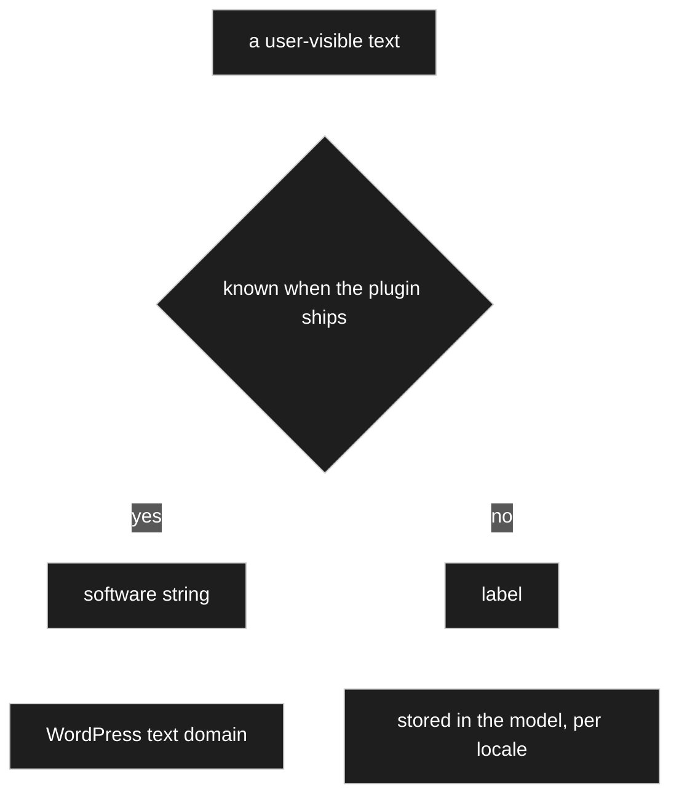
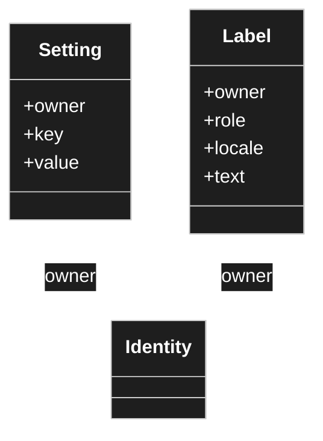
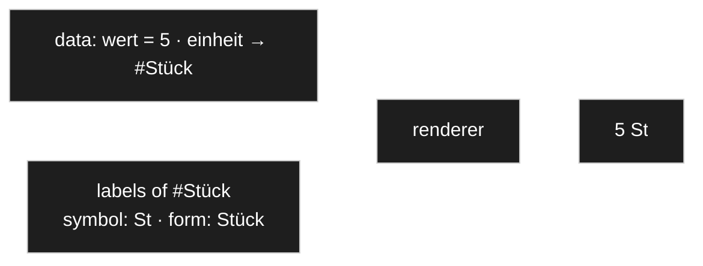

# I18n and labels

> **Status: `draft`.** Owner statements of 2026-08-22 plus a design the owner delegated
> ("think it through"). Recorded as decided so work can continue — see
> [D-019](90-decision-log.md), [D-020](90-decision-log.md) — and open to veto.

## Purpose

Define how text is handled so that **nothing user-visible is hard-coded**, how a node carries
several labels of different lengths, and how a node always has *something* to show.

## Owner statement — 2026-08-22

| # | Statement |
|---|---|
| **I1** | As little hard-coded text as possible — ideally **none**. |
| **I2** | A node name is text too. Identity runs over the **id**, not over the name. |
| **I3** | Every text should be translatable. |
| **I4** | A node carries **several labels**: a long description, a form label, a table label, and a symbol of roughly three characters or fewer. |
| **I5** | A node also carries an **icon**, which is *not* language-dependent but must be changeable in a suitable place. |
| **I6** | Validators and dialogs contain texts that must be translatable too. |
| **I7** | WordPress standard is preferred, including for multilingual operation. |
| **I8** | Modelling translations as nodes is not sensible — they are not really translations in that sense. |
| **I9** | Configuration values such as an upper bound, a lower bound and a step are a **different thing** from labels and should be kept apart, possibly in their own table. |
| **I10** | A node must **always have a name by default**, even when no translation was entered. |

## I1 — the two kinds of text, which must not be confused



| | **Software string** | **Label** |
|---|---|---|
| Examples | button captions, column headings, validator wording, admin chrome | what the user calls the nodes they create: *Resistor*, *Parts list*, *Quantity* |
| Known when? | at build time | at run time, invented by the model author |
| Translated by | a translator, once, for everyone | the model author, in this installation |
| Mechanism | WordPress text domain | this document |

They cannot share a mechanism: WordPress translation works from a catalogue extracted from
source code, and a node created yesterday has no entry there and never will. The reverse is
just as bad — software strings in the model means every installation re-translating the same
words.

For software strings there is nothing to design: `__()`, `_x()`, `esc_html__()` with the text
domain, `wp.i18n` with registered script translations for JavaScript. **I7 is satisfied there.**
The only rule that matters is *without exception* — one hard-coded caption is the one that
cannot be translated later.

## I2 — a node is its id, never its name

Identity is the id. A label is content that varies by locale. Nothing looks a node up by its
displayed text, compares against it, or branches on it. Rename a node, or view the model in
another language, and behaviour is unchanged.

## I9 — labels and settings are separate storage



Both carry the `owner` — the **one** identity they belong to, node or edge alike. A concrete
node looks like this:

| owner | role | locale | text |
|---|---|---|---|
| `#4711` | `long` | `de_DE` | Widerstandswert |
| `#4711` | `long` | `en_US` | Resistance value |
| `#4711` | `form` | `de_DE` | Wert |
| `#4711` | `table` | `de_DE` | R |
| `#4711` | `symbol` | `de_DE` | Ω |

A **role** is written plain — `form`, not `label.form`. The prefix made *label* look like both
the umbrella and one of its parts ([D-023](90-decision-log.md)).

An earlier draft of this document put labels into the settings table with an added `locale`
column. **The owner objected and was right.** The two have different shapes, and a column that
is empty on most rows is the table saying so:

| | **Setting** | **Label** |
|---|---|---|
| Key by | `key` | `role` + `locale` |
| Value | number, flag, reference — typed | text |
| Row count | one per configured key | multiplied by every locale |
| Read by | validators, renderers, resolution | display only |
| Edited by | the model author, once | whoever translates, repeatedly |

`min`, `max`, `step`, `hide`, `read_only`, `order`, the renderer choice — and **`icon`**, which
[I5](#owner-statement--2026-08-22) explicitly calls language-independent — are settings.
`long`, `form`, `table`, `symbol` are labels.

**What does not change: both are attributes.** [D-011](90-decision-log.md) still holds at the
concept level, and both resolve through the *same* mechanism — inherited along the inheritance
edge, overridable per use site, sparse ([D-015](90-decision-log.md)). One resolver, two tables.
Splitting the storage does not mean building the walk twice.

This makes the base tables **nodes, settings, labels, relations** — one more than
[P4](50-wordpress-persistence.md) named. See [D-019](90-decision-log.md).

## I10 — a node always has a name

The problem the owner spotted: if labels live only per locale and the author entered only
German, an English viewer gets nothing. Falling back to the role key would put a bare `form` on
screen.

**Two mechanisms together, and neither stores a placeholder.**

**1. A locale-neutral base name on the node itself.** A fixed attribute in the sense of
[C4](10-domain-core.md): every node has one, always, entered when the node is created. It is
the model author's own vocabulary and is not translated.

It is a **label of last resort, not an identifier** — [I2](#i2--a-node-is-its-id-never-its-name)
still forbids looking anything up by it. It is also what the admin sorts and searches by when
working across locales.

**2. Roles fall back to the long label, which falls back to the base name.**

```
<role>  in the exact locale
  → <role>  in the language
      → long  in the exact locale
          → long  in the language
              → node.name        ← always present, never empty
```

The useful consequence: **only `long` is worth entering per locale.** The other roles are
opt-in refinements, filled in only where they should genuinely differ — a table column that
wants `R` rather than *Resistance value*. That answers the owner's open question directly: no,
the form and table names do **not** have to be stored as well. Only when they should differ.

### On the placeholder idea

The owner suggested writing something like `nodename.form` as a stored value. Same goal, and
the chain above reaches it without storing anything — which is better for three reasons: a
stored placeholder is data that can go stale or be mistyped; every consumer would have to know
to interpret it; and it re-introduces lookup by text, which [I2](#i2--a-node-is-its-id-never-its-name)
rules out. A computed fallback has none of those properties.

## "5 Stück" — where the unit is data and where it is display

The owner objected to [D-044](90-decision-log.md), which turned the old `display_node_name` data
type into a renderer, on these grounds: *if my data says five pieces, then "Stück" has to be part
of the data — a renderer only says how something is shown, not how it was stored.*

**That objection is right, and the answer is that two different things were sitting under one
name.**



| | Is it data? | Where it lives |
|---|---|---|
| **That the unit is `Stück`** | **yes** | the `einheit` attribute — a reference to a node, stored, part of the record |
| **That `Stück` is written `St`, or `Stück`, or `pcs`** | no | a label of that node, in a role and a locale |

So the unit **is** part of the data, exactly as the owner says — as a **reference**, which is what
[D-041](90-decision-log.md) makes it. What is not part of the data is the string. Rename the node
or switch locale and the record is unchanged; only the rendering differs.

### What the renderer then does

Rendering `5 Stück` is [R6/R7](30-renderer.md) doing its ordinary job, one level down:

1. The registry is handed the `Menge` node and finds its unit-value renderer.
2. That renderer renders `wert` — an integer — as `5`.
3. It hands `einheit` back to the registry, which reaches the referenced node `Stück`.
4. `Stück` renders as one of its **labels**, and *which role* is a **setting on the renderer** —
   `symbol` gives `St`, `form` gives `Stück`.

**That setting is what `display_node_name` really was.** The old data type bundled *make the
reference visible* together with *choose which text* — and only the second half is presentation.
The first half was already covered, because the reference is an attribute.

### The case that is genuinely open

An invoice may want the wording **frozen** as of the day it was written, so that renaming a unit
later does not rewrite history. Under the rules decided so far a label **tracks**
([D-015](90-decision-log.md)) — so this needs its own answer, and it is the same question as
[OQ-027](91-open-questions.md), applied to labels rather than to settings.
→ [OQ-049](91-open-questions.md).

## Locale resolution

WordPress core determines a locale per request and can switch it. It provides **no** standard
for multilingual *content* — Polylang, WPML and TranslatePress each solve it differently and
are mutually incompatible.

**Depend on none of them.** Resolve against the locale core already gives. The plugin then
works standalone and can still be bridged to a multilingual plugin later.

## I6 — where the two kinds meet

A validator message is a software string; the numbers in it are settings. *The value must be
between 0 and 1000* comes from the catalogue, `0` and `1000` from the node. This only works if
the message is a **format with named placeholders** — a sentence assembled from fragments
cannot be translated into a language that orders them differently.

## Open

- [OQ-028](91-open-questions.md) — is the set of label roles fixed, or extensible?
- [OQ-029](91-open-questions.md) — are the seed's length hints advisory or validated?
- [OQ-030](91-open-questions.md) — may a model author supply their own validator message?
- [OQ-032](91-open-questions.md) — is the base name unique anywhere, and is it required at creation?

## Harvest candidates

| Source | What is in it |
|---|---|
| [`I18nMeremaid.md`](I18nMeremaid.md) | Seed: the label-role list with length hints — that part survives. Its storage shape (a node per translation) is rejected by [I8](#owner-statement--2026-08-22). |
