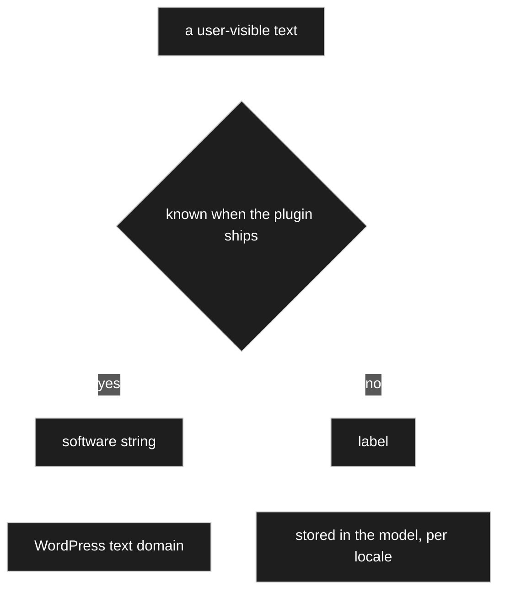
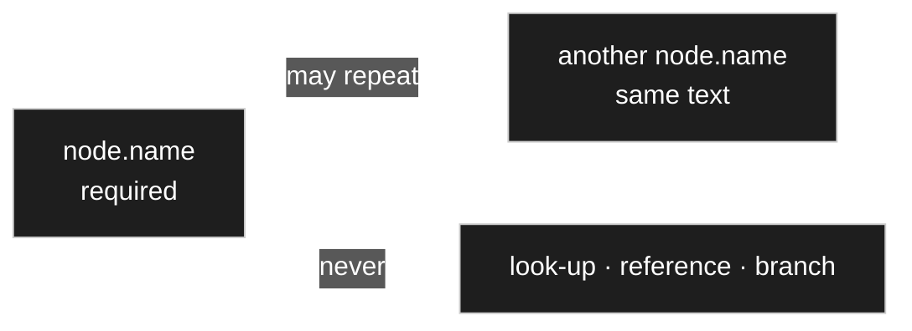
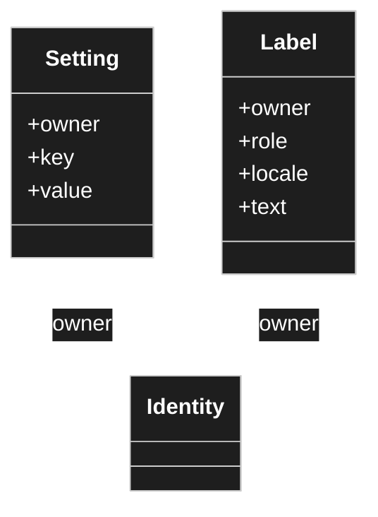
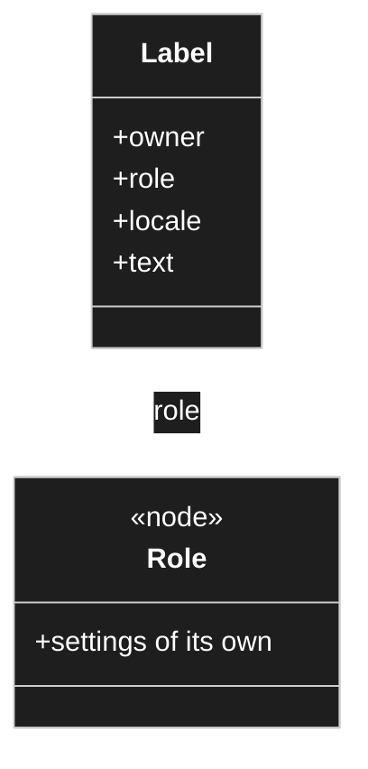
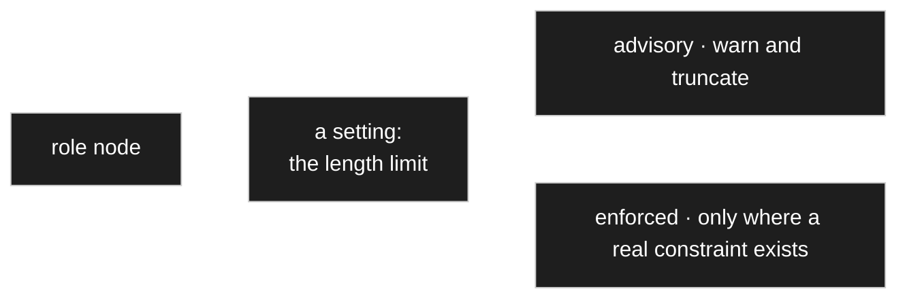
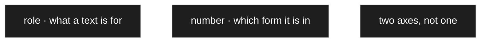
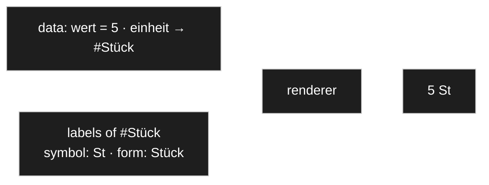
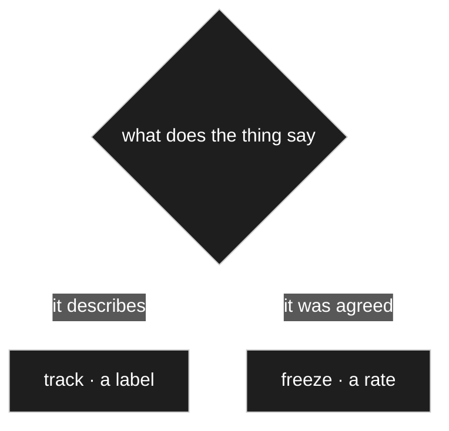
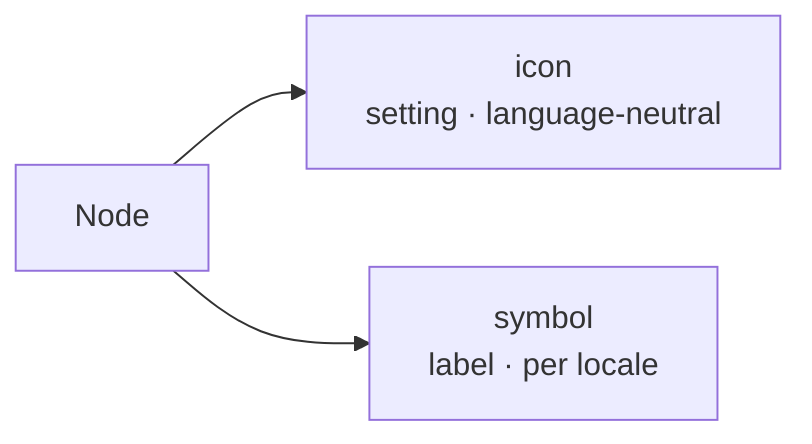
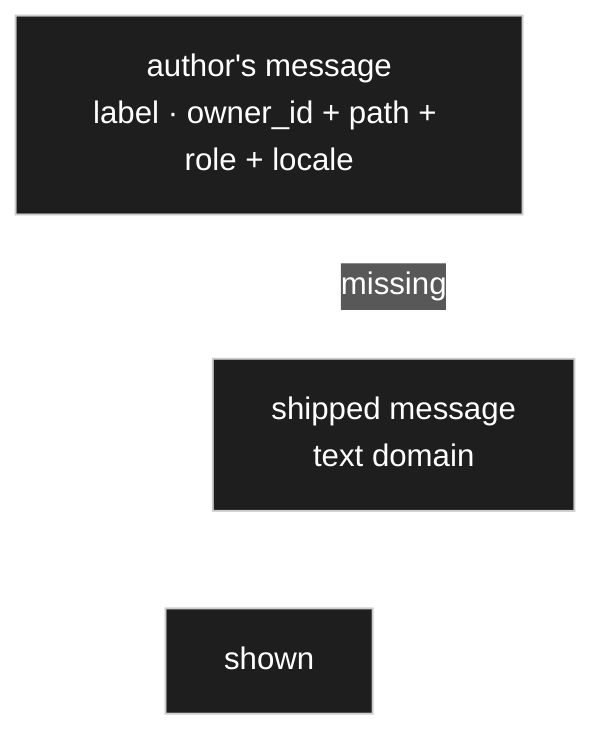

# I18n and labels

> **Status: `draft`.** Owner statements of 2026-08-22 plus a design the owner delegated
> ("think it through"). Recorded as decided so work can continue — see
> [D-019](90-decision-log.md), [D-020](90-decision-log.md) — and open to veto.
>
> **Caught up 2026-08-23** with the decisions taken after the first draft:
> [D-022](90-decision-log.md), [D-053](90-decision-log.md), [D-065](90-decision-log.md),
> [D-151](90-decision-log.md), [D-152](90-decision-log.md), [D-153](90-decision-log.md),
> [D-158](90-decision-log.md), [D-196](90-decision-log.md). Where this text and a decision
> disagree, the disagreement is **not** resolved here — it is listed in
> [`_harvest/contradictions.md`](_harvest/contradictions.md) for the owner
> ([PR-4](../../CLAUDE.md)).

## Purpose

Define how text is handled so that **nothing user-visible is hard-coded**, how a node carries
several labels of different lengths, and how a node always has *something* to show.

## Owner statement — 2026-08-22

| # | Statement |
|---|---|
| **I1** | As little hard-coded text as possible — ideally **none**. |
| **I2** | A node name is text too. Identity runs over the **id**, not over the name. |
| **I3** | Every text should be translatable. |
| **I4** | A node carries **several labels**: a long description, a form label, a table label, and a symbol of roughly three characters or fewer. |
| **I5** | A node also carries an **icon**, which is *not* language-dependent but must be changeable in a suitable place. |
| **I6** | Validators and dialogs contain texts that must be translatable too. |
| **I7** | WordPress standard is preferred, including for multilingual operation. |
| **I8** | Modelling translations as nodes is not sensible — they are not really translations in that sense. |
| **I9** | Configuration values such as an upper bound, a lower bound and a step are a **different thing** from labels and should be kept apart, possibly in their own table. |
| **I10** | A node must **always have a name by default**, even when no translation was entered. |

## I1 — the two kinds of text, which must not be confused



| | **Software string** | **Label** |
|---|---|---|
| Examples | button captions, column headings, validator wording, admin chrome | what the user calls the nodes they create: *Resistor*, *Parts list*, *Quantity* |
| Known when? | at build time | at run time, invented by the model author |
| Translated by | a translator, once, for everyone | the model author, in this installation |
| Mechanism | WordPress text domain | this document |

They cannot share a mechanism: WordPress translation works from a catalogue extracted from
source code, and a node created yesterday has no entry there and never will. The reverse is
just as bad — software strings in the model means every installation re-translating the same
words.

For software strings there is nothing to design: `__()`, `_x()`, `esc_html__()` with the text
domain, `wp.i18n` with registered script translations for JavaScript. **I7 is satisfied there.**
The only rule that matters is *without exception* — one hard-coded caption is the one that
cannot be translated later.

## I2 — a node is its id, never its name

Identity is the id. A label is content that varies by locale. Nothing looks a node up by its
displayed text, compares against it, or branches on it. Rename a node, or view the model in
another language, and behaviour is unchanged.

### I2a — the base name is required, and explicitly not unique



[D-022](90-decision-log.md) answers both halves of [OQ-032](91-open-questions.md): the name is
**required**, and it is **explicitly not unique**. Duplicates are a normal modelling outcome —
two attributes may share a name, and two different nodes may each have a child of the same name.
**Nothing resolves, references or branches on a name;** references use the id, which is stable
while the name may change. Searching and sorting by name is fine.

## I9 — labels and settings are separate storage



Both carry the `owner` — the **one** identity they belong to, node or edge alike. A concrete
node looks like this:

| owner | role | locale | text |
|---|---|---|---|
| `#4711` | `long` | `de_DE` | Widerstandswert |
| `#4711` | `long` | `en_US` | Resistance value |
| `#4711` | `form` | `de_DE` | Wert |
| `#4711` | `table` | `de_DE` | R |
| `#4711` | `symbol` | `de_DE` | Ω |

A **role** is written plain — `form`, not `label.form`. The prefix made *label* look like both
the umbrella and one of its parts ([D-023](90-decision-log.md)).

An earlier draft of this document put labels into the settings table with an added `locale`
column. **The owner objected and was right.** The two have different shapes, and a column that
is empty on most rows is the table saying so:

| | **Setting** | **Label** |
|---|---|---|
| Key by | `key` | `role` + `locale` |
| Value | number, flag, reference — typed | text |
| Row count | one per configured key | multiplied by every locale |
| Read by | validators, renderers, resolution | **shown, never branched on** — a validator *message* is a label ([D-158](90-decision-log.md)), but it is displayed, not tested |
| Edited by | the model author, once | whoever translates, repeatedly |

`min`, `max`, `step`, `hide`, `read_only`, `order`, the renderer choice — and **`icon`**, which
[I5](#owner-statement--2026-08-22) explicitly calls language-independent — are settings. The
label roles are listed in [I4a](#i4a--roles-are-nodes-seeded-and-extensible) below; the seeded
set was later restated by [D-196](90-decision-log.md).

**What does not change: both are attributes.** [D-011](90-decision-log.md) still holds at the
concept level, and both resolve through the *same* mechanism — inherited along the inheritance
edge, overridable per use site, sparse ([D-015](90-decision-log.md)). One resolver, two tables.
Splitting the storage does not mean building the walk twice.

This makes the base tables **nodes, settings, labels, relations** — one more than
[P4](50-wordpress-persistence.md) named. See [D-019](90-decision-log.md).

### I9a — what a label row carries

Two columns were added after this document was first drafted, each for a reason recorded in its
own decision, and neither introducing a new mechanism.

```php
// CONTRACT — the columns of a label row, as the decisions name them.
// owner_id   the one identity this label belongs to — node or edge (D-019, D-023, D-158)
// path       which thing inside that owner, addressed as a path of edge ids;
//            used to reach one validator of several (D-158)
// role       a reference to a role node (D-151)
// number     a plural category, sparsely filled — PROVISIONAL (D-153)
// locale     the locale this text is for (D-019)
// text       the text itself (D-019)
```

`owner_id` rather than `owner`: [D-158](90-decision-log.md) writes it that way, and
[D-090](90-decision-log.md) makes the `_id` suffix the rule for every column that holds a
reference. The class diagram above keeps the plain word because that is the *concept*
([D-023](90-decision-log.md)); the column is `owner_id`.

`path` is the third place this addressing appears — `record_values` uses it
([D-134](90-decision-log.md)) and override addressing already used it
([D-045](90-decision-log.md)). Same mechanism, no new concept
([D-158](90-decision-log.md)).

## I4a — roles are nodes, seeded and extensible



A role is **not** a string on the label row. It is a node, and `labels.role` references it
([D-151](90-decision-log.md)). Three things follow, and they are the reason for the decision:
the author gets a **picker** instead of free text; a **typo role** pointing nowhere cannot be
written; and a role may **carry properties of its own** — which is what
[I4b](#i4b--length-hints-are-settings-on-the-role-node) then uses.

This is possible only because [D-044](90-decision-log.md) had already made the role a **setting**
a renderer reads, rather than a constant it hard-codes. The name merely flows through, so it may
be data. Roles are *content determined at modelling time* in the sense of
[D-048](90-decision-log.md).

**The seeded set is not the possible set.** Two decisions name a seeded set, and they do not name
the same one:

| Decision | Seeded roles |
|---|---|
| [D-151](90-decision-log.md) | `long`, `form`, `table`, `symbol` — `plural` was withdrawn by [D-153](90-decision-log.md) |
| [D-196](90-decision-log.md) | `form`, `table`, `select`, `symbol`, `help` |

[D-196](90-decision-log.md) was read off the legacy detail screen and confirmed by the owner:
those were the standard fields, and being able to fill them **right beside the node** is what
keeps them filled at all — *a label written later is a label never written*. It also records that
`long` was not the owner's word, and that `help` is the same thing under a better name.

**Open — not resolved here:** [D-151](90-decision-log.md) makes `long` **mandatory**, because the
fallback chain of [D-020](90-decision-log.md) and [D-153](90-decision-log.md) ends on it, while
[D-196](90-decision-log.md)'s seeded set has no `long` at all. See
[`_harvest/contradictions.md`](_harvest/contradictions.md).

[D-151](90-decision-log.md) also records that the long description **doubles as the tooltip**, so
no separate `tooltip` role is needed, and that further roles (`abbreviation`, `placeholder`,
`help`) are additions rather than decisions to get right now.

## I4b — length hints are settings on the role node



The seed sketch annotated each role with a length — `symbol ≤ 3`, `form ≤ 15`. Because a role is
a node ([I4a](#i4a--roles-are-nodes-seeded-and-extensible)), those become **ordinary settings on
the role**: editable, inheritable, no new mechanism ([D-152](90-decision-log.md)).

**They are advisory by default**, and the reason is worth keeping: a limit set from German will
bite in Finnish. The editor warns and the renderer may truncate, but **nothing is refused**. A
role may set its limit to *enforced* where a real constraint exists — a fixed-width column in an
exported format is the case named.

## I4c — number is a column, not a role · `provisional`



`plural` was first proposed as a **role** and withdrawn. It breaks as soon as roles carry
genuinely different texts: with `table` = *Pos.* and `long` = a description, *the plural of the
name* is ambiguous, and the fallback would land on a **description** — *no Position, the line of
a parts list, found* ([D-153](90-decision-log.md)).

So `labels` gains a **`number`** column holding a plural category, **sparsely filled** — nobody
enters `symbol · other`, and in practice one row is added. Languages with more numerus categories
need further allowed values (`few`, `many`), not a redesign.

> ⚠️ **`provisional`.** The owner named the doubt himself: it is not certain this earns a column
> at all — the alternative is no mechanism, with authors simply writing *Positionen* into
> whichever label needs it. **The trigger for revisiting** is written into the decision: when the
> first list view and the first count are built, check whether a plural was actually needed **on
> a node** rather than on an edge ([D-153](90-decision-log.md)).

## I10 — a node always has a name

The problem the owner spotted: if labels live only per locale and the author entered only
German, an English viewer gets nothing. Falling back to the role key would put a bare `form` on
screen.

**Two mechanisms together, and neither stores a placeholder.**

**1. A locale-neutral base name on the node itself.** A fixed attribute in the sense of
[C4](10-domain-core.md): every node has one, always, entered when the node is created. It is
the model author's own vocabulary and is not translated.

It is a **label of last resort, not an identifier** — [I2](#i2--a-node-is-its-id-never-its-name)
still forbids looking anything up by it. It is also what the admin sorts and searches by when
working across locales.

**2. Roles fall back to the long label, which falls back to the base name.**

```
<role>  in the exact locale
  → <role>  in the language
      → long  in the exact locale
          → long  in the language
              → node.name        ← always present, never empty
```

**Number comes before role.** [D-153](90-decision-log.md) adds the second axis
([I4c](#i4c--number-is-a-column-not-a-role--provisional)) and states the resulting order
explicitly — *number first, then role*:

```
form·other  →  form·one  →  long·one  →  node.name
```

⚠️ Both chains end on `long`, which [D-196](90-decision-log.md) leaves out of the seeded set.
Not resolved here — see [`_harvest/contradictions.md`](_harvest/contradictions.md).

The useful consequence: **only `long` is worth entering per locale.** The other roles are
opt-in refinements, filled in only where they should genuinely differ — a table column that
wants `R` rather than *Resistance value*. That answers the owner's open question directly: no,
the form and table names do **not** have to be stored as well. Only when they should differ.

### On the placeholder idea

The owner suggested writing something like `nodename.form` as a stored value. Same goal, and
the chain above reaches it without storing anything — which is better for three reasons: a
stored placeholder is data that can go stale or be mistyped; every consumer would have to know
to interpret it; and it re-introduces lookup by text, which [I2](#i2--a-node-is-its-id-never-its-name)
rules out. A computed fallback has none of those properties.

## "5 Stück" — where the unit is data and where it is display

The owner objected to [D-044](90-decision-log.md), which turned the old `display_node_name` data
type into a renderer, on these grounds: *if my data says five pieces, then "Stück" has to be part
of the data — a renderer only says how something is shown, not how it was stored.*

**That objection is right, and the answer is that two different things were sitting under one
name.**



| | Is it data? | Where it lives |
|---|---|---|
| **That the unit is `Stück`** | **yes** | the `einheit` attribute — a reference to a node, stored, part of the record |
| **That `Stück` is written `St`, or `Stück`, or `pcs`** | no | a label of that node, in a role and a locale |

So the unit **is** part of the data, exactly as the owner says — as a **reference**, which is what
[D-041](90-decision-log.md) makes it. What is not part of the data is the string. Rename the node
or switch locale and the record is unchanged; only the rendering differs.

### What the renderer then does

Rendering `5 Stück` is [R6/R7](30-renderer.md) doing its ordinary job, one level down:

1. The registry is handed the `Menge` node and finds its unit-value renderer.
2. That renderer renders `wert` — an integer — as `5`.
3. It hands `einheit` back to the registry, which reaches the referenced node `Stück`.
4. `Stück` renders as one of its **labels**, and *which role* is a **setting on the renderer** —
   `symbol` gives `St`, `form` gives `Stück`.

**That setting is what `display_node_name` really was.** The old data type bundled *make the
reference visible* together with *choose which text* — and only the second half is presentation.
The first half was already covered, because the reference is an attribute.

### A label tracks · it never freezes

This section used to end with the invoice case as an open question. It is closed.



**Rename is not replace** ([D-053](90-decision-log.md)). A rename or relabel touches a **label**:
the reference is unchanged, so the data are unchanged and only the wording of the output differs
— **keep it current, never freeze**. Replacing or removing a node touches a **reference**: that
changes the model version and produces a conflict in existing data, which the user resolves
through the conflict resolver ([70 Migration](70-migration.md)).

**Documents do not argue against this.** An exported PDF is detached the moment it is produced,
and regenerating it later giving a different document is expected rather than wrong
([D-053](90-decision-log.md)).

**The general test is [D-065](90-decision-log.md): track what describes, freeze what was agreed.**
A label is a *name* for a thing, so it tracks; an exchange rate is a *term of an agreement*, so it
freezes ([D-064](90-decision-log.md)). The rule is neither *always track* nor *always freeze*, and
this is what separates the two cases.

[OQ-049](91-open-questions.md) is closed by this.

## I4d — `icon` and `symbol` sit next to each other and are not the same



The legacy detail screen puts them in one presentation panel, side by side, which is why they had
already been confused once ([D-252](90-decision-log.md)).

| | Is | Lives in | Per locale |
|---|---|---|---|
| **`icon`** | a glyph picked from the installation's allow-list | **settings** | no — the same everywhere |
| **`symbol`** | a very short text: `Ω`, `Pos.`, `St` | **labels**, as a role ([D-196](90-decision-log.md)) | yes |

The owner's own wording: *the icon is a little picture you can pick; the symbol is something like
`Ω`, or `Pos.` — a very short form.*

⚠️ **Getting this wrong is expensive in a specific way:** a language-neutral value stored in the
labels table, or a translated one in the settings table, both work perfectly until the **second**
locale arrives — and by then the data are there and the mistake is a migration.

The icon is also drawn in the tree, where a glyph is read faster than a word
([D-251](90-decision-log.md)).

## Locale resolution

WordPress core determines a locale per request and can switch it. It provides **no** standard
for multilingual *content* — Polylang, WPML and TranslatePress each solve it differently and
are mutually incompatible.

**Depend on none of them.** Resolve against the locale core already gives. The plugin then
works standalone and can still be bridged to a multilingual plugin later.

## I6 — where the two kinds meet

A **shipped** validator message is a software string; the numbers in it are settings. *The value
must be between 0 and 1000* comes from the catalogue, `0` and `1000` from the node. This only
works if the message is a **format with named placeholders** — a sentence assembled from
fragments cannot be translated into a language that orders them differently.

### I6a — an author-written validator message is a label



A model author **may** replace a validator message, and when they do it becomes **content**, so it
needs a locale like any other display text. It is therefore a **label** — same table, same
resolution walk, same fallback chain — with the shipped text underneath so the chain never ends
empty ([D-158](90-decision-log.md)).

**It is per validator, not per attribute.** The owner's correction: an attribute may carry range,
format and uniqueness checks, which is three messages rather than one. That is what the `path`
column of [I9a](#i9a--what-a-label-row-carries) is for — `owner_id` is the edge, `path` names the
validator, `role` is the message.

**Placeholders survive, and the named-placeholder format stays mandatory.** An author message may
contain `{min}` and `{max}`, for exactly the reason [I6](#i6--where-the-two-kinds-meet) gives
above.

**Catalogue versus case is not a choice** — it is the two ends of one walk
([D-015](90-decision-log.md)): set on the validator node the message applies everywhere, set at a
use site it overrides there.

> ⚠️ **What the author may not change is the offered correction.** That is behaviour, and
> behaviour is code ([D-036](90-decision-log.md)). The author says **what went wrong**, not
> **what the system should do about it** ([D-158](90-decision-log.md)).

[OQ-030](91-open-questions.md) is closed by this.

## Open

Every question this document was drafted around has since been answered. Kept as a record of
where the answer went:

| | Closed by |
|---|---|
| [OQ-028](91-open-questions.md) — is the set of label roles fixed, or extensible? | [D-151](90-decision-log.md) — nodes, a seeded base set, extensible |
| [OQ-029](91-open-questions.md) — are the seed's length hints advisory or validated? | [D-152](90-decision-log.md) — settings on the role node, advisory by default |
| [OQ-030](91-open-questions.md) — may a model author supply their own validator message? | [D-158](90-decision-log.md) — yes, as a label, per validator |
| [OQ-032](91-open-questions.md) — is the base name unique anywhere, and is it required at creation? | [D-022](90-decision-log.md) — required, and not unique |
| [OQ-049](91-open-questions.md) — can a label be frozen at the moment of use? | [D-053](90-decision-log.md), [D-065](90-decision-log.md) — no; it tracks |

What is **not** settled is listed in [`_harvest/contradictions.md`](_harvest/contradictions.md),
because it is a disagreement between decisions rather than an unasked question. One item on the
list is also carrying a named doubt of its own: [D-153](90-decision-log.md) is `provisional`
([I4c](#i4c--number-is-a-column-not-a-role--provisional)).

## Harvest candidates

| Source | What is in it |
|---|---|
| [`I18nMeremaid.md`](I18nMeremaid.md) | Seed: the label-role list with length hints — that part survives; the hints became settings on the role node ([D-152](90-decision-log.md)). Its storage shape (a node per translation) is rejected by [I8](#owner-statement--2026-08-22). [D-151](90-decision-log.md) records that the seed carried a fifth role, `short`, lost along the way. |
