# Persistence

> **Status: `draft`.** Contains owner statements of 2026-08-22, written down but **not yet
> confirmed**. Legacy material has not been harvested into this document yet.
>
> **Caught up on 2026-08-23** with the decisions taken after it was drafted. Where the text and a
> decision disagree, nothing was resolved here — the row went to
> [`_harvest/contradictions.md`](_harvest/contradictions.md), per `PR-4`.

## Purpose

Define how the domain core is stored, and how much of the storage layer is allowed to leak
back into the model.

## Owner statement — 2026-08-22

| # | Statement |
|---|---|
| **P1** | The nodes are to be stored **relationally**. |
| **P2** | In addition, **settings per node**, stored **generically in a settings table** — a node *may* have settings. |
| **P3** | Likewise **a table for the relations**. |
| **P4** | These are the base tables for storing the model data later: **nodes, settings, relations**. → amended to **nodes, settings, labels, relations** by [D-019](90-decision-log.md). |

### Object-based model, relational storage — not a contradiction

[Vision and scope](00-vision-and-scope.md) says the product models data *object-based rather
than relational*. P1 says nodes are stored *relationally*. These are different layers and
both hold:

- **What the user builds** is an object graph — nodes, edges, inheritance.
- **How it is persisted** is a small fixed set of relational tables that carry that graph.

The tables are generic (node, setting, relation) — the user's model does **not** produce one
table per modelled entity. That is precisely the point of the product. Worth stating in the
concept in these words, because the two sentences read as opposites out of context.

### Decided — tables owned by this plugin

**[D-007](90-decision-log.md), 2026-08-22:** *relationally* means **tables owned by this
plugin** — not `wp_posts`, `wp_postmeta`, terms or CPTs. The project is complex enough that
WordPress storage primitives would cost more than they give.

This closes the model half of [OQ-012](91-open-questions.md) and is the sole architecture rule
currently in force ([`CLAUDE.md`](../../CLAUDE.md) AR-1).

**Scope limit, stated deliberately:** D-007 covers the **model** — nodes, settings, relations.
Where the **content** described by a model is stored is a different question and stays open →
[OQ-015](91-open-questions.md). It cannot be answered until [10 Domain core](10-domain-core.md)
says whether *model* and *instance* are even different kinds of thing.

### P1a — WordPress is used to the full, and what is borrowed is written down

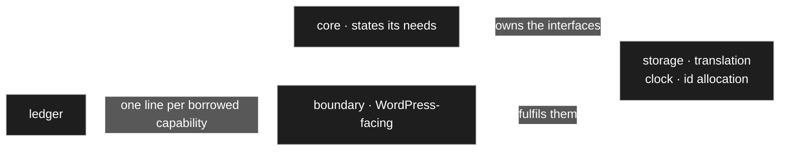

[D-007](90-decision-log.md) says the model does not live in WordPress storage primitives. It does
**not** say WordPress is held at arm's length. [D-169](90-decision-log.md) settles the other half:
this is a WordPress plugin and every capability that helps is used — nothing is reimplemented to
stay neutral, and no capability is passed over because another framework might lack it. Portability
is served by **knowing what was borrowed**, not by borrowing less.

[D-170](90-decision-log.md) says how that is recorded. **The namespace is the marker** — everything
under the boundary namespace is WordPress-facing by definition, so no `wp` prefix on class names;
prefixes stay where WordPress itself demands them: tables, hooks, options. **Beside it a short
ledger**, one line per borrowed capability and what would have to replace it, because a namespace
catches WordPress *calls* but not WordPress *assumptions* — the capability model, the block
editor's data shapes, `dbDelta`'s idea of a schema, the shape of an admin screen. Two additions are
marked in that decision as its author's own call: the **core states its own needs as interfaces it
owns** — storage, translation, clock, id allocation — which the boundary *fulfils*; and **the
boundary translates, it does not decide**.

[D-169](90-decision-log.md) also makes `CD-1` testable rather than aspirational: the core's tests
run **without** a WordPress bootstrap, the boundary's **with** one. Two separate runs, so a
WordPress call drifting into the core fails on the first.

### Open

- Sequencing: this document was meant to be written after the core is locked
  ([D-004](90-decision-log.md) reasoning). P1–P4 arrive early. They are recorded, but a
  storage shape must not be allowed to bend the core — if it starts to, that is raised as an
  open question rather than resolved here.

## Owner statement — 2026-08-22, second pass: no table per model

| # | Statement |
|---|---|
| **P5** | **There will not be a database table per model.** The data have to be stored some other way. |
| **P6** | How exactly is **not yet defined**. |
| **P7** | And it does not greatly matter: *"I define my model, and with the model I also know how the data are to be interpreted. How they are stored efficiently underneath recedes into the background."* |

### P7 is right, and it has one consequence worth naming

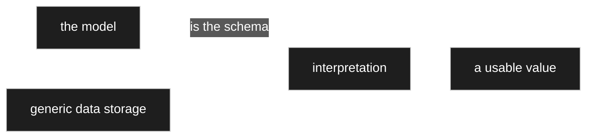

**The model is the schema** ([D-066](90-decision-log.md)). Storage holds values without knowing what
they mean; the model says how to read them. That is the same shape the settings table already has
([D-011](90-decision-log.md)), one layer down — and it is what makes a modeller possible at all,
since a table per model would mean schema changes at run time.

The consequence, stated plainly so it is not a surprise later: **no query can filter on a domain
field without going through the model.** *All parts lists with a total over 1000* is not a `WHERE`
clause on a column; it is a lookup of which edge carries that attribute, then a filter on generic
rows. That is workable — it is what [D-014](90-decision-log.md)'s batched loading and indexed
walks are for — but it has to be designed in rather than discovered when the first report is
wanted.

**P6 stays open on purpose.** The shape of the data tables is [OQ-015](91-open-questions.md), and
[D-004](90-decision-log.md) keeps it out of code until the core is locked.

**Open:** [D-165](90-decision-log.md) later introduced a **flat projection per model** for the
reporting case ([P11b](#p11b--the-stage-above-is-a-flat-projection-per-model-and-it-is-a-cache)). It
is declared a cache, which answers the *duplicated fact* objection but not
[D-066](90-decision-log.md)'s, which was about **schema changes at run time**. See
[`_harvest/contradictions.md`](_harvest/contradictions.md).

## Owner statement — 2026-08-22, third pass: search is a requirement

| # | Statement |
|---|---|
| **P8** | Such queries **must be possible, and as fast as can be managed**. This is hereby settled rather than left open. |
| **P9** | Concretely: *all BOMs over a thousand euro*; *all BOMs containing a particular part*; *all parts that appear in a particular BOM* — and so on. |
| **P10** | **Almost exactly what a relational database can do**, only finer-grained here. |
| **P11** | The picture: as if all values lay in one row of a table, and a selection were assembled through well-chosen categories and the ids of type assignments. |

P11 describes the entity-attribute-value shape, and it is the right picture. What follows is what
it takes to make P8 true rather than aspirational.

### The three examples are three different query shapes

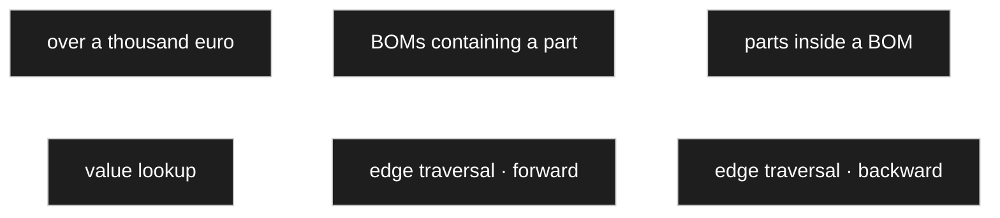

| Query | Needs |
|---|---|
| all BOMs over 1000 € | find records whose value **on a particular attribute** exceeds a number |
| all BOMs containing part X | traverse **from** a record **to** a target and back |
| all parts inside BOM Y | the same traversal in the other direction |

So two capabilities: an **indexed value lookup** and an **indexed edge traversal both ways**.

### Why the edge id is what makes this work

Because an attribute **is** a relation with a stable id ([D-031](90-decision-log.md)), the edge id
plays the part a column name plays in a relational schema. *All BOMs over a thousand* becomes:

```sql
-- SKETCH
WHERE edge_id = 94 AND value_decimal > 1000
```

That is an ordinary indexed range scan — as fast as a column, and it stays fast as the model grows,
because the model growing adds edge ids rather than widening any row.

### The one thing that would ruin it

**Values must live in typed columns, never in a single stringly `value`.** With everything stored
as text, `'900' > '1000'` is true, ranges cannot be indexed usefully, and P8 quietly becomes
impossible. So: a numeric column for numbers, a text column for text, a reference column for node
references, a date column for dates — with only one filled per row, or separate tables per kind.

This is the decision that has to be made **before** the data tables exist, which is why it belongs
here rather than in implementation.

### And it forces something about calculations

*All BOMs over a thousand euro* filters on `gesamtpreis`, which is **computed**
([D-043](90-decision-log.md)). A value computed on read cannot be filtered on without computing it
for every candidate record — which is exactly the scan P8 rules out.

**So computed values are materialised**: written when their inputs change, and read like any other
value ([D-072](90-decision-log.md)). That answers [OQ-046](91-open-questions.md), and it is the
moment the invalidation index of [D-045](90-decision-log.md) stops being an optimisation and becomes
load-bearing — a stale total is now a **wrong search result**, not merely a stale display.

**With one exception, decided afterwards.** A **backward** aggregate — *who points at me*, the
average purchase price of a part across all order lines — is computed **on read and never
materialised**, because its invalidation fans out: one new order line would touch a computed field
on a part and thence every parts list using it ([D-140](90-decision-log.md)). It is therefore **not
searchable**, and a forward calculation that takes one as an operand inherits that state
([D-142](90-decision-log.md)). The way back to a searchable number is **freezing** — computed once,
on request, stored, no running dependency ([D-143](90-decision-log.md)). The three states are set
out in [60 Calculation](60-calculation.md).

### Honest about the limit

Combining conditions — over a thousand **and** containing part X — means intersecting two indexed
lookups. Two or three conditions are fine; a query with ten becomes a sequence of joins that no
index makes free. That is the price of the shape in P11, it is the same price every
entity-attribute-value design pays, and it is worth knowing now rather than at the first complex
report. → settled on 2026-08-23 by [D-165](90-decision-log.md), below.

### P11a — Correctness has no limit; speed is promised to about three conditions

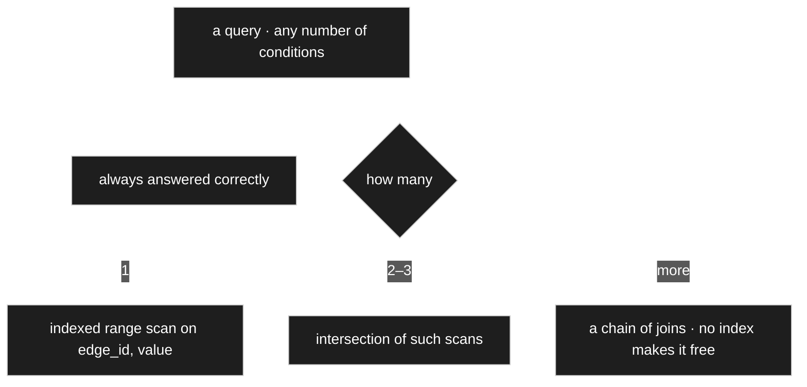

[D-165](90-decision-log.md) closes [OQ-056](91-open-questions.md). The generic query accepts **any
number** of conditions and always answers correctly — a hard cap would have to be explained in an
error message, and it would always sit in the wrong place. What is *promised* is narrower, and the
promise is exactly the three rungs above. Saying so is an honest description of an
attribute-value store ([P11](#owner-statement--2026-08-22-third-pass-search-is-a-requirement)),
not a weakness waiting to be optimised away.

### P11b — The stage above is a flat projection per model, and it is a cache

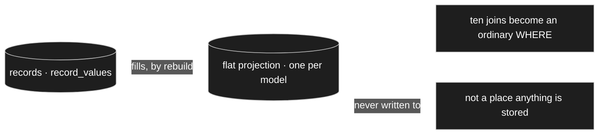

For the reporting case [D-165](90-decision-log.md) takes the owner's own way of thinking about
growth: **one flat projection per model** — a table with a column per attribute, filled from the
records. Ten joins become an ordinary `WHERE`, and the normal case pays nothing for it.

⚠️ **The projection is a cache and never a place where anything is stored.** Never written to, only
rebuilt — exactly the standing of a materialised computed value
([D-072](90-decision-log.md)). Without that line it would be the next duplicated fact, which the
code standard forbids outright.

**Open:** how the projection's own schema follows a model change, and what a `1..*` attribute
becomes in a table with one column per attribute, is not decided — see
[`_harvest/contradictions.md`](_harvest/contradictions.md).

### P11c — Finding text: one normalised column per record


[D-167](90-decision-log.md) closes [OQ-064](91-open-questions.md). The search structure is a
**normalised column per record**, written on save from the fields that are shown
([D-112](90-decision-log.md)) — lowercased, spacing and punctuation stripped, so `bc547b` finds
`BC 547 B`.

⚠️ **One normalisation function, shared with duplicate detection.** Two rules that *almost* agree
are the kind of fault nobody finds until a user swears the part is not there and it is.

The quick search is **contains, without syntax**, and there is **no wildcard character**: a `*` is a
third syntax that can do nothing the other two cannot, and typed by accident it searches literally
for a star. The deliberate filter surface gets a **visible operator field** instead — is · contains
· begins with · greater · between. Cost, honestly counted: one `LIKE '%x%'` over a single narrow
indexed column. Kept from the earlier proposal: a short delay after the last keystroke, and
**prefix hits ranked first**. The growth stage — n-gram full text or a token table — **stays
deferred by the owner** until there is real data to look at; like every index here it is derived and
rebuildable ([D-016](90-decision-log.md)).

**Two derived indexes of different scope, not one** ([D-154](90-decision-log.md)): the **search**
index **excludes** parked records, since a deleted part belongs in no chooser, while the
**uniqueness** index **includes** them, so a parked record keeps its `unique` values blocked and a
restore can never collide. After a purge the value is free.

**Open:** there is one search column per record and many use sites showing a record, while
[D-112](90-decision-log.md)'s shown fields are **per use site**. Which set fills the column is not
decided — see [`_harvest/contradictions.md`](_harvest/contradictions.md).

**And a search never runs against the rounded form** ([D-076](90-decision-log.md)). Only
*invertible* converters may serve input or search — gram ↔ kilogram, decimal ↔ hex, so `> XII`
parses to `12` before the query runs. Rounding, truncation and case changes are lossy and are
display only: `> 8.50` is evaluated on the stored value, or a row showing `8.50` while holding
`8.4999` answers wrongly.

## Owner statement — 2026-08-22, fourth pass: type safety down to the column

| # | Statement |
|---|---|
| **P12** | Type safety matters. That may well mean **separate nodes for whole numbers and for decimals**, each defined by its own node. |
| **P13** | And those nodes are **stored differently**, so that selection stays efficient. |
| **P14** | Calculation needs **numeric fields** — nothing can be computed otherwise. |

### P13 — and the objection to it does not hold

The obvious counter-argument is that splitting numbers across two columns makes *every numeric
query* hit two indexes. **It does not**, and the reason is worth writing down:

```sql
-- SKETCH
WHERE edge_id = 94 AND value_decimal > 1000
```

**`edge_id` already pins the type.** An attribute is one edge, that edge has one target type, and
the type says whether its values are whole or decimal. So a query never spans both columns — it
knows which one it means before it starts.

That removes the only real cost of splitting, and leaves the benefits: exact whole-number
semantics, a smaller and faster integer index, and no silent coercion.

| | |
|---|---|
| `value_int` | whole numbers — `BIGINT` |
| `value_decimal` | decimals — exact, never floating point ([D-057](90-decision-log.md)) |
| `value_text` | text |
| `value_ref` | a node reference ([D-041](90-decision-log.md)) |
| `value_date` | dates |

**The one case that does span columns** is a reporting question like *any numeric attribute
anywhere above X*, which ignores `edge_id`. That is rare, it belongs to
[OQ-056](91-open-questions.md), and it is not worth designing the common case around.

### Where type safety is actually enforced

Two layers, and keeping them apart matters:

- **The column** makes a wrong value *unstorable* — text cannot land in `value_int`.
- **The type node's validator** makes a wrong value *unacceptable*, with a message, and possibly
  with an offered correction ([V9](00-vision-and-scope.md)).

The column is the last line, not the first. A user should meet the validator, never a database
error.

## The tables — proposal, 2026-08-22

> ⚠️ **This is a proposal**, worked out to close [OQ-015](91-open-questions.md),
> [OQ-016](91-open-questions.md), [OQ-017](91-open-questions.md) and
> [OQ-039](91-open-questions.md). Everything in it follows from decisions already taken; where a
> call was mine it is marked.

### The model layer

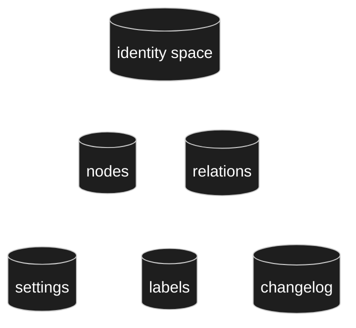

**Naming: every foreign key ends in `_id`** ([D-090](90-decision-log.md)). The owner asked whether
`owner` should be `owner_id`, having read it as a name rather than a reference — which is exactly
the confusion the suffix prevents.

| Table | Columns | Note |
|---|---|---|
| **nodes** | `id` · `version` · `name` · `path` | `id` from the shared identity space ([C11](10-domain-core.md)). `name` required, **not unique** ([D-022](90-decision-log.md)). `path` is the materialised ancestor path ([D-014](90-decision-log.md)) — **derived**, rebuildable, never a second truth. |
| **relations** | `id` · `version` · `from_id` · `to_id` · `kind` · `name` · `position` | `kind` an enum ([D-036](90-decision-log.md)). `name` empty for inheritance edges. `position` orders siblings — it belongs to the **edge**, because order is per parent, not per node. |
| **settings** | `owner_id` · `key` · typed value columns | `owner_id` a single real foreign key into the identity space ([OQ-022](91-open-questions.md) option 3) — it holds the `id` of the node **or** relation the row belongs to. Engine-owned keys are a reserved namespace, not a column ([D-084](90-decision-log.md)). |
| **labels** | `owner_id` · `role` · `locale` · `text` | [D-019](90-decision-log.md), roles plain ([D-023](90-decision-log.md)). |
| **changelog** | `owner_id` · `at` · `by_user_id` · `what` | The migration script ([D-061](90-decision-log.md)). |

**Why the column is called `owner_id` and not `node_id`:** it also holds relation ids. One number
space ([C11](10-domain-core.md)) means one column and a foreign key the database can actually
check. Without the shared space it would take two — *which kind* plus *which id* — and then
nothing could verify that the target exists.

**`Node.type` does not exist**, and that is a result rather than an omission: a node's type *is*
its position in the inheritance branch ([D-041](90-decision-log.md), [D-042](90-decision-log.md)).
Asking *what kind of thing is this* is asking who its ancestors are.

### P4a — Two identity spaces: one for the model, one for the records

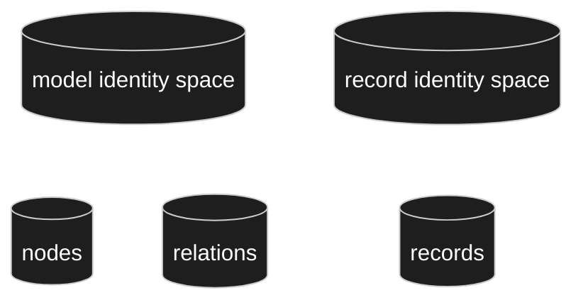

[D-164](90-decision-log.md) closes [OQ-036](91-open-questions.md): **records do not share the
model's identity space**, and **nodes and relations still share theirs**.

The two halves have different reasons. Between nodes and relations the ambiguity is genuine — a
setting or a label hangs on a node **or** on an edge and the model does not say in advance which, so
`owner_id` must be one real foreign key over both ([D-090](90-decision-log.md),
[C11](10-domain-core.md)). Between model and records there is no such ambiguity: a value reference
resolves to a node or to a record, and **the target type's placement decides which, per edge,
deterministically** ([D-131](90-decision-log.md)) — so a shared space would buy nothing.

And it costs something real: MySQL has no sequences, so one space across all tables means a
hand-built allocator — a single row behind a lock, sitting on the hottest write path in the system —
where per-table `AUTO_INCREMENT` is free and proven. Separate spaces also keep the two layers
honestly apart: model tables in the hundreds, data tables in the millions, and no invitation to
merge them.

⚠️ **The one column that may hold either sort is the changelog**, and it stores what it refers to
alongside — frozen history rather than a duplicated fact ([D-065](90-decision-log.md)).

### P4b — `slug` is not ours

[D-195](90-decision-log.md): *slug was something WordPress set; if we do not have it, it can be left
out.* It is a **boundary** concern ([D-170](90-decision-log.md), [P1a](#p1a--wordpress-is-used-to-the-full-and-what-is-borrowed-is-written-down)) —
where a URL needs one it is a setting held at the boundary — and it has no business among the four
fixed attributes of a node ([D-082](90-decision-log.md)). Which is why `nodes` above carries `id`,
`version`, `name`, `path` and nothing more.

### P4c — Concurrency: `version` is the guard, and it is deliberately coarse

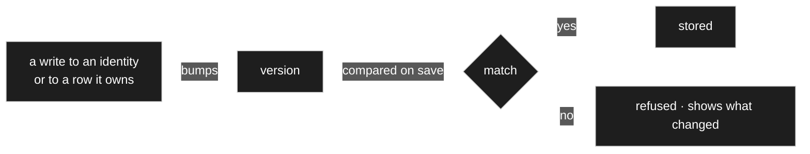

[D-089](90-decision-log.md), closing [OQ-060](91-open-questions.md). **The data layer is optimistic,
always** — compare `version` on save, refuse and show what changed; concurrent entry is the normal
case and must not be blocked. **The model layer is optimistic too**, with a heartbeat lease as a
*courtesy warning* (*X is currently editing this node*) that is advisory, not enforcement. Parallel
work is not forbidden.

`version` is bumped by **any** write to an identity or to the rows it owns — settings, labels — so
concurrent editing is detected even when two people touch different settings of one node. Coarse on
purpose: no change is ever silently lost. WordPress offers no optimistic locking at all, so the
comparison is entirely ours; its Heartbeat API is usable for the lease, `wp_set_post_lock()` is not
([D-007](90-decision-log.md)).

### OQ-016 answered — one construct, one mechanism, a reserved namespace

> A first version of this answer split settings into a *model scope* and a *system scope* with a
> `scope` column. **The owner rejected it and was right** — see
> [D-084](90-decision-log.md), which supersedes [D-078](90-decision-log.md).

The axis that actually matters is not *what kind of setting is this* but **where is it defined and
where may it be overridden** — and that is the same for every setting there is:


`min` is set on the integer node and narrowed at a use site. **The renderer, the converter and the
validators are set on the node too** — as initial values — and overridden at a use site in exactly
the same way. One mechanism, no partition.

**What survives from the earlier answer, with its phrasing corrected.** I first said the
difference was *does the engine branch on it*. The owner pointed out that **a renderer has to
honour `min` and `max` too** — a spinner cannot be drawn without them — so that phrasing does not
hold. The real distinction is **who owns the meaning of the key**:

| | Meaning defined by | Example |
|---|---|---|
| **engine-owned** | the engine, identically for every node | `hide`, `read_only`, `renderer`, `converter`, `validators` |
| **type-owned** | the type | `min`, `max`, `step` on an integer; something else entirely on a text type |

A spinner renderer reads `min` because it is registered **for that type** and knows what the type
means by it. The engine does not know what `min` is at all.

That distinction calls for a **reserved namespace** validated at write time, not a structural
split: an author must not be able to define a setting named `hide` and silently break rendering.
A rule about names, and one line of validation.

### The asymmetry — edge-only settings exist, node-only ones do not

The owner: *there are special edge settings; whether there are special node settings I doubt —
currently I think not.* That is right, and the reason is worth stating because it justifies the
direction of the whole resolution walk:

> **Everything sayable about a node is also sayable about one use of it. The reverse is not true.**

A node describes a *thing*; an edge describes a *use of a thing*. Any property of the thing can be
restated for one particular use — that is what overriding is. But some things can only be said
about a use, because the thing itself has no opinion on them:

| | Belongs to |
|---|---|
| `kind` · the attribute's `name` | the edge — fields on `relations` |
| **multiplicity** | the edge — *how many, here* |
| everything else | the node, with an override available at the edge |

Which is why settings resolve **node → edge** and never the other way.

**Multiplicity stays a setting rather than a column**, despite being read constantly, because it
inherits and can be narrowed — and a setting gets the resolution walk for free while a column
would need inheritance handled specially. [D-014](90-decision-log.md)'s batched load fetches it
with everything else. If profiling later demands it, denormalising is a cache, not a second truth.

**Why the column was a mistake:** its main justification was letting a renderer fetch only what it
needs. It does not partition that way. A renderer needs `hide` and `read_only` *and* the renderer
choice; a validator needs `min` and `max` *and* the validator choice. Both consumers want a mix,
so the split would have bought nothing and cost a distinction to maintain.

**A note on applicability:** a few keys only make sense on an edge — multiplicity is the clear one,
since a node has no multiplicity but a use of it does. That is about *where a key applies*, not
about a second mechanism. Multiplicity still inherits and is still overridable: a subtype may
narrow `0..1` to `1`.

**Settled since:** the question of whether the **base** multiplicity or the **resolved** one
decides storage **dissolved** — [D-232](90-decision-log.md) takes multiplicity out of the storage
rule entirely and lets the **branch** decide (see [P13d](#p13d--the-branch-decides-storage-not-the-multiplicity)).
Multiplicity still inherits and is still overridable; it simply no longer moves anything.

### OQ-039 answered — the installation is the root of the walk

An installation-wide default is a **system-scope setting on a reserved installation identity**,
and that identity is the first link of the resolution chain:

```
installation → model root → ancestors → node → use site
```

**This makes [D-032](90-decision-log.md) fall out of [D-015](90-decision-log.md) with no new
machinery.** *The configured default plus the choice in the moment* is simply the top and the
bottom of one walk that already exists. No second mechanism, no second lookup.

The installation identity is reserved and does not appear in the modeller. Genuinely
WordPress-shaped settings — which admin page, which capability — stay WordPress options at the
boundary; they are not model settings and do not belong in this walk.

### OQ-015 answered — the data layer

| Table | Columns |
|---|---|
| **records** | `id` · `model_id` · `model_version` · `is_test` |
| **record_values** | `record_id` · `edge_id` · `value_int` · `value_decimal` · `value_text` · `value_ref` · `value_date` |

- Five model tables and two data tables — seven in all ([D-083](90-decision-log.md), whose storage
  rule is superseded below by [D-133](90-decision-log.md)).
- `id` comes from the **record** identity space, not the model's
  ([D-164](90-decision-log.md), [P4a](#p4a--two-identity-spaces-one-for-the-model-one-for-the-records)) — a
  per-table `AUTO_INCREMENT`.
- `model_version` sits on the **record** ([D-060](90-decision-log.md)) — and the record **keeps**
  that stamp. There is no mass re-stamping: a migration walks the records a change actually broke
  and leaves the rest alone, so records at several versions are a normal steady state, and the stamp
  means *written against* rather than *checked against* ([D-210](90-decision-log.md)).
- `is_test` is the test-data flag ([D-028](90-decision-log.md)).
- Typed columns, never one stringly value ([D-071](90-decision-log.md), [D-074](90-decision-log.md)).
- `edge_id` is the attribute, and it is what makes a query indexable
  ([D-070](90-decision-log.md)).
- `value_ref` holds **a node id or a record id**, and which one is fixed per edge by the target
  type's placement ([D-131](90-decision-log.md)) — modelling-time content yields a node reference,
  input-time content a record reference. Since the two spaces are separate
  ([D-164](90-decision-log.md)), the column points into one of them **according to the edge**.

### P13a — The branch decides the kind, and the kind decides the storage

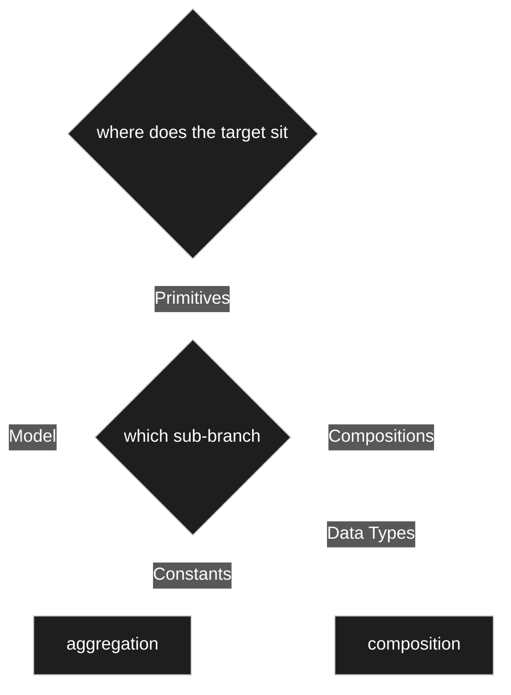

Storage is not chosen. **The relation kind is read off the branch the target sits in**
([D-161](90-decision-log.md)) and the kind then decides where the value lives — which is the rule in
the next section. The three branches are `Model`, `Compositions` and `Primitives`
([D-188](90-decision-log.md), renaming what [D-185](90-decision-log.md) had settled).

**`Primitives` splits one level further, and that split decides too** ([D-193](90-decision-log.md)).
An `int` is a **composition**: the value lives in the record, and at multiplicity 1 literally inside
it. A `Basiseinheit` is a primitive as well and is an **aggregation**: it points at a **node**, at
`Gramm`, which is modelling-time content ([D-131](90-decision-log.md)). So the place still says it —
one level deeper. [D-193](90-decision-log.md) records that this is **to be re-verified against real
cases during testing**, at the owner's request.

**Whether anything is stored at all is read off the branch as well**
([D-183](90-decision-log.md)): `Model` and `Compositions` have data, `Primitives` is means to an end
and never a place anything is kept. Stated from the storage side by
[D-139](90-decision-log.md): a node lying in neither data branch **has no data of its own** — its
values live in the model that uses it. Where that rule and the kind-and-multiplicity rule below
would disagree — a multiplicity above 1 set on a **data type** — the resolution is
[D-136](90-decision-log.md)'s automatic creation of a node under `Compositions` **inheriting from**
the data type, so the shared type is untouched and other uses notice nothing.

### Where a value is stored — superseded by the branch rule

> ⚠️ **Two supersessions, in order.** A first draft made **every** composed value a record of its
> own; the owner rejected it — *a price is not a record* — and [D-133](90-decision-log.md) replaced it
> with a rule on kind and multiplicity. That rule is itself superseded by
> [D-232](90-decision-log.md): **the branch decides**, and multiplicity plays no part. What follows
> below is kept because the reasoning is still instructive, not because it is current.

**The rule uses only what already exists** — the relation kind ([C12/C13](10-domain-core.md)) and
the multiplicity:

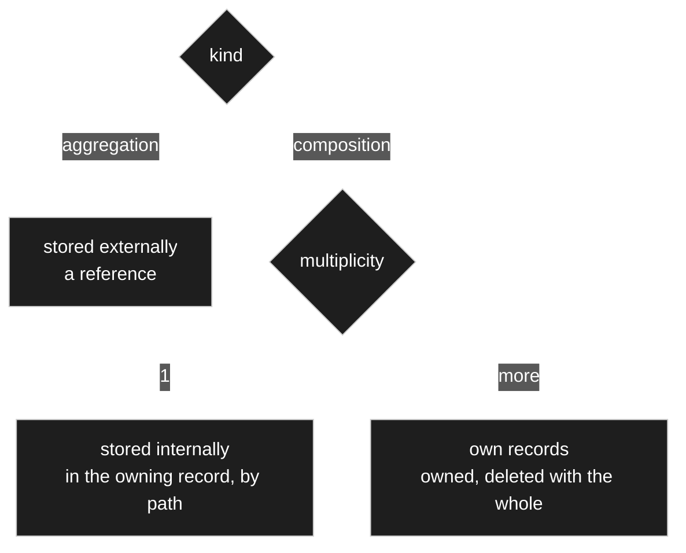

| | Meaning | Stored |
|---|---|---|
| **aggregation** | the target is **independent** | **externally** — a reference to a record, or to a node for modelling-time content ([D-131](90-decision-log.md)) |
| **composition, multiplicity 1** | a **property** of the owner | **internally**, in the owning record, addressed by path |
| **composition, multiplicity > 1** | **things in a list**, each with identity | **own records**, owned — cascade-deleted with the whole ([C12](10-domain-core.md)) |

A price in a position is therefore **not** a record:

```
Position #501
  [#88]              → 25            menge
  [#93 · wert]       → 20            einzelpreis
  [#93 · waehrung]   → EUR
```

**And the boundary is principled rather than chosen:** *what you can have several of needs its own
identity; what you have exactly one of does not.* A position is a **thing in a list**; a price is a
**property of a position**.

### What this changes in the tables

`record_values` keys on a **path** rather than a single edge ([D-134](90-decision-log.md)). Keeping
the **last** edge in `edge_id` and the prefix in `path` preserves the search story of
[D-070](90-decision-log.md), and
improves it: `WHERE edge_id = wert AND value_decimal > 1000` finds every price over a thousand
wherever it sits, while adding `path = [#94]` narrows it to one particular attribute.

### The honest cost

**Changing a multiplicity from 1 to `1..*` used to be a storage migration** — flattened values
becoming records. ⚠️ **For primitives that is gone** ([D-232](90-decision-log.md)): only an index
joins the path. The migration remains where it is genuinely unavoidable — when a value becomes a
**row**, which is a move between branches and alters what the thing **is**. [D-054](90-decision-log.md)'s
conflict resolver exists for exactly such changes.
In exchange the record tree gets much shallower, which helps loading, rendering and calculation
alike.

### P13b — At multiplicity 1 nobody chooses any more, so the author is told


Put [D-133](90-decision-log.md) and [D-161](90-decision-log.md) together and something falls out
that nobody asked for: picking a target under `Model` turns even a *have exactly one of* into **its
own record**, where inline would have been the natural shape. The owner, shown this: *then it would
be a record of its own in the model — whether that is sensible I rather doubt. But yes, the user has
to be pointed at it, and at the effects.*

[D-163](90-decision-log.md): the modeller **says so at the moment the target is picked**, and says
what changes — the value becomes an independent thing that can be found, referenced from elsewhere
and deleted on its own, rather than a property that lives and dies inside its owner. **It is not
forbidden**; sometimes it is exactly right. But it must never be a surprise discovered later, in a
search result nobody expected. *Do not ask a question the branch has already answered — but do
report the answer.*

### P13c — A medium is a small composite, and its file lives in the WordPress media library

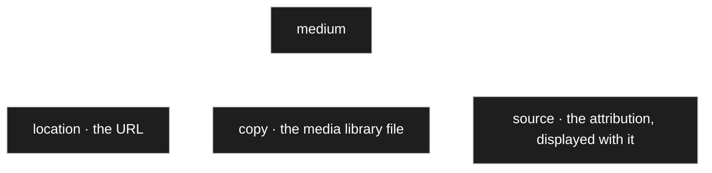

[D-211](90-decision-log.md). A medium can be a URL, or a stored file, or **both** — and both is not
indecision, it is two different questions answered: the **copy** is there when the source
disappears, the **URL** is there when a newer version exists. Same shape as
[D-143](90-decision-log.md) — one side tracks, the other freezes.

**Provenance travels with it**, and the attribution is *displayed* with the image. That makes a
medium a small **composite** — location, copy, source — rather than a scalar, so at multiplicity 1
it is a composition and lives **inside** the record ([D-133](90-decision-log.md)). No new mechanism.

**The file itself is stored in the WordPress media library** — *we should use the strengths of
WordPress there* ([D-169](90-decision-log.md)) — which brings upload, permissions, thumbnails and
sizes already built. **Our model holds the identifier, the URL and the attribution.**

⚠️ **The consequence the owner named himself:** a file can be deleted in WordPress without our
deletion machinery ([D-123](90-decision-log.md)) knowing, because the file is not ours. His answer:
**existence is checked at display time**, and a missing file **degrades to its link** rather than to
an error.

**Open:** which value column carries a WordPress attachment identifier — it belongs to neither of
the two id spaces of [P4a](#p4a--two-identity-spaces-one-for-the-model-one-for-the-records) — is not
decided. See [`_harvest/contradictions.md`](_harvest/contradictions.md).

## P13d — the branch decides storage, not the multiplicity

Supersedes what [D-133](90-decision-log.md) laid down and this document repeated
([D-232](90-decision-log.md)).

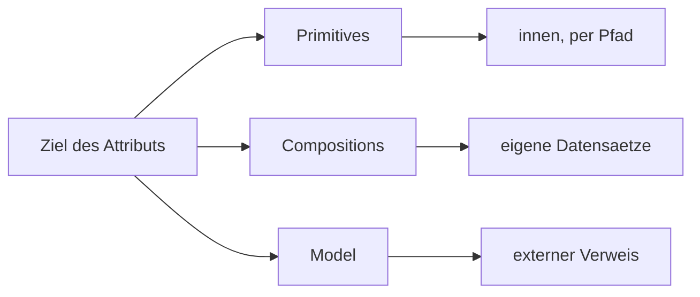

| Target lies in | Stored |
|---|---|
| **`Primitives`** | **inside** the record, addressed by path — indexed where there are several: `groessen[0]`, `groessen[1]` |
| **`Compositions`** | **its own records** |
| **`Model`** | an **external reference** |

⚠️ **Multiplicity plays no part in it.** The old rule made a multiplicity above 1 mean *own records*,
so five integers would have become five records plus an auto-created node
([D-136](90-decision-log.md)) — absurd for five numbers, and the owner said so at once.

**The question underneath is identity:** a row needs one — you point at it, order it, delete a
single one. A number in a list does not.

**And it removes a cost that had been accepted as honest.**
[D-134](90-decision-log.md) recorded that changing a multiplicity from `1` to `1..*` is a **storage
migration**. For primitives that disappears: only an index joins the path. The migration stays
exactly where it is genuinely unavoidable — when a value becomes a row.

Same construction as [D-161](90-decision-log.md) and [D-183](90-decision-log.md): **the place says
it.** One switch fewer, one rule fewer.

## P11d — a projection is not a table per model in the sense P5 forbids

[P5](#) and [D-066](90-decision-log.md) say **no table per model** — the sentence that makes
run-time modelling possible at all. The flat projection of [D-165](90-decision-log.md) is exactly
that shape, and calling it a cache answers the duplicated-fact objection but not the real one:
`CREATE TABLE` and `ALTER TABLE` at run time, triggered by a user adding an attribute.

**The rule is kept by narrowing what it governs** ([D-228](90-decision-log.md)): **[P5](#) binds
everything that *holds* data, and a projection holds none.** What makes run-time DDL dangerous is
data loss and migrations that depend on user data; a cache table has neither.

Three conditions make that honest:

| | |
|---|---|
| The system runs with **no** projection at all | a missing one makes a query slower and still correct |
| Where the host forbids DDL there simply are none | no error, no half state |
| `dbDelta` never knows about them | they count toward no schema version |

⚠️ **And the constraint that matters more than the DDL argument is the owner's:** *we are so
fine-grained that we could very quickly have a great many tables.* So projections are **opt-in and
few** — switched on for the one model whose reporting is slow, never created automatically. A cache
built for everything **is** a schema; one built for three models is an index.

## P4d — a medium is an ordinary record, and its foreign key is text

A WordPress attachment id fits neither identity space ([D-164](90-decision-log.md)) nor any typed
value column. The answer is not a new column but a **type**
([D-229](90-decision-log.md)): `Medium` lives under `Model` with attributes attachment id, URL,
source and licence, so it is an ordinary row in `records` and `record_values`, aggregated by
whoever uses it.

**What that buys**, and what the inline shape would have cost:

| | inline member | own type |
|---|---|---|
| one photo on fifty parts | the attribution written **fifty times** | once |
| *which records use this file?* | a scan | the ordinary **Used by** ([D-199](90-decision-log.md)) |
| width, height, checksum, licence | no home | attributes |

The attachment id is a **text** attribute — an opaque key of a foreign system — so the core sees
text and knows nothing of WordPress ([D-171](90-decision-log.md)). The MIME type is **detected** at
the boundary and **stored**, or every display would have to touch the file
([D-229](90-decision-log.md)).

## P11e — the identifying fields belong to the type

The search column is written **on save** ([D-167](90-decision-log.md)) from *the fields that are
shown* ([D-112](90-decision-log.md)) — but at save time there is no use site, and a record does not
know which lists it will later appear in.

Two meanings of *shown* had been conflated ([D-237](90-decision-log.md)):

| | Belongs to | Feeds the search column |
|---|---|---|
| the fields by which a person **recognises** the record | the **type** | **yes** |
| the columns **this one table** displays | the use site | no |

The first is a statement about *how do I recognise a part*, which does not change because some table
shows two columns fewer — so it is available at save time, which is what the search column needs.

## What belongs here

- The storage decision — with the reason.
- The table shapes: node, setting, relation. Keys, types, indexes.
- How identity, version and change history are persisted.
- Query and performance constraints that fall out of the choice.
- Migration and compatibility stance toward the old scaffold, if any.

## What does NOT belong here

- Any influence on the shape of the domain core.

## Harvest candidates

| Source | What is in it |
|---|---|
| [`../legacy/ARCHITECTURE.md`](../legacy/ARCHITECTURE.md) | How the old round intended to build it. |
| [`../legacy/plans/case-study.md`](../legacy/plans/case-study.md) | The `wtt_fs` Fallstudie scaffold that actually ran. |
| [`../../AGENTS.md`](../../AGENTS.md) | Dev environment: Laragon on Windows, SQLite on the cloud VM. Current, not legacy. |
