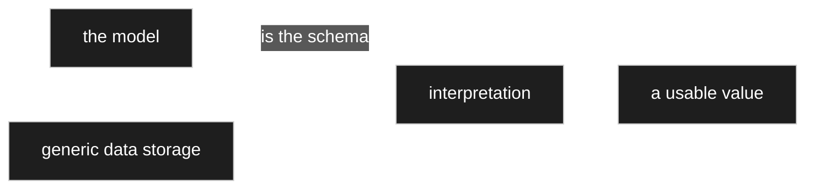
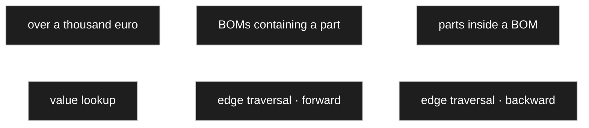
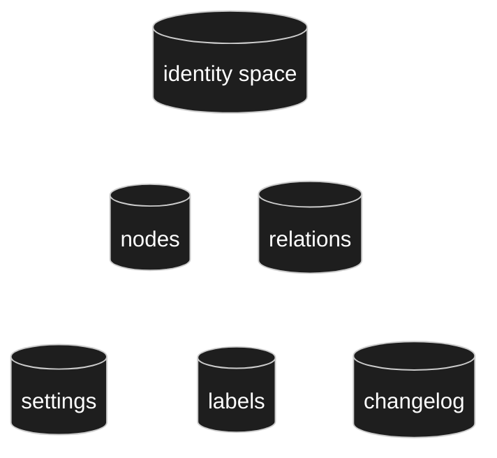
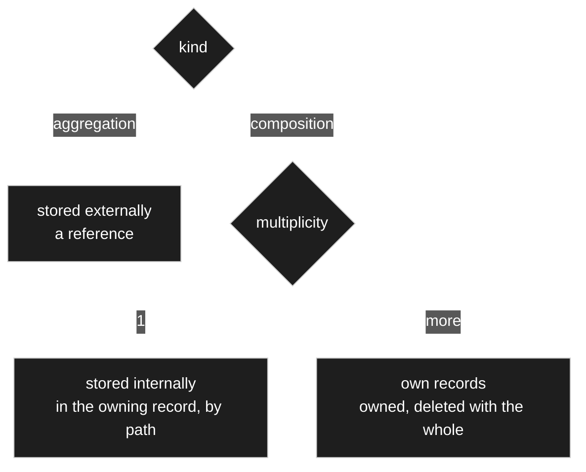

# Persistence

> **Status: `draft`.** Contains owner statements of 2026-08-22, written down but **not yet
> confirmed**. Legacy material has not been harvested into this document yet.

## Purpose

Define how the domain core is stored, and how much of the storage layer is allowed to leak
back into the model.

## Owner statement — 2026-08-22

| # | Statement |
|---|---|
| **P1** | The nodes are to be stored **relationally**. |
| **P2** | In addition, **settings per node**, stored **generically in a settings table** — a node *may* have settings. |
| **P3** | Likewise **a table for the relations**. |
| **P4** | These are the base tables for storing the model data later: **nodes, settings, relations**. → amended to **nodes, settings, labels, relations** by [D-019](90-decision-log.md). |

### Object-based model, relational storage — not a contradiction

[Vision and scope](00-vision-and-scope.md) says the product models data *object-based rather
than relational*. P1 says nodes are stored *relationally*. These are different layers and
both hold:

- **What the user builds** is an object graph — nodes, edges, inheritance.
- **How it is persisted** is a small fixed set of relational tables that carry that graph.

The tables are generic (node, setting, relation) — the user's model does **not** produce one
table per modelled entity. That is precisely the point of the product. Worth stating in the
concept in these words, because the two sentences read as opposites out of context.

### Decided — tables owned by this plugin

**[D-007](90-decision-log.md), 2026-08-22:** *relationally* means **tables owned by this
plugin** — not `wp_posts`, `wp_postmeta`, terms or CPTs. The project is complex enough that
WordPress storage primitives would cost more than they give.

This closes the model half of [OQ-012](91-open-questions.md) and is the sole architecture rule
currently in force ([`CLAUDE.md`](../../CLAUDE.md) AR-1).

**Scope limit, stated deliberately:** D-007 covers the **model** — nodes, settings, relations.
Where the **content** described by a model is stored is a different question and stays open →
[OQ-015](91-open-questions.md). It cannot be answered until [10 Domain core](10-domain-core.md)
says whether *model* and *instance* are even different kinds of thing.

### Open

- Sequencing: this document was meant to be written after the core is locked
  ([D-004](90-decision-log.md) reasoning). P1–P4 arrive early. They are recorded, but a
  storage shape must not be allowed to bend the core — if it starts to, that is raised as an
  open question rather than resolved here.

## Owner statement — 2026-08-22, second pass: no table per model

| # | Statement |
|---|---|
| **P5** | **There will not be a database table per model.** The data have to be stored some other way. |
| **P6** | How exactly is **not yet defined**. |
| **P7** | And it does not greatly matter: *"I define my model, and with the model I also know how the data are to be interpreted. How they are stored efficiently underneath recedes into the background."* |

### P7 is right, and it has one consequence worth naming



**The model is the schema.** Storage holds values without knowing what they mean; the model says
how to read them. That is the same shape the settings table already has
([D-011](90-decision-log.md)), one layer down — and it is what makes a modeller possible at all,
since a table per model would mean schema changes at run time.

The consequence, stated plainly so it is not a surprise later: **no query can filter on a domain
field without going through the model.** *All parts lists with a total over 1000* is not a `WHERE`
clause on a column; it is a lookup of which edge carries that attribute, then a filter on generic
rows. That is workable — it is what [D-014](90-decision-log.md)'s batched loading and indexed
walks are for — but it has to be designed in rather than discovered when the first report is
wanted.

**P6 stays open on purpose.** The shape of the data tables is [OQ-015](91-open-questions.md), and
[D-004](90-decision-log.md) keeps it out of code until the core is locked.

## Owner statement — 2026-08-22, third pass: search is a requirement

| # | Statement |
|---|---|
| **P8** | Such queries **must be possible, and as fast as can be managed**. This is hereby settled rather than left open. |
| **P9** | Concretely: *all BOMs over a thousand euro*; *all BOMs containing a particular part*; *all parts that appear in a particular BOM* — and so on. |
| **P10** | **Almost exactly what a relational database can do**, only finer-grained here. |
| **P11** | The picture: as if all values lay in one row of a table, and a selection were assembled through well-chosen categories and the ids of type assignments. |

P11 describes the entity-attribute-value shape, and it is the right picture. What follows is what
it takes to make P8 true rather than aspirational.

### The three examples are three different query shapes



| Query | Needs |
|---|---|
| all BOMs over 1000 € | find records whose value **on a particular attribute** exceeds a number |
| all BOMs containing part X | traverse **from** a record **to** a target and back |
| all parts inside BOM Y | the same traversal in the other direction |

So two capabilities: an **indexed value lookup** and an **indexed edge traversal both ways**.

### Why the edge id is what makes this work

Because an attribute **is** a relation with a stable id ([D-031](90-decision-log.md)), the edge id
plays the part a column name plays in a relational schema. *All BOMs over a thousand* becomes:

```sql
-- SKETCH
WHERE edge_id = 94 AND value_decimal > 1000
```

That is an ordinary indexed range scan — as fast as a column, and it stays fast as the model grows,
because the model growing adds edge ids rather than widening any row.

### The one thing that would ruin it

**Values must live in typed columns, never in a single stringly `value`.** With everything stored
as text, `'900' > '1000'` is true, ranges cannot be indexed usefully, and P8 quietly becomes
impossible. So: a numeric column for numbers, a text column for text, a reference column for node
references, a date column for dates — with only one filled per row, or separate tables per kind.

This is the decision that has to be made **before** the data tables exist, which is why it belongs
here rather than in implementation.

### And it forces something about calculations

*All BOMs over a thousand euro* filters on `gesamtpreis`, which is **computed**
([D-043](90-decision-log.md)). A value computed on read cannot be filtered on without computing it
for every candidate record — which is exactly the scan P8 rules out.

**So computed values are materialised**: written when their inputs change, and read like any other
value. That answers [OQ-046](91-open-questions.md), and it is the moment the invalidation index of
[D-045](90-decision-log.md) stops being an optimisation and becomes load-bearing — a stale total
is now a **wrong search result**, not merely a stale display.

### Honest about the limit

Combining conditions — over a thousand **and** containing part X — means intersecting two indexed
lookups. Two or three conditions are fine; a query with ten becomes a sequence of joins that no
index makes free. That is the price of the shape in P11, it is the same price every
entity-attribute-value design pays, and it is worth knowing now rather than at the first complex
report. → [OQ-056](91-open-questions.md).

## Owner statement — 2026-08-22, fourth pass: type safety down to the column

| # | Statement |
|---|---|
| **P12** | Type safety matters. That may well mean **separate nodes for whole numbers and for decimals**, each defined by its own node. |
| **P13** | And those nodes are **stored differently**, so that selection stays efficient. |
| **P14** | Calculation needs **numeric fields** — nothing can be computed otherwise. |

### P13 — and the objection to it does not hold

The obvious counter-argument is that splitting numbers across two columns makes *every numeric
query* hit two indexes. **It does not**, and the reason is worth writing down:

```sql
-- SKETCH
WHERE edge_id = 94 AND value_decimal > 1000
```

**`edge_id` already pins the type.** An attribute is one edge, that edge has one target type, and
the type says whether its values are whole or decimal. So a query never spans both columns — it
knows which one it means before it starts.

That removes the only real cost of splitting, and leaves the benefits: exact whole-number
semantics, a smaller and faster integer index, and no silent coercion.

| | |
|---|---|
| `value_int` | whole numbers — `BIGINT` |
| `value_decimal` | decimals — exact, never floating point ([D-057](90-decision-log.md)) |
| `value_text` | text |
| `value_ref` | a node reference ([D-041](90-decision-log.md)) |
| `value_date` | dates |

**The one case that does span columns** is a reporting question like *any numeric attribute
anywhere above X*, which ignores `edge_id`. That is rare, it belongs to
[OQ-056](91-open-questions.md), and it is not worth designing the common case around.

### Where type safety is actually enforced

Two layers, and keeping them apart matters:

- **The column** makes a wrong value *unstorable* — text cannot land in `value_int`.
- **The type node's validator** makes a wrong value *unacceptable*, with a message, and possibly
  with an offered correction ([V9](00-vision-and-scope.md)).

The column is the last line, not the first. A user should meet the validator, never a database
error.

## The tables — proposal, 2026-08-22

> ⚠️ **This is a proposal**, worked out to close [OQ-015](91-open-questions.md),
> [OQ-016](91-open-questions.md), [OQ-017](91-open-questions.md) and
> [OQ-039](91-open-questions.md). Everything in it follows from decisions already taken; where a
> call was mine it is marked.

### The model layer



**Naming: every foreign key ends in `_id`** ([D-090](90-decision-log.md)). The owner asked whether
`owner` should be `owner_id`, having read it as a name rather than a reference — which is exactly
the confusion the suffix prevents.

| Table | Columns | Note |
|---|---|---|
| **nodes** | `id` · `version` · `name` · `path` | `id` from the shared identity space ([C11](10-domain-core.md)). `name` required, **not unique** ([D-022](90-decision-log.md)). `path` is the materialised ancestor path ([D-014](90-decision-log.md)) — **derived**, rebuildable, never a second truth. |
| **relations** | `id` · `version` · `from_id` · `to_id` · `kind` · `name` · `position` | `kind` an enum ([D-036](90-decision-log.md)). `name` empty for inheritance edges. `position` orders siblings — it belongs to the **edge**, because order is per parent, not per node. |
| **settings** | `owner_id` · `key` · typed value columns | `owner_id` a single real foreign key into the identity space ([OQ-022](91-open-questions.md) option 3) — it holds the `id` of the node **or** relation the row belongs to. Engine-owned keys are a reserved namespace, not a column ([D-084](90-decision-log.md)). |
| **labels** | `owner_id` · `role` · `locale` · `text` | [D-019](90-decision-log.md), roles plain ([D-023](90-decision-log.md)). |
| **changelog** | `owner_id` · `at` · `by_user_id` · `what` | The migration script ([D-061](90-decision-log.md)). |

**Why the column is called `owner_id` and not `node_id`:** it also holds relation ids. One number
space ([C11](10-domain-core.md)) means one column and a foreign key the database can actually
check. Without the shared space it would take two — *which kind* plus *which id* — and then
nothing could verify that the target exists.

**`Node.type` does not exist**, and that is a result rather than an omission: a node's type *is*
its position in the inheritance branch ([D-041](90-decision-log.md), [D-042](90-decision-log.md)).
Asking *what kind of thing is this* is asking who its ancestors are.

### OQ-016 answered — one construct, one mechanism, a reserved namespace

> A first version of this answer split settings into a *model scope* and a *system scope* with a
> `scope` column. **The owner rejected it and was right** — see
> [D-084](90-decision-log.md), which supersedes [D-078](90-decision-log.md).

The axis that actually matters is not *what kind of setting is this* but **where is it defined and
where may it be overridden** — and that is the same for every setting there is:


`min` is set on the integer node and narrowed at a use site. **The renderer, the converter and the
validators are set on the node too** — as initial values — and overridden at a use site in exactly
the same way. One mechanism, no partition.

**What survives from the earlier answer, with its phrasing corrected.** I first said the
difference was *does the engine branch on it*. The owner pointed out that **a renderer has to
honour `min` and `max` too** — a spinner cannot be drawn without them — so that phrasing does not
hold. The real distinction is **who owns the meaning of the key**:

| | Meaning defined by | Example |
|---|---|---|
| **engine-owned** | the engine, identically for every node | `hide`, `read_only`, `renderer`, `converter`, `validators` |
| **type-owned** | the type | `min`, `max`, `step` on an integer; something else entirely on a text type |

A spinner renderer reads `min` because it is registered **for that type** and knows what the type
means by it. The engine does not know what `min` is at all.

That distinction calls for a **reserved namespace** validated at write time, not a structural
split: an author must not be able to define a setting named `hide` and silently break rendering.
A rule about names, and one line of validation.

### The asymmetry — edge-only settings exist, node-only ones do not

The owner: *there are special edge settings; whether there are special node settings I doubt —
currently I think not.* That is right, and the reason is worth stating because it justifies the
direction of the whole resolution walk:

> **Everything sayable about a node is also sayable about one use of it. The reverse is not true.**

A node describes a *thing*; an edge describes a *use of a thing*. Any property of the thing can be
restated for one particular use — that is what overriding is. But some things can only be said
about a use, because the thing itself has no opinion on them:

| | Belongs to |
|---|---|
| `kind` · the attribute's `name` | the edge — fields on `relations` |
| **multiplicity** | the edge — *how many, here* |
| everything else | the node, with an override available at the edge |

Which is why settings resolve **node → edge** and never the other way.

**Multiplicity stays a setting rather than a column**, despite being read constantly, because it
inherits and can be narrowed — and a setting gets the resolution walk for free while a column
would need inheritance handled specially. [D-014](90-decision-log.md)'s batched load fetches it
with everything else. If profiling later demands it, denormalising is a cache, not a second truth.

**Why the column was a mistake:** its main justification was letting a renderer fetch only what it
needs. It does not partition that way. A renderer needs `hide` and `read_only` *and* the renderer
choice; a validator needs `min` and `max` *and* the validator choice. Both consumers want a mix,
so the split would have bought nothing and cost a distinction to maintain.

**A note on applicability:** a few keys only make sense on an edge — multiplicity is the clear one,
since a node has no multiplicity but a use of it does. That is about *where a key applies*, not
about a second mechanism. Multiplicity still inherits and is still overridable: a subtype may
narrow `0..1` to `1`.

### OQ-039 answered — the installation is the root of the walk

An installation-wide default is a **system-scope setting on a reserved installation identity**,
and that identity is the first link of the resolution chain:

```
installation → model root → ancestors → node → use site
```

**This makes [D-032](90-decision-log.md) fall out of [D-015](90-decision-log.md) with no new
machinery.** *The configured default plus the choice in the moment* is simply the top and the
bottom of one walk that already exists. No second mechanism, no second lookup.

The installation identity is reserved and does not appear in the modeller. Genuinely
WordPress-shaped settings — which admin page, which capability — stay WordPress options at the
boundary; they are not model settings and do not belong in this walk.

### OQ-015 answered — the data layer

| Table | Columns |
|---|---|
| **records** | `id` · `model_id` · `model_version` · `is_test` |
| **record_values** | `record_id` · `edge_id` · `value_int` · `value_decimal` · `value_text` · `value_ref` · `value_date` |

- `model_version` sits on the **record** ([D-060](90-decision-log.md)).
- `is_test` is the test-data flag ([D-028](90-decision-log.md)).
- Typed columns, never one stringly value ([D-071](90-decision-log.md), [D-074](90-decision-log.md)).
- `edge_id` is the attribute, and it is what makes a query indexable
  ([D-070](90-decision-log.md)).

### Where a value is stored — the kind and the multiplicity decide

> Superseded a first draft which made **every** composed value a record of its own. The owner
> rejected it: *a price is not a record.* See [D-133](90-decision-log.md).

**The rule uses only what already exists** — the relation kind ([C12/C13](10-domain-core.md)) and
the multiplicity:



| | Meaning | Stored |
|---|---|---|
| **aggregation** | the target is **independent** | **externally** — a reference to a record, or to a node for modelling-time content ([D-131](90-decision-log.md)) |
| **composition, multiplicity 1** | a **property** of the owner | **internally**, in the owning record, addressed by path |
| **composition, multiplicity > 1** | **things in a list**, each with identity | **own records**, owned — cascade-deleted with the whole ([C12](10-domain-core.md)) |

A price in a position is therefore **not** a record:

```
Position #501
  [#88]              → 25            menge
  [#93 · wert]       → 20            einzelpreis
  [#93 · waehrung]   → EUR
```

**And the boundary is principled rather than chosen:** *what you can have several of needs its own
identity; what you have exactly one of does not.* A position is a **thing in a list**; a price is a
**property of a position**.

### What this changes in the tables

`record_values` keys on a **path** rather than a single edge. Keeping the **last** edge in
`edge_id` and the prefix in `path` preserves the search story of [D-070](90-decision-log.md), and
improves it: `WHERE edge_id = wert AND value_decimal > 1000` finds every price over a thousand
wherever it sits, while adding `path = [#94]` narrows it to one particular attribute.

### The honest cost

**Changing a multiplicity from 1 to `1..*` becomes a storage migration** — flattened values must
become records. That is real, and it is now *honest* rather than arbitrary: the change alters what
the thing **is**, from a property to a list of things, and [D-054](90-decision-log.md)'s conflict
resolver exists for exactly such changes.

In exchange the record tree gets much shallower, which helps loading, rendering and calculation
alike.

## What belongs here

- The storage decision — with the reason.
- The table shapes: node, setting, relation. Keys, types, indexes.
- How identity, version and change history are persisted.
- Query and performance constraints that fall out of the choice.
- Migration and compatibility stance toward the old scaffold, if any.

## What does NOT belong here

- Any influence on the shape of the domain core.

## Harvest candidates

| Source | What is in it |
|---|---|
| [`../legacy/ARCHITECTURE.md`](../legacy/ARCHITECTURE.md) | How the old round intended to build it. |
| [`../legacy/plans/case-study.md`](../legacy/plans/case-study.md) | The `wtt_fs` Fallstudie scaffold that actually ran. |
| [`../../AGENTS.md`](../../AGENTS.md) | Dev environment: Laragon on Windows, SQLite on the cloud VM. Current, not legacy. |
