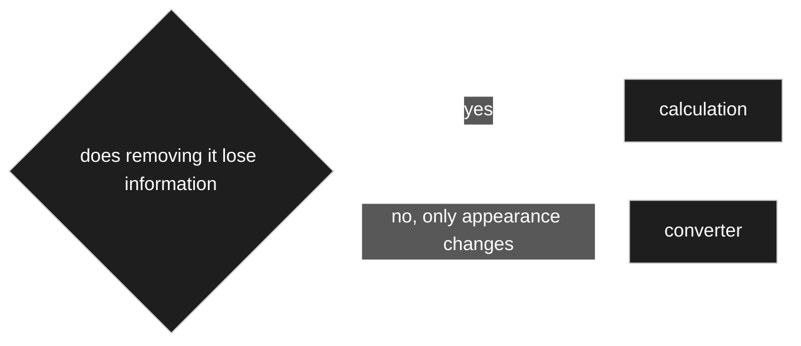
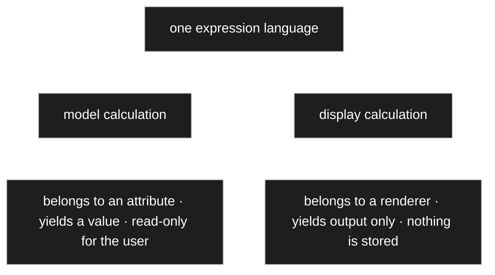
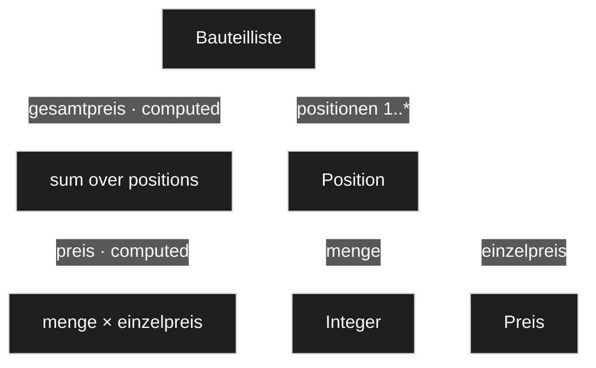
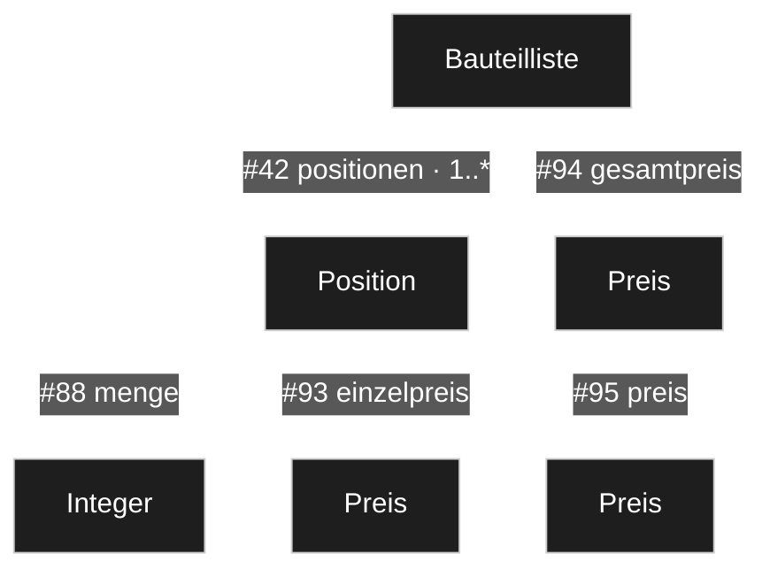
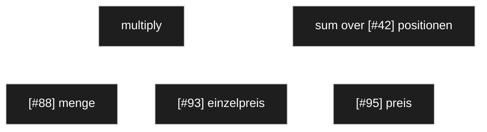
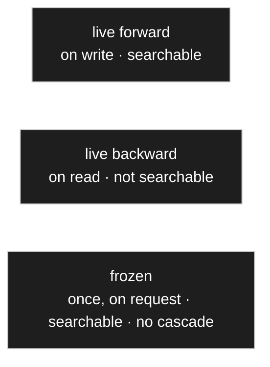

# Calculation

> **Status: `draft`.** Owner statements of 2026-08-22 plus a design answering the question the
> owner put: *is a calculation a relation, or an entirely different concept?* Not decided.

## Purpose

Define how a value that is **computed** rather than entered is modelled — and where the boundary
runs against the converter, which already exists.

## Owner statement — 2026-08-22

| # | Statement |
|---|---|
| **K1** | Switching a **prefix** — gram to kilogram — has to change the value with it. An internal conversion, handled differently again in the interface. |
| **K2** | There are **computed values assembled from other fields**. Hidden fields may be added up and the result shown in another field. |
| **K3** | A parts list has a **total price**, which comes from the prices of its positions, each of which comes from **quantity × unit price**. |
| **K4** | Elsewhere, **averages** or **sums** are wanted. |
| **K5** | ⚠️ In the old concept a calculation could also be a **transformation** — a text transformation, say. **The owner asks for this to be questioned.** |
| **K6** | There is a difference between calculations **in the model** and calculations **for display**. A parts list may get a frontend footer that sums quantity and price — regardless of whether a total already exists in the model. |

## K1 and K5 — the first cut: this is the converter, not a calculation



**Recommendation: K1 is a converter, and K5 is refused.**

- A **calculation** produces a value that **did not exist** — a sum, an average, a product.
- A **converter** changes the **form** of a value that already exists — two decimal places,
  uppercase, gram to kilogram.

`1000 g` and `1 kg` are the same quantity. Nothing is gained or lost, only rewritten — so unit
conversion is a converter, and [V8](00-vision-and-scope.md) already puts one on every node. It
needs no new concept, and it also explains K1's aside that this is *handled differently in the
interface*: the converter runs on the way out and, for a unit switch, also on the way in.

By the same test **a text transformation is a converter too**, which is why K5 should not be
folded into calculation. Merging them would put two unrelated jobs under one word — the failure
the glossary exists to prevent.

## K6 — the second cut: model or display



The owner's distinction is exact and worth keeping as a hard line:

| | **Model calculation** | **Display calculation** |
|---|---|---|
| Owned by | an **attribute** | a **renderer** |
| Produces | a value in the model | output, nothing more |
| Example | the parts list total price (K3) | the frontend footer summing a column (K6) |
| Survives a different view | yes | no |
| Configured in | the settings of the attribute | the settings of the renderer |

**The same expression language serves both.** Only the owner and the lifetime differ. A footer
sum is not a lesser calculation; it is one whose result nobody needs to keep.

## K2, K3, K4 — what a calculation *is*

**Recommendation: a calculation is not a relation kind. It is a property of an attribute** — one
whose value comes from an expression instead of from input.



K3 drawn out. Two computed attributes, at two levels, and the upper one reaches across a
composition edge with multiplicity — which is what makes it an *aggregate* rather than a formula.

### Why not a relation kind

The old tree had `calc` as a relation type ([harvest 01](_harvest/01-standard-tree.md), B7).
Against reviving it:

- **A relation kind is a structural connection between two nodes.** A calculation is a **rule**,
  not a connection. Making it a kind would put a rule in the place where structure lives.
- The dependencies are **already implied by the expression**. Storing them again as edges records
  one fact twice, which the code standard forbids.
- [D-036](90-decision-log.md) closed the set of relation kinds precisely because each kind carries
  rules the engine enforces. A calculation carries no such rules — it carries an expression.

### Where it does earn an edge

**Invalidation.** To know which computed attributes must be recomputed when something changes,
the system needs the dependencies **backwards**. That is a graph, and materialising it is the
only sane way to index it.

But it is **derived from the expression, never authored** — parsed out when the expression is
saved, thrown away and rebuilt at will. Same rule as the resolved-settings cache
([D-016](90-decision-log.md)): a derivative, never a second source of truth.

### It fits what is already decided

- **[C19](10-domain-core.md) already anticipated this.** Hidden attributes exist, in the owner's
  own words, so they can feed calculations. K2 is that statement arriving.
- **A computed attribute is read-only** for the user — the `read_only` setting from C19, set by
  the calculation rather than by hand.
- **The preview shows it working.** Change an input, the computed value follows
  ([R23](30-renderer.md)).

## How a calculation knows what feeds it

The owner named this as the part with no answer yet: *where does the calculation learn which
fields it is fed from?*

**Recommendation: the same way an override knows what it overrides — a relative path of edge
ids.** [OQ-025](91-open-questions.md) already settled that addressing for overrides, and reusing
it means calculations introduce no new way of pointing at anything.



The owner's own example, addressed:

| computed attribute | operation | operands |
|---|---|---|
| `#95` Position.preis | `multiply` | `[#88]` , `[#93]` |
| `#94` Bauteilliste.gesamtpreis | `sum` | `[#42, #95]` |

Two things fall out of this and both are useful:

**Scalar or aggregate is not something anyone declares.** `[#88]` reaches one value because `#88`
has multiplicity 1. `[#42, #95]` crosses `#42`, which is `1..*` — so it reaches *many* values, and
the operation must be an aggregate. **The multiplicity along the path decides it**, which means
the model can check that a `multiply` is not accidentally pointed at a collection.

**The dependency graph is parsed, not authored.** Every edge id appearing in an expression is a
dependency. Reversing that index gives *what must be recomputed when this changes*
— materialised for speed, rebuilt from the expressions at will, never a second source of truth
([D-016](90-decision-log.md)).

### This is also why the old `calc` edge existed

The previous project needed a way to *point* at the inputs, and the only pointing mechanism it
had was an edge — so calculation became a relation kind. With edge-id paths inside a setting, the
pointing is there without a new kind of edge, and the dependency edges come back as a derived
index rather than as authored structure.

## The expression — a structured tree, clicked rather than typed

Closing [OQ-047](91-open-questions.md). Neither pole works on its own:

| | Why not |
|---|---|
| **a picked operation over a picked field** — what the old `Aggregate` branch did | too weak. `Position.preis = menge × einzelpreis` already has **two** operands and an operator. |
| **a free formula language** | needs a parser, evaluation safety, validation, and error messages a **model author** can act on — and the audience is not a programmer. |

### The shape



A small tree of **operations** and **operands**, built in the modeller with a picker. The set of
operations is small and closed: **arithmetic** (`+ − × ÷`) and **aggregates** over a collection
(`sum`, `avg`, `min`, `max`, `count`).

| What it buys | |
|---|---|
| **no parser** | no syntax errors, no injection, no messages nobody can act on |
| **always-valid references** | operands are picked from the real attributes and stored as **edge ids** ([D-045](90-decision-log.md)), so renaming and moving leave them intact |
| **type checking while building** | the picker does not offer a text column for a multiplication, so the error never comes into being |
| **the dependency graph *is* the tree** | D-045's invalidation index falls out instead of being parsed |
| **scalar or aggregate is checkable** | the multiplicity along the path says which, so a `multiply` aimed at a collection can be refused |

**The honest drawback:** `(a + b) × c ÷ d` is tedious to assemble by clicking, and anyone who knows
formulas will want to type.

**And the mitigation is clean:** a formula field may later be added as a **second way to author**
the same structure — typed, parsed, stored as the tree. **The structure is the truth; text is an
input method.** So deciding this now costs nothing and closes nothing off.

### The escape for hard cases

What cannot be expressed structurally — a real bill-of-materials rollup with special rules — arrives
as a **registered calculation strategy**, exactly like renderers, converters and validators
([D-036](90-decision-log.md)). A developer registers it; the author picks it from a list.

> **Simple things structurally, hard things as a registered strategy.**

The mechanism already exists; it is the same one used everywhere else.

### Storage

The expression tree is **serialised into the setting**. Nothing ever queries *inside* an
expression, and the dependency index is extracted when it is written
([D-045](90-decision-log.md)) — so a queryable structure would buy nothing and cost a table.

## Backward aggregates — reaching into another model

| # | Statement (owner, 2026-08-22) |
|---|---|
| **K7** | If a parts list should always show the **average price**, it is recalculated each time rather than snapshotted — and the calculation **feeds from another model**. |
| **K8** | **A backward-read value is computed at read time, not materialised.** It is not a stored value; it is worked out afresh on every display. |

[D-045](90-decision-log.md) settled *how* a calculation addresses its inputs. It did not settle
*how far they may reach* — and K7 reaches further than anything so far.

### What it is


Not *where do I point* but **who points at me**. A relative forward path cannot express it, so an
operand may also be a **backward path**.

**The infrastructure already exists.** That query is [D-070](90-decision-log.md)'s *all BOMs
containing part X* — `WHERE edge_id = artikel AND value_ref = this record`, indexed. Only the
expression form was missing, not the capability.

It brings several useful figures with it: average purchase price, how many parts lists use this
part, the date of the last order.

### K8 — and it is not materialised

The reason is invalidation. Forward is contained: change a value, its ancestors are affected.
**Backward fans out** — a new order line changes a computed field on a *part*, which would touch
every parts list using that part. With [D-072](90-decision-log.md) materialising computed values,
every order write would start a cascade.

| | Computed | Searchable |
|---|---|---|
| **forward calculation** | on write, materialised | **yes** ([D-070](90-decision-log.md)) |
| **backward aggregate** | **on read** | **no** — a deliberate exception to [D-072](90-decision-log.md) |

An average purchase price is a **figure one reads**, not a field one filters on. Anyone who does
need to filter on one turns materialisation on deliberately and accepts the cascade.

### And it is [D-065](90-decision-log.md) once more

| | Is | Behaves |
|---|---|---|
| the average over orders | a **description** — what one currently pays | **tracks**, recomputed |
| the price **in** an order line | an **agreement** | **freezes** |

Both are prices on the same part, and they behave oppositely because they are different
statements.

## Three states, and freezing as the way out

| # | Statement (owner, 2026-08-22) |
|---|---|
| **K9** | A value could be **frozen**, and regenerated on request when it has drifted too far — noticed while editing the parts list anyway. |
| **K10** | *In principle it is only an approximation.* |
| **K11** | Parts get dearer and cheaper year on year, so **the average may simply not be the right thing** — perhaps the value of stock on hand, falling back to what one would pay to reorder. |
| **K12** | Every time a parts list is **saved**, the values could be recalculated: it has been touched anyway, and then the figures are current. |



| | Computed | Searchable | Cascade |
|---|---|---|---|
| **live forward** | on write, materialised | yes | forward |
| **live backward** | on read | no | none |
| **frozen** | **once, on request** | **yes** | **none** |

**A frozen value has no running dependency** — it is a stored number that was computed once. So
[D-142](90-decision-log.md)'s contagion does not reach it, and `gesamtpreis` is searchable again
even though the average behind it is backward. K10 is the reason it is right: **propagating an
approximation live through an archive costs much and gains nothing.**

### K12 — and it follows from a decision already taken

| | On save | Explicit recalculate |
|---|---|---|
| **tracking list** | recalculates, **reports afterwards** | not needed |
| **frozen list** | **untouched** | shows the difference, then applies |

Both behaviours come out of one setting ([D-065](90-decision-log.md)): a costing list *describes*
and tracks; a quotation *was agreed* and freezes. A quotation that changed because someone opened
and saved it would make *frozen* meaningless.

Even the tracking case reports — *12 prices updated* — non-blocking but visible. Correcting a typo
should not move a hundred numbers unnoticed.

### K11 — the method is pluggable, and there is more than one right answer

The average is one of a family: moving average, FIFO, the value of stock on hand, replacement cost.
Each is a **registered calculation strategy**, chosen by setting — the escape hatch of
[D-130](90-decision-log.md), and the same mechanism as renderers and validators.

**Each is only as good as its data.** Average needs order lines; FIFO needs receipts with quantity
and date; stock value needs inventory. None of that exists yet, which is why the average is the
starting point — it is what the data supports.

**And they are different numbers for different purposes, not competitors:**

```
Bauteil
  einstandspreis           what it cost me        FIFO or average
  wiederbeschaffungspreis  what it would cost     last order, supplier price
  listenpreis              the catalogue figure
```

A quotation wants the second; a retrospective costing wants the first. Naming each for what it
*is* dissolves the argument about which method is correct.

## Open

| | |
|---|---|
| [OQ-045](91-open-questions.md) | What can an expression reach — siblings, descendants, across aggregations, upwards? |
| [OQ-046](91-open-questions.md) | When does a model calculation run: on write, on read, or cached? |
| [OQ-047](91-open-questions.md) | What is the expression language, and who writes it? |
| [OQ-019](91-open-questions.md) | Cycles — the render descent already needs a guard, and calculations need the same one over a different graph. |

## Harvest candidates

| Source | What is in it |
|---|---|
| [`_harvest/01-standard-tree.md`](_harvest/01-standard-tree.md) | The `Definition › Aggregate` branch: *aggregate operations, the operation chosen per field slot, the type staying the column value type.* Closest thing to a prior design — a cross-check, not an inheritance. |
| [`../legacy/plans/data-structure.md`](../legacy/plans/data-structure.md) | Q57 and Q125 touched calculation and the `calc` relation. |
