# Model change and migration

> **Status: `draft`.** Owner statements of 2026-08-22. This is the topic
> [OQ-031](91-open-questions.md) was holding open, and it now has a mechanism.
>
> **Caught up 2026-08-23** with the decisions taken after the first draft:
> [D-119](90-decision-log.md), [D-129](90-decision-log.md), [D-137](90-decision-log.md),
> [D-141](90-decision-log.md), [D-155](90-decision-log.md), [D-156](90-decision-log.md),
> [D-162](90-decision-log.md), [D-172](90-decision-log.md), [D-173](90-decision-log.md),
> [D-174](90-decision-log.md). Where this text and a decision disagree, the disagreement is
> **not** resolved here — it is listed in
> [`_harvest/contradictions.md`](_harvest/contradictions.md) for the owner
> ([PR-4](../../CLAUDE.md)).

## Purpose

Define what happens to data already entered when the model beneath it changes — how a break is
detected, and how the user resolves one.

## Owner statement — 2026-08-22

| # | Statement |
|---|---|
| **M1** | Changing a unit or a description changes **only the output**. The node is the same one that was used; the data stay the same. |
| **M2** | Therefore the data must hold a **reference to the node id**, never to the name. Rename the node and every output changes — the data do not. |
| **M3** | **Documents are not part of this concept.** An exported PDF is detached from the model; regenerating it later would simply look different. There is no conflict, so: **always keep it current.** |
| **M4** | **Replacing** a node with a different one is another matter. That changes the **model version** and produces a conflict in existing data, which the user has to resolve. |
| **M5** | Data made of id references are **not human-readable**. One cannot look into the database the way one can with a relational one. That is already true of the model structure, so the tool is required in order to view data at all. |
| **M6** | Two surfaces follow: **data entry in the admin** — choose a model, see its data — and the **conflict resolver**. |
| **M7** | The conflict resolver shows **which models have conflicts with their data** and lets the user resolve them. Afterwards the model has no conflicts and the data have been carried into the new structure. |
| **M8** | Resolution can run in **several stages**. If the model changed repeatedly and structural problems accumulated, they are resolved one after another until the old data fit the model again. |

## M1–M4 — rename is not replace

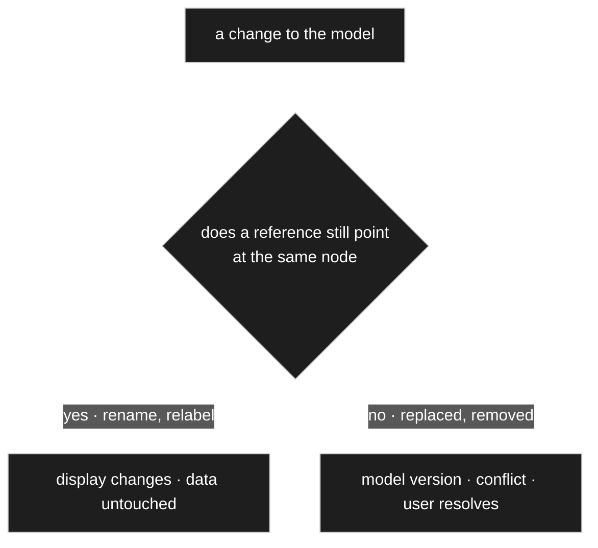

This is the distinction that settles [OQ-049](91-open-questions.md), and it is sharper than the
*freeze or track* framing that question was built on.

- **Renaming** touches a **label**. The reference is unchanged, so nothing about the data has
  changed — only the words used to show it. Keep it current; there is nothing to freeze.
- **Replacing** touches a **reference**. The data now point at something that is gone or
  different, and that is a genuine conflict.

M3 removes the one case that argued for freezing. A document is an **export**, detached the moment
it is produced. Regenerating it later gives a different document, and that is expected rather than
wrong. Nothing **in the model** needs to remember how it once read — which is a statement about labels, not about data: a record may well freeze what was agreed, such as the exchange rate of a settled price ([D-064](90-decision-log.md), [D-141](90-decision-log.md)).

## M5 — the readability cost, and what it obliges

The owner names the price plainly: **the data are unreadable without the tool.** Rows of id
references cannot be scanned in a database client the way relational rows can.

Two things follow, and the second is not optional.

**Mitigation is cheap.** Every node carries a required base name ([D-020](90-decision-log.md)) and
labels beside it. Any view that resolves ids to names turns unreadable rows into readable ones,
and that is one join. A read-only *resolved view* — for support, for debugging, for a plain
export — costs almost nothing and should exist from the start rather than being wished for later.

**But the tool becomes critical infrastructure.** If the data cannot be read without it, then:
deactivating the plugin makes the data inaccessible; a backup of the tables is not a backup of
anything anyone can use; and recovering from a broken installation needs the tool working first.

**Therefore an export that is readable without the tool is a requirement, not a nicety.** It is
the answer to *what if this plugin is gone*, and it is much cheaper to design in now than to
retrofit. [OQ-050](91-open-questions.md) asked what such an export looks like and is **closed** by
[D-058](90-decision-log.md) and [D-059](90-decision-log.md) — the two exports of
[M9–M12](#m9m12--two-exports-and-they-are-not-the-same-thing) below.

## M6–M8 — the conflict resolver

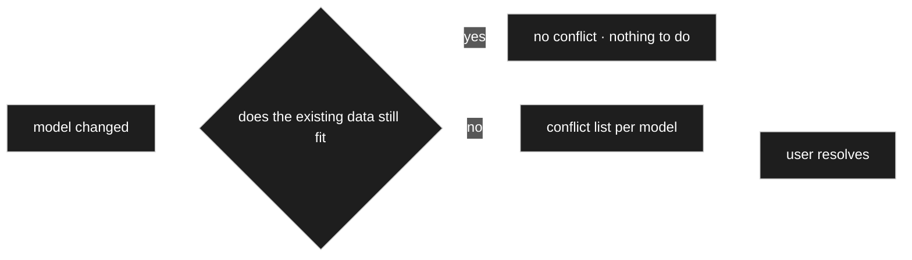

The loop is the point: after each resolution the data are checked again, so a model that changed
several times is worked down step by step (M8) until nothing is left. That also means **the
resolver is the only way data reach a new model structure** — there is no silent migration behind
it.

This is [D-037](90-decision-log.md) made operable. That decision said whether a change breaks
anything **depends on the data, not on the kind of change** — lowering a maximum from 100 to 20
breaks nothing if no stored value exceeds 20. The resolver is where that check runs, and where
[D-050](90-decision-log.md) applies too: **with no data present there is nothing to check and
nothing to ask.**

M6's other surface — choose a model, see its data — is the ordinary data view, and by
[D-029](90-decision-log.md) it is the same editor used everywhere else.

## Owner statement — 2026-08-22, second pass: export, versions per record, and what the resolver offers

| # | Statement |
|---|---|
| **M9** | **All data must be exportable and re-importable** — and that includes the **tree**. With the tree present, the assignment is present too. |
| **M10** | Alternatively, or in addition, the data may be written in **plain text**: store `Stück` as the word as well, so that it can be resolved back afterwards. |
| **M11** | The one problem: if `Stück` no longer exists as a unit value, the **import** has to resolve it — either map it to another node, or create a node and bind that id to `Stück`. |
| **M12** | CSV, PDF, an interactive parts list — those are **views** of the data, a different thing from backup. |
| **M13** | **Every record belongs to a model version.** Resolving carries data from one version to the next, so the version **on the record** advances and the record must then match it. |
| **M14** | Until everything is resolved, records of **different versions coexist**. When all is resolved, only records of the current version remain. |
| **M15** | The resolver offers **mapping** from one field to another — and not only one to one, but **with a transformation**: move everything from the old *Stück* column into the new one and rewrite `Stück` to `STK`, or gram to kilogram. |
| **M16** | For **new fields** it offers filling them by hand across all records, or a **bulk change** — *set them all to this value*. Only needed at all when the field is mandatory. |
| **M17** | A change that creates a new version — deleting a field, say — must **warn the user at the moment of the change**: the old records still hold that field, the new shape does not. The user then decides: **delete it**, because it never made sense anyway, or **transfer it**. |

## M9–M12 — two exports, and they are not the same thing

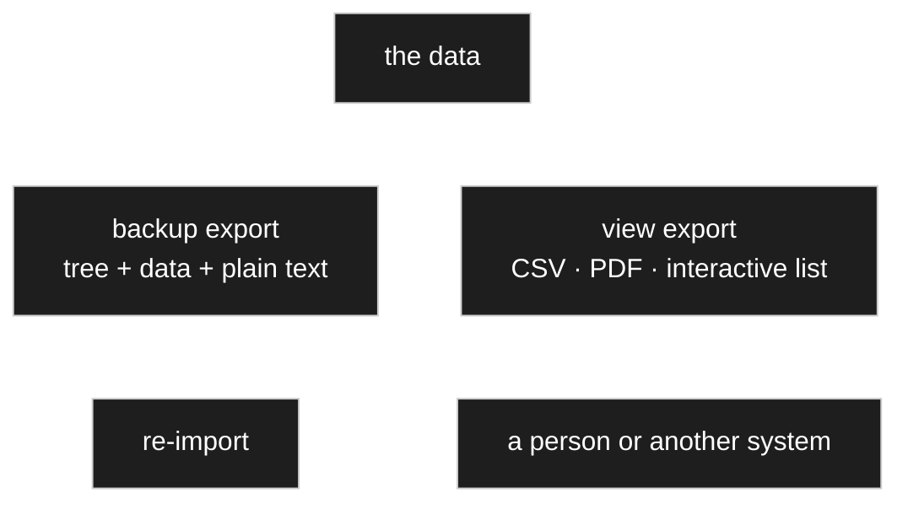

| | **Backup export** | **View export** |
|---|---|---|
| Contains | the tree **and** the data, together | one model's data, shaped for a purpose |
| Must round-trip | **yes** | no |
| Produced by | the export itself | a **renderer** ([R1](30-renderer.md)) |
| Answers | *what if this installation is gone* | *I need this as a spreadsheet* |

Keeping them apart matters because they pull in opposite directions: a backup wants completeness
and exactness, a view wants readability and omission. Trying to make one artefact do both
produces something that is bad at each.

**M12 places the view exports where they belong** — a CSV, a PDF, an interactive parts list are
different renderings of the same nodes. Nothing new is needed for them beyond
[R8](30-renderer.md)'s levels gaining another one.

### M10 — plain text beside the id is the right call

The proposal is to write both: the reference **and** the word. It costs a column in the export
file and buys three things:

1. **The export is readable without the tool** — which is the requirement
   [M5](#m5--the-readability-cost-and-what-it-obliges) raised.
2. **It survives losing the node.** An id alone that points at something deleted is unrecoverable;
   `#4711 · "Stück"` can still be re-bound by a person who knows what it meant.
3. **It is self-describing.** Someone opening the file in five years can tell what it is without
   the schema.

The id stays authoritative on import; the text is the fallback and the human reading.

### M11 — import resolution is the conflict resolver again

An import that finds a reference to a node which no longer exists is in exactly the position the
resolver already handles: *the data no longer fit the model, a person must decide.* The moves are
the ones M11 names — **map to an existing node** or **create one and bind the id**.

**So there is no second mechanism.** Import is a source of conflicts; the resolver resolves them.
That also means an import never silently invents nodes.

## M13/M14 — the version lives on the record

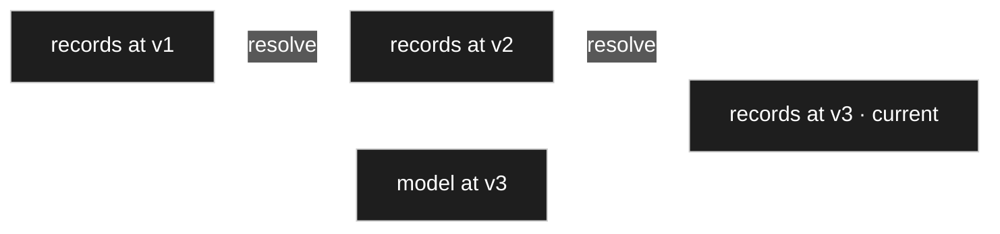

This answers [OQ-051](91-open-questions.md), and it answers the harder half of
[OQ-001](91-open-questions.md) with it: **the model version is not a field on `Identity`.** It is
carried by the **record**, in the data layer, and it says *which shape was this written against*.
The row change counter that C16 described is a different number entirely, and now demonstrably so
— one belongs to a node, the other to a record.

**What follows: the changes are needed, not the snapshots.** To carry a record from v1 to v3, the
resolver needs to know *what changed* at each step — not what the whole model looked like. A list
of changes per version is enough, and much cheaper to keep than full copies.

**And that list already exists.** `ChangeLogItem` has been sitting in the model since the seed
sketch without a job ([OQ-008](91-open-questions.md) only asked about its cardinality). **The
model's changelog is the migration script.** That is the first real reason to have it, and it
argues for logging every change rather than treating the log as optional.
[D-081](90-decision-log.md) follows from it: every object has at least one changelog item,
because creation must always be logged.

### M13a — numbers order events, shape decides compatibility

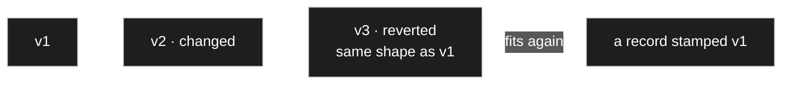

A revert produces a **new** version that happens to have the **same shape** as an older one — it
is never a return to the old number ([D-172](90-decision-log.md)). Saying *it is version 1 again*
would make one number mean two moments and a record stamped `1` ambiguous.

**So compatibility is not distance between numbers.** A record is in conflict when the model
differs **in the parts that record uses**. That is what makes the owner's own puzzle come out
right: revert to the earlier shape and version 1 data fits again, version 2 data does not,
version 3 fits.

⚠️ [M14](#owner-statement--2026-08-22-second-pass-export-versions-per-record-and-what-the-resolver-offers)
says that when everything is resolved only records of the current version remain, which
[D-060](90-decision-log.md) repeats. Under [D-172](90-decision-log.md) a record can be compatible
without being carried forward. Not resolved here — see
[`_harvest/contradictions.md`](_harvest/contradictions.md).

## M15–M17 — what the resolver can offer

Answering [OQ-052](91-open-questions.md), in the owner's own list:

| Move | For | Note |
|---|---|---|
| **Map** field → field | a field was replaced or renamed | not only one to one |
| **Map with transformation** | the values themselves changed shape | `Stück` → `STK`, gram → kilogram |
| **Bulk fill** | a new **mandatory** field | one value stated once, applied to every old record |
| **Fill by hand** | few records, or each differs | |
| **Delete** | the field is genuinely gone | the user says *it never made sense anyway* |

**A transformation here is the same thing as a converter** ([D-043](90-decision-log.md)):
gram → kilogram is a unit conversion, `Stück` → `STK` is a text rewrite. So the resolver does not
need a transformation language of its own — it needs to be able to **apply a converter** to a
column. Which also means every converter written for display is available for migration.

### M17 — warn at the moment of the change

The warning belongs where the change is made, not on a list somewhere afterwards. That is
[D-050](90-decision-log.md) once more: **ask where it matters, when it matters**, and only if
there is data to matter about.

The message has a fixed shape — *the existing records still hold this field; the new shape does
not* — and exactly two answers: **delete** or **transfer**. Deciding at that moment is far easier
than deciding weeks later in front of a conflict list, because the reason for the change is still
in the author's head.

**Deleting a referenced node arrives here too.** It parks every edge that points at it, and that
is *an attribute was deleted* for each owning node — nothing new for the consequence; what
changes is the weight of the moment ([D-125](90-decision-log.md)).

## Moving — one rule, two subjects, and it never loses data

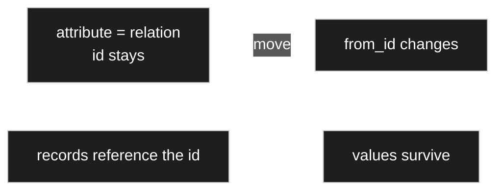

An attribute **is** a relation with a stable id ([D-031](90-decision-log.md)). Moving it changes
`from_id` while the id stays — and records reference the id, so **values survive**. What changes
is **who has the attribute** ([D-155](90-decision-log.md)).

| Subject | What moving does |
|---|---|
| **A node**, between branches | changes its **inheritance**, so it may gain and lose attributes ([D-124](90-decision-log.md)) |
| **An attribute, up to the parent** | **additive** — siblings gain it, and their records hold it empty |
| **An attribute, down to a child** | **removing** — siblings lose it, and their records hold orphaned values |

Both run [D-037](90-decision-log.md)'s data-dependent check and **warn before the change**, per
[D-063](90-decision-log.md), naming what is lost and how many records hold a value for it.

> ⚠️ **The additive direction can break too.** If the attribute is **mandatory**, siblings
> suddenly have it while their records do not.
> [M16](#owner-statement--2026-08-22-second-pass-export-versions-per-record-and-what-the-resolver-offers)'s
> bulk fill is the answer ([D-062](90-decision-log.md), [D-155](90-decision-log.md)).

### Promotion — what happens to an orphaned override

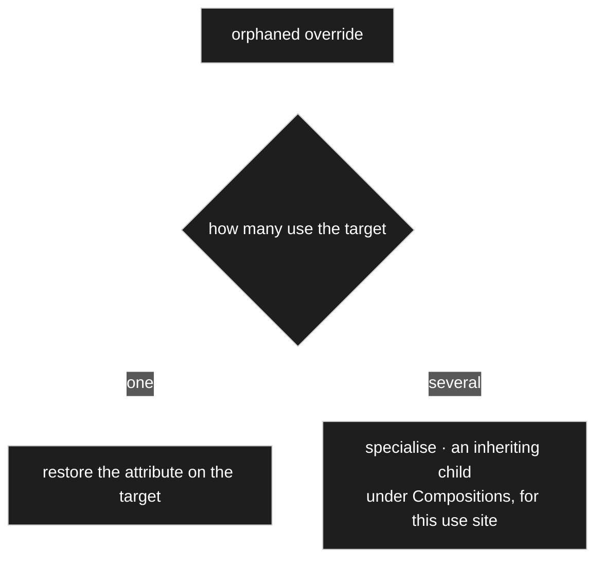

[OQ-037](91-open-questions.md) worried that an override knew a setting key but no target node,
the information having vanished with the path. **Two-stage deletion removed the worry**:
[D-123](90-decision-log.md) parks before purging and [D-125](90-decision-log.md) parks the
referencing edge with it, so at the moment of the decision the edge is still readable — its `to`
gives the **type** and its `name` gives the **name**, both editable. *The trash preserves exactly
the information the decision needs, which was not planned but falls out*
([D-156](90-decision-log.md)).

Several orphans from one purge are listed with a **per-row choice** and an *apply to all*
([D-126](90-decision-log.md), [D-100](90-decision-log.md)).

## Converting between the relation kinds is a move

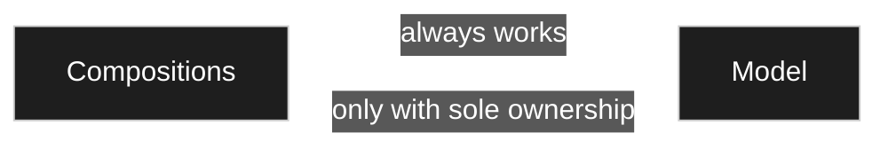

The kind is not a switch — it is read off the branch the target sits in
([D-161](90-decision-log.md)). So converting a kind **is** moving the node, and moving the node
**rewrites every edge that points at it**. There is no per-use-site exception: leaving it a
composition in one place would make the node both, and the branch would stop being the truth
([D-162](90-decision-log.md)). Where both are genuinely needed, that is **two nodes** — the
catalogue node under `Model` and a node under `Compositions` inheriting from it, the
specialise-instead-of-flip pattern of [D-156](90-decision-log.md).

**The data come along.** The kinds differ in **ownership**, not in layout
([D-133](90-decision-log.md)), so the records are the same records either way and simply move with
the node.

| Direction | Condition | Data work |
|---|---|---|
| **`Compositions` → `Model`** (composition → aggregation) | **always works** — the part stops being owned and becomes independent | free at multiplicity above 1, since the data are already separate records; at multiplicity **1** the values are stored **inside** the owning record by path and must be lifted into records of their own — mechanical and lossless |
| **`Model` → `Compositions`** (aggregation → composition) | works **exactly when each affected record has a single user** — a part hanging on five hundred positions cannot be owned by one of them | otherwise a case for the conflict resolver, whose resolutions are **a copy per use site** or **stay an aggregation** |

Because multiplicity sits on the **edge**, the same node can need lifting on one side and not on
the other ([D-162](90-decision-log.md)).

Copying is therefore an author's **named decision**, never a side effect of moving: what looks
like a conversion is really a **duplication**, and the resolver may offer it explicitly and must
never do it silently ([D-137](90-decision-log.md)). Afterwards the condition is no longer a check
but a guarantee — a composition **is** sole ownership. The whole move is recorded in the changelog
like any other model change ([D-061](90-decision-log.md)).

**And placement then makes the tree self-checking:** a node under `Compositions` that an
aggregation points at is a detectable inconsistency ([D-137](90-decision-log.md)).

> ⚠️ [D-137](90-decision-log.md) requires **two** checks for aggregation → composition — at model
> level *only one edge may point at it*, and at data level *each target record referenced by at
> most one owner*. [D-162](90-decision-log.md) names only the data-level one and offers a copy per
> use site as a resolution. Not resolved here — see
> [`_harvest/contradictions.md`](_harvest/contradictions.md).

## Packs — what ships, and how it gets in

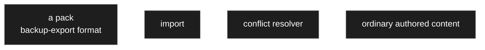

**A base scaffold ships and is imported once; afterwards it is ordinary authored content**
([D-119](90-decision-log.md)). Its contents are the simple data types, the base units, a few
currencies and the general settings — **everything beyond that is authored**
([V7](00-vision-and-scope.md)).

**No new machinery is involved.** The seed is a **backup export** in the format of
[D-058](90-decision-log.md), and the import runs through the **conflict resolver** of
[D-059](90-decision-log.md) — the same two mechanisms
[M9–M12](#m9m12--two-exports-and-they-are-not-the-same-thing) and
[M11](#m11--import-resolution-is-the-conflict-resolver-again) already describe. Further packs
(imperial, domain-specific) are separate importable files in the same format.

**Three things ship and they are different** ([D-129](90-decision-log.md)):

| | What it is |
|---|---|
| **The scaffold** | framework essentials, required ([D-119](90-decision-log.md)) |
| **The demo pack** | a worked example model **with data**, optional — so an author can see how things are done. It doubles as a **regression fixture**: if it imports, builds and renders, the engine works |
| **Test-data records** | the `is_test` flag driving previews ([D-028](90-decision-log.md)) |

**All of these are one object.** [D-175](90-decision-log.md) unifies them: a **pack** is a named
set of model content that can be installed and **removed again**. Removal needs nothing new — a
pack lifts out cleanly exactly when **nothing outside points into it** and **nothing inside was
changed**; otherwise the conflict resolver lists what stands in the way, and removal runs through
the trash like any other deletion ([D-123](90-decision-log.md)).

> ⚠️ **A hard line, recorded in [D-175](90-decision-log.md) as the author's own call: a pack is
> data, never code.** Nodes, relations, settings, labels and example records yes; its own
> renderers, validators or converters no — a pack that needs behaviour **declares a dependency**
> on it instead of carrying it.

## Provenance — two marks, because one is not enough

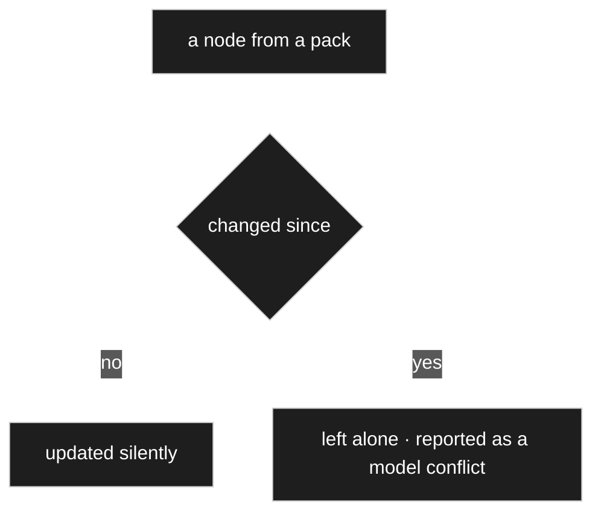

The concrete case is the **plugin update**. A new version ships an additional label role or
relation kind ([D-151](90-decision-log.md)) and it has to slot in; but if the owner has meanwhile
**renamed or adjusted** a shipped node, the update must not paint over it. Without a mark the
updater can tell neither what it is responsible for nor whether that thing has been touched
([D-174](90-decision-log.md)).

**One mark is not enough.** *Came from the pack* says the updater **may** feel responsible, not
whether it still **should**. The two failure modes a single flag would merge are: an update that
destroys the owner's work, and an installation that silently stops receiving improvements.

The rejected alternative is recorded with it: treating shipped nodes as ordinary ones and letting
updates touch nothing makes every future addition a manual chore and guarantees installations
drift apart ([D-174](90-decision-log.md)).

**The first mark names a pack, not the seed.** [D-175](90-decision-log.md) generalises it — not
*from the seed* but **from pack X**, still paired with *changed since*. One more field, no new
mechanism.

**Provenance attributes; it does not protect.** [D-174](90-decision-log.md) already separates it
from the template flag of [D-122](90-decision-log.md), and [D-194](90-decision-log.md) completes
the split: *came from the shipped pack* is far too wide for deletion protection, since a sample
recipe ships too and must be deletable. **Provenance is information, framework is protection.**

> ⚠️ [D-119](90-decision-log.md) says updates *never overwrite*; [D-174](90-decision-log.md) says
> an untouched node is *updated silently*. Not resolved here — see
> [`_harvest/contradictions.md`](_harvest/contradictions.md).

## Durability is a lifecycle question, not a storage-shape question

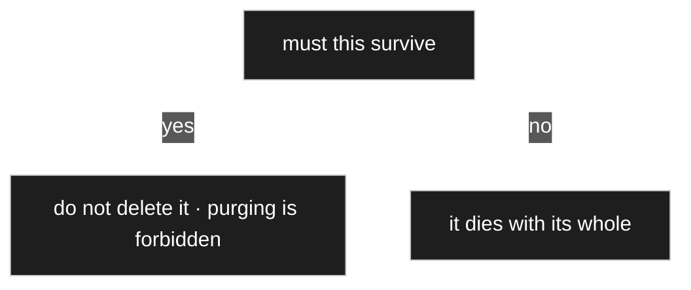

A composed price dies with its parts list, and **that is correct** — the prices of a deleted parts
list are not history. Where a document must survive, the answer is that **it is not deleted**:
[D-123](90-decision-log.md)'s park-and-purge already separates preserving from destroying, and
purging an order would simply be forbidden ([D-141](90-decision-log.md)).

**How order prices are modelled therefore already follows from
[D-065](90-decision-log.md)** — the same test [40 I18n](40-i18n.md) applies to labels: a **list
price** *describes*, so it tracks; a **price in an order line** *was agreed*, so it freezes, with
its exchange rate ([D-064](90-decision-log.md)). Both are prices on the same part and behave
oppositely because they are different statements.

## Undo — a step forward, not a rewind

Undo is **in scope** ([D-172](90-decision-log.md)). The owner named the two mistakes a person
actually wants to take back: a wrong name — *he can fix that himself, but it is nice if a button
does it* — and the serious one, *changing an attribute and then noticing: oops, I have broken my
data*.

**The revert is recorded as a new change, never as a rewind.** History is extended, never
rewritten — otherwise the changelog stops being the migration script
([D-061](90-decision-log.md)). What that implies for version numbers is
[M13a](#m13a--numbers-order-events-shape-decides-compatibility) above.

**Nothing new has to be built**, which was the owner's actual question: the existing tools suffice
provided compatibility is computed from **shape**.

**The reach is one sentence a user can be told: as long as the trash has not been emptied.**
[D-123](90-decision-log.md) parks instead of deleting and [D-159](90-decision-log.md) leaves
orphaned values untouched; together they **are** the window in which taking something back is
honest. Once purged it is gone, and the interface must not pretend otherwise.

**Migration is not an undo case.** Undo answers *I did not mean that*; migration answers *I mean
this now*. Two different intentions, and merging them would give both the wrong safeguards
([D-173](90-decision-log.md)).

## Importing existing WordPress tables is its own tool

The owner has many WordPress standard tables of the same kind that want moving into the plugin's
own tables, and *since other users probably have the same problem, one could provide a tool for
it* ([D-173](90-decision-log.md)).

That importer is a **boundary tool** ([D-171](90-decision-log.md)), deliberately **not** core:
reading `posts`, `postmeta` and `terms` is WordPress knowledge through and through, and
[CD-1](../../CLAUDE.md) keeps that out of the core.

It gets **its own concept document when the domain core is locked**, not before. How it is told
what maps to what is [OQ-072](91-open-questions.md), deferred by decision with a named trigger —
*when the domain core is locked* ([D-200](90-decision-log.md)).

## Open

Every question this document was drafted around has since been answered. Kept as a record of
where the answer went:

| | Closed by |
|---|---|
| [OQ-050](91-open-questions.md) — what does a tool-independent export look like? | [D-058](90-decision-log.md), [D-059](90-decision-log.md) — two exports; import conflicts go to the resolver |
| [OQ-051](91-open-questions.md) — does staged resolution need the intermediate model versions? | [D-060](90-decision-log.md), [D-061](90-decision-log.md) — the version is on the record; the changelog is the script |
| [OQ-052](91-open-questions.md) — what can the resolver offer beyond showing a conflict? | [D-062](90-decision-log.md) — map, map with transformation, bulk fill, fill by hand, delete |
| [OQ-015](91-open-questions.md) — where the data live at all | [D-083](90-decision-log.md) — seven tables, `records` and `record_values` among them |
| [OQ-065](91-open-questions.md) — does a seed item need a provenance marker? | [D-174](90-decision-log.md) — two marks, generalised to packs by [D-175](90-decision-log.md) |
| [OQ-066](91-open-questions.md) — what happens to data when a node is moved? | [D-155](90-decision-log.md) — one rule, two subjects, and no data lost |
| [OQ-057](91-open-questions.md) — is undo in scope? | [D-172](90-decision-log.md) — yes; a step forward, reaching as far as the trash |

**Still open:**

| | |
|---|---|
| [OQ-072](91-open-questions.md) | How is the importer told what maps to what? **Deferred by decision** ([D-200](90-decision-log.md)); reopens when the domain core is locked. |

What is **not** settled beyond that is listed in
[`_harvest/contradictions.md`](_harvest/contradictions.md), because it is a disagreement between
decisions rather than an unasked question.

## Harvest candidates

| Source | What is in it |
|---|---|
| `includes/class-model-version.php`, `class-model-version-admin.php` | The previous project built a model-version admin. Unread — a cross-check for M7/M8, not an inheritance. |
| [`../legacy/plans/q123-migrate-handoff.md`](../legacy/plans/q123-migrate-handoff.md) | 883 lines on migrating the old model. Likely mostly about that specific migration rather than the mechanism. |
