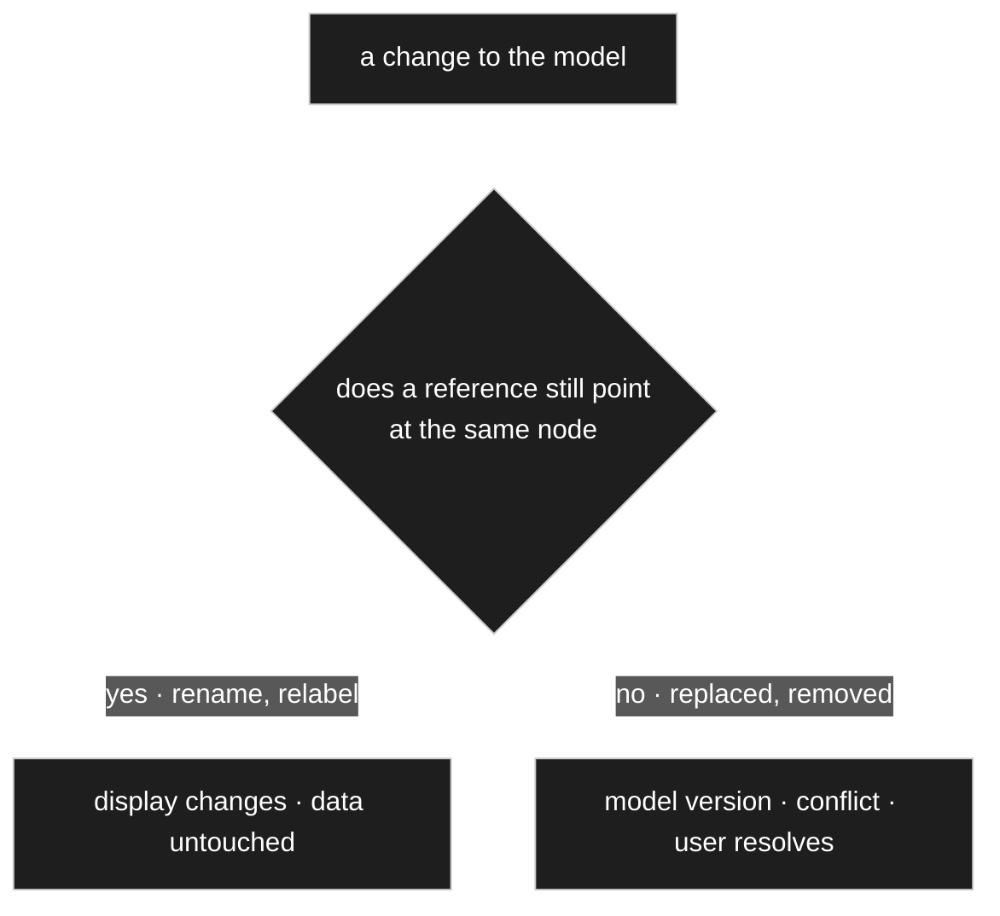
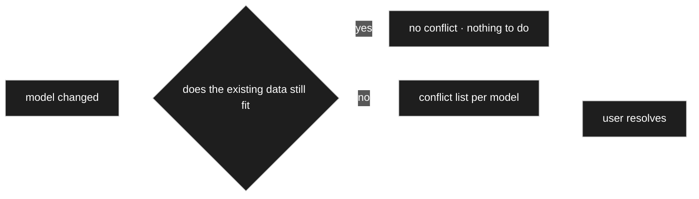
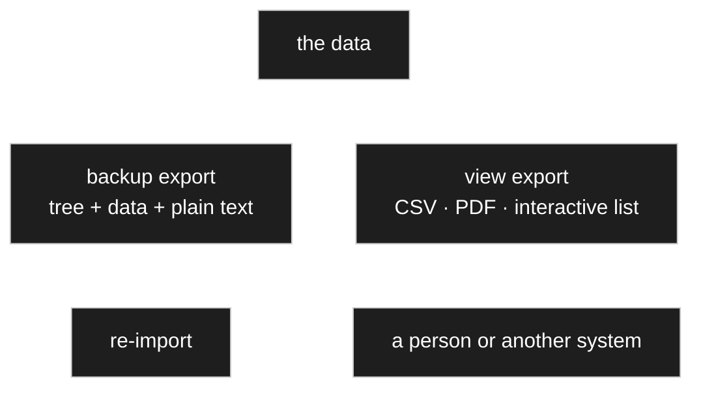
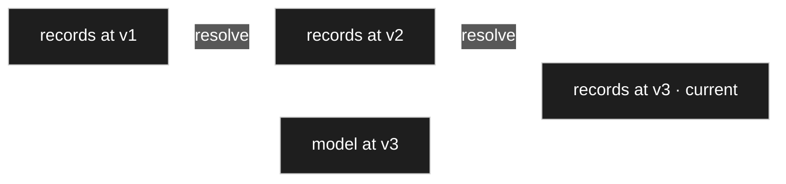

# Model change and migration

> **Status: `draft`.** Owner statements of 2026-08-22. This is the topic
> [OQ-031](91-open-questions.md) was holding open, and it now has a mechanism.

## Purpose

Define what happens to data already entered when the model beneath it changes — how a break is
detected, and how the user resolves one.

## Owner statement — 2026-08-22

| # | Statement |
|---|---|
| **M1** | Changing a unit or a description changes **only the output**. The node is the same one that was used; the data stay the same. |
| **M2** | Therefore the data must hold a **reference to the node id**, never to the name. Rename the node and every output changes — the data do not. |
| **M3** | **Documents are not part of this concept.** An exported PDF is detached from the model; regenerating it later would simply look different. There is no conflict, so: **always keep it current.** |
| **M4** | **Replacing** a node with a different one is another matter. That changes the **model version** and produces a conflict in existing data, which the user has to resolve. |
| **M5** | Data made of id references are **not human-readable**. One cannot look into the database the way one can with a relational one. That is already true of the model structure, so the tool is required in order to view data at all. |
| **M6** | Two surfaces follow: **data entry in the admin** — choose a model, see its data — and the **conflict resolver**. |
| **M7** | The conflict resolver shows **which models have conflicts with their data** and lets the user resolve them. Afterwards the model has no conflicts and the data have been carried into the new structure. |
| **M8** | Resolution can run in **several stages**. If the model changed repeatedly and structural problems accumulated, they are resolved one after another until the old data fit the model again. |

## M1–M4 — rename is not replace

This is the distinction that settles [OQ-049](91-open-questions.md), and it is sharper than the
*freeze or track* framing that question was built on.

- **Renaming** touches a **label**. The reference is unchanged, so nothing about the data has
  changed — only the words used to show it. Keep it current; there is nothing to freeze.
- **Replacing** touches a **reference**. The data now point at something that is gone or
  different, and that is a genuine conflict.

M3 removes the one case that argued for freezing. A document is an **export**, detached the moment
it is produced. Regenerating it later gives a different document, and that is expected rather than
wrong. Nothing inside the model needs to remember how it once read.

## M5 — the readability cost, and what it obliges

The owner names the price plainly: **the data are unreadable without the tool.** Rows of id
references cannot be scanned in a database client the way relational rows can.

Two things follow, and the second is not optional.

**Mitigation is cheap.** Every node carries a required base name ([D-020](90-decision-log.md)) and
labels beside it. Any view that resolves ids to names turns unreadable rows into readable ones,
and that is one join. A read-only *resolved view* — for support, for debugging, for a plain
export — costs almost nothing and should exist from the start rather than being wished for later.

**But the tool becomes critical infrastructure.** If the data cannot be read without it, then:
deactivating the plugin makes the data inaccessible; a backup of the tables is not a backup of
anything anyone can use; and recovering from a broken installation needs the tool working first.

**Therefore an export that is readable without the tool is a requirement, not a nicety.** It is
the answer to *what if this plugin is gone*, and it is much cheaper to design in now than to
retrofit. → [OQ-050](91-open-questions.md).

## M6–M8 — the conflict resolver

The loop is the point: after each resolution the data are checked again, so a model that changed
several times is worked down step by step (M8) until nothing is left. That also means **the
resolver is the only way data reach a new model structure** — there is no silent migration behind
it.

This is [D-037](90-decision-log.md) made operable. That decision said whether a change breaks
anything **depends on the data, not on the kind of change** — lowering a maximum from 100 to 20
breaks nothing if no stored value exceeds 20. The resolver is where that check runs, and where
[D-050](90-decision-log.md) applies too: **with no data present there is nothing to check and
nothing to ask.**

M6's other surface — choose a model, see its data — is the ordinary data view, and by
[D-029](90-decision-log.md) it is the same editor used everywhere else.

## Owner statement — 2026-08-22, second pass: export, versions per record, and what the resolver offers

| # | Statement |
|---|---|
| **M9** | **All data must be exportable and re-importable** — and that includes the **tree**. With the tree present, the assignment is present too. |
| **M10** | Alternatively, or in addition, the data may be written in **plain text**: store `Stück` as the word as well, so that it can be resolved back afterwards. |
| **M11** | The one problem: if `Stück` no longer exists as a unit value, the **import** has to resolve it — either map it to another node, or create a node and bind that id to `Stück`. |
| **M12** | CSV, PDF, an interactive parts list — those are **views** of the data, a different thing from backup. |
| **M13** | **Every record belongs to a model version.** Resolving carries data from one version to the next, so the version **on the record** advances and the record must then match it. |
| **M14** | Until everything is resolved, records of **different versions coexist**. When all is resolved, only records of the current version remain. |
| **M15** | The resolver offers **mapping** from one field to another — and not only one to one, but **with a transformation**: move everything from the old *Stück* column into the new one and rewrite `Stück` to `STK`, or gram to kilogram. |
| **M16** | For **new fields** it offers filling them by hand across all records, or a **bulk change** — *set them all to this value*. Only needed at all when the field is mandatory. |
| **M17** | A change that creates a new version — deleting a field, say — must **warn the user at the moment of the change**: the old records still hold that field, the new shape does not. The user then decides: **delete it**, because it never made sense anyway, or **transfer it**. |

## M9–M12 — two exports, and they are not the same thing

| | **Backup export** | **View export** |
|---|---|---|
| Contains | the tree **and** the data, together | one model's data, shaped for a purpose |
| Must round-trip | **yes** | no |
| Produced by | the export itself | a **renderer** ([R1](30-renderer.md)) |
| Answers | *what if this installation is gone* | *I need this as a spreadsheet* |

Keeping them apart matters because they pull in opposite directions: a backup wants completeness
and exactness, a view wants readability and omission. Trying to make one artefact do both
produces something that is bad at each.

**M12 places the view exports where they belong** — a CSV, a PDF, an interactive parts list are
different renderings of the same nodes. Nothing new is needed for them beyond
[R8](30-renderer.md)'s levels gaining another one.

### M10 — plain text beside the id is the right call

The proposal is to write both: the reference **and** the word. It costs a column in the export
file and buys three things:

1. **The export is readable without the tool** — which is the requirement
   [M5](#m5--the-readability-cost-and-what-it-obliges) raised.
2. **It survives losing the node.** An id alone that points at something deleted is unrecoverable;
   `#4711 · "Stück"` can still be re-bound by a person who knows what it meant.
3. **It is self-describing.** Someone opening the file in five years can tell what it is without
   the schema.

The id stays authoritative on import; the text is the fallback and the human reading.

### M11 — import resolution is the conflict resolver again

An import that finds a reference to a node which no longer exists is in exactly the position the
resolver already handles: *the data no longer fit the model, a person must decide.* The moves are
the ones M11 names — **map to an existing node** or **create one and bind the id**.

**So there is no second mechanism.** Import is a source of conflicts; the resolver resolves them.
That also means an import never silently invents nodes.

## M13/M14 — the version lives on the record

This answers [OQ-051](91-open-questions.md), and it answers the harder half of
[OQ-001](91-open-questions.md) with it: **the model version is not a field on `Identity`.** It is
carried by the **record**, in the data layer, and it says *which shape was this written against*.
The row change counter that C16 described is a different number entirely, and now demonstrably so
— one belongs to a node, the other to a record.

**What follows: the changes are needed, not the snapshots.** To carry a record from v1 to v3, the
resolver needs to know *what changed* at each step — not what the whole model looked like. A list
of changes per version is enough, and much cheaper to keep than full copies.

**And that list already exists.** `ChangeLogItem` has been sitting in the model since the seed
sketch without a job ([OQ-008](91-open-questions.md) only asked about its cardinality). **The
model's changelog is the migration script.** That is the first real reason to have it, and it
argues for logging every change rather than treating the log as optional.

## M15–M17 — what the resolver can offer

Answering [OQ-052](91-open-questions.md), in the owner's own list:

| Move | For | Note |
|---|---|---|
| **Map** field → field | a field was replaced or renamed | not only one to one |
| **Map with transformation** | the values themselves changed shape | `Stück` → `STK`, gram → kilogram |
| **Bulk fill** | a new **mandatory** field | one value stated once, applied to every old record |
| **Fill by hand** | few records, or each differs | |
| **Delete** | the field is genuinely gone | the user says *it never made sense anyway* |

**A transformation here is the same thing as a converter** ([D-043](90-decision-log.md)):
gram → kilogram is a unit conversion, `Stück` → `STK` is a text rewrite. So the resolver does not
need a transformation language of its own — it needs to be able to **apply a converter** to a
column. Which also means every converter written for display is available for migration.

### M17 — warn at the moment of the change

The warning belongs where the change is made, not on a list somewhere afterwards. That is
[D-050](90-decision-log.md) once more: **ask where it matters, when it matters**, and only if
there is data to matter about.

The message has a fixed shape — *the existing records still hold this field; the new shape does
not* — and exactly two answers: **delete** or **transfer**. Deciding at that moment is far easier
than deciding weeks later in front of a conflict list, because the reason for the change is still
in the author's head.

## Open

| | |
|---|---|
| [OQ-050](91-open-questions.md) | What does a tool-independent export look like, and when is it written? |
| [OQ-051](91-open-questions.md) | Does staged resolution require the intermediate model versions to be kept? |
| [OQ-052](91-open-questions.md) | What can the resolver offer, beyond showing the conflict? |
| [OQ-015](91-open-questions.md) | Still the root: where the data live at all. |

## Harvest candidates

| Source | What is in it |
|---|---|
| `includes/class-model-version.php`, `class-model-version-admin.php` | The previous project built a model-version admin. Unread — a cross-check for M7/M8, not an inheritance. |
| [`../legacy/plans/q123-migrate-handoff.md`](../legacy/plans/q123-migrate-handoff.md) | 883 lines on migrating the old model. Likely mostly about that specific migration rather than the mechanism. |
