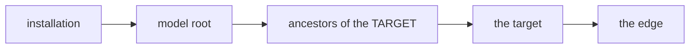
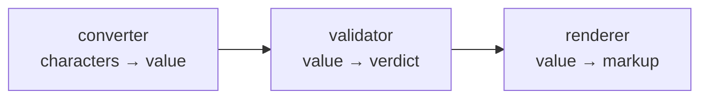
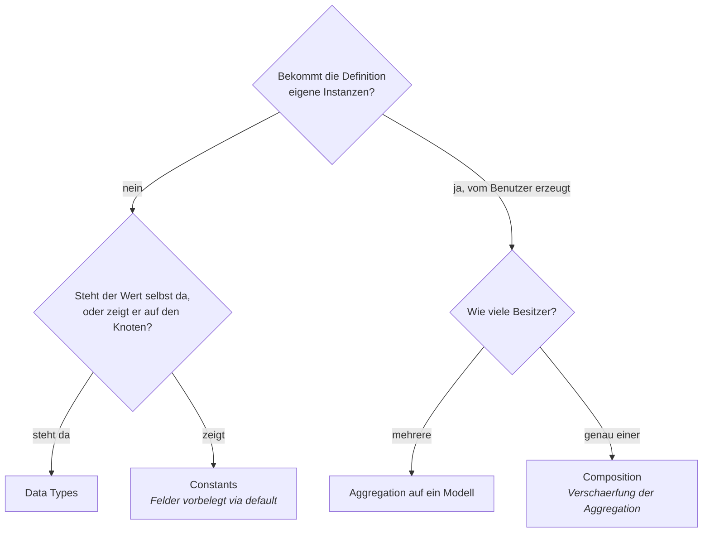

# Open questions

Anything undecided lives here rather than being invented into a document. An answered
question moves to [the decision log](90-decision-log.md) and is marked `closed → D-<nnn>`
here — it is not deleted.

**Id:** `OQ-<nnn>`, never reused. Independent of the legacy `Q<n>` numbering.

---

## OQ-001 — What is in the shared base of node and relation?

> **Closed 2026-08-22 → [D-080](90-decision-log.md).** `id` and `version`, and nothing else.
> `type` is not in the base — a node's type *is* its inheritance branch, and a relation carries its
> own `kind`. `creation_date` came off and is derived from the changelog.

*Blocks:* [10 Domain core](10-domain-core.md), [OQ-017](#oq-017--which-attributes-does-every-node-have) · *Status:* **closed 2026-08-22 → [D-080](90-decision-log.md)** · *re-framed 2026-08-22 at the request of the owner*

⚠️ **Entschieden in [D-060](90-decision-log.md), [D-080](90-decision-log.md).** *Diese Zeile stand hier, solange der Status oben noch `open` sagte, obwohl das Log die Frage längst nannte — am 2026-08-27 wurden **66 solche Statuszeilen** nachgezogen. Der Verweis bleibt, weil er die Fundstelle ist; die Warnung ist erledigt.*

The first wording of this question was too vague to act on. Concretely, it is **four small
decisions**, and only the last is difficult.

The two seed diagrams disagree:

| | [`TreeMeremaid.md`](TreeMeremaid.md) | [`I18nMeremaid.md`](I18nMeremaid.md) |
|---|---|---|
| name | `WPClassHead` | `Identity` |
| fields | `id`, `version`, `creation_date`, `type` | `id` |

### 1. The name

**Recommendation: `Identity`.** `WPClassHead` puts WordPress into the name of the most central
domain class, and `CD-1` says the core must not know WordPress exists. A name that lies is the
first thing that has to go.

### 2. `type` — does it belong here at all?

**Recommendation: no.** A node has a *type* (integer, e-mail); a relation has a *kind*
(inheritance, composition, aggregation). Those are different concepts that happen to share a
short word. Putting either on the shared base forces the other to pretend it has one.

If `type` was meant as a discriminator — *is this row a node or a relation* — it is redundant as
soon as they live in separate tables.

### 3. `creation_date` — stored, or the first changelog entry?

If every object gets a changelog entry on creation ([OQ-008](#oq-008--must-every-object-have-a-changelog-entry)
asks exactly this), then `creation_date` is that entry's timestamp and storing it separately
records one fact twice. If the changelog is optional, it has to be stored.

**The two questions have to be answered together**, and the cheap answer is: creation is always
logged, and `creation_date` comes off the base.

### 4. `version` — and this is the hard one

[C16](10-domain-core.md) and [C17](10-domain-core.md) may be describing **two different
things**, and the single word `version` is hiding it:

| | Reading | What it answers |
|---|---|---|
| **C16** | a **row change counter** — this node was edited | *has this object changed since I last looked* |
| **C17** | a **model version** — the shape of the model changed, existing data needs migrating | *which model version was this data written against* |

A row counter belongs on `Identity` and is derivable from the changelog. A model version belongs
to the model as a whole, is bumped deliberately rather than on every edit, and is the anchor for
[OQ-031](#oq-031--how-does-existing-data-survive-a-model-change). **They are not the same number
and probably should not share a field.**

Until that is separated, `version` on `Identity` cannot be specified — which is why this question
still blocks the core.

---

## OQ-002 — If the tree is inheritance only, what are the other edges?

> **Closed 2026-08-23 → [D-012](90-decision-log.md), [D-161](90-decision-log.md), [C9](10-domain-core.md).**
> All three sub-questions have been answered for two days and the entry simply never caught up: the
> same class distinguished by kind; edges cross branches by design; the inheritance edge is
> protected.

*Blocks:* [10 Domain core](10-domain-core.md) · *Status:* **closed 2026-08-23 → [D-012](90-decision-log.md), [D-161](90-decision-log.md)**

⚠️ **Entschieden in [D-012](90-decision-log.md).** *Diese Zeile stand hier, solange der Status oben noch `open` sagte, obwohl das Log die Frage längst nannte — am 2026-08-27 wurden **66 solche Statuszeilen** nachgezogen. Der Verweis bleibt, weil er die Fundstelle ist; die Warnung ist erledigt.*

[V1](00-vision-and-scope.md) says *nodes and edges*; [V3](00-vision-and-scope.md) says the
tree is inheritance **only**. So non-inheritance edges exist. Open:

1. Are they the same class `Relation` as the inheritance edge, distinguished by type — or a
   different construct entirely?
2. Can a non-inheritance edge cross between trees / roots?
3. Is the inheritance edge protected (not editable like the others)?

**Partially answered by [C10](10-domain-core.md)** (2026-08-22): the edge kinds named so far are
**inheritance, composition, aggregation** — said with "I believe", so recorded, not locked. What
composition and aggregation differ in is [OQ-021](#oq-021--composition-and-aggregation-what-is-the-difference-here).

The legacy round answered a version of this under *hierarchy vs other relations*; that answer
is a harvest candidate, not an inheritance.

---

## OQ-003 — Is `Relation.type` a node or an enum?

> **Closed 2026-08-22 → [D-036](90-decision-log.md):** Kantenarten sind ein Enum.

> **Owner reading, 2026-08-22:** the owner read the flowchart in
> [10 Domain core](10-domain-core.md) as showing *inheritance* — inheritance, composition and
> aggregation as subtypes of `Relation`. **That was my diagram being ambiguous:** a flowchart
> arrow is not a UML generalization, and it was meant as *kind takes one of these values*.
> Noted because exactly this kind of silent misreading is what the previous round accumulated.

### Recommendation, 2026-08-22 — an enum, and the reason is who needs to know

The criterion is not *data feels more flexible*. It is: **can the set grow without the engine
being changed?**

| | Node types | Relation kinds |
|---|---|---|
| Who may add one | the model author, in the configuration ([V7](00-vision-and-scope.md)) | nobody has said anyone may |
| What a new one needs | a renderer, settings — all data or registered code | **rules the engine enforces**: cascade delete, single parent, cycle check |
| What a new one means if nobody wrote rules for it | a working type with default behaviour | indistinguishable from aggregation |

A relation kind is not a value the model carries; it is a **behaviour the engine implements**.
Inventing a fourth kind in the configuration would produce an edge that no code knows how to
cascade, protect or resolve. So the set is closed, and a closed set that code branches on is an
enum.

**This corrects an earlier claim of mine** that OQ-003 and
[OQ-028](#oq-028--is-the-set-of-label-roles-fixed-or-extensible) must get the *same* answer. They
are the same *shape* of question, and the criterion above decides both — but it can decide them
differently, and here it does.

*Blocks:* [10 Domain core](10-domain-core.md) · *Status:* **closed 2026-08-22 → [D-036](90-decision-log.md)**

⚠️ **Entschieden in [D-036](90-decision-log.md).** *Diese Zeile stand hier, solange der Status oben noch `open` sagte, obwohl das Log die Frage längst nannte — am 2026-08-27 wurden **66 solche Statuszeilen** nachgezogen. Der Verweis bleibt, weil er die Fundstelle ist; die Warnung ist erledigt.*

[`TreeMeremaid.md`](TreeMeremaid.md) draws `Node <-- Relation : type`, i.e. the type is
itself a node — types are **data**, editable by the user. [`I18nMeremaid.md`](I18nMeremaid.md)
declares `RelationType` as an `<<enumeration>>` — types are **code**, fixed at build time.

These are opposite answers with very different consequences for extensibility, validation and
storage. [V6/V7](00-vision-and-scope.md) — special nodes are *created in the configuration* —
leans toward types-as-data, but does not settle it for edges.

---

## OQ-004 — Do node subtypes exist at all?

> **Closed 2026-08-22 → [D-036](90-decision-log.md):** eine Knotenklasse, Verhalten in registrierten Strategien.

*Blocks:* [10 Domain core](10-domain-core.md), [40 I18n](40-i18n.md) · *Status:* **closed 2026-08-22 → [D-036](90-decision-log.md)**

[V5](00-vision-and-scope.md) says all nodes are fundamentally the same.
[`I18nMeremaid.md`](I18nMeremaid.md) draws `DomainNode`, `ValueNode` and `I18nValueNode` as
abstract subclasses. Either the diagram is superseded, or V5 means something narrower than it
sounds. Related: [V6](00-vision-and-scope.md)'s *special nodes for data types and
calculations* — are those subclasses, or ordinary nodes with a particular configuration?

### The owner's position, 2026-08-22

Storage is not in question — the general fields go in the nodes table and the specialities into
settings ([C4/C5](10-domain-core.md)). The question is whether an integer node, a double node or
an e-mail node should *additionally* be its own inheriting node **because it may need its own
functions**, and functions cannot live in settings. The owner leans yes, from experience, and
asked for this to be challenged.

### Challenge, 2026-08-22

**Three things are being treated as one, and they do not have to line up:**

| | | Decided by |
|---|---|---|
| **Storage shape** | one nodes table plus settings | already settled — [C4/C5](10-domain-core.md), [D-011](90-decision-log.md) |
| **Kind identity** | how a type is named and enumerated | open |
| **Behaviour** | where the code that does something type-specific lives | **this is the real question** |

The step *it has behaviour, therefore it must be a subclass* is the one worth refusing. Four
reasons:

**1. [V7](00-vision-and-scope.md) already rules it out as the general answer.** Special nodes are
*created in the configuration* — at run time. A PHP subclass cannot be created at run time. So a
type the model author defines has no class, and the system needs a way to give it behaviour
anyway. Once that way exists, the built-in types can use it too.

**2. Single inheritance cannot carry [V8](00-vision-and-scope.md).** A node has a renderer, a
converter, and one *or more* validators. Subclassing gives one axis of variation. Which class
holds *integer that is also a currency that is also read-only in this context*? Strategies
compose; subclasses multiply.

**3. The mechanism already exists and is already decided.** [R12–R14](30-renderer.md): renderers
register, declare which node types they serve, and a node names one by string. That is exactly
*behaviour looked up by kind, code living elsewhere*. Validators and converters are the same
shape. Nothing new has to be invented — only generalised.

**4. What subclassing genuinely buys can be had without persisting subtypes.** The real benefit
is typed access — `min()` returning `int` rather than a settings lookup. That is a **typed view
over a generic node**, constructed on demand, not a subclass of the stored entity. A
configuration-defined type simply has no view and falls back to generic access.

### Recommendation

- **One node class.** No persisted subtypes, no `DomainNode` / `ValueNode` / `I18nValueNode`.
- **Type-specific behaviour lives in registered strategies**, looked up by the node's type key —
  the renderer mechanism, generalised to converters and validators.
- **Built-in types may have a PHP typed accessor** as a convenience and for type safety. It is a
  view over a node, never a subclass of it, and never required for a type to work.

**Where the owner would be right and this would be wrong:** if the set of node types were small,
closed, and never extensible by the model author. [V7](00-vision-and-scope.md) says it is not —
so if V7 is softened, this recommendation should be re-argued rather than kept.

---

## OQ-005 — `RendererRegistry` or `RendererRegister`?

> **Closed 2026-08-22 → [D-091](90-decision-log.md):** eine Registry, reines Nachschlagen; sie implementiert das Renderer-Interface nicht.

> **Half answered 2026-08-22.** [R12–R14](30-renderer.md): one registry, two lookups — by
> renderer name at render time, by node type at configuration time. It is a lookup, and the
> duplicate class in the seed is redundant. Still open: whether the registry itself implements
> the renderer interface, as the PHP sketch has it.

The original text:

*Blocks:* [30 Renderer](30-renderer.md) · *Status:* **closed 2026-08-22 → [D-091](90-decision-log.md)**

[`RendererMeremaid.md`](RendererMeremaid.md) declares **both**, with overlapping methods
(`getRendererByName` / `getRendererByType` vs. `getRenderer(NodeType)` /
`getRendereByType(RendererType)`). Almost certainly one class. Also unclear: the PHP sketch
has `RendererRegistry implements IRenderer`, which the class diagram does not show — is the
registry itself a renderer, or only a lookup?

---

## OQ-006 — Renderer contract: what is the actual method set?

> **Closed 2026-08-22 → [D-091](90-decision-log.md):** eine Methode, Subjekt ist eine Identität — Knoten oder Kante.

*Blocks:* [30 Renderer](30-renderer.md) · *Status:* **closed 2026-08-22 → [D-091](90-decision-log.md)**

⚠️ **Entschieden in [D-091](90-decision-log.md).** *Diese Zeile stand hier, solange der Status oben noch `open` sagte, obwohl das Log die Frage längst nannte — am 2026-08-27 wurden **66 solche Statuszeilen** nachgezogen. Der Verweis bleibt, weil er die Fundstelle ist; die Warnung ist erledigt.*

The PHP sketch in [`RendererMeremaid.md`](RendererMeremaid.md) declares `render()` twice with
different signatures. **PHP has no method overloading**, so that cannot be built as written.
Needs one decision: distinct method names (`renderSingle` / `renderCollection`), or one method
with a mode argument. The same file mixes both styles plus `renderTable` / `renderForm` on
`IPageRendere`.

Also unresolved here: **R3** — whether a renderer receives one node or a set. The seed file
contains both answers.

---

## OQ-007 — Where do renderer, converter and validators attach?

> **Partly answered 2026-08-22 → [D-077](90-decision-log.md).** Question 2 — *is one converter a
> hard limit* — **no**: a node may carry several, and which applies is a setting with a default and
> a per-use-site override. Question 3 — *does the converter run on input too* — **yes for
> invertible converters**, which is what makes searching by a converted form work
> ([D-076](90-decision-log.md)). Question 1, whether renderer/converter/validators are set on the
> node or inherited and overridable, is answered in the same shape by [D-015](90-decision-log.md).

*Blocks:* [10 Domain core](10-domain-core.md), [30 Renderer](30-renderer.md) · *Status:* open

⚠️ **Eine Entscheidung nennt diese Frage als beantwortet: [D-077](90-decision-log.md).** *Der Status steht noch auf `open`, weil das Log oft nur einen Teil schliesst — «settles the hard half of», «answers the shape of». **Nachzulesen ist, ob ganz oder teilweise**; bis dahin ist die Frage hier gefuehrt und der Verweis ist die Warnung, sie nicht fuer unberuehrt zu halten.*

[V8](00-vision-and-scope.md) says essentially every node has one renderer, one converter and
one-or-more validators. [`TreeMeremaid.md`](TreeMeremaid.md) puts exactly these on
`Configuration`. Open:

1. Are they set on the node itself, or inherited down the tree from a type node — and can a
   descendant override?
2. Is *one* converter a hard limit, or a current simplification?
3. Does the converter run on output only, or also on input (parse/normalise)?

---

## OQ-008 — Must every object have a changelog entry?

> **Closed 2026-08-22 → [D-081](90-decision-log.md).** Yes, at least one: if the changelog is the
> migration script and `creation_date` is read from it, then creation must always be logged. Whether
> that enables undo became [OQ-057](#oq-057--is-undo-in-scope).

*Blocks:* [10 Domain core](10-domain-core.md) · *Status:* **closed 2026-08-22 → [D-081](90-decision-log.md)**

⚠️ **Entschieden in [D-081](90-decision-log.md).** *Diese Zeile stand hier, solange der Status oben noch `open` sagte, obwohl das Log die Frage längst nannte — am 2026-08-27 wurden **66 solche Statuszeilen** nachgezogen. Der Verweis bleibt, weil er die Fundstelle ist; die Warnung ist erledigt.*

[`TreeMeremaid.md`](TreeMeremaid.md) draws `WPClassHead "1" --o "1..*" ChangeLogItem` —
cardinality `1..*` means **no object may exist without at least one changelog item**. If that
is intended (creation is always logged), say so explicitly; if `0..*` was meant, fix it. Also
open: `ChangeLogItem.undo()` — is undo in scope at all, and what is undoable?

---

## OQ-009 — Is the delivery target still a WordPress plugin?

> **Closed 2026-08-23 → [D-169](90-decision-log.md).** Yes — and WordPress is used fully rather than
> kept at a distance. What is borrowed is written down instead; how, is [OQ-071](#oq-071--how-is-borrowed-wordpress-marked).

*Blocks:* [00 Vision and scope](00-vision-and-scope.md), [50 Persistence](50-wordpress-persistence.md) · *Status:* **closed 2026-08-23 → [D-169](90-decision-log.md)**

⚠️ **Entschieden in [D-169](90-decision-log.md).** *Diese Zeile stand hier, solange der Status oben noch `open` sagte, obwohl das Log die Frage längst nannte — am 2026-08-27 wurden **66 solche Statuszeilen** nachgezogen. Der Verweis bleibt, weil er die Fundstelle ist; die Warnung ist erledigt.*

The legacy round targeted a WP plugin serving host plugins such as `wp-electronic-parts`, and
the seed base class is named `WPClassHead`. The 2026-08-22 statement does not mention
WordPress at all. Confirm the target — and whether the domain core is meant to be
WordPress-independent with WordPress only as a persistence and UI host.

---

## OQ-010 — Is an *attribute* the same thing as an *edge*?

> **Closed 2026-08-22 → [D-031](90-decision-log.md): reading 1.** An attribute *is* a relation.
> The wrapper the owner described is real and lives in the user interface — one dialog writes one
> relation row plus a few settings rows.

*Blocks:* [10 Domain core](10-domain-core.md) · *Status:* **closed 2026-08-22 → [D-031](90-decision-log.md)**

⚠️ **Entschieden in [D-031](90-decision-log.md).** *Diese Zeile stand hier, solange der Status oben noch `open` sagte, obwohl das Log die Frage längst nannte — am 2026-08-27 wurden **66 solche Statuszeilen** nachgezogen. Der Verweis bleibt, weil er die Fundstelle ist; die Warnung ist erledigt.*

[C1/C2](10-domain-core.md) describe an attribute as having a name, a type, and a kind of
connection to another node. [V1](00-vision-and-scope.md) describes the model as nodes and
edges. [P3](50-wordpress-persistence.md) provides exactly one relations table.

Three readings, and they are not equivalent:

1. **Attribute = edge.** One construct, one table. An attribute is a named, typed edge; the
   inheritance edge is one particular kind. Matches the legacy *Attribute = Relation* lock.
2. **Attribute uses an edge.** The attribute is its own object (name, type) and *has* an edge
   to the target node. Two constructs, two tables.
3. **Attribute is a slot on the node**, and edges are separate. Would need a place for the
   attribute's value that the relations table does not provide.

This is the single most consequential open question in the concept. Reading 1 is the leanest
and is what the previous round converged on — but it converged there after a long detour, so
it deserves to be re-argued rather than assumed.

---

## OQ-011 — What is an attribute's *type*?

> **Closed 2026-08-22 → [D-025](90-decision-log.md).** The type **is the node the relation points
> at**. `to` is the type, `kind` is the connection — two fields of one edge.


*Blocks:* [10 Domain core](10-domain-core.md) · *Status:* **closed 2026-08-22 → [D-025](90-decision-log.md)**

⚠️ **Entschieden in [D-025](90-decision-log.md).** *Diese Zeile stand hier, solange der Status oben noch `open` sagte, obwohl das Log die Frage längst nannte — am 2026-08-27 wurden **66 solche Statuszeilen** nachgezogen. Der Verweis bleibt, weil er die Fundstelle ist; die Warnung ist erledigt.*

[C2](10-domain-core.md) lists *type* and *kind of connection* as two separate things. So the
type is presumably not the edge kind. Candidates: a data type (`int`, `string`, …) — which
would tie into [V6](00-vision-and-scope.md)'s *special nodes for data types*; the required
type of the target node; or a domain type from the tree. Also unresolved: where a plain
scalar value is actually stored.

---

## OQ-012 — Custom tables, or WordPress terms/posts?

*Blocks:* [50 Persistence](50-wordpress-persistence.md) · *Status:* **closed for the model → [D-007](90-decision-log.md)**

> **Answered 2026-08-22:** the **model** goes into tables owned by this plugin — nodes,
> settings, relations. Not posts, postmeta, terms or CPTs. Storage of the **content** that a
> model describes is a separate question and stays open → [OQ-015](#oq-015--where-does-the-content-live).

The original text, kept because the trade-off it names still applies to OQ-015:

[P1–P4](50-wordpress-persistence.md) name three base tables: nodes, settings, relations. A
generic settings table and a relations table read like **custom tables** (`$wpdb->prefix`),
not like WP terms + termmeta. Needs to be said outright, because it decides what comes for
free (WP admin list tables, REST, caps, i18n of terms) and what has to be built.

Note the plugin's own history: the legacy scaffold ran on **WP terms** (`wtt_fs`). If custom
tables are the answer, that is a break, not an evolution.

---

## OQ-013 — What exactly is a "setting", versus an attribute?

*Blocks:* [10 Domain core](10-domain-core.md) · *Status:* **closed → [D-011](90-decision-log.md)**

> **Answered 2026-08-22:** they are the same kind of thing. A setting is an **additional
> attribute** of a node — see [C3](10-domain-core.md). What follows from it is split into
> [OQ-016](#oq-016--is-setting-one-thing-or-two) (does the word also cover tool behaviour?),
> [OQ-017](#oq-017--which-attributes-does-every-node-have) (what is the fixed set?) and
> [OQ-018](#oq-018--where-does-the-value-of-an-extended-attribute-live) (where does the value
> live?).

The original text:

[P2](50-wordpress-persistence.md) gives nodes optional settings in a generic table.
[C1](10-domain-core.md) gives nodes attributes. [`TreeMeremaid.md`](TreeMeremaid.md) gives
`Configuration` a list of `Setting` objects (name, type, value) *and* fields for renderer,
converter, validators.

Both settings and attributes are name/type/value triples hanging off a node. The distinction
has to be stated in one sentence, or the two will keep collapsing into each other:
**attributes model the user's domain; settings configure the tool's behaviour** is the
obvious candidate — confirm or replace it.

---

## OQ-014 — Where does the renderer run: PHP or JavaScript?

> **Closed 2026-08-22 → [D-021](90-decision-log.md): PHP.** The owner accepted the
> recommendation below in full, including metadata-driven editing controls in the Gutenberg
> editor so that no node type ever needs its own JavaScript.


*Blocks:* [30 Renderer](30-renderer.md), [10 Domain core](10-domain-core.md) · *Status:* **closed 2026-08-22 → [D-021](90-decision-log.md)**

⚠️ **Entschieden in [D-021](90-decision-log.md).** *Diese Zeile stand hier, solange der Status oben noch `open` sagte, obwohl das Log die Frage längst nannte — am 2026-08-27 wurden **66 solche Statuszeilen** nachgezogen. Der Verweis bleibt, weil er die Fundstelle ist; die Warnung ist erledigt.*

[R1](30-renderer.md) says display happens **only** through a renderer, and [V8](00-vision-and-scope.md)
puts a renderer on essentially every node. That describes renderers as part of the model.

The rule set inherited from the previous round said the opposite, in §7 of the deleted
`generalWPImplRulse.mdc` (now only in git history): *PHP must not render HTML for tree nodes;
PHP acts strictly as a headless JSON API provider*, with a JavaScript app doing the assembly.

Both cannot hold. Either:

1. **Renderers are PHP** and produce markup; the JS admin app consumes rendered fragments.
2. **Renderers are JS**, and PHP only ships nodes plus a `renderer_key`; then the PHP-side
   renderer contract in [`RendererMeremaid.md`](RendererMeremaid.md) is describing something
   else, or nothing.
3. **Both**, with one contract mirrored on each side — the most expensive option, and it needs
   a stated reason.

This decides how much of the concept is PHP at all, so it is worth settling before the
renderer document is written up.

### Recommendation (2026-08-22) — reading 1, with one qualification

The owner leans PHP and asked for advice. Reading 1 is the right one, and it is also the more
WordPress-standard of the two. What follows is the reasoning, kept here so the decision can be
re-checked later rather than remembered.

**PHP already covers two of the three levels of [R8](30-renderer.md), natively.**

| Level | Who renders it, by WordPress convention |
|---|---|
| Admin module | PHP. A classic admin screen is a PHP page. |
| Frontend | PHP. A theme template is PHP. |
| Gutenberg block **output** | PHP, for a *dynamic block* — the block declares a server-side render callback and the markup is produced per request. This is the standard shape for any block that shows live data. |
| Gutenberg block **editor UI** | JavaScript, unavoidably. The editor is React. |

So only the last row genuinely needs JavaScript, and it needs it for **editing controls**, not
for display.

**Reading 2 would force the duplication [R4](30-renderer.md) exists to prevent.** If PHP only
ships JSON and JavaScript renders, then the frontend needs a JavaScript renderer for every node
type — and the admin module and the block output need one too, or a second PHP one. That is the
second implementation R4 forbids, arrived at by accident.

**The qualification: editing.** [R10](30-renderer.md) requires every renderer to support
*editable*. Display in PHP is straightforward; editing controls inside the Gutenberg editor are
React. Two ways out:

1. **Metadata-driven editing.** The editor does not get a React component per node type. It
   gets the node's attributes with their types and settings, and one generic control set
   renders them. New node types then need no JavaScript at all. This keeps R4 intact.
2. **A React component per node type**, mirroring the PHP renderer. Clean-looking, and exactly
   the duplication R4 forbids. Every new type costs two implementations that must not drift.

Option 1 is the recommendation. It also means the PHP renderer needs to expose the attribute
metadata it used, not only the finished markup — worth carrying into the renderer contract.

**For frontend interactivity** WordPress ships an Interactivity API, which is the current
standard for making block output interactive without a separate application. It is the natural
fit for reading 1: the markup stays server-rendered, behaviour is declared on it.

**Not recommended:** reading 3. Two mirrored renderer stacks is the most expensive option and
nothing in the statements so far demands it.

---

## OQ-015 — Where does the content live?

> **Closed 2026-08-22 → [D-083](90-decision-log.md), refined by [D-133](90-decision-log.md).** In
> tables owned by the plugin, beside the model and not inside it: `records` and `record_values`.
> Where a single value physically sits then follows from relation kind and multiplicity.

*Blocks:* [50 Persistence](50-wordpress-persistence.md) · *Status:* **closed 2026-08-22 → [D-083](90-decision-log.md), [D-133](90-decision-log.md)**, deliberately deferred

⚠️ **Entschieden in [D-083](90-decision-log.md).** *Diese Zeile stand hier, solange der Status oben noch `open` sagte, obwohl das Log die Frage längst nannte — am 2026-08-27 wurden **66 solche Statuszeilen** nachgezogen. Der Verweis bleibt, weil er die Fundstelle ist; die Warnung ist erledigt.*

[D-007](90-decision-log.md) puts the **model** — nodes, settings, relations — into tables owned
by the plugin. It says nothing about the **content** that a model describes: the actual
instances a user creates once a model exists.

Candidates, none evaluated yet: the same node tables (content is just more nodes); separate
instance tables per model; WordPress posts, so that content gets the editor, revisions, search
and permalinks for free.

Deferred on purpose — it cannot be answered before [10 Domain core](10-domain-core.md) says
whether *model* and *instance* are even different kinds of thing.

---

## OQ-016 — Is "setting" one thing, or two?

> **Closed 2026-08-22 → [D-084](90-decision-log.md)**, which supersedes the first answer ([D-078](90-decision-log.md)):
> one mechanism and a reserved namespace, not a scope split. The owner rejected the split as being
> on the wrong axis — renderer, converter and validators are set on the node as initial values and
> overridden at a use site, exactly like `min`.

*Blocks:* [10 Domain core](10-domain-core.md) · *Status:* **closed 2026-08-22 → [D-084](90-decision-log.md), [D-078](90-decision-log.md)** · *Raised by* [C3–C5](10-domain-core.md)

⚠️ **Entschieden in [D-084](90-decision-log.md).** *Diese Zeile stand hier, solange der Status oben noch `open` sagte, obwohl das Log die Frage längst nannte — am 2026-08-27 wurden **66 solche Statuszeilen** nachgezogen. Der Verweis bleibt, weil er die Fundstelle ist; die Warnung ist erledigt.*

Two different kinds of thing currently share the word:

| | Example | Nature |
|---|---|---|
| **Domain content** | an integer node carrying `min`, `max`, `step` | part of what the user models |
| **Tool behaviour** | `order`, `hide`, `read_only`, `renderer`, `converter`, `validators[]` — the `Configuration` box in [`TreeMeremaid.md`](TreeMeremaid.md) | how this tool treats the node |

C3 says settings *are* attributes, and that reading fits the first row cleanly. It fits the
second row much less well: `hide` is not something the user is modelling about the world.

The boundary is genuinely blurry, which is why it needs deciding rather than assuming:
`min` / `max` are read by the **validator**, `renderer` is read by the **renderer** — both are
consumed by the tool, yet only one of them describes the domain. Candidate answers:

1. **One construct.** Everything is an attribute; tool behaviour is just attributes the tool
   happens to read. Leanest, and consistent with V5.
2. **Two constructs.** Attributes model the domain; configuration steers the tool. Clearer to
   read, at the cost of a second concept and a second place to look.
3. **One construct, two namespaces.** One table, one shape, but a reserved namespace for
   tool-owned keys so they cannot collide with user-defined ones.

---

## OQ-017 — Which attributes does every node have?

> **Closed 2026-08-22 → [D-082](90-decision-log.md).** Four: `id`, `version`, `name`, `path`.
> Everything else that looked like a candidate belongs elsewhere — `type` to the branch, `order` to
> the edge, and the rest to settings.

*Blocks:* [10 Domain core](10-domain-core.md), [50 Persistence](50-wordpress-persistence.md) · *Status:* **closed 2026-08-22 → [D-082](90-decision-log.md)** · *Raised by* [C4](10-domain-core.md)

⚠️ **Entschieden in [D-082](90-decision-log.md).** *Diese Zeile stand hier, solange der Status oben noch `open` sagte, obwohl das Log die Frage längst nannte — am 2026-08-27 wurden **66 solche Statuszeilen** nachgezogen. Der Verweis bleibt, weil er die Fundstelle ist; die Warnung ist erledigt.*

C4 puts the attributes common to all nodes on the node itself — i.e. they become **columns**.
That makes the list a schema commitment: adding one later is a migration, not an edit.

So the set has to be enumerated and then frozen. Candidates visible so far, none confirmed:
`id`, `type`, `name`, parent / inheritance edge, `version`, `creation_date`, `renderer_key`.
Note the overlap with [OQ-001](#oq-001--what-is-in-the-shared-base-of-node-and-relation) — whether
`version` and `creation_date` belong on the node at all, or are derived from the change history.

---

## OQ-018 — Where does the value of an extended attribute live?

> **Half dissolved 2026-08-22 → [D-026](90-decision-log.md).** The question mixed two layers. At
> **model** level there is no value, only a **default**. Values belong to instances, and where
> those live is [OQ-015](#oq-015--where-does-the-content-live). What remains here: where a
> *scalar default* is stored (a setting) versus a *record default*
> ([OQ-035](#oq-035--can-a-relation-reach-something-that-is-not-a-model-node)).


*Blocks:* [10 Domain core](10-domain-core.md), [50 Persistence](50-wordpress-persistence.md) · *Status:* open · *Raised by* [C2 vs C5](10-domain-core.md)

⚠️ **Eine Entscheidung nennt diese Frage als beantwortet: [D-026](90-decision-log.md).** *Der Status steht noch auf `open`, weil das Log oft nur einen Teil schliesst — «settles the hard half of», «answers the shape of». **Nachzulesen ist, ob ganz oder teilweise**; bis dahin ist die Frage hier gefuehrt und der Verweis ist die Warnung, sie nicht fuer unberuehrt zu halten.*

Two statements describe the same concept in two storage locations:

- **C2** — an attribute carries a name, a type, and a **kind of connection to another node**.
  The value is another node; the row lives in the relations table.
- **C5** — extended attributes are stored **generically in the settings table**. The value is
  inline; no other node is involved.

Possible resolutions:

1. **Two forms of one concept.** An attribute pointing at a node is a relation row; an
   attribute holding a scalar is a settings row. Needs a stated rule for which is used when,
   or the same fact can be written in two places — which the code standard forbids.
2. **Values are always nodes.** `min = 0` means an edge to a value node holding `0`. Uniform,
   and it makes C5 a storage optimisation rather than a separate concept. Costs a node per
   scalar.
3. **Values are never nodes.** Then C2's *connection to another node* means only the
   attribute's declared target **type**, not its value — and the relations table holds
   structure only.

This question and [OQ-010](#oq-010--is-an-attribute-the-same-thing-as-an-edge) are the same
question seen from two sides. They should be answered together, in one sitting.

---

## OQ-019 — Cycles and depth in the render descent

> **Closed 2026-08-22 → [D-100](90-decision-log.md).** Cycles are detected and draw a **reference**;
> a depth limit additionally **warns**, because there something really is missing. One guard for both
> the render descent and the calculation walk.

*Blocks:* [30 Renderer](30-renderer.md) · *Status:* **closed 2026-08-22 → [D-100](90-decision-log.md)** · *Raised by* [R5, R7](30-renderer.md)

⚠️ **Entschieden in [D-100](90-decision-log.md).** *Diese Zeile stand hier, solange der Status oben noch `open` sagte, obwohl das Log die Frage längst nannte — am 2026-08-27 wurden **66 solche Statuszeilen** nachgezogen. Der Verweis bleibt, weil er die Fundstelle ist; die Warnung ist erledigt.*

R7 descends: node → attributes → target nodes → their renderers → their attributes. Nothing in
the statement bounds that walk. Two ways it does not terminate:

- **A cycle.** Composition and aggregation edges can form one, directly or through several
  hops. Inheritance is a tree and cannot, but the other edge kinds are a graph.
- **Depth.** A deep but finite model can still blow the stack or the page.

Needs a stated rule: detect visited nodes and stop, cap the depth, or both — and what the
renderer emits when it stops (nothing, a placeholder, a link).

---

## OQ-020 — Loading the subgraph without an N+1

> **Answered 2026-08-22 → [D-014](90-decision-log.md).** Load the subgraph and every settings row
> it touches in a small fixed number of batched queries before rendering; neither resolver nor
> renderer touches the database. The ancestor walk is served by an indexed structure, decided as
> a schema shape rather than added later.

*Blocks:* [30 Renderer](30-renderer.md), [50 Persistence](50-wordpress-persistence.md) · *Status:* **closed 2026-08-22 → [D-014](90-decision-log.md)** · *Raised by* [R7](30-renderer.md) vs `CD-7`

⚠️ **Entschieden in [D-014](90-decision-log.md).** *Diese Zeile stand hier, solange der Status oben noch `open` sagte, obwohl das Log die Frage längst nannte — am 2026-08-27 wurden **66 solche Statuszeilen** nachgezogen. Der Verweis bleibt, weil er die Fundstelle ist; die Warnung ist erledigt.*

The descent in R7 is the exact shape `CD-7` forbids: if each step loads its target node, its
settings and its edges from the database, rendering one composed node costs one query per node
plus one per settings lookup.

So the walk has to run over an **already-loaded** graph: the subgraph is fetched in a small
fixed number of batched queries before rendering starts, and the renderer never touches the
database. Open: how far the fetch reaches when the depth is not known in advance, and whether
that is one repository call, a lazy batch loader, or a materialised path.

This is not a detail to settle during implementation. It decides whether the renderer takes a
node or a loaded graph, which is the same question as R3.

---

## OQ-021 — Composition and aggregation: what is the difference here?

> **⚠️ Nicht beantwortet — die Antwort hat keine Entscheidungs-Id.** *Gefunden 2026-08-27 beim Aufraeumen der Statuszeilen: dieses Zitat sagt «answered», und **keine einzige Zeile im Entscheidungs-Log nennt OQ-021**. Nach `PR-3` ist das keine Antwort: «nichts ist entschieden, bevor es im Log steht — eine im Gespraech erreichte und nicht aufgeschriebene Entscheidung ist nicht passiert».* **Die Frage steht also offen, und sie ist keine Kleinigkeit**: stirbt ein zusammengesetzter Teil mit seinem Ganzen, und kann ein aggregierter Teil zu zwei Ganzen gehoeren? *Wenn die Antworten sich nicht unterscheiden, hat das Modell eine Kantenart mit zwei Namen.*
>
> ~~Answered 2026-08-22 → both are needed, and the difference is lifecycle.~~
> [C12/C13](10-domain-core.md): a composed part belongs to the whole and is deleted with it; an
> aggregated target is independent and always another node. The follow-on question — whether a
> composed part may be stored inline instead of as a node — is
> [OQ-026](#oq-026--a-part-used-in-only-one-place-a-node-or-something-smaller).

The original text:

*Blocks:* [10 Domain core](10-domain-core.md) · *Status:* **geschlossen 2026-08-29 →
[D-498](90-decision-log.md)** · *Raised by* [C10](10-domain-core.md)

⚠️ **Der Eigentümer hat sie beantwortet, und zwar schärfer als das Dokument:** *«eine Komposition
hat nur einen Besitzer. Sobald sie mehrere Besitzer hat, ist sie wieder eine Aggregation.»*
**Die Anzahl der Besitzer ist die Ursache, das Mitsterben die Folge** — bei einem Besitzer ist
«stirbt mit ihm» überhaupt erst wohldefiniert, bei mehreren gibt es keinen, mit dem es sterben
könnte. *Die Frage unten hatte genau danach gefragt und sieben Tage lang keine Antwort bekommen.*

C10 names three edge kinds: inheritance, composition, aggregation. In UML the distinction is
lifecycle — a composed part dies with its whole, an aggregated part outlives it and can be
shared. Whether this model needs that distinction has not been said.

Concretely: does deleting a whole delete its composed parts? Can an aggregated part belong to
two wholes at once? If the answers do not differ, the model has one edge kind with two names,
which is the kind of duplication that cost the previous round dearly.

---

## OQ-022 — One settings table, or one per owner kind?

*Blocks:* [10 Domain core](10-domain-core.md), [50 Persistence](50-wordpress-persistence.md) · *Status:* **answered — see the marker below** · *Raised by* [C8](10-domain-core.md)

C8 hangs settings on edges as well as nodes. [P4](50-wordpress-persistence.md) named one
settings table. Options:

1. **One table, polymorphic owner** (`owner_kind` + `owner_id`). One shape, one query path —
   but no database can enforce that foreign key, so integrity moves into the code.
2. **One table per owner kind** — `node_settings`, `relation_settings`. The database enforces
   both keys, at the price of two code paths for one concept.
3. **One id space for everything with identity.** If `Node` and `Relation` draw their ids from
   one sequence — which is what a shared `Identity` base implies
   ([OQ-001](#oq-001--what-is-in-the-shared-base-of-node-and-relation)) — a single `owner_id`
   points at one table and the foreign key is real again.

Option 3 is the one that makes [OQ-001](#oq-001--what-is-in-the-shared-base-of-node-and-relation)
matter beyond naming.

> **Answered 2026-08-22 → option 3.** [C11](10-domain-core.md): nodes and edges share
> `Identity`, and drawing ids from one common space is acceptable. A settings row then names one
> `owner_id` into one identity space and the foreign key is real. *The question was badly
> phrased when first written — it was never about which nodes an edge belongs to (an edge
> obviously has a from and a to), but about how a settings row states whether its owner is a
> node or an edge. The shared id space removes the need to state it at all.*

---

## OQ-023 — Is inheritance one edge kind, or a separate construct?

> **Closed 2026-08-22 → [D-012](90-decision-log.md): one construct.** Inheritance is one kind of
> `Relation`, with its special rules carried as invariants rather than as a second class.

*Blocks:* [10 Domain core](10-domain-core.md) · *Status:* **closed 2026-08-22 → [D-012](90-decision-log.md)** · *asked by the owner, 2026-08-22*

⚠️ **Entschieden in [D-012](90-decision-log.md).** *Diese Zeile stand hier, solange der Status oben noch `open` sagte, obwohl das Log die Frage längst nannte — am 2026-08-27 wurden **66 solche Statuszeilen** nachgezogen. Der Verweis bleibt, weil er die Fundstelle ist; die Warnung ist erledigt.*

The owner is unsure whether it is better to define edges generically and give inheritance extra
rules, or to take inheritance out as its own construct.

**Recommendation: one construct, `Relation`, with inheritance as one type carrying extra
invariants.** Reasoning, written down so it can be re-checked rather than remembered:

- **One table, one traversal, one settings owner.** [C8](10-domain-core.md) hangs settings on
  edges; [C11](10-domain-core.md) gives edges identity. Splitting inheritance out means a second
  thing with identity, a second place settings can hang, and a second traversal to keep correct.
  Every query asking *what is connected to this node* would have to union two sources.
- **The special rules survive as invariants, not as a class.** Inheritance needs: at most one
  parent per node, no cycles, not freely deletable. All three are enforceable on a generic edge
  table — the single-parent rule as a unique constraint on (child, type = inheritance), the
  acyclicity by the check any tree needs anyway.
- **The honest counter-argument:** in a generic table nothing *structurally* prevents a second
  parent — it is prevented by a constraint someone has to write and keep. A separate construct
  makes it impossible by shape. That is a real advantage, and it is why this is a question
  rather than an assumption. But the constraint is one line of schema, while the second
  construct is a permanent fork in every traversal. That trade favours one construct.

This does **not** mean inheritance behaves like the others. [C9](10-domain-core.md) already
exempts it from edge settings and [C14](10-domain-core.md) gives it its own resolution walk.
*Same shape, different rules* is the proposal — not *same rules*.

---

## OQ-024 — How are resolved settings computed without melting down?

> **Mostly answered 2026-08-22.** [D-014](90-decision-log.md) takes the batched load and the
> indexed ancestor walk; [D-015](90-decision-log.md) takes sparse overrides with live
> propagation; [D-016](90-decision-log.md) bounds caching to two rules and leaves *where* to
> cache to implementation. What remains open is only the invalidation scheme in detail.

*Blocks:* [10 Domain core](10-domain-core.md), [50 Persistence](50-wordpress-persistence.md) · *Status:* open · *asked by the owner, 2026-08-22*

[C15](10-domain-core.md) resolves attribute settings downwards into the target node and all its
children. The owner asks whether a scheme exists that saves processor time — recompute only when
a child changed, or read once when the attribute is created — and notes that the previous
project hit feasibility limits as trees grew.

**Recommendation: compute on read from the base tables, make the read batched, and put a
droppable cache in front. Do not snapshot.**

1. **The resolved value is derived data, never a second source of truth.** It must be
   reproducible from nodes, settings and relations at any moment, and dropping the entire cache
   must change nothing but speed. The code standard already forbids storing one fact twice.
2. **No resolution inside a loop.** The subgraph and every settings row it touches load in a
   small fixed number of queries, then resolve in memory. Same constraint as
   [OQ-020](#oq-020--loading-the-subgraph-without-an-n1), and the single biggest lever.
3. **Make the ancestor walk indexed.** A materialised path or a closure table turns *give me
   every ancestor of this node* into one indexed query instead of one per level. Worth deciding
   early: it is a schema shape, not an optimisation to add later.
4. **Cache the resolved result keyed by the edge, and invalidate — do not expire.** The cheap
   correct scheme is a generation counter bumped on any structural or settings write; rows from
   an older generation are recomputed on next read. Coarse, always correct, refinable once
   profiling says where the cost actually is.

**Against snapshotting at creation** — the second suggestion — it is fast and wrong by default:
changing a type later would leave existing attributes on the old definition. Unless that is
*wanted*, which is a product question rather than a performance one →
[OQ-027](#oq-027--does-an-attribute-freeze-its-definition-or-track-it).

---

## OQ-025 — How is a deep override addressed and stored?

> **Answered in principle 2026-08-22 → [D-015](90-decision-log.md):** store sparsely, merge
> type defaults then inherited then edge overrides. **But the addressing changed.**
> [D-022](90-decision-log.md) forbids resolving by name and allows duplicate names, so an
> override path made of names is ambiguous. **Override paths are built from edge ids.** Less
> readable, and correct.

*Blocks:* [10 Domain core](10-domain-core.md) · *Status:* **closed 2026-08-22 → [D-015](90-decision-log.md)** · *raised by* [C15](10-domain-core.md)

⚠️ **Entschieden in [D-015](90-decision-log.md), [D-033](90-decision-log.md).** *Diese Zeile stand hier, solange der Status oben noch `open` sagte, obwohl das Log die Frage längst nannte — am 2026-08-27 wurden **66 solche Statuszeilen** nachgezogen. Der Verweis bleibt, weil er die Fundstelle ist; die Warnung ist erledigt.*

[C15](10-domain-core.md) says attribute settings must reach into all children of the target
node. Read literally, an attribute would carry a full copy of the configuration of everything
beneath it: storage proportional to the size of the subtree, per attribute, re-copied whenever
the target gains a child.

**Recommendation: store overrides sparsely, addressed by a path relative to the attribute.**
Only what actually differs is stored — `position.quantity.max = 99` as a single row, not the
whole resolved tree. Resolution merges three layers in order: the defaults of the target type,
what is inherited, and the overrides on this edge. Storage then grows with the number of real
overrides, which is small, instead of with the size of the model, which is not.

### What the question actually is — worked out 2026-08-22

The owner asked what this question even means. Concretely:


`Integer` carries `max` as a base setting. The author now wants: **in this one parts list**,
`menge` may not exceed 99 — here only, not everywhere `Position` is used.

That override row hangs on edge **#42**, but has to name something **two levels deeper**. So:
what is that address made of?

### Answered 2026-08-22 → **a relative path of edge ids**

An earlier draft of this entry wrote the path as `position.quantity.max` — out of **names**.
That contradicts [D-022](90-decision-log.md): names may duplicate and may change, so two
attributes of `Position` both called *Menge* make the path ambiguous. The owner settled it
plainly: always go by the id.

| owner | key | value |
|---|---|---|
| `#42` | `[#88].max` | `99` |

Because an attribute now **is** a relation ([D-031](90-decision-log.md)), every hop already has
an identity — nothing new is invented. Deeper nesting simply lengthens the path: `[#99, #123].max`.

This is the owner's own rule in its purest form: **names for people, ids for the machine.** The
interface shows *Position › Menge › Maximum*; what is stored is `[#88].max`.

### The orphaned override — answered 2026-08-22 → [D-033](90-decision-log.md)

What becomes of an override whose path disappears, because someone deleted the thing it pointed
at? I proposed cascade deletion. **The owner rejected it, and gave the better answer:** the user
decides. Either delete them, or **promote the override into an attribute of its own** at the
level where it was overridden — because if a value was worth overriding, losing its target does
not make the need for it go away.

Either way this needs an index from *referenced edge id* back to the override rows, so that the
affected overrides can be found and shown at all.

---

## OQ-037 — What exactly happens when an override is promoted?

> **Closed 2026-08-22 → [D-156](90-decision-log.md).** Two of the three sub-questions dissolved once
> deletion became two-stage: the parked edge still carries the type and the name. The third —
> *what does promotion do* — depends on how many use the target: **one** means restore on the target,
> **several** means specialise.

*Blocks:* [10 Domain core](10-domain-core.md) · *Status:* **closed 2026-08-22 → [D-156](90-decision-log.md)** · *raised by* [D-033](90-decision-log.md)

⚠️ **Entschieden in [D-156](90-decision-log.md).** *Diese Zeile stand hier, solange der Status oben noch `open` sagte, obwohl das Log die Frage längst nannte — am 2026-08-27 wurden **66 solche Statuszeilen** nachgezogen. Der Verweis bleibt, weil er die Fundstelle ist; die Warnung ist erledigt.*

Promotion turns `[#88].max = 99` on edge `#42` into a real attribute at that level. Mechanically
that is a new relation plus its settings, built from what the override already held. Nothing new
is required, but several things are unstated:

1. **What type does the promoted attribute point at?** The override knew a setting key, not a
   target node. `max` belonged to an `Integer`, but the override row does not say so — the
   information lived in the path that just disappeared.
2. **What is it called?** [D-022](90-decision-log.md) requires a base name, and nobody has typed
   one.
3. **Is it one operation or several?** Several overrides may be orphaned by one deletion, and
   promoting them individually is tedious — but promoting them together needs them to belong to
   the same new attribute, which cannot be assumed.

The likely shape is that promotion is offered per orphaned override, prefilled from what can be
recovered, with the author naming it. Confirm before assuming.

---

## OQ-038 — Is a chooser a renderer?

> **Closed 2026-08-22 → [D-107](90-decision-log.md): yes.** It renders an identity, takes a context,
> returns markup, and already has its branch and default parameters. Inline versus popup is a
> setting with **inline** as the default; the popup is render-conform because the renderer supplies
> markup and metadata while one generic JS component supplies the behaviour.

*Blocks:* [30 Renderer](30-renderer.md) · *Status:* **closed 2026-08-22 → [D-107](90-decision-log.md)** · *raised by* [R25–R27](30-renderer.md)

⚠️ **Entschieden in [D-107](90-decision-log.md).** *Diese Zeile stand hier, solange der Status oben noch `open` sagte, obwohl das Log die Frage längst nannte — am 2026-08-27 wurden **66 solche Statuszeilen** nachgezogen. Der Verweis bleibt, weil er die Fundstelle ist; die Warnung ist erledigt.*

[R1](30-renderer.md) says all display goes through a renderer, and
[R18](30-renderer.md) already made the tree view one. A chooser displays a tree — the same tree,
scoped and expanded differently. So either it *is* a renderer, given a branch node and a default
node as circumstances, or R1 has a second exception.

If it is a renderer, the tree renderer and the chooser are plausibly the **same** renderer with
different options — which would be [D-018](90-decision-log.md) working exactly as intended.

---

## OQ-039 — Where do installation-wide settings live?

> **Closed 2026-08-22 → [D-079](90-decision-log.md).** On a reserved **installation identity**,
> which becomes the first link of the resolution chain. No new mechanism — the installation-wide
> default and the choice in the moment turn out to be the two ends of the walk [D-015](90-decision-log.md)
> already describes.

*Blocks:* [10 Domain core](10-domain-core.md), [50 Persistence](50-wordpress-persistence.md) · *Status:* **closed** · *raised by* [D-032](90-decision-log.md), [R24](30-renderer.md)

> ⚠️ **The status line said `open` until 2026-08-26**, four days after the answer was written above it — and that stale word cost something real: [D-397](90-decision-log.md) was recorded as *closing* this question and had to be corrected, because a screen was built on candidate 1 for a fact that [D-079](90-decision-log.md) had already put on the installation identity. *A closed question that still reads `open` is worse than an open one: it invites the answer to be given twice.*

[D-032](90-decision-log.md) puts a configured default behaviour in the admin menu — for instance
whether node selection prefers inline or dialog. **That setting belongs to the installation, not
to any node.**

Every settings mechanism decided so far hangs off an `Identity` ([C8](10-domain-core.md),
[D-019](90-decision-log.md)). An installation-wide preference has no identity to hang from.
Candidates:

1. **A WordPress option.** Idiomatic at the boundary, and it keeps the model tables free of rows
   that are not about the model. But then two settings mechanisms exist.
2. **Settings on the model root node.** Reuses everything, and the resolution walk would reach
   every node by inheritance for free. But it conflates *configuration of the tool* with
   *configuration of the model* — which is [OQ-016](#oq-016--is-setting-one-thing-or-two)
   arriving from another direction.
3. **A third store for tool configuration**, distinct from both.

Answer this together with [OQ-016](#oq-016--is-setting-one-thing-or-two): both are the same
question about whether tool behaviour and domain content share a mechanism.

---

## OQ-026 — A part used in only one place: a node, or something smaller?

> **Closed 2026-08-22 → [D-017](90-decision-log.md).** It stays an ordinary node on a composition
> edge, living beneath its whole, with an *add composed child here* action so building one is not
> tedious. Structure is never inlined as a second storage form.

*Blocks:* [10 Domain core](10-domain-core.md) · *Status:* **closed 2026-08-22 → [D-017](90-decision-log.md)** · *raised by the owner, 2026-08-22*

⚠️ **Entschieden in [D-017](90-decision-log.md).** *Diese Zeile stand hier, solange der Status oben noch `open` sagte, obwohl das Log die Frage längst nannte — am 2026-08-27 wurden **66 solche Statuszeilen** nachgezogen. Der Verweis bleibt, weil er die Fundstelle ist; die Warnung ist erledigt.*

The example: a parts list is made of positions. Strictly, a position is its own node, referenced
from the parts list by an attribute with multiplicity `1..*`. But a position is used nowhere
else, so giving it the full weight of a catalogue node feels wrong — it clutters, and it makes
building such a structure tedious.

**Recommendation: keep one structural mechanism. Treat this as ownership and visibility, not as
storage.**

- The position stays an ordinary node, reached by a **composition** edge, so
  [C12](10-domain-core.md) already deletes it together with its whole.
- It lives **beneath** the parts list rather than in the shared catalogue, so it never clutters
  a chooser. *Used in exactly one place* is a fact about where it sits, not a reason for a
  second kind of thing.
- Creation gets an action that makes the composed child in place, so the user never experiences
  having created a separate global object. The tedium is a UI problem and belongs there.

**Against inlining the data into the attribute** — the other idea — it introduces a second form
in which structure can exist. Every renderer, validator, query and migration would then need two
code paths, and one fact stored two ways is what the previous round did not survive.

**What can safely be done later:** if profiling shows a row per position is too expensive, the
repository may serialise a composed leaf subtree into a column. That is a persistence decision
behind the repository boundary, and the domain model must not be able to tell the difference.

---

## OQ-027 — Does an attribute freeze its definition, or track it?

*Blocks:* [10 Domain core](10-domain-core.md) · *Status:* open · *raised while answering* [OQ-024](#oq-024--how-are-resolved-settings-computed-without-melting-down)

If an integer type is later changed from `max = 100` to `max = 1000`, what happens to attributes
created against the old definition?

- **Track it.** They follow the type. Consistent, and what inheritance normally means.
- **Freeze it.** They keep what was true when they were created, the way an order keeps the
  price it was placed at. [C11](10-domain-core.md) putting a **version** on `Identity` suggests
  someone was already thinking along these lines.

A product question, not a performance one — and the answer changes the storage shape. Both may
turn out to be needed, per attribute, which would make it a setting.

> **Closed 2026-08-22 → [D-015](90-decision-log.md): track, do not freeze.**

### What this question was, concretely

*Re-written 2026-08-22 — the original wording was too abstract to act on.*

1. An `Integer` type is defined with `max = 100`.
2. A model uses it; users enter data against it.
3. Later the type is changed to `max = 1000`.

**Does the attribute defined in step 2 now have `max = 1000`, or does it keep `100`?**

- **Track** — it follows the type. Consistent, and what inheritance normally means.
- **Freeze** — it keeps what was true when it was created, the way an order keeps the price it
  was placed at.

**Answered: track.** That is [D-015](90-decision-log.md), and the owner gave the decisive reason:
five nodes using `int` should all follow a changed `step`, except the one that set its own. Only
what actually differs is stored, so a base change reaches everything that did not override it.

**Not covered by that answer, and still open elsewhere:** what happens to **data already
entered** when the model changes → [D-037](90-decision-log.md) says whether that is a break
depends on the data, and the mechanism is
[OQ-031](#oq-031--how-does-existing-data-survive-a-model-change). And the same shape for labels
is [OQ-049](#oq-049--can-a-label-be-frozen-at-the-moment-of-use).

---

## OQ-028 — Is the set of label roles fixed, or extensible?

> **Closed 2026-08-22 → [D-151](90-decision-log.md), with a question mark.** Roles are nodes, a seeded
> base set, extensible. The **numerus** part is [D-153](90-decision-log.md) and is **`provisional`** —
> the owner is not convinced it earns a column, and the trigger for revisiting is written down.
> `long` is mandatory as the fallback anchor and doubles as the tooltip.

*Blocks:* [40 I18n](40-i18n.md) · *Status:* **closed 2026-08-22 → [D-151](90-decision-log.md)**

⚠️ **Entschieden in [D-151](90-decision-log.md).** *Diese Zeile stand hier, solange der Status oben noch `open` sagte, obwohl das Log die Frage längst nannte — am 2026-08-27 wurden **66 solche Statuszeilen** nachgezogen. Der Verweis bleibt, weil er die Fundstelle ist; die Warnung ist erledigt.*

[I4](40-i18n.md) names four roles — long, form, table, symbol — plus a locale-neutral icon
([I5](40-i18n.md)). Is that list closed, or may a model author add a role?

Fixed is simpler and lets renderers rely on a role existing. Extensible matches
[V7](00-vision-and-scope.md), where special things are created in the configuration rather than
compiled in, and it is the same *data or code* question as
[OQ-003](#oq-003--is-relationtype-a-node-or-an-enum). Answering those two the same way would be
worth something on its own.

---

## OQ-029 — Are the length hints advisory or enforced?

> **Closed 2026-08-22 → [D-152](90-decision-log.md).** A length hint is a **setting on the role node**,
> advisory by default — a limit set from German bites in Finnish — and enforceable where a real
> constraint exists.

*Blocks:* [40 I18n](40-i18n.md) · *Status:* **closed 2026-08-22 → [D-152](90-decision-log.md)**

⚠️ **Entschieden in [D-152](90-decision-log.md).** *Diese Zeile stand hier, solange der Status oben noch `open` sagte, obwohl das Log die Frage längst nannte — am 2026-08-27 wurden **66 solche Statuszeilen** nachgezogen. Der Verweis bleibt, weil er die Fundstelle ist; die Warnung ist erledigt.*

[`I18nMeremaid.md`](I18nMeremaid.md) annotates each text role with a length: long `10`, short
`5`, table `10`, form label `15`, symbol `3`. Whether those are guidance for whoever writes the
label, hard limits a validator rejects, or hints a renderer uses to truncate, is not stated —
and translations routinely run longer than the original, so a hard limit set from German will
bite in Finnish.

---

## OQ-030 — May a model author write their own validator message?

> **Closed 2026-08-22 → [D-158](90-decision-log.md).** Yes — as a **label**, so it joins the existing
> mechanism rather than adding a second one, and **per validator**, which needed a `path` column on
> `labels`. The offered correction stays code.

*Blocks:* [40 I18n](40-i18n.md), [30 Renderer](30-renderer.md) · *Status:* **closed 2026-08-22 → [D-158](90-decision-log.md)**

⚠️ **Entschieden in [D-158](90-decision-log.md).** *Diese Zeile stand hier, solange der Status oben noch `open` sagte, obwohl das Log die Frage längst nannte — am 2026-08-27 wurden **66 solche Statuszeilen** nachgezogen. Der Verweis bleibt, weil er die Fundstelle ist; die Warnung ist erledigt.*

A shipped validator message is a software string with placeholders filled from the node
settings. If a model author may replace it with their own wording, that message becomes content
and needs a locale like any other label. Convenient, and it means validator text then exists in
two mechanisms at once.

---

## OQ-031 — How does existing data survive a model change?

> **Mechanism found 2026-08-22 → [D-054](90-decision-log.md): the conflict resolver.**
> [70 Migration](70-migration.md) now holds the design — it lists which models conflict with their
> data, the user resolves, and the check loops until nothing is left. What remains open here is
> narrower: [OQ-051](#oq-051--does-staged-resolution-need-the-intermediate-model-versions) whether
> intermediate model versions must be kept, and
> [OQ-052](#oq-052--what-can-the-resolver-offer-beyond-showing-a-conflict) what moves the resolver
> can offer.

*Blocks:* [10 Domain core](10-domain-core.md), [50 Persistence](50-wordpress-persistence.md) · *Status:* open · *raised by the owner, 2026-08-22*

Stated by the owner as the real reason a version exists at all
([C16–C18](10-domain-core.md)):

- **Best case** — the change is additive, say a field was added. Existing data carries into the
  new model untouched.
- **Worst case** — the change is a break. It becomes a new **model version**, and a **mapping**
  from old to new is required.
- **The constraint** — the user must not have to re-enter data. The discrepancy has to be
  resolvable with suitable means.

Nothing about the mechanism is decided. What has to be settled, at least:

1. What counts as additive, decided by a rule rather than case by case.
2. Whether model versions coexist — old data still readable under version *n* while new data is
   written under *n+1* — or whether a migration is a one-way event.
3. What the mapping is: data the user edits in a UI, or code.
4. Whether this deserves its own concept document rather than a section.

**This cannot be answered before [OQ-015](#oq-015--where-does-the-content-live)** — where the
content lives at all. It is recorded now because it is the reason `version` sits on
[`Identity`](10-domain-core.md), and that changes how `version` should be read: not an audit
marker, but the anchor for data migration.

The owner notes the previous round covered some of this — a harvest candidate, not an
inheritance.

---

## OQ-032 — Is the base name required, and unique anywhere?

*Blocks:* [40 I18n](40-i18n.md), [10 Domain core](10-domain-core.md) · *Status:* open · *raised by* [D-020](90-decision-log.md)

⚠️ **Eine Entscheidung nennt diese Frage als beantwortet: [D-022](90-decision-log.md).** *Der Status steht noch auf `open`, weil das Log oft nur einen Teil schliesst — «settles the hard half of», «answers the shape of». **Nachzulesen ist, ob ganz oder teilweise**; bis dahin ist die Frage hier gefuehrt und der Verweis ist die Warnung, sie nicht fuer unberuehrt zu halten.*

[D-020](90-decision-log.md) gives every node a locale-neutral base name that is always present.
Two things follow that were not stated:

1. **Is it mandatory at creation?** If yes, no node can exist without one and the fallback chain
   can never fail. If no, the chain needs one more step and the guarantee is gone.
2. **Is it unique?** Not for identity — [I2](40-i18n.md) settles that. But two sibling nodes
   both called *Value* are confusing in a chooser, and uniqueness among siblings is cheap to
   enforce while global uniqueness is not.

Note this also adds a row to [OQ-017](#oq-017--which-attributes-does-every-node-have): the base
name is now a confirmed member of the fixed set, so it becomes a column.

> **Answered 2026-08-22 → [D-022](90-decision-log.md).** Required: **yes**. Unique: **no** — and
> the sibling-uniqueness idea above is rejected. Duplicate names are a normal modelling outcome,
> not a mistake to prevent: two attributes may share a name, and two different nodes may each
> have a child of the same name. Nothing resolves on a name; references use the id, which is
> stable while the name may change.

---

## OQ-033 — Where does preview test data live?

> **Closed 2026-08-22 → [D-028](90-decision-log.md).** It is content with a flag: rows marked as
> test data. Not a third kind of thing after all — the preview renders the node in the data view
> over those rows and falls back to the defaults.

*Blocks:* [30 Renderer](30-renderer.md), [50 Persistence](50-wordpress-persistence.md) · *Status:* **closed 2026-08-22 → [D-028](90-decision-log.md)** · *raised by* [R22](30-renderer.md)

⚠️ **Entschieden in [D-028](90-decision-log.md), [D-052](90-decision-log.md).** *Diese Zeile stand hier, solange der Status oben noch `open` sagte, obwohl das Log die Frage längst nannte — am 2026-08-27 wurden **66 solche Statuszeilen** nachgezogen. Der Verweis bleibt, weil er die Fundstelle ist; die Warnung ist erledigt.*

[R21–R23](30-renderer.md) give every node a preview driven by sample data, so that switching a
renderer or changing a setting shows its effect immediately.

That sample data is **the first thing in this concept that is neither model nor content.** It is
not part of what the author is modelling, and it is not data an end user entered. Candidates:

1. **Shipped with the plugin, per node type.** A file of sensible samples for the built-in
   types. Nothing to store, nothing to migrate — but a user-defined type gets no preview.
2. **Stored in the model, per node.** The author supplies a sample. Uniform, previews always
   work, at the cost of a fourth kind of thing in the tables.
3. **Generated from the settings.** `min`, `max`, `step` and the type already describe what a
   valid value looks like, so a plausible sample can be derived. No storage at all, and it
   updates itself when the settings change — which is exactly what the preview is demonstrating.

Option 3 is worth examining first precisely because it needs nothing, and it degrades to option
1 for types where generation is not obvious.

---

## OQ-034 — Is the preview a renderer, or a caller of one?

> **Closed 2026-08-22 → [D-096](90-decision-log.md): a caller.** The preview simply invokes render
> twice, once editable and once not — no mode the contract has to know about, and no exception to R1.

*Blocks:* [30 Renderer](30-renderer.md) · *Status:* **closed 2026-08-22 → [D-096](90-decision-log.md)** · *raised by* [R20 vs R21](30-renderer.md)

⚠️ **Entschieden in [D-096](90-decision-log.md).** *Diese Zeile stand hier, solange der Status oben noch `open` sagte, obwohl das Log die Frage längst nannte — am 2026-08-27 wurden **66 solche Statuszeilen** nachgezogen. Der Verweis bleibt, weil er die Fundstelle ist; die Warnung ist erledigt.*

[R21](30-renderer.md) says the preview is *assembled from* the chosen renderer, which reads as a
caller. [R20](30-renderer.md) says the settings page around it is itself a page renderer. So the
preview sits between two renderers and its own status is unstated.

It matters because of [R1](30-renderer.md): if the preview is not a renderer, something other
than a renderer is producing display, and R1 has an exception. If it *is* a renderer, it is one
whose input is a node **plus a chosen renderer plus sample data** — a different signature from
every other renderer, which bears on [OQ-006](#oq-006--renderer-contract-what-is-the-actual-method-set).

> **Simplified 2026-08-22 by [D-026](90-decision-log.md).** If the sample data is the node's
> **default instance**, the preview is an ordinary render of a node in the data view. Its
> signature stops being special, and this question reduces to: does the preview call the
> registry like everyone else? Almost certainly yes.

---

## OQ-035 — Can a relation reach something that is not a model node?

> **Narrowed 2026-08-22 → [D-030](90-decision-log.md).** A default is a **setting whose value is
> an identity reference**, and several defaults are several such settings. `from` and `to` keep
> pointing at nodes. What remains: whether that reference may name an instance, which depends on
> [OQ-036](#oq-036--do-instances-share-the-identity-space).

*Blocks:* [10 Domain core](10-domain-core.md) · *Status:* open · *raised by* [C26](10-domain-core.md)

Today `Relation.from` and `Relation.to` both name a `Node`. Two statements push against that:

1. **[C26](10-domain-core.md)** — a default may be a whole record, i.e. something in the **data
   layer**. A model-level object then has to point into the data layer.
2. **Composed defaults.** A default that is itself structured is not a scalar setting value.

Options, none evaluated yet:

- **The default is a setting whose value is an identity reference.** No change to `Relation`.
  Works if instances have ids in the same space ([OQ-036](#oq-036--do-instances-share-the-identity-space)).
- **`from` / `to` widen from `Node` to `Identity`.** More uniform, and it would also allow an edge
  to originate from an edge — which nothing currently needs, so it buys a capability at the price
  of every traversal having to check what it landed on.
- **Defaults get their own reference field on the relation.** Explicit, and one more column that
  is empty on most rows.

The first is the smallest and should be tried first.

---

## OQ-036 — Do instances share the identity space?

> **Closed 2026-08-22 → [D-164](90-decision-log.md).** No. Model and data get separate number spaces;
> nodes and relations keep sharing one, because there the ambiguity is real. The argument for one
> shared space turned out to rest on a mis-reading of [D-131](90-decision-log.md).

*Blocks:* [10 Domain core](10-domain-core.md), [50 Persistence](50-wordpress-persistence.md) · *Status:* **closed 2026-08-22 → [D-164](90-decision-log.md)** · *raised by* [D-026](90-decision-log.md)

⚠️ **Entschieden in [D-164](90-decision-log.md).** *Diese Zeile stand hier, solange der Status oben noch `open` sagte, obwohl das Log die Frage längst nannte — am 2026-08-27 wurden **66 solche Statuszeilen** nachgezogen. Der Verweis bleibt, weil er die Fundstelle ist; die Warnung ist erledigt.*

[C11](10-domain-core.md) gave nodes and relations one id space, which is what makes `owner` a
single real foreign key. [D-026](90-decision-log.md) adds a second layer. Does an instance draw
from the same space?

**For:** a default can then be referenced by plain id ([OQ-035](#oq-035--can-a-relation-reach-something-that-is-not-a-model-node)),
and settings, labels and changelog items could hang off an instance with no new mechanism.

**Against:** the two layers scale very differently. A model has hundreds of nodes; instance data
runs to millions of rows. Sharing a space is not the same as sharing a table, but it invites it —
and a model query filtered against a table dominated by instance rows is exactly the wall the
previous project hit.

**Probable shape:** one id space, separate tables. That keeps references simple and keeps the
model tables small. Confirm before it is assumed, and settle it together with
[OQ-015](#oq-015--where-does-the-content-live), which it is half of.

---

## OQ-040 — Is a currency a branch of units, or a separate concept?

> **Closed 2026-08-22 → [D-039](90-decision-log.md):** ein Einheitswert, zwei Zweige derselben Form.

*Blocks:* [10 Domain core](10-domain-core.md) · *Status:* **closed 2026-08-22 → [D-039](90-decision-log.md)** · *raised by* [C40](10-domain-core.md)

⚠️ **Entschieden in [D-039](90-decision-log.md).** *Diese Zeile stand hier, solange der Status oben noch `open` sagte, obwohl das Log die Frage längst nannte — am 2026-08-27 wurden **66 solche Statuszeilen** nachgezogen. Der Verweis bleibt, weil er die Fundstelle ist; die Warnung ist erledigt.*

[C40](10-domain-core.md) names a two-part split: base units and currencies.

**Evidence from the standard tree** ([harvest 01](_harvest/01-standard-tree.md), A2/B6): the old
project built `Unit type` as *Menge + Base unit + Praefix* and `Preis` as *Wert + Waehrung* —
**the same shape twice**. It then placed `Waehrung` beside `Base units` rather than beneath a
common root.

So the structure is shared and only the behaviour differs, in one specific way worth naming: a
unit conversion factor is a **constant**, an exchange rate is a **time series**. Under
[D-036](90-decision-log.md) that is exactly what a registered strategy is for — same structure,
different converter.

Open: whether they nonetheless share a root node, so that *carries a unit* can be asked as one
question.

---

## OQ-041 — Is a prefix a node or an enum?

> **Closed 2026-08-22 → [D-116](90-decision-log.md): a node.** The engine multiplies by the factor and
> never branches on which prefix it is. And the owner supplied the stronger argument from
> experience: the previous enum type had to be dropped once fixed values turned out to carry further
> properties.

*Blocks:* [10 Domain core](10-domain-core.md) · *Status:* **closed 2026-08-22 → [D-116](90-decision-log.md)**

⚠️ **Entschieden in [D-116](90-decision-log.md).** *Diese Zeile stand hier, solange der Status oben noch `open` sagte, obwohl das Log die Frage längst nannte — am 2026-08-27 wurden **66 solche Statuszeilen** nachgezogen. Der Verweis bleibt, weil er die Fundstelle ist; die Warnung ist erledigt.*

The standard tree has `Konstanten › Präfixe` with pico, nano, Micro, Milli, Centi, Kilo, Mega —
**nodes**.

Applying the criterion from [OQ-003](#oq-003--is-relationtype-a-node-or-an-enum): does the engine
branch on a prefix, or only use its value? **Only the factor is used** — nothing in the code has
to know that *kilo* specifically exists. By that criterion a prefix is **data**, and the set may
be extended by the author. This is the opposite answer to relation kinds, from the same rule.

Note the tree also encodes *whether a family takes a prefix at all* by inheritance
(`With prefix` / `Without prefix`), which is a separate and good idea → harvest 01, A3.

---

## OQ-042 — Does an attribute's type name one node, or a branch?

> **Closed 2026-08-22 → [D-041](90-decision-log.md):** der Typ ist ein Ast, polymorph.

*Blocks:* [10 Domain core](10-domain-core.md), [30 Renderer](30-renderer.md) · *Status:* **closed 2026-08-22 → [D-041](90-decision-log.md)** · **large**

⚠️ **Entschieden in [D-041](90-decision-log.md).** *Diese Zeile stand hier, solange der Status oben noch `open` sagte, obwohl das Log die Frage längst nannte — am 2026-08-27 wurden **66 solche Statuszeilen** nachgezogen. Der Verweis bleibt, weil er die Fundstelle ist; die Warnung ist erledigt.*

[D-025](90-decision-log.md) says the type of an attribute is the node the relation points at. The
unit example strains that reading.

`Gewicht.einheit` must accept **some** mass unit, picked per instance — Gramm, Kilogramm,
Tonne. So the model-level `to` is not the value; it is the **root of the allowed set**, and the
instance holds a node from beneath it.

If that is right, two things follow, and both are attractive:

1. **The type system and the chooser are the same mechanism.** [R25](30-renderer.md) already
   gives a chooser a *branch node* and a *default node*. An attribute would give exactly the
   same two things — `to` is the branch, the default is the default.
2. **`Konstanten › Bauformen` and friends stop being a special case.** A choice list is simply an
   attribute whose branch happens to be shallow.

Open: whether `to` always means *branch*, or whether some attributes name an exact node — and
whether the allowed set is the branch's whole subtree or only its direct children
([R25](30-renderer.md) expands to *the default node and its children*).

---

## OQ-043 — Is the unit tree shipped, or authored?

> **Closed 2026-08-22 → [D-119](90-decision-log.md): shipped as a seed, then authored.** The scaffold is
> imported once and afterwards belongs to the author; updates offer new items and never overwrite.

*Blocks:* [10 Domain core](10-domain-core.md), [95 Roadmap](95-roadmap.md) · *Status:* **closed 2026-08-22 → [D-119](90-decision-log.md)**

⚠️ **Entschieden in [D-119](90-decision-log.md).** *Diese Zeile stand hier, solange der Status oben noch `open` sagte, obwohl das Log die Frage längst nannte — am 2026-08-27 wurden **66 solche Statuszeilen** nachgezogen. Der Verweis bleibt, weil er die Fundstelle ist; die Warnung ist erledigt.*

Metres, grams and euros are the same everywhere. Shipping them saves every user the work and
gives renderers something to rely on. Letting the author build them keeps the engine free of
domain knowledge and matches [V7](00-vision-and-scope.md).

Probable answer: **ship them as a starting set the author may edit**, which is neither and works
for both — but it needs saying, because *editable shipped data* raises its own question of what
happens on plugin update.

---

## OQ-044 — How are calculations modelled?

> **Closed 2026-08-22 → [D-043](90-decision-log.md):** Eigenschaft eines Attributs, keine Kantenart.

*Blocks:* [10 Domain core](10-domain-core.md) · *Status:* **closed 2026-08-22 → [D-043](90-decision-log.md)** · **gap, not legacy debris**

⚠️ **Entschieden in [D-043](90-decision-log.md).** *Diese Zeile stand hier, solange der Status oben noch `open` sagte, obwohl das Log die Frage längst nannte — am 2026-08-27 wurden **66 solche Statuszeilen** nachgezogen. Der Verweis bleibt, weil er die Fundstelle ist; die Warnung ist erledigt.*

[V6](00-vision-and-scope.md) named *special nodes for data types and for calculations* on the
first day. Data types have been worked out since; **calculations have not been touched.**

The standard tree shows the previous project had gone further: a relation kind `calc`, and a
whole `Definition › Aggregate` branch described as *aggregate operations, with the operation
chosen on each field slot while the type stays the column value type*
([harvest 01](_harvest/01-standard-tree.md), B7).

This is not optional. A parts list that cannot total its positions is not a parts list. What has
to be settled at minimum:

1. Is a calculation a **node**, an **edge**, or a **setting** on an attribute?
2. What may it read — only siblings, the whole subtree, across aggregations?
3. When does it run: on read, on write, or cached like resolved settings
   ([D-016](90-decision-log.md))?
4. How do cycles get prevented, given the graph already needs a guard for rendering
   ([OQ-019](#oq-019--cycles-and-depth-in-the-render-descent))?

Also connected: [C19](10-domain-core.md) said hidden attributes exist precisely so they can feed
calculations — so the two were always meant to work together.

---

## OQ-045 — What can a calculation expression reach?

> **Closed 2026-08-22 → [D-045](90-decision-log.md):** relativer Pfad aus Kanten-IDs.

*Blocks:* [60 Calculation](60-calculation.md) · *Status:* **closed 2026-08-22 → [D-045](90-decision-log.md)**

⚠️ **Entschieden in [D-045](90-decision-log.md), [D-140](90-decision-log.md).** *Diese Zeile stand hier, solange der Status oben noch `open` sagte, obwohl das Log die Frage längst nannte — am 2026-08-27 wurden **66 solche Statuszeilen** nachgezogen. Der Verweis bleibt, weil er die Fundstelle ist; die Warnung ist erledigt.*

Siblings only, descendants across composition, across aggregation to a shared node, upward to an
ancestor? Each step outward makes the invalidation graph larger and the cycle risk higher. The
parts-list case ([K3](60-calculation.md)) needs at least *own siblings* and *aggregate over a
composed collection*; nothing has asked for more yet.

---

## OQ-046 — When does a model calculation run?

> **Answered 2026-08-22 → [D-072](90-decision-log.md): materialised, written on input change.**
> Forced by the search requirement ([D-070](90-decision-log.md)) — a value derived on read cannot
> be filtered on without computing it for every candidate.

*Blocks:* [60 Calculation](60-calculation.md), [50 Persistence](50-wordpress-persistence.md) · *Status:* **closed 2026-08-22 → [D-072](90-decision-log.md)**

⚠️ **Entschieden in [D-072](90-decision-log.md).** *Diese Zeile stand hier, solange der Status oben noch `open` sagte, obwohl das Log die Frage längst nannte — am 2026-08-27 wurden **66 solche Statuszeilen** nachgezogen. Der Verweis bleibt, weil er die Fundstelle ist; die Warnung ist erledigt.*

On write, on read, or cached with invalidation. The same three options as
[OQ-024](#oq-024--how-are-resolved-settings-computed-without-melting-down), and the answer should
probably match it — one caching story for the whole system rather than two.

---

## OQ-047 — What is the expression language, and who writes it?

> **Closed 2026-08-22 → [D-130](90-decision-log.md): a structured tree, picked not typed.** Arithmetic
> and aggregates from a small closed set; operands are edge ids; a typed formula field may later be
> a second way to author the same structure. Hard cases become registered strategies.

*Blocks:* [60 Calculation](60-calculation.md) · *Status:* **closed 2026-08-22 → [D-130](90-decision-log.md)**

⚠️ **Entschieden in [D-130](90-decision-log.md).** *Diese Zeile stand hier, solange der Status oben noch `open` sagte, obwohl das Log die Frage längst nannte — am 2026-08-27 wurden **66 solche Statuszeilen** nachgezogen. Der Verweis bleibt, weil er die Fundstelle ist; die Warnung ist erledigt.*

A picked operation over a picked field (which is what the old `Definition › Aggregate` branch
did — *op chosen per field slot*) is safe, limited and needs no parser. A free expression is
powerful and immediately raises evaluation, safety and validation questions.

The owner is the audience: this is configured in the modeller, not written in code. That argues
strongly for the picked-operation form first, with a free expression only if a real case demands
one.

---

## OQ-048 — How does the tool know where data may be entered?

> **Closed 2026-08-22 → [D-131](90-decision-log.md), [D-132](90-decision-log.md).** The question was mis-framed:
> the bindings do not answer *where data may be entered* — they answer whether a **value reference**
> resolves to a **node** or to a **record**. What is standalone is decided by the edges
> (aggregation versus composition only), and only for nodes whose instances are records at all.

*Blocks:* [10 Domain core](10-domain-core.md) · *Status:* **closed 2026-08-22 → [D-131](90-decision-log.md), [D-132](90-decision-log.md)** · *raised by* [C55](10-domain-core.md)

⚠️ **Entschieden in [D-048](90-decision-log.md), [D-132](90-decision-log.md).** *Diese Zeile stand hier, solange der Status oben noch `open` sagte, obwohl das Log die Frage längst nannte — am 2026-08-27 wurden **66 solche Statuszeilen** nachgezogen. Der Verweis bleibt, weil er die Fundstelle ist; die Warnung ist erledigt.*

[D-042](90-decision-log.md) says type nodes and model nodes are the same construct in different
roles. Nothing structural separates them — so how does the interface know where to offer *enter
data*?

The standard tree answers by **placement**: `Definition`, `Model` and `Implementation` are
branches, not node kinds ([harvest 01](_harvest/01-standard-tree.md)). That is convention, and it
works — but it is unstated convention, which is how the previous round accumulated rules nobody
could find.

Options: leave it as placement and write the convention down; add a marker setting on the node;
or derive it — a node nobody uses as a type is a model. The third is elegant and fragile, since
it changes meaning as soon as someone reuses a node.

---

## OQ-049 — Can a label be frozen at the moment of use?

> **Closed 2026-08-22 → [D-053](90-decision-log.md): keep it current, never freeze.** The owner
> settled it with a sharper distinction than this question was built on — **rename is not
> replace.** A rename touches a label, the reference is unchanged, so the data are unchanged and
> only the wording differs. Replacing a node touches a reference, which is a model change and a
> conflict for the resolver ([70 Migration](70-migration.md)). And the document case that argued
> for freezing dissolves: an exported PDF is **detached** the moment it is produced, so
> regenerating it later giving different wording is expected rather than wrong.

*Blocks:* [40 I18n](40-i18n.md) · *Status:* **closed 2026-08-22 → [D-053](90-decision-log.md)** · *raised by* [D-049](90-decision-log.md) · *re-written 2026-08-22, the first version was too abstract*

⚠️ **Entschieden in [D-053](90-decision-log.md).** *Diese Zeile stand hier, solange der Status oben noch `open` sagte, obwohl das Log die Frage längst nannte — am 2026-08-27 wurden **66 solche Statuszeilen** nachgezogen. Der Verweis bleibt, weil er die Fundstelle ist; die Warnung ist erledigt.*

### The concrete case

1. The unit node `Stück` exists. Its `symbol` label is `St`.
2. A user records a line: **5 St**.
3. Months later somebody renames the label to `Stk`.
4. **Every record ever written now displays `5 Stk`** — including the one from step 2.

For a model that is correct: a rename is a correction and should reach everywhere. For a
**document** it is wrong. An invoice, an order, a delivery note is a statement made on a day, and
it should still read the way it read on that day.

### Why it is open

Nothing in the concept yet distinguishes *a record* from *a document*. Everything in the data
layer tracks its definitions, because that is what [D-015](90-decision-log.md) decided and it is
right for almost everything.

Options:

1. **Never freeze.** Simplest, and wrong for anything printed or sent.
2. **Freeze per attribute**, as a setting: *this label is captured when the record is written.*
   Fits the existing mechanism, but the author has to foresee which fields matter.
3. **Freeze when a record is closed.** Right in principle, and it needs a notion of *closed* or
   *issued* that this concept does not have and may not want.

Probably out of scope until documents exist as a concept. Recorded so it is not discovered late.

### The family this belongs to

Three questions of one shape have come up, and it is worth seeing them together — *when a
definition changes, do existing things follow it, or keep what was true?*

| | Answer | |
|---|---|---|
| **Settings** | **track** | [D-015](90-decision-log.md) |
| **Data, when the model changes** | **depends on the data** — breaking or not | [D-037](90-decision-log.md) |
| **Labels** | undecided | this question |

---

## OQ-050 — What does a tool-independent export look like?

> **Closed 2026-08-22 → [D-058](90-decision-log.md), [D-059](90-decision-log.md).** Two exports:
> a **backup** carrying tree and data together, round-tripping, with **id and plain text** side by
> side; and **view exports** (CSV, PDF, interactive list) which are renderers and need not
> round-trip. Import conflicts go to the conflict resolver.

*Blocks:* [70 Migration](70-migration.md), [50 Persistence](50-wordpress-persistence.md) · *Status:* **closed 2026-08-22 → [D-058](90-decision-log.md), [D-059](90-decision-log.md)** · *raised by* [M5](70-migration.md)

⚠️ **Entschieden in [D-058](90-decision-log.md).** *Diese Zeile stand hier, solange der Status oben noch `open` sagte, obwohl das Log die Frage längst nannte — am 2026-08-27 wurden **66 solche Statuszeilen** nachgezogen. Der Verweis bleibt, weil er die Fundstelle ist; die Warnung ist erledigt.*

The owner accepted the readability cost of id references and noted the model structure had already
broken database-level readability anyway. That is true, and it has a consequence worth stating:
**the tool becomes critical infrastructure.** Deactivate the plugin and the data are inaccessible;
a table backup is not a backup anyone can use; recovery needs the tool working first.

So an export that can be read **without** the tool is a requirement, not a convenience. Open:

1. **What form** — one file per model with names resolved, or a full dump that can be reimported?
   Those are different artefacts: one is for humans, one is for recovery.
2. **When is it written** — on demand, on every model change, on a schedule?
3. **Does it round-trip?** A readable export that cannot be imported protects against loss of
   *access* but not against loss of *data*.

Cheap now, expensive to retrofit — the shape of the tables is still open.

Separately and much cheaper: a **read-only resolved view** that joins ids to base names, for
support and debugging. One join, and it turns unreadable rows into readable ones.

---

## OQ-051 — Does staged resolution need the intermediate model versions?

> **Closed 2026-08-22 → [D-060](90-decision-log.md), [D-061](90-decision-log.md).** Neither
> reading, and better than both: **the version is carried by the record.** Records of different
> versions coexist until resolved. And what resolution needs is the **changes**, not the
> snapshots — which the model changelog already is.

*Blocks:* [70 Migration](70-migration.md) · *Status:* **closed 2026-08-22 → [D-060](90-decision-log.md), [D-061](90-decision-log.md)** · *raised by* [M8](70-migration.md)

⚠️ **Entschieden in [D-060](90-decision-log.md).** *Diese Zeile stand hier, solange der Status oben noch `open` sagte, obwohl das Log die Frage längst nannte — am 2026-08-27 wurden **66 solche Statuszeilen** nachgezogen. Der Verweis bleibt, weil er die Fundstelle ist; die Warnung ist erledigt.*

[M8](70-migration.md) resolves a repeatedly changed model **stage by stage**. Two readings, and
they need different storage:

1. **Conflicts accumulate; the model has one current version.** The resolver works against the
   current model and simply has several problems to fix. Nothing historical is kept.
2. **Each version is retained**, and the data are carried v1 → v2 → v3. Necessary if a step only
   makes sense in the presence of the intermediate shape — a field split in v2 and renamed in v3
   cannot be understood from v3 alone.

Reading 1 is far cheaper and probably sufficient for additive change. Reading 2 is what actually
survives a restructuring. Which one is needed depends on how large a change may be between
versions — which nothing has bounded yet.

---

## OQ-052 — What can the resolver offer beyond showing a conflict?

> **Closed 2026-08-22 → [D-062](90-decision-log.md).** Map, map with transformation, bulk fill,
> fill by hand, delete. A transformation is a **converter applied to a column**, so no separate
> transformation language is needed.

*Blocks:* [70 Migration](70-migration.md) · *Status:* **closed 2026-08-22 → [D-062](90-decision-log.md)**

⚠️ **Entschieden in [D-062](90-decision-log.md).** *Diese Zeile stand hier, solange der Status oben noch `open` sagte, obwohl das Log die Frage längst nannte — am 2026-08-27 wurden **66 solche Statuszeilen** nachgezogen. Der Verweis bleibt, weil er die Fundstelle ist; die Warnung ist erledigt.*

[V9](00-vision-and-scope.md) already established the pattern that a **validator may offer a
correction**, not merely report a fault. The resolver is the same idea at model scale, so it
should offer moves rather than only listing problems.

Candidates, from the cases named so far: fill a newly mandatory field with a value the author
states once for all old records ([D-037](90-decision-log.md)); map an old value to a new one when
a choice list changed; drop the data for a removed attribute; or **promote** it, the way an
orphaned override is promoted ([D-033](90-decision-log.md)) — the same shape one layer down.

---

## OQ-053 — What happens to a model that cannot be satisfied?

> **Closed 2026-08-22 → [D-157](90-decision-log.md).** Caught where the narrowing happens, reported as
> a model conflict rather than blocked — but data entry against the model stays barred until it is
> resolved.

*Blocks:* [30 Renderer](30-renderer.md), [10 Domain core](10-domain-core.md) · *Status:* **closed 2026-08-22 → [D-157](90-decision-log.md)** · *raised by* [R29–R31](30-renderer.md)

⚠️ **Entschieden in [D-157](90-decision-log.md).** *Diese Zeile stand hier, solange der Status oben noch `open` sagte, obwohl das Log die Frage längst nannte — am 2026-08-27 wurden **66 solche Statuszeilen** nachgezogen. Der Verweis bleibt, weil er die Fundstelle ist; die Warnung ist erledigt.*

An attribute with multiplicity `1` or `1..*` whose permitted set is **empty** demands an answer
that cannot be given. The natural way to arrive there is an allow-list
([D-046](90-decision-log.md)) narrowed to nothing, or a branch whose only member was deleted.

That is not a control state — it is a broken model, and [D-056](90-decision-log.md) deliberately
does not give it one. Open: is it prevented when the restriction is set, reported as a model
error afterwards, or only noticed when someone tries to enter data? The first is kindest and
needs the check to run at configuration time, where [D-050](90-decision-log.md) is already asking
*does this have consequences yet*.

---

## OQ-054 — Is a currency amount stored as entered, or normalised?

> **Closed 2026-08-22 → [D-064](90-decision-log.md): stored as entered.** The owner confirms euro
> normalisation was not meant — dollars are stored as dollars. Where a price must stay put, the
> **rate of that day is frozen and stored beside the amount**, and the converted figure is derived
> from the two.

*Blocks:* [10 Domain core](10-domain-core.md), [50 Persistence](50-wordpress-persistence.md) · *Status:* **closed 2026-08-22 → [D-064](90-decision-log.md)** · *needs a yes or no*

⚠️ **Entschieden in [D-064](90-decision-log.md).** *Diese Zeile stand hier, solange der Status oben noch `open` sagte, obwohl das Log die Frage längst nannte — am 2026-08-27 wurden **66 solche Statuszeilen** nachgezogen. Der Verweis bleibt, weil er die Fundstelle ist; die Warnung ist erledigt.*

[D-051](90-decision-log.md) says a **prefix normalises, a unit does not** — so an amount stays in
the currency it was entered in. A phrase in the owner statement of 2026-08-22 can be read as
*always store in euro with all decimal places*, which is the opposite.

**Recorded as: store in the currency entered.** The reason for not normalising:

- Normalising needs an **exchange rate at the moment of storage**, which freezes that rate into
  the data.
- Two records entered a week apart then hold euro figures produced by different rates, and are no
  longer comparable as what they were.
- The amount actually agreed can no longer be recovered.

If euro normalisation *was* meant, this reverses — and then the rate used must be stored beside
the amount, or the number means nothing later.

---

## OQ-055 — Where does an exchange rate come from?

> **Closed 2026-08-22 → [D-069](90-decision-log.md): a rate table, filled at the boundary.**
> Option 2 and 3 combined, as the owner sketched: fetch once a day for the known currencies, store
> under that date, and the core reads only the table. Daily granularity — intraday is not needed.

*Blocks:* [10 Domain core](10-domain-core.md) · *Status:* **closed 2026-08-22 → [D-069](90-decision-log.md)** · *raised by* [D-064](90-decision-log.md)

⚠️ **Entschieden in [D-069](90-decision-log.md).** *Diese Zeile stand hier, solange der Status oben noch `open` sagte, obwohl das Log die Frage längst nannte — am 2026-08-27 wurden **66 solche Statuszeilen** nachgezogen. Der Verweis bleibt, weil er die Fundstelle ist; die Warnung ist erledigt.*

[D-064](90-decision-log.md) freezes a rate into a record. It does not say where that number comes
from, and the answer decides whether this concept acquires a dependency on the outside world.

1. **Typed in.** The author states the rate when entering the amount. No dependency, no
   infrastructure, and tedious for anyone entering many.
2. **A rate table in the model.** Rates are ordinary nodes with a date — data authored at
   modelling time ([D-048](90-decision-log.md)) or maintained as content. Fits everything already
   decided and needs no external call.
3. **Fetched from a service.** Convenient and immediately drags in network access, failure
   handling, caching and a third-party dependency at the boundary.

Option 2 is the one that costs nothing and stays inside the model. Option 3 can be added later at
the boundary without disturbing anything, precisely because the rate is *stored* on the record —
whoever supplies the number, the record keeps it.

---

## OQ-056 — How many conditions can one query carry?

> **Closed 2026-08-23 → [D-165](90-decision-log.md).** Any number correctly, about three quickly, and a
> flat per-model projection for the reporting case — a cache, never a second place where values live.

*Blocks:* [50 Persistence](50-wordpress-persistence.md) · *Status:* **closed 2026-08-23 → [D-165](90-decision-log.md)** · *raised by* [D-070](90-decision-log.md)

⚠️ **Entschieden in [D-165](90-decision-log.md).** *Diese Zeile stand hier, solange der Status oben noch `open` sagte, obwohl das Log die Frage längst nannte — am 2026-08-27 wurden **66 solche Statuszeilen** nachgezogen. Der Verweis bleibt, weil er die Fundstelle ist; die Warnung ist erledigt.*

A single condition is an indexed range scan on `(edge_id, value)` and is fast. Combining
conditions — over a thousand euro **and** containing part X — means intersecting two such lookups.
Two or three are fine; ten becomes a chain of joins that no index makes free.

This is the price of the shape in [P11](50-wordpress-persistence.md), and every
entity-attribute-value design pays it. What is open is only how far it has to stretch:

1. **How many conditions does a real query have?** If the honest answer is two or three, nothing
   more is needed.
2. **Is there a reporting case** that wants more — and if so, is it served by a **materialised
   view** per model rather than by making the generic query cleverer?
3. **Full-text** across a model is a separate mechanism again, not a harder version of this one.

Worth answering with real queries rather than in the abstract, once a model exists to query.

### Proposal on the table, not decided

Put to the owner on 2026-08-22, **not yet answered** — the session ended on it:

1. **The generic query accepts any number of conditions and always answers correctly.** No hard
   limit in the code: a limit has to be explained in an error message, and it always sits in the
   wrong place.
2. **Speed is promised only up to about three.** Beyond that it is allowed but not guaranteed —
   an honest statement about an attribute-value store, not a weakness to optimise away.
3. **The reporting case gets a stage, not a cleverer query:** a **flat projection per model**, one
   column per attribute, filled from the records and rebuildable from them at any time. Ten joins
   become an ordinary `WHERE`, and the normal case pays nothing for it. It is a **cache, never a
   place where anything is stored** — the same standing as a materialised computed value
   ([D-072](90-decision-log.md)).

---

## OQ-057 — Is undo in scope?

> **Closed 2026-08-23 → [D-172](90-decision-log.md).** Yes, and it is a step forward rather than a
> rewind. Its reach is the trash: takeable back until the trash is emptied.

*Blocks:* nothing yet · *Status:* deferred by [D-081](90-decision-log.md)

The seed sketch gave `ChangeLogItem` an `undo()`. The changelog now exists for a stronger reason —
it is the migration script ([D-061](90-decision-log.md)) — and it would **enable** undo, but
nothing in the concept requires it.

Left deferred deliberately rather than designed. If it is wanted later, the questions are: what is
the unit of undo (one field, one edit, one session), does undoing a model change also undo the data
migration it caused, and what happens when the thing being undone has since been built upon.

---

## OQ-058 — How does a subtype narrow an inherited attribute?

> **Closed 2026-08-22 → [D-087](90-decision-log.md): option 3, and wider than asked.** The owner
> confirmed the override belongs on the **node** — and added that a child may also **hide**
> inherited attributes, not only narrow them. One override shape, two possible owners, same
> addressing, same walk. C9 is untouched.

*Blocks:* [10 Domain core](10-domain-core.md) · *Status:* **closed 2026-08-22 → [D-087](90-decision-log.md)** · *found while writing* [D-086](90-decision-log.md)

⚠️ **Entschieden in [D-087](90-decision-log.md).** *Diese Zeile stand hier, solange der Status oben noch `open` sagte, obwohl das Log die Frage längst nannte — am 2026-08-27 wurden **66 solche Statuszeilen** nachgezogen. Der Verweis bleibt, weil er die Fundstelle ist; die Warnung ist erledigt.*

`Part` has the attribute `lieferant` as edge `#10`, multiplicity `0..1`. `Passiv` inherits from
`Part` and should be able to **narrow** it to `1` — every passive component must name a
supplier.

But the mechanism for narrowing that has been decided is an **override at the use site**
([D-015](90-decision-log.md)), and here there is no use site: `Passiv` is not *using* `Part`, it
**is** a `Part`. The override would have to sit on the inheritance edge — and
[C9](10-domain-core.md) exempts inheritance edges from carrying settings.

So a case exists that neither rule covers. Three ways out:

1. **Let the inheritance edge carry settings after all.** Simple, and it reverses C9 — which was
   stated for a reason (inheritance is not a use site, and there is only ever one).
2. **The subtype declares its own edge, replacing the inherited one.** No new mechanism, but two
   edges now mean the same attribute and every reader has to know which wins.
3. **An override owned by the *node*, addressing the inherited edge by id** —
   `owner = Passiv, key = [#10].multiplicity, value = 1`. Uses the path addressing that already
   exists ([D-045](90-decision-log.md)), needs no change to C9, and keeps one edge per attribute.

**Option 3 looks right**: it is the same override shape, only anchored on a node instead of an
edge, and the resolution walk already passes through both. Confirm before assuming — this is the
first case where an override owner is a node rather than a use site.

---

## OQ-059 — May an override widen, or only narrow?

> **Closed 2026-08-22 → [D-088](90-decision-log.md): both directions, no restriction.** The worry
> was misplaced. Multiplicity applies only to edges — it is a statement about a **use**, not about a
> thing — and every constraint is evaluated where it resolves, so there is no global guarantee that
> loosening could break. The *constraint versus presentation* marking proposed below is therefore
> **dropped**, not answered.

*Blocks:* [10 Domain core](10-domain-core.md) · *Status:* **closed 2026-08-22 → [D-088](90-decision-log.md)** · *raised by* [D-087](90-decision-log.md)

⚠️ **Entschieden in [D-088](90-decision-log.md).** *Diese Zeile stand hier, solange der Status oben noch `open` sagte, obwohl das Log die Frage längst nannte — am 2026-08-27 wurden **66 solche Statuszeilen** nachgezogen. Der Verweis bleibt, weil er die Fundstelle ist; die Warnung ist erledigt.*

`Passiv` narrows `lieferant` to exactly `1` — every passive component must name a supplier. A use
site of `Passiv` then sets it back to `0..1`. **That breaks the guarantee the subtype just made**,
and the walk as decided would let it, because the use site comes last and last wins.

The likely answer: **constraint-like keys may only be narrowed; presentation-like keys may be set
freely.**

| | Widening breaks something | Example |
|---|---|---|
| **constraint** | yes | `multiplicity`, `min`, `max` — validation guarantees depend on them |
| **presentation** | no | `hide`, `renderer`, `order`, labels — nothing downstream relies on them |

**This is not a second class of setting**, and it must not become one — [D-084](90-decision-log.md)
already rejected splitting the table. It is part of what the key's **owner** declares about it
([D-085](90-decision-log.md)): the type that defines `min` also defines whether a descendant may
lower it. One more property in the key's definition, not a new partition.

Open beyond that: what happens when someone tries — refused at write time with a message, or
accepted and reported as a model conflict the way a breaking model change is
([D-054](90-decision-log.md))?

---

## OQ-060 — Optimistic or pessimistic locking?

> **Closed 2026-08-22 → [D-089](90-decision-log.md).** Optimistic on both layers, plus an advisory
> heartbeat warning on the model side. Parallel work is not forbidden. Note the owner also
> corrected the origin of this question: the statement was *changes are **logged***, not *locked* —
> locking turned out to be a real question regardless.

*Blocks:* [10 Domain core](10-domain-core.md) · *Status:* **closed 2026-08-22 → [D-089](90-decision-log.md)** · *raised by* [C85](10-domain-core.md)

⚠️ **Entschieden in [D-089](90-decision-log.md).** *Diese Zeile stand hier, solange der Status oben noch `open` sagte, obwohl das Log die Frage längst nannte — am 2026-08-27 wurden **66 solche Statuszeilen** nachgezogen. Der Verweis bleibt, weil er die Fundstelle ist; die Warnung ist erledigt.*

The owner named *changes are locked* as one of the two purposes of the base class. Two different
things go by that name:

| | How | Cost |
|---|---|---|
| **Optimistic** | read `version`, refuse the save if it moved meanwhile | a rejected save now and then; nothing to clean up |
| **Pessimistic** | claim the node while editing; others are blocked | lock lifetime, expiry, and stale locks left by someone who closed their laptop |

**Optimistic is proposed**, because `version` already supports it and it introduces nothing that
can go wrong while nobody is looking. Pessimistic can be added later as `locked_by` / `locked_at`
on the identity without disturbing the model — so choosing optimistic now closes no door.

### What WordPress actually provides

The owner asked whether WordPress has a mechanism. **It does, for posts, and the useful half of it
is reusable.**

- **`wp_set_post_lock()` / `wp_check_post_lock()`** write a `_edit_lock` post meta of the form
  `timestamp:user_id`. When a second user opens the same post the editor says *X is currently
  editing* and offers **take over**. The lock is considered stale after about 150 seconds
  (filterable), so nothing gets stuck permanently.
- It is refreshed by the **Heartbeat API**, which polls every 15–60 seconds from any admin screen
  and can carry arbitrary data through the `heartbeat_received` filter.

So WordPress's own answer is a **pessimistic lease with an expiry and a take-over** — not a hard
lock. Since this plugin does not use posts ([D-007](90-decision-log.md)) the post-lock functions
themselves are not usable, but **the Heartbeat API is**, and it is the part that is awkward to
build oneself.

There is **no general optimistic-locking support** in WordPress; revisions exist for posts only.
A `version` column and a comparison on save is entirely our own, and entirely ordinary.

### The question splits by layer, and should be answered twice

| | Who is editing | Realistic collisions |
|---|---|---|
| **model** | a few people, occasionally, sometimes the same node | plausible |
| **data** | many people, constantly, almost always different records | rare |

**Forbidding parallel work** — the owner's third option — is the simplest of all, and it is
defensible **for the model**: one modeller at a time is a real constraint in a small team, and it
removes the whole problem. It is **not** defensible for the data layer, where concurrent entry is
the normal case and blocking it would make the product unusable.

### Recommendation

1. **Data layer: optimistic, always.** Compare `version` on save, refuse and show what changed.
2. **Model layer: optimistic as the mechanism, plus a heartbeat lease as a *courtesy warning*** —
   *Stefan is currently editing this node* — which is **advisory, not enforcement**. The warning
   comes before the work is done, and nothing jams if a laptop is closed.
3. **Do not forbid parallel work**, but note that with a single modeller none of this has teeth —
   [D-050](90-decision-log.md) applies, and the courtesy warning can wait until there is a second
   person.

---

## OQ-061 — Does the descent walk the model, the record, or both?

> **Closed 2026-08-22 → [D-159](90-decision-log.md), [D-160](90-decision-log.md).** Both inputs, loaded up
> front, one mode. The preview is fed from a test data pack rather than from defaults. The cost of
> resolving renderers in a long list became [OQ-070](#oq-070--how-does-renderer-resolution-stay-cheap-in-a-long-list).

*Blocks:* [30 Renderer](30-renderer.md) · *Status:* **closed 2026-08-22 → [D-159](90-decision-log.md), [D-160](90-decision-log.md)** · *raised by* [D-091](90-decision-log.md)

⚠️ **Entschieden in [D-159](90-decision-log.md).** *Diese Zeile stand hier, solange der Status oben noch `open` sagte, obwohl das Log die Frage längst nannte — am 2026-08-27 wurden **66 solche Statuszeilen** nachgezogen. Der Verweis bleibt, weil er die Fundstelle ist; die Warnung ist erledigt.*

[R38–R41](30-renderer.md) describe the walk over the **model**: node → renderer → own properties →
edges → target node → and round again. That is complete for drawing a *structure*.

Rendering real data walks the same structure, but the **values** come from a record
([D-083](90-decision-log.md)). So the descent has **two inputs**: the model says what to draw, the
record says what is in it — and the two are walked in step, the model edge naming the
`record_values` row that holds its value.

Open only in the details, and they matter:

1. **What does the context carry** — the record's id, or the loaded record tree beside the model
   subgraph? [D-014](90-decision-log.md) argues for loading both up front.
2. **What happens when they disagree** — a record written against an older model version
   ([D-060](90-decision-log.md)) has values for edges the current model no longer has, and lacks
   values for edges it gained. Does the renderer skip them, or is that the conflict resolver's
   business ([D-054](90-decision-log.md))?
3. **Model-only rendering** — the modelling view draws structure with no record at all. Is that a
   third mode, or simply a record that happens to be the defaults
   ([D-052](90-decision-log.md))?

Point 3 is probably the key: if *no record* is really *the default record*, there is one mode, not
two, and the preview stops being special.

---

## OQ-062 — What does *not computable* look like?

> **Closed 2026-08-22 → [D-147](90-decision-log.md).** Three modes per attribute — strict, partial
> (default), substitute — with marking at **both** the value and the aggregate, and *treat as zero*
> explicitly rejected. In a column *not computable* is `NULL`, so it satisfies neither `> 1000` nor
> `< 1000`, and the search interface needs *not computable* as its own filter.

*Blocks:* [60 Calculation](60-calculation.md), [30 Renderer](30-renderer.md) · *Status:* **closed 2026-08-22 → [D-147](90-decision-log.md)** · *raised by* [D-104](90-decision-log.md)

⚠️ **Entschieden in [D-147](90-decision-log.md).** *Diese Zeile stand hier, solange der Status oben noch `open` sagte, obwohl das Log die Frage längst nannte — am 2026-08-27 wurden **66 solche Statuszeilen** nachgezogen. Der Verweis bleibt, weil er die Fundstelle ist; die Warnung ist erledigt.*

[D-104](90-decision-log.md) forbids a truncated calculation from producing a number. So a computed
attribute has a state that is **not a value**: *not computable* — because a cycle was hit, an input
is missing, or a dependency is itself not computable.

What is unsettled is how that surfaces:

1. **In a field**, where a number was expected. An empty cell reads as *zero* or as *not entered*,
   both of which are wrong. A marker is needed that reads as *this could not be worked out*.
2. **In a total that aggregates it.** If one position's price is not computable, is the parts list
   total also not computable, or is it the sum of the ones that worked with a note? The first is
   honest; the second is what people usually want. It probably has to be stated per calculation.
3. **In a search.** [D-070](90-decision-log.md) filters on materialised computed values. Does a
   record whose total is not computable match *over a thousand euro*? It must not — and it must not
   silently count as zero either.
4. **Whether the author is told.** This is the same class of thing as the depth warning, so
   [D-101](90-decision-log.md) suggests it belongs in the preview.

Point 3 is the one with teeth: a *not computable* that behaves like `0` in a query is a wrong
answer that nobody will notice.

---

## OQ-063 — What identifies a record, for finding duplicates?

> **Closed 2026-08-22 → [D-112](90-decision-log.md) and [D-114](90-decision-log.md).** The **shown** fields are the
> **searched** fields, with a per-type declaration as a safety net; matching is *contains*. What
> remains open is only whether there is also a **hard uniqueness constraint** on some attribute —
> enforced rather than advisory — and that is a different setting from the identifying set.

*Blocks:* [30 Renderer](30-renderer.md), [10 Domain core](10-domain-core.md) · *Status:* **closed 2026-08-22 → [D-112](90-decision-log.md), [D-114](90-decision-log.md)** · *raised by* [D-111](90-decision-log.md)

⚠️ **Entschieden in [D-112](90-decision-log.md), [D-114](90-decision-log.md).** *Diese Zeile stand hier, solange der Status oben noch `open` sagte, obwohl das Log die Frage längst nannte — am 2026-08-27 wurden **66 solche Statuszeilen** nachgezogen. Der Verweis bleibt, weil er die Fundstelle ist; die Warnung ist erledigt.*

*Before creating something new, check whether it already exists* needs something to check
**against**, and nothing in the concept provides it.

**Two kinds of identity, and they must not merge.**

| | Is | Settled by |
|---|---|---|
| **hard** | the `id` — stable, meaningless, never resolved on | [D-022](90-decision-log.md), [D-055](90-decision-log.md) |
| **soft** | the human-meaningful values by which a person recognises *this is the same part* | **open** |

D-022 stays intact either way: it says the **base name** is not unique and nothing resolves on it.
Soft identity is about *other* attributes — an article number, or manufacturer plus type
designation together — and a duplicate search that **warns** never contradicts it.

Open:

1. **Which attributes.** A setting marking an attribute as **identifying**, used by the duplicate
   search. Plausibly the article number; plausibly two attributes that only identify **together**,
   which means it is a *set*, not a flag on one attribute.
2. **Is there also a hard constraint?** An article number that must genuinely be unique is a
   different setting — enforced rather than advisory. Usually the same attribute, not necessarily:
   *manufacturer + type* may identify without either being unique alone.
3. **What matching means.** Exact, case-insensitive, or tolerant of spacing and punctuation —
   which is where duplicate detection actually earns its keep, since `BC547B` and `BC 547 B` are
   the same part and an exact match will never say so.

Point 3 is the one that decides whether this feature works at all. Exact matching finds only the
duplicates nobody would have created anyway.

---

## OQ-064 — How is a contains-search made fast?

> **Closed 2026-08-23 → [D-167](90-decision-log.md).** A normalised search column, contains by default in
> the quick search with prefix hits ranked first, an explicit operator field in the filter, no
> wildcard character. The growth stage stays deferred until there is real data to look at.

*Blocks:* [50 Persistence](50-wordpress-persistence.md), [30 Renderer](30-renderer.md) · *Status:* **closed 2026-08-23 → [D-167](90-decision-log.md)** · *raised by* [D-112](90-decision-log.md)

⚠️ **Entschieden in [D-167](90-decision-log.md).** *Diese Zeile stand hier, solange der Status oben noch `open` sagte, obwohl das Log die Frage längst nannte — am 2026-08-27 wurden **66 solche Statuszeilen** nachgezogen. Der Verweis bleibt, weil er die Fundstelle ist; die Warnung ist erledigt.*

A wildcard on both sides — `LIKE '%x%'` — **cannot use an ordinary index**. On a few hundred parts
nobody notices; on tens of thousands it is a table scan **on every keystroke**, in a field the user
is typing into.

And the same mechanism has to make `BC 547 B` match `BC547B`, which a plain `LIKE` will not do
either.

Both point at the same answer: **a normalised search structure**, written when a record is saved.

1. **A search column per record**, holding the identifying values concatenated and normalised —
   lowercased, spacing and punctuation stripped. `LIKE '%bc547b%'` then matches, and the column can
   at least be prefix-indexed.
2. **A full-text index** on that column, which handles word-wise search well and substring search
   less well.
3. **A token table** — one row per searchable fragment — which is the most flexible and the most
   machinery.

Option 1 is the smallest thing that solves both problems at once and is worth trying first. Note it
is a **derived** structure like every other index here ([D-016](90-decision-log.md)): rebuildable,
never a second source of truth.

---

## OQ-065 — Does a seed item need a provenance marker?

> **Closed 2026-08-23 → [D-174](90-decision-log.md).** Yes, and in two parts: *from the seed* and
> *changed since*. Untouched is updated silently; changed is left alone and reported.

*Blocks:* [70 Migration](70-migration.md) · *Status:* **closed 2026-08-23 → [D-174](90-decision-log.md)**, low urgency · *raised by* [C97](10-domain-core.md), [D-121](90-decision-log.md)

⚠️ **Entschieden in [D-174](90-decision-log.md).** *Diese Zeile stand hier, solange der Status oben noch `open` sagte, obwohl das Log die Frage längst nannte — am 2026-08-27 wurden **66 solche Statuszeilen** nachgezogen. Der Verweis bleibt, weil er die Fundstelle ist; die Warnung ist erledigt.*

[D-121](90-decision-log.md) removed the *template* flag's protective job. A different job may remain:
**knowing which items came from the seed**, so that a plugin update offers only what is genuinely
new rather than re-offering everything.

It may need no flag at all. An update carries items with their `unique` machine keys
([D-115](90-decision-log.md)); anything whose key is already present is skipped, anything else is
offered. That works without recording provenance and survives an author renaming or editing the
item.

Where it would not work: a seed item **without** a machine key, and an author who deleted a shipped
item deliberately — an update would offer it again, every time, and there is no way to say *no,
permanently* except by remembering the refusal.

Worth deciding when the update flow is actually built, not now.

---

## OQ-066 — What happens to data when a node is moved?

> **Closed 2026-08-22 → [D-155](90-decision-log.md).** One rule, two subjects — node and attribute —
> and it never loses data, because the edge id is stable and records reference the id. Up is
> additive, down is removing, and a mandatory attribute makes even up a break.

*Blocks:* [10 Domain core](10-domain-core.md), [70 Migration](70-migration.md) · *Status:* **closed 2026-08-22 → [D-155](90-decision-log.md)** · *raised by* [D-124](90-decision-log.md)

⚠️ **Entschieden in [D-155](90-decision-log.md).** *Diese Zeile stand hier, solange der Status oben noch `open` sagte, obwohl das Log die Frage längst nannte — am 2026-08-27 wurden **66 solche Statuszeilen** nachgezogen. Der Verweis bleibt, weil er die Fundstelle ist; die Warnung ist erledigt.*

Moving a node between branches changes its **inheritance**, so it may gain attributes it did not
have and lose attributes it did. Records written before the move hold values for the lost ones.

By [D-037](90-decision-log.md) whether that breaks anything **depends on the data**: a move that
only adds attributes changes nothing for existing records; a move that drops one leaves values with
no attribute to belong to.

So a move is a **model change** and goes to the conflict resolver like any other
([D-054](90-decision-log.md)). What is open is only whether the author is warned **before** the move
— [D-063](90-decision-log.md) says a version-creating change warns at the moment it is made, and a
move is exactly such a change.

---

## OQ-067 — Does a parked record still hold its unique values?

> **Closed 2026-08-22 → [D-154](90-decision-log.md): blocked while parked, released on purge.** The
> owner chose the opposite of the proposal below, and better: holding the value means a **restore can
> never collide**, so the conflict this question worried about never arises.

*Blocks:* [10 Domain core](10-domain-core.md) · *Status:* **closed 2026-08-22 → [D-154](90-decision-log.md)** · *raised by* [D-123](90-decision-log.md)

⚠️ **Entschieden in [D-154](90-decision-log.md).** *Diese Zeile stand hier, solange der Status oben noch `open` sagte, obwohl das Log die Frage längst nannte — am 2026-08-27 wurden **66 solche Statuszeilen** nachgezogen. Der Verweis bleibt, weil er die Fundstelle ist; die Warnung ist erledigt.*

A record with a `unique` article number ([D-114](90-decision-log.md)) is parked
([D-123](90-decision-log.md)). Does its number still block a new record?

| | Consequence |
|---|---|
| **yes, still blocks** | the author cannot reuse a number they just deleted, and the reason is invisible — the blocking record is in the trash |
| **no, released** | **restoring** it creates a collision with whatever took the number meanwhile |

Neither is free. The likely answer is *released, and restoring is a conflict* — consistent with
everything else here, since restoring is a change and conflicts are what the resolver is for. But
it needs saying, because the failure mode of the other choice is a user staring at *this number is
taken* with no way to see by what.

---

## OQ-068 — Is there a symmetric declaration for aggregation-only?

> **Closed 2026-08-22 → [D-161](90-decision-log.md).** No switch — and no question either. The kind is
> derived from the branch the target sits in, so the wrong kind is never on offer.

*Blocks:* [10 Domain core](10-domain-core.md) · *Status:* **closed 2026-08-22 → [D-161](90-decision-log.md)** · *raised while binding the `Kompositionen` node*

⚠️ **Entschieden in [D-161](90-decision-log.md).** *Diese Zeile stand hier, solange der Status oben noch `open` sagte, obwohl das Log die Frage längst nannte — am 2026-08-27 wurden **66 solche Statuszeilen** nachgezogen. Der Verweis bleibt, weil er die Fundstelle ist; die Warnung ist erledigt.*

`Kompositionen` declares **only composition edges may point at me** ([D-135](90-decision-log.md)).
The symmetric declaration — **only aggregation edges may point at me** — is not obviously useless.

A catalogue node has a case for it: a `Part` composed into a parts list would **die with that
list** ([C12](10-domain-core.md)), which is exactly wrong for a shared catalogue item. Declaring
*aggregation only* would make that mistake impossible instead of merely unlikely.

So there may be three states rather than two:

| | Means |
|---|---|
| under `Kompositionen` | only composition may point at it — **not standalone** |
| under a catalogue root | only aggregation may point at it — **always standalone, never owned** |
| elsewhere | unrestricted, the default |

Open: whether the second is wanted, and whether it is one more declaring node or a setting. The
transcription of the owner statement said *aggregation node*, which may have meant exactly this or
may have meant the compositions node — worth confirming before building either.

---

## OQ-069 — Views: deferred, with an entry criterion

> **Deferred by decision 2026-08-23 → [D-200](90-decision-log.md).** Not answerable today without
> inventing; the entry names the event that reopens it.

*Blocks:* nothing · *Status:* **deferred by decision** · *raised by the owner, 2026-08-22*

The owner asked whether a **view** — a named, reusable computation referenced from several places —
would be the right home for something like an average price.

**For that case it is not needed.** An average purchase price is a statement *about a part*, so it
has a natural home: a computed attribute on `Part` with a backward operand
([D-140](90-decision-log.md)), inherited by every kind of part and referable everywhere. The reuse a
view would provide is already there.

**And a view would be a second place where calculations live** — the kind of second place this
concept has refused throughout. The cost is not the implementation; it is the question the author
would face every single time: *is this an attribute or a view?*

### When it earns its place

> **As soon as the first figure appears that belongs to no node.**

*Turnover per supplier per month* is not a property of a supplier and not a property of an order —
it sits between them, and the owner's own question, *where would I put it?*, has no answer. That is
the moment.

Two further cases would also argue for it: the same computation wanted in several shapes (a list, a
chart), and a computation needing its **own refresh policy** — nightly rather than on every read,
which is exactly [D-140](90-decision-log.md)'s escape hatch and would hang naturally on a view.

---

## OQ-070 — How does renderer resolution stay cheap in a long list?

> **Closed 2026-08-23 → [D-203](90-decision-log.md).** Parked to **Release 2**: at thirty rows the
> lookups are not measurable. One requirement stands now — a row template meeting a value that needs
> a different renderer must fail loudly rather than draw quietly wrong.

> **Deferred by decision 2026-08-23 → [D-200](90-decision-log.md).** Not answerable today without
> inventing; the entry names the event that reopens it.

*Blocks:* [30 Renderer](30-renderer.md) · *Status:* **closed 2026-08-23 → [D-203](90-decision-log.md)** · *raised by* [D-159](90-decision-log.md)

⚠️ **Entschieden in [D-203](90-decision-log.md).** *Diese Zeile stand hier, solange der Status oben noch `open` sagte, obwohl das Log die Frage längst nannte — am 2026-08-27 wurden **66 solche Statuszeilen** nachgezogen. Der Verweis bleibt, weil er die Fundstelle ist; die Warnung ist erledigt.*

The owner raised it while accepting [D-159](90-decision-log.md):

> *It is not unreasonable to have both right now, model and data — but later, with larger lists, it
> could take quite a while if I have to look up all the renderers again and again. And basically
> every column is at least similar.*

A table of a thousand rows and twelve columns asks the registry twelve **thousand** times, and
almost every answer is the same one. The obvious fix is to resolve **once per column** and reuse it
down the rows.

**But the owner then doubted his own fix** — *well, maybe not, I think* — and the doubt is the
substantial part. [D-159](90-decision-log.md) has just established that a renderer may **adapt its
output to the value**. A colour-code renderer draws bands; a resistance with no value at all draws
an empty state; a frozen computed value ([D-143](90-decision-log.md)) is not drawn like a live one.
So the renderer down a column is *usually* constant, and *not reliably* constant.

Which leaves the real question: **is the choice of renderer per column, and only its output per
row?** If yes, one lookup per column is correct and the variation lives inside the renderer, where
it costs nothing. If no, there is a class of renderer that must be re-chosen per row, and the
concept should name what puts a renderer in that class rather than leaving every caller to guess.

Not urgent — it is a question about a table that does not exist yet. It becomes urgent the first
time a list is slow, and the answer will be much cheaper to apply if it was written down before
twelve call sites made their own assumption.

---

## OQ-071 — How is borrowed WordPress marked?

*Blocks:* [50 Persistence](50-wordpress-persistence.md) · *Status:* open · *raised by* [D-169](90-decision-log.md)

⚠️ **Eine Entscheidung nennt diese Frage als beantwortet: [D-170](90-decision-log.md).** *Der Status steht noch auf `open`, weil das Log oft nur einen Teil schliesst — «settles the hard half of», «answers the shape of». **Nachzulesen ist, ob ganz oder teilweise**; bis dahin ist die Frage hier gefuehrt und der Verweis ist die Warnung, sie nicht fuer unberuehrt zu halten.*

[D-169](90-decision-log.md) settles *that* the borrowing is recorded. **How** is open. The owner
suggested a **`wp` prefix or suffix** on the code concerned.

**The objection to a name marker:** [CD-1](../../CLAUDE.md) already splits boundary from core, and
a split that means anything is a namespace split. Then the namespace *is* the marker — every class
under it is WordPress-facing by definition — and a `wp` in the class name repeats what the path
already says. [CD-9](../../CLAUDE.md) asks names to say what a thing **is**, not where it lives.
Prefixes stay where WordPress itself demands them: table names, hooks, options.

**But the objection misses what the owner is actually after.** A namespace catches WordPress
**calls**. It does not catch WordPress **assumptions** — the capability model, the block editor's
data shapes, `dbDelta`'s idea of a schema, the i18n mechanism, the shape of an admin screen. Those
are borrowed just as heavily, they are what a port would actually founder on, and no folder
contains them.

**The alternative on the table:** a **short ledger** kept as the code grows — one line per borrowed
capability, what it does for us, and what would have to replace it. Cheap while it is being written,
and the only artefact that makes an honest estimate of a port possible.

**They are not exclusive.** Choose the ledger, the prefix, or both.

> **Closed 2026-08-23 → [D-170](90-decision-log.md).** The namespace marks it, a ledger catches the
> borrowed assumptions the namespace cannot see, and no `wp` prefix on class names.

---

## OQ-072 — How is the importer told what maps to what?

> **Deferred by decision 2026-08-23 → [D-200](90-decision-log.md).** Not answerable today without
> inventing; the entry names the event that reopens it.

*Blocks:* [70 Migration](70-migration.md) · *Status:* open, deferred until the core is locked · *raised by* [D-173](90-decision-log.md)

[D-173](90-decision-log.md) puts an importer for existing WordPress tables in scope as a boundary
tool. What it is *told*, and by whom, is open.

**The question underneath the question:** does the importer **create the model** from the table, or
only **fill a model that already exists**? Guessing a model from a table is where importers usually
fail — a column becomes an attribute, a foreign key is missed, and the result is the relational
shape the product exists to get away from ([V1](00-vision-and-scope.md)).

Three shapes, in rising order of ambition:

1. **A fixed importer per known source** — `posts`, `postmeta`, `terms`. Quick, useful on day one,
   generalises to nothing.
2. **A declarative mapping the user writes** — this table becomes that node, this column that
   attribute — stored as data, reusable, inspectable.
3. **The mapping is itself a model.** The source table is described with the same modelling tools
   as everything else, and the import becomes a conversion between two models rather than a special
   mechanism. Attractive, and exactly the sort of elegance that costs a year if it is wrong.

Worth noting that the owner asked for the tool for **his own** tables first and for other people's
second. Shape 1 for his, shape 2 as the honest general answer, and 3 only if 2 turns out to be
saying the same thing twice.

---

## OQ-073 — What is the branch without data called?

> **Closed 2026-08-23 → [D-185](90-decision-log.md), name corrected by [D-188](90-decision-log.md).**
> `Primitives` — English per [D-187](90-decision-log.md), with `Bausteine` as the German label.

*Blocks:* [10 Domain core](10-domain-core.md) · *Status:* **closed 2026-08-23 → [D-185](90-decision-log.md), [D-188](90-decision-log.md)** · *raised by* [D-183](90-decision-log.md)

⚠️ **Entschieden in [D-185](90-decision-log.md).** *Diese Zeile stand hier, solange der Status oben noch `open` sagte, obwohl das Log die Frage längst nannte — am 2026-08-27 wurden **66 solche Statuszeilen** nachgezogen. Der Verweis bleibt, weil er die Fundstelle ist; die Warnung ist erledigt.*

[D-183](90-decision-log.md) settles that `Model` and `Kompositionen` hold data and the rest does
not. The rest is called `Definition` in the legacy tree and the owner wants a better word: *for that
we probably need another term — those have no data, they are only a means to an end.*

What actually lives there, from the legacy tree: data types, own data types, constants, aggregates,
complex data types. They are **what models are built out of**, not places anything is kept.

Candidates, with what each gets wrong:

| | For | Against |
|---|---|---|
| `Definition` | familiar, in use | says *what* they are, not *how they differ* — a model node is a definition too |
| `Bausteine` | true to the job: things you build with | slightly informal |
| `Vokabular` | precise — the words a model is written in | abstract at first sight |
| `Werkzeug` | carries *means to an end* | suggests behaviour, and these are not behaviour |

The word matters more than it looks: it is the one that has to tell a new user, without a sentence
of explanation, why nothing they enter will ever be stored there.

---

## OQ-074 — Is there an enum filled at runtime?

> **Closed 2026-08-23 → [D-204](90-decision-log.md), [D-205](90-decision-log.md).** Declared per branch
> including by whom; usable at once and reviewed afterwards; visible in the tree and propagated up
> through collapsed ancestors.

> **Deferred by decision 2026-08-23 → [D-200](90-decision-log.md).** Not answerable today without
> inventing; the entry names the event that reopens it.

*Blocks:* [10 Domain core](10-domain-core.md) · *Status:* **closed 2026-08-23 → [D-204](90-decision-log.md), [D-205](90-decision-log.md)**, deferred by the owner · *raised 2026-08-23*

⚠️ **Entschieden in [D-204](90-decision-log.md).** *Diese Zeile stand hier, solange der Status oben noch `open` sagte, obwohl das Log die Frage längst nannte — am 2026-08-27 wurden **66 solche Statuszeilen** nachgezogen. Der Verweis bleibt, weil er die Fundstelle ist; die Warnung ist erledigt.*

The owner: *what is the difference between an enum I define at modelling time and one I want to
fill at runtime, in the front end or Gutenberg? I am not currently sure there is even a use case
for it.*

**Deferred with his own criterion:** note it as a later stage, *and we will notice as soon as we
work with the project* whether it is missing.

Worth recording why it is not free. A modelling-time enum is a branch of nodes, and adding to it is
modelling — an act with a changelog entry, a migration consequence and a permission behind it. An
enum a visitor can extend at runtime is something else entirely: it would let data entry create
**model**, which every rule here so far has kept apart. If it turns out to be needed, that
separation is the thing to be careful with, not the storage.


### A first plausible answer to OQ-074, from the owner, 2026-08-23

> *For constants or enum-like values one could say: extends. The model could actively state it. I am
> sitting in Gutenberg and I need something at this point, and I have no wish to go back into the
> design view and change my model just to make that one entry.*

**This keeps the boundary and opens it only where it was named.** Data entry still cannot create
model on its own; the **model declares in advance** which branches may be extended in place. The
permission is modelled, not assumed — so it can be seen, inherited along the chain
([D-015](90-decision-log.md)), and refused.

Left open deliberately: who may use such an opening, whether the addition carries a provenance mark
like a pack's ([D-174](90-decision-log.md)), and whether an entry made this way is any different
afterwards from one made in the design view.

---

# From the scenario check, 2026-08-23

Six worlds were modelled against the concept before locking the domain core
([96 Scenario check](96-scenario-check.md)). Five carried. These are what did not.

## OQ-075 — How does a record have versions?

> **Closed 2026-08-23 → [D-305](90-decision-log.md).**

*Blocks:* [10 Domain core](10-domain-core.md) · *Status:* **closed 2026-08-23 → [D-305](90-decision-log.md)** · *raised by* [96](96-scenario-check.md) §1

⚠️ **Entschieden in [D-305](90-decision-log.md).** *Diese Zeile stand hier, solange der Status oben noch `open` sagte, obwohl das Log die Frage längst nannte — am 2026-08-27 wurden **66 solche Statuszeilen** nachgezogen. Der Verweis bleibt, weil er die Fundstelle ist; die Warnung ist erledigt.*

*There are boards in different versions, which then have different parts lists* — the owner, twice,
setting it aside both times. The model version of [D-060](90-decision-log.md) is a **stamp** saying
which shape a record was written against; it is not something a person edits and it says nothing
about succession.

So `board v1.0` and `v1.1` are two unrelated records today. Missing: that they are **the same
board**, which came first, what changed, and which one is meant when something says just `Board`.

⚠️ **The trap is to answer it with an aggregation called `Vorgänger`.** That records the order and
nothing else — not that they share an identity, and not which one a reference should resolve to.

## OQ-076 — Can a reader hand a parameter to a rendering?

> **Closed 2026-08-23 → [D-309](90-decision-log.md).**

*Blocks:* [30 Renderer](30-renderer.md) · *Status:* **closed 2026-08-23 → [D-309](90-decision-log.md)** · *raised by* [96](96-scenario-check.md) §2

⚠️ **Entschieden in [D-309](90-decision-log.md).** *Diese Zeile stand hier, solange der Status oben noch `open` sagte, obwohl das Log die Frage längst nannte — am 2026-08-27 wurden **66 solche Statuszeilen** nachgezogen. Der Verweis bleibt, weil er die Fundstelle ist; die Warnung ist erledigt.*

*Four portions instead of two* multiplies every quantity in a recipe. It is not a stored value and
not a computed attribute, because the input comes from **the person reading**, at that moment.

The render context carries model, record, purpose and settings ([D-159](90-decision-log.md),
[D-217](90-decision-log.md)) — everything the author decided, nothing the reader supplies.

Related but not the same: a filter narrows *which* records are shown; this changes *how one is
computed*.

## OQ-077 — A conversion that depends on the other value

> **Closed 2026-08-23 → [D-306](90-decision-log.md).**

*Blocks:* [10 Domain core](10-domain-core.md) · *Status:* **closed 2026-08-23 → [D-306](90-decision-log.md)** · *raised by* [96](96-scenario-check.md) §2

⚠️ **Entschieden in [D-306](90-decision-log.md).** *Diese Zeile stand hier, solange der Status oben noch `open` sagte, obwohl das Log die Frage längst nannte — am 2026-08-27 wurden **66 solche Statuszeilen** nachgezogen. Der Verweis bleibt, weil er die Fundstelle ist; die Warnung ist erledigt.*

[D-274](90-decision-log.md) puts the factor on the **unit** — right for inch and metre. A tablespoon
of flour is 10 g, of sugar 12 g, of honey 21 g: **the factor belongs to the pairing** of unit and
substance, and today that conversion cannot be expressed at all.

Note it is not exotic: cups, spoons, *a box contains 12*, sheets per ream, and every packaging unit
work this way.

## OQ-078 — Where is the *relationship as a node* pattern taught?

> **Closed 2026-08-23 → [D-307](90-decision-log.md).**

*Blocks:* [10 Domain core](10-domain-core.md) · *Status:* **closed 2026-08-23 → [D-307](90-decision-log.md)** · *raised by* [96](96-scenario-check.md) §4

⚠️ **Entschieden in [D-307](90-decision-log.md).** *Diese Zeile stand hier, solange der Status oben noch `open` sagte, obwohl das Log die Frage längst nannte — am 2026-08-27 wurden **66 solche Statuszeilen** nachgezogen. Der Verweis bleibt, weil er die Fundstelle ist; die Warnung ist erledigt.*

A relationship carrying its own values — supplier **plus** customer number **plus** since-when —
is modelled as a **composition that aggregates**. Everything needed exists.

⚠️ **What is missing is that anyone would find it.** The move people reach for instead is a
`Supplier` attribute, then a second, then `Supplier2` — which is how a model rots. The concept can
express more than it teaches, and this is the clearest case.

Not a gap in the model. A gap in what the model **says about itself**.

## OQ-079 — Where does the shape stop being suitable?

> **Closed 2026-08-23 → [D-308](90-decision-log.md).**

*Blocks:* [00 Vision and scope](00-vision-and-scope.md) · *Status:* **closed 2026-08-23 → [D-308](90-decision-log.md)** · *raised by* [96](96-scenario-check.md) §5

⚠️ **Entschieden in [D-308](90-decision-log.md).** *Diese Zeile stand hier, solange der Status oben noch `open` sagte, obwohl das Log die Frage längst nannte — am 2026-08-27 wurden **66 solche Statuszeilen** nachgezogen. Der Verweis bleibt, weil er die Fundstelle ist; die Warnung ist erledigt.*

A hundred thousand sensor readings become several hundred thousand rows carrying two useful numbers
each. The projection ([D-228](90-decision-log.md)) speeds reading and changes nothing about writing
or size.

**The answer is probably scope rather than optimisation** — this is a modeller, not a time-series
store — but the concept should **say so**, so that nobody discovers it with a full table.

## OQ-080 — Is there a page per record?

> **Closed 2026-08-23 → [D-309](90-decision-log.md).**

*Blocks:* [20 Interaction](20-interaction.md), [30 Renderer](30-renderer.md) · *Status:* **closed 2026-08-23 → [D-309](90-decision-log.md)** · *raised by* [96](96-scenario-check.md) §6

⚠️ **Downgraded the same evening** after looking at the owner's site: his pattern is data embedded in hand-written posts, which [D-206](90-decision-log.md) covers. Still wanted for a real catalogue; no longer the blocker.  Five hundred parts cannot each get a hand-built Gutenberg
page. A catalogue needs **one template and a route**: `/bauteil/bc547b` finds the record and renders
it through a page designed **once**.

Nothing provides it. [D-206](90-decision-log.md) puts a block on a page **somebody built**;
[D-195](90-decision-log.md) pushed `slug` out as a boundary concern and never answered the boundary
side. ⚠️ **And the link that [D-105](90-decision-log.md)'s reference renderer draws has nowhere to
point**, which means the gap is already load-bearing elsewhere.

---

## OQ-081 — Which token do the Gutenberg blocks and the text domain use?

> **Closed 2026-08-24 → [D-337](90-decision-log.md).** One token everywhere: `taxmod`. The
> blocks become `taxmod/<slug>`, the text domain becomes `taxmod`, and `taxo/` is struck.
> The text domain deliberately does **not** follow the plugin slug — that convention serves
> `wordpress.org` distribution, which is not planned.

[D-336](90-decision-log.md) settled the product name, the repository name and the database
prefix. It left **three tokens standing side by side**, and nobody has said whether that is
intended:

| Where | Token | Set by |
|---|---|---|
| PHP namespace | `Taxmod` | [D-327](90-decision-log.md) |
| Database tables | `taxmod_` | [D-336](90-decision-log.md) |
| Gutenberg blocks | `taxo/` | `CLAUDE.md` **CD-12** — ⚠️ **no decision behind it** |
| Text domain | *unstated* | — |

⚠️ **`taxo/` is inherited, not chosen.** It comes from the old plugin, where the blocks were
`taxo/object-view` and `taxo/table-view`. It survived into `CLAUDE.md` as **CD-12** without a
`D-<nnn>`, which by the repository's own rule-hygiene section means it is a leftover rather than
a rule — and it is the only remaining place where the old project still names something in the
new one.

**The text domain is the harder half.** WordPress tooling — and `wordpress.org` translation
delivery in particular — expects the text domain to equal the **plugin slug**, which would make
it `wp-taxonomy-modeler`. But every other token we chose is `taxmod`, and a fourth spelling is
one more thing to remember. Whether that convention binds us depends on something that has not
been decided either: **whether this plugin is ever submitted to `wordpress.org`.**

⚠️ **Not to be settled in passing.** A text domain is expensive to change once strings exist,
and a block name is expensive to change once a post contains one — a renamed block turns every
page that uses it into an invalid-block warning. Both are cheap **now** and only now.

*Blocks:* [50 Persistence](50-wordpress-persistence.md), [40 I18n](40-i18n.md), `CLAUDE.md` CD-12 · *Status:* **closed** · *raised 2026-08-24 by the rename, closed the same day*

---

## OQ-082 — How does the split behave?

[D-343](90-decision-log.md) settled the shape — tree left, properties of the selected node right.
Three things it deliberately did not settle, because the owner said one sentence and inventing the
rest would be exactly what `PR-4` forbids:

| | |
|---|---|
| **Is the split resizable, and is the width remembered?** | [U11](20-interaction.md) makes density a requirement, which argues for it; nothing says it |
| **Does the selection survive a reload, and can it be reached by URL?** | ⚠️ A URL that names a node makes a link to *this node* possible — which is what [OQ-080](#oq-080--is-there-a-page-per-record)'s page-per-record wanted and could not have |
| **What stands on the right when nothing is selected?** | empty, the root, or the last selection |

*Blocks:* [20 Interaction](20-interaction.md) · *Status:* **open** · *raised 2026-08-24 by [D-343](90-decision-log.md)*

---

## OQ-083 — Does restoring a node put its promoted children back?

> **Closed 2026-08-24 → [D-347](90-decision-log.md).** Yes. The owner settled it by asking whether
> restoring **is** undo — and [D-172](90-decision-log.md) says undo's *reach is the trash*, which
> makes restoring the undo rather than a neighbour of it. Untouched children return; children
> moved, renamed or deleted since are **left where they are and named**.
Found by the owner while trying it: delete **only** a node ([U4](20-interaction.md)), its children
move up to the grandparent — then restore the node, and it comes back **empty**. The children stay
where the promotion put them.

⚠️ **The concept does not answer it, and both readings are defensible.**

| | Reading | Follows from |
|---|---|---|
| **A** | **Restore re-attaches them.** [D-127](90-decision-log.md): *a trash entry is one deletion event, with everything that fell with it — restore puts back the whole event.* Deleting a node **and** promoting its children was one act by one person from one button, so undoing it should undo both | [D-127](90-decision-log.md), and the plain expectation of anyone who clicks *restore* |
| **B** | **Restore leaves them.** [U4](20-interaction.md) calls the promotion *exactly the move of [D-155](90-decision-log.md)* — an ordinary reparenting. Two changes happened; undoing the deletion undoes the deletion | [U4](20-interaction.md), [D-155](90-decision-log.md), and [D-172](90-decision-log.md)'s *undo is a step forward, not a rewind* |

⚠️ **The hard case is neither of those: a child that has moved, been renamed or been deleted
since.** Re-attaching it then overwrites a newer, deliberate decision with an older one. Any
answer has to say what happens to those, not only to the untouched case.

⚠️ **And a related gap in what is built, not in the concept:** [D-127](90-decision-log.md)'s
**deletion event** does not exist yet. Parking currently writes one changelog line per node, so
there is nothing that says *these things fell together*. Reading A cannot be built without it;
reading B can.

*A third possibility, recorded so it is not lost:* the choice could belong to the **restore**
rather than to the concept — *put it back as it was* versus *put back only this node* — which is
the same shape as [U4](20-interaction.md)'s own question, asked from the other end.

*Blocks:* [10 Domain core](10-domain-core.md), [20 Interaction](20-interaction.md) · *Status:* **closed** · *raised and settled 2026-08-24 by the owner, from trying it*

---

## OQ-084 — Does a node's version move when only its path was rewritten?

> **Closed 2026-08-24 → [D-349](90-decision-log.md).** Yes — every write to the row moves it,
> including a path rewritten because an ancestor moved, and it costs no extra statement.
> ⚠️ **Rule A was refuted by testing it:** without the bump, a stale form could rename a node and
> write its old path back, silently undoing somebody's move. And the counter is **not a version
> anyone returns to** — what a person means by that is the change group ([D-348](90-decision-log.md)),
> so the counter stops being labelled *version* on any surface.
Found by the owner: *the version counts up on restore.* Measured, and the answer is worse than
the question — **the same event moves it once and not the other time**:

```
created              mid v1 | child v1 (edge v1) | grand v1
deleted node only    mid v2 | child v1 (edge v2) | grand v1
restored             mid v3 | child v2 (edge v3) | grand v1
```

`child` gets a new parent twice. Its **edge** version moves both times, correctly. Its **node**
version moves only on the way back — because promotion rewrites paths with one statement while
restore goes through the ordinary reparenting. ⚠️ **That inconsistency is a defect whatever the
rule turns out to be.** But fixing it means choosing the rule:

| | Rule | Follows from | Consequence |
|---|---|---|---|
| **A** | **The version belongs to the object that changed.** A reparenting changes the **edge**, so the edge's version moves; `path` is derived ([D-014](90-decision-log.md)), so rewriting it is not a change to the node | [D-014](90-decision-log.md) — *derived, rebuildable, never a second truth* | park **and** restore leave every node version untouched; only edges move. `grand` behaving as it does today becomes correct rather than accidental |
| **B** | **Moving a node is a change to the node.** [D-080](90-decision-log.md) gives `version` two jobs — optimistic locking **and cache invalidation** — and a cached row that shows a node's place is stale once it moved | [D-080](90-decision-log.md) | every descendant of a moved branch bumps, which is a write per row and collides with `CD-7` |

⚠️ **[D-172](90-decision-log.md) answers only the literal question:** *the revert is recorded as a
new change, never as a rewind* — so **something** must move forward. It does: the changelog is
extended either way. That says nothing about which object's counter is the right one.

⚠️ **B has a cost that is easy to miss:** it makes moving a branch of five hundred nodes a
five-hundred-row write, which is exactly the loop `CD-7` forbids — and the reason `moveSubtree`
is one statement today.

*Blocks:* [10 Domain core](10-domain-core.md), [50 Persistence](50-wordpress-persistence.md) · *Status:* **closed 2026-08-24 → [D-349](90-decision-log.md)**** · *raised 2026-08-24 by the owner, from watching the numbers*

⚠️ **Entschieden in [D-349](90-decision-log.md).** *Diese Zeile stand hier, solange der Status oben noch `open` sagte, obwohl das Log die Frage längst nannte — am 2026-08-27 wurden **66 solche Statuszeilen** nachgezogen. Der Verweis bleibt, weil er die Fundstelle ist; die Warnung ist erledigt.*

---

## OQ-085 — How much precision does a decimal have?

Found while building Package 4: `2.50` is written and comes back as `2.5000000000`.

**The value is exact** — [D-057](90-decision-log.md) is satisfied, and the notation a person
typed is a **rendering** question ([D-219](90-decision-log.md)), not a storage one. ⚠️ **What is
not decided is the scale itself.** The column is `decimal(30,10)`, which was an implementation
assumption, and it fixes ten decimal places for **every** decimal in the system:

| | Wants | Gets |
|---|---|---|
| a price | 2 places | 10 |
| a resistance tolerance | 1–2 places | 10 |
| a physical constant | 12–15 places | ⚠️ **truncated at 10** |
| a currency rate | 6–8 places | 10 |

**Three readings, and none of them is written down:**

| | |
|---|---|
| **One scale for everything** | simple; ⚠️ the day a value needs eleven places it silently loses one, and nobody sees it happen |
| **Scale as a setting on the type** | fits the chain exactly — `range_min`/`range_max` already live there. ⚠️ But a column has **one** scale; per-type precision means either the widest scale for all, or a second column |
| **The scale belongs to the composed type** | `money` knows it is money ([D-321](90-decision-log.md) family). ⚠️ Same storage problem underneath |

⚠️ **The failure mode is the one this project keeps guarding against: it is silent.** A value
truncated in the tenth place looks right in every screen that shows two.

*Blocks:* [50 Persistence](50-wordpress-persistence.md), [10 Domain core](10-domain-core.md) · *Status:* **open** · *raised 2026-08-24 while building Package 4*

---

## OQ-086 — Where does a subtype's override of an inherited attribute hang?

Raised by [D-351](90-decision-log.md), and it is older than multiplicity — multiplicity is only
where it became visible.

**The chain for a use site runs through the target, not through the owner:**



So when `Part` has an attribute `supplier` and **`PassivePart` inherits it**, and the owner wants
*a passive part names exactly one supplier* — `PassivePart` is nowhere in that chain. It is a
descendant of the **owner**, and the chain walks the **target**.

**Three shapes are possible and the concept picks none of them:**

| | What it would mean | What it costs |
|---|---|---|
| **The subtype gets its own edge** | `PassivePart` carries a real relation of its own, narrowed | Two edges for one attribute — and [D-155](90-decision-log.md)'s *moved down, not refused* already does something like this |
| **The override hangs on the pair** (subtype, inherited edge) | one setting row whose owner is neither the node nor the edge | ⚠️ A third owner kind, and `owner_id` is deliberately **one** column over exactly two kinds ([D-090](90-decision-log.md)) |
| **It is not possible at all** | a subtype may not narrow an inherited attribute; if it must, the attribute is **moved down** ([D-155](90-decision-log.md)) | The simplest, and possibly the right one — but it must be **said**, because the screen currently shows inherited attributes as if they were configurable |

⚠️ **[D-087](90-decision-log.md) sounds like it answers this and does not.** *An override is the
same thing wherever it sits; only its owner differs* — it names node and edge as the owners, and
the case above needs an owner that is a **combination** of the two.

⚠️ **Nothing is broken today**: multiplicity above one is not storable yet
([D-232](90-decision-log.md)'s path index is designed, not built), so no data depends on the
answer. That is exactly why it is worth answering now rather than after the first catalogue.

*Blocks:* [10 Domain core](10-domain-core.md), [50 Persistence](50-wordpress-persistence.md) · *Status:* **open** · *raised 2026-08-25 while building the multiplicity control*

---

## OQ-087 — How does a core renderer produce a word a person reads?

*Blocks:* [30 Renderer](30-renderer.md) · *Status:* **open** · *raised 2026-08-25 while building the typed field renderers*

⚠️ **Two rules that have never met before meet here, and both are load-bearing.**

| Rule | Says |
|---|---|
| `CD-1` | the **core must not call WordPress** — not `esc_html()`, not `__()` |
| `AR-2` ([D-019](90-decision-log.md), [D-020](90-decision-log.md)) | **nothing user-visible is hard-coded**; software strings go through the text domain |

A renderer lives in the core and produces what a person sees. **So the moment a renderer needs a
word, it can satisfy neither rule.** Escaping already has an answer — `RenderResult::escape()`,
plain PHP — and translation does not.

**It is not hypothetical; it bit three times in one afternoon:**

| Where | The word it wanted |
|---|---|
| a boolean under the display purpose | *yes* / *no* |
| a slider configured with no bounds | *this slider has no range* |
| the fallback renderer | *no renderer is set for this* |

**All three were dodged rather than solved**, and the dodges are worth reading as evidence: the
boolean is drawn as a closed checkbox with no words at all; the slider silently omits its bounds
and lets the browser invent `0–100`; and the fallback emits a **class**,
`taxmod-no-renderer`, leaving the sentence to the boundary. ⚠️ **The third dodge is probably the
answer in miniature** — markup carries a marker, the boundary supplies the words — but that is a
guess, and the alternatives are real:

| Shape | What it costs |
|---|---|
| **the context carries the phrases** it might need, supplied by the boundary | every caller must know which words a renderer will want, which couples them |
| **the markup carries markers** and the boundary substitutes | a second pass over finished markup, and a marker vocabulary to keep |
| **the core is allowed one injected translator** | a seam through `CD-1` — narrow, explicit, and still a seam |
| **renderers never emit words**, only structure and classes | the strictest, and it forbids a renderer from ever explaining itself |

⚠️ **Nothing is broken today** because every renderer built so far is wordless. It becomes
pressing at the first renderer that has something to *say* — which is the [D-147](90-decision-log.md)
computed-value marking (*not computable*, with a reason), and that is not far off.

---

## OQ-088 — Where does a time of day live?

*Blocks:* [10 Domain core](10-domain-core.md), [50 Persistence](50-wordpress-persistence.md) · *Status:* **open** · *raised 2026-08-25 while building the date renderer*

[D-291](90-decision-log.md) gives date, time and both together to **one** type with a precision
setting, and the reason is good: a birthday and an appointment are the same kind of thing, and
splitting them would put the same rules in three places.

⚠️ **But the column is a `datetime`, and a time of day has nowhere to sit in one without a date
beside it.**

Today it is parked against `1970-01-01`, and the precision setting is what says the date part
carries no meaning. **That works and it is not right:** a stored fact nobody meant is exactly what
this model goes to trouble to avoid, and it will leave the building — in an export, in a report, in
a sorted list where a time compares against a real date.

| Shape | What it costs |
|---|---|
| **keep the sentinel** and treat the precision setting as the reader of it | a date in the data that nobody wrote; every consumer must know to ignore it |
| **a `time` column beside the others** | a sixth typed column for one granularity of one type |
| **seconds since midnight in `value_int`** | one type mapping to two columns depending on a **setting**, which no other type does |
| **three types after all** | reverses [D-291](90-decision-log.md), and its reasoning still holds |

⚠️ **The comparison question is the sharp one**, and it is why this cannot stay a footnote: *is
`14:32` before or after `2026-08-25 09:00`?* Under the sentinel the answer is *yes, by fifty-six
years*, silently. Anything that sorts, filters or ranges over a `datetime` will meet it.

⚠️ **Nothing depends on it yet** — no time-only value has been stored outside a check — which is
why it is worth answering before the first model uses one rather than after.

---

## OQ-089 — Is a field's rule set one setting or three?

> **The shape was answered the same day → [D-357](90-decision-log.md).** **Three keys for storage,
> one group on the surface.** The owner's grouping argument holds for what a person configures and
> not for where the fact lives: one list under one key would make one link win the whole set, which
> [D-093](90-decision-log.md) exists to prevent.
>
> ⚠️ **What is still open is everything below the shape**, and it is the part that has to be built:
> how a **list** is stored in a setting at all, what *narrowing* means for one, whether a descendant
> may **remove** an entry an ancestor added, and whether `validator` becomes a reserved key.

*Blocks:* [30 Renderer](30-renderer.md), [10 Domain core](10-domain-core.md) · *Status:* **shape closed → [D-357](90-decision-log.md), details open** · *raised 2026-08-25 by the owner while Package 7 was being finished*

The owner: *validator and converter and possibly renderer are **field rules** — consider whether it
makes sense to handle them with one list.* And, on being offered *one shape, three keys*: **if we
have an order anyway, or they are only ever used as a group, then that makes no sense.**

⚠️ **The observation underneath is right and is worth more than it looks, because it touches three
things that are open separately.** All three are *a named thing from a registry, chosen per field,
resolved through the settings chain, overridable at the use site* — and they are three **stages of
one pipeline** whose order is fixed and needs nobody to configure it:



**What a shared mechanism would settle at once:**

| Open today | It would become |
|---|---|
| how a **renderer list** is written down — [R13a](30-renderer.md#r13a--a-node-carries-an-ordered-list-of-renderers-one-of-them-mandatory)/[D-236](90-decision-log.md) want one mandatory plus appended, and the `renderer` setting holds one name | an entry in a list |
| where the **converter in effect** is named — [D-356](90-decision-log.md) needs it and [R33b](30-renderer.md#r33b--several-are-eligible-exactly-one-is-in-effect) only says *several are eligible, exactly one is in effect* | an entry in the same list |
| how a **validator is attached at all** — nothing says, and `SettingKey` has no `validator` | an entry again |

**And his grouping point is the strong half of it.** A composed type like `Resistance` has a
notation (`4k7`), rules about what is acceptable, and ways to be drawn — and those travel together
as *how a resistance behaves*. Configure them as three separate things and somebody will
eventually assemble a combination nobody meant.

### ⚠️ But one key runs into a rule that is already decided, and it is the crux

[D-079](90-decision-log.md) and [D-093](90-decision-log.md): the chain is walked **key by key**, so
a consumer *may take a mix — the renderer from the type, the multiplicity from the use site, the
icon from three levels up*. In as many words: **it is not one link winning the whole set.**

**A single list makes it one link winning the whole set.** Concretely: override the renderer at one
use site, and that override now also carries whatever converter and validators were in the list at
the moment it was written — **and a later change to the type's converter never reaches that use
site again.** Nothing announces it. It is the failure [D-266](90-decision-log.md) describes from the
other direction: *a change somewhere above surfaces where nobody wanted it* — here, fails to
surface where everybody did.

⚠️ **That is not an argument about tidiness; it is the one property this model keeps paying for.** A
model of five hundred attributes is only readable if a change at the type is *known* to arrive
everywhere it was not deliberately overridden.

### So the question is narrower than it first looked

**It is not *one mechanism or three*** — the mechanism is shared either way, and it should be.
**It is: does the shared mechanism sit under one settings key or three?**

| | One key, one list | Three keys, one shape |
|---|---|---|
| **the group stays coherent** | ✔ by construction | ✘ three writes, and a wrong combination is assemblable |
| **key-by-key resolution survives** ([D-093](90-decision-log.md)) | ✘ **breaks it** | ✔ untouched |
| **narrowing direction** ([D-312](90-decision-log.md)) | one direction for entries that want three — a validator an ancestor declared should probably stay ([D-311](90-decision-log.md)), a renderer is free | one simple direction each |
| **how many apply** | the entry's stage decides: one converter ([R33b](30-renderer.md#r33b--several-are-eligible-exactly-one-is-in-effect)), all validators, one renderer plus appended ([D-236](90-decision-log.md)) | same, per key |

⚠️ **There may be a third shape neither of us has put on the table:** three keys for **storage** —
so the chain keeps working — and one **grouped presentation and one grouped act** on the surface,
so a person configures *how a resistance behaves* once. That would take the owner's point where it
is strongest, which is what a person does, and leave alone the property that makes the chain worth
having. *Written down as a candidate, not as the answer.*

### What has to be answered before any of it is built

| | |
|---|---|
| **how a list is stored at all** | one value holding several names, or a key per position — and what *narrowing* means for either |
| **whether a descendant may remove** an entry an ancestor added | the validator case is the one that matters ([D-311](90-decision-log.md)) |
| **whether `validator` becomes a reserved key** | the other two already are ([D-084](90-decision-log.md)); a twelfth engine key must declare its direction (Package 4, assumption 3) |
| **what stays out** | [D-356](90-decision-log.md) puts a control's permitted **values** on the **bounding settings**, not in this list. They are not field rules in this sense and should not be pulled in |

⚠️ **Nothing is blocked today**: the renderer list is unused — one name is stored — and neither
converters nor validators exist. **It is worth answering before any of the three grows its own way
of being configured**, because three mechanisms doing the same thing differently is precisely what
the previous round produced.

---

## OQ-090 — Is a renderer a name, or is it a node?

> **Closed the same day → [D-358](90-decision-log.md). A name — and it is *chosen*, never typed.**
> The owner's two reasons for wanting nodes decide it in opposite directions: *to show which ones
> exist* needs no node, because that is the **picker**, and the core could already produce it;
> *to let a user create their own* does need one, and he placed that on the parking lot himself as
> a **construction kit**. So nodes arrive with the kit, and until then would buy nothing the picker
> does not already give.
>
> ⚠️ **One cost accepted knowingly:** `cols`, `rows` and `step` belong to a **renderer** and have
> nowhere to live, so they sit on the field as free keys. That is the argument that reopens this.

*Blocks:* [30 Renderer](30-renderer.md), [10 Domain core](10-domain-core.md) · *Status:* **closed → [D-358](90-decision-log.md)** · *raised 2026-08-25 by the owner, on being told the registry keys on the renderer's name*

The owner, reading that Package 7's registry keyed on the renderer's **name**: *keyed on the name —
not on an id?*

Today the `renderer` setting holds a **token** in `value_text`, and the registry looks the class up
by it. ⚠️ **The question is sharper than it sounds, because the concept has already answered the
identical question the other way once.**

### The precedent, and it is exact

[D-151](90-decision-log.md): **roles are nodes**, so `labels.role_id` is a real reference — and the
three reasons given there transfer word for word:

| [D-151](90-decision-log.md)'s reason for roles | Applied to renderers |
|---|---|
| *a picker instead of free text* | `eligibleFor()` already produces exactly that list |
| *no typo roles pointing nowhere* | ⚠️ today an unknown name **silently falls back** — Package 7 has a check named *a renderer nobody registered is a visible fault*, and it is visible only because the fallback marks itself |
| *a role that can carry properties of its own* | ⚠️ **this is the big one.** `cols`, `rows` and `step` are settings belonging to **a renderer**, and Package 7 had to put them on the **field** as free keys because a renderer has nowhere to hold anything |

**And there is a fourth reason the owner did not have to make, because it falls out:**
[OQ-089](#oq-089--is-a-fields-rule-set-one-setting-or-three) is left with *how does a list live in a
setting* as its open detail. **If a field rule is a node, the list is not a new mechanism at all** —
it is an attribute at `0..*`, which this model does natively, with ordering on the edge
([D-014](90-decision-log.md)'s `position`) and narrowing already defined. *That is a large prize for
a small change of representation.*

⚠️ **Nor would it be a novelty.** The **simple types are nodes** standing for engine-level concepts
([D-119](90-decision-log.md)) and so are the seeded **roles** — nodes standing for things the code
knows about is established practice here, not a new idea.

### The argument on the other side, and it is real

**An identity is per-installation.** Ids come from the `identities` table
([D-339](90-decision-log.md)) and are meaningless outside the installation that issued them
(sentence 2 of [the core on one page](10-domain-core.md#the-core-on-one-page)). **A token travels
between installations and an id does not** — which matters for exactly the things that cross that
boundary:

| | |
|---|---|
| **data packs** ([D-175](90-decision-log.md)) | a pack naming `spinner` installs anywhere; a pack naming id `4711` installs nowhere |
| **exports and migration** ([D-061](90-decision-log.md), [D-070](90-decision-log.md)) | ids must be remapped, tokens must not |
| **a plugin that ships a renderer** | its node has to be seeded on install and dealt with on removal — which [D-175](90-decision-log.md) already prescribes for *every node, edge and setting a pack brought* |

⚠️ **But the counter-argument is weaker than it first looks, because the model already pays this
cost everywhere else.** Every attribute target, every label role and every constant is an id today,
so remapping on import is work that exists and must work regardless. *A renderer would be one more
passenger on a train already running, not a new train.*

### What it does not change either way

The **token stays a token**. Whether the setting holds `spinner` or a reference to a node **named**
`spinner`, what a person reads is a **label** ([AR-2](../../CLAUDE.md)) and what is compared is
never translated. `Renderer::name()` does not go away — a class still has to be found by something.
The question is only **what the model stores**, and therefore what it can check and hang settings on.

### The shape of an answer

| | |
|---|---|
| **stay with names** | nothing to build; renderer-owned settings stay free keys on the field; a wrong name stays a silent fallback; [OQ-089](#oq-089--is-a-fields-rule-set-one-setting-or-three)'s list needs its own mechanism |
| **make them nodes** | a real reference, a picker, settings that belong to the renderer, and the list mechanism for free — at the price of seeding, and of packs and exports having to remap one more kind of reference |
| **both** | the setting stores a reference; the node's **name** is the token the registry looks up, so a pack can still be written in names and resolved on import |

⚠️ **The third row is probably the answer**, and it is worth saying why: it is what
[D-151](90-decision-log.md) already does for roles — `labels.role_id` is a reference, and the role
node is still called `form`. **This question may therefore be less *open* than *unnoticed*.**

⚠️ **Nothing is broken today**, and the reason to answer it now is not the renderer — it is that
[D-357](90-decision-log.md) just made the same representation question apply to **converters and
validators as well**, and answering it three times separately is how the previous round went.

⚠️ *It may also be [OQ-074](#oq-074--is-there-an-enum-filled-at-runtime)'s moment. That question — an enum
filled at runtime — was deferred until **working with the project shows it missing**, and a registry
of named things that the model cannot check, cannot offer as a picker and cannot hang a setting on is
a plausible sighting of exactly that.*

---

## OQ-091 — Is the tree row a renderer of its own, and which role does a surface read labels in?

*Blocks:* [30 Renderer](30-renderer.md) · *Status:* **open** · *raised 2026-08-25, on trying to build the tree row*

⚠️ **Eine Entscheidung nennt diese Frage als beantwortet: [D-367](90-decision-log.md), [D-369](90-decision-log.md).** *Der Status steht noch auf `open`, weil das Log oft nur einen Teil schliesst — «settles the hard half of», «answers the shape of». **Nachzulesen ist, ob ganz oder teilweise**; bis dahin ist die Frage hier gefuehrt und der Verweis ist die Warnung, sie nicht fuer unberuehrt zu halten.*

**Two questions, and they surfaced together because the same step needed both.**

### 1 · Is a tree row its own renderer?

[R18](30-renderer.md#r18r20--the-surfaces-are-renderers-all-the-way-up) is an owner statement from
the first week — *the tree view consists of nodes too, so a node can be drawn in the tree by a
renderer* — and [R18a](30-renderer.md#r18a--the-tree-row-draws-the-nodes-icon) /
[D-251](90-decision-log.md) decide **what** it draws: the **icon**, resolved along the chain, beside
the **label**, in a role and a locale. ⚠️ *And explicitly not the `symbol` role — an icon is a
language-neutral glyph, a symbol is a short translated text* ([D-252](90-decision-log.md)).

⚠️ **But [the inventory](30-renderer.md#the-table) flags the gap in its own words:**

> still no decision that the tree row **is** a renderer — but [D-251](90-decision-log.md) speaks of
> *the node renderer in the tree* and decides what it draws

**A separate class was written and thrown away rather than committed**, because *the node renderer
in the tree* is not the same claim as *a tree renderer*, and [D-256](90-decision-log.md) is explicit
that the node renderer and the page renderer are **one** renderer.

| Shape | What it means | What it costs |
|---|---|---|
| **its own renderer** | `tree-row` in the registry, chosen by the surface | ⚠️ needs a decision; and it must be **registered yet not offered**, or somebody picks it as a node's renderer and the detail view becomes a row. Today only the fallback has that treatment |
| **the node renderer at the *reference* degree** | a row is icon + label and **nothing behind it** — which is exactly what the **reference renderer** already draws ([D-105](90-decision-log.md)) | the reference renderer's subject is a *value* that points somewhere; a row's subject **is** the node. One class, two shapes |
| **a degree as a circumstance** | reference · summary · expand as options inside the node renderer (R15) | ⚠️ contradicts the inventory, which lists all three as **renderers** |

⚠️ **The middle row is the interesting one and it was not obvious:** *icon plus label and nothing
behind it* and *the target's label plus a link and nothing behind it* are the same drawing of the
same amount of a node. If they are one renderer, the tree row costs no class at all.

### 2 · Which role does a surface read its labels in?

The five seeded roles are `form`, `table`, `select`, `symbol`, `help`
([D-196](90-decision-log.md)), and their names read like surfaces — but **nothing says which surface
asks for which.** It came up twice in one afternoon:

| Surface | Which role? |
|---|---|
| a field in a form | `form` is the obvious reading and is **not written down** — [D-366](90-decision-log.md) named it as the form renderer's one real gap |
| a row in the modelling tree | ⚠️ genuinely unclear. `table` is nearest by name; a tree is not a table, and it is certainly not a `select` |

⚠️ **Two guesses in one afternoon is the signal.** The renderer must not choose — it is handed the
label ([D-363](90-decision-log.md)) — so **the caller decides**, and a caller deciding by taste is
how the same node ends up with two names on two screens.

⚠️ **Nothing is blocked**: the label chain always ends on the node's own name
([D-020](90-decision-log.md), [D-022](90-decision-log.md)), so every surface reads as *something*
whatever is decided. What is at stake is whether it reads as the **same** something.

---

## OQ-092 — Does `settings` need a `path` column, so one owner can hold several defaults?

> **Closed 2026-08-26 → [D-413](90-decision-log.md).** **Yes**, and it is schema version 8.
> The owner: *yes, start with the column.* It was the right thing to build before deciding
> [OQ-097](#oq-097--should-settings-be-materialised-into-the-inheriting-node-instead-of-resolved),
> because **it is needed either way** — four decisions had already assumed it existed and one of
> them ([D-378](90-decision-log.md)) was measured not to function without it.
>
> ⚠️ *One correction to the question as it was asked: it is **not** «several defaults». One key
> still holds one answer at one place ([D-409](90-decision-log.md)); the path says **which place**.
> Several rows for one key at one place would be a multiplicity, and a setting has none.*

**Raised** 2026-08-25, while [D-373](90-decision-log.md) put a prefix's exponent on a read-only
`default`.

The table says one:

```sql
UNIQUE KEY `owner_key` (`owner_id`, `setting_key`)
```

So a node holds exactly **one** `default`. [D-373](90-decision-log.md) works because `Prefixes`
declares exactly one attribute that needs one. A node declaring two — a value *and* a unit, both
pre-filled — could not express the second.

⚠️ **And the concept already asks for more than one.**
[C30](10-domain-core.md) says *defaults work with multiplicity: several defaults, several pre-filled
rows*. At `0..*` that is several values under one key, and the unique key forbids it outright. So
this is not a convenience; it is a written requirement the storage cannot meet.

⚠️ **The owner is right that «one default per owner» was never decided.** It is a **consequence** of
the unique key, not a rule anybody wrote — and C30 says it is the wrong consequence.

**The candidate answer, and it is the same move already made three times.**
[D-158](90-decision-log.md), giving `labels` a `path` column, said so in as many words:

> exactly as `record_values` did ([D-134](90-decision-log.md)) and as override addressing already
> uses ([D-045](90-decision-log.md)): **third place, same mechanism, no new concept.**

A fourth would make the key `(owner_id, setting_key, path)`, with an empty `path` meaning what it
means today — *this setting is about the owner itself, not about one attribute on it*.

| | |
|---|---|
| **What it buys** | C30's several defaults; a per-attribute default on a node that declares more than one; and it retires the workaround in [D-373](90-decision-log.md) |
| **What it costs** | a schema version, a migration that touches every settings row's uniqueness, and one more column that is empty almost always |
| **What must be decided with it** | whether `path` addresses an **attribute** (an edge id) or a **member chain** as `record_values` uses it — the two look alike and are not |

⚠️ **Nothing is blocked.** The prefix branch works, and every setting resolved today has an empty
path. What is at stake is the first node that wants two pre-filled attributes, and
[OQ-086](#) — where a subtype's override of an *inherited* attribute hangs — is the same
neighbourhood: both are *this setting is about **which** attribute*, which the table cannot say.

---

## OQ-093 — How does a setting key say which subjects it applies to?

**Raised** 2026-08-25, by the owner, in three observations that turned out to be one question.

*Blocks:* [02 Field and setting](02-field-and-setting.md) · *Status:* open — **[D-385](90-decision-log.md) und [D-390](90-decision-log.md) nennt diese Frage**, beide ausdrücklich als Teilantwort

⚠️ **Two decisions claim it and both say so in their own words — this is the *remainder*, not the
question.** *[D-385](90-decision-log.md): «**this groups; it does not decide where a key applies.** A
text node is still offered `factor`.» [D-390](90-decision-log.md) goes further — «a key that belongs
to a type is offered where that type is, **the grouping and the applying are one mechanism seen
twice**» — and then names what it cannot reach:*

> **What OQ-093 still holds:** `factor` and `offset` belong to a **unit**, which is a node under
> `Constants` and **not a simple type** — so nothing can place them by type and they fall to the
> rules. *A text node is still offered `factor`.*

⚠️ **So the open part has a shape: a key that belongs to a *branch* rather than to a type.** *Placing
by type is built and works. `factor` and `offset` are the two keys it cannot place, because what they
belong to is `Constants` — and a branch is a node, not a `SimpleType`.*

⚠️ **This question had **no status line at all** until 2026-08-28, which is why it never appeared in
any count of what is open.** *It was found by listing the open questions rather than by a check —
`question-symmetry-check.php` skipped a question whose block never matched `*Status:*`, so a missing
line was quieter than a wrong one. **The check now fails on it.***

⚠️ **What the code answers today, measured, so the gap is the stated one:** `SettingKey::isEdgeOnly()`
answers it for **exactly one key** (`multiplicity`), and `shape()` says what **type** a key takes.
*Nothing says which **subjects** a key applies to — so a `factor` can be written on a text node and
nothing objects. This is the same gap [OQ-107](#oq-107--what-declares-a-free-setting-today-nothing-does)
names from the other side.*

| His words | What it exposed |
|---|---|
| *but I could set that anywhere, on any node* | a reserved key is global by construction |
| *how does the user know he needs the multiplier?* | nothing tells him, and nothing can |
| *what still bothers me is that presentation settings and «real» settings are mixed together* | the panel has no axis to separate them |

Measured rather than argued — `SettingKey::applyingTo()` on three subjects:

```
a text node        → … range_step default … factor offset order
a node with no type → mandatory hide read_only renderer converter icon developer factor offset order
```

**A text node is offered `factor` and `offset`.** Both are D-274's unit-conversion facts, meaningless
there. `icon` is offered on an **attribute edge**, where it means nothing either
([D-382](90-decision-log.md) drops it by hand).

⚠️ **The reasoning in `applyingTo()` was right for one group and wrong for another.** It says a key
applies *where a control can be drawn for it*, and refuses to keep a table of *which keys an integer
has* because *the two would drift*. **That holds for the borrowing keys** — `range_min` on an integer
*is* an integer, so drawability and relevance are the same fact. **It fails for keys with a type of
their own**: `factor` is a decimal on a recipe as readily as on a unit, so being drawable says nothing.

⚠️ **The only axis a key has today runs one way.** `isEdgeOnly()` marks the one key that applies
*only* to a use site ([D-351](90-decision-log.md)). There is no reverse — *node only* — and no way to
say *only in this branch*.

**Candidates, none of them decided.**

| | What it would do | What breaks |
|---|---|---|
| **the branch** | `factor`/`offset` apply under `Constants` | `prefix_exponent` applied to `Prefixes`, not all constants — and finer than a branch means naming a node, which `CD-9` forbids |
| **the chain** | a key appears where somebody up the chain has said something about it | it is the mechanism already there, and needs nothing new — *set it on `Prefixes` and every prefix inherits the relevance* |
| **an attribute instead of a key** | inheritance answers *who has one* exactly ([D-378](90-decision-log.md)) | only works where a record could answer, which `persistent` ([D-377](90-decision-log.md)) now makes possible |

⚠️ **The second looks strongest and it is not free of doubt:** it makes *relevant* and *set somewhere*
the same thing, so a key nobody has touched anywhere would never appear — and that is exactly what
[R33c](30-renderer.md#r33c--automatic-is-a-default-never-a-fact) argues against for the **renderer**,
where an automatic choice must stay visible ([D-383](90-decision-log.md)).

⚠️ **Nothing is blocked.** Every key resolves correctly; what is wrong is only what a panel *offers*.
But it is the second time in one day that the panel offering too much produced a real decision — the
free-key box went for the same reason ([D-364](90-decision-log.md)) — so the noise is a symptom worth
answering rather than trimming.

## OQ-094 — How does a person enter a character that is not on their keyboard?

**Raised** 2026-08-26, by the owner: *how does the user enter the pound sign in `symbol`? A symbol
chooser?*

*Blocks:* [30 Renderer](30-renderer.md) · *Status:* open · *raised while building row 1

**Today he types it, or he pastes it.** Nothing helps him, and for `Ω`, `µ`, `°`, `Å`, `‰`, `£` or `€`
that is most of the symbols a unit actually needs.

⚠️ **The obvious answer is the icon chooser, and it does not transfer.** The icon became a choice
([D-390](90-decision-log.md)) because **Dashicons is a closed set**: the boundary can list every
member, so a `<select>` is complete and a free field would only invite a name that does not exist.
**Symbols are not a closed set.** A chooser over «the symbols we thought of» makes every symbol
nobody thought of *unenterable* — which is worse than a plain field, and it is the
special-casing-by-name failure the code standard forbids.

| | |
|---|---|
| **The two are also different kinds of thing** | `icon` is a **setting** whose shape is `ARegisteredName`; `symbol` is a **label role** ([D-261](90-decision-log.md), [D-262](90-decision-log.md)) — free text, and *not translatable by default, because `Ω` is `Ω` everywhere*. **A registered name may be chosen from a list; a label may not.** |

**Candidates:**

1. **A chooser *beside* a free field, not instead of it.** The field stays authoritative; the chooser
   inserts. Costs script the screen does not have yet, and needs an answer to *which symbols* — but
   that answer may be short and wrong-proof, because being incomplete is harmless when the field
   still accepts anything.
2. **A converter.** `\Omega` or `ohm` typed into the field becomes `Ω` on write. Reuses a mechanism
   already decided ([D-219](90-decision-log.md), [R33](30-renderer.md)) and needs no script — but it
   is a second spelling for every symbol, and nothing tells a person the spelling exists. *That is
   [OQ-093](#oq-093--how-does-a-setting-key-say-which-subjects-it-applies-to)'s «how does the user
   know he needs the multiplier?» again, on a different key.*
3. **Nothing — the operating system already has one.** Windows and macOS both ship a character
   picker. Honest, free, and the owner asked the question anyway, which is the evidence against it.

⚠️ **What must not happen is picking one silently.** Candidate 2 changes what a stored value means,
and candidate 1 changes what a renderer is allowed to do. *`PR-4`: this stays open until he says.*

## OQ-095 — May an attribute own labels, or is its name only a column?

**Raised** 2026-08-26, while checking a cell of the truth table that I had filled in from memory.

*Blocks:* [02 Field and setting](02-field-and-setting.md) · *Status:* **closed** · *raised by* the truth table, row 4

> **Closed 2026-08-26 → [D-410](90-decision-log.md).** **Yes** — the owner: *there ought to be
> multi-language for attributes too; the attribute settings need a labels part as well. I can
> decide that right here.* It was an accident, not a rule: the storage always allowed it and
> nobody had written a row.

**I wrote that an attribute's name is a label per locale. Measured, it is not.** 17 edges carry a name
in the `relations.name` column; **zero** labels belong to an edge, and all 46 labels belong to nodes.

⚠️ **The schema does not forbid it.** `labels.owner_id` is an identity like any other
([D-019](90-decision-log.md)), so an edge *could* own labels — nothing has ever written one.

⚠️ **It matters because of what a use site is.** *A use site is an attribute — the same relation seen
from the owning node*, and [D-386](90-decision-log.md) already lets a **role** be asked for per edge
(`label_role`, which is how `k` is drawn instead of `kilo`). **So the edge is already the thing that
decides which label to read.** Whether it may also *own* one is the unanswered half.

| | |
|---|---|
| **For** | `BOM Position` on a parts list wants a heading in every language, and its target's label is the wrong text |
| **Against** | it duplicates a fact — the target already has labels, and two homes for «what this reads as» is the prohibition, not a feature |
| **A third way** | the edge owns nothing and points at a **role**; anything more is a label on the *target*. That is what is built and it may be the whole answer |

⚠️ *Not decided. `PR-4`.*


## OQ-096 — Is a subtype substitutable for its parent where a reference is typed?

**Raised** 2026-08-26, by the owner's own framing.

*Blocks:* [10 Domain core](10-domain-core.md) · *Status:* open · *raised by* [D-031](90-decision-log.md), [D-041](90-decision-log.md)

His statement, which is the anchor: *I have a node `my_int` that inherits from `int`, so it would have
all attributes of `int` (there are none) but also all settings of `int`.* **Attributes behave like OO
in inheritance.**

⚠️ **Everything in that sentence is already true of the model** — see [the truth table](02-field-and-setting.md),
rows 1 and 8. What it does **not** say is the part OO gives you for free: **substitutability.**

**The question:** an attribute is typed `int`. A record holds a reference. **May that reference be a
`my_int`?**

| | |
|---|---|
| **If yes** | that is Liskov, and it is what «behaves like OO» would lead a person to expect. It also means a validator must accept a whole subtree, not one id |
| **If no** | inheritance shapes *what a node has* and nothing else — and then «like OO» holds for members and stops at types |

⚠️ **It is not academic: `typeOf()` already walks ancestors to find a simple type**, so a descendant of
`int` **is** treated as an `int` for drawing. *So the answer is already «yes» for renderers and
unstated for validation and storage* — which is the shape of gap that
[D-400](90-decision-log.md) came out of.

⚠️ *`my_int` does not exist yet: `int` has no children at all. So this is answerable by building the
example rather than by argument, and the owner has asked to do exactly that.*

## OQ-097 — Should settings be materialised into the inheriting node instead of resolved?

**Raised** 2026-08-26, by the owner, as three rules and two questions.

*Blocks:* [10 Domain core](10-domain-core.md), [30 Renderer](30-renderer.md) · *Status:* **answered 2026-08-26 by [D-423](90-decision-log.md)** · *raised by* the truth table

His proposal, in his words:

1. *On inheriting, the settings are **written into** the inheriting node, where they can be changed.*
2. *If a parent node changes its settings, it asks whether that should be changed in the child nodes
   and in the attribute too — both ticked by default, the user can untick.*
3. *When an attribute is created, **all** settings of the node are taken into the attribute and can be
   changed there.*

And: *what do you think of the proposal — we detach settings from the inheritance rules.* Then:
***really all?*** and *can you challenge this.*

### Answer to «really all?» — no, and the number is 15

**Measured, 2026-08-26.** 16 engine keys exist. At a node with a simple type **15** apply; at an
attribute **16** (`multiplicity` is edge-only, [D-351](90-decision-log.md)). So «all» is already 15
before anything is copied.

| | Today | Materialised |
|---|---|---|
| owners (95 nodes + 17 attribute edges) | 112 | 112 |
| **owners carrying any setting at all** | **36** | 112 |
| **setting rows** | **65** live | **~1697** |
| | | **≈ 26×**, and it grows with the model, not with the modelling |

### Where the proposal is right, and it is not a small part

- **The display problem is real.** `← von 1171` tells a person where a value came from and **not** what
  would happen if they edited it there. That is the complaint underneath all three rules.
- **The surprise is real.** A setting on a **constant** reaches every attribute pointing at it — which
  is how `persistent = 0` on `Base units` stopped a unit being stored ([D-400](90-decision-log.md)).
  Nothing was inherited; the constant was simply *in the walk*, and nothing said so.
- **Rule 3 is the strongest of the three.** An attribute is a **use site** — a place where a person is
  deciding — and copying the node's answers there as a starting point is not duplication of a fact, it
  is a **new decision seeded with the old one**.

### Where it breaks — three objections, in order of weight

**1. Bounding settings stop being guarantees, and that is what they are for.**
[D-311](90-decision-log.md) states it: *what an ancestor declares **mandatory** stays mandatory for
every descendant … otherwise «every bird has a name» would never hold, and a classification that
guarantees nothing about a group is worth nothing.* A **copy can be unticked**. Worse than that: if the
parent narrows `range_min` **later**, every existing child keeps its wider copy and the invariant
breaks **silently** — checking at write time cannot help, because the copies are already there.

**2. Correction from above dies, and it was measured working this morning.**
The third row of [the `my_int` example](02-field-and-setting.md): changing `int`'s `default` reached `my_int`
**at once**, *because nothing was copied*. Under materialisation that becomes a dialog — and a dialog
reaches only the nodes that exist **at that moment**. A child that answered *no* is then permanently
detached, with **no way to see that it is detached and no way back**. *Today `reset()` is the way back
([D-266](90-decision-log.md)), and `package4-check` measures it: «but after a reset it does».*

**3. It stores every fact twice, which the code standard forbids outright.**
*One place owns each piece of state; everything else derives.* And an hour before this was raised, the
model audit found **590 setting rows belonging to owners that no longer exist** — rows nobody was
watching. *Materialising multiplies exactly the thing that already drifted.*

**4. The dialog has no right answer for a child that already changed the key.** Overwrite their
choice, or skip them? Both are wrong for somebody, and the person clicking cannot know which children
are which.

### What would give him what he wants without losing the guarantees

⚠️ **The line to cut along is one he already drew: [D-312](90-decision-log.md)'s bounding / choosing
split.**

| His goal | Without materialising |
|---|---|
| see every setting at the node | the panel already resolves all of them — what is missing is a **per-key marker: «follows» / «has its own»**, which is the information `← von 1171` fails to give |
| change it right there | already possible: writing at the node **is** the override. What is missing is that it does not *look* possible |
| know who follows when a parent changes | the dialog, **as information**: *12 descendants follow this, 3 have their own*. No copying |
| a new attribute starts from the node's settings | **take rule 3, as an offer** — a tick-box that copies the node's **choosing** settings into the new attribute |

⚠️ **And never materialise a bounding key.** `mandatory`, `range_min`/`max`/`step`, `multiplicity` are
**guarantees**; a copy is not a guarantee. `default`, `renderer`, `converter`, `validator`, `icon`,
`order`, `factor`, `offset` are **choices** — those copy harmlessly, because nothing depends on them
staying equal.

⚠️ *That was my first answer: **right for choosing settings, wrong for bounding ones.** He answered
every objection, and two of the three answers hold.*

### His answers, and what survives them

**To objection 1 — `mandatory` should be edge-only, like `multiplicity`.**

> *Mandatory I would only see on the attribute. Mandatory on a node makes no sense.*

⚠️ **This is right, it is independent of the whole question, and it deserves its own decision.**
`mandatory` says *this field must be answered* — which is a property of a **use**, not of a type. `int`
is not mandatory; *the position on a parts list* is. **It is [D-351](90-decision-log.md)'s argument
verbatim, applied to a second key**: *a node describes a thing, and a thing has no multiplicity.* A
thing has no obligation either.

*And it removes `mandatory` from this discussion entirely — [D-311](90-decision-log.md)'s «every bird
has a name» was the strongest objection to materialising, and it turns out to have been about a key
that should never have been on a node.*

**To the narrowing-later problem — the user confirms, and the confirmation reaches children *and*
attributes.**

⚠️ **This does not make the invariant hold; it replaces it with a decision, and that is a legitimate
position rather than a bug.** What changes is what the model *is*: today it **guarantees** that no
descendant is wider than its ancestor; afterwards it **records what a person decided**. *Both are
defensible. Only the first can be relied on by a validator without asking anybody.*

⚠️ **Withdrawn 2026-08-26 by the owner, and it was never a residual.** I wrote here that *nothing would
detect a child left wider than its parent — that is a validator's job.* He: *we had taken this
dependency out of the settings — the «wider» thing. That is a setting at the node and it can be
changed. **Nobody has to find that.*** **[D-411](90-decision-log.md) had already abolished the rule** —
*a range on a node is a **default for its fields**, not a promise about a group* — so being wider is
not a defect; it is what overriding a default looks like. *I quoted D-411 to justify materialising and
kept its abolished rule alive as a debt in the same breath.* Settled in [D-423](90-decision-log.md).

**To objection 2 — `reset` pulls from the next higher node.**

> *I could of course say Reset on the node or on the attribute, and then it fetches it from the next
> higher node's setting.*

⚠️ **This is the answer I said was missing, and it closes the objection.** My complaint was that a
child which answered *no* would be **permanently detached with no way back**. `reset` as a **pull** is
the way back, and it is the same gesture [D-266](90-decision-log.md) already defines — only its meaning
changes from *remove my row so the walk continues* to *fetch the value from above into my row*.

⚠️ *Residual, and this one is a real question: for an **attribute**, what is «the next higher node»?
Its **owner** (the node declaring it) or its **target** (the type it points at)? Today's chain says the
target's chain then the edge — so «higher» has two candidates and they answer differently.*

**To objection 3 — his performance argument, which I have to correct.**

> *We do have more data, but at the node the settings are directly readable, so we get better
> performance — we no longer have to do a depth search.*

⚠️ **There is no depth search today.** Measured: `WpdbSettingRepository::forOwners()` loads the whole
chain in **one** query — `WHERE owner_id IN (…)` — because `CD-7` forbids a query per level and
[D-014](90-decision-log.md) built the batched walk for exactly this. *So materialising does not remove
a walk; it makes the same single query touch fewer rows.*

⚠️ **But the goal underneath it is right and is the strongest argument in the whole proposal:
legibility.** *At the node, the settings are directly readable* — that is true today only through
resolution, and resolution is what a person cannot see. **A row is legible; a walk has to be
explained.** *So the case for the proposal is not speed, it is that a model nobody can read is a model
nobody can trust — and that is a better argument than the one he made.*

### And one finding of his own, which is independent of all of this

> *When I change an attribute's type, all settings are lost and we may have a conflict. Warning
> needed!*

⚠️ **Correct, and there is no such act yet** — `ModelEditor` has `addAttribute`, `renameAttribute`,
`removeAttribute`, `restoreAttribute` and nothing that **retargets**. So this is a requirement on an act
that does not exist rather than a bug in one that does.

⚠️ **It matters more than it looks.** `range_min` on an attribute pointing at `int` is an `int`
([the type table](02-field-and-setting.md), `LikeTheSubject`). Point the same attribute at `text` and the row
still exists, still says `-9223372036854775808`, and now means nothing. **The conflict is not that
settings are lost — it is that they are silently kept and become wrong.** *A warning is the minimum; the
real answer is that retargeting names which settings it will drop and asks.*

### Where it stands

| | |
|---|---|
| **`mandatory` becomes edge-only** | his point, independent, ready to decide |
| **`reset` as a pull** | closes objection 2 |
| **Confirmation instead of a guarantee** | a deliberate change of what the model promises — worth stating in those words before deciding |
| **Performance** | not an argument; **legibility** is, and a stronger one |
| **Retargeting warns about settings it invalidates** | a requirement on an act that does not exist yet |
| **26× the rows** | still true, and still the thing the audit's 590 orphans warn about |

### Third round — the narrowing rule falls with inheritance, and one structural thing remains

**He withdrew the objection I had built my case on, and he is entitled to.**

> *Currently the ancestor sees to it that the descendant can only get stricter. But the proposal was
> not to follow the rules blindly — it was to **detach settings from inheritance and OO**. And if we
> detach from that, we no longer have those restrictions.*

⚠️ **His example is the argument, and it holds.** *Invent a field `Prozentwert` with a range of 0 to 10
per cent. I want a child of it with a range of 0 to 20. Nothing whatsoever speaks against that.* **He is
right, and [D-312](90-decision-log.md)'s «narrower only» was never reasoned from settings** — it was
reasoned from *classification*, where a subtype promising less than its supertype breaks the promise.
*A setting is not a promise about a group. It is an answer at a place.*

⚠️ *He also concedes the weaker half himself: in OO, overriding a property lets you assign a different
value — «depending on how the object is set up, the argument is not quite so strong, but it is one».
**Taking it over from the parent first and then saying «no, up to twenty» is exactly what
materialisation is.***

### The type change, sharpened by him into two rules

> *With `text` we have a length. That is a different setting than for a number. So when I pick a new
> type, the new type's settings should be taken over. Two rules: the old type's settings are lost, and
> the new type's are freshly set.*

⚠️ **This is cleaner than the warning I asked for**, because it removes the conflict instead of
reporting it: a retarget is **not** an edit of the existing settings, it is a **new start from the new
type**. *`range_min` on an attribute that now points at `text` does not become wrong — it does not
survive.*

### What still speaks against it: one thing, and it is structural

⚠️ **A descendant has no address for a setting on an attribute it inherited.** Measured, 2026-08-26:

> `Resistor` inherits `Value` from `Passiv`. The use-site chain of that attribute is
> `641 → 1 → 406 → 408 → 1173 (decimal) → 3850 (the edge)`.
> **Neither `Resistor` nor `Passiv` is in it.**

**A use site resolves from its *target's* chain, never from its owner's.** So:

- **Today** `Resistor` cannot say anything about `Value` at all — and that is a real gap the walk hides,
  not a feature.
- **Materialised** it becomes a blocker rather than a gap: rule 1 says the inheriting node takes the
  settings over, and for an inherited attribute **there is nowhere to put them.** The edge belongs to
  `Passiv`; writing there would change it for every descendant at once, which is the opposite of the
  intent.

⚠️ **What it needs is an address for the pair `(node, edge)`** — and that is **the same missing column
that already blocks three decided things**: [OQ-092](#oq-092--does-settings-need-a-path-column-so-one-owner-can-hold-several-defaults)'s `path` on `settings`. *So the
prerequisite for the proposal is a schema step that three other decisions are already waiting for,
which makes it cheaper than it looks and impossible to skip.*

⚠️ *And it changes the cost estimate: not 26× but **26× per level of inheritance that overrides
anything**, because each descendant carries its own copies of the edges' settings.*

### So the answer to «what still speaks against it»

| | |
|---|---|
| ~~bounding settings stop being guarantees~~ | **withdrawn.** The guarantee came from classification and was applied to settings by inheritance; detaching is the point |
| ~~correction from above dies~~ | **answered** by `reset` as a pull |
| ~~performance~~ | **it was never an argument**, in either direction — legibility is |
| **no address for `(node, edge)`** | **stands, and is the only blocker.** Needs [OQ-092](#oq-092--does-settings-need-a-path-column-so-one-owner-can-hold-several-defaults)'s column first |
| the row count | accepted knowingly, and higher than first measured |
| unwatched rows drift | the audit's 590 orphans are the warning, not a veto |

### What it would do to the truth table — eight of twenty-five rows

The owner: *and then let us take a look at the truth table regarding attributes and settings.* Counted
against [02 Field and setting](02-field-and-setting.md) as it stands:

| Row | Today | If the proposal lands |
|---|---|---|
| **1** *is inherited* | resolved, key by key | **written in, then independent** |
| **2** *can be moved down* | no — never in one place | it **is** in a place, so «moved down» becomes «copied» |
| **5** *exists as a row when nobody set it* | **no** — sparse ([D-015](90-decision-log.md)) | **yes, always** — ⚠️ *reverses* |
| **6** *may be left unsaid* | **yes**, the normal case | **no** — ⚠️ *reverses* |
| **8** *narrower only* | bounding vs choosing ([D-312](90-decision-log.md)) | **falls away** — his central point |
| **13** *where it sits in the walk* | the last link | **there is no walk** |
| **15** *keys only at a use site* | `multiplicity`, `order` | **`mandatory` joins them** |
| **16** *narrowing at a use site* | the narrowest point there is | **falls away** with row 8 |
| **24** *one row per key* | `UNIQUE (owner_id, setting_key)` | needs the **`(node, edge)`** address |

⚠️ **Seventeen rows do not move**, and that is worth as much as the eight that do: the **storage**
(rows 20–23, 25), the **types** (row 14), what an attribute *is* (rows 3, 4, 7, 9–12, 17–19).
*So this is a change to **how a setting reaches a place**, and to nothing else — which is a smaller
change than three rounds of argument made it sound.*

⚠️ *Two of the eight **reverse** rather than shift — rows 5 and 6, sparseness. Those are the ones a
person would notice: today most owners carry nothing (36 of 112, measured); afterwards every owner
carries everything.*

⚠️ *`PR-4`: still not decided, and no concept document moves. **But the shape of the decision is now
clear enough to write in one sentence**, which it was not two rounds ago.*

## OQ-098 — Is a value that can only live in one place a field rather than a setting?

**Raised** 2026-08-26, by the owner, about the edge.

*Blocks:* [10 Domain core](10-domain-core.md), [50 Persistence](50-wordpress-persistence.md) · *Status:* open · *raised by* [02 Field and setting](02-field-and-setting.md)

> *We have to talk about edges too. Attribute name, from, to, type, multiplicity, persistent are all
> just **fields of the edge** and should be persisted there — in the relations table, I mean — so they
> would have nothing at all to do with settings.*

### The rule underneath it, which is sharper than the list

**A setting is defined by being resolvable.** It has a chain, and the chain is what makes it a setting
rather than a value. **A key whose chain can only ever have one candidate is a column wearing a
costume.**

⚠️ *So the test is one question per key: **can this be answered in more than one place?** If not, it is
a field.*

### Measured, and it proves his point harder than he put it

| What he names | Today |
|---|---|
| `name`, `from`, `to` | **already columns** — `name`, `from_id`, `to_id`. Nobody disputes these |
| `type` | **not a field and does not need to be** — the attribute's type **is** `to_id`, the node it points at. A `type` column would store a derivation twice |
| `multiplicity` | a **setting**, and **edge-only** by [D-351](90-decision-log.md) — so its chain has exactly one candidate |
| `persistent` | a **setting**, and *not* edge-only: [D-377](90-decision-log.md) says *set on the type, inherited by the attribute, overridable there* |
| `mandatory` | a setting; the owner has just argued it should be edge-only too, for [D-351](90-decision-log.md)'s reason |

⚠️ **And one of them is already stored both ways.** `position` is a **column** on `relations` — **84
edges use it** — while `order` is also a **setting key**, with **2 rows**. *The same fact, two homes,
and which of them decides the order is an open question nobody had asked.* **That is the duplicated-fact
prohibition, live in the schema**, and it has to be resolved whichever way this question goes.

### Applying the test to all sixteen keys

| Answerable in more than one place? | Keys | Then |
|---|---|---|
| **no — the edge is the only place** | `multiplicity` ([D-351](90-decision-log.md)), `order`, and `mandatory` if the owner's argument lands | **columns** |
| **yes — a type says one thing, a use site another** | `read_only`, `min`/`max`/`step`, `default`, `renderer`, `converter`, `validator`, `icon`, `factor`, `offset` | **settings** |

⚠️ **`hide` was the first entry in that row and it has since answered this very question the other
way** ([D-467](90-decision-log.md), [Hiding](10-domain-core.md#hiding--hide-is-one-column-and-it-is-on-the-edge)): *it can only live in **one** place — the
edge — and it became a **column**. **So this question has one worked example now instead of none**,
and the shape of the answer is: if only one owner can ever say it, the chain buys nothing and a
column says it once. (The key names were shortened in schema 11, [D-466](90-decision-log.md).)*
| **depends on a decision** | `persistent` — [D-377](90-decision-log.md) put it on the type deliberately; the owner has since been surprised twice by it travelling ([D-400](90-decision-log.md)) | **his call** |

### What speaks for it

- **It removes a walk that can only have one answer.** Resolving `multiplicity` today means asking six
  links what they think about a key only the last one may hold.
- **It matches the two concepts.** *Name, from, to, multiplicity* are **what the attribute is** — they
  belong to the thing, like a column belongs to a row. A setting is a **decision about** it.
- **It is cheaper and it is legible**, which is the same argument the owner makes in
  [OQ-097](#oq-097--should-settings-be-materialised-into-the-inheriting-node-instead-of-resolved) —
  *at the attribute, everything is directly readable*. For these keys it costs nothing to agree.
- **`position` proves the design already leans that way** — somebody made ordering a column because it
  is a property of the edge, and then a key was added for the same thing.

### What it costs

- **It supersedes [D-377](90-decision-log.md) for `persistent`**, which was decided with a reason: *set
  on the type, inherited by the attribute*. That reason has to be withdrawn explicitly, not
  outgrown quietly.
- **The panel stops being «the settings panel».** It would draw **columns and settings together** —
  which is more honest, and means `SettingsRenderer` needs to be told that some rows are fields.
  *`R1` still holds; it is the same renderer with two sources.*
- **A schema step**, and one that must migrate the 8 `multiplicity` rows and 2 `order` rows into
  columns without losing them.
- **`default` cannot follow them.** It is `LikeTheSubject` — its **type** changes with the subject — so
  it cannot be one column. *That is the natural floor of this idea: only keys with a fixed shape can be
  columns.*

⚠️ *`PR-4`: undecided. But **`order` versus `position` is a fault today**, whatever is decided about
the rest.*

## OQ-099 — A descendant's value for an inherited attribute has no address, and it already broke a decision

> **Closed 2026-08-26 → [D-413](90-decision-log.md) and [D-414](90-decision-log.md).** The address is
> `settings.path`, and the prefix exponent is its first consumer: `kilo` reads 3 **through the
> attribute**, measured. *The question was raised by trying to build what the owner asked for and
> finding the pattern it copied did not work — which is the most useful way for a question to arrive.*

**Raised** 2026-08-26, by trying to build what the owner asked for and finding the pattern it copies
does not work.

*Blocks:* [10 Domain core](10-domain-core.md), [50 Persistence](50-wordpress-persistence.md) · *Status:* **closed 2026-08-26 → [D-413](90-decision-log.md), [D-414](90-decision-log.md)** · *raised by* [D-378](90-decision-log.md), [OQ-098](#oq-098--is-a-value-that-can-only-live-in-one-place-a-field-rather-than-a-setting)

⚠️ **Entschieden in [D-414](90-decision-log.md).** *Diese Zeile stand hier, solange der Status oben noch `open` sagte, obwohl das Log die Frage längst nannte — am 2026-08-27 wurden **66 solche Statuszeilen** nachgezogen. Der Verweis bleibt, weil er die Fundstelle ist; die Warnung ist erledigt.*

The owner asked for `factor` and `offset` to become attributes, the way the prefix exponent did
([D-378](90-decision-log.md)) — *yes, I want that.* **Measuring the pattern first showed that the
pattern is not working.**

### What the exponent actually does

`UnitScaffold` writes, and its own comment states the intent — *each prefix's `default` **is** its
model-level value*:

| Written | Where |
|---|---|
| `persistent = false` | on the **edge** (`chainForUseSite($exponent)`) |
| `default = 3`, `6`, `-3` … | on each **prefix node** (`chainFor($node)`) |

⚠️ **And the two never meet.** Measured: the `exponent` edge's chain is
`641 → 1 → 406 → 408 → 1171 (int) → 4654 (the edge)`. **`kilo` (4004) is not in it** — a use site
resolves from its **target's** chain, never from its owner's ([OQ-098](#oq-098--is-a-value-that-can-only-live-in-one-place-a-field-rather-than-a-setting)
measured the same thing for `Resistor` and `Value`).

**So reading the exponent through the attribute gives `(nothing)` from `int`.** `kilo`'s `default = 3`
is a **node-level** default — it answers *what does anything of kilo's type default to*, not *what is
kilo's exponent*. **Nothing in `Taxmod\Core` reads the exponent at all**; only the scaffold writes it.

⚠️ *This is the fourth «written and not built» of the day, and the largest: the other three were a
setting nothing read ([D-396](90-decision-log.md)), a key nothing could reach (`label_role`) and half a
decision ([D-406](90-decision-log.md)). This one is a **mechanism** that a later decision was about to
be built on.*

### Why the setting-key version works and the attribute version does not

**Because a key gives exactly the address that is missing.** `Celsius` carries `factor = 1.0` and
`offset = -273.15` **on itself**, and the chain resolves them when `Celsius` is the subject. *An
attribute cannot do that, because its settings hang off the edge and the edge is shared by every
descendant.*

| | Address for «this node's value for that attribute» |
|---|---|
| **setting key** (`factor` on `Celsius`) | ✔ the node's own row |
| **attribute** (`factor` declared at `Base units`) | ✘ **none** — the edge is one row for all units |

### One column, five things waiting

⚠️ **[OQ-092](#oq-092--does-settings-need-a-path-column-so-one-owner-can-hold-several-defaults)'s `settings.path` is the address**, and it is now the bottleneck for five decided
or asked-for things:

| Waiting on it | |
|---|---|
| ~~**several renderers, several validators**~~ — **it was not waiting on this**, see [OQ-109](#oq-109--one-key-holds-one-answer-so-where-does-an-ordered-list-of-renderers-live): `path` is an address, so it holds one answer per place and not a list | [D-236](90-decision-log.md), [D-158](90-decision-log.md) — list rows 5 and 8 |
| **several defaults** | [C30](10-domain-core.md) |
| **the prefix exponent working at all** | [D-378](90-decision-log.md) — *already decided and not functioning* |
| **`factor` and `offset` as attributes** | the owner's *yes*, list row 32 |
| **materialised settings** | [OQ-097](#oq-097--should-settings-be-materialised-into-the-inheriting-node-instead-of-resolved), which needs a per-`(node, edge)` row for the same reason |

⚠️ *So the honest answer to «yes I want that» is **not yet, and here is the one thing that unblocks it**
— rather than building two more settings that store a value nothing can read.*

### His next proposal: `faktor`, `multiplicator`, `exponent` as specialisations of `int`

> *I wonder whether we should create factor, multiplicator, exponent as **specialisations (kind) of
> `int`** or so — then one can simply use them. And we would also know what is used in the renderer.*

⚠️ **The proposal splits into two claims, and they have opposite answers.**

| Claim | |
|---|---|
| **a subtype gives the field its own bounds, renderer and converter** | ✔ **true, works today, costs nothing new** |
| **a subtype tells a converter which attribute to use** | ✘ **the flaw he found himself in [D-378](90-decision-log.md), and it is still fatal** |

#### The half that works — and it is the larger half

**A node under `int` *is* an `int`.** Measured, 2026-08-26: `my_int` resolves `typeOfNode = int` while
being its own node, so it inherits `int`'s bounds and renderer and may narrow or replace either. *That
is the whole of this morning's worked example, and it needs no decision.*

⚠️ **So «we would know what is used in the renderer» is right, and it is right for the ordinary
reason**: the type carries its own `renderer` and the registry resolves **by type**
([R14a](30-renderer.md)). An `exponent` field would draw as an exponent field because `exponent` says
so — **no name-matching anywhere.** *`exponent` as an `int` bounded −24…24 with a spinner is a better
`exponent` than a bare `int` with a comment.*

#### The half that does not — and it is his own objection

[D-378](90-decision-log.md) records him proposing a `Berechnungsgrundlage` type and then killing it:
*how would the renderer know which attribute to use? It could look for one of type
Berechnungsgrundlage … but I am not really convinced.* **The decision agrees and says why:** *finding
an attribute **by the name of the node it points at** is special-casing by node name, which the code
standard forbids outright.*

⚠️ **Three named types make that three special cases instead of one.** *A converter asking «which of my
attributes points at `exponent`?» is the same lookup, however many types there are.*

#### And it leaves the address problem exactly where it was

⚠️ **A type says what a value *is*. It does not say where a *particular node's* value lives.** `kilo`
would still need somewhere to put `3`, and an attribute pointing at `exponent` has the same shared-edge
problem as one pointing at `int`. **[OQ-092](#oq-092--does-settings-need-a-path-column-so-one-owner-can-hold-several-defaults)'s column is untouched by this.**

### So the buildable step, separated from the blocked one

| Now, no decision needed | Waiting on the column |
|---|---|
| **the three subtypes**, each with its own bounds and renderer — `exponent` as −24…24, `factor` and `multiplicator` as decimals | **where a node's own value for an inherited attribute lives** |
| *nothing in the concept forbids a subtype of a data type; `my_int` is one and it works* | *`factor`/`offset` as attributes, several renderers, several defaults, the exponent functioning at all* |

⚠️ *`PR-4`: the subtypes are content and his to seed; the addressing is a schema decision. **The first
does not wait for the second**, which is the useful part of this proposal.*


## OQ-100 — Should a setting key's *name* be translatable, even though the key is not?

**Raised** 2026-08-26, by the owner, while reviewing row 4 of the truth table.

*Blocks:* [02 Field and setting](02-field-and-setting.md), [40 i18n](40-i18n.md) · *Status:* open

> *A setting is a key, that is not really translated. I only wonder whether it would not be nicer if we
> at least had a translation, so that a German user can read it better when it is an English term. **We
> should question that.***

⚠️ **The key itself cannot be translated and that is not in question.** `hide` is a token: it is
written into the database, matched in code and reserved against authors inventing it
([D-084](90-decision-log.md)). *Translating it would mean the same setting had a different name per
locale, which is the one thing a key must not have.*

⚠️ **What he is asking about is the **label on the control** — and that is ordinary software text.**
Everything else user-visible on this screen already goes through the text domain (`AR-2`): the buttons,
the headings, the explanations. **The setting rows are the exception, and they are the exception by
oversight rather than by decision** — they print the raw key.

| | |
|---|---|
| **for** | *«Verbergen»* reads better than *«hide»* for a German modeller, and every other word on the screen is already translated |
| **against** | a person reading the concept, the log or an error message sees `hide`; a screen that says *Verbergen* makes those three documents harder to search |
| **a third way** | show both — the translated word, with the key beside it in small type. *The panel already does this for a node's id and path* |

⚠️ *`PR-4`: not decided. It is cheap either way — one `__()` per key — which is exactly why it should be
decided rather than done because it is cheap.*


## OQ-101 — Hiding a node and not drawing its fields are two things sharing one key. Where does each belong?

**Raised** 2026-08-26, by the owner, immediately after asking for the eye in the tree row.

*Blocks:* [10 Domain core](10-domain-core.md), [30 Renderer](30-renderer.md), [02 Field and setting](02-field-and-setting.md) · *Status:* **closed 2026-08-26 — part 3 by [D-422](90-decision-log.md), parts 1 and 2 by [D-426](90-decision-log.md): a column on `nodes`**

> *I am wondering whether hiding the node and hiding the output are two things, and whether the second
> could not simply be covered by the **don't-render** 😉 — that one could be made available everywhere.
> Then we have a `hide` at the node which we could **remove from the settings** and take as a fixed node
> component (table).*

⚠️ **This is where the whole `hide` thread starts, and it ran for two more days after this question
closed. The finished mechanism is in one place: [Hiding](10-domain-core.md#hiding--hide-is-one-column-and-it-is-on-the-edge)**
([D-469](90-decision-log.md) asks for that pointer). *Reading his sentence again with the answer in
hand: **he got two of three right in one breath** — «remove from the settings» and «a fixed component
(table)» are exactly what was built. What took eleven decisions was the third part, «a `hide` **at the
node**»: it was built that way, and he himself took it back the next day — «I do not simply create a
model node and then say I will not draw it» ([D-467](90-decision-log.md)).*

⚠️ **He is right, and it is a fault today rather than a tidiness question.** Measured on scratch nodes:
the resolution chain of a field is `installation → root → parent → **the target node** → the edge`, so
the target node sits **inside** what the field resolves. `hide` written on a node therefore comes back
as `hide` on **every field of that type**, in every form and every preview.

| | |
|---|---|
| **the older meaning** | [D-399](90-decision-log.md): declared at a **type**, *the fields of this type are not drawn* — and the inheritance is the **feature**, which is why the leak is not a bug in D-399 |
| **the newer meaning** | the **eye in the tree row**, built 2026-08-26: *this row is not shown while «show hidden» is off* — a view gesture, and it writes the same key |

⚠️ **So the overload belongs to the eye, and the eye is mine.** The owner asked for it in order to
*optimise the tree and hide superfluous prefixes*, and that is exactly what he did with it: **six
prefixes carry `hide` today** — `zetta`, `exa`, `femto`, `atto`, `zepto`, `yocto`.

⚠️ **Correction, and it is recorded rather than edited away.** I first wrote here that *there are zero
`hide` rows, so the eye has been built and never used.* **That came from a query against a column that
does not exist** — `settings` has no `value_bool`; a boolean lives in `value_int` — and `$wpdb` answers
a broken query with an empty result, not with an error. *So «no rows» was my SQL failing, reported as a
fact about his model. It is the same class of mistake `PR-10` was written for, one layer down: I looked
it up instead of recalling it, and did not check that the lookup had worked.*

⚠️ **What the measurement actually says: the fault has not fired, and the reason is luck of a narrower
kind.** All 24 attribute edges were resolved and **none** comes back hidden — because every one of the
six hidden nodes is a **leaf**. An attribute points at `Prefixes`, the **parent**; a hidden **child** of
it is not in that chain. **The collision fires the first time a hidden node is an attribute's target or
an ancestor of one** — that is, the first time he hides a *type* node, which is precisely the kind of
node one hides to tidy a tree.

⚠️ **Three things the proposal gets right.**

| | |
|---|---|
| **it removes the leak by construction** | a **column** is not in the chain, is not inherited and cannot be overridden at a use site — so the two meanings can no longer reach each other, and nobody has to remember a rule |
| **`dont-render` is `R1`, and it composes** | [D-236](90-decision-log.md) gives a node an **ordered list** of renderers; *draw nothing* is an ordinary member of that list. **What is displayed is a renderer's business** — a setting that suppresses drawing is the renderer's job done by a key |
| **it dissolves [D-399](90-decision-log.md)'s greyed control instead of drawing it** | today `hide = true` puts the renderer *out of force* and the renderer control is greyed — **a setting disabling another setting's choice**. With `dont-render`, hiding **is** the choice: one control, no cross-key rule, nothing to grey |

⚠️ **And three things it does not answer. The first is the decisive one and it is not ours to guess.**

**1 · Is a hidden node hidden for *everyone*?** A column is a **model fact**: it goes in the changelog,
survives a migration, and every editor sees the node gone. A per-person *«do not show me these»* is
neither a column nor a setting — it is a user option, and [D-389](90-decision-log.md) /
[D-396](90-decision-log.md) already put *show hidden nodes* in the **request** as a circumstance. *His
own words — «superfluous prefixes» — read installation-wide rather than personal, but «reads like» is
not a decision.*

**2 · Does a hidden node stop being *offerable*?** The owner, the same day: *`hide` at the node means
more — I do not see it in selections or in the tree chooser either.* That is a **model** fact and argues
for the column. But it collides with [R31](30-renderer.md): *a control with no possible answer is a
fault in the model.* **Hide every candidate and the field becomes unsatisfiable** — so this needs a rule
about what a chooser does when everything it could offer is hidden.

**3 · Does *draw nothing* need a purpose?** `hide` is purpose-blind today. *Not shown when reading but
editable when editing* is a different thing from *never drawn*, and it is the neighbour of `read_only`,
whose entire meaning is that the two purposes differ ([D-160](90-decision-log.md)).

⚠️ *`PR-4`: none of this is decided. What is **established** is the measurement — one key, two
meanings, and the chain carries the node's meaning into the field's.*


## OQ-102 — Should the live tables keep old versions with a delete flag, or should the journal become restorable?

**Raised** 2026-08-26, by the owner, after asking for a single change number.

*Blocks:* [10 Domain core](10-domain-core.md), [50 Persistence](50-wordpress-persistence.md) · *Status:* **answered 2026-08-26 by [D-427](90-decision-log.md) — the journal becomes restorable; the live tables keep one row per thing**

> *To store all changes I think we need old versions that have a delete flag — so the same node with
> different settings but only one is active, and the same for edges and settings. **Do we have our own
> table for the settings? Do our problems come from not having our own table?** If we have several
> versions we also need something to clean up old versions — that would be something for the clean-up
> page in the admin module.*

⚠️ **Two of the three questions have measured answers, and one of them is *no, that is not the cause*.**

| His question | Measured |
|---|---|
| do settings have their own table? | **yes** — `taxmod_settings`, 1266 rows, its own primary key and foreign key. Eight own tables in total |
| do the problems come from not having one? | **no.** Today's faults were *sparse versus materialised* ([D-423](90-decision-log.md)) and *a default invented in twelve readers* ([D-401](90-decision-log.md)). Neither is about where rows live |
| is there a change number? | **the column exists and groups almost nothing** — see below |

⚠️ **The change number is the part that is already half-built and worth finishing first, and the
measurement is stark.** `changelog.change_group_id` exists, 2282 of 2322 entries carry one, across 1945
groups — **and 0 of those 1945 groups contain more than one kind of owner.** 1609 hold a single entry.

> **So a group id is being handed out per write, not per change.** *A node renamed, its edge reordered
> and its setting written in one act get three groups. Exactly what he is asking for is what the column
> was for, and it is not happening.* That is a fault with a decided mechanism, listed as row 45.

⚠️ **On the big proposal: what he actually wants is *restorability*, and that is the axis the answer
turns on.** There are two ways to get it and they are not equivalent.

| | **version the live tables** (his proposal) | **make the journal restorable** |
|---|---|---|
| where history lives | in `nodes`, `relations`, `settings`, beside the current row | in `changelog`, where [D-061](90-decision-log.md) already puts it |
| reading *how it was* | a query | a replay |
| the unique key | **`UNIQUE (owner_id, setting_key, path)` has to go.** MySQL has no partial unique index, so *only one active version* stops being enforceable by the schema and becomes a rule in code — *which is the one job a unique key does* | untouched |
| every read | 145 call sites gain an *is active* filter; forget one and a dead version is read as current | untouched |
| duplicated fact | **history in two homes.** The changelog already records before and after | one home |
| cleaning up | needed, and it touches **live** tables | needed, and it touches only an append-only journal — prunable by date |

⚠️ **What is genuinely missing today, and it is his point restated precisely: the journal is lossy.**
Measured on real rows — a setting entry reads `what = "setting range_min set"`, `before = NULL`,
`after = "10"`. **The value is there; the `path` is not, and neither is the type.** So a replay can say
*something set range_min to 10* and cannot say *for which place*. [D-061](90-decision-log.md) claims the
changelog **is** the migration script, and against `path` ([D-413](90-decision-log.md)) that claim is
currently false.

⚠️ *My recommendation is the second column — **structure the journal, do not version the live tables***
— because it closes the same gap without moving history into two homes or giving up the unique key. **But
the first column buys something real** and should not be dismissed: *show me this node as it was* becomes
a query instead of a replay, and that is the difference between a feature and a script.

⚠️ **The clean-up page is right either way**, and it already has work waiting: 720 orphaned setting rows
([row 28](97-implementation-plan.md#the-working-list)) and 8 rows holding no value at all
([row 29](97-implementation-plan.md#the-working-list)). *Whichever way this is decided, that page is where
it lands.*


## OQ-103 — Should the whole model be read once into an identity map, with writes going back per object?

**Raised** 2026-08-26, by the owner, after asking how the tree is built.

*Blocks:* [50 Persistence](50-wordpress-persistence.md), [10 Domain core](10-domain-core.md) · *Status:* open

> *Is there a way to read all objects — nodes, edges, settings — from the database at once and hold
> them as objects in memory, and on change write the change of the object back to the database?*

⚠️ **Yes, and it is cheap. Measured before answering.**

| | |
|---|---|
| everything in one go | **4 queries, 2 ms, 470 KB** |
| what that is | 88 nodes, 119 edges, 414 settings, 46 labels |
| what the screen costs today | **41 queries, 33 ms** — and it was 111 until `rootOf()` was memoised |
| how far it scales | ≈ 5 MB at 1 000 nodes, ≈ 52 MB at 10 000, against a 512 MB limit |

⚠️ **So the pattern is an *identity map* plus a *unit of work***: one read per table, every row hydrated
once, every reader handed the same object, and a write going back through the repository it came from.

⚠️ **What it would replace is not the tree.** The tree is already two queries and assembled in memory
([D-014](90-decision-log.md)). *What costs the other 39 is everything asking the same small questions
again — which is why the honest version of this proposal is «read four tables once», not «cache the
tree».*

### Two things must survive it, and they are the whole risk

**1 · [D-089](90-decision-log.md)'s optimistic locking.** *Compare `version` on save, refuse and show
what changed.* A map that writes back must still send the **expected version** — `save($object,
$expectedVersion)` is how the repositories are shaped today. **A write-back that trusts its own copy is
exactly how two editors silently overwrite each other**, and concurrent entry is stated there as *the
normal case*.

**2 · [D-014](90-decision-log.md)'s single truth.** *The tree **is** the inheritance edges; `path` is
derived from them.* An in-memory map is a **cache of rows** and must never become a second place where
the model lives — every write goes through a repository, and the map is refreshed from it rather than
patched beside it.

### Within a request or across requests — two different questions

| | |
|---|---|
| **within one request** | straightforward: 41 queries → ~5, no invalidation problem, nothing shared between users. *This is the part worth doing and it needs no new decision beyond «do it».* |
| **across requests** | a different thing entirely. It needs invalidation on every write, WordPress's object cache is **not** guaranteed to be persistent, and two PHP workers would hold two copies — *at which point D-089's version check is the only thing standing between them.* |

⚠️ *My recommendation: the per-request map, and not the cross-request one yet. The measured win is 41 →
about 5 queries for 470 KB, which is a good trade; the cross-request version buys 2 ms and buys a whole
class of staleness. **And it is worth doing before [row 11](97-implementation-plan.md#the-working-list)'s
auto-save**, because an interactive screen makes many small writes and each one currently pays for the
same reads again.*


## OQ-104 — Should a value be passed as an object rather than looked up by edge id?

**Raised** 2026-08-26, by the owner, as a thought to keep rather than a decision to act on.

*Blocks:* [30 Renderer](30-renderer.md) · *Status:* open

> *My problem is that if we do not work with objects, `IRenderable` does not work — then we have to work
> with the id and can throw it away.*

⚠️ **The worry does not hold in general, and it holds exactly once.** Measured: `render()` takes a
`Renderable` and **no renderer is ever handed an id as its subject**; `Node`, `Relation` and
`RenderedSetting` all fulfil the contract today. *So `Renderable` works, and it works without an identity
map — that is [OQ-103](#oq-103--should-the-whole-model-be-read-once-into-an-identity-map-with-writes-going-back-per-object)'s
question and a separate one.*

⚠️ **Where he is right, and it is the last place rendering still works with ids.** `Node::content()`
returns `''` because a node holds no value — **the value of a field travels beside the subject, in an
array keyed by edge id** (`Rendering::fieldsFor($edges, $values, …)`). *So for a field, the thing being
drawn is not the thing being passed. That is his earlier sentence exactly: «you currently pass an id, but
really you should pass an object of what is to be rendered.»*

### The thought, kept as stated

**`TypedValue` implements `Renderable`.** It answers its own `content()`, and a field's value is **handed
in as an object** instead of looked up in an id-keyed array. Then:

| | |
|---|---|
| what disappears | the last id-keyed side channel in the descent |
| what it enables | [D-439](90-decision-log.md)'s rule reaching a **value**, which is what S7's composite renderer needs — *a composed value has no model id at all ([D-232](90-decision-log.md)), so it can never be addressed this way* |
| what it does **not** need | an identity map, a cache, or any change to how often the model is read |

⚠️ *Not decided and not built: he asked for it to be held as a thought. What makes it worth holding is
that it is small, self-contained, and the prerequisite S7 will otherwise discover the hard way — the
composite renderer cannot key a composed value by an edge id, because there is no id to key it by.*

⚠️ *And one caution for whoever builds it: `TypedValue` is a **value object** shared by settings,
records and fields alike. Giving it a rendering contract is cheap; giving it a **renderer's opinion**
would put presentation inside a domain object, which the prohibitions forbid outright.*


## OQ-105 — `records.model_id` points at a node. Should it not say so?

**Raised** 2026-08-26, by the owner, immediately after [D-440](90-decision-log.md) separated class from
object.

*Blocks:* [50 Persistence](50-wordpress-persistence.md) · *Status:* **answered 2026-08-26 by [D-441](90-decision-log.md)**

⚠️ **Entschieden in [D-441](90-decision-log.md).** *Diese Zeile stand hier, solange der Status oben noch `open` sagte, obwohl das Log die Frage längst nannte — am 2026-08-27 wurden **66 solche Statuszeilen** nachgezogen. Der Verweis bleibt, weil er die Fundstelle ist; die Warnung ist erledigt.*
besseren Namen als beide, die hier gewogen wurden: `Record` wird `NodeRecord`, `RecordValue` wird
`EdgeRecord`, und die Spalte wird `node_id` — weil an einer Klasse, die sagt, um welche Art Record es
geht, `node_id` aufhört, unpräzise zu sein.* Die Settings-Hälfte, die er im selben Atemzug aufwarf, ist
[OQ-106](#oq-106--do-settings-split-the-same-way-into-nodesetting-and-edgesetting).

> *Then why is it not called `node_id`?*

⚠️ **`CD-9`: *names say what the thing is; rename when the word lies.* Measured, it lies.**

| | |
|---|---|
| what `model_id` points at | a **node** — always, 24 of 24, none dangling |
| where those nodes live | **21 of 24 records point into `Compositions`**, 3 into `Model` |
| and `Model` is also | **the name of a branch** in the tree, beside `Compositions`, `Primitives`, `Trash`, `Label roles` |

⚠️ **So one word carries two meanings in one system, and the common case contradicts the reading.**
*«Model» in `model_id` means **the class this is an instance of**; «Model» in the tree means **one
particular branch**. A reader who knows the tree will read `model_id` as «points into `Model`» — and be
wrong four times out of five.*

⚠️ **`node_id` would be true and less precise.** *Every node is a node; only some are classes you can
instantiate — `Integer` is a node and nothing is ever an instance of it
([`Branch::holdsData()`](10-domain-core.md) is what decides). So `node_id` trades one imprecision for
another: it stops lying and stops saying anything.*

⚠️ **My recommendation: `class_id`, because [D-440](90-decision-log.md) just made that the vocabulary** —
*a node is a class, a record is an object.* Then `model_version` becomes `class_version`, which is what
[D-060](90-decision-log.md) already means when it says *every record states which model shape it was
written against*.

⚠️ *What makes this a question rather than a fix: it is a **stored column name**, so it needs a schema
version, a `dbDelta` and every reader — `Record::$modelId`, `$modelVersion`, the repository and the
record renderer. **Cheap today at 24 records and never cheaper again.***

### The owner's better pair: `NodeRecord` and `EdgeRecord`

> *`NodeRecord` and `EdgeRecord` would be better — or is the object of an edge called `edge` or
> `connection`?*

⚠️ **The pair is exact, and the parallel is already built — only named otherwise.** Measured:

| class | its instance | the instance names |
|---|---|---|
| `Node` | `Record` | **its class** |
| `Relation` | `RecordValue` | **its class *and* the object it lives in** |

⚠️ **Correction, and the owner is right.** I had written *«`Relation` — a field | one value of that field»*
and he challenged it: *why do you write «a value of this field»? A relation is a class too, so a record of
it is an instance too — why do you make a difference here?* **Measured, there is no difference of that
kind**: `Node` and `Relation` both extend `Identity` and both carry `id`, `version`, `name`. *A relation
is a class in exactly the same sense, and «value» was a weaker word for the same thing —
[C8](10-domain-core.md) already says an edge is **a first-class thing that can carry settings and labels
of its own**.*

⚠️ **The real difference is containment, and it is measurable.** `records.model_id` is `NOT NULL` and
`record_values.record_id` is `NOT NULL` — so **an edge instance names two things**: its class *and* the
object it belongs to; a node instance names one. *That follows from [D-031](90-decision-log.md): an
attribute **is** an edge owned by the node, so its instances live inside that node's instances. Not «a
value rather than an instance» — an instance with one parent more.*

*So `NodeRecord` / `EdgeRecord` renames nothing conceptual; it makes the existing symmetry legible. And
it settles `model_id` at the same time: on a `NodeRecord` the column is simply `node_id`, because the
class **is** the node — the imprecision `node_id` alone would have had disappears once the class name
says which kind of record it is.*

⚠️ **Two nuances to keep honest, both measured.** **One**, `RecordValue.path` is a **chain of edge ids**
([D-045](90-decision-log.md)) and today every path is a single link — `edge_id` and `path` agree. *When a
nested composed value arrives (S7) the path gets several links, and an «edge record» is then addressed by
a **path**, not by one edge.* **Two**, the unique key is `(record_id, path, locale)`: the same occurrence
in two languages is **two rows**, so an `EdgeRecord` is one *localised* value rather than one value.

⚠️ **On `edge` versus `connection`: neither is the problem — the problem is that there are already
three words.** The class is `Relation`, every docblock says **edge**, and
[D-031](90-decision-log.md) settles that **attribute** is the same thing seen from the node that owns
it. *Two of the three are decided and justified. Adding `connection` would make four.*

⚠️ *My recommendation: **do not add a word — remove one.** `Relation` → `Edge`, because «edge» is what
the prose already says everywhere and the class is the outlier. That is a large mechanical rename and it
buys one thing only, which is that the code and the documents stop using two words for one class.
`NodeRecord` / `EdgeRecord` is worth doing on its own and does not wait for it.*


## OQ-106 — Do settings split the same way, into `NodeSetting` and `EdgeSetting`?

**Raised** 2026-08-26, by the owner, in the same breath as the record rename.

*Blocks:* [50 Persistence](50-wordpress-persistence.md) · *Status:* **closed → [D-442](90-decision-log.md) — no, and my recommendation below was wrong**

> *Record the rename — similarly it must be so with settings.*

⚠️ **The argument transfers, and the measurement says the polymorphism is real.**

| a setting row owns | rows |
|---|---|
| a **node** | 307 |
| an **edge** | 104 |
| the **installation identity** | 3 |

⚠️ **And the distinction already has teeth**: `multiplicity` is `isEdgeOnly()` ([D-351](90-decision-log.md))
— *a node describes a thing, and a thing has no multiplicity.* So the code already asks *is this owner an
edge* and refuses when the answer is wrong. **A type would ask it once instead of at every write.**

### Why it is a question and not a copy of [D-441](90-decision-log.md)

**The third owner.** A record's class is always a node, so `NodeRecord` / `EdgeRecord` covers everything.
A setting's owner may be the **installation identity** — three rows today, and they are the declared
defaults for the switches ([D-404](90-decision-log.md)). *That owner is neither a node nor an edge; it is
an identity with no node behind it ([D-079](90-decision-log.md)). So the pair would have to become a
triple, or the third case would need a home of its own.*

⚠️ *And a second-order effect worth naming before anybody splits the table: the **resolution chain** walks
installation → root → ancestors → node → use site ([D-079](90-decision-log.md)) — **one walk across all
three owner kinds.** A split into three types must not become a split into three queries, or `CD-7` is
broken by a rename.*

### Answered — and not the way this question asked it · [D-442](90-decision-log.md)

⚠️ **The split is not by owner, it is by class and instance.** The owner: *not so fast, I would have
expected that we have settings (a class) and `SettingRecord` as the instance* — *nothing more, the record
can hold the possible values of settings and the class gives the blueprint.* **So `Setting` becomes
`SettingRecord` and `SettingKey` is the blueprint**; there is no `NodeSetting`.

⚠️ **Why the recommendation below is wrong, measured.** *`records` and `record_values` are **two tables
with different columns** — two real shapes, which is what made [D-441](90-decision-log.md) legible.
`settings` is **one** table with one column set, and only **1 of 14** keys behaves differently by owner
(`multiplicity`), which one `isEdgeOnly()` check already handles.* He said it first: *I do not yet see why
that needs a new record type or object type or whatever it is.* **The three owner kinds are a
polymorphic column, not three types.**

⚠️ *~~My recommendation: **the classes, not the table.**~~ Retired by [D-442](90-decision-log.md) and kept
visible rather than deleted, because a withdrawn recommendation that is quietly removed is one that gets
reasoned from again (`PR-10`).* `NodeSetting`, `EdgeSetting` and
`InstallationSetting` as three readings of one row — the polymorphic `owner_id` and the single walk stay,
and the type says which kind is in hand. That gets D-351's check for free and costs no schema change,
which is the opposite trade from [D-441](90-decision-log.md), where the column name itself was the thing
that lied.*
---

## OQ-107 — What declares a free setting? Today nothing does.

**Raised** 2026-08-27, by measurement, while [D-442](90-decision-log.md) split the blueprint from the instance.

*Blocks:* [10 Domain core](10-domain-core.md) · *Status:* open · *Opened by* [D-442](90-decision-log.md)

⚠️ **Eine Entscheidung nennt diese Frage als beantwortet: [D-458](90-decision-log.md).** *Der Status steht noch auf `open`, und zu Recht: [D-458](90-decision-log.md) gibt einem freien Schlüssel **eine Identität**, woran ein Bauplan überhaupt hängen kann — beantwortet aber nicht, **wer die Kante anlegt und wo sie hängt**. Siehe den Abschnitt am Ende dieser Frage.*

⚠️ **[D-442](90-decision-log.md) says a setting is a class and a stored setting is its instance. For a
free key there is no class.**

| key in the database | rows | what declares it |
|---|---|---|
| `persistent`, `read_only`, `hide`, … | 331 | `SettingKey` — shape, direction, type, declared default |
| **`label_role`** | **3** | **nothing — the name in the row is all there is** |

[D-084](90-decision-log.md) permits free keys: *a free key may be anything that is not one of the
engine's names.* It does not say **what says how one behaves.** So a free key has no shape, which means
no renderer can be chosen for it, no `NOT NULL` can be declared for it ([D-443](90-decision-log.md)), and
no direction is known when it moves down the chain.

⚠️ *`label_role` is the measured case and it is worth reading twice: it is the engine's own doing, not an
author's. **Something the engine writes is going through the door meant for what authors invent.***

### What the question actually is

Not *how do we store a free key* — that is settled. It is **where its blueprint lives**, and the choices
differ in who may create one:

- **A row declares itself** — the shape travels with the value. Cheapest, and no author has to declare
  anything before writing; the cost is that two rows for one key could disagree.
- **A declaration is a node** — a free key is modelled, like everything else in this plugin
  ([AR-1](../../CLAUDE.md)). Consistent, and it makes a free key a first-class thing an author can label
  and set settings on; the cost is a bootstrap question, because settings would then depend on nodes that
  themselves carry settings.
- **A free key has no blueprint by design** — it is an opaque store, drawn as characters and never more.
  Honest and small, and it says outright that free keys cannot be rendered properly.

⚠️ *Not answered here, and deliberately not answered in passing while renaming: `declareFree()` already
exists and takes a value, so whichever way this goes has one place to change.*

### Was [D-458](90-decision-log.md) daran ändert

⚠️ **Die Frage wird kleiner, aber nicht beantwortet.** *[D-458](90-decision-log.md) legt Settings und
Feldwerte in eine Tabelle, und dabei wird `setting_key` — eine **Zeichenkette** — zu `edge_id`, einer
**Identität**. **Damit hat ein freier Schlüssel überhaupt erst etwas, woran ein Bauplan hängen kann**:
eine Kante trägt Typ, Label, Reihenfolge und Multiplizität wie jede andere.*

⚠️ *Was offen bleibt, ist die eigentliche Frage: **wer legt so eine Kante an, und wo hängt sie?** Die
drei Möglichkeiten unten stehen unverändert — sie heißen dann nur nicht mehr «wo liegt der Bauplan»,
sondern «an welchem Knoten hängt das Feld, das diesen Schlüssel beschreibt». **Und der Bootstrap aus
[D-458](90-decision-log.md) ist genau diese Frage für die vierzehn Schlüssel der Engine selbst.***

---

## OQ-108 — How does a tree row say how many records a class has?

**Raised** 2026-08-27, by the owner, while limiting his own proposal about renderers.

*Blocks:* [30 Renderer](30-renderer.md) · *Status:* **closed → [D-446](90-decision-log.md), same day it was raised** · *Raised beside* [D-444](90-decision-log.md)

⚠️ **Answered by the owner in one sentence** — *just as the node renderer can count the records* — and the
answer is *«yes, and it costs nothing new»*: under [D-445](90-decision-log.md) the renderer is handed what
the drawing needs, prepared before the descent, so **counting a prepared input is arithmetic and not a
query.** `Renderable` needs no third method. *What a tree row is handed is the **count**, prepared for the
whole visible tree in one query the way `resolveForNodes` already prepares settings; a form is handed the
records themselves. Same rule — what is prepared follows from what is drawn.* His verdict on that split:
*good idea.*

> *The node renderer in the tree only renders classes, so nodes as such and not the records — but if we
> later want to show the record count, then it has to be more.*

⚠️ **He is limiting the rule he had just proposed, and the limit is right.** [D-444](90-decision-log.md)
says a renderer is always handed a record, and a class is shown through a **test record**. *The tree is
the exception that proves the scope: it draws the class **as a class**, on purpose — a test record on a
tree row would be a value nobody asked for.*

⚠️ **And a count is a third thing, which is why this is a question.** `Renderable` promises `label()` and
`content()`. *A count is neither: it is not what the class is called and not what it holds — it is a
statement about **how many instances exist**, which the class does not know and the renderer must not go
fetch ([D-159](90-decision-log.md) — a renderer reads no repository).*

| what a tree row would show | where it comes from |
|---|---|
| the label | the class, [D-105](90-decision-log.md) |
| the icon | a setting on the chain, [D-251](90-decision-log.md) |
| **a record count** | **counted per row, and `CD-7` forbids the loop** |

### The two halves that have to be answered together

1. **What the interface promises.** *«And a few more»* is what the owner said about `label()` and
   `content()`, and the interface deliberately guessed none of them (`PR-4`). A count is the first
   concrete candidate for a third method — or evidence that counts belong beside the object rather than
   in it.
2. **Who counts.** One query for the whole visible tree, prepared before the descent and handed in the
   way settings already are (`resolveForNodes`) — *or the row is not a renderer's business at all.* **The
   first is the shape everything else on that screen already uses**, which is the argument for it and not
   yet a decision.
---

## OQ-109 — One key holds one answer, so where does an *ordered list* of renderers live?

**Raised** 2026-08-27, by measurement, on picking up [row 5](97-implementation-plan.md#the-working-list).

*Blocks:* **nichts mehr** · *Status:* **eingeschränkt 2026-08-29 →
[D-501](90-decision-log.md): sie betrifft nur noch den Renderer und hält keine Zeile mehr auf**

⚠️ **Der Eigentümer hat die Prämisse angegriffen — «wozu brauchen wir diese geordnete Liste?» —
und das Durchgehen des Konzepts hat zwei der drei Fälle herausgenommen:**

| Fall | braucht | Zuhause | Stand |
|---|---|---|---|
| **Validatoren** ([D-158](90-decision-log.md)) | mehrere, **keine Reihenfolge** — alle müssen laufen | `labels.path`, `owner_id` = die Kante, `path` = der Validator | **gebaut** |
| **mehrere Defaults** ([D-030](90-decision-log.md)) | mehrere Zeilen, adressiert über den Index | `settings.path` | **gebaut**, 21 Zeilen in Benutzung |
| **Renderer** ([D-236](90-decision-log.md)) | mehrere **in Reihenfolge** | — | **offen, und ohne Benutzer** |

⚠️ **Und der eine verbleibende Fall hat keinen Benutzer, gemessen:** *`RenderResult::followedBy()`
wird **ausschliesslich von seinem eigenen Test** aufgerufen; kein Produktionscode setzt zwei
Renderer zusammen. **Es gibt keinen Renderer, der neben einen Wert gehört** — weder die Ampel aus
[D-236](90-decision-log.md) noch der Barcode aus [D-332](90-decision-log.md) existiert.*

⚠️ *Damit wird sie beantwortet, **wenn der erste zweite Renderer existiert**, und nicht vorher:
eine Speicherfrage ohne Daten ist billiger richtig zu beantworten als eine mit.*

### Nachtrag 2026-08-29 — der Eigentümer findet den ersten Benutzer, und er ist nicht die Ampel

> *«Der Renderer ist eine Funktion des Zeichnens, und der Konverter auch. Die Frage ist nun: ist der
> Konverter **abhängig oder unabhängig** vom Renderer? … Wenn ich ein `int`-Feld habe, dann kann ich
> einen Renderer daransetzen und sagen: **konvertier mir das in römische Zahlen**. Und parallel
> könnte ich sagen: **pack mir einen zweiten Renderer dazu und konvertier mir in hexadezimal**.»*

⚠️ **Seine Gegenprüfung stimmt, und sie ist seine eigene Entscheidung:** *[R33b](30-renderer.md)
auf [D-219](90-decision-log.md) — «several may be **eligible**; exactly one is **in effect** per
rendering», und dort steht sein Satz von damals: «we currently allow only one converter, not
several». Gemessen: der Konverter hängt an **einem** `SettingKey::Converter` **pro Ort**.*

⚠️ **Und R33b sagt ausdrücklich, dass die Symmetrie nicht gilt:** *«This is the one place where the
converter and the renderer list do **not** run parallel. [D-236](90-decision-log.md) lets a node
draw with several renderers at once; **nothing extends that to converters, and nothing should be
assumed from the symmetry**.»* **Sein Vorschlag ändert genau diesen Satz.**

⚠️ **Was ihn stark macht: er gibt der Renderer-Liste ihren ersten wirklichen Benutzer.**
*[D-501](90-decision-log.md) hatte gemessen, dass sie keinen hat — die Ampel aus
[D-236](90-decision-log.md) und der Barcode aus [D-332](90-decision-log.md) existieren beide nicht.
**Sein Beispiel existiert schon zur Hälfte:** `RomanNumeralConverter` und `HexadecimalConverter`
sind gebaut, und **beide bedienen `SimpleType::Int`**. Was fehlt, ist allein, dass jeder
Listeneintrag seinen eigenen Konverter tragen darf.*

⚠️ **Und daraus folgt eine Antwort auf die Speicherfrage, die vorher nicht auf dem Tisch lag:**
*wenn ein Listeneintrag eine **Kante** wäre, trüge er seine Einstellungen **von selbst** — gemessen
hängen heute **78 Settings an Kanten**. «Zweiter Renderer, Konverter römisch» wäre dann keine neue
Struktur, sondern eine Kante mit zwei gewöhnlichen Settings. **Der dritte Kandidat unten hört damit
auf, nur die `position` wiederzuverwenden, und verwendet auch die Settings wieder.***

⚠️ *Die Gegenrechnung, damit sie nicht untergeht: [R33b](30-renderer.md) sagt, ein Konverter hängt
**an der Ebene, deren Wert er kodiert** — `2k7` kodiert Zahl und Präfix, also hängt es an
`quantity`. **Hinge der Konverter am Listeneintrag, müsste `2k7` an jedem Eintrag wiederholt
werden.** Beides zugleich geht nur, wenn die Ebene die **Vorgabe** stellt und der Eintrag sie
überschreiben darf — was genau die Form der Kette ist, die es schon gibt.*

**Was er entscheiden muss:** *darf ein Eintrag der Renderer-Liste seinen eigenen Konverter tragen?*
Ja → [R33b](30-renderer.md)s «keine Symmetrie» fällt, und die Liste bekommt ihren ersten Benutzer.
Nein → es bleibt bei einem Konverter pro Ort, und die Liste wartet weiter auf die Ampel.

### Nachtrag 2026-08-29, zweiter — die Speicherfrage ist **nachgelagert**, nicht unbeantwortbar

⚠️ **Vier Wege wurden geprüft, drei sind durch eine Entscheidung versperrt und der vierte ist von
mir zu Recht kassiert worden:**

| Weg | was ihn versperrt |
|---|---|
| Position im Schlüssel `(owner, key, path, position)` | **[D-409](90-decision-log.md)**: «a setting has no multiplicity» |
| `path` als Index benutzen | **[D-409](90-decision-log.md)**: «**an address, not a multiplicity** … `path` says *which place*» |
| der Eintrag ist eine **Kante** | *mein Vorschlag, und der Eigentümer hat ihn zerlegt:* **eine Kante zeigt auf einen Knoten, und es gibt keinen Knoten je Renderer** — gemessen, keinen einzigen. Es hätte erst Renderer-Knoten erfunden, was [D-482](90-decision-log.md) verwirft: «ich kann ja nicht einfach nur einen Namen in die Datenbank klatschen» |
| eine Zeile, deren Wert eine Liste ist | nichts formal — aber jetzt eine Liste von **Paaren** in einer Spalte, also Struktur im Wert, und «wer benutzt Renderer X» bleibt unabfragbar |

### Und der Eigentümer hat den Ausweg selbst benannt

> *«Dann bräuchten wir noch einen Knoten, der praktisch wieder zwei Felder hat, nämlich Renderer und
> Converter. **Aber wir haben die Settings ja gar nicht als Feld definiert** … nicht als
> Spezialisierung des Feldes generalisiert. Das verursacht einen Knoten in meinem Kopf. Aber hört
> sich irgendwie auch richtig an.»*

⚠️ **Das ist wörtlich [D-458](90-decision-log.md) / [Zeile 61](97-implementation-plan.md#the-working-list)** —
*entschieden am 2026-08-27, nicht gebaut*: «Merging turns **`setting_key` into `edge_id`** and the
second space disappears». Der Grund dort ist derselbe, den er hier benennt: *«`setting_key` ist ein
varchar, also hat das Attribut hinter einem Setting **keine Identität** — die Engine hat einen
zweiten Schlüsselraum erfunden.»*

**Damit ist die Speicherfrage nicht unbeantwortbar, sondern nachgelagert:**

| | |
|---|---|
| **heute** | ein Setting ist ein Name in einer eigenen Tabelle, ohne Identität und ohne Mehrfachheit ([D-409](90-decision-log.md)) |
| **nach [Zeile 61](97-implementation-plan.md#the-working-list)** | ein Setting **ist** ein Feldwert, adressiert über eine Kante — und Feldwerte kennen Mehrfachheit längst |
| **dann ist ein Listeneintrag** | genau das, was er beschreibt: **ein Ding mit zwei Feldern**, `renderer` und `converter` |

⚠️ **Die Reihenfolge ist damit vorgegeben und nicht wählbar:** *jeder Weg, der [OQ-109](#oq-109--one-key-holds-one-answer-so-where-does-an-ordered-list-of-renderers-live)
**vor** Zeile 61 löst, muss entweder Struktur in eine Spalte legen oder
[D-409](90-decision-log.md) brechen. **Beides wäre in dem Moment überflüssig, in dem Zeile 61
gebaut ist.** Und Zeile 61 hat ihrerseits drei benannte Voraussetzungen (Bootstrap, die vier
leihenden Schlüssel, `record_id` gegen `owner_id`).*

⚠️ *Was **nicht** wartet: die Liste als **Begriff** ist entschieden ([D-236](90-decision-log.md)),
der Eintrag als **Paar** ist entschieden ([D-502](90-decision-log.md)), und das Zusammensetzen ist
gebaut (`RenderResult::followedBy()`). **Es fehlt allein das Regal.***

*Der ursprüngliche Stand:* open

⚠️ **The blocker row 5 named is stale, and the real one is one level down.** *Row 5 said several
renderers wait on `settings.path` — but `path` is **built** ([D-413](90-decision-log.md), schema 8), and
[D-409](90-decision-log.md) is explicit about what it is not: «an address, not a multiplicity … one key
still holds one answer at one place; `path` says **which** place.»*

**Measured, that is enforced by the schema:**

```
UNIQUE KEY `owner_key` (`owner_id`, `setting_key`, `path`)
```

So one owner, one key, one place ⇒ **one row.** And [D-236](90-decision-log.md) wants the opposite: *a
node carries an ordered **list** of renderers — one mandatory, the rest optional additions.*
[D-158](90-decision-log.md) wants validators the same way. **Two decided things and no place to put
them.**

### The candidates, with what each costs

| where the list lives | what it costs |
|---|---|
| **one row whose value *is* an ordered list** | Nothing changes in the schema and the unique key stays honest. *But a value that is a list has to be separated by something, and a renderer name containing that something breaks silently — the sort of fault `NotAValueOfThatType` exists to prevent.* |
| **an ordinal in the key** — `(owner, key, path, position)` | The list becomes first-class and ordering is a column, which is how the tree already orders siblings ([D-014](90-decision-log.md)). *Costs a schema version, and every existing read of a single-valued key has to mean «position 0» — 331 rows today.* |
| **renderers as attributes rather than settings** | The model **already** has ordered lists: an attribute edge carries `position`. *But [D-364](90-decision-log.md)'s own test says which side a thing belongs on — «no record answers *which renderer*, so it is a setting and not an attribute» — so this contradicts a decision rather than extending one.* |

⚠️ *Not answered here, and deliberately not picked in passing: the second option changes a unique key that
five decisions already lean on, and the first one is cheap in exactly the way that is hard to reverse
once data exists.*

⚠️ **One thing that is already built and should not be re-decided**: `RenderResult::followedBy()` — the
*composing* half of [D-236](90-decision-log.md) works and is checked. **What is missing is only where the
list is stored**, which is why this is a storage question and not a renderer question.
---

## OQ-110 — Does hiding a placement hide what hangs below it?

**Raised** 2026-08-27, beside [D-449](90-decision-log.md), by measuring that it has never come up.

*Blocks:* [30 Renderer](30-renderer.md), list row 58 · *Status:* **closed → [D-450](90-decision-log.md), the same day it was raised**

⚠️ **Answered by the owner, and it dissolves the cost below rather than paying it.** He: *from the
point where `hide` is on the attribute, nothing is rendered any further — I would say that is an abort
criterion for the descent.* **An abort means the child is never produced**, so the row-with-no-parent
case named below never arises and the tree needs no rule for it. *It was never two options; it was one
plus a fault.*

⚠️ *And the case the abort cannot express — «draw nothing **here**, carry on below» — got its own home
in the same message: a renderer that does nothing, [R1](30-renderer.md)s `dont-render`, list row 57.*

⚠️ **[D-449](90-decision-log.md) puts `hide` on the edge, and that makes this question sharp for the
first time.** *When `hide` sat on the node it was one flag per node and the chain answered downwards like
any other setting. On the edge it says «this **placement** is not shown» — and a child hangs on its
**own** edge, which nobody hid.*

**Measured, and there is nothing to lean on:**

| | |
|---|---|
| nodes with `hide = true` today | **7** |
| of those, with children | **0** — all six hidden prefixes are leaves |
| hidden nodes anywhere in the installation with children | **none** |

*So the situation has never arisen, and the code's current behaviour is not evidence of an intention.*

### The two answers, and what each costs

- **Hiding a placement hides the subtree.** What a person means by hiding a branch, almost always — and
  it needs no second setting. *The cost is that it is no longer one edge's own statement: the tree walk
  has to carry «hidden above» down with it, and a child that says nothing inherits an answer from an
  edge it does not point at.*
- **Hiding a placement hides only that node.** Each edge speaks for itself, which is what putting the
  setting on the edge was **for**. *The cost is that hiding a branch of twenty nodes means twenty
  settings, and a child of a hidden node would render into a tree whose parent is not there — so the
  tree would have to decide what to do with an orphaned row anyway.*

⚠️ **The second cost is the one that decides it, and it is not a preference.** *If a child renders while
its parent's placement does not, the tree has a row with no parent — and the tree draws by `path`
([D-014](90-decision-log.md)), so that row's path names a node nobody is showing. **Whatever the answer,
the tree needs a rule for that case**, which means the cheap-looking option is not actually cheaper.*

⚠️ *Not to be settled while building row 58. It changes what the tree filter reads and how deep it
reads, and that is the difference between a filter and a walk.*
---

## OQ-111 — `hide` and a null renderer say the same thing. Which one owns it?

**Raised** 2026-08-27, by the owner's own observation, while [D-449](90-decision-log.md)–[D-452](90-decision-log.md) settled what hiding *does*.

*Blocks:* [30 Renderer](30-renderer.md), list rows 57 and 58 · *Status:* **closed → [D-456](90-decision-log.md)**

⚠️ **`hide` owns it** — and the owner reached my conclusion by a shorter road than my argument below:
*«we do not **currently** need the no-render renderer, `hide` at the edge does that.»* **If the second
thing does not exist, there is nothing to divide.** *The composing case — one member of [D-236](90-decision-log.md)s
ordered list contributing nothing — is untouched by this and stays blocked on [OQ-109](#oq-109--one-key-holds-one-answer-so-where-does-an-ordered-list-of-renderers-live).*

> *The no-render renderer would also stop and not look deeper, because it does nothing — **same effect,
> only a different concept.***

⚠️ **He is right, and it makes the two a duplicated fact.** Both are settings, and both may sit on a use
site ([D-032](90-decision-log.md), [R14a](30-renderer.md) let an edge override the renderer). So

- `hide = true` on an edge, and
- `renderer = <draws nothing>` on the same edge

**are one statement in two spellings.** The code standard forbids exactly that: ❌ *«Duplicating a fact.
One place owns each piece of state.»* *Left as is, a node can be hidden and not hidden at once depending
which key you ask.*

### What each side has going for it

| | for | against |
|---|---|---|
| **`hide` owns it** | it is a **yes/no**, and a yes/no stored as a registered name is a wider type than the fact needs — the point [D-443](90-decision-log.md) just made about switches. The tree **filters** on it, and a filter comparing a name against a token is a boolean in disguise. It is built, and resolved for a whole tree in one query | the concept says the opposite in as many words (below) |
| **the renderer owns it** | *«What is displayed is a renderer's business — a setting that suppresses drawing is the renderer's job done by a key»* | that sentence is about `dont-render` **as a member of an ordered list** ([R1](30-renderer.md), *«and it composes»*) — a contributing-nothing member of a list of several renderers is a different case from *«do not show this at all»*, and the ordered list is blocked on [OQ-109](#oq-109--one-key-holds-one-answer-so-where-does-an-ordered-list-of-renderers-live) |

⚠️ **My recommendation: `hide` owns «do not show this», and a null renderer exists only for the composing
case** — which is blocked, so not now. *That keeps the yes/no a yes/no, keeps the tree filter cheap, and
leaves the concept's sentence true where it was written: inside a list of renderers.*

⚠️ *What must not happen is both being buildable for the same effect. If the renderer wins, `hide` goes
and list row 58 becomes a migration instead of a narrowing; if `hide` wins, list row 57 stays parked
behind [OQ-109](#oq-109--one-key-holds-one-answer-so-where-does-an-ordered-list-of-renderers-live). **Either answer removes a row; leaving it open keeps two.***
---

## OQ-112 — Does the renderer descend, and is everything still loaded before it starts?

**Raised** 2026-08-27, by two questions from the owner that turned out to be one question.

*Blocks:* [30 Renderer](30-renderer.md), list rows 57 and 58 · *Status:* **closed → [D-454](90-decision-log.md), the same day**

⚠️ **Answered by the owner with a third option I had not considered: an id lookup.** *«Load once, fetch
the object by id»* — **descending stops being a fetch**, so `CD-7` keeps its up-front load, a renderer may
hold the store and descend, and the abort is honest because it is about the **walk** and not about the
loading. *My framing below — «one of the two gives» — was a false alternative.* Measured: the whole model
is **6 queries, 3 ms, 422 KB** for 726 objects.

> *Who told you a renderer has no access to the registry?* — and — *the loading thing you defined as well,
> and I do not quite know why.*

⚠️ **Both answers are the same shape: I derived it and then quoted the derivation as though it were
decided.**

| claim | who | what the source actually says |
|---|---|---|
| a renderer has no registry | **nobody** — three docblocks citing [D-159](90-decision-log.md) | D-159 forbids **fetching per edge** and **writing**. A registry lookup is neither |
| everything is loaded before the descent starts | derived, in D-159's own words *«follows from `CD-7`»* | the owner's words in D-159 are that the renderer **needs the record to reason**, nothing about when it is loaded |

*The owner's contribution to D-159 was: «is it necessary for the renderer to work properly? Yes — because
depending on the data, the renderer may have to adapt its output.» **That is about need, not about
timing.***

### The contradiction the two questions expose together

| | |
|---|---|
| `CD-7` / [D-159](90-decision-log.md) | load everything up front; do not query per level |
| the abort ([D-450](90-decision-log.md), [D-452](90-decision-log.md)) | stop before the node and **do not look at its children** |

**If everything is loaded up front, the children were already looked at.** *Measured: the tree costs two
queries for the whole visible set, and hidden rows are filtered **after** loading. So the abort saves
drawing work and **not one query** — which is fine as tidiness and is not what «does not look at the
children» sounds like.*

⚠️ **And that is the case for the owner's reading.** *A renderer that descends itself only walks where it
draws, so a hidden branch is **never loaded**. That does not break `CD-7` — it swaps its reasoning: not
«everything up front, so nothing is fetched per level», but «per level is fine when one level costs one
query, and a hidden branch costs none».*

### What has to be answered

1. **May a renderer hold the registry and descend?** *Nothing decided forbids it. The reason not to is
   that a renderer able to reach out is a renderer able to reintroduce a per-node query one class at a
   time — a habit, not a rule, and habits are what `CD-7` exists to make unnecessary.*
2. **Then does `CD-7`'s up-front loading still hold?** *It cannot hold in its current wording **and** let
   the abort mean what it says. One of the two gives.*

⚠️ *Not decided in passing. It touches how every surface in the plugin gets its data, and `CD-7` is a
code standard rather than a decision — so changing it changes [`CLAUDE.md`](../../CLAUDE.md), which is a
different kind of edit from adding a `D-`.*
---

## OQ-113 — [D-426](90-decision-log.md) and [D-448](90-decision-log.md)–[D-456](90-decision-log.md) contradict each other about `hide`, and the fault D-426 fixed still reproduces

**Raised** 2026-08-27, on reading D-426 for the first time — after building six decisions on top of the topic without it.

*Blocks:* list rows 37, 46, 58 · *Status:* **dissolved → [D-457](90-decision-log.md), an hour after it was raised**

⚠️ **There was no contradiction. There was one word of mine.** *The owner said **attribute** on both days —
2026-08-26: «a `hide` at the node which we could **remove from the settings** and take as a fixed node
attribute»; 2026-08-27: «edge and node both having an **attribute** `hide`». **I read «setting» into it both
times**, because `hide` is a setting key today, and six decisions followed from that word.* With «property of
the identity» every statement from both days agrees, [D-426](90-decision-log.md) is **extended** rather than
overturned, and the fault below **cannot occur** — what is not in the chain reaches no field of a type.

*The measurement is kept because it is why the column half was right, and because it reproduced live.*

⚠️ **Two decisions, both on the owner's word, one day apart, saying opposite things.**

| | says |
|---|---|
| **[D-426](90-decision-log.md)**, 2026-08-26 | *«Hiding a node is a **column on `nodes`**, not a setting — and with that the `hide` setting goes away entirely.»* The owner, asked whether a hidden node is hidden for everyone: ***column on the node.*** |
| **[D-448](90-decision-log.md)–[D-456](90-decision-log.md)**, 2026-08-27 | `hide` **stays a setting**, sits on **node and edge**, and means *«render no further»*. The owner: *«`hide` simply means render no further, at the edge and at the node.»* |

### Why this is not a tidy-up: the fault is live

[D-426](90-decision-log.md) was not a preference. It fixed something [OQ-101](#oq-101--hiding-a-node-and-not-drawing-its-fields-are-two-things-sharing-one-key-where-does-each-belong) had established by
experiment: *«an attribute's chain contains its **target node**, so `hide` written on a node came back as
`hide` on **every field of that type** — the eye in the tree row and [D-399](90-decision-log.md)'s «fields
of this type are not drawn» were one key doing two jobs. **A column is not in the chain**, so the two can
no longer reach each other by construction rather than by a rule somebody has to remember.»*

**Measured again on 2026-08-27, on a scratch type with two fields:**

```
Zwei Felder vom Typ «__oq Zahl». Vorher:      eins: da     zwei: da
hide=true auf den TYP (nicht auf die Felder): eins: LEER   zwei: LEER
```

*So as long as `hide` is a setting **on a node**, hiding a type blanks every field of that type. That is
the behaviour D-426 called a fault, and it is still in the code.*

### The three readings, and what each costs

- **`hide` only on the edge.** The fault cannot occur — an edge is one placement, and nothing else
  resolves through it. *But the owner said explicitly «edge **and** node both have an attribute `hide`»,
  so this is not what he asked for; it is what I twice read into it ([D-449](90-decision-log.md)).*
- **`hide` on both, and blanking every field of a type is *correct*.** *«Render no further» applied to a
  type means exactly that. Consistent, and it accepts what D-426 called a fault — which is allowed, since
  the owner may overrule his own decision, but it should be **said** rather than arrived at.*
- **[D-426](90-decision-log.md)'s split stands**: a column for *this node is not shown*, and something
  else for *this value is not drawn*. *Then today's six decisions apply to the column and the abort, and
  the word «setting» in them is wrong.*

⚠️ **What must not happen is building either way and finding out later.** *Rows 37, 46 and 58 all touch
this, and 46 (*«`hide` becomes a column»*) is D-426's own row. **Whichever answer wins deletes rows the
other one needs**, so the build waits.*

⚠️ *And the method failure is worth keeping next to the question: six decisions were written on this topic
without reading the decision from the day before. `references-check` was green throughout — it verifies
that a cited id **exists**, and none of the six cited D-426 at all. `PR-10` says «recalling it is not
reading it»; the gap it does not cover is **not knowing there was something to read**. That is list row 59
and it is now the second fault it would have caught.*
---

## OQ-114 — Do `read_only` and `persistent` follow `hide` out of the settings?

**Raised** 2026-08-27, beside [D-457](90-decision-log.md), because the same argument reaches them and nobody has applied it.

*Blocks:* [10 Domain core](10-domain-core.md), list row 46 · *Status:* **closed 2026-08-28 → [D-460](90-decision-log.md) and [D-461](90-decision-log.md): no, neither follows**

⚠️ **`persistent` is settled and it went the way the table below predicted.** The owner reasoned it out
himself — *«the `persistent` on the relation beats the `not persistent` on the node», and the reverse too* —
**which is the chain with an override, measured working in both directions.** And his closing line named the
reason the two keys part company for good: *«`persistent` is an instruction for the **saving** mechanism»*,
where `hide` instructs the drawing walk. **Two subsystems, so one mechanism was never called for.**

*What remains is `read_only` alone, and the argument below applies to it unchanged.*

⚠️ **[D-457](90-decision-log.md) makes `hide` a property of the identity — a column on a node and a column
on an edge — and the three switch keys are the same shape.** *Measured: `hide` 83 node rows and 26 edge
rows, `read_only` 85 and 26, `persistent` 84 and 27. **All three sit in the intersection**, which is
exactly the argument that moved `hide`.*

### But the argument that moved `hide` does not obviously carry

`hide` left the settings for a **measured** reason ([OQ-101](#oq-101--hiding-a-node-and-not-drawing-its-fields-are-two-things-sharing-one-key-where-does-each-belong),
[D-426](90-decision-log.md)): as a setting it is in the chain, and an attribute's chain contains its
**target node** — so hiding a type blanked every field of that type. *Two jobs, one key.*

**`read_only` has no second job.** *«This is not editable» applied to a type and inherited by every field
of that type is not a fault — it is what a type-level default is **for**, and [D-411](90-decision-log.md)
says so in the owner's own words: «if it is read-only here I can make it editable there».* Same for
`persistent`.

| | is it in the chain by accident, or on purpose? |
|---|---|
| `hide` | **by accident** — the chain gave it a second meaning nobody asked for |
| `read_only` | **on purpose** — inheriting down a type is the point |
| `persistent` | **on purpose**, same reading |

⚠️ **So the honest answer may be «no, and that is not an inconsistency».** *Two of the three want the
chain; one did not. Moving all three for symmetry would take the chain away from the two that use it —
and [D-411](90-decision-log.md)'s override is what would break.*

⚠️ *What makes this a question rather than an answer: if `hide` is a column and `read_only` is a setting,
then the settings screen draws two things that look identical and behave differently, and nothing on the
screen says which is which. **That is a real cost and it is the argument for moving all three** — it is
just not the argument that moved `hide`.*
---

## OQ-115 — A write through a non-persistent field: refused, or silently skipped?

**Raised** 2026-08-28, beside [D-460](90-decision-log.md), because the owner's sentence and the built code promise different things.

*Blocks:* [50 Persistence](50-wordpress-persistence.md) · *Status:* open

| | says |
|---|---|
| **the owner**, 2026-08-28 | *«the node says persistent and I say not persistent on the field — then it simply **is not saved along**»* |
| **the code**, `DataEntry::keepsValues()` | **refuses the write** — *«dropping it silently would let a form appear to save and lose the value, which is worse than either storing it or saying no»* |

⚠️ **These are two different promises to whoever is typing, and neither is obviously wrong.**

- **Skip** is what «not saved along» says, and it is what a person expects from a field that is
  decoration: a multiplicator, a computed helper. *Nobody typed into it expecting to keep the value.*
- **Refuse** protects the case where somebody **did** type into it. *A form that says «saved» and kept
  nothing is the fault that argument was written against — and it was written after that fault happened.*

### What decides it is probably who wrote the value

⚠️ *A non-persistent field can be reached two ways, and they are not the same situation:*

| how the value arrives | skip or refuse |
|---|---|
| a **person** typed it into a form | **refuse** — otherwise the screen lies |
| an **import, a data pack, a calculation** writes a whole record and this field happens to be in it | **skip** — refusing would fail an import over a field nobody meant to store |

*So «it depends on the caller» is a real possible answer, and it is the one that makes both his sentence
and the docblock true. **But it needs saying**: today there is one method and it refuses, so an import
carrying a non-persistent field would fail.*

⚠️ *And a third reading nobody has raised: **the field should not be offered at all.** If it cannot be
stored, drawing an editable control for it is the actual fault, and then neither skip nor refuse ever
happens. That is `read_only`'s territory and it is why [OQ-114](#oq-114--do-read_only-and-persistent-follow-hide-out-of-the-settings)
should probably be answered first.*
---

## OQ-116 — A renderer declares its event handlers, the field registers, WordPress dispatches. How exactly?

**Raised** 2026-08-28, by the owner, on asking who handles the events of a rendered field.

*Blocks:* [30 Renderer](30-renderer.md), list rows 11 and 26 · *Status:* open

> *I had thought that **every renderer also has one or more event handlers**. Then the field has to
> **register itself for events** — that could happen in the background, and in WordPress, when the event
> fires, the event is called. But that is only the rough concept, we would still have to refine it.*

⚠️ **Measured first, because the answer to «who does it today» is: nobody.**

| | |
|---|---|
| `assets/admin.js` | **123 lines, one job** — remember and restore the tree's scroll position. Nothing about fields |
| inline handlers in the whole codebase | **one** — the locale `<select>`, which sets `location.href` |
| everything else | a plain HTML form: `<input>` in a `<form>`, a button, a full page round-trip |

*That is why the switches needed a CSS `:checked` rule rather than a listener, and why the owner's
earlier report — «if I switch the renderer to spinner nothing happens; in the previous project all of
that was interactive and saving was automatic» — describes a gap and not a bug.*

### Why it is a blocker and not a nice-to-have

**[List row 11](97-implementation-plan.md#the-working-list) is auto-save**, and his own words for it are
*«leaving a field saved its content»* — **that is an event on a field.** Built without an answer here, it
becomes one handler wired by hand, and the second one is built differently.

### What refinement has to settle

1. **What does a renderer declare?** *A name, or code?* `Renderer::supports()` already returns a list of
   purposes; an `events()` beside it is the cheapest shape and stays declarative. **Code in the core is
   the one thing that cannot happen**: `CD-1` says the core calls no WordPress, so a renderer can neither
   `wp_enqueue_script` nor add a hook.
2. **What is «the field registers itself»?** *Markup carrying `data-` attributes that one script reads, or
   a registry the boundary builds while drawing?* The first needs no bookkeeping; the second knows what
   is on the page before it is sent.
3. **Where does the handler run?** *In the browser only (a listener), on the server (a REST route or
   `admin-ajax`), or both — a listener that calls a route?* Auto-save needs the server; a focus trap
   ([row 26](97-implementation-plan.md#the-working-list)) needs only the browser. **So it is probably
   both, and then the declaration has to say which.**
4. **What may a handler reach?** *[D-159](90-decision-log.md) says a renderer reaches for nothing while
   drawing. A handler runs **after** drawing, so that rule does not obviously apply — but nothing states
   what replaces it.*

⚠️ *And one thing worth deciding early because it is cheap now and expensive later: **does a renderer's
event declaration travel with its registration** (`ShippedRenderers`) or with each rendering? The first
is one place; the second lets one node's field behave differently from another's — which is what a
setting is for, and would make events settable along the chain like everything else.*
---

## OQ-117 — Should `RenderContext` carry only settings, and the data travel separately?

**Raised** 2026-08-28, by the owner, revising his own description of the renderer from an hour earlier.

*Blocks:* [30 Renderer](30-renderer.md), list rows 54 and 64 · *Status:* open

> *We should also think about whether the context should not contain **only settings**. The data does not
> belong in there, in my opinion.*

⚠️ **He is revising himself, and the revision is worth more than the original.** *An hour earlier, in
[D-463](90-decision-log.md), he described it as «a context that contains all the settings and,
optionally, the data». **Now he separates the two**, and the reason the second reading is better is
visible in what the field actually holds.*

**Measured — the eleven fields of `RenderContext`, sorted by what they are:**

| what it is | fields |
|---|---|
| **circumstance** — who is asking and how | `purpose`, `locale`, `level`, `editable`, `fieldName`, `developerMode` |
| **settings** — resolved along the chain | `settings` |
| **the model** | `type` |
| **the data** | **`value`**, and **`shown`** (the same datum, converted) |
| mixed | `surroundings` — a label, a submission, options, actions |

*So «context» today means four different things at once, and only one of them is settings. **His
objection is not about the data alone** — it is that the name promises one thing and the class holds
four.*

### And there is a place the data could go instead

⚠️ **[D-444](90-decision-log.md) and [D-445](90-decision-log.md) already point at it.** *The renderable is
handed in as the **class**, and what the drawing needs is **prepared beside it**. If the data left the
context, the natural home is the subject: **a record is a renderable**, and then `render($record,
$context)` is one thing carrying its own value instead of two things that have to be kept in step.*

*That is the same thought as his test record for the preview ([list row 54](97-implementation-plan.md#the-working-list)),
approached from the other side — which is why these two questions should be answered together or not at
all.*

### What has to be settled

1. **Does the data go onto the subject, or into a third parameter?** *On the subject is fewer moving
   parts and matches [D-444](90-decision-log.md). A third parameter keeps `Node` free of values, which
   [D-440](90-decision-log.md) may want — a class holds no content.*
2. **What happens to `shown`?** *It is the converted datum, so it follows the datum wherever it goes —
   and its name is already on the list to become `convertedText`.*
3. **Do the circumstances stay in one bag?** *Six of eleven fields are circumstance. If the data leaves,
   what remains is «settings plus circumstance», and «context» is a fair name for that — but it would be
   worth saying so rather than leaving it implied.*

⚠️ *Not to be built alongside something else. It changes the signature every renderer implements, and the
proof that such a change is pure is a byte-identical snapshot of all renderer output — which exists as a
tool now (880 outputs) and should be used for this.*
---

## OQ-118 — «Render no further» — which walk does a node's `hide` stop?

**Raised** 2026-08-28, while building [list row 46](97-implementation-plan.md#the-working-list), because the concept says what `hide` means and not where it applies.

*Blocks:* [30 Renderer](30-renderer.md) · *Status:* closed 2026-08-28 → [D-467](90-decision-log.md), nennt diese Frage — **dissolved rather than answered**

⚠️ **The question had a false premise and [D-467](90-decision-log.md) removed it: there is no node's
`hide`.** *`nodes.hide` was dropped the same day — the flag sits on the **inheritance edge**, which is
what puts the node in the tree at all. So «which walk does a **node's** `hide` stop» has no subject
left: the question is asked of an **edge** now, and an edge is reached from exactly one direction.*

| It was asked | It is answered by the shape |
|---|---|
| a node reached as a **tree row** | its **inheritance** edge carries the flag; the walk drops the row and its subtree |
| a node reached as a **composed member** | the **attribute** edge into it carries the flag; the descent drops the field |
| a node reached because a **field is typed by it** | **structurally impossible to affect.** *The flag is not on the node, so there is nothing for a type reference to pick up — the fault [D-426](90-decision-log.md) measured (hiding a type blanked every field of that type) cannot be written again* |

⚠️ **The third row is why this is worth recording as dissolved and not merely closed.** *It was
«**no**, built that way» — a decision a reader had to trust. It is now a consequence of where the
column sits, and **the whole discussion is in one place**: [Hiding](10-domain-core.md#hiding--hide-is-one-column-and-it-is-on-the-edge).*

⚠️ **[D-456](90-decision-log.md) settles the meaning and leaves the reach open.** *«`hide` simply means
render no further, at the edge and at the node.» **Which walk?** A node is reached from more than one
direction, and the answer differs by direction:*

| a node is reached | should its `hide` stop the walk? |
|---|---|
| as a **tree row**, through its inheritance edge | **yes** — this is what the eye in the tree does, and 7 rows rely on it |
| as a **composed value's member**, descending into it | **yes** — the walk genuinely enters the node |
| because a **field points at it as its type** | **no**, built that way — see below |

### Why the third one is a «no», and it is the whole of [D-426](90-decision-log.md)

*As a **setting**, `hide` on a type reached every field of that type through the chain and blanked them
all. Measured twice — by experiment in [OQ-101](#oq-101--hiding-a-node-and-not-drawing-its-fields-are-two-things-sharing-one-key-where-does-each-belong)
and again on 2026-08-27. **A column fixed the mechanism, not the question**: if the descent asked «is the
target node hidden?» the same fault would return, wearing a different hat.*

**So `Rendering::fieldsFor()` filters on the edge's own `hide` and never on its target's** — a field is
one **placement** of a type, and hiding the type must not hide the placements. *That is the assumption
the build states rather than hides (`PR-2`).*

### What is genuinely undecided

1. **Is «a field points at a hidden type» really no?** *The argument above is strong for the fault it
   prevents. But somebody who hides `Integer` might reasonably expect no integer fields anywhere — and
   the honest answer to that is «then hide the fields», which is a different amount of work.*
2. **What about a composed value?** *Nothing descends into a composed node yet (S7), so the second row
   of the table is untested and unbuilt. **When it is built, it must ask the node** — and that is the
   first place the distinction will actually bite.*
3. **Does hiding an inheritance edge and hiding its child node mean the same thing?** *Measured: every
   node has exactly one inheritance edge and the root has none, so the two are almost interchangeable in
   the tree — «almost», because the root can never be hidden either way, which is correct.*
---

## OQ-119 — In one table, what tells a setting from a field value?

**Raised** 2026-08-28, by the owner, on [D-458](90-decision-log.md) — and he is right that it was never defined.

*Blocks:* [50 Persistence](50-wordpress-persistence.md), list row 61 · *Status:* open — **erste Hälfte geschlossen 2026-08-28 → [D-472](90-decision-log.md), nennt diese Frage**

⚠️ **Der Eigentümer hat den dritten Kandidaten gewählt: eine eigene Spalte** ([D-472](90-decision-log.md)) — *«ich würde einfach eine neue Spalte in die Tabelle einfügen, die dann genau unterscheidet: ist Setting oder ist Attributwert.»*

⚠️ **Und der Einwand, den diese Frage gegen genau diese Spalte notierte, ist widerlegt.** *«Eine Tatsache doppelt» setzt **einen** Id-Raum voraus. Es sind zwei ([D-164](90-decision-log.md)), und sie überlappen: gemessen laufen Identitäten von 1 bis 26453 und Records von 16 bis 879 — **Id 16 ist gleichzeitig eine Relation und ein Record.** Der erste Kandidat («die Eigentümer-Spalte sagt es») fällt damit aus, weil er nicht funktioniert, nicht weil er hässlich ist.*

⚠️ **Offen bleibt die zweite Hälfte unten** — die vier leihenden Schlüssel, deren Typ abgeleitet und nicht gespeichert ist. *Möglicherweise erledigt die Spalte sie mit: steht dort «Setting», weiss der Leser, dass der Typ vom Gegenstand kommt. **Das ist meine Folgerung und nicht sein Wort**, also bleibt es hier stehen.*

> *We now have the four fields, since we use the same table for settings and attributes. **How do we
> actually tell the two apart in the table?** I do not think that was defined at all. I would rather
> like to store it properly.*

⚠️ **Correct, and it is the first thing [D-458](90-decision-log.md) needs.** *That decision says the two
share a table and names what merges — `setting_key` becomes `edge_id`, and `locale` arrives. **It does
not say what distinguishes a row that configures a class from a row that holds an instance's value.***

### What each is today, measured

| | a field value | a setting |
|---|---|---|
| whose it is | `record_id` → a **record** | `owner_id` → an **identity** (node, edge, or the installation) |
| which slot | `edge_id` — an identity | `setting_key` — a **string** |
| a language | `locale` | none |

*So today they are told apart by **being in different tables**. Merge them and that answer is gone.*

### The candidates

- **The owner column says it.** *A row whose owner is a **record** is a value; a row whose owner is a
  **node or an edge** is a setting. **No new column at all** — and it follows from what the two already
  mean. The cost is that reading it requires knowing which table the id came from, which is a join or a
  kind column.*
- **A kind column.** *Explicit, one byte, no lookup. The cost is a fact stored twice: the owner already
  implies it, and `CLAUDE.md` forbids exactly that duplication.*
- **The slot says it.** *A setting's slot is one of the engine's own attributes; a value's slot is one an
  author made. **That is the same question as [OQ-107](#oq-107--what-declares-a-free-setting-today-nothing-does)** —
  where a free key's blueprint hangs — so answering one answers both.*

### And his second point, which is the harder half

> *The settings are practically determined by the system, so you can fix in advance what type they have.
> … `min`, `max` and `step` are not text, they are int or decimal. It would be good to know which data
> type is stored. … `default` applies to all simple types, but its **type changes with the data type**.
> `min`, `max` and `step` only exist for decimal and integer, and there too the type changes.*

⚠️ **That is [`SettingShape::LikeTheSubject`](../../src/Core/Model/SettingShape.php) described from the
outside, and it is exactly the thing that cannot become an ordinary field** ([D-458](90-decision-log.md)'s
second reservation): *an ordinary field **names** its type by pointing at a node, and these four must
**borrow** it from whatever they configure. Naming it is the endless loop he described himself — «`Integer`
has an attribute `max` of type `Integer`».*

⚠️ *So the merged table has to record a slot whose type is **not** stored but **derived**. Whether that is
a fifth shape, a null target with a rule, or something else is undecided — and it is the piece that
decides whether [D-458](90-decision-log.md) is buildable at all.*

---

## OQ-120 — Deklariert ein Renderer seine Eigenschaften, und gilt derselbe Schnitt für Konverter und Validatoren?

**Raised** 2026-08-28, vom Eigentümer, beim Ausweiten von [Zeile 66](97-implementation-plan.md#the-working-list): *«schau mal, vielleicht haben andere Renderer auch noch Optionen. Also ich könnte mir vorstellen, vielleicht nicht bei Validatoren, aber vielleicht bei Konvertern. Im Grunde könnten wir ja für Konverter und Validatoren ein ähnliches Framework wie für Renderer aufbauen.»*

*Blocks:* [30 Renderer](30-renderer.md), [10 Domain core](10-domain-core.md) · *Status:* open

⚠️ **Was schon entschieden ist und diese Frage nicht mehr betrifft:** die Eigenschaften des Kompaktrenderers selbst ([D-471](90-decision-log.md) — Ausrichtung und Label, mit Vorgaben), und dass ein freier Schlüssel eine **Zeichenanweisung** ist, geschrieben von wem auch immer Renderer schreibt ([D-364](90-decision-log.md)).

⚠️ **Der gemessene Bestand, 2026-08-28 — dieselbe Sache auf zwei Weisen:**

| Renderer | liest | wie |
|---|---|---|
| `SpinnerRenderer`, `SliderRenderer` | `min`, `max`, `step` | **reservierte** Schlüssel; die Vorgabe für `step` steht **im Renderer** |
| `TextareaRenderer` | `cols`, `rows` | **freie** Schlüssel; **niemand deklariert sie** |
| alle übrigen | — | *einundzwanzig Renderer lesen überhaupt keine Optionen* |

⚠️ **Und der Bestand bei den drei Gerüsten:**

| | ist heute | trägt |
|---|---|---|
| `Renderer` | Interface | `name`, `supports`, `handles`, `fits`, `render` |
| `Converter` | Interface | `name`, `kind`, `isInvertible`, `handles`, `shown`, `written` |
| Validator | **existiert nicht** | [Zeile 8](97-implementation-plan.md#the-working-list) und [Zeile 5](97-implementation-plan.md#the-working-list), beide offen |

*Der Konverter **ist** schon nach dem Schnitt des Renderers gebaut — dieselben vier Fragen: wie heisst du, wofür bist du zuständig, was kannst du, tu es. **Der Wunsch des Eigentümers kostet also weniger als er klingt**: nicht drei Gerüste bauen, sondern das dritte nach demselben Schnitt.*

### Die drei Teile, die auseinandergehalten werden müssen

| | Frage | Stand |
|---|---|---|
| **1** | Deklariert ein Renderer seine Eigenschaften — Name, Typ, Vorgabe — damit der Panel für den **gewählten** Renderer genau die anbietet? | offen. *Es ist [OQ-107](#oq-107--what-declares-a-free-setting-today-nothing-does) von der anderen Seite: dort «was deklariert einen freien Schlüssel», hier «wer nimmt ihn».* |
| **2** | Wandern `step`, `cols`, `rows` damit aus den Settings heraus, oder bleiben sie Settings und der Renderer stellt nur die Vorgabe? | offen. *`min` und `max` bleiben in jedem Fall im Modell: sie beschränken einen **Wert**, nicht ein Steuerelement ([D-468](90-decision-log.md) verbietet dort sogar das Aufweiten).* |
| **3** | Bekommen Konverter und Validatoren denselben Schnitt — und **als was**: Interface wie heute, oder Elternklasse? | **offen, und hier ist eine Lesart zu klären.** *Der Eigentümer: «weisst du, [ich mag] Interface nicht so gerne, schau mal.» Seine Vorgeschichte stützt zwei Lesarten und sie führen zu verschiedenem Code — siehe unten.* |

⚠️ **Teil 3 ist nicht geraten worden, und das ist Absicht (`PR-4`).** *Zwei Lesarten, beide durch seine eigenen Worte gestützt:*

| Lesart | Gestützt durch | Was gebaut würde |
|---|---|---|
| **kein Sondervertrag pro Begriff** | [D-091](90-decision-log.md) verwarf `IPageRenderer` — *«eine Seite ist ein gerenderter Knoten»* — und [D-233](90-decision-log.md) präzisierte, damit sei **ein Sondervertrag** verworfen, nicht die Sache. *`Renderer` ist ein Interface und ist geblieben.* | Validatoren bekommen **kein eigenes Interface**, sondern fügen sich in eine vorhandene Form |
| **Elternklasse statt Interface** | [C86](10-domain-core.md): *«eine Elternklasse ist nicht unbedingt nötig — aber es ist **einfacher**, wenn sie alles trägt, was Relationen und Knoten gemeinsam haben»*, und seine Korrektur, als ich sie zum Interface geschrumpft hatte: *«ich würde das nicht als Fehler sehen, so hatte ich es ursprünglich gemeint»* | `Converter` und ein neuer `Validator` werden **abstrakte Elternklassen** mit gemeinsamem Verhalten |

⚠️ *Warum das nicht in einem Rutsch geraten wird: es ist genau die Form, die den `hide`-Faden elf Entscheidungen gekostet hat ([D-467](90-decision-log.md)) — **er sagte an zwei Tagen «Attribut» und ich las beide Male «Setting»**. Eine Lesart zu wählen, weil sie plausibel ist, ist billiger als sie zu erfragen und teurer als beides.*

### Teil 4 — sagt ein Renderer, **was er braucht**, um zeichnen zu können?

**Raised** 2026-08-28, vom Eigentümer, während er über die feste Verdrahtung in `nodeAsForm()` nachdachte: *«man könnte das Ganze natürlich auch über **Interfaces** irgendwie regeln, dass die Renderer ein bestimmtes Interface supporten. Und der Knoten, der das Interface implementiert, der hat auch Zugriff auf den Renderer. Das würde vielleicht auch einiges einfacher machen, an die Daten des Knotens zu kommen, weil dann genau bekannt ist über das Interface, **welche Daten verfügbar sein müssen**.»*

⚠️ **Die zweite Hälfte seines Satzes ist eine offene Frage; die erste ist schon beantwortet.** *«Wer darf mich wählen» ist [D-481](90-decision-log.md)s Liste und [D-482](90-decision-log.md)s «wer einen eigenen Renderer will, wird ein Typ» — ein Interface daneben wäre eine **zweite Antwort auf dieselbe Frage**. **«Was brauche ich, um zeichnen zu können» hat dagegen heute gar keine Antwort.***

⚠️ *Und die wörtliche Lesart geht nicht: **ein Knoten kann kein Interface implementieren.** Ein Interface implementiert eine Klasse, und alle Knoten sind dieselbe Klasse {@see \Taxmod\Core\Model\Node} — `Money` ist keine PHP-Klasse, sondern eine Zeile. Was diese Rolle spielt, ist der **Typ** ([D-482](90-decision-log.md)).*

#### Gemessen, 2026-08-28 — dreizehn Felder, und niemand liest mehr als sechs

`Surroundings` bietet dreizehn Felder an: `refersTo`, `parts`, `actions`, `href`, `submits`, `rows`, `sections`, `configured`, `options`, `mayBeNothing`, `refersToARecord`, `hidden`, `formId`.

| Renderer | liest daraus |
|---|---|
| `FormRenderer`, `CompactRenderer` | `parts` |
| `TreeRenderer` | `rows` |
| `ReferenceRenderer` | `refersTo` |
| `HeadRenderer`, `NodeRenderer`, `InlineChooserRenderer` | `sections` |
| `ChoiceRenderer` | `formId`, `mayBeNothing`, `options`, `refersTo` |
| `FieldRowRenderer` | **sechs** — `actions`, `configured`, `href`, `refersTo`, `sections`, `submits` |
| `PlainRenderer` | `refersToARecord` |

*Sechzehn Renderer lesen überhaupt etwas daraus, und **nichts davon ist irgendwo ausgesprochen**. Der Abstieg reicht hinein, was er gerade hat; ein Renderer nimmt, was er findet, und schweigt, wenn es fehlt.*

#### Warum das nicht bloss Ordnung wäre

⚠️ **Ein fehlender Eingang wird heute als das falsche Problem gemeldet, und das ist gemessen.** *Der Docblock von {@see \Taxmod\Core\Renderer\Surroundings::$refersToARecord} hält den Fall fest: die Meldung sagte «der hier eingestellte kann keine Referenz zeichnen» und schickte damit jemanden zur Renderer-Auswahl, **wo nichts falsch war** — der Renderer, den es braucht, existierte nicht. **Eine Störung, die die falsche Ursache nennt, kostet mehr als eine, die «nicht gebaut» sagt.***

⚠️ *Mit einer Ansage könnte der Abstieg **prüfen**: verlangt ein Renderer `parts` und bekommt keine, ist das eine benannte Störung an der Stelle, an der sie entsteht — nicht eine leere Zeile weiter unten.*

⚠️ **Was zu entscheiden ist:** *ob die Ansage eine Liste von Feldnamen ist (billig, aber Zeichenketten), ein Enum je Eingang (prüfbar, ein Fall je Feld), oder mehrere kleine Interfaces, die ein Renderer implementiert — `NeedsParts`, `NeedsRows`, `NeedsTarget` — was seiner ursprünglichen Idee am nächsten kommt und die Prüfung zu einem `instanceof` macht. **Die dritte ist die einzige, die der Compiler mitprüft.***

⚠️ *Nicht entschieden (`PR-4`). Und es ist derselbe Faden wie Teil 1: sagt ein Renderer künftig mehr über sich, sind seine Eigenschaften und seine Eingänge zwei Aussagen in derselben Reihe.*

---

## OQ-121 — Was umfasst «Update», und wie wird eine Zeile als unlöschbar angesagt?

**Raised** 2026-08-28 aus [D-473](90-decision-log.md), **erste Hälfte beantwortet am selben Tag → [D-474](90-decision-log.md), nennt diese Frage**.

*Blocks:* [20 Interaction](20-interaction.md), [Zeile 65](97-implementation-plan.md#the-working-list) · *Status:* **geschlossen 2026-08-28 → [D-476](90-decision-log.md), nennt diese Frage**

⚠️ **Er hat den vagen Halbsatz selbst aufgelöst, und keine der drei Lesarten unten war es ganz.** *Mit «jedes Update, das gefahren wird» meinte er **das Release der Software**, nicht jede Modelländerung: «wenn es ein Update für unser Taxonomie-Modell gibt, dann mache ich ja gewisse Änderungen in der Tabelle». Und dazu der Zuschnitt: «aktuell sind wir noch in der Development-Phase … ich spreche aber von Änderungen, die durch ein neues Release reinkommen.»*

⚠️ **Damit ist die Frage nach der Mechanik auch entschieden, ohne dass sie gestellt werden musste:** *ein Release-Eintrag ist **nicht** aus dem Verb ableitbar — es gibt ihn heute gar nicht, `Schema.php` schreibt keine Zeile. Er wird beim Update geschrieben und trägt seine Unlöschbarkeit von dort. **Keine Spalte, die eine ableitbare Tatsache doppelt** — eine neue Art von Eintrag.*

⚠️ *Und die 1690 Zeilen über gelöschte Schlüssel sind damit **nicht** unlöschbar: sie sind Modelländerungen, keine Releases.*

⚠️ **Beantwortet: die `created`-Zeile bleibt.** *Die Frage lautete, ob das Anlagedatum mit dem alten Changelog verschwinden darf. Er: **nein** — «das Create drinne lassen … und als nicht löschbar deklarieren» ([D-474](90-decision-log.md)). Damit bleibt [D-080](90-decision-log.md) die einzige Heimat des Anlagedatums, ohne eine Spalte daneben.*

⚠️ **Offen ist sein zweiter Halbsatz: *«und nicht nur das Create, sondern jedes Update, das gefahren wird.»*** Drei Lesarten, und sie unterscheiden sich um Grössenordnungen.

### Gemessen, 2026-08-28, an 9210 Zeilen

| | Zeilen |
|---|---|
| von einem **Menschen** verursacht (`by_user_id IS NOT NULL`) | **1295 — 14 %** |
| von der Maschine (Scaffolds, Saat, Materialisieren, Umhängen) | 7915 |
| über Schlüssel, **die es nicht mehr gibt** — `hide` 1025, `range_*` 661, `mandatory` 4 | **1690** |
| Verben, die **ausschliesslich** von Menschen kommen | `renamed` 43, `moved` 13, `setting multiplicity set` 5, `setting icon set/cleared` 5, `setting factor/offset set` 2, `setting renderer cleared` 1 |

### Die drei Lesarten

| Lesart | bleibt | geht | Kosten |
|---|---|---|---|
| **jede Modelländerung** | fast alles | nur `promoted`, `reordered`, `trash cleared` — ~1600 | **die 1690 Zeilen über gelöschte Schlüssel wären unlöschbar**, obwohl keine Migration sie brauchen kann |
| **was ein Mensch getan hat** | 1295 | 7915 | **braucht keine neue Spalte** — `by_user_id` sagt es schon ([D-296](90-decision-log.md)) |
| **ein gefahrenes Schema-/Modell-Update** | die Migrationsschritte | alles andere | ⚠️ *`Schema.php` schreibt heute **gar nichts** in den Changelog. Das wäre etwas Neues und nicht etwas, das bewahrt wird* |

⚠️ **Und die Mechanik der «Ansage» hängt an der Lesart, weshalb sie nicht vorweg entschieden wird:** *sagt die Regel «ein Mensch war es» oder «dieses Verb», dann ist die Ansage **ableitbar** und eine Spalte wäre dieselbe Tatsache zweimal — was `CLAUDE.md` ausdrücklich verbietet. Sagt sie «dies gehörte zu einem gefahrenen Update», ist sie **nicht** ableitbar und muss beim Schreiben gespeichert werden. **Die Lesart entscheidet also, ob es eine Spalte gibt.***

---

## OQ-122 — Wo wohnen Export und Import: auf der Konfigurationsseite oder auf einer eigenen?

**Raised** 2026-08-28, vom Eigentümer, unmittelbar nachdem [D-475](90-decision-log.md) den Export zur Pflicht gemacht hat: *«Export/Import haben wir noch nicht gebaut, aber natürlich brauchen wir das später. Und ich weiss nicht, ob wir dafür die Config-Seite nehmen können oder eine extra Export-/Import-Seite. Das sollten wir gucken — **wie voll die anderen Seiten sind** und ob eine neue Seite logisch ist. Wir könnten das erst mal **andenken auf der Config-Seite**.»*

*Blocks:* [20 Interaction](20-interaction.md), [70 Migration](70-migration.md) · *Status:* open — **mit seiner Neigung: zuerst auf der Konfigurationsseite andenken**

⚠️ **Der Bestand, gemessen 2026-08-28 — es sind jetzt drei Seiten:** *die Modellierseite, «Installation» ([D-397](90-decision-log.md)) und «Cleanup» ([D-479](90-decision-log.md), gebaut heute). Die Installationsseite trägt bisher **drei** Dinge: Entwicklermodus, die neutrale Locale und die Baumgrösse.*

⚠️ **Sein Kriterium ist «wie voll ist es», und das ist heute beantwortbar: die Installationsseite ist nicht voll.** *Drei Einstellungen. Ein Export-Knopf und ein Import-Feld daneben würden sie nicht sprengen — **und ein Backup vor einem Update ist ohnehin ein Vorgang der Installation, nicht des Modells.***

⚠️ *Was für eine eigene Seite spricht, wenn es soweit ist: **Import ist kein Knopf, sondern ein Ablauf** — [M11](70-migration.md) sagt, ein Import muss auflösen, was nicht mehr existiert («entweder auf einen anderen Knoten abbilden oder einen Knoten anlegen und dessen Id binden»). Das ist eine Oberfläche mit Zwischenschritten, wie der Konfliktlöser ([M6](70-migration.md)) — und die passt nicht neben drei Schalter.*

⚠️ **Also die Linie, die die Frage entscheiden dürfte, ohne sie hier zu entscheiden (`PR-4`):** *der **Export** ist ein Knopf und darf auf die Installationsseite; der **Import** ist ein Ablauf und will vermutlich eine eigene Fläche. Ob man sie trotzdem zusammen hält, weil sie ein Begriffspaar sind, ist die eigentliche Frage.*

---

## OQ-123 — Wo wohnt «normaler Knoten» in der Supported-Liste, und wie beansprucht ein Renderer einen *bestimmten* Knoten?

**Raised** 2026-08-28, aus [D-481](90-decision-log.md). *Der Eigentümer hat den Mechanismus geliefert — «normaler Knoten» wird ein Eintrag in der Liste, die es schon gibt — und dabei seine eigene Fussnote offen gelassen: «vielleicht gibt es auch noch andere Knoten später, die einen eigenen Renderer haben. **Der muss dann natürlich auch angezeigt werden.**»*

*Blocks:* [30 Renderer](30-renderer.md) · *Status:* **geschlossen 2026-08-28 → [D-482](90-decision-log.md), nennt diese Frage** — beide Teile

⚠️ **Teil 1: der Fall kommt in `SimpleType`, und umbenannt wird nichts.** *Er versteht die Sorge nicht, und zu Recht: «ich hätte jetzt schon gesagt, dass ein Knoten simpler Typ ist — ein Knoten einfach, nicht spezialisiert. Und alles andere ist ein Int-Knoten, Double-Knoten und so weiter.» **Gemessen stützt ihn der Bestand:** `NodeRef` und `UserRef` stehen schon im Enum und sind auch keine einfachen Typen. Der Name ist seit zwei Fällen «was für eine Art Sache ist das» — und ein Umbenennen kostet 270 Vorkommen in 57 Dateien.*

⚠️ **Teil 2: die Frage muss nicht gestellt werden.** *Alle drei Kandidaten unten fallen weg, weil er den Anspruch anders verankert: **wer einen eigenen Renderer will, wird ein Typ.** «Ein Renderer ist ja sowieso was Programmiertes — ich kann ja nicht einfach nur einen Namen in die Datenbank klatschen und hoffen, dass es irgendwie gerendert wird.» Der Anspruch hängt damit im Code, neben dem Renderer, der ihn erfüllt.*

⚠️ *Die Tabellen bleiben stehen, weil sie zeigen, was erwogen wurde — und weil die dritte Zeile («am Vorfahren») weiter beschreibt, wie ein **Untertyp** seinen Typ erbt. Das ist gebaut und unverändert.*

### Teil 1 — wo «normaler Knoten» hingehört

`Renderer::handles()` gibt heute `list<SimpleType>` zurück. Ein normaler Knoten ist gerade **kein** einfacher Typ, also ist ein weiterer Fall in `SimpleType` semantisch fremd — aber billig und an genau einer Stelle zu lesen.

| | Kosten |
|---|---|
| **ein Fall in `SimpleType`** | *fremd im Namen des Enums, dafür ändert sich keine Signatur und keine Aufrufstelle* |
| **ein eigenes Enum daneben**, und `handles()` gibt beides | *sauber benannt, dafür wird der Rückgabetyp eine Vereinigung und jede der 24 `handles()`-Methoden liest sich anders* |
| **`null` als Eintrag** in der Liste | *kein neuer Typ, aber `null` in einer Liste heisst schon «kein Typ» im Abstieg (`typeOf()`), und dieselbe Bedeutung zweimal zu buchstabieren ist der Anfang einer Verwechslung* |

### Teil 2 — der spezialisierte Knoten-Renderer, und das ist das eigentliche Entwurfsproblem

*Spezialisierung hängt heute **allein** am `SimpleType`: `add($renderer, SimpleType::Bool)` sagt «dieser ist für Bool». **Ein Knoten, der kein einfacher Typ ist, kann so nicht beansprucht werden** — und genau solche Knoten verdienen eigene Renderer: `Money` ([C78](10-domain-core.md)), eine Einheit, eine Stückliste.*

| | Wie der Anspruch ausgedrückt würde | Kosten |
|---|---|---|
| **am Knoten** | über eine **Bindung** ([C95](10-domain-core.md)), nicht über einen Namen | *eine Bindung ist der vorhandene Weg zu sagen «dieser Code meint jenen Knoten», und `CD` verbietet das Sonderbehandeln nach Namen* |
| **am Zweig** | der Renderer nennt einen Zweig, alles darunter erbt | *dieselbe Form, die [OQ-093](#oq-093--how-does-a-setting-key-say-which-subjects-it-applies-to) für `factor` und `offset` offen lässt — ein Schlüssel, der zu einem **Zweig** gehört. **Zwei Fragen, eine Antwort*** |
| **am Vorfahren** | der Renderer nennt einen Knoten, jeder Untertyp erbt ihn | *das tut der einfache Typ heute schon* |

⚠️ **Der dritte ist der billigste, und das ist gemessen und nicht geraten:** *`Rendering::typeOfNode()` läuft die Vorfahren hoch, bis ein `SimpleType` gefunden ist — genau deshalb ist ein Knoten `Description` unter `text` immer noch ein Text (`RenderingTest::a_subtype_of_a_type_is_still_that_type`). **Ein Anspruch, der an einem beliebigen Knoten hängt und nach unten erbt, braucht keinen neuen Lauf, sondern denselben.***

⚠️ *Nicht entschieden (`PR-4`). Und es hängt an [OQ-120](#oq-120--deklariert-ein-renderer-seine-eigenschaften-und-gilt-derselbe-schnitt-für-konverter-und-validatoren): sagt ein Renderer künftig mehr über sich, ist der Anspruch eine weitere Aussage in derselben Reihe.*

---

## OQ-124 — Gibt es im Code spezialisierte Knotenklassen? [D-036](90-decision-log.md) hat das delegiert und um Korrektur gebeten

**Raised** 2026-08-28, vom Eigentümer: *«das ist genau der Grund, warum ich dachte, dass wir **spezialisierte Knoten anlegen** — einfach ableiten von Knoten. Und das macht einiges einfacher, auch bei irgendwelchen Berechnungen oder bei den Attributen. Weil da kann ich dann einfach sagen: ein **Int-Knoten** hat ein Max und Min, und ein **Textknoten** hat Spalten und Zeilen — wobei ich mir da noch nicht ganz sicher bin.»*

*Blocks:* [10 Domain core](10-domain-core.md), [30 Renderer](30-renderer.md) · *Status:* **geschlossen 2026-08-28 → [D-484](90-decision-log.md), nennt diese Frage**

⚠️ **Er will die Klassen, und sein Grund ist das Inventar:** *«also ich hätte, wie von Anfang an geschrieben, gerne spezialisierte Klassen, weil dann auch klar ist, **wie viele spezialisierten Typen wir haben**.»*

⚠️ **Und die Messung stützt ihn sofort:** *das Enum nennt 11 Typen, gesät sind 11, die Registry bindet einen Renderer an **10** — `user_ref` ist ein Typ ohne Renderer. **Die Antwort auf «wie viele haben wir» steht in drei Stellen, und die stimmen nicht überein.***

⚠️ *Der Einwand unten bleibt stehen, weil er die Arbeit benennt, nicht weil er sie verhindert: die Hydrierung braucht einen Unterscheider. Für einen Knoten, der selbst ein Typ ist, steht er in der Zeile; für einen Untertyp nicht.*

⚠️ **[D-036](90-decision-log.md) hat genau diese Frage an mich delegiert und um Korrektur gebeten — das ist der Moment.** *Sie lautet: «Nodes sind **eine Klasse** mit typspezifischem Verhalten in registrierten Strategien und optionalen typisierten Zugriffen», Status `agreed (delegated)`, mit dem Zusatz: **«Der Eigentümer sagte, die Repräsentation sei ihm gleich. Notiert, damit die Arbeit weitergeht; korrigiere es, falls das nicht die Absicht war.»** Drei Tage später nennt er eine andere Absicht.*

⚠️ **Was [V5](00-vision-and-scope.md) dazu sagt und was nicht, und die Unterscheidung ist der Kern.** *Er hat V5 am 2026-08-23 selbst mit einer Nuance bestätigt: «es gibt Spezialisierungen, aber diese Aussage betraf das **Datenmodell** und **wie Knoten gespeichert werden**.» **Die Speicherfrage ist damit entschieden: eine Gestalt in der Datenbank.** Über die **PHP-Repräsentation** sagt V5 nichts — und genau die meint er hier. *Beides in einen Topf zu werfen wäre derselbe Fehler wie «Attribut» als «Setting» zu lesen ([D-467](90-decision-log.md)).*

### Der gemessene Einwand, und er ist konkret

⚠️ **Unterklassen brauchen bei der Hydrierung einen Unterscheider, und der Unterscheider ist ein *aufgelöster* Typ.** *`WpdbNodeRepository` baut heute aus einer Zeile ein {@see \Taxmod\Core\Model\Node}. Welche Unterklasse es wäre, sagt die Zeile nicht: der Typ eines Knotens ist **kein Feld**, sondern das Ergebnis eines Laufs die Vorfahren hoch (`Rendering::typeOfNode()`, und deshalb ist ein Knoten `Description` unter `text` ein Text). **Also müsste das Repository auflösen, um zu bauen — und auflösen braucht den Rahmen, der auf dem Repository sitzt.** Das ist kein Verbot, aber es ist die Arbeit, die dahinter steckt, und sie war bisher nirgends benannt.*

### Und der Teil, der schon eine eigene Frage hat

⚠️ *«Ein Int-Knoten hat Max und Min, ein Textknoten hat Spalten und Zeilen» ist **[OQ-093](#oq-093--how-does-a-setting-key-say-which-subjects-it-applies-to) von der anderen Seite**: dort «wie sagt ein Schlüssel, für welche Subjekte er gilt», hier «wie sagt ein Knoten, welche Schlüssel für ihn gelten». **Eine Unterklasse ist ein Kandidat für diese Antwort** — heute sagt es niemand, weshalb ein `factor` auf einem Textknoten angeboten wird und nichts widerspricht.*

⚠️ *Und `min`/`max` sind dabei nicht dasselbe wie `Spalten`/`Zeilen`: die ersten beschränken einen **Wert** und gehören ins Modell ([D-468](90-decision-log.md) verbietet dort sogar das Aufweiten), die zweiten beschränken ein **Steuerelement** und sind freie Schlüssel des Textarea-Renderers ([OQ-120](#oq-120--deklariert-ein-renderer-seine-eigenschaften-und-gilt-derselbe-schnitt-für-konverter-und-validatoren)). Seine eigene Unsicherheit — «wobei ich mir da noch nicht ganz sicher bin» — trifft genau diese Naht.*

⚠️ *Nicht entschieden (`PR-4`). Was hier **nicht** offen ist: dass ein Knoten festlegt, welche Renderer er zulässt — das hat er im selben Atemzug verworfen ([D-483](90-decision-log.md)).*

---

## OQ-125 — Heissen «der Wert ist ein Zeiger» und «der Wert liegt als Zeiger» weiter fast gleich?

**Raised** 2026-08-28, vom Eigentümer, an einem Symptom: *«du verwendest immer andere Begriffe `***_ref` — das zeigt, dass da Unklarheiten bestehen. Wollen wir die mal auflösen?»*

*Blocks:* [01 Glossary](01-glossary.md), [10 Domain core](10-domain-core.md) · *Status:* open

⚠️ **Die Familie ist aufgelöst und liegt an einer Stelle** — [01 Glossary](01-glossary.md#referenz--drei-fragen-ein-wort). *Drei Fragen trugen ein Wort, und die Antworten sind jetzt sortiert. **Zwei Namen bleiben, und die sind sein Vokabular, nicht mein Code.***

| | heisst heute | und meint |
|---|---|---|
| `SimpleType` | `NodeRef` | der Wert **ist** ein Zeiger auf einen Knoten |
| `Storage` | `NodeRef` (hiess `NodeReference`) | der Wert **liegt** als Zeiger auf einen Knoten |

⚠️ **Warum es nicht harmlos ist:** *beide werden am Zweig `Constants` wahr. **Man muss sie also nie auseinander lesen** — und merkt deshalb nie, dass sie Verschiedenes sagen. Genau so entstand die Verwechslung, die er gerochen hat.*

### ⚠️ Nachgemessen 2026-08-28: die Frage war falsch gestellt, und der Eigentümer hat es gesehen

Er: *«da versteh ich den Unterschied noch nicht. Das sieht mir erst mal gleich aus, dass beides auf einen Knoten referenziert. Das eine mit einer ID in der Datenbank und das andere auf ein Objekt oder so.»*

**Er hat recht, und zwar genau an der Stelle, an der er hingeschaut hat.**

| Ziel des Feldes | `SimpleType` sagt | `Storage` sagt |
|---|---|---|
| `Constants` | `NodeRef` | `NodeRef` |
| `Model` | **null** | `ExternalReference` |
| `Compositions` | **null** | `OwnRecords` |
| `DataTypes` | der Typ selbst | `InsideTheRecord` |

*In der **ersten** Zeile sagen beide dasselbe: der Wert ist ein Zeiger auf einen Knoten. **Eine Tatsache, zweimal aufgeschrieben.** Der Unterschied lebt allein in der zweiten Zeile — bei einem `Model`-Ziel sagt `Storage` «Zeiger» und `SimpleType` sagt **nichts**, und das sind die 13 von 32 Feldern, die auf den Auffang fallen.*

⚠️ **Und das Entscheidende: `Storage` ist fast tot.** *Gemessen liest die Produktion **einen** der vier Fälle — `DataEntry` fragt dreimal, ob der Zweig `OwnRecords` ist. `NodeReference`, `ExternalReference` und `InsideTheRecord` liest **nichts**; sie stehen nur in `FieldTest`, der die Zuordnung festhält. **Ein Enum, dessen drei Fälle niemand liest, ist Dokumentation in der Form von Code.***

⚠️ *Eine Sache in seiner Vermutung stimmt nicht, und sie ist wichtig: **es sind beide Male Ids.** `value_ref` hält eine Zahl; nirgends wird ein Objekt referenziert. Der Kern hat keine Objektidentität, die er speichern könnte.*

### Die neue Frage, und mein Umbenennungsvorschlag ist zurückgezogen

**Nicht «wie sollen die vier Fälle heissen», sondern: soll `Storage` als Enum bleiben?**

| | Kosten |
|---|---|
| **auf einen Bool schrumpfen** — «besitzt das Ziel seine Records» | *dann steht im Code genau, was gelesen wird. **Aber die drei anderen Fälle sind Entscheidungen** ([D-232](90-decision-log.md)) und würden als Wissen verschwinden, wo sie heute als Code stehen* |
| **bleiben und die drei Fälle endlich lesen** | *`ExternalReference` und `NodeRef` gehören zu dem, was beim `Model`-Ziel fehlt — der Zusammenfassung ([D-106](90-decision-log.md)). **Die Fälle sind nicht falsch, sie sind unbenutzt, weil das Stück fehlt, das sie brauchen würde*** |
| **bleiben, unverändert** | *am billigsten, und die Verwechslung, die er gerochen hat, bleibt bestehen* |

⚠️ *Mein Vorschlag, `Storage` in `PointsAtANode`/`PointsOutside` umzubenennen, ist damit **zurückgezogen**: er hätte einen Namen poliert, den drei von vier Mal niemand liest. **Die zweite Zeile ist die wahrscheinliche Antwort** — aber sie hängt an der Zusammenfassung, und die ist nicht gebaut.*

### Die alten Kandidaten, als Beleg dessen was erwogen wurde

| | Vorschlag | Kosten |
|---|---|---|
| **`Storage` liest sich als Ort** | `InsideTheRecord`, `OwnRecords`, **`PointsAtANode`**, **`PointsOutside`** | *dann antworten alle vier auf «wo liegt der Wert», statt zwei auf «wo» und zwei auf «was». **4 Fundstellen**, davon 2 Tests — billig* |
| **`SimpleType::NodeRef` bleibt** | — | *er ist ehrlich: der Wert **ist** ein Knotenzeiger. 10 Fundstellen, und `node_ref` steht als Zeichenkette in der Datenbank* |
| **nichts umbenennen, nur das Glossar** | — | *am billigsten, und die Falle bleibt gestellt* |

⚠️ *Was ich **ohne** Rückfrage tue, weil `CD-9` es verlangt und es kein Vokabular von ihm ist: `Surroundings::$refersTo` heisst künftig `targetLabel`. **Es hält ein Label und keinen Zeiger** — der einzige Name der Familie, bei dem das Wort lügt. 10 Dateien, mechanisch, und es wartet, bis der Icon-Lauf im Hintergrund fertig ist, damit wir nicht in derselben Datei kollidieren.*

---

## OQ-126 — Wird eine Labeländerung protokolliert? Heute nicht, und niemand hat es entschieden

**Raised** 2026-08-28, beim Bauen von [D-488](90-decision-log.md) — durch Messung, nicht durch eine Frage.

*Blocks:* [40 I18n](40-i18n.md) · *Status:* **geschlossen 2026-08-28 → [D-489](90-decision-log.md), nennt diese Frage**

⚠️ **Er hat es in einem Satz entschieden:** *«Labeländerungen sollten auch dokumentiert werden.»* Gebaut wie bei einem Setting — gegen den Eigentümer verzeichnet, mit der Adresse in der Zeile (Rolle, Locale, Pfad), und nichts geschrieben, wenn sich nichts geändert hat.

⚠️ *Damit fällt auch die Umgehung weg, die unten steht: «ein unverändertes Label schreibt nichts» ist jetzt **am Changelog messbar** und braucht keinen Kindprozess mit `SAVEQUERIES` mehr. Der Grenz-Check behält die Zählung trotzdem, weil sie eine **andere** Zusage prüft — dass gar keine Schreibabfrage läuft, nicht bloss keine Journalzeile.*

⚠️ **Gemessen: von **10496** Changelog-Zeilen nennt **keine einzige** ein Label.** *31 verschiedene `what`-Werte, keiner davon betrifft eine Labeländerung. Der Umbenennung eines Knotens folgt eine Zeile, dem Setzen eines Settings auch — dem Übersetzen eines Namens nicht.*

⚠️ **Und das steht gegen eine Entscheidung, die für Settings ausdrücklich getroffen wurde:** [D-403](90-decision-log.md) — *jeder Setting-Schreibvorgang wird journalisiert, gegen seinen Eigentümer*; sie entstand, weil **591 Zeilen keine Geschichte hatten**. *Für Labels wurde dasselbe nie gefragt.*

### Was daran hängt

| | |
|---|---|
| **[D-473](90-decision-log.md)s Tor** | «keine unaufgelösten Konflikte aus diesem Zeitraum» — ein Label ist kein Datensatzwert, also berührt es das Tor nicht |
| **[D-485](90-decision-log.md)** | ein Label geht mit seinem Knoten, es kann also nicht verwaisen |
| **die Prüfbarkeit** | *ohne Protokoll ist «ein unverändertes Label schreibt nichts» **nicht am Changelog messbar**. Der Grenz-Check zählt deshalb **Schreibabfragen** in einem Kindprozess mit `SAVEQUERIES` — 1 beim geänderten Text, 0 beim unveränderten. **Das ist eine Umgehung, und sie steht hier, damit sie nicht als Entwurf gelesen wird.*** |

⚠️ *Wenn Labels protokolliert werden sollen, ist die einfache Frage, **was in `before`/`after` steht** — Rolle, Locale und Text sind drei Angaben, und [D-473](90-decision-log.md)/[Zeile 47](97-implementation-plan.md#the-working-list) verlangen für Settings ohnehin, dass ein Eintrag **die Adresse mitträgt**. Dieselbe Arbeit, dieselbe Form.*

## OQ-127 · Ist ein Feld ohne eigene Angabe wirklich Pflicht?

**Raised** 2026-08-29, beim Bau von [Zeile 31](97-implementation-plan.md#the-working-list) — durch
Messung, nicht durch eine Frage.

*Blocks:* [02 Field and setting](02-field-and-setting.md) · [30 Renderer](30-renderer.md) ·
*Status:* **geschlossen 2026-08-29 → [D-434](90-decision-log.md), das sie am 2026-08-26 schon
beantwortet hatte. Diese Frage hätte nie gestellt werden dürfen.**

⚠️ **Der Eigentümer hat sie zurückgewiesen, und er hatte recht:** *«wir hatten eine Entscheidung
getroffen, dass Standard genau eins ist, weil das das Häufigste ist.»* **[D-434](90-decision-log.md)
sagt genau das**, in seinen Worten: *«the standard multiplicity should be `1`»* — und auf das Warum:
*«because that is the standard when entering.»*

⚠️ **Und D-434 sagt die ganze Folge selbst voraus**, die unten als neuer Befund steht: *«this makes
every new attribute mandatory by default. That is the whole content of the decision, stated plainly
rather than discovered later … Measured before changing it: 23 of 32 attribute edges carry no
multiplicity row, so their meaning flips from optional to required.»* **Die Zahl ist inzwischen 25
von 34 — dieselbe Messung, drei Tage später.**

⚠️ *Auch die zweite Hälfte stand schon: [D-379](90-decision-log.md), von D-434 ausdrücklich
behalten — **«eine Multiplizität ist nie nichts»**. Der Eigentümer hat sie wörtlich wiederholt:
«nicht gesetzt gibt's eigentlich nicht, das heisst Multiplizität muss da sein».*

⚠️ **Warum sie trotzdem entstand, weil das die brauchbare Lehre ist:** *ich habe die Vorgabe im
**Code** gemessen (`Multiplicity::standard()`), die Folge ausgerechnet und daraus eine Frage
gemacht — ohne im Log nachzusehen, ob sie beantwortet ist. **Eine Messung sagt, was der Fall ist;
sie sagt nie, ob es entschieden wurde.** `PR-10` verlangt das Nachschlagen für Antworten; es gilt
genauso für **Fragen**.*

⚠️ **Und ein zweiter Fehler steckte darin, gemessen und widerlegt:** *ich schrieb, der Schirm zeige
für die stummen Felder einen **Gedankenstrich**. **Er zeigt `1`.** Nachgemessen am echten Markup
des Knotens «Adresse»: fünf Multiplizitäts-Zellen, in jeder ist `1` ausgewählt. Ich hatte den
`null`-Zweig von `FieldRowRenderer::multiplicity()` gelesen und angenommen, er werde erreicht —
`Rendering::settingsFor()` zeichnet aber **jeden Schlüssel, der zutrifft, nicht nur die
geschriebenen**.*

[D-405](90-decision-log.md) sagt: *«eine Untergrenze von eins **ist** Pflicht»*, und
[D-351](90-decision-log.md) gibt vier Konstanten. Was **keine** Entscheidung sagt, ist, welche
davon gilt, wenn niemand eine gewählt hat. Im Code ist es `Multiplicity::standard()` und das
ist `ExactlyOne` — **also Pflicht**.

⚠️ **Gemessen, was das heisst:**

| | |
|---|---|
| Feldkanten insgesamt | **34** |
| mit eigener `multiplicity` | 9 — davon **6** mit Untergrenze eins, **3** ausdrücklich frei |
| ohne jede Angabe | **25** |
| bekämen `required` | **31 von 34**, davon **25 allein durch die Vorgabe** |

⚠️ **Und der Schirm sagt es heute nicht.** *`FieldRowRenderer::multiplicity()` zeichnet für ein
Feld ohne eigene Angabe einen **Gedankenstrich** — «nichts ist nichts». Diese 25 Felder sehen
also aus wie «keine Angabe» und wären ab dem ersten `required` gesperrt. **`required` im Browser
verhindert das Absenden**, das ist keine Verzierung.*

⚠️ *Deshalb nicht gebaut und nicht geraten: **beide Antworten sind billig zu bauen und sie
unterscheiden sich um 25 Felder.** Eine falsch geratene Vorgabe merkt man erst, wenn ein
Formular sich nicht mehr speichern lässt.*

**Die Frage in einem Satz:** *soll ein Feld, an dem niemand etwas gesagt hat, `1..1` (Pflicht)
oder `0..1` (frei) sein?*

⚠️ *Eine dritte Möglichkeit gibt es auch: die Vorgabe bleibt `1..1`, aber die 25 stummen Felder
bekommen ihre Angabe **einmalig ausdrücklich geschrieben**, damit «Pflicht» überall dort steht,
wo sie gilt, statt aus einer Zeile Code zu folgen. Das ist ein Schemaschritt und nach
[D-476](90-decision-log.md) sagbar — er weiss genau, was er ändert.*

⚠️ *Was ohne die Antwort **nicht** entschieden werden muss: eine Meldung **direkt am Feld**
wartet ohnehin auf die Nachrichtenform aus [D-158](90-decision-log.md)
([Zeile 8](97-implementation-plan.md#the-working-list)). Der Rand kann heute nur eine Meldung
für die ganze Seite zeigen — `NodesScreen::notice()`, gespeist aus dem gefangenen `DomainError`.*

## OQ-128 · Lässt sich ein endgültig gelöschter Knoten aus dem Changelog zurückbauen?

**Raised** 2026-08-29, beim Bau von [Zeile 73](97-implementation-plan.md#the-working-list) —
[D-494](90-decision-log.md) nennt diese Frage.

*Blocks:* [20 Interaction](20-interaction.md) · *Status:* **offen — die andere Hälfte von
[Zeile 73](97-implementation-plan.md#the-working-list) ist gebaut, und die Seite sagt hin, dass
dieser Weg nicht angeboten wird**

Der Eigentümer wollte auf der Cleanup-Seite **zwei** Wege: *«entweder Daten löschen oder Knoten
wiederherstellen»*. Gebaut ist einer.

⚠️ **Der Grund ist nicht Aufwand, sondern dass die zweite Wahl in diesem Fall gar nicht
auftreten kann, wie sie gedacht war.** *Ein **geparkter** Knoten steht noch in `nodes` — seine
Datensätze sind dann kein Rückstand, und das Zurückholen ist der vorhandene `restore()`. Wer in
dieser Liste auftaucht, hat **keine Zeile in `nodes` mehr**: er ist endgültig weg.*

**Die Frage in einem Satz:** *kann aus dem Changelog ein Knoten zurückgebaut werden, und soll er
das?*

⚠️ *Die Bausteine liegen da, und das ist der verführerische Teil:*

| | |
|---|---|
| die Geschichte überlebt den Knoten | [D-065](90-decision-log.md) |
| die Identität wird nie neu vergeben | [D-340](90-decision-log.md) |
| der Name stand in der `created`-Zeile | |
| der Pfad stand in der `parked`-Zeile | |

⚠️ **Und trotzdem ist es nicht dasselbe wie «es geht».** *Niemand hat je etwas aus dem Changelog
zurückgebaut — es gibt keinen Abspieler ([Zeile 47](97-implementation-plan.md#the-working-list)
macht die Einträge abspielbar, sie baut keinen). Und die 5 773 Setting-Zeilen von vor
[D-492](90-decision-log.md) tragen **keinen Pfad**; was an so einem Knoten gesetzt war, ist aus
ihnen nicht wiederherstellbar. **Ein Knoten mit Namen, aber ohne seine Settings ist nicht der
Knoten, den die Daten meinten** — und dann bedeuten die Werte immer noch nichts, was genau der
Zustand ist, den [D-485](90-decision-log.md) verbietet.*

⚠️ *Deshalb sagt die Seite es hin: «Bringing the node back is not offered: it is gone for good,
not parked.» **Ein Schirm, der eine verlangte Wahl verschweigt, sieht fertig aus.***

## OQ-129 — Wie hält ein Test-Record den Wert eines Datentyp-Knotens?

**Raised** 2026-08-29, beim Bau von [Zeile 54](97-implementation-plan.md#the-working-list) — durch
Messung.

*Blocks:* [30 Renderer](30-renderer.md), [Zeile 54](97-implementation-plan.md#the-working-list) ·
*Status:* **offen — und sie kippt die Beschreibung von Zeile 54**

[D-444](90-decision-log.md) und [Zeile 54](97-implementation-plan.md#the-working-list) wollten
`Rendering::valueOfType()` abschaffen: *«aus dem deklarierten Standard einen Test-Record bauen und
ihn durch den gewöhnlichen Pfad zeichnen»*. **Gemessen geht das nicht.**

| | |
|---|---|
| `valueOfType()` hat **2** Aufrufstellen | beide nur für `Branch::DataTypes` |
| `DataTypes->holdsData()` | ist **`false`** — ein Datentyp ist nie das Modell eines Datensatzes |
| in der Datenbank | **kein** Datentyp hat einen Datensatz |
| ein `NodeRecord` trägt keinen Wert | Werte sind `EdgeRecord`, **adressiert über `edgeId`** |

⚠️ **Ein Test-Record für einen Datentyp hätte also keinen Schlüssel für seinen Wert.** *«Durch den
gewöhnlichen Pfad zeichnen» verlangte eine erfundene `Relation` — und genau die lehnt der Docblock
von `DataEntry` wörtlich ab. Was bliebe, wäre ein Datensatz, den **kein Renderer liest**: eine
Änderung ohne beobachtbare Wirkung, und damit eine, **für die es keine Gegenprobe geben kann**.*

⚠️ *Und ein Satz, den [D-444](90-decision-log.md) als Fehlermeldung des Codes über sich selbst
gelesen hat, ist danach schlicht **wahr**: «der gezeigte Wert ist der Standard dieses Typs, er
braucht keinen Record.» **Ein Datentyp *kann* keinen haben.***

**Die Frage in einem Satz:** *soll `record_values` anders adressierbar werden, oder ist
`valueOfType()` kein zweiter Pfad aus Bequemlichkeit, sondern der einzige, den die Adressierung
zulässt?*

---

## OQ-130 — Wann ist der Rückfall auf die Typvorgabe eine zu meldende Ersetzung?

**Raised** 2026-08-29, beim Bau von [Zeile 22](97-implementation-plan.md#the-working-list) — durch
Messung.

*Blocks:* [30 Renderer](30-renderer.md), [Zeile 22](97-implementation-plan.md#the-working-list) ·
*Status:* **offen — und zwei Behauptungen von Zeile 22 sind gemessen falsch**

[D-400](90-decision-log.md) nennt eine stille Ersetzung: ein Renderer, der einen Zweck nicht
bedienen kann, ist nicht mehr in Kraft, die Typvorgabe zeichnet, **und niemand sagt es**.
[Zeile 22](97-implementation-plan.md#the-working-list) wollte das melden.

⚠️ **Behauptung 1 der Zeile — «`eligibleFor()` bietet keine reinen Oberflächen-Renderer an, der
Name kam auf anderem Weg herein» — ist falsch.** *`chooser-inline` ist mit `add()` registriert,
nicht mit `addForSurfaces()`. Am echten Knoten `Base units` gemessen bietet das Steuerelement
genau `chooser-dialog` und `chooser-inline` an: **es hat den Namen selbst hineingesetzt.***

⚠️ **Behauptung 2 — «die Ersetzung ist stumm, also ist sie ein Fehler» — gilt für diesen Fall
nicht.** *`node_ref` hat seit [D-108](90-decision-log.md) und [D-244](90-decision-log.md) **zwei**
Vorgaben, eine je Zweck: `reference` für Display, `chooser-dialog` für Edit. **Eine Referenz wird
absichtlich von zwei Renderern gezeichnet** — «shown by the reference renderer and picked by a
chooser, deliberately two renderers rather than one with a switch». Dass ein Wähler nur `Edit`
bedient, ist damit **richtig**, nicht unbrauchbar.*

⚠️ **Die Zählung, die es entscheidet:** *32 gespeicherte `renderer`-Werte. **0** kennt die
Registry nicht. **19** bedienen nicht beide Zwecke — 18× `chooser-inline`, 1× `chooser-dialog` —
**und alle 19 sind die Wähler auf `node_ref`**, wo die andere Seite ihre eigene Vorgabe hat.
**Eine Warnung «geht hier nicht» löste heute 19-mal aus und wäre jedes Mal falsch.***

**Die Frage in einem Satz:** *woran unterscheidet `chosenFor()` [D-400](90-decision-log.md)s stille
Ersetzung von [D-108](90-decision-log.md)s Arbeitsteilung — im Code sehen beide gleich aus?*

⚠️ *Und davon abhängig eine zweite: **woher bekommt eine markierte Option ihren Satz?**
[R30](30-renderer.md) sagt die Form («ausgegraut und markiert»), nicht die Herkunft des Textes —
und Wörter sind Randsache (`AR-2`, `CD-1`). Auf der Anzeigeseite gibt es die Markierung schon
(`ChoiceRenderer::shown()` → `taxmod-unknown-choice`), auf der Bearbeitungsseite nicht.*

⚠️ **[Zeile 22](97-implementation-plan.md#the-working-list) gehört damit umgeschrieben, nicht
abgehakt:** *ihr Anlassfall — `chooser-inline` auf `Base units` — ist heute kein Fehler mehr.*

## OQ-131 — Sind die vier Zweige in Wahrheit zwei Fragen, und sollen sie es auch im Code sein?

**Raised** 2026-08-29, vom Eigentümer, als **Vorschlag zur Vereinfachung** — nicht als
Entscheidung.

*Blocks:* [10 Domain core](10-domain-core.md), [50 Persistence](50-wordpress-persistence.md) ·
*Status:* **offen — und drei seiner vier Teilaussagen sind bereits nachgemessen und wahr**

> *«Eine Konstante ist wie ein Datentyp. Die haben im Grunde erst mal keine Daten — die Daten
> kommen dann durch das Modell. Aber dadurch, dass ich Felder davor belegen kann, gebäre ich die
> Daten schon vor, sozusagen.»*
>
> *«Das Eigentliche, was wir mit der Komposition ausdrücken wollen, ist: wird mit dem Besitzer
> gelöscht und kann nur einen Besitzer haben. **Das ist eine Verschärfung der Aggregation.** …
> Wir können das Modell vereinfachen, indem wir Komposition wie Aggregation behandeln.»*

### Was davon schon gemessen und wahr ist

**1 · Eine Konstante hat keine Daten, sondern ein vorbelegtes Feld.** *Gemessen: **0** Datensätze
auf Konstanten-Knoten. `kilo` hat keinen. Sein Exponent steht als **Setting** `default int=3` am
Pfad der Kante `Prefixes . exponent → Integer`, und **20 Präfix-Knoten** belegen dieses Feld so
vor — yotta 24, zetta 21, exa 18, peta 15, tera 12, giga 9 … **Das ist genau «die Daten
vorgebären».***

**2 · Eine Konstante ist trotzdem eine Definition mit Feldern, wie ein Modell.** *`Prefixes` ist
ein Konstanten-Knoten und **hat ein Feld**. Es gibt keinen strukturellen Unterschied zum Modell —
nur den, **wann** ein Wert entsteht: zur **Modellzeit** als `default`, zur **Benutzungszeit** als
Datensatz. Gemessen tragen nur Modelle und Kompositionen Datensätze: Einheitenwert 21, Parts List
1, Condensator 1.*

**3 · Sein Vereinfachungsvorschlag ist bereits gebaut.** *«Der Datensatz liegt unter dem Knoten
der Komposition, und das Modell verweist nur darauf» — genau das tut `DataEntry::createPart()`:
es legt einen Datensatz **des Ziels** an und schreibt beim Halter ein `value_ref` darauf. Er
schlägt vor, was schon der Fall ist.*

**4 · Und `Storage` verdient seine vier Fälle im Code nicht.** *Gemessen: `Storage::` wird an
**drei** Stellen gelesen, alle drei in `DataEntry`, und **alle drei fragen dasselbe** — «ist es
`OwnRecords`?». **`ExternalReference`, `InsideTheRecord` und `NodeRef` werden nie abgefragt.**
Vier Fälle, eine Ja-Nein-Frage.*

### Das Bild, auf das es hinausläuft



### Was wirklich offen ist

**Die Frage in einem Satz:** *soll aus dieser Einsicht eine Änderung am Code folgen — `Storage`
auf die eine Frage zusammenziehen, die es beantwortet — oder bleibt sie eine Klarstellung im
Konzept?*

⚠️ **Was für «nur Konzept» spricht:** *nichts ist kaputt. Die vier Fälle sind Dokumentation, die
im Typsystem steht statt im Text, und sie kosten nichts ausser einer Verwechslungsgefahr.*

⚠️ **Was für «auch im Code» spricht:** *ein Enum, dessen drei Viertel nie abgefragt werden, ist
genau die Sorte «gebaut und nie gelesen», die dieses Projekt am 2026-08-28 fünfmal an einem Tag
gefunden hat — und jedes Mal war es ein Versprechen, das niemand hielt.*

⚠️ *Nicht in dieser Frage enthalten, weil bereits entschieden: **dass Komposition eine
Verschärfung der Aggregation ist** ([D-498](90-decision-log.md)), und **dass ein Teil seinen
eigenen Datensatz bekommt statt eingebettet zu werden** ([D-017](90-decision-log.md), «structure
is never inlined as a second storage form»).*

## OQ-132 — Ist «Kopie beim Erben» eine Beziehungs**art** oder eine **Eigenschaft** der Beziehung?

**Raised** 2026-08-29, vom Eigentümer, beim Festlegen der Richtung ([D-503](90-decision-log.md)).

*Blocks:* [Zeile 61](97-implementation-plan.md#the-working-list) · *Status:* **offen — und der
Unterschied ist nicht kosmetisch**

Er: *«Felder sind hierarchisch vererbt, können nur eingeschränkt werden. Und Settings haben diese
Restriktionen nicht — die haben praktisch einen **Kopiermechanismus, der aber zurückgesetzt werden
kann**. Damit wäre das für mich vielleicht ein **eigener Relationstyp**.»*

⚠️ **Gemessen sind es wirklich zwei Semantiken:**

| | Feld | Setting |
|---|---|---|
| erbt | **dieselbe Kante**, geteilt — *«a descendant inherits the very same edge, not a copy»* | eine **Kopie**, hineingeschrieben ([D-423](90-decision-log.md)) |
| zurücknehmen | — | `reset` **holt vom Elternteil zurück** |

**Die Frage in einem Satz:** *ist «Kopie beim Erben, zurückholbar» eine vierte `RelationKind` neben
Vererbung, Komposition und Aggregation — oder eine Eigenschaft, die eine Kante zusätzlich trägt?*

### Nachtrag 2026-08-29 — gemessen, und die Kopie kostet mehr als sie aussieht

**Der Eigentümer hat die Antwort auf den *Unterschied* gegeben:** *«wenn wir hier annehmen setting =
field bis auf die Kantenüberschreibung, dann ist die Antwort ja: **an der Kante selbst haben wir
keine Vererbung vom Knoten**, hier können wir nur die Einstellungen überschreiben. Das ist der
Unterschied.»*

⚠️ *Also: **der Knotenbaum vererbt, die Kante überschreibt nur.** Damit ist die Kante keine Stufe
der Vererbung, sondern eine Überschreibungsschicht darüber.*

### Und ein Widerspruch, den die Messung sichtbar macht

| von 326 Settings-Zeilen | |
|---|---|
| an einem Knoten ohne Elternteil, oder an einer Kante | 80 |
| **gleich wie beim Elternteil — reine Kopie** | **191** |
| verschieden oder neu — eine echte Aussage | 55 |

⚠️ **[D-266](90-decision-log.md) hängt daran, dass ein Schlüssel *da* oder *weg* ist:** *«**reset**
makes the key **disappear**, so the value is inherited again **and future changes at the origin
reach here once more**; **set to empty** leaves the key in place … **and changes at the origin do
not reach it**.»* Und weiter: *«losing that distinction loses the ability to say «here there should
deliberately be nothing».»*

⚠️ **[D-423](90-decision-log.md)s Materialisierung schreibt den Schlüssel überall hin.** *Damit
sagen **191 Zeilen** nach D-266s eigener Regel «hier ist es ausdrücklich so, von oben kommt nichts
mehr an» — obwohl niemand sie je gesetzt hat. **«Geerbt» und «hier auf denselben Wert gesetzt» sind
nicht mehr auseinanderzuhalten.***

⚠️ *Kein Bruch: D-423 ersetzt die automatische Weitergabe durch das **Nachfragen** beim Ändern —
«beide angehakt per Vorgabe». **Aber D-266s Träger ist weg**, und 59 % der Tabelle sind Zeilen, die
wie Entscheidungen aussehen und keine sind.*

⚠️ **Das ist ein gemessenes Argument für die Auflösung statt der Kopie:** *erbt eine Einstellung wie
eine Felddeklaration — über dieselbe Kante — dann bedeutet eine vorhandene Zeile wieder **eine
Aussage**, die 191 verschwinden, und [D-266](90-decision-log.md) bekommt seinen Träger zurück.*

⚠️ *Was dagegen steht und nicht weggeredet werden soll: D-423 wurde **auf seinen Wunsch** so
entschieden, und das Nachfragen beim Ändern ist eine Eigenschaft, die die Auflösung nicht hat —
dort erreicht eine Änderung oben stillschweigend jeden darunter.*

⚠️ **Warum das nicht Geschmack ist:** *eine **Art** ist geschlossen — heute drei, dann vier, und der
Zweig bestimmt sie ([D-497](90-decision-log.md)), nicht der Autor. Eine **Eigenschaft** ist
kombinierbar: es gäbe dann kopierende Kompositionen und teilende Settings, und jemand müsste
entscheiden, was das bedeutet.*

⚠️ *Und die Frage darunter, die der Eigentümer aufwirft, ohne sie zu stellen: **wenn beide
Vererbungsarten legitim sind — sollte die Wahl dann nicht dem Modellautor gehören?** Heute trifft
sie das System, einmal, für alle.*

---

## OQ-133 — Wie weit läuft die Prüfung «ein Knoten zeigt nicht auf sich selbst»?

**Raised** 2026-08-29, vom Eigentümer, als er die Regel selbst verallgemeinerte.

*Blocks:* [Zeile 61](97-implementation-plan.md#the-working-list) · *Status:* **offen — mit seiner
eigenen Antwort als Ausgangspunkt**

Er: *«einfache Datentypen dürfen einfach keine einfachen Datentypen als Setting haben. Oder
eigentlich nur **sich selbst** nicht. … Das ist aber auch eine Regel, die vielleicht wieder
verallgemeinert werden kann: **ein Knoten kann keine Felder haben, die auf den eigenen Knoten
zeigen.** Die Frage hier ist, **wo hören wir mit der Prüfung auf?**»*

⚠️ *Gemessen: **0** solche Kanten heute, und `NotAPossibleTarget` hat fünf Verweigerungen, von denen
keine diese betrifft.*

⚠️ **Und eine Antwort auf sein «wo hören wir auf» haben wir am selben Tag schon einmal gegeben:**
*[D-497](90-decision-log.md) — **die Auflösung läuft hoch und verweigert eine Schleife**, statt eine
Tiefe zu raten. Dort ging es ums Zeichnen, hier um die Typauflösung; der Wächter ist derselbe.*

⚠️ *Der Fall, der es überhaupt aufwirft: die vier leihenden Schlüssel `default`, `min`, `max`,
`step`. Werden sie Felder, brauchen sie einen Typ — und sein Kunstgriff gibt ihnen «derselbe wie der
Vaterknoten» ([D-503](90-decision-log.md)). **Erst damit entsteht überhaupt die Möglichkeit einer
Schleife**, denn ein Typ, der auf sich selbst zeigt, kennt seinen Typ nie.*

### Nachtrag 2026-08-29 — der Fall, den die Frage nicht hatte: der Selbstbezug entsteht **von allein**

Der Eigentümer, als die Renderer-Knoten standen: *«wenn ich jetzt an den Hauptknoten den Renderer
dranhänge, also sage Feldrenderer und auf die Renderer verweise, dann hätte auch Renderer das als
Feld.»*

⚠️ **Er hat recht, und es ist gemessen.** *`ModelEditor::fieldsOf()` sammelt
`fieldEdgesOf([...$node->ancestorIds(), $node->id])` — **die Vorfahren mitsamt dem Knoten selbst**.
Ein Feld an der Wurzel erscheint damit an **allen 124 lebenden Knoten**. Und `Renderer` liegt bei
`1.406.410.43495`, also unterhalb der Wurzel: **das Ziel des Feldes ist selbst einer seiner
Träger.***

⚠️ **Das ist die Verschärfung, und sie trifft den Wächter, nicht das Modell:** *`addField()` prüft
**nur das Ziel** — im Zweig, nicht Zweigwurzel, nicht im Müll (fünf Verweigerungen in
`NotAPossibleTarget`, keine über den Besitzer). **Ein geerbtes Feld ist aber kein Schreibakt.** Kein
Wächter am Schreibweg kann diesen Selbstbezug je sehen, weil niemand ihn erklärt — er entsteht aus
der Vererbung. **Die Frage «wo hören wir mit der Prüfung auf» hat damit eine zweite Hälfte: wo
*fängt* sie an, wenn der Schreibweg blind ist?***

⚠️ *Was **nicht** passiert: eine Schleife. [D-497](90-decision-log.md) — ein Feld an einem Modell ist
eine Aggregation, die **verweist statt abzusteigen**. Es terminiert; was leidet, ist der Sinn.*

⚠️ **Und der unangenehmste Teil sind die Maschinenknoten.** *Erben alle, dann erben auch `Model`,
`Compositions`, `Constants`, `Data Types` einen «Feldrenderer» — Knoten, die keinen Wert zeichnen.
`addField()` verweigert eine Zweigwurzel als **Ziel**; als **Träger** ist sie nicht geschützt.*

#### Vier Wege, keiner entschieden

| | Weg | Was er kostet |
|---|---|---|
| **A** | Nicht an der Wurzel deklarieren, sondern **je Zweig** | Vier Erklärungen statt einer — die Doppelung, die dieses Projekt sonst verbietet |
| **B** | Ein **Merkmal am Knoten**: System gegen Anwender, und Wurzelfelder greifen an Systemknoten nicht | Ein neues Merkmal — *das [D-511](90-decision-log.md) ohnehin schon verlangt: «Urheberschaft — System gegen Anwender — und das ist eine Angabe am Knoten»* |
| **C** | Die **Auflösung** überspringt ein Feld, dessen Ziel ein Vorfahre-oder-selbst des Trägers ist | Eine Regel im Leseweg — *der einzige Ort, der den geerbten Fall überhaupt sehen kann* |
| **D** | Die Erklärung wandert von der Wurzel auf einen **eigenen Knoten**, und Knoten **zeigen** darauf statt zu erben | Kehrt die Richtung um; die Vererbung, die er gerade nutzen will, entfällt |

⚠️ **Wenn C, dann sichtbar und nicht still.** *[R14b](30-renderer.md) verlangt, dass «kein Renderer»
eine Entscheidung ist, die jemand getroffen hat, und kein stiller Boden. **Ein Feld, das an diesem
Knoten nicht gilt, muss das sagen** — genau wie die Vorschau eine verborgene Zeile entfernt **und
unten benennt**.*

⚠️ *C ist derselbe Wächter, den er bei [D-497](90-decision-log.md) schon gutgeheissen hat: **die
Auflösung läuft hoch und verweigert eine Schleife, statt eine Tiefe zu raten.** Nur läuft sie hier am
Leseweg statt am Schreibweg.*

---

## OQ-134 — Wo lebt `label_role`, wenn die `settings`-Tabelle fällt?

**Raised** 2026-08-30, beim Aufräumen nach [D-529](90-decision-log.md).

*Blocks:* den letzten Schritt von [D-529](90-decision-log.md) · *Status:* **beantwortet durch [D-539](90-decision-log.md)** — ein Feld von `DisplayOption`, nicht am Knoten, weil es eine Angabe der **Darstellung** ist. Und die Nebenfrage «soll es freie Schlüssel weiter geben» beantwortet sich mit **nein**: `label_role` war der letzte.

⚠️ **Es ist der einzige der elf Schlüssel ohne Ziel.** *Zehn haben eines aus [D-505](90-decision-log.md),
[D-511](90-decision-log.md), [D-516](90-decision-log.md), [D-524](90-decision-log.md) und
[D-528](90-decision-log.md). Gemessen sind es **drei Zeilen, alle drei an Kanten**.*

⚠️ **Und er ist anders als die anderen zehn: er ist kein Motorschlüssel.** *`SettingKey` kennt ihn
nicht — `scripts/dev/model-audit.php` führt ihn ausdrücklich als **freien** Schlüssel
(`$free = ['label_role']`), und gelesen wird er über `Rendering::LABEL_ROLE`.*

⚠️ *Damit stellt er zwei Fragen auf einmal, und die zweite ist die grössere:* **wohin dieser eine
Schlüssel geht** — und **ob es freie Schlüssel überhaupt weiter geben soll**. Ein freier Schlüssel
war ein Angebot der Settings-Tabelle: irgendwer schreibt irgendetwas an eine Identität, ohne dass
das Modell davon weiss. *Ein Feld ist das Gegenteil davon — es steht im Modell, bevor jemand einen
Wert hat.*

⚠️ *Nicht nebenbei entscheiden. Drei Zeilen sind ein kleiner Umzug; «gibt es noch freie Schlüssel»
ist keine kleine Frage.*

---

## OQ-135 — Ein Feld mit `0..*` und mehreren Defaults: was gilt, sobald der Benutzer **einen** Wert einträgt?

**Raised** 2026-08-30, beim Durchspielen von [D-531](90-decision-log.md).

*Blocks:* [Zeile 86](97-implementation-plan.md#the-working-list) · *Status:* **beantwortet durch [D-532](90-decision-log.md)** — der Eigentümer hat die **dritte** Lesart genommen, die unten nicht steht: *jeder Default bekommt eine eigene Zeile mit einem Verweis*, also weder 1 noch 4, sondern 3 löschbare.

⚠️ **Für ein Feld mit einem Wert ist es entschieden und einfach:** *keine Zeile ⇒ der Default gilt;
eine Zeile ⇒ sie gilt. **Bei `0..*` zerfällt «eine Zeile» in zwei Lesarten.***

Der Default hält drei Werte, der Benutzer trägt einen eigenen ein:

| Lesart | Ergebnis | wogegen sie spricht |
|---|---|---|
| **Das Feld ist beantwortet** | **1** — die Defaults gelten für dieses Feld nicht mehr | wer einen vierten hinzufügen wollte, verliert drei, ohne es zu sagen |
| **Die Werte treten hinzu** | **4** | einen Default *loszuwerden* wird unmöglich — es gibt keine Zeile, die man entfernen könnte |

⚠️ *Die erste Lesart ist die Fortsetzung von [D-531](90-decision-log.md)s Regel — «Zeile vorhanden ⇒
kein Rückgriff» — nur auf Feldebene statt auf Zeilenebene. **Sie ist die einfachere und die
sagbarere:** wer die Defaults behalten und ergänzen will, kann sie beim ersten Bearbeiten übernehmen
lassen und dann anhängen. Das wäre eine Kopie, und zwar genau dort, wo der Benutzer sie sieht.*

⚠️ **Nicht geraten, weil es ein Datenverlust wäre, den man erst an den Daten merkt.** *Der Eigentümer
hat Frage 1 beantwortet und diese ausdrücklich offen gelassen.*

---

## OQ-136 — Was tut «Default nachtragen» mit Feldern, die schon einen Wert haben?

**Raised** 2026-08-30, aus [D-533](90-decision-log.md).

*Blocks:* den Nachfrage-Akt, nicht die Kopie beim Anlegen · *Status:* **beantwortet durch [D-534](90-decision-log.md)** — beide Male wird gefragt, und die zweite Frage trifft über den **Wert** statt über die Herkunft, womit die Herkunftsspalte gegenstandslos wird.

⚠️ **Zwei Fragen, und die erste ist ein Datenverlust, wenn man sie falsch beantwortet.**

**1. Ein Feld, das schon einen Wert hat.** Bei `0..*` ist Anhängen offensichtlich richtig. Bei `1..1`
hiesse Kopieren **einen vorhandenen Wert überschreiben** — also entweder nur leere Felder füllen,
oder solche Datensätze überspringen und sagen, wie viele.

**2. Gilt dasselbe beim *Ändern* eines Defaults?** Der Eigentümer hat *«wenn ich **neue** Default-Werte
anlege»* gesagt. Beim Ändern ist die Frage dieselbe — *«soll aus der 7 überall eine 3 werden, wo noch
7 steht?»* — aber er hat sie nicht gestellt, und sie ist gefährlicher: **hier ist der vorhandene Wert
genau der, den man treffen will**, und ein Datensatz, in dem jemand bewusst 7 eingetragen hat, sieht
von dem mit dem kopierten Default nicht zu unterscheiden aus.

⚠️ *Der zweite Punkt ist der eigentliche Preis von [D-533](90-decision-log.md)s Kopie: **eine Kopie
sagt nicht, dass sie eine war.** Ein Verweis hätte es gewusst. Ob das eine Spalte wert ist — «dieser
Wert kam vom Default und wurde nie angefasst» — ist genau die Frage, die [D-532](90-decision-log.md)
mit «ja» beantwortete und D-533 mit «nein». **Sie kommt hier zurück, aber nur für den Nachtrag-Akt
statt für jedes Lesen.***

---

## OQ-137 — Journal und Rückgängig: Format, Umfang, Reichweite

**Raised** 2026-08-30, auf seinen Satz *«wir sollten uns echt nochmal Gedanken über Log und
Rückgängig machen machen»* — nachdem [D-534](90-decision-log.md) an einem fehlenden Rückgängig
hängenblieb.

*Blocks:* [Zeile 88](97-implementation-plan.md#the-working-list) und damit [D-534](90-decision-log.md)s
Nachfrage-Akt · *Status:* **offen, mit vier Messungen als Grundlage**

### Was gemessen wurde, am 2026-08-30

⚠️ **1. Die Zustände sind Prosa und nicht zurückspielbar.**

```text
attribute restored   vorher : to=52250 kind=composition parked=57146 name=__p3 doomed
                     nachher: to=52250 kind=composition parked=0 name=__p3 doomed
promoted             vorher : 1.52221.52223.52227
                     nachher: 1.52221.52227
```

*[D-061](90-decision-log.md) sagt «the changelog **is** the migration script». **Für diesen Text
stimmt das nicht** — er ist für Menschen geschrieben und für keine Maschine.*

⚠️ **2. Über die Hälfte des Journals beschreibt die Tabelle, die [D-529](90-decision-log.md)
abschafft.** *`setting … set` in allen Spielarten sind zusammen **rund 10 259 von 19 968 Zeilen**.
Ein Wiedereinspielen schriebe in `settings`.*

⚠️ **3. `attribute removed` schreibt einen Nachher-Zustand, der dem Vorher gleicht** — *beide
`parked=0`, **665 Zeilen**. Für dieses Verb hat ein Rückgängig nichts zu greifen.*

⚠️ **4. Benutzerwerte kommen gar nicht vor** — *`node` 15311, `relation` 4651, `installation` 3,
`gone` 3. **Keine Zeile für einen Datensatz oder einen Wert**, und `DataEntry` erwähnt das Journal
null Mal ([Zeile 88](97-implementation-plan.md#the-working-list)).*

**Was trägt:** die Klammer. *15 358 Gruppen, davon 12 882 mit einer Zeile, eine mit 46 —
[D-348](90-decision-log.md) funktioniert.*

### Der Anker, der schon steht

[D-172](90-decision-log.md), im Code zitiert als *«what a restore writes: **forwards, never a
rewind**»*. **Ein Rückgängig ist ein neuer Akt, der umkehrt** — kein Löschen von Geschichte. Das
ist keine offene Frage mehr und begrenzt alle drei unten.

### Die drei Fragen

| | Frage | was daran hängt |
|---|---|---|
| **Format** | strukturierte Vorher/Nachher-Zustände statt Prosa — und was mit den 19 968 vorhandenen Zeilen geschieht | ohne das ist ein Rückgängig nicht baubar; [D-061](90-decision-log.md) steht oder fällt damit |
| **Umfang** | jede Wertänderung, oder nur Akte, die **fremde Aussagen** anfassen? | [D-535](90-decision-log.md) hat gezeigt: die Umkehrung des **Anlegens** ist ein Löschen und braucht kein Vorher. Nur der Nachtrag in bestehende Datensätze braucht das volle Paar |
| **Reichweite** | kehrt ein Rückgängig **eine Gruppe** um, oder setzt es **ein Objekt** auf eine Version zurück? | `version` gibt es an Knoten und Kanten, **an Datensätzen nicht** |

⚠️ *Die dritte ist die, die am ehesten still falsch beantwortet wird: eine Gruppe umzukehren ist
richtig, wenn seither nichts anderes geschah — **und die Frage «seither» hat heute keine Antwort**,
weil Datensätze keine Version tragen.*

---

## OQ-138 — Kommt die Schattentabelle zuerst oder als zweite Stufe?

**Raised** 2026-08-30, zu [D-536](90-decision-log.md).

*Blocks:* den Bau, nicht die Entscheidung · *Status:* **beantwortet durch [D-537](90-decision-log.md)** — zuerst, und in eigenen Tabellen. Er stimmte zu: *«ich wollte einfach nur nicht zu viele neue Konzepte auf einmal einfügen»*.

Der Eigentümer nannte sie als *«zweite Ausbaustufe … das würde die Frontend-Datenbank klein halten,
die Tabellen und Selektionen einfacher machen, weil ich nicht erst auf die Version gucken müsste
oder ob es vielleicht schon gelöscht ist. **Ich habe einfach den Datensatz oder ich habe ihn
nicht.**»*

⚠️ **Der Einwand: ohne sie muss jede vorhandene Abfrage um «nur die aktuelle Version» ergänzt
werden — und die, die es vergisst, liefert stillschweigend zu viel.** *Genau diese Sorte Fehler hat
dieses Projekt am 2026-08-30 dreimal gefunden: eine halb angewandte Schemaänderung, die still 0
Datensätze zurückgab; ein `SELECT` auf eine entfernte Spalte, aus dem die Saat schloss, ihre Knoten
seien weg; ein Doppelgänger im Test, der anders sortierte als SQL.*

⚠️ *Mit der Schattentabelle von Anfang an **bleibt jede Abfrage, wie sie ist** — die lebende Tabelle
enthält genau eine Zeile je Identität, wie heute. Die Kosten wandern in **einen** Schreibweg statt in
**jeden** Leseweg.*

⚠️ **Was dagegen spricht und ehrlich genannt gehört:** *zwei Tabellen mit derselben Form laufen
auseinander, sobald eine Spalte hinzukommt — dieselbe Krankheit, die `is_test` neben `kind` hatte.
Ein Schemaschritt müsste beide anfassen, und ein Bau, der es einmal vergisst, verliert Geschichte
still.*

---

## OQ-139 — Welche Speicherart hat ein Knoten **ausserhalb** der vier Äste?

**Raised** 2026-08-30, aus [D-540](90-decision-log.md) — nachdem der Eigentümer nach meiner Begründung
fragte und sie einen Sprung enthielt.

*Blocks:* ein Feld auf `Label roles` und damit [D-539](90-decision-log.md) · *Status:* **gegenstandslos durch [D-541](90-decision-log.md)** — `Label roles` liegt jetzt im `Settings`-Zweig, und es gibt keinen Knoten neben den Ästen mehr. Die Frage bleibt hier stehen, weil ihre **Diagnose** richtig war: die Speicherart kam aus dem Ast, und für einen Knoten ohne Ast gab es keine.

⚠️ **Der Befund, gemessen:** *`Storage` wird aus dem **Ast** abgeleitet — `Model` →
`ExternalReference`, `Compositions` → `OwnRecords`, `DataTypes` → `InsideTheRecord`, `Constants` →
`NodeRef`. **Ein Knoten, der unter keinem der vier liegt, hat keine Speicherart**, und der
Schreibwächter verweigert mit «kein Ast hält Datensätze».*

⚠️ **Betroffen ist heute genau einer, und er wird gebraucht:** *`Label roles` liegt bei `1.731`, oben
neben den Ästen. `label_role` soll ein Feld darauf werden ([D-539](90-decision-log.md)) — und kann es
nicht, solange die Frage offen ist.*

⚠️ **Was ich zuerst vorschlug und was daran falsch war:** *«dann muss `Label roles` unter `Constants`
ziehen». Der Eigentümer: **«sie muss nicht nach Constants, um sie auswählen zu können»** — und er hat
recht, denn [D-540](90-decision-log.md) macht die Wählbarkeit am Ziel fest und nicht am Ast. **Der
Umzug hätte die Lücke verdeckt statt sie zu schliessen.***

### Die drei Wege

| | | Preis |
|---|---|---|
| **A** — `Label roles` unter `Constants` ziehen | der Umzug ist billig: keine Feldkante zeigt darauf, die 46 Labels verweisen über `role_id` | die Lücke bleibt offen für den nächsten Knoten aussen |
| **B** — «aussen» heisst `NodeRef` | ein Rahmenwerksverzeichnis ist von Natur aus eine Menge fester Knoten | eine Regel für einen Fall, und «aussen» ist kein Ort, sondern das Fehlen eines Ortes |
| **C** — die Speicherart aus dem **Ziel** ableiten statt aus dem Ast | dieselbe Bewegung, die [D-540](90-decision-log.md) für die Wählbarkeit gemacht hat: das Ziel weiss es | greift in [D-131](90-decision-log.md) und [D-164](90-decision-log.md) ein, und die sind seit dem ersten Tag tragend |

⚠️ *C ist die sauberste und die teuerste. **A ist heute richtig und morgen wieder die gleiche Frage.**
Nicht geraten — es ist seine Entscheidung.*
---

## OQ-140 — Woran erkennt der Code eine **Einstellungskante**, wenn nicht am Namen?

**Raised** 2026-08-30, gemessen, nachdem der Eigentümer eine Kante umbenannt hat und still alles
schlechter wurde.

*Blocks:* jede Umbenennung einer Einstellung · *Status:* **geschlossen durch [D-543](90-decision-log.md)** — Weg **A**, auf sein Wort: «ja id name war nie erlaubt»

⚠️ **Was passiert ist, in dieser Reihenfolge.** *Er meldete: «Änderungen in Namen, zum Beispiel bei
Fields und bei Settings, werden nicht mehr übernommen.» Der Fehler lag im Formular und wurde behoben.
**Dann hat er die Behebung ausprobiert** und die Kante `renderer` der Wurzel in «Display Options»
umbenannt — was sein Recht ist, denn ein Name ist eine Beschriftung.*

⚠️ **Und damit fiel die Renderer-Auflösung im ganzen Schirm aus.** *Gemessen: `Base units`, `Passiv`,
`Integer`, `Dimension`, `Prefixes`, `Parts List` — **alle** zeichneten mit `plain` statt mit
`chooser-inline`, `form`, `spinner`, `node`, `chooser-dialog`, `form`. Weil
{@see \Taxmod\Core\Service\ModelValues} die Kante so sucht:*

```php
// SKETCH
if ($edge->name === 'renderer') {
```

⚠️ **Das ist das Muster, das `CD` unter «Prohibited» verbietet** — *nach Anzeigenamen unterscheiden —
und es steht in Code, den ich am 2026-08-29 selbst geschrieben habe. Der Docblock daneben behauptet
sogar, es sei in Ordnung: «ein Feldname ist die Angabe selbst». **Die Messung hat das widerlegt.***

⚠️ **Schlimmer als der Ausfall war, dass er still war.** *Derselbe Docblock nennt den Grund und hält
ihn für eine Tugend: «Fehlt eine der beiden Kanten, antwortet diese Klasse ‹nichts› und der alte Weg
trägt weiter — kein Absturz, solange der Umzug läuft.» Der Umzug ist vorbei; jetzt ist «nichts» keine
Nachsicht mehr, sondern ein verschwiegener Totalausfall. **Gefunden hat ihn nicht die Software,
sondern eine Randprüfung** — `renderer-choice-check.php`, geschrieben am 2026-08-30 genau für diesen
Fall, alle zehn Zusagen rot.*

### Die drei Wege

| | | Preis |
|---|---|---|
| **A** — die Saat schreibt die **Id** der Kante auf, wie [D-510](90-decision-log.md) es für Typknoten tut | derselbe Notnagel, der dort seit Wochen trägt; Umbenennen wird frei | ein Verzeichnis im Kern mit einer WordPress-Umsetzung, wie `TypeNodes` |
| **B** — eine Einstellungskante ist **geschützt** und lässt sich nicht umbenennen | eine Zeile Wächter, und der Bruch ist unmöglich statt still | der Name bleibt ein Schlüssel, und das widerspricht `AR-2` und [D-022](90-decision-log.md) |
| **C** — die Kante wird über ihr **Ziel** erkannt | das Ziel ist ein Rahmenwerksknoten und wird nicht umbenannt | Zielknoten werden heute auch nur über Namen gefunden — die Frage wandert eine Stufe weiter |

⚠️ **A ist der Weg, den das Projekt für Typknoten schon gegangen ist**, und deshalb der
naheliegende — *aber er ist Arbeit, und `B` ist heute Abend fertig.* **Nicht geraten.**

⚠️ *Zwischenstand: die Kante wurde auf `renderer` zurückbenannt, damit der Schirm wieder arbeitet. **Das
ist keine Antwort, sondern ein zurückgedrehter Nebeneffekt** — und es heisst, dass Umbenennen einer
Einstellung bis zur Entscheidung ein brechender Akt bleibt.*
