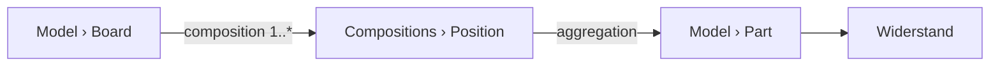
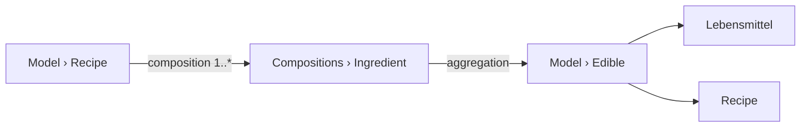
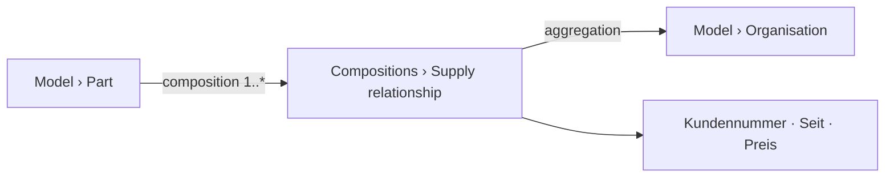

# Scenario check

*Run 2026-08-23 at the owner's request, before the domain core is locked: **model six different
worlds with what the concept provides, and see where it holds.*** His reasoning is the whole point
of doing it now — in the concept phase a change costs a paragraph; after the first line of code it
costs the code, the data and the migration.

Three scenarios are his (boards, recipes, PC hardware). Three are chosen to strain places the first
three leave alone.

**How to read a finding.** ✅ the concept carries it · ⚠️ it carries it but only if you know a
trick nobody wrote down · ❌ a genuine gap.

---

## 1 · Boards, parts, projects

`Board` holds positions; each position points at a catalogue part and carries its own quantity
and placement. Positions die with their board ([D-232](90-decision-log.md): `Compositions` → own
records); the part survives, because `Part` lives under `Model` and is therefore reached by
aggregation ([D-161](90-decision-log.md)). Choosing a part value-first — type `10 kΩ`, get the
resistors — is [D-239](90-decision-log.md).

✅ **The core case holds** and needed no invention.

❌ **A board exists in versions, and the concept cannot say so.** The owner raised it himself and
set it aside: *there are boards in different versions, which then have different parts lists.* The
model version of [D-060](90-decision-log.md) is a stamp on a **record**, not something a person
edits; it says which shape a record was written against, not that *v1.1 supersedes v1.0*.

So today `Board v1.0` and `v1.1` are **two unrelated records**. Everything a person expects is
missing: that they are the same board, which came first, what changed, and which one *is meant*
when something merely says `Board`. → [OQ-075](91-open-questions.md).

---

## 2 · Recipes

✅ **Sub-recipes need nothing new.** An ingredient's target type is a **branch**
([D-041](90-decision-log.md)), so pointing `Ingredient.Was` at `Edible` lets it hold a foodstuff *or*
another recipe. The nesting the owner described falls straight out.

✅ **And a recipe containing itself does not hang.** One cycle guard covers the render walk and the
calculation walk alike ([K3a](60-calculation.md)).

❌ **Doubling a recipe has nowhere to live.** *Four portions instead of two* multiplies every
quantity — it is not a stored value, and it is not a computed attribute either, because the answer
depends on something **the reader supplies at the moment of reading**. The render context carries
model, record, purpose and settings ([D-159](90-decision-log.md), [D-217](90-decision-log.md)) —
nothing a visitor hands in. → [OQ-076](91-open-questions.md).

❌ **A tablespoon is not a fixed number of grams.** [D-274](90-decision-log.md) puts a factor on the
unit — right for inch and metre, and wrong here: a tablespoon of flour is 10 g, of sugar 12 g, of
honey 21 g. **The factor belongs to the pairing of unit and substance**, not to the unit. Today
that conversion cannot be expressed at all. → [OQ-077](91-open-questions.md).

---

## 3 · PC hardware and benchmarks

✅ **The two-foldedness the owner described is two ordinary things.** Construction data are
attributes of the component; a test is its own record under `Model` that **aggregates** the
components it ran against — board, CPU, memory — because a test belongs to a *configuration*, not
to one card. Sole ownership ([D-214](90-decision-log.md)) is not violated: nothing here is a part
of anything.

✅ **Comparing 286 against 486 resolves to the nearest common ancestor**
([D-207](90-decision-log.md)), and what only one of them has is shown beneath its own column.

⚠️ **Comparing *test results* rather than *components* is Release 2.** A table over records,
grouped and filtered, is a report ([D-243](90-decision-log.md)) — correctly placed, but worth
knowing: the comparison block compares **things**, not measurements *about* things.

---

## 4 · People in roles · *the classic trap*

The same organisation is the **manufacturer** of one part, the **supplier** of another, and carries
a customer number in the second relationship but not the first. A role is a property of the
**relationship**, not of the organisation — the shape that has broken more modellers than any
other.

⚠️ **The concept handles it — through a move nobody has written down.** The relationship becomes a
**composition** that carries the values and **aggregates** the organisation. Sole ownership holds
(the relationship belongs to the part), the organisation stays shared, and the role is where it
belongs.

Everything needed exists. What is missing is that anybody would find it: the modeller must know to
turn a relationship into a node. **This is the single most valuable pattern to write down**, because
the alternative people reach for — a `Supplier` attribute on the part, then a second one, then a
`Supplier2` — is exactly how a model rots. → [OQ-078](91-open-questions.md).

---

## 5 · Measurements over time · *mass instead of structure*

A sensor writes a reading every minute: hundred thousand rows of *timestamp, value*.

❌ **The shape is wrong for this, and that is worth admitting rather than discovering.** Each
reading becomes a record plus its value rows ([D-232](90-decision-log.md)), so a hundred thousand
readings are several hundred thousand rows carrying two useful numbers. The projection of
[D-228](90-decision-log.md) speeds up **reading** and changes nothing about writing or size, and a
backward aggregate over them is computed at read time and indexed nowhere
([D-140](90-decision-log.md)).

**The honest answer is scope, not optimisation:** this is a **modeller**, not a time-series store.
Ten measurements per device are unremarkable; a hundred thousand belong somewhere else, and the
concept should say so out loud instead of letting someone find out. → [OQ-079](91-open-questions.md).

---

## 6 · Making a website out of it · *the owner's actual goal*

He wants his boards, recipes and retro PCs **on fambach.net**, built in Gutenberg.

✅ **Composing a page works.** A block names a node, hides what should not show, renders on the
server on every request ([D-253](90-decision-log.md), [D-254](90-decision-log.md)); a reference
draws as a label and a link without descending ([D-105](90-decision-log.md)), so a board block does
not drag its parts list in.

❌ **But there is no page *per record*, and that is the whole idea of a catalogue.** Five hundred
parts cannot each get a hand-built Gutenberg page. What is missing is the pair every catalogue
needs: **one template plus a route** — `/bauteil/bc547b` finds the record, renders it through a
page the author designed **once**.

Nothing in the concept provides it. [D-206](90-decision-log.md) puts a block on a page **someone
built**; [D-195](90-decision-log.md) pushed `slug` out as a boundary concern and left the boundary
side unanswered. The link that [D-105](90-decision-log.md)'s reference renderer draws **has
nowhere to point**. → [OQ-080](91-open-questions.md).

---

---

## Checked against the real site, the same evening

The owner offered his own data. The installation at `C:/Devel/Wordpress` holds them, and they
change one of the findings above.

**The site is a blog, not a catalogue:** 283 published posts, 429 drafts, 3965 attachments, 11
pages. The plugin's `wtt_fs` tree is still scaffold — its top level is `Fallstudie`, `Zeile`,
`Kopf`, `Fuss`, not subject matter. **The plugin has never fed the site with content.**

**What feeds it instead: 74 reusable Gutenberg blocks** — and their names are the product's
argument for existing:

> `286 Prozessor Information` · `286 Testkonfiguration` · `386 Testkonfig` ·
> `80486 Testkonfiguration 1` · `386er Software` · `486er Software` · `3D Druckparameter` ·
> `Part Quellen` · `Amiga Tools`

Opened, `286 Testkonfiguration` is a two-column table: *CPU / CoPro → Aufgesteckt 80287-10*,
*Graphic-Karte → 16 Bit ISA ET4000 1MB*, *Speicher → 4 MB Falls möglich*, *HDD → Compact Flash*.

⚠️ **That is a record.** A `Testkonfiguration` with attributes, held as prose because nothing else
was available — and the values are **free text where references belong**, which is exactly why the
owner cannot ask *which of my machines have an ET4000*, cannot compare, and has to carry every
change by hand across posts.

### The data sources, as of 2026-08-23 evening

| Source | In the local copy | What it is |
|---|---|---|
| 283 published posts, 429 drafts, 3965 attachments | ✔ | the site itself — prose, and the pictures that go with it |
| **74 reusable Gutenberg blocks** | ✔ | **records held as prose**; the first import target |
| `wtt_fs` tree, 219 terms · `wtt_case`, 21 | ✔ | scaffold, not subject matter |
| `wp_wtt_node_presentation`, 2104 rows | ✔ | the old plugin's own table |
| **TablePress tables** | ✔ *installed 2026-08-23 evening* | **23 tables, in 123 posts** — see below |

⚠️ **TablePress is absent from the local copy entirely** — no post type, no options, not one shortcode
in 717 posts, and it is not among the four active plugins. The copy is otherwise current; the newest
post is from the same morning. So it is not a stale dump, it is that **this one plugin was never
brought across**.

**And it may be the larger source.** A TablePress table is by its nature what this concept models:
rows with the same columns, which is to say records of one type. Its own JSON or CSV export is also
the ideal import format — structured, without HTML around it.

*The owner is installing it locally. Two real test cases for the importer
([OQ-072](91-open-questions.md)) rather than one.*

### Two corrections this forces

❗ **[OQ-080](91-open-questions.md) is real but not the blocker I made it.** I wrote that a page per
record is *the whole idea of a catalogue*. His actual pattern is the opposite: **data embedded in a
hand-written post**, which [D-206](90-decision-log.md) already provides. A reusable block becomes a
**data block pointing at a record**, and the post around it stays his. The per-record page still
matters the day a catalogue of five hundred parts wants addresses — but it is not what stands
between him and using this.

✅ **And the importer ([OQ-072](91-open-questions.md)) has a better first target than the tree:**
those 74 blocks. They are structured, they are few enough to check by hand, and each one converted
removes a maintenance burden he carries today. The `wtt_fs` tree is scaffold; **these are the real
data.**

### And the tables are the real body of data — 1558 of them

⚠️ **Two of my own queries were wrong before this was found.** `LIKE '%…%'` came back empty every
time because the per-cent signs were being eaten on the way to the database; I read *no rows* as
*no data* and reported *no posts contain tables*. The owner said otherwise — *the BOMs are all in
simple WP tables* — and he was right.

| Where | Posts | |
|---|---:|---|
| drafts | 314 | |
| published | 156 | |
| reusable blocks | 24 | |
| pages | 3 | |
| **table blocks in total** | **1558** | across posts, pages and blocks |

Real titles carrying them: `Arduino 4 Relais Zusatzplatine` · `TTL IC 7400` · `7402` · `7404` ·
`TTL IC 74xxx Template` · `Der C64` · `Gotek Floppy Emulator`. ⚠️ **`TTL IC 74xxx Template` is a
type definition kept as a post**, and `7400 / 7402 / 7404` are its records — the catalogue exists
already, written by hand.

### The finding that matters for the importer

Opening `TTL IC 7400` turns up not a parts list but a **truth table** — `#`, `A`, `B`, `Y`,
`Erläuterung`, four rows. Put beside `286 Testkonfiguration`, the shape of the whole corpus
appears:

| Shape | Example | In the model |
|---|---|---|
| **key → value**, two columns | `286 Testkonfiguration`: *CPU → 80287-10* | **one record** and its attributes |
| **rows under a header**, n columns | truth table, parts list | **many records of one type**, one per row |

⚠️ **This answers [OQ-072](91-open-questions.md) from the data rather than from a desk.** The
question was whether the importer **creates** a model or **fills** one. It need do neither blindly:
the **header row is the attribute list**, and the two-column form is an attribute list stood on its
side. The importer's real job is to **recognise which of the two shapes it is looking at** — and
then to ask about the values, since `16 Bit ISA ET4000 1MB` is a reference written as prose.

### The third source, and a third shape — TablePress

Installed locally the same evening. **23 tables, referenced from 123 posts** — an average of five
posts per table, the heaviest reuse of anything on the site. The owner: *I had not even noticed
they were missing.*

| Table | Rows |
|---|---:|
| `Mainboard-Vergleich` | 43 |
| `CPU-Benchmarks` | 78 |
| `Mainboard-Benchmarks` · `-486` · `-386` · `-P4` | 39 · 44 · 40 · 40 |
| `Graphikkarten-Vergleich` · `-Benchmarks` | 21 · 30 |
| `Soundkarten-Vergleich` · `Laufwerksvergleich` · `Controller-Vergleich` | 23 · 20 · 20 |
| `Retro-PCs` | 22 |
| **`Kopie-von-Retro-Netzwerk-Adapter`** | 21 |

⚠️ **Eight of the twenty-three are called *…-Vergleich*.** The owner maintains by hand precisely what
[D-207](90-decision-log.md)'s comparison block would produce. And the benchmarks are **split by
generation** — 386, 486, P4 — because the columns differ: [D-207](90-decision-log.md)'s *walk up to
the nearest common ancestor*, solved by hand with separate tables. `Kopie-von-…` is the symptom in
its purest form: no reuse, so copy.

**The scale is reassuring:** 7 to 78 rows, some 600 records in all. The performance worries of
[D-228](90-decision-log.md) and [OQ-070](91-open-questions.md) are irrelevant at this size, which is
worth knowing before anyone optimises for it.

### A third shape: the table is transposed

`Mainboard-Vergleich` opens with the **names of the boards** — `YA810e`, `Fujitsu D3502-A13`,
`Kentech KT-0286 v3`, `FIC 386-SC-HG`, `MSI MS-3134` — in the **first row**. The records are the
**columns**; the attributes are the rows. That is how a comparison looks when there are many
properties and few subjects, and it is exactly the output [D-207](90-decision-log.md) describes.

So the corpus has **three** shapes, not two:

| Shape | Example | In the model |
|---|---|---|
| key → value, two columns | `286 Testkonfiguration` | one record and its attributes |
| rows under a header | truth table, parts list | many records of one type |
| **transposed — records as columns** | `Mainboard-Vergleich` | **many records, read sideways** |

⚠️ **An importer that misses the transposition creates 43 attributes named `YA810e` and
`MSI MS-3134`.** Recognising which of the three shapes is in front of it is the importer's real
work — see [OQ-072](91-open-questions.md).

### The yardstick this gives the concept

> **Can it replace those 74 blocks — and make them answer questions they cannot answer today?**

That is a better test than any scenario invented at a desk, and it can be run the day the first
records exist.

## What the run says

**Five of six worlds model cleanly**, and three findings needed no new machinery at all — sub-recipes,
tests over configurations, and comparison by common ancestor all fell out of decisions already
taken. That is the good news, and it is not a small one.

| | |
|---|---|
| ✅ carried | sub-recipes · cycles · tests as records · comparison · page composition · the core board case |
| ⚠️ carried, but only if you know the trick | relationship-with-attributes · comparing measurements |
| ❌ genuine gaps | record versions · reader-supplied parameters · pairwise unit conversion · mass data · **page per record** |

⚠️ **The last row was softened the same evening by looking at the real site** — see the section
above: the owner's pattern is data **embedded in his own posts**, which [D-206](90-decision-log.md)
already provides.

⚠️ *Written before the real data were seen; the section above corrects it.* **The one that matters most is the last.** The others are features that can arrive later; a
catalogue with no address per entry is not a catalogue, and it is the thing the owner is actually
trying to build.

**And the pattern in the ⚠️ row is worth its own attention:** the concept can express more than it
teaches. A modeller who does not know that a relationship may become a node will build the wrong
thing and never learn why it hurts.
