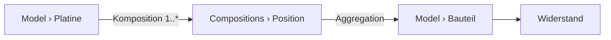
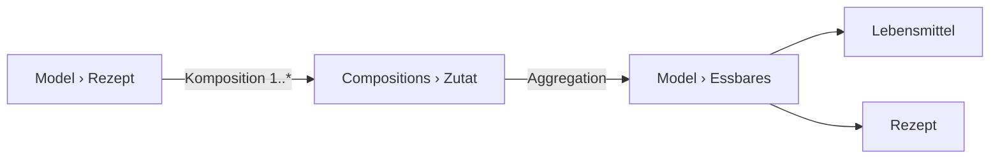
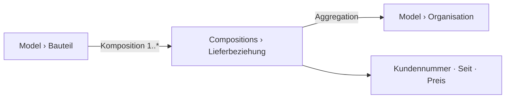

# Scenario check

*Run 2026-08-23 at the owner's request, before the domain core is locked: **model six different
worlds with what the concept provides, and see where it holds.*** His reasoning is the whole point
of doing it now — in the concept phase a change costs a paragraph; after the first line of code it
costs the code, the data and the migration.

Three scenarios are his (boards, recipes, PC hardware). Three are chosen to strain places the first
three leave alone.

**How to read a finding.** ✅ the concept carries it · ⚠️ it carries it but only if you know a
trick nobody wrote down · ❌ a genuine gap.

---

## 1 · Boards, parts, projects

`Platine` holds positions; each position points at a catalogue part and carries its own quantity
and placement. Positions die with their board ([D-232](90-decision-log.md): `Compositions` → own
records); the part survives, because `Bauteil` lives under `Model` and is therefore reached by
aggregation ([D-161](90-decision-log.md)). Choosing a part value-first — type `10 kΩ`, get the
resistors — is [D-239](90-decision-log.md).

✅ **The core case holds** and needed no invention.

❌ **A board exists in versions, and the concept cannot say so.** The owner raised it himself and
set it aside: *there are boards in different versions, which then have different parts lists.* The
model version of [D-060](90-decision-log.md) is a stamp on a **record**, not something a person
edits; it says which shape a record was written against, not that *v1.1 supersedes v1.0*.

So today `Platine v1.0` and `v1.1` are **two unrelated records**. Everything a person expects is
missing: that they are the same board, which came first, what changed, and which one *is meant*
when something merely says `Platine`. → [OQ-075](91-open-questions.md).

---

## 2 · Recipes

✅ **Sub-recipes need nothing new.** An ingredient's target type is a **branch**
([D-041](90-decision-log.md)), so pointing `Zutat.Was` at `Essbares` lets it hold a foodstuff *or*
another recipe. The nesting the owner described falls straight out.

✅ **And a recipe containing itself does not hang.** One cycle guard covers the render walk and the
calculation walk alike ([K3a](60-calculation.md)).

❌ **Doubling a recipe has nowhere to live.** *Four portions instead of two* multiplies every
quantity — it is not a stored value, and it is not a computed attribute either, because the answer
depends on something **the reader supplies at the moment of reading**. The render context carries
model, record, purpose and settings ([D-159](90-decision-log.md), [D-217](90-decision-log.md)) —
nothing a visitor hands in. → [OQ-076](91-open-questions.md).

❌ **A tablespoon is not a fixed number of grams.** [D-274](90-decision-log.md) puts a factor on the
unit — right for inch and metre, and wrong here: a tablespoon of flour is 10 g, of sugar 12 g, of
honey 21 g. **The factor belongs to the pairing of unit and substance**, not to the unit. Today
that conversion cannot be expressed at all. → [OQ-077](91-open-questions.md).

---

## 3 · PC hardware and benchmarks

✅ **The two-foldedness the owner described is two ordinary things.** Construction data are
attributes of the component; a test is its own record under `Model` that **aggregates** the
components it ran against — board, CPU, memory — because a test belongs to a *configuration*, not
to one card. Sole ownership ([D-214](90-decision-log.md)) is not violated: nothing here is a part
of anything.

✅ **Comparing 286 against 486 resolves to the nearest common ancestor**
([D-207](90-decision-log.md)), and what only one of them has is shown beneath its own column.

⚠️ **Comparing *test results* rather than *components* is Release 2.** A table over records,
grouped and filtered, is a report ([D-243](90-decision-log.md)) — correctly placed, but worth
knowing: the comparison block compares **things**, not measurements *about* things.

---

## 4 · People in roles · *the classic trap*

The same organisation is the **manufacturer** of one part, the **supplier** of another, and carries
a customer number in the second relationship but not the first. A role is a property of the
**relationship**, not of the organisation — the shape that has broken more modellers than any
other.

⚠️ **The concept handles it — through a move nobody has written down.** The relationship becomes a
**composition** that carries the values and **aggregates** the organisation. Sole ownership holds
(the relationship belongs to the part), the organisation stays shared, and the role is where it
belongs.

Everything needed exists. What is missing is that anybody would find it: the modeller must know to
turn a relationship into a node. **This is the single most valuable pattern to write down**, because
the alternative people reach for — a `Lieferant` attribute on the part, then a second one, then a
`Lieferant2` — is exactly how a model rots. → [OQ-078](91-open-questions.md).

---

## 5 · Measurements over time · *mass instead of structure*

A sensor writes a reading every minute: hundred thousand rows of *timestamp, value*.

❌ **The shape is wrong for this, and that is worth admitting rather than discovering.** Each
reading becomes a record plus its value rows ([D-232](90-decision-log.md)), so a hundred thousand
readings are several hundred thousand rows carrying two useful numbers. The projection of
[D-228](90-decision-log.md) speeds up **reading** and changes nothing about writing or size, and a
backward aggregate over them is computed at read time and indexed nowhere
([D-140](90-decision-log.md)).

**The honest answer is scope, not optimisation:** this is a **modeller**, not a time-series store.
Ten measurements per device are unremarkable; a hundred thousand belong somewhere else, and the
concept should say so out loud instead of letting someone find out. → [OQ-079](91-open-questions.md).

---

## 6 · Making a website out of it · *the owner's actual goal*

He wants his boards, recipes and retro PCs **on fambach.net**, built in Gutenberg.

✅ **Composing a page works.** A block names a node, hides what should not show, renders on the
server on every request ([D-253](90-decision-log.md), [D-254](90-decision-log.md)); a reference
draws as a label and a link without descending ([D-105](90-decision-log.md)), so a board block does
not drag its parts list in.

❌ **But there is no page *per record*, and that is the whole idea of a catalogue.** Five hundred
parts cannot each get a hand-built Gutenberg page. What is missing is the pair every catalogue
needs: **one template plus a route** — `/bauteil/bc547b` finds the record, renders it through a
page the author designed **once**.

Nothing in the concept provides it. [D-206](90-decision-log.md) puts a block on a page **someone
built**; [D-195](90-decision-log.md) pushed `slug` out as a boundary concern and left the boundary
side unanswered. The link that [D-105](90-decision-log.md)'s reference renderer draws **has
nowhere to point**. → [OQ-080](91-open-questions.md).

---

## What the run says

**Five of six worlds model cleanly**, and three findings needed no new machinery at all — sub-recipes,
tests over configurations, and comparison by common ancestor all fell out of decisions already
taken. That is the good news, and it is not a small one.

| | |
|---|---|
| ✅ carried | sub-recipes · cycles · tests as records · comparison · page composition · the core board case |
| ⚠️ carried, but only if you know the trick | relationship-with-attributes · comparing measurements |
| ❌ genuine gaps | record versions · reader-supplied parameters · pairwise unit conversion · mass data · **page per record** |

**The one that matters most is the last.** The others are features that can arrive later; a
catalogue with no address per entry is not a catalogue, and it is the thing the owner is actually
trying to build.

**And the pattern in the ⚠️ row is worth its own attention:** the concept can express more than it
teaches. A modeller who does not know that a relationship may become a node will build the wrong
thing and never learn why it hurts.
