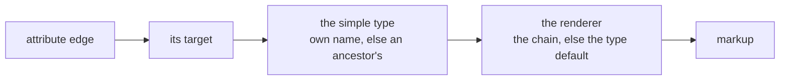

# Implementation plan

*Agreed with the owner on 2026-08-23, out of a fear he named plainly: the previous round with
another assistant **started just as well** and then cost him hours explaining why a confident
conclusion was nonetheless wrong.*

**The concept is not changed by this document.** It stays as it is; this only lays a grid over it
and starts building piece by piece. The interfaces are already given by the concept
([D-313](90-decision-log.md)).

---

## What actually changed since the last round

Not that the assistant reasons better. ⚠️ **Gaps get filled convincingly whether or not the filling
is right** — twice on 2026-08-23 alone, and both times the **owner** caught it.

What changed is that **there is something to point at.** When he says *that is wrong*, we look up
which decision says otherwise and it takes minutes. Last time there was no such paper, so every
contradiction became an argument.

---

## Three rules for every package

### 1 · A package ends with something the owner can operate

⚠️ **This is the actual protection.** Not *the storage layer is done* — nobody can check that, they
can only believe it. Instead: *you create a node in the tree, rename it, reload the page, and it is
still there.*

> **A package with no visible outcome is cut wrong.**

### 2 · Thin vertical slices, not horizontal layers

Depth or breadth was the owner's question; the answer is a **thin vertical slice**: from the table
to the screen, for **one small capability**.

A horizontal layer — *all the repositories* — cannot be checked by a person, and that is exactly
where the hours of explaining come from.

### 3 · After every package: what I assumed that was not in the concept

⚠️ **The cheapest insurance against the previous round.** Gaps **will** be found and filled; that
cannot be avoided. What can be avoided is filling them **silently**.

Every assumption becomes one line. The owner reads ten lines instead of a thousand, and whatever he
does not sign off becomes a decision or is taken out again.

**And if implementation shows something is missing, it becomes a decision in the log**
([D-222](90-decision-log.md)) — never a quiet change to the concept.

---

## The first cut

Six packages to the point where importing his real data first makes sense.

| | Package | What the owner checks |
|---|---|---|
| **1** | Tables, and a node exists | create, rename, send to trash — survives a restart · **done 2026-08-24** |
| **2** | The tree | parent and child, move, expand and collapse · **done 2026-08-24** |
| **3** | Attributes as relations, the three branches | give a node an attribute; the relation kind appears by itself · **done 2026-08-24** |
| **4** | Settings and the chain | a default at the type, an override at the attribute, reset to inherited · **done 2026-08-24** |
| **5** | Labels, roles, locales ⚠️ **Entsperrt 2026-08-29, [D-501](90-decision-log.md) — die Blockade war eine Verwechslung.** *Diese Zeile behandelte «mehrere Renderer» und «mehrere Validatoren» als ein Paar. Sie sind keins: **Validatoren brauchen mehrere, aber keine Reihenfolge** (alle müssen laufen), und [D-158](90-decision-log.md) hat ihnen mit `labels.path` längst ein Zuhause gegeben — die Spalte ist gebaut. **Mehrere Defaults** ebenso über `settings.path` ([D-030](90-decision-log.md)), 21 Zeilen in Benutzung.* ⚠️ *Übrig bleibt allein die **geordnete** Renderer-Liste, und die hat keinen Benutzer: `followedBy()` wird nur von seinem eigenen Test gerufen, und es existiert kein Renderer, der neben einen Wert gehört. [OQ-109](91-open-questions.md) hält nichts mehr auf.* | **offen — nur noch der Renderer** |
| **6** | Records | enter something against a model and find it again · **done 2026-08-24** |
| **7** | The fields look like their type | a switch is a switch, a date opens a picker — and the raw field is gone · **done 2026-08-25** |

**After six, his first TablePress import has something to import into** — 23 tables, some 600
records, in three shapes ([96 Scenario check](96-scenario-check.md)).

⚠️ **Package 1 is not *the database layer*.** It is the smallest slice in which a node can be made,
seen, changed and destroyed. Everything else about it comes later.

---

## What this plan deliberately does not do

| Not this | Because |
|---|---|
| sprints with dates | the owner asked for **self-contained packages**, and a date is not a boundary |
| a full backlog up front | the first cut is six packages; the seventh is decided when the sixth is done |
| changes to the concept | it stays as it is; findings become decisions ([D-222](90-decision-log.md)) |
| a package without a visible outcome | it could not be checked, which is the whole point |

---

## Package 1 — done 2026-08-24

**What it delivers:** the seven tables, a root and a trash, and a screen on which a node can be
made, renamed and thrown away. 25 checks pass, including the owner's own: *create, rename, send
to trash — and it is still there after a reload.*

### What was assumed that the concept did not say

⚠️ **Rule 3 of this plan.** Gaps get filled while building; what can be avoided is filling them
**silently**. Ten lines, and whatever is not signed off becomes a decision or is taken out again.

| # | Assumption | Why it was needed | How wrong it can be |
|---|---|---|---|
| **1** | ~~Model ids come from a counter in `wp_options`~~ | ⚠️ **Withdrawn the same day → [D-339](90-decision-log.md).** The owner asked what the safest form would be, and the counter was not it: it lived in a different table from the ids it guarded, so a partial restore could put it behind the data and make it reissue numbers — silently, because `owner_id` is one column over nodes and edges. **Replaced by an `identities` table with its own `AUTO_INCREMENT`**, never deleted from, with `owner_id` as a real foreign key. [D-340](90-decision-log.md) generalises the migration half of it. | resolved |
| **3** | **Parking is a move, not a flag.** A parked node simply sits under the trash; there is no `deleted` column, and **the path it came from lives only in the changelog**, which is what a restore will read. | [C101](10-domain-core.md) says *marked deleted and parked*, which reads like two things. One place owns each fact, so the position **is** the mark. | **Medium.** If a *mark* is genuinely wanted separately from the position, it becomes an engine-owned setting ([D-084](90-decision-log.md)) and nothing built here has to move. |
| **4** | **Reserved words get a suffix: `before_state` / `after_state`, and `setting_key`.** | `BEFORE`, `AFTER` and `KEY` are reserved in MySQL; the CONTRACTs name them `before`, `after`, `key`. ⚠️ **`key` was worse than a naming nuisance** — backticked, it broke `dbDelta`s index parser silently, so that index would not have been maintained on later upgrades. | None in substance — names only. |
| **5** | **`labels` has no `translatable` column.** | ⚠️ **Two CONTRACTs disagree.** [10 Domain core](10-domain-core.md) lists it; the detailed one in [40 I18n](40-i18n.md) does not, and [D-317](90-decision-log.md) puts *translatable* on the **attribute**, not on the label. Followed the detailed one. ⚠️ **Entsperrt 2026-08-29, [D-501](90-decision-log.md) — die Blockade war eine Verwechslung.** *Diese Zeile behandelte «mehrere Renderer» und «mehrere Validatoren» als ein Paar. Sie sind keins: **Validatoren brauchen mehrere, aber keine Reihenfolge** (alle müssen laufen), und [D-158](90-decision-log.md) hat ihnen mit `labels.path` längst ein Zuhause gegeben — die Spalte ist gebaut. **Mehrere Defaults** ebenso über `settings.path` ([D-030](90-decision-log.md)), 21 Zeilen in Benutzung.* ⚠️ *Übrig bleibt allein die **geordnete** Renderer-Liste, und die hat keinen Benutzer: `followedBy()` wird nur von seinem eigenen Test gerufen, und es existiert kein Renderer, der neben einen Wert gehört. [OQ-109](91-open-questions.md) hält nichts mehr auf.* | **offen — nur noch der Renderer** |
| **6** | **The capability is `manage_options`.** | Nothing decided one. | Low, and easy to change — it is one constant. |
| **7** | **Column sizes:** names `varchar(191)`, decimals `decimal(30,10)`, locale and kind `varchar(20)`. | Not specified. 191 is the WordPress index limit under `utf8mb4`. | Low. `decimal(30,10)` wants a second look the day money and tolerances arrive. |
| **8** | **Only root and trash are seeded.** `Model`, `Compositions`, `Primitives` are **not** created yet. | They are the tree, and the tree is Package 2. ⚠️ **Nicht blockiert, 2026-08-29 gemessen ([D-501](90-decision-log.md)).** *Was diese Zeile brauchte, ist gebaut: [D-158](90-decision-log.md) legt die Nachricht je Validator in `labels` ab — «`owner_id` = the edge, `path` = the validator, `role` = message» — und die `path`-Spalte existiert. **Eine Reihenfolge brauchen Validatoren nicht**, weil alle laufen müssen.* ⚠️ *Damit fällt auch die Sperre vor [Zeile 31](#the-working-list): das Pflichtfeld wartete auf diese Zeile, und diese wartete auf nichts.* | **offen — baubar** |
| **9** | **Children sort by name.** | Order belongs to the **edge** (`position`), and there are no edges yet. ⚠️ **Gebaut 2026-08-29, [D-500](90-decision-log.md) — und die Bedingung von [D-199](90-decision-log.md) wurde erst gemessen.** *102 Vererbungskanten alle unbenannt, 34 Feldkanten alle benannt, **kein dritter Fall**. `used-by-check.php` misst das bei jedem Lauf, statt es zu glauben.* | **erledigt** |
| **10** | **Root and trash carry a plain `name`, not labels.** | Labels are per role and per locale and arrive in Package 5. | Low. ⚠️ Their **displayed** names will have to become labels, or `AR-2` is broken for exactly two nodes. |

### What was found in the concept while building

- ⚠️ **[10 Domain core](10-domain-core.md) still carried the superseded override rule.** *An
  override may narrow and widen* ([D-088](90-decision-log.md), [D-310](90-decision-log.md)) —
  [D-312](90-decision-log.md) had replaced both the same evening, and the passage contradicted
  sentence 10 of [the core on one page](10-domain-core.md#the-core-on-one-page). **Corrected.**
- The `labels` contract disagreement above (assumption 5).
- **[D-083](90-decision-log.md)'s "seven tables" and the shared identity space are in tension**
  (assumption 1).

---

## Package 2 — done 2026-08-24

**What it delivers:** the inheritance edges as real rows, `nodes.path` derived from them, moving,
reordering, and a screen that draws the tree as a tree. **94 checks pass** — 47 in the core run
(no WordPress), 28 in Package 1's boundary run, 19 in Package 2's.

### ⚠️ What building it found in Package 1

**The truth and the derived value were the wrong way round.** Package 1 stored the tree *only* as
`nodes.path` — but [D-014](90-decision-log.md) calls the path *derived, rebuildable, never a
second truth*, and the thing it is meant to derive **from** is the inheritance edge, which did not
exist. It worked, and it was inverted.

Package 2 turns it back: the edge is written first, the path is rewritten from it, and a schema
migration gave every existing node the edge it should always have had. **Both boundary runs now
assert that every stored path can be rebuilt from the edges alone** — if the two ever drift, that
check fails rather than every descendant query going quietly wrong.

### What was assumed that the concept did not say

| # | Assumption | Why | How wrong it can be |
|---|---|---|---|
| **1** | **Reordering is a swap with the neighbour**, not a renumbering of all siblings. | A renumbering is one write per row, which is the loop `CD-7` forbids. A swap is always exactly two. | Low. It also matches the only control there is — up and down. |
| **2** | **Positions need not be unique**; ties fall back to id order. | Nothing decided it, and forcing uniqueness would mean rewriting siblings on every insert. | Low. The swap forces equal positions apart when it meets them. |
| **3** | **`allInheritanceEdges()` reads every edge at once** to draw the tree. | Two queries for a tree of any depth. Asking per parent would be one query per level. ⚠️ Rests on [D-308](90-decision-log.md): this is a modeller, so the **model** stays in the hundreds even when records run to thousands. | **Medium.** If a model ever reaches tens of thousands of nodes, the screen must page instead. |
| **4** | **The move chooser leaves out impossible targets** — the node itself and its own subtree. | Offering a choice that always fails is a trap laid for the person using it. | None. The core still refuses them; the screen is convenience, not the guarantee. |
| **5** | **The migration reads each parent out of the path.** | ⚠️ The one moment the derived value *is* the source — unavoidable, because in versions 1 and 2 nothing else recorded it. ⚠️ **Entsperrt 2026-08-29, [D-501](90-decision-log.md) — die Blockade war eine Verwechslung.** *Diese Zeile behandelte «mehrere Renderer» und «mehrere Validatoren» als ein Paar. Sie sind keins: **Validatoren brauchen mehrere, aber keine Reihenfolge** (alle müssen laufen), und [D-158](90-decision-log.md) hat ihnen mit `labels.path` längst ein Zuhause gegeben — die Spalte ist gebaut. **Mehrere Defaults** ebenso über `settings.path` ([D-030](90-decision-log.md)), 21 Zeilen in Benutzung.* ⚠️ *Übrig bleibt allein die **geordnete** Renderer-Liste, und die hat keinen Benutzer: `followedBy()` wird nur von seinem eigenen Test gerufen, und es existiert kein Renderer, der neben einen Wert gehört. [OQ-109](91-open-questions.md) hält nichts mehr auf.* | **offen — nur noch der Renderer** |
| **6** | **The trash gets an ordinary inheritance edge.** | It is a child of the root like any other; a framework node without an edge would be a node the tree cannot see. | None. |
| **7** | **Reordering is up and down only.** Drag and drop is not built. | The owner asked for it ([20 Interaction](20-interaction.md)); it is a screen concern, and the core operation it needs already exists. | None — deliberate scope. |

### Where it can be seen

**Taxonomy Modeller** in the admin menu. Add a node, add a child with **+**, rename it, move it
with the chooser, order it with **↑ ↓**, throw it away. Reload — it is the way it was left.

```bash
php vendor/phpunit/phpunit/phpunit
```

```bash
php scripts/dev/package2-check.php C:/Devel/Wordpress
```

### What Package 2 delivers, and what it deliberately leaves

✅ **Closed the same day it was reported.** The package was first announced without
**expand and collapse**, which its own line requires; that was reported rather than left out, and
then built — together with **[U4](20-interaction.md)**, *delete the branch or only this node*.

⚠️ **Both were built as core behaviour, not as screen tricks**, which is what lets them survive
the scaffolding ([D-344](90-decision-log.md)): collapsing is a question about the tree, answered
in `Tree` and asked the same way by every surface; and *only this node* promotes the children to
their grandparent in **one statement**, because a write per child is the loop `CD-7` forbids.

**What is not built, and belongs to the real surface** — none of it was claimed:

| | What the concept asks | Where |
|---|---|---|
| **U1** | the row shows the frequent, a `⋯` menu holds everything — ⚠️ **touch has no right-click** | [U1](20-interaction.md) |
| **U5** | dragging moves whole branches, and several at once | [U5](20-interaction.md) |
| **U6** | duplicating puts the copy **directly beneath**, with an indexed name | [U6](20-interaction.md) |
| **U21** | the tree row draws the node's icon | [U21](20-interaction.md) |

⚠️ **U4's second half is not as harmless as its button** ([D-041](90-decision-log.md)): the tree
*is* inheritance, so children promoted to the grandparent **lose whatever they inherited from the
node being removed**. That is [D-155](90-decision-log.md)'s move reached through a different
button, which is exactly why deleting asks instead of guessing.

### ⚠️ A line the provisional screen must not cross

[R20a](30-renderer.md#r20a--the-detail-view-is-not-a-special-screen) and
[D-190](90-decision-log.md) settle that the detail view is **a frame holding attributes rendered
under the `edit` purpose** — not a hand-built screen. The stated reason is exactly the risk this
plan's temporary surface carries:

> otherwise there are two ways to draw a field — the official one, and the one the admin screen
> was built with — and they drift.

**Package 2's screen is that second way.** It is defensible only because it draws **no fields at
all**: names, buttons and a select, nothing that renders a value.

> **The rule for every package after this one: the moment an attribute value has to appear on
> screen, it goes through a renderer.** Not a quick `<input>` in the admin template that gets
> tidied up later — that is how the two ways start, and the legacy is the evidence.

---

## The order the surfaces impose — corrected 2026-08-24

⚠️ **A tree row is a rendered node** ([R18](30-renderer.md#r18r20--the-surfaces-are-renderers-all-the-way-up)),
the settings side is a rendered page ([R20](30-renderer.md)), and *nothing is drawn by hand
anywhere*. That was an owner statement from the first week and it changes the running order.

**The real surface cannot come next.** A node renderer needs settings, labels and attributes to
render; until those exist there is nothing for it to draw.

| | | |
|---|---|---|
| **3** | Attributes as relations, the three branches | the model starts to be able to say something |
| **4** | Settings and the chain | a renderer has something to resolve |
| **5** | Labels, roles, locales ⚠️ **Entsperrt 2026-08-29, [D-501](90-decision-log.md) — die Blockade war eine Verwechslung.** *Diese Zeile behandelte «mehrere Renderer» und «mehrere Validatoren» als ein Paar. Sie sind keins: **Validatoren brauchen mehrere, aber keine Reihenfolge** (alle müssen laufen), und [D-158](90-decision-log.md) hat ihnen mit `labels.path` längst ein Zuhause gegeben — die Spalte ist gebaut. **Mehrere Defaults** ebenso über `settings.path` ([D-030](90-decision-log.md)), 21 Zeilen in Benutzung.* ⚠️ *Übrig bleibt allein die **geordnete** Renderer-Liste, und die hat keinen Benutzer: `followedBy()` wird nur von seinem eigenen Test gerufen, und es existiert kein Renderer, der neben einen Wert gehört. [OQ-109](91-open-questions.md) hält nichts mehr auf.* | **offen — nur noch der Renderer** |
| **then** | **the tree renderer and the split screen** | ⚠️ and the scaffolding below is **deleted**, not refactored ([D-344](90-decision-log.md)) |

**What the scaffolding is for, and its two limits:** it exists so behaviour is checkable before
renderers exist. It draws **no value** and must never begin to. Everything asserted against it
tests the **core** — which the real surface uses unchanged — so losing it costs nothing.

**Finishing Package 2** — expand/collapse and [U4](20-interaction.md)'s *branch or only this node*
— is still worth doing, because both are **behaviour**: collapsing is a selection question and
U4 needs children promoted to the grandparent, which nothing in the core does yet.

### ⚠️ Not built: the deletion event ([D-127](90-decision-log.md))

**Parking writes one changelog line per node.** Nothing records that several things fell in **one**
act, which is what [D-127](90-decision-log.md) calls a trash entry — *one deletion, with everything
that fell with it, and restore puts back the whole event.*

Today it does not show, because parking a branch moves the subtree and restoring moves it back:
the paths carry the grouping by accident. **It shows the moment something falls that is not a
descendant** — a promoted child ([OQ-083](91-open-questions.md)), and later an edge pointing at a
deleted node, which [D-127](90-decision-log.md) names explicitly.

*Reported rather than left out. It is not needed to finish Package 2 and it is needed before
deletion can be trusted with attributes.*

### The bracket and the attributes — noted for Package 3

The owner, while the change group was being built: *later, something will probably have to happen
with the attributes in the same change group.*

⚠️ **He is right, and [D-127](90-decision-log.md) says it in as many words** — *the node **and
every edge that pointed at it***. An attribute **is** an edge ([D-031](90-decision-log.md)), so
deleting a node parks every attribute that used it, and those rows belong under the same bracket
as the deletion that caused them. Without it, [D-347](90-decision-log.md)'s restore brings back a
node whose attributes stayed in the trash — the exact failure [D-127](90-decision-log.md) was
written to prevent.

**Nothing is missing in the concept; it is a piece of work.** It cannot be built before Package 3,
because there are no attributes yet. Recorded here so that it is built **with** them rather than
noticed afterwards:

| When attributes exist | What must fall under the deleting act's bracket |
|---|---|
| a node is parked | every edge pointing **at** it, parked with it ([D-127](90-decision-log.md)) |
| an attribute is removed at one use site | the edge, and the orphaned overrides promoted per [D-156](90-decision-log.md) |
| a node moves between branches | the reparenting and every edge whose **kind** it rewrote ([D-162](90-decision-log.md)) |

---

## Package 3 — done 2026-08-24

**What it delivers:** the three branches as framework nodes, and **attributes as relations whose
kind nobody chooses**. Give a node an attribute by pointing it at a target, and composition or
aggregation follows from where the target lives.

| Branch | Reached by | Holds data | Value stored |
|---|---|---|---|
| `Model` | aggregation | yes, standalone | external reference |
| `Compositions` | composition | yes, owned | its own records |
| `Primitives › Data Types` | composition | no | inside the record, by path |
| `Primitives › Constants` | aggregation | no | a reference to a node |

⚠️ **The pair that shows the rule is not *primitive versus not***: `Data Types` and `Constants`
both sit under `Primitives` and differ, because one has no instances at all and the other is a
node a person may extend.

**88 core checks pass** (no WordPress) plus 28 · 48 · 23 at the boundary — 187 in all.

### What was assumed that the concept did not say

| # | Assumption | Why | How wrong it can be |
|---|---|---|---|
| **1** | **A node hung directly under `Primitives` sits in no branch, and pointing at it is refused.** | ⚠️ The concept splits `Primitives` into `Data Types` and `Constants` and says **nothing** about the space between. There is no kind to read off such a node, and inventing one is how a supplier ends up composed into an order. | **Low, and deliberately loud.** If that space is meant to be usable, the refusal is where it will be noticed. |
| **2** | **`Primitives` itself is protected, like the branch roots.** | It is machinery, not content ([D-194](90-decision-log.md)). | None. |
| **3** | **An attribute needs a name; the name is trimmed like a node's.** | [D-022](90-decision-log.md) governs node names; nothing said it for edges, and *the use site is an attribute* argues they are the same kind of thing. | Low. |
| **4** | **Attribute order is its own sequence**, counted separately from the tree's `position`. | Both live in `position` on `relations`, and mixing them would make an attribute's place depend on how many children the node has. | Low. |
| **5** | **The upgrade seeds.** A schema version bump now also runs the framework seeding. | Version 5 changed **no table** — it added nodes. Without this, an already-installed copy would never get the branches. ⚠️ **Entsperrt 2026-08-29, [D-501](90-decision-log.md) — die Blockade war eine Verwechslung.** *Diese Zeile behandelte «mehrere Renderer» und «mehrere Validatoren» als ein Paar. Sie sind keins: **Validatoren brauchen mehrere, aber keine Reihenfolge** (alle müssen laufen), und [D-158](90-decision-log.md) hat ihnen mit `labels.path` längst ein Zuhause gegeben — die Spalte ist gebaut. **Mehrere Defaults** ebenso über `settings.path` ([D-030](90-decision-log.md)), 21 Zeilen in Benutzung.* ⚠️ *Übrig bleibt allein die **geordnete** Renderer-Liste, und die hat keinen Benutzer: `followedBy()` wird nur von seinem eigenen Test gerufen, und es existiert kein Renderer, der neben einen Wert gehört. [OQ-109](91-open-questions.md) hält nichts mehr auf.* | **offen — nur noch der Renderer** |

### What is **not** in it, and was not claimed

**Multiplicity, mandatory, permitted sets, defaults** — all of those are **settings**
([D-086](90-decision-log.md), [D-312](90-decision-log.md)) and belong to Package 4. An attribute
today is a name, a target and a kind.

**Removing an attribute.** ⚠️ It needs the deletion event to carry the edge under the same
bracket as the node that caused it — the owner named it while the change group was being built,
and it is written up above. Deleting a node does not yet park the attributes pointing at it.

---

## Package 4 — done 2026-08-24

**What it delivers:** the resolution chain, and the rule that runs down it.


**Walked key by key** ([D-079](90-decision-log.md), [D-093](90-decision-log.md)), loaded in **one
query** for the whole chain ([D-014](90-decision-log.md)), stored **sparsely**
([D-015](90-decision-log.md)). ⚠️ **Reset and *set to nothing* are two different acts**
([D-266](90-decision-log.md)): after a reset a later change above arrives again; after *nothing*
it deliberately does not. Both are checked at the boundary against a real database.

**Bounding narrows, choosing is free** ([D-312](90-decision-log.md)) — enforced at **write** time,
because a restriction that may be reopened anywhere says nothing when it is read. And what an
ancestor declares mandatory stays mandatory ([D-311](90-decision-log.md)).

**112 core checks** plus 28 · 48 · 23 · 27 at the boundary.

### What was assumed that the concept did not say

| # | Assumption | Why | How wrong it can be |
|---|---|---|---|
| **1** | **`model root → ancestors → node` is the node's path, in order.** | The chain names three things the path already holds; reading it any other way would make the walk a climb, which [D-014](90-decision-log.md) exists to avoid. | Low, and load-bearing — if it is wrong, the whole walk is. |
| **2** | **The installation identity is an identity with no node behind it.** | [OQ-039](91-open-questions.md) says *reserved and does not appear in the modeller*. Since [D-339](90-decision-log.md) made `owner_id` point at `identities` rather than at `nodes`, an owner that is not a node is a first-class thing rather than a hole. | None — it falls out of a decision already taken. |
| **3** | **Eleven engine-owned keys**: `multiplicity_min/max`, `mandatory`, `hide`, `read_only`, `range_min/max`, `default`, `renderer`, `converter`, `icon`, `order`. | [D-312](90-decision-log.md) names the two groups by example; these are those examples made concrete. **Permitted sets are not among them** — a set needs set semantics for *narrower*, and guessing them would be inventing a rule. | ⚠️ **Medium.** The list will grow, and each addition has to declare its direction. |
| **4** | **Narrowing is numeric for ranges and one-way for switches.** A minimum may rise, a maximum may fall, and `mandatory`/`hide`/`read_only` may only ever close. | It is what *narrower* means for those shapes. | Low. |
| **5** | **A free key is unbounded.** Only the engine's keys carry a direction. | Nothing says an author's own setting has an ordering, and inventing one would be worse than leaving it free. ⚠️ **Entsperrt 2026-08-29, [D-501](90-decision-log.md) — die Blockade war eine Verwechslung.** *Diese Zeile behandelte «mehrere Renderer» und «mehrere Validatoren» als ein Paar. Sie sind keins: **Validatoren brauchen mehrere, aber keine Reihenfolge** (alle müssen laufen), und [D-158](90-decision-log.md) hat ihnen mit `labels.path` längst ein Zuhause gegeben — die Spalte ist gebaut. **Mehrere Defaults** ebenso über `settings.path` ([D-030](90-decision-log.md)), 21 Zeilen in Benutzung.* ⚠️ *Übrig bleibt allein die **geordnete** Renderer-Liste, und die hat keinen Benutzer: `followedBy()` wird nur von seinem eigenen Test gerufen, und es existiert kein Renderer, der neben einen Wert gehört. [OQ-109](91-open-questions.md) hält nichts mehr auf.* | **offen — nur noch der Renderer** |
| **6** | **The scaffolding shows settings as raw key/value, read-only.** | ⚠️ A **rendered** setting is a rendered value, which is the line [R20a](30-renderer.md) draws. This prints; it does not render. | None, and it is deleted with the rest of the scaffolding. |

### What building it found

⚠️ **[OQ-085](91-open-questions.md) — how much precision does a decimal have?** `2.50` is written
and comes back as `2.5000000000`. The **value** is exact, and the notation is a rendering
question — but the **scale** is fixed at ten places for every decimal in the system, and nothing
in the concept decided that. A physical constant wanting twelve places would lose two, silently.

---

## Package 5 — done 2026-08-24

**What it delivers:** labels, and the chain that decides what to show when nobody has said.


**Roles are nodes** ([D-151](90-decision-log.md)), seeded as `form`, `table`, `select`, `symbol`,
`help` ([D-196](90-decision-log.md)) under a container of their own — ⚠️ **in no data branch**, so
an attribute cannot point at one. **Number before role** ([D-153](90-decision-log.md)): a missing
plural falls back to the base form of the **same** role before the role gives way.

⚠️ **The chain never ends on nothing.** Its last step is the node's own name, which always exists
([D-022](90-decision-log.md)) — an empty cell where a name should be is worse than the internal
name.

**123 core checks** plus 28 · 48 · 23 · 27 · 24 at the boundary.

### What building it found

⚠️ **[40 I18n](40-i18n.md) still said the `long` versus `help` question was open.** It was settled
on 2026-08-23 by [D-209](90-decision-log.md) — *`long` is gone, it is defined as `help`* — and two
passages had not been brought forward. Corrected; the chain now reads `<role>·<number>` →
`<role>·one` → `help·one` → `node.name` in both places.

### What was assumed that the concept did not say

| # | Assumption | Why | How wrong it can be |
|---|---|---|---|
| **1** | **Roles live under a framework container of their own, outside every data branch.** | [D-151](90-decision-log.md) says *under their own branch*; the four branches are data branches with a relation kind each, and a role has none. | Low. If roles should be pointable-at, this is where it will be noticed. |
| **2** | **A locale falls back to the neutral row before the role gives way.** | ⚠️ The concept states the **role** chain and says nothing about a missing locale. A label written without a locale is one somebody wrote for everybody; using it beats answering a different question with the help text. | **Medium — it is a chain step nobody decided.** |
| **3** | **An empty text does not count as an answer** and the chain continues. | A stored empty string is almost always an accident, and treating it as an answer shows a blank where a name should be. ⚠️ *It is the opposite call from settings, where nothing is a deliberate value* ([D-266](90-decision-log.md)) — because there it stops inheritance, and here there is nothing to stop. | Medium. Worth a look. |
| **4** | **`number` defaults to `one`** and that is the base form every fallback lands on. | [D-216](90-decision-log.md) names the categories and calls the column sparsely filled; something has to be the base. | Low. |

---

## Package 6 — done 2026-08-24

**What it delivers:** records. Enter something against a model node and find it again.

⚠️ **Where a value goes is not a choice either** ([D-232](90-decision-log.md)) — the attribute's
target sits in a branch, and the branch decides:

| Target branch | The value is |
|---|---|
| `Data Types` | inside the record, addressed by path |
| `Constants` | a reference to a **node** |
| `Model` | a reference to a **record** |
| `Compositions` | ⚠️ records of its own — **refused, not built** |

**The last edge sits beside the path** ([D-134](90-decision-log.md)), which is what makes *which
parts are 4k7* one indexed lookup instead of a walk through every record — and the boundary run
asks exactly that question.

**A record keeps the model version it was written against** ([D-060](90-decision-log.md),
[D-210](90-decision-log.md)) — *written against*, not *checked against*. Renaming the model
afterwards does not restamp it.

**138 core checks** plus 28 · 48 · 23 · 27 · 24 · 21 at the boundary — **309 in all**.

### ⚠️ A rule bent on purpose

[D-350](90-decision-log.md). [D-344](90-decision-log.md) said the scaffolding **draws no value**;
this package's own check is *enter something and find it again*, which cannot be checked by a
person without a field. **The line moved, with three fences:** one bare `<input>` per attribute
that knows nothing about the type, labelled *raw* on screen, and **deleted rather than evolved**
when the renderers arrive. *A field with no opinions cannot drift from the renderers; the moment
it grows one — a date picker, a number format, a chooser — it has become the second way to draw
and must go.*

### What was assumed that the concept did not say

| # | Assumption | Why | How wrong it can be |
|---|---|---|---|
| **1** | **A direct attribute's path is the edge id.** | [D-134](90-decision-log.md) gives the shape `100.101` for nested values; at depth one the path is one step. | Low, and it generalises unchanged. |
| **2** | **An empty field means unanswered**, and the row is removed. | ⚠️ *A missing row means **not answered**, never **no*** — three states at `0..1`. But nothing says what an **empty text box** means, and *deliberately nothing* would need its own control. | **Medium.** The two are different and the scaffolding cannot express both. |
| **3** | **A composed target is refused rather than stored inline.** | Storing it inline would look right until somebody tried to share it. | None — it is unfinished work named as such. |
| **4** | **Writing checks that the attribute belongs to the record's model** — its own or inherited. | An edge id from a form is input, and a value written against an attribute the model does not have is a value nothing will ever read. | None. |

### Not built, and not claimed

**Composed records** (a parts list holding its own lines) · **deleting a record** · **the search
column** ([D-167](90-decision-log.md)) · **validators and converters** · **the renderers**, which
are what turns all of this from raw text into a usable editor.

---

## Package 7 — the fields look like their type · done 2026-08-25

**What it delivers:** a value is no longer characters in a box. Nine of the simple types have a
renderer that ships, the type chooses it without anybody configuring anything, and the raw entry
field of [D-350](90-decision-log.md) is **deleted** — which is what that decision said would happen
the day the renderers arrived.



| Renderer | Draws | Default for |
|---|---|---|
| `field` | one line — [D-018](90-decision-log.md)'s *plain field* | `text` `char` `version` `int` `decimal` |
| `spinner` · `slider` | the same number, bounded and as a track | offered, default for nothing |
| `switch` | a boolean | `bool` |
| `mailto` | an address that can be written to | `email` |
| `datetime` | as much of a timestamp as the model asked for | `datetime` |
| `color` | a swatch, and a picker where it is safe | `color` |
| `textarea` | the long end of `text` | offered, default for nothing |

**197 core checks** plus 28 · 48 · 23 · 33 · 24 · 21 · **51** at the boundary — **425 in all**.

### Where it can be seen

Pick a node under **Model**, give it attributes pointing at `bool`, `datetime`, `email` and
`color`, add a record. The switch is a switch, the date opens a date picker, the address is
clickable, the colour has a swatch. Each row shows *which type · which renderer* beside it, and a
row saying **no renderer** in red is a gap rather than a style.

```bash
php vendor/phpunit/phpunit/phpunit
```

```bash
php scripts/dev/package7-check.php C:/Devel/Wordpress
```

### ⚠️ What building it found — three of them in yesterday's own work

**1 · The contract could not express [R14a](30-renderer.md#r14a--the-key-is-the-type-purpose-travels-in-the-context)'s
second half.** The registry keyed on the renderer's **name**, so *one is marked default per type*
had nowhere to live — every field in the product would have looked like a fault until somebody
configured it by hand. The type is now the key it was always meant to be
([D-352](90-decision-log.md)).

**2 · The purpose fallback was right for a value and wrong for a filter.** Yesterday a renderer
declining a purpose got the fallback substituted, *so that a value never silently disappears* —
which defeats [D-217](90-decision-log.md) under the search purpose, where declining **is** the
mechanism behind *not searchable*. The registry now answers nothing and the descent applies the
policy, which differs by purpose ([D-353](90-decision-log.md)). *The test that asserted the old
behaviour was rewritten with the reason written into it.*

**3 · The fallback was a quiet grey floor**, which is what
[R14b](30-renderer.md#r14b--the-last-resort-renderer-is-a-fault-indicator-not-a-floor) forbids in
so many words. It now marks its own markup.

**4 · An N+1 through the back door, found by the boundary run counting queries and not by reading
the code.** Drawing seven fields cost **twenty-five** queries: each field asked which branch its
type sat in, and each answer looked up four branch roots. The roots are framework nodes and cannot
move ([D-194](90-decision-log.md)), so they are read once per request — and the check now asserts a
**query count**, because that is the only way this class of fault is ever noticed.

### What was assumed that the concept did not say

| # | Assumption | Why | How wrong it can be |
|---|---|---|---|
| **1** | **A `bool` is drawn as a switch, and an unticked box means `false` rather than *unanswered*.** The control writes a hidden `0` ahead of itself. | ⚠️ No decision names a boolean renderer — [D-118](90-decision-log.md) settles the **layout** only. And a checkbox has two states where the model has three ([D-232](90-decision-log.md)): an unticked box meaning *nobody has said* would make every mandatory check unanswerable. | **Low for the control, medium for the third state.** *Deliberately nothing* is now reachable only by clearing the attribute; if it needs its own control that is a screen addition, not a change here. |
| **2** | **The context is told which type is being drawn.** | A renderer serving two types — a spinner draws an integer and a decimal — otherwise guesses from the value it holds, and an **empty** decimal field is then indistinguishable from an integer one and quietly refuses `2.5`. | None. It is [R14a](30-renderer.md)'s key, passed rather than re-derived. |
| **3** | **`textarea` is eligible for `text` and the default for nothing.** | A text is one line until somebody says otherwise. Guessing from the length of what happens to be stored would make the control jump about as the content grows. | Low. It is a legacy candidate rather than a decided renderer — [the inventory](30-renderer.md#the-table) marks it so. |
| **4** | ~~**`cols`, `rows` and `step` are read as free settings.**~~ | ⚠️ **Half wrong, corrected the same day → [D-359](90-decision-log.md).** The owner sent me back to the document: *the assignment we have through the registry — look at the concept again more closely.* [R17](30-renderer.md#r12r14--name-in-renderer-out) says *integer and double **nodes** need min, max and **step** as settings*, in one sentence with the two bounds that are already engine keys. `step` is now **`range_step`**, reserved, direction `Free` — because **nothing validates it**: a step of five does not make seven unstorable, so it says how the control moves and not what the model permits. `cols` and `rows` stay free, and now for the right reason: no decision names them. | resolved |
| **5** | **A colour the picker cannot hold is edited as text.** | ⚠️ `<input type="color">` reports `#000000` for anything it cannot parse, so the next save would write **black over a value nobody touched**. A control that can lose a value on the way past is worse than a plain field. ⚠️ **Entsperrt 2026-08-29, [D-501](90-decision-log.md) — die Blockade war eine Verwechslung.** *Diese Zeile behandelte «mehrere Renderer» und «mehrere Validatoren» als ein Paar. Sie sind keins: **Validatoren brauchen mehrere, aber keine Reihenfolge** (alle müssen laufen), und [D-158](90-decision-log.md) hat ihnen mit `labels.path` längst ein Zuhause gegeben — die Spalte ist gebaut. **Mehrere Defaults** ebenso über `settings.path` ([D-030](90-decision-log.md)), 21 Zeilen in Benutzung.* ⚠️ *Übrig bleibt allein die **geordnete** Renderer-Liste, und die hat keinen Benutzer: `followedBy()` wird nur von seinem eigenen Test gerufen, und es existiert kein Renderer, der neben einen Wert gehört. [OQ-109](91-open-questions.md) hält nichts mehr auf.* | **offen — nur noch der Renderer** |
| **6** | **A slider with no bounds omits them and lets the browser invent `0–100`.** | Making the misconfiguration **visible** needs a sentence a person reads, and a core renderer cannot produce one — [OQ-087](91-open-questions.md). | **Medium, and it is a real hole.** A wrong-looking control rather than a wrong value, but nothing points at the cause. |
| **7** | **The read-back refuses rather than converts.** `abc` in an integer field is an error; `25.08.2026` in a date field is an error. | ⚠️ [R36a](30-renderer.md#r36a--the-converter-removes-what-cannot-have-been-meant-the-validator-asks-about-the-rest) gives *removing what cannot have been meant* to a **converter**, and there is none. Coercing would store a `0` that can never again be told apart from one somebody meant ([D-071](90-decision-log.md)). | None in substance — but it is **rough to use** until converters exist, and that is the honest description. |
| **8** | **Only submitted attributes are written.** | A hidden field is not in the form, and a hidden field is not a cleared one. Treating absence as *clear* would empty every hidden attribute on the first save. ⚠️ **Nicht blockiert, 2026-08-29 gemessen ([D-501](90-decision-log.md)).** *Was diese Zeile brauchte, ist gebaut: [D-158](90-decision-log.md) legt die Nachricht je Validator in `labels` ab — «`owner_id` = the edge, `path` = the validator, `role` = message» — und die `path`-Spalte existiert. **Eine Reihenfolge brauchen Validatoren nicht**, weil alle laufen müssen.* ⚠️ *Damit fällt auch die Sperre vor [Zeile 31](#the-working-list): das Pflichtfeld wartete auf diese Zeile, und diese wartete auf nichts.* | **offen — baubar** |
| **9** | **Form fields are keyed by the edge, `taxmod_value[<id>]`, never by position.** | A checkbox does not submit when unticked, so parallel `edge_id[]` / `value[]` arrays shift every later value onto the wrong attribute — silently, and only in the rows somebody unticked. ⚠️ **Gebaut 2026-08-29, [D-500](90-decision-log.md) — und die Bedingung von [D-199](90-decision-log.md) wurde erst gemessen.** *102 Vererbungskanten alle unbenannt, 34 Feldkanten alle benannt, **kein dritter Fall**. `used-by-check.php` misst das bei jedem Lauf, statt es zu glauben.* | **erledigt** |
| **10** | **An attribute whose target is not a simple data type is refused at write, by name.** | A constant or a reference has no characters of its own yet. Storing what was typed as text would look right until somebody tried to follow it. | None — unfinished work, named as such. |

### Not built, and not claimed

| | Why not |
|---|---|
| **the reference renderer** ([D-105](90-decision-log.md)) and everything under `Constants` | it draws a **target's label**, and a renderer is handed its data and fetches nothing ([D-159](90-decision-log.md)) — so the label has to arrive **in** the context, which is a contract question rather than a renderer |
| **`user_ref`** | it resolves a WordPress user, which is a boundary concern reaching into the core's hands |
| **the search purpose** | a search rendering is a **condition** feeding a query builder ([D-165](90-decision-log.md)), and there is no query builder. Every typed renderer **declines** it, which is [D-217](90-decision-log.md)'s own mechanism rather than a gap |
| **converters** | [R33](30-renderer.md)–[R36](30-renderer.md); `4k7`, notations, a locale's decimal comma. The read-back is deliberately the identity form so converters can sit **in front** of it unchanged |
| **appended renderers** ([D-236](90-decision-log.md)) | `RenderResult::followedBy()` exists and is checked; nothing configures a **list** yet, because the `renderer` setting holds one name |
| **the node renderer, the tree row, the split screen** | ⚠️ **this is the next package**, and it is what **deletes** the scaffolding rather than adding to it ([D-344](90-decision-log.md)) |

### ⚠️ A decided rule the scaffolding deliberately does not follow

**[U22](20-interaction.md#u22--settings-apply-immediately-the-save-button-stays-for-one-named-reason)
and [D-249](90-decision-log.md): settings apply immediately.** *It is nicer if I make a setting and
it is simply taken; at worst I can undo it.* An explicit save button is the **exception**, kept only
because WordPress sometimes makes the page jump.

**The scaffolding does the opposite** — `Set`, `Set to nothing`, `Use this renderer`, a button per
row. That is the exception applied everywhere, and it is why the panel looks like three widgets
doing one job.

⚠️ **Left as it is, on the owner's instruction, and the reasoning is his:** *I do not want to fiddle
with the input if it resolves itself later with proper rendering.* Immediate apply needs the drawn
control to **be** the input — which is [R20a](30-renderer.md#r20a--the-detail-view-is-not-a-special-screen)'s
*rendered under the edit purpose*, i.e. the real surface. Building it twice on a surface that gets
deleted is the throwaway work [D-345](90-decision-log.md) exists to limit.

**Recorded so nobody rediscovers it as a defect.** The panel contradicts a decision, knowingly, and
the contradiction disappears with the scaffolding rather than being fixed in it.

⚠️ **The same reasoning moves [D-361](90-decision-log.md)'s field-rule panel** — select, *Add*, a
list per section — **out of the scaffolding and into the real surface.** It is an input design, and
an input design built on a throwaway screen is built twice.

### ⚠️ Three things the next package inherits

**The `renderer` setting holds one name, and [R13a](30-renderer.md#r13a--a-node-carries-an-ordered-list-of-renderers-one-of-them-mandatory)
wants an ordered list** — one mandatory, any number appended ([D-236](90-decision-log.md)). Nothing
is broken: `RenderResult::followedBy()` is the combining half and it is built and checked. **What
is missing is how a list is written down** — one key holding several names, or a key per position —
and that is a decision, not a refactor.

⚠️ **And it is no longer only the renderer's problem: [D-357](90-decision-log.md) makes it the
shape of three things.** Converter, validator and renderer are **field rules** — the owner's word —
stored as **three keys** so the chain keeps resolving key by key ([D-093](90-decision-log.md)), and
configured as **one group** so *how a resistance behaves* cannot be half-written. Two pieces of
work fall out of it, and they are next-release work rather than someday work:

| | |
|---|---|
| **how a list lives in a setting** | one value holding several names, or a key per position — and what *narrowing* means for either. It is the same question for all three keys, so it is answered once ([OQ-089](91-open-questions.md)) |
| **the grouped panel** | one place where the three are configured together, which lands on the **settings side** — and therefore inside the very package that replaces the printed panel below |

**[OQ-087](91-open-questions.md) is on the critical path of the node renderer.** A renderer that
has to *say* something can satisfy neither `CD-1` nor `AR-2`, and the first one that must is
[D-147](90-decision-log.md)'s computed-value marking — *not computable*, **with a reason**.

**⚠️ And the owner's own proposal for the shape of it, made while this package was finishing —
recorded as a proposal, not as a decision ([PR-3](../../CLAUDE.md)).** In his words: *list
renderer → label renderer, list renderer → attribute renderer, list renderer → settings renderer
… just a thought, to make it uniform: **the list always looks the same, and the contents are
rendered by different renderers.***

**That is not a new idea in the concept — it is the concept's own idea, applied one level higher
than it has been so far**, and two rules already say it:

| | |
|---|---|
| [R46/R47](30-renderer.md#r46r47--a-container-renderer-is-the-same-recursion) | a container renderer is **the same recursion** — the frame is drawn once and **every cell goes back to the registry** |
| [a cell never inherits the container's renderer](30-renderer.md#and-a-cell-never-inherits-the-containers-renderer) | so a list of settings and a list of labels are the **same frame** with different cells |
| [R18](30-renderer.md#r18r20--the-surfaces-are-renderers-all-the-way-up) | *the surfaces are renderers all the way up* — his statement from the first week |

**What his framing adds is the count.** The scaffolding has **three** hand-built tables — labels,
attributes, settings — and under this reading they are **one** list renderer used three times. That
is the difference between deleting three panels and deleting one, and it is the same saving
[R51c](30-renderer.md#r51c--set-and-table-are-retired-as-constructs-and-three-renderers-remain)
found when it separated *the thing* from *the drawing*.

⚠️ **It needs exactly the one thing named below, and nothing else.** A uniform list can only
delegate its cells if each cell knows **what it is** — which for a setting means the mapping from
engine key to type. *So his proposal and the gap below are the same piece of work, seen from two
ends.*

**And the settings side is still printed rather than rendered.** [R20a](30-renderer.md#r20a--the-detail-view-is-not-a-special-screen)
and [D-190](90-decision-log.md) settle that the detail view **is** a series of attributes rendered
under the edit purpose — so drawing an attribute's settings needs no renderer of its own, and that
is the answer to a question the owner asked while this package was being built. ⚠️ **But it needs
something that does not exist:** to render `multiplicity` as a chooser of four, `mandatory` as a
switch and `renderer` as a list of the eligible ones, each **engine setting key** has to say what
**type** it is. [D-351](90-decision-log.md) gave multiplicity a value type of its own and nothing
generalised it. **That mapping is the first piece of the next package**, and until it exists the
settings panel prints key and value as text — which is the second way to draw a field that
[R20a](30-renderer.md) warns about, living on borrowed time exactly as [D-350](90-decision-log.md) did.

### What came after the write-up above — same day, 2026-08-25

⚠️ **The section above describes Package 7 as it stood at midday.** The afternoon was spent almost
entirely on things the owner found by **looking at the screen**, and each one is a decision rather
than a tidy-up. Recorded here so the package's own account is not a day out of date.

| | What | Found how |
|---|---|---|
| [D-358](90-decision-log.md) | the renderer is **picked**, never typed — and `eligibleFor()` was offering every typed renderer to a node with no type at all, *a spinner for a supplier* | *how would the user know the name?* |
| [D-359](90-decision-log.md) | `step` belongs on the node as `range_step`, and the *homeless setting* premise was simply wrong | *look at the concept again more closely* — [R17](30-renderer.md#r12r14--name-in-renderer-out) had said it |
| [D-360](90-decision-log.md) | offered and allowed are two questions; the write check was a fence [R14](30-renderer.md#r12r14--name-in-renderer-out) does not build | *unless you have a special use case* |
| [D-361](90-decision-log.md) | the field-rule panel's shape, and the default **in** the list | a mockup, whose own *From* column showed why |
| [D-362](90-decision-log.md) | a rule list is one setting value, the names in order | required by D-361 |
| [D-363](90-decision-log.md) | the **reference renderer** — and how a renderer learns about a node it is not drawing | every constant read *no renderer* |
| [D-364](90-decision-log.md) | a free key is not an authoring gesture — *that is what attributes are for* | the one row the panel could not draw |
| [D-365](90-decision-log.md) | three jobs, one axis: the **type**. And a converter maps notation **both ways** | *I thought that was clear, we have the table* |
| [D-366](90-decision-log.md) | the **form renderer**, and a container lays out parts the descent drew | three of four expected gaps were decided already |
| [D-367](90-decision-log.md) | the tree **walks**, the node renderer **draws** — so the chooser swaps only the cell | *then we only need to swap the node renderer* |

**Also in the afternoon, and both worth keeping:**

- **The settings side is drawn rather than printed.** `SettingShape` and `SettingKey::typeFor()`
  are what [R20a](30-renderer.md#r20a--the-detail-view-is-not-a-special-screen) needed and had never
  been given: a setting's own value has a type, so the same renderers draw it. The panel now lists
  **every key that applies**, not only the written ones — the owner's ask — with `here`,
  `from #n` and `not defined` as three distinct states.
- **The last guesser is gone.** A setting reads back as the type its key declares. Two cases keep
  characters and say so: a free key, and a borrowing key on a node that is not a simple data type.

**Counts at the end of the day: 236 core checks, and 250 at the boundary** — 28 · 48 · 23 · 33 · 24
· 21 · 73.

⚠️ **What is not built and is now well specified rather than vague:** the **chooser**
([D-244](90-decision-log.md)) — two setting shapes and every reference edit wait on it; the
**converters** and **validators**, whose assignment axis [D-365](90-decision-log.md) settles; the
**rule list** as code ([D-362](90-decision-log.md) has the shape, nothing reads it yet); and the
**tree walker** as a renderer, whose cell is the next thing to build.

---

## The working list

⚠️ **The owner's instruction, 2026-08-26: *from now on please append all changes I post to the back of
the working list.*** So this is where they go, in the order he asked for them — and it is deliberately
**not** the roadmap. The roadmap is *later, maybe*; this is *next, in this order*.

⚠️ *Everything here is decided already. Where a row needs a decision first it says so, and the row
does not start until it has one — that is `PR-4` and it is why the list is honest about waiting.*

⚠️ **The `Stand` column, on the owner's ask — *would you put a done-or-open column at the end.*** Three
words and no fourth: **erledigt** — built, guarded, and the row's own text says by what; **teils** — a
named part of it is done and the rest is spelled out in the row; **offen** — nothing built. *A row is
never marked `erledigt` because it was discussed: the text has to name what proves it, which is the same
standard `PR-7` sets for a report.* **It is the row that carries the truth; this column only makes the
list scannable.**

| # | What | Why it is where it is | Stand |
|---|---|---|---|
| **1** | **The admin settings page** | The owner: *that would be a setting on the admin page — we should tackle those next, otherwise some information may get lost.* **Three things are already waiting on it**: developer mode ([D-389](90-decision-log.md)) is a WordPress option with no screen; the **neutral locale** ([D-387](90-decision-log.md)) falls back to the site language for exactly the same reason; and the icon size and font he asked for have nowhere to live. *It also closes [OQ-039](91-open-questions.md), which has been waiting since Package 4.* | offen |
| **2** | **~~A marked gap where a record is referenced~~ — erledigt 2026-08-27, [D-106](90-decision-log.md) bleibt offen** | `→ 285` appears in a record's form today — a **bare record id on screen**, which [D-363](90-decision-log.md) forbids in as many words: *a bare number is the sort of thing that gets copied into a spreadsheet as if it meant something.* The real answer is the **summary renderer** ([D-106](90-decision-log.md)) — **which does not exist**, and is the fourth of the four missing renderers counted in [row 16](#the-working-list). Until it does, the gap must read as a fault rather than as a value. ⚠️ **Gemessen 2026-08-27, und der nackte Verweis war schon weg** — `486`, ein echter Verweis auf einen Record, zeichnete als `taxmod-no-renderer` und nicht als Wert. **Was noch falsch war, war der Satz dazu**: «the one set for this cannot draw a reference» schickt einen Menschen zur Renderer-Einstellung, an der **nichts falsch ist**. *Jetzt sagt die Meldung, was fehlt: «not drawn yet — showing a record needs the summary renderer, which is not built».* Der Abstieg gibt die Tatsache vorbereitet mit ([D-445](90-decision-log.md), `Surroundings::refersToARecord`) — **ohne eine Abfrage mehr**, weil der Typ ohnehin für das ganze Formular in einer Abfrage aufgelöst wird. Ein Test hält beide Fälle auseinander. | erledigt |
| **3** | **The detail head as three labelled rows** | The owner's layout: *form, 3 rows, 2 columns — left column Action, System, Name; right column the tool buttons, then constants like path, id and version, creation, last change, change owner; the name field's Rename goes and is saved by the page save.* `ChangeSummary` is built and read; the layout and folding Rename into the page save are not. ⚠️ **And it is a renderer** — the owner, 2026-08-26, pointing at the head: *the head as we discussed it is still not there, that is a renderer, right?* **Yes**, by `R1`, and that makes it the **fifth** hand-built panel to go through it after labels, settings, an attribute row and a record ([D-393](90-decision-log.md)). *Which also means it is not a layout job: the head is a rendering of a node, so it belongs in the registry where a block could reach it too.* | offen |
| **4** | **~~The target chooser for a new attribute~~ — erledigt 2026-08-26, [D-418](90-decision-log.md)** | The last flat `<select>` on the screen. The tree chooser exists now ([D-395](90-decision-log.md)) and this is the one place still listing eighty nodes with middle dots. | **erledigt** |
| **5** | **Several renderers, several validators** | [D-236](90-decision-log.md): *a node carries an ordered **list** of renderers, one mandatory, the rest optional additions*, and `RenderResult::followedBy()` is already built and checked. [D-158](90-decision-log.md) wants validators the same way. ⚠️ **Blocked on a decision, not on work — und der Grund ist ein anderer als hier stand.** *`path` ist gebaut ([D-413](90-decision-log.md)) und ist eine **Adresse**, keine Mehrfachheit: gemessen ist der Unique-Key `(owner_id, setting_key, path)`, also **eine** Antwort pro Schlüssel und Ort. Wo die geordnete Liste liegt, ist [OQ-109](91-open-questions.md).* Ebenso wartet darauf [C30](10-domain-core.md)ʼs *several defaults*, and so does [C30](10-domain-core.md)'s *several defaults*. **Three decided things wait on one column.** ⚠️ **Entsperrt 2026-08-29, [D-501](90-decision-log.md) — die Blockade war eine Verwechslung.** *Diese Zeile behandelte «mehrere Renderer» und «mehrere Validatoren» als ein Paar. Sie sind keins: **Validatoren brauchen mehrere, aber keine Reihenfolge** (alle müssen laufen), und [D-158](90-decision-log.md) hat ihnen mit `labels.path` längst ein Zuhause gegeben — die Spalte ist gebaut. **Mehrere Defaults** ebenso über `settings.path` ([D-030](90-decision-log.md)), 21 Zeilen in Benutzung.* ⚠️ *Übrig bleibt allein die **geordnete** Renderer-Liste, und die hat keinen Benutzer: `followedBy()` wird nur von seinem eigenen Test gerufen, und es existiert kein Renderer, der neben einen Wert gehört. [OQ-109](91-open-questions.md) hält nichts mehr auf.* | **offen — nur noch der Renderer** |
| **6** | **~~The preview~~ — built 2026-08-26** | `PageSlot::Preview` is empty. [D-101](90-decision-log.md), [D-160](90-decision-log.md) — and [R31a](30-renderer.md#r31a--the-second-row-is-not-a-control-state-it-is-a-broken-model) needs it, because *a model that cannot be filled in* is reported **in the preview**. ⚠️ **Built, and my two «blocked» reasons were both wrong.** The owner pulled it forward — *we need the preview to fix the flag and renderer concept errors* — and reading [D-160](90-decision-log.md) properly settled it: *defaults remain the fallback where no pack covers the model.* **So it was buildable all along**; the test-data column ([row 17](#the-working-list)) improves the **middle** rung of *real data → marked rows → sample value*, and the first and third already existed. ⚠️ **What it draws**: two renderings of one descent, `Purpose::Display` beside `Purpose::Edit` — *`read_only` is the setting whose entire meaning is that those two differ*. `hide` removes a row and **names it below**, because a preview that quietly drops a field cannot be told apart from one that forgot it. Guarded by `scripts/dev/preview-check.php`, which flips each flag and asserts the effect rather than asserting that a panel appeared. ⚠️ *Still honestly missing: which record to preview is nobody's decision yet, so it takes the first and says so.* | **erledigt** |
| **7** | **~~Converters~~ — erledigt 2026-08-27** | [D-219](90-decision-log.md), [R33](30-renderer.md)–[R36](30-renderer.md): `4k7` into `4700`, a locale's comma, a thousands separator. The key exists and draws as a **dead** control, which is honest and not useful. ⚠️ **Gebaut: `src/Core/Converter/` — Vertrag, [R33a](30-renderer.md#r33a--there-are-a-few-kinds-of-converter-parameterised-by-data)s vier Formen, Registry, und zwei Konverter.** Der Abstieg loest den in Kraft stehenden Konverter auf und uebergibt die Zeichen vorbereitet ([D-445](90-decision-log.md)); `TypedFieldRenderer::characters()` ist die **eine** Stelle, an der sie greifen, und ist deshalb `final` — *sieben Renderer waeren sieben Gelegenheiten gewesen, es zu vergessen.* Die Gegenrichtung ist `Rendering::valuesFrom()`, eine Aufloesung fuers ganze Formular. ⚠️ **Nicht `2k7`, und das ist der Punkt**: [D-220](90-decision-log.md) sagt, `2k7` landet in **zwei Mitgliedern eines zusammengesetzten Werts** — das braucht S7. Gebaut sind die beiden, die [R36](30-renderer.md) selbst nennt: *decimal ↔ Roman · decimal ↔ hex*, **beide invertierbar**, also wird beide Richtungen des Vertrags gepruefT. ⚠️ *Geprueft: 13 Kern-Tests (darunter der Roman-Rundlauf ueber alle 3999 Zahlen), vier neue Abstiegs-Tests, und `converter-check.php` an der echten Datenbank. **Ein Test musste umgeschrieben werden** — er benutzte `converter` als Beispiel fuer «nichts zu waehlen», und genau das hat diese Zeile weggenommen.* ⚠️ *Dabei gefunden und **nicht** behoben: Zeile 56.* | erledigt |
| **8** | **Validators** | The key exists since 2026-08-26 and nothing is built. [D-158](90-decision-log.md) settles the message shape — *per validator, not per attribute* — so the storage is already there (`labels.path`). ⚠️ **Nicht blockiert, 2026-08-29 gemessen ([D-501](90-decision-log.md)).** *Was diese Zeile brauchte, ist gebaut: [D-158](90-decision-log.md) legt die Nachricht je Validator in `labels` ab — «`owner_id` = the edge, `path` = the validator, `role` = message» — und die `path`-Spalte existiert. **Eine Reihenfolge brauchen Validatoren nicht**, weil alle laufen müssen.* ⚠️ *Damit fällt auch die Sperre vor [Zeile 31](#the-working-list): das Pflichtfeld wartete auf diese Zeile, und diese wartete auf nichts.* | **offen — baubar** |
| **9** | **`Used by`** | `PageSlot::Relations` is empty. [D-199](90-decision-log.md) decided it holds **one** direction and named the condition it depends on: *the section may hold one direction only because every outgoing edge is visible elsewhere.* ⚠️ **Gebaut 2026-08-29, [D-500](90-decision-log.md) — und die Bedingung von [D-199](90-decision-log.md) wurde erst gemessen.** *102 Vererbungskanten alle unbenannt, 34 Feldkanten alle benannt, **kein dritter Fall**. `used-by-check.php` misst das bei jedem Lauf, statt es zu glauben.* | **erledigt** |
| **10** | **~~Purging — emptying the trash for good~~ — gebaut 2026-08-26** ⚠️ *`ModelEditor::clearTrash()` und ein **Clear**-Knopf hinter dem Trash-Label, auf seine Bitte. Nimmt Settings, Labels, Kanten und Knoten mit — [Zeile 28](#the-working-list)s Regel von der Schreibseite — behaelt Identitaeten ([D-340](90-decision-log.md)) und Changelog ([D-065](90-decision-log.md)), und journalisiert den Akt selbst.* ⚠️ **Zwei Fehler beim Bauen, beide gemessen statt vermutet**: erst zerstoerte er die Kanten, mit denen er die Kinder findet — **53 Knoten blieben stehen, waehrend der Akt sie als weg meldete**. Dann zeigte sich, dass `childrenOf()` ueber Kanten geht, unter dem Trash aber Knoten liegen, deren Kante eine fruehere Rohaufraeumung geloescht hat: **hier ist der Pfad die Wahrheit, nicht die Kante.** ⚠️ *`cleartrash-check.php`, 13 Zusicherungen, samt der Gegenpruefung, die dem Ganzen Sinn gibt: ein **lebender** Knoten, auf den der Muell zeigte, bleibt unberuehrt.* **Ursprung:** | The owner, 2026-08-26: *please queue at the back of the list.* One act with two names: a composed part cannot *die with its holder* ([C12](10-domain-core.md)) because **nothing deletes a record either**. ⚠️ *[D-054](90-decision-log.md)'s resolver runs first, and [D-340](90-decision-log.md) binds it — an id once handed out is never reissued, so the high-water mark must survive the purge. That is why it is not a `DELETE`.* ⚠️ **Done once by hand on the owner's word** — *could you delete all the nodes in the trash while the function does not exist yet* — and the hand-run is the specification the act should follow: 42 parked nodes, 92 edges, 18 settings, 4 records and 6 values went; **134 identities and 230 changelog entries stayed**. ⚠️ **The schema already enforces the keeping half**, which is the finding worth building on: `settings.owner_id` points at **`identities`**, not at `nodes`, `ON DELETE RESTRICT`. *So a purge cannot orphan an identity even by mistake — and that same reference is why a dead node's settings can outlive it (row 28).* ⚠️ *One precondition the act must check and the hand-run did: **no edge from a living node into the trash.** Measured before deleting — only the trash's own `inheritance` edges pointed in, so no active model lost an attribute.* | **erledigt** |
| **11** | **Page-level save, then auto-save** | Stage one is done ([D-392](90-decision-log.md)). Stage two is the owner's own from a previous project: *leaving a field saved its content* — switched on from the admin menu. ⚠️ *Both wait on the same undecided thing: what a batch save does when the core refuses **one** of thirty, and what a blur does when nobody is watching.* | offen |
| **12** | **An attribute's target links to its node** | The owner, 2026-08-26: *should have a jump link to the node.* The attribute row shows `BOM Position` as text, so reading a model means finding the target in the tree by eye. ⚠️ *The renderer half already exists — {@see ReferenceRenderer} wraps its target in a link the moment one is handed in, because a URL belongs to a surface and the core has none ([D-363](90-decision-log.md), `CD-1`). What is missing is that `attributesFor()` is never given the addresses: one map of node id ⇒ URL, built where the other row addresses already are.* ⚠️ **Gebaut 2026-08-28.** *`fieldRowsFor()` bekommt eine Karte Knoten-Id ⇒ Adresse, der Renderer baut den Anker selbst über [`RenderResult::htmlTag()`](../../src/Core/Renderer/RenderResult.php) ([D-465](90-decision-log.md)), und der Screen baut die Karte aus derselben Methode, aus der die Baumzeilen ihre Adressen holen. **Kein `#fragment`**, und das ist kein Versehen: es wurde von den Baumlinks abgenommen, weil es sich mit dem Scroll-Skript schlug — «der Browser sprang zur Zeile, dann schob das Skript den Baum zurück, ein sichtbares Flackern pro Klick». **Auswählen ist der Sprung; wo der Baum danach steht, ist Sache des Skripts.*** ⚠️ *Neu geprüft: `scripts/dev/target-link-check.php` gegen die echte Datenbank und den echten Screen, plus zwei Kerntests — **`fieldRowsFor()` hatte vorher keinen einzigen**, weshalb eine Methode mit elf Parametern einen zwölften bekommen konnte, ohne dass etwas es merkte.* | **erledigt** |
| **13** | **~~`hide`, `read_only` and `mandatory` become choices~~ — withdrawn, and the replacement is built** | ⚠️ **The owner overruled me and he was right**: *`hide`, `read_only` must be settable on the node no matter what the parent has — that is a fact, otherwise the concept does not work. **It is a setting, not an attribute.*** [D-399](90-decision-log.md) supersedes [D-398](90-decision-log.md). *I had reasoned from the **category** — `hide` sits under bounding in [D-312](90-decision-log.md) — and never asked whether it belongs there. Bounding exists so a classification **guarantees** something about a group; `mandatory` is a promise, `hide` is not.* **So the switch he had all along was right.** What was built instead is [D-399](90-decision-log.md)'s second half: **`hide` puts the renderer out of force**, so *no renderer* is valid there and the control is greyed rather than removed. ⚠️ **He found a contradiction that was four days old**: [D-312](90-decision-log.md) files these keys as **bounding — narrower only** — and [10 Domain core](10-domain-core.md) says what that means, *a child may hide what the parent shows and **never reveal what it hid***. **A two-state toggle offers exactly that forbidden move, and has no state for «not declared here»** — so a value declared at `Prefixes` was not merely unbuilt below it but unrepresentable. Settled as [D-398](90-decision-log.md); the build is a shape change in `SettingShape` plus [R30](30-renderer.md)'s greyed-out single outcome, which already exists for choices. *`persistent` stays a switch — it is not a bound.* | **erledigt** |
| **14** | **The neutral locale moves off a WordPress option onto the installation identity** | ⚠️ *My own error, found while writing [D-397](90-decision-log.md) and recorded there.* [D-079](90-decision-log.md) decided in 2026-08-22 that an installation-wide default is a **setting on a reserved installation identity**, and let only *genuinely WordPress-shaped* facts stay options. Developer mode and the two sizes pass that test; **the neutral locale does not** — it decides which label row means *valid everywhere* ([D-317](90-decision-log.md)), which the **core** needs, and `CD-1` forbids the core to read an option. **Today `Labels` is handed the answer by a surface, so a second surface could hand it a different one.** *The screen stays; only where it writes changes.* | offen |
| **15** | **`renderer` can still be empty on a node that has no simple type** | The owner, 2026-08-26: *the renderer can still be empty, we had ruled that out.* **He is right and it is a narrower fault than it looks.** [D-352](90-decision-log.md) and [R33c](30-renderer.md#r33c--automatic-is-a-default-never-a-fact) are built and they work — for a node **with** a simple type: `int` shows `field`, `bool` shows `toggle`, resolved and visible without being stored. ⚠️ **For a node with no simple type the registry answers `plain`**, which is the fallback marker meaning *nothing draws this yet* ([R14b](30-renderer.md)) — and the code deliberately refuses to select it, because it is not one of the offered choices. So the control falls back to *may be nothing* and draws empty, which is the one state [D-352](90-decision-log.md) forbids. ⚠️ **The missing piece is not a repair but an answer: what draws a node that has no simple type?** A composed node and a list of records are exactly what row 16 is about, which is why these two are one job — **`defaultByType` has no entry for «no simple type» because the renderers that would fill it do not exist.** | offen |
| **16** | **The three renderers of [R51c](30-renderer.md#r51c--set-and-table-are-retired-as-constructs-and-three-renderers-remain) — compact horizontal, compact vertical, table** | The owner, 2026-08-26: *table renderer, compact are still missing* — and *look at what you supposedly built, whether that is even true; some things are missing.* **It was not true, and the count is worse than he said.** [D-245](90-decision-log.md)/[D-246](90-decision-log.md) retired `set` and `table` as **constructs** while keeping them as **renderers**, in his words: *we have the **compact horizontal** and **compact vertical** renderers … and `table` is a renderer too: it presents in table form, one row under another, every row the same columns.* ⚠️ **The concept names four renderers that do not exist** — those three plus the **summary renderer** ([D-106](90-decision-log.md)), which is row 2's real answer. *Nineteen are registered and none of them is one of these four.* ⚠️ **They are container renderers, so [R46](30-renderer.md) applies and they are not four separate builds**: a container walks and places, a cell draws. The tree over its nodes, the form over its fields and the descent over a reference's label are the same shape already built three times. ⚠️ *And `compact` carries a setting of its own — the owner: **with compact there is also with and without label, though we could adopt that for all of them.** That «for all of them» is the part to decide before building, not after.* | offen |
| **17** | **A record has no test-data flag, and the preview cannot be built without it** | The owner, 2026-08-26: *records flag testdata is missing.* **Correct, and it silently blocks row 6.** [C28](10-domain-core.md) decided it: *test data is ordinary data, marked as such. Rows can be flagged as test data, and the **preview renderer uses those**.* ⚠️ **`taxmod_records` has four columns — `id`, `model_id`, `model_version`, `created_at` — and no flag.** So the preview had nothing to render from, and I listed it as *empty* rather than as *blocked*, which is the more useful word and the honest one. ⚠️ **The fallback order is already decided** and it is why a flag beats a separate table: real data → rows marked as test data → the type's sample value ([10 Domain core](10-domain-core.md)). *The mark governs front-end visibility and nothing else.* ⚠️ *[C65](10-domain-core.md) leaves **how** a row gets marked open — the owner's own sketch was «a checkbox *is test data* / *is default value*» — so the column is decided and the gesture is not.* ⚠️ **Gebaut 2026-08-29, [D-499](90-decision-log.md), zusammen mit [Zeile 75](#the-working-list).** *Und der Befund war schärfer als die Zeile: die Sprosse war nicht nur fehlend, sondern **umkehrbar** — `previewSource()` nahm `records[0]`, `ofNode()` sortiert `ORDER BY id ASC`, **eine markierte Zeile schlug echte Daten allein durch die kleinere Id**.* ⚠️ *Die **Geste** fehlt weiterhin ([C65](10-domain-core.md)): 26 Datensätze, **0 markiert**, keine Oberfläche zum Markieren. Die Sprosse ist gebaut und im Betrieb nicht auslösbar.* | **erledigt** |
| **18** | **~~The tree keeps its scroll position~~ — erledigt 2026-08-26, [D-408](90-decision-log.md)** | The owner, 2026-08-26, twice — *the tree jumps when you switch to the settings page, but the scrollbar should stay where it is*, then **wider**: *when I select a node, the tree page jumps to the top.* **So it is every navigation, not only the settings page.** ⚠️ **It is the cost of the scroll pane he asked for**, which is not a reason to undo it: the tree got `overflow: auto` so it scrolls inside itself instead of dragging the whole page — and a pane that scrolls itself starts at the top on every reload, while a page-level scroll used to be restored by the browser. *The fix he asked for created the fault he is now reporting, and both requests are right.* ⚠️ **The mechanism already exists and is the one to extend**: which branches are collapsed rides in the query string as `taxmod_collapsed` and is carried through every link, which is exactly why collapsing survives a click today. **A scroll offset is the same kind of fact** — a circumstance, not a model fact, so it does not go in the chain ([D-389](90-decision-log.md), [D-396](90-decision-log.md)). ⚠️ **There is a third option that needs no decision at all**, found on his second report: the selected row already has an id, so a `#fragment` on every link makes the **browser** scroll it into view — no state stored, no script, and it survives a bookmark. *It is coarser than restoring an exact offset, but «the node I picked is on screen» is what he actually asked for both times.* ⚠️ *The exact-offset version still needs the decision — query parameter or `sessionStorage` — and that answer should hold for all three circumstances, not just this one.* | **erledigt** |
| **19** | **Entering a character that is not on the keyboard — `Ω`, `µ`, `£`** | The owner, 2026-08-26: *how does the user enter the pound sign in `symbol`? A symbol chooser?* **Today: he types it or pastes it, and nothing helps.** ⚠️ **Blocked on a decision, not on work** — [OQ-094](91-open-questions.md), because the obvious answer does not transfer. The icon became a chooser ([D-390](90-decision-log.md)) *because Dashicons is a closed set*; **symbols are not**, so a chooser over the ones we thought of makes every other symbol unenterable. ⚠️ *And `symbol` is a **label role** ([D-261](90-decision-log.md)), not a setting with a registered name — free text by construction, and not translatable because `Ω` is `Ω` everywhere. A registered name may be chosen from a list; a label may not.* | offen |
| **20** | **`label_role` gets a control, so an author can ask for `symbol`** | The owner, 2026-08-26, on a `Currency` node set to `chooser-inline`: *for currency I would want `symbol`.* ⚠️ **The mechanism is built and works; there is no way to reach it.** `Rendering::LABEL_ROLE` is read by `roleOf()` and defaults to `form`, and it is deliberately a **free key** rather than a `SettingKey` case — which is exactly why it never appears: the panel draws `SettingKey::applyingTo()`, and that walks `cases()`. **A free key is storable, resolvable and invisible.** *So «`label_role` is built» was true and useless, which is the kind of claim he asked me to stop making.* ⚠️ *The control is a choice over the seeded roles ([D-386](90-decision-log.md)) — a closed set, so it is the `icon`'s seam and not [OQ-094](91-open-questions.md)'s. And [D-264](90-decision-log.md) wants a **pattern** here eventually — `symbol – form` — so a single role is its first step and the control should not foreclose it.* | offen |
| **21** | **The chooser draws the node's raw `name`, not its label** | Found while answering row 20, and it is the reason `symbol` would not have appeared even with a control. ⚠️ **`ChooserCellRenderer` renders `$subject->name`** — the database column — while [D-105](90-decision-log.md) says a reference is drawn as its **target's label** and [D-159](90-decision-log.md) says a renderer fetches nothing, so the labels must be handed in. ⚠️ **It is the price of one cell serving two callers**, which is [D-367](90-decision-log.md) working as designed and needing one more input: in the **modelling tree** the raw name is right — that is [D-386](90-decision-log.md)'s fallback and what a model author is editing — but in a **value chooser** a person picks `€`, not `Euro`. *Same cell, two truths, so the role travels in `Surroundings` like every other circumstance.* ⚠️ **Gemessen 2026-08-28, und es ist heute keine Störung: es fehlt der Aufrufer.** *Beide Chooser, die es gibt, sind **Modellier**-Chooser — «wohin geht dieser Knoten» (`target`) und «worauf zeigt dieses Attribut» (`field_target`). Für die ist der rohe Knotenname **richtig** ([D-369](90-decision-log.md)), und der Docblock der Zelle sagt das auch so.* ⚠️ *Einen **Wert**-Chooser, in dem jemand `€` statt `Euro` wählt, gibt es nicht — Zeile 40 ist die Arbeit daran. Und gespeicherte Referenzwerte gehen schon heute über das Label: `fieldRowsFor()` holt sie in einer Abfrage über `SeededRole::Form`.* ⚠️ **Deshalb nicht gebaut, und der Grund steht in `Surroundings` selbst:** *«ein Feld, das nichts benutzt, ist ein Feld, das jemand falsch benutzen wird»* — ein durchgereichtes Label ohne Aufrufer wäre genau das. **Die Zeile wird mit dem Wert-Chooser gebaut, nicht davor.*** | blockiert |
| **22** | **The renderer control says when the stored name cannot be used here** | The gap [D-400](90-decision-log.md) names rather than closes. A renderer that cannot serve a purpose is no longer in force — the **type's default** draws — but **the substitution is silent**, and silence is how the `→ 4044` bug hid for a day. ⚠️ *The owner picked `chooser-inline` on a constant; `eligibleFor()` does not offer surface-only renderers, so the name got in some other way and **nothing ever said it was unusable**.* ⚠️ **[R33c](30-renderer.md#r33c--automatic-is-a-default-never-a-fact) already has the principle** — *an automatic choice must be visible* — and a **wrong** choice must be at least as visible. [R30](30-renderer.md)'s greyed-and-marked shape is what to draw. ⚠️ **Geparkt 2026-08-29: zwei Behauptungen dieser Zeile sind gemessen falsch** ([OQ-130](91-open-questions.md)). *(1) `chooser-inline` ist **kein** reiner Oberflächen-Renderer — das Steuerelement bietet ihn an und hat den Namen selbst gesetzt. (2) `node_ref` hat seit [D-108](90-decision-log.md) **zwei** Vorgaben, eine je Zweck; ein Wähler, der nur `Edit` bedient, ist **richtig**.* ⚠️ **Die Zählung kippt die Zeile:** *32 gespeicherte Namen, **0** unbekannt, **19** einseitig — und alle 19 sind die Wähler auf `node_ref`. **Eine Warnung «geht hier nicht» löste heute 19-mal aus und wäre jedes Mal falsch.*** ⚠️ *Diese Zeile gehört umgeschrieben, nicht abgehakt: ihr Anlassfall ist heute kein Fehler mehr.* | **wartet auf OQ-130** |
| **23** | **A checker must not read data a person is editing** | `unitvalue-check` died with an uncaught refusal because the owner had set `persistent = 0` on `Base units` — the shared scaffold node the check leans on. ⚠️ **It is the mirror of a fault already fixed once**: that check used to *litter* the tree with a new attribute and records on every run, and the owner saw three attributes and nine records. **Now it is the reading side.** *It reports the refusal honestly instead of crashing, which is enough to be green and not enough to be right — a check that leans on editable data measures the person, not the code.* ⚠️ *The fix is its own scratch constant, the way it already builds its own scratch model.* | offen |
| **24** | **~~One home for what a `bool` key stands for when nobody said anything~~ — gebaut 2026-08-26** ⚠️ **`SettingKey::declaredDefault()` is the home and `defaultSwitch()` is how a reader asks it**; `BaseScaffold` writes every switch onto the **installation identity** ([D-404](90-decision-log.md)), so the walk that already exists answers for every node — *measured at `int` with no row of its own: all three resolve, so no reader needs a fallback at all.* ⚠️ *There were **twelve** inventions, not the eight this row counted — three renderers, `RenderContext`, `DataEntry`, three in `Rendering` and three on the nodes screen. All gone; the only `?? false` left in the codebase is the one inside `defaultSwitch()`.* ⚠️ **Two things done deliberately rather than by sweep.** `multiplicity` has a declared default too and is **not** written to storage: `Multiplicity::standard()` already owns it and [D-015](90-decision-log.md) argues against seeding it — *an absent row **means** `0..1`.* And `defaultSwitch()` **throws** for a non-switch, guarded by a counter-check, *because a method that answered `false` for a range would pass every other assertion in the block.* ⚠️ *This was [D-423](90-decision-log.md)'s hard prerequisite — a materialised row has to carry a real value — so materialisation is now unblocked.* **Was der Ursprung war:** [D-401](90-decision-log.md) is decided and **was not built**. The owner: *if a value is there then the value, otherwise the default* — and today the default is invented **eight times** as `?? false` or `?? true`, across `PlainRenderer`, `RenderContext`, `TypedFieldRenderer`, `DataEntry` and three places in `Rendering`. ⚠️ **`persistent` is the one that already went wrong**: the data layer reads `?? true`, the switch draws *off*, so **the control states the opposite of what is in force**. *The key owns the answer; the control and every reader ask it.* ⚠️ *A renderer must still be **handed** the value rather than looking a key up ([D-159](90-decision-log.md)), so the substitution happens where the setting is drawn — the same place [D-352](90-decision-log.md) shows a resolved renderer without storing it.* | **erledigt** |
| **25** | **~~The changelog does not record settings at all~~ — behoben durch [D-403](90-decision-log.md), gemessen 2026-08-26** ⚠️ *Und die Zeile stand danach einen Tag lang falsch da.* Nachgemessen beim Anlegen von [row 42](#the-working-list): **81 Einstellungs-Einträge** — `setting hide set` 29, `setting default set` 21, `setting persistent set` 12, `setting mandatory set` 4. *Auch die zweite Behauptung der Zeile ist überholt: `owner_kind` kennt inzwischen `installation` und nicht nur `node` und `relation`.* **Was bleibt, ist ein Rest**: `setting mandatory set` journalisiert einen Schlüssel, den [D-405](90-decision-log.md) entfernt hat — vier Einträge über etwas, das es nicht mehr gibt, und [D-065](90-decision-log.md) sagt, dass genau das richtig ist: *die Geschichte überlebt die Sache.* | Found while filling in the truth table, row 11. **591 setting rows, zero changelog entries about settings** — `owner_kind` knows only `node` and `relation`. ⚠️ **It breaks two decisions at once.** [D-081](90-decision-log.md): *every object has at least one changelog item*. [D-061](90-decision-log.md) makes the changelog **the migration script** — *a migration replaying it produces a model with no settings.* ⚠️ **And it already cost a wrong answer.** I told the owner he had set `persistent = 0` on `Base units`; the changelog cannot support that, and the page-save fault in [D-392](90-decision-log.md) is the likelier author. *He asked «the changelog should show it» and it could not.* ⚠️ *It is also why the head's System row has no «last change»: `ChangeSummary` reads a journal that is blind to the most-edited table in the model.* | **erledigt** |
| **26** | **The dialog has no focus trap and does not close on Escape** | The overlay is real now and scriptless — a nameless checkbox holds the open state, the shade closes it on a click. **Those two are what a real `<dialog>` adds and both need script.** ⚠️ *Named rather than left implied, because «it is a dialog now» is true of the shape and not yet of the behaviour — and this screen has had **no** script at all, so adding the first line of it is a decision rather than a detail.* ⚠️ **Gebaut 2026-08-28, [D-491](90-decision-log.md) — und der Vorbehalt dieser Zeile war abgelaufen.** *«Dieser Schirm hatte gar kein Skript» stimmte nicht mehr: das erste kam mit [D-408](90-decision-log.md). Also eine Ergänzung und keine neue Abhängigkeit.* ⚠️ *Der Dialog bleibt skriptlos in dem Teil, der zählt — Checkbox, Label, Schatten funktionieren weiter ohne JavaScript. Skript fügt genau die zwei Dinge hinzu, die CSS nicht kann.* ⚠️ **Gefahren im Browser gegen die echte Auszeichnung, zwölf Zusagen, alle gehalten** — und mit dem vorigen Skript nachweisbar rot (Fokus bleibt auf `BODY`, Escape lässt offen). *In das Admin habe ich mich dafür **nicht** eingeloggt; ein Passwort tippe ich nicht ein.* ⚠️ *Die neue Prüfung `dialog-script-check.php` prüft **nicht** das Verhalten — sie prüft, dass Skript und Auszeichnung dieselben Klassen sprechen, weil eine Umbenennung der Rückfall ist, der wirklich passiert.* | **erledigt** |
| **27** | **A duplicate button, in the tree row and in the detail head** | The owner, 2026-08-26: *duplicate button is still missing in the tree as well as in the head of the node details.* ⚠️ **Nothing in the concept covers it** — every mention of «duplicate» is about duplicate **detection** ([D-167](90-decision-log.md)), which is a different thing. *So this needs a decision before it is built, and the question is not «where does the button go» but **what comes along**.* ⚠️ **Five things could travel with a copy and each is a real choice:** its **children** (a node or a whole subtree), its **settings**, its **labels**, its **attributes**, and — for a model node — its **records**. **The sharp one is attributes**: an attribute is an *edge owned by the node* ([D-031](90-decision-log.md)), so a copy either gets **its own edges** or gets nothing — there is no sharing. *And a duplicate of `Einheitenwert` with its twenty records is almost certainly not what anybody means by «duplicate».* ⚠️ *One thing is already free: [D-022](90-decision-log.md) makes names **not unique**, so `int` beside `int` needs no naming trick — which is why this is a decision about **depth**, not about names.* | offen |
| **28** | **~~Deleting a node must take its settings, its labels and its edges with it~~ — gebaut 2026-08-26, beide Haelften** ⚠️ *Einmalig geraeumt: **892 Setting-Zeilen und 126 Label-Zeilen** bei verschwundenen Besitzern, `orphans-clean.php`, mit der Installationsidentitaet als der einen Ausnahme, die bleiben muss — ihre drei Zeilen sind die erklaerten Standardwerte der Schalter.* ⚠️ **Und die Quelle geschlossen, gemessen Pruefung fuer Pruefung**: `package7-check` liess fuenf Zeilen pro Lauf, `package5-check` ein Label — und beide brauchten zwei Anlaeufe, weil ein roher Loeschbefehl seine Kanten ueber den **Namen** findet, waehrend der erste Fix sie nur ueber ihre **Enden** kannte. *Ein Label mit dem Text `R` traegt kein Praefix; ein Symbol ist ein Zeichen und kann keines tragen.* ⚠️ *`orphans-check.php` haelt es fest, samt der Gegenpruefung: die Installationsidentitaet behaelt ihre Zeilen.* **Ursprung:** | Found by auditing the whole tree on the owner's word — *check the whole tree.* **590 of 652 setting rows belong to an owner that no longer exists**: 354 different ids between 1500 and 10035, none of them with a changelog entry. ⚠️ **The signature is my own boundary checks.** They build scratch nodes and edges and tidy them with raw SQL, which takes the node and leaves everything hanging off it. *[Row 23](#the-working-list) said a checker must not read data a person is editing; this is the same rule from the writing side, and at ninety percent of a table.* ⚠️ **Harmless today and not harmless later.** Nothing resolves a missing owner, so no screen is wrong — but [D-061](90-decision-log.md) makes the changelog **the migration script**, and a migration that replays a model would carry 590 answers to questions nobody can ask. ⚠️ *Two parts: the checks clean up properly, and **parking or purging a node deals with what belongs to it** — which is [row 10](#the-working-list)'s purge with a wider scope than «delete the row».* ⚠️ **The number is now 720 of 778, and emptying the trash is what proved the cause.** Suspicion could have gone either way — my checks, or the hand-purge itself — so both were measured: **zero** of the 720 lost their owner on the day of the purge, and **all 720 have no changelog entry whatsoever**. *A person's edit is journalled since [D-403](90-decision-log.md); a raw-SQL tidy-up is not. So the absence of history **is** the signature, and it names my checks and nothing else.* ⚠️ *It also rose by four **while the thirteen boundary checks ran**, which is the same evidence a second time.* | **erledigt** |
| **29** | **~~Eight setting rows hold no value at all~~ — gebaut 2026-08-26** ⚠️ *Es waren 17, und die Ursache stand im Seitenspeichern: **jedes leer gelassene Feld schrieb eine leere Zeile**, weil ein Seitenspeichern jeden Schluessel des Panels schreibt. Gemessen an `icon`, `factor` und `offset` genau an den Knoten, die er geoeffnet hatte.* ⚠️ **Der Riegel unterscheidet zwei Dinge, und das ist der ganze Punkt**: «hier nichts» ist ein echter Zustand, den der `empty`-Akt absichtlich schreibt ([D-266](90-decision-log.md)) — also darf ein Speichern ihn weder aufheben noch erfinden. *Leeres Feld ohne eigene Zeile heisst «nicht ausgefuellt»; leeres Feld mit eigener Zeile ist eine Aenderung.* ⚠️ *Gepruefft an `setHere`, nicht an «Wert vorhanden»: seit [D-423](90-decision-log.md) loest fast jeder Schluessel auf, die Frage ist die eigene Zeile.* **Ursprung:** | Also from the audit. A row with every value column `NULL` is **not** «unset» — the resolver reads it as *set here* and stops the chain, which is how five of them on a minutes-old node made `persistent` impossible to switch on. ⚠️ *Where they come from is not established. The page-save fault in [D-392](90-decision-log.md) is the likeliest author and it is fixed; these are what it left behind. **[D-403](90-decision-log.md) means the next one will be attributable.*** ⚠️ **The fix is two-sided**: clear the eight, and refuse to write an empty row in the first place — *a setting whose value is nothing is a `reset`, and `reset` already exists ([D-266](90-decision-log.md)).* | **erledigt** |
| **30** | **~~`order` and `position` are the same fact in two homes~~ — geloest 2026-08-26, [D-407](90-decision-log.md)** | Found while measuring [OQ-098](91-open-questions.md), and it is a fault **today** whatever is decided there. `position` is a **column** on `relations` and **84 edges use it**; `order` is also a **setting key**, with **2 rows**. ⚠️ **Which one decides the order is undefined**, and that is the duplicated-fact prohibition sitting in the schema rather than in an argument about it. ⚠️ *The likely answer is the column, because ordering is per parent and the edge is the only place it can live — which is exactly [OQ-098](91-open-questions.md)'s test. But the **two rows have to go somewhere**, and a reorder act that writes one and reads the other is a bug waiting for a second user.* | **erledigt** |
| **31** | **A required field is marked as required, which nothing has ever done** | Found by removing `mandatory` ([D-405](90-decision-log.md)): the key was **drawn and never enforced**. Nothing emits `required`, nothing refuses an empty answer, and `Multiplicity::requiresOne()` — the method that knows — was called from nowhere. ⚠️ *So this is not a regression from the removal; it is a hole the removal made visible.* ⚠️ **Two halves**: the control says so (`required` on the input, and a mark a person can see), and the **write refuses** an empty answer where the floor is one. *The second half is the one that matters and it belongs with the validators, list rows 5 and 8.* ⚠️ **Angefasst 2026-08-29 und bewusst nicht gebaut — die Vorgabe ist die Frage** ([OQ-127](91-open-questions.md)). *Gemessen: **34 Feldkanten**, **9** mit eigener `multiplicity`, **25 ohne jede Angabe**. Die Vorgabe im Code ist `Multiplicity::standard()` = `ExactlyOne` = Pflicht — also bekämen **31 von 34** Feldern ein `required`, davon **25 allein durch die Vorgabe**.* ⚠️ **Und der Schirm sagt es heute nicht:** *`FieldRowRenderer::multiplicity()` zeichnet für diese 25 einen **Gedankenstrich**. Sie sehen aus wie «keine Angabe» und wären ab dem ersten `required` gesperrt — **`required` verhindert das Absenden**, das ist keine Verzierung.* ⚠️ *Der Schnitt war anders als diese Zeile behauptet hatte: die zweite Hälfte hängt **nicht** an den Validatoren. `multiplicity` ist ein Setting, kein Validator, und `DataEntry::put()` hat schon drei Verweigerungen genau dieser Form; der Rand fängt `DomainError` und zeigt ihn (`NodesScreen::notice()`). **Was wirklich an [D-158](90-decision-log.md) hängt, ist nur die Meldung direkt am Feld** — eine Seitenmeldung ginge heute.* ⚠️ **2026-08-29 richtiggestellt: die Regel ist entschieden, nur die Durchsetzung fehlt.** *[D-434](90-decision-log.md) legt den Standard auf `1` fest — der Eigentümer: «weil das der Standard beim Eingeben ist» — und [D-379](90-decision-log.md) hält fest, dass eine Multiplizität **nie nichts** ist. **[OQ-127](91-open-questions.md) war damit schon beantwortet, bevor ich sie stellte**, und ist geschlossen.* ⚠️ **Zwei meiner Behauptungen sind gemessen widerlegt:** *(1) «der Schirm zeigt einen Gedankenstrich» — **er zeigt `1`**; am Knoten «Adresse» sind fünf Multiplizitäts-Zellen gezeichnet und in jeder ist `1` gewählt. (2) «`1..1` taucht immer wieder auf» — **im Produkt nirgends**: 14 Knoten gezeichnet, in keinem steht `1..1` im sichtbaren Text ([D-376](90-decision-log.md) wirkt). Es stand in **meinen Berichten**.* ⚠️ *Was wirklich offen ist: **`Multiplicity::requiresOne()` hat noch immer keinen Aufrufer**, der etwas verweigert. [D-434](90-decision-log.md) sagt selbst, wann das kommt — «when the validators of S6 arrive, those 23 attributes begin refusing empty saves» — also mit [Zeile 8](#the-working-list), nicht vorher. **Die Regel zuerst, die Durchsetzung danach, und das ist die richtige Reihenfolge.*** ⚠️ *Gemessen heute: **25 von 34** Feldkanten ohne eigene Angabe, davon 5 Testmüll (`__ja`, `__path`, `__uv`) — also **20 echte**. Drei davon sehen nach Kann-Feldern aus und wären beim Bau der Durchsetzung anzufassen: `Adresse · hausnummer`, `Adresse · land`, `Passiv · Präfix`.* | **wartet auf Zeile 8** |
| **32** | **Do `factor` and `offset` follow the prefix exponent out of the keys?** | The owner believed they already had — *`factor` does not exist any more, we replaced it with the attribute solution* — and **measured, they exist and are in use**: `Celsius` carries `factor = 1.0` and `offset = -273.15`. ⚠️ **What was replaced is the *prefix exponent*** ([D-378](90-decision-log.md)); no decision after [D-274](90-decision-log.md) mentions `factor`. *`PR-3`: the argument was had, the decision was not written.* ⚠️ **And the argument transfers word for word.** D-378: *a reserved key is **global by construction** — a text node was being offered a prefix exponent.* `factor` is offered on **every** node and only units can use it. ⚠️ **He said yes, and it cannot be built yet — [OQ-099](91-open-questions.md).** The pattern it would copy **does not work**: the prefix exponent stores each prefix's value as that *node's* `default`, and the attribute's chain never contains the node — measured, `kilo` is not in the `exponent` edge's chain, and reading the exponent through the attribute gives nothing. *Nothing in the core reads it; only the scaffold writes it.* ⚠️ **A setting key works precisely because it gives the address an attribute cannot**: `Celsius` carries the two values on itself. **So this waits on [OQ-092](91-open-questions.md)'s column, with four other things.** | offen |
| **33** | **An attribute grows a labels part** | [D-410](90-decision-log.md): an attribute has a name in every language, like a node. The owner decided it while reviewing the table — *the attribute settings need a labels part as well.* ⚠️ *Nothing in storage changes: `labels.owner_id` is an identity and an attribute has one; **nobody had ever written a row** (measured: 17 attribute names, zero attribute labels). What changes is the panel — the same {@see LabelsRenderer} the node already uses, one section lower.* | offen |
| **34** | **~~The narrowing rule comes out of the code~~ — geschlossen 2026-08-28 **ohne Loeschung**, [D-468](90-decision-log.md)** | [D-411](90-decision-log.md) ended it: *if something is hidden I can make it visible elsewhere; if it is read-only here I can make it editable there.* An attribute may reopen anything a node said. ⚠️ **`Narrowing`, `CannotWiden` and `Settings::refuseWidening()` are dead** and were left standing for one commit on purpose — *removing a refusal is its own change and deserves its own diff.* ⚠️ *Four tests and two checks assert the old rule. Each was honest when written and each has to be **rewritten to what is now true**, not deleted.* ⚠️ **Angefasst 2026-08-28 und wieder hingelegt — mit einem Widerspruch, den ich nicht per Lesart aufloese.** *[D-411](90-decision-log.md) sagt, `Narrowing`, `CannotWiden` und `Settings::refuseWidening()` seien **toter** Code und lasse sie «for one commit» stehen. **Gemessen sind sie nicht tot**: `multiplicity`, `range_min` und `range_max` melden weiter `isBounding()`, `refuseWidening()` wird aus `put()` gerufen, und **fuenf Kern-Tests fahren die Verweigerung und sie feuert.*** ⚠️ **Wo es sich entscheidet**: *[D-411](90-decision-log.md) begruendet die Loeschung damit, dass die eine echte Zusage in der **Multiplizitaet** liegt und «unreachable from a descendant because an inherited attribute is **the same edge**» sei — also strukturell erzwungen und keiner Regel bedarf. **Die Tests fahren aber einen anderen Weg**: sie setzen an der Installation und dann an einer Knotenkette, nicht an einer geerbten Kante. Ob dieser Weg in der Praxis vorkommt, ist die Frage — und davon haengt ab, ob die Verweigerung redundant oder tragend ist.* ⚠️ *Eine Verweigerung zu entfernen, die vielleicht traegt, geht **still** schief: der Test wird gruen, weil die Behauptung mit verschwindet. Deshalb hier keine Loesung geraten (`PR-4`, `PR-7`).* ⚠️ **Geschlossen 2026-08-28, und zwar ohne Loeschung** ([D-468](90-decision-log.md)). *Der Eigentümer: «der Knoten sagt minus zehn bis zehn und wir sagen minus zwanzig bis zwanzig — **nicht schön**, das würde dem Vertrag widersprechen, den ich vorher am Knoten geleistet habe … aber die beiden, min und max, können wir ein Widening verbieten.»* **`min` bleibt `OnlyUp`, `max` bleibt `OnlyDown`, und beide verweigern weiter — kein Code hat sich geändert.** ⚠️ *Der Befund vom Vormittag war richtig: sie waren nicht tot. Was fehlte, war ein Grund — und der ist jetzt da. **Genau dafür ist eine offene Frage da**, und dafür, dass man eine Verweigerung nicht auf Verdacht loescht.* ⚠️ *`multiplicity` ist ausdruecklich **nicht** Teil der Entscheidung — «Multiplicity ist was anderes, das haengt an der Kante». Ihre `BySubset`-Verweigerung bleibt unberuehrt, und ob sie redundant ist ([D-405](90-decision-log.md) argumentiert, die Zusage sei strukturell), bleibt offen.* | erledigt |
| **35** | **A `bool` may not be offered a floor of zero** | [D-412](90-decision-log.md): two states means it is always answered, so a `bool` attribute is `1..1` or `1..*`. ⚠️ *The multiplicity control has to stop offering `0..1` and `0..*` where the target is `bool` — which is [R28](30-renderer.md) again: **a control offers only real choices.** The switch already assumes the rule (a hidden `0` beside the checkbox), so the storage side is done and only the chooser lies.* ⚠️ **Gebaut 2026-08-29.** *Der Wähler fragt `Multiplicity::requiresOne()` und lässt aus, was keine Antwort verlangt — **nicht** eine Liste der beiden erlaubten Werte, denn die Frage «verlangt das eine Antwort» hat schon eine Stelle.* ⚠️ *`requiresOne()` bekommt damit seinen **zweiten** Aufrufer. [D-405](90-decision-log.md) hatte gemessen, dass es von nirgends gerufen wurde.* ⚠️ *Geprüft am Markup und nicht an einer Liste im Inneren, mit Gegenprobe am `int`, wo alle vier stehen bleiben müssen — sonst hielte die Zusage auch, wenn der Wähler gar nichts mehr anböte.* | **erledigt** |

| **36** | **The generic composite renderer — the one thing C116 promises and the registry does not have** | Found by building the types the concept asked for ([D-421](90-decision-log.md)). **Nineteen renderers, and none of them draws a composed value**, so every member that points at a composed type resolves to `plain` — [R14b](30-renderer.md)'s *nothing draws this yet*. ⚠️ **Two of the three new types are waiting on exactly this**: `Dimension`'s three members are each an `Einheitenwert`, and `Backrezept`'s `zutat` is a `1..*` of them. *`Adresse` already works and needed no code, which is what makes the gap precise rather than general — it is not composed types that are unbuilt, it is composed **members**.* ⚠️ **It is probably not its own build.** [C116](10-domain-core.md#c116--the-composed-type-is-the-unit-of-rendering) describes it as *one control per member, each drawn by the member's own renderer* — a container that walks and places, which is [R46](30-renderer.md) and therefore the same shape as [row 16](#the-working-list)'s three. **Four container renderers, one mechanism, and this is the fourth.** ⚠️ **And it carries the visibility half with it**, which is the part that would otherwise be forgotten: today the fallback is *marked* — `taxmod-no-renderer` is red — and **not visible**, because a composed member has no value to put inside the span and the colour of nothing is nothing. *Whatever draws the members has to make an undrawable one legible, or the next gap of this kind hides the same way.* ⚠️ *It does not need [D-375](90-decision-log.md)'s storage gap closed first: a preview needs no record, which is how `Einheitenwert` came to render `2.7 kΩ` before anything could store one.* | offen |

| **37** | **~~The eye in the tree row writes the key that stops fields being drawn~~ — behoben 2026-08-28, [D-464](90-decision-log.md)** | ⚠️ **My own fault, built yesterday, and the owner found it by thinking about the concept rather than by using it** — *I am wondering whether hiding the node and hiding the output are two things.* **They are, and they share one key.** Measured: a field's chain is `installation → root → parent → **the target node** → the edge`, so `hide` written on a node comes back as `hide` on **every field of that type**. *Hiding `Prefixes` with the eye — which is exactly what he asked the eye for, «to hide superfluous prefixes» — would silently stop `Einheitenwert.prefix` from being drawn in every form and every preview.* ⚠️ **It has not fired, and the reason is narrower than «unused».** He *has* used the eye — **six prefixes carry `hide`**: `zetta`, `exa`, `femto`, `atto`, `zepto`, `yocto`. All 24 attribute edges resolve to *not hidden* anyway, because **every hidden node is a leaf**: an attribute points at `Prefixes`, the **parent**, and a hidden **child** is not in that chain. *So the fault fires the first time a hidden node is an attribute's target or an ancestor of one — the first time he hides a **type** node, which is exactly what one hides to tidy a tree.* ⚠️ **Correction on my own report**: I first wrote *zero `hide` rows, the eye has never been clicked*. That came from selecting a column that does not exist — `settings` has no `value_bool`, a boolean lives in `value_int` — and `$wpdb` answers a broken query with an **empty result rather than an error**. *A lookup that silently fails is worse than a recollection, because it arrives wearing the authority of a measurement.* ⚠️ **The overload is the eye's, not [D-399](90-decision-log.md)'s.** D-399's meaning is the older and the working one — declared at a type, *the fields of this type are not drawn* — and there **the inheritance is the feature**. The eye added a second meaning to a key that already had one. ⚠️ **Blocked on [OQ-101](91-open-questions.md), and genuinely blocked**: there is no interim fix that does not prejudge the answer. Reading `hide` only from the edge's own row would break D-399 on purpose; giving the eye another key or a column **is** the decision. *So the honest state is: the eye should not be used until the question is answered.* ⚠️ **Behoben 2026-08-28, und diese Zeile hat den Ausweg selbst benannt**: *«giving the eye another key or a column **is** the decision».* **Es ist die Spalte geworden** ([D-426](90-decision-log.md), [D-457](90-decision-log.md), gebaut in [D-464](90-decision-log.md)) — `nodes.hide` und `relations.hide`, und `SettingKey::Hide` ist entfernt. *Eine Spalte liegt nicht in der Kette, also kann ein verstecktes **Typ**-Knoten die Felder, die darauf zeigen, nicht mehr erreichen — «by construction rather than by a rule somebody has to remember».* ⚠️ *Die sechs Praefixe, die diese Zeile als noch nicht gezuendeten Fehler auffuehrt, sind mit der Migration in die Spalte gewandert und verhalten sich unveraendert. **Das Auge darf wieder benutzt werden.*** ⚠️ *Und die Selbstkorrektur in dieser Zeile — `value_bool` gibt es nicht, ein Boolean liegt in `value_int`, und `` antwortet auf eine kaputte Abfrage mit einem leeren Ergebnis — hat sich in dieser Sitzung noch zweimal wiederholt. Sie steht als Notiz, nicht nur als Zeile.* | erledigt |

| **38** | **~~The head's button row~~ — behoben 2026-08-26, zwei von drei mit Beweis** ⚠️ *Die blaue Diskette: `button-primary` entfernt, sie war die eine widersprüchliche Klasse. Der Move-Knopf: `.taxmod-icon-button` bekommt `display: inline-block`, weil ein `<label>` es braucht und ein `<button>` es schon weiß — genau der Unterschied, den D-418s Klassenverschiebung nicht erreichen konnte.* ⚠️ **Der dritte Punkt bleibt unbewiesen**: ob der «Kasten» damit weg ist, habe ich **nicht am gerenderten Schirm gemessen**, nur am Markup und am Stylesheet. *Wenn er noch da ist, ist es nicht der Grund, den ich behoben habe.* **Ursprung:** | The owner, 2026-08-26, with the row circled: *why a diskette with a blue background? why is the move button smaller? why still a box?* ⚠️ **The first one is settled by reading the markup**: the save button carries `button button-primary taxmod-icon-button`, and **`taxmod-icon-button` exists precisely to remove a button's background** (`border: 0; background: 0 0`). *Two classes that contradict each other, so whichever the cascade favours wins and the button no longer matches its neighbours. It is a flat icon like the rest — `button-primary` is the one to go.* ⚠️ **The second and third share one cause: the trigger is a `<label>` where its neighbours are `<button>`s.** That was deliberate — *a `<button>` inside a form would submit it* — but a `<label>` is laid out as **inline text** while a button is an inline-block box, so the same classes produce a different box. *[D-418](90-decision-log.md)'s note already fixed one round of this («leicht versetzt»); moving the classes onto the label was not enough, because the element's own display type is what differs.* ⚠️ *Honest limit: I read the markup and the stylesheet, **not** the rendered page. The mechanism above is what the code says; whether the remaining box is the label, `.taxmod-chooser`, or something the admin stylesheet adds is unmeasured.* | **teils** |
| **39** | **~~The locale field is too narrow for the word it draws~~ — behoben 2026-08-26** ⚠️ *Der Zusatz ist weg; der Select zeigt nur noch die Sprache. Seine Begruendung war die tragende: die neutrale Locale zieht auf die Installationsidentitaet um, dann wiederholt der Select eine Tatsache, die ihren eigenen Schirm hat.* **Ursprung:** | The owner: *`default` is too wide, not fully readable — maybe just leave it out, we have the setting now.* ⚠️ **The suffix comes from one `sprintf`** — `%s — default` — appended to the locale name in the select. **His reason is the interesting half**: the neutral locale is about to stop being a WordPress option and become a setting on the installation identity ([row 14](#the-working-list), [D-397](90-decision-log.md)), *so a select that announces which locale is the default is repeating a fact that will have its own screen.* ⚠️ *Which makes this a deletion rather than a widening — and worth doing in the same breath as row 14 rather than before it.* | **erledigt** |
| **40** | **The tree chooser: a display field, a search box, confirm and cancel, more height — and the entry branch we never wrote down** | The owner, 2026-08-26, five things at once. ⚠️ **Four are surface work**: the **currently chosen node shown to the left of the button** (display field + button, which is the closed-field shape [D-263](90-decision-log.md) already describes and the handed-in trigger replaced); a **search field at the top of the dialog that filters the tree**; **confirm (a tick) on the right and cancel (a cross) on the left**; and **a taller window**, because the overlay shows about a dozen rows of eighty. ⚠️ **The fifth is a decision that was reached and never recorded, and `PR-3` says it therefore did not happen.** His words: *we had settled that we pass an **entry branch** and a **selected node**, optionally — the entry branch is the part of the tree that is visible, selected is the node the focus is on; so if I only want to select data types I pass just the branch and `text` as the default.* **Measured: no decision in the log says this**, and `chooserFor()` already takes a walked tree plus a `$chosen` — *so the capability exists and both callers hand in the **whole** tree.* ⚠️ *The gap is therefore not the mechanism but the **caller** and the written rule: an attribute's target should be offered out of one branch, not out of the model.* | offen |
| **41** | **The settings panel — die nackte Id ist weg, zwei Punkte offen** ⚠️ *`↑ #641` zeichnet jetzt nur noch den Pfeil, mit dem Wort **geerbt** im Titel. Den Namen statt der Id zu zeigen braucht ihn uebergeben (D-159) und ist eigene Verdrahtung, kein Grund, weiter eine Zahl zu drucken. Und die Marke wird selten: mit D-423 traegt jeder Besitzer eine eigene Zeile, also ist `setHere` wahr und dieser Zweig wird nur noch von Knoten erreicht, die aelter sind als die Aenderung.* ⚠️ **Offen bleiben der Muelleimer und die Schalter — gesammelt als Problem.** **Ursprung:** | The owner, 2026-08-26: *settings not possible by the user, delete still there, and a strange override arrow? An arrow up and `#641`.* ⚠️ **`↑ #641` is a bare id on screen and [D-363](90-decision-log.md) forbids it in as many words** — *a bare number is the sort of thing that gets copied into a spreadsheet as if it meant something.* **This is [row 2](#the-working-list)'s fault in a second place**: `SettingsRenderer::whereFrom()` prints `'↑ #' . $drawn->setting->fromOwnerId`, and its own docblock defends it as *diagnostic*. *It is not diagnostic to a person: `#641` is the installation identity and `#4030` is `Base units`, and both have names the surface could hand in ([D-159](90-decision-log.md)).* ⚠️ **The delete and the toggles need his confirmation of what I am reading**, and the reading is: a **reset** is offered on rows whose value is only **inherited**, where there is nothing here to reset ([R28](30-renderer.md) — a control offers only real choices); and `hide`, `persistent` and `read_only` draw as switches that **do not take**. *The last one has been reported three times before — «persistence still cannot be switched by the GUI» — so it is the one to measure first rather than to reason about.* | **teils** |

| **42** | **The changelog, shown at the bottom of a node's properties — folded shut by default** | The owner, 2026-08-26: *new for the parking lot — show the changelog in the node properties, right at the bottom, not expanded by default, not looked up.* And immediately after, asked whether setting changes belong in it: ***yes, setting changes are part of it too.*** ⚠️ **The «not looked up» half, looked up.** [C85](10-domain-core.md)/[C86](10-domain-core.md) already put attribution here and name what he is asking for: *who changed it is a property of the change, not of the object … it would answer only the last change rather than **the history the owner is asking for**.* **So the store is decided and the panel is not** — there is no `PageSlot` for it (`Acts`, `Fixed`, `Name`, `Display`, `Attributes`, `Preview`, `Relations`) and no read method for a whole history: `summaryOf()`, `actAround()` and `pathBeforeLastParking()` all answer narrower questions. ⚠️ **And it is a renderer** (`R1`) — the sixth panel to go through the registry, which also gives it *folded shut* for free: `<details>` already holds fold state on this screen with no script. ⚠️ **The real obstacle is noise, not access, and that is the finding.** Measured: 1334 node entries — of which **618 `promoted` and 226 `reordered`**, both machine by-products of reparenting. *A raw history on a node would bury `renamed` (31) and the 81 setting entries under six hundred rows nobody wrote on purpose.* **So the question this row has to answer is what a person is shown, not how it is fetched** — and [D-065](90-decision-log.md)'s *the history outlives the thing* is about **keeping** everything, never about showing everything. ⚠️ *One thing it must not become: a second place where the model's state lives. It is a reading of the journal, and [D-061](90-decision-log.md) makes that journal the migration script — so the panel may summarise but may never edit.* | offen |

| **43** | **`duplicate()` loses everything a node said about its individual attributes** | Found by the owner's question — *the path is there via the node edges, isn't it?* — while answering [D-425](90-decision-log.md). ⚠️ **`copySettings()` writes `new Setting($toId, $key, $value)` and the fourth argument, the `path`, is simply not passed.** So a copy keeps the node's own values and drops every per-attribute one ([D-413](90-decision-log.md)). ⚠️ **And restoring the path would be the second wrong answer**: a copy gets **new** edges (`addAttribute()` per attribute), so a path naming the original's edge ids would address the original's attributes. **The fix is a remap**, old edge id → new edge id, built from the pairs `duplicate()` already creates as it goes. ⚠️ *Same for `duplicateAttribute()`, which copies an edge's settings the same way.* ⚠️ *Measured scope today: `settings` holds path rows only where somebody set a per-attribute value — few, and the tree that has them is the unit scaffold's. **A fault that is cheap now and gets more expensive with every model built.*** ⚠️ **Gebaut 2026-08-28, und der Fehler steckte zweimal da.** *`copySettings()` bekommt eine Karte alte Kanten-Id ⇒ neue Kanten-Id, die `duplicate()` beim Kopieren der Attribute ohnehin erzeugt. Eine **nicht** in der Karte stehende Kante bleibt unverändert — und das ist richtig, keine Lücke: eine geerbte Kante **ist** dieselbe Kante ([D-405](90-decision-log.md)), und die Kopie sitzt unter demselben Eltern, erbt sie also auch.* ⚠️ **Und `copyLabels()` hatte denselben Fehler eine Zeile weiter**, was diese Zeile nicht erwähnte: `labels.path` adressiert eine Stelle genauso wie `settings.path` ([D-413](90-decision-log.md)), und der `path` ging unverändert durch. **Dieselbe Karte behebt beides, weil es ein Akt ist.*** ⚠️ **Die Ursache war die Abdeckung: `duplicate()` hatte keinen einzigen Test.** *`tests/Core/DuplicateTest.php` ist neu. Mit dem alten Verhalten wieder eingebaut fallen **drei von fünf** — die anderen zwei sind in beiden Fällen grün und tragen nichts, was im Test auch so dasteht.* ⚠️ *`duplicateField()` bekommt keine Karte: dort ist der Eigentümer eine **Kante**, und was ein `path` unter einer Kante adressiert, ist noch nicht entschieden — er bleibt unverändert.* | **erledigt** |
| **44** | **The change-list dialog for pushing a setting downwards** | [D-424](90-decision-log.md) settled the shape — *one list for the whole panel, every affected setting named, a yes/no switch each, pre-set to yes.* **What has to exist first is the diff**: what a save changed is not collected anywhere today, and a confirmation cannot list what nobody assembled. ⚠️ *It is a renderer (`R1`), the sixth panel to go through the registry.* ⚠️ **Blocked in practice on [row 41](#the-working-list)**: a confirmation over settings that do not take would ask about changes that never happened, so the toggles get measured before this gets built. | offen |

| **45** | **The change number exists and groups nothing** | The owner, 2026-08-26: *I think we need a unique change number — whatever was changed in one change, edge, node, setting, if they were changed together they should have one change number.* ⚠️ **The column is already there and already decided** — `changelog.change_group_id`, and [D-348](90-decision-log.md) is what it was built for. **What is not happening is the grouping.** Measured: 2282 of 2322 entries carry a group id, across **1945** groups; **1609 of those hold a single entry, and 0 of 1945 contain more than one kind of owner.** ⚠️ *So a group id is handed out **per write** rather than per change. A node renamed, its edge reordered and its setting written in one act get three groups — which is the opposite of what the column means.* ⚠️ **The fix is in the acts, not in the schema**: one id allocated where an act begins and passed to every `record()` under it. `recordMany()` already takes one; the single-row `record()` path is where they get invented. ⚠️ *It is also the prerequisite for anything in [OQ-102](91-open-questions.md): «restore this change» has no subject while a change has no identity.* ⚠️ **Gebaut 2026-08-28, [D-470](90-decision-log.md).** *`Changelog::beginAct()` / `endAct()`, nach Tiefe gezählt, **ohne neuen Zähler** — die Nummer bleibt die Id der ersten Zeile des Akts ([D-348](90-decision-log.md)), die Klammer sagt nur, **welche Zeilen zu ihr gehören**. Der Akt beginnt im `match` von `handlePost()`, in einem `finally`, damit eine Verweigerung ihn schliesst.* ⚠️ **Das Hindernis war nicht der Entwurf, sondern die Verdrahtung: `new WpdbChangelog(…)` stand **siebenmal** in `Plugin`.** *Die Klammer auf einem Exemplar hätte den anderen sechs nichts gesagt. **Sieben Kopien eines zustandslosen Objekts waren bloss Verschwendung; sieben Kopien von diesem waren falsch.*** ⚠️ *Und eine Festlegung steckt drin: **einen Knoten anlegen ist eine Änderung, nicht drei.** `createNode()` schreibt `created` plus die zwei Settings, die es materialisiert — niemand führt «materialisiere `read_only`» als Akt aus. Vier zusammengesetzte Dienstmethoden klammern sich selbst, was auch Aufrufern ohne Screen zugutekommt.* ⚠️ *Geprüft: `scripts/dev/change-group-check.php` gegen die echte Datenbank, auf genau seine Zusage — eine Gruppe, die **Knoten und Kante** umspannt. Vorher: 0 von 1945.* | **erledigt** |
| **46** | **~~`hide` wird eine Spalte~~ — gebaut, dann verengt: **nur an der Kante**, [D-467](90-decision-log.md) — an `nodes` **und** an `relations` — und hört auf, ein Setting zu sein** | [D-426](90-decision-log.md), on the owner's word — *column on the node.* ⚠️ **This is the measured fix for a live fault, not a tidy-up**: an attribute's chain contains its **target node**, so `hide` on a node resolved as `hide` on every field of that type. *A column is not in the chain, so the eye in the tree and [D-399](90-decision-log.md)'s «fields of this type are not drawn» can no longer reach each other by construction.* ⚠️ **Six prefixes already carry the setting**, so this is a migration with rows to carry over: `zetta`, `exa`, `femto`, `atto`, `zepto`, `yocto`. ⚠️ **Three things go with it.** `hide` leaves [D-401](90-decision-log.md)'s switch keys and its row on the installation identity. The hiding of *output* is [D-422](90-decision-log.md)'s `don't-render` and has to exist for the two halves to be separable in practice. And a chooser needs a rule for *every candidate is hidden* — [R31](30-renderer.md) calls a control with no possible answer a fault, which is what hiding them all would build. ⚠️ **Erweitert 2026-08-27 durch [D-457](90-decision-log.md): zwei Spalten, nicht eine.** *Der Eigentümer — «Kante und Knoten haben ein Attribut `hide`» — also auch an `relations`. Und weil eine Spalte **nicht in der Kette** liegt, kann der gemessene Fehler nicht auftreten: ein `hide` am Typ erreicht kein Feld dieses Typs.* ⚠️ **Der zweite Teil ist der Abbruch** ([D-450](90-decision-log.md), [D-452](90-decision-log.md)), und das ist, was eine Spalte nicht allein kann: der Lauf hört am versteckten Vorkommen auf, **bevor** er zeichnet und bevor er nach Kindern sieht — deshalb wird der Ast darunter nie erreicht. *Bisher tat das die Kette, aus Versehen.* ⚠️ *Der `don't-render`-Renderer, den diese Zeile als Gegenstück nannte, ist entfallen ([D-456](90-decision-log.md)): «den brauchen wir aktuell nicht, das macht das `hide`».* **Zeile 58 gehört hierher und wird mit gebaut.** ⚠️ **Gebaut 2026-08-28 mit Schema 10** ([D-464](90-decision-log.md)): zwei Spalten, `hide` als Eigenschaft auf `Identity`, `SettingKey::Hide` **entfernt**, und der Abbruch im Lauf. *110 Setting-Zeilen gewandert, keine verloren — 7 auf `true` in die Spalte, 103 auf `false` nicht kopiert, weil die Spalte das schon ist.* ⚠️ **Und der Umbau hat mehr geloescht als hinzugefuegt**: die `hide`-Pruefung in zwei Renderern, **eine ganze Abfrage** im Baum-Filter, drei Aufrufe im Umschalter auf einen, und D-399s Ausgrauung mitsamt Variable und Parameter. ⚠️ *Der Abbruch nimmt den Ast mit, und `path` macht es billig: der Pfad traegt jede Vorfahren-Id ([D-014](90-decision-log.md)), also ist «steht ein versteckter Knoten ueber mir» ein Mengentest auf schon vorhandenen Ids — kein Lauf, keine zweite Abfrage. Bewiesen durch `hide-abort-check.php`, die 21. Boundary-Pruefung.* ⚠️ *Unter einer ausgesprochenen Annahme gebaut ([OQ-118](91-open-questions.md)): der Abstieg filtert auf das `hide` **der Kante** und nie auf das des Zielknotens — genau das haelt [D-426](90-decision-log.md)s Behebung.* ⚠️ **Am selben Tag verengt** ([D-467](90-decision-log.md)): `nodes.hide` ist wieder weg, Schema 12, `hide` gehoert allein der **Kante**. *Der Eigentümer, nachdem sich zeigte dass `inheritanceEdgeTo()` existiert: «dann brauchen wir halt nur an der Kante.» **Der zweite Umbau hat mehr geloescht als der erste**: `withoutHidden()` 65 Zeilen, `Node::withHide()`, `Identity::$hide`, und `hide` aus drei SELECTs des Knoten-Repositorys.* | **erledigt** |

| **47** | **The journal records a value with no address, so it cannot be replayed** | [D-427](90-decision-log.md), on the owner's choice — *the right column is fine*: history stays in one home and the journal becomes restorable rather than the live tables versioned. ⚠️ **Measured on real rows**: a setting entry reads `what = "setting range_min set"`, `before = NULL`, `after = "10"`. **The value is there; the `path` is not, and neither is the type.** So a replay can say *something set `range_min` to 10* and not *for which place* ([D-413](90-decision-log.md)). ⚠️ **[D-061](90-decision-log.md) claims the changelog *is* the migration script, and against `path` that claim is false today** — this row is what makes it true rather than aspirational. *`before_state` and `after_state` stop being prose and carry key, path, type and value.* ⚠️ **Ordered after [row 45](#the-working-list) and not by preference**: *restore this change* has no subject while a change has no identity, and 0 of 1945 change groups currently span more than one kind of owner. ⚠️ *What this deliberately does **not** buy, stated because he chose it with the trade-off in front of him: «show me this node as it was» stays a replay rather than a query.* ⚠️ **Gebaut 2026-08-28, [D-492](90-decision-log.md).** *`FrozenState` baut und liest das Format an **einer** Stelle — vorher standen vier Schreibweisen nebeneinander und der Pfad wurde an zwei Stellen mit `strrpos(" path=")` herausgegraben.* ⚠️ *Gemessen war es null: **5 773 Setting-Zeilen, keine einzige mit `path`.** Die Adresse kommt in `before_state`/`after_state` und nicht ins `what` — denn `what` wird auf Gleichheit abgefragt, roh angezeigt, und 19 von 31 Werten sind schon Schlüsselnamen statt Verben.* ⚠️ **Kein Schemaschritt, und das ist die richtige Wahl:** *der fehlende Pfad ist nicht rekonstruierbar, ein pauschales `path=` würde die 20 Zeilen verfälschen, die heute einen haben. [D-476](90-decision-log.md) verlangt, dass ein zerstörender Schritt sagen kann was er zerstört — hier kann er es nicht.* ⚠️ *Nachgemessen: die alten Zeilen lesen sich unter der neuen Regel genau wie unter der alten, 2 274 alte gegen 141 neue.* | **erledigt** |

| **48** | **~~Nothing can delete a setting field any more~~ — geschlossen 2026-08-26 durch [D-431](90-decision-log.md)** ⚠️ *Der Eigentuemer loest die Frage auf, statt sie zu beantworten: **«aktuell koennen wir keine settings anlegen, wuerde ich auch nicht vorsehen wollen — settings ist was vom system.»** Kann niemand eine erfinden, muss nichts eine entfernen, und `reset` behaelt ueberall eine Bedeutung. Das deckt sich mit [D-364](90-decision-log.md): freie Schluessel bleiben, aber sie gehoeren dem, der Renderer schreibt, nicht dem, der modelliert.* **Ursprung:** | The owner, 2026-08-26: *currently we cannot delete settings, can we — I mean deleting the **field**, not the content.* ⚠️ **Correct, and I closed the last door to it today.** `Settings::reset()` still calls `forget()` and really removes the row; since [D-423](90-decision-log.md) the screen's button calls `pull()` instead — *fetch the value from above* — so **no control reaches the removal at all.** ⚠️ **For a reserved key that is arguably right**: the key list is code, so the field always applies and cannot be deleted — what looked like deleting the field was only ever emptying the row, and with materialised settings the row is meant to be there. ⚠️ **For a *free* key it is a real gap.** `declareFree()` invents a setting an author owns ([D-084](90-decision-log.md), [D-364](90-decision-log.md)); **nothing un-invents it.** *A misspelt free key is permanent, on every owner that copied it — and materialising means it now spreads to every child by construction.* ⚠️ **The split that suggests itself, and it is the owner's to take**: `reset` on a **reserved** key pulls from above; `reset` on a **free** key removes the row, because the row is the only reason the key exists there. *One gesture, two meanings, decided by whether the key is the engine's or the author's — which is the same line [D-084](90-decision-log.md) already draws.* ⚠️ *Separately: a `bool` has no bin and that is [D-401](90-decision-log.md)'s doing, not an omission — «with bool there is no deleting, it is either 0 or 1», so a button writing «deliberately nothing» would write a state the control can never show.* | **erledigt** |

| **49** | **~~The preview of a simple type~~ — gebaut 2026-08-26** ⚠️ *`Rendering::valueOfType()` zeichnet einen Knoten **als Wert** — eigene aufgeloeste Settings, eigener Typ, `Display` neben `Edit`, ohne synthetische Kante, weil `chosenFor()` und `render()` schon einen `Node` nehmen. Gemessen: `Integer` zeichnet rechts `<input type="text" pattern="-?\d+" inputmode="numeric">`, `Boolean` den Schalter.* ⚠️ **Auf `Data Types` eingegrenzt, und das Messen fand den Grund**: `typeOf()` antwortet fuer alles unter `Constants` mit `node_ref` ([D-232](90-decision-log.md)), also zeichnete `Prefixes` einen Waehler ohne uebergebene Kandidaten — den roten *nichts zeichnet das*-Marker. *Eine Vorschau, die einen Fehler erfindet, wo keiner ist, ist schlechter als keine.* **Ursprung:** | [D-430](90-decision-log.md), on the owner's question: *why no preview on the simple data types?* ⚠️ **`previewPanel()` refuses them on purpose** — *only a node that can hold records has something to preview* — which answers *does this node hold records* (correctly: no) instead of *can this node be drawn as a field* (**yes; that is what a type is**). ⚠️ *`range_min`, `range_step`, `renderer` and `read_only` are configured **on the type**, so the screen that could show what they do is the screen that says there is nothing to show.* ⚠️ **What has to be built is one entry point**: the descent takes **edges** and a type node has none, so `Rendering` needs a way to draw a node **as a value** — its own resolved settings, its own type, `Purpose::Display` beside `Purpose::Edit`. *Inventing a synthetic edge to fit the existing signature would put a fake model object in the core to satisfy a method's shape.* ⚠️ *No record is needed, which is what makes it buildable now — a preview takes example values directly ([D-160](90-decision-log.md)), the same property that let `Einheitenwert` draw `2.7 kΩ` before anything could store one.* | **erledigt** |

| **50** | **~~`Identity` exists as a table and not as a type~~ — erledigt 2026-08-28** | [D-432](90-decision-log.md), on the owner's recollection: *I had defined that everything renderable implements an interface … `render` always gets an `IRenderAble`.* **He is right, and it is decided three times**: [D-080](90-decision-log.md) says what it carries (*`id` and `version` only*), [D-091](90-decision-log.md) says `render(Identity $subject, RenderContext $context)`, and [D-339](90-decision-log.md) made it a **table**. ⚠️ **The table was built and the type was not.** `taxmod_identities` holds 14 957 rows; `src/Core/Model/` has no `Identity`, and `Node|Relation` stands in its place **40 times across 18 files**. *Nobody argued it away — half a decision was implemented, which is worse than either half, because the built half makes the missing one look done.* ⚠️ **Eine Schnittstelle, keine Elternklasse — vom Eigentuemer korrigiert.** *[C86](10-domain-core.md): «a parent class is **not strictly necessary**». [D-091](90-decision-log.md) verlangt **einen Typ**, und ich hatte «Typ» als «Klasse» gelesen — eine Schnittstelle erfuellt beide Saetze ohne ein geerbtes Feld. Sie verspricht `id` und sonst nichts: `name` kommt durch den Kontext ([D-159](90-decision-log.md), behebt [Zeile 21](#the-working-list)), `kind` ist Kantensache, `version` liest kein Renderer.* ⚠️ *Verworfene Begruendung, stehengelassen weil sie zeigt, woran es lag*: 8.3 cannot promise a **property**, so an interface would force `id()` and `version()` methods beside the existing `$id` and `$version` — two ways to one fact, in forty signatures. *[C86](10-domain-core.md) says «parent class» in as many words and names what belongs on it: `id`, `version`, and nothing else.* ⚠️ **`name` comes off the subject, and that is a repair rather than a cost**: [row 21](#the-working-list) exists because `ChooserCellRenderer` reads `$subject->name` where [D-105](90-decision-log.md) wants a target's **label**. *Take `name` off and the fault cannot be written again — the surface has to hand in whichever word it means, which is [D-159](90-decision-log.md) anyway.* ⚠️ **Erledigt 2026-08-28, und der Weg dahin ist der Inhalt.** *Gemessen waren es **40 Unionen `Node|Relation` in 18 Dateien**; jetzt sind es **null in jeder Signatur** — die zwei letzten Treffer sind Kommentarzitate darueber, dass es sie nicht mehr gibt.* ⚠️ **Zwei Typen tragen den Vertrag, nicht einer, und das war die Korrektur des Eigentuemers**: `Identity` fuer das, was Knoten und Kante teilen — `id`, `version`, `name` — und `Renderable` fuer das, was ein Renderer von allem verlangen darf, was er zeichnet. *«Renderable ist ein Interface … Funktionen im Interface garantieren die Schnittstelle», und «die Identity-Klasse haette alles von Kante und Knoten was sie vereint — **unabhaengig vom Interface**».* **Ich hatte beides in einen Typ gemischt und er hat es getrennt.** ⚠️ *`render()`, `fits()` und `settingsFor()` nehmen den Vertrag; `Node`, `Relation` und `RenderedSetting` erfuellen ihn. Geprueft durch 312 Kern-Tests und 20 Boundary-Checks, unveraendert gruen.* | erledigt |

| **51** | **~~Ein Attribut hat eine Reihenfolge und keine Möglichkeit, sie zu ändern~~ — gebaut 2026-08-26, [D-435](90-decision-log.md)** ⚠️ *Zwei Knöpfe in der Attributzeile, dieselben wie im Baum. Und der Fund darin: **`position` steht nur auf der Kante** — `Node` hat keine. Die Ordnung eines Knotens ist die Position seiner **Vererbungskante**, also eine Spalte über zwei Geschwisterlisten und keine Tatsache, die auf eine gemeinsame Basisklasse wartet.* ⚠️ *`swapWithNeighbour()` wurde herausgezogen, nicht kopiert — samt des Kniffs, der zwei gleiche Positionen auseinanderzwingt, den eine zweite Kopie verloren hätte.* **Ursprung:** | Der Eigentümer, 2026-08-26: *«order am attribut fehlt noch, das ist wichtig, ist nicht sichtbar.»* ⚠️ **Er hat recht, und es ist die offene Hälfte von [Zeile 30](#the-working-list).** [D-407](90-decision-log.md) hat entschieden, dass `position` an der Kante die Wahrheit ist und der Setting-Schlüssel `order` weg muss — *und genau das ist passiert, ohne dass jemand die Geste gebaut hat.* **Die Spalte trägt die Ordnung, 84 Kanten benutzen sie, und kein Steuerelement rührt sie an.** ⚠️ *Der Baum hat ↑ und ↓ für Knoten; die Attributzeile hat sie nicht. `nextAttributePositionUnder()` vergibt beim Anlegen eine Position, danach ist sie unerreichbar — also ist die Reihenfolge der Attribute die Reihenfolge, in der sie zufällig entstanden sind.* ⚠️ **Klein und wichtig zugleich**, weil `position` auch bestimmt, in welcher Ordnung ein Formular die Felder zeichnet: es ist die einzige Aussage darüber, wie ein Datensatz **gelesen** wird. | **erledigt** |
| **52** | **Der Formular-Renderer legt Label und Feld nicht als Formular aus** | Der Eigentümer, 2026-08-26: *«form rendere sollte ein formular erzeugen, links label rechts feld, mit hilfe button falls hilfe verfügbar ist.»* ⚠️ *Zwei Dinge darin, und das zweite hängt an etwas, das es schon gibt: `SeededRole::Help` ist eine der gesäten Rollen ([D-196](90-decision-log.md)), also **weiß das Modell schon, ob es eine Hilfe gibt** — der Knopf muss nur dort erscheinen, wo eine Hilfe hinterlegt ist, und nirgends sonst.* ⚠️ **Das Label ist die schärfere Hälfte**: es ist ein **Label** ([D-105](90-decision-log.md)), nicht der Name des Ziels, und [Zeile 21](#the-working-list) ist offen, weil genau das noch nicht gehandreicht wird. *Ein Formular, das links den rohen Spaltennamen zeigt, wäre die zweite Stelle mit demselben Fehler.* | offen |
| **53** | **~~Drei entschiedene Umbenennungen~~ — gebaut 2026-08-28, [D-462](90-decision-log.md) — [D-441](90-decision-log.md), [D-442](90-decision-log.md), [D-459](90-decision-log.md)** | `Record` → `NodeRecord`, `RecordValue` → `EdgeRecord`, `records.model_id` → `node_id`, `model_version` → `node_version`, `Setting` → `SettingRecord`. ⚠️ *Zwei Entscheidungen, ein Umbau — getrennt gebaut heißt zweimal durch dieselben Dateien.* **Es ist eine Umbenennung und keine Änderung am Modell**, also gehört ein Schema-Schritt dazu (`CD-6`: Schema-Version) und die Prüfungen müssen danach unverändert grün sein. *Was dabei nicht mitgeht: `RenderedSetting` — das ist weder Klasse noch Instanz, sondern eine aufgelöste Antwort zum Zeichnen.* ⚠️ **Dazu kommt [D-459](90-decision-log.md): «Attribut» heisst «Feld».** *Der Eigentümer: «das gibt immer Verwirrung zwischen Klassenattribut und unserer Definition — lass es uns Felder nennen, weil was wir machen sind Felder in einem Datensatz definieren.»* **Gemessen: 498 Nennungen in `src/`, 1142 in der Doku, 24 benannte Funktionen und Klassen, und ein Dokument heisst so.** ⚠️ **Und eine Kollision, die ein pauschales Ersetzen zerstoeren wuerde**: `TypedFieldRenderer::attribute()` baut ein **HTML-Attribut** und wird 28 Mal gerufen — andere Bedeutung, behaelt ihr Wort. *`PR-11`: die Editier-Werkzeuge, kein regulaerer Ausdruck ueber Quelltext.* ⚠️ *Alle drei zusammen, weil sie durch dieselben Dateien laufen. Die Pruefung ist, dass beide Laeufe gruen bleiben und die Boundary-Checks unveraendert dasselbe behaupten — sonst hat sich etwas bewegt, das sich nicht bewegen sollte.* ⚠️ **Gebaut 2026-08-28, [D-462](90-decision-log.md), mit Schema 9** — 24 Datensaetze vorher und nachher, ein Index, keine Zeile bewegt. *Und die Umbenennung hat **vier Kollisionen** freigelegt, die vorher niemand sah: `AttributeRenderer` waere zu einem `FieldRenderer` geworden, den es gibt; `attributesFor()` zu einem `fieldsFor()` in derselben Klasse; und zweimal war «Record» beziehungsweise «Setting» kein Klassenname, sondern ein Zitat oder ein sichtbarer Text.* ⚠️ *Nicht umbenannt und jeweils begruendet: der HTML-Helfer `attribute()`, die lokalen Variablen, und die Aufzeichnungen — 561 der 1142 Nennungen stehen im Log und in den Fragen, mit Datum und Zitat. Die restliche Prosa ist [Zeile 62](#the-working-list).* | erledigt |
| **54** | **Die Vorschau bekommt einen Test-Record statt eines zweiten Renderpfads** | [D-444](90-decision-log.md), und der Eigentümer hat die Reichweite selbst begrenzt: *«die Einstellung zeigt auch die Klassendaten, bis auf Preview, der will einen Record haben.»* ⚠️ **Der Hilfetext der Vorschau sagt den Fehler selbst**: *«der gezeigte Wert ist der Standard dieses Typs, er braucht keinen Record»* — und `valueOfType()` existiert nur deshalb als **zweiter Renderpfad**. **Der Umbau ist eine Methode, nicht sechzehn**: aus dem deklarierten Standard einen Test-Record bauen und ihn durch den gewöhnlichen Pfad zeichnen. *Baum und Einstellungsseite bleiben unberührt — die zeichnen Klassen als Klassen.* ⚠️ **Geparkt 2026-08-29: die Beschreibung dieser Zeile stimmt für ihren eigenen Fall nicht** ([OQ-129](91-open-questions.md)). *Gemessen: `valueOfType()` hat zwei Aufrufstellen, beide nur für `DataTypes`; `DataTypes->holdsData()` ist **false**; kein Datentyp hat einen Datensatz. Ein `NodeRecord` trägt keinen Wert — Werte sind `EdgeRecord` über `edgeId` adressiert. **Ein Test-Record für einen Datentyp hätte keinen Schlüssel für seinen Wert.*** ⚠️ *Was bliebe, wäre ein Datensatz, den kein Renderer liest — eine Änderung ohne beobachtbare Wirkung und **ohne mögliche Gegenprobe**. Der Hilfetext, den [D-444](90-decision-log.md) als Fehlermeldung las, ist danach schlicht wahr.* | **wartet auf OQ-129** |
| **55** | **~~`range_min`, `range_max`, `range_step` heißen `min`, `max`, `step`~~ — Umbenennung gebaut 2026-08-28 ([D-466](90-decision-log.md)); die Typgrenze bleibt offen — und ohne Angabe gilt die Grenze des Typs** | Der Eigentümer, 2026-08-27: *«die Range Min und Range Max und Range Step würde ich einfach in Min, Max und Step umwandeln oder umbenennen. Zudem ist, wenn keine Range gesetzt ist, gilt immer der Maximalwert beziehungsweise Minimalwert. Bei int Step würd ich auf eins lassen.»* ⚠️ **Drei Dinge in einem Satz, und nur das erste ist eine Umbenennung.** *Die Grenze des Typs bei fehlender Angabe ist eine **Entscheidung** — heute heißt fehlend «keine Grenze», und «immer der Maximalwert» sagt, dass die Grenze aus dem Typ kommt statt aus der Einstellung. Das ist der Unterschied zwischen «unbeschränkt» und «so weit der Typ reicht», und für `int` sind das verschiedene Zahlen.* ⚠️ *`step` auf `1` für `int` ist der dritte Teil und deckt sich mit [D-434](90-decision-log.md)s Begründung für die Multiplizität — *weil das der Standard beim Eingeben ist*. Vor dem Bauen gehört das in den Log, sonst ist es eine stille Regel.* **11 gespeicherte Zeilen tragen die alten Namen** (`range_max` 6, `range_min` 5, `range_step` 5), also braucht die Umbenennung einen Schema-Schritt wie Zeile 53. ⚠️ **Die Umbenennung ist gebaut** ([D-466](90-decision-log.md), Schema 11): 96 Code-Verweise und 16 gespeicherte Zeilen, `SettingKey::RangeMin` heisst `SettingKey::Min`. *Der Eigentümer: «min, max und step — kürzer, Range brauchen wir nicht.»* ⚠️ **Offen bleibt die andere Hälfte, und sie ist eine Entscheidung, keine Umbenennung**: *«wenn keine Range gesetzt ist, gilt immer der Maximalwert beziehungsweise Minimalwert»* — heute heisst eine fehlende Grenze **keine Grenze**, und «der Maximalwert» heisst, die Grenze kommt aus dem **Typ**. **Für ein `int` sind das verschiedene Zahlen.** *Ebenso `step` auf 1 für `int`: das ist heute schon so, aber als Renderer-Notbehelf und nicht als Regel — `SpinnerRenderer::step()` gibt «any» für Dezimal und «1» für Integer zurück, wenn nichts gesetzt ist. Ob das der Renderer entscheidet oder der Schlüssel, ist nicht dasselbe.* | teils |
| **56** | **Ein Konverter in Kraft macht ein Zahlen-Steuerelement falsch** | Gefunden beim Bauen von Zeile 7 und **nicht behoben**, weil es eine Entscheidung braucht. ⚠️ *Gemessen: `SpinnerRenderer` und `SliderRenderer` zeichnen `<input type="number">`. Steht `roman` in Kraft, landet dort `XII` — ein Browser zeigt das Feld dann leer oder verweigert es. Der Wert ist heil, das Steuerelement passt nicht.* ⚠️ **Und die Antwort steht halb im Konzept**: [R33](30-renderer.md)/[R36](30-renderer.md) sagen, das *shorthand control* erscheine **automatisch, wo ein invertierbarer Konverter existiert* — das ist eine Beziehung zwischen Konverter und Renderer-Wahl, die heute nicht gebaut ist. *Ob ein Konverter die Renderer-Menge einschränkt, ob er ein eigenes Steuerelement mitbringt, oder ob es der Eigentümer selbst zusammenstellt, ist nicht entschieden — also nicht geraten (`PR-4`).* | offen |
| **57** | **~~Der Nicht-Zeichnen-Renderer~~ — entfällt, [D-456](90-decision-log.md)** | [D-448](90-decision-log.md), und er muss **vor** Zeile 58 kommen: solange er fehlt, hat das Feld-Verstecken keinen Nachfolger. Der Eigentümer, früher schon: *«der no-render Renderer braucht keinen Zweck, immer gleich für Gutenberg und Frontend und Preview, kein Einfluss auf Baumknoten»* — also **ein** Renderer für alle drei Zwecke, der die leere Zeichenkette zurückgibt, und der den Baum nicht anfasst. ⚠️ *Nicht von [OQ-109](91-open-questions.md) blockiert: *nichts zeichnen* **komponiert** als Mitglied von [D-236](90-decision-log.md)s Liste, aber als einfache Renderer-Wahl braucht es keine Liste.* ⚠️ *Er waere fuer **jeden** Typ waehlbar gewesen.* ⚠️ **Weggefallen, bevor etwas gebaut wurde**: [D-449](90-decision-log.md) setzt `hide` auf die **Kante**, und damit behaelt `hide` seine Feld-Aufgabe — ein Feld wird durch eine Kante erreicht, ein Mitglied eines zusammengesetzten Werts auch, eine Baumplatzierung auch. *Der Eigentümer: «dann sparen wir uns das.»* **Diese Zeile stand vier Minuten als entfallen** — und kam mit [D-450](90-decision-log.md) zurueck, als **anderes Ding**: der Eigentümer, *«ich habe keine Probleme damit, einen Renderer zu haben, der nix tut außer aufgerufen zu werden und dann nichts zu zeichnen.»* ⚠️ **Nicht mehr `hide`s Vertretung, sondern sein Gegenstück**: `hide` an der Kante **bricht den Abstieg ab** (alles darunter auch), dieser Renderer zeichnet **hier** nichts und der Abstieg laeuft **unten weiter**. *Die eine Sache ist ueber eine Platzierung, die andere ueber einen Wert — mit nur einer von beiden ist der jeweils andere Fall nicht sagbar.* ⚠️ *Damit blockierte diese Zeile nichts mehr.* ⚠️ **Und dann hat der Eigentümer sie selbst geschlossen** ([D-456](90-decision-log.md)): *«den no-render brauchen wir aktuell nicht, das macht das `hide` an der Kante.»* **Zweimal an einem Tag gefallen** — das erste Mal als Folge einer Lesart von mir ([D-449](90-decision-log.md)), dieses Mal durch ihn. *Offen bleibt nur der **komponierende** Fall — ein Mitglied von [D-236](90-decision-log.md)s Liste, das nichts beiträgt — und der hängt an [OQ-109](91-open-questions.md).* | entfaellt |
| **58** | **~~Der Abstieg bricht an einem versteckten Vorkommen ab~~ — zusammengelegt mit [Zeile 46](#the-working-list), 2026-08-27** | [D-457](90-decision-log.md): es ist eine Sache und nicht zwei — die Spalte und der Abbruch gehören zusammen, und getrennt gebaut hiesse zweimal durch dieselben Dateien. *Was hier stand, steht jetzt in Zeile 46.* Alt: [D-453](90-decision-log.md), Mechanismus aus [D-450](90-decision-log.md) und [D-452](90-decision-log.md). Zwei Stellen geben das Feld-Verstecken ab (`PlainRenderer`, `TypedFieldRenderer`), zwei behalten es (`TreeNodeRenderer` markiert, der Baum-Bildschirm filtert). ⚠️ **Und die zweite Hälfte von [D-399](90-decision-log.md) fällt mit** — das Ausgrauen der Renderer-Wahl bei versteckten Dingen lebte davon, dass `hide` ein Feld verstecken kann. *Ein versteckter **Knoten** hat eine Renderer-Wahl wie jeder andere.* Also gehen `Rendering`s zwei `hide`-Abfragen bei der Renderer-Zeile mit weg, und der Test, der das Ausgrauen prüft, wird umgeschrieben. ⚠️ **Die 26 Kanten-Zeilen für `hide` werden jetzt der eigentliche Ort** und nicht bedeutungslos — sie standen bisher alle auf `0` als aufgeschriebener Standard. ⚠️ **Und eine Falle, die in denselben Schritt gehoert:** `hide` tritt zu `isEdgeOnly()`, also greift `SettingDoesNotApply::toANode` — *die sieben `hide = true`-Zeilen muessen **mit** der Regel wandern, sonst sitzen sie hinter einer Verweigerung und sind da, aber unerreichbar.* Gemessen: alle sieben haben eine Vererbungskante, auf die sie wandern koennen. ⚠️ *`TreeNodeRenderer` und der Baum-Filter lesen heute die Settings des **Knotens** und muessen die der **Vererbungskante** lesen.* ⚠️ **[OQ-110](91-open-questions.md) ist beantwortet**, der Abstieg bricht ab — also entsteht kein Kind, dessen Elternvorkommen fehlt. ⚠️ **Was ich hier an Aufwand notiert hatte und was [D-453](90-decision-log.md) wieder abgeraeumt hat**: `hide` tritt **nicht** zu `isEdgeOnly()`, die sieben `hide = true`-Zeilen **wandern nicht**, und der Ast kommt **nicht** zurueck — der Knoten behaelt sein eigenes `hide`. *Das war alles Folge einer Lesart, die der Eigentümer nie gesagt hat.* ⚠️ **Was zu bauen bleibt, ist eines**: der Lauf fragt vor dem Zeichnen zwei vorbereitete Karten — ist dieses **Vorkommen** versteckt, ist der **Knoten** versteckt — und hoert bei einem Ja auf, ohne die Kinder anzusehen. *`resolveForNodes` liefert die eine Karte schon; die Vererbungskanten brauchen dieselbe.* ⚠️ *Haengt an [OQ-111](91-open-questions.md) nur insofern, als dort entschieden wird, ob `hide` die Aussage ueberhaupt besitzt.* ⚠️ **Zusammengelegt mit [Zeile 46](#the-working-list), 2026-08-27** ([D-457](90-decision-log.md)): *Spalte und Abbruch sind eine Sache und werden zusammen gebaut — getrennt hiesse zweimal durch dieselben Dateien.* | entfaellt |
| **59** | **`references-check.php` prüft, dass ein Verweis **existiert** — nicht, dass er **stimmt**** | Gefunden 2026-08-27 durch die Frage des Eigentümers: *«wer hat dir denn gesagt, dass ein Renderer keinen Zugriff auf die Registry hat?»* ⚠️ **Antwort: niemand.** Drei Docblocks behaupteten es und beriefen sich auf [D-159](90-decision-log.md); D-159 sagt nur, dass die Eingaben vor dem Abstieg vollständig da sind, dass Nachladen pro Kante N+1 ist, und dass ein Renderer nie schreibt. *Eine Registry-Abfrage ist keins von beidem.* **Der Prüfer war grün, die ganze Zeit** — denn `D-159` existiert, und mehr sieht er nicht. ⚠️ **Und dann wurde die Behauptung zurückzitiert**: ich habe den Docblock als D-159 wiedergegeben und daraus geschlossen, D-159 müsse fallen. *Das ist `PR-10`s hängende Regel, aber mit einer Fußnote, die sie beschlossen aussehen lässt — die gefährlichere Variante, weil ein Leser genau dort aufhört zu prüfen.* ⚠️ *Was ein Prüfer könnte: bei jedem `D-<nnn>`-Verweis in einer **Behauptung** (nicht in einer Aufzählung) verlangen, dass ein Stichwort des Satzes im Entscheidungstext vorkommt. Unscharf, also mit Ausnahmeliste — aber «Registry» käme in D-159 nicht vor, und genau dieser Fall wäre aufgefallen.* ⚠️ *Nicht angefangen: ein Prüfer, der falsch anschlägt, wird abgeschaltet, und dann prüft niemand mehr.* | offen |
| **60** | **Der Baum startet nicht mehr voll ausgeklappt** | Der Eigentümer, 2026-08-27: *«ich glaube auch nicht, dass wir den Baum im Admin-Modul immer ausgeklappt lassen — das stört jetzt schon.»* ⚠️ *Das Einklappen selbst **gibt es** (`taxmod_collapsed` in der URL, gemessen), es fehlt nur ein anderer Anfangszustand.* **Und es ist keine Ladefrage, sondern eine Oberflächenfrage** — [D-455](90-decision-log.md) trennt die beiden ausdrücklich. ⚠️ *Zu entscheiden, bevor es gebaut wird: **was ist der Anfangszustand?** Nur die Wurzel? Die Wurzel und ihre Zweige? Der Pfad zum ausgewählten Knoten aufgeklappt und alles andere zu? Das Letzte ist das, was Baumansichten üblicherweise tun, und es hat einen echten Vorteil — der ausgewählte Knoten ist immer sichtbar, ohne dass jemand klickt. **Geraten wird es nicht** (`PR-4`).* ⚠️ *Und ein gemessener Nebeneffekt, der die Zeile lohnender macht als sie aussieht: eine ganze Seite kostet **30 Abfragen**, davon der Baum den grösseren Teil. Ein Baum, der nur den Pfad zum ausgewählten Knoten laedt, macht daraus deutlich weniger — dann ist es beides, weniger Störung und weniger Arbeit.* ⚠️ **Gebaut 2026-08-28, [D-478](90-decision-log.md).** *Er hat die Frage beantwortet, die ich schlecht gestellt hatte: «wenn ich die Seite neu aufmach, dann sollte Kollaps sein.» Neu ist `Tree::collapsedByDefault(?Node $reveal)` — eine Abfrage, Vorfahren aus dem `path`; `rowsUnder()` ist **unverändert**, nur die Vorgabe wanderte.* ⚠️ **Und die Hoffnung dieser Zeile ist gemessen falsch: es kostet eine Abfrage *mehr*** — frische Seite 11, ausgeklappt 10. *`rowsUnder()` lädt den Teilbaum ohnehin ganz; weniger zu laden wäre die Ladefrage, die [D-455](90-decision-log.md) abtrennt. **Die Zeile versprach weniger Störung und weniger Arbeit; sie liefert das Erste.*** ⚠️ *Eine Prüfung wurde rot und drei ihrer Zusagen waren vorher **grün aus dem falschen Grund**: `hide-abort-check` hielt, weil Knoten eingeklappt waren, nicht weil sie versteckt waren.* | **erledigt** |
| **61** | **Settings und Attributwerte in eine Tabelle** | [D-458](90-decision-log.md), auf das Wort des Eigentümers: *«ob Settings und Attribut sich die gleiche Tabelle teilen können — ja, bringt den Attributen Mehrsprachigkeit und entfernt eine halluzinierte Extra-Id.»* ⚠️ **Der grösste Umbau auf dieser Liste, und der einzige, der eine Fähigkeit *hinzufügt*** — `locale`: heute kann ein Label pro Sprache verschieden sein, ein `default` nicht. ⚠️ **Drei Dinge müssen vorher entschieden sein, sonst baut man in den Kreis hinein**: *(1) der **Bootstrap** — die Engine liest ihre eigene Konfiguration durch dieselbe Maschine wie Benutzerdaten; (2) die **vier leihenden Schlüssel** `default`, `min`, `max`, `step` dürfen keinen Typ nennen, sonst ist es genau die Endlosschleife, die der Eigentümer selbst beschrieben hat — sie bleiben, die anderen zehn können wandern; (3) **`record_id` gegen `owner_id`** — eine der beiden Umwege verschwindet, und welcher ist nicht entschieden.* ⚠️ *Setzt [Zeile 53](#the-working-list) voraus (die Umbenennung), sonst wird zweimal durch dieselben Dateien gegangen.* ⚠️ **2026-08-29: diese Zeile hält jetzt auch [OQ-109](91-open-questions.md) auf, und der Eigentümer hat den Zusammenhang selbst gefunden.** *Er, beim Suchen einer Speicherform für die Renderer-Liste: «dann bräuchten wir einen Knoten, der zwei Felder hat — Renderer und Converter. **Aber wir haben die Settings ja gar nicht als Feld definiert.**» Das ist wörtlich der Inhalt dieser Zeile.* ⚠️ *Solange ein Setting ein **Name** in einer eigenen Tabelle ist, hat es keine Identität und keine Mehrfachheit ([D-409](90-decision-log.md)). **Danach ist es ein Feldwert, und Feldwerte kennen Mehrfachheit längst** — der Listeneintrag wird zu «ein Ding mit zwei Feldern».* ⚠️ **Damit ist die Reihenfolge vorgegeben:** *jeder Weg, der [OQ-109](91-open-questions.md) vor dieser Zeile löst, muss Struktur in eine Spalte legen oder [D-409](90-decision-log.md) brechen — und wäre in dem Moment überflüssig, in dem diese Zeile gebaut ist.* | **offen — und hält OQ-109 auf** |
| **62** | **Die Doku-Prosa auf «Feld» nachziehen — Satz für Satz, nicht als Sweep** | [D-459](90-decision-log.md) ist im **Code** gebaut; die lebenden Konzeptdokumente sagen weiter «Attribut». ⚠️ **Warum nicht in einem Durchgang**: von **1142 Nennungen** stehen **561 im Entscheidungslog und in den offenen Fragen** — das sind Aufzeichnungen mit Datum und Zitaten. *Dort umzubenennen hieße, Aussagen zu fälschen, und genau darüber ist diese Sitzung gelaufen.* ⚠️ *Zu tun bleibt die Prosa in den lebenden Dokumenten: `10-domain-core.md` (178), `30-renderer.md` (97), `02-field-and-setting.md` (87), `97-implementation-plan.md` (87), `20-interaction.md` (20), `50-wordpress-persistence.md` (19), `01-glossary.md` (14), `60-calculation.md` (14). **Jeder Satz muss gelesen werden**, weil auch dort Zitate stehen — und ein Zitat behält sein Wort.* ⚠️ **Schon erledigt**: die Datei heißt `02-field-and-setting.md`, alle 26 Verweise darauf sind nachgezogen, und oben in ihr steht, was umbenannt wurde und was nicht. | offen |
| **63** | **~~`createHtmlTag()`~~ — gebaut 2026-08-28 als `RenderResult::htmlTag()`, [D-465](90-decision-log.md) — eine Stelle weiss, wie ein Element geschrieben wird** | [D-463](90-decision-log.md), auf die Frage des Eigentümers, welcher Design-Regel die Text-Verkettung folgt. **Gemessen: 18 Stellen in 14 Dateien schreiben `<input type="…"` von Hand**, 4 davon escapen `name` selbst, **1 baut `type` durch den Helfer** (`DateTimeRenderer`). *Nach `CLAUDE.md` — «One place owns each piece of state» — sollte es eine wissen.* ⚠️ **`createHtmlTag()` steht neben `createHtmlAttribute()` und ersetzt es nicht**: ein Renderer, der ein `<svg>` mit Namensräumen oder ein `<select>` mit `<option>`-Bäumen baut, passt nicht in *ein Tag mit Attributen*. ⚠️ *Das Werkzeug für den Nachweis liegt bereit: ein Abdruck von **880 Renderer-Ausgaben** (10 Renderer × 11 Werte × 2 Zwecke × 4 Typen). Ein reiner Umbau muss **zeichengleich** bleiben — bei den Umbenennungen war er es, 0 von 880 unterschiedlich.* ⚠️ **Gebaut 2026-08-28** ([D-465](90-decision-log.md)), und **auf `RenderResult` statt in der Vaterklasse** — fuenf der 18 Stellen liegen in Klassen, die nicht davon erben, und ein geschuetzter Helfer haette eine **zweite** Heimat fuer dasselbe Wissen geschaffen. *`escape()` sitzt aus demselben Grund dort.* ⚠️ *Bilanz: **22 `htmlTag`-Aufrufe, 0 handgeschriebene `<input` im Kern**. Nachgewiesen zeichengleich — der Abdruck von 880 Renderer-Ausgaben blieb bei **0 von 880 unterschiedlich**, viermal hintereinander.* ⚠️ *Bewusst nicht umgestellt: sieben Stellen in `NodesScreen` und `SettingsScreen`. Die sind **Rand** und benutzen `esc_attr()` von WordPress — sie durch einen Kern-Helfer zu fuehren waere eine eigene Entscheidung.* | erledigt |
| **64** | **Code-Review Renderer: Benennung und Verständnis — geparkt, soll fortgeführt werden** | Der Eigentümer, 2026-08-28: *«markiere alles was wir gerade gemacht haben für die Benennung und Verstehen des Renderers als Code-Review und parke es, ich würde es gerne später fortführen … hatte Angst dass du Unsinn gemacht hast und bin jetzt beruhigt, im Detail müssen wir noch Anpassungen vornehmen aber grundsätzlich stimmt das Gerüst.»* ⚠️ **Was in diesem Durchgang schon gebaut wurde:** `characters()` → `outputValue()` (14 Stellen, sein Name), `attribute()` → `createHtmlAttribute()` und `shown()` → `createHtmlValueSpan()` (53 Stellen), `$characters` → `$outputValue` an den 18 ausgehenden Stellen, `taxmod-attribute-*` → `taxmod-field-*` (11 plus 2 Prüfungen), und die Scaffold-Methode `attribute()` → `field()`. **Abdruck: 0 von 880 Ausgaben unterschiedlich.** ⚠️ **Seine Namenskonvention, die dabei entstand und mehr ist als Kosmetik:** *«alles was HTML erzeugt sollte auch HTML im Namen erhalten»* — daraus wurde eine prüfbare Zusage: **`Html` im Namen = escapt und sicher zum Zusammenkleben; kein `Html` im Namen = roh, muss vorher escapt werden.** *Und sie fing sofort einen Fehler: sein eigener Vorschlag `getHtmlOutputValue()` wäre falsch gewesen, weil `outputValue()` **nicht** escapt — ein Name, der Sicherheit verspricht, die nicht da ist.* ⚠️ **Drei Kollisionen, die die Umbenennung gerissen hat und die ich hätte vorher sehen müssen**: `shown` bedeutete an **vier** Stellen etwas anderes — der Span-Wickler im Renderer, `Converter::shown()`, `ChoiceRenderer`s eigene mit zwei Argumenten, und `$context->shown`. Alle drei fremden zurückgestellt. ⚠️ *Noch offen an Benennung: `$context->shown` → `convertedText` (6 Lesestellen), und eine Prüfung in `RendererRegistry::add()`, die beim Registrieren durchsieht, dass `supports()` wirklich `Purpose`-Fälle und `handles()` wirklich `SimpleType`-Fälle liefert — PHP kann «Array von Purpose» nicht deklarieren, also fällt ein String stumm aus der Auswahl statt zu scheitern.* ⚠️ *Verbunden: [Zeile 63](#the-working-list) und [OQ-117](91-open-questions.md).* | teils |
| **65** | **Aufräumen im Cleanup-Menü: Log-Einträge älter als ein Datum löschen** | Der Eigentümer, 2026-08-28: *«das Changelog lassen, aber dann brauchen wir eine Aufräum-Funktion im Cleanup-Admin-Menü … lösche alle Log-Einträge, wenn die älter sind als ein gewisses Datum, wäre glaube ich die richtige Formulierung. Und sollten da noch Abhängigkeiten sein, müssten die ja auch gelöscht werden. Und wenn man das gemacht hat, kann man natürlich nicht mehr zurück — das ist klar.»* ⚠️ **Es hängt an einer Entscheidung, die schon steht und dagegen spricht, also braucht es seine ausdrückliche Zustimmung im Log**: [D-061](90-decision-log.md) sagt, *«the changelog is the migration script»*, und [D-081](90-decision-log.md), *jedes Objekt hat mindestens einen Log-Eintrag*. **Alte Einträge zu löschen heisst, die Wiederherstellbarkeit bis zu diesem Datum aufzugeben** — was er ausdrücklich in Kauf nimmt («kann man natürlich nicht mehr zurück»), aber es widerspricht zwei Entscheidungen und gehört deshalb als eigene festgehalten. ⚠️ *Die «Abhängigkeiten» sind zu benennen, bevor gelöscht wird: `changelog.change_group_id` bündelt eine Handlung ([D-348](90-decision-log.md)) — **eine Gruppe halb zu löschen wäre schlimmer als sie ganz zu behalten**, weil ein Journal mit halben Handlungen sich nicht mehr abspielen lässt ([Zeile 47](#the-working-list)). Also entweder ganze Gruppen oder nichts.* ⚠️ *Gemessen, damit die Grössenordnung stimmt: der Aufräumbedarf ist heute klein — das Log wächst mit jeder Änderung, und die Seite gibt es noch nicht.* ⚠️ **Der Widerspruch, den diese Zeile notierte, ist aufgelöst — [D-473](90-decision-log.md), 2026-08-28.** *Ich hatte ihm [D-061](90-decision-log.md) zweimal als Hindernis vorgehalten, und er verstand sie zurecht nicht: **sie ist ein Argument ohne sein Wort dahinter, und was sie schützt, war nie gebaut.** Er hat den Bezugspunkt genannt, der fehlte — «du meinst die Auflösung von Konflikten über den **Konfliktlöser**» — und damit ist die Regel keine Behauptung mehr, sondern eine **Abhängigkeit mit einem Tor**.* ⚠️ **Der Entwurf steht damit:** das Datum ist der **Filter**, das Tor ist «keine unaufgelösten Konflikte aus diesem Zeitraum», und eine Gruppe geht nur, wenn **jede** ihrer Zeilen am Stichtag oder davor liegt (sein Wort; und technisch die einzige richtige Form, weil `actAround()` eine Gruppe als Ganzes liest). ⚠️ *Gemessen und heute schon berechenbar: `records.node_version < nodes.version` — **25 Datensätze, einer unaufgelöst** (Record 16 auf Version 4, Knoten `Parts List` bei 6). Zweite Abhängigkeit derselben Art: **2 `parked`-Zeilen** noch geparkter Knoten, ohne die sie nicht rückholbar sind.* ⚠️ **Ein Punkt fehlt noch, bevor der Knopf gebaut wird: [OQ-121](91-open-questions.md)** — das Anlagedatum kommt aus der ersten Changelog-Zeile ([D-080](90-decision-log.md)) und verschwindet mit ihr von der Seite. *1074 `created`-Zeilen von 9041. Kein Bruch, aber ein Verlust, und er hat ihn nicht gewogen.* ⚠️ **Die Seite ist gebaut, 2026-08-28, [D-479](90-decision-log.md)** — dritte Untermenüseite, die drei Quellen aus [D-247](90-decision-log.md), ein Knopf je Zeile, eine Stelle (`Residue`), die misst und entfernt, und die Kommandozeile benutzt jetzt dieselbe. *Gemessen: **7 Werte ohne Kante** stehen jetzt auf der Seite — nicht entfernt, denn D-247 sagt «bewusst, niemals automatisch».* ⚠️ **Die Log-Aufräumung ist weiter nicht gebaut, und jetzt aus einem klaren Grund statt aus einem Widerspruch:** *ihr Tor aus [D-473](90-decision-log.md) braucht den **Konfliktlöser**, und den gibt es nicht ([M6](70-migration.md) nennt ihn als eigene Oberfläche). **Das ist eine Abhängigkeit, keine offene Frage mehr.*** | teils |
| **66** | **Ist `step` eine Eigenschaft des Renderers statt des Modells?** | Der Eigentümer, 2026-08-28, beim Nachdenken über die Lücke: *«bei Step stimmt, da haben wir eine Lücke. Wenn nichts definiert ist, muss der Renderer, wenn er ausgewählt ist, hier trotzdem was annehmen. Da könnte man für int default step gleich eins setzen und für double null Komma eins. Aber das ist albern, dafür ein neues Feld einzusetzen. **Was ich mich gerade frage, ob step nicht eigentlich eine Eigenschaft des Renderers sein sollte**, weil zum Beispiel bin ich nur eine Feldanzeige, brauche ich keinen Step. Das brauche ich nur für den Spinner-Renderer und für den Schieberegler.»* ⚠️ **Gemessen, und er hat recht, dass es heute schon so ist — nur an der falschen Stelle.** *`SpinnerRenderer::step()` und `SliderRenderer` geben «any» für Dezimal und «1» für Integer zurück, wenn nichts gesetzt ist. **Das ist ein Renderer, der eine Modellfrage beantwortet** — und `FieldRenderer` fragt sie gar nicht, weil ein Textfeld keinen Schritt hat.* ⚠️ *Was daran hängt: `min` und `max` **beschränken den Wert** und gehören ins Modell ([D-468](90-decision-log.md) verbietet dort sogar das Aufweiten). **`step` beschränkt keinen Wert, sondern ein Steuerelement** — mit `step = 1` ist 2.5 nicht unerreichbar, nur nicht anklickbar. Das ist ein anderer Gegenstand, und es ist das erste Argument dafür, dass die drei nicht zusammengehören, obwohl [R17](30-renderer.md) sie in einem Atemzug nennt.* ⚠️ *Nicht entschieden: ob `step` als Setting bleibt und der Renderer nur den Standard stellt, ob es ein **freier Schlüssel** wird wie `cols` und `rows` ([D-364](90-decision-log.md) — «es ist, wie ein Renderer zeichnet»), oder ob es aus den Schlüsseln ganz verschwindet. **Die dritte Möglichkeit kostet 5 gespeicherte Zeilen**, die dann von Hand nachgezogen werden müssten.* ⚠️ **Der Eigentümer hat die Zeile am 2026-08-28 ausgeweitet, und `step` ist jetzt der kleinste Fall davon.** *«Zur Zeile 66 gibt es ja noch den Kompaktrenderer, der die Eigenschaften hat horizontal beziehungsweise vertikal, also einen Umschalter, und dann mit Label oder ohne Label … schau mal, vielleicht haben andere Renderer auch noch Optionen.»* ⚠️ **Entschieden ist damit der Kompaktrenderer selbst: [D-471](90-decision-log.md)** — **einer** mit zwei Eigenschaften statt der zwei Renderer aus [D-245](90-decision-log.md), Vorgaben **horizontal** und **Label an**. ⚠️ **Offen ist der Rest, und er ist grösser geworden: [OQ-120](91-open-questions.md).** *Deklariert ein Renderer seine Eigenschaften? Wandern `step`, `cols`, `rows` dann aus den Settings? Und bekommen **Konverter und Validatoren denselben Schnitt** — «im Grunde könnten wir ja für Konverter und Validatoren ein ähnliches Framework wie für Renderer aufbauen»?* ⚠️ *Gemessen dabei: **einundzwanzig von vierundzwanzig Renderern lesen überhaupt keine Optionen**, und die drei, die es tun, tun es auf zwei verschiedene Weisen — `min`/`max`/`step` als reservierte Schlüssel, `cols`/`rows` als freie, die niemand deklariert.* | teils |
| **67** | **Ein Thema, eine besitzende Stelle — und `hide` als erster Fall** | Der Eigentümer, 2026-08-28: *«vielleicht solltest Du immer **konsolidieren**, alles, was ein Punkt oder ein Themengebiet, eine Kategorie betrifft, einfach **zusammenfassen**, damit man das dann auch **zusammenfindet**.»* Festgehalten als [D-469](90-decision-log.md), die Regel steht in [98 Dokumentationsstil](98-documentation-style.md#one-topic-one-owning-place). ⚠️ **Gebaut für `hide` und für die Verengungsmenge.** Neu: [Hiding](10-domain-core.md#hiding--hide-is-one-column-and-it-is-on-the-edge) im Domänenkern — die ganze Mechanik auf einer Seite, mit der Elf-Entscheidungs-Geschichte als Tabelle, und [The three that narrow](10-domain-core.md#the-three-that-narrow--and-they-are-the-whole-list). ⚠️ **Was der Rundgang fand, war nicht Redundanz, sondern Widerspruch:** | Stelle | was sie behauptete | |---|---| | [R11](30-renderer.md) | ein Renderer müsse `hide` beachten — er sieht es nie, der Abstieg wirft die Kante vorher weg | | [R44](30-renderer.md) | `hide` stand **an erster Stelle** der Liste «alles, was ein Renderer jedes Mal beachten muss» | | zwei Bounding-Tabellen | sechs Schlüssel, wo der Code **drei** hat — und beide Kopien in `10-domain-core.md` | | die Shape-Tabelle | vier Schlüssel, die es nicht mehr gibt (`mandatory`, `hide`, `order`, `range_*`) | | [50 Persistenz](50-wordpress-persistence.md) | «ein Autor darf kein Setting `hide` nennen» als Beispiel für einen belegten Namen | ⚠️ **Zwei Kopien einer Tabelle sind der Weg, auf dem eine Korrektur nur eine von beiden erreicht.** *Vier Entscheidungen hatten Schlüssel aus der Bounding-Menge genommen; die vordere Kopie war halb nachgezogen, die hintere unberührt. **Die hintere ist jetzt ein Zeiger** — die einzige Form, die eine doppelte Tabelle haben darf.* ⚠️ **Und der Rundgang fand, was kein Check sehen konnte: [OQ-093](91-open-questions.md) hatte gar keine Statuszeile** und zählte drei Tage lang weder als offen noch als geschlossen — obwohl zwei Entscheidungen sie beanspruchen. *`question-symmetry-check.php` übersprang sie, weil er nur Zeilen ansah, die er schon gefunden hatte. **Er fällt jetzt durch, wenn eine Frage nichts über sich sagt.*** ⚠️ *Offen bleibt der Rest der Themen: `persistent`, `read_only`, die Konverter und der Änderungslog sind je über mehrere Dokumente verteilt und noch nicht zusammengezogen. **Das ist Arbeit pro Thema, nicht ein Durchgang** — und sie wird gemacht, wenn das Thema angefasst wird.* | erledigt |

| **68** | **Export und Import — die Voraussetzung, die [D-475](90-decision-log.md) erzwingt** | Der Eigentümer, 2026-08-28: *«Export/Import haben wir noch nicht gebaut, aber natürlich brauchen wir das später.»* ⚠️ **Gemessen: es gibt heute keine einzige Export-Funktion**, und [M9](70-migration.md) verlangt sie seit dem 22.08. — *«alle Daten müssen exportierbar und wieder importierbar sein, und das schliesst den Baum ein»*. ⚠️ **Neu ist der Zwang dahinter:** [D-475](90-decision-log.md) macht ein Backup vor einem Release-Update zur **Pflicht**, also ist ohne Export kein Update-Pfad möglich. ⚠️ *Wo es wohnt, ist [OQ-122](91-open-questions.md), mit seiner Neigung: «erst mal andenken auf der Config-Seite». **Die Linie, die sich abzeichnet: der Export ist ein Knopf, der Import ist ein Ablauf** — [M11](70-migration.md) verlangt, dass ein Import auflöst, was nicht mehr existiert, und das ist eine Fläche mit Zwischenschritten.* | offen |
| **69** | **Backup-Zwang vor einem Release-Update** | [D-475](90-decision-log.md), seine Randbedingung: *«vor ein Update muss immer ein Backup gemacht werden. **Das ist Pflicht.** Der Benutzer wird dazu gezwungen, es herunterzuladen.»* ⚠️ **Herunterladen, nicht ablegen** — *ein Backup auf derselben Installation hilft gegen einen fehlgeschlagenen Schema-Schritt, nicht gegen eine Installation, die nicht mehr startet. **Erzwungen heisst: das Update beginnt nicht, bevor die Datei beim Benutzer ist.*** ⚠️ *Hängt vollständig an [Zeile 68](#the-working-list) — vorher ist es nicht baubar. Und es gilt für ein **Release**, nicht für unsere Entwicklungsschritte; den Zuschnitt hat er selbst gezogen.* | offen |
| **70** | **Das Minimallog für Installation und Update** | [D-476](90-decision-log.md), sein Entwurf: *«einen Logeintrag für die Installation und für ein Folgeupdate, mit einer Referenz auf eine Versionsnummer — von eins-sieben auf eins-acht, und vielleicht ein Link auf die GitHub-Seite, was es bedeutet.»* ⚠️ **Gemessen: `Schema.php` schreibt heute keine einzige Changelog-Zeile** — Installation und Update stehen nirgends, der Log kennt nur Änderungen am Modell und nicht an der Maschine. ⚠️ *Und es bleibt beim Minimallog aus einem gemessenen Grund: **unsere eigenen Schritte sind nicht umkehrbar.** Drei zerstörende Anweisungen stehen in `Schema.php` (Schema 12 wirft `nodes.hide` weg, Schema 10 löscht die `hide`-Settings, `dropRetiredColumns()` wirft `settings.key` weg). **Das Log erzählt, das Backup stellt wieder her** — ein Log, das vorgibt wiederherstellen zu können, ist schlimmer als eines, das nur erzählt.* | offen |

| **71** | **Die Icons haben wieder Kästen, stehen schief, und im Settings-Bereich sind sie zu klein** | Der Eigentümer, 2026-08-28, mit Bild: *«Nebenschauplatz für den Hintergrund: Icons wieder Boxen und falsche Ausrichtung. Ausserdem könnten die Icons in der Einstellungsseite etwas grösser sein.»* Vier markierte Stellen, alle auf der Knotenseite: die Aktionsreihe oben rechts, das Lösch-Icon in der Gruppe «Node reference», das bei `factor` unter «Rules», und das Speicher-Icon in der Feldzeile. ⚠️ **Die Vorgeschichte ist der Hinweis, und sie steht im Code.** *`ControlMarkup` wurde genau deswegen gebaut — sein Aufruf in `TreeNodeRenderer` sagt es wörtlich: «**There were four copies of this and the borderless rule reached one of them, which is how boxes came back around the icons everywhere else.**» **Wenn die Kästen wieder da sind, ist die erste Frage nicht «welche CSS-Regel fehlt», sondern «gibt es wieder Kopien».*** ⚠️ *Und für die Grösse gibt es schon einen Weg: `--taxmod-icon` reitet auf dem Wrapper ([D-397](90-decision-log.md)). **Erbt der Settings-Bereich sie überhaupt?** Das ist der wahrscheinliche Grund dafür, dass die Icons dort klein sind — und eine Zahl an vier Stellen wäre die Lösung, die letztes Mal zurückgefallen ist.* ⚠️ *Nicht geklärt und im Hintergrundlauf zu berichten: ob er mit «Einstellungsseite» den Settings-Bereich **der Knotenseite** meint (das zeigt sein Bild) oder die eigene Seite «Installation».* ⚠️ **Behoben 2026-08-28, [D-486](90-decision-log.md) — und die Ursache war nicht CSS.** *Es gab keine neuen Kopien: `<button` entsteht an einer Stelle, und **0 von 83** Icon-Knöpfen trugen einen Rand. Die zwei Kästen gehörten Knöpfen, die **keine Icon-Knöpfe waren** — ein Positionsargument, `💾` im Label- statt im Glyph-Slot, viermal. Strukturell behoben über `Control::saving()`.* ⚠️ *Und `--taxmod-icon` tat überall nichts, weil eine Regel `17px` mit gleicher Spezifität später verdrahtete. Ein Bedienelement, das er selbst durchprobiert hat, bewegte keinen Glyph.* ⚠️ *Die Installationsseite hat keine Icons und lädt das Stylesheet nicht — er kann sie nicht gemeint haben.* | **erledigt** |

| **72** | **Spezialisierte Knotenklassen, und das Inventar an einer Stelle** | [D-484](90-decision-log.md), auf sein Wort: *«ich hätte gerne spezialisierte Klassen, weil dann auch klar ist, wie viele spezialisierten Typen wir haben.»* ⚠️ **Gemessen ist die Unordnung schon da:** *Enum 11, gesät 11, Registry **10** — `user_ref` ist ein Typ ohne Renderer. Die Antwort auf «wie viele» steht in drei Stellen und sie stimmen nicht überein.* ⚠️ *Zu tun: eine Klasse je spezialisierter Typ, abgeleitet von `Node`; das Inventar an **einer** Stelle ablesbar; und eine Prüfung, die die drei Stellen gegeneinander hält, damit die nächste Abweichung nicht wieder unbemerkt liegt.* ⚠️ **Der Preis, benannt:** *die Hydrierung braucht einen Unterscheider. Für einen Knoten, der selbst ein Typ ist, steht er in der Zeile (`fromNodeName`); für einen **Untertyp** ergibt ihn erst der Lauf die Vorfahren hoch. Der `path` liegt in der Zeile und die Typ-Knoten sind wenige und gesät — lösbar, aber es ist die Arbeit dieser Zeile.* ⚠️ *Was nicht hineinwandert: welche Renderer ein Knoten zulässt ([D-483](90-decision-log.md) verwirft das mit seinem eigenen Argument).* | offen |

| **73** | **Cleanup zeigt einen Datensatz, dessen Knoten es nicht mehr gibt — löschen oder Knoten zurückholen** | Der Eigentümer, 2026-08-28: *«das wäre genau das, was auf der Cleanup-Seite auch auftauchen müsste. Wenn so was wirklich entsteht, Datenmüll durch Tests oder so was — da steht: da ist ein Record, der hat keinen angehörigen Knoten mehr … und da ich sie nicht löschen kann, muss sie in den Müll. Und dann muss der Benutzer sagen: **entweder Daten löschen oder Knoten wiederherstellen**. Und wenn er die Daten löscht, dann kann er im Prinzip auch bestätigen, dass der Knoten endgültig gelöscht wird. Aber es ist auch wieder ein Randfall.»* ⚠️ **Vierte Quelle für die Fläche aus [D-247](90-decision-log.md)**, neben verwaisten Overrides, Werten ohne Kante und Knoten ohne Verbindungen. *Und sie ist heute belegt: **Record 879** ist genau dieser Fall.* ⚠️ *Die eine Hälfte ist baubar: **messen und löschen**, wie die drei anderen Quellen. Nach [D-485](90-decision-log.md) entsteht der Fall über die Anwendung nicht mehr neu — es bleibt der Rückstand.* ⚠️ **Die andere Hälfte braucht eine Entscheidung, und sie ist nicht geraten:** *«Knoten wiederherstellen» geht, **solange er geparkt ist** — dann ist es der vorhandene `restore()`. Ist er **endgültig gelöscht**, gibt es die Zeile in `nodes` nicht mehr; was bleibt, ist der Changelog ([D-065](90-decision-log.md) lässt ihn überleben, [D-340](90-decision-log.md) die Identität). **Ob daraus ein Knoten zurückgebaut werden kann, ist unentschieden** — der Name stand in der `created`-Zeile, der Pfad in der `parked`-Zeile, aber niemand hat je etwas daraus gebaut.* ⚠️ **Gebaut 2026-08-29, [D-494](90-decision-log.md) — die messbare Hälfte, und die andere steht als Satz auf der Seite.** *`Residue::recordsWithoutNode()` misst, `forgetRecordsOfGoneNode()` entfernt über `RecordRepository::forgetNodes()` — **dieselbe Methode, die `clearTrash()` benutzt**, statt einer zweiten Löschung daneben.* ⚠️ *Gemessen auf der Installation des Eigentümers: **genau ein Fall**, und die Prüfung belegt, dass er beim Aufräumen der Testwiese unberührt liegen bleibt.* ⚠️ **«Knoten wiederherstellen» ist nicht vergessen, sondern unentschieden** ([OQ-128](91-open-questions.md)): *wer hier auftaucht, ist endgültig weg — ein geparkter Knoten steht noch in `nodes` und seine Datensätze sind dann gar kein Rückstand. **Die Seite sagt das hin**, statt die Wahl zu verschweigen.* ⚠️ *Gegengeprüft mit stillgelegter Messung: acht Zusagen werden rot, danach wieder grün.* | **erledigt** |

| **74** | **Ein zurückgesetztes Setting ist im Journal unsichtbar** | Gemessen beim Bau von [Zeile 47](#the-working-list): **`Settings::reset()` schreibt gar keine Journalzeile.** ⚠️ *`put()` verzeichnet jede Änderung ([D-403](90-decision-log.md)), `reset()` **entfernt** eine Zeile und sagt nichts. Damit ist «hier war einmal etwas gesetzt und jemand hat es auf geerbt zurückgestellt» im Journal nicht von «hier war nie etwas» zu unterscheiden — und genau diese zwei Zustände hält [D-266](90-decision-log.md) ausdrücklich auseinander.* ⚠️ *Klein und mechanisch: `reset()` hat den alten Wert schon in der Hand, es braucht eine Zeile mit `after = null`. **Der Grund, warum es hier steht und nicht schon gebaut ist:** der Lauf für Zeile 47 sollte den Abspieler nicht bauen und auch nicht das Journal erweitern, an dem er gerade arbeitete.* ⚠️ **Gebaut 2026-08-29.** *`reset()` liest den alten Wert, bevor er verschwindet, und schreibt `before = key=… value=…`, `after = null`. **Kein eigener Wächter für «war ohnehin nichts gesetzt»:** `note()` vergleicht beide Zustände und schreibt nichts, wenn sie gleich sind — ein zweiter Wächter daneben wäre eine zweite Stelle für dieselbe Frage.* ⚠️ *Zwei Testfälle, gegengeprüft: mit stillgelegtem `note()` wird der erste rot. **Vorher wäre keiner der 379 Tests rot geworden** — die Lücke lag ausserhalb dessen, was das Netz greift.* | **erledigt** |

| **75** | **`records.is_test` ist entschieden und nicht gebaut** | Gefunden beim Nachziehen der Doku, 2026-08-28. [D-028](90-decision-log.md) sagt: *«Testdaten sind gewöhnliche Daten, gekennzeichnet. Zeilen können als Testdaten markiert werden; die Vorschau zeichnet den Knoten in der Datenansicht über diesen Zeilen und fällt auf die Vorgaben zurück, wo keine da sind. **Kein eigener Testdaten-Speicher und keine dritte Art von Ding.**»* ⚠️ **Gemessen: die Spalte `is_test` gibt es in `records` nicht.** *Die Tabelle hat `id`, `node_id`, `node_version`, `created_at` — vier Spalten, und die fünfte steht nur im Konzept. **Dasselbe Muster wie `hide` gespeichert-und-nie-gelesen ([D-396](90-decision-log.md)), der Container-Renderer wählbar-und-nie-gezeichnet ([D-483](90-decision-log.md)) und `clearTrash()`s Records ([D-485](90-decision-log.md)) — nur andersherum: hier steht es im Konzept und fehlt im Code.*** ⚠️ *Und es hängt etwas daran: [Zeile 17](#the-working-list) sagt seit Tagen «ein Datensatz hat kein Testdaten-Kennzeichen, und die Vorschau ist ohne es nicht baubar» — **das ist dieselbe Lücke, von der Vorschau her gesehen.** Die beiden Zeilen gehören zusammengelegt, wenn eine von ihnen gebaut wird.* ⚠️ *Klein: eine Spalte, ein Schemaschritt, ein Vorgabewert `0`. **Nicht gebaut, weil ein Doku-Durchgang keine Schemaschritte macht** — er hat den Befund danebengeschrieben statt ihn still zu streichen, was die richtige Wahl war.* ⚠️ **Gebaut 2026-08-29, [D-499](90-decision-log.md).** *Schema 13 legte die Spalte, dieser Lauf die Sprosse: `Rendering::previewRecordAmong()` nimmt **echte Daten vor markierten**.* ⚠️ *Zusammengelegt mit [Zeile 17](#the-working-list), wie diese Zeile es verlangt hatte.* | **erledigt** |

| **76** | **Icons sitzen nicht auf einer Linie, und der Knopf soll den Icon-Renderer benutzen** | Der Eigentümer, 2026-08-29: *«ich habe **mehrfach** bemängelt, dass Icons irgendwie nicht richtig aligned sind, dass die Grösse nicht stimmt … das Speichern-Symbol ist wieder nach oben verschoben. Kannst Du nicht mal irgendwie einen **Icon-Renderer** machen, der sich darum kümmert, dass das überall gleich aussieht? Das Gleiche war ja für die Buttons. Im Grunde ist es hier ja kein Eigenrenderer, sondern Button — vielleicht könnte man den **Icon-Renderer auslagern und der Button benutzt den**.»* ⚠️ **«Mehrfach bemängelt» ist der eigentliche Befund.** *Ein Fehler, der wiederkommt, nachdem er einzeln behoben wurde, ist keine Serie von Fehlern, sondern ein fehlender Ort — genau das, was [D-465](90-decision-log.md) für das HTML-Element gebaut hat: **eine Stelle, die weiss, wie das Ding geschrieben wird.** Für Icons gibt es diese Stelle nicht.* ⚠️ *Seine Vermutung ist zu prüfen und nicht zu übernehmen: **«vielleicht sind die Icons unterschiedlich ausgerichtet oder die Grundlinie ist anders»** — und **«vielleicht einfach ein anderes Icon-Set ausprobieren»**. Erst messen: gleiche `viewBox`, gleiche Kantenlänge, gleiche optische Grundlinie? Ein Set zu tauschen, bevor die Ursache feststeht, tauscht nur die Symptome.* ⚠️ *Und er nennt den Umfang gleich mit: **«guck dir die Bilder, die Du verwendest, generell an, ob die alle gleich formatiert sind»** — also alle, nicht nur die auffälligen.* ⚠️ **Das trifft [D-486](90-decision-log.md)** (Icon-Knöpfe) und gehört nach [30 Renderer](30-renderer.md): *wer HTML erzeugt, heisst nach seiner Aufgabe, und ein Icon ist etwas Dargestelltes — also ein Renderer, den der Knopf benutzt, statt dass jeder Knopf sein Symbol selbst hinschreibt.* ⚠️ *Er hat es ausdrücklich freigestellt: «nebenbei einschieben, im Hintergrund machen oder einfach auf die Liste».* ⚠️ **Gebaut 2026-08-29, [D-495](90-decision-log.md) — und die Vermutung war widerlegt, bevor etwas gebaut wurde.** *Gemessen: **kein einziges SVG, keine einzige Bilddatei**, also keine `viewBox`. Ein Set zu tauschen hätte nichts berührt. Die Ursache waren **vier Techniken**, **sechs** handgeschriebene Stellen, **fünf** konkurrierende Grössenregeln und **drei** Ausrichtungsmechanismen.* ⚠️ **Die Umkehrung, die erklärt warum es dreimal kam:** *`vertical-align: middle` war einmal da, wurde als Ursache benannt und entfernt — **und war die Lösung**. Gegen die optische Mitte des Textes stand ein Icon im Textfluss **3,5 px zu hoch**; danach **0,25 px, für jeden Fall dieselben**. Die frühere Korrektur traf das falsche Element: auf einen Flex-Knopf wirkt die Regel ohnehin nicht.* ⚠️ *Im Browser nachgemessen statt angeschaut — 23 Icons, genau zwei Kastengrössen (17×17, im Detailbereich die gewollten 20×20), 0,00 px Abweichung im Knopf. `icon-probe.php` bleibt liegen, weil eine Quelltextprüfung einen optischen Fehler nicht sehen kann.* ⚠️ *Nicht angefasst: das `×` im Dialog und die Icon-Auswahlliste sind **Text**, kein gezeichnetes Icon.* | **erledigt** |

| **77** | **Den Typ eines Feldes ändern** | Der Eigentümer, 2026-08-29: *«Field Typ ändern.»* ⚠️ **Gemessen, dass es fehlt:** *`ModelEditor` kann ein Feld anlegen, umbenennen, verschieben, entfernen und wiederherstellen — **`addField()`, `renameField()`, `moveField()`, `removeField()`, `restoreField()`** — aber nichts ändert `relations.to_id`. Wer sich beim Typ vertut, muss das Feld löschen und neu anlegen, und verliert dabei seine Id.* ⚠️ **Es ist nicht «wie Umbenennen», und daran hängt die eigentliche Arbeit:** *ein Feld zeigt auf einen Knoten, und dieser Knoten bestimmt (a) den **Zweig** und damit, **wo ein Wert liegt** ([D-232](90-decision-log.md)), (b) welche **Renderer** überhaupt angeboten werden ([D-481](90-decision-log.md)), (c) welche **Settings** materialisiert wurden ([D-423](90-decision-log.md)). **Ein Typwechsel kann also gespeicherte Werte bedeutungslos machen** — von `Text` auf `Integer` ist kein Umbenennen, sondern eine Umdeutung.* ⚠️ *Die Fragen, die vor dem Bau zu beantworten sind, und keine davon rate ich: **was passiert mit vorhandenen Werten** (behalten, umwandeln, verweigern solange welche da sind?), **was mit dem `renderer`-Schlüssel**, wenn der bisherige für den neuen Typ nicht mehr angeboten wird, und **was mit den materialisierten Settings** des alten Typs.* ⚠️ *Ein Anhaltspunkt liegt schon da: [D-485](90-decision-log.md) verbietet einen Datensatz ohne seinen Knoten, weil dann niemand sagen kann, was die Werte bedeuten. **Ein Wert unter einem stillschweigend gewechselten Typ ist derselbe Zustand**, nur ohne die Löschung davor.* ⚠️ *Klein wäre nur der Fall «noch kein Wert gespeichert» — der ist ein `to_id`-Wechsel plus die Materialisierung des neuen Typs, und er ist vielleicht der ehrliche erste Schritt.* | offen |

| **78** | **Ein Kompositionskreis wird nicht verweigert, und der Zyklus-Wächter ist nicht gebaut** | Der Eigentümer, 2026-08-29, aus der Erinnerung: *«wir hatten Zyklen erlaubt, aber gesagt, wenn ein Knoten nochmal auftaucht, dann Link und Lauf abbrechen — stimmt das?»* **Ja, und [D-100](90-decision-log.md) ist genauer:** *«cycles are detected, not forbidden … a stop draws a reference … nothing is missing, so a reference to where the node was already drawn is complete information»* — und der Tiefenabbruch ist ein **anderes** Ereignis, weil dort wirklich etwas fehlt und darum eine Warnung dazugehört. ⚠️ **Gemessen, was davon gebaut ist:** *`ReferenceRenderer` **ist** gebaut und ist die Vorgabe für Aggregation ([D-105](90-decision-log.md)). Ein **Zyklus-Wächter** existiert in `src/` **nirgends**. Vererbungskreise werden verweigert (`ImpossibleMove::intoItsOwnDescendant`), **Kompositionskreise nicht**: `NotAPossibleTarget` hat fünf Verweigerungen und keine davon betrifft einen Kreis.* ⚠️ *Heute bricht deshalb nichts: **29 Kompositionskanten, 0 Kreise** — und an einer Aggregation wird ohnehin nicht abgestiegen, das erledigt D-105 vor jedem Wächter. Sein Beispiel (Hardware → Treiber → OS → unterstützte Hardware) sind **Aggregationen**: unabhängige Dinge, die aufeinander zeigen. Es hört beim ersten Verweis auf, ohne den Kreis je zu erreichen.* ⚠️ **Der Wächter fehlt auch deshalb unbemerkt, weil das, was absteigen würde, ebenfalls fehlt** — der generische Composite-Renderer, [Zeile 36](#the-working-list). *Solange niemand in eine Komposition hineinzeichnet, kann kein Lauf sich verfangen. **Der Wächter gehört also zu Zeile 36 und muss mit ihr kommen**, nicht danach.* ⚠️ *Was **davon unabhängig** und heute klein ist: die Verweigerung beim Anlegen. `ModelEditor::addField()` prüft Zweig, Wurzel und Papierkorb — ein Kreis über Kompositionskanten wäre die vierte Prüfung derselben Art.* ⚠️ **Und eine Hälfte von D-100 ist nie seine Entscheidung gewesen:** *«forbidden only for **inheritance** and **composition**» trägt dort den Vermerk ⚠️ «my call». Es steht seit dem 22.08. als meine Einschätzung im Log und wurde nie bestätigt — wenn es gelten soll, ist das ein Satz von ihm.* ⚠️ **Aufgelöst 2026-08-29 durch [D-497](90-decision-log.md), und zwar zugunsten des Eigentümers.** *Seine These — «durch die Referenz haben wir keine Zyklen wirklich» — ist gegengeprüft und trägt: **der Zweig bestimmt die Kantenart**, ein Feld auf ein Modell ist immer eine Aggregation, und die verweist statt abzusteigen. Kein Wächter nötig, wo nichts absteigt.* ⚠️ *Was von dieser Zeile bleibt, wandert nach [Zeile 36](#the-working-list): **die Gefahr und ihr Wächter kommen im selben Augenblick zur Welt.** Solange der generische Composite-Renderer nicht existiert, steigt nichts in eine Komposition hinein.* ⚠️ *Die Verweigerung beim Anlegen wird **nicht** gebaut — [D-100](90-decision-log.md)s «my call» für Komposition ist fallengelassen. Für Vererbung bleibt sie, weil sie dort gebaut und dadurch bestätigt ist.* | **geschlossen → D-497** |

| **79** | **«Genau ein Besitzer» ist eine Regel, die niemand fragen kann** | [D-498](90-decision-log.md): eine Komposition hat genau einen Besitzer — sobald mehrere darauf zeigen, ist es eine Aggregation. ⚠️ **Gemessen: nichts setzt das durch.** *`DataEntry::createPart()` sagt es in seinem eigenen Docblock — «the link is the holder's `value_ref` and **there is no back-link**. A part has no owner column: it is reached from above.» Ein zweiter Halter könnte auf denselben Teil zeigen, und keine Abfrage würde es bemerken.* ⚠️ *Heute ist es sauber: die einzigen Ziele mit mehreren Haltern sind `kilo` und `Ohm`, je neun, und beide sind **Aggregationen auf Konstanten** — genau der Fall, für den mehrere Halter richtig sind.* ⚠️ **Zwei Wege, und der zweite ist vermutlich der richtige:** *(1) eine Besitzer-Spalte am Teil — sie widerspricht «reached from above» und wäre eine Tatsache doppelt. (2) **eine Messung wie die verwaisten Settings**: die Cleanup-Seite kann «ein Teil mit zwei Haltern» genauso zeigen wie ihre vier anderen Quellen, und das Verbot bleibt ein Verbot statt einer Spalte.* ⚠️ *Klein, und es hängt nichts daran — aber ohne es ist [D-498](90-decision-log.md) ein Satz ohne Prüfung, dieselbe Lage wie [D-485](90-decision-log.md) vor [Zeile 73](#the-working-list).* | offen |
| **80** | **Die Saat findet ~80 weitere Knoten über den Namen — dieselbe Krankheit, grössere Fläche** | Gefunden beim Bau von [D-512](90-decision-log.md), **nicht beauftragt**. ⚠️ **`CompositionScaffold::ensure()`, `::existing()` und `UnitScaffold::ensure()` binden über `$child->name`** — die Einheiten, die Präfixe, die Kompositionsknoten. *Dazu [D-022](90-decision-log.md): **Knotennamen sind absichtlich nicht eindeutig.** Wo der Name der Schlüssel ist, ist die Bindung also nicht bloss zerbrechlich, sondern **strukturell nicht eindeutig**.* ⚠️ **Und es ist kein Gedankenspiel: derselbe Fehler ist an dieser Klassenfamilie schon eingetreten.** *`boundTheNumbers()` suchte `int`, der Knoten heisst seit [D-428](90-decision-log.md) `Integer` — **eine frisch gesäte Installation hätte ihre Zahlengrenzen nie bekommen** ([D-512](90-decision-log.md)).* ⚠️ *Die Docblocks an beiden Stellen **argumentierten gegen** die Id-Bindung («an id is meaningless on its own»). Sie sind am 2026-08-29 als widerlegt markiert, ohne den Bau anzufassen — **ein Kommentar, der gegen eine frische Entscheidung argumentiert, ist gefährlicher als der Code darunter**, weil man ihn beim Nachlesen zuerst findet und für geltend hält.* ⚠️ *Warum es nicht sofort gebaut wurde: **`SeededTypeNodes` schreibt eine Option je Knoten.** Bei 11 Typen ist das sauber; bei ~80 Einheiten wären es 80 Optionszeilen, und dann ist die Frage nicht mehr «Id oder Name», sondern «wo liegt die Landkarte» — **eine Tabellenspalte oder ein Herkunftsmerkmal am Knoten** wäre womöglich die richtige Antwort. Das ist eine Entscheidung, keine Umschreibung, und sie gehört ihm.* | **offen — nicht beauftragt** |
| **81** | **Es gibt kein «diesen einen Knoten endgültig löschen» — nur «den ganzen Müll leeren»** | Gefunden beim Bau von [D-513](90-decision-log.md), **nicht beauftragt**. ⚠️ *`ModelEditor::clearTrash()` ist alles-oder-nichts. Eine Prüfung, die einen Wegwerfknoten anlegt, kann ihn also nur loswerden, indem sie **auch alles andere** im Müll wegwirft — und das kann dem Eigentümer gehören.* ⚠️ **Die Folge ist gemessen und wächst:** *`journal-address-check` und `path-check` parken ihre Knoten und räumen Einstellungen, Labels und Journal weg — **aber die Knoten selbst bleiben liegen, bei jedem Lauf zwei mehr**. Am 2026-08-29 lagen vier davon im Müll. Sie sind nicht besitzerlos, also bleibt `orphans-check` grün: **das ist ein Leck, das keine Prüfung sieht.*** ⚠️ *Ein rohes `DELETE FROM nodes` ist nicht die Antwort: `createNode()` legt Einstellungen an — im Journal steht `setting persistent set` für einen frisch gesäten Behälter —, und genau so sind die 720 besitzerlosen Zeilen aus [Zeile 28](#the-working-list) entstanden.* ⚠️ *`RenderingScaffold`s Prüfung braucht es nicht mehr — sie legt keinen Knoten an. **Die Lücke bleibt trotzdem**, weil sie die nächste Prüfung wieder trifft.* | **offen — nicht beauftragt** |
| **82** | **Vier Angaben je Verwendungsstelle haben ihre Bedienung verloren, und der Ersatz ist sein eigener Entwurf** | Folgt aus [D-520](90-decision-log.md), **von ihm ausgelöst und von ihm schon beantwortet**. ⚠️ *Gemessen **0x** im Markup: der `renderer`- und `converter`-Wähler je Verwendungsstelle, `read_only`, `factor`, `offset`, und die zwei Zeilen-Akte `empty_setting` ([D-266](90-decision-log.md)) und `reset_setting` ([D-423](90-decision-log.md)). **Der Annahme-Pfad liest sie weiter** — es fehlt der Knopf, nicht die Wirkung.* ⚠️ **Sein Entwurf, wörtlich:** *«default ist ein Datensatz unter Setting … ich lege Records zum Feld an: bei Field sind es die Default-Einstellungen, bei Settings die Einstellungen, beides landet aber in der Records-Tabelle.»* ⚠️ *Das ist **ein** Mechanismus für zwei Bedeutungen, und die Bedeutung kommt aus der Sorte des Ziels ([D-519](90-decision-log.md)) — nicht aus einem zweiten Speicher. **Damit fällt der Schlüssel `default`**: gemessen 21 Zeilen, 14 davon die Exponenten der Präfixe, also Daten des Modells, die als Vorgabe verkleidet sind.* ⚠️ **Was dafür noch nicht dasteht, gemessen:** *`records` hat `id`, `node_id`, `node_version`, `created_at`, `is_test` — **ein Datensatz hängt an einem Knoten, nicht an einer Felddeklaration**. Sein Entwurf braucht das Zweite. Ob dafür eine Spalte, ein zweiter Besitzertyp oder der Pfad genügt, ist nicht entschieden.* | **offen — nächster Bau** |
| **83** | **Eine Schemaänderung ist scharf, sobald sie im Code steht — nicht erst beim Aktivieren** | Gefunden beim Zurückdrehen von [D-521](90-decision-log.md), **nicht beauftragt**. ⚠️ *`Plugin::update()` ruft `Schema::ensureCurrent()`, und das läuft bei **jedem** Laden von `wp-load.php`. **Also wandert ein Messskript die Datenbank mit**, sobald ein Wanderungsschritt im Code steht — auch wenn er noch nicht fertig gedacht ist.* ⚠️ **Gemessen und nicht befürchtet:** *`records.is_test` war gelöscht, bevor `NodeRecord` und `WpdbRecordRepository` davon wussten. `ofNode(27)` gab **0 Datensätze** zurück und **keinen Fehler** — «Unknown column ‹is_test›» sieht bei `$wpdb` aus wie ein leeres Ergebnis. **Der Datensätze-Bereich war leer und sagte nicht warum.*** ⚠️ *Was helfen würde, ist nicht entschieden: ein Schalter, der die Wanderung ausserhalb der Aktivierung stilllegt; oder Schritte, die erst laufen, wenn `VERSION` sie verlangt, statt bei jedem `install()`; oder schlicht die Regel, einen Schritt erst zu schreiben, wenn der Code dazu steht. **Die dritte kostet nichts und wäre hier genug gewesen.*** | **offen — nicht beauftragt** |
| **84** | **~~`binary` und `octal` für `int`~~ — gebaut 2026-08-29, [D-523](90-decision-log.md)** | Seine Bitte: *«kannst du im hintergrund bauen converter binary, converter hex, convert oct für int»* — und [R34](30-renderer.md) zählte die drei am 2026-08-22 schon auf, `hexadecimal` gab es seit [Zeile 7](#the-working-list). ⚠️ *`BinaryConverter`, `OctalConverter` und ein Stellenwert-Gang an **einer** Stelle; `HexadecimalConverter` zog auf denselben um.* ⚠️ **Und dabei fielen zwei Fehler auf, die vorher nichts gemessen hatte** — *`shown(PHP_INT_MIN)` war ein `TypeError`, `written('FFFFFFFFFFFFFFFF')` war eine stille `0`. Beide behoben, beide gegengeprüft.* ⚠️ *Gemessen gegen die Datenbank: **4 Knoten unter `Constants > Converter`**, die beiden alten mit unveränderter Id — die Saat zählt keine Namen auf, sie brauchte nur ihre `VERSION`.* | **erledigt** |
| **85** | **Der Umzug der Setting-Zeilen — nach dem Messen viel kleiner als gedacht** | Beschlossen in [D-529](90-decision-log.md). ⚠️ **Gemessen am 2026-08-30: von 295 Zeilen für `persistent` und `read_only` wiederholen 293 nur die Vorgabe.** *`persistent` (148) fällt seither ersatzlos ([D-538](90-decision-log.md)); von `read_only` (147) sagt **keine einzige** Zeile etwas anderes als die Vorgabe. **Die Multiplizität ist umgezogen** ([D-528](90-decision-log.md)).* ⚠️ *Es bleiben `renderer` (32), `default` (21), `min`/`max`/`step` (18), `factor`/`offset` (4) und `label_role` (3, [OQ-134](91-open-questions.md)). **Und eine Bauaufgabe: nichts liest heute einen zweistufigen Pfad** — «Wert des Feldes X an der Verwendungsstelle Y» —, obwohl 21 Zeilen ihn schon benutzen.* | **nächstes** |
| **86** | **Wie ein Default-Wert in einen Benutzerdatensatz kommt** | Seine Frage und sein Vorschlag: *«default record kopieren und referenzen anpassen»*. ⚠️ **Gemessen: `DataEntry::create()` legt einen leeren Datensatz an — Defaults erreichen ihn heute gar nicht.** *Welche Verweise angepasst werden, fällt aus `Storage` heraus: `OwnRecords` muss **tief** kopiert werden, `NodeRef` und `ExternalReference` bleiben unverändert. **Offen ist der Zeitpunkt** — beim Anlegen kopieren oder beim Lesen zurückfallen; [D-505](90-decision-log.md) hat dieselbe Frage für Einstellungen gegen die Kopie entschieden.* | offen |
| **87** | **Eine geparkte Kante umzuhängen belebt sie wieder** | Gefunden beim Bau von [D-528](90-decision-log.md): `reparentedTo()` übergab schon immer `null` an der Parkstelle, und `movedTo()` geht durch dieselbe Methode. ⚠️ *Unverändert übernommen statt still geändert — **ob das gewollt ist, hat niemand gesagt**.* | offen |
| **88** | **Kein Benutzerwert steht im Journal — und darauf stützt sich das Rückgängig** | Gemessen am 2026-08-30 beim Bau von [D-534](90-decision-log.md): `DataEntry` erwähnt das Journal **null Mal**, und die Tabelle enthält `node` (15311), `relation` (4651), `installation` (3), `gone` (3) — **keine Zeile für einen Datensatz oder einen Wert**. ⚠️ *Dieselbe Lücke, die [D-505](90-decision-log.md) bei den Einstellungen fand, an der grösseren Stelle. **Sie hält [D-534](90-decision-log.md)s Nachfrage-Akt auf**, nicht aber [D-533](90-decision-log.md)s Kopie beim Anlegen.* | **vor Zeile 86** |
| **89** | **Einen einzelnen Datensatz löschen — samt Werten und eigenen Teilen** | Gefordert von [D-535](90-decision-log.md), gemessen fehlt es ganz: `DataEntry` hat kein `delete`, nur `forgetNodes()` am Müll. ⚠️ *Ein Teil unter `Compositions` **stirbt mit seinem Ganzen** — das steht seit [10-domain-core](10-domain-core.md) da und wird von nichts ausgeführt. **Das Löschen ist zugleich die Umkehrung des Anlegens** und damit das Rückgängig, das [D-534](90-decision-log.md) für diesen Fall verlangt.* | **nach 88** |
| **90** | **28 Datensätze verletzen heute schon, was niemand durchsetzt** | Gemessen am 2026-08-30: **20 von 21 `Compositions`-Datensätzen sind Waisen** (kein `value_ref` zeigt auf sie) und **8 Datensätze haben einen Knoten, den es nicht mehr gibt**. ⚠️ *Das zweite verstösst gegen [C102](10-domain-core.md) und gegen sein «ein Record ohne Knoten wäre undenkbar». **Ein Kerntest bewacht das Leeren des Mülls — niemand bewacht die Wege daneben.** Aufräumen erst, wenn [89](#the-working-list) steht, sonst wird von Hand gelöscht, was gleich wieder entsteht.* | offen |
| **91** | **Die Systemzeile nennt einen Schlüssel statt einer Tat** | Der Eigentümer hat darauf gezeigt: dort steht «`setting read_only set`» — der interne Schlüssel einer Einstellung, wörtlich in den Änderungsvermerk gesetzt. ⚠️ *Ein Mensch liest «read_only wurde gesetzt» und weiss nicht, **worauf** — und «setting … set» ist keine Sprache, sondern ein Feldname mit einem Verb davor. `AR-2` verlangt, dass nichts Benutzersichtbares hart im Code steht; ein Schlüssel im Änderungsvermerk ist genau das.* ⚠️ *Der Vermerk entsteht in {@see \Taxmod\WordPress\Persistence\WpdbChangelog}: was der Akt als `what` mitgibt, wird angezeigt. Zu klären ist, ob der Akt eine übersetzbare Aussage liefert oder ob der Rand sie aus `what` bildet — und wie sie den Gegenstand nennt, ohne wieder einen Namen zu einem Schlüssel zu machen ([D-543](90-decision-log.md)).* ⚠️ **Auf seine Bitte hinten angestellt**, nicht dazwischengeschoben — dieselbe Regel wie bei allen geposteten Änderungen. | offen |
| **92** | **Die Renderer-Auswahl bietet alles an, auch was der Typ nicht verträgt** | Der Eigentümer an `Integer`: *«Integer sieht jetzt alle Renderer, wobei nur int-Renderer ok wären»* — und gleich danach die Präzisierung: *«allgemeiner `field` wäre auch noch ok».* ⚠️ **Die Antwort steht schon in der Registratur:** *`eligibleFor()` liefert für `Integer` genau **`field, spinner, slider`** — die Zahl-Renderer plus den typlosen. Gemessen am 2026-08-30; für `Boolean` sind es `toggle, checkbox`.* ⚠️ *Es fehlt nur, dass die Auswahl danach fragt: {@see \Taxmod\Core\Service\Rendering::optionsFor()} nimmt heute **alle** sichtbaren Blätter unter dem Ziel ([D-540](90-decision-log.md)) und schneidet sie nicht mit der zulässigen Menge. **Das ist eine Verengung der Möglichkeiten, keine neue Regel** — `R14a` sagt schon, dass die Registratur die zweite Frage beantwortet.* ⚠️ **Und die Verengung darf keine Sperre werden** ([D-360](90-decision-log.md)): *die zulässige Menge ist ein Angebot, kein Zaun — was schon gespeichert ist, muss weiter angezeigt werden, auch wenn es heute nicht mehr angeboten würde.* | gebaut 2026-08-31 — `Rendering::onlyUsableRenderers()`; gemessen `Integer` → `field, slider, spinner`, `Boolean` → `checkbox, toggle` |
| **93** | **[R32](30-renderer.md#r28r32--the-rule-complete) gilt für Auswahllisten und für nichts sonst** | Auf seine Bitte nachgeschlagen: *«es gibt noch mehr Regeln, bitte nachschlagen».* [R29](30-renderer.md#r28r32--the-rule-complete) ist am 2026-08-30 gebaut — *ob «nichts» erlaubt ist, folgt aus der Multiplizität* —, und **[R32](30-renderer.md#r28r32--the-rule-complete) sagt: «This principle is to be held for all inputs, not only this one.»** ⚠️ **Gemessen ist es für keine einzige einfache Eingabe gebaut:** *`FieldRenderer`, `SpinnerRenderer`, `PlainRenderer` und die übrigen tragen **kein** `required`, und die Multiplizität erreichte den Zeichenzusammenhang bis heute überhaupt nicht. Seit [D-380](90-decision-log.md)s `mayBeNothing` an jedem Feld steht, wäre es je Renderer eine Zeile — dieselbe Handvoll wie beim `form`-Attribut.* ⚠️ **Warum es trotzdem nicht nebenbei gemacht wurde, und das ist die Entscheidung:** *`required` im Browser **blockiert das Abschicken der ganzen Seite**. Bei `1..1` an vielen Feldern hiesse das: solange irgendein Pflichtfeld leer ist, lässt sich nichts speichern — auch nicht die eine Änderung, um die es gerade ging. **Die Regel ist richtig, ihre Härte ist eine Frage an ihn:** blockieren, oder markieren und beim Speichern verweigern, oder nur markieren.* ⚠️ *Solange offen, hält die Regel für Auswahllisten und für nichts sonst — und diese Zeile sagt, dass das bekannt ist und nicht übersehen.* ⚠️ **Erledigt 2026-08-31 auf seine Entscheidung** ([D-549](90-decision-log.md)): *«ja, wenn `1..1` steht, muss ein Wert gesetzt sein»* und *«genauso bei `1..*` muss ein Record vorhanden sein».* *Die Härte ist die harte: `required` an jeder Eingabe, die leer sein kann, und der Teil entsteht mit dem Datensatz.* | erledigt |
| **94** | **Ein leerer Pflichtwert: markieren reicht, oder beim Speichern verweigern?** | Der Eigentümer ist genau in den Fall gelaufen, den [D-549](90-decision-log.md) offen liess: *«habe die Multiplizität auf `0..1` gesetzt, weil wir noch keine Validatoren haben, und wollte dann die Seite speichern — da kam dieser Fehler. Nachdem ich die Zeile gespeichert hatte, ging es.»* ⚠️ **Gemessen war es kein Fehler, sondern zwei Angaben aus zwei Zeitpunkten:** *das `required` am Eingabefeld wurde aus der Multiplizität gezeichnet, die beim **Laden** galt; er hatte die Auswahl daneben im Browser auf `0..1` gestellt, ohne neu zu laden. **Der Browser blockierte die ganze Seite wegen einer Angabe, die im Modell schon nicht mehr galt.*** ⚠️ **Sofort behoben: statt `required` steht `aria-required`** — *die Angabe bleibt sichtbar und für Vorleseprogramme lesbar, blockiert aber nichts. Gemessen an `kilo`: null blockierende Pflichtfelder, zwei markierte.* ⚠️ **Offen ist die Politik, und das ist seine Entscheidung:** *soll ein leerer Pflichtwert beim **Speichern** verweigert werden, oder genügt die Markierung? **Verweigern hat denselben Haken**: 61 Knoten haben heute eine leere `DisplayOption`, und solange irgendeine leer ist, liesse sich nichts speichern.* | offen |
| **95** | **`validator` müsste eine ausgegraute Auswahl sein, kein Textfeld** | Der Eigentümer: *«validator müsste eigentlich Select-Feld sein, `choice_renderer`, ausgegraut, weil aktuell kein Validator existiert».* ⚠️ **Das ist [R31](30-renderer.md#r28r32--the-rule-complete) wörtlich:** *«With **no** available entry there is nothing to choose and the control is **disabled**»* — und die Tabelle darunter sagt für 0 Einträge bei `0..1`: **disabled, empty**. ⚠️ **Heute wird ein Textfeld gezeichnet, und der Grund ist eine Lücke zwischen zwei Regeln von uns:** *[D-540](90-decision-log.md) fragt «hat das Ziel sichtbare Kinder?» — `Validator` hat keine —, und antwortet «dann ist es eine Eingabe». **Aber der Wert ist ein Knotenverweis**, und ein Verweis ist immer eine Auswahl; ob sie satisfiable ist, sagt R31. Gemessen: `typeOf()` gibt für einen Zielknoten im Ast `Settings` **`null`** zurück, weil nur `Constants` als Verweis gilt — dadurch fällt der Fall in die Kinderregel statt in die Verweisregel.* ⚠️ *Zu entscheiden ist, ob «der Wert ist ein Verweis» am **Ast** hängt (dann muss `Settings` dazu) oder daran, dass das Ziel **keine eigenen Felder** hat (dann folgt es aus [D-541](90-decision-log.md)). **Beides ist eine Verschärfung von D-540 und keine neue Regel** — der Renderer kann es längst: `ChoiceRenderer` sperrt und markiert bei null Ausgängen.* | gebaut 2026-08-31 — [D-556](90-decision-log.md); gemessen: `validator` zeichnet ein gesperrtes `taxmod-choice`, und die vier `taxmod-no-renderer` auf den geprüften Seiten sind auf null |
| **96** | **Standardvalidatoren für jeden einfachen Datentyp, an den Typ gehängt** | Auf sein Wort: *«implementiere Standard-Validatoren für jeden einfachen Datentyp und hänge ihn an diese an».* ⚠️ **Es gibt heute keinen einzigen Validator**, und das ist an mehreren Stellen sichtbar: *`Validator` hat keine Kinder, die Auswahl an der Einstellung ist darum leer, und er hat die Multiplizität am 2026-08-31 auf `0..1` gesetzt — «weil wir noch keine Validatoren haben». **Der Mangel diktiert gerade das Modell**, und das ist der Grund, ihn zu beheben.* ⚠️ *Angehängt **an den Typ** und nicht an jedes Feld: dann erbt jede Verwendungsstelle ihn über die gewöhnliche Kette, und ein Feld muss nur dort etwas sagen, wo es abweicht — dieselbe Anordnung, die der Renderer schon hat ([D-091](90-decision-log.md)).* ⚠️ *Baut auf [Zeile 8](#the-working-list) auf, die den Mechanismus nennt ([D-158](90-decision-log.md) für die Meldung); **diese Zeile ist der Bestand**: je einfachem Typ einer, sinnvoll voreingestellt.* ⚠️ *Schliesst nebenbei [Zeile 95](#the-working-list): sobald Validatoren existieren, hat die Auswahl Einträge und muss nicht mehr ausgegraut sein — die Regel [R31](30-renderer.md#r28r32--the-rule-complete) bleibt trotzdem zu bauen, denn sie gilt für jede leere Auswahl.* | offen |
| **97** | **Die Ereignisklasse: die Wertspalte reagiert auf eine geänderte Multiplizität, ohne dass gespeichert wird** | Auf sein Wort: *«auch müsste ich, sobald ich die Multiplizität ändere, im Value nichts auswählen können — das Value ändert sich aber erst nach dem Speichern. Hier braucht es, denke ich, so langsam die Event-Klasse.»* ⚠️ **Der Befund ist richtig und die Ursache ist der Zeitpunkt:** *ob die leere Wahl angeboten wird, entscheidet `mayBeNothing` beim **Zeichnen** ([R29](30-renderer.md), [D-549](90-decision-log.md)) — also aus der Multiplizität, die beim Laden galt. Stellt er sie im Browser um, weiss die Wertspalte davon nichts. **Dasselbe hat ihn am selben Tag als Blockade erwischt**, als `required` noch aus dem Ladezeitpunkt kam.* ⚠️ *Zu bauen ist eine Stelle, die im Browser sagt «diese Angabe hat sich geändert» und die Bedienelemente nachzieht, die davon abhängen — **nicht** eine zweite Regel im JavaScript: was angeboten wird, sagt weiter der Kern, und der Browser fragt ihn. Sonst gibt es die Regel zweimal, und `R1` verbietet genau das.* | offen |
| **98** | **Der Datensatz-Block: eine Tabelle, Aktionen rechts, und wovon der Satz ist** | Auf sein Wort: *«Knoten → Detail View → Records: Action sollte rechts sein, Record, Version davor, sodass wir eine schmale Zeile bekommen. Würde alle Datensätze in eine Tabelle packen, ist kompakter und sieht besser aus. Delete-Button, und zu welchem Knoten/Kante es gehört, würde ich auch noch vorne dran schreiben.»* ⚠️ *Heute ist jeder Satz ein eigener Kasten mit einer Kopfzeile «Record #2233 · written against version 2» und einer Diskette darunter. **Eine Tabelle je Satz ist dieselbe Sache in n Formen** — und die Zeile ist genau das, was der Feldzeilen-Renderer schon kann.* ⚠️ *Der Löschknopf ist neu und braucht seine eigene Zusage: ein Datensatz ist Inhalt, kein Modell — was «löschen» dort heisst (geparkt oder weg), ist zu klären, bevor der Knopf dasteht.* | gebaut 2026-08-31 — [D-553](90-decision-log.md), [D-554](90-decision-log.md); gemessen an `Einheitenwert`: eine Tabelle, 23 Zeilen, je Zeile eigenes Formular, `page-blocks-check.php` bewacht es |
| **99** | **Die Vorschau: `Settings` in eine eigene Zeile, alle drei als eine Tabellenzeile** | Auf sein Wort: *«Knoten → Details → Preview: ich würde noch Settings-Preview in eine neue Zeile packen und alles in einer Linie, also wie eine Tabellenzeile anzeigen — ergibt auch Sinn, weil es hier Table View ist. Wahrscheinlich ist das schon so.»* ⚠️ *Die drei Seiten stehen seit [D-547](90-decision-log.md) — Anzeige, Admin, Einstellungen. **Was er beschreibt, ist die Anordnung, nicht der Inhalt**, und «wahrscheinlich ist das schon so» ist zu messen, bevor etwas gebaut wird.* | gebaut 2026-08-31 — [D-555](90-decision-log.md); gemessen: die `Settings`-Seite trägt `taxmod-preview-wide`, die anderen zwei nicht |
| **100** | **Die Werte in den Ausklapp-Bereich unter Fields und Settings, und erst dann laden** | Auf sein Wort: *«wir haben unter den Fields Einstellungen zum Ausklappen — den Mechanismus würde ich auch gerne für die Values nutzen, die Values dorthin verschieben, sowohl bei Fields als auch bei Settings. Sollte nur geladen werden, wenn es ausgeklappt ist.»* ⚠️ **Und das ist mehr als Anordnung.** *Die Wertspalte zeichnet heute bei jedem Seitenaufruf den ganzen Abstieg — bei `Adresse` fünf Eingabefelder in einer Zelle, bei `Display Option` zwei je Teil. **Erst laden, wenn ausgeklappt** heisst: die Zeile weiss, dass es etwas gibt, und holt es auf Klick. Das ist der erste Punkt, an dem der Schirm etwas **nachfordert**, statt alles auf einmal zu zeichnen.* ⚠️ *Hängt an [Zeile 97](#the-working-list): wer nachfordern kann, kann auch nachziehen.* | offen |
| **101** | **Der Datensatz-Block ist eingeklappt und wird erst beim Ausklappen geladen** | Auf sein Wort: *«Knoten → Details → Records sollte eingeklappt sein und nur geladen werden, wenn es ausgeklappt ist.»* ⚠️ *Dieselbe Bewegung wie [Zeile 100](#the-working-list) und aus demselben Grund: ein Knoten kann viele Datensätze haben, und alle zu zeichnen, um sie dann zu verbergen, ist die Arbeit ohne den Nutzen.* | offen |
| **102** | **Die Saat und der verschobene Knoten — eine zweite Heimat, die niemand bemerkt hat** | Siehe [OQ-141](91-open-questions.md). ⚠️ **Gemessen am 2026-08-31: `RenderingScaffold::import()`, aus einem Prüflauf heraus, hat 24 Knoten ein zweites Mal angelegt**, weil der Eigentümer `Renderer` aus `Constants` in den Ast `Settings` verschoben hatte. *Weggeräumt ist es (`scripts/dev/undo-duplicate-constants.php`), und `rendering-scaffold-check.php` sät nicht mehr, solange ein Behälter draussen liegt. **Was fehlt, ist die Entscheidung, wer nachgibt** — und danach ein Wächter, der eine Doppelung findet, ohne dass eine andere Prüfung darüber stolpert.* ⚠️ *Neun gemerkte Ids zeigen weiterhin ins Leere (`choice`, `chooser_node`, `field_row`, `head`, `labels`, `record`, `settings`, `tree`, `tree_node`) — das sind die Renderer, die den Schirm selbst zeichnen und darum keinen Knoten haben. **Harmlos, aber es ist genau die Sorte Rest, aus der später ein Befund wird.*** | offen |
| **103** | **`persistent` ist beim Umzug verschwunden, und sechs Prüfungen sagen es seit heute** | ⚠️ **Gemessen am 2026-08-31, nicht vermutet:** *`persistent` hat **keine einzige Kante** mehr im Modell — der Schlüssel existiert im Code, aber es gibt nichts, woran er hängt. `read_only` gibt es genau einmal, als `1..1`-Einstellungskante an `Root` mit drei Werten, und `Integer` löst ihn trotzdem nicht auf. **Die alte `settings`-Tabelle trägt noch fünf Zeilen.*** ⚠️ *Das ist der Rest des Umzugs aus [D-529](90-decision-log.md) («eine Einstellung ist ein Feld, also eine Kante») — und `PR-12` in seiner reinsten Form: die Daten sind gezogen, zwei Schlüssel sind auf dem Weg liegen geblieben, und **nichts ist rot geworden**, weil die Prüfungen, die es hätten sehen können, aus anderen Gründen rot waren.* ⚠️ **Sechs Läufe sagen es**, alle mit demselben Kern: `scaffold` (6 Zusicherungen), `materialise` (1), `preview` (4, alle an `read_only`), `node-kind` (2), `orphans` (1: 0 von 641 erklärten Standardwerten), `renderer-choice` (2). ⚠️ *Zwei davon sind allerdings die **Prüfung** und nicht das Modell: `renderer-choice` erwartet, dass `Base units` mit `chooser-inline` und `Integer` mit `spinner` zeichnet — der Eigentümer hat `table` und `slider` gewählt. **Eine Prüfung, die seine Wahl festschreibt, wird rot, wenn er wählt.** Sie muss die **Regel** prüfen, nicht den Wert.* | offen |
| **104** | **Die Einstellungen des gewählten Renderers dort eingeben, wo er gewählt wird** | [D-561](90-decision-log.md), sein Wort: *«zu jeder Zeile, wo ich einen Renderer eingebe, je nachdem welchen Renderer ich auswähle, hätte ich auch Renderer-Settings — und die müsste ich hier eingeben können. Da schliesst sich der Kreis wieder.»* ⚠️ **Sein Modell liegt schon in den Daten:** *`label_role` und `with_label` hängen an `render with label`, `orientation` an `compact`. `with_label` hat vier Werte, die anderen null — weil man sie nur am Renderer-Knoten erreicht, nicht dort, wo man ihn wählt.* ⚠️ *Zu bauen: hat ein `DisplayOption`-Teil `render = X`, erscheinen die Einstellungskanten von **X** als weitere Felder dieses Teils. Das ist [D-541](90-decision-log.md) mit einer Wendung — **welche Felder es sind, hängt am gewählten Wert**, also ist es genau der Fall, den das Ereigniskonzept braucht ([Zeile 97](#the-working-list)): Renderer umstellen, und die Zeile muss andere Felder zeigen.* ⚠️ *Löst nebenbei `label_role`: `kilo` hat den Text (Rolle `symbol` = «k») und keine Angabe, ihn zu nehmen.* | offen |
| **105** | **`RepeatableRenderer` wird von niemandem gewählt** | Gemessen am 2026-08-31, aufgedeckt durch [D-560](90-decision-log.md) (`validator` auf `0..*`): **die Wertspalte zeichnet bei `0..*` weiter ein einzelnes Auswahlfeld.** ⚠️ *`RepeatableRenderer` existiert, ist in `ShippedRenderers` angemeldet und trägt [D-527](90-decision-log.md) — «ein zusätzliches Rendergerüst für Multiplizität, um Datensätze hinzuzufügen und zu entfernen, möglichst generisch». **`Rendering` nennt es an keiner Stelle.** Gebaut und nie gewählt — dieselbe Form wie `rendererChoice()` ohne Aufrufer und `Surroundings::$records` ohne Füller.* ⚠️ *Die Speicherseite steht: `appendValue()` und `countValues()` gibt es, und [D-530](90-decision-log.md) sagt, mehrere Werte sind mehrere Zeilen auf einer Kante mit derselben Adresse. Was fehlt, ist die Wahl des Gerüsts und die Namen der Formularfelder.* | offen |
| **106** | **Ein Wort für die Auslieferung statt zweier** | Der Eigentümer: *«Saat ist wirklich nicht mein Wort»* — und *«das ist so was wie, wie du Informationen bei der Installation in das System bekommst»*. ⚠️ *Heute heisst dieselbe Sache zweierlei: `SeededFrameworkNodes` und vier `…Scaffold`. `CD-9` sagt, ein Name soll sagen, was das Ding ist; zwei Namen für eine Sache sagen es zweimal verschieden.* ⚠️ **Das Wort steht schon im Code:** *`ShippedRenderers`, `ShippedConverters`, `ShippedValidators` — **Auslieferung**, was mitkommt. Danach benannt, heissen alle fünf Stellen gleich.* ⚠️ *Und es hängt an seiner Schnappschuss-Idee ([Zeile 68](#the-working-list), Export und Import): «am Schluss machen wir einen Schnappschuss von den bestehenden Daten und das nehmen wir dann, und nicht dauernd wieder den alten Kram updaten». **Dann fällt das stückweise Nachziehen weg** — die Auslieferung ist eine Momentaufnahme, kein Bauplan.* | offen |
| **107** | **Der Kern gibt eine Beschreibung zurück, kein HTML — und sie trägt die Absichten mit** | [D-563](90-decision-log.md). Sein Zusatz, der den Entwurf verändert: *«das ist eng verstrickt mit dem Action-, Event-, Listener-Framework, weil der Renderer bereits die Nachrichten kennt und sie mitgeben kann, damit im Rand ein Event daraus wird.»* ⚠️ **Gemessen, was zu bewegen ist:** *28 Dateien im Kern schreiben Tags, rund 245 Tag-Literale, neun `input`-Typen, dazu `select` und `textarea`. Das Vokabular ist klein — etwa **zehn** Feldarten, **sechs** Textarten, **fünf** Anordnungsarten. **Keine 200 Formen.*** ⚠️ **Die Reihenfolge ist umgekehrt zur Intuition, und das ist der Befund aus dem Nachdenken:** *ein **Behälter** als Beschreibung kann bereits gemaltes Markup als Kind tragen; ein **Blatt** als Beschreibung kann keinen undeschriebenen Behälter tragen. Also **Behälter zuerst, Blätter danach, Familie für Familie** — und das ist `PR-12`s Ordnung: der Maler zuerst.* ⚠️ **Und zwei Fragen davor, sonst werden 28 Dateien zweimal angefasst:** *(1) beschreibt der Kern die **Anordnung** überhaupt, oder sagt er nur «als Tabelle» und der Rand weiss, was eine Tabelle ist? (2) Gilt `R1` auch für Maler — **einer je Ausgabeform**?* ⚠️ *Nicht gebaut, auf seine Bitte: «nicht bauen bitte, nur denken».* | offen |
| **108** | **`record_values.value_ref` fehlt die Spalte, die [D-164](90-decision-log.md) längst verlangt** | ⚠️ **Diese Zeile stand hier als Entdeckung und war eine.** *Ich hatte «22 Datensätze bis zur ersten Kollision» gemessen und als neuen Befund gemeldet. **Das Konzept kannte die Überschneidung und hatte sie ausgerechnet:** [50-wordpress-persistence.md](50-wordpress-persistence.md), zu [D-164](90-decision-log.md) und [P4a](50-wordpress-persistence.md#p4a--two-identity-spaces-one-for-the-model-one-for-the-records) — «identities run from 1 to 26 453, records have their own `AUTO_INCREMENT` and run from 16 to 879. **They overlap — id 16 is at once a relation and a record.** An owner id alone therefore does not say which space it came from, and without the column the row is simply unreadable.» **Und derselbe Absatz sagt: «Decided, not built.»*** ⚠️ **Der Befund ist also nicht die Gefahr, sondern die nicht angewandte Entscheidung.** *Zwei Id-Räume sind gewollt ([Punkt 1 des Domänenkerns](10-domain-core.md): «Model and data are two halves … They do **not** share an id space»); **Knoten und Kanten teilen einen** ([D-090](90-decision-log.md)), Datensätze haben ihren eigenen. Das Mittel gegen die Zweideutigkeit ist eine **Spalte, die den Raum nennt** — das Änderungsbuch hat sie als `owner_kind`, `record_values` hat keine.* ⚠️ **Wo es heute still schiefgehen würde:** *`RecordRepository::holdersOf()` fragt `value_ref IN (Satz-Ids)` und träfe eine Zeile, die auf einen **Knoten** dieser Id zeigt — ein falscher Halter, ohne Meldung. Gemessen am 2026-09-01: grösste Satz-Id 3 061, nächste Knoten-Id darüber 3 083 («Kontact»), also **22 Datensätze Abstand**; 42 Knoten haben eine Id unter 4 000; heute 0 Überschneidungen und 138 Verweise, davon 49 auf einen Knoten und 88 auf einen Datensatz.* ⚠️ *Zu bauen ist damit nicht eine Entscheidung, sondern eine Spalte — und der Leser, der sie fragt, **vor** ihr (`PR-12`). Es betrifft das Ereigniskonzept unmittelbar: eine Adresse muss sagen, **was** sie adressiert.* | offen |
| **109** | **`record_values.path` steht wegen einer Entscheidung da, die am Tag danach zurückgenommen wurde** | Der Eigentümer: *«ich hab nie gesagt, dass die per Pfad irgendwo gespeichert ist. Den Pfad hast immer du ins Spiel gebracht. Aber warum über Pfad? Wir haben auch hier eine Kante, an der hängt ein Knoten, und der Knoten hat mehrere Kanten zu anderen Knoten. So ist der Datensatz organisiert … Und wenn ich mehrere habe, brauch ich noch einen Index. Aber ich brauche keinen Pfad.»* ⚠️ **Nachvollziehbar, und es dauerte zehn Tage:** *[D-134](90-decision-log.md) (22.08.) führte den Pfad ein — «`record_values` keys on a **path** … **required by [D-133](90-decision-log.md)s flattening**». **D-133 trägt oben «Überholt durch [D-232](90-decision-log.md)»**, und D-232 (23.08.) sagt: «The branch decides where a value is stored, **not** the multiplicity.» **Der Grund fiel am Tag nach der Einführung; die Spalte blieb.*** ⚠️ *Dieselbe Bewegung noch einmal: [D-527](90-decision-log.md) sagte «mehrere Werte sind mehrere **Pfade**», [D-530](90-decision-log.md) ersetzte es durch «mehrere **Zeilen**, unterschieden durch die Zeilen-Id und geordnet durch eine Spalte `position`» — **und liess den Pfad-Schlüssel fallen**. Sein «Index» ist `position` und ist entschieden.* ⚠️ **Gemessen: 183 von 183 Wertzeilen haben `path === edge_id`.** *Die zusammengesetzte Form hat keinen Bestand — 58 Zeilen liegen im Schatten, also hat es sie gegeben.* ⚠️ *Zu tun: prüfen, ob eine Multiplizität-1-Komposition wirklich immer einen eigenen Datensatz bekommt (dann ist der Pfad restlos unnötig), und die Spalte danach entfernen — **Wächter, Leser, Daten** (`PR-12`).* | offen |
| **110** | **Das Fundament durchgehen: 97 der ersten 100 Entscheidungen haben keinen Satz des Eigentümers** | Er hat nach Struktur gefragt: *«ich frage mich, wie wir irgendwie strukturierter an die Sache drangehen können, dass wir nicht immer aneinander vorbeireden, und dass irgendwelche Sachen aus misinterpretierten Chatnachrichten entstehen, die so gar nicht angedacht waren.»* ⚠️ **Gemessen am 2026-09-01, und die Zahl wächst in die richtige Richtung:** *Entscheidungen mit einem Satz von ihm — D-001–100: **3 %** · D-101–200: 31 % · D-201–300: 73 % · D-301–400: 74 % · D-401–500: 88 % · D-501–562: **90 %**. **Die Gewohnheit, ihn zu zitieren, ist von 3 auf 90 Prozent gewachsen — und das Fundament ist der Teil davor.*** ⚠️ **Und es ist der meistzitierte Teil:** *267 Verweise aus 186 späteren Entscheidungen und **212 Nennungen im Quelltext** zeigen auf die ersten hundert. Die **vierzehn schwersten** haben alle keinen Satz von ihm.* ⚠️ **Der Fall, der es aufgedeckt hat, in drei Stufen:** *(1) `record_values.path` steht wegen [D-134](90-decision-log.md) da — «required by [D-133](90-decision-log.md)s flattening» —, und D-133 wurde am Tag danach abgelöst. (2) Ich habe ihm gesagt, `nodes.path` habe eine Entscheidung, und **die falsche genannt**: [D-014](90-decision-log.md) lässt die Wahl zwischen «materialised path **or closure table**» ausdrücklich offen; festgelegt hat es [D-082](90-decision-log.md), vermerkt als **`agreed (proposal)`**. (3) `50-wordpress-persistence.md` zitiert für den Pfad **D-014** — ein falscher Verweis, der genau deshalb nie aufgefallen ist, weil `references-check` nur prüft, ob eine Id **existiert**.* ⚠️ **Was zu tun ist, und es ist endlich:** *`scripts/dev/foundation-weight.php` ordnet die hundert nach Gewicht. Zu jeder Zeile **eine** Frage: seine Entscheidung oder meine? Was seine ist, bekommt seinen Satz. Was meine ist, bekommt seine Zustimmung — oder fällt. **«Ohne Zitat» ist dabei ein Hinweis und kein Urteil**: bei 3 % sagt das Fehlen über eine einzelne Zeile fast nichts.* | offen |
| **111** | **Das Entscheidungsbuch ist zehnmal so gross wie das, was als Todesursache des letzten Anlaufs aufgeschrieben steht** | Der Eigentümer: *«im Log steht viel zu viel Unsinn und keiner räumt auf … Schlussfolgerungen, die keine sind».* ⚠️ **Gemessen am 2026-09-01, und es ist nicht Unsinn, sondern Menge:** *`90-decision-log.md` ist **867 KB**. Vom Entscheidungstext (687 KB) sind **36 % die Entscheidung selbst** (244 KB) und **64 % meine Herleitung** ab dem ersten ⚠️ (442 KB). Der Median einer Entscheidung **ohne** Herleitung ist **404 Zeichen** — also angemessen. `docs/NewConcept` gesamt: **2,6 MB**.* ⚠️ **Und das Projekt hat die Diagnose selbst aufgeschrieben**, in [`CLAUDE.md`](../../CLAUDE.md): *«The previous rule set grew to **82 KB, most of it always-on**, and became **the main reason this project kept re-deciding the same questions**.»* **Das Buch allein ist zehnmal so gross.** Die Gegenregel — «this file stays under ~250 lines» — gilt nur für `CLAUDE.md`, nicht für das Konzept. ⚠️ **Der Vorschlag ist nicht, die Herleitung wegzuwerfen** — *sie hat sich heute mehrfach bezahlt gemacht, sie trägt die Messungen und hat drei eigene Fehler gefangen. Sie darf nur nicht **immer mitgelesen** werden, und genau das sagt die Diagnose: «most of it **always-on**». **Das Buch wird ein Verzeichnis** — eine Zeile je Entscheidung, Entscheidung und Grund; die Herleitung zieht dahinter, je Entscheidung, abrufbar wenn jemand «warum» fragt.* ⚠️ *Erwartete Wirkung, gerechnet: das, was bei jeder Orientierung gelesen wird, fällt von 867 auf rund **244 KB** — ohne dass eine einzige Entscheidung verschwindet.* | offen |
| **112** | **Das Hauptbuch der geliehenen WordPress-Fähigkeiten anlegen — beschlossen in [D-170](90-decision-log.md), nie gebaut** | ⚠️ *Gefunden am 2026-09-01 beim Bestätigen von D-169 und D-170: das Hauptbuch, «eine Zeile je geliehener Fähigkeit und was sie ersetzen müsste», steht als Kästchen in einem Diagramm in [50](50-wordpress-persistence.md) und in der Prosa — **eine Liste gibt es nicht.*** ⚠️ **Die Bestätigung von [D-169](90-decision-log.md) macht es wichtiger, nicht unwichtiger.** *Der Eigentümer: «der Kern ist WordPress-unabhängig … aber wir wollen dann im Rand die Fähigkeiten von WordPress nutzen, mit zusätzlichen eigenen Entwicklungen, wenn WordPress das nicht bietet.» **Je mehr der Rand ausnutzt, desto mehr ist aufzuschreiben** — und D-170 nennt genau das, was ein Namensraum nicht fängt: das Rechtemodell, die Datenformen des Blockeditors, `dbDelta`s Vorstellung von einem Schema, die Gestalt eines Adminbildschirms. **Nicht WordPress-Aufrufe, sondern WordPress-Annahmen.*** ⚠️ *Kandidat für einen Wächter: eine geliehene Fähigkeit, die im Code benutzt wird und im Hauptbuch fehlt.* | offen |
| **113** | **Eine `path`-Spalte steht in vier Tabellen, nicht in einer — Zeile 109 deckt nur eine davon ab** | ⚠️ *Gefunden am 2026-09-01 beim Lesen des Schemas für [D-567](90-decision-log.md): `nodes.path`, `settings.path`, `labels.path` und `record_values.path`. **Der Eigentümer sagt seit Tagen, dass «Pfad» nicht zu seinem Wortschatz gehört** — er meinte Ids in einzelnen Tabellenzeilen. Das Wort steht als Spalte **viermal** in der Datenbank.* ⚠️ **Angefasst wird jede, tot ist keine:** *`WpdbNodeRepository` 20 Stellen, `WpdbRecordRepository` 8, `WpdbLabelRepository` 5, `WpdbSettingRepository` 4, dazu `Residue` einmal. **Ob die Werte etwas tragen, ist eine Datenfrage und ungemessen** — für `record_values.path` war es gemessen: 183 von 183 Zeilen gleich `edge_id`.* ⚠️ *Zu prüfen je Spalte, in der Reihenfolge `PR-12` und einzeln, nicht als Feldzug: trägt sie einen Wert, den nicht schon eine andere Spalte sagt? `settings.path` erledigt sich womöglich mit [D-529](90-decision-log.md) von selbst, weil die Tabelle stirbt.* | offen |
| **114** | **32 von 128 Knoten haben kein Feld, obwohl die Wurzel welche erklärt** | ⚠️ *Am 2026-09-01 zum ersten Mal überhaupt gemessen. Die Zusicherung stand in `record-on-any-node-check.php`, **ist aber nie gelaufen**: die Prüfung stürzte davor ab, weil sie einen Datensatzwert an der Einstellungskante `exponent` schreiben wollte — was [D-538](90-decision-log.md) unmöglich macht. **Ein Absturz überspringt die restlichen Zusicherungen**, und genau davor warnt der Docblock derselben Datei.* ⚠️ *Zu klären: sind die 32 legitim — Rahmenknoten, Papierkorb, Datentypen — oder ist es eine Lücke im Modell? **Nicht geraten**, weil beide Antworten plausibel sind und die falsche eine Bauaufgabe erfindet oder eine verschweigt.* | offen |
| **115** | **~~Adresse im Datensatz ist nach dem Speichern immer noch leer~~ — erledigt 2026-09-12, [D-742](90-decision-log.md)** | Sein Befund vom 2026-09-12, nach [D-741](90-decision-log.md): *«Adresse bei entry immer noch leer … eingegeben, gespeichert, Inhalt der Felder leer.»* D-741 hat es also nicht behoben, oder nur die Schreibseite. Kommt zuerst, weil ohne Speichern kein Test des Modells (Zeile 122) möglich ist. ⚠️ **Gemessen: die Adressfelder standen im Satz ohne `name`, die Maske schickte nichts. Jetzt tragen sie die Kette der Kanten; Wächter `einstellungen` §11 schreibt und liest einen Wert im inneren Feld.** | **erledigt** |
| **116** | **Ein Feld, dessen Einstellungsbereich offen war, steht nach dem Speichern wieder offen** | Sein Befund: *«nach Speichern ein Feld mit offenen Einstellungen, geschlossen → gespeichert → wieder offen.»* ⚠️ *Am 2026-09-12 am Server nachgestellt — öffnen, schliessen, speichern von der geschlossenen Seite — und dabei bleibt die Zeile zu; auch speichern von der offenen Seite und danach schliessen geht. **Nicht wiedergefunden.** Offen ist, welches Speichern er meint und wie er geschlossen hat; im Browser konnte ich es nicht prüfen, weil die Anmeldung davorsteht.* | **offen — Rückfrage** |
| **117** | **~~Felder in den Vater oder in die Kinder schieben~~ — erledigt 2026-09-12, [D-750](90-decision-log.md)** | Sein Befund: *«Schieben von Feldern in den Vater oder vom Vater in Kinder funktioniert nicht mehr oder ist nicht mit umgezogen.»* Seine Form: *am Feld bei der Erklärung «schiebe es in den Vater»; am Vater «schiebe es in die Kinder» und dann die Kinder wählen, die es bekommen sollen.* ⚠️ *Ungeprüft, ob das je gebaut war — im Entscheidungsbuch steht keine `D-` dazu. Gebaut wird seine Form.* ⚠️ **Gebaut: «To parent» und «To children» mit Dialog in der Feldzeile; Kern in `ModelEditor`, Kernlauf und Wächter `einstellungen`.** | **erledigt** |
| **118** | **~~`with_parent` heisst «Use parent label»~~ — erledigt 2026-09-12, [D-746](90-decision-log.md)** | Seine Worte: *«With_parent sollte eher Use Parent Label sein.»* Umbenennung des Schalters aus [D-734](90-decision-log.md). Gebaut als `use_parent_label`, Fassung 52 schreibt die Zeilen um. | **erledigt** |
| **119** | **~~Die Konstantenklasse bekommt «with label», Standard aus~~ — erledigt 2026-09-12, [D-747](90-decision-log.md)** | Seine Worte: *«Constant class sollte with label haben und Standard ist aus.»* ⚠️ *Als Attribut des Vertrags gebaut; wer es beim Zeichnen liest, ist INF-050.* | **erledigt** |
| **120** | **~~Die Vorschau eines Knotens ohne gruppierenden Renderer zeichnet als Tabelle~~ — erledigt 2026-09-12, [D-748](90-decision-log.md)** | Seine Worte: *«wenn keine Tabelle, Form oder sonstiger gruppierender Renderer involviert ist, sollte der Standard Tabelle sein.»* | **erledigt** |
| **121** | **~~Die Klasse (Kategorie) bekommt Table, Form und Compact~~ — erledigt 2026-09-12, [D-749](90-decision-log.md)** | Seine Worte: *«sollte auch table, form, compact haben.»* Ob «Reference» als Kategorie bleibt, ist seine Frage — INF-045, nicht Teil dieser Zeile. ⚠️ **Gemessen: am Feld «Address» war die Renderer-Auswahl leer — die Behälter nahmen nur einen Knoten an, gefragt wurde die Kante. Jetzt gilt der Zielknoten, und die Wahl an der Stelle zeichnet den Teil.** | **erledigt** |
| **122** | **Das Modell mit Daten prüfen: Betriebssysteme und Hersteller aufbauen** | Seine Worte: *«hierfür würde ich als erstes gerne die Betriebssysteme aufbauen, parallel dann die Manufacturer … die Felder erweitern. Ein OS soll seinen Nachfolger kennen, gibt es keinen, dann soll er leer sein.»* Wartet auf Zeile 115. ⚠️ **Gebaut am 2026-09-12 auf sein «mach 122»:** *«Nachfolger» darf leer sein (0..1); 33 Sätze an DOS (8), Windows (17) und OS/2 (8) mit Kategorie, Hersteller, Version, Monat/Jahr und 30 Nachfolger-Verweisen — die 9x-Linie und die NT-Linie treffen sich in XP. **Offen:** Linux und Unix, weil es dafür keinen Hersteller-Satz gibt; Hersteller sind Microsoft und IBM.* | **teils** |
| **123** | **Abgeleitete Felder: ein Feld holt seinen Wert aus einem Feld des verwiesenen Knotens** | Seine Form: *«Feld im Knoten mit Referenz zu anderen Knoten. Feldreferenz bekommt Feld und bekommt Feld des Referenzknotens. Ist nicht eingebbar — neue Kategorie von Feldern, derived. Beispiel: Bis-Datum kommt aus Einführungsdatum des Nachfolgers.»* ⚠️ *Braucht eine `D-`, bevor gebaut wird: eine neue Feldkategorie ist Modell, nicht Maske.* | **offen** |
| **124** | **Felder, die auf Datenfelder zeigen, bekommen «select only»** | Seine Worte: *«also manufacturer → address muss es eine Auswahl geben, select_only (darf nur selektiert werden), Eingabe von Daten sucht im Datensatz. Evtl. kann man das an Aggregation hängen.»* Der Ort («an Aggregation») ist sein «evtl.» — vor dem Bau eine `D-`. | **offen** |
| **125** | **~~`feld_type` als Weg: am Vater gewählt, an den Kindern als Hierarchie gezeigt~~ — erledigt 2026-09-12, [D-751](90-decision-log.md)** | Seine Worte: *«man wählt es am Vater als Feld (sollte auch einen Knoten in den simplen Typen haben) und in den Kindern wird von Vater bis Kind die Hierarchie angezeigt, Vater → Kat 1 → Kat 1 → (Kind wird aber nicht mehr angezeigt, oder per Schalter auch Kind anzeigen).»* ⚠️ **Gebaut als Typ «Path» mit Schalter `with_node`; gerechnet beim Zeichnen, nie eingebbar.** | **erledigt** |
| **126** | **Kinder am Vater zugeklappt und erst beim Aufklappen geladen** | Seine Worte: *«Für später: Rendering der Kindknoten am Vater, unterhalb, zugeklappt; wird nur geladen, wenn es gebraucht wird.»* Steht hinten, weil er «für später» sagt. | **offen** |
| **127** | **~~Die Vorschau ordnet die Felder anders als die Feldliste~~ — erledigt 2026-09-12, [D-744](90-decision-log.md)** | Sein Befund mit Bild: *«Reihenfolge stimmt nicht»* — Liste Name vor Vorname, Vorschau Vorname vor Name. ⚠️ **Gemessen: Formular und Tabelle sortierten nach `sort_order` der Kante und warfen die Anordnung des Kindes ([D-698](90-decision-log.md)) weg. Jetzt zeichnen sie, wie die Felder ankommen; Wächter `field-order` prüft die Vorschau.** | **erledigt** |
| **128** | **~~Der Baumwähler im Datensatzblock liegt über der Nachbarzelle~~ — erledigt 2026-09-12, [D-745](90-decision-log.md)** | Sein Befund mit Bild: *«Felder ineinander geschoben»* — der Baum von «PC Kategory» über «Hersteller». ⚠️ **Gemessen: der Baum hatte eine Mindestbreite über der Breite des Wählers. Jetzt richtet sich der Baum nach dem Wähler.** | **erledigt** |
| **129** | **Innere und äussere Werte eines Satzes tragen verschiedene Sprachangaben** | ⚠️ *Gefunden am 2026-09-12 beim Bau von [D-742](90-decision-log.md): innere Kanten schreiben die Sprache der Seite, äussere die leere Spalte. Zwei Regeln für eine Sache; welche gilt, ist INF-051. Nicht angefasst, weil [D-645](90-decision-log.md) die eine und der gebaute Weg die andere sagt.* | **offen — wartet auf INF-051** |
| **130** | **~~Der Summary-Renderer~~ — erledigt 2026-09-12, [D-753](90-decision-log.md), auf [D-752](90-decision-log.md)** | Sein Wort: *«ok summary renderer, wie willst du ihn aufbauen? kann der Benutzer wählen, welche Felder angezeigt werden»* — *«aber wenn wirs am Knoten haben, können wirs an der Kante so übernehmen»* — *«bitte den ersten Weg».* ⚠️ **Gebaut: Verweis auf ein Feld als Attributtyp (Fassung 53), `summary_fields` am Zielknoten mit Haken, an der Kante überschreibbar; die Zusammenfassung in einer Zeile, beim Bearbeiten ein Auswahlfeld über die Sätze des Ziels; die Sätze je Block in einer Abfrage. Zeile 2 ist damit geschlossen.** ⚠️ *Berichtigt am selben Tag: der Knoten behält seinen Behälter, und die Zusammenfassung ist die gegebene Anzeige eines Satzverweises — keine Wahl an der Kante nötig.* | **erledigt** |
| **131** | **~~«Nur lesen» verschwindet nach dem Speichern~~ — erledigt 2026-09-12, [D-754](90-decision-log.md)** | Sein Wort: *«das hatten wir jetzt schon mehrfach; kannst du das generell mal überprüfen, ich will das nicht bei jedem Feld erneut testen müssen».* ⚠️ **Gemessen: die offene Zeile trug den Schalter doppelt, und der Browser schickte die Kopie. Jetzt steht er nur in der Zeile, und der Wächter schickt die Seite wie ein Browser ab, für jeden Feldtyp.** | **erledigt** |
| **132** | **~~Ein Feld an PC, das Hardware oder Software in den Satz schreibt~~ — erledigt 2026-09-12, [D-755](90-decision-log.md)** | Sein Wort: *«definiert werden müsste es an PC, und müsste über den Ast bestimmen, was drinne steht … und das in den Datensatz auch reinschreiben. Im Grunde könnte das eine Einstellung am Reference-Typ sein, only direct child oder so».* ⚠️ **Gebaut als Schalter `only_direct_child` am Typ «Path»; beim Speichern eines Satzes wird der Weg in den Satz geschrieben.** | **erledigt** |

### Sprints — was ohne Rückfrage zusammen gebaut wird

⚠️ **Der Eigentümer, 2026-08-26: *«warum wartest du eigentlich immer bevor du weiter machst — wollen wir
mal gruppieren und Sprints anlegen, damit ich nicht immer interagieren muss, bevor ein Sprint
implementiert ist.»*** Berechtigt: er hatte *bauen, Probleme sammeln, am Ende zeigen* schon angeordnet,
und ich habe an jeder Antwortgrenze trotzdem angehalten.

⚠️ **Was ein Sprint ist**: eine Gruppe Zeilen mit **einem** Thema, die **ohne Rückfrage** durchgebaut
wird. Am Ende steht ein Bericht mit dem, was gebaut ist, und der gesammelten Problemliste. *Ein Sprint
wird nicht unterbrochen, weil eine Zeile darin klemmt — die klemmende wird geparkt und die nächste
gebaut, so wie es [[park-problems]] verlangt.*

⚠️ **Die Reihenfolge folgt gemessenen Abhängigkeiten, nicht dem Geschmack.** Wo eine Zeile eine andere
braucht, steht es dabei; alles andere ist frei sortiert.

| Sprint | Zeilen | Warum diese zusammen |
|---|---|---|
| **S1 · Aufräumen** | [10](#the-working-list) Trash endgültig leeren · [28](#the-working-list) 720 Waisen · [29](#the-working-list) wertlose Zeilen | **Er hat den Knopf verlangt**: *«bau mal einen Button hinter Trash Label clear»*. Alle drei sind dieselbe Seite und derselbe Akt — und mein Handlauf von heute Nacht ist die Vorlage: 42 Knoten, 92 Kanten weg, **Identitäten und Changelog bleiben** ([D-340](90-decision-log.md), [D-065](90-decision-log.md)) |
| **S2 · Identität und Namen** | [50](#the-working-list) `Identity` · [21](#the-working-list) Wähler zeichnet den rohen Namen · [34](#the-working-list) toter Narrowing-Code | **21 fällt aus 50 heraus**: nimmt man `name` vom Subjekt, kann der Wähler die Datenbankspalte nicht mehr zeichnen. *34 liegt im Weg — `refuseWidening()` steht noch in jedem `put()`, obwohl [D-411](90-decision-log.md) die Regel abgeschafft hat* |
| **S3 · Der Baum-Wähler** | [40](#the-working-list) Anzeigefeld, Suche, Haken/Kreuz, Einstiegsast · [26](#the-working-list) Fokusfalle und Escape · [12](#the-working-list) Sprunglink zum Ziel | Ein Steuerelement, drei Meldungen. *26 braucht die erste Skriptzeile im Dialog, was ohne 40 eine Änderung ohne Anlass wäre* |
| **S4 · Verstecken und Zeichnen** | `don't-render` ([D-422](90-decision-log.md)) · [46](#the-working-list) `hide` wird Spalte · [37](#the-working-list) das Auge schreibt den Feldschlüssel · [15](#the-working-list) leerer `renderer` | **Gemessene Kette**: 37 verschwindet durch 46, und 46 ist erst sinnvoll, wenn `don't-render` existiert — sonst gibt es für *Ausgabe verstecken* keinen Ort mehr |
| **S5 · Geschichte** | [45](#the-working-list) eine Änderungsnummer pro Änderung · [47](#the-working-list) das Journal wird wiederherstellbar · [42](#the-working-list) Changelog am Knoten | **45 ist Vorbedingung für 47** ([D-427](90-decision-log.md)): *«diese Änderung wiederherstellen» hat kein Subjekt, solange eine Änderung keine Identität hat* — gemessen 0 von 1945 Gruppen über mehr als eine Art |
| **S6 · Felder und Regeln** | [5](#the-working-list)/[8](#the-working-list) mehrere Renderer und Validatoren · [7](#the-working-list) Konverter · [31](#the-working-list) Pflichtfeld · [35](#the-working-list) `bool` ohne Null-Boden | **War auf [OQ-092](91-open-questions.md)s Spalte blockiert und ist es nicht mehr** — [D-413](90-decision-log.md) hat `settings.path` geliefert |
| **S7 · Zusammengesetztes** | [36](#the-working-list) generischer Composite-Renderer · [16](#the-working-list) compact und table · [2](#the-working-list) Summary-Renderer | **Vier Renderer, ein Mechanismus** ([R46](30-renderer.md)): ein Container läuft und platziert, eine Zelle zeichnet |
| **S8 · Einzelnes** | [32](#the-working-list) `factor`/`offset` werden Attribute · [33](#the-working-list) Labels am Attribut · [43](#the-working-list) `duplicate()` verliert Pfade · [44](#the-working-list) Änderungsliste beim Speichern | Kein gemeinsames Thema, jede für sich klein. *Der Sammelplatz, damit er nicht als «Sprint» getarnt wird* |

| **S9 · Was ohne Rückfrage baubar ist** | [74](#the-working-list) `reset()` schreibt keine Journalzeile · [35](#the-working-list) ein `bool` darf keine Untergrenze null angeboten bekommen · [75](#the-working-list)/[17](#the-working-list)/[54](#the-working-list) das Testdaten-Kennzeichen und die Vorschau über den gewöhnlichen Pfad · [22](#the-working-list) das Renderer-Steuerelement sagt, wenn der gespeicherte Name hier nicht geht · [9](#the-working-list) `Used by` | Der Eigentümer, 2026-08-29: *«schau erstmal, was wir noch bauen können, mach eine Liste und arbeite sie ab.»* ⚠️ **Das Aussieben ist der Inhalt dieser Zeile, nicht die Auswahl.** *Von 34 offenen Zeilen hängen 17 an einer offenen Frage oder an anderer Arbeit. Diese fünf sind **entschieden und unblockiert** — jede nennt ihre Entscheidung: [D-403](90-decision-log.md)/[D-266](90-decision-log.md), [D-412](90-decision-log.md), [D-028](90-decision-log.md)/[D-444](90-decision-log.md), [D-400](90-decision-log.md), [D-199](90-decision-log.md).* ⚠️ **Ausdrücklich nicht dabei und warum:** *[15](#the-working-list) sieht baubar aus und ist es nicht — «the missing piece is not a repair but an answer»: der leere `renderer` an einem Knoten ohne einfachen Typ verschwindet erst, wenn die Renderer aus [16](#the-working-list) existieren. [77](#the-working-list) (Feldtyp ändern) hat drei unbeantwortete Fragen davor — was mit vorhandenen Werten, mit dem `renderer`-Schlüssel und mit den materialisierten Settings geschieht.* ⚠️ *Reihenfolge nach Abhängigkeit und Grösse: 74 zuerst, weil es eine gemessene Lücke mit einer Zeile schliesst; das Vorschau-Bündel danach, weil sein Schemaschritt schon liegt.* |

⚠️ *Nicht in einem Sprint: [1](#the-working-list), [3](#the-working-list), [9](#the-working-list),
[11](#the-working-list), [14](#the-working-list), [17](#the-working-list), [19](#the-working-list),
[20](#the-working-list), [22](#the-working-list), [23](#the-working-list), [27](#the-working-list),
[41](#the-working-list) — sie warten auf ein Wort, eine Entscheidung oder einen anderen Sprint, und ein
Sprint mit einer wartenden Zeile darin ist kein Sprint.*

### Waiting on a word rather than on work

| | |
|---|---|
| **`settings.path`** ([OQ-092](91-open-questions.md)) | A schema step and a concept change. It unblocks row 5 three times over. The same move is already made three times — [D-045](90-decision-log.md), [D-134](90-decision-log.md), [D-158](90-decision-log.md) — each recorded as *third place, same mechanism, no new concept*. |
| **Where a key belongs** ([OQ-093](91-open-questions.md)) | A text node is still offered `factor`. [D-390](90-decision-log.md) answered the grouping half; a key that belongs to a **branch** is the remainder. |

### Its own packages, not rows

Blocks ([D-337](90-decision-log.md), `CD-12`), content packs ([D-175](90-decision-log.md)), migration
([70 Migration](70-migration.md)) and the search purpose ([D-165](90-decision-log.md) — it needs a
query builder that does not exist). *Named here so the list is not mistaken for the whole of what is
left.*
