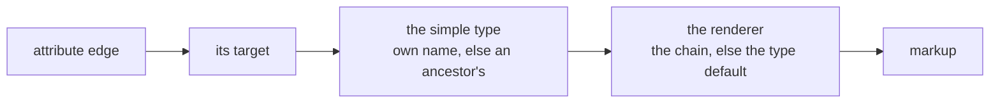

# Implementation plan

*Agreed with the owner on 2026-08-23, out of a fear he named plainly: the previous round with
another assistant **started just as well** and then cost him hours explaining why a confident
conclusion was nonetheless wrong.*

**The concept is not changed by this document.** It stays as it is; this only lays a grid over it
and starts building piece by piece. The interfaces are already given by the concept
([D-313](90-decision-log.md)).

---

## What actually changed since the last round

Not that the assistant reasons better. ⚠️ **Gaps get filled convincingly whether or not the filling
is right** — twice on 2026-08-23 alone, and both times the **owner** caught it.

What changed is that **there is something to point at.** When he says *that is wrong*, we look up
which decision says otherwise and it takes minutes. Last time there was no such paper, so every
contradiction became an argument.

---

## Three rules for every package

### 1 · A package ends with something the owner can operate

⚠️ **This is the actual protection.** Not *the storage layer is done* — nobody can check that, they
can only believe it. Instead: *you create a node in the tree, rename it, reload the page, and it is
still there.*

> **A package with no visible outcome is cut wrong.**

### 2 · Thin vertical slices, not horizontal layers

Depth or breadth was the owner's question; the answer is a **thin vertical slice**: from the table
to the screen, for **one small capability**.

A horizontal layer — *all the repositories* — cannot be checked by a person, and that is exactly
where the hours of explaining come from.

### 3 · After every package: what I assumed that was not in the concept

⚠️ **The cheapest insurance against the previous round.** Gaps **will** be found and filled; that
cannot be avoided. What can be avoided is filling them **silently**.

Every assumption becomes one line. The owner reads ten lines instead of a thousand, and whatever he
does not sign off becomes a decision or is taken out again.

**And if implementation shows something is missing, it becomes a decision in the log**
([D-222](90-decision-log.md)) — never a quiet change to the concept.

---

## The first cut

Six packages to the point where importing his real data first makes sense.

| | Package | What the owner checks |
|---|---|---|
| **1** | Tables, and a node exists | create, rename, send to trash — survives a restart · **done 2026-08-24** |
| **2** | The tree | parent and child, move, expand and collapse · **done 2026-08-24** |
| **3** | Attributes as relations, the three branches | give a node an attribute; the relation kind appears by itself · **done 2026-08-24** |
| **4** | Settings and the chain | a default at the type, an override at the attribute, reset to inherited · **done 2026-08-24** |
| **5** | Labels, roles, locales | the same thing is called something else in English · **done 2026-08-24** |
| **6** | Records | enter something against a model and find it again · **done 2026-08-24** |
| **7** | The fields look like their type | a switch is a switch, a date opens a picker — and the raw field is gone · **done 2026-08-25** |

**After six, his first TablePress import has something to import into** — 23 tables, some 600
records, in three shapes ([96 Scenario check](96-scenario-check.md)).

⚠️ **Package 1 is not *the database layer*.** It is the smallest slice in which a node can be made,
seen, changed and destroyed. Everything else about it comes later.

---

## What this plan deliberately does not do

| Not this | Because |
|---|---|
| sprints with dates | the owner asked for **self-contained packages**, and a date is not a boundary |
| a full backlog up front | the first cut is six packages; the seventh is decided when the sixth is done |
| changes to the concept | it stays as it is; findings become decisions ([D-222](90-decision-log.md)) |
| a package without a visible outcome | it could not be checked, which is the whole point |

---

## Package 1 — done 2026-08-24

**What it delivers:** the seven tables, a root and a trash, and a screen on which a node can be
made, renamed and thrown away. 25 checks pass, including the owner's own: *create, rename, send
to trash — and it is still there after a reload.*

### What was assumed that the concept did not say

⚠️ **Rule 3 of this plan.** Gaps get filled while building; what can be avoided is filling them
**silently**. Ten lines, and whatever is not signed off becomes a decision or is taken out again.

| # | Assumption | Why it was needed | How wrong it can be |
|---|---|---|---|
| **1** | ~~Model ids come from a counter in `wp_options`~~ | ⚠️ **Withdrawn the same day → [D-339](90-decision-log.md).** The owner asked what the safest form would be, and the counter was not it: it lived in a different table from the ids it guarded, so a partial restore could put it behind the data and make it reissue numbers — silently, because `owner_id` is one column over nodes and edges. **Replaced by an `identities` table with its own `AUTO_INCREMENT`**, never deleted from, with `owner_id` as a real foreign key. [D-340](90-decision-log.md) generalises the migration half of it. | resolved |
| **3** | **Parking is a move, not a flag.** A parked node simply sits under the trash; there is no `deleted` column, and **the path it came from lives only in the changelog**, which is what a restore will read. | [C101](10-domain-core.md) says *marked deleted and parked*, which reads like two things. One place owns each fact, so the position **is** the mark. | **Medium.** If a *mark* is genuinely wanted separately from the position, it becomes an engine-owned setting ([D-084](90-decision-log.md)) and nothing built here has to move. |
| **4** | **Reserved words get a suffix: `before_state` / `after_state`, and `setting_key`.** | `BEFORE`, `AFTER` and `KEY` are reserved in MySQL; the CONTRACTs name them `before`, `after`, `key`. ⚠️ **`key` was worse than a naming nuisance** — backticked, it broke `dbDelta`s index parser silently, so that index would not have been maintained on later upgrades. | None in substance — names only. |
| **5** | **`labels` has no `translatable` column.** | ⚠️ **Two CONTRACTs disagree.** [10 Domain core](10-domain-core.md) lists it; the detailed one in [40 I18n](40-i18n.md) does not, and [D-317](90-decision-log.md) puts *translatable* on the **attribute**, not on the label. Followed the detailed one. | **Medium — and it wants a look.** One of the two contracts is wrong. |
| **6** | **The capability is `manage_options`.** | Nothing decided one. | Low, and easy to change — it is one constant. |
| **7** | **Column sizes:** names `varchar(191)`, decimals `decimal(30,10)`, locale and kind `varchar(20)`. | Not specified. 191 is the WordPress index limit under `utf8mb4`. | Low. `decimal(30,10)` wants a second look the day money and tolerances arrive. |
| **8** | **Only root and trash are seeded.** `Model`, `Compositions`, `Primitives` are **not** created yet. | They are the tree, and the tree is Package 2. | None — deliberate scope. |
| **9** | **Children sort by name.** | Order belongs to the **edge** (`position`), and there are no edges yet. | None — it is a placeholder that disappears in Package 2. |
| **10** | **Root and trash carry a plain `name`, not labels.** | Labels are per role and per locale and arrive in Package 5. | Low. ⚠️ Their **displayed** names will have to become labels, or `AR-2` is broken for exactly two nodes. |

### What was found in the concept while building

- ⚠️ **[10 Domain core](10-domain-core.md) still carried the superseded override rule.** *An
  override may narrow and widen* ([D-088](90-decision-log.md), [D-310](90-decision-log.md)) —
  [D-312](90-decision-log.md) had replaced both the same evening, and the passage contradicted
  sentence 10 of [the core on one page](10-domain-core.md#the-core-on-one-page). **Corrected.**
- The `labels` contract disagreement above (assumption 5).
- **[D-083](90-decision-log.md)'s "seven tables" and the shared identity space are in tension**
  (assumption 1).

---

## Package 2 — done 2026-08-24

**What it delivers:** the inheritance edges as real rows, `nodes.path` derived from them, moving,
reordering, and a screen that draws the tree as a tree. **94 checks pass** — 47 in the core run
(no WordPress), 28 in Package 1's boundary run, 19 in Package 2's.

### ⚠️ What building it found in Package 1

**The truth and the derived value were the wrong way round.** Package 1 stored the tree *only* as
`nodes.path` — but [D-014](90-decision-log.md) calls the path *derived, rebuildable, never a
second truth*, and the thing it is meant to derive **from** is the inheritance edge, which did not
exist. It worked, and it was inverted.

Package 2 turns it back: the edge is written first, the path is rewritten from it, and a schema
migration gave every existing node the edge it should always have had. **Both boundary runs now
assert that every stored path can be rebuilt from the edges alone** — if the two ever drift, that
check fails rather than every descendant query going quietly wrong.

### What was assumed that the concept did not say

| # | Assumption | Why | How wrong it can be |
|---|---|---|---|
| **1** | **Reordering is a swap with the neighbour**, not a renumbering of all siblings. | A renumbering is one write per row, which is the loop `CD-7` forbids. A swap is always exactly two. | Low. It also matches the only control there is — up and down. |
| **2** | **Positions need not be unique**; ties fall back to id order. | Nothing decided it, and forcing uniqueness would mean rewriting siblings on every insert. | Low. The swap forces equal positions apart when it meets them. |
| **3** | **`allInheritanceEdges()` reads every edge at once** to draw the tree. | Two queries for a tree of any depth. Asking per parent would be one query per level. ⚠️ Rests on [D-308](90-decision-log.md): this is a modeller, so the **model** stays in the hundreds even when records run to thousands. | **Medium.** If a model ever reaches tens of thousands of nodes, the screen must page instead. |
| **4** | **The move chooser leaves out impossible targets** — the node itself and its own subtree. | Offering a choice that always fails is a trap laid for the person using it. | None. The core still refuses them; the screen is convenience, not the guarantee. |
| **5** | **The migration reads each parent out of the path.** | ⚠️ The one moment the derived value *is* the source — unavoidable, because in versions 1 and 2 nothing else recorded it. | None, and it cannot recur: from version 3 the edge is written first. |
| **6** | **The trash gets an ordinary inheritance edge.** | It is a child of the root like any other; a framework node without an edge would be a node the tree cannot see. | None. |
| **7** | **Reordering is up and down only.** Drag and drop is not built. | The owner asked for it ([20 Interaction](20-interaction.md)); it is a screen concern, and the core operation it needs already exists. | None — deliberate scope. |

### Where it can be seen

**Taxonomy Modeller** in the admin menu. Add a node, add a child with **+**, rename it, move it
with the chooser, order it with **↑ ↓**, throw it away. Reload — it is the way it was left.

```bash
php vendor/phpunit/phpunit/phpunit
```

```bash
php scripts/dev/package2-check.php C:/Devel/Wordpress
```

### What Package 2 delivers, and what it deliberately leaves

✅ **Closed the same day it was reported.** The package was first announced without
**expand and collapse**, which its own line requires; that was reported rather than left out, and
then built — together with **[U4](20-interaction.md)**, *delete the branch or only this node*.

⚠️ **Both were built as core behaviour, not as screen tricks**, which is what lets them survive
the scaffolding ([D-344](90-decision-log.md)): collapsing is a question about the tree, answered
in `Tree` and asked the same way by every surface; and *only this node* promotes the children to
their grandparent in **one statement**, because a write per child is the loop `CD-7` forbids.

**What is not built, and belongs to the real surface** — none of it was claimed:

| | What the concept asks | Where |
|---|---|---|
| **U1** | the row shows the frequent, a `⋯` menu holds everything — ⚠️ **touch has no right-click** | [U1](20-interaction.md) |
| **U5** | dragging moves whole branches, and several at once | [U5](20-interaction.md) |
| **U6** | duplicating puts the copy **directly beneath**, with an indexed name | [U6](20-interaction.md) |
| **U21** | the tree row draws the node's icon | [U21](20-interaction.md) |

⚠️ **U4's second half is not as harmless as its button** ([D-041](90-decision-log.md)): the tree
*is* inheritance, so children promoted to the grandparent **lose whatever they inherited from the
node being removed**. That is [D-155](90-decision-log.md)'s move reached through a different
button, which is exactly why deleting asks instead of guessing.

### ⚠️ A line the provisional screen must not cross

[R20a](30-renderer.md#r20a--the-detail-view-is-not-a-special-screen) and
[D-190](90-decision-log.md) settle that the detail view is **a frame holding attributes rendered
under the `edit` purpose** — not a hand-built screen. The stated reason is exactly the risk this
plan's temporary surface carries:

> otherwise there are two ways to draw a field — the official one, and the one the admin screen
> was built with — and they drift.

**Package 2's screen is that second way.** It is defensible only because it draws **no fields at
all**: names, buttons and a select, nothing that renders a value.

> **The rule for every package after this one: the moment an attribute value has to appear on
> screen, it goes through a renderer.** Not a quick `<input>` in the admin template that gets
> tidied up later — that is how the two ways start, and the legacy is the evidence.

---

## The order the surfaces impose — corrected 2026-08-24

⚠️ **A tree row is a rendered node** ([R18](30-renderer.md#r18r20--the-surfaces-are-renderers-all-the-way-up)),
the settings side is a rendered page ([R20](30-renderer.md)), and *nothing is drawn by hand
anywhere*. That was an owner statement from the first week and it changes the running order.

**The real surface cannot come next.** A node renderer needs settings, labels and attributes to
render; until those exist there is nothing for it to draw.

| | | |
|---|---|---|
| **3** | Attributes as relations, the three branches | the model starts to be able to say something |
| **4** | Settings and the chain | a renderer has something to resolve |
| **5** | Labels, roles, locales | a row has something to write |
| **then** | **the tree renderer and the split screen** | ⚠️ and the scaffolding below is **deleted**, not refactored ([D-344](90-decision-log.md)) |

**What the scaffolding is for, and its two limits:** it exists so behaviour is checkable before
renderers exist. It draws **no value** and must never begin to. Everything asserted against it
tests the **core** — which the real surface uses unchanged — so losing it costs nothing.

**Finishing Package 2** — expand/collapse and [U4](20-interaction.md)'s *branch or only this node*
— is still worth doing, because both are **behaviour**: collapsing is a selection question and
U4 needs children promoted to the grandparent, which nothing in the core does yet.

### ⚠️ Not built: the deletion event ([D-127](90-decision-log.md))

**Parking writes one changelog line per node.** Nothing records that several things fell in **one**
act, which is what [D-127](90-decision-log.md) calls a trash entry — *one deletion, with everything
that fell with it, and restore puts back the whole event.*

Today it does not show, because parking a branch moves the subtree and restoring moves it back:
the paths carry the grouping by accident. **It shows the moment something falls that is not a
descendant** — a promoted child ([OQ-083](91-open-questions.md)), and later an edge pointing at a
deleted node, which [D-127](90-decision-log.md) names explicitly.

*Reported rather than left out. It is not needed to finish Package 2 and it is needed before
deletion can be trusted with attributes.*

### The bracket and the attributes — noted for Package 3

The owner, while the change group was being built: *later, something will probably have to happen
with the attributes in the same change group.*

⚠️ **He is right, and [D-127](90-decision-log.md) says it in as many words** — *the node **and
every edge that pointed at it***. An attribute **is** an edge ([D-031](90-decision-log.md)), so
deleting a node parks every attribute that used it, and those rows belong under the same bracket
as the deletion that caused them. Without it, [D-347](90-decision-log.md)'s restore brings back a
node whose attributes stayed in the trash — the exact failure [D-127](90-decision-log.md) was
written to prevent.

**Nothing is missing in the concept; it is a piece of work.** It cannot be built before Package 3,
because there are no attributes yet. Recorded here so that it is built **with** them rather than
noticed afterwards:

| When attributes exist | What must fall under the deleting act's bracket |
|---|---|
| a node is parked | every edge pointing **at** it, parked with it ([D-127](90-decision-log.md)) |
| an attribute is removed at one use site | the edge, and the orphaned overrides promoted per [D-156](90-decision-log.md) |
| a node moves between branches | the reparenting and every edge whose **kind** it rewrote ([D-162](90-decision-log.md)) |

---

## Package 3 — done 2026-08-24

**What it delivers:** the three branches as framework nodes, and **attributes as relations whose
kind nobody chooses**. Give a node an attribute by pointing it at a target, and composition or
aggregation follows from where the target lives.

| Branch | Reached by | Holds data | Value stored |
|---|---|---|---|
| `Model` | aggregation | yes, standalone | external reference |
| `Compositions` | composition | yes, owned | its own records |
| `Primitives › Data Types` | composition | no | inside the record, by path |
| `Primitives › Constants` | aggregation | no | a reference to a node |

⚠️ **The pair that shows the rule is not *primitive versus not***: `Data Types` and `Constants`
both sit under `Primitives` and differ, because one has no instances at all and the other is a
node a person may extend.

**88 core checks pass** (no WordPress) plus 28 · 48 · 23 at the boundary — 187 in all.

### What was assumed that the concept did not say

| # | Assumption | Why | How wrong it can be |
|---|---|---|---|
| **1** | **A node hung directly under `Primitives` sits in no branch, and pointing at it is refused.** | ⚠️ The concept splits `Primitives` into `Data Types` and `Constants` and says **nothing** about the space between. There is no kind to read off such a node, and inventing one is how a supplier ends up composed into an order. | **Low, and deliberately loud.** If that space is meant to be usable, the refusal is where it will be noticed. |
| **2** | **`Primitives` itself is protected, like the branch roots.** | It is machinery, not content ([D-194](90-decision-log.md)). | None. |
| **3** | **An attribute needs a name; the name is trimmed like a node's.** | [D-022](90-decision-log.md) governs node names; nothing said it for edges, and *the use site is an attribute* argues they are the same kind of thing. | Low. |
| **4** | **Attribute order is its own sequence**, counted separately from the tree's `position`. | Both live in `position` on `relations`, and mixing them would make an attribute's place depend on how many children the node has. | Low. |
| **5** | **The upgrade seeds.** A schema version bump now also runs the framework seeding. | Version 5 changed **no table** — it added nodes. Without this, an already-installed copy would never get the branches. | None, and it is the honest reading of `CD-6`: the stored version is what makes an upgrade deterministic. |

### What is **not** in it, and was not claimed

**Multiplicity, mandatory, permitted sets, defaults** — all of those are **settings**
([D-086](90-decision-log.md), [D-312](90-decision-log.md)) and belong to Package 4. An attribute
today is a name, a target and a kind.

**Removing an attribute.** ⚠️ It needs the deletion event to carry the edge under the same
bracket as the node that caused it — the owner named it while the change group was being built,
and it is written up above. Deleting a node does not yet park the attributes pointing at it.

---

## Package 4 — done 2026-08-24

**What it delivers:** the resolution chain, and the rule that runs down it.


**Walked key by key** ([D-079](90-decision-log.md), [D-093](90-decision-log.md)), loaded in **one
query** for the whole chain ([D-014](90-decision-log.md)), stored **sparsely**
([D-015](90-decision-log.md)). ⚠️ **Reset and *set to nothing* are two different acts**
([D-266](90-decision-log.md)): after a reset a later change above arrives again; after *nothing*
it deliberately does not. Both are checked at the boundary against a real database.

**Bounding narrows, choosing is free** ([D-312](90-decision-log.md)) — enforced at **write** time,
because a restriction that may be reopened anywhere says nothing when it is read. And what an
ancestor declares mandatory stays mandatory ([D-311](90-decision-log.md)).

**112 core checks** plus 28 · 48 · 23 · 27 at the boundary.

### What was assumed that the concept did not say

| # | Assumption | Why | How wrong it can be |
|---|---|---|---|
| **1** | **`model root → ancestors → node` is the node's path, in order.** | The chain names three things the path already holds; reading it any other way would make the walk a climb, which [D-014](90-decision-log.md) exists to avoid. | Low, and load-bearing — if it is wrong, the whole walk is. |
| **2** | **The installation identity is an identity with no node behind it.** | [OQ-039](91-open-questions.md) says *reserved and does not appear in the modeller*. Since [D-339](90-decision-log.md) made `owner_id` point at `identities` rather than at `nodes`, an owner that is not a node is a first-class thing rather than a hole. | None — it falls out of a decision already taken. |
| **3** | **Eleven engine-owned keys**: `multiplicity_min/max`, `mandatory`, `hide`, `read_only`, `range_min/max`, `default`, `renderer`, `converter`, `icon`, `order`. | [D-312](90-decision-log.md) names the two groups by example; these are those examples made concrete. **Permitted sets are not among them** — a set needs set semantics for *narrower*, and guessing them would be inventing a rule. | ⚠️ **Medium.** The list will grow, and each addition has to declare its direction. |
| **4** | **Narrowing is numeric for ranges and one-way for switches.** A minimum may rise, a maximum may fall, and `mandatory`/`hide`/`read_only` may only ever close. | It is what *narrower* means for those shapes. | Low. |
| **5** | **A free key is unbounded.** Only the engine's keys carry a direction. | Nothing says an author's own setting has an ordering, and inventing one would be worse than leaving it free. | Low. |
| **6** | **The scaffolding shows settings as raw key/value, read-only.** | ⚠️ A **rendered** setting is a rendered value, which is the line [R20a](30-renderer.md) draws. This prints; it does not render. | None, and it is deleted with the rest of the scaffolding. |

### What building it found

⚠️ **[OQ-085](91-open-questions.md) — how much precision does a decimal have?** `2.50` is written
and comes back as `2.5000000000`. The **value** is exact, and the notation is a rendering
question — but the **scale** is fixed at ten places for every decimal in the system, and nothing
in the concept decided that. A physical constant wanting twelve places would lose two, silently.

---

## Package 5 — done 2026-08-24

**What it delivers:** labels, and the chain that decides what to show when nobody has said.


**Roles are nodes** ([D-151](90-decision-log.md)), seeded as `form`, `table`, `select`, `symbol`,
`help` ([D-196](90-decision-log.md)) under a container of their own — ⚠️ **in no data branch**, so
an attribute cannot point at one. **Number before role** ([D-153](90-decision-log.md)): a missing
plural falls back to the base form of the **same** role before the role gives way.

⚠️ **The chain never ends on nothing.** Its last step is the node's own name, which always exists
([D-022](90-decision-log.md)) — an empty cell where a name should be is worse than the internal
name.

**123 core checks** plus 28 · 48 · 23 · 27 · 24 at the boundary.

### What building it found

⚠️ **[40 I18n](40-i18n.md) still said the `long` versus `help` question was open.** It was settled
on 2026-08-23 by [D-209](90-decision-log.md) — *`long` is gone, it is defined as `help`* — and two
passages had not been brought forward. Corrected; the chain now reads `<role>·<number>` →
`<role>·one` → `help·one` → `node.name` in both places.

### What was assumed that the concept did not say

| # | Assumption | Why | How wrong it can be |
|---|---|---|---|
| **1** | **Roles live under a framework container of their own, outside every data branch.** | [D-151](90-decision-log.md) says *under their own branch*; the four branches are data branches with a relation kind each, and a role has none. | Low. If roles should be pointable-at, this is where it will be noticed. |
| **2** | **A locale falls back to the neutral row before the role gives way.** | ⚠️ The concept states the **role** chain and says nothing about a missing locale. A label written without a locale is one somebody wrote for everybody; using it beats answering a different question with the help text. | **Medium — it is a chain step nobody decided.** |
| **3** | **An empty text does not count as an answer** and the chain continues. | A stored empty string is almost always an accident, and treating it as an answer shows a blank where a name should be. ⚠️ *It is the opposite call from settings, where nothing is a deliberate value* ([D-266](90-decision-log.md)) — because there it stops inheritance, and here there is nothing to stop. | Medium. Worth a look. |
| **4** | **`number` defaults to `one`** and that is the base form every fallback lands on. | [D-216](90-decision-log.md) names the categories and calls the column sparsely filled; something has to be the base. | Low. |

---

## Package 6 — done 2026-08-24

**What it delivers:** records. Enter something against a model node and find it again.

⚠️ **Where a value goes is not a choice either** ([D-232](90-decision-log.md)) — the attribute's
target sits in a branch, and the branch decides:

| Target branch | The value is |
|---|---|
| `Data Types` | inside the record, addressed by path |
| `Constants` | a reference to a **node** |
| `Model` | a reference to a **record** |
| `Compositions` | ⚠️ records of its own — **refused, not built** |

**The last edge sits beside the path** ([D-134](90-decision-log.md)), which is what makes *which
parts are 4k7* one indexed lookup instead of a walk through every record — and the boundary run
asks exactly that question.

**A record keeps the model version it was written against** ([D-060](90-decision-log.md),
[D-210](90-decision-log.md)) — *written against*, not *checked against*. Renaming the model
afterwards does not restamp it.

**138 core checks** plus 28 · 48 · 23 · 27 · 24 · 21 at the boundary — **309 in all**.

### ⚠️ A rule bent on purpose

[D-350](90-decision-log.md). [D-344](90-decision-log.md) said the scaffolding **draws no value**;
this package's own check is *enter something and find it again*, which cannot be checked by a
person without a field. **The line moved, with three fences:** one bare `<input>` per attribute
that knows nothing about the type, labelled *raw* on screen, and **deleted rather than evolved**
when the renderers arrive. *A field with no opinions cannot drift from the renderers; the moment
it grows one — a date picker, a number format, a chooser — it has become the second way to draw
and must go.*

### What was assumed that the concept did not say

| # | Assumption | Why | How wrong it can be |
|---|---|---|---|
| **1** | **A direct attribute's path is the edge id.** | [D-134](90-decision-log.md) gives the shape `100.101` for nested values; at depth one the path is one step. | Low, and it generalises unchanged. |
| **2** | **An empty field means unanswered**, and the row is removed. | ⚠️ *A missing row means **not answered**, never **no*** — three states at `0..1`. But nothing says what an **empty text box** means, and *deliberately nothing* would need its own control. | **Medium.** The two are different and the scaffolding cannot express both. |
| **3** | **A composed target is refused rather than stored inline.** | Storing it inline would look right until somebody tried to share it. | None — it is unfinished work named as such. |
| **4** | **Writing checks that the attribute belongs to the record's model** — its own or inherited. | An edge id from a form is input, and a value written against an attribute the model does not have is a value nothing will ever read. | None. |

### Not built, and not claimed

**Composed records** (a parts list holding its own lines) · **deleting a record** · **the search
column** ([D-167](90-decision-log.md)) · **validators and converters** · **the renderers**, which
are what turns all of this from raw text into a usable editor.

---

## Package 7 — the fields look like their type · done 2026-08-25

**What it delivers:** a value is no longer characters in a box. Nine of the simple types have a
renderer that ships, the type chooses it without anybody configuring anything, and the raw entry
field of [D-350](90-decision-log.md) is **deleted** — which is what that decision said would happen
the day the renderers arrived.



| Renderer | Draws | Default for |
|---|---|---|
| `field` | one line — [D-018](90-decision-log.md)'s *plain field* | `text` `char` `version` `int` `decimal` |
| `spinner` · `slider` | the same number, bounded and as a track | offered, default for nothing |
| `switch` | a boolean | `bool` |
| `mailto` | an address that can be written to | `email` |
| `datetime` | as much of a timestamp as the model asked for | `datetime` |
| `color` | a swatch, and a picker where it is safe | `color` |
| `textarea` | the long end of `text` | offered, default for nothing |

**197 core checks** plus 28 · 48 · 23 · 33 · 24 · 21 · **51** at the boundary — **425 in all**.

### Where it can be seen

Pick a node under **Model**, give it attributes pointing at `bool`, `datetime`, `email` and
`color`, add a record. The switch is a switch, the date opens a date picker, the address is
clickable, the colour has a swatch. Each row shows *which type · which renderer* beside it, and a
row saying **no renderer** in red is a gap rather than a style.

```bash
php vendor/phpunit/phpunit/phpunit
```

```bash
php scripts/dev/package7-check.php C:/Devel/Wordpress
```

### ⚠️ What building it found — three of them in yesterday's own work

**1 · The contract could not express [R14a](30-renderer.md#r14a--the-key-is-the-type-purpose-travels-in-the-context)'s
second half.** The registry keyed on the renderer's **name**, so *one is marked default per type*
had nowhere to live — every field in the product would have looked like a fault until somebody
configured it by hand. The type is now the key it was always meant to be
([D-352](90-decision-log.md)).

**2 · The purpose fallback was right for a value and wrong for a filter.** Yesterday a renderer
declining a purpose got the fallback substituted, *so that a value never silently disappears* —
which defeats [D-217](90-decision-log.md) under the search purpose, where declining **is** the
mechanism behind *not searchable*. The registry now answers nothing and the descent applies the
policy, which differs by purpose ([D-353](90-decision-log.md)). *The test that asserted the old
behaviour was rewritten with the reason written into it.*

**3 · The fallback was a quiet grey floor**, which is what
[R14b](30-renderer.md#r14b--the-last-resort-renderer-is-a-fault-indicator-not-a-floor) forbids in
so many words. It now marks its own markup.

**4 · An N+1 through the back door, found by the boundary run counting queries and not by reading
the code.** Drawing seven fields cost **twenty-five** queries: each field asked which branch its
type sat in, and each answer looked up four branch roots. The roots are framework nodes and cannot
move ([D-194](90-decision-log.md)), so they are read once per request — and the check now asserts a
**query count**, because that is the only way this class of fault is ever noticed.

### What was assumed that the concept did not say

| # | Assumption | Why | How wrong it can be |
|---|---|---|---|
| **1** | **A `bool` is drawn as a switch, and an unticked box means `false` rather than *unanswered*.** The control writes a hidden `0` ahead of itself. | ⚠️ No decision names a boolean renderer — [D-118](90-decision-log.md) settles the **layout** only. And a checkbox has two states where the model has three ([D-232](90-decision-log.md)): an unticked box meaning *nobody has said* would make every mandatory check unanswerable. | **Low for the control, medium for the third state.** *Deliberately nothing* is now reachable only by clearing the attribute; if it needs its own control that is a screen addition, not a change here. |
| **2** | **The context is told which type is being drawn.** | A renderer serving two types — a spinner draws an integer and a decimal — otherwise guesses from the value it holds, and an **empty** decimal field is then indistinguishable from an integer one and quietly refuses `2.5`. | None. It is [R14a](30-renderer.md)'s key, passed rather than re-derived. |
| **3** | **`textarea` is eligible for `text` and the default for nothing.** | A text is one line until somebody says otherwise. Guessing from the length of what happens to be stored would make the control jump about as the content grows. | Low. It is a legacy candidate rather than a decided renderer — [the inventory](30-renderer.md#the-table) marks it so. |
| **4** | ~~**`cols`, `rows` and `step` are read as free settings.**~~ | ⚠️ **Half wrong, corrected the same day → [D-359](90-decision-log.md).** The owner sent me back to the document: *the assignment we have through the registry — look at the concept again more closely.* [R17](30-renderer.md#r12r17) says *integer and double **nodes** need min, max and **step** as settings*, in one sentence with the two bounds that are already engine keys. `step` is now **`range_step`**, reserved, direction `Free` — because **nothing validates it**: a step of five does not make seven unstorable, so it says how the control moves and not what the model permits. `cols` and `rows` stay free, and now for the right reason: no decision names them. | resolved |
| **5** | **A colour the picker cannot hold is edited as text.** | ⚠️ `<input type="color">` reports `#000000` for anything it cannot parse, so the next save would write **black over a value nobody touched**. A control that can lose a value on the way past is worse than a plain field. | None. [D-226](90-decision-log.md)'s coupled hex-beside-picker is **not** built: two controls writing one field need JavaScript to stay in step. |
| **6** | **A slider with no bounds omits them and lets the browser invent `0–100`.** | Making the misconfiguration **visible** needs a sentence a person reads, and a core renderer cannot produce one — [OQ-087](91-open-questions.md). | **Medium, and it is a real hole.** A wrong-looking control rather than a wrong value, but nothing points at the cause. |
| **7** | **The read-back refuses rather than converts.** `abc` in an integer field is an error; `25.08.2026` in a date field is an error. | ⚠️ [R36a](30-renderer.md#r36a--the-converter-removes-what-cannot-have-been-meant-the-validator-asks-about-the-rest) gives *removing what cannot have been meant* to a **converter**, and there is none. Coercing would store a `0` that can never again be told apart from one somebody meant ([D-071](90-decision-log.md)). | None in substance — but it is **rough to use** until converters exist, and that is the honest description. |
| **8** | **Only submitted attributes are written.** | A hidden field is not in the form, and a hidden field is not a cleared one. Treating absence as *clear* would empty every hidden attribute on the first save. | None. |
| **9** | **Form fields are keyed by the edge, `taxmod_value[<id>]`, never by position.** | A checkbox does not submit when unticked, so parallel `edge_id[]` / `value[]` arrays shift every later value onto the wrong attribute — silently, and only in the rows somebody unticked. | None. A bug designed out rather than found. |
| **10** | **An attribute whose target is not a simple data type is refused at write, by name.** | A constant or a reference has no characters of its own yet. Storing what was typed as text would look right until somebody tried to follow it. | None — unfinished work, named as such. |

### Not built, and not claimed

| | Why not |
|---|---|
| **the reference renderer** ([D-105](90-decision-log.md)) and everything under `Constants` | it draws a **target's label**, and a renderer is handed its data and fetches nothing ([D-159](90-decision-log.md)) — so the label has to arrive **in** the context, which is a contract question rather than a renderer |
| **`user_ref`** | it resolves a WordPress user, which is a boundary concern reaching into the core's hands |
| **the search purpose** | a search rendering is a **condition** feeding a query builder ([D-165](90-decision-log.md)), and there is no query builder. Every typed renderer **declines** it, which is [D-217](90-decision-log.md)'s own mechanism rather than a gap |
| **converters** | [R33](30-renderer.md)–[R36](30-renderer.md); `4k7`, notations, a locale's decimal comma. The read-back is deliberately the identity form so converters can sit **in front** of it unchanged |
| **appended renderers** ([D-236](90-decision-log.md)) | `RenderResult::followedBy()` exists and is checked; nothing configures a **list** yet, because the `renderer` setting holds one name |
| **the node renderer, the tree row, the split screen** | ⚠️ **this is the next package**, and it is what **deletes** the scaffolding rather than adding to it ([D-344](90-decision-log.md)) |

### ⚠️ A decided rule the scaffolding deliberately does not follow

**[U22](20-interaction.md#u22--settings-apply-immediately-the-save-button-stays-for-one-named-reason)
and [D-249](90-decision-log.md): settings apply immediately.** *It is nicer if I make a setting and
it is simply taken; at worst I can undo it.* An explicit save button is the **exception**, kept only
because WordPress sometimes makes the page jump.

**The scaffolding does the opposite** — `Set`, `Set to nothing`, `Use this renderer`, a button per
row. That is the exception applied everywhere, and it is why the panel looks like three widgets
doing one job.

⚠️ **Left as it is, on the owner's instruction, and the reasoning is his:** *I do not want to fiddle
with the input if it resolves itself later with proper rendering.* Immediate apply needs the drawn
control to **be** the input — which is [R20a](30-renderer.md#r20a--the-detail-view-is-not-a-special-screen)'s
*rendered under the edit purpose*, i.e. the real surface. Building it twice on a surface that gets
deleted is the throwaway work [D-345](90-decision-log.md) exists to limit.

**Recorded so nobody rediscovers it as a defect.** The panel contradicts a decision, knowingly, and
the contradiction disappears with the scaffolding rather than being fixed in it.

⚠️ **The same reasoning moves [D-361](90-decision-log.md)'s field-rule panel** — select, *Add*, a
list per section — **out of the scaffolding and into the real surface.** It is an input design, and
an input design built on a throwaway screen is built twice.

### ⚠️ Three things the next package inherits

**The `renderer` setting holds one name, and [R13a](30-renderer.md#r13a--a-node-carries-an-ordered-list-of-renderers-one-of-them-mandatory)
wants an ordered list** — one mandatory, any number appended ([D-236](90-decision-log.md)). Nothing
is broken: `RenderResult::followedBy()` is the combining half and it is built and checked. **What
is missing is how a list is written down** — one key holding several names, or a key per position —
and that is a decision, not a refactor.

⚠️ **And it is no longer only the renderer's problem: [D-357](90-decision-log.md) makes it the
shape of three things.** Converter, validator and renderer are **field rules** — the owner's word —
stored as **three keys** so the chain keeps resolving key by key ([D-093](90-decision-log.md)), and
configured as **one group** so *how a resistance behaves* cannot be half-written. Two pieces of
work fall out of it, and they are next-release work rather than someday work:

| | |
|---|---|
| **how a list lives in a setting** | one value holding several names, or a key per position — and what *narrowing* means for either. It is the same question for all three keys, so it is answered once ([OQ-089](91-open-questions.md)) |
| **the grouped panel** | one place where the three are configured together, which lands on the **settings side** — and therefore inside the very package that replaces the printed panel below |

**[OQ-087](91-open-questions.md) is on the critical path of the node renderer.** A renderer that
has to *say* something can satisfy neither `CD-1` nor `AR-2`, and the first one that must is
[D-147](90-decision-log.md)'s computed-value marking — *not computable*, **with a reason**.

**⚠️ And the owner's own proposal for the shape of it, made while this package was finishing —
recorded as a proposal, not as a decision ([PR-3](../../CLAUDE.md)).** In his words: *list
renderer → label renderer, list renderer → attribute renderer, list renderer → settings renderer
… just a thought, to make it uniform: **the list always looks the same, and the contents are
rendered by different renderers.***

**That is not a new idea in the concept — it is the concept's own idea, applied one level higher
than it has been so far**, and two rules already say it:

| | |
|---|---|
| [R46/R47](30-renderer.md#r46r47--a-container-renderer-is-the-same-recursion) | a container renderer is **the same recursion** — the frame is drawn once and **every cell goes back to the registry** |
| [a cell never inherits the container's renderer](30-renderer.md#and-a-cell-never-inherits-the-containers-renderer) | so a list of settings and a list of labels are the **same frame** with different cells |
| [R18](30-renderer.md#r18r20--the-surfaces-are-renderers-all-the-way-up) | *the surfaces are renderers all the way up* — his statement from the first week |

**What his framing adds is the count.** The scaffolding has **three** hand-built tables — labels,
attributes, settings — and under this reading they are **one** list renderer used three times. That
is the difference between deleting three panels and deleting one, and it is the same saving
[R51c](30-renderer.md#r51c--set-and-table-are-retired-as-constructs-and-three-renderers-remain)
found when it separated *the thing* from *the drawing*.

⚠️ **It needs exactly the one thing named below, and nothing else.** A uniform list can only
delegate its cells if each cell knows **what it is** — which for a setting means the mapping from
engine key to type. *So his proposal and the gap below are the same piece of work, seen from two
ends.*

**And the settings side is still printed rather than rendered.** [R20a](30-renderer.md#r20a--the-detail-view-is-not-a-special-screen)
and [D-190](90-decision-log.md) settle that the detail view **is** a series of attributes rendered
under the edit purpose — so drawing an attribute's settings needs no renderer of its own, and that
is the answer to a question the owner asked while this package was being built. ⚠️ **But it needs
something that does not exist:** to render `multiplicity` as a chooser of four, `mandatory` as a
switch and `renderer` as a list of the eligible ones, each **engine setting key** has to say what
**type** it is. [D-351](90-decision-log.md) gave multiplicity a value type of its own and nothing
generalised it. **That mapping is the first piece of the next package**, and until it exists the
settings panel prints key and value as text — which is the second way to draw a field that
[R20a](30-renderer.md) warns about, living on borrowed time exactly as [D-350](90-decision-log.md) did.

### What came after the write-up above — same day, 2026-08-25

⚠️ **The section above describes Package 7 as it stood at midday.** The afternoon was spent almost
entirely on things the owner found by **looking at the screen**, and each one is a decision rather
than a tidy-up. Recorded here so the package's own account is not a day out of date.

| | What | Found how |
|---|---|---|
| [D-358](90-decision-log.md) | the renderer is **picked**, never typed — and `eligibleFor()` was offering every typed renderer to a node with no type at all, *a spinner for a supplier* | *how would the user know the name?* |
| [D-359](90-decision-log.md) | `step` belongs on the node as `range_step`, and the *homeless setting* premise was simply wrong | *look at the concept again more closely* — [R17](30-renderer.md#r12r17) had said it |
| [D-360](90-decision-log.md) | offered and allowed are two questions; the write check was a fence [R14](30-renderer.md#r12r17) does not build | *unless you have a special use case* |
| [D-361](90-decision-log.md) | the field-rule panel's shape, and the default **in** the list | a mockup, whose own *From* column showed why |
| [D-362](90-decision-log.md) | a rule list is one setting value, the names in order | required by D-361 |
| [D-363](90-decision-log.md) | the **reference renderer** — and how a renderer learns about a node it is not drawing | every constant read *no renderer* |
| [D-364](90-decision-log.md) | a free key is not an authoring gesture — *that is what attributes are for* | the one row the panel could not draw |
| [D-365](90-decision-log.md) | three jobs, one axis: the **type**. And a converter maps notation **both ways** | *I thought that was clear, we have the table* |
| [D-366](90-decision-log.md) | the **form renderer**, and a container lays out parts the descent drew | three of four expected gaps were decided already |
| [D-367](90-decision-log.md) | the tree **walks**, the node renderer **draws** — so the chooser swaps only the cell | *then we only need to swap the node renderer* |

**Also in the afternoon, and both worth keeping:**

- **The settings side is drawn rather than printed.** `SettingShape` and `SettingKey::typeFor()`
  are what [R20a](30-renderer.md#r20a--the-detail-view-is-not-a-special-screen) needed and had never
  been given: a setting's own value has a type, so the same renderers draw it. The panel now lists
  **every key that applies**, not only the written ones — the owner's ask — with `here`,
  `from #n` and `not defined` as three distinct states.
- **The last guesser is gone.** A setting reads back as the type its key declares. Two cases keep
  characters and say so: a free key, and a borrowing key on a node that is not a simple data type.

**Counts at the end of the day: 236 core checks, and 250 at the boundary** — 28 · 48 · 23 · 33 · 24
· 21 · 73.

⚠️ **What is not built and is now well specified rather than vague:** the **chooser**
([D-244](90-decision-log.md)) — two setting shapes and every reference edit wait on it; the
**converters** and **validators**, whose assignment axis [D-365](90-decision-log.md) settles; the
**rule list** as code ([D-362](90-decision-log.md) has the shape, nothing reads it yet); and the
**tree walker** as a renderer, whose cell is the next thing to build.

---

## The working list

⚠️ **The owner's instruction, 2026-08-26: *from now on please append all changes I post to the back of
the working list.*** So this is where they go, in the order he asked for them — and it is deliberately
**not** the roadmap. The roadmap is *later, maybe*; this is *next, in this order*.

⚠️ *Everything here is decided already. Where a row needs a decision first it says so, and the row
does not start until it has one — that is `PR-4` and it is why the list is honest about waiting.*

| # | What | Why it is where it is |
|---|---|---|
| **1** | **The admin settings page** | The owner: *that would be a setting on the admin page — we should tackle those next, otherwise some information may get lost.* **Three things are already waiting on it**: developer mode ([D-389](90-decision-log.md)) is a WordPress option with no screen; the **neutral locale** ([D-387](90-decision-log.md)) falls back to the site language for exactly the same reason; and the icon size and font he asked for have nowhere to live. *It also closes [OQ-039](91-open-questions.md), which has been waiting since Package 4.* |
| **2** | **A marked gap where a record is referenced** | `→ 285` appears in a record's form today — a **bare record id on screen**, which [D-363](90-decision-log.md) forbids in as many words: *a bare number is the sort of thing that gets copied into a spreadsheet as if it meant something.* The real answer is the **summary renderer** ([D-106](90-decision-log.md)) — **which does not exist**, and is the fourth of the four missing renderers counted in [row 16](#the-working-list). Until it does, the gap must read as a fault rather than as a value. |
| **3** | **The detail head as three labelled rows** | The owner's layout: *form, 3 rows, 2 columns — left column Action, System, Name; right column the tool buttons, then constants like path, id and version, creation, last change, change owner; the name field's Rename goes and is saved by the page save.* `ChangeSummary` is built and read; the layout and folding Rename into the page save are not. ⚠️ **And it is a renderer** — the owner, 2026-08-26, pointing at the head: *the head as we discussed it is still not there, that is a renderer, right?* **Yes**, by `R1`, and that makes it the **fifth** hand-built panel to go through it after labels, settings, an attribute row and a record ([D-393](90-decision-log.md)). *Which also means it is not a layout job: the head is a rendering of a node, so it belongs in the registry where a block could reach it too.* |
| **4** | **~~The target chooser for a new attribute~~ — erledigt 2026-08-26, [D-418](90-decision-log.md)** | The last flat `<select>` on the screen. The tree chooser exists now ([D-395](90-decision-log.md)) and this is the one place still listing eighty nodes with middle dots. |
| **5** | **Several renderers, several validators** | [D-236](90-decision-log.md): *a node carries an ordered **list** of renderers, one mandatory, the rest optional additions*, and `RenderResult::followedBy()` is already built and checked. [D-158](90-decision-log.md) wants validators the same way. ⚠️ **Blocked on a decision, not on work**: several values under one key needs [OQ-092](91-open-questions.md)'s `path` column, and so does [C30](10-domain-core.md)'s *several defaults*. **Three decided things wait on one column.** |
| **6** | **~~The preview~~ — built 2026-08-26** | `PageSlot::Preview` is empty. [D-101](90-decision-log.md), [D-160](90-decision-log.md) — and [R31a](30-renderer.md#r31a--the-second-row-is-not-a-control-state-it-is-a-broken-model) needs it, because *a model that cannot be filled in* is reported **in the preview**. ⚠️ **Built, and my two «blocked» reasons were both wrong.** The owner pulled it forward — *we need the preview to fix the flag and renderer concept errors* — and reading [D-160](90-decision-log.md) properly settled it: *defaults remain the fallback where no pack covers the model.* **So it was buildable all along**; the test-data column ([row 17](#the-working-list)) improves the **middle** rung of *real data → marked rows → sample value*, and the first and third already existed. ⚠️ **What it draws**: two renderings of one descent, `Purpose::Display` beside `Purpose::Edit` — *`read_only` is the setting whose entire meaning is that those two differ*. `hide` removes a row and **names it below**, because a preview that quietly drops a field cannot be told apart from one that forgot it. Guarded by `scripts/dev/preview-check.php`, which flips each flag and asserts the effect rather than asserting that a panel appeared. ⚠️ *Still honestly missing: which record to preview is nobody's decision yet, so it takes the first and says so.* |
| **7** | **Converters** | [D-219](90-decision-log.md), [R33](30-renderer.md)–[R36](30-renderer.md): `4k7` into `4700`, a locale's comma, a thousands separator. The key exists and draws as a **dead** control, which is honest and not useful. |
| **8** | **Validators** | The key exists since 2026-08-26 and nothing is built. [D-158](90-decision-log.md) settles the message shape — *per validator, not per attribute* — so the storage is already there (`labels.path`). |
| **9** | **`Used by`** | `PageSlot::Relations` is empty. [D-199](90-decision-log.md) decided it holds **one** direction and named the condition it depends on: *the section may hold one direction only because every outgoing edge is visible elsewhere.* |
| **10** | **Purging — emptying the trash for good** | The owner, 2026-08-26: *please queue at the back of the list.* One act with two names: a composed part cannot *die with its holder* ([C12](10-domain-core.md)) because **nothing deletes a record either**. ⚠️ *[D-054](90-decision-log.md)'s resolver runs first, and [D-340](90-decision-log.md) binds it — an id once handed out is never reissued, so the high-water mark must survive the purge. That is why it is not a `DELETE`.* ⚠️ **Done once by hand on the owner's word** — *could you delete all the nodes in the trash while the function does not exist yet* — and the hand-run is the specification the act should follow: 42 parked nodes, 92 edges, 18 settings, 4 records and 6 values went; **134 identities and 230 changelog entries stayed**. ⚠️ **The schema already enforces the keeping half**, which is the finding worth building on: `settings.owner_id` points at **`identities`**, not at `nodes`, `ON DELETE RESTRICT`. *So a purge cannot orphan an identity even by mistake — and that same reference is why a dead node's settings can outlive it (row 28).* ⚠️ *One precondition the act must check and the hand-run did: **no edge from a living node into the trash.** Measured before deleting — only the trash's own `inheritance` edges pointed in, so no active model lost an attribute.* |
| **11** | **Page-level save, then auto-save** | Stage one is done ([D-392](90-decision-log.md)). Stage two is the owner's own from a previous project: *leaving a field saved its content* — switched on from the admin menu. ⚠️ *Both wait on the same undecided thing: what a batch save does when the core refuses **one** of thirty, and what a blur does when nobody is watching.* |
| **12** | **An attribute's target links to its node** | The owner, 2026-08-26: *should have a jump link to the node.* The attribute row shows `BOM Position` as text, so reading a model means finding the target in the tree by eye. ⚠️ *The renderer half already exists — {@see ReferenceRenderer} wraps its target in a link the moment one is handed in, because a URL belongs to a surface and the core has none ([D-363](90-decision-log.md), `CD-1`). What is missing is that `attributesFor()` is never given the addresses: one map of node id ⇒ URL, built where the other row addresses already are.* |
| **13** | **~~`hide`, `read_only` and `mandatory` become choices~~ — withdrawn, and the replacement is built** | ⚠️ **The owner overruled me and he was right**: *`hide`, `read_only` must be settable on the node no matter what the parent has — that is a fact, otherwise the concept does not work. **It is a setting, not an attribute.*** [D-399](90-decision-log.md) supersedes [D-398](90-decision-log.md). *I had reasoned from the **category** — `hide` sits under bounding in [D-312](90-decision-log.md) — and never asked whether it belongs there. Bounding exists so a classification **guarantees** something about a group; `mandatory` is a promise, `hide` is not.* **So the switch he had all along was right.** What was built instead is [D-399](90-decision-log.md)'s second half: **`hide` puts the renderer out of force**, so *no renderer* is valid there and the control is greyed rather than removed. ⚠️ **He found a contradiction that was four days old**: [D-312](90-decision-log.md) files these keys as **bounding — narrower only** — and [10 Domain core](10-domain-core.md) says what that means, *a child may hide what the parent shows and **never reveal what it hid***. **A two-state toggle offers exactly that forbidden move, and has no state for «not declared here»** — so a value declared at `Prefixes` was not merely unbuilt below it but unrepresentable. Settled as [D-398](90-decision-log.md); the build is a shape change in `SettingShape` plus [R30](30-renderer.md)'s greyed-out single outcome, which already exists for choices. *`persistent` stays a switch — it is not a bound.* |
| **14** | **The neutral locale moves off a WordPress option onto the installation identity** | ⚠️ *My own error, found while writing [D-397](90-decision-log.md) and recorded there.* [D-079](90-decision-log.md) decided in 2026-08-22 that an installation-wide default is a **setting on a reserved installation identity**, and let only *genuinely WordPress-shaped* facts stay options. Developer mode and the two sizes pass that test; **the neutral locale does not** — it decides which label row means *valid everywhere* ([D-317](90-decision-log.md)), which the **core** needs, and `CD-1` forbids the core to read an option. **Today `Labels` is handed the answer by a surface, so a second surface could hand it a different one.** *The screen stays; only where it writes changes.* |
| **15** | **`renderer` can still be empty on a node that has no simple type** | The owner, 2026-08-26: *the renderer can still be empty, we had ruled that out.* **He is right and it is a narrower fault than it looks.** [D-352](90-decision-log.md) and [R33c](30-renderer.md#r33c--automatic-is-a-default-never-a-fact) are built and they work — for a node **with** a simple type: `int` shows `field`, `bool` shows `toggle`, resolved and visible without being stored. ⚠️ **For a node with no simple type the registry answers `plain`**, which is the fallback marker meaning *nothing draws this yet* ([R14b](30-renderer.md)) — and the code deliberately refuses to select it, because it is not one of the offered choices. So the control falls back to *may be nothing* and draws empty, which is the one state [D-352](90-decision-log.md) forbids. ⚠️ **The missing piece is not a repair but an answer: what draws a node that has no simple type?** A composed node and a list of records are exactly what row 16 is about, which is why these two are one job — **`defaultByType` has no entry for «no simple type» because the renderers that would fill it do not exist.** |
| **16** | **The three renderers of [R51c](30-renderer.md#r51c--set-and-table-are-retired-as-constructs-and-three-renderers-remain) — compact horizontal, compact vertical, table** | The owner, 2026-08-26: *table renderer, compact are still missing* — and *look at what you supposedly built, whether that is even true; some things are missing.* **It was not true, and the count is worse than he said.** [D-245](90-decision-log.md)/[D-246](90-decision-log.md) retired `set` and `table` as **constructs** while keeping them as **renderers**, in his words: *we have the **compact horizontal** and **compact vertical** renderers … and `table` is a renderer too: it presents in table form, one row under another, every row the same columns.* ⚠️ **The concept names four renderers that do not exist** — those three plus the **summary renderer** ([D-106](90-decision-log.md)), which is row 2's real answer. *Nineteen are registered and none of them is one of these four.* ⚠️ **They are container renderers, so [R46](30-renderer.md) applies and they are not four separate builds**: a container walks and places, a cell draws. The tree over its nodes, the form over its fields and the descent over a reference's label are the same shape already built three times. ⚠️ *And `compact` carries a setting of its own — the owner: **with compact there is also with and without label, though we could adopt that for all of them.** That «for all of them» is the part to decide before building, not after.* |
| **17** | **A record has no test-data flag, and the preview cannot be built without it** | The owner, 2026-08-26: *records flag testdata is missing.* **Correct, and it silently blocks row 6.** [C28](10-domain-core.md) decided it: *test data is ordinary data, marked as such. Rows can be flagged as test data, and the **preview renderer uses those**.* ⚠️ **`taxmod_records` has four columns — `id`, `model_id`, `model_version`, `created_at` — and no flag.** So the preview had nothing to render from, and I listed it as *empty* rather than as *blocked*, which is the more useful word and the honest one. ⚠️ **The fallback order is already decided** and it is why a flag beats a separate table: real data → rows marked as test data → the type's sample value ([10 Domain core](10-domain-core.md)). *The mark governs front-end visibility and nothing else.* ⚠️ *[C65](10-domain-core.md) leaves **how** a row gets marked open — the owner's own sketch was «a checkbox *is test data* / *is default value*» — so the column is decided and the gesture is not.* |
| **18** | **~~The tree keeps its scroll position~~ — erledigt 2026-08-26, [D-408](90-decision-log.md)** | The owner, 2026-08-26, twice — *the tree jumps when you switch to the settings page, but the scrollbar should stay where it is*, then **wider**: *when I select a node, the tree page jumps to the top.* **So it is every navigation, not only the settings page.** ⚠️ **It is the cost of the scroll pane he asked for**, which is not a reason to undo it: the tree got `overflow: auto` so it scrolls inside itself instead of dragging the whole page — and a pane that scrolls itself starts at the top on every reload, while a page-level scroll used to be restored by the browser. *The fix he asked for created the fault he is now reporting, and both requests are right.* ⚠️ **The mechanism already exists and is the one to extend**: which branches are collapsed rides in the query string as `taxmod_collapsed` and is carried through every link, which is exactly why collapsing survives a click today. **A scroll offset is the same kind of fact** — a circumstance, not a model fact, so it does not go in the chain ([D-389](90-decision-log.md), [D-396](90-decision-log.md)). ⚠️ **There is a third option that needs no decision at all**, found on his second report: the selected row already has an id, so a `#fragment` on every link makes the **browser** scroll it into view — no state stored, no script, and it survives a bookmark. *It is coarser than restoring an exact offset, but «the node I picked is on screen» is what he actually asked for both times.* ⚠️ *The exact-offset version still needs the decision — query parameter or `sessionStorage` — and that answer should hold for all three circumstances, not just this one.* |
| **19** | **Entering a character that is not on the keyboard — `Ω`, `µ`, `£`** | The owner, 2026-08-26: *how does the user enter the pound sign in `symbol`? A symbol chooser?* **Today: he types it or pastes it, and nothing helps.** ⚠️ **Blocked on a decision, not on work** — [OQ-094](91-open-questions.md), because the obvious answer does not transfer. The icon became a chooser ([D-390](90-decision-log.md)) *because Dashicons is a closed set*; **symbols are not**, so a chooser over the ones we thought of makes every other symbol unenterable. ⚠️ *And `symbol` is a **label role** ([D-261](90-decision-log.md)), not a setting with a registered name — free text by construction, and not translatable because `Ω` is `Ω` everywhere. A registered name may be chosen from a list; a label may not.* |
| **20** | **`label_role` gets a control, so an author can ask for `symbol`** | The owner, 2026-08-26, on a `Currency` node set to `chooser-inline`: *for currency I would want `symbol`.* ⚠️ **The mechanism is built and works; there is no way to reach it.** `Rendering::LABEL_ROLE` is read by `roleOf()` and defaults to `form`, and it is deliberately a **free key** rather than a `SettingKey` case — which is exactly why it never appears: the panel draws `SettingKey::applyingTo()`, and that walks `cases()`. **A free key is storable, resolvable and invisible.** *So «`label_role` is built» was true and useless, which is the kind of claim he asked me to stop making.* ⚠️ *The control is a choice over the seeded roles ([D-386](90-decision-log.md)) — a closed set, so it is the `icon`'s seam and not [OQ-094](91-open-questions.md)'s. And [D-264](90-decision-log.md) wants a **pattern** here eventually — `symbol – form` — so a single role is its first step and the control should not foreclose it.* |
| **21** | **The chooser draws the node's raw `name`, not its label** | Found while answering row 20, and it is the reason `symbol` would not have appeared even with a control. ⚠️ **`ChooserCellRenderer` renders `$subject->name`** — the database column — while [D-105](90-decision-log.md) says a reference is drawn as its **target's label** and [D-159](90-decision-log.md) says a renderer fetches nothing, so the labels must be handed in. ⚠️ **It is the price of one cell serving two callers**, which is [D-367](90-decision-log.md) working as designed and needing one more input: in the **modelling tree** the raw name is right — that is [D-386](90-decision-log.md)'s fallback and what a model author is editing — but in a **value chooser** a person picks `€`, not `Euro`. *Same cell, two truths, so the role travels in `Surroundings` like every other circumstance.* |
| **22** | **The renderer control says when the stored name cannot be used here** | The gap [D-400](90-decision-log.md) names rather than closes. A renderer that cannot serve a purpose is no longer in force — the **type's default** draws — but **the substitution is silent**, and silence is how the `→ 4044` bug hid for a day. ⚠️ *The owner picked `chooser-inline` on a constant; `eligibleFor()` does not offer surface-only renderers, so the name got in some other way and **nothing ever said it was unusable**.* ⚠️ **[R33c](30-renderer.md#r33c--automatic-is-a-default-never-a-fact) already has the principle** — *an automatic choice must be visible* — and a **wrong** choice must be at least as visible. [R30](30-renderer.md)'s greyed-and-marked shape is what to draw. |
| **23** | **A checker must not read data a person is editing** | `unitvalue-check` died with an uncaught refusal because the owner had set `persistent = 0` on `Base units` — the shared scaffold node the check leans on. ⚠️ **It is the mirror of a fault already fixed once**: that check used to *litter* the tree with a new attribute and records on every run, and the owner saw three attributes and nine records. **Now it is the reading side.** *It reports the refusal honestly instead of crashing, which is enough to be green and not enough to be right — a check that leans on editable data measures the person, not the code.* ⚠️ *The fix is its own scratch constant, the way it already builds its own scratch model.* |
| **24** | **~~One home for what a `bool` key stands for when nobody said anything~~ — gebaut 2026-08-26** ⚠️ **`SettingKey::declaredDefault()` is the home and `defaultSwitch()` is how a reader asks it**; `BaseScaffold` writes every switch onto the **installation identity** ([D-404](90-decision-log.md)), so the walk that already exists answers for every node — *measured at `int` with no row of its own: all three resolve, so no reader needs a fallback at all.* ⚠️ *There were **twelve** inventions, not the eight this row counted — three renderers, `RenderContext`, `DataEntry`, three in `Rendering` and three on the nodes screen. All gone; the only `?? false` left in the codebase is the one inside `defaultSwitch()`.* ⚠️ **Two things done deliberately rather than by sweep.** `multiplicity` has a declared default too and is **not** written to storage: `Multiplicity::standard()` already owns it and [D-015](90-decision-log.md) argues against seeding it — *an absent row **means** `0..1`.* And `defaultSwitch()` **throws** for a non-switch, guarded by a counter-check, *because a method that answered `false` for a range would pass every other assertion in the block.* ⚠️ *This was [D-423](90-decision-log.md)'s hard prerequisite — a materialised row has to carry a real value — so materialisation is now unblocked.* **Was der Ursprung war:** [D-401](90-decision-log.md) is decided and **was not built**. The owner: *if a value is there then the value, otherwise the default* — and today the default is invented **eight times** as `?? false` or `?? true`, across `PlainRenderer`, `RenderContext`, `TypedFieldRenderer`, `DataEntry` and three places in `Rendering`. ⚠️ **`persistent` is the one that already went wrong**: the data layer reads `?? true`, the switch draws *off*, so **the control states the opposite of what is in force**. *The key owns the answer; the control and every reader ask it.* ⚠️ *A renderer must still be **handed** the value rather than looking a key up ([D-159](90-decision-log.md)), so the substitution happens where the setting is drawn — the same place [D-352](90-decision-log.md) shows a resolved renderer without storing it.* |
| **25** | **~~The changelog does not record settings at all~~ — behoben durch [D-403](90-decision-log.md), gemessen 2026-08-26** ⚠️ *Und die Zeile stand danach einen Tag lang falsch da.* Nachgemessen beim Anlegen von [row 42](#the-working-list): **81 Einstellungs-Einträge** — `setting hide set` 29, `setting default set` 21, `setting persistent set` 12, `setting mandatory set` 4. *Auch die zweite Behauptung der Zeile ist überholt: `owner_kind` kennt inzwischen `installation` und nicht nur `node` und `relation`.* **Was bleibt, ist ein Rest**: `setting mandatory set` journalisiert einen Schlüssel, den [D-405](90-decision-log.md) entfernt hat — vier Einträge über etwas, das es nicht mehr gibt, und [D-065](90-decision-log.md) sagt, dass genau das richtig ist: *die Geschichte überlebt die Sache.* | Found while filling in the truth table, row 11. **591 setting rows, zero changelog entries about settings** — `owner_kind` knows only `node` and `relation`. ⚠️ **It breaks two decisions at once.** [D-081](90-decision-log.md): *every object has at least one changelog item*. [D-061](90-decision-log.md) makes the changelog **the migration script** — *a migration replaying it produces a model with no settings.* ⚠️ **And it already cost a wrong answer.** I told the owner he had set `persistent = 0` on `Base units`; the changelog cannot support that, and the page-save fault in [D-392](90-decision-log.md) is the likelier author. *He asked «the changelog should show it» and it could not.* ⚠️ *It is also why the head's System row has no «last change»: `ChangeSummary` reads a journal that is blind to the most-edited table in the model.* |
| **26** | **The dialog has no focus trap and does not close on Escape** | The overlay is real now and scriptless — a nameless checkbox holds the open state, the shade closes it on a click. **Those two are what a real `<dialog>` adds and both need script.** ⚠️ *Named rather than left implied, because «it is a dialog now» is true of the shape and not yet of the behaviour — and this screen has had **no** script at all, so adding the first line of it is a decision rather than a detail.* |
| **27** | **A duplicate button, in the tree row and in the detail head** | The owner, 2026-08-26: *duplicate button is still missing in the tree as well as in the head of the node details.* ⚠️ **Nothing in the concept covers it** — every mention of «duplicate» is about duplicate **detection** ([D-167](90-decision-log.md)), which is a different thing. *So this needs a decision before it is built, and the question is not «where does the button go» but **what comes along**.* ⚠️ **Five things could travel with a copy and each is a real choice:** its **children** (a node or a whole subtree), its **settings**, its **labels**, its **attributes**, and — for a model node — its **records**. **The sharp one is attributes**: an attribute is an *edge owned by the node* ([D-031](90-decision-log.md)), so a copy either gets **its own edges** or gets nothing — there is no sharing. *And a duplicate of `Einheitenwert` with its twenty records is almost certainly not what anybody means by «duplicate».* ⚠️ *One thing is already free: [D-022](90-decision-log.md) makes names **not unique**, so `int` beside `int` needs no naming trick — which is why this is a decision about **depth**, not about names.* |
| **28** | **Deleting a node must take its settings, its labels and its edges with it** | Found by auditing the whole tree on the owner's word — *check the whole tree.* **590 of 652 setting rows belong to an owner that no longer exists**: 354 different ids between 1500 and 10035, none of them with a changelog entry. ⚠️ **The signature is my own boundary checks.** They build scratch nodes and edges and tidy them with raw SQL, which takes the node and leaves everything hanging off it. *[Row 23](#the-working-list) said a checker must not read data a person is editing; this is the same rule from the writing side, and at ninety percent of a table.* ⚠️ **Harmless today and not harmless later.** Nothing resolves a missing owner, so no screen is wrong — but [D-061](90-decision-log.md) makes the changelog **the migration script**, and a migration that replays a model would carry 590 answers to questions nobody can ask. ⚠️ *Two parts: the checks clean up properly, and **parking or purging a node deals with what belongs to it** — which is [row 10](#the-working-list)'s purge with a wider scope than «delete the row».* ⚠️ **The number is now 720 of 778, and emptying the trash is what proved the cause.** Suspicion could have gone either way — my checks, or the hand-purge itself — so both were measured: **zero** of the 720 lost their owner on the day of the purge, and **all 720 have no changelog entry whatsoever**. *A person's edit is journalled since [D-403](90-decision-log.md); a raw-SQL tidy-up is not. So the absence of history **is** the signature, and it names my checks and nothing else.* ⚠️ *It also rose by four **while the thirteen boundary checks ran**, which is the same evidence a second time.* |
| **29** | **Eight setting rows hold no value at all** | Also from the audit. A row with every value column `NULL` is **not** «unset» — the resolver reads it as *set here* and stops the chain, which is how five of them on a minutes-old node made `persistent` impossible to switch on. ⚠️ *Where they come from is not established. The page-save fault in [D-392](90-decision-log.md) is the likeliest author and it is fixed; these are what it left behind. **[D-403](90-decision-log.md) means the next one will be attributable.*** ⚠️ **The fix is two-sided**: clear the eight, and refuse to write an empty row in the first place — *a setting whose value is nothing is a `reset`, and `reset` already exists ([D-266](90-decision-log.md)).* |
| **30** | **~~`order` and `position` are the same fact in two homes~~ — geloest 2026-08-26, [D-407](90-decision-log.md)** | Found while measuring [OQ-098](91-open-questions.md), and it is a fault **today** whatever is decided there. `position` is a **column** on `relations` and **84 edges use it**; `order` is also a **setting key**, with **2 rows**. ⚠️ **Which one decides the order is undefined**, and that is the duplicated-fact prohibition sitting in the schema rather than in an argument about it. ⚠️ *The likely answer is the column, because ordering is per parent and the edge is the only place it can live — which is exactly [OQ-098](91-open-questions.md)'s test. But the **two rows have to go somewhere**, and a reorder act that writes one and reads the other is a bug waiting for a second user.* |
| **31** | **A required field is marked as required, which nothing has ever done** | Found by removing `mandatory` ([D-405](90-decision-log.md)): the key was **drawn and never enforced**. Nothing emits `required`, nothing refuses an empty answer, and `Multiplicity::requiresOne()` — the method that knows — was called from nowhere. ⚠️ *So this is not a regression from the removal; it is a hole the removal made visible.* ⚠️ **Two halves**: the control says so (`required` on the input, and a mark a person can see), and the **write refuses** an empty answer where the floor is one. *The second half is the one that matters and it belongs with the validators, list rows 5 and 8.* |
| **32** | **Do `factor` and `offset` follow the prefix exponent out of the keys?** | The owner believed they already had — *`factor` does not exist any more, we replaced it with the attribute solution* — and **measured, they exist and are in use**: `Celsius` carries `factor = 1.0` and `offset = -273.15`. ⚠️ **What was replaced is the *prefix exponent*** ([D-378](90-decision-log.md)); no decision after [D-274](90-decision-log.md) mentions `factor`. *`PR-3`: the argument was had, the decision was not written.* ⚠️ **And the argument transfers word for word.** D-378: *a reserved key is **global by construction** — a text node was being offered a prefix exponent.* `factor` is offered on **every** node and only units can use it. ⚠️ **He said yes, and it cannot be built yet — [OQ-099](91-open-questions.md).** The pattern it would copy **does not work**: the prefix exponent stores each prefix's value as that *node's* `default`, and the attribute's chain never contains the node — measured, `kilo` is not in the `exponent` edge's chain, and reading the exponent through the attribute gives nothing. *Nothing in the core reads it; only the scaffold writes it.* ⚠️ **A setting key works precisely because it gives the address an attribute cannot**: `Celsius` carries the two values on itself. **So this waits on [OQ-092](91-open-questions.md)'s column, with four other things.** |
| **33** | **An attribute grows a labels part** | [D-410](90-decision-log.md): an attribute has a name in every language, like a node. The owner decided it while reviewing the table — *the attribute settings need a labels part as well.* ⚠️ *Nothing in storage changes: `labels.owner_id` is an identity and an attribute has one; **nobody had ever written a row** (measured: 17 attribute names, zero attribute labels). What changes is the panel — the same {@see LabelsRenderer} the node already uses, one section lower.* |
| **34** | **The narrowing rule comes out of the code** | [D-411](90-decision-log.md) ended it: *if something is hidden I can make it visible elsewhere; if it is read-only here I can make it editable there.* An attribute may reopen anything a node said. ⚠️ **`Narrowing`, `CannotWiden` and `Settings::refuseWidening()` are dead** and were left standing for one commit on purpose — *removing a refusal is its own change and deserves its own diff.* ⚠️ *Four tests and two checks assert the old rule. Each was honest when written and each has to be **rewritten to what is now true**, not deleted.* |
| **35** | **A `bool` may not be offered a floor of zero** | [D-412](90-decision-log.md): two states means it is always answered, so a `bool` attribute is `1..1` or `1..*`. ⚠️ *The multiplicity control has to stop offering `0..1` and `0..*` where the target is `bool` — which is [R28](30-renderer.md) again: **a control offers only real choices.** The switch already assumes the rule (a hidden `0` beside the checkbox), so the storage side is done and only the chooser lies.* |

| **36** | **The generic composite renderer — the one thing C116 promises and the registry does not have** | Found by building the types the concept asked for ([D-421](90-decision-log.md)). **Nineteen renderers, and none of them draws a composed value**, so every member that points at a composed type resolves to `plain` — [R14b](30-renderer.md)'s *nothing draws this yet*. ⚠️ **Two of the three new types are waiting on exactly this**: `Dimension`'s three members are each an `Einheitenwert`, and `Backrezept`'s `zutat` is a `1..*` of them. *`Adresse` already works and needed no code, which is what makes the gap precise rather than general — it is not composed types that are unbuilt, it is composed **members**.* ⚠️ **It is probably not its own build.** [C116](10-domain-core.md#c116--the-composed-type-is-the-unit-of-rendering) describes it as *one control per member, each drawn by the member's own renderer* — a container that walks and places, which is [R46](30-renderer.md) and therefore the same shape as [row 16](#the-working-list)'s three. **Four container renderers, one mechanism, and this is the fourth.** ⚠️ **And it carries the visibility half with it**, which is the part that would otherwise be forgotten: today the fallback is *marked* — `taxmod-no-renderer` is red — and **not visible**, because a composed member has no value to put inside the span and the colour of nothing is nothing. *Whatever draws the members has to make an undrawable one legible, or the next gap of this kind hides the same way.* ⚠️ *It does not need [D-375](90-decision-log.md)'s storage gap closed first: a preview needs no record, which is how `Einheitenwert` came to render `2.7 kΩ` before anything could store one.* |

| **37** | **The eye in the tree row writes the key that stops fields being drawn** | ⚠️ **My own fault, built yesterday, and the owner found it by thinking about the concept rather than by using it** — *I am wondering whether hiding the node and hiding the output are two things.* **They are, and they share one key.** Measured: a field's chain is `installation → root → parent → **the target node** → the edge`, so `hide` written on a node comes back as `hide` on **every field of that type**. *Hiding `Prefixes` with the eye — which is exactly what he asked the eye for, «to hide superfluous prefixes» — would silently stop `Einheitenwert.prefix` from being drawn in every form and every preview.* ⚠️ **It has not fired, and the reason is narrower than «unused».** He *has* used the eye — **six prefixes carry `hide`**: `zetta`, `exa`, `femto`, `atto`, `zepto`, `yocto`. All 24 attribute edges resolve to *not hidden* anyway, because **every hidden node is a leaf**: an attribute points at `Prefixes`, the **parent**, and a hidden **child** is not in that chain. *So the fault fires the first time a hidden node is an attribute's target or an ancestor of one — the first time he hides a **type** node, which is exactly what one hides to tidy a tree.* ⚠️ **Correction on my own report**: I first wrote *zero `hide` rows, the eye has never been clicked*. That came from selecting a column that does not exist — `settings` has no `value_bool`, a boolean lives in `value_int` — and `$wpdb` answers a broken query with an **empty result rather than an error**. *A lookup that silently fails is worse than a recollection, because it arrives wearing the authority of a measurement.* ⚠️ **The overload is the eye's, not [D-399](90-decision-log.md)'s.** D-399's meaning is the older and the working one — declared at a type, *the fields of this type are not drawn* — and there **the inheritance is the feature**. The eye added a second meaning to a key that already had one. ⚠️ **Blocked on [OQ-101](91-open-questions.md), and genuinely blocked**: there is no interim fix that does not prejudge the answer. Reading `hide` only from the edge's own row would break D-399 on purpose; giving the eye another key or a column **is** the decision. *So the honest state is: the eye should not be used until the question is answered.* |

| **38** | **~~The head's button row~~ — behoben 2026-08-26, zwei von drei mit Beweis** ⚠️ *Die blaue Diskette: `button-primary` entfernt, sie war die eine widersprüchliche Klasse. Der Move-Knopf: `.taxmod-icon-button` bekommt `display: inline-block`, weil ein `<label>` es braucht und ein `<button>` es schon weiß — genau der Unterschied, den D-418s Klassenverschiebung nicht erreichen konnte.* ⚠️ **Der dritte Punkt bleibt unbewiesen**: ob der «Kasten» damit weg ist, habe ich **nicht am gerenderten Schirm gemessen**, nur am Markup und am Stylesheet. *Wenn er noch da ist, ist es nicht der Grund, den ich behoben habe.* **Ursprung:** | The owner, 2026-08-26, with the row circled: *why a diskette with a blue background? why is the move button smaller? why still a box?* ⚠️ **The first one is settled by reading the markup**: the save button carries `button button-primary taxmod-icon-button`, and **`taxmod-icon-button` exists precisely to remove a button's background** (`border: 0; background: 0 0`). *Two classes that contradict each other, so whichever the cascade favours wins and the button no longer matches its neighbours. It is a flat icon like the rest — `button-primary` is the one to go.* ⚠️ **The second and third share one cause: the trigger is a `<label>` where its neighbours are `<button>`s.** That was deliberate — *a `<button>` inside a form would submit it* — but a `<label>` is laid out as **inline text** while a button is an inline-block box, so the same classes produce a different box. *[D-418](90-decision-log.md)'s note already fixed one round of this («leicht versetzt»); moving the classes onto the label was not enough, because the element's own display type is what differs.* ⚠️ *Honest limit: I read the markup and the stylesheet, **not** the rendered page. The mechanism above is what the code says; whether the remaining box is the label, `.taxmod-chooser`, or something the admin stylesheet adds is unmeasured.* |
| **39** | **~~The locale field is too narrow for the word it draws~~ — behoben 2026-08-26** ⚠️ *Der Zusatz ist weg; der Select zeigt nur noch die Sprache. Seine Begruendung war die tragende: die neutrale Locale zieht auf die Installationsidentitaet um, dann wiederholt der Select eine Tatsache, die ihren eigenen Schirm hat.* **Ursprung:** | The owner: *`default` is too wide, not fully readable — maybe just leave it out, we have the setting now.* ⚠️ **The suffix comes from one `sprintf`** — `%s — default` — appended to the locale name in the select. **His reason is the interesting half**: the neutral locale is about to stop being a WordPress option and become a setting on the installation identity ([row 14](#the-working-list), [D-397](90-decision-log.md)), *so a select that announces which locale is the default is repeating a fact that will have its own screen.* ⚠️ *Which makes this a deletion rather than a widening — and worth doing in the same breath as row 14 rather than before it.* |
| **40** | **The tree chooser: a display field, a search box, confirm and cancel, more height — and the entry branch we never wrote down** | The owner, 2026-08-26, five things at once. ⚠️ **Four are surface work**: the **currently chosen node shown to the left of the button** (display field + button, which is the closed-field shape [D-263](90-decision-log.md) already describes and the handed-in trigger replaced); a **search field at the top of the dialog that filters the tree**; **confirm (a tick) on the right and cancel (a cross) on the left**; and **a taller window**, because the overlay shows about a dozen rows of eighty. ⚠️ **The fifth is a decision that was reached and never recorded, and `PR-3` says it therefore did not happen.** His words: *we had settled that we pass an **entry branch** and a **selected node**, optionally — the entry branch is the part of the tree that is visible, selected is the node the focus is on; so if I only want to select data types I pass just the branch and `text` as the default.* **Measured: no decision in the log says this**, and `chooserFor()` already takes a walked tree plus a `$chosen` — *so the capability exists and both callers hand in the **whole** tree.* ⚠️ *The gap is therefore not the mechanism but the **caller** and the written rule: an attribute's target should be offered out of one branch, not out of the model.* |
| **41** | **The settings panel — die nackte Id ist weg, zwei Punkte offen** ⚠️ *`↑ #641` zeichnet jetzt nur noch den Pfeil, mit dem Wort **geerbt** im Titel. Den Namen statt der Id zu zeigen braucht ihn uebergeben (D-159) und ist eigene Verdrahtung, kein Grund, weiter eine Zahl zu drucken. Und die Marke wird selten: mit D-423 traegt jeder Besitzer eine eigene Zeile, also ist `setHere` wahr und dieser Zweig wird nur noch von Knoten erreicht, die aelter sind als die Aenderung.* ⚠️ **Offen bleiben der Muelleimer und die Schalter — gesammelt als Problem.** **Ursprung:** | The owner, 2026-08-26: *settings not possible by the user, delete still there, and a strange override arrow? An arrow up and `#641`.* ⚠️ **`↑ #641` is a bare id on screen and [D-363](90-decision-log.md) forbids it in as many words** — *a bare number is the sort of thing that gets copied into a spreadsheet as if it meant something.* **This is [row 2](#the-working-list)'s fault in a second place**: `SettingsRenderer::whereFrom()` prints `'↑ #' . $drawn->setting->fromOwnerId`, and its own docblock defends it as *diagnostic*. *It is not diagnostic to a person: `#641` is the installation identity and `#4030` is `Base units`, and both have names the surface could hand in ([D-159](90-decision-log.md)).* ⚠️ **The delete and the toggles need his confirmation of what I am reading**, and the reading is: a **reset** is offered on rows whose value is only **inherited**, where there is nothing here to reset ([R28](30-renderer.md) — a control offers only real choices); and `hide`, `persistent` and `read_only` draw as switches that **do not take**. *The last one has been reported three times before — «persistence still cannot be switched by the GUI» — so it is the one to measure first rather than to reason about.* |

| **42** | **The changelog, shown at the bottom of a node's properties — folded shut by default** | The owner, 2026-08-26: *new for the parking lot — show the changelog in the node properties, right at the bottom, not expanded by default, not looked up.* And immediately after, asked whether setting changes belong in it: ***yes, setting changes are part of it too.*** ⚠️ **The «not looked up» half, looked up.** [C85](10-domain-core.md)/[C86](10-domain-core.md) already put attribution here and name what he is asking for: *who changed it is a property of the change, not of the object … it would answer only the last change rather than **the history the owner is asking for**.* **So the store is decided and the panel is not** — there is no `PageSlot` for it (`Acts`, `Fixed`, `Name`, `Display`, `Attributes`, `Preview`, `Relations`) and no read method for a whole history: `summaryOf()`, `actAround()` and `pathBeforeLastParking()` all answer narrower questions. ⚠️ **And it is a renderer** (`R1`) — the sixth panel to go through the registry, which also gives it *folded shut* for free: `<details>` already holds fold state on this screen with no script. ⚠️ **The real obstacle is noise, not access, and that is the finding.** Measured: 1334 node entries — of which **618 `promoted` and 226 `reordered`**, both machine by-products of reparenting. *A raw history on a node would bury `renamed` (31) and the 81 setting entries under six hundred rows nobody wrote on purpose.* **So the question this row has to answer is what a person is shown, not how it is fetched** — and [D-065](90-decision-log.md)'s *the history outlives the thing* is about **keeping** everything, never about showing everything. ⚠️ *One thing it must not become: a second place where the model's state lives. It is a reading of the journal, and [D-061](90-decision-log.md) makes that journal the migration script — so the panel may summarise but may never edit.* |

### Waiting on a word rather than on work

| | |
|---|---|
| **`settings.path`** ([OQ-092](91-open-questions.md)) | A schema step and a concept change. It unblocks row 5 three times over. The same move is already made three times — [D-045](90-decision-log.md), [D-134](90-decision-log.md), [D-158](90-decision-log.md) — each recorded as *third place, same mechanism, no new concept*. |
| **Where a key belongs** ([OQ-093](91-open-questions.md)) | A text node is still offered `factor`. [D-390](90-decision-log.md) answered the grouping half; a key that belongs to a **branch** is the remainder. |

### Its own packages, not rows

Blocks ([D-337](90-decision-log.md), `CD-12`), content packs ([D-175](90-decision-log.md)), migration
([70 Migration](70-migration.md)) and the search purpose ([D-165](90-decision-log.md) — it needs a
query builder that does not exist). *Named here so the list is not mistaken for the whole of what is
left.*
