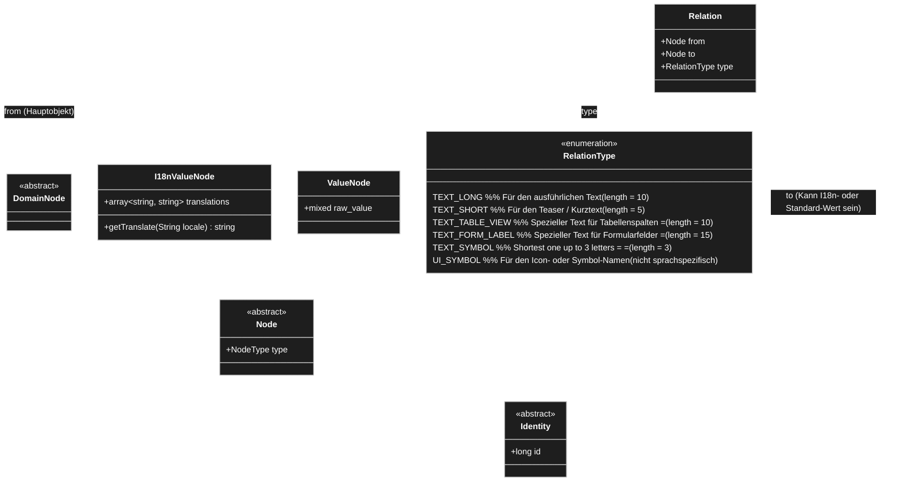

# Tree Concept


```mermaid
---
config:
  theme: dark
  themeVariables:
    mainBkg: "#1e1e1e"
    background: "#1e1e1e"
    primaryColor: "#1e1e1e"
    classText: "#ffffff"
    textColor: "#ffffff"
    lineColor: "#ffffff"
---

classDiagram
    direction TD

    class Identity {
        <<abstract>>
        +long id
    }

    class Node {
        <<abstract>>
        +NodeType type
    }

    class DomainNode {
        <<abstract>>
    }

    class I18nValueNode {
        +array~string, string~ translations
        +getTranslate(String locale) string
    }

    class ValueNode {
        +mixed raw_value
    }

    class Relation {
        +Node from
        +Node to
        +RelationType type
    }

    class RelationType {
        <<enumeration>>
        TEXT_LONG          %% Für den ausführlichen Text (length = 10)
        TEXT_SHORT         %% Für den Teaser / Kurztext (length = 5)
        TEXT_TABLE_VIEW    %% Spezieller Text für Tabellenspalten = (length = 10)
        TEXT_FORM_LABEL    %% Spezieller Text für Formularfelder = (length = 15)
        TEXT_SYMBOL 	   %% Shortest one up to 3 letters =  = (length = 3)
        UI_SYMBOL          %% Für den Icon- oder Symbol-Namen (nicht sprachspezifisch)
    }

    %% Vererbungen
    Node --|> Identity
    DomainNode --|> Node
    I18nValueNode --|> Node
    ValueNode --|> Node
    Relation --|> Identity

    %% Beziehungen
    Relation "0..*" --> "1" DomainNode : from (Hauptobjekt)
    Relation "0..*" --> "1" Node : to (Kann I18n- oder Standard-Wert sein)
    Relation "1" --> "1" RelationType : type
```

```PHP


```