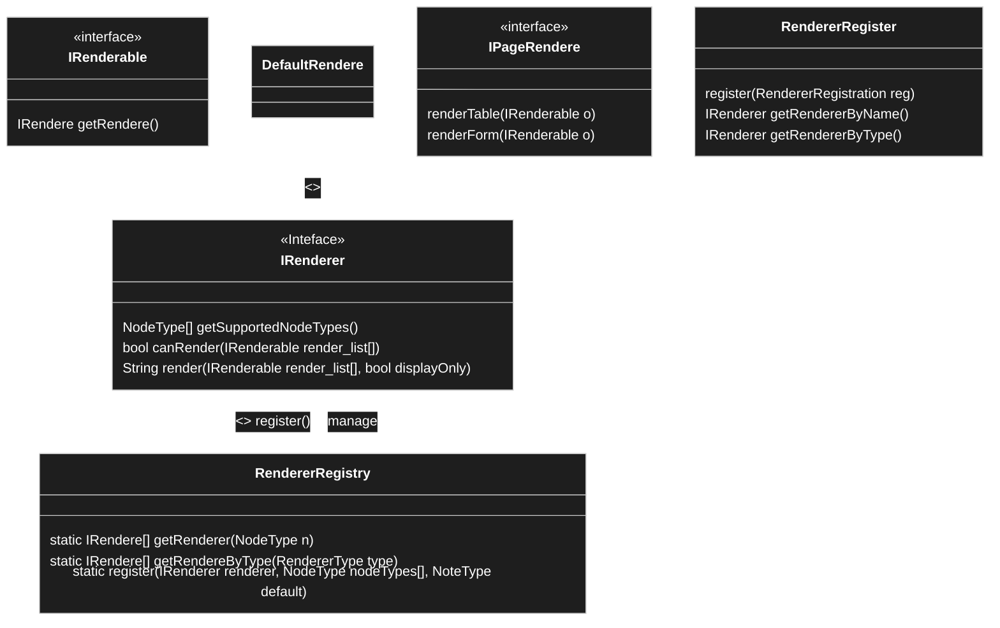

# Rendere Concept

## RenderRegistry


```PHP
// File: render.php
<?php 
declare(strict_types=1);
class RendererRegistry implements IRenderer{
	static function register(IRender rendere, )
	static function render(IRenderable ra){
		
	}
	
	static function render(IRendable object, displayOnly){
				
	}
	public static function renderList(){
	
	}
	public static function renderSingle(){

	}
	
}

/** default rendere it is also the fallback if no rendere can be found
*/
class DefaultRenderer implements IRenderer {
	
	
	
		renderCollection(IRenderable render_list[]);
		renderSingle(IRenderable object);
	
}
```

```PHP
/** file int renderer 
*/
import { Spinner } from '@wordpress/components';
class IntRenderer implementsIRenderer {
	
	bool renderSingle(IRenderable object, bool display){
		
	
		if (object instanceof IntNode){
			IntNode node =(IntNode) object;
			int value = node.getValue();
			int max = node.getMax();
			int min = node.getMin();
			int step = node.getStep();
		
		} else if (filter_var($value, FILTER_VALIDATE_INT) !== false) { // sting value as int
		
		} else if{
			echo "<div>int_renderer can not render object of class: "+object.getClass()+"</div>"; 
		}
	}
}

```

```PHP
// Boot Stapper File: <PluginName>.php
<?php 


```


