# Einstellungen — von null

**Diese Seite geht nicht vom Bestand aus.** Kein «heute», keine Beschlussnummern. Was hier steht, ist das
Grundgerüst des Eigentümers vom 2026-09-10 und darunter, Schritt für Schritt, was das Gerüst von der
Struktur verlangt — als Fragen, bis er sie beantwortet hat. Der Vergleich mit dem Bestand kommt danach
auf einer eigenen Seite.

---

## Das Grundgerüst — sein Text

> Einstellungen sind Attribute von programmierten Knotenklassen.
> Attribute können einfach oder komplex sein.
>
> Beispiel für einfache Attribute:
> - `read_only` — bool
> - `min` / `max` — int / double
> - `display_size` — int
>
> Beispiel für komplexe Attribute:
> - `Renderer` — Klasse vom Typ Renderer
> - `Validator` — Klasse vom Typ Validator
> - `Converter` — Klasse vom Typ Converter
>
> Komplexe Typen können wiederum Einstellungen haben:
> - `CompactRenderer` — `withLabel`, `horizontal` / `vertical`
> - `Converter` — to lower / to upper (gekünsteltes Beispiel)
>
> Es ist aber auch denkbar, dass komplexe Attribute wiederum komplexe haben — also wie in der
> Objektorientierung.
>
> Weiterhin kann es sein, dass nicht nur ein Attribut der gleichen Art, sondern eine Liste möglich ist:
> - eine Knotenklasse kann 1–n Renderer haben
> - ein Knoten kann 1–n Validatoren haben
>
> Im Grunde müssen wir mit den Einstellungen die Komplexität von Klassenattributen darstellen können,
> wie sie in der OO ist.
>
> Zudem wollen wir noch sagen: Es ist ja schön, dass ein Knoten Einstellungen hat — dessen Einstellungen
> möchte ich aber in der Relation, die diesen Knoten verwendet, überschreiben können.
>
> Zudem kommt, dass Kinder eines solchen Knotens die Einstellungsmöglichkeiten des Vaters erben und
> diese selbst setzen können.
>
> Ich denke aber, wenn wir das erste Problem gelöst haben, können wir das mit dem Überschreiben, neu
> Setzen an der Kante leicht lösen.

---

**Abgrenzung, sein Wort, 2026-09-11:** *«es geht hier immer nur um einstellungen und ausdrücklich
nicht um die felder — die bleiben wie gehabt. kante zu knoten, relation/composition, multiplizität
bleibt erhalten, wie sie ist. also: felder nicht gleich settings!»* Diese Seite handelt von
**Einstellungen** — den Attributen programmierter Klassen und ihren Werten. Das **Modell** — Knoten
im Baum, Kanten als Felder (Komposition, Aggregation), ihre Multiplizität, ihre Reihenfolge, ihre
Labels — ist nicht Gegenstand dieser Seite und ändert sich durch sie nicht. Wo die Seite unten
trotzdem ins Modell greift, ist das markiert: ⚠️ *Modell, nicht Einstellung.*

---

## Das erste Problem, in seiner Form: Klassenattribute wie in der OO

In der Objektorientierung hat eine Klasse Attribute; ein Attribut hat einen Typ; der Typ ist einfach
(bool, int, double, text) oder eine Klasse; ein Attribut kann eine Liste sein; ein Objekt trägt die
Werte. **Übertragen:**

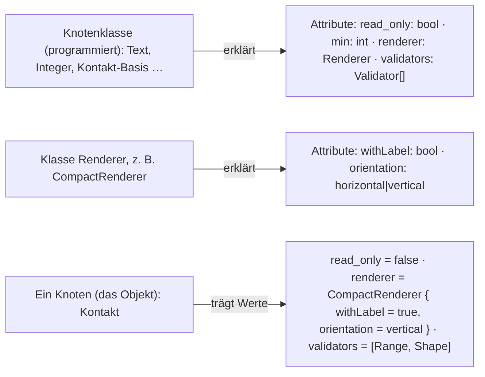

Drei Dinge, die es dafür geben muss, und je Ding die Frage, die er beantwortet:

### 1 · Die Erklärung: welche Klasse hat welche Attribute, in welchem Typ

*Die Klasse `Integer` erklärt `min` und `max` als int; die Klasse `Decimal` erklärt dieselben Namen als
double; die Klasse `CompactRenderer` erklärt `withLabel` als bool und `orientation` als eine Wahl aus
zwei Werten.*

- Die Erklärung ist **Kode** — sein erster Satz. **Frage 1a:** *Muss der Modellierer die Erklärung im
  Modell sehen können (als Zeile «dieser Knoten kennt `min`»), oder reicht es, dass die Maske sie beim
  Zeichnen aus der Klasse holt?* Das entscheidet, ob eine Erklärung eine Spur in der Datenbank hat.
- **Frage 1b:** *Erklärt ein Renderer seine Attribute selbst (`CompactRenderer` sagt «ich habe
  `orientation`»), oder erklärt die Knotenklasse sie stellvertretend?* In der OO ist es die Klasse des
  Attributs — das wäre der Renderer.

**Seine Antwort auf 1a, mit Beispiel:** *«der Knoten-Integer hat eine Klasse `integer_node`.
`integer_node` erbt von `node`. `node` hat das Attribut `renderers` vom Typ list of Renderer und
`read_only` vom Typ boolean. `integer_node` hat die Attribute `max` vom Typ int, `min` vom Typ int.
Alle diese Attribute sollten im Knoten-Integer zu sehen sein. Hierzu müsste man nur die Klasse
`integer_node` per Reflection parsen (zumindest geht das unter Java): jeder simple Typ bekommt eine
simple Einstellung, jede Klasse schachtelt tiefer.»*

**Das Beispiel als Bild — die Klassen:**

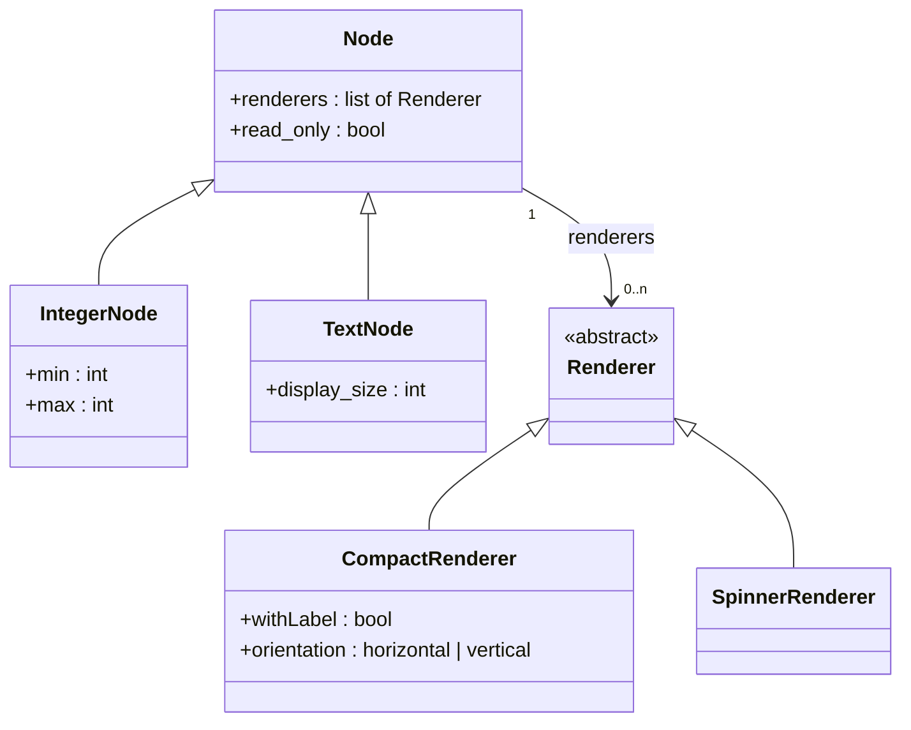

**Und dasselbe, wie der Knoten `Integer` es zeigt — per Reflection aus `IntegerNode`, geerbte
Attribute eingeschlossen, Klassen geschachtelt:**

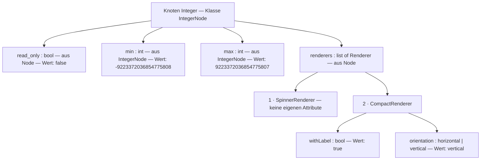

*Damit ist 1a beantwortet: **die Erklärung ist die Klasse, gelesen per Reflection** — nichts davon
braucht eine Spur im Modell, die Maske holt sie beim Zeichnen. Jeder simple Typ wird eine simple
Einstellung; jedes Attribut mit Klassentyp klappt eine Stufe tiefer auf, so tief die Klassen gehen. Ein
Attribut mit Listentyp zeigt seine Einträge nummeriert, jeder Eintrag mit seiner eigenen Klasse und
deren Attributen.* ⚠️ *Zur Umsetzbarkeit, gemessen an PHP: Reflection liest Klassenname, Eltern,
Attributnamen und deren Typen (`bool`, `int`, `Renderer`); **«list of Renderer» sagt PHP nicht von
selbst** — das steht in einer Docblock-Angabe oder einem Attribut an der Eigenschaft, das die
Reflection mitliest. Das ist eine Zeile je Liste, keine Grenze.*

*Und 1b folgt daraus ohne eigene Frage: der Renderer erklärt seine Attribute selbst, weil seine
Klasse sie hat — `CompactRenderer` hat `orientation`, `SpinnerRenderer` nicht.*

### 2 · Der Wert: was ein Knoten trägt

*Ein Knoten trägt je Attribut einen Wert. Ist das Attribut komplex, trägt er den Namen der Klasse
**und** deren Attributwerte. Ist es eine Liste, trägt er mehrere davon, in Reihenfolge.*

- Ein einfacher Wert ist eine Zeile: `Kontakt · read_only = false`.
- Ein komplexer Wert ist **ein Objekt**: `Kontakt · renderer = CompactRenderer` und darunter
  `withLabel = true`, `orientation = vertical`. **Frage 2a:** *Gehören die Werte des Objekts dem
  Knoten (flach, als weitere Zeilen von `Kontakt`) oder dem Objekt (ein eigener Satz «dieser eine
  CompactRenderer an Kontakt», auf den die Zeile `renderer` zeigt)?* Solange ein Knoten je Attribut
  **ein** Objekt hat, geht beides. **Sobald eine Liste zwei Objekte derselben Klasse hält** — zwei
  `Range`-Validatoren mit verschiedenem `min` —, geht nur noch das zweite: jedes Objekt braucht einen
  eigenen Ort für seine Werte. *Das ist die Stelle, an der die Liste die Speicherform entscheidet.*
- **Frage 2b:** *Darf eine Liste zwei Einträge derselben Klasse haben?* Wenn nein, reicht flach; wenn
  ja, braucht jeder Eintrag einen Satz.
- **Frage 2c:** *Wie tief?* «Komplexe haben wiederum komplexe» — ein Renderer, der einen Konverter
  hat, der eine Einstellung hat. Wenn jedes Objekt einen eigenen Satz hat, ist die Tiefe beliebig,
  ohne dass die Struktur wächst: ein Satz zeigt auf einen Satz. Flach hört bei einer Stufe auf.

**Seine Antwort auf 2b:** *«das kann ich pauschal nicht beantworten, ausser mit: der Knoten
entscheidet — in Java würde man das über eine Setter-Funktion regeln. Das Beispiel zwei gleiche
Validierer für Range ist nicht so gut gewählt, aber es könnte auch eine Liste von Strings oder Integern
sein, somit auch eine Liste von Komplexen. Und wenn man an typisierte Listen denkt: dann ja, es kann
mehrere des gleichen Typs haben — Liste vom Typ Vaterknoten, Einträge vom Typ der Kinder.»*

*Also: eine Liste ist typisiert über eine Klasse (`list of Renderer`), ihre Einträge sind Objekte von
deren Unterklassen (`Compact`, `Spinner`, `Compact`), und **ob zwei Einträge derselben Klasse erlaubt
sind, entscheidet die Klasse, die die Liste hat** — wie ein Setter. Die Struktur muss es können; die
Klasse darf es verbieten.* **Daraus folgen 2a und 2c ohne weitere Frage:**

- **2a — je Objekt ein eigener Satz.** *Zwei `Compact` in einer Liste mit verschiedener `orientation`
  können ihre Werte nicht flach am Knoten tragen, sonst wären sie ununterscheidbar. Also: ein
  komplexer Wert ist ein Satz, der seine Klasse nennt und seine Attributwerte hält; die Zeile am Knoten
  zeigt auf ihn. Ein einfacher Wert bleibt eine Zeile. Eine Liste einfacher Werte (Strings, Integer)
  sind mehrere Zeilen am selben Attribut, in Reihenfolge; eine Liste komplexer Werte sind mehrere
  Zeilen, die je auf einen Satz zeigen.*
- **2c — beliebig tief.** *Ein Satz zeigt auf einen Satz. Ein Renderer, der einen Konverter hat, der ein
  Attribut hat: drei Sätze, drei Stufen, dieselbe Form.*

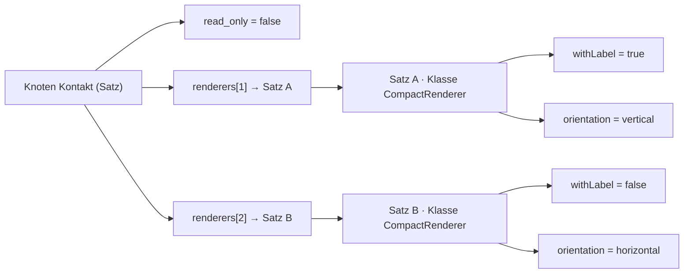

*Ein Objekt hat damit drei Dinge: den Satz, der es ist; die Klasse, die es nennt; die Zeile am Träger,
die auf es zeigt und seine Stelle in der Liste angibt.*

### 3 · Die Adresse: woran ein Wert hängt

*Jede Zeile muss sagen, zu welchem Attribut welcher Klasse sie gehört.* In der OO ist das der
Attributname innerhalb der Klasse. Hier: **Frage 3:** *Ist die Adresse ein Name (`orientation`) oder
eine Nummer, die das Modell für das Attribut vergibt?* Ein Name reicht, solange innerhalb eines
Objekts kein Name doppelt ist — und das ist in der OO so. Eine Nummer braucht es nur, wenn ein Name
an zwei Orten Verschiedenes heissen darf.

---

**Seine Antworten auf 2c und 3:** *«der Komplexität ist erstmal keine Grenze gesetzt; natürlich wird es
in der Realität nicht beliebig tief gehen. Man sollte auch als Programmierrichtlinie möglichst auf flache
Strukturen setzen.»* — *«Attributnamen sind nicht unbedingt eindeutig, aber wenn man den Klassennamen
hat: Klassenname + Attributname ist dann wieder eindeutig. Beispiel `int` / `double`, `min` / `max`.»*

*Also: **die Adresse eines Werts ist Klasse + Attributname.** Innerhalb eines Satzes ist die Klasse
bekannt — der Satz nennt sie —, darum trägt eine Zeile nur den Attributnamen; erst Satz und Zeile
zusammen sind die volle Adresse: `IntegerNode.min`, `DecimalNode.min`, `CompactRenderer.orientation`.
Das Format des Werts sagt die Klasse. Keine Nummer, die das Modell vergibt.* ⚠️ *Eine Folge, die
hierher gehört: wird ein Attribut im Kode umbenannt, ändert sich die Adresse — dann wandern die
Werte, wie bei jeder Kode-Änderung, die die Ablage berührt. Das ist der Preis dafür, dass der Kode die
einzige Erklärung ist, und er ist klein, solange die Richtlinie gilt: flach, und Namen nicht ohne Not
ändern.*

**Damit ist das erste Problem gelöst.** *Die Erklärung ist die Klasse (Reflection); ein Wert ist eine
Zeile; ein komplexer Wert ist ein Satz mit Klasse und Werten; eine Liste sind mehrere Zeilen in
Reihenfolge, komplex je auf einen Satz zeigend; die Adresse ist Klasse + Attributname; tief, so weit die
Klassen gehen, mit der Richtlinie «flach».*

## Kanten sind auch Klassen

⚠️ *Modell, nicht Einstellung — nachgetragen 2026-09-11:* **das Klassendiagramm unten führt
`multiplicity`, `hide` und `position` als Attribute der Kantenklasse. Das war der Übergang, den er
nicht bemerkt hat und ich nicht markiert habe: diese drei sind Eigenschaften des Felds (Modell),
keine Einstellungen.** Was von diesem Abschnitt für Einstellungen gilt, ist nur: eine Kante ist ein
Objekt einer Klasse, und Einstellungen des Zielknotens können an ihr überschrieben werden (Z1). Was
die Kante als Feld ist, bleibt wie gehabt.

**Sein Zusatz:** *«vielleicht sollte man hinzufügen, dass Kanten ja auch Klassen sind und für die das
Gleiche gilt.»*

*Also gilt das erste Problem für Kanten wörtlich: eine Kante ist ein Objekt einer programmierten
Klasse — `CompositionEdge`, `AggregationEdge` —, die Klasse erklärt ihre Attribute (`multiplicity`,
`hide`, `position` und was der Kode sonst an eine Kante schreibt), per Reflection gelesen; die Kante trägt
Werte in ihrem eigenen Satz; komplexe Attribute und Listen genauso wie am Knoten.*

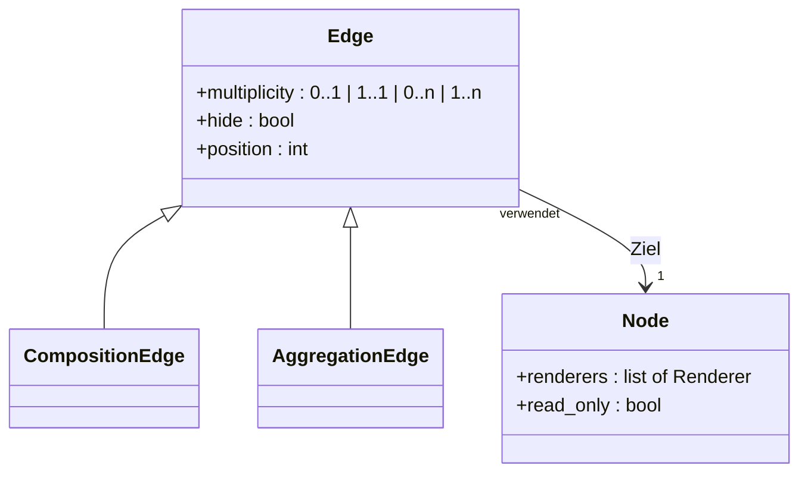

**Sein Halt, und er trennt zwei Dinge, die hier zuerst in einem Satz standen:** *«da vermischen wir
jetzt zwei Dinge: zum einen ist eine Kante eine Klasse und hat eigene Attribute; zudem soll sie später
die des Knotens überschreiben können. Wenn man es technisch sieht, müsste eine Kante in der GUI zuerst
die Kanten-Klasse parsen und dann über den To-Knoten die Knoten-Klasse — das erscheint aber
überdimensioniert, da der Knoten ja schon seine Einstellungen kennt und die Kante diese nur bei Bedarf
duplizieren müsste.»*

**Also zwei Dinge, getrennt:**

1. **Die eigenen Attribute der Kante** kommen aus ihrer Klasse — `CompositionEdge.multiplicity`,
   `.hide`, `.position` —, per Reflection, in ihrem Satz. Das ist das erste Problem, angewandt auf die
   Kante. *Fertig.*
2. **Das Überschreiben am Ziel** ist **kein zweites Parsen**: der Knoten kennt seine Einstellungen
   schon und zeigt sie aufgelöst. Ändert der Modellierer eine davon an der Kante, **dupliziert die Kante
   genau diesen einen Wert** in ihren Satz — unter der Adresse des Knotenattributs (`IntegerNode.max`),
   damit die Auflösung ihn dort findet. Die Kante erklärt nichts über den Knoten; sie hält eine Kopie,
   die gewinnt. Was sie nicht dupliziert hat, gilt weiter vom Knoten.

**Damit ist Z1 beantwortet, in seiner Form:** *ein Wert «an der Kante» ist ein bei Bedarf duplizierter
Wert des Knotens, im Satz der Kante, in derselben Zeilenform, mit der Adresse des Knotenattributs. Die
GUI liest eine Klasse — die der Kante — und nimmt die Einstellungen des Ziels, wie der Knoten sie
schon hat.*

## Das Datenmodell für eigene Attribute — Entwurf

**Sein Wort:** *«ich würde mich gerne erst einmal auf die eigenen Attribute konzentrieren, das ist schon
komplex genug. Überschreibung müssen wir aber klären, bevor wir ein Datenmodell definieren — oder
währenddessen.»*

*Also hier nur die eigenen Attribute von Knoten, Kanten und Objekten — mit einem Vorbehalt, der das
Überschreiben offenhält: **jede Zeile trägt ihre Adresse (Klasse + Attribut), nicht nur den
Attributnamen ihres Trägers.** Dann kann ein Satz später auch Werte zu einer fremden Klasse halten
(die Kante zum Ziel), ohne dass die Ablage sich ändert. Was «schlägt» heisst, entscheidet die
Auflösung, nicht die Tabelle.* Alles Weitere unten ist `INFERRED` — ein Entwurf zum Streichen.

### Zwei Dinge, die es geben muss

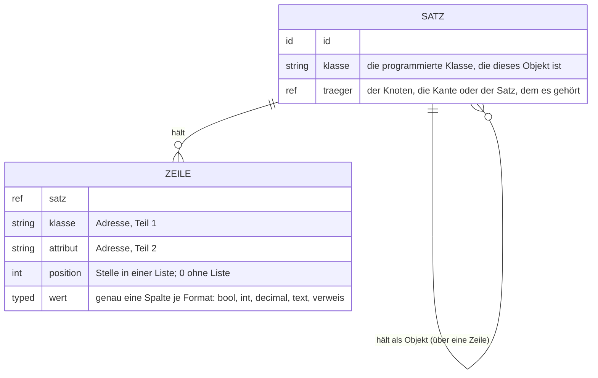

- **Ein Satz ist ein Objekt.** *Er nennt seine Klasse und wem er gehört: einem Knoten, einer Kante —
  oder einem anderen Satz, dann ist er ein komplexer Wert darin (2a).* `INFERRED`: **Knoten und Kanten
  haben je genau einen Satz für ihre eigenen Attribute**, angelegt beim ersten Wert, nicht vorher.
- **Eine Zeile ist ein Wert.** *Sie gehört einem Satz, trägt die Adresse (Klasse + Attribut, Frage 3), ihre
  Stelle in einer Liste (`position`, sonst 0) und den Wert in genau einer Spalte, die das Format des
  Attributs vorgibt. Ein komplexer Wert ist eine Zeile, deren Wert ein **Verweis auf einen Satz** ist.*
- **Eine Liste sind mehrere Zeilen derselben Adresse im selben Satz**, geordnet über `position`
  (2b): einfache Werte direkt, komplexe je als Verweis auf ihren Satz.

### Das Beispiel `Kontakt`, in Zeilen

| Satz | Klasse | gehört | Zeile: Klasse.Attribut | position | Wert |
|---|---|---|---|---|---|
| 1 | `ContactNode` | Knoten Kontakt | `Node.read_only` | 0 | `false` |
| 1 | | | `Node.renderers` | 1 | → Satz 2 |
| 1 | | | `Node.renderers` | 2 | → Satz 3 |
| 2 | `SpinnerRenderer` | Satz 1 | *(keine eigenen Attribute)* | | |
| 3 | `CompactRenderer` | Satz 1 | `CompactRenderer.withLabel` | 0 | `true` |
| 3 | | | `CompactRenderer.orientation` | 0 | `vertical` |
| 4 | `CompositionEdge` | Kante Kontakt → Strasse | `Edge.multiplicity` | 0 | `1..1` |
| 4 | | | `Edge.hide` | 0 | `false` |

*Und der Vorbehalt fürs Überschreiben, sichtbar an Satz 4: dort könnte später eine Zeile
`TextNode.display_size = 40` stehen — dieselbe Form, eine fremde Klasse in der Adresse. Ob sie gilt,
sagt die Auflösung.*

**Dasselbe Beispiel in Weg A** (entschieden 2026-09-11, siehe D1): *die Klasse steht am Knoten und
an der Kante, ihre Zeilen hängen direkt an ihnen; Sätze gibt es nur für die zwei Renderer.*

| Träger | Klasse | Zeile: Klasse.Attribut | position | Wert |
|---|---|---|---|---|
| Knoten Kontakt | `ContactNode` | `Node.read_only` | 0 | `false` |
| Knoten Kontakt | | `Node.renderers` | 1 | → Satz 1 |
| Knoten Kontakt | | `Node.renderers` | 2 | → Satz 2 |
| Satz 1 | `SpinnerRenderer` | *(keine eigenen Attribute)* | | |
| Satz 2 | `CompactRenderer` | `CompactRenderer.withLabel` | 0 | `true` |
| Satz 2 | | `CompactRenderer.orientation` | 0 | `vertical` |
| Kante Kontakt → Strasse | `CompositionEdge` | `Edge.multiplicity` | 0 | `1..1` |
| Kante Kontakt → Strasse | | `Edge.hide` | 0 | `false` |

*Zwei Sätze statt vier, und der Knoten `Kontakt` ist selbst sein Objekt.*

### Was das Modell **nicht** braucht, und warum

| nicht nötig | weil |
|---|---|
| eine Tabelle, die Attribute **erklärt** | die Klasse erklärt (1a); Reflection liest sie beim Zeichnen |
| eine Nummer je Attribut | Klasse + Name ist die Adresse (3) |
| eine eigene Tabelle je Liste oder je Tiefe | Liste = `position`, Tiefe = Satz zeigt auf Satz (2b, 2c) |
| ein Unterschied zwischen «Einstellungssatz» und «Objektsatz» | jeder Satz ist ein Objekt seiner Klasse; der Knoten ist eines, der Renderer darin ist eines |

### Offen, bevor das Datenmodell steht — seine Fragen

#### D1 · Ist der Knoten selbst der Satz, oder hat er einen?

**D1 —** — *sein Wort: «ist mir zu kurz, verstehe
ich nicht»*, darum hier ausführlich:

*Ein Knoten ist ein Objekt seiner Klasse (`ContactNode`). Seine Werte — `read_only = false`, die zwei
Renderer — sind Zeilen. Die Frage ist nur: **woran hängen diese Zeilen?***

**Weg A — der Knoten ist selbst der Satz.** *Die Knotenzeile trägt die Klasse; die Wertzeilen zeigen
direkt auf den Knoten. Kein zweiter Satz.*

| Knoten | Klasse | | Zeile gehört | Klasse.Attribut | Wert |
|---|---|---|---|---|---|
| Kontakt (#27) | `ContactNode` | | **Knoten #27** | `Node.read_only` | `false` |
| | | | **Knoten #27** | `Node.renderers` (1) | → Satz 2 |
| | | | Satz 2 | `CompactRenderer.orientation` | `vertical` |

*Dann hängt eine Zeile mal an einem Knoten, mal an einer Kante, mal an einem Satz — drei Sorten
Träger, und die Zeile muss sagen, welche Sorte ihr Träger ist. Dafür gibt es keine Tabelle mehr
zwischen Knoten und Wert.*

**Weg B — der Knoten hat einen Satz.** *Die Knotenzeile bleibt, was sie ist (Name, Vater, Stelle im
Baum). Ein Satz sagt «ich bin das Objekt `ContactNode` von Knoten #27», und die Wertzeilen hängen am
Satz — wie bei jedem anderen Objekt auch.*

| Knoten | | Satz | Klasse | gehört | | Zeile gehört | Klasse.Attribut | Wert |
|---|---|---|---|---|---|---|---|---|
| Kontakt (#27) | | **1** | `ContactNode` | Knoten #27 | | Satz 1 | `Node.read_only` | `false` |
| | | | | | | Satz 1 | `Node.renderers` (1) | → Satz 2 |
| | | 2 | `CompactRenderer` | Satz 1 | | Satz 2 | `CompactRenderer.orientation` | `vertical` |

*Dann hängt **jede** Zeile an einem Satz, und nur Sätze wissen, wem sie gehören (Knoten, Kante oder
Satz). Ein Knoten ohne Werte hat keinen Satz; er entsteht beim ersten Wert. Der Preis ist eine Zeile
mehr je Knoten, der Werte trägt — der Gewinn ist, dass Zeile → Satz die einzige Verbindung ist und
Knoten, Kante und Objekt in der Ablage gleich aussehen.*

**Dasselbe für die Kante:** *Weg A — die Kantenzeile trägt die Klasse (`CompositionEdge`), ihre Werte
hängen an ihr. Weg B — die Kante hat einen Satz.*

**Das Datenmodell zu Weg A** — *die Zeile kennt drei Sorten Träger; ein Satz gibt es nur für
Objekte, die in einem Attribut stecken:*

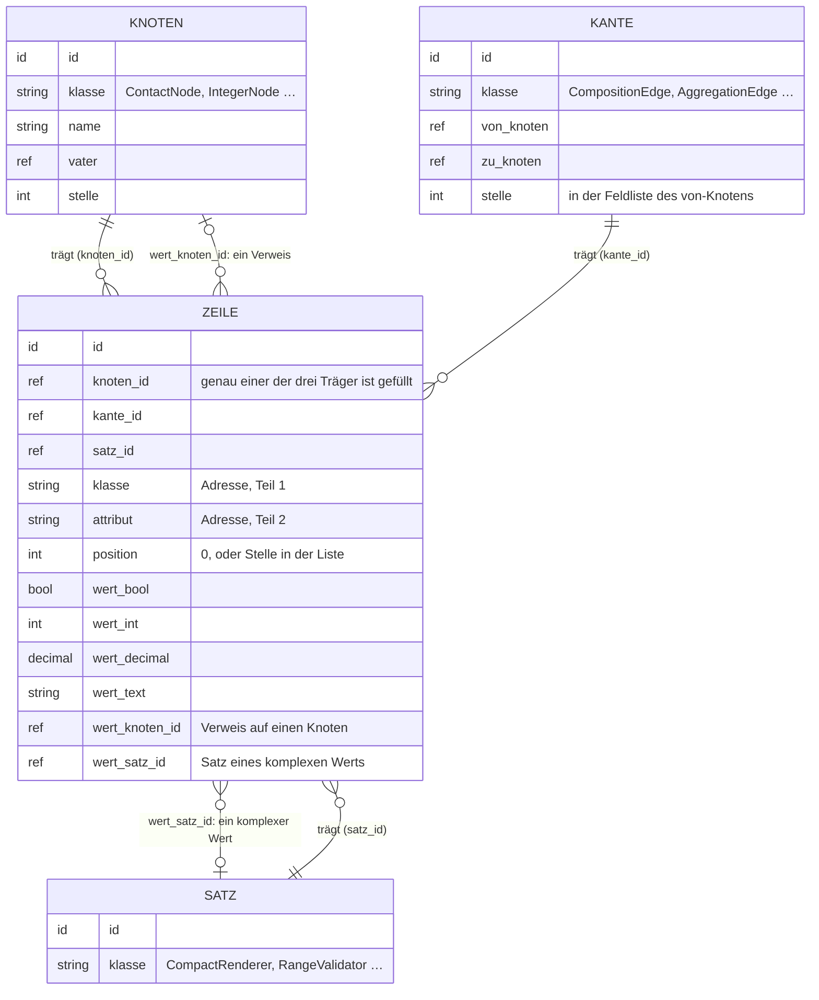

**Das Datenmodell zu Weg B** — *jede Zeile hängt an einem Satz; nur der Satz kennt seinen Träger:*

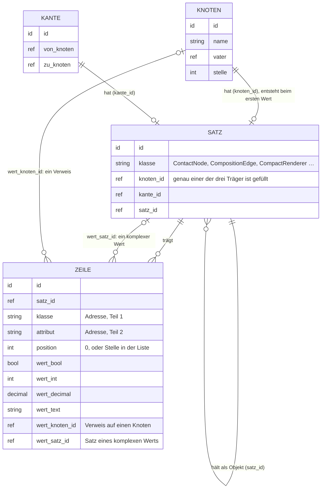

*Der eine sichtbare Unterschied: in A steht die Klasse am Knoten und an der Kante, die Zeile hat
die drei Trägerspalten; in B steht die Klasse nur am Satz, die Zeile hat nur `satz_id`. In A gibt es
Sätze nur für Objekte in Attributen, in B für alles, was Werte trägt.*

**Id-Räume — beantwortet, 2026-09-11.** Gefragt war, ob Knoten, Kanten und Sätze wieder einen
gemeinsamen Id-Raum bekommen, damit ein Verweis allein sagt, was er meint. Sein Wort: *«wenn wir nur
auf schlüssel setzen — und die anzahl von fremdschlüsseln ist aktuell begrenzt, und nicht auf
id-typ-kombinationen — können wir das über die relationen über die datenbank sicherstellen. das finde
ich einen grossen vorteil. dann brauchen wir auch keinen gemeinsamen raum, jede tabelle kann ihren
eigenen schlüsselzähler haben.»*

*Was daraus folgt, und oben in beiden Diagrammen schon eingetragen:*

- **Jede Tabelle zählt für sich.** Kein gemeinsamer Raum, keine Vergabestelle, kein Ausbluten.
- **Ein Verweis ist eine Spalte je Zieltabelle**, nie ein Paar aus Art und Nummer. Wer drei Sorten
  Träger haben kann, hat drei Spalten (`knoten_id`, `kante_id`, `satz_id`), und genau eine ist
  gefüllt. Ein Wert, der auf einen Knoten oder auf einen Satz zeigen kann, hat `wert_knoten_id` und
  `wert_satz_id`.
- **Die Datenbank prüft jeden Verweis** als Fremdschlüssel. Eine Zeile, die auf etwas zeigt, das es
  nicht gibt, kann nicht entstehen. Das ist der Vorteil, den er meint.
- **Die Zahl der Spalten ist endlich und bekannt**, weil die Zahl der Zieltabellen es ist: drei.

Der Entwurf oben nahm Weg B an (`INFERRED`), weil er eine Verbindung statt drei hat.
**Entschieden, 2026-09-11: Weg A.** Sein Wort: *«d1 = a»*. Die Klasse steht am Knoten und an der
Kante; ihre Wertzeilen hängen direkt an ihnen; einen Satz gibt es nur für Objekte, die in einem
Attribut stecken (Renderer, Umrechnung). Der Grund, der es gekippt hat: seit K1a hat **jeder** Knoten
eine Klasse, nicht nur die mit Werten — in Weg B hätte jeder Knoten einen Satz nur dafür gebraucht.
*Das Beispiel `Kontakt` oben ist in Weg-A-Form unten neu geschrieben.*
**Seine Teilantwort zu D1, 2026-09-10 abends — der Rest morgen:** *«eine Kante hat genau eine Klasse,
entweder eine eigene oder sie erbt sie beim Anlegen, aber immer genau nur eine. Das Gleiche gilt für
Knoten. Aber Knoten- und Kantenklassen sind unterschiedlich: Knoten haben nur Knotenklassen, Kanten nur
Kantenklassen. Alles Weitere zu dem Punkt morgen — noch nichts vollständig beantwortet.»*

*Festgehalten, was daraus für beide Wege gilt: **je Knoten und je Kante genau eine Klasse**, beim
Anlegen eigen oder geerbt, danach fest; **zwei getrennte Klassenwelten**, eine für Knoten, eine für
Kanten — eine Klasse ist nie beides. Ob die Klasse am Knoten steht (Weg A) oder am Satz (Weg B), ist
damit noch nicht entschieden.*

#### D2 · Was ist der Wert einer Wahl aus Kindern

**D2 —** was ist der Wert einer Wahl (`orientation` = einer von zwei; `label_role` = eine
  von fünf Rollen, die Modellknoten sind)? *Ein Text (`'vertical'`) oder ein Verweis auf den Knoten
  (`→ Rolle symbol`)?* Beides passt in die Zeile; die Klasse müsste sagen, welches.

**Beantwortet, 2026-09-11, in zwei Hälften — die Klasse sagt es, über den Typ des Attributs:**

- **Steht ein Knoten hinter der Wahl** (`label_role` → Rolle, `erlaubte_praefixe` → Konstante), ist
  der Wert ein **Verweis** (`wert_knoten_id`). Siehe K2.
- **Steht keiner dahinter**, ist es ein **Enum oder ein bool** — sein Wort: *«orientation ist attribut
  von verschiedenen renderern; könnte enum sein, oder wenn wir wirklich nur horizontal/vertikal
  haben, ist es ein bool.»* Ein Enum ist im Code erklärt (Reflection liest die Fälle), abgelegt als
  Text in `wert_text`; ein bool in `wert_bool`. Ein Text ohne Enum dahinter gibt es für eine Wahl
  nicht.

*Nebenbei gesagt: `orientation` gehört mehreren Renderern. Das ist kein Sonderfall — jede Klasse
erklärt das Attribut für sich, die Adresse `Klasse.Attribut` hält sie auseinander (Frage 3 oben).*
#### D3 · Versionen und Schatten

**D3 —** gilt für Sätze und Zeilen dasselbe wie heute für alles (jede Version
  bleibt, Löschen ist Wandern)? *Der Entwurf lässt es weg, weil es nichts an der Form ändert.*

**Beantwortet, 2026-09-11 — ja.** Sein Wort: *«versionierung sollten wir beibehalten, mit den
entsprechenden schatten.»* Sätze und Zeilen bekommen also je eine Schattentabelle wie Knoten und
Kanten; jede Version bleibt, Löschen ist Wandern. Das ändert nichts an der Form oben.

#### D4 · Der Vertrag — die Erklärung wird einmal gelesen, nicht bei jedem Zeichnen

**Sein Vermerk zu D3, 2026-09-11:** *«kurzer vermerk: per reflektion — das kostet, das überall zu
lesen. der knoten sollte einen vertrag haben, der einmal bestimmt wird, und es wird nur der vertrag
gelesen. bei änderung der klasse muss auch der vertrag angepasst werden. aber ich denke, das hast du
schon so angedacht — oder wegen PHP?»*

**Ehrlich: nein, so weit war der Entwurf nicht.** Oben steht *«die Maske holt sie beim Zeichnen»* —
das ist Reflection bei jedem Zeichnen, und er hat recht, dass das kostet. Es liegt nicht an PHP;
PHP kann beides. Der Vertrag ist der bessere Schnitt, und er hat zwei Formen:

- **Von Hand geschrieben:** die Klasse trägt ihre Attributliste ausdrücklich (Name, Typ, Liste
  ja/nein, erlaubte Kindklassen, Vorwahl). Reflection entfällt ganz. Ändert sich die Klasse, ändert
  der Programmierer den Vertrag mit — *«bei änderung der klasse muss auch vertrag angepasst werden»*
  liest sich so. Preis: eine Stelle, die man vergessen kann; Gewinn: der Vertrag ist lesbar, ohne die
  Klasse zu verstehen (PR-13).
- **Einmal abgeleitet:** Reflection läuft genau einmal je Klasse, das Ergebnis ist der Vertrag und
  wird gehalten. Nichts kann vergessen werden; dafür muss etwas wissen, wann die Klasse sich geändert
  hat.

**D4a — entschieden, 2026-09-11: einmal abgeleitet.** Sein Wort: *«einmal abgeleitet — manuell
kann das nur eine KI 😉».* Reflection läuft also genau einmal je Klasse, das Ergebnis ist der
Vertrag und wird gehalten; **gelesen wird nur der Vertrag**, nie die Klasse. Der Vertrag ist Code,
kein Modell — er steht nirgends in einer Tabelle. *Was noch zu klären ist, aber erst beim Bauen:
woran der Vertrag merkt, dass die Klasse sich geändert hat (Plugin-Version, oder Dateistand).*
#### Z2–Z4 · das Überschreiben

siehe unten — «Überschreiben, zum Denken» mit Beispielen; die Form hält es offen.

## Das zweite Problem, das er hintanstellt: Überschreiben an der Kante, Erben an Kindern

*«Wenn wir das erste Problem gelöst haben, können wir das leicht lösen.»* — Was dafür festzuhalten ist,
damit die Lösung des ersten es nicht verbaut:

- **Ein Wert hat einen Ort:** am Knoten, oder an der Kante, die den Knoten verwendet. Beide Orte tragen
  dieselbe Form (Frage 2a gilt für beide).
- ~~**Ein Kind erbt die Attribute des Vaters** — die Erklärung — **und darf Werte setzen.** Was es nicht
  setzt, gilt vom Vater.~~ **Überholt, 2026-09-11:** *«vererbung von knoten-settings in knoten ist
  grundsätzlich raus»* — die Erklärung kommt aus der **Klasse** des Kindes, nicht vom Vaterknoten;
  Werte kommen vom Kind selbst oder aus dem Vertrag, nie vom Vater. Siehe «Der Schritt zurück».
- **Die Kante schlägt den Knoten.** ~~das Kind schlägt den Vater.~~ Für ein komplexes Attribut heisst das:
  *schlägt die Kante das ganze Objekt (anderer Renderer) oder auch einen einzelnen Wert darin
  (`orientation` anders, Renderer gleich)?* — die Antwort folgt aus Frage 2a: gehören die Werte dem
  Objekt, wird das Objekt überschrieben; sind sie flach, kann jeder einzeln überschrieben werden.

### Überschreiben, zum Denken — Z3 und Z4 mit Beispielen

*Sein Wunsch, 2026-09-11: «beschreibe Z3/Z4 mal genauer, brauche was zum denken, mit beispielen».
Nichts hier ist entschieden; es sind Fälle und die Wege, die je Fall offenstehen.*

**Was schon feststeht, und woran die Beispiele hängen:**

- Alle Knotenattribute sind an der Kante überschreibbar (Regel unten), einzeln, weil sie flach sind.
- Ein Wert an der Kante ist eine Zeile mit der Adresse des Knotenattributs (`TextNode.converter`),
  bei Bedarf dupliziert (Z1). Ein komplexer Wert an der Kante ist ein eigener Satz an der Kante.
- Beim Lesen gilt eine **Reihenfolge**: zuerst die Kante, dann der Zielknoten, dann dessen Vater,
  und so weiter bis zum Vertrag der Klasse, der die Vorgabe kennt. Der erste, der etwas sagt, gilt.
  **Seit dem Schritt zurück (unten) ohne die Stufe «Vater»:** Kante → Zielknoten → Vertrag.

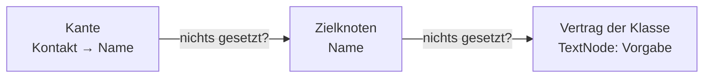

*Für einen einzelnen Wert ist damit alles klar: `display_size` an der Kante 40, am Knoten 20, im
Vertrag 30 — es gilt 40. Die Fragen beginnen bei **Listen** (Z3) und beim **Kind** (Z4).*

---

**Z3 · Listen.** Der Knoten `Text` hat die Konverterliste `[to_upper]`. Die Kante `Kontakt → Name`
verwendet ihn und will etwas anderes. Drei Wünsche, die vorkommen:

| Wunsch an der Kante | soll gelten |
|---|---|
| «zusätzlich noch trimmen» | `[to_upper, trim]` |
| «nur trimmen, nicht gross» | `[trim]` |
| «gar nichts umwandeln» | `[]` |

Und drei Wege, wie die Kante das sagen könnte:

- **Weg E · Ersetzen.** Sobald die Kante **eine** Zeile zu `converter` hat, gilt nur ihre Liste; die
  des Knotens ist unsichtbar. Für «zusätzlich trimmen» muss die Kante `to_upper` **noch einmal**
  hinschreiben. Für «gar nichts» braucht sie eine leere Liste, die es als Zeile nicht gibt — also eine
  Zeile, die «leer» bedeutet, oder ein Schalter «Liste des Knotens nicht übernehmen».
- **Weg G · Ergänzen.** Die Zeilen der Kante kommen **hinter** die des Knotens. «Zusätzlich trimmen»
  ist eine Zeile. «Nur trimmen» geht nicht, weil `to_upper` nicht wegzunehmen ist — es sei denn, es
  gibt eine **Abwahl**: eine Zeile, die auf den Eintrag des Knotens zeigt und «nicht» sagt. «Gar
  nichts» wäre dann eine Abwahl je geerbtem Eintrag.
- **Weg E+G · Ersetzen mit Übernahme.** Die Kante hat ihre eigene Liste (wie E), und ein Eintrag
  darin kann **«die Liste des Knotens hier einfügen»** heissen. `[trim]` ist «nur trimmen»;
  `[Knotenliste, trim]` ist «zusätzlich trimmen»; eine leere Liste ist «gar nichts». Ein einziger
  Sondereintrag, keine Abwahl, kein Schalter — dafür muss die Kante die Reihenfolge selbst setzen
  (erst gross, dann trimmen, oder umgekehrt).

*Dasselbe für die zwei anderen Listen: **Renderer** (`Kontakt` hat `[Spinner, Compact]`, eine
Kante will nur `[Compact]` — E oder E+G passt, G nur mit Abwahl) und **Validatoren** (`Alter` hat
`[Bereich 0–150]`, die Kante «Alter des Kindes» will `[Bereich 0–18]` — hier ist es kein
Listenproblem, sondern Z2: der Validator bleibt, nur `max` im Satz wird an der Kante neu gesetzt, und
dafür dupliziert die Kante den Validatorsatz mit dem einen geänderten Wert).*

**Was das Datenmodell je Weg braucht:** E — nichts Neues, nur die Regel «Kante hat Zeilen → Knoten
wird nicht gelesen» **je Attribut**, plus eine Form für «leer». G — eine Zeile, die «Abwahl von
Eintrag X» bedeuten kann (ein Verweis auf die Knotenzeile mit einem Vorzeichen). E+G — ein Eintrag
«Knotenliste», der weder Verweis noch Satz ist: eine Zeile mit der Adresse und ohne Wert, an der
Stelle, wo die Liste des Knotens eingesetzt wird.

---

**Z4 · Das Kind gegenüber dem Vater.** `Integer` → `Hausnummer` (`min` 1, `max` 999) → darunter
ein Kind `Hausnummer klein` (`max` 99). Und `Text` (`[to_upper]`) → Kind `Name` (will `[to_upper,
trim]`).

**Dieselbe Frage wie Z3**, weil das Kind die Liste des Vaters auch ersetzen, ergänzen oder abwählen
könnte. Wenn für das Kind **dasselbe gilt wie für die Kante**, ist die Reihenfolge oben schon die
Antwort: Kante → Knoten → Vater → … → Vertrag, und jede Stufe verhält sich zur nächsten wie die Kante
zum Knoten. Eine Regel, eine Auflösung.

**Aber ein Unterschied, der eine eigene Entscheidung verlangt — lebendig oder kopiert:**

- **Lebendig:** das Kind hat nur die Zeilen, die es selbst gesetzt hat (`max` 99). Ändert jemand am
  Vater `min` auf 0, hat das Kind sofort `min` 0. Das Kind ist dünn, die Auflösung tut die Arbeit —
  genau wie die Kante.
- **Kopiert:** beim Anlegen bekommt das Kind alle Werte des Vaters als eigene Zeilen (`min` 1, `max`
  999), dann ändert es `max`. Der Vater ist danach nur noch die Herkunft; eine Änderung dort erreicht
  das Kind nicht mehr. Das Kind ist dick, dafür steht alles an einer Stelle.

*Die Kante ist immer lebendig — sie soll ja den Knoten zeigen, wie er heute ist. Beim Kind kann man
beides wollen: `Hausnummer klein` soll wohl mit `Hausnummer` mitgehen (lebendig); ein Kind, das man
angelegt hat, um sich vom Vater **abzusetzen**, will vielleicht nicht, dass der Vater es nachträglich
umbaut. Sein Wort von früher dazu: «kinder eines solchen knotens erben die einstellungsmöglichkeiten
des vaters und diese selbst setzen können» — das ist die **Erklärung** (lebendig, aus dem Vertrag);
zu den **Werten** sagt es nichts.*

**Die zwei Fragen, die Z4 also stellt:**

- **Z4a** — Gilt für Kind → Vater dieselbe Listenregel wie für Kante → Knoten (E, G oder E+G, aber
  dieselbe)?
- **Z4b** — Erbt das Kind Werte **lebendig** oder **kopiert** beim Anlegen?

**Z4 — beantwortet durch den Schritt zurück, 2026-09-11:** beide Fragen fallen weg. Ein Kind erbt
**keine Werte** vom Vaterknoten, weder lebendig noch kopiert; es hat seine Klasse, deren Vertrag die
Vorgaben liefert, und seine eigenen Zeilen. `Hausnummer klein` setzt `max` 99 selbst, `min` 1 muss
es ebenfalls selbst setzen oder bekommt die Vorgabe aus dem Vertrag von `Integer`. Es gibt nur
**eine** Überschreibung im Modell: die Kante über den Knoten.

---

### Der Schritt zurück — was zwischen Knoten vererbt wird, und was nicht

**Sein Wort, 2026-09-11:** *«vielleicht nochmal einen kleinen schritt zurück, sollte sich aber in
das schon beschlossene einfügen: vererbung von knoten-settings in knoten ist grundsätzlich raus. jeder
knoten hat eine klasse, klasse liefert settings. es gibt abhängigkeiten, welche knotenklassen bei
kindknoten erlaubt sind, plus eine ist default. knotenklassen können natürlich voneinander erben.
(vererbung von feldern bleibt bestehen, aber wie in OO.) kategorieknoten sind eigentlich überall
möglich und somit vielleicht der standard, bis der benutzer etwas anderes auswählt. besonderheiten
sind simple-datentyp-knoten: da ist es jeweils der gleiche typ für kindknoten-typ-default. das
gleiche bei selection-typen: da ist der default Konstante-class.»*

**Es fügt sich ein — und es räumt auf.** Vier Sätze, die jetzt gelten:

| | vererbt sich | von wem nach wem | wie |
|---|---|---|---|
| **Erklärung** (welche Attribute) | ja | Klasse → Unterklasse | im Code, wie in der OO |
| **Werte** (Einstellungen) | **nein** | ~~Vaterknoten → Kindknoten~~ | — ; nur die Kante überschreibt den Knoten |
| **Felder** (Kompositionen) | ja | Vaterknoten → Kindknoten | wie in der OO: `Firmenkontakt` unter `Kontakt` hat `Name`, `Strasse` |
| **erlaubte Kindklassen + Vorwahl** | — | Klasse des Vaters → Kind beim Anlegen | aus dem Vertrag |

**Die Vorwahl je Klasse, wie er sie nennt:**

- **Kategorie** — überall erlaubt, und **die Vorwahl, wo nichts anderes gilt**. Ein neuer Knoten ist
  eine Kategorie, bis jemand etwas anderes wählt.
- **Simpler Datentyp** (`Integer`, `Text`, …) — Kinder sind vom **gleichen Typ**, das ist die Vorwahl.
- **Auswahl** (`Prefixes`, `Basiseinheit`) — Kinder sind **Konstanten**, das ist die Vorwahl.

*Was das an den Beispielen oben ändert: die Auflösungskette hat keine Stufe «Vater» mehr (Kante →
Knoten → Vertrag); Z4 fällt; K1c ist damit vollständig. Das Wort «erben» im Gerüst («kinder erben
die einstellungsmöglichkeiten des vaters») meint die **Erklärung** über die gleiche Klasse — nicht
Werte.*

**Z3 — beantwortet, 2026-09-11: Ergänzen, mit änderbarer Reihenfolge.** Sein Wort: *«Z3: ergänzen
würde ich sagen, aber die reihenfolge muss änderbar sein — beispiel: trimmen zuerst.»* Die Zeilen der
Kante kommen zur Liste des Knotens hinzu, und die Kante bestimmt die Reihenfolge der **ganzen** Liste,
auch der geerbten Einträge. *Was das im Datenmodell heisst (`INFERRED`): die Kante hält je geerbtem
Eintrag, den sie umstellt, eine Zeile mit dessen Adresse und einer eigenen `position`, aber ohne
Wert — der Wert bleibt am Knoten. Steht keine solche Zeile, bleibt der Eintrag an seiner Stelle vor
den Kantenzeilen.*

**Z3a — beantwortet, 2026-09-11: ja, mit einem Haken.** Sein Wort: *«ja — standard aktiv, haken
raus: nicht mehr aktiv.»* Jeder geerbte Eintrag steht an der Kante mit einem Haken, der von Haus aus
gesetzt ist; nimmt man ihn heraus, gilt der Eintrag an dieser Kante nicht. Im Modell ist das
dieselbe Zeile wie beim Umstellen — Adresse des Eintrags, eigene `position`, kein Wert — mit einem
Schalter `aktiv`. Fehlt die Zeile, ist der Eintrag aktiv und an seiner Stelle. *Ob das in der Maske
ein Haken oder ein Schalter ist, ist Zeichnung, nicht Modell — sein Nachsatz: «haken raus kann auch
schalter sein 😉».*

---

## Die Attribute selbst — welche es gibt, und wo sie wohnen

Der Entwurf oben sagt, **wie** ein Attribut abgelegt wird. Hier steht, **welche** es überhaupt
gibt. Ausgangspunkt war die heutige Liste (dieselbe für Knoten und Kanten, mit zwei Ausnahmen), und
seine erste Verfeinerung dazu, 2026-09-11: *«default ist ein datensatz, sollte es nicht mehr geben.
read_only braucht es, glaube ich, nur an der kante. min, max, step: eigenschaften des knotens, an
der kante überschreiben. icon sollte eigentlich teil der labels sein, könnte aber auch zurück in
settings, wo es vielleicht besser aufgehoben ist.»*

| Attribut | am Knoten | an der Kante | Stand |
|---|---|---|---|
| `default` | — | — | **fällt.** Ein Vorgabewert ist ein Datensatz der Art `default`, kein Attribut. |
| `read_only` | — | — | **fällt aus der Liste: Feldeigenschaft**, Spalte der Kante, Modell (siehe «Die Kante trägt keine Einstellungen») |
| `min`, `max`, `step` | eigen | überschreibt | **Knoten besitzt, Kante überschreibt** |
| `icon` | — | — | **fällt aus der Liste: wohnt in den Labels**, als Deko |
| `converter`, `validator`, `renderer` | eigen | überschreibt | **Knoten besitzt, Kante überschreibt** |
| `display_size` | eigen, **alle Knoten** | überschreibt | **Knoten besitzt, Kante überschreibt** |
| `factor`, `offset` | eigener Knoten | — | **wahrscheinlich ein eigener Knoten** mit Faktor und Offset — für Präfixe, aber auch für Umrechnungen wie Temperatur |
| `multiplicity` | — | **Spalte** | **nur an der Kante**, als Spalte der Kantentabelle (siehe «Spalte statt Zeile») |
| `position` | — | — | **kein Attribut, sondern Struktur:** die Spalte `stelle` am Knoten (unter seinem Vater) und an der Kante (in der Feldliste) |

*Seine dritte Verfeinerung, 2026-09-11: «positionen haben wir viele: die der kante in der feldliste,
die position der knoten unter ihren vätern. icon wohnt in labels, ist zusätzliche deko, wird aktuell
nur im baum verwendet. im grunde könnte jede klasse ein eigenes icon haben, dann könnte man dem
knoten ansehen, was er ist — aber das ist nur philosophiert.»*

*Was daraus folgt: **`position` ist keine Einstellung.** Es ist je eine Spalte an dem Ding, das
geordnet wird — `stelle` am Knoten für die Reihe unter dem Vater, `stelle` an der Kante für die Reihe
in der Feldliste (beides oben in den Diagrammen). Innerhalb eines Satzes ordnet die Zeile ihre Liste
selbst über ihre eigene `position`. Drei Stellen, drei Spalten, kein Attribut. **`icon` ist keine
Einstellung**, sondern ein Label — es steht neben Name und Rollen, nicht in einer Zeile. Ein Icon **je
Klasse** wäre Code, nicht Modell (es käme aus dem Vertrag) — nichts entschieden, sein Wort:
«philosophiert».*

*Seine zweite Verfeinerung, 2026-09-11: «converter, validator, renderer am knoten, von kante
überschrieben. multiplicity nur an kante. factor sollte wahrscheinlich ein eigener knoten mit faktor
und offset sein, kann für präfix, aber auch für temperatur-umrechnungen verwendet werden. display
size haben alle knoten, an der kante überschreibbar.»*

*Was an `factor`/`offset` neu ist: es wären dann keine Attribute eines Knotens, sondern **ein Knoten
für sich** (eine Umrechnung), den ein Präfix oder eine Einheit verwendet.* **Entschieden, 2026-09-11 —
eine eigene Klasse**, sein Wort: *«ich meinte für factor eine eigene klasse»*, und auf die Wahl
zwischen Modellknoten und Klasse: *«eigene klasse»*. Also nach dem Muster Renderer: die Klasse
`Umrechnung` erklärt `factor` und `offset`; ihr Objekt hängt als Satz an dem Knoten, der sie
braucht — an `kilo` mit Faktor 1000, an `Celsius` mit Faktor 1 und Offset 273,15. Der Wert ist eine
Zeile, nur das Attribut ist Code.

*Sein Zweifel davor — «wir hatten gesagt, settings sind code-einstellungen, also müssten auch factor
und offset code sein» — löst sich am Gerüst selbst: Code ist, dass es das Attribut gibt und welchen
Typ es hat; welcher Präfix welchen Faktor trägt, ist ein Wert am Knoten, genau wie `min` = 1 an der
Hausnummer.*

### K1 · Welche Klasse trägt `kilo`, welche `Temperatur` — und wie wird sie zugewiesen?

Seine Frage, sobald die Umrechnung eine Klasse ist: *«welche knotenklasse trägt der knoten
temperatur und kilo? und wie weise ich diese zu?»*

**Was dazu schon feststeht, aus seiner Antwort zu D1:** *«eine kante hat genau eine klasse, entweder
eine eigene, oder sie erbt sie beim anlegen — aber immer genau nur eine. das gleiche gilt für knoten.»*
Also: die Klasse wird **beim Anlegen** vergeben, entweder gewählt oder vom Vater geerbt, und danach
ist sie fest.

**Was daraus für die zwei Knoten folgt, wenn man es durchspielt:**

- Es gibt eine Klasse für Präfixe (sie erklärt das Attribut `umrechnung` vom Typ `Umrechnung`) und
  eine für Einheiten (sie erklärt dasselbe Attribut, dazu was eine Einheit sonst hat). Ein
  ausgelieferter Wurzelknoten `Prefixes` trägt die eine, `Units` die andere.
- Wer `kilo` unter `Prefixes` anlegt und keine Klasse wählt, bekommt die des Vaters — `kilo` ist ein
  Präfix, ohne dass jemand es sagen muss. Genauso `Celsius` unter `Temperatur` unter `Units`.
- Zugewiesen wird die Klasse also **durch den Ort im Baum**, und nur wer etwas anderes will, wählt
  beim Anlegen aus der Liste der programmierten Klassen.

**Seine Wahl (beide beantwortet — K1a unten, K1b in K2):**

- **K1a** — Darf ein Kind eine **andere** Klasse haben als der Vater? Wenn ja: jede, oder nur eine
  Unterklasse der Vaterklasse? *(Ein `Integer` unter `Prefixes` wäre erlaubt oder nicht.)*
- **K1b** — Trägt `Temperatur` selbst die Umrechnung, oder erst `Celsius` und `Fahrenheit` darunter?
  *(Wenn `Temperatur` nur die Gruppe ist, hat sie die Klasse Einheit, aber keinen Umrechnungssatz.)*

**Seine Antwort zu K1a, 2026-09-11:** *«wenn wir jede klasse erlauben, würde das die vererbung
durchbrechen, da ein kind eine klasse wählen könnte, die nicht vom vater definiert wird. im grunde
finde ich das besser: Präfix — klasse Auswahlknoten; kilo — klasse Konstante mit Umrechnung. also
haben wir einen typ pro knoten, welcher die klasse symbolisiert?»*

*Festgehalten:*

- **Nicht jede Klasse.** Ein Kind darf keine Klasse wählen, die der Vater nicht vorsieht — sonst
  bricht die Vererbung.
- **Aber nicht zwingend dieselbe.** Sein Beispiel: `Prefixes` ist ein **Auswahlknoten**, `kilo`
  darunter eine **Konstante mit Umrechnung**. Zwei Klassen, Vater und Kind verschieden.
- **Ja, ein Typ je Knoten**, und der ist die Klasse. Im Datenmodell ist das die Spalte `klasse` —
  und weil jetzt **jeder** Knoten eine hat, nicht nur die mit Werten, spricht das für **Weg A**
  (die Klasse steht am Knoten). In Weg B bräuchte jeder Knoten einen Satz, nur um seine Klasse zu
  tragen. *Das ist ein Argument, keine Entscheidung — D1 bleibt seine.*

**Daraus die nächste Frage, K1c:** Wer sagt, welche Klassen ein Kind haben darf — **die Klasse des
Vaters**? *(Ein Auswahlknoten erklärt dann: meine Kinder sind Konstanten. Ein Integer erklärt: meine
Kinder sind Integer. Das wäre wieder ein Attribut der Klasse, per Reflection lesbar, und die Liste
beim Anlegen zeigt nur das.)*

**Seine Antwort zu K1c, 2026-09-11:** *«die idee mit dem vaterknoten finde ich nicht schlecht: er
sagt, mein kind darf diese und jene klassen tragen, und es gibt einen default, der bei anlage des
kindes vorgewählt wird. zusätzlich sind alle anderen knoten, die keine spezielle funktion haben,
Kategorieknoten — sie dienen zur strukturierung und lassen grundsätzlich alle unterklassen zu. weg A
wird wahrscheinlicher.»*

*Festgehalten, drei Dinge:*

- **Die Vaterklasse erklärt die erlaubten Kindklassen und eine Vorwahl.** Beides sind
  Klassenattribute (Code, per Reflection lesbar). Beim Anlegen zeigt die Liste nur die erlaubten,
  die Vorwahl steht schon drin. Wer nichts tut, bekommt sie.
- **Es gibt eine Klasse `Kategorie`** für jeden Knoten ohne besondere Funktion. Sie strukturiert
  nur und **erlaubt alle Klassen** als Kinder. Das ist der Normalfall im Baum: `Units`, `Kontakte`,
  ein Ordner — alles Kategorien, bis einer eine Funktion bekommt.
- **Weg A rückt näher**, sein Wort: *«weg A wird wahrscheinlicher»* — und kurz darauf entschieden:
  *«d1 = a»* (siehe D1).

*Was das für die Fälle oben heisst: `Prefixes` — Auswahlknoten, Kinder: Konstante, Vorwahl
Konstante. `Units` — Kategorie, Kinder: alle. `Temperatur` — Einheitswert ohne Präfix (K1b,
beantwortet in K2). `Hausnummer` — Integer, Kinder: Integer, Vorwahl Integer.*

### K2 · Einheiten, durchgespielt — und der Verweis aus der Klasse heraus

**Seine Antwort zu K1b, 2026-09-11, und gleich der nächste Knackpunkt:** *«temperatur ist aus meiner
sicht ein typ = einheiten_wert, einstellung: ohne präfix. schau mal, ob das so passt — widerstand,
kapazität im grunde das gleiche. ich könnte diese werte so abbilden, dass sie praktisch schon der
feldtyp sind: wenn ich irgendwo einen basiswert einbinden möchte, wähle ich den knoten Basiseinheit,
dieser ist vom typ Auswahl aus Kindern; kategorie mit und ohne präfix (kategorien dürfen hier nicht
ausgewählt werden); blätter sind dann vom typ Einheitswert. mit/ohne präfix ist eine eigenschaft,
genauso welche präfixe erlaubt sind. da stellt sich die frage, wie modellieren wir präfix — und hier
gibt es nun durcheinander: per knoten mit klasse umrechenbare Konstante, oder wie sonst? und dann
hätte ja die klasse in sich wieder einen verweis auf knoten, und das war der grund, warum wir alles
als knoten modelliert hatten.»*

**Sein Baum, gezeichnet:**

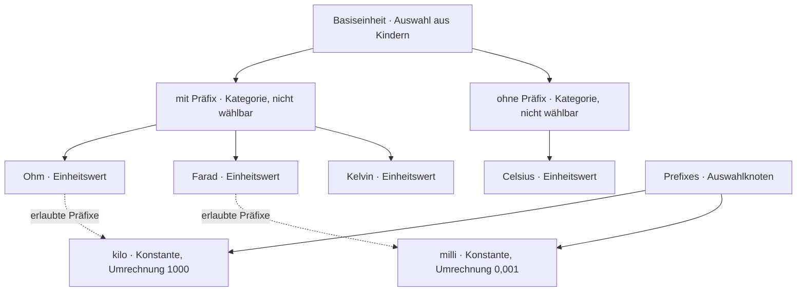

**Die Klasse `Einheitswert`, per Reflection gelesen:** `mit_praefix` (bool), `erlaubte_praefixe`
(Liste von **Verweisen auf Knoten** der Klasse Konstante), `umrechnung` (Objekt der Klasse Umrechnung,
für Celsius → Kelvin), dazu `symbol`. **Widerstand und Kapazität passen** — Ohm mit `k`/`M`, Farad
mit `µ`/`n`/`p`; nur die Liste der erlaubten Präfixe ist je Blatt anders. **Eine Beobachtung dabei
(`INFERRED`, seine Prüfung):** Kelvin hat Präfixe, Celsius nicht — «mit/ohne» trennt also nicht
Temperatur von Widerstand, sondern läuft **quer** durch Temperatur. Als *Eigenschaft je Blatt* trägt
das; als *Kategorie im Baum* müsste Temperatur zweimal vorkommen. Er hat beides genannt; die
Eigenschaft reicht, die Kategorie wäre dann nur noch Ordnung.

**Der Knackpunkt, aufgelöst am Datenmodell:** *«die klasse hätte in sich wieder einen verweis auf
knoten»* — ja, und das ist erlaubt und schon vorgesehen. Die Klasse enthält keinen Knoten. Sie
**erklärt** ein Attribut, dessen Typ *«Verweis auf einen Knoten der Klasse Konstante»* ist — so wie
`min` den Typ *int* hat. Der **Wert** ist eine Zeile mit `wert_knoten_id` → `kilo`. Code sagt, dass
und worauf verwiesen wird; welche Knoten es sind, steht in Zeilen. Genau dafür hat die Zeile die
Spalte. Es muss also **nicht** alles Knoten sein, damit ein Verweis möglich ist — der Verweis ist ein
Wertetyp wie bool oder int.

*Damit ist **D2** für diesen Fall beantwortet: eine Wahl aus Knoten ist ein **Verweis**, kein Text.
Ob das für `orientation` (vertical/horizontal, keine Knoten dahinter) genauso gilt oder ob das ein
Text aus einer festen Liste bleibt, ist noch seine Wahl.*

**K2a — beantwortet, 2026-09-11:** Präfix ist ein **Knoten** (`kilo`, Klasse Konstante), und die
Umrechnung hängt als **Satz** daran. Sein Wort: *«umrechnungssatz hört sich gut an.»* Also drei
Ebenen, alle schon im Modell: der Knoten `kilo` (Klasse Konstante), sein Umrechnungssatz (Klasse
Umrechnung), dessen Zeilen `factor` = 1000, `offset` = 0.

*Die Spalte «eigen» heisst: die Klasse erklärt das Attribut, der Wert wohnt dort. «überschreibt»
heisst: die Kante hat kein eigenes Attribut dieses Namens, sondern setzt bei Bedarf den Wert des
Knotenattributs neu — wie im Abschnitt «Kanten sind auch Klassen» beschrieben.*

**Die Regel dahinter, sein Wort, 2026-09-11:** *«im grunde müssten alle settings am knoten an der
kante überschreibbar sein, das vereinfacht es.»* Damit ist die Spalte «an der Kante» für jedes
Knotenattribut dieselbe: **überschreibt**. Es gibt keine Liste, welche Attribute die Kante anfassen
darf und welche nicht. Eigene Attribute hat die Kante nur dort, wo der Knoten keines hat
(`read_only`, `multiplicity`) — und beide sind Spalten, keine Zeilen:

**Spalte statt Zeile — entschieden, 2026-09-11.** Sein Anstoss: *«bei multiplizität war ich mir
eigentlich immer eine spalte der kante vorgestellt; wenn es einfacher ist, müssen wir das aber nicht
so machen — ich glaube, es widerspricht sogar unserem beschluss.»* Und auf den Vorschlag, beide
Kantenattribute als Spalten zu führen: *«read_only stimmt, ein umfängliches ja.»*

*Die Regel, die den Beschluss nicht bricht, sondern schärft:* **ein Attribut der Basisklasse, das
jedes Objekt genau einmal trägt, nie als Liste, und das nichts überschreibt, ist eine Spalte.** Der
Vertrag kennt es trotzdem und sagt der Maske, dass es aus der Spalte kommt. Genau so ist `position`
schon zu `stelle` geworden. `multiplicity` und `read_only` sind derselbe Fall: jede Kante hat sie,
einmal, und die Kante ist das Ende der Auflösung — nichts überschreibt sie. Die Datenbank kann eine
Spalte als Pflicht prüfen, eine Zeile nicht.

*Die Folge: die Kante hat keine eigenen Zeilen mehr. `kante_id` in der Zeile ist nur noch der
Zusatz «gilt an dieser Kante», nie allein — eine Sonderbedeutung weniger.*

**Die Kante trägt keine Einstellungen — entschieden, 2026-09-11.** Sein Gedanke: *«überlege gerade,
ob kanten-einstellungen an der kante nicht nur die knoten-überschreibung betrifft — alles andere ist
teil der kante.»* Und auf die ausgeführte Folge: *«ja, so eintragen.»* Also, ein Schritt weiter als
«Spalte statt Zeile»:

- **Einstellungen berühren die Kante an genau einer Stelle:** eine Zeile mit `kante_id` als Zusatz —
  «dieser Knotenwert gilt an dieser Kante anders». Sonst nichts.
- **`read_only` ist eine Feldeigenschaft** wie `multiplicity`: Spalte der Kante, Modell, nicht
  Einstellung. Es fällt aus der Attributliste oben. Die Kante hat damit **kein einziges**
  Einstellungsattribut mehr, weder als Zeile noch als Spalte.
- **«Kanten sind auch Klassen» bleibt wahr, aber als Modellaussage** (Komposition, Aggregation).
  Für das Einstellungsmodell hat die Kantenklasse keinen Vertrag mit Attributen; die Auflösung
  bleibt Kante → Knoten → Vertrag **des Knotens**.

*Damit ist die Trennung vollständig: Modell (Knoten, Kanten, ihre Spalten) hier; Einstellungen (Satz,
Zeile) dort; die Berührung ist `klasse` am Knoten und `kante_id` in der Zeile.*

### Multiplizität — das eine Attribut, das jede Kante hat

⚠️ *Modell, nicht Einstellung — nachgetragen 2026-09-11.* **Dieser ganze Abschnitt handelt vom
Feld, nicht von einer Einstellung**: Multiplizität ist eine Eigenschaft der Kante Knoten → Knoten
und *«bleibt erhalten, wie sie ist»*. Er steht hier, weil die Frage hier gestellt wurde, und die
Antworten (zwei Kantenklassen, Enum mit vier Fällen, jede Klasse darf alles, Bool nur `1..1`, Int und
Double alle vier) sind seine — aber sie gehören auf die Modellseite, nicht in das Einstellungsmodell.
Nichts davon ändert eine Tabelle dieser Seite.

**Sein Wort, 2026-09-11:** *«lass uns nochmal multiplizität an der kante anschauen, alle kanten haben
das.»* Und auf die drei Fragen dazu: *«1. aktuell zwei: Aggregation und Composition. 2. enum passt.
3. alle klassen dürfen alles. das ist eine einstellung für die daten: 0..1 optional, maximal ein
eintrag; 1..1 muss-feld, genau ein eintrag; 0..* optional bis mehrere einträge; 1..* mindestens
einen wert, aber mehrere möglich.»*

**Festgehalten:**

- **Zwei Kantenklassen:** `Aggregation` und `Composition`. Beide erben `multiplicity` von der
  Basisklasse Kante; keine dritte Klasse, solange keine nötig wird.
- **Ein Enum mit vier Fällen**, im Code erklärt, als Text abgelegt (D2). Keine zwei Zahlen.
- **Jede Kantenklasse darf jeden der vier Werte.** Nichts im Vertrag schränkt das ein.
- **Es ist eine Einstellung für die Daten**, nicht fürs Modell: sie sagt, wie viele Sätze das Feld
  am Datensatz haben muss und darf.

**Seine Beispiele, alle an einer Adresse:**

| Feld | Multiplizität | heisst |
|---|---|---|
| Hausnummer | `1..1` | genau eine, Pflicht |
| Stockwerk | `0..1` | höchstens eines, darf fehlen |
| Wohneinheit | `1..*` | mindestens eine, beliebig viele |
| Bewohner | `0..*` | darf fehlen, beliebig viele *(«etwas gekünstelt»)* |

**Was die Eingabe daraus macht — sein Wort:** *«für die eingabe später: ein auswahlfeld muss bei
0.. ein optionales feld haben, das die eingabe von 'nichts' ermöglicht; bei 1.. darf es das nicht
haben. ..1: nur eine wahl möglich; ..*: unendlich viele möglich. bei textfeld: 0.. kann leer, 1..
muss gefüllt sein; ..1 genau ein text möglich; ..* mehrere texte möglich.»*

| | untere Grenze `0` | untere Grenze `1` | obere Grenze `1` | obere Grenze `*` |
|---|---|---|---|---|
| **Auswahl** | hat einen Eintrag «nichts» | hat ihn nicht | eine Wahl | mehrere Wahlen |
| **Text** | darf leer sein | muss gefüllt sein | ein Text | mehrere Texte |

*Die untere Grenze ist also «Pflicht oder nicht», die obere «einer oder Liste» — zwei Fragen in einem
Wert, und jeder Renderer liest beide.*

**Offen, M1 — sein eigener Zweifel:** *«für bool stellt sich die frage, ob nur 1..1 möglich ist.»*
*Zum Denken: `0..1` an einem bool wäre ein Schalter mit drittem Zustand «nicht gesetzt» — ob das je
gebraucht wird, zeigt sich am Fall. `..*` an einem bool wäre eine Liste von Ja/Nein ohne Namen — kaum
sinnvoll. Wenn der Vertrag nichts einschränkt (Punkt 3 oben), bleibt es dem Modellierer überlassen;
wenn bool nur `1..1` darf, wäre das die erste Einschränkung, und sie käme aus der **Knotenklasse**
(bool), nicht aus der Kantenklasse.*

**M1 — entschieden, 2026-09-11:** *«bool = 1..1, an knotenklasse bool.»* Die Knotenklasse `Bool`
erklärt in ihrem Vertrag, welche Multiplizitäten eine Kante auf sie tragen darf: nur `1..1`. Damit
gibt es diese Einschränkung als **Klassenattribut des Knotens** (`erlaubte Multiplizitäten`), und
Punkt 3 oben bleibt wahr: die **Kantenklasse** schränkt nichts ein, die **Zielklasse** darf es.

**M2 — seine Frage dazu:** *«frage, ob für int und double das gleiche?»* *Zum Denken (`INFERRED`,
seine Wahl): bei bool gibt es kein «leer», das sich von «nein» unterscheidet — darum `1..1`. Bei int
und double gibt es «leer» sehr wohl: das Stockwerk als Zahl darf fehlen (`0..1`), die Hausnummer nicht
(`1..1`), und eine Liste von Messwerten oder Lottozahlen ist `0..*` oder `1..*`. Also alle vier —
wie Text, und aus demselben Grund: leer und Liste sind bei einer Zahl beide sinnvoll. Die
Einschränkung auf `1..1` wäre nur für Klassen richtig, die kein «leer» kennen.*

**M2 — entschieden, 2026-09-11:** *«einverstanden, und gutes argument.»* Int und Double erlauben alle
vier Multiplizitäten, wie Text. Die Regel dahinter: **eine Klasse schränkt die Multiplizität nur ein,
wenn sie kein «leer» kennt** — heute ist das allein Bool.

## Wo wir stehen

Sein Gerüst steht, **das erste Problem ist gelöst** (1a, 1b, 2a, 2b, 2c, 3 — siehe oben). **Als
Nächstes das zweite Problem**, in seiner Reihenfolge, je Frage sein Wort:

- **Z1 · Wo wohnt der Wert an der Kante?** **Beantwortet** — im Satz der Kante, als bei Bedarf
  duplizierter Wert des Knotens, mit der Adresse des Knotenattributs; die Kante parst den Knoten nicht.
- **Z2 · Was schlägt die Kante bei einem komplexen Attribut?** Das ganze Objekt (ein anderer Renderer,
  mit allen seinen Werten neu) — oder auch einen einzelnen Wert darin (`orientation` anders, Renderer
  gleich)?
- **Z3 · Was tut eine Liste beim Überschreiben?** **Beantwortet** — ergänzen, mit änderbarer
  Reihenfolge; ein geerbter Eintrag hat an der Kante einen Haken, standard gesetzt, raus heisst
  nicht aktiv (Z3a).
- **Z4 · Erben an Kindern:** **Beantwortet durch den Schritt zurück** — Werte vererben sich nicht
  zwischen Knoten; es gibt nur die Kante über dem Knoten.

---

## Durchsicht, 2026-09-11 — haben wir etwas vergessen, und hält das Datenmodell?

*Sein Auftrag: «geh mal durch, ob wir auch wirklich nichts vergessen haben, und überprüfe das
Datenmodell auf Konsistenz, Einfachheit, Normalformen.»* Zuerst das Modell, wie es nach allen
Antworten aussieht, dann die Prüfung, dann die Lücken. Nichts hier ist entschieden.

### Das Modell, zusammengezogen (Weg A, getrennte Id-Räume, Vertrag)

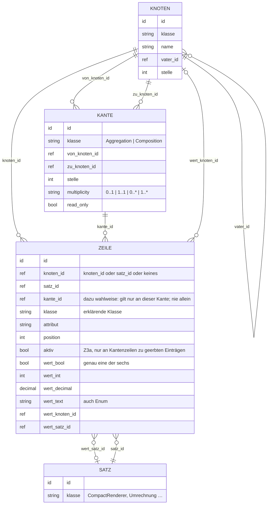

*Vier Tabellen, je mit Schatten: acht. Dazu, nicht auf dieser Seite: Labels, Datensätze.*

⚠️ *Modell, nicht Einstellung — nachgetragen 2026-09-11:* **`KNOTEN` und `KANTE` sind die
Modelltabellen, wie gehabt.** Diese Seite fügt ihnen genau eines hinzu: `klasse` am Knoten (K1). Die
übrigen Spalten dort — `name`, `vater_id`, `stelle`, `von`/`zu`, `multiplicity` — stehen im Diagramm
nur, damit die Verweise ein Ziel haben; sie werden hier weder eingeführt noch geändert.
`read_only` an der Kante ist ebenfalls Modell — eine Feldeigenschaft, keine Einstellung («Die Kante
trägt keine Einstellungen»). **Neu durch diese Seite sind allein `SATZ` und `ZEILE`.***

### Prüfung

| Massstab | Befund |
|---|---|
| **1. Normalform** | erfüllt — jede Spalte atomar; die sechs Wertspalten sind kein Wiederholungsfeld, sondern «genau eine gefüllt» |
| **2. / 3. Normalform** | erfüllt in den Daten — jede Tabelle hat einen einspaltigen Schlüssel, keine Spalte hängt von einer anderen Nichtschlüsselspalte ab. *Eine Abhängigkeit läuft über den Code:* `ZEILE.klasse` folgt aus (Klasse des Trägers, `attribut`) per Vertrag. Das ist keine Verletzung, weil der Vertrag nicht in der Datenbank steht — aber es heisst: **die Spalte trägt Information nur an der Kante** (fremde Klasse des Ziels) und ist am Knoten und im Satz herleitbar. |
| **Keine doppelte Tatsache** | erfüllt, mit einer Regel, die noch nirgends steht: eine Kantenzeile zu einem Knotenattribut **existiert nur, wenn der Modellierer sie gesetzt hat** (Haken). Eine Kantenzeile mit demselben Wert wie am Knoten, die niemand wollte, wäre die Dublette, die jede spätere Änderung am Knoten unsichtbar macht. |
| **Exklusive Spalten** | zweimal bewusst gewählt: drei Trägerspalten, sechs Wertspalten. Das ist die bekannte Alternative zu «eine Tabelle je Sorte» (drei Zeilentabellen × sechs Werttabellen). Die Datenbank prüft es mit je einer Bedingung «genau eine gefüllt». Einfacher geht es nicht, ohne die Fremdschlüssel aufzugeben, die er will. |
| **Einfachheit** | vier Tabellen für alles, was heute `nodes`, `relations`, `node_records` (Einstellungen), `relation_records`, `labels`-Icon und die Einstellungskanten tragen. Kein Pfad, kein gemeinsamer Id-Raum, keine Erklärungstabelle, keine Satzart. |
| **Konsistenz der Antworten** | eine Stelle widerspricht sich: **Z1 sagt «die Kante dupliziert den Wert»**, die Regel «keine doppelte Tatsache» sagt, sie tut es **nur auf Wunsch**. Beides ist gemeint, aber das Wort «dupliziert» sollte weg — die Kante **setzt** einen Wert, sie kopiert keinen. |

### Was fehlt — neun Lücken, geordnet nach Gewicht

1. **L1 · Fremdschlüssel gegen Schatten.** Er will Fremdschlüssel, die die Datenbank prüft, **und**
   Löschen als Wandern in die Schattentabelle. Beides zusammen heisst: eine Zeile, die auf `kilo`
   zeigt, kann nicht bleiben, wenn `kilo` wandert — die Datenbank verweigert das Wandern, oder die
   Zeile wandert mit. *Das ist die eine Stelle, an der zwei Beschlüsse von heute sich berühren, und
   es braucht eine Regel: Verweise auf ein geparktes Ding wandern mit (wie D-619 es für Kantenzeilen
   sagt), oder Parken ist verboten, solange etwas darauf zeigt.*
   **Entschieden, 2026-09-11 — Verweise wandern mit, als Klammer, mit Rückfrage.** Sein Wort:
   *«verweise wandern mit — klammer ja, und benutzer darauf hinweisen, mit ja/nein-antwort.»* Also:
   parkt jemand `kilo`, zeigt die Maske vorher, was mitwandert (die Zeilen «erlaubte Präfixe» an
   Ohm und Farad, samt ihrer Sätze), und fragt ja/nein. Bei ja wandert alles **als eine
   Änderungsgruppe** in den Schatten; beim Zurückholen kommt genau diese Gruppe zurück, nichts
   anderes. Die Fremdschlüssel bleiben dabei immer gültig, weil nie eine lebende Zeile auf ein
   geparktes Ding zeigt.
2. **L2 · Z2 ist nicht beantwortet.** In der Übersicht steht die Frage noch offen: schlägt die Kante
   bei einem komplexen Attribut das ganze Objekt oder einen Wert darin? Die Regel «alle Attribute
   flach überschreibbar» beantwortet sie für einfache Werte; für einen Renderer **in einer Liste**
   fehlt das Wort. Zusammen mit Z3 gibt es zwei Wege: (a) geerbten Eintrag abschalten (Z3a) und
   einen eigenen Renderer-Satz anhängen, oder (b) die Kantenzeile zum geerbten Eintrag zeigt auf
   einen eigenen Satz, der den geerbten **ersetzt**. (a) braucht nichts Neues; (b) braucht eine
   Zeile, die zugleich «geerbter Eintrag X» und «hier mein Satz» sagt.
   **L2 und L3 zusammen beantwortet, 2026-09-11 — mit seinem Bild der Überschreibung.** Sein Wort:
   *«ich hatte mir die überschreibung an der kante als knoten-datensatz vorgestellt, der zusätzlich
   zum knoten noch die kante bekommt (das haben alle sätze; bei dem zum knoten ohne kante ist die
   kante leer). somit kann es den knoten-datensatz für den knoten und für jede knoten/kanten-
   kombination geben. es sollen immer nur die felder gespeichert werden, die auch gesetzt werden.»*
   *Übertragen auf die Zeile: **die Kante ist kein dritter Träger, sondern ein Zusatz zum Träger.**
   Eine Zeile zu `IntegerNode.max` hat `knoten_id` = Hausnummer und `kante_id` leer (gilt am Knoten)
   oder `kante_id` = die Kante (gilt nur dort). Dasselbe für eine Zeile in einem Satz: `satz_id` =
   der Compact-Renderer des Knotens, `kante_id` = die Kante, `attribut` = `orientation` — **die
   Kante überschreibt den einen Wert im geerbten Eintrag direkt**, ohne den Eintrag abzuschalten und
   neu anzulegen (Lesart A). Und die Zeile «geerbter Eintrag, an dieser Kante nicht aktiv / an
   anderer Stelle» ist `knoten_id` = Kontakt, `kante_id` = Kante, `attribut` = `renderers`,
   `wert_satz_id` = der Satz des Eintrags, dazu `aktiv` und `position` — der Eintrag ist über seinen
   Satz benannt (L3), bei einfachen Listen über den Wert selbst. Eigene Kantenattribute
   (`multiplicity`, `read_only`) sind Spalten der Kante, keine Zeilen. Im Diagramm unten heisst das:
   `knoten_id` oder `satz_id`, **und** `kante_id` wahlweise dazu — nie allein.*
   **Seine Warnung dazu, aus Erfahrung:** *«vorsicht beim ersten verwenden, also bei der vorgabe:
   zum beispiel im int-knoten muss die ausgabe mit den default-einstellungen übereinstimmen, sonst
   sieht der benutzer ein bool 'on', aber da nichts im datensatz steht, wird es nicht berücksichtigt.
   das darf nicht sein, kam aber schon oft vor.»* *Als Regel: **was die Maske zeigt, ist immer der
   aufgelöste Wert** (Kante → Knoten → Vertrag), nie eine Vorgabe der Maske selbst. Fehlt die Zeile,
   zeigt die Maske die Vorgabe des Vertrags — und genau die gilt dann auch. Eine Maske, die etwas
   anderes vorwählt als der Vertrag, ist der Fehler, den er meint.*
3. **L3 · Wie eine Kantenzeile den geerbten Listeneintrag benennt.** — *beantwortet unter L2: über
   `wert_satz_id` (komplex) oder den Wert (einfach), mit `kante_id` als Zusatz.*
4. **L4 · Felder erben sich, aber wie sieht das Kind sie?** «Vererbung von Feldern bleibt bestehen,
   wie in OO» — `Firmenkontakt` unter `Kontakt` hat `Name`, `Strasse`. Offen: darf das Kind geerbte
   Felder **umstellen** oder **verbergen**, und wenn ja, wo steht das? Das ist Z3 noch einmal, nur
   für Kanten statt Zeilen. Das Attribut `hide` an der Kante deutet an, dass Verbergen gewollt ist.
   **Entschieden, 2026-09-11:** *«L4: ja, umstellen und verbergen.»* ⚠️ *Modell, nicht
   Einstellung — korrigiert am selben Tag:* **das Ja gilt, aber es ist eine Frage der Felder, nicht
   der Einstellungen.** Ich hatte dafür eine Zeile am Kind mit einer siebten Wertspalte
   `wert_kante_id` vorgeschlagen — **zurückgenommen**: Felder werden nicht über Einstellungszeilen
   umgestellt oder verborgen. Wie das Kind geerbte Felder ordnet und verbirgt, gehört auf die
   Modellseite; diese Seite hält nur fest, dass es gewollt ist.
5. **L5 · Der Name der Kante.** Zwei Kanten von `Kontakt` auf `Adresse` — Liefer- und
   Rechnungsadresse — brauchen je einen Namen, der nicht der des Zielknotens ist. Labels sind nicht
   auf dieser Seite; ob eine Kante eigene Labels hat, steht nirgends.
   **Entschieden, 2026-09-11:** *«wenn es eine klare unterscheidung gibt, ja — kann aber auch
   mehrere adressen haben.»* Also: **eine Kante darf eigene Labels haben, muss aber nicht.** Fehlen
   sie, heisst das Feld wie sein Zielknoten. Und sein Nachsatz nennt die Alternative: statt zwei
   benannter Kanten (Liefer-, Rechnungsadresse) **eine** Kante `0..*` auf Adresse — dann
   unterscheidet der Datensatz, nicht das Modell. Beides ist möglich; der Modellierer wählt.
   ⚠️ *Modell, nicht Einstellung:* Labels einer Kante sind Sache des Felds; die Antwort gehört auf
   die Modellseite und ändert hier nichts.
6. **L6 · Verwaiste Sätze.** Ein Satz hat keinen Träger mehr (Weg A); wem er gehört, sagt die Zeile,
   die auf ihn zeigt. Wandert die Zeile, muss der Satz mitwandern, sonst bleibt er allein zurück. Eine
   Regel, keine Spalte.
7. **L7 · Das Wort «Satz».** Heute heissen die **Daten** so (`node_records`, «Datensatz»). Auf dieser
   Seite ist ein Satz ein **Einstellungsobjekt** (Renderer, Umrechnung). Zwei Dinge, ein Wort — vor
   dem Bauen eines umbenennen, sonst kommt der nächste Fehler aus dem Namen. *Vorschlag: «Objekt».*
   **Seine Namen zur Wahl, 2026-09-11:** *«settings_object / Einstellungsobjekt, oder
   Einstellungs-Datensatz / settings_record?»* *Zum Denken: «Datensatz» und «record» sind genau das
   Wort, das heute die Daten der Benutzer tragen — die Kollision bliebe. **Einstellungsobjekt /
   `settings_object`** sagt, was es ist (ein Objekt seiner Klasse, Frage 2a) und kollidiert mit
   nichts. Offen, seine Wahl.*
8. **L8 · `read_only` nur an der Kante — mit seinem «glaube ich».** Ein Knoten, der überall nur
   lesbar sein soll (ein berechneter Wert), müsste es an jeder Kante einzeln bekommen. Kein Fehler,
   aber noch nicht bestätigt. **Bestätigt, 2026-09-11:** *«read_only stimmt»* — nur an der Kante,
   als Spalte. ⚠️ *Und danach als **Feldeigenschaft** eingeordnet, nicht als Einstellung («Die Kante
   trägt keine Einstellungen»).*
9. **L9 · Icon je Klasse.** Als «philosophiert» notiert; wenn es kommt, ist es Vertrag (Code), kein
   Modell. Keine Entscheidung nötig, nur damit es nicht verloren geht.

*Nicht vergessen, sondern bewusst nicht auf dieser Seite:* Labels (Name je Sprache, Rollen, Icon),
Datensätze (die Werte der Benutzer, mit Multiplizität als ihrer Regel), der Vergleich mit dem
Bestand.
