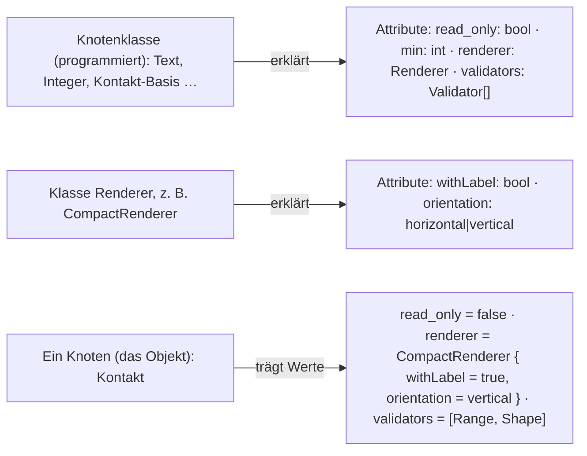
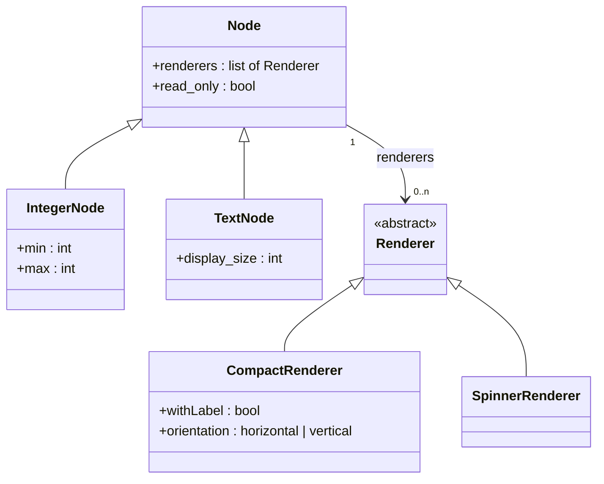
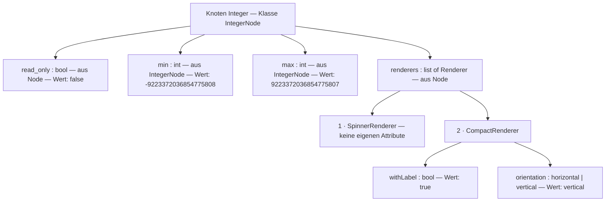
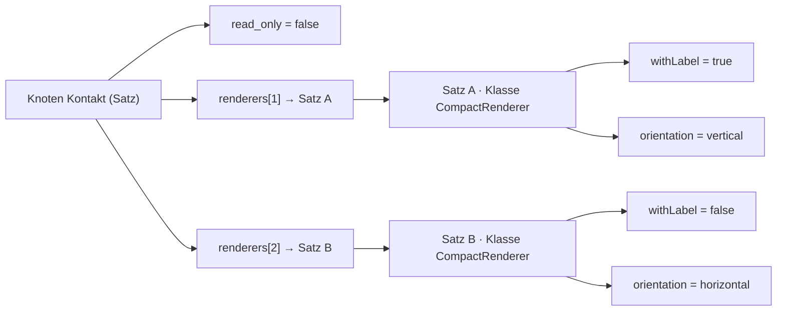

# Einstellungen — von null

**Diese Seite geht nicht vom Bestand aus.** Kein «heute», keine Beschlussnummern. Was hier steht, ist das
Grundgerüst des Eigentümers vom 2026-09-10 und darunter, Schritt für Schritt, was das Gerüst von der
Struktur verlangt — als Fragen, bis er sie beantwortet hat. Der Vergleich mit dem Bestand kommt danach
auf einer eigenen Seite.

---

## Das Grundgerüst — sein Text

> Einstellungen sind Attribute von programmierten Knotenklassen.
> Attribute können einfach oder komplex sein.
>
> Beispiel für einfache Attribute:
> - `read_only` — bool
> - `min` / `max` — int / double
> - `display_size` — int
>
> Beispiel für komplexe Attribute:
> - `Renderer` — Klasse vom Typ Renderer
> - `Validator` — Klasse vom Typ Validator
> - `Converter` — Klasse vom Typ Converter
>
> Komplexe Typen können wiederum Einstellungen haben:
> - `CompactRenderer` — `withLabel`, `horizontal` / `vertical`
> - `Converter` — to lower / to upper (gekünsteltes Beispiel)
>
> Es ist aber auch denkbar, dass komplexe Attribute wiederum komplexe haben — also wie in der
> Objektorientierung.
>
> Weiterhin kann es sein, dass nicht nur ein Attribut der gleichen Art, sondern eine Liste möglich ist:
> - eine Knotenklasse kann 1–n Renderer haben
> - ein Knoten kann 1–n Validatoren haben
>
> Im Grunde müssen wir mit den Einstellungen die Komplexität von Klassenattributen darstellen können,
> wie sie in der OO ist.
>
> Zudem wollen wir noch sagen: Es ist ja schön, dass ein Knoten Einstellungen hat — dessen Einstellungen
> möchte ich aber in der Relation, die diesen Knoten verwendet, überschreiben können.
>
> Zudem kommt, dass Kinder eines solchen Knotens die Einstellungsmöglichkeiten des Vaters erben und
> diese selbst setzen können.
>
> Ich denke aber, wenn wir das erste Problem gelöst haben, können wir das mit dem Überschreiben, neu
> Setzen an der Kante leicht lösen.

---

## Das erste Problem, in seiner Form: Klassenattribute wie in der OO

In der Objektorientierung hat eine Klasse Attribute; ein Attribut hat einen Typ; der Typ ist einfach
(bool, int, double, text) oder eine Klasse; ein Attribut kann eine Liste sein; ein Objekt trägt die
Werte. **Übertragen:**

Drei Dinge, die es dafür geben muss, und je Ding die Frage, die er beantwortet:

### 1 · Die Erklärung: welche Klasse hat welche Attribute, in welchem Typ

*Die Klasse `Integer` erklärt `min` und `max` als int; die Klasse `Decimal` erklärt dieselben Namen als
double; die Klasse `CompactRenderer` erklärt `withLabel` als bool und `orientation` als eine Wahl aus
zwei Werten.*

- Die Erklärung ist **Kode** — sein erster Satz. **Frage 1a:** *Muss der Modellierer die Erklärung im
  Modell sehen können (als Zeile «dieser Knoten kennt `min`»), oder reicht es, dass die Maske sie beim
  Zeichnen aus der Klasse holt?* Das entscheidet, ob eine Erklärung eine Spur in der Datenbank hat.
- **Frage 1b:** *Erklärt ein Renderer seine Attribute selbst (`CompactRenderer` sagt «ich habe
  `orientation`»), oder erklärt die Knotenklasse sie stellvertretend?* In der OO ist es die Klasse des
  Attributs — das wäre der Renderer.

**Seine Antwort auf 1a, mit Beispiel:** *«der Knoten-Integer hat eine Klasse `integer_node`.
`integer_node` erbt von `node`. `node` hat das Attribut `renderers` vom Typ list of Renderer und
`read_only` vom Typ boolean. `integer_node` hat die Attribute `max` vom Typ int, `min` vom Typ int.
Alle diese Attribute sollten im Knoten-Integer zu sehen sein. Hierzu müsste man nur die Klasse
`integer_node` per Reflection parsen (zumindest geht das unter Java): jeder simple Typ bekommt eine
simple Einstellung, jede Klasse schachtelt tiefer.»*

**Das Beispiel als Bild — die Klassen:**

**Und dasselbe, wie der Knoten `Integer` es zeigt — per Reflection aus `IntegerNode`, geerbte
Attribute eingeschlossen, Klassen geschachtelt:**

*Damit ist 1a beantwortet: **die Erklärung ist die Klasse, gelesen per Reflection** — nichts davon
braucht eine Spur im Modell, die Maske holt sie beim Zeichnen. Jeder simple Typ wird eine simple
Einstellung; jedes Attribut mit Klassentyp klappt eine Stufe tiefer auf, so tief die Klassen gehen. Ein
Attribut mit Listentyp zeigt seine Einträge nummeriert, jeder Eintrag mit seiner eigenen Klasse und
deren Attributen.* ⚠️ *Zur Umsetzbarkeit, gemessen an PHP: Reflection liest Klassenname, Eltern,
Attributnamen und deren Typen (`bool`, `int`, `Renderer`); **«list of Renderer» sagt PHP nicht von
selbst** — das steht in einer Docblock-Angabe oder einem Attribut an der Eigenschaft, das die
Reflection mitliest. Das ist eine Zeile je Liste, keine Grenze.*

*Und 1b folgt daraus ohne eigene Frage: der Renderer erklärt seine Attribute selbst, weil seine
Klasse sie hat — `CompactRenderer` hat `orientation`, `SpinnerRenderer` nicht.*

### 2 · Der Wert: was ein Knoten trägt

*Ein Knoten trägt je Attribut einen Wert. Ist das Attribut komplex, trägt er den Namen der Klasse
**und** deren Attributwerte. Ist es eine Liste, trägt er mehrere davon, in Reihenfolge.*

- Ein einfacher Wert ist eine Zeile: `Kontakt · read_only = false`.
- Ein komplexer Wert ist **ein Objekt**: `Kontakt · renderer = CompactRenderer` und darunter
  `withLabel = true`, `orientation = vertical`. **Frage 2a:** *Gehören die Werte des Objekts dem
  Knoten (flach, als weitere Zeilen von `Kontakt`) oder dem Objekt (ein eigener Satz «dieser eine
  CompactRenderer an Kontakt», auf den die Zeile `renderer` zeigt)?* Solange ein Knoten je Attribut
  **ein** Objekt hat, geht beides. **Sobald eine Liste zwei Objekte derselben Klasse hält** — zwei
  `Range`-Validatoren mit verschiedenem `min` —, geht nur noch das zweite: jedes Objekt braucht einen
  eigenen Ort für seine Werte. *Das ist die Stelle, an der die Liste die Speicherform entscheidet.*
- **Frage 2b:** *Darf eine Liste zwei Einträge derselben Klasse haben?* Wenn nein, reicht flach; wenn
  ja, braucht jeder Eintrag einen Satz.
- **Frage 2c:** *Wie tief?* «Komplexe haben wiederum komplexe» — ein Renderer, der einen Konverter
  hat, der eine Einstellung hat. Wenn jedes Objekt einen eigenen Satz hat, ist die Tiefe beliebig,
  ohne dass die Struktur wächst: ein Satz zeigt auf einen Satz. Flach hört bei einer Stufe auf.

**Seine Antwort auf 2b:** *«das kann ich pauschal nicht beantworten, ausser mit: der Knoten
entscheidet — in Java würde man das über eine Setter-Funktion regeln. Das Beispiel zwei gleiche
Validierer für Range ist nicht so gut gewählt, aber es könnte auch eine Liste von Strings oder Integern
sein, somit auch eine Liste von Komplexen. Und wenn man an typisierte Listen denkt: dann ja, es kann
mehrere des gleichen Typs haben — Liste vom Typ Vaterknoten, Einträge vom Typ der Kinder.»*

*Also: eine Liste ist typisiert über eine Klasse (`list of Renderer`), ihre Einträge sind Objekte von
deren Unterklassen (`Compact`, `Spinner`, `Compact`), und **ob zwei Einträge derselben Klasse erlaubt
sind, entscheidet die Klasse, die die Liste hat** — wie ein Setter. Die Struktur muss es können; die
Klasse darf es verbieten.* **Daraus folgen 2a und 2c ohne weitere Frage:**

- **2a — je Objekt ein eigener Satz.** *Zwei `Compact` in einer Liste mit verschiedener `orientation`
  können ihre Werte nicht flach am Knoten tragen, sonst wären sie ununterscheidbar. Also: ein
  komplexer Wert ist ein Satz, der seine Klasse nennt und seine Attributwerte hält; die Zeile am Knoten
  zeigt auf ihn. Ein einfacher Wert bleibt eine Zeile. Eine Liste einfacher Werte (Strings, Integer)
  sind mehrere Zeilen am selben Attribut, in Reihenfolge; eine Liste komplexer Werte sind mehrere
  Zeilen, die je auf einen Satz zeigen.*
- **2c — beliebig tief.** *Ein Satz zeigt auf einen Satz. Ein Renderer, der einen Konverter hat, der ein
  Attribut hat: drei Sätze, drei Stufen, dieselbe Form.*

*Ein Objekt hat damit drei Dinge: den Satz, der es ist; die Klasse, die es nennt; die Zeile am Träger,
die auf es zeigt und seine Stelle in der Liste angibt.*

### 3 · Die Adresse: woran ein Wert hängt

*Jede Zeile muss sagen, zu welchem Attribut welcher Klasse sie gehört.* In der OO ist das der
Attributname innerhalb der Klasse. Hier: **Frage 3:** *Ist die Adresse ein Name (`orientation`) oder
eine Nummer, die das Modell für das Attribut vergibt?* Ein Name reicht, solange innerhalb eines
Objekts kein Name doppelt ist — und das ist in der OO so. Eine Nummer braucht es nur, wenn ein Name
an zwei Orten Verschiedenes heissen darf.

---

**Seine Antworten auf 2c und 3:** *«der Komplexität ist erstmal keine Grenze gesetzt; natürlich wird es
in der Realität nicht beliebig tief gehen. Man sollte auch als Programmierrichtlinie möglichst auf flache
Strukturen setzen.»* — *«Attributnamen sind nicht unbedingt eindeutig, aber wenn man den Klassennamen
hat: Klassenname + Attributname ist dann wieder eindeutig. Beispiel `int` / `double`, `min` / `max`.»*

*Also: **die Adresse eines Werts ist Klasse + Attributname.** Innerhalb eines Satzes ist die Klasse
bekannt — der Satz nennt sie —, darum trägt eine Zeile nur den Attributnamen; erst Satz und Zeile
zusammen sind die volle Adresse: `IntegerNode.min`, `DecimalNode.min`, `CompactRenderer.orientation`.
Das Format des Werts sagt die Klasse. Keine Nummer, die das Modell vergibt.* ⚠️ *Eine Folge, die
hierher gehört: wird ein Attribut im Kode umbenannt, ändert sich die Adresse — dann wandern die
Werte, wie bei jeder Kode-Änderung, die die Ablage berührt. Das ist der Preis dafür, dass der Kode die
einzige Erklärung ist, und er ist klein, solange die Richtlinie gilt: flach, und Namen nicht ohne Not
ändern.*

**Damit ist das erste Problem gelöst.** *Die Erklärung ist die Klasse (Reflection); ein Wert ist eine
Zeile; ein komplexer Wert ist ein Satz mit Klasse und Werten; eine Liste sind mehrere Zeilen in
Reihenfolge, komplex je auf einen Satz zeigend; die Adresse ist Klasse + Attributname; tief, so weit die
Klassen gehen, mit der Richtlinie «flach».*

## Das zweite Problem, das er hintanstellt: Überschreiben an der Kante, Erben an Kindern

*«Wenn wir das erste Problem gelöst haben, können wir das leicht lösen.»* — Was dafür festzuhalten ist,
damit die Lösung des ersten es nicht verbaut:

- **Ein Wert hat einen Ort:** am Knoten, oder an der Kante, die den Knoten verwendet. Beide Orte tragen
  dieselbe Form (Frage 2a gilt für beide).
- **Ein Kind erbt die Attribute des Vaters** — die Erklärung — **und darf Werte setzen.** Was es nicht
  setzt, gilt vom Vater. Für Listen ist offen, ob das Kind die Liste des Vaters **ersetzt** oder
  **ergänzt** (sein Beispiel: to-upper am Knoten, sortieren und zusammenfassen an der Kante — ergänzt).
- **Die Kante schlägt den Knoten**, das Kind schlägt den Vater. Für ein komplexes Attribut heisst das:
  *schlägt die Kante das ganze Objekt (anderer Renderer) oder auch einen einzelnen Wert darin
  (`orientation` anders, Renderer gleich)?* — die Antwort folgt aus Frage 2a: gehören die Werte dem
  Objekt, wird das Objekt überschrieben; sind sie flach, kann jeder einzeln überschrieben werden.

---

## Wo wir stehen

Sein Gerüst steht, **das erste Problem ist gelöst** (1a, 1b, 2a, 2b, 2c, 3 — siehe oben). **Als
Nächstes das zweite Problem**, in seiner Reihenfolge, je Frage sein Wort:

- **Z1 · Wo wohnt der Wert an der Kante?** In einem Satz, der zur Kante gehört, in derselben Form wie
  der Satz des Knotens — oder anders?
- **Z2 · Was schlägt die Kante bei einem komplexen Attribut?** Das ganze Objekt (ein anderer Renderer,
  mit allen seinen Werten neu) — oder auch einen einzelnen Wert darin (`orientation` anders, Renderer
  gleich)?
- **Z3 · Was tut eine Liste beim Überschreiben?** Ersetzt die Kante die Liste des Knotens, oder ergänzt
  sie sie — und wenn ergänzt: wie nimmt man einen geerbten Eintrag weg?
- **Z4 · Erben an Kindern:** dieselben drei Fragen für das Kind gegenüber dem Vater — oder gilt für das
  Kind einfach dasselbe wie für die Kante?
