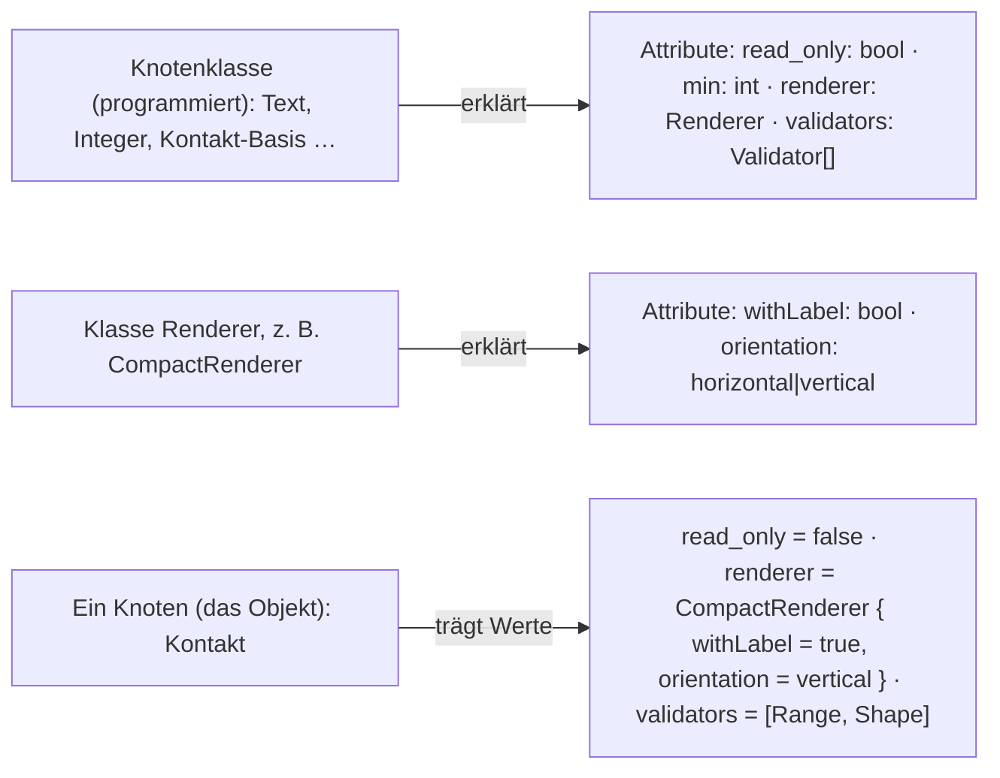
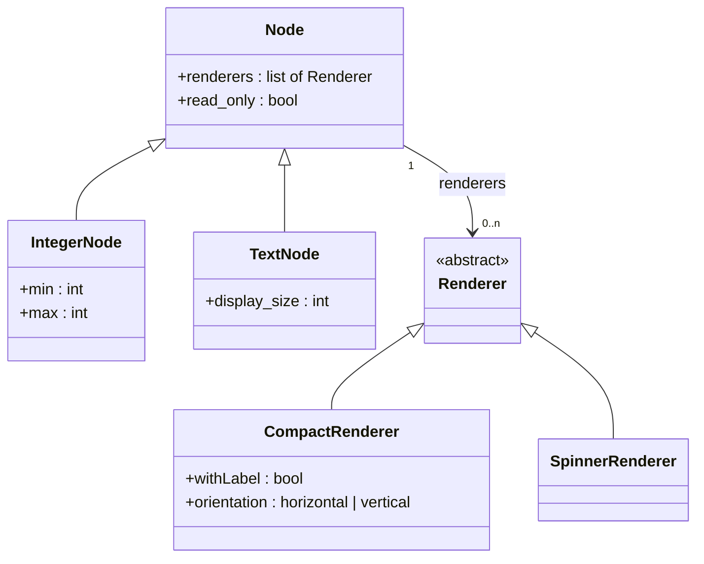
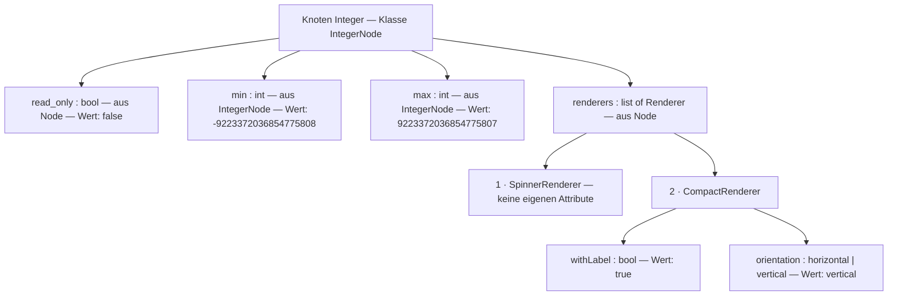
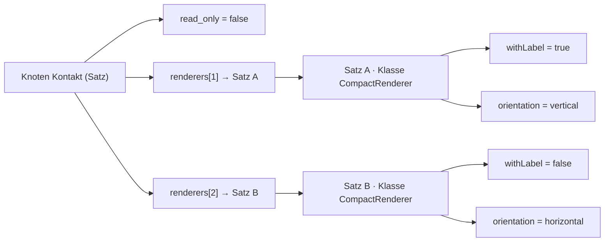
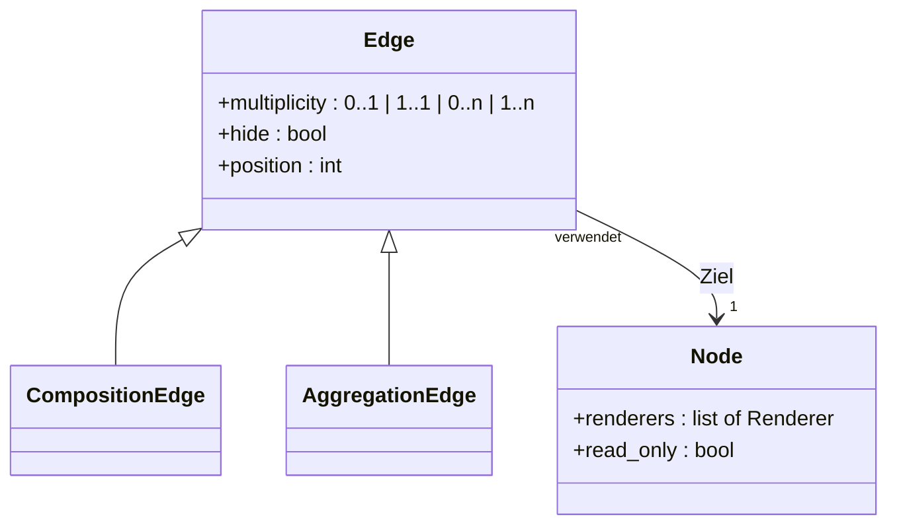
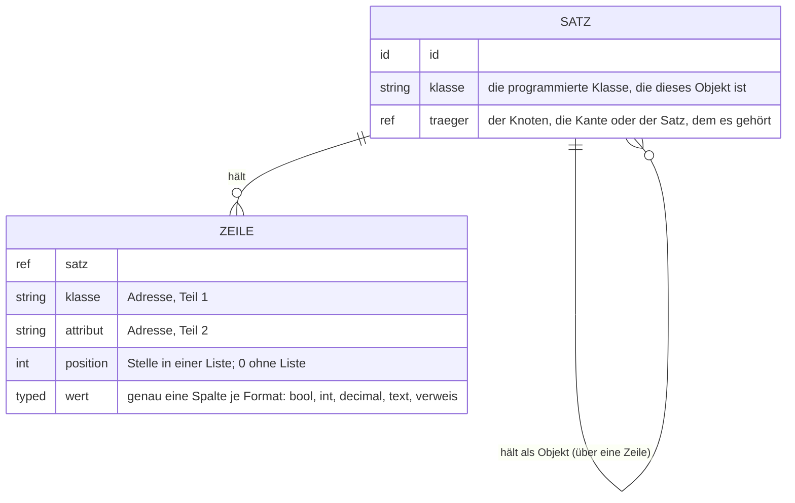
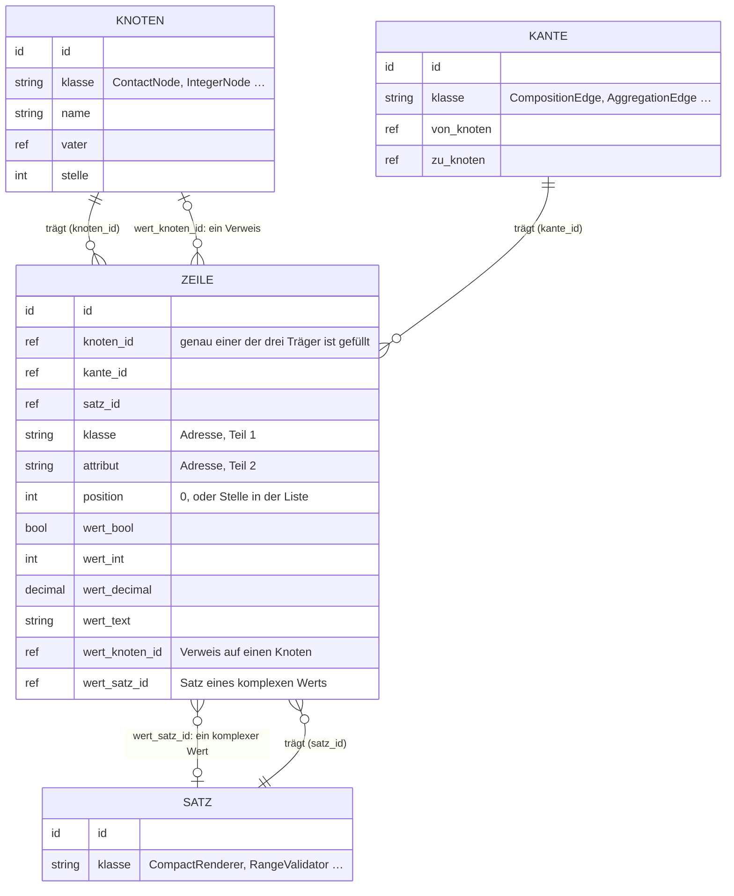
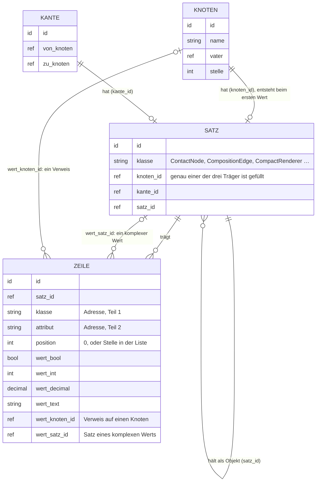

# Einstellungen — von null

**Diese Seite geht nicht vom Bestand aus.** Kein «heute», keine Beschlussnummern. Was hier steht, ist das
Grundgerüst des Eigentümers vom 2026-09-10 und darunter, Schritt für Schritt, was das Gerüst von der
Struktur verlangt — als Fragen, bis er sie beantwortet hat. Der Vergleich mit dem Bestand kommt danach
auf einer eigenen Seite.

---

## Das Grundgerüst — sein Text

> Einstellungen sind Attribute von programmierten Knotenklassen.
> Attribute können einfach oder komplex sein.
>
> Beispiel für einfache Attribute:
> - `read_only` — bool
> - `min` / `max` — int / double
> - `display_size` — int
>
> Beispiel für komplexe Attribute:
> - `Renderer` — Klasse vom Typ Renderer
> - `Validator` — Klasse vom Typ Validator
> - `Converter` — Klasse vom Typ Converter
>
> Komplexe Typen können wiederum Einstellungen haben:
> - `CompactRenderer` — `withLabel`, `horizontal` / `vertical`
> - `Converter` — to lower / to upper (gekünsteltes Beispiel)
>
> Es ist aber auch denkbar, dass komplexe Attribute wiederum komplexe haben — also wie in der
> Objektorientierung.
>
> Weiterhin kann es sein, dass nicht nur ein Attribut der gleichen Art, sondern eine Liste möglich ist:
> - eine Knotenklasse kann 1–n Renderer haben
> - ein Knoten kann 1–n Validatoren haben
>
> Im Grunde müssen wir mit den Einstellungen die Komplexität von Klassenattributen darstellen können,
> wie sie in der OO ist.
>
> Zudem wollen wir noch sagen: Es ist ja schön, dass ein Knoten Einstellungen hat — dessen Einstellungen
> möchte ich aber in der Relation, die diesen Knoten verwendet, überschreiben können.
>
> Zudem kommt, dass Kinder eines solchen Knotens die Einstellungsmöglichkeiten des Vaters erben und
> diese selbst setzen können.
>
> Ich denke aber, wenn wir das erste Problem gelöst haben, können wir das mit dem Überschreiben, neu
> Setzen an der Kante leicht lösen.

---

## Das erste Problem, in seiner Form: Klassenattribute wie in der OO

In der Objektorientierung hat eine Klasse Attribute; ein Attribut hat einen Typ; der Typ ist einfach
(bool, int, double, text) oder eine Klasse; ein Attribut kann eine Liste sein; ein Objekt trägt die
Werte. **Übertragen:**

Drei Dinge, die es dafür geben muss, und je Ding die Frage, die er beantwortet:

### 1 · Die Erklärung: welche Klasse hat welche Attribute, in welchem Typ

*Die Klasse `Integer` erklärt `min` und `max` als int; die Klasse `Decimal` erklärt dieselben Namen als
double; die Klasse `CompactRenderer` erklärt `withLabel` als bool und `orientation` als eine Wahl aus
zwei Werten.*

- Die Erklärung ist **Kode** — sein erster Satz. **Frage 1a:** *Muss der Modellierer die Erklärung im
  Modell sehen können (als Zeile «dieser Knoten kennt `min`»), oder reicht es, dass die Maske sie beim
  Zeichnen aus der Klasse holt?* Das entscheidet, ob eine Erklärung eine Spur in der Datenbank hat.
- **Frage 1b:** *Erklärt ein Renderer seine Attribute selbst (`CompactRenderer` sagt «ich habe
  `orientation`»), oder erklärt die Knotenklasse sie stellvertretend?* In der OO ist es die Klasse des
  Attributs — das wäre der Renderer.

**Seine Antwort auf 1a, mit Beispiel:** *«der Knoten-Integer hat eine Klasse `integer_node`.
`integer_node` erbt von `node`. `node` hat das Attribut `renderers` vom Typ list of Renderer und
`read_only` vom Typ boolean. `integer_node` hat die Attribute `max` vom Typ int, `min` vom Typ int.
Alle diese Attribute sollten im Knoten-Integer zu sehen sein. Hierzu müsste man nur die Klasse
`integer_node` per Reflection parsen (zumindest geht das unter Java): jeder simple Typ bekommt eine
simple Einstellung, jede Klasse schachtelt tiefer.»*

**Das Beispiel als Bild — die Klassen:**

**Und dasselbe, wie der Knoten `Integer` es zeigt — per Reflection aus `IntegerNode`, geerbte
Attribute eingeschlossen, Klassen geschachtelt:**

*Damit ist 1a beantwortet: **die Erklärung ist die Klasse, gelesen per Reflection** — nichts davon
braucht eine Spur im Modell, die Maske holt sie beim Zeichnen. Jeder simple Typ wird eine simple
Einstellung; jedes Attribut mit Klassentyp klappt eine Stufe tiefer auf, so tief die Klassen gehen. Ein
Attribut mit Listentyp zeigt seine Einträge nummeriert, jeder Eintrag mit seiner eigenen Klasse und
deren Attributen.* ⚠️ *Zur Umsetzbarkeit, gemessen an PHP: Reflection liest Klassenname, Eltern,
Attributnamen und deren Typen (`bool`, `int`, `Renderer`); **«list of Renderer» sagt PHP nicht von
selbst** — das steht in einer Docblock-Angabe oder einem Attribut an der Eigenschaft, das die
Reflection mitliest. Das ist eine Zeile je Liste, keine Grenze.*

*Und 1b folgt daraus ohne eigene Frage: der Renderer erklärt seine Attribute selbst, weil seine
Klasse sie hat — `CompactRenderer` hat `orientation`, `SpinnerRenderer` nicht.*

### 2 · Der Wert: was ein Knoten trägt

*Ein Knoten trägt je Attribut einen Wert. Ist das Attribut komplex, trägt er den Namen der Klasse
**und** deren Attributwerte. Ist es eine Liste, trägt er mehrere davon, in Reihenfolge.*

- Ein einfacher Wert ist eine Zeile: `Kontakt · read_only = false`.
- Ein komplexer Wert ist **ein Objekt**: `Kontakt · renderer = CompactRenderer` und darunter
  `withLabel = true`, `orientation = vertical`. **Frage 2a:** *Gehören die Werte des Objekts dem
  Knoten (flach, als weitere Zeilen von `Kontakt`) oder dem Objekt (ein eigener Satz «dieser eine
  CompactRenderer an Kontakt», auf den die Zeile `renderer` zeigt)?* Solange ein Knoten je Attribut
  **ein** Objekt hat, geht beides. **Sobald eine Liste zwei Objekte derselben Klasse hält** — zwei
  `Range`-Validatoren mit verschiedenem `min` —, geht nur noch das zweite: jedes Objekt braucht einen
  eigenen Ort für seine Werte. *Das ist die Stelle, an der die Liste die Speicherform entscheidet.*
- **Frage 2b:** *Darf eine Liste zwei Einträge derselben Klasse haben?* Wenn nein, reicht flach; wenn
  ja, braucht jeder Eintrag einen Satz.
- **Frage 2c:** *Wie tief?* «Komplexe haben wiederum komplexe» — ein Renderer, der einen Konverter
  hat, der eine Einstellung hat. Wenn jedes Objekt einen eigenen Satz hat, ist die Tiefe beliebig,
  ohne dass die Struktur wächst: ein Satz zeigt auf einen Satz. Flach hört bei einer Stufe auf.

**Seine Antwort auf 2b:** *«das kann ich pauschal nicht beantworten, ausser mit: der Knoten
entscheidet — in Java würde man das über eine Setter-Funktion regeln. Das Beispiel zwei gleiche
Validierer für Range ist nicht so gut gewählt, aber es könnte auch eine Liste von Strings oder Integern
sein, somit auch eine Liste von Komplexen. Und wenn man an typisierte Listen denkt: dann ja, es kann
mehrere des gleichen Typs haben — Liste vom Typ Vaterknoten, Einträge vom Typ der Kinder.»*

*Also: eine Liste ist typisiert über eine Klasse (`list of Renderer`), ihre Einträge sind Objekte von
deren Unterklassen (`Compact`, `Spinner`, `Compact`), und **ob zwei Einträge derselben Klasse erlaubt
sind, entscheidet die Klasse, die die Liste hat** — wie ein Setter. Die Struktur muss es können; die
Klasse darf es verbieten.* **Daraus folgen 2a und 2c ohne weitere Frage:**

- **2a — je Objekt ein eigener Satz.** *Zwei `Compact` in einer Liste mit verschiedener `orientation`
  können ihre Werte nicht flach am Knoten tragen, sonst wären sie ununterscheidbar. Also: ein
  komplexer Wert ist ein Satz, der seine Klasse nennt und seine Attributwerte hält; die Zeile am Knoten
  zeigt auf ihn. Ein einfacher Wert bleibt eine Zeile. Eine Liste einfacher Werte (Strings, Integer)
  sind mehrere Zeilen am selben Attribut, in Reihenfolge; eine Liste komplexer Werte sind mehrere
  Zeilen, die je auf einen Satz zeigen.*
- **2c — beliebig tief.** *Ein Satz zeigt auf einen Satz. Ein Renderer, der einen Konverter hat, der ein
  Attribut hat: drei Sätze, drei Stufen, dieselbe Form.*

*Ein Objekt hat damit drei Dinge: den Satz, der es ist; die Klasse, die es nennt; die Zeile am Träger,
die auf es zeigt und seine Stelle in der Liste angibt.*

### 3 · Die Adresse: woran ein Wert hängt

*Jede Zeile muss sagen, zu welchem Attribut welcher Klasse sie gehört.* In der OO ist das der
Attributname innerhalb der Klasse. Hier: **Frage 3:** *Ist die Adresse ein Name (`orientation`) oder
eine Nummer, die das Modell für das Attribut vergibt?* Ein Name reicht, solange innerhalb eines
Objekts kein Name doppelt ist — und das ist in der OO so. Eine Nummer braucht es nur, wenn ein Name
an zwei Orten Verschiedenes heissen darf.

---

**Seine Antworten auf 2c und 3:** *«der Komplexität ist erstmal keine Grenze gesetzt; natürlich wird es
in der Realität nicht beliebig tief gehen. Man sollte auch als Programmierrichtlinie möglichst auf flache
Strukturen setzen.»* — *«Attributnamen sind nicht unbedingt eindeutig, aber wenn man den Klassennamen
hat: Klassenname + Attributname ist dann wieder eindeutig. Beispiel `int` / `double`, `min` / `max`.»*

*Also: **die Adresse eines Werts ist Klasse + Attributname.** Innerhalb eines Satzes ist die Klasse
bekannt — der Satz nennt sie —, darum trägt eine Zeile nur den Attributnamen; erst Satz und Zeile
zusammen sind die volle Adresse: `IntegerNode.min`, `DecimalNode.min`, `CompactRenderer.orientation`.
Das Format des Werts sagt die Klasse. Keine Nummer, die das Modell vergibt.* ⚠️ *Eine Folge, die
hierher gehört: wird ein Attribut im Kode umbenannt, ändert sich die Adresse — dann wandern die
Werte, wie bei jeder Kode-Änderung, die die Ablage berührt. Das ist der Preis dafür, dass der Kode die
einzige Erklärung ist, und er ist klein, solange die Richtlinie gilt: flach, und Namen nicht ohne Not
ändern.*

**Damit ist das erste Problem gelöst.** *Die Erklärung ist die Klasse (Reflection); ein Wert ist eine
Zeile; ein komplexer Wert ist ein Satz mit Klasse und Werten; eine Liste sind mehrere Zeilen in
Reihenfolge, komplex je auf einen Satz zeigend; die Adresse ist Klasse + Attributname; tief, so weit die
Klassen gehen, mit der Richtlinie «flach».*

## Kanten sind auch Klassen

**Sein Zusatz:** *«vielleicht sollte man hinzufügen, dass Kanten ja auch Klassen sind und für die das
Gleiche gilt.»*

*Also gilt das erste Problem für Kanten wörtlich: eine Kante ist ein Objekt einer programmierten
Klasse — `CompositionEdge`, `AggregationEdge` —, die Klasse erklärt ihre Attribute (`multiplicity`,
`hide`, `position` und was der Kode sonst an eine Kante schreibt), per Reflection gelesen; die Kante trägt
Werte in ihrem eigenen Satz; komplexe Attribute und Listen genauso wie am Knoten.*

**Sein Halt, und er trennt zwei Dinge, die hier zuerst in einem Satz standen:** *«da vermischen wir
jetzt zwei Dinge: zum einen ist eine Kante eine Klasse und hat eigene Attribute; zudem soll sie später
die des Knotens überschreiben können. Wenn man es technisch sieht, müsste eine Kante in der GUI zuerst
die Kanten-Klasse parsen und dann über den To-Knoten die Knoten-Klasse — das erscheint aber
überdimensioniert, da der Knoten ja schon seine Einstellungen kennt und die Kante diese nur bei Bedarf
duplizieren müsste.»*

**Also zwei Dinge, getrennt:**

1. **Die eigenen Attribute der Kante** kommen aus ihrer Klasse — `CompositionEdge.multiplicity`,
   `.hide`, `.position` —, per Reflection, in ihrem Satz. Das ist das erste Problem, angewandt auf die
   Kante. *Fertig.*
2. **Das Überschreiben am Ziel** ist **kein zweites Parsen**: der Knoten kennt seine Einstellungen
   schon und zeigt sie aufgelöst. Ändert der Modellierer eine davon an der Kante, **dupliziert die Kante
   genau diesen einen Wert** in ihren Satz — unter der Adresse des Knotenattributs (`IntegerNode.max`),
   damit die Auflösung ihn dort findet. Die Kante erklärt nichts über den Knoten; sie hält eine Kopie,
   die gewinnt. Was sie nicht dupliziert hat, gilt weiter vom Knoten.

**Damit ist Z1 beantwortet, in seiner Form:** *ein Wert «an der Kante» ist ein bei Bedarf duplizierter
Wert des Knotens, im Satz der Kante, in derselben Zeilenform, mit der Adresse des Knotenattributs. Die
GUI liest eine Klasse — die der Kante — und nimmt die Einstellungen des Ziels, wie der Knoten sie
schon hat.*

## Das Datenmodell für eigene Attribute — Entwurf

**Sein Wort:** *«ich würde mich gerne erst einmal auf die eigenen Attribute konzentrieren, das ist schon
komplex genug. Überschreibung müssen wir aber klären, bevor wir ein Datenmodell definieren — oder
währenddessen.»*

*Also hier nur die eigenen Attribute von Knoten, Kanten und Objekten — mit einem Vorbehalt, der das
Überschreiben offenhält: **jede Zeile trägt ihre Adresse (Klasse + Attribut), nicht nur den
Attributnamen ihres Trägers.** Dann kann ein Satz später auch Werte zu einer fremden Klasse halten
(die Kante zum Ziel), ohne dass die Ablage sich ändert. Was «schlägt» heisst, entscheidet die
Auflösung, nicht die Tabelle.* Alles Weitere unten ist `INFERRED` — ein Entwurf zum Streichen.

### Zwei Dinge, die es geben muss

- **Ein Satz ist ein Objekt.** *Er nennt seine Klasse und wem er gehört: einem Knoten, einer Kante —
  oder einem anderen Satz, dann ist er ein komplexer Wert darin (2a).* `INFERRED`: **Knoten und Kanten
  haben je genau einen Satz für ihre eigenen Attribute**, angelegt beim ersten Wert, nicht vorher.
- **Eine Zeile ist ein Wert.** *Sie gehört einem Satz, trägt die Adresse (Klasse + Attribut, Frage 3), ihre
  Stelle in einer Liste (`position`, sonst 0) und den Wert in genau einer Spalte, die das Format des
  Attributs vorgibt. Ein komplexer Wert ist eine Zeile, deren Wert ein **Verweis auf einen Satz** ist.*
- **Eine Liste sind mehrere Zeilen derselben Adresse im selben Satz**, geordnet über `position`
  (2b): einfache Werte direkt, komplexe je als Verweis auf ihren Satz.

### Das Beispiel `Kontakt`, in Zeilen

| Satz | Klasse | gehört | Zeile: Klasse.Attribut | position | Wert |
|---|---|---|---|---|---|
| 1 | `ContactNode` | Knoten Kontakt | `Node.read_only` | 0 | `false` |
| 1 | | | `Node.renderers` | 1 | → Satz 2 |
| 1 | | | `Node.renderers` | 2 | → Satz 3 |
| 2 | `SpinnerRenderer` | Satz 1 | *(keine eigenen Attribute)* | | |
| 3 | `CompactRenderer` | Satz 1 | `CompactRenderer.withLabel` | 0 | `true` |
| 3 | | | `CompactRenderer.orientation` | 0 | `vertical` |
| 4 | `CompositionEdge` | Kante Kontakt → Strasse | `Edge.multiplicity` | 0 | `1..1` |
| 4 | | | `Edge.hide` | 0 | `false` |

*Und der Vorbehalt fürs Überschreiben, sichtbar an Satz 4: dort könnte später eine Zeile
`TextNode.display_size = 40` stehen — dieselbe Form, eine fremde Klasse in der Adresse. Ob sie gilt,
sagt die Auflösung.*

### Was das Modell **nicht** braucht, und warum

| nicht nötig | weil |
|---|---|
| eine Tabelle, die Attribute **erklärt** | die Klasse erklärt (1a); Reflection liest sie beim Zeichnen |
| eine Nummer je Attribut | Klasse + Name ist die Adresse (3) |
| eine eigene Tabelle je Liste oder je Tiefe | Liste = `position`, Tiefe = Satz zeigt auf Satz (2b, 2c) |
| ein Unterschied zwischen «Einstellungssatz» und «Objektsatz» | jeder Satz ist ein Objekt seiner Klasse; der Knoten ist eines, der Renderer darin ist eines |

### Offen, bevor das Datenmodell steht — seine Fragen

#### D1 · Ist der Knoten selbst der Satz, oder hat er einen?

**D1 —** — *sein Wort: «ist mir zu kurz, verstehe
ich nicht»*, darum hier ausführlich:

*Ein Knoten ist ein Objekt seiner Klasse (`ContactNode`). Seine Werte — `read_only = false`, die zwei
Renderer — sind Zeilen. Die Frage ist nur: **woran hängen diese Zeilen?***

**Weg A — der Knoten ist selbst der Satz.** *Die Knotenzeile trägt die Klasse; die Wertzeilen zeigen
direkt auf den Knoten. Kein zweiter Satz.*

| Knoten | Klasse | | Zeile gehört | Klasse.Attribut | Wert |
|---|---|---|---|---|---|
| Kontakt (#27) | `ContactNode` | | **Knoten #27** | `Node.read_only` | `false` |
| | | | **Knoten #27** | `Node.renderers` (1) | → Satz 2 |
| | | | Satz 2 | `CompactRenderer.orientation` | `vertical` |

*Dann hängt eine Zeile mal an einem Knoten, mal an einer Kante, mal an einem Satz — drei Sorten
Träger, und die Zeile muss sagen, welche Sorte ihr Träger ist. Dafür gibt es keine Tabelle mehr
zwischen Knoten und Wert.*

**Weg B — der Knoten hat einen Satz.** *Die Knotenzeile bleibt, was sie ist (Name, Vater, Stelle im
Baum). Ein Satz sagt «ich bin das Objekt `ContactNode` von Knoten #27», und die Wertzeilen hängen am
Satz — wie bei jedem anderen Objekt auch.*

| Knoten | | Satz | Klasse | gehört | | Zeile gehört | Klasse.Attribut | Wert |
|---|---|---|---|---|---|---|---|---|
| Kontakt (#27) | | **1** | `ContactNode` | Knoten #27 | | Satz 1 | `Node.read_only` | `false` |
| | | | | | | Satz 1 | `Node.renderers` (1) | → Satz 2 |
| | | 2 | `CompactRenderer` | Satz 1 | | Satz 2 | `CompactRenderer.orientation` | `vertical` |

*Dann hängt **jede** Zeile an einem Satz, und nur Sätze wissen, wem sie gehören (Knoten, Kante oder
Satz). Ein Knoten ohne Werte hat keinen Satz; er entsteht beim ersten Wert. Der Preis ist eine Zeile
mehr je Knoten, der Werte trägt — der Gewinn ist, dass Zeile → Satz die einzige Verbindung ist und
Knoten, Kante und Objekt in der Ablage gleich aussehen.*

**Dasselbe für die Kante:** *Weg A — die Kantenzeile trägt die Klasse (`CompositionEdge`), ihre Werte
hängen an ihr. Weg B — die Kante hat einen Satz.*

**Das Datenmodell zu Weg A** — *die Zeile kennt drei Sorten Träger; ein Satz gibt es nur für
Objekte, die in einem Attribut stecken:*

**Das Datenmodell zu Weg B** — *jede Zeile hängt an einem Satz; nur der Satz kennt seinen Träger:*

*Der eine sichtbare Unterschied: in A steht die Klasse am Knoten und an der Kante, die Zeile hat
die drei Trägerspalten; in B steht die Klasse nur am Satz, die Zeile hat nur `satz_id`. In A gibt es
Sätze nur für Objekte in Attributen, in B für alles, was Werte trägt.*

**Id-Räume — beantwortet, 2026-09-11.** Gefragt war, ob Knoten, Kanten und Sätze wieder einen
gemeinsamen Id-Raum bekommen, damit ein Verweis allein sagt, was er meint. Sein Wort: *«wenn wir nur
auf schlüssel setzen — und die anzahl von fremdschlüsseln ist aktuell begrenzt, und nicht auf
id-typ-kombinationen — können wir das über die relationen über die datenbank sicherstellen. das finde
ich einen grossen vorteil. dann brauchen wir auch keinen gemeinsamen raum, jede tabelle kann ihren
eigenen schlüsselzähler haben.»*

*Was daraus folgt, und oben in beiden Diagrammen schon eingetragen:*

- **Jede Tabelle zählt für sich.** Kein gemeinsamer Raum, keine Vergabestelle, kein Ausbluten.
- **Ein Verweis ist eine Spalte je Zieltabelle**, nie ein Paar aus Art und Nummer. Wer drei Sorten
  Träger haben kann, hat drei Spalten (`knoten_id`, `kante_id`, `satz_id`), und genau eine ist
  gefüllt. Ein Wert, der auf einen Knoten oder auf einen Satz zeigen kann, hat `wert_knoten_id` und
  `wert_satz_id`.
- **Die Datenbank prüft jeden Verweis** als Fremdschlüssel. Eine Zeile, die auf etwas zeigt, das es
  nicht gibt, kann nicht entstehen. Das ist der Vorteil, den er meint.
- **Die Zahl der Spalten ist endlich und bekannt**, weil die Zahl der Zieltabellen es ist: drei.

Der Entwurf oben nimmt Weg B an (`INFERRED`), weil er eine Verbindung statt drei hat. Es ist seine
Wahl.
**Seine Teilantwort zu D1, 2026-09-10 abends — der Rest morgen:** *«eine Kante hat genau eine Klasse,
entweder eine eigene oder sie erbt sie beim Anlegen, aber immer genau nur eine. Das Gleiche gilt für
Knoten. Aber Knoten- und Kantenklassen sind unterschiedlich: Knoten haben nur Knotenklassen, Kanten nur
Kantenklassen. Alles Weitere zu dem Punkt morgen — noch nichts vollständig beantwortet.»*

*Festgehalten, was daraus für beide Wege gilt: **je Knoten und je Kante genau eine Klasse**, beim
Anlegen eigen oder geerbt, danach fest; **zwei getrennte Klassenwelten**, eine für Knoten, eine für
Kanten — eine Klasse ist nie beides. Ob die Klasse am Knoten steht (Weg A) oder am Satz (Weg B), ist
damit noch nicht entschieden.*

#### D2 · Was ist der Wert einer Wahl aus Kindern

**D2 —**** (`orientation` = einer von zwei; `label_role` = eine
  von fünf Rollen, die Modellknoten sind)? *Ein Text (`'vertical'`) oder ein Verweis auf den Knoten
  (`→ Rolle symbol`)?* Beides passt in die Zeile; die Klasse müsste sagen, welches.
#### D3 · Versionen und Schatten

**D3 —**** — gilt für Sätze und Zeilen dasselbe wie heute für alles (jede Version
  bleibt, Löschen ist Wandern)? *Der Entwurf lässt es weg, weil es nichts an der Form ändert.*
#### Z2–Z4 · das Überschreiben

siehe unten; die Form hält es offen.

## Das zweite Problem, das er hintanstellt: Überschreiben an der Kante, Erben an Kindern

*«Wenn wir das erste Problem gelöst haben, können wir das leicht lösen.»* — Was dafür festzuhalten ist,
damit die Lösung des ersten es nicht verbaut:

- **Ein Wert hat einen Ort:** am Knoten, oder an der Kante, die den Knoten verwendet. Beide Orte tragen
  dieselbe Form (Frage 2a gilt für beide).
- **Ein Kind erbt die Attribute des Vaters** — die Erklärung — **und darf Werte setzen.** Was es nicht
  setzt, gilt vom Vater. Für Listen ist offen, ob das Kind die Liste des Vaters **ersetzt** oder
  **ergänzt** (sein Beispiel: to-upper am Knoten, sortieren und zusammenfassen an der Kante — ergänzt).
- **Die Kante schlägt den Knoten**, das Kind schlägt den Vater. Für ein komplexes Attribut heisst das:
  *schlägt die Kante das ganze Objekt (anderer Renderer) oder auch einen einzelnen Wert darin
  (`orientation` anders, Renderer gleich)?* — die Antwort folgt aus Frage 2a: gehören die Werte dem
  Objekt, wird das Objekt überschrieben; sind sie flach, kann jeder einzeln überschrieben werden.

---

## Die Attribute selbst — welche es gibt, und wo sie wohnen

Der Entwurf oben sagt, **wie** ein Attribut abgelegt wird. Hier steht, **welche** es überhaupt
gibt. Ausgangspunkt war die heutige Liste (dieselbe für Knoten und Kanten, mit zwei Ausnahmen), und
seine erste Verfeinerung dazu, 2026-09-11: *«default ist ein datensatz, sollte es nicht mehr geben.
read_only braucht es, glaube ich, nur an der kante. min, max, step: eigenschaften des knotens, an
der kante überschreiben. icon sollte eigentlich teil der labels sein, könnte aber auch zurück in
settings, wo es vielleicht besser aufgehoben ist.»*

| Attribut | am Knoten | an der Kante | Stand |
|---|---|---|---|
| `default` | — | — | **fällt.** Ein Vorgabewert ist ein Datensatz der Art `default`, kein Attribut. |
| `read_only` | — | eigen | **nur an der Kante** (*«glaube ich»* — bestätigen, wenn der Fall kommt) |
| `min`, `max`, `step` | eigen | überschreibt | **Knoten besitzt, Kante überschreibt** |
| `icon` | ? | ? | **offen:** Teil der Labels, oder Attribut |
| `converter`, `validator`, `renderer` | eigen | überschreibt | **Knoten besitzt, Kante überschreibt** |
| `display_size` | eigen, **alle Knoten** | überschreibt | **Knoten besitzt, Kante überschreibt** |
| `factor`, `offset` | eigener Knoten | — | **wahrscheinlich ein eigener Knoten** mit Faktor und Offset — für Präfixe, aber auch für Umrechnungen wie Temperatur |
| `multiplicity` | — | eigen | **nur an der Kante** |
| `position` | | | noch nicht verfeinert |

*Seine zweite Verfeinerung, 2026-09-11: «converter, validator, renderer am knoten, von kante
überschrieben. multiplicity nur an kante. factor sollte wahrscheinlich ein eigener knoten mit faktor
und offset sein, kann für präfix, aber auch für temperatur-umrechnungen verwendet werden. display
size haben alle knoten, an der kante überschreibbar.»*

*Was an `factor`/`offset` neu ist: es wären dann keine Attribute eines Knotens, sondern **ein Knoten
für sich** (eine Umrechnung), den ein Präfix oder eine Einheit verwendet.* **Entschieden, 2026-09-11 —
eine eigene Klasse**, sein Wort: *«ich meinte für factor eine eigene klasse»*, und auf die Wahl
zwischen Modellknoten und Klasse: *«eigene klasse»*. Also nach dem Muster Renderer: die Klasse
`Umrechnung` erklärt `factor` und `offset`; ihr Objekt hängt als Satz an dem Knoten, der sie
braucht — an `kilo` mit Faktor 1000, an `Celsius` mit Faktor 1 und Offset 273,15. Der Wert ist eine
Zeile, nur das Attribut ist Code.

*Sein Zweifel davor — «wir hatten gesagt, settings sind code-einstellungen, also müssten auch factor
und offset code sein» — löst sich am Gerüst selbst: Code ist, dass es das Attribut gibt und welchen
Typ es hat; welcher Präfix welchen Faktor trägt, ist ein Wert am Knoten, genau wie `min` = 1 an der
Hausnummer.*

### K1 · Welche Klasse trägt `kilo`, welche `Temperatur` — und wie wird sie zugewiesen?

Seine Frage, sobald die Umrechnung eine Klasse ist: *«welche knotenklasse trägt der knoten
temperatur und kilo? und wie weise ich diese zu?»*

**Was dazu schon feststeht, aus seiner Antwort zu D1:** *«eine kante hat genau eine klasse, entweder
eine eigene, oder sie erbt sie beim anlegen — aber immer genau nur eine. das gleiche gilt für knoten.»*
Also: die Klasse wird **beim Anlegen** vergeben, entweder gewählt oder vom Vater geerbt, und danach
ist sie fest.

**Was daraus für die zwei Knoten folgt, wenn man es durchspielt:**

- Es gibt eine Klasse für Präfixe (sie erklärt das Attribut `umrechnung` vom Typ `Umrechnung`) und
  eine für Einheiten (sie erklärt dasselbe Attribut, dazu was eine Einheit sonst hat). Ein
  ausgelieferter Wurzelknoten `Prefixes` trägt die eine, `Units` die andere.
- Wer `kilo` unter `Prefixes` anlegt und keine Klasse wählt, bekommt die des Vaters — `kilo` ist ein
  Präfix, ohne dass jemand es sagen muss. Genauso `Celsius` unter `Temperatur` unter `Units`.
- Zugewiesen wird die Klasse also **durch den Ort im Baum**, und nur wer etwas anderes will, wählt
  beim Anlegen aus der Liste der programmierten Klassen.

**Offen, seine Wahl:**

- **K1a** — Darf ein Kind eine **andere** Klasse haben als der Vater? Wenn ja: jede, oder nur eine
  Unterklasse der Vaterklasse? *(Ein `Integer` unter `Prefixes` wäre erlaubt oder nicht.)*
- **K1b** — Trägt `Temperatur` selbst die Umrechnung, oder erst `Celsius` und `Fahrenheit` darunter?
  *(Wenn `Temperatur` nur die Gruppe ist, hat sie die Klasse Einheit, aber keinen Umrechnungssatz.)*

*Die Spalte «eigen» heisst: die Klasse erklärt das Attribut, der Wert wohnt dort. «überschreibt»
heisst: die Kante hat kein eigenes Attribut dieses Namens, sondern setzt bei Bedarf den Wert des
Knotenattributs neu — wie im Abschnitt «Kanten sind auch Klassen» beschrieben.*

**Die Regel dahinter, sein Wort, 2026-09-11:** *«im grunde müssten alle settings am knoten an der
kante überschreibbar sein, das vereinfacht es.»* Damit ist die Spalte «an der Kante» für jedes
Knotenattribut dieselbe: **überschreibt**. Es gibt keine Liste, welche Attribute die Kante anfassen
darf und welche nicht. Eigene Attribute hat die Kante nur dort, wo der Knoten keines hat
(`read_only`, `multiplicity`).

## Wo wir stehen

Sein Gerüst steht, **das erste Problem ist gelöst** (1a, 1b, 2a, 2b, 2c, 3 — siehe oben). **Als
Nächstes das zweite Problem**, in seiner Reihenfolge, je Frage sein Wort:

- **Z1 · Wo wohnt der Wert an der Kante?** **Beantwortet** — im Satz der Kante, als bei Bedarf
  duplizierter Wert des Knotens, mit der Adresse des Knotenattributs; die Kante parst den Knoten nicht.
- **Z2 · Was schlägt die Kante bei einem komplexen Attribut?** Das ganze Objekt (ein anderer Renderer,
  mit allen seinen Werten neu) — oder auch einen einzelnen Wert darin (`orientation` anders, Renderer
  gleich)?
- **Z3 · Was tut eine Liste beim Überschreiben?** Ersetzt die Kante die Liste des Knotens, oder ergänzt
  sie sie — und wenn ergänzt: wie nimmt man einen geerbten Eintrag weg?
- **Z4 · Erben an Kindern:** dieselben drei Fragen für das Kind gegenüber dem Vater — oder gilt für das
  Kind einfach dasselbe wie für die Kante?
