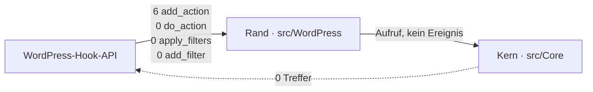
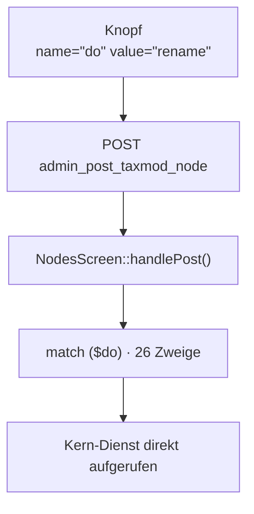
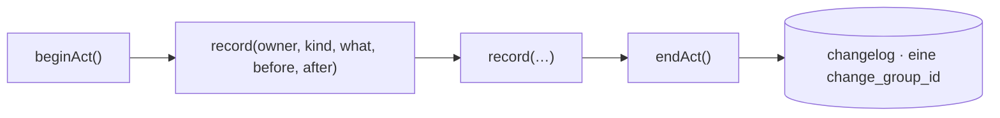
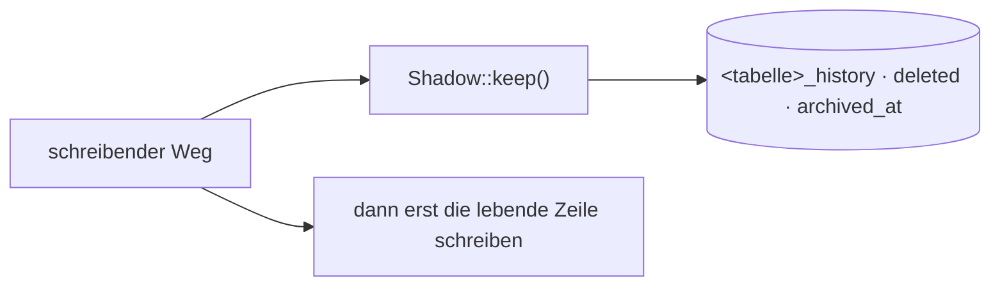
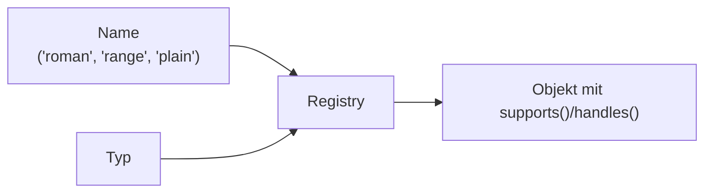
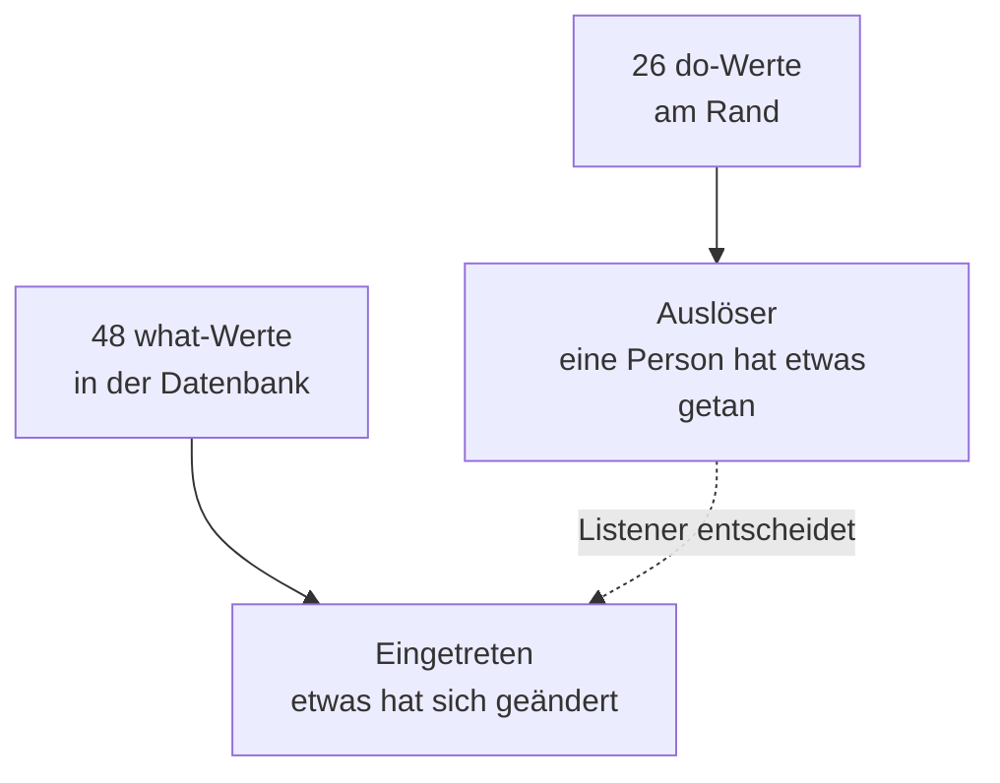
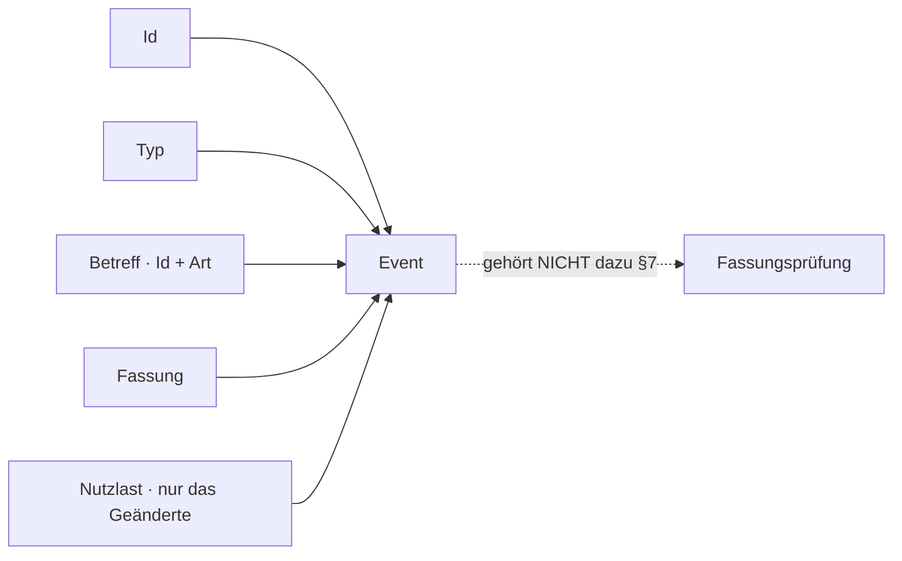
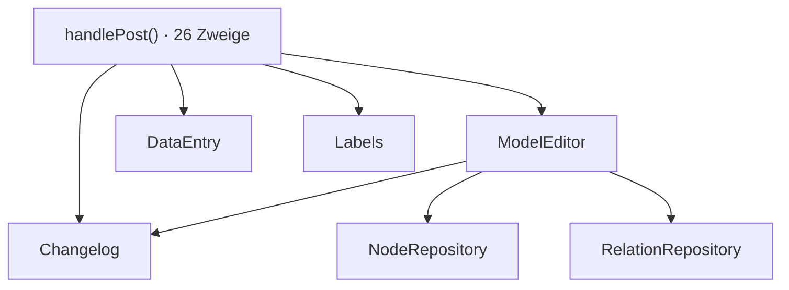
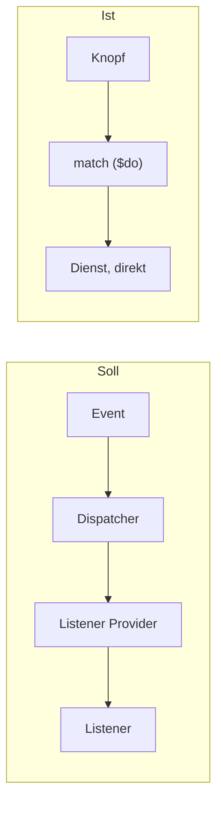
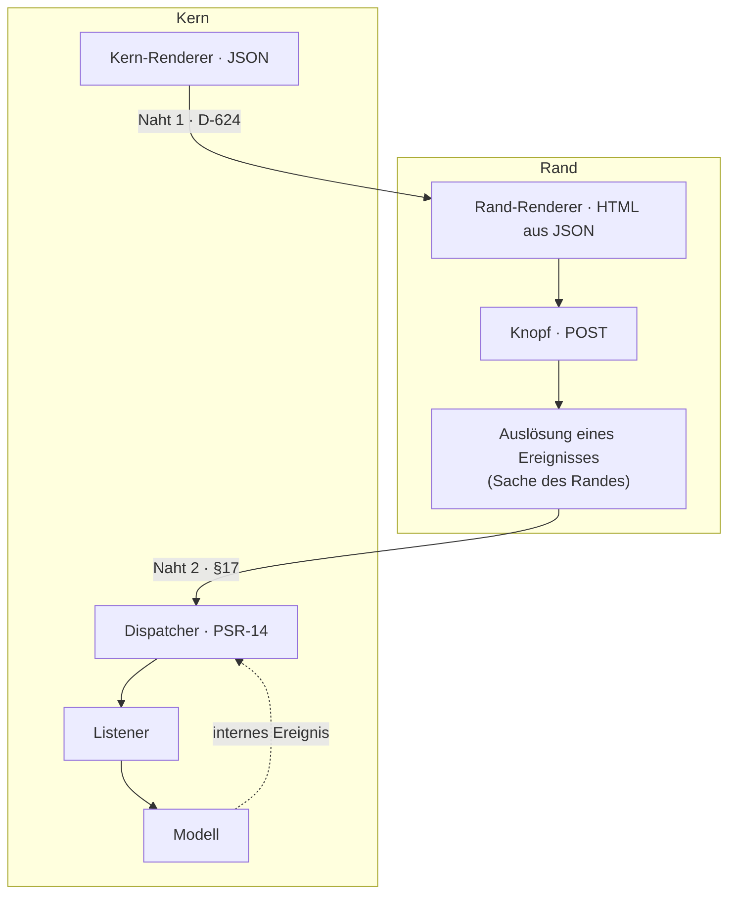

# Paket · Ereignisse — Ist-Analyse

**Stand 2026-09-05.** Antwort auf die zehn Fragen aus [`konzept.md`](konzept.md) §18, am Bestand
**gemessen**. *§19 gibt die Reihenfolge vor — Ist-Analyse, dann Soll/Ist, dann Eventtypen, dann
Refactoringplan. **Hier wurde nichts gebaut und nichts umgebaut.***

⚠️ **`PR-7`:** Was ich nicht messen konnte, steht als solches da. Was unklar bleibt, steht als
Frage in §12 — nicht als Antwort.

**Messgrundlage:** `src/` (154 PHP-Dateien), `assets/admin.js`, `composer.json`, und die laufende
Datenbank `wordpress` (10 `wp_taxmod_*`-Tabellen, `wp_taxmod_changelog` mit **35 422** Zeilen),
gelesen am 2026-09-05.

---

## 1 · Frage 1 — Welche Event-Mechanismen existieren bereits?



**Gemessen über `src/`:**

| Mechanismus | Anzahl | Ort |
|---|---|---|
| `add_action` | 6 | alle in `src/WordPress/Plugin.php` (Zeilen 65, 66, 70, 74, 79, 161) |
| `do_action` | **0** | — |
| `apply_filters` | **0** | — |
| `add_filter` | **0** | — |
| `register_activation_hook` | 1 | `Plugin.php:63` |
| PSR-14-Paket | **0** | `composer.json` fordert **nur** `php >= 8.1`; einzige Dev-Abhängigkeit ist PHPUnit |

**Befund: es gibt heute keinen Event-Mechanismus im Sinne des Konzepts.** Die sechs `add_action`
sind reine **Registrierungen** am Rand — *«hänge diese Methode an diesen WordPress-Zeitpunkt»* —
und nicht Verteilung eigener Ereignisse. Das Plugin **empfängt** WordPress-Ereignisse; es
**erzeugt** keine, auch nicht für sich selbst.

⚠️ **`CD-1` ist heute eingehalten und war nie gefährdet:** im ganzen Kern gibt es **keinen einzigen**
Aufruf der Hook-API. Ein PSR-14-Dispatcher im Kern bräche das nicht — ein `do_action` im Kern schon.
Wo die Grenze genau verläuft, steht in §10.

⚠️ **PSR-14 wäre die erste Laufzeit-Abhängigkeit des Projekts überhaupt.** *Das ist kein Einwand,
aber eine Tatsache, die vor der Umsetzung jemand entscheiden muss (Frage F-3 in §12).*

---

## 2 · Frage 2 — Welche Stellen erzeugen bereits implizit Ereignisse?



**Das ist der `ButtonPressEvent` des Konzepts — nur ohne Event, ohne Dispatcher und ohne Listener.**

**Gemessen** in `src/WordPress/Admin/NodesScreen.php` (4 084 Zeilen), `handlePost()` ab Zeile 3745:

- **ein** POST-Endpunkt (`admin_post_taxmod_node`),
- **ein** Feld `do`, das den Auslöser trägt (Zeile 3760; es darf als Array ankommen, `do[<schlüssel>]`),
- **26 Zweige** in einem `match ($do)` (Zeilen 3797–3906), Endzweig `default => throw`.

Die 26 Werte, wörtlich aus der Quelle:

```text
create  add_child  add_child_here  toggle_hide  duplicate  rename  move
field_up  field_down  up  down  restore  clear_trash  trash  trash_node
add_field  retarget_field  remove_field  restore_field  toggle_field_hide
add_part  duplicate_field  put_setting  put_multiplicity  add_record  save_record
```

**Zwei weitere solche Stellen:** `SettingsScreen::handlePost()` (Zeile 173) und
`CleanupScreen::handlePost()` (Zeile 255) mit eigenem `match ($act)` (Zeile 298).

⚠️ **Der Auslöser ist schon getrennt beschrieben, und zwar im Kern.** `src/Core/Renderer/Control.php`
ist «one thing a person can do to the subject — **described, not drawn**»: es trägt `name`, `value`,
`label`, `available`, `destroys`. **Der Kern beschreibt den Knopf, der Rand baut ihn, der Browser
schickt `do=<value>` zurück — und genau dort endet die Beschreibung und beginnt ein 110 Zeilen
langer `match`.** *Das ist die Stelle, an der ein Event heute fehlt und nicht die, an der es
schwerfiele.*

**Im Browser** (`assets/admin.js`, 560 Zeilen): **14** `addEventListener`, ausschliesslich
DOM-Ereignisse (`click`, `change`, `input`, `submit`, `keydown`, `scroll`, `DOMContentLoaded`). Kein
eigener Event-Bus, kein AJAX, keine REST-Route — **gemessen: 0 `register_rest_route`, 0 `wp_ajax`**.
Jede Interaktion, die etwas ändert, ist ein voller Seiten-POST mit Redirect.

---

## 3 · Frage 3 — Welche eventähnlichen Strukturen gibt es?

Zwei, und sie sind sehr verschieden.

### 3.1 · Das Änderungsbuch — ein Ereignisspeicher, der nicht so heisst



`src/Core/Repository/Changelog.php` — eine Schnittstelle **im Kern**, erfüllt von
`src/WordPress/Persistence/WpdbChangelog.php` (312 Zeilen).

**Gemessene Spalten** von `wp_taxmod_changelog`:

| Spalte | entspricht im Konzept |
|---|---|
| `id` | **Event-ID** (§8) |
| `owner_id`, `owner_kind` | Betreff — «Node-ID», «Edge» (§6) |
| `what` | **Event-Typ** (§5) |
| `before_state`, `after_state` | **Payload** (§6) |
| `at`, `by_user_id` | Kontext |
| `change_group_id` | **die Klammer eines Akts** — hat im Konzept **kein Gegenstück** |
| `version` | **Fassung** (§7) |

**Gemessen an 35 422 Zeilen:**

| Messung | Wert |
|---|---|
| Zeilen gesamt | 35 422 |
| verschiedene `what`-Werte | **48** |
| davon der Form `setting <schlüssel> set` | **19** |
| `owner_kind` | `node` 24 818 · `relation` 10 593 · `installation` 3 · `gone` 8 |
| Änderungsgruppen | 29 301 |
| Gruppen mit genau **einer** Zeile | 25 530 (87 %) |
| grösste Gruppe | 48 Zeilen |
| `version` **gefüllt** | **158** von 35 422 (0,4 %) |
| `by_user_id` leer (= Maschine, [D-296](../../NewConcept/90-decision-log.md)) | 29 517 |

**Antwort auf die Kernfrage des Auftrags: ja — das Änderungsbuch *ist* ein Ereignisspeicher, aber
ein unvollständiger und einer ohne Verteilung.**

⚠️ **Nachgetragen am 2026-09-05, und die Antwort steht damit gegen einen Satz des Eigentümers —
das wird hier nicht geglättet, sondern ihm vorgelegt** ([D-627](../../NewConcept/90-decision-log.md)).
*Er sagte, auf dieselbe Frage: «das ist kein Speicher an sich, ist einfach nur ein Mechanismus, den
man anschalten kann, und der dann je nach Filter — Error, Debug oder sonst was — die entsprechenden
Ausgaben mitloggt. Das soll zur Fehlerbehebung dienen.»* **Vermutlich reden beide Seiten von
verschiedenen Dingen:** *er von dem **Protokoll** aus [§14](konzept.md) — abschaltbar, für die
Fehlersuche —, die Messung von der Tabelle `changelog`, die 35 422 Zeilen Modellgeschichte trägt
und ausdrücklich **nicht** abschaltbar ist, weil das Rückgängigmachen darauf steht. **Wenn das so
ist, sind es zwei Dinge und die Frage `F-4` unten ist die richtige;** wenn nicht, ist diese Messung
die falsche Antwort auf seine Frage. **Das entscheidet er, nicht dieses Dokument** (`PR-4`).*

Was **dafür** spricht, gemessen:

- Es hat Identität (`id`), Typ (`what`), Betreff und Nutzlast — genau die vier Angaben aus §6/§8.
- Es hat mit `beginAct()`/`endAct()` eine **re-entrante Klammer**, die Konzept und PSR-14 beide
  nicht kennen und die etwas Echtes trägt: *«was in einer Änderung geändert wurde … soll eine
  Änderungsnummer haben»* (Zeile 45 der Arbeitsliste, im Docblock zitiert).
- `before_state`/`after_state` haben seit [D-427](../../NewConcept/90-decision-log.md) ein
  **Format mit Vertrag** — `Taxmod\Core\Model\FrozenState`, ein Erbauer und ein Leser. Das ist
  genau die Strenge, die ein Payload braucht.

Was **dagegen** spricht, ebenfalls gemessen:

1. **Es ist ein Speicher, kein Verteiler.** Niemand liest daraus, um zu *reagieren*. Die einzigen
   Leser sind `actAround()` und `pathBeforeLastParking()` (für die Wiederherstellung) und
   `summaryOf()` (für die Anzeige). **Es gibt keinen Empfänger, der auf einen neuen Eintrag hin
   etwas tut.**
2. **`what` ist keine Typenliste, sondern gewachsene Prosa.** 48 Werte, davon **19 mit der Adresse
   im Verb** (`setting min set`, `setting range_max set`, …) — der Docblock von `Changelog::record()`
   verbietet genau das («The address belongs in the state, never in `what`»), und die Tabelle tut
   es trotzdem 19-fach. Weitere Werte sind Sätze: `field became a setting`, `children promoted`,
   `import reverted`, `trash cleared`. **Als Eventtyp-Liste ist das unbrauchbar.**
3. **Die Fassung fehlt praktisch.** §7 verlangt sie im Kontext; die Spalte existiert und ist zu
   **99,6 %** leer.
4. **Es sieht Datensätze nicht.** Siehe §3.2 und §8 — der wichtigste Ereignistyp des Konzepts
   (*Änderung eines Node Records*, §3) hinterlässt **keine einzige** Zeile: `owner_kind` kennt kein
   `record`.
5. **Es wird geschrieben, wenn etwas schon geschehen ist.** Ein Event nach §3 beschreibt ein
   *eingetretenes* Ereignis — das passt. Aber ein `ButtonPressEvent` nach §4 beschreibt einen
   *Auslöser*, und den kennt das Änderungsbuch nicht.

⚠️ **Der ehrliche Satz lautet daher:** das Änderungsbuch ist die **Aufzeichnungshälfte** eines
Ereignissystems, gebaut ohne die Verteilungshälfte. *Es liefert die beste vorhandene Vorlage für
`Event`, und es ist **kein** Dispatcher.*

### 3.2 · Die Schattentabellen — Zustandsgeschichte, kein Ereignis



`src/WordPress/Persistence/Shadow.php` ([D-536](../../NewConcept/90-decision-log.md),
[D-537](../../NewConcept/90-decision-log.md)) — **28 Aufrufstellen** über 5 Dateien, gemessen.

**Gemessene Bestände:**

| Schatten | Zeilen | davon `deleted = 1` |
|---|---|---|
| `nodes_history` | 19 539 | 10 618 |
| `relations_history` | 24 582 | 16 934 |
| `records_history` | 1 509 | 1 509 |
| `record_values_history` | 4 242 | 2 816 |

**Das ist ausdrücklich *kein* Ereignisspeicher, und der Docblock sagt warum:** *«**Die alte Zeile
ist der Vorher-Zustand**, in ihrer eigenen Form»* — Zustand, nicht Vorgang. Ein Schatten sagt *wie
es aussah*, nie *was geschah* und nie *warum*. **Er hat kein `what`.**

⚠️ **Er ist trotzdem für das Ereignissystem wichtig, an genau einer Stelle:** wenn ein Event nach
§6 nur die *geänderten* Daten trägt, ist der Schatten die Stelle, aus der ein späterer Leser den
Rest holt, ohne dass das Event ihn tragen muss.

---

## 4 · Frage 4 — Welche Listener-/Callback-/Handler-Mechanismen existieren?



**Es gibt keine Listener. Es gibt drei Registries, und sie haben die Form eines Listener Providers.**

| Registry | Zeilen | Schlüssel | ausgelieferte Einträge |
|---|---|---|---|
| `Core/Renderer/RendererRegistry.php` | 340 | Name **und** Typ (**und** Zweck) | `ShippedRenderers.php` (142 Z.) |
| `Core/Converter/ConverterRegistry.php` | 133 | Name | `ShippedConverters.php` (43 Z.) |
| `Core/Validator/ValidatorRegistry.php` | 157 | Name | `ShippedValidators.php` (43 Z.) |

`RendererRegistry` ist der reifste davon: er beantwortet **zwei** Fragen zu verschiedenen Zeitpunkten
([D-217](../../NewConcept/90-decision-log.md)) — *gib mir den mit diesem Namen* und *welche kommen
für diesen Knoten überhaupt in Frage* — und kennt mit `addForSurfaces()` eine Kategorie
«registriert, aber nicht zur Wahl gestellt» ([D-367](../../NewConcept/90-decision-log.md)).

⚠️ **Das ist das Muster, das ein `ListenerProvider` braucht: Auswahl anhand einer Eigenschaft des
Gegenstands, nicht anhand einer Frage an jeden Einzelnen.** §9 verlangt genau das — *«Dadurch wird
vermieden, dass jeder Listener zunächst ein generisches Event erhält»*. **Der Bestand hat diese
Denkweise dreimal umgesetzt, nur nie für Ereignisse.**

**Was es sonst an Rückrufen gibt:** die sechs `add_action`-Erstklassen-Rückrufe
(`$plugin->handleNodeAction(...)`) und zwei `fn () => print …` in `registerMenu()`. Das ist alles.

---

## 5 · Frage 5 — Welche Eventtypen legt der **Bestand** nahe?

⚠️ **§18 warnt ausdrücklich davor, `ButtonPressEvent` und `NodeRecordChange` für gesetzt zu halten.
Deshalb kommt die folgende Liste aus zwei Messungen und nicht aus dem Konzept:** den **26**
`do`-Werten des Randes und den **48** `what`-Werten der Datenbank.



**Die Messung zeigt zwei Familien, nicht eine.** Sie überlappen sich nicht: kein `do`-Wert ist ein
`what`-Wert, und die Zahlen gehen auseinander (26 gegen 48), weil **ein** Knopfdruck **mehrere**
Änderungen auslöst — grösste gemessene Gruppe: 48 Zeilen unter einer `change_group_id`.

### 5.1 · Familie A — Auslöser (aus den 26 `do`-Werten)

Gruppiert man die 26 nach dem, was sie am Gegenstand tun, bleiben **vier** Formen:

| Form | `do`-Werte, gemessen | Anzahl |
|---|---|---|
| etwas entsteht | `create`, `add_child`, `add_child_here`, `duplicate`, `add_field`, `duplicate_field`, `add_part`, `add_record` | 8 |
| etwas wird geschrieben | `rename`, `put_setting`, `put_multiplicity`, `save_record`, `retarget_field` | 5 |
| etwas bewegt sich | `move`, `up`, `down`, `field_up`, `field_down` | 5 |
| etwas verschwindet oder kommt zurück | `trash`, `trash_node`, `clear_trash`, `restore`, `remove_field`, `restore_field`, `toggle_hide`, `toggle_field_hide` | 8 |

⚠️ **Ob daraus vier Eventtypen werden oder einer mit einem Feld, ist eine Entscheidung und keine
Messung** — sie steht als Frage F-1 in §12. *Der Bestand spricht eher für **einen**: das Feld heisst
schon heute `do`, nicht `create_do`.*

### 5.2 · Familie B — Eingetretenes (aus den 48 `what`-Werten)

Zieht man die Adresse aus dem Verb — was `Changelog::record()` ohnehin fordert und die Tabelle
19-fach verletzt — schrumpfen die 48 auf eine kleine, tragende Menge. **Nach Gegenstand und
gemessener Häufigkeit:**

| Gegenstand | zusammengefasste Verben | gemessene Zeilen |
|---|---|---|
| **Knoten** | `created`, `renamed`, `moved`, `reordered`, `parked`, `restored`, `purged`, `hidden`/`shown`, `promoted`, `implemented by` | 24 818 (`owner_kind = node`) |
| **Kante** | `attribute added/removed/renamed/restored`, `field hidden/shown`, `field type set`, `field retargeted`, `multiplicity set`, `kind set` | 10 593 (`owner_kind = relation`) |
| **Einstellungswert** | die **19** `setting <schlüssel> set` + `setting <schlüssel> cleared` | zusammen ≈ 13 800 |
| **Datensatzwert** | *— existiert nicht im Änderungsbuch* | **0** |
| **Installation** | `import reverted`, `trash cleared` | 3 + 354 |

**Der Bestand legt damit vier Änderungs-Ereignisse nahe** — Knoten, Kante, Wert, Installation — und
nicht die vier des Konzepts (§5: `NodeChange`, `NodeRecordChange`, `EdgeChange`, `EdgeRecordChange`).

⚠️ **Der Unterschied ist wichtig und gemessen:** das Konzept teilt nach *Knoten gegen Datensatz*.
Der Bestand teilt nach *Modell gegen Wert*. **Und die Werte-Hälfte fehlt heute vollständig im
Änderungsbuch** — es gibt kein `owner_kind = 'record'`. *Ein Ereignissystem, das die 26 `do`-Werte
abbildet, müsste `add_record` und `save_record` mitnehmen, für die es heute keine Aufzeichnung
gibt.*

---

## 6 · Frage 6 — Welche Angaben muss ein Event tragen?



**Gemessen, was der Bestand heute schon je Angabe hat:**

| Angabe (§6/§7/§8) | im Bestand | gemessen |
|---|---|---|
| Event-Id | `changelog.id` | 35 422 vergeben |
| Typ | `changelog.what` | vorhanden, aber 48 Werte, 19 mit Adresse im Verb |
| Betreff-Id + Art | `owner_id` + `owner_kind` | vollständig |
| **Fassung** | `changelog.version` | **158 von 35 422** — praktisch nicht vorhanden |
| Nutzlast vorher/nachher | `before_state`/`after_state` via `FrozenState` | Format seit [D-427](../../NewConcept/90-decision-log.md) vertraglich |
| Akt-Klammer | `change_group_id` | 29 301 Gruppen; **im Konzept nicht vorgesehen** |

⚠️ **`FrozenState` ist bereits die Nutzlast-Form, die §6 verlangt, und mehr:** Schlüssel sind
Kleinbuchstaben-Token, Werte durch ein einzelnes Leerzeichen getrennt, nur das **letzte** Feld darf
Leerzeichen enthalten — *«Measured: **844** existing rows carry a node name with a space in it»*.
Der Docblock nennt den Grund, aus dem die Klasse überhaupt entstand: *«a journal entry carried a
value and no address»*.

⚠️ **§7 sagt, die Fassungs*prüfung* gehöre nicht zum Ereignissystem — und der Bestand hält das
bereits ein.** Gemessen: `ConcurrentChange` wird an genau **zwei** Stellen geworfen, beide in
`src/WordPress/Persistence/` (`WpdbNodeRepository.php:174`, `WpdbRelationRepository.php:116`), also
in der Datenhaltung. **Hier ist nichts zu ändern.**

---

## 7 · Frage 7 — Wo gibt es direkte Kopplungen, die ein Event ablösen könnte?



**Drei Kopplungen, nach gemessener Grösse:**

1. **Der `match` selbst.** 26 Zweige über 110 Zeilen, `NodesScreen.php:3797–3906`. Er ist zugleich
   Dispatcher **und** Listener-Verzeichnis **und** einziger Listener. **Jeder neue Knopf ist eine
   Zeile hier, und keine Erweiterung ohne Änderung dieser Datei ist möglich.** *Das ist die
   Kopplung, die §4 auflösen soll.*

2. **Der Rand kennt sieben Kern-Dienste namentlich.** `NodesScreen::__construct()` (Zeile 174) nimmt
   `ModelEditor`, `Tree`, `Labels`, `DataEntry`, `FrameworkNodes`, `Rendering`, `Changelog`. *Der
   `Changelog` steht dort mit ausdrücklicher Begründung: «the screen does not write history — the
   services do — but it is the only place that knows where **one act** starts and ends».*

3. **Schreiben und Aufzeichnen sind in denselben Methoden verwoben.** Gemessen: **20**
   `record()`/`recordMany()`-Aufrufstellen, davon **17 in `ModelEditor.php`** (1 570 Zeilen), 1 in
   `Labels.php`, 3 in `Residue.php`, 1 in `SeededFrameworkNodes.php`. **Jede Änderungsmethode
   schreibt ihre eigene Chronikzeile.** *Ein Ereignis, dem ein Aufzeichnungs-Listener zuhört, wäre
   genau die Entflechtung, die §10 beschreibt («Ein Event kann von mehreren Listenern verarbeitet
   werden»).*

⚠️ **Und die Lücke, die daraus folgt:** `DataEntry` (1 383 Zeilen, 28 öffentliche Methoden) hat
**keinen** `Changelog` im Konstruktor — gemessen: 0 Treffer für «changelog» in der Datei. **Deshalb
gibt es 4 242 Zeilen `record_values_history` und null Chronikzeilen für Datensatzwerte.** *Wer die
Aufzeichnung an ein Ereignis hängt, schliesst diese Lücke nebenbei; wer sie so lässt, muss `DataEntry`
17-mal von Hand nachziehen.*

---

## 8 · Frage 8 — Was kann weiterverwendet werden?

| Baustein | Datei | wofür im Ereignissystem |
|---|---|---|
| `FrozenState` | `Core/Model/FrozenState.php` | **Nutzlast-Form** (§6), Vertrag steht bereits |
| `Changelog` + `WpdbChangelog` | `Core/Repository/`, `WordPress/Persistence/` | **Ereignisspeicher** — die Schnittstelle liegt richtig, im Kern |
| `beginAct()`/`endAct()` | `Changelog.php` | **Korrelation** mehrerer Ereignisse zu einem Akt — re-entrant, funktioniert |
| `RendererRegistry` | `Core/Renderer/` | **Vorbild für den Listener Provider** — Auswahl über Typ, nicht über Nachfrage |
| `Control` | `Core/Renderer/Control.php` | **beschreibt den Auslöser schon** — Name, Wert, Verfügbarkeit, `destroys` |
| `Complaint` | `Core/Validator/Complaint.php` | **Fehler als Schlüssel + benannte Platzhalter**, nicht als Satz — genau §12 |
| `DomainError` und 13 Ableitungen | `Core/Exception/` | **Fehlerweitergabe** nach §12/PSR-14 (Exception unterbricht, erreicht den Erzeuger) |
| `Shadow` | `WordPress/Persistence/Shadow.php` | **Vollzustand**, damit das Event ihn nicht tragen muss |

⚠️ **`Complaint` ist der am weitesten vorbereitete Teil des Fehlerkonzepts aus §12:** *«Der Kern
macht keine Worte»* — ein Validator liefert einen Schlüssel mit benannten Platzhaltern, der Rand baut
den Satz. **Damit ist die Trennung «technische Fehlerbehandlung gegen Benutzerinformation», die §12
verlangt, im Kern bereits vorhanden** — sie hat nur noch keinen Weg vom Listener zur Oberfläche.

---

## 9 · Frage 9 — Wo weicht der Bestand vom Konzept ab?



| § | Soll | Ist, gemessen | Abweichung |
|---|---|---|---|
| 2 | PSR-14 als Grundlage | keine PSR-Pakete; `composer.json` fordert nur PHP | **vollständig offen** |
| 3 | Event beschreibt ein eingetretenes Ereignis | `changelog` tut das, 35 422-fach — aber nur als Zeile, nicht als Objekt | **halb** |
| 4 | Event beschreibt den Auslöser, Listener entscheidet | `match` **ist** die Entscheidung, 26 Zweige | **vollständig offen** |
| 5 | Change-Familie | 48 gewachsene `what`-Werte, 19 mit Adresse im Verb | **Typen unsortiert** |
| 6 | Nutzlast trägt das Geänderte | `FrozenState`, mit Vertrag | **erfüllt** |
| 7 | Fassung im Kontext | `version` zu 99,6 % leer | **offen** |
| 7 | Fassungsprüfung **nicht** im Ereignissystem | `ConcurrentChange` in 2 Persistenzdateien | **erfüllt** |
| 8 | Event-Id | `changelog.id` | **erfüllt** |
| 9 | Dispatcher + Listener Provider | nichts davon; Registries als Muster vorhanden | **vollständig offen** |
| 10 | mehrere Listener je Event | ein `match`-Zweig, ein Ergebnis | **vollständig offen** |
| 11 | keine Action-Schicht | es gibt keine — die `do`-Werte sind Namen, keine Klassen | **erfüllt** |
| 12 | Fehler: technisch gegen Benutzer | `DomainError` → `catch` → Meldung im Redirect (`handlePost` Z. 3925–3931); `Complaint` als Schlüssel | **teilweise erfüllt** |
| 13 | kein Retry | keiner vorhanden | **erfüllt** |
| 14 | Logging mit Log-Level | **gemessen: 0 `error_log`, 0 Logger, 0 PSR-3** | **vollständig offen** |
| 15 | Stoppable nur begründet | nichts vorhanden | offen, aber unkritisch |
| 16 | Konfigurationsseite, Abschnitt «Event» | `SettingsScreen` existiert (Untermenü «Installation», `Plugin.php:134`) | **Ort vorhanden, Abschnitt fehlt** |
| 17 | Abgrenzung GUI / Event / Modell / Datenhaltung | Schichtung existiert und ist scharf (`CD-1`) — siehe §10 | **Grundlage erfüllt** |

⚠️ **§14 ist die grösste einzelne Lücke: es gibt im ganzen `src/` keinen einzigen Logging-Aufruf.**
*Gemessen, nicht geschätzt.*

---

## 10 · Die zwei Nähte — §17 gegen D-623/D-624

**Das war der ausdrückliche Prüfauftrag, und die Antwort lautet: es sind zwei verschiedene Nähte,
und sie kreuzen sich an genau einer Stelle.**



**Naht 1** ([D-624](../../NewConcept/90-decision-log.md), sein Wort): *«der Renderer erzeugt dann
JSON, das wird an den Rand übergeben, und dort ist dann das Pendant ein Renderer, der HTML aus dem
JSON erzeugt … die Paarung Kern-Renderer ↔ Rand-Renderer ist die Naht, die beim Framework-Wechsel
getauscht wird.»* Sie verläuft **quer durch die Darstellung**.

**Naht 2** (§17): *«GUI entscheidet, wann eine Benutzerinteraktion als relevante Änderung an das
Modell bzw. Event-System übergeben wird.»* Sie verläuft **quer durch die Auslösung**.

**Sie widersprechen einander nicht — sie stützen einander.** Was zwischen ihnen liegt, ist genau
`Control`: der Kern beschreibt den Knopf, der Rand zeichnet ihn (Naht 1), der Rand fängt den Klick
und **erzeugt daraus das Ereignis** (Naht 2), und das Ereignis geht zurück in den Kern. *Was heute
fehlt, ist nur der letzte Pfeil.*

**Und damit die Antwort auf `CD-1`, präzise:**

| liegt im **Kern** | liegt am **Rand** |
|---|---|
| `Event` (die Klassen) | die **Auslösung** durch eine Benutzerinteraktion |
| `Dispatcher`, `ListenerProvider`, `Listener` (PSR-14, reines PHP) | `$_POST` lesen, Nonce prüfen, sanitisieren (`CD-5`) |
| die **Auslösung interner Ereignisse** | die Umsetzung eines Fehlers in einen `WP_Error`/eine Meldung |
| die Log-**Schnittstelle** (PSR-3-förmig) | die Log-**Erfüllung** (`error_log`, WordPress) |

**Die Grenze ist scharf und mit einer Zeile prüfbar:** ein PSR-14-Dispatcher im Kern ruft keine
WordPress-Funktion — ein `do_action` im Kern täte es und ist damit verboten. **Gemessen: heute steht
kein einziger Hook-Aufruf im Kern, die Grenze ist also unverletzt und muss nur gehalten werden.**

⚠️ **Ein Waechter dafür fehlt.** *Es gibt 60+ Prüfskripte in `scripts/dev/`, aber keines misst «kein
`do_action`/`add_action`/`apply_filters` unterhalb `src/Core/`». Solange der Kern keine Ereignisse
verteilt, war das folgenlos; mit dem Dispatcher wird es die eine Regel, die brechen kann.* Vorschlag
für den Refactoringplan, **nicht hier gebaut** (`PR-9` verlangt, dass jedes Paket seine Prüfungen
mitbringt).

---

## 11 · Frage 10 — Was wäre für eine Umsetzung zu ändern?

⚠️ **Das ist eine Aufzählung von Arbeit, kein Plan.** §19 verlangt Soll/Ist-Abgleich und Eventtypen
**vor** dem Refactoringplan; beides ist noch nicht entschieden.

| # | Was | Grösse, gemessen |
|---|---|---|
| 1 | PSR-14 als Abhängigkeit aufnehmen (oder die drei Schnittstellen selbst schreiben) | erste Laufzeit-Abhängigkeit überhaupt |
| 2 | `Event`, `Dispatcher`, `ListenerProvider` im Kern anlegen | neu; Vorbild `RendererRegistry` (340 Z.) |
| 3 | Die **48** `what`-Werte auf eine Typenliste zurückführen, Adresse aus dem Verb in den Zustand | 19 Werte betroffen, ≈ 13 800 Zeilen; **Altbestand bleibt lesbar**, [D-476](../../NewConcept/90-decision-log.md) |
| 4 | `changelog.version` füllen | 35 264 leere Zeilen; **Altbestand nicht nachtragbar** |
| 5 | `match ($do)` durch Auslösung + Listener ersetzen | 26 Zweige, 110 Zeilen, plus 2 weitere `handlePost` |
| 6 | Die **20** `record()`-Aufrufe in Aufzeichnungs-Listener überführen | 17 davon in `ModelEditor.php` |
| 7 | `DataEntry` an das Ereignissystem anschliessen | 1 383 Zeilen, heute **0** Chronikzeilen |
| 8 | Logging-Schnittstelle im Kern, Erfüllung am Rand | **von null**; heute 0 Logging-Aufrufe |
| 9 | Abschnitt «Event» auf der Installationsseite (§16) | `SettingsScreen` vorhanden |
| 10 | Wächter: kein Hook-Aufruf unterhalb `src/Core/` | neu, klein |

**Was ausdrücklich *nicht* zu ändern ist,** weil es dem Konzept schon entspricht: die Fassungsprüfung
in der Persistenz (§7), das Fehlen einer Action-Schicht (§11), das Fehlen eines Retry (§13), die
Schichtung Kern/Rand (§17, `CD-1`), `FrozenState` als Nutzlastform (§6).

---

## 12 · Offene Fragen an den Eigentümer

*Nicht beantwortet, sondern gestellt (`PR-4`).*

```text
F-1 · Eine Auslöser-Familie oder vier?
Gemessen: 26 do-Werte am Rand, die in vier Formen zerfallen (entstehen, schreiben,
bewegen, verschwinden). Soll daraus EIN Auslöser-Event mit einem Feld werden — so
wie das Formularfeld heute schlicht «do» heisst — oder vier Eventtypen, damit ein
Listener sich nach §9 gezielt registrieren kann?
```

```text
F-2 · Modell gegen Wert, oder Knoten gegen Datensatz?
Das Konzept (§5) teilt die Change-Familie in NodeChange / NodeRecordChange /
EdgeChange / EdgeRecordChange. Der gemessene Bestand teilt anders: Knoten (24 818),
Kante (10 593), Einstellungswert (≈ 13 800), Installation (357) — und Datensatzwerte
kommen im Änderungsbuch überhaupt nicht vor. Welche Teilung gilt?
```

```text
F-3 · PSR-14 als Paket oder als eigene Schnittstellen?
composer.json fordert heute nur «php >= 8.1» und hat ausser PHPUnit keine
Abhängigkeit. psr/event-dispatcher wäre die erste Laufzeit-Abhängigkeit des
Projekts. Paket einbinden, oder die drei Schnittstellen selbst schreiben und
PSR-14-kompatibel bleiben?
```

```text
F-4 · Ist das Änderungsbuch der Ereignisspeicher, oder steht ein zweiter daneben?
Es hat Id, Typ, Betreff, Nutzlast, Zeit und Benutzer — die vier Angaben aus §6/§8
und zwei mehr. Es hat aber auch etwas, das im Konzept fehlt: die Klammer
change_group_id (29 301 Gruppen). Wird das Änderungsbuch zum Ereignisspeicher
umgebaut, oder schreibt ein Listener künftig hinein und der Speicher ist ein
anderer?
```

```text
F-5 · Was wird aus der Akt-Klammer?
beginAct()/endAct() gruppieren, was eine Person in EINEM Zug getan hat — auf seine
Bitte hin gebaut. PSR-14 kennt so etwas nicht. Bleibt sie eine Sache der
Aufzeichnung, oder trägt jedes Event die Akt-Nummer als Teil seines Kontexts mit?
```

```text
F-6 · Bleiben die 35 264 Zeilen ohne Fassung, wie sie sind?
§7 verlangt die Fassung im Event-Kontext; die Spalte ist zu 99,6 % leer und lässt
sich rückwirkend nicht füllen. Neue Ereignisse tragen sie — und die alten Zeilen
bleiben, wie sie sind (so wie D-476 es für die alten Zustandsformate hält)?
```

```text
F-7 · Wie kommt ein Fehler aus dem Listener zur Oberfläche?
§12 verlangt die Trennung technischer Fehler von Benutzerinformation. Der Kern hat
mit Complaint (Schlüssel + benannte Platzhalter) und 13 DomainError-Klassen beide
Formen. Heute überlebt genau EINE Meldung den Redirect, als Text in der URL. Bei
mehreren Listenern können es mehrere sein — sammeln und alle zeigen, oder beim
ersten abbrechen (was §15 gerade nicht will)?
```

```text
F-8 · Braucht das Logging (§14) ein PSR-3-Paket?
Im ganzen src/ gibt es heute null Logging-Aufrufe. Die Log-Level aus §14 sind die
von PSR-3. Dieselbe Frage wie F-3, für ein zweites Paket.
```

---

## 13 · Was nicht gemessen werden konnte (`PR-7`)

- **Das Frontend.** Es gibt heute keines: 0 REST-Routen, 0 AJAX-Endpunkte, 0 registrierte Blöcke in
  `src/`. Alles Gemessene betrifft die Admin-Oberfläche. *Was ein Block ([D-625](../../NewConcept/90-decision-log.md))
  an Ereignissen auslöst, ist am Bestand nicht messbar, weil der Bestand keinen hat.*
- **`legacy-code/`** wurde nicht ausgewertet — es ist Steinbruch (`PR-1`) und nicht Bestand.
- **Die Laufzeit.** Ob ein `match`-Zweig langsam ist, wieviel ein Dispatcher kostet: nicht gemessen,
  weil dafür kein Messaufbau existiert.
- **Der zweite Agent.** `TASK-018` bewegt zur Messzeit 18 Dateien in `src/`, darunter `ModelEditor.php`
  und `Rendering.php`. **Die hier genannten Zeilennummern können sich um wenige Zeilen verschieben;
  die Zählungen (26 Zweige, 20 `record()`-Stellen, 48 `what`-Werte) sind davon nicht berührt.**
