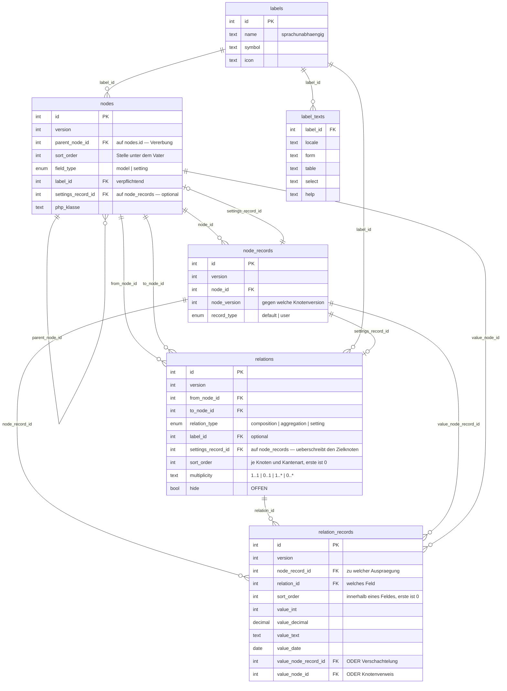

# Modelltabellen — Diagramm zum Spielen

**Stand 2026-09-02.** Gibt den Soll-Zustand aus [`package.md`](package.md) wieder.
**Zum Ausprobieren gedacht** — Änderungen hier sind kein Konzept, bis sie dort ankommen.



## Die zwei Schlüssel

```text
from_node_id · relation_type · sort_order      Reihenfolge der Felder unter einem Knoten
node_record_id · relation_id · sort_order      Reihenfolge der Werte in einem Feld
```

## Was offen ist

- `hide` an `relations` — verliert mit der Vererbung alle Benutzer
- Was bei einem Konflikt zwischen `node_records.node_version` und dem Knoten geschieht
- **Ob `settings_record_id` überhaupt bleibt** — [D-529](../../NewConcept/90-decision-log.md) sagt
  «eine Einstellung ist ein Feld, also eine Kante», [D-578](../../NewConcept/90-decision-log.md)
  «ein Wert an einer Kante ist eine Zeile in `relation_records`». Dann wären die Einstellungen
  eines Knotens einfach seine Kanten vom Typ `setting` — und die Spalte wäre ein zweiter
  Mechanismus für dasselbe.
