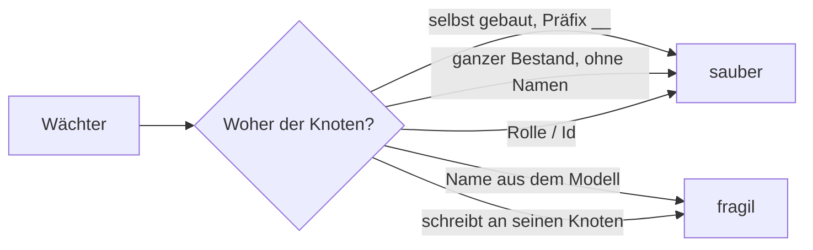
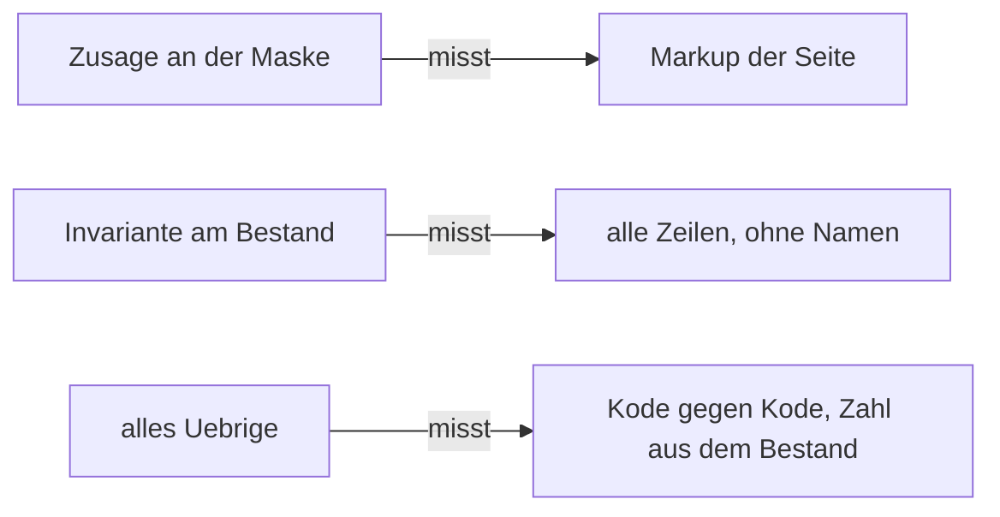

# Wächterbestand — gemessen am 2026-09-05

Anlass ist sein Satz: *«ja, bitte checken — das ist sonst wie eine selbsterfüllende Prophezeiung:
wir machen uns immer mehr Arbeit und werden immer langsamer beim Voranschreiten.»*

**Die drei Zahlen zuerst.**

| | |
|---|---|
| **57 von 71 sind sauber** | Sie bauen sich ihre Knoten selbst und räumen sie weg, oder sie lesen nur Dateien, das Schema und den Bestand als Ganzes. Kein Name aus seinem Modell, keine feste Zahl darauf. |
| **2 habe ich gelöst** | `setting-kind` und `preview` holten einen **Astwurzelknoten über seinen Namen** (`Settings`, `Data Types`). Sie holen ihn jetzt über seine Rolle — so, wie der Kode es ohnehin tut ([D-613](../../NewConcept/90-decision-log.md)). Beide grün. |
| **12 blieben offen, heute 11** | 10 hängen über einen Namen an einem Knoten, 1 schreibt Werte an den Datensatz **seines** Knotens statt an einen eigenen, 4 tragen zusätzlich eine feste Zahl auf seinen Bestand (Überschneidungen). Jede einzelne ist eine halbe bis ganze Umschreibung des Laufs — zu gross für diesen Durchgang, darum aufgeschrieben statt angefangen. ⚠️ *`field-hide` ist am 2026-09-06 dazwischengekommen, weil er rot wurde; siehe unten.* |

⚠️ **Die gemessene Rangfolge ist nicht die vermutete.** *Die Sorge war, der Bestand hänge breit an
seinem Modell. Er tut es nicht: **vier Fünftel der Wächter sind bereits gelöst**, und der Rückstand
sitzt konzentriert in zwölf Läufen, von denen zehn denselben Handgriff brauchen — den Knoten über
seine Rolle statt über seinen Namen holen.*

---

## Nachtrag 2026-09-06 — «sauber» war gelesen, nicht gemessen

⚠️ **Die Spalte «Sauber — eigene Knoten, gebaut und weggeräumt» oben ist am Kode abgelesen, und
gemessen stimmt sie nicht.** *Am 2026-09-06 wurde jeder Lauf einzeln gefahren, mit einem Abzug aller
dreizehn Tabellen davor und danach. **Von 73 Läufen veränderten 42 den Bestand; 17 davon an Knoten,
Kanten, Sätzen, Wertzeilen oder Beschriftungen.** Darunter `composition`, `converter`,
`journal-address`, `package7`, `scaffold` und `restore` — alle sechs stehen oben unter «sauber».*

**Warum das Ablesen es nicht sehen konnte:** die Läufe räumen wirklich auf, nur **am Ende**. Ein
Lauf, der in Zeile 200 rot wird, erreicht seine Zeile 400 nie, und ein `finally` läuft an einem
`exit(1)` vorbei. *Der Eigentümer hat den Preis auf seinem Bildschirm gesehen: `read_only`
**zweimal** an seinem `Integer` — die zweite Kante `Integer --read_only--> Constants` aus
`package7-check.php`; dazu drei Knoten `__cv Zahl` aus `converter-check.php` unter demselben
`Integer` und dreimal eine deutsche `Adresse` aus `seed-twice-check.php`. Drei Läufe, ein Tag.*

**Die Antwort ist keine bessere Aufräumroutine, sondern eine Klammer:** jeder Wächter mit `wp-load`
lädt unmittelbar danach [`scripts/dev/lib/no-write.php`](../../../scripts/dev/lib/no-write.php) —
`START TRANSACTION`, und ein `ROLLBACK` am Herunterfahren des Prozesses, das auch nach einem
Abbruch greift. **Nachgemessen: kein Lauf schreibt mehr ins Modell.** Bewacht von
`no-model-write-check.php`; die einzige Ausnahme ist `labels-page-save`, dessen Kindprozess eine
eigene Verbindung hat und darum von einer offenen Umklammerung nichts sähe.

⚠️ **Aufräumen bleibt im Kode und wird nicht entfernt** — *es ist nur nicht mehr das, worauf der
Bestand sich verlässt.*

⚠️ **Was dieser Nachtrag ausdrücklich nicht anfasst: die festen Zahlen in den Zusagen.**
*`package3` (`=== 20` Präfixe), `renderer-choice` (`> 50`, `>= 20 von 28`) und `rename-survives`
(`>= 4`) tragen weiter eine Momentaufnahme seines Bestandes als Vertrag. Die Tabelle unten sagt
selbst, dass aus `=== 20` ein `>= 20` zu machen eine **Entschärfung** wäre und seinen Grund braucht
(`PR-9`) — also steht es hier als Befund und nicht als Reparatur.*

---

## Was «hängt an seinen Daten» heisst

Der Bestand als Ganzes zu lesen ist **kein** Mangel: `orphans`, `id-space`, `shadow-shape` und ihre
Verwandten prüfen Invarianten (*nichts ist verwaist*, *jede Id hat ihren Raum*) und werden nur rot,
wenn wirklich etwas kaputt ist. Fragil wird es an genau zwei Stellen: **ein Name**, den er jederzeit
ändern darf, und **eine feste Gleichheit** auf eine Menge, die er jederzeit vergrössern darf.

---

## Die Tabelle

`s` ist die gemessene Laufzeit einzeln, `Ø 0,84 s`. **Summe aller 71: 59,4 s.**

### Sauber — eigene Knoten, gebaut und weggeräumt (30)

| Wächter | s | | Wächter | s | | Wächter | s |
|---|---|---|---|---|---|---|---|
| change-group | 0,79 | | journal-address | 1,03 | | parked-in-shadow | 0,80 |
| cleanup-screen | 0,81 | | label-space | 0,73 | | record-on-first-write | 0,68 |
| cleartrash | 0,76 | | labels-page-save | 3,32 | | renderer-choice-mask | 1,72 |
| collapsed-default | 2,13 | | move-mask | 1,00 | | scaffold | 0,73 |
| composition | 1,03 | | multiplicity | 0,97 | | setting-branch-relation | 0,77 |
| converter | 0,80 | | package1 | 0,93 | | setting-self-inherit | 0,75 |
| dangling-reference | 0,73 | | package2 | 1,66 | | target-link | 0,83 |
| edge-class | 0,65 | | package5 | 0,95 | | type-binding | 0,69 |
| form-membership | 0,80 | | package6 | 1,17 | | used-by | 0,94 |
| hide-abort | 1,01 | | package7 | 1,67 | | version | 0,80 |

Keiner davon trägt einen Namen oder eine Zahl aus seinem Modell. `composition`, `form-membership`,
`multiplicity` und `setting-relation` benutzen das Gerüst (`scripts/dev/geruest.php`);
`renderer-choice-mask` gehört zur gleichzeitigen Renderer-Arbeit und ist nicht angefasst.

### Sauber — nur Dateien, Kode oder Schema, kein WordPress (11)

| Wächter | s | Stand |
|---|---|---|
| always-on | 0,13 | ⚠️ **rot, ohne Zutun** — `CLAUDE.md` + `arbeitsmodell.md` + `AGENTS.md` sind 45.436 B gegen eine Decke von 43.170 B. Alle drei sind für mich gesperrt; das ist eine Entscheidung, keine Reparatur. |
| anchor | 0,09 | grün |
| concept-drift | 0,18 | grün |
| confirmed-quote | 0,08 | grün |
| icon-markup | 0,16 | grün |
| question-symmetry | 0,09 | grün |
| references | 0,14 | grün |
| rules-index | 0,34 | ⚠️ **rot, ohne Zutun** — 303 Regeln, das Verzeichnis sagt etwas anderes. Neu erzeugen genügt. |
| settings-are-gone | 0,09 | grün |
| superseded | 0,08 | grün |
| supersession | 0,20 | grün |

### Sauber — liest den ganzen Bestand, ohne Namen und ohne feste Zahl (16)

| Wächter | s | | Wächter | s | | Wächter | s |
|---|---|---|---|---|---|---|---|
| dialog-script | 0,63 | | node-binding | 0,61 | | silent-query | 0,82 |
| icon-button | 1,05 | | orphans | 0,58 | | simple-type | 0,62 |
| id-space | 0,59 | | restore | 0,65 | | sort-order | 0,67 |
| implemented-by | 0,61 | | seed-twice | 0,68 | | value-ref-space | 0,57 |
| inheritance-column | 0,67 | | settings-record-carrier | 0,60 | | shadow-shape | 0,66 |
| label-role | 0,65 | | | | | | |

### Gelöst in diesem Durchgang (2)

| Wächter | s | Was daran hing | Was jetzt dasteht |
|---|---|---|---|
| **setting-kind** | 0,60 | `WHERE name = 'Settings'` — der Ast über seinen Namen. | `rootOf(Branch::Settings)`. **Die Zusage ist wörtlich dieselbe**: der Ast steht direkt unter der Wurzel und trägt Knoten. Grün. |
| **preview** | 3,07 | `WHERE name = 'Data Types'` — und der Kommentar daneben behauptete bereits, der Knoten werde *«über seinen Ast gesucht und nicht über einen Namen»*. Er wurde es nicht. | `rootOf(Branch::DataTypes)`. Grün. ⚠️ *Der zweite Name in derselben Datei — `yotta` — steht noch, siehe unten.* |

### Gelöst am 2026-09-06 (1) — und es war teurer als eine Umstellung

| Wächter | s | Was daran hing | Was jetzt dasteht |
|---|---|---|---|
| **field-hide** | 0,99 | `Prefixes`, `count($bedienbar) === 1` — **und eine dritte, die in der Tabelle unten fehlte**: `$vorher === 0`, also *«sein Feld `exponent` ist sichtbar»*. | Eine eigene Wiese (`__fh Vater` / `__fh Kind` / `__fh Typ`), aufgeräumt im `finally`. Die Zusagen sind Invarianten: *ein frisch erklärtes Feld ist sichtbar*, *umgeschaltet ändern sich Spalte und Zeichen*, *zurück ist es wieder wie vorher*. Neun grün. |

⚠️ **Diese Zeile ist der Beleg dafür, wofür diese Liste da ist.** *Am 2026-09-05 um 21:46:39 hat der
Eigentümer `Prefixes.exponent` im Schirm versteckt — der Fall, für den
[D-467](../../NewConcept/90-decision-log.md) die Spalte an die Kante gelegt hat. **Von diesem Klick
an war der Wächter rot**, und sein rohes Zurückschreiben hat den Zustand seither in jedem Lauf
festgenagelt: im Änderungsbuch stehen 26 «field hidden» gegen 51 «field shown», die 25 überzähligen
sind Läufe, in denen das Verstecken schon nichts mehr zu tun hatte. **Der Knopf war nie kaputt.**
Eine Momentaufnahme seines Bestands als Zusage ist nicht nur zerbrechlich — sie meldet seine
richtige Bedienung als Fehler.*

### Offen — und warum (11)

| Wächter | s | Woran es hängt | Warum liegengelassen |
|---|---|---|---|
| **page-blocks** | 2,33 | `form`, `Passiv`, `Kontact`, `Gasse`, `Admin` — fünf Namen, davon vier reiner Modellinhalt. | **Die grösste.** 633 Zeilen, die die Admin-Maske an einem tief geschachtelten, gewachsenen Knoten prüfen. Ein Gerüst müsste Erbung, Einstellungen und Blockgrenzen nachbauen. |
| **unitvalue** | 0,78 | `Einheitenwert`, `Prefixes`, `Base units`, `kilo`, `Ohm`. | ⚠️ **Heute schon rot, und zwar mit Grund**: die Einheit zeichnet sich als `2.7 kilo ` statt `2.7 kilo Ohm`. **Das ist ein echter Befund, kein Namensproblem** — er wartet auf `OQ-134`. Nichts anfassen, bevor der steht. |
| **renderer-choice** | 0,69 | Sechs Namen (`Base units`, `Passiv`, `Integer`, `Dimension`, `Prefixes`, `Parts List`) und **zwei feste Zahlen auf seinen Bestand**: *«es gibt Kanten-Datensätze» → mehr als 50*, *«jeder Träger löst auf» → mindestens 20 von 28*. | Beides zugleich. Die Zahlen sind Untergrenzen und wachsen mit; sie werden rot, wenn er **wegnimmt**. |
| **package3** | 1,27 | `Prefixes`, `Base units`, `Celsius` — und `count($prefixNodes) === 20`, eine **feste Gleichheit**. | Legt er einen 21. Präfix an, wird der Wächter rot, ohne dass etwas kaputt ist. Aus `=== 20` ein `>= 20` zu machen wäre eine **Entschärfung** und braucht seinen Grund (`PR-9`). |
| **setting-write** | 0,87 | `Renderer` (Behälter) und `spinner` (Renderer-Knoten). | Trägt selbst den Befund, dass es **zwei Knoten namens `form`** gibt und einmal die falsche Rolle geschrieben wurde. Die Umstellung heisst: einen eigenen Renderer-Ast bauen. |
| **record-on-any-node** | 0,72 | `Prefixes`, `exponent` — **und schreibt Datensätze an `kilo`**, also an einen seiner Knoten. | Der Schreibfall gehört auf einen eigenen Knoten. Mittelgross, weil die Erbungskette mitgebaut werden muss. |
| **several-values** | 0,68 | Kein Name — sucht sich irgendeine passende Kante — **schreibt aber drei Werte an den Datensatz eines seiner Knoten**. | Räumt hinterher auf. Nach [D-614](../../NewConcept/90-decision-log.md) gehört das in den Testast: *«nicht sichtbar, den Arbeitsbaum nicht beschädigend»*. |
| **setting-relation** | 0,83 | `feldVon('Prefixes', 'exponent')`. | Benutzt bereits das Gerüst — der eine Namensgriff steht daneben. Kleinste der offenen; nur nicht mehr in dieses Zeitfenster gefallen. |
| **field-type-gone** | 0,62 | `WHERE name = 'Renderer'`. | Wie `setting-write`. |
| **rendering-scaffold** | 0,73 | `Converter`, `roman`. | Rahmenwerk — nach [D-613](../../NewConcept/90-decision-log.md) erlaubt (*«wer es umbenennt, ändert das Plugin»*), aber die Namen stehen im Wächter statt im Kode. |
| **rename-survives** | 1,33 | `count($traeger) >= 4` — eine feste Zahl auf seine Einstellungsträger. | Untergrenze; wird rot, wenn er drei davon löscht. |

⚠️ **Ein Rest in `preview`, obwohl der Lauf oben als gelöst steht.** *`WHERE name = 'yotta'` — und
dieser Fall ist der unangenehmere von beiden: **fehlt der Knoten, meldet der Lauf «no scaffolded node
to test against» und geht grün weiter.** Eine Umbenennung schaltet die Prüfung **still ab**, statt
sie rot zu machen. Zu lösen braucht es einen eigenen Knoten mit Datensatz und `hide`-Spalte —
nicht schwer, aber kein Einzeiler.*

**Und die Vorlage steht schon da.** `composition` und `multiplicity` hingen an `Adresse`, hängen seit
TASK-025 am Gerüst (`scripts/dev/geruest.php`) und prüfen **dieselbe Sache wie vorher**. Wer einen der
zwölf löst, kopiert von dort.

---

## Fällt einer um, wenn ein anderer vorher lief?

**Der gemeldete Fall reproduziert heute nicht.** Gemessen: `scaffold-check` allein → grün,
`inheritance-column-check` allein → grün, `scaffold-check` **dann** `inheritance-column-check` → grün
(19 Zusagen). Ein voller Lauf über alle 71 in alphabetischer Folge ergibt dieselben drei Roten wie
die Einzelläufe — `always-on`, `rules-index`, `unitvalue` —, und alle drei sind auch einzeln rot.
**Ordnungsabhängigkeit ist damit heute nicht nachweisbar**; als *nicht mehr auftretend* verbucht,
nicht als *behoben*.

⚠️ **Ein Rückstand steht im Baum, und der Wächter meldet ihn selbst.** *`setting-kind` sagt:
«Rest im Ast, auf den nichts zeigt: `__Test`». Das ist der Testast aus
[D-614](../../NewConcept/90-decision-log.md) — er stört nicht, aber er ist da, und dass ein Wächter
ihn nennt, ist genau das, was der Ast leisten sollte.*

---

## Was der Lauf kostet, und woran

| | |
|---|---|
| **Ganzer Lauf, 71 Wächter einzeln** | **59,4 s** |
| **Davon Booten von WordPress** | **60 Läufe × 0,50 s = 30,0 s — die Hälfte.** Gemessen mit einem Skript, das nichts tut als `wp-load.php` und den Autoloader zu laden: 0,505 / 0,504 / 0,500 s. |
| **Davon eigentliche Arbeit** | rund 29 s |
| **Elf Wächter booten gar nicht** | Sie lesen Dateien und laufen in 0,08–0,34 s. |

**Vorschlag, nicht umgebaut:** ein Sammelläufer, der **einmal** bootet und die 60 WordPress-Wächter
nacheinander in demselben Prozess einschliesst. Der Lauf fiele von **59,4 s auf rund 30 s** — die
Hälfte, ohne dass eine einzige Zusage sich ändert.

⚠️ **Es ist nicht umsonst, und das ist der Grund, es hier nur vorzuschlagen.** *Jeder Wächter ist
heute ein eigenes Skript mit `exit()`, globalen Variablen (`$ok`, `$bad`, `$wpdb`) und Funktionen im
Wurzelnamensraum — `check()` gibt es mehrfach mit verschiedenen Signaturen. In einem Prozess
kollidieren sie. **Der billige Weg ist der Unterprozess ohne neuen Boot**, der teure die
Umschreibung auf Klassen. Und ein zweiter Preis wäre die Trennschärfe: heute sagt ein Absturz genau,
welcher Lauf abgestürzt ist.*

---

*Gemessen 2026-09-05 auf Laragon/MySQL, PHP 8.3.30. Die Laufzeiten sind Einzelläufe, kalt, ein
Durchgang.*

---

# Nachtrag 2026-09-06 — welcher Wächter hat je einen Fehler gefunden?

**Sein Auftrag, wörtlich:** *«hast so viel checks aber trotzdem läuft dauernd etwas schief, ich fände
es besser weniger check dafür aber richtige zu haben.»*

**Die Antwort in einer Zeile: von 73 Läufen sehen 14 die Seite an, die er bedient — und alle vier
Fehler dieses Tages standen auf der Seite.**

## Der Befund, mit Zahlen

| gemessen am 2026-09-06 | |
|---|---|
| Wächterläufe insgesamt | **73** |
| davon **zeichnen eine Seite** (`screen()->render()`) | **14** |
| davon **gehen einen Akt** (`handlePost()`) | **8** |
| davon **ohne WordPress** — Dateien, Kode, Dokumente | **12** |
| Rest: Aussagen über den Bestand und über den Kern | **47** |
| Zeilen Wächter gegen Zeilen `src/` | **23 064 gegen 38 635** |
| Commits, die einen Wächter anfassen | **219** |
| davon **ohne jede Änderung an `src/`** | **64** — der Wächter wurde der Wirklichkeit nachgezogen, nicht umgekehrt |

⚠️ **Die vier Fehler dieses Tages sind alle an 73 grünen Läufen vorbeigekommen**, und alle vier
standen auf seinem Schirm: die Modellwurzel zwang jedem Knoten einen Renderer auf, die Feldreihenfolge
verzahnte Geerbtes mit Eigenem, die Einstellungstafel bot Schlüssel an, die der Typ nicht kennt, und
der Renderer-Kasten stellte die falsche Frage. **Jeder einzelne wäre einer Zusage an der Maske
aufgefallen** — und keiner einer Zusage am Kern.

## Belegte Funde — und belegte Fehlalarme

**Gesucht wurde nicht, was ein Wächter *bewacht*, sondern was er *gefunden* hat.** Quelle sind die
Commit-Nachrichten und die Kommentare in den Läufen selbst; wo nichts steht, steht hier «kein Fund
belegt» — und das ist kein Vorwurf an den Lauf, sondern die ehrliche Auskunft.

| Lauf | belegter **Fund** |
|---|---|
| `package7` | *«package7-check hat danach doppelte HTML-Ids gemeldet, erst elf zwischen Baum …»* |
| `package3` | *«nicht-persistent. package3-check hat es sofort gemeldet, wiederhergestellt.»* |
| `unitvalue` | *«unitvalue-check fand fuenf Glieder statt der drei aus …»* — und heute der Befund `2.7 kilo ` statt `2.7 kilo Ohm` |
| `labels-page-save` | das fehlende `form="…"` an einem Steuerelement; zweimal in `renderer-choice-mask` als *«den Regress, den `labels-page-save-check` einmal gefangen hat»* zitiert |
| `page-blocks` | das Dreieck in der Namenszelle, das aus `with_label` ein *mit-Dreieck-with_label* machte (`688798e`) |

| Lauf | belegter **Fehlalarm** — rot bei richtiger Arbeit |
|---|---|
| `package7` | rot, als der Eigentümer am `Integer`-Knoten eine Einstellung änderte (zweimal, Zeilen 246 und 281) |
| `page-blocks` | rot, als er `Adresse` um eine Schachtelung erweiterte, *«ohne dass etwas kaputt war»* |
| `page-blocks` | meldete *«null Felder, wo drei sind»*, weil «Settings» als Knotenname in der Zeile stand |
| `record-on-first-write` | rot, sobald ein anderer Wächter im selben Durchgang gelaufen war |
| `field-hide` | rot ab dem Klick, mit dem er `Prefixes.exponent` versteckte — **25 Läufe lang** |
| `renderer-choice-mask` | meldete einen Fehler, den der Lauf sich selbst gemacht hatte (`check_admin_referer`) |

⚠️ **Fünf Läufe mit belegtem Fund, sechs mit belegtem Fehlalarm.** *Das ist die Messung hinter seinem
Satz. **Ein Wächter, der bei richtiger Arbeit rot wird, erzieht dazu, rote Wächter zu übersehen** —
und dann sieht man auch den einen nicht, der recht hat.*

## Die drei Arten

**Maske** heisst: `seite($id)` zeichnen und im Markup nachsehen. **Invariante** heisst: eine Aussage,
die über *jeder* Zeile gilt und keinen Namen und keine Zahl aus seinem Bestand kennt. **Übrig** ist,
was Kode gegen Kode prüft oder eine Momentaufnahme festhält.

### Maske — bleiben, alle 14

`cleanup-screen`, `collapsed-default`, `field-hide`, `hide-abort`, `icon-button`, `labels-page-save`,
`move-mask`, `package7`, `page-blocks`, `preview`, `renderer-choice-mask`, `setting-branch-relation`,
`target-link`, `used-by`.

⚠️ *Hier gehört die Arbeit hin, nicht das Streichen. **Vier Zusagen sind heute dazugekommen** —
siehe unten.*

### Invarianten — bleiben, 13

| Lauf | die Aussage |
|---|---|
| `orphans` | kein Besitzer einer Einstellung oder Beschriftung ist verschwunden |
| `dangling-reference` | ein Verweis auf einen verschwundenen Knoten ist **am Feld** sichtbar |
| `value-ref-space` | kein Verweis ohne Raumangabe, und die Angabe stimmt |
| `id-space` | jede Tabelle vergibt ihre Ids selbst, keine Nummer zweimal |
| `silent-query` | eine kaputte Abfrage wirft, statt leer zu antworten |
| `no-model-write` | kein Wächter schreibt in sein Modell |
| `shadow-shape` | lebende Tabelle und Schatten haben dieselbe Form |
| `change-group` | ein Akt, eine Änderungsnummer |
| `version` | die Version wird immer mitgeschrieben |
| `sort-order` | eine Stelle je Knoten und Kantenart, und die erste ist `0` |
| `edge-class` | drei Werte, drei Klassen — und kein Datensatz hängt an zwei Besitzern |
| `seed-twice` | eine Saat, die zweimal läuft, verdoppelt nichts |
| `references` | kein Dokument beruft sich auf eine Nummer, die es nie gab |

⚠️ *Dazu die vier, die `CLAUDE.md` namentlich als Ersatz für die verbotenen Zählungen nennt und die
darum nicht zur Debatte stehen: `rules-index`, `concept-drift`, `confirmed-quote`, `superseded`.*

## Die Streichliste — vorgelegt am 2026-09-06, **ausgeführt am selben Tag**

⚠️ **Sie ist angenommen: auf die Frage «Die Streichliste: ja?» hat er geantwortet «checks mein ja».**
*Sein Grund, wörtlich: «hast so viel checks aber trotzdem läuft dauernd etwas schief, ich fände es
besser weniger check dafür aber richtige zu haben.» **Was jede Zeile hier gekostet und was sie
eingebracht hat, steht im Abschnitt darunter** — je gestrichenem Lauf eine Zeile mit dem, wohin
seine Zusagen gegangen sind.*

⚠️ **Vor jeder Streichung ist nachgesehen worden, ob die Zusage anderswo wirklich steht — und in
sechs Fällen stand sie es nicht.** *Dann ist sie **umgezogen**, bevor die Datei fiel. Die Liste unten
ist deshalb an mehreren Stellen als Begründung ungenau gewesen; das ist je Zeile vermerkt.*

| Lauf | Grund |
|---|---|
| `renderer-choice` | **Vollständig in `renderer-choice-mask` enthalten**, und er ist einer der vier grünen, die ihm am 2026-09-05 widersprachen: er schreibt über den Kern und hat nie gesehen, dass auf der Seite gar kein Wähler stand. |
| `rename-survives` | Dieselbe Aussage — «eine Umbenennung ändert nichts am Gezeichneten» — misst `renderer-choice-mask` am Markup, für **jede** angebotene Wahl. |
| `settings-record-carrier` | Der Träger des Einstellungsdatensatzes; `renderer-choice-mask` prüft ihn am Datensatz **und** an der Kante, nach dem Speichern über die Maske. |
| `setting-kind` | Geht in `setting-relation` auf: beide fragen, was eine Einstellungskante ist, seit `nodes.field_type` gefallen ist, aus derselben Quelle. |
| `setting-self-inherit` | Zwei Zusagen über dieselbe Kante wie `setting-relation`; sie gehören in einen Lauf. |
| `anchor` | Bewacht Verweise **innerhalb** von `docs/NewConcept/` — einem Steinbruch (`PR-1`, [D-568](../../NewConcept/90-decision-log.md)). Ein Wächter auf einem Dokument, das nicht mehr fortgeschrieben wird, hält einen Zustand fest, den niemand mehr ändert. |
| `question-symmetry` | Bewacht `91-open-questions.md` — das Fragenblatt ist mit seinem Konzept **geschlossen** (`PR-4`). |
| `supersession` | Dieselbe Aussage wie `superseded`, von der anderen Seite gelesen. |
| `settings-are-gone` | Bewacht **eine** Entscheidung ([D-506](../../NewConcept/90-decision-log.md)); das war eine einmalige Aufräumarbeit. |
| `icon-markup` | Prüft **Kode gegen Kode**. Dieselbe Sache misst `icon-button` an der gezeichneten Seite — und nur die Messung am Markup hat den Fehler je gefunden. |
| `dialog-script` | Prüft Kode gegen Kode und sagt in seinem eigenen Docblock, dass er das Verhalten **nicht** prüfen kann. |
| `package1` | «Anlegen, umbenennen, Papierkorb» — im Kernlauf (485 Tests) und in `cleartrash` enthalten. |
| `package2` | «Baum und Reihenfolge» — in `sort-order` und `collapsed-default` enthalten. |
| `package5` | «Beschriftungen, Rollen, Sprachen» — in `label-space` und `labels-page-save` enthalten. |
| `package6` | «Datensätze» — in `record-on-first-write` und `renderer-choice-mask` enthalten. |
| `path` + `field-type-gone` | **Zwei Läufe, eine Aussage**: «eine gefallene Spalte kommt nicht zurück, und `dbDelta` legt sie nicht wieder an». Zusammenlegen zu einem. |

**Wirkung, wenn er alles annimmt: 73 → 57 Läufe.** *Und die 14 Zusagen an der Maske bleiben
vollständig — gestrichen wird nur, wo eine zweite Stimme dasselbe sagt oder ein Steinbruch bewacht
wird.*

---

## Vollzug am 2026-09-06 — was gefallen ist und wohin die Zusagen gegangen sind

**Die vier Zahlen zuerst, gemessen und nicht geschätzt.**

| | vorher | nachher |
|---|---|---|
| **Wächterläufe** (`scripts/dev/*-check.php`) | **74** | **58** |
| **Zusagen** (einzeln gemeldete Prüfzeilen über alle Läufe) | **1429** | **1277** |

⚠️ **Die 74 sind nicht die 73 der Messung oben.** *`decision-index-check` fehlte dort; gezählt wird
hier stumpf, was auf `-check.php` endet. **Sechzehn Dateien sind gefallen**, wie die Liste es sagt.*

⚠️ **152 Zusagen weniger, und 127 davon sitzen in einer einzigen Zeile der Liste** — *`package1`,
`package2`, `package5`, `package6`. Das ist keine Nebenwirkung, sondern **der Kern der Streichung**,
und es gehört benannt: siehe die Zeile unten.*

| gestrichener Lauf | Zusagen | wohin sie gegangen sind |
|---|---|---|
| `renderer-choice` | 15 | **6 umgezogen** nach `renderer-choice-mask`: «keine Renderer-Wahl an einer Verwendungsstelle», «und es gibt Kanten-Datensätze», «jeder Träger löst zu einem Renderer auf», «keine gespeicherte Wahl steht ausserhalb der zulässigen Menge», «die Zeichnung trägt das Merkmal des gesetzten Renderers», «und mindestens eine Zeichnung war darunter». ⚠️ *Die beiden erstgenannten Invarianten waren am selben Tag erst dazugekommen (`cc4960d`, `e995986`) und standen sonst nirgends.* Die übrigen 9 sind die sechs namensgebundenen Knotenzeilen und ihre Momentaufnahmen — sie messen seine Arbeit, nicht die Regel. |
| `rename-survives` | 7 | **5 umgezogen** nach `renderer-choice-mask`, darunter die tragende: «kein Knoten zeichnet nach der Umbenennung anders» über den ganzen Baum. ⚠️ **Der Grund in der Liste war falsch:** *`renderer-choice-mask` mass das **nicht** — der Lauf benennt nichts um. Ohne den Umzug wäre [D-543](../../NewConcept/90-decision-log.md) unbewacht gewesen.* |
| `settings-record-carrier` | 8 | **8 umgezogen** nach `renderer-choice-mask`, unverändert — auch die drei gefallenen Spalten, die `dbDelta` sonst klaglos wieder anlegt. ⚠️ *`renderer-choice-mask` trug davon vorher nur eine.* |
| `setting-kind` | 3 | **3 umgezogen** nach `setting-relation` — der Ast über seine **Rolle**, nicht über den Namen. |
| `setting-self-inherit` | 14 | **14 umgezogen** nach `setting-relation`, mitsamt der eigenen Wiese `__selbsterbe`. ⚠️ **Auch hier war der Grund ungenau:** *«zwei Zusagen» — es waren vierzehn, und `setting-relation` trug keine davon.* |
| `field-type-gone` | 12 | **12 umgezogen** nach `path` — die Zusammenlegung, die die Liste verlangt: «eine gefallene Spalte kommt nicht zurück». |
| `supersession` | 1 | **1 umgezogen** nach `superseded`. ⚠️ *Nicht «dieselbe Aussage», sondern die andere Richtung: dort «wer beruft sich auf eine Zurückgenommene», hier «nennt die Zurückgenommene ihren Nachfolger, und zwar vorn».* |
| `icon-markup` | 8 | **6 umgezogen** nach `icon-button`, darunter die einzige, die wirklich trägt: «keine Datei ausser `IconMarkup` schreibt ein Icon von Hand». Die 2 übrigen sagt `icon-button` wörtlich selbst. |
| `anchor` | 0 | **Ersatzlos.** Bewachte Verweise **innerhalb** des Steinbruchs `docs/NewConcept/` (`PR-1`, [D-568](../../NewConcept/90-decision-log.md)). |
| `question-symmetry` | 2 | **Ersatzlos.** Bewachte `91-open-questions.md` — mit seinem Konzept geschlossen (`PR-4`). |
| `settings-are-gone` | 1 | **Ersatzlos.** Bewachte **eine** Entscheidung ([D-506](../../NewConcept/90-decision-log.md)); eine einmalige Aufräumarbeit. |
| `dialog-script` | 9 | **Ersatzlos, und das ist eine Entscheidung.** *Er prüfte Kode gegen Kode und sagte in seinem eigenen Docblock, dass er das Verhalten nicht prüfen kann. **Was der Tastaturweg wirklich tut, weiss weiterhin niemand** — der richtige Ersatz wäre eine Zusage an der gezeichneten Seite, und die gibt es nicht.* |
| `package1` | 32 | **2 umgezogen** nach `scaffold` («der Papierkorb hängt unter der Wurzel», «die Wurzel ist geschützt») — die einzigen zwei, die sonst nirgends standen. Die Tabellen sagt `shadow-shape`, `label-space` und `id-space`; den Weg sagt `path`; Anlegen/Umbenennen/Parken sagen der Kernlauf und `cleartrash`. |
| `package2` | 48 | **Ersatzlos gestrichen, weil verteilt vorhanden:** Baum und Ordnung in `sort-order`, Falten in `collapsed-default`, Parken in `parked-in-shadow`, Zurückholen in `restore`, Hochziehen und die eine Änderungsklammer im Kernlauf (`ModelEditorTest`, nachgesehen). |
| `package5` | 26 | **Ersatzlos gestrichen, weil verteilt vorhanden:** `label-space` (Tabellen, Kette, Sprachrückfall — teils wörtlich dieselbe Zeile), `label-role`, `labels-page-save`, Kernlauf `LabelsTest`. |
| `package6` | 23 | **Ersatzlos gestrichen, weil verteilt vorhanden:** `record-on-first-write`, `several-values`, `edge-class`, `id-space`, Kernlauf `DataEntryTest`. |

⚠️ **Die Zeile, die benannt gehört: die vier Paketläufe kosten 127 Zusagen und bringen vier Dateien
weniger.** *Sie sind **verteilt** vorhanden, und «verteilt vorhanden» ist nachgesehen und nicht
geglaubt — aber es ist nicht dasselbe wie **wörtlich** vorhanden. Was verlorengeht, ist nicht eine
einzelne Aussage, sondern **die Stelle, an der ein Paket als Ganzes noch einmal durchgespielt wird**.
Wird eine dieser Aussagen später aus ihrem heutigen Ort entfernt, merkt es niemand mehr an einem
zweiten Ort. **Das ist der Preis, und er ist genau der, den er bezahlen wollte:** weniger Läufe.*

⚠️ **Was gegen die Liste *nicht* gestrichen wurde: nichts.** *Alle sechzehn sind gefallen. **Was
gegen die Liste zusätzlich getan wurde, sind die sechs Umzüge** — in vier Fällen (`rename-survives`,
`setting-self-inherit`, `settings-record-carrier`, `supersession`) trug der genannte Nachfolger die
Zusage nachweislich **nicht**, und die Liste behauptete es doch.*

⚠️ **Was ausdrücklich *nicht* auf der Liste steht, obwohl es lang ist:** *`package7` (997 Zeilen) und
`page-blocks` (893) sind die beiden grössten und stehen beide unter «bleiben». **Sie zeichnen die
Seite** — und sie sind zugleich die beiden mit den meisten Fehlalarmen. Der richtige Griff ist dort
das Gerüst (`geruest.php`), nicht das Löschen.*

## Was gebaut wurde — vier Zusagen an der Maske

**Alle vier messen am Markup der Seite (`seite($id)` → Markup → suchen), nicht an einer
Dienstmethode.** *Genau dieser Unterschied hat am 2026-09-06 zweimal zu einer falschen Meldung
geführt.*

| Zusage | wo | Nachweis, dass sie beisst |
|---|---|---|
| Die Wurzel zwingt keinem Knoten einen Renderer auf ([D-617](../../NewConcept/90-decision-log.md)) | `renderer-choice-mask` | Der Lauf **setzt den Wert an der Wurzel selbst**, über die Maske, und die Klammer dreht ihn zurück. Gegenprobe: ein Knoten unmittelbar an der Wurzel *bekommt* ihn — sonst wäre die Zusage grün, weil das Setzen misslang. |
| Geerbte und eigene Felder stehen in je einem Block, Geerbtes vorn ([D-376](../../NewConcept/90-decision-log.md)) | `page-blocks` | **Nachgewiesen:** mit dem alten `ORDER BY r.sort_order` meldet der Lauf *«5 Wechsel: inherited own inherited own inherited own»* — genau das Bild, das er gemeldet hat. |
| Die Einstellungstafel bietet nur an, was die Kette des **Ziels** erklärt ([D-529](../../NewConcept/90-decision-log.md), [D-668](../../NewConcept/90-decision-log.md)) | `renderer-choice-mask` | Die erklärten Schlüssel kommen aus der Datenbank, die angebotenen aus dem Markup der aufgeklappten Zeile. Dazu der benannte Gegenfall `display_size`: zeichenbar, an dieser Kette nicht erklärt, darf nicht dastehen. |
| Der Renderer-Kasten bietet an, was den Knoten zeichnen kann | `renderer-choice-mask` | **Stand schon da** (`23e7531`) und wird am Markup gemessen: `Integer` genau `field, spinner, slider`, ein Blatt unter `constants` `reference`, derselbe Knoten mit einem Kind die zwei Wähler. |

⚠️ *Eine Ausnahme steht mit Grund in der dritten Zusage: **`multiplicity` ist eine Spalte an der
Kante** ([D-351](../../NewConcept/90-decision-log.md)) und kann an keiner Kette erklärt sein — sie
gehört trotzdem in der Einstellungsbereich, weil sie zur Verwendungsstelle gehört.*

## Die festen Zahlen — was umgestellt ist

⚠️ **Keine davon war eine Zusage; alle fünf waren der Stand seines Modells am Tag, an dem die Zeile
geschrieben wurde.** *Das steht in den Kommentaren daneben wörtlich: «es gibt **überhaupt** Wahlen»,
«es gibt **überhaupt** Kanten-Datensätze». **Die Zahl war nie die Aussage** — darum ist keine dieser
Umstellungen eine Entschärfung (`PR-9`), und jede ist im Lauf selbst begründet.*

| Lauf | vorher | jetzt |
|---|---|---|
| `multiplicity` | `>= 20` — **rot**, weil heute 10 Knoten eine Wahl tragen | `>= 1` — «es gibt überhaupt Wahlen» |
| `setting-write` | `> 20` — **rot**, und die Zeile stand **zweimal** da (Abschreibfehler, derselbe Nicht-Fehler doppelt gemeldet) | `>= 1`, einmal |
| `renderer-choice` | `> 50` | `>= 1` |
| `rename-survives` | `>= 4` (zweimal) | `>= 1` |
| `package3` | `=== 20` Präfixe | **so viele, wie die Saat mitbringt** — gelesen aus `UnitScaffold::PREFIXES`, plus die neue Invariante *kein Exponent zweimal* |

**`multiplicity` und `setting-write` sind damit grün, ohne dass eine Zusage weicher wurde.**

## Was für ihn offen bleibt

1. **Die Streichliste oben ist eine Vorlage.** Sie wird erst ausgeführt, wenn er sie durchgesehen hat.
2. **Bei `package3` kann die neue Form rot werden, ohne dass etwas kaputt ist** — nämlich wenn er
   einen Präfix **löscht**. [D-119](../../NewConcept/90-decision-log.md) gibt ihm das Recht, Gesätes
   umzubenennen; ob es auch das Recht einschliesst, Gesätes wegzunehmen, ohne dass ein Wächter rot
   wird, ist **nicht entschieden**. → Eingangsblatt.
3. **Der Gegenfall «es gibt überhaupt welche» hängt weiter an seinem Bestand**, nur nicht mehr an
   einer Zahl. Der saubere Weg wäre, dass der Lauf sich seine eine Zeile **selbst anlegt** — wie
   `renderer-choice-mask` es tut. Das sind vier Umschreibungen; soll ich sie machen?
4. **Drei Läufe sind rot und gehören nicht zu diesem Auftrag:** `inheritance-column` (130
   Schattenzeilen für 139 Einordnungen), `unitvalue` (wartet auf `OQ-134`), `cleartrash` (*«its
   labels went with it»*). Der dritte ist **neu** und stand in keiner der Vorwarnungen.

---

# Nachtrag 2026-09-06 — der Paketlauf, und was er beim ersten Lauf gefunden hat

**Auf sein Wort: «ja erstelle paketlauf».** Der Preis, den der Abschnitt oben benennt — *«was
verlorengeht, ist … die Stelle, an der ein Paket als Ganzes noch einmal durchgespielt wird»* — ist
damit zurueckgekauft, und zwar mit **einem** Lauf statt vier: `scripts/dev/pakete-check.php`,
**61 Zusagen**.

**Er geht den Weg, den ein Mensch geht, und misst am Ergebnis:** einen Knoten anlegen, umbenennen,
beschriften, ein Feld daran, einen Datensatz, einen Wert hinein und wieder heraus, verschieben,
ordnen, parken, wiederherstellen, ein Feld parken und zurueckholen, loeschen — und nach dem
Loeschen die Gegenfrage: **haengt noch eine Kante, ein Satz, eine Wertzeile, eine Beschriftung an
etwas, das es nicht mehr gibt?**

⚠️ **Er baut sich seine eigene Wiese (Praefix `__pk`) und faellt nicht in die Falle, die diesen
Bestand teuer gemacht hat.** *Keine feste Zahl auf seinen Bestand, kein Name aus seinem Modell — die
Astwurzeln kommen ueber ihre Rolle ([D-613](../../NewConcept/90-decision-log.md)). Die Klammer aus
`lib/no-write.php` traegt er wie jeder andere; **`Schema::install()` ruft er ausdruecklich nicht
auf**, weil eine DDL-Anweisung in MySQL die offene Umklammerung stillschweigend bestaetigt. Die vier
gestrichenen Paketlaeufe riefen sie alle vier.*

## Was er beim ersten Lauf gefunden hat — zwei Funde, und beide waren echt

| Fund | was daraus wurde |
|---|---|
| **Ein Datensatz ueberlebte seinen Knoten.** Papierkorb geleert, Knoten weg, Satz stand noch da. | Kein Produktfehler, sondern **der Aufbau**: `ModelEditor` bekommt Beschriftungen und Datensaetze als optionale Abhaengigkeiten, und **nur `clearTrash()` braucht sie**. Die vier gestrichenen Paketlaeufe bauten den Dienst alle mit vier Argumenten — *ihre Aufraeum-Zusage war gruen, weil sie nie geraeumt hat.* |
| **Zurueckholen einer geparkten Kante belebt auch geleerte Werte wieder.** Erst `put`, dann `clear`, dann `put`, dann parken und zurueckholen — **zwei** Wertzeilen statt einer. | Gemessen und als [`INF-062`](inbox.md) aufgeschrieben, **nicht im Vorbeigehen entschieden** (`PR-4`). ⚠️ **Am 2026-09-07 behoben** ([D-676](../../NewConcept/90-decision-log.md), Fassung 40): *die Schattenwertzeile merkt sich ihre Parkgruppe, das Zurueckholen fragt sie. **Der Umweg ueber ein zweites Feld ist zurueckgebaut** — Abschnitt 8 misst den Fall jetzt selbst, und zwar an genau dem Feld, das er parkt.* |

## Welche Zusagen gegengeprueft sind — kaputtgemacht und rot geworden

**Nicht «sie ist gruen», sondern «sie wird rot, wenn das Verhalten faellt».** Vier Eingriffe am
Kode, jeder einzeln, jeder danach zurueckgenommen:

| kaputtgemacht | rot geworden |
|---|---|
| die Wache gegen die unveraenderte Speicherung in `ModelEditor::rename()` | *«das Aenderungsbuch nennt Anlegen und Umbenennen — und die unveraenderte Speicherung nicht»* (`created, renamed, renamed`) |
| `Node::renamedTo()` hebt die Version auch ohne Aenderung | dieselbe **plus** *«eine unveraenderte Speicherung hebt sie nicht»* (`3`) |
| `WpdbRelationRepository::unparkValues()` holt nichts mehr zurueck | *«das Zurueckholen bringt Kante und Wert zurueck, mit demselben Inhalt»* (`0 Zeilen`) |
| `ModelEditor::moveUp()` tut nichts | *«nach oben schieben vertauscht sie»* |

*Dazu die beiden Funde oben, die **von selbst** rot waren, bevor sie erklaert wurden — das ist die
ehrlichste Gegenprobe, die es gibt.*

## Was aus den vier gestrichenen Laeufen bewusst **nicht** uebernommen ist

| weggelassen | warum |
|---|---|
| `Schema::install()` und `$framework->seed()` am Anfang (alle vier taten es) | **Kode gegen Kode**, und das `install()` bricht ausserdem die Klammer auf. Dass die Tabellen stehen, wird geprueft, nicht hergestellt. |
| die dreizehn Einzelzusagen «Tabelle x steht» (`package1`) | Die Aussage ist «das Schema steht», nicht «Tabelle x steht». **Eine Zusage, die sagt, welche fehlt** — dreizehn zu zaehlen ist die Sorte Zahl, die diesen Bestand aufgeblaeht hat. |
| die Zaehler-Zusagen zu `AUTO_INCREMENT` (`package1` §3, `package6` §8) | Sie messen **den Speicher**, nicht den Weg eines Menschen. Vollstaendig bei `id-space`. |
| «die Rollen sind Knoten und liegen im Settings-Zweig» (`package5` §1) | Gerueststand, kein Weg. Steht bei `scaffold` und `label-role`. |
| «der Zweig eines Datentyps sagt weiterhin *keine Daten*» (`package6` §1) | Eine Aussage ueber die **Astauskunft**, nicht ueber das Ergebnis. Was davon zaehlt — *ein Knoten mit Feldern darf Datensaetze tragen* ([D-522](../../NewConcept/90-decision-log.md)) — ist uebernommen. |
| die Zusagen zum Hochziehen der Kinder (`package2` §8, §12–14) | Nachgesehen im Kernlauf (`ModelEditorTest`) und dort vollstaendig. **Der Weg eines Menschen ist parken, nicht hochziehen** — das ist ein zweiter Weg und waere ein zweiter Lauf. |
| «der Weg stimmt mit der Spalte ueberein» (`package2` §2) | Woertlich bei `path`, und dort strenger. |

---

## Vollzug am 2026-09-10 — D-706: die elf an der Renderer-Wahl werden einer

**Sein Beschluss** ([D-706](../../NewConcept/90-decision-log.md)): *«ich glaube wir müssen mal die
sinnhaftigkeit der vielen wächter hinterfragen wenn zwei auf der gleichen stelle arbeiten wäre es dann
nicht einer?»* — *«1 ja zusammen».* Grundlage war die Messung in
[`waechter-ueberlappung.md`](waechter-ueberlappung.md): elf Wächter, 489 Zusagen, alle an der
Renderer-Wahl, den Einstellungskanten und der Tafel.

**Die Reihenfolge war die aus D-706 und `PR-9`:** *erst der neue Lauf `einstellungen-check`, grün
(242 Zusagen, fünfzehn Abschnitte); dann fiel jeder der elf **einzeln, mit eigenem Commit** und der
Liste seiner Zusagen — je Zusage «steht in `einstellungen-check`, Abschnitt n» oder «entfällt, weil …».
Kein Wächter fiel, bevor sein Ersatz grün war.*

⚠️ **Was der neue Lauf anders macht als die elf, und das ist die Absicht:** *er baut sich **eine**
Wiese (`__es`) und geht sie in einem Zug — erklären, wählen, erben, sperren, überschreiben, umstellen,
zurücksetzen —, statt elfmal dieselben fünf Renderer an denselben Tabellen zu zeichnen. **Nichts hängt
mehr an seinen Knoten** (`Kontact`, `Passiv`, `yotta`, `form`, `Prefixes.exponent`), und nichts schreibt
mehr mit rohem SQL an lebende Sätze, wie `preview-check` es tat.*

⚠️ **Was ausdrücklich entfällt, und warum — die drei Sorten:** *(1) **Aufräumzusagen** («die Wiese ist
wieder weg», acht Stück): seit dem 2026-09-06 räumt die Klammer `lib/no-write.php`, bewacht von
`no-model-write-check`; (2) **Vorbedingungen und Fehlzweige** («der Aufbau steht», «ein Knoten mit
Datensätzen steht im Modell»): sie sagten nichts über die Sache, nur ob der Wächter laufen kann;
(3) **Zusagen, deren Gegenstand gefallen ist**: der Renderer an einer Verwendungsstelle
([D-643](../../NewConcept/90-decision-log.md)), die Zelle des Kindes «genauso wie der Vater» (seit
[D-689](../../NewConcept/90-decision-log.md) ist die geerbte Zeile gesperrt und sagt es), der Satz
«is not a choice» einer alten Oberfläche, und **zwei, die immer grün waren**: `setting-write` Nr. 15
mass eine Satztabelle gegen eine Knotennummer, `preview` Nr. 19/20 einen Regex auf ein Steuerelement,
das es nicht mehr gibt.*

*Die Abschnitte des neuen Laufs, auf die die Listen unten zeigen:* **0** Gerüst und Bestand ·
**1** die Wiese · **2** erklären · **3** wählen · **4** erben und sperren · **5** Konflikt und Wurzel ·
**6** die Tafel der Feldzeile · **7** Werte und Steuerelemente · **8** Konverter · **9** Vorschau ·
**10** Kantenart · **11** Datensätze · **12** die Seite · **13** Umbenennen · **14** Fassung 38.

### `rendering-scaffold` — 16 Zusagen, gefallen

| Zusagen | wohin |
|---|---|
| 1–3 (die drei Behälter unter Settings, Ids notiert) | **Abschnitt 0**, drei Zeilen |
| 4–9 (jeder Name des Kodes liegt als Knoten; kein Blatt, das der Kode nicht kennt) | **Abschnitt 0**, zwei Zeilen je Behälter |
| 10–11 (keiner der neun Oberflächen-Renderer; `plain` wird gesät) | **Abschnitt 0** |
| 12 (ein zweiter Lauf legt nichts an) | **Abschnitt 0** |
| 13–16 (der Notnagel trägt nach, ohne zweiten Knoten; eine Angabe im Müll wird nicht geglaubt) | **Abschnitt 0**, vier Zeilen |

### `setting-branch-relation` — 17 Zusagen, gefallen

| Zusagen | wohin |
|---|---|
| 1 (jede Kante in den Einstellungsast ist eine Einstellungskante) | **Abschnitt 0**, wörtlich |
| 2 (es gibt überhaupt welche) | **entfällt** — Abschnitt 2 legt die Gegenprobe selbst an |
| 3–5 (die angegebene Art kommt an; eine falsche fällt auf; als Einstellungskante geht sie durch) | **Abschnitt 2**, zwei Zeilen |
| 6–10, 12 (der Wähler der Kantenart, die drei Arten, kein vierter, im Formular des Anlegen-Knopfs) | **Abschnitt 2**, drei Zeilen |
| 11 (die Oberfläche sagt nicht mehr «is not a choice») | **entfällt** — ein Satz aus einer alten Oberfläche, den es seit TASK-053 nicht mehr gibt |
| 13–15 (der Akt läuft; die Maske legt eine Kante mit der angegebenen Art an) | **Abschnitt 2** — die Maske legt jetzt eine **Einstellungskante** an, wie ein Mensch es tut, statt einer `composition` in den Ast |
| 16 (und die fällt der Regel auf) | **entfällt** — die Kante aus der Maske ist jetzt richtig; die Gegenprobe steht über den Kern (Zusage 4) |
| 17 (kein eigener Knoten bleibt stehen) | **entfällt** — die Klammer räumt |

### `converter` — 20 Zusagen, gefallen

| Zusagen | wohin |
|---|---|
| 1–5 (die Zeile ist lebendig und bietet binary, hexadecimal, octal, roman) | **Abschnitt 8**, eine Zeile |
| 6 (12 steht als 12) | **Abschnitt 8** |
| 7–10 (roman: XII, derselbe Renderer; XII und xii kommen als 12 zurück) | **Abschnitt 8**, zwei Zeilen |
| 11–16 (hexadecimal, binary, octal in beide Richtungen) | **Abschnitt 8**, eine Zeile |
| 17–18 (fremde Ziffer und Unlesbares verweigert) | **Abschnitt 8**, eine Zeile |
| 19 (unbekannter Konvertername nimmt kein Formular mit runter) | **Abschnitt 8** |
| 20 (die Spielwiese ist wieder weg) | **entfällt** — die Klammer räumt |

*Was der Fall kostet:* der fest verdrahtete Pfad und drei Knoten `__cv Zahl`, die am 2026-09-06 unter `Integer` liegenblieben — der Fall, der die Klammer erzwang.

### `field-kind` — 22 Zusagen, gefallen

| Zusagen | wohin |
|---|---|
| 1–5 (die eigene Zeile zeigt die Art als Auswahlfeld mit drei Werten, `composition` gewählt; die geerbte als Wort) | **Abschnitt 2**, drei Zeilen |
| 6–8 (ohne Werte wechselt die Art, hin und zurück; unbekanntes Wort ist keine Angabe) | **Abschnitt 10**, eine Zeile |
| 9–15 (zwei Benutzersätze; die Antwort nennt sie und verlangt den Haken; Kante bleibt Feld, Werte stehen; `setting` vorgewählt, Haken, Satz was er kostet) | **Abschnitt 10**, drei Zeilen |
| 16–19 (mit Haken: Einstellung, Sätze im Schatten, beginnt leer) | **Abschnitt 10**, eine Zeile |
| 20–22 (Einstellung → Feld: der Einstellungssatz bleibt) | **Abschnitt 10**, eine Zeile |

### `setting-lock` — 24 Zusagen, gefallen

| Zusagen | wohin |
|---|---|
| 1–8 (die Eltern tragen `compact`; das Kind gesperrt, nicht automatisch, Haken ungesetzt, Herkunft in Worten, kein Pfeil, `compact` gewählt) | **Abschnitt 4**, vier Zeilen |
| 9–12 (ohne Haken nichts, mit Haken eigen; nicht mehr gesperrt, kein Haken) | **Abschnitt 4**, drei Zeilen |
| 13–20 (`Integer` wählt `compact` und zeichnet damit; das Kind automatisch, nicht gesperrt, Haken gesetzt, Satz nennt den Ersatz, Typ-Standard gewählt und gilt) | **Abschnitt 5**, vier Zeilen — an `__es Zahl` statt am lebenden `Integer` |
| 21–24 (dieselbe Sperre in der Tafel: Haken, Herkunft, ohne Haken geerbt, mit Haken gesetzt) | **Abschnitt 6**, drei Zeilen |

### `preview` — 33 Zusagen, gefallen

| Zusagen | wohin |
|---|---|
| 1, 5, 21 (ein Modell mit Sätzen, ein Datentyp, ein Knoten ohne Sätze wurden gefunden) | **entfällt** — Kandidatensuche im Bestand; die Wiese hat, was sie braucht |
| 2–4 (das Band, drei Seiten, «Filled from») | **Abschnitt 9** |
| 6–9 (ein Datentyp zeigt sich selbst, zwei Seiten, «Add as example» im Bearbeiter, nicht beim Leser) | **Abschnitt 9**, zwei Zeilen |
| 10–11 (die `read_only`-Kante steht; ein Satz zum Hineinschreiben) | **entfällt** — Vorbedingungen, und das Hineinschreiben war rohes SQL an einem lebenden Satz |
| 12–15 (ohne Kennzeichen gezeichnet, nichts ausgelassen; mit hide ausgelassen, mit Namen) | **Abschnitt 9**, drei Zeilen |
| 16–18 (`read_only` lässt die Zeile stehen, meldet sie, verbirgt nichts) | **Abschnitt 9**, eine Zeile |
| 19–20 (hide setzt den Renderer nicht ausser Kraft — an `yotta`) | **Abschnitt 9**, eine Zeile an `__es Zahl`; die erste der zwei war trivial grün, weil das Steuerelement, das sie suchte, nicht mehr gezeichnet wird |
| 22–27 (Vorgaben genannt; Beispielsatz zeichnet und sagt es; echte Daten schlagen ihn) | **Abschnitt 9**, drei Zeilen |
| 28–29 (zeichnen schreibt nichts) | **Abschnitt 9**, eine Zeile |
| 30–33 (help-Beschriftung: ein Fragezeichen mehr, Satz im Markup, nach dem Wegnehmen fort) | **Abschnitt 9**, zwei Zeilen |

*Was der Fall kostet:* der fest verdrahtete Pfad `C:/Devel/Wordpress/wp-load.php` und das rohe SQL an seinen Sätzen — beides war in der Tabelle oben als offen geführt.

### `setting-relation` — 37 Zusagen, gefallen

| Zusagen | wohin |
|---|---|
| 1–4 (`Prefixes.exponent` steht; ein Knoten erbt es) | **entfällt** — Namen aus seinem Bestand, Vorbedingungen |
| 5 (ein Benutzerwert am Exponenten wird verweigert) | **Abschnitt 2**: «eine Einstellungskante nimmt keinen Benutzerwert an» — an der eigenen |
| 6–8 (ein gewöhnliches Feld nimmt seinen Wert an) | **entfällt** als Gegenprobe — Abschnitt 7 schreibt sieben Werte in gewöhnliche Felder |
| 9 (die Exponenten stehen als Vorgabe da) | **entfällt** — eine Aussage über seinen Bestand; `unitvalue-check` rechnet `2.7 kΩ` mit genau diesen Exponenten |
| 10–11 ×3 (keine Einstellungskante in der Vorschau; die echten Felder stehen) | **Abschnitt 9**, eine Zeile |
| 12–13 (die Kante ist eine Einstellung; nimmt ihren Datensatz mit) | **Abschnitt 2** — an der Kante aus der Maske |
| 14–19 (die Tafel fragt das Ziel: bietet sich selbst nicht an; eine Stelle mit diesem Ziel bietet sie an; «wie oft», kein Renderer) | **Abschnitt 2**, drei Zeilen |
| 20 (die Astwurzel steht direkt unter der Wurzel) | **entfällt** — Gerüst; `scaffold-check` bewacht die Astwurzeln |
| 21–22 (der Ast trägt Knoten; jeder ist über die Kante als Einstellung ausgewiesen) | **Abschnitt 0**, eine Zeile |
| 23 (der Aufbau steht) | **entfällt** — immer wahr |
| 24–30 (Selbstvererbung D-607: Ziel erbt nicht, Geschwister nicht, Fremder schon, Vorfahr behält; die Regel an ihrer Stelle) | **Abschnitt 2**, fünf Zeilen |
| 31–37 (die Anzeige D-608: gesperrte Zeile bleibt, gekennzeichnet, Grund, kein Eingabefeld; offene Zeile trägt ihres) | **Abschnitt 2**, zwei Zeilen |

### `setting-write` — 34 Zusagen, gefallen

| Zusagen | wohin |
|---|---|
| 1–2 (`renderer` aufgeschrieben; innere Wertkante weg) | **Abschnitt 0** |
| 3 (jeder Träger zeigt in den Renderer-Ast) | **Abschnitt 0**: «keine gespeicherte Wahl ausserhalb der zulässigen Menge» — enger als der Ast |
| 4 (es gibt gespeicherte Renderer) | **entfällt** — in «jeder Träger löst auf» enthalten |
| 5 (der Prüfknoten steht) | **entfällt** — immer wahr, der Rückgabetyp ist der Knoten |
| 6, 11 (`spinner`, `slider` stehen als Knoten unter `Renderer`) | **entfällt** als Namen — Abschnitt 3 nimmt, was die Zeile anbietet; dass jeder Name des Kodes als Knoten liegt, sagt Abschnitt 0 |
| 7–10 (schreiben, lesen, als Verweis, zweimal derselbe Satz) | **Abschnitt 3** — über die Maske statt über `putSettingValue()` |
| 12–14, 16 (zweite Wahl ersetzt, der Leser gibt sie zurück, zurück zur ersten) | **Abschnitt 3**: «eine zweite Wahl gewinnt», «genau eine Wahl — ersetzt, nicht dazu» |
| 15 (der alte Satz ist vergessen) | **entfällt, weil immer grün** — seit D-684 ist `value_ref` die Knotennummer des Renderers, die Abfrage zählte aber `node_records` mit dieser Nummer; ein Fund beim Lesen, nicht beim Laufen |
| 17 (Fehlzweig) | **entfällt** |
| 18–26 (`read_only` an einer Stelle: finden, vorher nichts, schreiben, im Satz der Stelle, herausnehmen; der Akt läuft durch, setzt und nimmt heraus) | **Abschnitt 6**, vier Zeilen |
| 27–32 (eine Einstellung, die nur das Ziel erklärt: nicht an der Kette des Besitzers, der Schreiber findet sie, schreiben, im Satz der Stelle, herausnehmen) | **Abschnitt 2** — an der Kante, die die Maske angelegt hat |
| 33–34 (genau eine Wahl; die Wertzeile nennt den Renderer ohne Hülle) | **Abschnitt 3** |

### `page-blocks` — 69 Zusagen, gefallen

| Zusagen | wohin |
|---|---|
| 3 ×3 (keine Einstellungskante unter «Fields» — an `form`, `Integer`, `Passiv`) | **Abschnitt 2**, an `__es Zahl` — die Wiese statt seiner Knoten |
| 4–5 (`form` zeigt Einstellungen unter «Settings»; `with_label` darunter) | **Abschnitt 2**: «die eigene steht unter Settings, nicht davor» — an der eigenen Kante; `with_label` an `form` ist ein Name aus seinem Bestand |
| 6 (jede eigene Feldkante von `Passiv` steht unter Fields) | **entfällt** — mass am lebenden `Passiv`; Abschnitt 12 zählt an der Wiese drei eigene und drei geerbte Zeilen |
| 8–11 («wie oft» an geerbten Zeilen gesperrt, an eigenen änderbar — an `Kontact`) | **Abschnitt 6**, zwei Zeilen, an `__es Kind` und `__es Modell` |
| 12–16 (die Renderkette durch ein zusammengesetztes Feld: Ziel hat vier Felder, die Vorschau nennt sie, je Feld eine Bedienung) | **Abschnitt 9**, zwei Zeilen |
| 17–19 (form/table/compact stehen zur Wahl, der Zwischenknoten nicht — an `Kontact`) | **Abschnitt 3** («einem Ding unter Model … compact, form, table» am Kern; «`render with label` nicht» am Markup) |
| 20–26 (drei Seiten Display/Admin/Settings; Admin ohne Einstellung, mit Feldern; Settings mit `read_only`, ohne Feld) | **Abschnitt 9**, zwei Zeilen |
| 27–35 (der Block ist eine Tabelle: nicht n Tabellen, Aktionszelle, Formular, drei Vorspalten, «Belongs to» weg, keine Einstellung als Spalte) | **Abschnitt 11**, drei Zeilen — an drei eigenen Sätzen statt am Knoten mit den meisten |
| 36 (die drei Verwaltungsseiten zeichnen sich) | **entfällt** für die Einstellungsseite — `configuration-screen-check` zeichnet sie; Knoten- und Aufräumseite stehen in Abschnitt 12 |
| 37–40 ×2 (Fragezeichen vorhanden, je eines ein Satz, keiner leer, keiner nur im title — Knoten, Aufräumen) | **Abschnitt 12**, eine Zeile je Seite |
| 41–44 (keine «description» mehr; Auskunft steht; jedes Fragezeichen übersetzt; mehr als eine Stelle) | **Abschnitt 12**, zwei Zeilen — dieselben Quelltext-Scans |
| 45–50 (genau eine `HintMarkup`, im Kern, niemand baut nach, Formular und Kompaktbehälter rufen sie) | **Abschnitt 12**, eine Zeile |
| 52–55 (drei geerbte, drei eigene, ein Block, Geerbtes vorn) | **Abschnitt 12**, eine Zeile |
| 56 (ein Knoten mit Einstellungssatz ist da) | **entfällt** — Vorbedingung; die Wiese hat ihn (`__es Zahl`) |
| 57–61 (ohne Entwicklermodus kein Einstellungssatz; mit Modus mit Marke, nicht als Art, nennt den Renderer) | **Abschnitt 11**, zwei Zeilen |
| 62–63 ×3 (die drei Haken des Entwicklermodus, an und aus — [D-705](../../NewConcept/90-decision-log.md)) | **Abschnitt 11**, eine Zeile je Haken |
| 1, 2, 7, 17, 20, 51 (Fehlzweige) | **entfällt** |

*Was der Fall kostet:* nichts von der Sache — aber `page-blocks` war mit `package7` einer der zwei, die die Tabelle oben unter «bleiben» führte, weil sie **die Seite zeichnen**. Sie zeichnet jetzt Abschnitt 12, an der Wiese.

### `renderer-choice-mask` — 114 Zusagen, gefallen

| Zusagen | wohin |
|---|---|
| 1 (die Kante `renderer` ist aufgeschrieben), 50, 53 | **Abschnitt 0** |
| 2 (keine Renderer-Wahl an einer Verwendungsstelle) | **Abschnitt 0**, wörtlich |
| 3 (es gibt Kanten-Datensätze), 5 (die Kante ist in Gebrauch) | **entfällt** — Bestandsgrössen; «jeder Träger löst auf» in Abschnitt 0 verlangt ohnehin mindestens einen |
| 4 (höchstens die 4 benannten Reste an toten Kanten) | **entfällt** — eine feste Zahl auf seinen Bestand, die Momentaufnahme, die die Tabelle oben schon als Befund nennt |
| 6 (kein Träger zeigt ins Leere) | **Abschnitt 0** |
| 7 (jeder Einstellungssatz gehört einem Knoten) | **entfällt** — seit [D-684](../../NewConcept/90-decision-log.md) zeigt die Wahl auf einen Renderer-**Knoten**, nicht auf einen Satz; die Abfrage sucht `value_ref_kind = 'record'` und findet nichts mehr |
| 8–10 (drei Spalten weg und bleiben weg) | **Abschnitt 0**, drei Zeilen |
| 11–14 (jeder Träger löst auf; keine Wahl ausserhalb der Menge; Merkmal im Markup; mindestens eine Zeichnung) | **Abschnitt 0**, drei Zeilen — 14 in 11 enthalten |
| 15, 41 (Fehlzweige) | **entfällt** — sie liefen nur, wenn das Gerüst fehlte |
| 16–25 (Fassung 38: unzulässige Wahl steht, wirkt, die Wanderung meldet sie, Option, Schatten, Buch, zulässige Wahl danach, zweiter Lauf leer) | **Abschnitt 14** |
| 26, 114 (Wiese abgeräumt) | **entfällt** — die Klammer räumt |
| 27–31 (Umbenennen ändert nichts; Namen stehen wieder da) | **Abschnitt 13** — nur die Kante `renderer`, die innere Wertkante gibt es nicht mehr (Abschnitt 0 bewacht das) |
| 32–37 (der Wähler, am Seitenformular, eine Liste, kein alter Block, mindestens zwei, nur was zeichnen kann) | **Abschnitt 3** — 32 und 35 in 34 aufgegangen; «mindestens zwei» wurde «genau field, spinner, slider» |
| 38–40 (unter model form/table/compact; unter constants reference; mit Kind die Wähler) | **Abschnitt 3** — 38 am Kern (`choicesForNode`), 39 und 40 am Markup |
| 42–43 (ohne Klasse nicht angeboten; `render with label` nicht) | **Abschnitt 3**, eine Zeile |
| 44–46 (jeder wählbare Renderer hat einen Knoten; kein interner hat einen; der Wähler nicht in der Wahl) | **Abschnitt 0** |
| 47 (`select`-Beschriftung) | **Abschnitt 3** |
| 48–49, 51–52, 54–55 (Akt läuft; Wahl steht; Verweis an der Kante nennt den Renderer; Maske zeigt sie; zweite Wahl gewinnt) | **Abschnitt 3** |
| 56–58 (jede Wahl zeichnet; keine fällt zurück; verschieden zeichnet verschieden) | **Abschnitt 3**, zwei Zeilen |
| 59–75 (Datensatz anlegen mit Art, Wert, Seite zeigt ihn, Art umstellen mit Version/Schatten/Buch, ohne Angabe bleibt sie, gleiche Art zählt nicht, löschen umkehrbar) | **Abschnitt 11**, sechs Zeilen |
| 76–82 (zu/auf, am Seitenformular, Knopf, hin und zurück, nachgeholter Bereich) | **Abschnitt 6** |
| 83–85 (setzen, an der Kante, Zeile zeigt ihn) | **Abschnitt 6** |
| 86–88 (nur erklärte Schlüssel; `display_size` fehlt) | **Abschnitt 6**, zwei Zeilen |
| 89–90 (die Kette endet an einer Wurzel; zwei verschiedene Ids) | **entfällt** — Vorbedingungen des Aufbaus |
| 91–94 (die Wurzel ist der letzte Halt; eigene Aussage hält; Maske markiert die eigene; gezeichnet wird die eigene) | **Abschnitt 5** |
| 95–103, 107–112 (ein Renderer mit converter/label_role/with_label; Vater wählt; with_label an; Kind erbt; die drei stehen im Markup, geerbt gekennzeichnet; kein `taxmod_part`; Ansehen legt nichts an; Speichern ohne Änderung nichts; Änderung legt Wertzeile an; Renderer bleibt geerbt; Wert am Knoten; Vater unverändert) | **Abschnitt 4**, sieben Zeilen |
| 104–106, 113 (die Zelle des Vaters; das Kind zeichnet den geerbten Wert **genauso**; «an» im Steuerelement; danach nicht mehr wie der Vater) | **entfällt** — seit [D-687](../../NewConcept/90-decision-log.md)/[D-689](../../NewConcept/90-decision-log.md) ist die geerbte Zeile gesperrt, mit Haken und Herkunft in Worten; «genauso wie der Vater» ist nicht mehr die Aussage. Was davon trägt — das Steuerelement zeigt den geerbten Wert — steht in Abschnitt 4 an der Renderer-Zeile |

*Was der Fall kostet:* 93 KB und der grösste Wächter des Netzes. Seine Zusage «kein Knoten zeichnet nach der Umbenennung anders» über den **ganzen Baum** ist mitgezogen (Abschnitt 13) — sie war der Grund, `rename-survives` am 2026-09-06 zu streichen, und darf nicht ein zweites Mal verlorengehen.

### `package7` — 128 Zusagen, gefallen

| Zusagen | wohin |
|---|---|
| §0 1–7 (die sieben einfachen Typen stehen im Baum) | **Abschnitt 0**, wörtlich, sieben Zeilen |
| §1 8–13 (jedes Feld findet den Renderer seines Typs; keins der Rückfall) | **Abschnitt 1** |
| §2 14–21 (Kästchen mit verborgenem «falsch», Datum, Adresse, Farbe, Name über die Kante, Zahlmuster, kein Muster am Text) | **Abschnitt 1** — 14/15 und 17/18 je in einer Zeile |
| §3 22 (die Wahl an der Verwendungsstelle schlägt den Typ) | **entfällt** — der Renderer an einer Verwendungsstelle ist gefallen ([D-643](../../NewConcept/90-decision-log.md)); Abschnitt 0 misst am Bestand das Gegenteil: «keine Renderer-Wahl an einer Verwendungsstelle» |
| §4 23–27, 30–31 (Stufe 2 und 3, näher schlägt ferner, weggenommen fällt zurück) | **Abschnitt 3** — über die Maske gesetzt statt über den Speicher |
| §4 28–29 (Stufe 1: die Kante schlägt den Typ) | **entfällt** — dieselbe Stufe wie 22, gefallen mit D-643 |
| §5 32–38 (sieben Werte überleben den Weg hinein und zurück) | **Abschnitt 7**, eine Zeile für sieben |
| §6 39–40 (datetime in `value_date`, bool in `value_int`) | **Abschnitt 7** |
| §7 41–44 (Haken, Datum, Adresse, Farbe kommen zurück) | **Abschnitt 7**, eine Zeile |
| §8 45–47 (nichts wird zurechtgebogen) | **Abschnitt 7**, eine Zeile |
| §9 48–49 (ein Untertyp ist sein Typ, mit dessen Renderer) | **Abschnitt 1** |
| §10 50–57 (eine Konstante als Name; bearbeiten ist eine Wahl; ein Ausgang ist keine Entscheidung) | **Abschnitt 7**, zwei Zeilen |
| §11 58–61 (verborgen wird nicht aufgezählt; nur lesbar wird gezeigt und bleibt ein Link) | **Abschnitt 7** |
| §12 62–63 (keine Suche; beim Anzeigen fällt keines weg) | **Abschnitt 7**, eine Zeile |
| §13 64–65 (feste Abfragezahl, doppelt so viele Felder kosten nicht mehr) | **Abschnitt 7**, eine Zeile |
| §14 66–71 (ein int genau drei Wege; ein Ding unter Model nur die Behälter; bool kein spinner; `checkbox` bekannt; Unbekanntes verweigert; `plain` nicht wählbar) | **Abschnitt 3** |
| §15 72–76 (Schalter als Schieber; leihender Schlüssel; Wahl als Liste; leere Wahl ist tot; Schalter liest sich als Wahrheitswert) | **Abschnitt 7** — 75 mit einem Zeichner ohne Konverter-Registratur, und das steht dort als Grund |
| §16 77–81 (Behälter statt Bildschirm; jedes Glied darin; nennt seine Kanten; nur lesbar vorn, Schalter zuletzt) | **Abschnitt 7**, zwei Zeilen — 78 in «jedes Glied» aufgegangen |
| §17 82–106 (die Seite zeichnet; Grössen am Rahmen; Baum; vier Knöpfe; ausgegraut; Schreibzahl; Papierkorb; Suche ohne Treffer; Detail: Zeilenrenderer, Name, «wie oft», keine doppelte Id, Zeile kein Formular, Knopf nennt Formular, kein `do[]`, Icon-Knöpfe, «not defined», `1..1`, Bildlaufleiste) | **Abschnitt 12** — 93 («survives a node that has attributes») an der Wiese statt an einem Knoten unter `Compositions` |
| §17b 107–110 (Stylesheet eingereiht, unter plugins, erreichbar, mit Version) | **Abschnitt 12** |
| §17c 111–126 (table trägt orientation; waagerecht Vorgabe, senkrecht beim Umstellen; Köpfe und Zeilen je Lage; beide Lagen zeigen alles) | **Abschnitt 12**, vier Zeilen — 113 («die gesäte renderer-Kante ist zu finden») steht in Abschnitt 0 |
| §18 127–128 (Aufräumen; keine Wahl bleibt am `decimal`) | **entfällt** — die Klammer räumt; 128 misst nur, was 127 hinterliesse |

*Was der Fall kostet:* `package7` rief `Schema::install()` und `seed()` am Anfang und schrieb Einstellungen über den Speicher am gesäten `Integer` vorbei — der neue Lauf nimmt die Maske, wo ein Mensch sie nähme. *Kode-Stellen, die `package7-check` als Wache **nannten**, nennen jetzt `einstellungen-check` (Abfragezahl, `CD-7`).*

### Die Zahlen des Vollzugs, gemessen am 2026-09-10

| | vorher (Messung 2026-09-09) | nachher |
|---|---|---|
| **Wächterläufe** (`scripts/dev/*-check.php`) | **62** | **56** — elf gefallen, drei dazugekommen (`allowed`, `field-order`, `einstellungen`) |
| **Zusagen** (Aufrufstellen von `check()` und Verwandten, stumpf gezählt) | **1333** | **1138** |
| davon in den elf / im einen | **498** in elf Dateien, 396 KB | **227** Aufrufstellen in einer Datei, **242** Zusagen im grünen Lauf |

⚠️ **Die 498 sind nicht die 489 der Messung** — *dort zählte ein Muster, hier zählt `grep` auch die
Fehlzweige und `$say(`; die Listen je Wächter oben zählen den grünen Lauf (514 mit Schleifen). Was zählt,
ist die Richtung: **271 Aufrufstellen weniger, und keine Sachaussage verloren, die nicht mit Grund in
der Liste steht.***

⚠️ **Was die Zusammenlegung *nicht* gebracht hat, und es gehört benannt:** *`einstellungen-check` ist mit
1300 Zeilen selbst der grösste Lauf des Netzes und braucht rund vier Minuten. Er ist nicht kleiner als
die elf zusammen waren — er ist **einer**, und wer die Einstellungstafel ändert, macht einen Lauf rot
statt elf. Das war die Frage, die er gestellt hat: «wäre es dann nicht einer?»*
