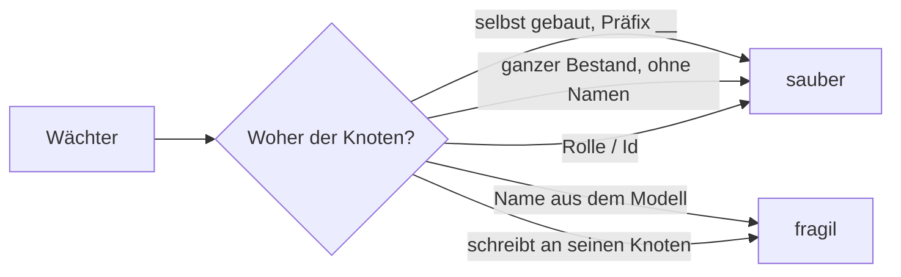
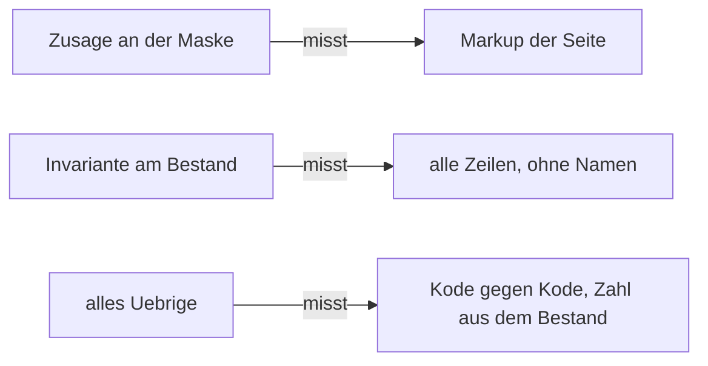

# Wächterbestand — gemessen am 2026-09-05

Anlass ist sein Satz: *«ja, bitte checken — das ist sonst wie eine selbsterfüllende Prophezeiung:
wir machen uns immer mehr Arbeit und werden immer langsamer beim Voranschreiten.»*

**Die drei Zahlen zuerst.**

| | |
|---|---|
| **57 von 71 sind sauber** | Sie bauen sich ihre Knoten selbst und räumen sie weg, oder sie lesen nur Dateien, das Schema und den Bestand als Ganzes. Kein Name aus seinem Modell, keine feste Zahl darauf. |
| **2 habe ich gelöst** | `setting-kind` und `preview` holten einen **Astwurzelknoten über seinen Namen** (`Settings`, `Data Types`). Sie holen ihn jetzt über seine Rolle — so, wie der Kode es ohnehin tut ([D-613](../../NewConcept/90-decision-log.md)). Beide grün. |
| **12 blieben offen, heute 11** | 10 hängen über einen Namen an einem Knoten, 1 schreibt Werte an den Datensatz **seines** Knotens statt an einen eigenen, 4 tragen zusätzlich eine feste Zahl auf seinen Bestand (Überschneidungen). Jede einzelne ist eine halbe bis ganze Umschreibung des Laufs — zu gross für diesen Durchgang, darum aufgeschrieben statt angefangen. ⚠️ *`field-hide` ist am 2026-09-06 dazwischengekommen, weil er rot wurde; siehe unten.* |

⚠️ **Die gemessene Rangfolge ist nicht die vermutete.** *Die Sorge war, der Bestand hänge breit an
seinem Modell. Er tut es nicht: **vier Fünftel der Wächter sind bereits gelöst**, und der Rückstand
sitzt konzentriert in zwölf Läufen, von denen zehn denselben Handgriff brauchen — den Knoten über
seine Rolle statt über seinen Namen holen.*

---

## Nachtrag 2026-09-06 — «sauber» war gelesen, nicht gemessen

⚠️ **Die Spalte «Sauber — eigene Knoten, gebaut und weggeräumt» oben ist am Kode abgelesen, und
gemessen stimmt sie nicht.** *Am 2026-09-06 wurde jeder Lauf einzeln gefahren, mit einem Abzug aller
dreizehn Tabellen davor und danach. **Von 73 Läufen veränderten 42 den Bestand; 17 davon an Knoten,
Kanten, Sätzen, Wertzeilen oder Beschriftungen.** Darunter `composition`, `converter`,
`journal-address`, `package7`, `scaffold` und `restore` — alle sechs stehen oben unter «sauber».*

**Warum das Ablesen es nicht sehen konnte:** die Läufe räumen wirklich auf, nur **am Ende**. Ein
Lauf, der in Zeile 200 rot wird, erreicht seine Zeile 400 nie, und ein `finally` läuft an einem
`exit(1)` vorbei. *Der Eigentümer hat den Preis auf seinem Bildschirm gesehen: `read_only`
**zweimal** an seinem `Integer` — die zweite Kante `Integer --read_only--> Constants` aus
`package7-check.php`; dazu drei Knoten `__cv Zahl` aus `converter-check.php` unter demselben
`Integer` und dreimal eine deutsche `Adresse` aus `seed-twice-check.php`. Drei Läufe, ein Tag.*

**Die Antwort ist keine bessere Aufräumroutine, sondern eine Klammer:** jeder Wächter mit `wp-load`
lädt unmittelbar danach [`scripts/dev/lib/no-write.php`](../../../scripts/dev/lib/no-write.php) —
`START TRANSACTION`, und ein `ROLLBACK` am Herunterfahren des Prozesses, das auch nach einem
Abbruch greift. **Nachgemessen: kein Lauf schreibt mehr ins Modell.** Bewacht von
`no-model-write-check.php`; die einzige Ausnahme ist `labels-page-save`, dessen Kindprozess eine
eigene Verbindung hat und darum von einer offenen Umklammerung nichts sähe.

⚠️ **Aufräumen bleibt im Kode und wird nicht entfernt** — *es ist nur nicht mehr das, worauf der
Bestand sich verlässt.*

⚠️ **Was dieser Nachtrag ausdrücklich nicht anfasst: die festen Zahlen in den Zusagen.**
*`package3` (`=== 20` Präfixe), `renderer-choice` (`> 50`, `>= 20 von 28`) und `rename-survives`
(`>= 4`) tragen weiter eine Momentaufnahme seines Bestandes als Vertrag. Die Tabelle unten sagt
selbst, dass aus `=== 20` ein `>= 20` zu machen eine **Entschärfung** wäre und seinen Grund braucht
(`PR-9`) — also steht es hier als Befund und nicht als Reparatur.*

---

## Was «hängt an seinen Daten» heisst

Der Bestand als Ganzes zu lesen ist **kein** Mangel: `orphans`, `id-space`, `shadow-shape` und ihre
Verwandten prüfen Invarianten (*nichts ist verwaist*, *jede Id hat ihren Raum*) und werden nur rot,
wenn wirklich etwas kaputt ist. Fragil wird es an genau zwei Stellen: **ein Name**, den er jederzeit
ändern darf, und **eine feste Gleichheit** auf eine Menge, die er jederzeit vergrössern darf.

---

## Die Tabelle

`s` ist die gemessene Laufzeit einzeln, `Ø 0,84 s`. **Summe aller 71: 59,4 s.**

### Sauber — eigene Knoten, gebaut und weggeräumt (30)

| Wächter | s | | Wächter | s | | Wächter | s |
|---|---|---|---|---|---|---|---|
| change-group | 0,79 | | journal-address | 1,03 | | parked-in-shadow | 0,80 |
| cleanup-screen | 0,81 | | label-space | 0,73 | | record-on-first-write | 0,68 |
| cleartrash | 0,76 | | labels-page-save | 3,32 | | renderer-choice-mask | 1,72 |
| collapsed-default | 2,13 | | move-mask | 1,00 | | scaffold | 0,73 |
| composition | 1,03 | | multiplicity | 0,97 | | setting-branch-relation | 0,77 |
| converter | 0,80 | | package1 | 0,93 | | setting-self-inherit | 0,75 |
| dangling-reference | 0,73 | | package2 | 1,66 | | target-link | 0,83 |
| edge-class | 0,65 | | package5 | 0,95 | | type-binding | 0,69 |
| form-membership | 0,80 | | package6 | 1,17 | | used-by | 0,94 |
| hide-abort | 1,01 | | package7 | 1,67 | | version | 0,80 |

Keiner davon trägt einen Namen oder eine Zahl aus seinem Modell. `composition`, `form-membership`,
`multiplicity` und `setting-relation` benutzen das Gerüst (`scripts/dev/geruest.php`);
`renderer-choice-mask` gehört zur gleichzeitigen Renderer-Arbeit und ist nicht angefasst.

### Sauber — nur Dateien, Kode oder Schema, kein WordPress (11)

| Wächter | s | Stand |
|---|---|---|
| always-on | 0,13 | ⚠️ **rot, ohne Zutun** — `CLAUDE.md` + `arbeitsmodell.md` + `AGENTS.md` sind 45.436 B gegen eine Decke von 43.170 B. Alle drei sind für mich gesperrt; das ist eine Entscheidung, keine Reparatur. |
| anchor | 0,09 | grün |
| concept-drift | 0,18 | grün |
| confirmed-quote | 0,08 | grün |
| icon-markup | 0,16 | grün |
| question-symmetry | 0,09 | grün |
| references | 0,14 | grün |
| rules-index | 0,34 | ⚠️ **rot, ohne Zutun** — 303 Regeln, das Verzeichnis sagt etwas anderes. Neu erzeugen genügt. |
| settings-are-gone | 0,09 | grün |
| superseded | 0,08 | grün |
| supersession | 0,20 | grün |

### Sauber — liest den ganzen Bestand, ohne Namen und ohne feste Zahl (16)

| Wächter | s | | Wächter | s | | Wächter | s |
|---|---|---|---|---|---|---|---|
| dialog-script | 0,63 | | node-binding | 0,61 | | silent-query | 0,82 |
| icon-button | 1,05 | | orphans | 0,58 | | simple-type | 0,62 |
| id-space | 0,59 | | restore | 0,65 | | sort-order | 0,67 |
| implemented-by | 0,61 | | seed-twice | 0,68 | | value-ref-space | 0,57 |
| inheritance-column | 0,67 | | settings-record-carrier | 0,60 | | shadow-shape | 0,66 |
| label-role | 0,65 | | | | | | |

### Gelöst in diesem Durchgang (2)

| Wächter | s | Was daran hing | Was jetzt dasteht |
|---|---|---|---|
| **setting-kind** | 0,60 | `WHERE name = 'Settings'` — der Ast über seinen Namen. | `rootOf(Branch::Settings)`. **Die Zusage ist wörtlich dieselbe**: der Ast steht direkt unter der Wurzel und trägt Knoten. Grün. |
| **preview** | 3,07 | `WHERE name = 'Data Types'` — und der Kommentar daneben behauptete bereits, der Knoten werde *«über seinen Ast gesucht und nicht über einen Namen»*. Er wurde es nicht. | `rootOf(Branch::DataTypes)`. Grün. ⚠️ *Der zweite Name in derselben Datei — `yotta` — steht noch, siehe unten.* |

### Gelöst am 2026-09-06 (1) — und es war teurer als eine Umstellung

| Wächter | s | Was daran hing | Was jetzt dasteht |
|---|---|---|---|
| **field-hide** | 0,99 | `Prefixes`, `count($bedienbar) === 1` — **und eine dritte, die in der Tabelle unten fehlte**: `$vorher === 0`, also *«sein Feld `exponent` ist sichtbar»*. | Eine eigene Wiese (`__fh Vater` / `__fh Kind` / `__fh Typ`), aufgeräumt im `finally`. Die Zusagen sind Invarianten: *ein frisch erklärtes Feld ist sichtbar*, *umgeschaltet ändern sich Spalte und Zeichen*, *zurück ist es wieder wie vorher*. Neun grün. |

⚠️ **Diese Zeile ist der Beleg dafür, wofür diese Liste da ist.** *Am 2026-09-05 um 21:46:39 hat der
Eigentümer `Prefixes.exponent` im Schirm versteckt — der Fall, für den
[D-467](../../NewConcept/90-decision-log.md) die Spalte an die Kante gelegt hat. **Von diesem Klick
an war der Wächter rot**, und sein rohes Zurückschreiben hat den Zustand seither in jedem Lauf
festgenagelt: im Änderungsbuch stehen 26 «field hidden» gegen 51 «field shown», die 25 überzähligen
sind Läufe, in denen das Verstecken schon nichts mehr zu tun hatte. **Der Knopf war nie kaputt.**
Eine Momentaufnahme seines Bestands als Zusage ist nicht nur zerbrechlich — sie meldet seine
richtige Bedienung als Fehler.*

### Offen — und warum (11)

| Wächter | s | Woran es hängt | Warum liegengelassen |
|---|---|---|---|
| **page-blocks** | 2,33 | `form`, `Passiv`, `Kontact`, `Gasse`, `Admin` — fünf Namen, davon vier reiner Modellinhalt. | **Die grösste.** 633 Zeilen, die die Admin-Maske an einem tief geschachtelten, gewachsenen Knoten prüfen. Ein Gerüst müsste Erbung, Einstellungen und Blockgrenzen nachbauen. |
| **unitvalue** | 0,78 | `Einheitenwert`, `Prefixes`, `Base units`, `kilo`, `Ohm`. | ⚠️ **Heute schon rot, und zwar mit Grund**: die Einheit zeichnet sich als `2.7 kilo ` statt `2.7 kilo Ohm`. **Das ist ein echter Befund, kein Namensproblem** — er wartet auf `OQ-134`. Nichts anfassen, bevor der steht. |
| **renderer-choice** | 0,69 | Sechs Namen (`Base units`, `Passiv`, `Integer`, `Dimension`, `Prefixes`, `Parts List`) und **zwei feste Zahlen auf seinen Bestand**: *«es gibt Kanten-Datensätze» → mehr als 50*, *«jeder Träger löst auf» → mindestens 20 von 28*. | Beides zugleich. Die Zahlen sind Untergrenzen und wachsen mit; sie werden rot, wenn er **wegnimmt**. |
| **package3** | 1,27 | `Prefixes`, `Base units`, `Celsius` — und `count($prefixNodes) === 20`, eine **feste Gleichheit**. | Legt er einen 21. Präfix an, wird der Wächter rot, ohne dass etwas kaputt ist. Aus `=== 20` ein `>= 20` zu machen wäre eine **Entschärfung** und braucht seinen Grund (`PR-9`). |
| **setting-write** | 0,87 | `Renderer` (Behälter) und `spinner` (Renderer-Knoten). | Trägt selbst den Befund, dass es **zwei Knoten namens `form`** gibt und einmal die falsche Rolle geschrieben wurde. Die Umstellung heisst: einen eigenen Renderer-Ast bauen. |
| **record-on-any-node** | 0,72 | `Prefixes`, `exponent` — **und schreibt Datensätze an `kilo`**, also an einen seiner Knoten. | Der Schreibfall gehört auf einen eigenen Knoten. Mittelgross, weil die Erbungskette mitgebaut werden muss. |
| **several-values** | 0,68 | Kein Name — sucht sich irgendeine passende Kante — **schreibt aber drei Werte an den Datensatz eines seiner Knoten**. | Räumt hinterher auf. Nach [D-614](../../NewConcept/90-decision-log.md) gehört das in den Testast: *«nicht sichtbar, den Arbeitsbaum nicht beschädigend»*. |
| **setting-relation** | 0,83 | `feldVon('Prefixes', 'exponent')`. | Benutzt bereits das Gerüst — der eine Namensgriff steht daneben. Kleinste der offenen; nur nicht mehr in dieses Zeitfenster gefallen. |
| **field-type-gone** | 0,62 | `WHERE name = 'Renderer'`. | Wie `setting-write`. |
| **rendering-scaffold** | 0,73 | `Converter`, `roman`. | Rahmenwerk — nach [D-613](../../NewConcept/90-decision-log.md) erlaubt (*«wer es umbenennt, ändert das Plugin»*), aber die Namen stehen im Wächter statt im Kode. |
| **rename-survives** | 1,33 | `count($traeger) >= 4` — eine feste Zahl auf seine Einstellungsträger. | Untergrenze; wird rot, wenn er drei davon löscht. |

⚠️ **Ein Rest in `preview`, obwohl der Lauf oben als gelöst steht.** *`WHERE name = 'yotta'` — und
dieser Fall ist der unangenehmere von beiden: **fehlt der Knoten, meldet der Lauf «no scaffolded node
to test against» und geht grün weiter.** Eine Umbenennung schaltet die Prüfung **still ab**, statt
sie rot zu machen. Zu lösen braucht es einen eigenen Knoten mit Datensatz und `hide`-Spalte —
nicht schwer, aber kein Einzeiler.*

**Und die Vorlage steht schon da.** `composition` und `multiplicity` hingen an `Adresse`, hängen seit
TASK-025 am Gerüst (`scripts/dev/geruest.php`) und prüfen **dieselbe Sache wie vorher**. Wer einen der
zwölf löst, kopiert von dort.

---

## Fällt einer um, wenn ein anderer vorher lief?

**Der gemeldete Fall reproduziert heute nicht.** Gemessen: `scaffold-check` allein → grün,
`inheritance-column-check` allein → grün, `scaffold-check` **dann** `inheritance-column-check` → grün
(19 Zusagen). Ein voller Lauf über alle 71 in alphabetischer Folge ergibt dieselben drei Roten wie
die Einzelläufe — `always-on`, `rules-index`, `unitvalue` —, und alle drei sind auch einzeln rot.
**Ordnungsabhängigkeit ist damit heute nicht nachweisbar**; als *nicht mehr auftretend* verbucht,
nicht als *behoben*.

⚠️ **Ein Rückstand steht im Baum, und der Wächter meldet ihn selbst.** *`setting-kind` sagt:
«Rest im Ast, auf den nichts zeigt: `__Test`». Das ist der Testast aus
[D-614](../../NewConcept/90-decision-log.md) — er stört nicht, aber er ist da, und dass ein Wächter
ihn nennt, ist genau das, was der Ast leisten sollte.*

---

## Was der Lauf kostet, und woran

| | |
|---|---|
| **Ganzer Lauf, 71 Wächter einzeln** | **59,4 s** |
| **Davon Booten von WordPress** | **60 Läufe × 0,50 s = 30,0 s — die Hälfte.** Gemessen mit einem Skript, das nichts tut als `wp-load.php` und den Autoloader zu laden: 0,505 / 0,504 / 0,500 s. |
| **Davon eigentliche Arbeit** | rund 29 s |
| **Elf Wächter booten gar nicht** | Sie lesen Dateien und laufen in 0,08–0,34 s. |

**Vorschlag, nicht umgebaut:** ein Sammelläufer, der **einmal** bootet und die 60 WordPress-Wächter
nacheinander in demselben Prozess einschliesst. Der Lauf fiele von **59,4 s auf rund 30 s** — die
Hälfte, ohne dass eine einzige Zusage sich ändert.

⚠️ **Es ist nicht umsonst, und das ist der Grund, es hier nur vorzuschlagen.** *Jeder Wächter ist
heute ein eigenes Skript mit `exit()`, globalen Variablen (`$ok`, `$bad`, `$wpdb`) und Funktionen im
Wurzelnamensraum — `check()` gibt es mehrfach mit verschiedenen Signaturen. In einem Prozess
kollidieren sie. **Der billige Weg ist der Unterprozess ohne neuen Boot**, der teure die
Umschreibung auf Klassen. Und ein zweiter Preis wäre die Trennschärfe: heute sagt ein Absturz genau,
welcher Lauf abgestürzt ist.*

---

*Gemessen 2026-09-05 auf Laragon/MySQL, PHP 8.3.30. Die Laufzeiten sind Einzelläufe, kalt, ein
Durchgang.*

---

# Nachtrag 2026-09-06 — welcher Wächter hat je einen Fehler gefunden?

**Sein Auftrag, wörtlich:** *«hast so viel checks aber trotzdem läuft dauernd etwas schief, ich fände
es besser weniger check dafür aber richtige zu haben.»*

**Die Antwort in einer Zeile: von 73 Läufen sehen 14 die Seite an, die er bedient — und alle vier
Fehler dieses Tages standen auf der Seite.**

## Der Befund, mit Zahlen

| gemessen am 2026-09-06 | |
|---|---|
| Wächterläufe insgesamt | **73** |
| davon **zeichnen eine Seite** (`screen()->render()`) | **14** |
| davon **gehen einen Akt** (`handlePost()`) | **8** |
| davon **ohne WordPress** — Dateien, Kode, Dokumente | **12** |
| Rest: Aussagen über den Bestand und über den Kern | **47** |
| Zeilen Wächter gegen Zeilen `src/` | **23 064 gegen 38 635** |
| Commits, die einen Wächter anfassen | **219** |
| davon **ohne jede Änderung an `src/`** | **64** — der Wächter wurde der Wirklichkeit nachgezogen, nicht umgekehrt |

⚠️ **Die vier Fehler dieses Tages sind alle an 73 grünen Läufen vorbeigekommen**, und alle vier
standen auf seinem Schirm: die Modellwurzel zwang jedem Knoten einen Renderer auf, die Feldreihenfolge
verzahnte Geerbtes mit Eigenem, die Einstellungstafel bot Schlüssel an, die der Typ nicht kennt, und
der Renderer-Kasten stellte die falsche Frage. **Jeder einzelne wäre einer Zusage an der Maske
aufgefallen** — und keiner einer Zusage am Kern.

## Belegte Funde — und belegte Fehlalarme

**Gesucht wurde nicht, was ein Wächter *bewacht*, sondern was er *gefunden* hat.** Quelle sind die
Commit-Nachrichten und die Kommentare in den Läufen selbst; wo nichts steht, steht hier «kein Fund
belegt» — und das ist kein Vorwurf an den Lauf, sondern die ehrliche Auskunft.

| Lauf | belegter **Fund** |
|---|---|
| `package7` | *«package7-check hat danach doppelte HTML-Ids gemeldet, erst elf zwischen Baum …»* |
| `package3` | *«nicht-persistent. package3-check hat es sofort gemeldet, wiederhergestellt.»* |
| `unitvalue` | *«unitvalue-check fand fuenf Glieder statt der drei aus …»* — und heute der Befund `2.7 kilo ` statt `2.7 kilo Ohm` |
| `labels-page-save` | das fehlende `form="…"` an einem Steuerelement; zweimal in `renderer-choice-mask` als *«den Regress, den `labels-page-save-check` einmal gefangen hat»* zitiert |
| `page-blocks` | das Dreieck in der Namenszelle, das aus `with_label` ein *mit-Dreieck-with_label* machte (`688798e`) |

| Lauf | belegter **Fehlalarm** — rot bei richtiger Arbeit |
|---|---|
| `package7` | rot, als der Eigentümer am `Integer`-Knoten eine Einstellung änderte (zweimal, Zeilen 246 und 281) |
| `page-blocks` | rot, als er `Adresse` um eine Schachtelung erweiterte, *«ohne dass etwas kaputt war»* |
| `page-blocks` | meldete *«null Felder, wo drei sind»*, weil «Settings» als Knotenname in der Zeile stand |
| `record-on-first-write` | rot, sobald ein anderer Wächter im selben Durchgang gelaufen war |
| `field-hide` | rot ab dem Klick, mit dem er `Prefixes.exponent` versteckte — **25 Läufe lang** |
| `renderer-choice-mask` | meldete einen Fehler, den der Lauf sich selbst gemacht hatte (`check_admin_referer`) |

⚠️ **Fünf Läufe mit belegtem Fund, sechs mit belegtem Fehlalarm.** *Das ist die Messung hinter seinem
Satz. **Ein Wächter, der bei richtiger Arbeit rot wird, erzieht dazu, rote Wächter zu übersehen** —
und dann sieht man auch den einen nicht, der recht hat.*

## Die drei Arten

**Maske** heisst: `seite($id)` zeichnen und im Markup nachsehen. **Invariante** heisst: eine Aussage,
die über *jeder* Zeile gilt und keinen Namen und keine Zahl aus seinem Bestand kennt. **Übrig** ist,
was Kode gegen Kode prüft oder eine Momentaufnahme festhält.

### Maske — bleiben, alle 14

`cleanup-screen`, `collapsed-default`, `field-hide`, `hide-abort`, `icon-button`, `labels-page-save`,
`move-mask`, `package7`, `page-blocks`, `preview`, `renderer-choice-mask`, `setting-branch-relation`,
`target-link`, `used-by`.

⚠️ *Hier gehört die Arbeit hin, nicht das Streichen. **Vier Zusagen sind heute dazugekommen** —
siehe unten.*

### Invarianten — bleiben, 13

| Lauf | die Aussage |
|---|---|
| `orphans` | kein Besitzer einer Einstellung oder Beschriftung ist verschwunden |
| `dangling-reference` | ein Verweis auf einen verschwundenen Knoten ist **am Feld** sichtbar |
| `value-ref-space` | kein Verweis ohne Raumangabe, und die Angabe stimmt |
| `id-space` | jede Tabelle vergibt ihre Ids selbst, keine Nummer zweimal |
| `silent-query` | eine kaputte Abfrage wirft, statt leer zu antworten |
| `no-model-write` | kein Wächter schreibt in sein Modell |
| `shadow-shape` | lebende Tabelle und Schatten haben dieselbe Form |
| `change-group` | ein Akt, eine Änderungsnummer |
| `version` | die Version wird immer mitgeschrieben |
| `sort-order` | eine Stelle je Knoten und Kantenart, und die erste ist `0` |
| `edge-class` | drei Werte, drei Klassen — und kein Datensatz hängt an zwei Besitzern |
| `seed-twice` | eine Saat, die zweimal läuft, verdoppelt nichts |
| `references` | kein Dokument beruft sich auf eine Nummer, die es nie gab |

⚠️ *Dazu die vier, die `CLAUDE.md` namentlich als Ersatz für die verbotenen Zählungen nennt und die
darum nicht zur Debatte stehen: `rules-index`, `concept-drift`, `confirmed-quote`, `superseded`.*

## Die Streichliste — vorgelegt, nicht ausgeführt

⚠️ **In diesem Auftrag ist kein Lauf gelöscht worden.** *Er wollte die Liste sehen, bevor etwas
fällt. Jede Zeile trägt ihren Grund; wo der Grund «geht in X auf» heisst, muss X die Zusage
vorher wirklich tragen — und das ist je Zeile nachzusehen, nicht zu glauben.*

| Lauf | Grund |
|---|---|
| `renderer-choice` | **Vollständig in `renderer-choice-mask` enthalten**, und er ist einer der vier grünen, die ihm am 2026-09-05 widersprachen: er schreibt über den Kern und hat nie gesehen, dass auf der Seite gar kein Wähler stand. |
| `rename-survives` | Dieselbe Aussage — «eine Umbenennung ändert nichts am Gezeichneten» — misst `renderer-choice-mask` am Markup, für **jede** angebotene Wahl. |
| `settings-record-carrier` | Der Träger des Einstellungsdatensatzes; `renderer-choice-mask` prüft ihn am Datensatz **und** an der Kante, nach dem Speichern über die Maske. |
| `setting-kind` | Geht in `setting-relation` auf: beide fragen, was eine Einstellungskante ist, seit `nodes.field_type` gefallen ist, aus derselben Quelle. |
| `setting-self-inherit` | Zwei Zusagen über dieselbe Kante wie `setting-relation`; sie gehören in einen Lauf. |
| `anchor` | Bewacht Verweise **innerhalb** von `docs/NewConcept/` — einem Steinbruch (`PR-1`, [D-568](../../NewConcept/90-decision-log.md)). Ein Wächter auf einem Dokument, das nicht mehr fortgeschrieben wird, hält einen Zustand fest, den niemand mehr ändert. |
| `question-symmetry` | Bewacht `91-open-questions.md` — das Fragenblatt ist mit seinem Konzept **geschlossen** (`PR-4`). |
| `supersession` | Dieselbe Aussage wie `superseded`, von der anderen Seite gelesen. |
| `settings-are-gone` | Bewacht **eine** Entscheidung ([D-506](../../NewConcept/90-decision-log.md)); das war eine einmalige Aufräumarbeit. |
| `icon-markup` | Prüft **Kode gegen Kode**. Dieselbe Sache misst `icon-button` an der gezeichneten Seite — und nur die Messung am Markup hat den Fehler je gefunden. |
| `dialog-script` | Prüft Kode gegen Kode und sagt in seinem eigenen Docblock, dass er das Verhalten **nicht** prüfen kann. |
| `package1` | «Anlegen, umbenennen, Papierkorb» — im Kernlauf (485 Tests) und in `cleartrash` enthalten. |
| `package2` | «Baum und Reihenfolge» — in `sort-order` und `collapsed-default` enthalten. |
| `package5` | «Beschriftungen, Rollen, Sprachen» — in `label-space` und `labels-page-save` enthalten. |
| `package6` | «Datensätze» — in `record-on-first-write` und `renderer-choice-mask` enthalten. |
| `path` + `field-type-gone` | **Zwei Läufe, eine Aussage**: «eine gefallene Spalte kommt nicht zurück, und `dbDelta` legt sie nicht wieder an». Zusammenlegen zu einem. |

**Wirkung, wenn er alles annimmt: 73 → 57 Läufe.** *Und die 14 Zusagen an der Maske bleiben
vollständig — gestrichen wird nur, wo eine zweite Stimme dasselbe sagt oder ein Steinbruch bewacht
wird.*

⚠️ **Was ausdrücklich *nicht* auf der Liste steht, obwohl es lang ist:** *`package7` (997 Zeilen) und
`page-blocks` (893) sind die beiden grössten und stehen beide unter «bleiben». **Sie zeichnen die
Seite** — und sie sind zugleich die beiden mit den meisten Fehlalarmen. Der richtige Griff ist dort
das Gerüst (`geruest.php`), nicht das Löschen.*

## Was gebaut wurde — vier Zusagen an der Maske

**Alle vier messen am Markup der Seite (`seite($id)` → Markup → suchen), nicht an einer
Dienstmethode.** *Genau dieser Unterschied hat am 2026-09-06 zweimal zu einer falschen Meldung
geführt.*

| Zusage | wo | Nachweis, dass sie beisst |
|---|---|---|
| Die Wurzel zwingt keinem Knoten einen Renderer auf ([D-617](../../NewConcept/90-decision-log.md)) | `renderer-choice-mask` | Der Lauf **setzt den Wert an der Wurzel selbst**, über die Maske, und die Klammer dreht ihn zurück. Gegenprobe: ein Knoten unmittelbar an der Wurzel *bekommt* ihn — sonst wäre die Zusage grün, weil das Setzen misslang. |
| Geerbte und eigene Felder stehen in je einem Block, Geerbtes vorn ([D-376](../../NewConcept/90-decision-log.md)) | `page-blocks` | **Nachgewiesen:** mit dem alten `ORDER BY r.sort_order` meldet der Lauf *«5 Wechsel: inherited own inherited own inherited own»* — genau das Bild, das er gemeldet hat. |
| Die Einstellungstafel bietet nur an, was die Kette des **Ziels** erklärt ([D-529](../../NewConcept/90-decision-log.md), [D-668](../../NewConcept/90-decision-log.md)) | `renderer-choice-mask` | Die erklärten Schlüssel kommen aus der Datenbank, die angebotenen aus dem Markup der aufgeklappten Zeile. Dazu der benannte Gegenfall `display_size`: zeichenbar, an dieser Kette nicht erklärt, darf nicht dastehen. |
| Der Renderer-Kasten bietet an, was den Knoten zeichnen kann | `renderer-choice-mask` | **Stand schon da** (`23e7531`) und wird am Markup gemessen: `Integer` genau `field, spinner, slider`, ein Blatt unter `constants` `reference`, derselbe Knoten mit einem Kind die zwei Wähler. |

⚠️ *Eine Ausnahme steht mit Grund in der dritten Zusage: **`multiplicity` ist eine Spalte an der
Kante** ([D-351](../../NewConcept/90-decision-log.md)) und kann an keiner Kette erklärt sein — sie
gehört trotzdem in die Tafel, weil sie zur Verwendungsstelle gehört.*

## Die festen Zahlen — was umgestellt ist

⚠️ **Keine davon war eine Zusage; alle fünf waren der Stand seines Modells am Tag, an dem die Zeile
geschrieben wurde.** *Das steht in den Kommentaren daneben wörtlich: «es gibt **überhaupt** Wahlen»,
«es gibt **überhaupt** Kanten-Datensätze». **Die Zahl war nie die Aussage** — darum ist keine dieser
Umstellungen eine Entschärfung (`PR-9`), und jede ist im Lauf selbst begründet.*

| Lauf | vorher | jetzt |
|---|---|---|
| `multiplicity` | `>= 20` — **rot**, weil heute 10 Knoten eine Wahl tragen | `>= 1` — «es gibt überhaupt Wahlen» |
| `setting-write` | `> 20` — **rot**, und die Zeile stand **zweimal** da (Abschreibfehler, derselbe Nicht-Fehler doppelt gemeldet) | `>= 1`, einmal |
| `renderer-choice` | `> 50` | `>= 1` |
| `rename-survives` | `>= 4` (zweimal) | `>= 1` |
| `package3` | `=== 20` Präfixe | **so viele, wie die Saat mitbringt** — gelesen aus `UnitScaffold::PREFIXES`, plus die neue Invariante *kein Exponent zweimal* |

**`multiplicity` und `setting-write` sind damit grün, ohne dass eine Zusage weicher wurde.**

## Was für ihn offen bleibt

1. **Die Streichliste oben ist eine Vorlage.** Sie wird erst ausgeführt, wenn er sie durchgesehen hat.
2. **Bei `package3` kann die neue Form rot werden, ohne dass etwas kaputt ist** — nämlich wenn er
   einen Präfix **löscht**. [D-119](../../NewConcept/90-decision-log.md) gibt ihm das Recht, Gesätes
   umzubenennen; ob es auch das Recht einschliesst, Gesätes wegzunehmen, ohne dass ein Wächter rot
   wird, ist **nicht entschieden**. → Eingangsblatt.
3. **Der Gegenfall «es gibt überhaupt welche» hängt weiter an seinem Bestand**, nur nicht mehr an
   einer Zahl. Der saubere Weg wäre, dass der Lauf sich seine eine Zeile **selbst anlegt** — wie
   `renderer-choice-mask` es tut. Das sind vier Umschreibungen; soll ich sie machen?
4. **Drei Läufe sind rot und gehören nicht zu diesem Auftrag:** `inheritance-column` (130
   Schattenzeilen für 139 Einordnungen), `unitvalue` (wartet auf `OQ-134`), `cleartrash` (*«its
   labels went with it»*). Der dritte ist **neu** und stand in keiner der Vorwarnungen.
