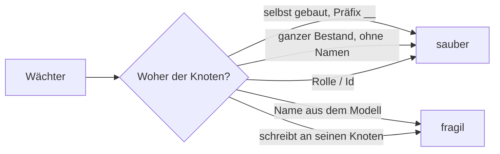

# Wächterbestand — gemessen am 2026-09-05

Anlass ist sein Satz: *«ja, bitte checken — das ist sonst wie eine selbsterfüllende Prophezeiung:
wir machen uns immer mehr Arbeit und werden immer langsamer beim Voranschreiten.»*

**Die drei Zahlen zuerst.**

| | |
|---|---|
| **57 von 71 sind sauber** | Sie bauen sich ihre Knoten selbst und räumen sie weg, oder sie lesen nur Dateien, das Schema und den Bestand als Ganzes. Kein Name aus seinem Modell, keine feste Zahl darauf. |
| **2 habe ich gelöst** | `setting-kind` und `preview` holten einen **Astwurzelknoten über seinen Namen** (`Settings`, `Data Types`). Sie holen ihn jetzt über seine Rolle — so, wie der Kode es ohnehin tut ([D-613](../../NewConcept/90-decision-log.md)). Beide grün. |
| **12 bleiben offen** | 10 hängen über einen Namen an einem Knoten, 1 schreibt Werte an den Datensatz **seines** Knotens statt an einen eigenen, 4 tragen zusätzlich eine feste Zahl auf seinen Bestand (Überschneidungen). Jede einzelne ist eine halbe bis ganze Umschreibung des Laufs — zu gross für diesen Durchgang, darum aufgeschrieben statt angefangen. |

⚠️ **Die gemessene Rangfolge ist nicht die vermutete.** *Die Sorge war, der Bestand hänge breit an
seinem Modell. Er tut es nicht: **vier Fünftel der Wächter sind bereits gelöst**, und der Rückstand
sitzt konzentriert in zwölf Läufen, von denen zehn denselben Handgriff brauchen — den Knoten über
seine Rolle statt über seinen Namen holen.*

---

## Was «hängt an seinen Daten» heisst

Der Bestand als Ganzes zu lesen ist **kein** Mangel: `orphans`, `id-space`, `shadow-shape` und ihre
Verwandten prüfen Invarianten (*nichts ist verwaist*, *jede Id hat ihren Raum*) und werden nur rot,
wenn wirklich etwas kaputt ist. Fragil wird es an genau zwei Stellen: **ein Name**, den er jederzeit
ändern darf, und **eine feste Gleichheit** auf eine Menge, die er jederzeit vergrössern darf.

---

## Die Tabelle

`s` ist die gemessene Laufzeit einzeln, `Ø 0,84 s`. **Summe aller 71: 59,4 s.**

### Sauber — eigene Knoten, gebaut und weggeräumt (30)

| Wächter | s | | Wächter | s | | Wächter | s |
|---|---|---|---|---|---|---|---|
| change-group | 0,79 | | journal-address | 1,03 | | parked-in-shadow | 0,80 |
| cleanup-screen | 0,81 | | label-space | 0,73 | | record-on-first-write | 0,68 |
| cleartrash | 0,76 | | labels-page-save | 3,32 | | renderer-choice-mask | 1,72 |
| collapsed-default | 2,13 | | move-mask | 1,00 | | scaffold | 0,73 |
| composition | 1,03 | | multiplicity | 0,97 | | setting-branch-relation | 0,77 |
| converter | 0,80 | | package1 | 0,93 | | setting-self-inherit | 0,75 |
| dangling-reference | 0,73 | | package2 | 1,66 | | target-link | 0,83 |
| edge-class | 0,65 | | package5 | 0,95 | | type-binding | 0,69 |
| form-membership | 0,80 | | package6 | 1,17 | | used-by | 0,94 |
| hide-abort | 1,01 | | package7 | 1,67 | | version | 0,80 |

Keiner davon trägt einen Namen oder eine Zahl aus seinem Modell. `composition`, `form-membership`,
`multiplicity` und `setting-relation` benutzen das Gerüst (`scripts/dev/geruest.php`);
`renderer-choice-mask` gehört zur gleichzeitigen Renderer-Arbeit und ist nicht angefasst.

### Sauber — nur Dateien, Kode oder Schema, kein WordPress (11)

| Wächter | s | Stand |
|---|---|---|
| always-on | 0,13 | ⚠️ **rot, ohne Zutun** — `CLAUDE.md` + `arbeitsmodell.md` + `AGENTS.md` sind 45.436 B gegen eine Decke von 43.170 B. Alle drei sind für mich gesperrt; das ist eine Entscheidung, keine Reparatur. |
| anchor | 0,09 | grün |
| concept-drift | 0,18 | grün |
| confirmed-quote | 0,08 | grün |
| icon-markup | 0,16 | grün |
| question-symmetry | 0,09 | grün |
| references | 0,14 | grün |
| rules-index | 0,34 | ⚠️ **rot, ohne Zutun** — 303 Regeln, das Verzeichnis sagt etwas anderes. Neu erzeugen genügt. |
| settings-are-gone | 0,09 | grün |
| superseded | 0,08 | grün |
| supersession | 0,20 | grün |

### Sauber — liest den ganzen Bestand, ohne Namen und ohne feste Zahl (16)

| Wächter | s | | Wächter | s | | Wächter | s |
|---|---|---|---|---|---|---|---|
| dialog-script | 0,63 | | node-binding | 0,61 | | silent-query | 0,82 |
| icon-button | 1,05 | | orphans | 0,58 | | simple-type | 0,62 |
| id-space | 0,59 | | restore | 0,65 | | sort-order | 0,67 |
| implemented-by | 0,61 | | seed-twice | 0,68 | | value-ref-space | 0,57 |
| inheritance-column | 0,67 | | settings-record-carrier | 0,60 | | shadow-shape | 0,66 |
| label-role | 0,65 | | | | | | |

### Gelöst in diesem Durchgang (2)

| Wächter | s | Was daran hing | Was jetzt dasteht |
|---|---|---|---|
| **setting-kind** | 0,60 | `WHERE name = 'Settings'` — der Ast über seinen Namen. | `rootOf(Branch::Settings)`. **Die Zusage ist wörtlich dieselbe**: der Ast steht direkt unter der Wurzel und trägt Knoten. Grün. |
| **preview** | 3,07 | `WHERE name = 'Data Types'` — und der Kommentar daneben behauptete bereits, der Knoten werde *«über seinen Ast gesucht und nicht über einen Namen»*. Er wurde es nicht. | `rootOf(Branch::DataTypes)`. Grün. ⚠️ *Der zweite Name in derselben Datei — `yotta` — steht noch, siehe unten.* |

### Offen — und warum (12)

| Wächter | s | Woran es hängt | Warum liegengelassen |
|---|---|---|---|
| **page-blocks** | 2,33 | `form`, `Passiv`, `Kontact`, `Gasse`, `Admin` — fünf Namen, davon vier reiner Modellinhalt. | **Die grösste.** 633 Zeilen, die die Admin-Maske an einem tief geschachtelten, gewachsenen Knoten prüfen. Ein Gerüst müsste Erbung, Einstellungen und Blockgrenzen nachbauen. |
| **unitvalue** | 0,78 | `Einheitenwert`, `Prefixes`, `Base units`, `kilo`, `Ohm`. | ⚠️ **Heute schon rot, und zwar mit Grund**: die Einheit zeichnet sich als `2.7 kilo ` statt `2.7 kilo Ohm`. **Das ist ein echter Befund, kein Namensproblem** — er wartet auf `OQ-134`. Nichts anfassen, bevor der steht. |
| **renderer-choice** | 0,69 | Sechs Namen (`Base units`, `Passiv`, `Integer`, `Dimension`, `Prefixes`, `Parts List`) und **zwei feste Zahlen auf seinen Bestand**: *«es gibt Kanten-Datensätze» → mehr als 50*, *«jeder Träger löst auf» → mindestens 20 von 28*. | Beides zugleich. Die Zahlen sind Untergrenzen und wachsen mit; sie werden rot, wenn er **wegnimmt**. |
| **package3** | 1,27 | `Prefixes`, `Base units`, `Celsius` — und `count($prefixNodes) === 20`, eine **feste Gleichheit**. | Legt er einen 21. Präfix an, wird der Wächter rot, ohne dass etwas kaputt ist. Aus `=== 20` ein `>= 20` zu machen wäre eine **Entschärfung** und braucht seinen Grund (`PR-9`). |
| **setting-write** | 0,87 | `Renderer` (Behälter) und `spinner` (Renderer-Knoten). | Trägt selbst den Befund, dass es **zwei Knoten namens `form`** gibt und einmal die falsche Rolle geschrieben wurde. Die Umstellung heisst: einen eigenen Renderer-Ast bauen. |
| **record-on-any-node** | 0,72 | `Prefixes`, `exponent` — **und schreibt Datensätze an `kilo`**, also an einen seiner Knoten. | Der Schreibfall gehört auf einen eigenen Knoten. Mittelgross, weil die Erbungskette mitgebaut werden muss. |
| **several-values** | 0,68 | Kein Name — sucht sich irgendeine passende Kante — **schreibt aber drei Werte an den Datensatz eines seiner Knoten**. | Räumt hinterher auf. Nach [D-614](../../NewConcept/90-decision-log.md) gehört das in den Testast: *«nicht sichtbar, den Arbeitsbaum nicht beschädigend»*. |
| **setting-relation** | 0,83 | `feldVon('Prefixes', 'exponent')`. | Benutzt bereits das Gerüst — der eine Namensgriff steht daneben. Kleinste der offenen; nur nicht mehr in dieses Zeitfenster gefallen. |
| **field-hide** | 0,99 | `Prefixes`, und `count($bedienbar) === 1`. | Prüft geerbte gegen eigene Felder an einem gewachsenen Knoten. |
| **field-type-gone** | 0,62 | `WHERE name = 'Renderer'`. | Wie `setting-write`. |
| **rendering-scaffold** | 0,73 | `Converter`, `roman`. | Rahmenwerk — nach [D-613](../../NewConcept/90-decision-log.md) erlaubt (*«wer es umbenennt, ändert das Plugin»*), aber die Namen stehen im Wächter statt im Kode. |
| **rename-survives** | 1,33 | `count($traeger) >= 4` — eine feste Zahl auf seine Einstellungsträger. | Untergrenze; wird rot, wenn er drei davon löscht. |

⚠️ **Ein Rest in `preview`, obwohl der Lauf oben als gelöst steht.** *`WHERE name = 'yotta'` — und
dieser Fall ist der unangenehmere von beiden: **fehlt der Knoten, meldet der Lauf «no scaffolded node
to test against» und geht grün weiter.** Eine Umbenennung schaltet die Prüfung **still ab**, statt
sie rot zu machen. Zu lösen braucht es einen eigenen Knoten mit Datensatz und `hide`-Spalte —
nicht schwer, aber kein Einzeiler.*

**Und die Vorlage steht schon da.** `composition` und `multiplicity` hingen an `Adresse`, hängen seit
TASK-025 am Gerüst (`scripts/dev/geruest.php`) und prüfen **dieselbe Sache wie vorher**. Wer einen der
zwölf löst, kopiert von dort.

---

## Fällt einer um, wenn ein anderer vorher lief?

**Der gemeldete Fall reproduziert heute nicht.** Gemessen: `scaffold-check` allein → grün,
`inheritance-column-check` allein → grün, `scaffold-check` **dann** `inheritance-column-check` → grün
(19 Zusagen). Ein voller Lauf über alle 71 in alphabetischer Folge ergibt dieselben drei Roten wie
die Einzelläufe — `always-on`, `rules-index`, `unitvalue` —, und alle drei sind auch einzeln rot.
**Ordnungsabhängigkeit ist damit heute nicht nachweisbar**; als *nicht mehr auftretend* verbucht,
nicht als *behoben*.

⚠️ **Ein Rückstand steht im Baum, und der Wächter meldet ihn selbst.** *`setting-kind` sagt:
«Rest im Ast, auf den nichts zeigt: `__Test`». Das ist der Testast aus
[D-614](../../NewConcept/90-decision-log.md) — er stört nicht, aber er ist da, und dass ein Wächter
ihn nennt, ist genau das, was der Ast leisten sollte.*

---

## Was der Lauf kostet, und woran

| | |
|---|---|
| **Ganzer Lauf, 71 Wächter einzeln** | **59,4 s** |
| **Davon Booten von WordPress** | **60 Läufe × 0,50 s = 30,0 s — die Hälfte.** Gemessen mit einem Skript, das nichts tut als `wp-load.php` und den Autoloader zu laden: 0,505 / 0,504 / 0,500 s. |
| **Davon eigentliche Arbeit** | rund 29 s |
| **Elf Wächter booten gar nicht** | Sie lesen Dateien und laufen in 0,08–0,34 s. |

**Vorschlag, nicht umgebaut:** ein Sammelläufer, der **einmal** bootet und die 60 WordPress-Wächter
nacheinander in demselben Prozess einschliesst. Der Lauf fiele von **59,4 s auf rund 30 s** — die
Hälfte, ohne dass eine einzige Zusage sich ändert.

⚠️ **Es ist nicht umsonst, und das ist der Grund, es hier nur vorzuschlagen.** *Jeder Wächter ist
heute ein eigenes Skript mit `exit()`, globalen Variablen (`$ok`, `$bad`, `$wpdb`) und Funktionen im
Wurzelnamensraum — `check()` gibt es mehrfach mit verschiedenen Signaturen. In einem Prozess
kollidieren sie. **Der billige Weg ist der Unterprozess ohne neuen Boot**, der teure die
Umschreibung auf Klassen. Und ein zweiter Preis wäre die Trennschärfe: heute sagt ein Absturz genau,
welcher Lauf abgestürzt ist.*

---

*Gemessen 2026-09-05 auf Laragon/MySQL, PHP 8.3.30. Die Laufzeiten sind Einzelläufe, kalt, ein
Durchgang.*
