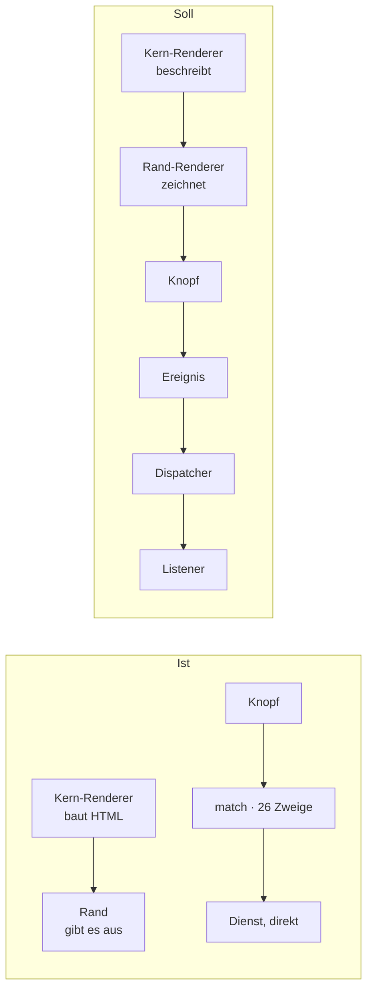
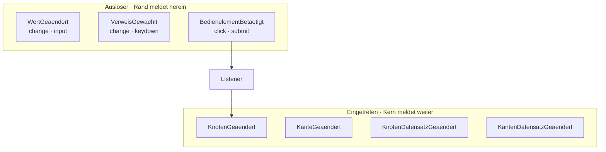
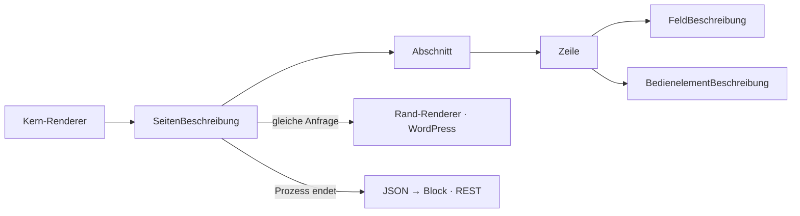
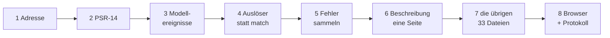
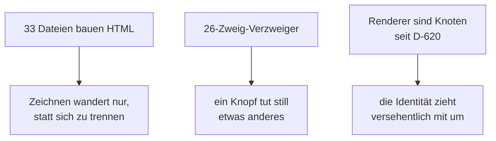

# Paket · Renderer und Ereignisse — Umbauplan

**Stand 2026-09-05.** Der Refactoringplan nach [§19](../ereignisse/konzept.md) seines Konzepts —
Ist-Analyse liegt vor ([`ereignisse/ist-analyse.md`](../ereignisse/ist-analyse.md)), hier folgen
Soll/Ist-Abgleich, Ereignistypen, Form der Beschreibung und die Reihenfolge.
**Für beides zusammen, weil es ein Paket ist** ([D-630](../../NewConcept/90-decision-log.md)).

⚠️ **Hier wurde nichts gebaut.** `src/`, `tests/` und `scripts/` sind unberührt.

---

## 0 · Was er entscheiden soll — die Kurzfassung

| | |
|---|---|
| **Schritte** | **8**, jeder für sich lauffähig |
| **Der erste** | die **Adresse** — ein Wertobjekt, das sagt *welcher Knoten, welche Kante, welcher Datensatz, welches Feld*. Ohne sie kann sich kein Listener eng anmelden und kein Fehler ans richtige Feld ([D-632](../../NewConcept/90-decision-log.md), [D-633](../../NewConcept/90-decision-log.md)) |
| **Ereignistypen** | **7** — drei Auslöser (Wert geändert, Verweis gewählt, Bedienelement betätigt) und vier Eingetretene (Knoten, Kante, Knoten-Datensatz, Kanten-Datensatz) |
| **Die Beschreibung** | **eine getippte Objektstruktur je Seite**, verlustfrei nach JSON schreibbar ([D-628](../../NewConcept/90-decision-log.md), [D-629](../../NewConcept/90-decision-log.md)) |
| **Grösster Brocken** | Schritt 7 — **33 Kern-Dateien bauen heute HTML** (nachgemessen 2026-09-05) |
| **Fünf Fragen an ihn** | §7, am Ende. Keine davon hält Schritt 1–4 auf |

---

## 1 · Soll/Ist-Abgleich — was da ist, was fehlt, was weg muss



**Nachgemessen am 2026-09-05, nicht abgeschrieben:**

| Sache | gemessen | Urteil |
|---|---|---|
| `src/Core/Renderer/` | **52 Dateien, 6 690 Zeilen**, davon **33 mit HTML-Tags** im Quelltext | *muss weg an den Rand* |
| Escape im Kern | **87** Aufrufe von `RenderResult::escape()` | *fällt mit dem HTML weg* |
| `match ($do)` | **26 Zweige + `default => throw`**, `NodesScreen.php:3797–3906` | *wird Aussender + 26 Listener* |
| Rand-Renderer | **`src/WordPress/` hat kein Renderer-Verzeichnis** — nur `Admin`, `Persistence`, `Plugin.php`, `SystemClock.php` | *die halbe Naht fehlt ganz* |
| Browser-Ereignisse | **14** `addEventListener`: `change` 3, `input` 2, `click` 1, `submit` 1, `keydown` 1 (Rest `scroll`, `load`, `DOMContentLoaded`) | *Rohmaterial da, wird nicht gemeldet* |
| Hook-Aufrufe im Kern | **0** | *unverletzt, braucht einen Wächter* |
| PSR-14 | nicht vorhanden | *kommt als Paket ([D-632](../../NewConcept/90-decision-log.md))* |

**Was schon richtig steht und bleibt:** `Control` (beschreibt den Auslöser, zeichnet ihn nicht),
`FrozenState` (Nutzlastform mit Vertrag), `Complaint` (Schlüssel plus Platzhalter, keine Sätze),
`RendererRegistry` (Auswahl über eine Eigenschaft — das Vorbild des Listener Providers), die
Versionsprüfung in der Persistenz, das Fehlen einer Action-Schicht.

**Was weg muss, benannt:** die HTML-Erzeugung in 33 Kern-Dateien; `RenderResult::$markup` samt
`escape()`; der `match`-Block als Verteiler; das stille Weglassen der Version — **das erledigt
gerade das Nachbarpaket** ([D-634](../../NewConcept/90-decision-log.md), TASK-056) und wird hier
vorausgesetzt, nicht wiederholt.

⚠️ **Die halbfertige Stelle, die den Umbau teuer macht:** `Section`, `DrawnRow`, `RenderedField`
und `LabelSlot` sind bereits Beschreibungsobjekte — aber sie tragen **HTML in sich**
(`Section::$body` ist ein `string`, `DrawnRow::$cell` ein `RenderResult`). *Es fehlt also nicht
die Idee der Beschreibung, sondern ihre Konsequenz.*

---

## 2 · Die Ereignistypen — sieben, aus dem Bestand abgeleitet



**Die drei Auslöser sind seine drei Formen** ([D-633](../../NewConcept/90-decision-log.md)) und
decken die fünf gemessenen DOM-Ereignisse vollständig ab:

| Ereignis | woraus, gemessen | trägt |
|---|---|---|
| `WertGeaendert` | `change` (3), `input` (2) auf einem Feld; `save_record`, `rename`, `put_setting` als Sammelform beim Absenden | Adresse, alter Wert, neuer Wert |
| `VerweisGewaehlt` | `change` am Auswahlfeld, `keydown`/`click` im Auswahldialog; am Rand heute `move`, `retarget_field`, `add_part` | Adresse, gewählte Ziel-Id |
| `BedienelementBetaetigt` | `click` (1), `submit` (1); im Formular das Feld `do` mit **26** Werten | Adresse, **Kennung** (der `do`-Wert) |

**Die vier Eingetretenen sind seine Teilung** ([D-631](../../NewConcept/90-decision-log.md)) —
nicht die gemessene, weil die gemessene eine Lücke ist und keine Ordnung: Datensatzwerte kommen im
Änderungsbuch überhaupt nicht vor, weil `DataEntry` nie meldete.

Jedes der sieben trägt **dasselbe Gerüst**: Id, Adresse, **Version** (pflichtig, ohne Vorgabewert,
[D-634](../../NewConcept/90-decision-log.md)), **Akt-Nummer** (die Klammer reist mit, D-631) und
eine Nutzlast in der Form von `FrozenState`.

⚠️ **Nicht 26 Klassen und nicht eine je Feldtyp.** Die enge Auswahl trifft der **Listener
Provider** anhand von Klasse **und** Kennung — «Bedienelement betätigt, Kennung `save_record`» ist
eine Anmeldung, kein Filter im Listener. *Genau das verlangt [§9](../ereignisse/konzept.md), und
so bleibt es PSR-14-verträglich.*

---

## 3 · Die Form der Beschreibung — eine Objektstruktur je Seite



**Eine je Seite, nicht je Renderer** ([D-628](../../NewConcept/90-decision-log.md)): eine Seite ist
**ein** Gegenstand, an dem sich die Zusage «zwei Ränder, dasselbe Ergebnis» überhaupt prüfen lässt.
Aus 183 Einzelstücken lässt sie sich nicht bilden.

**Objekte, nicht Text** ([D-629](../../NewConcept/90-decision-log.md)): getippte Klassen mit
`readonly`-Eigenschaften, damit der Übersetzer mitprüft. JSON ist die **Schreibweise**, nicht die
Sache — sie entsteht erst, wo der Prozess endet (Block, REST) oder WordPress sie fordert
(`block.json`).

Die Bausteine, alle als `final readonly class` im Kern:

```text
CONTRACT
SeitenBeschreibung  titel, adresse, abschnitte[], meldungen[]
Abschnitt           titel, eingeklappt, zeilen[]
Zeile               tiefe, adresse, felder[], bedienelemente[]
FeldBeschreibung    adresse, rendererName, typ, wert, beschriftung,
                    schreibbar, versteckt, meldungen[]
BedienelementBesch. adresse, name, kennung, beschriftung, verfuegbar, zerstoert
Meldung             schluessel, platzhalter{}, adresse       ← aus Complaint
Adresse             knotenId, kantenId?, datensatzId?, feldName?
```

**Kein `markup`, nirgends.** Wo heute `Section::$body` eine Zeichenkette ist, steht künftig eine
Liste von Zeilen. *`Control` zieht als `BedienelementBeschreibung` fast unverändert um — es ist
die eine Stelle, die es schon richtig macht.*

**Verlustfrei** heisst prüfbar: Struktur → JSON → Struktur ergibt dasselbe. Das ist die Zusage von
Schritt 6.

---

## 4 · Die Reihenfolge — acht Schritte, jeder für sich lauffähig



**Nach jedem Schritt sind beide Läufe grün und die Oberfläche bedienbar** (`PR-2`, `PR-9`). Kein
Schritt braucht den nächsten, um zu funktionieren.

### Schritt 1 · Die Adresse

Ein `Adresse`-Wertobjekt im Kern, und die vorhandenen Stellen fangen an, es zu führen — `Complaint`
bekommt eine, `Control` bekommt eine. **Sonst ändert sich nichts.** *Zuerst, weil beide späteren
Richtungen daran hängen: die enge Anmeldung eines Listeners und das Ausrufezeichen am Feld.*

> **Zusage:** `event-address-check` — jede `Complaint` und jedes `Control` auf der Knotenseite
> trägt eine auflösbare Adresse; keine Adresse zeigt auf einen Knoten, den es nicht gibt.

### Schritt 2 · PSR-14 einziehen, ohne Aussender

`psr/event-dispatcher` als Abhängigkeit (drei Schnittstellen, kein Code), dazu `Dispatcher` und
`ListenerProvider` im Kern. **Noch sendet niemand.** Das Plugin verhält sich unverändert.

> **Zusage:** `core-has-no-hooks-check` — kein `do_action`, `add_action`, `apply_filters`,
> `add_filter`, kein `wp_*`-Aufruf unterhalb `src/Core/`. *Die Regel aus
> [D-627](../../NewConcept/90-decision-log.md), und die einzige, die durch dieses Paket brechen
> kann. Sie kommt vor dem ersten Ereignis, nicht danach.*

### Schritt 3 · Die vier Modell-Ereignisse

`ModelEditor`, `Labels` und `DataEntry` senden statt zu melden; **ein** Aufzeichnungs-Listener
schreibt ins Änderungsbuch. Das Buch bleibt, was es ist — Modellgeschichte, nicht Ereignisspeicher
([D-631](../../NewConcept/90-decision-log.md)).

> **Zusage:** `journal-parity-check` — dieselbe Bedienfolge erzeugt dieselben Chronikzeilen wie
> vorher, Zeile für Zeile verglichen; **plus** die Zeilen, die `DataEntry` bisher schuldig blieb.

### Schritt 4 · Der Auslöser statt des `match`

Die 26 Zweige werden 26 Listener-Anmeldungen; `handlePost()` liest `do`, baut ein
`BedienelementBetaetigt` und übergibt. Dasselbe für `SettingsScreen` und `CleanupScreen`.

> **Zusage:** `do-parity-check` — alle 26 Kennungen tun weiter genau das, was sie taten; eine
> unbekannte Kennung wirft weiterhin.

### Schritt 5 · Fehler sammeln und an ihre Stelle setzen

Ein Ereignis sammelt die Meldungen aller Listener; alle überleben den Seitenwechsel, jede mit ihrer
Adresse ([D-632](../../NewConcept/90-decision-log.md)).

> **Zusage:** `complaint-address-check` — zwei fehlerhafte Felder in einem Absenden ergeben **zwei**
> Meldungen, jede an ihrem Feld, und keine geht auf dem Weg verloren.

### Schritt 6 · Die Beschreibung, an **einer** Seite

Die Objektstruktur aus §3 entsteht, und **eine** Seite wird darauf umgestellt — die
Installationsseite, weil sie die kleinste ist. Der erste Rand-Renderer entsteht in
`src/WordPress/Renderer/`. Alle anderen Seiten laufen unverändert weiter.

> **Zusage:** `description-roundtrip-check` — Struktur → JSON → Struktur ergibt dasselbe Objekt,
> Feld für Feld. *Das ist die Verlustfreiheit aus [D-628](../../NewConcept/90-decision-log.md).*

### Schritt 7 · Die übrigen Renderer, einer nach dem anderen

Die 33 HTML-bauenden Dateien geben ihr Zeichnen ab, in Gruppen: erst die Feldrenderer, dann die
Zeilen, dann Baum und Formular. **`RenderResult::$markup` fällt zuletzt**, wenn niemand mehr
schreibt. Nach jeder Gruppe ist die Oberfläche vollständig bedienbar.

> **Zusage:** `two-edges-same-result-check` — dieselbe Beschreibung, durch den Rand-Renderer und
> durch den Vorschau-Weg, ergibt dasselbe Ergebnis
> ([D-623](../../NewConcept/90-decision-log.md), [D-626](../../NewConcept/90-decision-log.md)).
> Dazu `no-markup-in-core-check`: kein HTML-Tag mehr in einem Stringliteral unterhalb
> `src/Core/Renderer/`.

### Schritt 8 · Der Browser meldet, und das Protokoll

`assets/admin.js` schickt aus den fünf gemessenen DOM-Ereignissen die drei Auslöser-Formen; dazu
der Abschnitt «Event» auf der Installationsseite und das abschaltbare Protokoll
([§14](../ereignisse/konzept.md), [D-627](../../NewConcept/90-decision-log.md)).

> **Zusage:** `event-log-check` — das Protokoll lässt sich ein- und ausschalten, und ausgeschaltet
> schreibt es nichts.

---

## 5 · Was dabei kaputtgehen kann



1. **Die Beschreibung wird zu ungenau.** *Der eigentliche Fehlermodus von
   [D-623](../../NewConcept/90-decision-log.md): wenn sie nicht reicht, baut der Rand-Renderer
   Sonderfälle nach Knotennamen — und das Zeichnen ist dann verteilt statt getrennt. **Genau
   dagegen steht die Zusage von Schritt 7 und nicht die Sorgfalt beim Bauen.***
2. **Ein `do`-Wert verliert stillschweigend sein Verhalten.** *26 Zweige über 110 Zeilen, keiner
   davon heute einzeln geprüft. Der `do-parity-check` in Schritt 4 ist deshalb kein Zubehör.*
3. **Die Renderer sind seit [D-620](../../NewConcept/90-decision-log.md) Knotenklassen** —
   `RendererNode extends Node implements Renderer`. **Der Knoten bleibt im Kern; nur das Zeichnen
   zieht an den Rand.** *Wer das verwechselt, nimmt einen Renderer aus dem Modell, und dann ist er
   nicht mehr wählbar.*
4. **87 Escape-Aufrufe fallen weg.** *Solange irgendwo noch Kern-HTML lebt und der Rand schon
   `wp_kses` anwendet, kann doppelt oder gar nicht escaped werden. Deshalb zieht Schritt 7 in
   Gruppen um und nicht in Stücken.*
5. **Das leere Änderungsbuch.** *Es steht seit [D-634](../../NewConcept/90-decision-log.md) auf
   null. Der `journal-parity-check` aus Schritt 3 vergleicht daher gegen einen frisch erzeugten
   Vergleichslauf, nicht gegen Altbestand — es gibt keinen.*
6. **Der Nachbar.** *TASK-056 bewegt zur Planungszeit `Changelog` und `DataEntry`. Schritt 3 fasst
   genau diese beiden an und darf erst danach beginnen.*

---

## 6 · Was dieser Plan **nicht** entscheidet

Der Plan sagt **nicht**, welche Blöcke es gibt, ob ein Block einen einzelnen Datensatz oder eine
Auswahl nennt ([D-625](../../NewConcept/90-decision-log.md) lässt das offen), was aus den 48
gewachsenen `what`-Werten als Vokabular wird, und ob die Vorschau technisch derselbe Weg ist wie
das spätere Frontend oder nur dasselbe Ergebnis liefern muss.

---

## 7 · Fragen an den Eigentümer (`PR-4`)

*Fortlaufend nach `F-8` aus der Ist-Analyse. Keine hält Schritt 1–4 auf.*

```text
F-9 · Welche Seite zieht in Schritt 6 zuerst um?
Vorgeschlagen ist die Installationsseite, weil sie die kleinste ist. Die
Knotenseite (4 084 Zeilen) ist die, an der sich zeigt, ob die Beschreibung
trägt — sie wäre der ehrlichere, aber der teurere erste Versuch.
```

```text
F-10 · Gehört der Gutenberg-Block in dieses Paket oder danach?
Die Zusage aus D-626 — Vorschau zeichnet wie das Frontend — lässt sich heute
nicht messen: es gibt kein Frontend (0 REST-Routen, 0 registrierte Blöcke).
Bis ein Block existiert, ist der zweite Rand die Vorschau. Reicht das, oder
soll ein erster Block als Schritt 9 dazu?
```

```text
F-11 · Sollen Feldänderungen sofort melden oder erst beim Absenden?
Heute ist jede Änderung ein voller Seiten-POST mit Redirect — kein AJAX, keine
REST-Route. «Wert geändert» beim Tippen zu melden verlangt einen Rückweg, den
es nicht gibt. Schritt 8 kann beides: nur beim Absenden sammeln, oder einen
Endpunkt bauen. Was soll es sein?
```

```text
F-12 · Wird das Vokabular jetzt festgeschrieben?
Das Änderungsbuch steht auf null (D-634). Das ist der einzige Zeitpunkt, an
dem eine feste Verbenliste nichts kostet — 19 der 48 alten Werte trugen die
Adresse im Verb, was der eigene Vertrag verbietet. Jetzt festlegen, oder
wachsen lassen?
```

```text
F-13 · Wie weit reicht das Protokoll aus §14?
Es ist abschaltbar und dient der Fehlersuche (D-627). Offen ist, ob es nur die
Ereignisverteilung protokolliert oder auch das, was die Listener tun — und ob
dafür ein PSR-3-Paket kommt oder eine eigene schmale Schnittstelle («F-8 ist
mir egal, was einfacher ist»).
```
