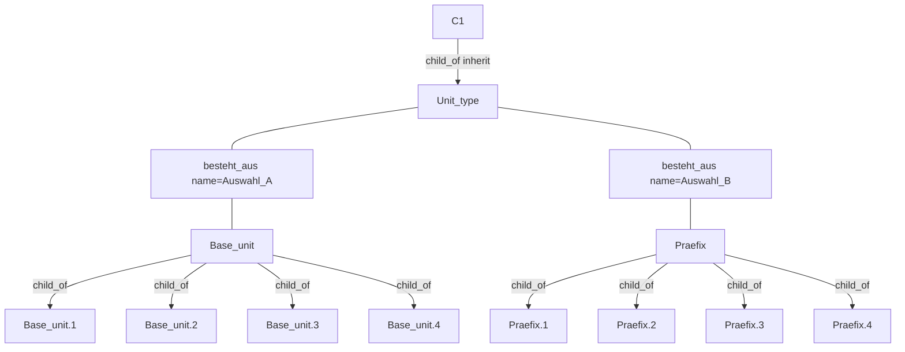
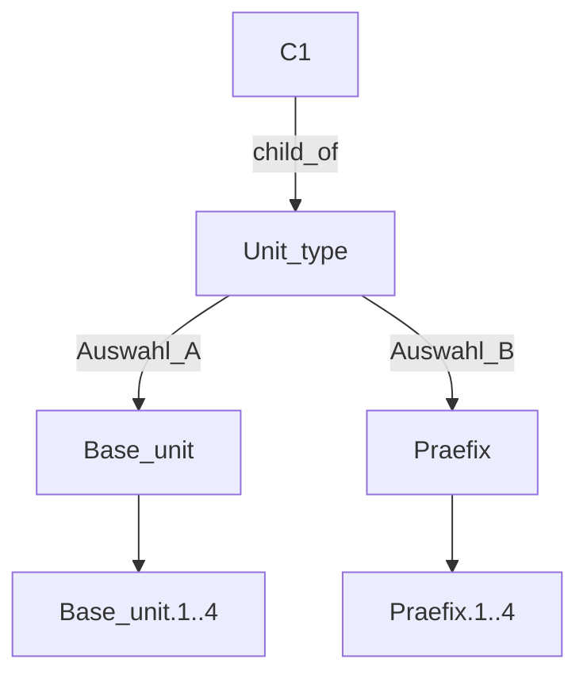
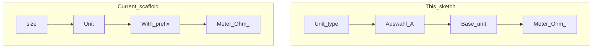
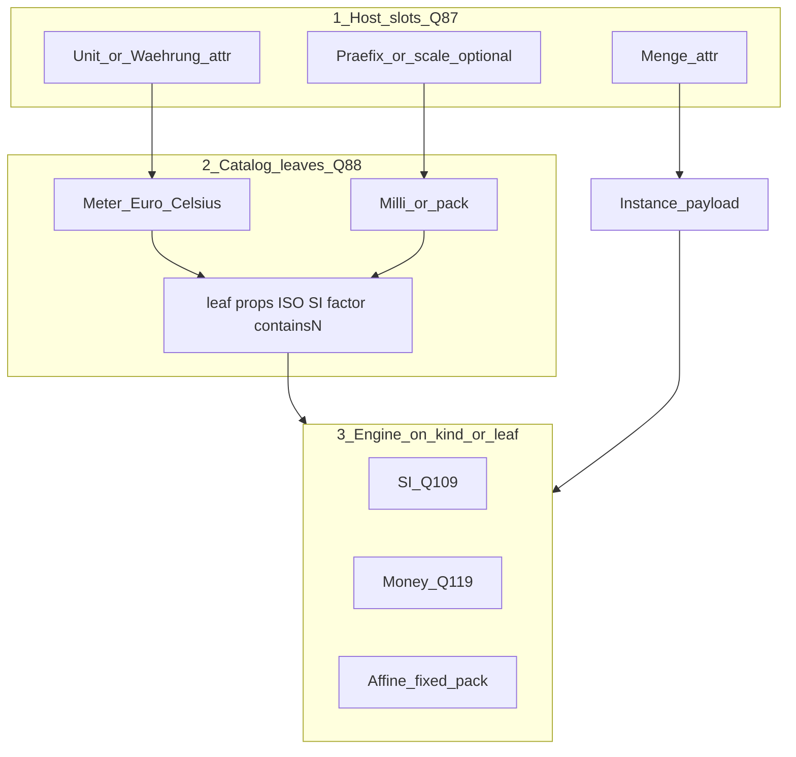

# Attribute choice + inheritance (Unit-type sketch)

**Agreed sketch (2026-08-11).** Reusable CatalogChoice + Q66 heir pattern, named for the Unit application. Scaffold ≈ **0.0.458**: catalogs under **Definition/Konstanten** (Präfixe, Basiseinheiten, Bauformen, Währung); **Unit type** + **C1** under Data Types; `calc` ≈ 0.0.456.

## Structure

| Piece | Role |
|-------|------|
| **Unit type** | Host with two **`besteht_aus`** attributes |
| **Auswahl A** | Type = **Base unit** → CatalogChoice among Base unit’s `child_of` children |
| **Auswahl B** | Type = **Praefix** → CatalogChoice among Praefix’s `child_of` children |
| **Base unit leaves / Praefix leaves** | Specialization / choice options (e.g. Meter… / pico…) |
| **C1** | **`child_of` Unit type** — inherits attribute definitions (Q66) |



Compact form (same model):



## Runtime

- Opening **Unit type** (or **C1**): pick among allowed Base unit leaves via Auswahl A and Praefix leaves via Auswahl B.
- Depth ≤ 1 under type → ListChooser; deeper → TreeChooser (Q90).
- **`choiceFilter`** on the attribute restricts which type-children are pickable (exclude-ids UI “Choices”). Empty filter = all children allowed.
- Prefix **factor** marriage (`allowedPrefixes` on a concrete unit leaf) remains a **separate** specialized allowlist when SI rescale factors are needed (Q51) — not a second CatalogChoice law.

## Heir overrides (C1) — father unchanged

| Override on C1 | Storage | Mutates Unit type edge? |
|----------------|---------|-------------------------|
| Default value | Host `_wtt_attribute_fixed_values` by name | **No** |
| `choiceFilter` / validators / dateMode / compute | Host `_wtt_attribute_type_extras` (inherited path) | **No** |
| Readonly / Hide | Host maps | **No** |
| Type / Mult / Bindung | Local override edge (shadow) when changed | Father edge untouched |
| Preferred + Settings walk | Host `_wtt_attribute_settings_overrides` (heir deltas) | **No** (father edge untouched) |

Scaffold: inherited **Choices** editable ≈ **0.0.455** (host map). Inherited **Preferred / Walk Settings** ≈ **0.0.462** (`_wtt_attribute_settings_overrides`).

## Application

One abstract law (**Unit type** + **Base unit** + **Praefix**); other Fallstudie hosts are the same pattern with different names.

### Mapping legend

| Role | This sketch | Other hosts (same law) |
|------|-------------|------------------------|
| Host | **Unit type** | Bauteilliste, Preis, … |
| Auswahl A type | **Base unit** | Bauart / Bauformen, Währung, … |
| Auswahl B type | **Praefix** | (optional second choice attr) |
| Leaves | Meter… / pico… | 0201… / Euro… |
| Heir | **C1** | Widerstand, Position, `size`, … |
| Choices UI | Attribute Options → **`choiceFilter`** | same |

### A — Bauart / footprint (same law)

```text
Unit type  ≈  Bauteilliste or Passiv / Bauteil host
Auswahl A  ≈  Bauart  (type → Bauart / Bauformen root)
Base unit leaves  ≈  0201, 0402, …   (here: footprint options)
C1  ≈  Position or Widerstand (inherits; Default + Choices)
```

### B — Währung / Preis (same law + ISO 4217)

```text
Unit type  ≈  Preis host
Auswahl A  ≈  Währung  (peer unit pick — same slot pattern as m/in or °C/K/°F)
Base unit leaves  ≈  Euro, US Dollar, Pound, …
C1  ≈  specialized price field on a part kind
```

Optional third scale slot stays **open** for Cent pick UX later (currency-scoped options); R1 may use entry scale only (YAGNI). **Engine ≠ SI Präfix.**

#### ISO 4217 alignment (no loss)

Align **Währung leaves** with **ISO 4217** vocabulary. ISO supplies **identity + minor exponent** only — not FX, not rounding, not storage policy.

| ISO 4217 | On our Währung leaf | Job |
|----------|---------------------|-----|
| Alphabetic code | `currencyCode` (e.g. `EUR`) | Identity / interchange |
| Numeric code | `currencyNumber` (e.g. `978`) | Optional identity |
| Minor unit (decimal places) | `currencyExponent` (e.g. `2` → Cent) | Defines Cent vs major; feeds entry/display |

**We keep beyond ISO (nothing dropped):**

| Ours (Q119 / Q121 / Q110) | Why ISO is not enough |
|---------------------------|------------------------|
| Store amount in **major** unit | ISO does not prescribe store format |
| **Entry scale** major \| minor | UX; uses `currencyExponent` |
| Preferred **converter** / rounding | ISO does not define rounding |
| Peer CatalogChoice Preis = Menge + Währung | Same slot law as other kinds |
| Optional future currency-scoped scale pick | Cent path kept open |
| FX rate + date snapshot | **Not** in ISO 4217 — Q110 |

Do **not** map SI Präfix / Meter / °C to ISO 4217. Physical and count profiles use other engines (Q51/Q109, fixed factor, affine, packaging contains-N).

### C — Unit / size / quantity (candidate vs current scaffold)

| This sketch | Candidate product meaning | Current scaffold (OQ-W11) |
|-------------|---------------------------|---------------------------|
| **Unit type** | Composed unit datatype host | Partially `With prefix` / `size` (Value + Unit) |
| **Base unit** | Catalog of Meter, Ohm, … | Children of With/Without prefix under **Konstanten/Basiseinheiten** (≈ 0.0.464: `is_unit_prefix_bucket` recognizes that parent; CatalogChoice + Walk Choices) |
| **Praefix** | Catalog pico…Mega | Data Types / Präfixe; often via **allowedPrefixes** on unit leaf |
| **C1** | `size` / Passiv.Wert specialization | Inherit + host Default |

**Law to keep when remapping:** composition attrs + type `child_of` options + heir **`choiceFilter` / Default on host maps**. Prefer `choiceFilter` for “which base units are allowed”; keep **`allowedPrefixes`** only for SI-prefix **factors** on a chosen base unit (Q51).

#### BIPM SI + ISO/IEC 80000 alignment (no loss)

Parallel to ISO 4217 for money: align **SI unit / Präfix vocabulary** with standards; keep product engines.

| Authority | What it defines | Maps to our model |
|-----------|-----------------|-------------------|
| **BIPM SI Brochure** | The SI: base/derived units, **SI prefixes** (milli…yotta), official symbols | Base unit leaves (Meter, Ohm, …); Praefix catalog names/symbols/factors |
| **ISO/IEC 80000** | *Quantities and units* (replaces ISO 31); ISQ; names/symbols aligned with SI | Quantity-kind naming; consistent unit/prefix presentation |
| **IEC 80000-13** | Binary prefixes (Ki, Mi, …) | Information units only — **not** the SI Präfix table |

| SI / ISO field (conceptual) | On our nodes | Job |
|-----------------------------|--------------|-----|
| SI prefix name + symbol | Praefix leaf name / `shortDescription` / Presentation `symbol` | e.g. Milli, `m` |
| Prefix factor (10^n) | Praefix attr `multiplikator` Default+RO+**Hide** (Mult `1`; Q105) — scaffold meta `_wtt_multiplikator` kept in sync | Same global factor as SI |
| Unit name + symbol | Base unit leaf + Kuerzel typed **`node_presentation`** (context **`symbol`**) | e.g. Meter → presentation.symbol / shortDescription `m` (no hardcoded sample map) |

**We keep beyond SI/ISO 80000 (nothing dropped):**

| Ours | Why the standards are not enough |
|------|----------------------------------|
| `allowed_prefix_ids` / Walk allowlists | Which prefixes a unit may use in *our* catalog |
| Heir `choiceFilter` / Defaults | Q66 application overrides |
| Q109 rescale on Präfix switch | Product UX policy |
| Meter↔Inch fixed factor; °C↔K↔°F affine; packaging contains-N | Outside pure SI prefix math |
| `prefix_root_to_si` (e.g. mass g→kg) | Product/Q51 nuance on unit leaf |

Do **not** treat ISO 80000 as a conversion engine for money, FX, or inch/°F. Binary KiB ≠ Milli.



### D — Checklist (every application)

1. Attribute **type** = choice root with `child_of` options.
2. Paint / Default dialog = CatalogChoice (List or Tree by depth).
3. Attribute Options → **Choices** (`choiceFilter`) on own edge.
4. Heir host → same Choices + Default via **host maps** (father unchanged) ≈ **0.0.455**.
5. Do not duplicate the same fact as tree children under the host (`child_of` = inheritance only).

### Why the catalog looked different (conversion)

The **With prefix / Without prefix** split and per-unit **prefix allowlists** were driven by **Umrechnung** (Q109 / Q51 / Q120): SI prefix rescale factors, “empty allowlist = no prefix”, marriage of unit leaf ↔ allowed Präfixe — not by CatalogChoice itself.

That special path is still valid for **factors / engines**. The **pick** of Base unit and Praefix should still follow this document’s law (composition + `choiceFilter` + heir host maps). Do not let conversion UX force a second inheritance topology when the abstract Unit-type sketch already covers selection.

### Measure profiles (slot same, engine differs)

| Profile | Slots | Scale | Engine |
|---------|-------|-------|--------|
| SI measure | Menge + BU + Praefix? | SI Präfixe + `multiplikator` (BIPM / ISO 80000 vocab) | Q109 multiplicative |
| Length cross-UoM | Menge + peer unit (m/in/…) | Praefix only per unit profile | Fixed factor |
| Temperature | Menge + peer unit (K/°C/°F) | usually none | Affine (factor + offset) |
| Money | Menge + Währung (+ scale?) | ISO 4217 `currencyExponent` / entry scale | Money rules + FX (Q119/Q110) |
| Count / packaging | Menge (`int`) + optional pack unit | integer contains-N | Identity or containment |

Peer unit pick for money / length / temperature = **same slot pattern as Währung**; engines differ.

### Storage inventory (what to persist)

Full tabular breakdown: Canvas **measure-storage-inventory** (catalog leaves vs instance readings; live / target / open).

**Catalog (definition) — must store**

| Entity | Fields |
|--------|--------|
| Praefix leaf | name, symbol, factor (`multiplikator` / `_wtt_multiplikator`) |
| SI Base unit leaf | name, symbol, `allowed_prefix_ids`, optional `prefix_root_to_si` |
| Währung leaf | `currencyCode`, `currencyNumber`, `currencyExponent` (+ name) |
| Affine / fixed peer unit | identity + to_canonical factor [+ offset] + canonical ref (**open**) |
| Pack unit | identity + integer contains-N (**open**) |
| Host attrs | Relations + Mult/RO/Default/`choiceFilter`/Preferred (already) |

**Instance (reading) — must store**

| Profile | Payload |
|---------|---------|
| SI | Menge + praefixId? + baseUnitId |
| Money | amountMajor + currencyId (+ FX snapshot when booking foreign) |
| Temp / m↔in | Menge + unitId |
| Plain Stück | int |
| Packaging | int + packUnitId |

**Do not store:** per-BU×Praefix factor matrix; Cent as SI Praefix; FX as constant on currency leaf.

### How storage fits the concept (mapping)

Same **three layers** we already use — nothing new beside leaf props + engine rules.



| Concept piece | What we already have | Where storage lands |
|---------------|----------------------|---------------------|
| **Host / C1** | `child_of` Unit type (or Preis host); inherits attrs | No extra measure meta on host except heir overrides |
| **Slots** | `besteht_aus` attrs: Menge + peer-unit pick + optional scale | Instance values = fillings of those attrs |
| **Peer pick** | CatalogChoice → type’s `child_of` leaves | Store **term ids** only (currencyId, baseUnitId, …) |
| **Leaf constants** | Defaults / RO / type extras on leaf or inherited | ISO fields, `multiplikator`, contains-N, affine factor/offset |
| **Marriage** | Allowlist on SI Base unit | `_wtt_allowed_prefix_ids` (not a second slot) |
| **Heir narrow** | Host maps Default / `choiceFilter` | Already Q66 — not new storage kind |
| **Engine** | Rules by profile (Q120) | Code + leaf props; not a parallel datatype per folder |

**Profile → same concept, different slot fill**

| Profile | Menge | Pick A (type) | Pick B | Leaf props engine reads |
|---------|-------|---------------|--------|-------------------------|
| SI | double | Base unit | Praefix? | `multiplikator`, allowlist, `prefix_root_to_si` |
| Money | double (major) | Währung | optional later | ISO 4217 trio; entry_scale on Preferred |
| Temp | double | K/°C/°F peers | — | affine factor+offset (**open**) |
| m↔in | double | Meter/Inch peers | Praefix only if Meter | fixed factor (**open**) |
| Pack | int | Stück/Box/… | — | contains-N (**open**) |
| Plain Stück | int only | — | — | label only (Q58) |

**Fit verdict:** Storage inventory is **not** a new model. It is (1) instance = attribute values, (2) catalog constants = leaf attributes/meta aligned ISO/SI, (3) engines = profile rules. Gaps = missing leaf props (ISO, affine, contains-N), not a hole in Unit-type / CatalogChoice / Q123.

### Umrechnung (open vs locked)

Concept fits; **conversion engines** are the remaining work:

| Locked | Open |
|--------|------|
| Q109 SI Präfix rescale + refuse cross-dimension | Length fixed-factor storage + seed |
| Q119 money major store + ISO exponent defines Cent | Wire ISO leaf fields + entry_scale UI |
| Q110 FX parked | Affine temp (± Fahrenheit); packaging contains-N |

### SI engine (Q109) — Feinschliff reference

Locked behaviour (scaffold live):

1. **Same Base unit, Präfix change** → rescale **Menge** so `to_si` stays constant (`Menge × multiplikator × prefix_root_to_si`).
2. **Factor** on Praefix leaf via inherited attr Default (`multiplikator`, RO+Hide) + meta `_wtt_multiplikator` mirror.
3. **Allowlist** on Base unit ∩ Walk `allowedPrefixIds` ∩ `choiceFilter`.
4. **Empty allowlist** → no Präfix control.
5. **Cross–Base-unit** (Ohm↔Farad) → refuse silent switch.
6. **Not via `calc`** — SI Präfix stays leaf scale, not a Relation op.

### Calculation Relation `calc` (Q125)

**User how-to (later):** step-by-step recipes live in [`user-constellation-recipes.md`](user-constellation-recipes.md) (backlog).

**Locked:** Evolve Q124 into generic RelationType **`calc`** (UI DE: Berechnung) + required **`op`** + optional **props**.

| | |
|--|--|
| RelationType | `calc` (scaffold alias: `defaultvalue_from` until migrate) |
| Required | `op` |
| Optional props | `factor`, `offset`, `factor_ref`, … (per op) |
| First op | `default_from` — same behaviour as Q124 (consumer→provider, attr `name`, create/empty) |
| Later ops | `scale_factor`, `scale_ref`, `contains`, … |
| Not via `calc` | SI Präfix (`multiplikator` on leaf); Fuss `sum`/`avg` until aggregate endpoints are clear |

## Parked

Full Unit catalog reshape (align seed with **Unit type / Base unit / Praefix** names) — only after explicit lock; until then keep OQ-W11 seed as-is. Scaffold storage for ISO 4217 fields on currency leaves and explicit SI/ISO 80000 field keys on unit/prefix leaves = implement when seed is wired — **vocabulary locks** above stand.
