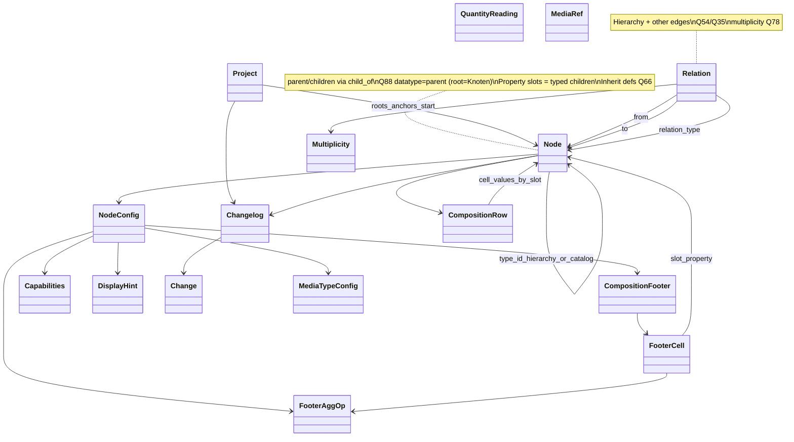
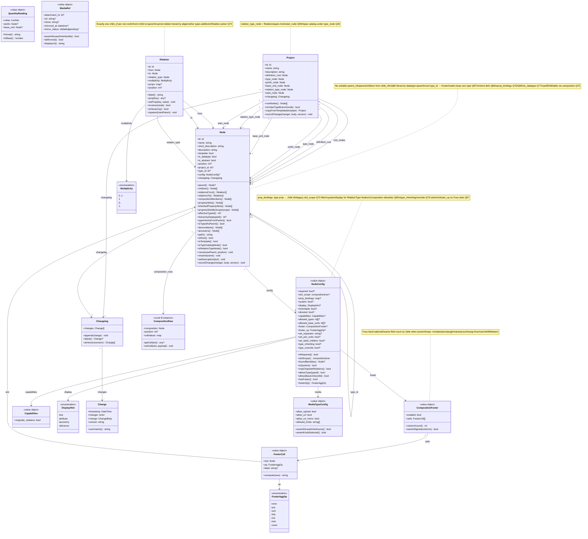
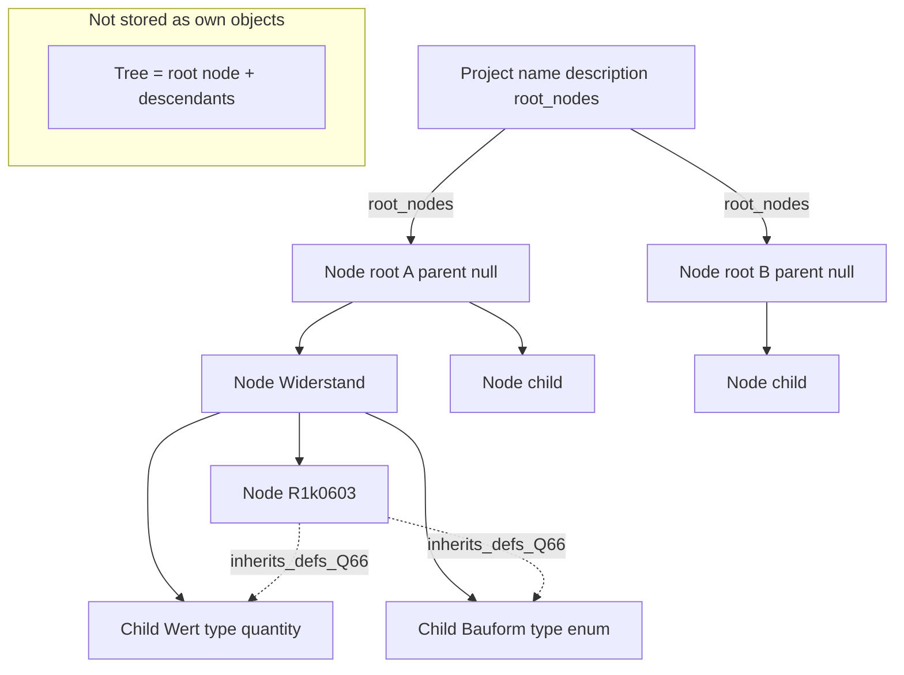
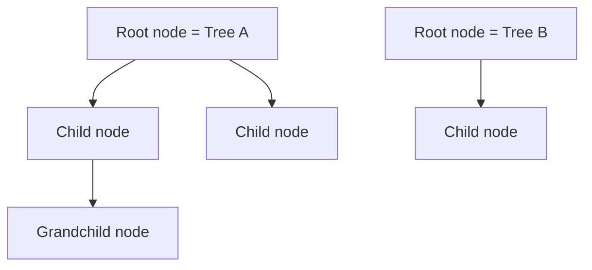
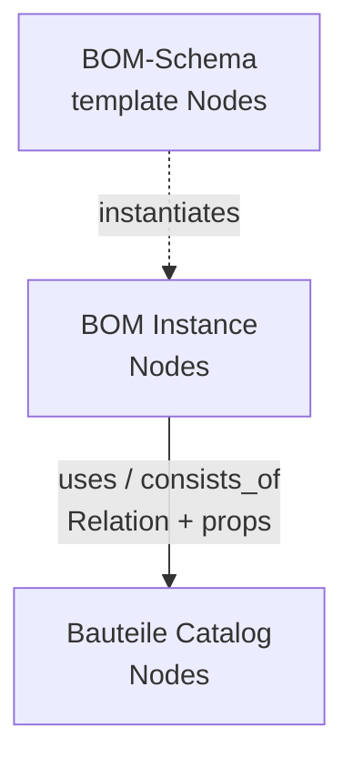
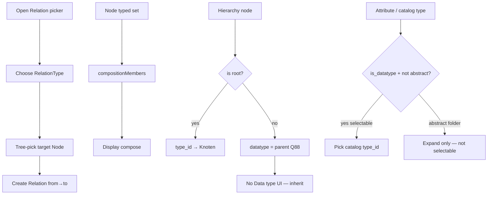

---
name: Data structure — Project, Node, Changelog
overview: Core objects Project, Node (property slots as typed children), Relation/RelationType-as-Nodes, Changelog. Hierarchy = protected child_of Relation (Q54). Inheritance along child_of (Q66 slots; Q88 hierarchy datatype = parent). Parameter class discarded. Planning artifact only.
status: draft
version: "0.7.26-plan"
last_updated: "2026-08-06"
related_plans:
  - docs/plans/project-plan.md
  - docs/plans/mvp-requirements.md
  - docs/plans/planning-phase.md
todos:
  - id: define-node-core
    content: "Define Node (parent/children derived from child_of); template flag"
    status: completed
  - id: define-parameter-core
    content: "SUPERSEDED: Parameter class dropped — properties are typed child Nodes"
    status: cancelled
  - id: define-node-parameter-link
    content: "SUPERSEDED (Q64 dropped) — slots = typed children; inherit along child_of (Q66/Q54)"
    status: cancelled
  - id: decide-parameter-model
    content: "SUPERSEDED — no Parameter class; Node.config for capabilities (Q34/Q49)"
    status: cancelled
  - id: define-property-inheritance
    content: "Q66: inherit property-slot definitions along child_of chain"
    status: completed
  - id: explore-typed-edges
    content: "Q35/Q54 decided: Relation + RelationTypes-Ast; refine Q41–Q44 display/directed"
    status: completed
  - id: define-relation-type
    content: "RelationType = Nodes under relation_type_node; seed child_of + composition"
    status: completed
  - id: define-project-core
    content: "Project stores root_nodes plus required Definition anchors incl. relation_type_node"
    status: completed
  - id: define-definition-tree
    content: "Definition tree required; Type, Basiseinheit, Präfix, Relationstypen anchors on Project"
    status: completed
  - id: define-changelog
    content: "Shared Changelog/Change on Project and Node"
    status: completed
  - id: define-template-flag
    content: "Node.template flag marks template trees for project-specific trees"
    status: completed
  - id: define-core-types
    content: "Fixed simple types per project; derived/composed types from simples (Q36/Q48); Relation rules Q49"
    status: in_progress
  - id: map-storage
    content: "Decide how Project, Node, Changelog, Relation map to WordPress storage"
    status: pending
  - id: decide-optional-fields
    content: "Confirm optional fields; Change.version (Q23); type/prefix/base rules (Q24)"
    status: pending
---

# Data structure: Project, Node, Changelog

> Planning artifact for the domain model. Early scaffold (≈ plugin `0.0.239`) uses term meta interim; hierarchy still WP term parent until Relations scaffold.
> **2026-08-02:** Parameter class discarded (Q64). **Q54:** hierarchy = protected **`child_of`** Relation. **Q35:** RelationTypes = Nodes under **Relationstypen**-Ast.
> **2026-08-06 (Q88):** Hierarchy datatype = parent. Only **root** typed **Knoten**; every hierarchy child’s `type_id` → parent. Attribute members keep own field types.

## Simplified class diagram (classes only)

No attributes, no methods — structure only:



## Current class diagram (detailed)

Conceptual domain model (planning — not implemented PHP).  
**Q64 superseded:** no Parameter class. **Eigenschaften** = typisierte Kind-Knoten. **Q54:** no writable `parent_id` field — parent/children derived from **`child_of`**. **Q66:** inherit slot definitions along the `child_of` chain. **Q88:** hierarchy datatype = parent (root = **Knoten**).

### Type Node vs Eigenschaft vs domain Node (read this first)

| Role | Example | Is a tree Node? | Job |
|------|---------|-----------------|-----|
| **Type catalog Node** | `int`, `media`, `node_embed`, `node_ref` under Datentypen | **Yes** (only under Typ-Ast) | Describes *what kind of value* a slot / attribute may hold |
| **Eigenschaft / attribute member** | Child `Anzahl` under `Rezept`, typed `int` | **Yes** (`besteht_aus` / composition member; not hierarchy datatype) | Named slot; `type_id` → Type catalog Node (own field type — **not** parent) |
| **RelationType Node** | `child_of`, `besteht_aus`, … under Relationstypen | **Yes** (only under relation_type_node) | Classifies a Relation edge |
| **Domain / hierarchy Node** | `Fallstudie`, `Definition`, `Aggregation`, `Widerstand`, `BOM` | **Yes** | Hierarchy class; **datatype = parent** (Q88); owns attributes |

```text
Widerstand (domain Node; hierarchy datatype = parent class)
  ├── Wert (attribute / Eigenschaft) ──type_id──► double (Type catalog Node)
  └── Bauform (attribute) ──type_id──► enum Bauart (Type catalog Node)

Hierarchy datatype chain (Q88) — everything via child_of:
  Fallstudie (root)     type_id → Knoten
    Definition          type_id → Fallstudie
      Aggregation       type_id → Definition
        …               type_id → parent
```

```text
Compositionen (domain folder) / Implementation
  └── BOM (Zusammenstellungs-Definition)
        composition → Name (text)          ← outside the table type (Q61)
        composition → Tabelle (type=table)
                        composition → Zeile  (required; 1..n field members)
                        composition → Kopf?  (optional; same field count as Zeile)
                        composition → Fuss?  (optional; same field count as Zeile)

Datatype catalog `table` (under Collection / Complex)
  composition → Zeile   (required band skeleton)
  composition → Kopf?   (optional band)
  composition → Fuss?   (optional band)

Definitionsbaum / Relationstypen
  ├── child_of (system) — hierarchy + inheritance path (Q66/Q86/Q88)
  ├── besteht_aus — domain composition / besteht aus (set members, BOM members, …; legacy key `composition`)
  └── has_type / ref_scope — helpers (system / synthetic)
```

**Scaffold today:** still stores hierarchy as WP term parent — maps to conceptual `child_of` later.

**Slot-definition inheritance (Q66/Q86):** a descendant **inherits** ancestor property-slot definitions along the **`child_of`** chain (types / required / fixed / `slot_scope`). Instance values stay on leaf / page (Q63). No separate `erbt_von` RelationType.

**Hierarchy datatype inheritance (Q88 — general rule):**
- Only the **root** is the base node (**Knoten** / Fallstudie).
- **Everyone else inherits:** datatype = father (WP parent / `child_of`).
- Create / reparent / repair: persist `type_id` = parent (non-attribute children); reads **derive** from parent.
- **No Data type field** in node detail — hierarchy already carries type.
- **Attribute members** (`besteht_aus`) keep their **own** field types (Attributes panel) — orthogonal.

### Hierarchy vs other Relations (Q54)

| Rule | Check |
|------|-------|
| SoT for tree | Relation type **`child_of`** (`from`=child, `to`=parent) |
| Non-root | Exactly one `child_of`; **cannot delete**; only **reparent** (`to`); no cycles |
| Multiplicity | **`child_of` always `1`** (Q78 lock; not 0..1 / 0..* / 1..*) |
| Root | No `child_of` edge |
| Unassigned bucket | **No** |
| Dual SoT | **Forbidden:** writable `parent_id` + hierarchy edges |
| Tree UI | Expand/paint using **only** `child_of` (perf) |
| Node UI | **Relations von** (`from=this`) / **Relations an** (`to=this`) |
| Persistence lean | WP `term_parent` may implement `child_of` only |



> **`type_id` meaning (Q88 + Q87):** On a **hierarchy** node → parent (or **Knoten** on root). On an **attribute member** → Type catalog Node under Typ-Ast. Same field, two jobs — do not merge them.

**Invariants (Eigenschaften / Q66 / Q70 / Q54):**

| Rule | Check |
|------|-------|
| Property slot | Attribute member (`besteht_aus`) with `type_id` under Typ-Ast (own field type — not hierarchy parent) |
| Hierarchy datatype | Non-root hierarchy node: `type_id` → parent; root → **Knoten** (**Q88**) |
| `prop_bindings` | On **`table`-typed** node: type-prop key (`zeile`/`kopf`/`fuss`) → **direct child id**. Band identity = binding, **not** display name (**Q70** refined / Fallstudie) |
| Rules / Fixes | Bindings checked by **rules**; 0..n optional user-triggered **Fixes** (**Q80**) |
| `slot_scope` | Legacy/filter on slot `Node.config`: `composition` \| `row` (**Q70**) where still used |
| Inheritance | Descendant inherits ancestor’s **slot definitions** along **`child_of`** |
| Override | Open (Q66) — merge vs replace; may hide slots? |
| Instance values | Not definition children; filled on leaf / CompositionRow / page (Q63) |
| Table columns | Fields of the **bound Zeile** child (via `prop_bindings`) |
| Composition header | BOM **Name** (composition member of BOM) + optional composition-scoped slots |
| Hierarchy | Protected `child_of`; see table above |

**Composition / BOM (refined + Q85):**  
- **Q85 mental model:** **Platine** `composition`→ many Eigenschaften including a **BOM**; **BOM** `composition`→ Bauteil-Zuordnung, Position on board, Menge, …. A BOM line is an **object** made of those parts. Table UI may present them; it is not the domain SoT. Escape relations-CRUD / “DB table” thinking.  
- **Scaffold interim:** **BOM** = Zusammenstellungs-**Definition**: `composition` → **Name** (text) + **Tabelle** (typed **`table`**). Structure `Node.name` stays `BOM`.  
- Datatype **`table`** contract = bands via `composition` + **`prop_bindings`**: **Zeile** (required, **1..n** fields) + optional **Kopf** / **Fuss**. Band identity = binding (type prop → child id), **not** display name. If Kopf/Fuss present, each must have the **same field count as Zeile**. If Kopf absent, UI may derive header labels from Zeile fields.  
- Concrete field Nodes (Reference, Wert, Menge, …) hang under the **bound** band children — not as flat children of BOM.  
- **`list`** ≈ same band model with Zeile exactly **1** field.  
- Table **validator** + **Bindings → Rules → Fixes** (**Q80**) gates preview + save (shared PHP/JS).  
- Fuss cell aggregate = **`footer_op`** on each Fuss field (`none`/`text`/`sum`/`avg`/`min`/`max`/`count`); column type stays Zeile value type (**Q57**).  
- Legacy **`slot_scope`** (`composition` \| `row`, Q70) still applies for block/header vs column filtering where used; BOM Name is a **composition member of BOM**, not a child of the Collection type node.  
- Menge / allowlists unchanged (**Q58–Q60**).  
- Rule: [`.cursor/rules/composition-first.mdc`](../../.cursor/rules/composition-first.mdc).

**RelationTypes seed (under `relation_type_node`):**

| key | label (example) | config | Role |
|-----|-----------------|--------|------|
| `child_of` | Kind von | `system=true`, `display=tree` | Hierarchy + inheritance path; not deletable as type; edges not deletable |
| `besteht_aus` | besteht aus | `display=attribute` (lean) | Domain composition links (alias: legacy `composition`) |

**Legend:** Hierarchy = **`child_of`** (**Q54** + **Q66**). Other typed links = **Relation** (**Q35**). **No Parameter class.** Separate **RelationType** PHP class dropped — types are **Nodes**.

## Core objects

| # | Object | Role |
|---|--------|------|
| 1 | **Node** | Tree identity (catalog, type catalog, RelationType, Composition, **property slots**) |
| 2 | **Type Node** | Node under Typ-Ast (`int`, `media`, …); target of a slot’s `type_id` |
| 3 | **Eigenschaft** | Role of a typed **child Node** (not a separate class) |
| 4 | **Bauteil** | Catalog part — property children + instance values; not a Composition |
| 5 | **Composition** (UX: Zusammenstellung) | Aggregate via **`composition`** (**Q85**): e.g. Platine→BOM; BOM→line slots. Scaffold may still show Name+Tabelle / Zeile bands as a **view** |
| 6 | **CompositionRow** | One line object — values keyed by composition / row slots (not a DB row identity) |
| 7 | **Project** | **≈ taxonomy (Q18)**; trees + Definition anchors incl. **`relation_type_node`** (**Q50**) |
| 8 | **Changelog** / **Change** | Audit on Project and Node |
| 9 | **Relation** | Typed edge (`from`, `to`, `relation_type` → RelationType Node); hierarchy + others (**Q54**/Q35) |

### Discarded (do not revive)

| Concept | Status |
|---------|--------|
| **Parameter** class | **Discarded 2026-08-02** (was Q64) |
| **ParameterValue** class | **Discarded** as named core object — use instance cell / node values |
| **ParameterType** class | Still not an object — types are Nodes |
| Writable **`parent_id`** + hierarchy Relations dual SoT | **Forbidden** (Q54) |
| Unassigned / orphan bucket for deleted hierarchy | **Rejected** (Q54) |
| Separate **RelationType** PHP class (non-Node) | **Superseded** — RelationTypes are Nodes under Relationstypen |

### Shared audit idea (recommended)

Give **every** main domain object the same field:

```text
changelog: Changelog
```

`Changelog` **consists of** many `Change` entries. Shared pattern for Project and Node.

### Not a separate object

| Concept | Status | Meaning |
|---------|--------|---------|
| **Tree** | **Not an object** | Defined by a **root node** (and all descendants reachable via child links) |
| **RootNode** | **Not an object** | Same as **Node** with no `child_of` edge — only a role, not a type |
| **Template tree** | **Not a class** | A tree whose root (or node) has `template = true`; seeds project-specific trees |
| **Eigenschaft** (class) | **Not an object** | Role of typed child Node |
| **Unit** (class) | **Not an object** | Use **Präfix** + **Basiseinheit** Nodes instead |
| **BomList / BomLine / Recipe as PHP classes** | **Under review (Q46)** | May be replaceable by **Nodes + Relations** configured like templates |
| **RelationType (non-Node class)** | **Superseded (Q35)** | RelationTypes are Nodes under `relation_type_node` |
| Forest | Derived view | Several trees (several roots) inside one project |



---

## Agreed so far (high level)

- One node has at most one hierarchy parent via **`child_of`** (roots: none) and several hierarchy children; plus any number of other Relations. — **agreed (Q54)**
- A **root node** is the **same object as a node** with **no** `child_of` edge (not a separate type/entity). — **agreed**
- A **tree** is identified by its **root node** (no extra Tree entity); tree UI paints only `child_of`. — **agreed**
- A **project** can consist of **different trees** (different root nodes). — **agreed**
- **Property slots** are **typed child Nodes** (not a Parameter class). — **decided 2026-08-02** (Q64 superseded)
- **Inheritance of property definitions** along the **`child_of`** chain. — **decided lean (Q66)**; override details open
- **Relations** are first-class; **RelationTypes** are Nodes under **`relation_type_node`** (seed `child_of`, `composition`). — **decided (Q35/Q54)**
- Every **hierarchy** Node has `type_id` → parent (root → **Knoten**) — **Q88**. Attribute members have `type_id` → Typ-Ast / unit; optional `prefix` / `base_unit` where the type needs them |
- A filled **quantity** reading is **`value` + `prefix` + `base_unit`** (Einheit), e.g. `10` + `m` + `Meter` → `"10 mm"`. — **agreed** (where the value is stored: Q16 reopen)
- **Core types (Q36 / Q90):** **simple types** (`int`, `double`, `text`, `textarea`, `char`, `bool`, `display_node_name`, **`media`**, `node_ref`) + **quantity** / units + **`node_embed`** / **`node_pick`** — **agreed**. Collection kinds **`list` / `table` / `enum` parked (Q90)** — not active product types.
- **`media` (Q65):** one simple type for files/images/links. Value = **MediaRef**. Config: `allow_upload` / `allow_url` / **`allow_url_mirror`** + **`allowed_kinds`** (MIME display kinds; default **none** — at least one kind required). **Mirror:** origin `url` + local `attachment_id` (not XOR). — **decided** (kinds 2026-08-02; url_mirror 2026-08-02)
- **Closed values:** prefer hierarchy specialization + attributes / Festwerte (Q87/Q88) — **not** catalog `enum` (Q90)
- **Basiseinheit unit = set** Typ + Praefix? + Kuerzel — **decided (Q51)**
- Every **Node** has **description** + optional **short_description** — **decided**
- **Project ≈ taxonomy** — **strong leaning (Q18)**
- Default Nodes — **leaning (Q50):** template Project copy

## 1. Node

### Core idea

1. **One node can have a parent node** (or no parent).
2. **One node can have several child nodes** (or none).
3. **One node can have several property slots** (typed child nodes) (or none).
4. A **root node** is the **same object as a node** where the parent is `null` (not a different object type).
5. A **tree** is not stored as its own object: it is **defined by a root node** plus all descendants.
6. **Descendants inherit property-slot definitions** along the `child_of` chain (**Q66**/Q54).



### Root node (definition)

| Term | Definition |
|------|------------|
| **Root node** | The **same Node object** with **no** `child_of` Relation |
| Non-root node | The **same Node object** with exactly one `child_of` (`from`=self, `to`=parent) |

There is **no separate RootNode type**. "Root" is only a role/state of Node (no hierarchy parent).
Being a root does not require children.

### Parent and children

| Rule | Meaning |
|------|---------|
| Hierarchy parent | Derived from Relation **`child_of`** (`to` = parent); roots have none |
| At most one parent | Exactly one `child_of` per non-root; never multiple hierarchy parents |
| Several children | Nodes that have `child_of` pointing **to** this node |
| Other Relations | Unlimited additional typed edges (not tree children unless `display=tree`) |
| Reparent | Change `child_of.to` only — **cannot delete** hierarchy edge (Q54) |

```text
child -[child_of]-> parent
Node.relationsFrom() / Node.relationsTo()
```

Tree = all nodes reachable by following inverse `child_of` from a root.

### Tree (derived, not an object)

| Rule | Meaning |
|------|---------|
| No Tree table/entity | Do not model `Tree` as a first-class stored object |
| Defined by root | Tree = **root node** (node with no parent) + all descendants |
| Identity | Referring to a tree means referring to its **root node id** |
| Empty tree | A root with no children is still a tree of one node |

### Node fields

| Field | Required | Type (conceptual) | Meaning |
|-------|----------|-------------------|---------|
| `id` | yes | identifier | Stable identity of the node |
| `name` | yes | string | Display name of the node |
| `short_description` | yes* | string | Compact expansion of `name` (e.g. L → Länge); may be empty |
| `description` | yes* | string | Longer text; may be empty |
| `template` | yes | bool | `true` = this node heads/belongs to a **template** tree |
| `type_id` | ? | identifier | **Hierarchy (Q88):** parent Node (root → **Knoten**). **Attribute (Q87):** Type catalog under Typ-Ast |
| `config` | ? | NodeConfig | Slot scope, RelationType flags, Composition allowlists, … |
| `project_id` | ? | identifier | Optional reverse link — domain access is via `Project.root_nodes` (Q17) |
| `changelog` | yes | **Changelog** | History of changes on this node |

Hierarchy parent is **not** a writable field — use `parent()` derived from `child_of` (Q54).
\* `short_description` / `description` may be empty strings.

**NodeConfig set display (scaffold lean):** for nodes typed `set`, optional `set_separator` (default `/`), `set_join_units`, `set_label_children` control Form/Table caption and joined quantity display. Unit sets use members **Typ** + optional Praefix + fixed Kuerzel (not “Wert”).

#### Planned optional Node fields (not decided yet)

| Field | Meaning | Status |
|-------|---------|--------|
| `slug` | URL/machine slug | open |
| `description` | Longer text | open |
| `count` | Assigned object count | open |
| `position` / `menu_order` | Explicit sibling order | open |
| `meta` | Extensible key/value bag | open |

### Node invariants

1. A non-root node’s `child_of.to` must reference an existing node in the **same project** (taxonomy is on Project, not per Node — Q18).
2. A node must not be its own ancestor via `child_of` (no cycles).
3. Structure under each root remains a tree; a project’s roots form multiple trees.
4. Delete policies for children: **promote** or **cascade** (reparent or delete `child_of` edges as part of node delete — not standalone hierarchy delete).
5. Property-slot child Nodes under a deleted owner follow the same promote/cascade delete policy as other children (Q14 — ownership = hierarchy parent).

### Example: trees from root nodes

```text
# Two trees inside one project — no Tree objects, only nodes:
{ id: 1, parent_id: null, name: "Passive Components", project_id: 100 }  # root → Tree A
{ id: 2, parent_id: 1,    name: "Resistors",          project_id: 100 }
{ id: 4, parent_id: null, name: "Semiconductors",     project_id: 100 }  # root → Tree B
```

- Tree A = node `1` + descendants.
- Tree B = node `4` + descendants.
- Nested `children` is a **view** derived from parent links, not a second source of truth.

---

## 2. Eigenschaften (property slots) — Parameter class discarded

> **Q64 superseded (2026-08-02).** There is **no Parameter class**. Configurable attributes (`Wert`, `Anzahl`, `Bauform`, …) are **typed child Nodes** under the owning Node (same as the scaffold).

### Core idea

```text
Node "Widerstand"
├── Node "Wert"        type_id → quantity|double
├── Node "Bauform"     type_id → Bauart (enum)
└── Node "Datenblatt"  type_id → media

Node "R 1k 0603"  parent_id → Widerstand
  inherits property-slot definitions (Q66); fills instance values later
```

| From | To | Cardinality | Status |
|------|----|-------------|--------|
| Owner Node → property children | several | `0..n` | **decided** |
| Property child → type Node | one | `0..1` `type_id` | **Typ-Ast / unit (Q26)** |
| Ancestor → descendant | inherit defs | along `child_of` | **Q66 lean** |

### Inheritance (Q66)

- **What inherits:** slot list (child names), each slot’s `type_id`, `required`, `fixed` / allowlist meta as applicable.
- **What does not (yet):** filled instance values (page / CompositionRow — Q63).
- **Override / hide slots:** open — record decisions under Q66 as they land.
- **Axis:** `child_of` only in this slice (`is_a` remains exploratory Q43).

### Historical note

Older subsections below that still say “Parameter” / “ParameterValue” are **archived wording** from when Q64 was active. Read them as **Eigenschaft = Kind-Knoten** and **instance value** respectively. Do not reintroduce a Parameter class.

---

## Taxonomy vs property defs

**Current (2026-08-02):** catalog Nodes own **property children** (typed slots); descendants inherit definitions along the `child_of` chain (**Q66**/Q54). Taxonomy edges (`is_a`) remain exploratory for display/inherit (Q42/Q43). The Parameter class is discarded.

| Piece | Idea | Inheritance? |
|-------|------|--------------|
| Property child Nodes | Slot defs on catalog Node | Yes along `child_of` (Q66/Q54) |
| `is_a` Relation | Display / optional later inherit | Exploratory (Q43) |

**User framing:**  
*Widerstand **ist ein** Passives Bauteil* (taxonomy / inheritance path).  
*Widerstand has property children* Wert, Bauform, Maße, …  
Quantity pieces (Präfix / Unit) live in the **Definitionsbaum** and are **referenced** from a slot’s `type_id` / prefix / base_unit.

### Relation (typed edge) — Q35 / Q54

Typed links between Nodes. **Hierarchy is** Relation type **`child_of`** (Q54). Other types (`composition`, user-defined, …) are additive. RelationType catalog = Nodes under **`relation_type_node`**. Dual writable `parent_id` + hierarchy edges remains **forbidden**.

```text
Relation {
  from: Node                  # for child_of: the child
  to:   Node                  # for child_of: the parent
  relation_type: Node         # under relation_type_node
  multiplicity: enum          # Q78: 0..1 | 1 | 0..* | 1..* (definition; default 0..*; child_of always 1)
  props: ?                    # optional edge metadata
  position: int?
}

RelationType Node (under relation_type_node) {
  name / key:     string              # e.g. "child_of", "composition"
  config.system:  bool?               # protected seed types
  config.display: DisplayHint         # tree | attribute | taxonomy | reference
  config.directed: bool?              # Q44
  config.inheritable: bool?
}
```

Node UI lists **Relations von** (`from = this`) and **Relations an** (`to = this`). Hierarchy edge is the single `child_of` in „von“ (reparent only).

#### Labels and direction

| Idea | Meaning |
|------|---------|
| One `label` | Every RelationType has exactly one label — no `forward`/`inverse` fields |
| No `inverse` | Do not store a paired opposite RelationType on the type |
| **`directed`** (tentative) | **Gerichtet:** meaningful `from → to` → UI **arrow**. **Ungerichtet:** → UI **line** (Q44 — unsure) |
| `bidirectional` | Possibly redundant with undirected / reverse-as-view — do not lock yet |

**Leaning:** RelationType = **`label`** + display/inherit flags. Opposite wording like “ist Teil von” stays a **view** of the same edge (Q41).  
**Open:** whether `directed` (graph chrome: arrow vs line) is worth keeping beside `DisplayHint` (structural role) — they answer different questions (Q42 vs Q44).

#### Design spin: quantity via Relation + unit group (exploratory)

Insight from examples (Rezepte amounts on edges; Widerstand Wert): a **value** can live on a **Relation**, while **Präfix + Basiseinheit form one group** (not a free chain of unrelated links).

**Avoid loose chain (awkward):**

```text
Widerstand ──Wert──► 100 ──► kilo ──► Ohm     # prefix and unit look like siblings in a path — misleading
```

**Prefer grouped unit + value on edge (spin):**

```text
Widerstand
   │
   │  RelationType e.g. "wert" / consists_of quantity slot
   │  props: { value: 100 }
   │
   â–¼
UnitGroup (logical) = Präfix "k"  +  Basiseinheit "Ohm"
         display: "100 kOhm"
```

Same pattern for recipe lines:

```text
Rezept ──uses──► Mehl
         props: { value: 200 }  +  UnitGroup(null/"", g)
         display: "200 g"
```

| Piece | Role |
|-------|------|
| `value` | Scalar on the **Relation** (`props`) — or on a quantity Parameter; still open |
| **Unit group** | **Präfix + Basiseinheit always together** (pair / small structure); “kOhm”, “mm”, “mW” |
| Präfix alone | Incomplete for display of a quantity (Q29) |
| Basiseinheit alone | Allowed as group with null prefix (e.g. `5 Ohm`, `200 g`) |

**Leaning (not locked):** treat **Präfix+Einheit as one unit group**; do not model quantity as Widerstand→value→prefix→unit as three independent hops. Relation.props may carry `value` and point at / embed that group (Q45).

Aligns with existing composite **`quantity`** = number\|integer + optional prefix + base_unit — the “group” is exactly that unit part of the composite.

#### Design spin: Basiseinheit → allowed Präfixe + scale factor — **Q51 decided**

**Idea:** each **Basiseinheit** Node links via Relation to the **Präfix** Nodes that make sense for it. That filters the quantity UI (Ohm → k, m, M, µ; Meter → m, c, k; kitchen `g` → maybe none or only SI mass prefixes).

```text
Basiseinheit Ohm
  ─[allows_prefix]→ Präfix k
  ─[allows_prefix]→ Präfix m
  ─[allows_prefix]→ Präfix M
  ─[allows_prefix]→ Präfix µ

Basiseinheit Meter
  ─[allows_prefix]→ Präfix m
  ─[allows_prefix]→ Präfix k
  ─[allows_prefix]→ Präfix c   # if present
```

**Where does ×1000 live?** (options explored; decision below)

| Option | Where | Example | Pros | Cons |
|--------|--------|---------|------|------|
| **A — on Präfix Node** | `Node.config.factor` (or child/field) | `kilo.factor = 1000`, `milli.factor = 0.001` | Matches SI: k is always ×10³, independent of Ohm/Meter/Watt | Custom non-SI “prefixes” that differ per unit need overrides |
| **B — on the Relation edge** | `Relation.props.factor` / multiplicity | `Ohm ─[allows_prefix]→ k` with `props: { factor: 1000 }` | Unit-specific scales; flexible for weird domains | Duplicates SI factors on every edge; “Multiplizität” easy to confuse with cardinality |

**Decided (Q51):**

1. **Allowed set** = Relations `Basiseinheit ─[allows_prefix]→ Präfix` (UI filter; unit-specific — Farad ≠ Ohm).
2. **Scale** = Relation `Präfix ─[multiplikator]→ int` with **`props.value`** (kilo = 1000) — not `Node.config.factor`.
3. Same multiplikator drives **forward and reverse** conversion (`value × left / right`).
4. Prefer **multiplikator** / **factor** over “Multiplizität” (cardinality).

**Why it fits (no new object model):**

| Existing piece | Role of Q51 |
|----------------|-------------|
| Präfix / Basiseinheit Nodes (Q25/Q28) | Already the unit group halves — unchanged |
| `quantity` = value + prefix + base_unit | Unchanged; allows_prefix only **constrains** which pairs the UI offers |
| Unit group (Q45) | Still Präfix+Einheit together at fill time |
| Relation + RelationType (Q35) | `allows_prefix` and `multiplikator` are typed edges |
| Edge `props` | Holds int **value** for multiplikator |
| No Unit class | Still true — scale is a Relation, not a Unit object |

Normalization example (same physical Größe):

```text
display: 10 kOhm
  value=10, prefix=k (factor 1000), base_unit=Ohm
  → SI base reading: 10 × 1000 = 10000 Ohm
```

Host/conversion math can multiply `value × prefix.factor` when comparing or scaling — domain conversion may stay host-side.

##### UI: pass Basiseinheit → generate derived unit choices (Vater + Kind)

**Decided (Q51):** hand a **Basiseinheit Node** (e.g. `Ohm`) to a quantity unit selector. The UI **derives** options from that unit (“Vater”) plus its linked Präfixe (“Kind”-set via `allows_prefix` — Relation targets, not required as tree children under Ohm):

```text
Input:  Node Ohm
        Ohm ─[allows_prefix]→ k, m, M, µ

Select options (generated, not stored as kOhm Nodes):
  Ohm      ← base alone (prefix = null)
  kOhm     ← Präfix k  +  Vater Ohm
  mOhm     ← Präfix m  +  Vater Ohm
  MOhm     ← Präfix M  +  Vater Ohm
  µOhm     ← Präfix µ  +  Vater Ohm

Selection stores the unit group, not a synthetic node:
  { base_unit: Ohm, prefix: k }   # display "kOhm"
```

| Rule | Meaning |
|------|---------|
| No `kOhm` Node needed | Display label = `prefix.name + base_unit.name` (or project display rule) |
| “Kinder” | Präfix Nodes linked by Relation — **not** mandatory tree children under Ohm |
| Why not tree children under Ohm? | Would duplicate `k` under Ohm, Farad, Watt, …; shared Präfix branch + Relations stay DRY |
| Picker API (conceptual) | `unitChoices(baseUnitNode) → [{prefix?, base_unit, label, factor}]` |

Same pattern for Meter → `m`, `mm`, `km`, … from Vater Meter + linked Präfixe.

**Prototype:** `prototypes/tree-split` v11 — tabs **Relationen** + **Umrechnung**; multiplikator on Präfix edges; Farad without k/M; Node.description.

**Empty allowlist (L1 — decided 2026-07-25):** no Präfixe allowed (base unit only). Units that need prefixes must list them explicitly (e.g. Farad → p/n/u/m; Kelvin → empty).

**Scaffold interim (until Relation table):** term meta `_wtt_allowed_prefix_ids` on each Basiseinheit unit node (JSON id list). UI edits the allowlist on the unit; Praefix pickers / type-branch under a set with fixed Einheit are filtered by that list. Migrates 1:1 to Relation `allows_prefix` later. Do **not** nest Präfixe as tree children under each unit.

**Basiseinheit unit = set schema (2026-07-25, refined Q75 2026-08-03):** each catalog unit is typed `set`. **Members** = targets of outgoing Relations of type **`composition`** (not hierarchy children) — typically **`Typ`** (int|double magnitude) + optional `Praefix` + `Kuerzel`. Hierarchy under Basiseinheit remains folder structure only. Display = `Praefix+Kuerzel` (e.g. `m`+`m` → `mm`). **Conversion to SI base:** `to_si = Typ × multiplikator(Praefix) × prefix_root_to_si(unit)`. Scaffold may still use child terms until Relation CRUD lands.

**Scaffold catalog (all units):**

| Unit | Typ | Praefix | Kuerzel (fix) | Allowlist |
|------|-----|---------|---------------|-----------|
| Meter | double | ja | `m` | u,m,c,k |
| Liter | double | ja | `l` | m,c,k |
| Kilogramm | double | ja | `g` (+ `prefix_root_to_si=1e-3`) | m,k,Mega |
| Sekunde | double | ja | `s` | p,n,u,m |
| Kelvin | double | nein | `K` | — |
| Celsius | double | nein | `°C` | — |
| Ampere | double | ja | `A` | p,n,u,m,k,Mega |
| Ohm | double | ja | `Ω` | p,n,u,m,k,Mega |
| Farad | double | ja | `F` | p,n,u,m |
| Watt | double | ja | `W` | m,k,Mega,u |
| Volt | double | ja | `V` | m,k,Mega,u |
| Stück | int | nein | `Stk` | — |

**Scaffold preview:** unit nodes show Definition + composed usage (Typ + Praefix + symbol → e.g. `10.5mm`). Checkpoint **P1**. No separate Complex type `typ_Einheit` — unit node typed `set`.

**Still open (edge details only):** template seed of SI factors (`multiplikator`); exact display concatenation (`k`+`Ohm` vs `kilo`+`Ohm`). RelationType keys `allows_prefix` / `multiplikator` are the working names.

#### Design spin: BOM / Recipe as Nodes (no dedicated domain classes) — Q46

Gap spotted on the concrete BOM: `BomList` / `BomLine` feel like **host classes**, but the same structure can be **configured from Nodes** — like a recipe, a PC build, or any other list.

**Idea:** the *definition of what a BOM is* lives in the tree (template / schema nodes). Instances are also nodes (or node graphs), not a separate PHP model.

```text
# Schema / template (Definitionsbaum or template tree, Node.template?)
BOM-Schema
├── [consists_of] Zeile          ← line shape
│     ├── [consists_of] Reference / Referenzen  (string_list — open RefDes; not enum)
│     ├── [consists_of] Menge          (quantity | integer)
│     ├── [consists_of] Beschreibung   (string)
│     ├── [consists_of] Preis          (quantity / money)
│     ├── [consists_of] Stock          (boolean)
│     └── [uses] CatalogPart           (→ Bauteile leaf)
└── [consists_of] Summe / Meta   (optional)

# Instance (a concrete BOM — also Nodes)
BOM "Platine XY"
├── Zeile "C1,C3,C4"
│     Reference=["C1","C3","C4"]  qty=3  price=0.30  stock=true
│     ─[uses]→ Node "C 100nF 0603 CC0603…"
├── Zeile "R1,R2"
│     Reference=["R1","R2"]
│     ─[uses]→ Node "R 1kΩ 0603"
├── Zeile "X2"
│     qty=0.5 m   ─[uses]→ Node "Datenkabel 4-Pol"
└── …
```



| Approach | Pros | Cons |
|----------|------|------|
| **A — Hard classes** `BomList`/`BomLine` | Fast to code for one app | Every domain reimplements lists |
| **B — Schema-as-Nodes** | Same engine for BOM, Recipe, PC build, shopping list; configure in tree | Heavier runtime; need good templates + Relation.props |

**Leaning:** treat **B as the strategic direction** for the taxonomy-tree environment; host UIs become *renderers* of node graphs. Hard classes may still appear as thin DTOs at API edges — not as the source of truth (Q46).

**Order / sequence (user insight):** if a BOM **Zeile** is a Node, the table display needs a **stable row order**. Name-sorting is wrong (`C2` before `C1,C3,C4` by string is accidental). Same for recipe **steps**.  
→ Requires explicit ordering: Node.`position` / `menu_order`, or ordered Relations (Q12/Q13). Schema-as-Nodes makes **sibling order first-class**, not optional cosmetics.

Same for **Rezept**: Rezept-Schema Nodes + instance Nodes + `uses` ingredients with quantity props — no `Recipe`/`IngredientLine` core classes required.

#### Example RelationTypes

| Key | `label` | `directed`? (tentative) | Typical `DisplayHint` |
|-----|---------|-------------------------|------------------------|
| `consists_of` | besteht aus | yes (arrow) | `as_attribute` |
| `is_a` | ist ein | yes (arrow) | `as_taxonomy` |
| `child_of` | Kind von | yes (arrow) | `as_tree_child` |
| `uses` | verwendet | yes (arrow) | `as_reference` |
| *(symmetric?)* | verbunden mit | no (line) | TBD |

#### Display depends on RelationType (Q42)

Related nodes are **not** always shown the same way:

| RelationType | UI leaning |
|--------------|------------|
| `consists_of` / part-of | Nodes that **are part of** a parent appear as **attributes** of that parent (not as a peer branch in the main taxonomy tree) |
| `is_a` | Shown as taxonomy / subtype tree |
| `child_of` | Classic parent/child tree |
| `uses` | Reference list / “used by” reverse index |

#### Inheritance of property definitions (Q66 / Q55)

- Along **`child_of`** (e.g. NPN under Transistor): property-slot **definitions** (typed children: Gehause, Uce, …) **are inherited** by the child (**Q66**).
- Override / hide / merge details still open under Q66; `is_a` inherit remains exploratory (Q43).
- Exploratory: RelationTypes marked `inheritable` may also participate for display (Q42).

```text
Transistor property children → Gehause, Uce, Ic, Laenge/Breite/Hoehe, …
NPN  child_of → Transistor
NPN UI → shows inherited slot defs (+ any NPN-only property children)
```

Not agreed on Relation display details — refine with Q35/Q41–Q43.

### Example tree: Bauteile (Q83 split)

**Do not** put kinds and MPN records under one root.

```text
Definition / Bauteilarten          ← category + schema (is_datatype kinds)
  └── Widerstand (set)             ← slots: Wert, Bauform, Lieferant, …
Implementation / Bauteile          ← master data (records)
  └── RC0603FR-071K0L              ← type_id → Widerstand; catalog leaf
```

BOM `node_embed` / `ref_scope` → **Bauteile** (records). Kind filter later (**Q53**).

### Example tree: Bauteile (legacy planning sketch — taxonomy edges)

Separate planning tree historically mixed `is_a` kinds with parameters. Prefer the **Q83** split above for Implementation vs Definition.

```text
Bauteile                                              ← ROOT of this example
│
├── [ist-ein] Passives Bauteil
│   │
│   ├── [ist-ein] Widerstand
│   │     parameters:
│   │       Wert → quantity (+ Ohm)           # e.g. 10 kOhm
│   │       Bauform → enum/text               # 0201, 0402, 0603, axial, …
│   │       Toleranz → quantity (+ %)
│   │       Leistungsaufnahme → quantity (+ Watt)  # e.g. 250 mW
│   │       Temperaturkoeffizient → text|quantity
│   │       Länge / Breite / Höhe → quantity (+ Meter)  # e.g. 10×5×2 mm
│   │
│   ├── [ist-ein] Kondensator
│   │     parameters: Wert(Kapazität)+Farad, Nennspannung+Volt, Bauform, …
│   │
│   ├── [ist-ein] Spule
│   │     parameters: Wert(Induktivität)+Henry, Nennstrom, DCR, Bauform, …
│   │
│   └── [ist-ein] Potentiometer
│         parameters: Widerstandswert+Ohm, Leistung, Bauform, …
│
└── [ist-ein] Aktives Bauteil
    ├── [ist-ein] Transistor
    │     parameters: Gehäuse, Uceo+Volt, Ic max+Ampere, hFE, Verlustleistung+Watt, …
    │     ├── [ist-ein] NPN-Transistor   ← inherits Parameter defs (Q55)
    │     └── [ist-ein] PNP-Transistor
    ├── [ist-ein] IC
    │     parameters: Versorgungsspannung+Volt, Gehäuse, Temperaturbereich, …
    │     ├── [ist-ein] Analog-IC
    │     └── [ist-ein] Digital-IC
    └── [ist-ein] Diode
          parameters: Typ, Uf/Uz+Volt, If max+Ampere, Gehäuse, …
```



```mermaid
flowchart TB
  R["Bauteile ROOT"]

  R -->|ist-ein| Pas["Passives Bauteil"]
  R -->|ist-ein| Akt["Aktives Bauteil"]

  Pas -->|ist-ein| W["Widerstand"]
  Pas -->|ist-ein| C["Kondensator"]
  Pas -->|ist-ein| L["Spule"]
  Pas -->|ist-ein| Pot["Potentiometer"]

  Akt -->|ist-ein| Tr["Transistor"]
  Akt -->|ist-ein| IC["IC"]
  Akt -->|ist-ein| Di["Diode"]

  Tr -->|ist-ein| NPN["NPN-Transistor"]
  Tr -->|ist-ein| PNP["PNP-Transistor"]
  IC -->|ist-ein| Ana["Analog-IC"]
  IC -->|ist-ein| Dig["Digital-IC"]

  W -.->|parameters| PW["Wert · Bauform · …"]
  PW -.->|type| Def["Typ-Ast:\nquantity + Präfix + Unit"]
```

**Inheritance note:** children inherit slot **definitions** along `child_of` / `is_a` (**Q55** / Q43). Exact copy vs live inherit mechanics still open (related to Q30/templates).

**Status:** **Q35/Q54 decided** (Relations + RelationTypes-Ast + `child_of` hierarchy). Refine Q41–Q44 (inverse view / DisplayHint / directed). Parameter class is **superseded (Q64)** — slots = typed children; inherit along the `child_of` chain (**Q66**/Q54).

### Emerging core types (leaning — Q36)

What is filtering out of the examples: a small **Type** catalog in the Definitionsbaum.

#### Scalar / leaf types

| Type key | Meaning | Example use |
|----------|---------|-------------|
| `text` | Einzeiliger Text (`<input>`) | Bezeichnung, Code |
| `textarea` | Mehrzeilig (`<textarea>`; Format später) | Notiz, Beschreibung |
| `number` | Floating-point scalar | generic numeric without unit |
| `integer` | Whole-number scalar | Pinzahl, Stück |
| `boolean` | true / false | RoHS, polarisiert |
| `url` | URL | Datenblatt-Link |
| `file` | Datei / attachment | PDF, Bild |

#### Composite types (not scalars)

| Type key | Meaning | Built from |
|----------|---------|------------|
| `quantity` (*Größe* / Wert mit Einheit — not Messung) | Displayable Größe with unit | **`int` or `double`** + optional **Präfix** + **Basiseinheit** |
| `node_embed` (ex-`subtree`) | Pick under catalog root; embed target fields | Relation **`ref_scope`** → root; options = **allowed direct children** (default all); after pick fill property children of target |
| `node_ref` | Scoped Node pointer (id only) | **`ref_scope`** → root; options = **allowed children + descendants** (default all descendants); value = target Node id (no embed) |
| `node_pick` (Q73) | Parent type for shared pick settings | Typ-Ast under Complex; children `node_embed` / `node_ref`; shared **`ref_scope`** + **`allowed_ref_ids`** |
| `set` (Q75 refine) | Composed multi-field value | **Members = `composition` Relation targets** (not `child_of` children). Display join via `set_*` config |
| `enum` | Choice from a defined option set | **Several values of one scalar** (leaning: `text`) + **selection method** |

### Relation picker, type inherit, `is_datatype` (Q74–Q77 / Q88)

**Relation picker (Q74):** reusable UI — pick RelationType (Relationstypen-Ast) → pick target Node (tree picker). Presentation **inline** (default) or **popup**. Used for create/delete of non-`child_of` Relations on a Node (esp. **`composition`** / **`besteht_aus`**).

**Set membership (Q75):** `Node.compositionMembers()` = `to` of outgoing Relations where `relation_type` = `composition`. Hierarchy children remain folders / catalog structure only.

**Hierarchy datatype (Q88 — general rule):**

```text
Fallstudie (root)     type_id → Knoten
  Definition            type_id → Fallstudie   ← everyone inherits from father
    Model / …           type_id → Definition
```

- Root only: base node (**Knoten**). **Everyone else inherits** (datatype = father).
- **No Data type field** in node detail — hierarchy is the type.
- Attribute members: own catalog `type_id` via Attributes panel (Q87) — not Q88.
- Create / reparent / repair persist `type_id` = parent; reads derive from WP parent.

**Catalog type inherit (Q76 — demoted for hierarchy datatype):**

```text
Parent: type_id=set, config.type_inheriting=true   ← scaffold interim / Typ-Ast chains
  └─ Child: shows parent type grayed; config.type_override=false → effectiveTypeId()=set
       └─ if type_override=true → own type_id chooser enabled
```

Q76 does **not** replace Q88 for hierarchy nodes. Hierarchy detail no longer shows Inheriting/Override; catalog-type chains may still use meta internally.

**Type chooser (Q77):** forest of Nodes with effective **`is_datatype`**. Primary use: **attribute / catalog** field types (Attributes panel). Flag **`is_datatype`** / **`is_abstract`** remain on nodes. Hierarchy classes may be promoted to `is_datatype` so parent-as-type is assignable.



```text
quantity / Wert mit Einheit
├── numeric value     ← number  OR  integer   (open: fixed per param, or choosable — Q37)
├── prefix?           ← Node under Präfix    (e.g. k, m, µ)
└── base_unit         ← Node under Basiseinheit (e.g. Ohm, Meter, Watt)
         │
         └─► display: "10 kOhm", "10 mm", "250 mW"

enum
├── option values[]   ← each is a scalar (leaning: string)  e.g. 0201, 0402, 0603
└── selection_mode    ← single | multiple     ← NOT a type; UI/selection method (Q38)
         │
         └─► single: pick one (Bauform=0603)
             multiple: pick many (Features=… )
```

**Clarifications:**

- `quantity` is **not** a rival scalar beside `number`/`integer` — it **reuses** a numeric leaf.
- Inside `quantity`, **Präfix + Basiseinheit form a unit group** (Q45) — not a loose path `value → prefix → unit`.
- `enum` is **not** split into `enum_single` / `enum_multiple` types — **single/multiple are selection methods**.
- Option values of an enum are themselves scalar (typically `string`; whether other scalars are allowed is Q39).

```text
Type                          ← Project.type_node
├── string
├── number
├── integer
├── boolean
├── url
├── file
├── enum                      ← composite (scalar options + selection_mode)
└── quantity                   ← composite (number|integer + prefix + unit)
```

Open: is `quantity` / `enum` listed as Type-Nodes, or only composition rules? (Q36)  
Open: does each quantity param fix `integer` vs `number`, or allow both? (Q37)  
Open: confirm selection_mode lives on the parameter/field, not in the Type name (Q38).  
Open: which scalar(s) may appear as enum option values? (Q39)

### Worked example: Widerstand — Parameters on the Node (**Q64**)

Taxonomy path (catalog tree):

```text
Bauteile ─[ist-ein]→ Passives Bauteil ─[ist-ein]→ Widerstand
```

#### Parameter list for Widerstand

| Parameter `name` | `type` | Notes / choices |
|------------------|--------|-----------------|
| Wert | `quantity` | number + Präfix + Unit(`Ohm`) → e.g. `10 kOhm` |
| Bauform | `enum` + selection `single` | options {0201, 0402, 0603, 0805, axial, …} |
| Toleranz | `quantity` | number + Präfix? + Unit(`%`) → e.g. `1 %` |
| Leistungsaufnahme | `quantity` | number + Präfix + Unit(`Watt`) → e.g. `250 mW` |
| Temperaturkoeffizient | `text` or `quantity` | TBD |
| Länge / Breite / Höhe | `quantity` | number + Präfix + Unit(`Meter`) → e.g. `10 mm` |
| Datenblatt | `url` or `file` | link or upload |
| RoHS | `bool` | true/false |

#### Current shape (Q64)

Widerstand is a taxonomy Node. Attributes are **Parameter** objects on it (not child tree Nodes).

```text
Node: Widerstand
parameters:
  - name: Wert
    type: quantity
    numeric_kind: number
    prefix: allowed (Präfix branch)
    base_unit: Ohm
    example ParameterValue: { value: 10, prefix: k, unit: Ohm }  => "10 kOhm"

  - name: Bauform
    type: enum
    selection_mode: single
    option_scalar: string
    choices: [0201, 0402, 0603, 0805, axial]

  - name: Toleranz
    type: quantity
    base_unit: %

  - name: Leistungsaufnahme
    type: quantity
    prefix: allowed
    base_unit: Watt
    example: { value: 250, prefix: m, unit: Watt } => "250 mW"

  - name: Länge / Breite / Höhe
    type: quantity
    base_unit: Meter
    example: 10 mm × 5 mm × 2 mm

  - name: Datenblatt
    type: url          # or file

  - name: RoHS
    type: bool
```

**Inheritance:** child Nodes inherit slot **definitions** along `child_of` (Q55/Q66); instances fill ParameterValue.

**Selection/query:**
1. Resolve taxonomy node id  
2. Load `Node.parameters` (and inherited from ancestors)  
3. Render editors by `Parameter.type`

#### Filled Widerstand (example)

| Parameter | ParameterValue |
|-----------|----------------|
| Wert | 10 kOhm |
| Bauform | 0603 |
| Leistungsaufnahme | 250 mW |
| Länge / Breite / Höhe | 10×5×2 mm |
| Datenblatt | url |
| RoHS | true |

Types come from the shared Typ-Ast catalog (Q36/Q48).

---

## 3. Project

### Core idea

**Project** holds:

1. All project trees via `root_nodes`
2. **Required Definitionsbaum anchors** (unique nodes that must exist so Parameters can be created)
3. Optional other roots (extra trees, template roots, etc.)

A **Definitionsbaum must always exist** (root = **Definition**). Inside it (or referenced from Project), these nodes **must** exist and are stored on the Project:

| Anchor on Project | Node meaning |
|-------------------|--------------|
| `definition_root` | Root of the Definitionsbaum (**Definition**) |
| `type_node` | **Type** branch node (children = selectable types) |
| `prefix_node` | **Präfix** branch node (children = prefixes) |
| `base_unit_node` | **Basiseinheit** branch node (children = base units) |

```mermaid
flowchart TB
  PR[Project]
  PR --> DR[definition_root Definition]
  PR --> TN[type_node Type]
  PR --> PN[prefix_node Präfix]
  PR --> BN[base_unit_node Basiseinheit]
  DR --> TN
  DR --> BN
  DR --> PN
  DR --> Bau[Bauteile]
  Bau --> W[Widerstände]
  W --> M[Maße]
  PR --> Rother[other root_nodes optional...]
```



### Required vs other nodes

| Kind | Unique in project? | Must exist? | Stored where |
|------|--------------------|-------------|--------------|
| Definitionsbaum root | yes | yes | `Project.definition_root` |
| Type / Präfix / Basiseinheit anchors | yes each | yes | `Project.type_node` / `prefix_node` / `base_unit_node` |
| Type choices (quantity, url, …) | no | as needed | children of `type_node` |
| Domain branches (e.g. Bauteile) | no | no | children of `definition_root` in the Definitionsbaum |
| Extra / template trees | no | no | other `root_nodes` with optional `Node.template = true` |

### Template trees

Some trees are **templates** for project-specific trees.

- `Node.template : bool` — flag on the node (typically set on the template root; whether children inherit is Q31)
- Template trees can be copied/instantiated into normal project trees
- Definition anchors may themselves come from a template (Q32)

### Project fields (agreed so far)

| Field | Required | Type (conceptual) | Meaning |
|-------|----------|-------------------|---------|
| `id` | yes | identifier | Stable identity of the project |
| `name` | yes | string | Display name of the project |
| `description` | yes* | string | Longer text describing the project |
| `taxonomy` | ? | string (WP taxonomy slug) | **Leaning (Q18):** Project ≈ taxonomy; slug on Project (or Project *is* the taxonomy wrapper) |
| `root_nodes` | yes | list of **Node** | All root nodes (Definition + others) |
| `definition_root` | yes | **Node** | Required Definitionsbaum root (**Definition**) |
| `type_node` | yes | **Node** | Required Type anchor — **only** branch where Node types are resolved (**Q26**) |
| `prefix_node` | yes | **Node** | Required Präfix anchor |
| `base_unit_node` | yes | **Node** | Required Basiseinheit anchor |
| `start_node` | yes | **Node** | Default UI entry / focus — set in **Setup** (**Q59**); often = project root or Typen |
| `changelog` | yes | **Changelog** | History of changes on this project |

\* `description` may be empty string, but the field exists on the class.

#### Conceptual PHP class (planning sketch — not implemented)

```php
class Project {
	public string $id;
	public string $name;
	public string $description;
	public ?string $taxonomy; // WP taxonomy slug — leaning Q18 (on Project, not Node)
	/** @var list<Node> */
	public array $root_nodes;
	public Node $definition_root; // must always exist
	public Node $type_node;       // must always exist — type search root (Q26)
	public Node $prefix_node;     // must always exist
	public Node $base_unit_node;  // must always exist
	public Node $start_node;      // Setup default focus (Q59)
	public Changelog $changelog;
}

class Node {
	public string $id;
	// parent derived from child_of Relation (Q54) — no writable parent_id field
	public string $name;
	public bool $template; // template tree marker
	public ?array $config; // type binding / capabilities / Composition allowlists + footer — Q34/Q57/Q60
	public Changelog $changelog;
	// no taxonomy field — taxonomy lives on Project
}
```

Invariants (leaning):

1. `definition_root has no child_of (is root)`
2. `type_node`, `prefix_node`, `base_unit_node` are children of `definition_root` (**Q26 decided**)
3. Every Node may own **Parameters** (`name` + `type`); `Parameter.type` must be under `project.type_node` (**Q64** / **Q26**)
4. Type targets (and Präfix / Basiseinheit) never live under Compositionen / Bauteile — **Q26**
5. `start_node` belongs to the Project tree and is configured in Setup (**Q59**)
6. **Q63 / Q61 / Q54:** tree = definition; WP page = instance values. **BOM** = `composition` of **Name** + **Tabelle** (`type=table`). Title `BOM als Bauteilliste – {Name}` from instance. Table bands: Zeile required (1..n fields); Kopf/Fuss optional (same count as Zeile). Hierarchy = protected `child_of`. Allowlists (**Q60**); Menge = Stück (**Q58**).
7. Project has **`relation_type_node`** (Relationstypen-Ast); seed `child_of` + `composition` (**Q35**).

### Default Nodes for a new Project (open — Q50)

Every Project needs at least: Definitionsbaum anchors + fixed simple types (`int`, `double`, `text`, `textarea`, `char`, `bool`, `display_node_name`, `media`).

Two main options (user direction — decide later):

| Option | Idea | Pros | Cons |
|--------|------|------|------|
| **A — Generate** | On Project create, code/seed creates the default Nodes | Deterministic; no extra “system” project | Defaults live in code; harder to customize globally |
| **B — Template Project** | One template Project holds simples + **enum** (+ anchors); **copy** for each new Project | Editable defaults; fits Q30 | Need a protected template Project |

**Current leaning:** **B** for simples + enum + quantity (already assigned to the template). Related: Q30, Q32.

#### Fields / topics still to define

| Topic | Status |
|-------|--------|
| Project ≈ taxonomy | strong leaning — Q18 |
| Storage for Project / anchors | open — Q19 (may collapse if Project≈taxonomy) |
| **How to seed default Nodes** | **open — Q50** (generate vs copy template Project) |
| Template copy/instantiate behavior | open — Q30 (feeds Q50-B) |
| Does `template` inherit to children? | open — Q31 |
| Is Definition itself a template tree? | open — Q32 (may be whole template Project) |
| id type (int vs string/UUID) | open |

### Example (conceptual)

```text
Project {
  id: 100,
  name: "Electronic parts catalog",
  description: "...",
  definition_root: Node(1, "Definition"),
  type_node: Node(10, "Type"),
  prefix_node: Node(30, "Präfix"),
  base_unit_node: Node(20, "Basiseinheit"),
  root_nodes: [
    Node(1, "Definition"),   # Definitionsbaum root (Bauteile hangs under it)
    # optional extra roots later, e.g. templates
  ]
}
# Under Definition: Type, Basiseinheit, Präfix, Bauteile → Widerstände → … → Maße
```

---

## 4. Changelog and Change

### Core idea

Every auditable domain object carries a **Changelog**.  
A Changelog **consists of** **Change** entries.

| Object | Field |
|--------|--------|
| Project | `changelog` |
| Node | `changelog` |
| Parameter | `changelog` |

### Change fields (agreed skeleton)

| Field | German intent | Required | Meaning |
|-------|---------------|----------|---------|
| `timestamp` | Zeitpunkt | yes | When the change happened |
| `changer` | Änderer | yes | Who made the change |
| `change` | Änderung | yes | What changed |
| `version` | Version | yes | Version associated with this change |

```php
// Conceptual — not implemented
class Changelog {
	/** @var list<Change> */
	public array $changes;
}

class Change {
	public \DateTimeInterface $timestamp;
	public string $changer; // refine type in Q22
	public string $change;  // refine payload in Q21
	public string $version; // refine format in Q23 (e.g. semver string vs int)
}
```

### Planning notes / open detail

| Topic | Status |
|-------|--------|
| Is `change` plain text, structured JSON diff, or both? | open — Q21 |
| Is `changer` WP user id, login, display name, or value object? | open — Q22 |
| Format of Change.`version` (semver string, integer, object version) | open — Q23 |
| Append-only history? | leaning yes |
| Store changelog embedded on the object vs central changes table | open — part of storage questions |
| System/automated changes (importer, migration) as changer | open |

### Example

```text
Node { id: 2, name: "Resistors", parent_id: 1, changelog: Changelog {
  changes: [
    Change { timestamp: "2026-07-23T10:00:00Z", changer: "admin", change: "Created node", version: "0.0.1" },
    Change { timestamp: "2026-07-23T11:15:00Z", changer: "admin", change: "Renamed to Resistors", version: "0.0.2" }
  ]
}}
```

---

## Object summary

| Object / concept | Stored object? | Primary job |
|------------------|----------------|-------------|
| **Project** | yes | Trees + required Definition anchors + changelog |
| **Node** | yes | Hierarchy; `template` flag; changelog |
| **Parameter** | yes | `type` + optional `prefix` + optional `base_unit`; changelog |
| **ParameterType** / **Unit** (classes) | **no** | Use Nodes under Project type/prefix/base_unit anchors |
| **Template tree** | **no class** | `Node.template = true` |
| **Changelog** | yes (embedded or related) | Container of `changes` |
| **Change** | yes (inside changelog) | timestamp + changer + change + version |
| **Tree** | **no** | Derived from a root node + descendants |
| **RootNode** | **no** | Role of Node when parent is null |

## PHP representation (planning)

Question: should domain objects be PHP **classes**, or is there a better fit?

### Options

| Approach | Pros | Cons | Fit for this project |
|----------|------|------|----------------------|
| **Typed PHP classes / DTOs** (`Project`, `Node`, `Parameter`) | Clear model, type hints, IDE support, matches modern PHP 8.x + OOP rules | Slightly more files | **Best default** |
| **Readonly classes** (PHP 8.2+) or readonly properties (8.1+) | Immutable data carriers; safe to pass around | Needs PHP 8.1+/8.2+ (already planned) | Excellent for DTOs |
| Associative arrays only | Familiar in older WP code; easy JSON | Weak typing; easy to misuse keys; hard to document invariants | Poor as primary model |
| `stdClass` | Quick | Almost no safety | Avoid |
| Use `WP_Term` (etc.) directly everywhere | Less mapping | Leaks storage into domain; awkward for Project/Parameter | Use only at storage boundary |

### Recommendation (leaning — Q20)

Use **small typed PHP classes** for the domain objects:

- `Project`
- `Node` (root = same class with no `child_of`; **no** `RootNode` class)
- `Parameter`
- `Changelog` / `Change` (shared audit DTOs composed into the objects above)

Prefer **immutable / readonly-style DTOs** for data carried between layers. Put behavior (load tree, delete promote/cascade, build children view) in **services** (e.g. `Tree_Service`, `Project_Repository`), not fat entity classes.

```text
HTTP / Admin UI
      ↓
  Services / Repositories   ← WordPress APIs, $wpdb, mapping
      ↓
  DTO classes: Project, Node, Parameter
```

Arrays/JSON remain fine at the **edge** (REST responses, `wp_localize_script`), mapped to/from these classes.

**Do not** introduce a `Tree` or `RootNode` class as a stored type; tree/root stay derived concepts on `Node`.

Final choice tracked as **Q20** until explicitly accepted.


| Conceptual field | Likely WordPress mapping |
|------------------|--------------------------|
| Node `id` | term id (leaning) or custom — Q11 |
| Hierarchy `child_of` | WP term parent (map) / edge table for other RelationTypes |
| Project | custom post type, custom table, or taxonomy — **TBD Q19** |
| Parameter body | term meta / custom table / host — **TBD Q15** |

## Open points

See [`docs/OPEN-QUESTIONS.md`](../OPEN-QUESTIONS.md). **Q90:** catalog `enum` / `list` / `table` parked — prefer hierarchy + attributes for closed values.

## Next planning step

Clarify Project persistence for `root_nodes` (Q19) and taxonomy mapping (Q18). Still planning only — no implementation.
