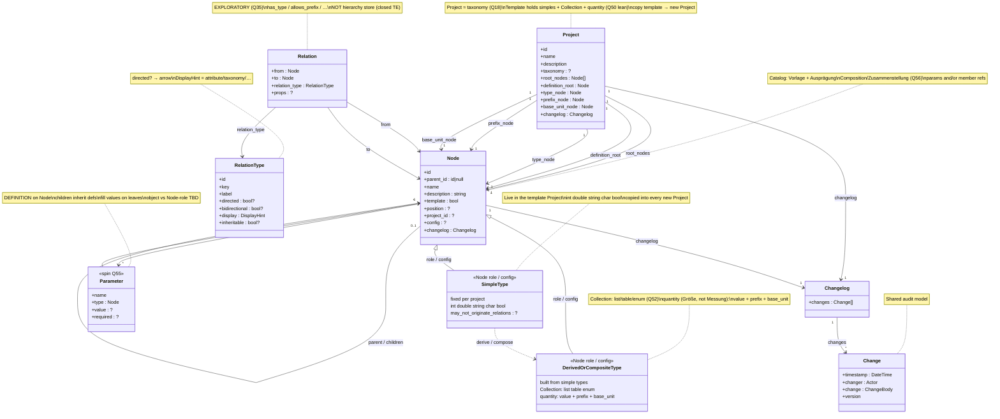
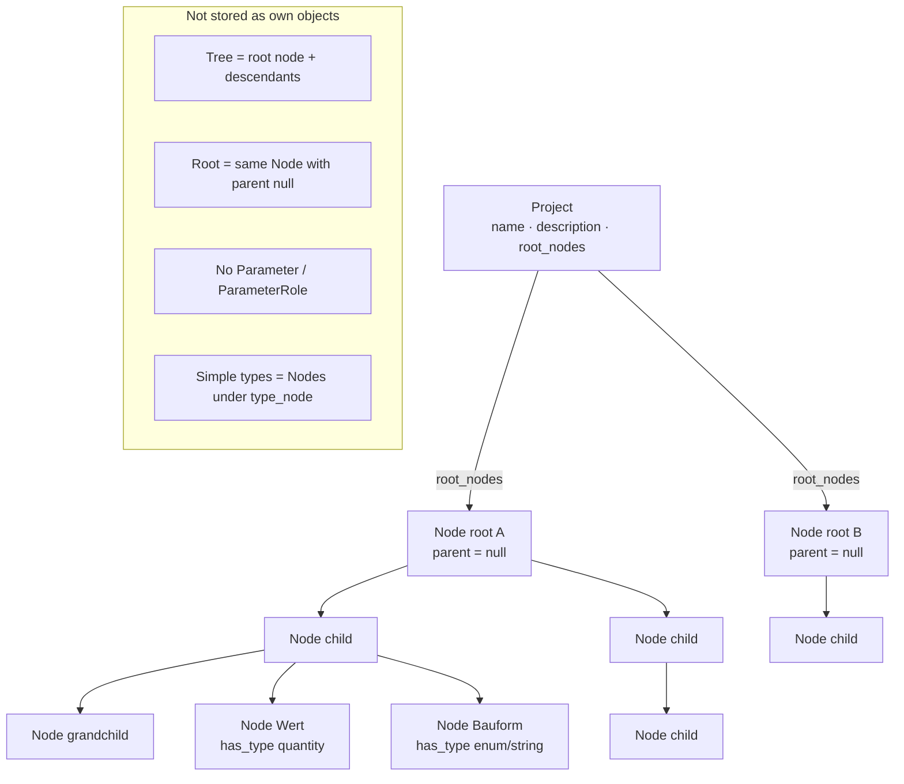
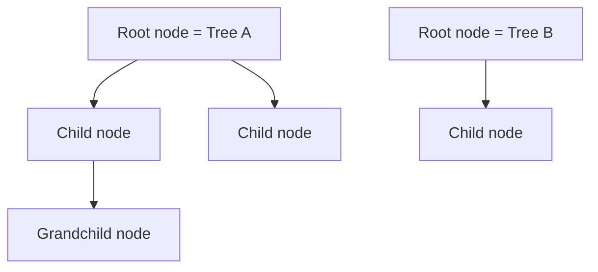
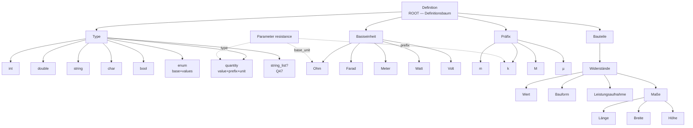
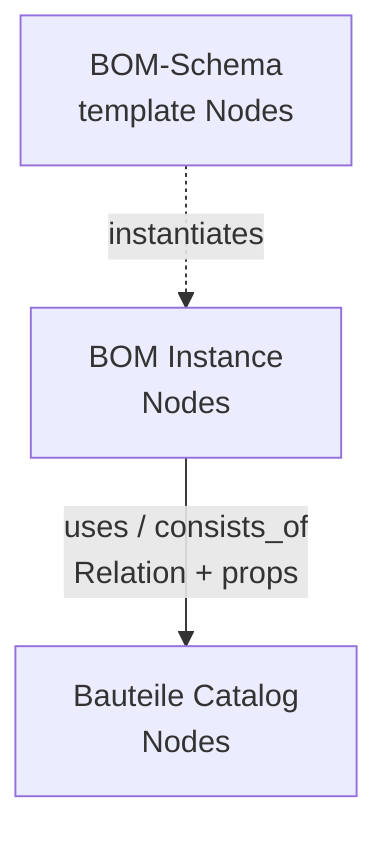
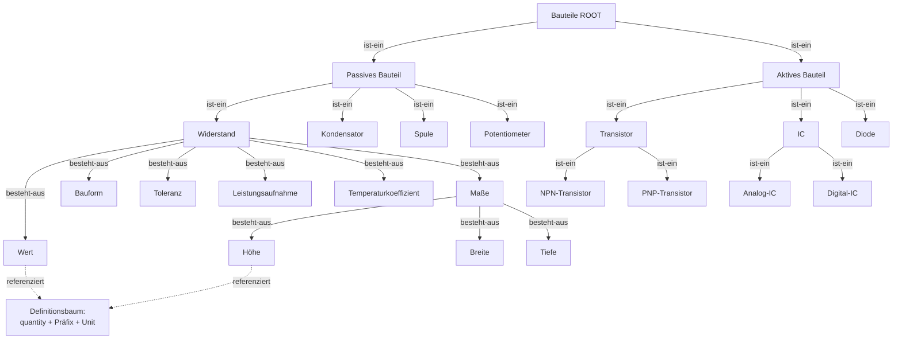
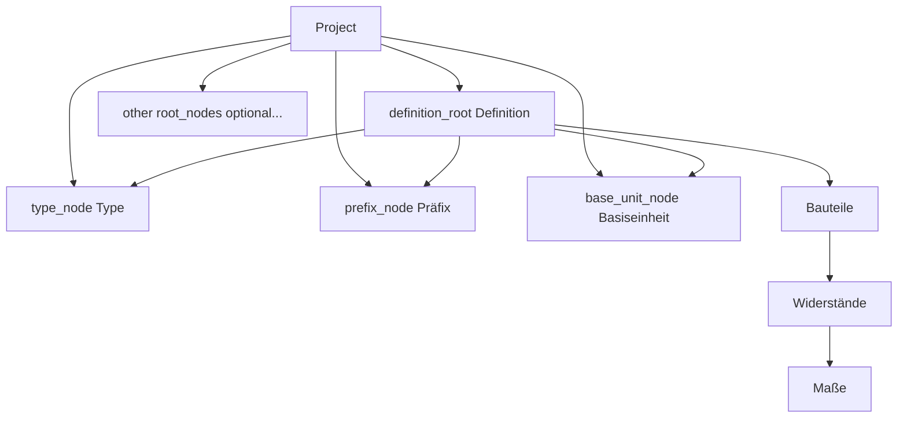

# Data structure: Project, Node, Parameter, Changelog

> Planning only. This document defines the conceptual data model. No plugin code yet.

## Current class diagram

> **Keep this section updated on every structure change.** After each change, also show this diagram in the chat reply.

**Decided (Q33):** attributes such as `Wert` / `Länge` live in the catalog model (not a separate owner via `node_id` — Q14 dropped).  
**Under revisit (Q55):** whether **Parameter** returns as a **named definition object** on a Node (children inherit) or stays a **Node role** — vocabulary “Parameter” is back either way.  
Every project has **fixed simple data-type Nodes**; further types are **derived or composed** from those simples (`quantity`, Collection).  
**Q49 strong lean:** simples get config that disables originating Relations (`capabilities.originate_relations = false`) — not a hard special kind (decide with Q34).  
Typed edges remain exploratory (**Q35**). **Q54 lean:** catalog tree + property inheritance. Closed hierarchy-edge TE stays out.



**Legend:** `Relation` / `RelationType` are **exploratory** (Q35). They are **not** the hierarchy store (closed TE).  
**Q54 lean:** `parent_id` tree = **categorize Bestandteile** (BOM / Hardware / Recipe) **+ inherit hierarchical properties**.  
**Q55 spin:** **Parameter** = attribute **definition** on a catalog Node; child Nodes **inherit** those definitions and may fill/lock values. Whether Parameter is a **distinct object** or a **Node role** (Q33) is open — vocabulary returns either way.  
Each RelationType has one **`label`** (no `forward`/`inverse` fields).  
Optional **`directed`** (unsicher — Q44): if true, graph UI shows an **arrow** `from → to`; if false, a plain **line**.  
`bidirectional` may overlap with undirected — clarify or drop (Q41/Q44).  
`DisplayHint` = how related nodes appear structurally (attribute / taxonomy / tree / reference).  
**Explicitly out:** `parent_id` as cache of hierarchy edges (closed TE).  
**Q56 lean:** **Composition** / UX **Zusammenstellung** (**naming decided**; rename later OK). Ausprägung *is* a composition; may reference other compositions (BOM/Build). Katalog holds Vorlagen+Ausprägungen.  
**Schema-as-Nodes (Q46):** Composition schemas/instances as Nodes + Collections — no hard `BomList` / `Recipe` / `Build` classes required.  
**Types:** simples + composed (`quantity`, Collection) remain type Nodes (Q36/Q52).  
**Q49 lean:** simples use config that disables originating Relations — still open with Q34.

## Core objects

| # | Object | Role |
|---|--------|------|
| 1 | **Node** | Catalog hierarchy; Definition anchors; type Nodes; Composition instances (Q56) |
| 2 | **Parameter** | **Spin (Q55):** definition on a catalog Node (name + type); children inherit; values on leaves — object vs Node-role TBD |
| 3 | **Project** | **≈ taxonomy (Q18)**; trees + Definition anchors + fixed simples; defaults via generate or template copy (**Q50**) |
| 4 | **Changelog** | History container (`changes`) |
| 5 | **Change** | One audit entry (when, who, what, version) |
| 6 | **Relation** | **Exploratory (Q35):** typed edge; **not** adopted as hierarchy store (see closed Q53/Q54 TE) |
| 7 | **RelationType** | **Exploratory:** type with one `label` (no inverse field) |
| 8 | **Composition** (UX: Zusammenstellung) | **Lean (Q56):** bundles Parameter values and/or refs to other Compositions — GPU card, BOM, Build, Gericht |

### Shared audit idea (recommended)

Give **every** main domain object the same field:

```text
changelog: Changelog
```

`Changelog` **consists of** many `Change` entries. One shared pattern for Project and Node (including nodes with parameter role) — do not invent different audit fields per entity.

In PHP (leaning): **composition**, not a deep inheritance tree.

```php
// Conceptual — not implemented
class Changelog {
	/** @var list<Change> */
	public array $changes;
}

class Change {
	public \DateTimeInterface $timestamp; // when (Zeitpunkt)
	public string $changer;               // who (Änderer) — exact type Q22
	public string $change;                // what (Änderung) — exact shape Q21
	public string $version;               // version — exact format Q23
}
```

Optional later: interface `Has_Changelog` with `changelog` so services can append entries uniformly.

### Not a separate object

| Concept | Status | Meaning |
|---------|--------|---------|
| **Tree** | **Not an object** | Defined by a **root node** (and all descendants reachable via child links) |
| **RootNode** | **Not an object** | Same as **Node** with parent `null` — only a role, not a type |
| **Template tree** | **Not a class** | A tree whose root (or node) has `template = true`; seeds project-specific trees |
| **ParameterType** (class) | **Not an object** | Parameter **type is a Node** (under Project.type_node) |
| **Unit** (class) | **Not an object** | Use **Präfix** + **Basiseinheit** Nodes instead |
| **Parameter / ParameterRole** | **Spin (Q55)** | Definition on Node + inherit; distinct object vs Node-role open; Role stereotype still optional |
| **BomList / BomLine / Recipe as PHP classes** | **Under review (Q46)** | May be replaceable by **Nodes + Relations** configured like templates |
| **Relation / typed edge** | **Exploratory** | Edge + RelationType (Q35/Q41); hierarchy-via-edges TE closed (Q53/Q54 restart) |
| **RelationType** | **Exploratory** | One `label` only; display + inherit (Q42/Q43) |
| Forest | Derived view | Several trees (several roots) inside one project |



**Stored objects in this diagram:** `Project`, `Node` only  
**Derived only:** tree (from root node), root role (Node with `parent = null`); type roles via config

**Agreed / tentative relations:**

- One node can have one parent (or none) and several children (or none). — **agreed**
- A **root node** is the **same object as a node** where the parent is `null` (not a separate type/entity). — **agreed**
- A **tree** is identified by its **root node** (no extra Tree entity). — **agreed**
- A **project** can consist of **different trees** (different root nodes). — **agreed**
- Attribute Nodes (e.g. `Wert`) bind **`type`** (required) plus optional **`prefix`** / **`base_unit`** via config and/or Relations — **no ParameterRole**. — **agreed direction**
- A filled **quantity** reading is **`value` + `prefix` + `base_unit`** (Einheit), e.g. `10` + `m` + `Meter` → `"10 mm"`. — **agreed** (where the value is stored: Q16)
- **Core types (Q33/Q36/Q48):** **simple types live in the template** (`int`, `double`, `string`, `char`, `bool`) — **agreed**
- **`enum` is a derived type** in the template: **exactly one base_type** (a simple) + **list of values**; `single`/`multiple` = selection methods — **agreed (Q38/Q39 direction)**
- **`quantity` is a derived/composite type** in the template: numeric leaf (`int` or `double`) + optional Präfix + Basiseinheit — **agreed direction (Q36/Q37)**; name = **Größe**, not Messung / not BOM-Menge
- **Basiseinheit ─[allows_prefix]→ Präfix** (per-unit allowed set; e.g. Farad has no k/M) — **decided (Q51)**
- Scale via **Präfix ─[multiplikator]→ int** with edge **`props.value`** (e.g. kilo → 1000) — **decided (Q51)**; enables forward/back convert
- Every **Node** has a **description** (may be empty string) — **decided**
- Quantity unit **select** is fed a Basiseinheit Node; options = base + derived labels from linked Präfixe — **decided (Q51)**; no atomic `kOhm` Nodes
- Dimensions under **Maße** (`Länge` / `Breite` / `Höhe`) each carry such a quantity; together e.g. `10 mm × 5 mm × 2 mm`. — **agreed**
- The planning **Definitionsbaum** is one tree with root **Definition**; **Bauteile** (and other branches) hang under that root — no separate catalog Root. — **agreed**
- Every **Project** must have a **Definitionsbaum** (Definition tree) and must store anchors for **Type**, **Präfix**, and **Basiseinheit**. — **agreed**
- **Project ≈ taxonomy** — **strong leaning (Q18)**; taxonomy not on Node
- Default Nodes — **leaning (Q50):** template Project holds simples + enum + quantity; **copy** into new Projects (generate still optional fallback)
- Those required Definition nodes are **unique per project** and are **stored on the Project**. — **agreed**
- Some trees are **template trees**; `template` is a **flag on Node**. — **agreed**
- Template trees can serve as templates for **project-specific trees**. — **agreed** (copy/instantiate mechanics still open — Q30)
- **No Parameter class and no ParameterRole** — **decided (Q33/Q34)**; attribute nodes are ordinary Nodes with type binding via config/`has_type`
- Separate Parameter owner (`node_id`) — **dropped / entfällt (Q14)**; placement via `parent_id` and/or Relations (hierarchy-as-edge + `parent_id` cache hybrid **excluded** — closed TE)
- Simple type Nodes typically **do not originate Relations** — **strong lean (Q49):** config `capabilities.originate_relations = false` on simples (not a hard special kind); decide with Q34
- Every Project and Node has a **changelog**. — **agreed**
- Every **Change** has `timestamp`, `changer`, `change`, and **`version`**. — **agreed**
- **Typed edges** (`Relation` + `RelationType`) — **exploratory (Q35)**; each type has one `label` only; no `inverse` field (Q41)
- **Display** of related nodes depends on RelationType (part-of → attributes) — **leaning (Q42)**
- **`consists_of` attributes inheritable along `is_a`** — **leaning (Q43)**

```text
Project ──(several trees)──► Root Node
Node ──(optional)──► parent Node          # classic tree
Node ──(Relation?)──► Node                # exploratory typed edges
Node.config ──(capabilities / type binding)──►  # strong lean Q34 — not a ParameterRole
SimpleType Nodes ──(derive/compose)──► further Type Nodes
# Q49 lean: config.capabilities.originate_relations = false on simples
```

### Config shape proposal (Q34 / Q49) — pending confirm

**Goal:** one `Node` class; specialization via **Relations** + optional **`config`**, never PHP subclasses or ParameterRole.

| Piece | Role | Status |
|-------|------|--------|
| Relation `has_type` | Primary type binding (slot → type Node) | leaning (Q48) |
| `Node.config.capabilities.originate_relations` | `false` on simple type Nodes in the template | **proposed (Q49)** |
| `Node.config` other keys | Reserved for later (UI hints, defaults) — keep minimal | open |
| Hard `kind` enum / PHP subclass | **Rejected** for MVP | decided lean |

```php
// Conceptual — not implemented
class Node {
	public ?array $config;
	// Example for simple type Node "int":
	// config = [ 'capabilities' => [ 'originate_relations' => false ] ]
	// Type of an attribute Node is NOT only in config — prefer Relation has_type
}
```

**Why config over special kind:** same storage/UI for all Nodes; template can seed capability flags; derived types (`enum`, `quantity`) can keep `originate_relations = true` if needed.  
**Still open until user confirms:** exact key names; whether derived types may originate Relations; empty/missing config = allow Relations (default true).

### Design decision: no Parameter and no ParameterRole

**Q33/Q34:** Names like `Wert` / `Länge` in the Definitionsbaum **are ordinary Nodes**.  
There is **no** Parameter class, **no** ParameterRole stereotype, and **no** PHP subclass.  
Type binding lives in **Node.config** and/or Relations (`has_type`). Optional quantity fields (`prefix`, `base_unit`, `value`) are likewise config / Relations — not a parallel object model.  
**Q49 strong lean:** simple data-type Nodes usually should not build Relations themselves — **config** that deactivates Relations on simples (not a hard special kind); decide with Q34.  
Typed edges (`besteht-aus`) may still *display* those Nodes as attributes of a parent — orthogonal (Q35/Q42).

---

## 1. Node

### Core idea

1. **One node can have a parent node** (or no parent).
2. **One node can have several child nodes** (or none).
3. **One node can have several parameters** (or none).
4. A **root node** is the **same object as a node** where the parent is `null` (not a different object type).
5. A **tree** is not stored as its own object: it is **defined by a root node** plus all descendants.



### Root node (definition)

| Term | Definition |
|------|------------|
| **Root node** | The **same Node object** with parent `null` (`parent_id = null`) |
| Non-root node | The **same Node object** with a non-null parent |

There is **no separate RootNode type**. “Root” is only a role/state of Node based on `parent_id`.
Being a root does not require children.

### Parent and children

| Rule | Meaning |
|------|---------|
| Optional parent | A node may have **one** parent node, or none |
| At most one parent | Never multiple parents |
| Several children | A node may have **zero or more** child nodes |
| Root | A root node is the same Node object with parent `null` (no separate type) |
| Child | A node whose parent is set is a child of that parent |

```text
Node ──(optional)──► parent Node
Node ◄──(many)────── child Nodes
Node ◄──(many)────── Parameters
```

### Tree (derived, not an object)

| Rule | Meaning |
|------|---------|
| No Tree table/entity | Do not model `Tree` as a first-class stored object |
| Defined by root | Tree = **root node** (node with no parent) + all descendants |
| Identity | Referring to a tree means referring to its **root node id** |
| Empty tree | A root with no children is still a tree of one node |

### Node fields

| Field | Required | Type (conceptual) | Meaning |
|-------|----------|-------------------|---------|
| `id` | yes | identifier | Stable identity of the node |
| `parent_id` | yes* | identifier \| `null` | Catalog/taxonomy parent (**Q54 lean:** Bestandteile + inheritance). `null` = root. Not schema nesting; not edge-cache hybrid. |
| `name` | yes | string | Display name of the node |
| `description` | yes* | string | Longer text; may be empty |
| `template` | yes | bool | `true` = this node heads/belongs to a **template** tree |
| `project_id` | ? | identifier | Optional reverse link — domain access is via `Project.root_nodes` (Q17) |
| `changelog` | yes | **Changelog** | History of changes on this node |

\* `parent_id` is always present as a value: either a valid parent id or `null`.

#### Planned optional Node fields (not decided yet)

| Field | Meaning | Status |
|-------|---------|--------|
| `slug` | URL/machine slug | open |
| `description` | Longer text | open |
| `count` | Assigned object count | open |
| `position` / `menu_order` | Explicit sibling order | open |
| `meta` | Extensible key/value bag | open |

### Node invariants

1. A node’s `parent_id`, when not `null`, must reference an existing node in the **same project** (taxonomy is on Project, not per Node — Q18).
2. A node must not be its own ancestor (no cycles).
3. Structure under each root remains a tree; a project’s roots form multiple trees.
4. Delete policies for children: **promote** or **cascade**.
5. Parameters related to a deleted node must follow a defined cleanup policy (TBD; parent/Relation cleanup, Q14 dropped).

### Example: trees from root nodes

```text
# Two trees inside one project — no Tree objects, only nodes:
{ id: 1, parent_id: null, name: "Passive Components", project_id: 100 }  # root → Tree A
{ id: 2, parent_id: 1,    name: "Resistors",          project_id: 100 }
{ id: 4, parent_id: null, name: "Semiconductors",     project_id: 100 }  # root → Tree B
```

- Tree A = node `1` + descendants.
- Tree B = node `4` + descendants.
- Nested `children` is a **view** derived from parent links, not a second source of truth.

---

## 2. Attribute Nodes (no Parameter / ParameterRole)

### Core idea

Configurable attributes (often quantities) such as `Wert` or `Länge` are **ordinary Nodes**.  

**Decided (Q33/Q34):** **no Parameter class**, **no ParameterRole**, **no PHP subclass**.  
A Node becomes an “attribute” by binding a **type** (and optional prefix / base_unit / value) via **config** and/or Relations (`has_type`).

**Rejected:** Parameter as a separate object via `node_id`.  
**Dropped:** ParameterRole as a formal diagram/model stereotype (hinfällig without Parameter).

**Cardinality (decided direction):**

| From | To | Cardinality | Status |
|------|----|-------------|--------|
| Node → child attribute Nodes | several | `0..n` | **decided** (parent/child and/or Relations) |
| Attribute Node → parent | one | `0..1` | **via `parent_id`** (Q14 dropped); Relations separate (Q35) — hierarchy-edge hybrid excluded |

```text
Node (category) ──(children / besteht-aus)──► Node (e.g. Wert) ─[has_type]→ Type Node
```

### Config / bindings (initial — to refine)

| Field | Required | Type (conceptual) | Meaning |
|-------|----------|-------------------|---------|
| *(Node fields)* | — | — | Identity, parent, name, template, changelog, … |
| `type` | **yes** | **Node** (via config or Relation) | From Definition → **Type** (simple or derived/composed) |
| `prefix` | **optional** | **Node** \| `null` | From Definition → **Präfix** |
| `base_unit` | **optional** | **Node** \| `null` | From Definition → **Basiseinheit** |
| `value` | **?** | scalar / TBD | Filled reading for quantities; storage Q16 |
| `key` | likely | string | Machine key if `name` is not enough |

```php
// Conceptual — not implemented
class Node {
	public ?array $config; // type binding / capabilities — shape TBD (Q34)
	// …
}
// e.g. node.config.type = <type Node id>; optional prefix / base_unit / value
// OR Relation has_type from this Node to a type Node
```

**Agreed for quantity readings:** value + prefix + base unit (e.g. `10 mm`). Details Q24, Q29, Q16.

#### Fields still to define

| Topic | Status |
|-------|--------|
| Parameter class / ParameterRole | **rejected / dropped** |
| Config shape for type binding | **proposed** — Q34 (`capabilities` + `has_type`) |
| Separate owning `node_id` | **dropped** — Q14 |
| Simple types may originate Relations? | **strong lean no** — Q49 via config |
| Required / default / validation rules | open — Q47 |
| Inheritance to child nodes | open |
| Which types require prefix and/or base_unit | open — Q24 |
| May prefix exist without base_unit? | open — Q29 |
| Storage | same as Node — Q11/Q15 |
| Whether attribute *values* live in this plugin | open — Q16 |
| Cleanup when a related node is deleted | open |
| List / multi-value scalars (e.g. RefDes) | open — Q47 |

### Schema slot vs value shape (Reference / RefDes)

Concrete pressure from the prototype / BOM:

- Schema column renamed **Designator → Reference**: in practice a **comma-separated list** of board references (`R1,R2` or `C1…Cn`), not a single token.
- Temptation: hang a **validator** on that Node (“must look like RefDes list”). That feels wrong — and it is the Parameter↔Node tension again.

**Split (leaning):**

| Layer | Role | Example |
|-------|------|---------|
| **Schema Node** | Named *slot* in a line/form (`position`, label) | Node `Reference` under BOM-Zeile schema |
| **Type / Parameter** | *Shape* of the filled value + reusable rules | type ≈ `string_list` (or string + cardinality multiple); optional item pattern |
| **Instance value** | Actual data | canonical `["R1","R2"]`; CSV `R1,R2` only for UI/export |

Why not validator-on-Node:

- Rules would pile onto every schema leaf; no reuse across slots that share a shape.
- Mixes **identity of the slot** (“this column exists”) with **contract of the value** (“list of strings”).
- `enum` / `enum_multiple` needs a **fixed option set** (children) — RefDes is an **open** list, so it is closer to a **list-of-string** type than to enum.

This strengthens: schema-as-Nodes (Q46) for structure; Type/Parameter-Node (Q33/Q36/Q47) for how cells are interpreted — not ad-hoc Node meta.

### Datentypen as tree + Relation (Q33 / Q48)

**Decided direction:** types are **Nodes** in the tree.  
**Template assignment (Q50 leaning):** the **template Project** holds the **simple types**, derived **enum**, and derived **quantity**. New Projects get them by **copying the template** (generate remains a fallback option).

### Template Project vs BOM Testprojekt (planning / proto)

Keep the **pure template** separate from **domain demo data**:

| Project | Contents | Role |
|---------|----------|------|
| **Template** (**read-only**) | simples + `quantity` + **Collection** (`list`/`table`/`enum`) + `Präfix` + standard `Basiseinheit` | Reusable seed (Q50) — **not editable** |
| **BOM Testprojekt** (**editable**) | Copy + concrete Collections (`Bauart`, `RefDes`), electronics units, `Spalten` (table), `Stückliste`, `Bauteile` | Demo/test Project — **editable** |

```text
Template (nur lesen)
├── Datentypen
│   ├── int · double · string · char · bool
│   ├── quantity
│   └── Collection
│       ├── list
│       ├── table
│       └── enum
├── Präfix (p…M + c)
└── Basiseinheit
    └── Meter · Liter · Kilogramm · Sekunde · Kelvin · Ampere

BOM Testprojekt (editierbar)
├── …Template-Kern-Kopie (inkl. Collection)…
│   └── list
│       └── RefDes
│           └── Element ─[has_type]→ string
│   └── enum
│       └── Bauart
│           └── Option ─[has_type]→ string
│               └── 0201 · 0402 · 0603 · 0805 · axial
│   └── Basiseinheit + Ohm · Farad · Watt · Volt
├── Spalten (BOM-Zeile) ─[has_type]→ table
│   ├── Reference ─[has_type]→ RefDes
│   ├── Value     ─[has_type]→ quantity
│   ├── Footprint ─[has_type]→ Bauart
│   ├── Menge · LCSC · Stock
├── Stückliste
└── Bauteile
```

Prototype: `prototypes/tree-split` **v14** — Collection in template; Bauart/RefDes/Spalten as concrete Collections; Template locked.

```text
Template Project → Datentypen / Type     ← Project.type_node
├── int · double · string · char · bool   ← simples (in template)
├── quantity                              ← Größe (in template)
└── Collection                            ← Q52 decided
    ├── list
    ├── table
    └── enum                              ← concrete enums (e.g. Bauart) in domain projects
```

#### Collection → list / table / enum (Q52 **decided**; Q53/Q54 **restart**)

**Decided (Q52):** an **enum** is a **list**; a **list** is a **one-column table**. Unify under **Collection**.

##### Shape

```text
Datentypen
├── int · double · string · char · bool     ← simples
├── quantity                                ← derived (Größe)
└── Collection                              ← structural super-kind
    ├── list      ← Collection with exactly 1 column
    ├── table     ← Collection with n ≥ 1 columns
    └── enum      ← list + closed option children (not extensible at fill-time)
```

| Kind | Columns | At type-definition | At fill-time |
|------|---------|--------------------|--------------|
| **list** | exactly **1** column node with `has_type` | column schema only | open rows |
| **table** | **n ≥ 1** column nodes each with `has_type` | column schema only | open rows |
| **enum** | exactly **1** column node with `has_type` (**same as list**) | column + **fixed option children** | closed — pick from options only |

**list ≡ 1-column table**; **enum ≡ list** in how you create it — only difference: enum options are fixed on the type (non-extensible when filling).

##### Concrete type = kind + column schema (“immer zwei”)

1. **Kind** — is this a list / table / enum? (binding: **Q53 — open, fresh**)  
2. **Column type(s)** — what does each column hold? (simple or derived, e.g. `string`, `quantity`)  
   How columns/options hang under the type: **Q54 — open, fresh** (tree `parent_id` vs Relations — restart).

Example **list** (proto-style nesting; binding rules TBD):

```text
my_list                         ← concrete Collection type
  ─[has_type]→ list?            ← kind (Q53 open)
  └── my_listelement            ← column (membership: Q54 open)
        ─[has_type]→ string
```

Example **table** (BOM-Zeile):

```text
BOM-Zeile
  ─[has_type]→ table?
  ├── Reference ─[has_type]→ RefDes
  ├── Value     ─[has_type]→ quantity
  ├── Footprint ─[has_type]→ Bauart
  └── Menge     ─[has_type]→ int
```

Example **enum**:

```text
Bauart
  ─[has_type]→ enum?
  └── Option
        ─[has_type]→ string
        ├── 0201 · 0402 · …
```

**No special `base_type` edge** — the column’s `has_type` *is* the element/primitive type.

##### Closed thought experiment — hierarchy as Edges + `parent_id` cache (Q53/Q54)

**Status:** closed / not adopted. Booked as pure TE. **Q53 and Q54 restart from zero** (no carry-over decision).

**What was tried:** treat Nodes as a cloud; put hierarchy on the same Relation/Edge table as `has_type` (e.g. `contains`); tree UI = projection; keep `parent_id` only as denormalized cache of that hierarchy edge; Collection kind only via `has_type`.

**Why closed (substance):**

| Critique | Consequence |
|----------|-------------|
| One edge table still needs per-type constraints (tree vs typed links) | Fake unification |
| `parent_id` cache of `contains` drifts under dual writes | Hybrid is the expensive path |
| Hierarchy reads dominate admin/BOM UI | Edge-filtered tree queries lose vs adjacency |
| One `contains` for schema membership *and* catalog folders | Overloaded RelationType |
| DisplayHint-as-tree can invent a second hierarchy | Ambiguous “the” parent |

**Explicitly excluded from this branch (do not reopen as part of the TE):**  
**`parent_id` as cache of hierarchy edges.** Even if DB-convenient, it does not belong in that design. Any future Q54 answer must choose a *single* hierarchy truth — not Edge + parent_id mirror.

**Allowed learnings to keep (non-decisions):** the mixup “tree meaning vs Relation meaning” is real; Collection kind should not silently equal “hangs under enum in the UI”; Q52 Collection shape stands.

##### Design guidelines — clean restart (Q53 / Q54)

Binding rules for the **new** approach (not answers — constraints on how we decide):

###### 1. Clear structures

| Rule | Meaning |
|------|---------|
| **One job per concept** | Hierarchy, type-binding, and schema-membership are different jobs. Do not overload one field/table/RelationType to mean all three. |
| **One source of truth** | Each fact has exactly one authoritative store. No mirrors, no “cache that is also writable.” |
| **Name the structure** | Prefer explicit shapes (`list` / `table` / `enum`, column, option, parent/child) over clever compression that only experts can read. |
| **Invariants visible** | Tree rules (≤1 parent, acyclic), Collection rules (1 vs n columns, closed options), and edge rules must be stated where the structure lives — not only in UI code. |
| **Proto ≠ model** | Browse nesting in the prototype is not a decision. Decisions must survive without the current tree chrome. |

###### 2. Do not refuse objects where an object is better

| Rule | Meaning |
|------|---------|
| **Object when it has identity** | If something has its own lifecycle, invariants, or vocabulary (e.g. column of a table, RelationType, Collection kind), give it a **named object / type** — do not hide it as anonymous tree children or loose config blobs. |
| **Node is not the only noun** | “Everything is a Node” is fine for *instances in the graph*, but **roles and edge kinds** may still be first-class (Relation, RelationType, and later Column/Option if needed). Flattening for purity is not a goal. |
| **Refuse only with a reason** | Dropping a class (as with Parameter → Node, Q33) needs a positive argument (“it *is* a Node”). “Fewer tables” or “one edge table for everything” alone is **not** enough. |
| **Split when jobs differ** | If two concerns need different constraints or queries (e.g. catalog tree vs `has_type`), prefer two clear structures over one overloaded one. |

**Anti-patterns from the closed TE (do not repeat):** unify hierarchy into Relations to “have one system”; keep `parent_id` as edge cache; let DisplayHint invent a second parent.

###### 3. Call out performance risk and nonsense

| Rule | Meaning |
|------|---------|
| **Flag hot paths early** | If a design implies recursive edge scans, dual-write sync, N+1 Relation lookups for every tree expand, or “filter the whole edge table by type on every parent/child query,” say so **before** it becomes a decision. |
| **Nonsense check** | If two structures encode the same fact, or a named object would be clearer than a clever encoding, say that plainly — including when the suggestion came from the user or a prior spin. |
| **Cost vs clarity** | Prefer the clearer model unless there is a concrete, measured reason not to. “Might be slower later” alone is not a veto; **silent** acceptance of known bad shapes is. |
| **Agent duty** | In planning replies, **proactively** warn when a proposal looks performance-hostile or conceptually absurd — do not wait to be asked. |

###### 4. Modern design paradigms and best practice

Prefer current, mainstream modeling practice — not novelty for its own sake, and not WP 4 / PHP 5 habits.

| Rule | Meaning |
|------|---------|
| **Composition over inheritance** | Prefer composing Nodes + Relations + config over PHP subclass trees or “kind flags that pretend to be types.” Aligns with Q34 lean. |
| **Typed, explicit models** | Prefer named types / DTOs / RelationTypes with clear fields over anonymous arrays and stringly bags (Q20). Optional/`?` must mean optional — not “we’ll see.” |
| **Ubiquitous language** | Domain words (`Collection`, `column`, `quantity`, `contains` vs `has_type`) stay consistent in docs, proto, and later PHP. Rename when the word lies. |
| **Separation of concerns** | Persistence (WP terms/meta/tables), domain model, and UI/proto are layers. Do not let storage quirks dictate the conceptual model — map later (Q11/Q19). |
| **Make illegal states unrepresentable** | Where practical, structure the model so invalid combos are hard (e.g. enum without column type). Prefer that over “document and hope.” |
| **YAGNI with honesty** | Do not invent speculative meta-frameworks. Do invent a real object when the domain already needs it (guideline 2). |
| **Established patterns first** | Trees → adjacency / explicit parent; typed links → edge table; closed sets → enum/options; tabular schema → columns. Reach for property-graph / EAV / JSON-blob only with a stated reason. |
| **Cite or contrast** | When proposing a pattern, briefly name the practice (DDD value vs entity, adjacency list, schema-as-data) or say why we deviate — so choices stay reviewable. |

##### Q54 lean (new) — tree = list categorization + property inheritance

**Intent:** the `parent_id` tree is **not** a general-purpose folder for everything. Its jobs are:

1. **Categorize Bestandteile** of domain lists — parts/items that feed **BOM**, **Hardware**, **Rezept** (and similar).  
2. **Inherit hierarchical properties** along that taxonomy (category → child category → leaf item), aligning with example projects A/B/C and Q42/Q43.

```text
Bauteile                          ← taxonomy / catalog tree (parent_id)
├── Passiv
│   └── Widerstand                ← inherits attrs from Passiv (Wert, …)
│       └── R_10k_0603            ← leaf / list constituent
├── Aktiv
└── …

Stückliste / BOM lines            ← list/table instance (Collection / host)
  → picks leaf (or category) from the tree
```

Same pattern for Hardware (GPU → …) and Rezepte (Vorspeise → …).

| In tree (`parent_id`) | Out of this tree (other structures) |
|------------------------|-------------------------------------|
| Catalog / category nesting | Collection **schema** (columns of a table, enum options as type definition) |
| Inheritance path for property sets | Type binding (`has_type`) |
| Choosing a Bestandteile for a list line | Measure links (`allows_prefix`, `multiplikator`) |

**Pattern name:** classic **taxonomy / PIM catalog tree** (adjacency list) + **attribute inheritance along ancestors** — not a property-graph substitute for all links.

**Guideline check:**

| Guideline | Assessment |
|-----------|------------|
| Clear structures | Strong — tree has two related jobs (classify + inherit); schema/type stay elsewhere |
| Named objects | Still open: is “category” vs “leaf item” only Node roles, or do we need explicit kinds? |
| Perf / nonsense | **OK** for browse + ancestor walk via `parent_id`. **Watch:** deep inheritance of many attrs → may need materialize/cache later (read path), not dual-write. **Nonsense risk:** stuffing Datentypen / Spalten / enum-options into the same tree “because folder” re-overloads the concept — forbid under this lean. |
| Modern practice | Matches established catalog taxonomy; keeps Relations for non-hierarchy links |

**Still clarify before deciding:**

- Is **Definitionsbaum / Datentypen** a *separate* forest (also `parent_id` but different root purpose), or out of “tree” in this sentence?
- Is inheritance **only** via `parent_id` (= `parent_id` *is* `is_a`), or can `is_a` be a Relation while `parent_id` is browse-only? (Two truths → guideline violation.)
- Are BOM **lines** themselves tree nodes, or only the **catalog** they reference?

##### Q55 spin — Parameter definitions + Bauform (BOM / Hardware / Rezept)

**User direction:** leaves are **concrete Bestandteile** (e.g. Widerstand → … → a pickable part). A **1 kΩ** resistor exists in **different Bauformen**. Reintroduce **Parameter**: a Node can **define** parameters; **child Nodes inherit** those definitions. Keep **simple** and **composed** types; validate on examples.

###### Definition vs value (must stay clear)

| Layer | Meaning | Example |
|-------|---------|---------|
| **Parameter definition** | Slot declared on a catalog Node: name + **type** (+ optional constraints) | On `Widerstand`: `Wert` → `quantity`, `Bauform` → `Bauart` (enum) |
| **Parameter value** | Filled reading for that slot on a Node (or later on a list line) | On leaf: `Wert = 1 kΩ`, `Bauform = 0603` |
| **Inheritance** | Child sees parent’s **definitions** (and optionally unset defaults); may fill, lock, or refine | `1kΩ`-Gruppe erbt beide Slots; Leaf füllt beide |

Without this split, “Parameter” collapses into either a folder or a free-text field — guideline failure.

###### How to bring Bauform in (three shapes)

| Shape | Tree | Parameters | Verdict |
|-------|------|------------|---------|
| **A — Bauform as deeper category** | `Widerstand → 1kΩ → 0603` (leaf = SKU) | `Wert` filled at `1kΩ` level or leaf; Bauform implied by path | Works, but Bauform is **taxonomy**, not a typed Parameter — weak for Hardware/Rezept analogy and for BOM column “Footprint” |
| **B — Bauform as Parameter (preferred lean)** | `Widerstand → … → R 1kΩ 0603` (leaf) | `Widerstand` defines `Wert:quantity` + `Bauform:Bauart`; leaf **fills both** | Matches “concrete leaf”; Bauart stays a **composed type** (Collection enum); reusable on BOM schema column Footprint |
| **C — Leaf = only 1kΩ, Bauform later** | Leaf `1kΩ` with Wert set, Bauform empty | Bauform filled on **BOM line** | Conflicts with “Blätter = konkrete Bestandteile” unless the line is allowed to complete identity — **flag:** then the leaf is a *family*, not a part |

**Lean for discussion:** **B**. Intermediate nodes like `1kΩ` may exist as **groups** (not pickable leaves) that lock `Wert` and leave `Bauform` open for children — or omit the group and go straight to SKU leaves.

```text
Bauteile
└── Widerstand                         ← defines Parameter Wert:quantity, Bauform:Bauart
    └── 1 kΩ                           ← group (optional): Wert locked = 1 kΩ; Bauform still open
        ├── R 1kΩ 0603                 ← leaf: Bauform = 0603  → BOM pick
        └── R 1kΩ 0805                 ← leaf: Bauform = 0805
```

###### Types used (simples + composed)

| Type | Kind | Used as Parameter type for… |
|------|------|-----------------------------|
| `int` / `double` / `string` / `char` / `bool` | **simple** | counts, flags, free text |
| `quantity` | **composed** | `Wert`, VRAM, cable length, recipe amount |
| `Bauart` (Collection **enum**) | **composed** | `Bauform` / Footprint |
| `RefDes` (Collection **list**) | **composed** | BOM Reference column (schema, not catalog Parameter) |

###### Worked examples

**BOM (A)**

```text
Widerstand
  parameters:
    Wert     : quantity     # Ohm family
    Bauform  : Bauart       # enum 0201… / THT …
Leaf "R 1kΩ 0603": Wert=1kΩ, Bauform=0603
BOM line → picks leaf; schema columns Reference/Menge separate
```

**Hardware (B)**

```text
GPU
  parameters:
    Speicher : quantity     # e.g. 8 + G + Byte (or specialized)
    Bus      : enum/string  # PCIe …
Leaf "RTX … 8GB" fills both; compare UI reads inherited Parameter set
```

**Rezept (C)**

```text
Zutat (or Gericht-Komponente)
  parameters:
    Menge : quantity        # 200 g, 1 EL, …
Gericht tree categorizes recipes; ingredient lines pick Zutat-leaves
# amount often on Relation/line (Q45) — Parameter def still declares the slot shape
```

###### Object or Node role? (guideline 2)

| Option | Pros | Cons |
|--------|------|------|
| **Parameter = distinct object** owned by Node | Clear definition/value API; illegal states easier; matches user wording | Softens Q33 “no Parameter class” |
| **Parameter = Node role** (Q33) via `consists_of` / config | One Node class; already decided once | Easy to confuse definition Nodes with catalog children in the same tree |

**Nonsense / perf flags:**  
- Do **not** put Parameter definitions as `parent_id` children of `Widerstand` if those children are also catalog categories — two jobs in one list. Prefer `Node.defines → Parameter` (or a dedicated Relation `has_parameter`) **outside** the catalog child axis.  
- Resolving inherited Parameter sets = walk ancestors once per Node (fine); materialize on write if catalogs get huge.  
- Filling the same Parameter on both leaf **and** BOM line without a rule → dual truth (avoid).

##### Q56 lean — one composition concept (refined: GPU *is* a composition)

**Correction to earlier wording:** a compare matrix over GPUs is **not** “only a view outside the concept.”  
User model: a **GPU category** defines which properties belong together; a **graphics card** is a composition that **fills** those properties (and **references** the GPU type). Comparing cards = comparing compositions to compositions. A PC build / BOM is the **same** concept whose members are other compositions (catalog leaves). Cooking recipes likewise.

**Abstract idea (composite):** a composition bundles either **parameter values**, and/or **references to other compositions**, under one identity.

```text
GPU (Vorlage)                    ← defines Parameters: Speicher, Bus, …
    └── RTX 4090 (Ausprägung)    ← composition: filled values; refers to GPU
          compare ←→ other cards ← compositions vs compositions

PC-Build / Stückliste            ← composition: lines → RTX 4090, Mainboard, …
Kochbuch-Gericht                 ← composition: lines → Zutaten-Ausprägungen

Katalog                          ← organisiert Vorlagen + Ausprägungen (Bauteile)
                                   wird von höheren Compositions verwendet
```

| Kind of member | Example | Same concept? |
|----------------|---------|---------------|
| Parameter / Eigenschaft | Speicher = 24 GB on RTX 4090 | yes — properties belong together |
| Reference to another composition | Build line → RTX 4090 | yes — parts belong together |
| Both | BOM line: leaf + Menge | yes |

**Katalog (agreed):** catalog of Bauteile (Vorlagen + konkrete Ausprägungen). Higher compositions (Stückliste, Build, Gericht) **use** those catalog entries — they do not replace the catalog.

**Template vs instance (keep clear):**

| | Role |
|--|------|
| **Vorlage** (e.g. GPU, Widerstand) | Parameter **definitions** (+ inheritance along catalog tree) |
| **Ausprägung** (e.g. RTX 4090, R 1kΩ 0603) | Parameter **values** filled; may refine Vorlage; pickable in higher compositions |

**Naming — decided:**

| Layer | Term |
|-------|------|
| **UX / Anwender** | **Zusammenstellung** (skins remain allowed: Stückliste, Build, Gericht, …) |
| **Internal / model** | **Composition** |
| Later rename | Allowed if a better word appears — treat as rename, not a new concept |

Drop **Rezept** and raw **Composition** as primary UI labels.

**Lean:** naming **decided** below; concept still open on Vorlage vs Ausprägung roles.

**Guideline check:**

| Guideline | Assessment |
|-----------|------------|
| Clear structures | Strong if Vorlage ≠ Ausprägung ≠ Katalog-Ordner stay explicit |
| Named objects | Composition/Zusammenstellung yes; lines/params as members |
| Perf / nonsense | Compare N Ausprägungen = read inherited Parameter sets — OK; watch wide matrices. **Do not** make every catalog *folder* a Composition without defs/values |
| Modern practice | Composite pattern + type/instance; one aggregate, many skins (Q46) |

**Aligns:** Q54 catalog tree, Q55 Parameter define/fill, Q46 schema-as-Nodes, Q52 tables for multi-member compositions (BOM lines).

##### Still open (Q53 / Q54 / Q55 / Q56)

- Naming **decided:** UX Zusammenstellung / internal Composition (rename later OK)
- Are **Vorlage** and **Ausprägung** two roles of one Composition type, or Composition only on Ausprägung while Vorlage is “category + Parameter defs”?
- Member kinds: Parameter value vs child-Composition ref — one member table with a discriminant?
- **Q55** Parameter object vs Node-role; Bauform **B**
- **Q53** Collection kind binding
- Definitionsbaum vs catalog forest

**Status:** **Q52 decided**. **Q56 naming decided** (Zusammenstellung / Composition). **Q54 / Q56 concept strong leans**. **Q55 spin**. **Q53 open**.

**Naming:** type key **`quantity`** = physical **Größe** (Zahl × Einheit), e.g. Widerstandsgröße `10 kOhm`.  
Not a *Messung* (measurement act). Not BOM **Menge** (piece count — usually `int`).

#### enum (derived type — **Q52**: Collection / like list)

| Rule | Meaning |
|------|---------|
| Kind | **Collection `enum`** — created **like list** (1 typed column) |
| **Column type** | Exactly one column with `has_type` → simple (or derived); replaces dedicated `base_type` Relation |
| **Values** | Fixed option Nodes under that column; each conforms to the column type |
| Selection | `single` / `multiple` remain selection methods (Q38), not separate types |
| Binding | Attribute Node ─[has_type]→ concrete enum type (e.g. Bauart) |

Example:

```text
Bauart  (kind enum)
└── Option ─[has_type]→ string
    values: 0201, 0402, 0603, 0805, axial
```

**Binding:** attribute / schema slot ─[Relation `has_type` or field `type`]→ type Node  
Example: `Menge` *has_type* `int` → integer field; `Bauform` *has_type* `Bauart` → select from closed options.

#### quantity (derived type — agreed shape)

| Rule | Meaning |
|------|---------|
| Kind | **Derived/composite** from a numeric simple + unit group — not a sixth simple |
| **Value** | Numeric reading from `int` or `double` (which one: **Q37**) |
| **Unit group** | Optional **Präfix** + **Basiseinheit** together (Q28/Q45) — display e.g. `kOhm`, `mm` |
| Binding | Attribute Node ─[has_type]→ `quantity` (or a specialized quantity type) |
| UI | Composite widget: number + prefix select + unit select → e.g. `10 kOhm` |

Example:

```text
quantity (Größe)
  value: 10          ← double (or int)
  prefix: k          ← Präfix
  base_unit: Ohm     ← Basiseinheit
  display: "10 kOhm"
```

| Idea | Note |
|------|------|
| **Simples live in the template** | `int`…`bool` assigned to template Project; copied into new Projects |
| **enum in the template** | Derived kind with base_type + value list |
| **quantity in the template** | Derived kind: value + Präfix + Basiseinheit (Größe) |
| Types are **Nodes** | Same storage/UI as everything else |
| UI derives widget from type | simples → inputs; enum → select; quantity → value+prefix+unit |
| **Relations from simples?** | Strong lean **Q49:** config disable |
| string_list vs enum | enum = **closed** list; string_list = **open** list (Q47) |

**Still open (Q34/Q49):** user confirm of proposed config shape; whether derived types may originate Relations.

### Definitionsbaum (canonical planning example)

From here on, this tree is always called the **Definitionsbaum**.  
Root = **Definition** (`parent_id = null`). Type / Präfix / Basiseinheit come from the **Template** (or a copy into a Project).  
**Bauteile** and similar catalog branches belong to **domain / test Projects** (e.g. BOM Testprojekt), not to the pure template.



```text
Definition                                    ← Definitionsbaum root
├── Type                                      ← ≈ Datentypen (Q48); freely configurable Nodes
│   ├── int
│   ├── double
│   ├── string
│   ├── char
│   ├── bool
│   ├── enum                    ← derived: base_type + value list
│   ├── quantity                ← derived: value + prefix + unit (Größe)
│   └── string_list?            ← later: open RefDes lists (Q47)
├── Basiseinheit
│   ├── Ohm
│   ├── Farad
│   ├── Meter
│   ├── Watt
│   ├── Volt
│   └── …
├── Präfix
│   ├── m
│   ├── k
│   ├── M
│   └── µ
└── Bauteile
    └── Widerstände
        ├── Wert
        ├── Bauform
        ├── Leistungsaufnahme
        └── Maße
            ├── Länge
            ├── Breite
            └── Höhe
```

**Parameter examples using this tree** (anchors also stored on Project):

```text
Project.definition_root = Definition
Project.type_node = Type
Project.prefix_node = Präfix
Project.base_unit_node = Basiseinheit

Parameter {
  key: "resistance",
  type: Node("quantity"),      # under project.type_node
  prefix: Node("k"),          # under project.prefix_node
  base_unit: Node("Ohm")      # under project.base_unit_node
}
# with value 10  =>  "10 kOhm"

Parameter {
  key: "datasheet",
  type: Node("url"),
  prefix: null,
  base_unit: null
}
```

**Branch notes (not locked):**

| Node | Possible role |
|------|----------------|
| `Type` / `Basiseinheit` / `Präfix` | Required Definition anchors on Project |
| `Bauteile` | Domain branch under Definitionsbaum (not its own root) |
| `Widerstände` | Category node; children may be Parameter-Nodes |
| `Wert` | **Parameter-Node** — e.g. type=`quantity`, prefix=`k`, base_unit=`Ohm` |
| `Bauform` | **Parameter-Node** — e.g. type=`text` or enum-like choices |
| `Leistungsaufnahme` | **Parameter-Node** — quantity + Watt base unit |
| `Maße` | Group node; children are dimension Parameter-Nodes |
| `Länge` / `Breite` / `Höhe` | **Parameter-Nodes** (quantity): **value + prefix + Einheit** |

**Dimension example (agreed direction):**

```text
Länge  { value: 10, prefix: m, base_unit: Meter }  =>  "10 mm"
Breite { value:  5, prefix: m, base_unit: Meter }  =>  "5 mm"
Höhe   { value:  2, prefix: m, base_unit: Meter }  =>  "2 mm"

Maße display:  10 mm × 5 mm × 2 mm
```

`mm` is **not** a single Definition node — it is Präfix `m` + Basiseinheit `Meter` (same pattern as `k` + `Ohm` → `kOhm`).

`Project.definition_root` points at **Definition**; that root is also in `root_nodes`.

Open: exact validation rules when type is `quantity` vs `url` (Q24, Q29).  
Open: Node **configuration** shape — proposed `capabilities` (Q34); pending confirm.  
Open: simples `originate_relations=false` via config (**Q49** lean) — pending confirm.  
**Closed (Q33):** Parameter *is* a tree Node (not a separate attached object).  
**Dropped (Q14):** no separate owner field.

### What we do not model

- No **Parameter** class and no **ParameterRole** stereotype.
- Attribute Nodes are not a separate stored kind beside Node (**Q33/Q34**).
- Not necessarily a filled-in value on a part/post (value still Q16).
- Not owned via a separate `node_id` field (**Q14 dropped**); use `parent_id` and/or Relations.
- Not a PHP subclass hierarchy (**Q34 leaning: configuration**).

---

## Design fork (partially resolved): inheritance vs besteht-aus

**Q33 closed** Parameter-as-Node. The remaining fork is how those Parameter-Nodes hang under categories: classic parent/child, typed `besteht-aus` edges, or both (display vs storage).

| Approach | Idea | Inheritance? | Selection / query feel |
|----------|------|--------------|------------------------|
| **A — Parameter definitions** | Parameter is a definition object (or specialized payload) that **points at** Type/Präfix/Basiseinheit Nodes | Easy to inherit attribute *definitions* down a taxonomy (`ist-ein` children reuse parent params) | Select node → load attached param defs; often fewer hops |
| **B — Nested nodes + typed edges** | Attributes are Nodes too; edges have **kinds** (`ist-ein`, `besteht-aus`) and may **point into another branch/tree** (e.g. Definitionsbaum) | Taxonomy uses `ist-ein`; composition uses `besteht-aus` (not inheritance) | Select node → walk edges by kind; more flexible, possibly more joins |

**User framing:**  
*Widerstand **ist ein** Passives Bauteil* (taxonomy / inheritance path).  
*Widerstand **besteht aus** Wert, Bauform, Maße, …* (composition — edges need properties/kind).  
Quantity pieces (Maßzahl / Präfix / Unit) may live in the **Definitionsbaum** and be **referenced** from composition edges.

### Exploratory object: Relation (typed edge)

Typed links between Nodes (`has_type`, `allows_prefix`, …). **Not** currently the hierarchy store — hierarchy-via-edges + `parent_id` cache was a **closed thought experiment** (Q53/Q54 restart).

```text
Relation {
  from: Node
  to:   Node
  relation_type: RelationType
  props: ?   # optional edge metadata
}

RelationType {
  key:            string              # logical id, e.g. "consists_of"
  label:          string              # e.g. "besteht aus" / "consists of"
  directed:       bool?               # Q44 — true: arrow from→to; false: undirected line
  bidirectional:  bool?               # may overlap with !directed — clarify or drop (Q41/Q44)
  display:        DisplayHint         # structural UI: attribute / taxonomy / tree / reference
  inheritable:    bool?               # can child nodes inherit along ist-ein?
}
```

#### Labels and direction

| Idea | Meaning |
|------|---------|
| One `label` | Every RelationType has exactly one label — no `forward`/`inverse` fields |
| No `inverse` | Do not store a paired opposite RelationType on the type |
| **`directed`** (tentative) | **Gerichtet:** meaningful `from → to` → UI **arrow**. **Ungerichtet:** → UI **line** (Q44 — unsure) |
| `bidirectional` | Possibly redundant with undirected / reverse-as-view — do not lock yet |

**Leaning:** RelationType = **`label`** + display/inherit flags. Opposite wording like “ist Teil von” stays a **view** of the same edge (Q41).  
**Open:** whether `directed` (graph chrome: arrow vs line) is worth keeping beside `DisplayHint` (structural role) — they answer different questions (Q42 vs Q44).

#### Design spin: quantity via Relation + unit group (exploratory)

Insight from examples (Rezepte amounts on edges; Widerstand Wert): a **value** can live on a **Relation**, while **Präfix + Basiseinheit form one group** (not a free chain of unrelated links).

**Avoid loose chain (awkward):**

```text
Widerstand ──Wert──► 100 ──► kilo ──► Ohm     # prefix and unit look like siblings in a path — misleading
```

**Prefer grouped unit + value on edge (spin):**

```text
Widerstand
   │
   │  RelationType e.g. "wert" / consists_of quantity slot
   │  props: { value: 100 }
   │
   ▼
UnitGroup (logical) = Präfix "k"  +  Basiseinheit "Ohm"
         display: "100 kOhm"
```

Same pattern for recipe lines:

```text
Rezept ──uses──► Mehl
         props: { value: 200 }  +  UnitGroup(null/"", g)
         display: "200 g"
```

| Piece | Role |
|-------|------|
| `value` | Scalar on the **Relation** (`props`) — or on a quantity Parameter; still open |
| **Unit group** | **Präfix + Basiseinheit always together** (pair / small structure); “kOhm”, “mm”, “mW” |
| Präfix alone | Incomplete for display of a quantity (Q29) |
| Basiseinheit alone | Allowed as group with null prefix (e.g. `5 Ohm`, `200 g`) |

**Leaning (not locked):** treat **Präfix+Einheit as one unit group**; do not model quantity as Widerstand→value→prefix→unit as three independent hops. Relation.props may carry `value` and point at / embed that group (Q45).

Aligns with existing composite **`quantity`** = number\|integer + optional prefix + base_unit — the “group” is exactly that unit part of the composite.

#### Design spin: Basiseinheit → allowed Präfixe + scale factor — **Q51 decided**

**Idea:** each **Basiseinheit** Node links via Relation to the **Präfix** Nodes that make sense for it. That filters the quantity UI (Ohm → k, m, M, µ; Meter → m, c, k; kitchen `g` → maybe none or only SI mass prefixes).

```text
Basiseinheit Ohm
  ─[allows_prefix]→ Präfix k
  ─[allows_prefix]→ Präfix m
  ─[allows_prefix]→ Präfix M
  ─[allows_prefix]→ Präfix µ

Basiseinheit Meter
  ─[allows_prefix]→ Präfix m
  ─[allows_prefix]→ Präfix k
  ─[allows_prefix]→ Präfix c   # if present
```

**Where does ×1000 live?** (options explored; decision below)

| Option | Where | Example | Pros | Cons |
|--------|--------|---------|------|------|
| **A — on Präfix Node** | `Node.config.factor` (or child/field) | `kilo.factor = 1000`, `milli.factor = 0.001` | Matches SI: k is always ×10³, independent of Ohm/Meter/Watt | Custom non-SI “prefixes” that differ per unit need overrides |
| **B — on the Relation edge** | `Relation.props.factor` / multiplicity | `Ohm ─[allows_prefix]→ k` with `props: { factor: 1000 }` | Unit-specific scales; flexible for weird domains | Duplicates SI factors on every edge; “Multiplizität” easy to confuse with cardinality |

**Decided (Q51):**

1. **Allowed set** = Relations `Basiseinheit ─[allows_prefix]→ Präfix` (UI filter; unit-specific — Farad ≠ Ohm).
2. **Scale** = Relation `Präfix ─[multiplikator]→ int` with **`props.value`** (kilo = 1000) — not `Node.config.factor`.
3. Same multiplikator drives **forward and reverse** conversion (`value × left / right`).
4. Prefer **multiplikator** / **factor** over “Multiplizität” (cardinality).

**Why it fits (no new object model):**

| Existing piece | Role of Q51 |
|----------------|-------------|
| Präfix / Basiseinheit Nodes (Q25/Q28) | Already the unit group halves — unchanged |
| `quantity` = value + prefix + base_unit | Unchanged; allows_prefix only **constrains** which pairs the UI offers |
| Unit group (Q45) | Still Präfix+Einheit together at fill time |
| Relation + RelationType (Q35) | `allows_prefix` and `multiplikator` are typed edges |
| Edge `props` | Holds int **value** for multiplikator |
| No Unit class | Still true — scale is a Relation, not a Unit object |

Normalization example (same physical Größe):

```text
display: 10 kOhm
  value=10, prefix=k (factor 1000), base_unit=Ohm
  → SI base reading: 10 × 1000 = 10000 Ohm
```

Host/conversion math can multiply `value × prefix.factor` when comparing or scaling — domain conversion may stay host-side.

##### UI: pass Basiseinheit → generate derived unit choices (Vater + Kind)

**Decided (Q51):** hand a **Basiseinheit Node** (e.g. `Ohm`) to a quantity unit selector. The UI **derives** options from that unit (“Vater”) plus its linked Präfixe (“Kind”-set via `allows_prefix` — Relation targets, not required as tree children under Ohm):

```text
Input:  Node Ohm
        Ohm ─[allows_prefix]→ k, m, M, µ

Select options (generated, not stored as kOhm Nodes):
  Ohm      ← base alone (prefix = null)
  kOhm     ← Präfix k  +  Vater Ohm
  mOhm     ← Präfix m  +  Vater Ohm
  MOhm     ← Präfix M  +  Vater Ohm
  µOhm     ← Präfix µ  +  Vater Ohm

Selection stores the unit group, not a synthetic node:
  { base_unit: Ohm, prefix: k }   # display "kOhm"
```

| Rule | Meaning |
|------|---------|
| No `kOhm` Node needed | Display label = `prefix.name + base_unit.name` (or project display rule) |
| “Kinder” | Präfix Nodes linked by Relation — **not** mandatory tree children under Ohm |
| Why not tree children under Ohm? | Would duplicate `k` under Ohm, Farad, Watt, …; shared Präfix branch + Relations stay DRY |
| Picker API (conceptual) | `unitChoices(baseUnitNode) → [{prefix?, base_unit, label, factor}]` |

Same pattern for Meter → `m`, `mm`, `km`, … from Vater Meter + linked Präfixe.

**Prototype:** `prototypes/tree-split` v11 — tabs **Relationen** + **Umrechnung**; multiplikator on Präfix edges; Farad without k/M; Node.description.

**Still open (edge details only):** empty allows-list = “all prefixes” vs “none” vs “base only”; template seed of SI factors; exact display concatenation (`k`+`Ohm` vs `kilo`+`Ohm`). RelationType keys `allows_prefix` / `multiplikator` are the working names.

#### Design spin: BOM / Recipe as Nodes (no dedicated domain classes) — Q46

Gap spotted on the concrete BOM: `BomList` / `BomLine` feel like **host classes**, but the same structure can be **configured from Nodes** — like a recipe, a PC build, or any other list.

**Idea:** the *definition of what a BOM is* lives in the tree (template / schema nodes). Instances are also nodes (or node graphs), not a separate PHP model.

```text
# Schema / template (Definitionsbaum or template tree, Node.template?)
BOM-Schema
├── [consists_of] Zeile          ← line shape
│     ├── [consists_of] Reference / Referenzen  (string_list — open RefDes; not enum)
│     ├── [consists_of] Menge          (quantity | integer)
│     ├── [consists_of] Beschreibung   (string)
│     ├── [consists_of] Preis          (quantity / money)
│     ├── [consists_of] Stock          (boolean)
│     └── [uses] CatalogPart           (→ Bauteile leaf)
└── [consists_of] Summe / Meta   (optional)

# Instance (a concrete BOM — also Nodes)
BOM "Platine XY"
├── Zeile "C1,C3,C4"
│     Reference=["C1","C3","C4"]  qty=3  price=0.30  stock=true
│     ─[uses]→ Node "C 100nF 0603 CC0603…"
├── Zeile "R1,R2"
│     Reference=["R1","R2"]
│     ─[uses]→ Node "R 1kΩ 0603"
├── Zeile "X2"
│     qty=0.5 m   ─[uses]→ Node "Datenkabel 4-Pol"
└── …
```



| Approach | Pros | Cons |
|----------|------|------|
| **A — Hard classes** `BomList`/`BomLine` | Fast to code for one app | Every domain reimplements lists |
| **B — Schema-as-Nodes** | Same engine for BOM, Recipe, PC build, shopping list; configure in tree | Heavier runtime; need good templates + Relation.props |

**Leaning:** treat **B as the strategic direction** for the taxonomy-tree environment; host UIs become *renderers* of node graphs. Hard classes may still appear as thin DTOs at API edges — not as the source of truth (Q46).

**Order / sequence (user insight):** if a BOM **Zeile** is a Node, the table display needs a **stable row order**. Name-sorting is wrong (`C2` before `C1,C3,C4` by string is accidental). Same for recipe **steps**.  
→ Requires explicit ordering: Node.`position` / `menu_order`, or ordered Relations (Q12/Q13). Schema-as-Nodes makes **sibling order first-class**, not optional cosmetics.

Same for **Rezept**: Rezept-Schema Nodes + instance Nodes + `uses` ingredients with quantity props — no `Recipe`/`IngredientLine` core classes required.

#### Example RelationTypes

| Key | `label` | `directed`? (tentative) | Typical `DisplayHint` |
|-----|---------|-------------------------|------------------------|
| `consists_of` | besteht aus | yes (arrow) | `as_attribute` |
| `is_a` | ist ein | yes (arrow) | `as_taxonomy` |
| `child_of` | Kind von | yes (arrow) | `as_tree_child` |
| `uses` | verwendet | yes (arrow) | `as_reference` |
| *(symmetric?)* | verbunden mit | no (line) | TBD |

#### Display depends on RelationType (Q42)

Related nodes are **not** always shown the same way:

| RelationType | UI leaning |
|--------------|------------|
| `consists_of` / part-of | Nodes that **are part of** a parent appear as **attributes** of that parent (not as a peer branch in the main taxonomy tree) |
| `is_a` | Shown as taxonomy / subtype tree |
| `child_of` | Classic parent/child tree |
| `uses` | Reference list / “used by” reverse index |

#### Inheritance of composition attributes (Q43)

- Along **`is_a`** (e.g. NPN **ist ein** Transistor): attributes that the parent **besteht aus** (Wert, Maße, …) **can be inherited** by the child node.
- Inheritance mechanics still open (copy / live merge / override) — related to Q30.
- Only RelationTypes marked `inheritable` (leaning: composition/`consists_of`) participate.

```text
Transistor  ─[consists_of]→ Gehäuse, Uce, Ic, Maße, …
NPN         ─[is_a]→ Transistor
NPN UI      → shows Transistor's consists_of set as attributes (inherited)
              + any NPN-only consists_of overrides/additions
```

Not agreed — refine with Q35/Q41–Q43; Bauteile example below still uses informal `[ist-ein]` / `[besteht-aus]` labels.

### Example tree: Bauteile (typed edges)

Separate planning tree (root = **Bauteile**).  
Edge labels: **`[ist-ein]`** vs **`[besteht-aus]`**.  
Quantity attributes **refer** into the Definitionsbaum (`quantity` + Präfix + Basiseinheit), not duplicated as free text.

```text
Bauteile                                              ← ROOT of this example
│
├── [ist-ein] Passives Bauteil
│   │
│   ├── [ist-ein] Widerstand
│   │   ├── [besteht-aus] Wert
│   │   │                 └─ [referenziert] quantity + Präfix + Unit(Ohm)
│   │   │                    Beispiel: 10 kOhm
│   │   ├── [besteht-aus] Bauform          (z.B. 0201, 0402, 0603, axial, …)
│   │   ├── [besteht-aus] Toleranz         (quantity + Präfix + Unit(%) ?)
│   │   ├── [besteht-aus] Leistungsaufnahme
│   │   │                 └─ quantity + Präfix + Unit(Watt)  z.B. 250 mW
│   │   ├── [besteht-aus] Temperaturkoeffizient
│   │   └── [besteht-aus] Maße
│   │       ├── [besteht-aus] Höhe         → quantity + Präfix + Unit(Meter)
│   │       ├── [besteht-aus] Breite       → quantity + Präfix + Unit(Meter)
│   │       └── [besteht-aus] Tiefe        → quantity + Präfix + Unit(Meter)
│   │           Beispiel Maße: 10 mm × 5 mm × 2 mm
│   │
│   ├── [ist-ein] Kondensator
│   │   ├── [besteht-aus] Wert (Kapazität) → quantity + Präfix + Unit(Farad)
│   │   ├── [besteht-aus] Nennspannung     → quantity + Präfix + Unit(Volt)
│   │   ├── [besteht-aus] Bauform / Dielektrikum
│   │   ├── [besteht-aus] Polarität        (text / enum)
│   │   ├── [besteht-aus] Toleranz
│   │   └── [besteht-aus] Maße
│   │       ├── Höhe / Breite / Tiefe      → je quantity + Präfix + Unit(Meter)
│   │
│   ├── [ist-ein] Spule
│   │   ├── [besteht-aus] Wert (Induktivität) → quantity + Präfix + Unit(Henry)
│   │   ├── [besteht-aus] Nennstrom
│   │   ├── [besteht-aus] Gleichstromwiderstand (DCR)
│   │   ├── [besteht-aus] Kern / Bauform
│   │   └── [besteht-aus] Maße → Höhe / Breite / Tiefe
│   │
│   └── [ist-ein] Potentiometer
│       ├── [besteht-aus] Widerstandswert  → quantity + Präfix + Unit(Ohm)
│       ├── [besteht-aus] Leistung
│       ├── [besteht-aus] Bauform (Dreh-/Schiebe-)
│       └── [besteht-aus] Maße → Höhe / Breite / Tiefe
│
└── [ist-ein] Aktives Bauteil
    │
    ├── [ist-ein] Transistor
    │   ├── [besteht-aus] Gehäuse
    │   ├── [besteht-aus] Uceo / Uce sat   → quantity + Präfix + Unit(Volt)
    │   ├── [besteht-aus] Ic max           → quantity + Präfix + Unit(Ampere)
    │   ├── [besteht-aus] hFE / Verstärkung
    │   ├── [besteht-aus] Verlustleistung  → quantity + Präfix + Unit(Watt)
    │   ├── [besteht-aus] Maße → Höhe / Breite / Tiefe
    │   │
    │   ├── [ist-ein] NPN-Transistor
    │   │   └── (erbt / übernimmt besteht-aus vom Transistor — Mechanik offen)
    │   │
    │   └── [ist-ein] PNP-Transistor
    │       └── (dito)
    │
    ├── [ist-ein] IC
    │   ├── [besteht-aus] Versorgungsspannung → quantity + Präfix + Unit(Volt)
    │   ├── [besteht-aus] Gehäuse / Pinzahl
    │   ├── [besteht-aus] Temperaturbereich
    │   ├── [besteht-aus] Maße → Höhe / Breite / Tiefe
    │   │
    │   ├── [ist-ein] Analog-IC
    │   │   ├── [besteht-aus] Bandbreite / Slew-Rate (je nach Typ)
    │   │   └── … weitere analoge Attribute
    │   │
    │   └── [ist-ein] Digital-IC
    │       ├── [besteht-aus] Logikfamilie (text / enum)
    │       ├── [besteht-aus] Taktfrequenz → quantity + Präfix + Unit(Hertz)
    │       └── … weitere digitale Attribute
    │
    └── [ist-ein] Diode
        ├── [besteht-aus] Typ (Gleichrichter, Zener, Schottky, …)
        ├── [besteht-aus] Uf / Uz          → quantity + Präfix + Unit(Volt)
        ├── [besteht-aus] If max           → quantity + Präfix + Unit(Ampere)
        ├── [besteht-aus] Gehäuse
        └── [besteht-aus] Maße → Höhe / Breite / Tiefe
```



**Inheritance note:** `ist-ein` suggests attribute *reuse* (NPN inherits Transistor’s `besteht-aus` / `consists_of` set as **attributes**). Exact rule is open — copy on create, live inherit, or merge override (Q43; related to Q30/templates).

**Composition note:** `besteht-aus` is **not** inheritance. From the part’s side the same edge may read as “ist Teil von” (view only — no inverse type field). UI: part-of nodes render as **attributes of the parent** (Q42). Cross-branch `uses`/`referenziert` links quantity slots to the Definitionsbaum.

### Implementation / selection tradeoff (planning only)

| Concern | A — Parameter definitions on nodes | B — Nested nodes + typed edges |
|---------|-------------------------------------|--------------------------------|
| Admin selection | Pick node → list params | Pick node → filter children/edges by kind |
| Query speed | Often 1 node + param rows | Edge walk / recursive CTE / multiple term metas |
| Reuse of Maße/Wert | Param templates / inheritance of defs | Shared subgraphs or reference edges |
| Modeling “ist ein” vs “besteht aus” | Taxonomy parent + separate param link | Explicit edge kinds (clearer semantically) |
| Risk | Params feel bolted on | Graph complexity; WP terms alone may not be enough |

**Status:** explore RelationType pairs + display/inherit rules — **do not lock** Q33/Q34/Q35/Q41–Q43 yet.

### Emerging core types (leaning — Q36)

What is filtering out of the examples: a small **Type** catalog in the Definitionsbaum.

#### Scalar / leaf types

| Type key | Meaning | Example use |
|----------|---------|-------------|
| `string` | Free text | Bezeichnung, Notiz |
| `number` | Floating-point scalar | generic numeric without unit |
| `integer` | Whole-number scalar | Pinzahl, Stück |
| `boolean` | true / false | RoHS, polarisiert |
| `url` | URL | Datenblatt-Link |
| `file` | Datei / attachment | PDF, Bild |

#### Composite types (not scalars)

| Type key | Meaning | Built from |
|----------|---------|------------|
| `quantity` (*Größe* / Wert mit Einheit — not Messung) | Displayable Größe with unit | **`int` or `double`** + optional **Präfix** + **Basiseinheit** |
| `enum` | Choice from a defined option set | **Several values of one scalar** (leaning: `string`) + **selection method** |

```text
quantity / Wert mit Einheit
├── numeric value     ← number  OR  integer   (open: fixed per param, or choosable — Q37)
├── prefix?           ← Node under Präfix    (e.g. k, m, µ)
└── base_unit         ← Node under Basiseinheit (e.g. Ohm, Meter, Watt)
         │
         └─► display: "10 kOhm", "10 mm", "250 mW"

enum
├── option values[]   ← each is a scalar (leaning: string)  e.g. 0201, 0402, 0603
└── selection_mode    ← single | multiple     ← NOT a type; UI/selection method (Q38)
         │
         └─► single: pick one (Bauform=0603)
             multiple: pick many (Features=… )
```

**Clarifications:**

- `quantity` is **not** a rival scalar beside `number`/`integer` — it **reuses** a numeric leaf.
- Inside `quantity`, **Präfix + Basiseinheit form a unit group** (Q45) — not a loose path `value → prefix → unit`.
- `enum` is **not** split into `enum_single` / `enum_multiple` types — **single/multiple are selection methods**.
- Option values of an enum are themselves scalar (typically `string`; whether other scalars are allowed is Q39).

```text
Type                          ← Project.type_node
├── string
├── number
├── integer
├── boolean
├── url
├── file
├── enum                      ← composite (scalar options + selection_mode)
└── quantity                   ← composite (number|integer + prefix + unit)
```

Open: is `quantity` / `enum` listed as Type-Nodes, or only composition rules? (Q36)  
Open: does each quantity param fix `integer` vs `number`, or allow both? (Q37)  
Open: confirm selection_mode lives on the parameter/field, not in the Type name (Q38).  
Open: which scalar(s) may appear as enum option values? (Q39)

### Worked example: Widerstand — Approach A vs B

Same attributes, two structures. Taxonomy path shared:

```text
Bauteile ─[ist-ein]→ Passives Bauteil ─[ist-ein]→ Widerstand
```

> **Update (Q33):** Approach A’s “separate Parameter definitions attached via `parameters[]`” is **rejected**. Attributes such as `Wert` are **Parameter-Nodes**. Approach B (typed edges / child Parameter-Nodes) is the surviving direction; keep both sketches for history.

#### Shared attribute list for Widerstand

| Attribute | Core type | Composition / choices |
|-----------|-----------|------------------------|
| Wert | `quantity` | number + Präfix + Unit(`Ohm`) → e.g. `10 kOhm` |
| Bauform | `enum` + selection `single` | options {0201, 0402, 0603, 0805, axial, …} |
| Toleranz | `quantity` | number + Präfix? + Unit(`%`) → e.g. `1 %` |
| Leistungsaufnahme | `quantity` | number + Präfix + Unit(`Watt`) → e.g. `250 mW` |
| Temperaturkoeffizient | `string` or `quantity` | TBD |
| Maße | group | consists of Höhe, Breite, Tiefe |
| Höhe / Breite / Tiefe | `quantity` | number + Präfix + Unit(`Meter`) → e.g. `10 mm` |
| Datenblatt | `url` or `file` | link or upload |
| RoHS | `boolean` | true/false |

---

#### Approach A — Parameter definitions on the node (rejected — Q33)

Widerstand is a taxonomy Node. Attributes were **Parameter definitions** attached to it (not child nodes). **Rejected:** Parameter is itself a tree Node.

```text
Node: Widerstand
parameters:
  - key: wert
    type: quantity
    numeric_kind: number
    prefix: allowed (Präfix branch)
    base_unit: Ohm
    example_value: { value: 10, prefix: k, unit: Ohm }  => "10 kOhm"

  - key: bauform
    type: enum
    selection_mode: single
    option_scalar: string
    choices: [0201, 0402, 0603, 0805, axial]

  - key: toleranz
    type: quantity
    numeric_kind: number
    base_unit: %

  - key: leistungsaufnahme
    type: quantity
    numeric_kind: number
    prefix: allowed
    base_unit: Watt
    example_value: { value: 250, prefix: m, unit: Watt } => "250 mW"

  - key: hoehe / breite / tiefe   (or nested group "masse")
    type: quantity
    base_unit: Meter
    example: 10 mm × 5 mm × 2 mm

  - key: datenblatt
    type: url          # or file

  - key: rohs
    type: boolean
```

**Inheritance (A):** `NPN-Transistor ist-ein Transistor` can **reuse/override** parent parameter definitions (copy or live inherit — open).

**Selection/query (A):**
1. Resolve taxonomy node id  
2. `SELECT parameters WHERE node_id = ?` (and maybe inherited from ancestors)  
3. Render editors by `type`

---

#### Approach B — Nested nodes + typed edges

Widerstand is a taxonomy Node. Attributes are **child nodes** linked with `besteht-aus`. Quantity slots **referenzieren** Definitionsbaum types/units. Selection: select `Widerstand` → edges `kind=besteht-aus`.

```text
Node: Widerstand
  ─[besteht-aus]→ Node: Wert
        type hint: quantity
        ─[referenziert]→ Type/quantity
        ─[referenziert]→ Basiseinheit/Ohm
        ─[referenziert]→ (Präfix allowed)
        filled: value=10, prefix=k  => "10 kOhm"

  ─[besteht-aus]→ Node: Bauform
        type hint: enum
        selection_mode: single
        ─[referenziert]→ option set (scalar values)

  ─[besteht-aus]→ Node: Toleranz          (quantity → %)
  ─[besteht-aus]→ Node: Leistungsaufnahme (quantity → Watt)
  ─[besteht-aus]→ Node: Maße
        ─[besteht-aus]→ Höhe   (quantity → Meter)
        ─[besteht-aus]→ Breite (quantity → Meter)
        ─[besteht-aus]→ Tiefe  (quantity → Meter)

  ─[besteht-aus]→ Node: Datenblatt        (url|file)
  ─[besteht-aus]→ Node: RoHS              (boolean)
```

**Inheritance (B):** `ist-ein` walks ancestors; `besteht-aus` sets may be merged from parent types (open). Composition is never “is-a”.

**Selection/query (B):**
1. Resolve taxonomy node id  
2. Load Relations where `from=id AND kind=besteht-aus` (recursive for Maße)  
3. Resolve `referenziert` targets in Definitionsbaum  
4. Render by resolved type

---

#### Side-by-side for one filled Widerstand

| Field | Filled reading | A (params on node) | B (nodes + edges) |
|-------|----------------|--------------------|-------------------|
| Wert | 10 kOhm | Param `wert` quantity payload | Child node `Wert` + refs |
| Bauform | 0603 | Param `bauform` enum+single | Child node `Bauform` |
| Leistung | 250 mW | Param `leistungsaufnahme` | Child node `Leistungsaufnahme` |
| Maße | 10×5×2 mm | Three params or nested group | Node `Maße` → three children |
| Datenblatt | url | Param `datenblatt` | Child node `Datenblatt` |
| RoHS | true | Param `rohs` boolean | Child node `RoHS` |

**Early filter (not a decision):** both approaches need the **same core Type catalog**. The A/B fork is about *where attributes live*, not about inventing different types.

---

## 3. Project

### Core idea

**Project** holds:

1. All project trees via `root_nodes`
2. **Required Definitionsbaum anchors** (unique nodes that must exist so Parameters can be created)
3. Optional other roots (extra trees, template roots, etc.)

A **Definitionsbaum must always exist** (root = **Definition**). Inside it (or referenced from Project), these nodes **must** exist and are stored on the Project:

| Anchor on Project | Node meaning |
|-------------------|--------------|
| `definition_root` | Root of the Definitionsbaum (**Definition**) |
| `type_node` | **Type** branch node (children = selectable types) |
| `prefix_node` | **Präfix** branch node (children = prefixes) |
| `base_unit_node` | **Basiseinheit** branch node (children = base units) |



### Required vs other nodes

| Kind | Unique in project? | Must exist? | Stored where |
|------|--------------------|-------------|--------------|
| Definitionsbaum root | yes | yes | `Project.definition_root` |
| Type / Präfix / Basiseinheit anchors | yes each | yes | `Project.type_node` / `prefix_node` / `base_unit_node` |
| Type choices (quantity, url, …) | no | as needed | children of `type_node` |
| Domain branches (e.g. Bauteile) | no | no | children of `definition_root` in the Definitionsbaum |
| Extra / template trees | no | no | other `root_nodes` with optional `Node.template = true` |

### Template trees

Some trees are **templates** for project-specific trees.

- `Node.template : bool` — flag on the node (typically set on the template root; whether children inherit is Q31)
- Template trees can be copied/instantiated into normal project trees
- Definition anchors may themselves come from a template (Q32)

### Project fields (agreed so far)

| Field | Required | Type (conceptual) | Meaning |
|-------|----------|-------------------|---------|
| `id` | yes | identifier | Stable identity of the project |
| `name` | yes | string | Display name of the project |
| `description` | yes* | string | Longer text describing the project |
| `taxonomy` | ? | string (WP taxonomy slug) | **Leaning (Q18):** Project ≈ taxonomy; slug on Project (or Project *is* the taxonomy wrapper) |
| `root_nodes` | yes | list of **Node** | All root nodes (Definition + others) |
| `definition_root` | yes | **Node** | Required Definitionsbaum root (**Definition**) |
| `type_node` | yes | **Node** | Required Type anchor |
| `prefix_node` | yes | **Node** | Required Präfix anchor |
| `base_unit_node` | yes | **Node** | Required Basiseinheit anchor |
| `changelog` | yes | **Changelog** | History of changes on this project |

\* `description` may be empty string, but the field exists on the class.

#### Conceptual PHP class (planning sketch — not implemented)

```php
class Project {
	public string $id;
	public string $name;
	public string $description;
	public ?string $taxonomy; // WP taxonomy slug — leaning Q18 (on Project, not Node)
	/** @var list<Node> */
	public array $root_nodes;
	public Node $definition_root; // must always exist
	public Node $type_node;       // must always exist
	public Node $prefix_node;     // must always exist
	public Node $base_unit_node;  // must always exist
	public Changelog $changelog;
}

class Node {
	public string $id;
	public ?string $parent_id;
	public string $name;
	public bool $template; // template tree marker
	public ?array $config; // type binding / capabilities — Q34
	public Changelog $changelog;
	// no taxonomy field — taxonomy lives on Project
}
```

Invariants (leaning):

1. `definition_root.parent_id === null`
2. `type_node`, `prefix_node`, `base_unit_node` are children of `definition_root` (Q26)
3. Attribute Nodes bind types via Project type anchors / Relations — no Parameter class
4. Bound type Nodes should live under `project.type_node` (same for prefix/base_unit)

### Default Nodes for a new Project (open — Q50)

Every Project needs at least: Definitionsbaum anchors + fixed simple types (`int`, `double`, `string`, `char`, `bool`).

Two main options (user direction — decide later):

| Option | Idea | Pros | Cons |
|--------|------|------|------|
| **A — Generate** | On Project create, code/seed creates the default Nodes | Deterministic; no extra “system” project | Defaults live in code; harder to customize globally |
| **B — Template Project** | One template Project holds simples + **enum** (+ anchors); **copy** for each new Project | Editable defaults; fits Q30 | Need a protected template Project |

**Current leaning:** **B** for simples + enum + quantity (already assigned to the template). Related: Q30, Q32.

#### Fields / topics still to define

| Topic | Status |
|-------|--------|
| Project ≈ taxonomy | strong leaning — Q18 |
| Storage for Project / anchors | open — Q19 (may collapse if Project≈taxonomy) |
| **How to seed default Nodes** | **open — Q50** (generate vs copy template Project) |
| Template copy/instantiate behavior | open — Q30 (feeds Q50-B) |
| Does `template` inherit to children? | open — Q31 |
| Is Definition itself a template tree? | open — Q32 (may be whole template Project) |
| id type (int vs string/UUID) | open |

### Example (conceptual)

```text
Project {
  id: 100,
  name: "Electronic parts catalog",
  description: "...",
  definition_root: Node(1, "Definition"),
  type_node: Node(10, "Type"),
  prefix_node: Node(30, "Präfix"),
  base_unit_node: Node(20, "Basiseinheit"),
  root_nodes: [
    Node(1, "Definition"),   # Definitionsbaum root (Bauteile hangs under it)
    # optional extra roots later, e.g. templates
  ]
}
# Under Definition: Type, Basiseinheit, Präfix, Bauteile → Widerstände → … → Maße
```

---

## 4. Changelog and Change

### Core idea

Every auditable domain object carries a **Changelog**.  
A Changelog **consists of** **Change** entries.

| Object | Field |
|--------|--------|
| Project | `changelog` |
| Node | `changelog` |
| Parameter | `changelog` |

### Change fields (agreed skeleton)

| Field | German intent | Required | Meaning |
|-------|---------------|----------|---------|
| `timestamp` | Zeitpunkt | yes | When the change happened |
| `changer` | Änderer | yes | Who made the change |
| `change` | Änderung | yes | What changed |
| `version` | Version | yes | Version associated with this change |

```php
// Conceptual — not implemented
class Changelog {
	/** @var list<Change> */
	public array $changes;
}

class Change {
	public \DateTimeInterface $timestamp;
	public string $changer; // refine type in Q22
	public string $change;  // refine payload in Q21
	public string $version; // refine format in Q23 (e.g. semver string vs int)
}
```

### Planning notes / open detail

| Topic | Status |
|-------|--------|
| Is `change` plain text, structured JSON diff, or both? | open — Q21 |
| Is `changer` WP user id, login, display name, or value object? | open — Q22 |
| Format of Change.`version` (semver string, integer, object version) | open — Q23 |
| Append-only history? | leaning yes |
| Store changelog embedded on the object vs central changes table | open — part of storage questions |
| System/automated changes (importer, migration) as changer | open |

### Example

```text
Node { id: 2, name: "Resistors", parent_id: 1, changelog: Changelog {
  changes: [
    Change { timestamp: "2026-07-23T10:00:00Z", changer: "admin", change: "Created node", version: "0.0.1" },
    Change { timestamp: "2026-07-23T11:15:00Z", changer: "admin", change: "Renamed to Resistors", version: "0.0.2" }
  ]
}}
```

---

## Object summary

| Object / concept | Stored object? | Primary job |
|------------------|----------------|-------------|
| **Project** | yes | Trees + required Definition anchors + changelog |
| **Node** | yes | Hierarchy; `template` flag; changelog |
| **Parameter** | yes | `type` + optional `prefix` + optional `base_unit`; changelog |
| **ParameterType** / **Unit** (classes) | **no** | Use Nodes under Project type/prefix/base_unit anchors |
| **Template tree** | **no class** | `Node.template = true` |
| **Changelog** | yes (embedded or related) | Container of `changes` |
| **Change** | yes (inside changelog) | timestamp + changer + change + version |
| **Tree** | **no** | Derived from a root node + descendants |
| **RootNode** | **no** | Role of Node when parent is null |

## PHP representation (planning)

Question: should domain objects be PHP **classes**, or is there a better fit?

### Options

| Approach | Pros | Cons | Fit for this project |
|----------|------|------|----------------------|
| **Typed PHP classes / DTOs** (`Project`, `Node`, `Parameter`) | Clear model, type hints, IDE support, matches modern PHP 8.x + OOP rules | Slightly more files | **Best default** |
| **Readonly classes** (PHP 8.2+) or readonly properties (8.1+) | Immutable data carriers; safe to pass around | Needs PHP 8.1+/8.2+ (already planned) | Excellent for DTOs |
| Associative arrays only | Familiar in older WP code; easy JSON | Weak typing; easy to misuse keys; hard to document invariants | Poor as primary model |
| `stdClass` | Quick | Almost no safety | Avoid |
| Use `WP_Term` (etc.) directly everywhere | Less mapping | Leaks storage into domain; awkward for Project/Parameter | Use only at storage boundary |

### Recommendation (leaning — Q20)

Use **small typed PHP classes** for the domain objects:

- `Project`
- `Node` (root = same class with `parent_id === null`; **no** `RootNode` class)
- `Parameter`
- `Changelog` / `Change` (shared audit DTOs composed into the objects above)

Prefer **immutable / readonly-style DTOs** for data carried between layers. Put behavior (load tree, delete promote/cascade, build children view) in **services** (e.g. `Tree_Service`, `Project_Repository`), not fat entity classes.

```text
HTTP / Admin UI
      ↓
  Services / Repositories   ← WordPress APIs, $wpdb, mapping
      ↓
  DTO classes: Project, Node, Parameter
```

Arrays/JSON remain fine at the **edge** (REST responses, `wp_localize_script`), mapped to/from these classes.

**Do not** introduce a `Tree` or `RootNode` class as a stored type; tree/root stay derived concepts on `Node`.

Final choice tracked as **Q20** until explicitly accepted.


| Conceptual field | Likely WordPress mapping |
|------------------|--------------------------|
| Node `id` | term id (leaning) or custom — Q11 |
| Node `parent_id` | term parent / custom parent |
| Project | custom post type, custom table, or taxonomy — **TBD Q19** |
| Parameter body | term meta / custom table / host — **TBD Q15** |

## Open points

See [`docs/OPEN-QUESTIONS.md`](../OPEN-QUESTIONS.md) (Q11–Q19).

## Next planning step

Clarify Project persistence for `root_nodes` (Q19) and taxonomy mapping (Q18). Still planning only — no implementation.
