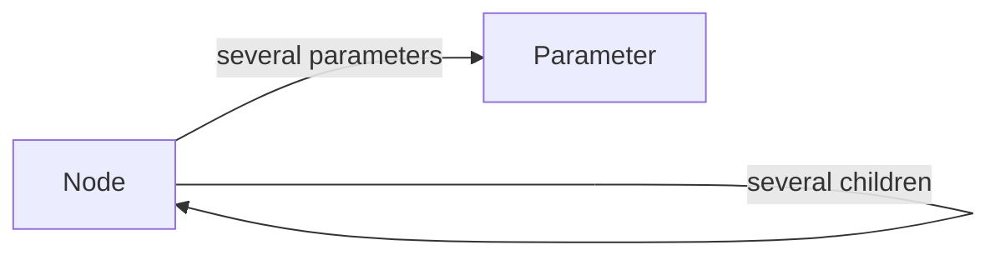
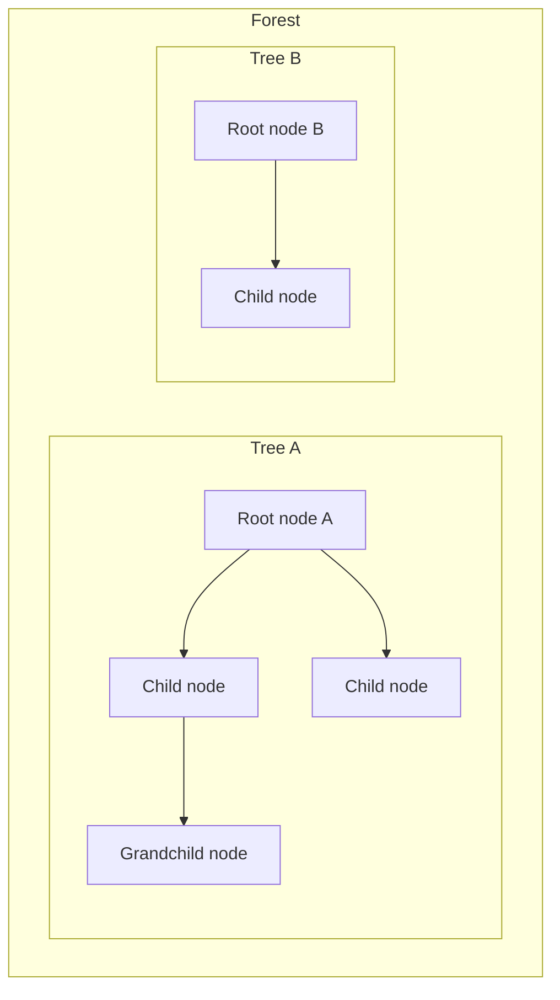
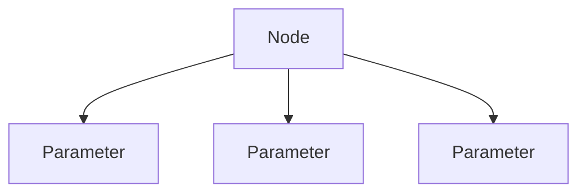

# Data structure: Nodes and Parameters

> Planning only. This document defines the conceptual data model. No plugin code yet.

## Core objects

| # | Object | Role |
|---|--------|------|
| 1 | **Node** | Builds trees and forests via parent/child links |
| 2 | **Parameter** | Attribute definition on a node |



**Agreed relations:**

- One node can have one parent (or none) and several children (or none).
- **One node can have several parameters** (or none).
- Each parameter belongs to **one** node.

---

## 1. Node

### Core idea

1. **One node can have a parent node** (or no parent).
2. **One node can have several child nodes** (or none).
3. **One node can have several parameters** (or none).
4. From parent/child links, nodes are used to **build trees**.
5. Several trees together form a **forest**.



### Parent and children

| Rule | Meaning |
|------|---------|
| Optional parent | A node may have **one** parent node, or none |
| At most one parent | Never multiple parents |
| Several children | A node may have **zero or more** child nodes |
| Root | A node with **no parent** is a root |
| Child | A node whose parent is set is a child of that parent |
| Same container | Parent and children belong to the same taxonomy/forest context |

```text
Node ──(optional)──► parent Node
Node ◄──(many)────── child Nodes
Node ◄──(many)────── Parameters
```

### Trees and forests

| Concept | Meaning |
|---------|---------|
| Tree | All nodes under one root via parent/child links |
| Forest | One or more trees (typical: all roots in one taxonomy) |

### Node fields

| Field | Required | Type (conceptual) | Meaning |
|-------|----------|-------------------|---------|
| `id` | yes | identifier | Stable identity of the node |
| `parent_id` | yes* | identifier \| `null` | Parent node; `null` = root |
| `name` | yes | string | Display name of the node |
| `taxonomy` | yes | string | Which hierarchical taxonomy / forest this node belongs to |

\* `parent_id` is always present as a value: either a valid parent id or `null`.

#### Planned optional Node fields (not decided yet)

| Field | Meaning | Status |
|-------|---------|--------|
| `slug` | URL/machine slug | open |
| `description` | Longer text | open |
| `count` | Assigned object count | open |
| `position` / `menu_order` | Explicit sibling order | open |
| `meta` | Extensible key/value bag | open |

### Node invariants

1. A node’s `parent_id`, when not `null`, must reference an existing node in the **same** `taxonomy`.
2. A node must not be its own ancestor (no cycles).
3. Structure remains a forest (disjoint trees), never a general multi-parent graph.
4. Delete policies for children: **promote** or **cascade**.
5. Parameters of a deleted node must follow a defined cleanup policy (delete with node, or other — TBD).

### How nodes build trees and forests

Flat list (parent links rebuild structure):

```text
[
  { id: 1, parent_id: null, name: "Passive Components", taxonomy: "part_category" },
  { id: 2, parent_id: 1,    name: "Resistors",          taxonomy: "part_category" },
  { id: 4, parent_id: null, name: "Semiconductors",     taxonomy: "part_category" }
]
```

- `1 → 2` = Tree A; `4` = Tree B; together = forest for `part_category`.
- Nested `children` is a **view** derived from parent links, not a second source of truth.

---

## 2. Parameter

### Core idea

**Parameter** is the second core object in this data structure.

Parameters describe configurable attributes on a node (names, types, and related definition data). They are distinct from Nodes: nodes form the hierarchy; parameters are attributes **of** a node.

**Cardinality (agreed):**

| From | To | Cardinality |
|------|----|-------------|
| Node → Parameter | several | `0..n` |
| Parameter → Node | one | `1` (owning node) |



```text
Node ──(several)──► Parameter
Parameter ──(one)──► Node   (via node_id)
```

### Parameter fields (initial — to refine)

| Field | Required | Type (conceptual) | Meaning |
|-------|----------|-------------------|---------|
| `id` | yes | identifier | Stable identity of the parameter |
| `node_id` | yes | identifier | Owning node (the node that has this parameter) |
| `key` | likely | string | Machine key (stable in code/APIs) |
| `label` | likely | string | Human-readable name |
| `type` | likely | string / enum | Parameter type (exact type set TBD) |

#### Fields still to define

| Topic | Status |
|-------|--------|
| Required / default / validation rules | open |
| Inheritance to child nodes | open |
| Allowed type list (text, number, measure, …) | open |
| Storage (term meta vs custom table vs host-owned) | open — Q15 |
| Whether parameter *values* live in this plugin or only in hosts | open — Q16 |
| Parameter cleanup when owning node is deleted | open |

### Example (conceptual)

```text
Node { id: 2, name: "Resistors", parent_id: 1, taxonomy: "part_category" }
  ├─ Parameter { id: 10, node_id: 2, key: "resistance", label: "Resistance", type: "measure" }
  └─ Parameter { id: 11, node_id: 2, key: "tolerance",  label: "Tolerance",  type: "text" }
```

### What a Parameter is not (until decided otherwise)

- Not a Node (parameters do not form the taxonomy tree).
- Not necessarily a filled-in value on a part/post — that may be a separate “value” concern.
- Not a replacement for WordPress core term fields (`name`, `slug`, …).
- Not shared across many owning nodes in MVP (one owning `node_id`).

---

## Object summary

| Object | Primary job | Structural link |
|--------|-------------|-----------------|
| Node | Hierarchy | Optional one parent; several children → trees/forests; several parameters |
| Parameter | Attribute definition | Belongs to one node; a node may have several parameters |

## Storage mapping (leaning, not final)

| Conceptual field | Likely WordPress mapping |
|------------------|--------------------------|
| Node `id` | term id |
| Node `parent_id` | `wp_term_taxonomy.parent` (`0` ↔ `null`) |
| Node `name` | `wp_terms.name` |
| Node `taxonomy` | `wp_term_taxonomy.taxonomy` |
| Parameter `node_id` | term id of owning node |
| Parameter body | term meta JSON, custom table, or host storage — **TBD (Q15)** |

## Open points

See [`docs/OPEN-QUESTIONS.md`](../OPEN-QUESTIONS.md) (Q11–Q13, Q15–Q16). Q14 (Node↔Parameter cardinality) is **decided**.

## Next planning step

Define parameter types/fields and value ownership. Still planning only — no implementation.
