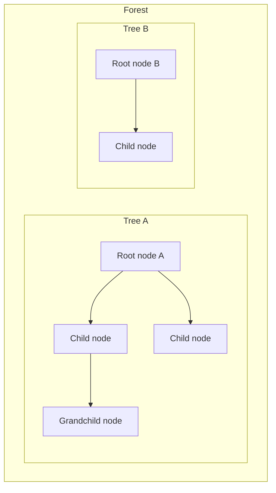

# Data structure: Nodes

> Planning only. This document defines the conceptual data model. No plugin code yet.

## Core idea

The fundamental unit is a **Node**.

1. **One node can have a parent node** (or no parent).
2. **One node can have several child nodes** (or none).
3. From those parent/child links, nodes are used to **build trees**.
4. Several trees together form a **forest**.



## Parent and children

| Rule | Meaning |
|------|---------|
| Optional parent | A node may have **one** parent node, or none |
| At most one parent | Never multiple parents (not a DAG/graph of many parents) |
| Several children | A node may have **zero or more** child nodes |
| Root | A node with **no parent** is a root |
| Child | A node whose parent is set is a child of that parent |
| Same container | Parent and children belong to the same taxonomy/forest context |

So the structural links are:

```text
Node ──(optional)──► parent Node
Node ◄──(many)────── child Nodes
```

Children are the inverse view of the parent link: all nodes that point to the same parent.

## Trees and forests

### Tree

A **tree** is the set of nodes reachable from one **root** by following child links (nodes that name that root as ancestor).

- Exactly one root in that tree.
- Every non-root node has exactly one parent.
- No cycles.

### Forest

A **forest** is a collection of trees (zero or more roots, each heading its own tree).

- In this product, a forest is typically “all nodes for one hierarchical taxonomy”.
- Multiple roots are normal (several top-level categories).
- The product UI may show one forest (one taxonomy) at a time.

| Concept | Built from | Root count |
|---------|------------|------------|
| Node | identity + optional parent + name (+ taxonomy) | — |
| Tree | connected nodes via parent links | 1 |
| Forest | one or more disjoint trees | 0..n |

## Entity: Node

Conceptual record (field names are planning English; final PHP/JS names TBD):

| Field | Required | Type (conceptual) | Meaning |
|-------|----------|-------------------|---------|
| `id` | yes | identifier | Stable identity of the node |
| `parent_id` | yes* | identifier \| `null` | Parent node; `null` means no parent (root) |
| `name` | yes | string | Display name of the node |
| `taxonomy` | yes | string | Which hierarchical taxonomy / forest this node belongs to |

\* `parent_id` is always present as a value: either a valid parent id or `null`.

### Planned optional fields (not decided yet)

| Field | Meaning | Status |
|-------|---------|--------|
| `slug` | URL/machine slug | open — likely yes for WP terms |
| `description` | Longer text | open |
| `count` | Assigned object count (WP term count or host-defined) | open |
| `position` / `menu_order` | Explicit sibling order | open — may be later than MVP |
| `meta` | Extensible key/value bag for hosts | open — prefer host-owned meta later |

## Relations

| Relation | Cardinality | Rules |
|----------|-------------|-------|
| Node → parent | 0..1 | One optional parent node; roots have none |
| Node → children | 0..n | Several child nodes allowed; leaf nodes have none |
| Node → ancestors | 0..n | Chain of parents up to the root |
| Node → descendants | 0..n | Full subtree excluding self |
| Nodes → tree | derived | All nodes under one root |
| Nodes → forest | derived | All trees in one taxonomy |

### Invariants

1. A node’s `parent_id`, when not `null`, must reference an existing node in the **same** `taxonomy`.
2. A node must not be its own ancestor (no cycles) — otherwise it is not a tree.
3. From parent links alone, the structure must remain a forest (disjoint trees), never a general graph.
4. Deleting a node must follow a defined policy for children:
   - **promote** — children get the deleted node’s parent (or become roots if the deleted node was a root)
   - **cascade** — children (and their descendants) are deleted too
5. Moving/reparenting (if allowed later) must preserve invariants 1–3.

## How nodes build trees and forests

### Flat list (storage / transfer)

Parent links are enough to rebuild structure:

```text
[
  { id: 1, parent_id: null, name: "Passive Components", taxonomy: "part_category" },
  { id: 2, parent_id: 1,    name: "Resistors",          taxonomy: "part_category" },
  { id: 3, parent_id: 2,    name: "SMD 0805",           taxonomy: "part_category" },
  { id: 4, parent_id: null, name: "Semiconductors",     taxonomy: "part_category" }
]
```

- Nodes `1 → 2 → 3` form **Tree A**.
- Node `4` alone forms **Tree B**.
- Together they are a **forest** for `part_category`.

### Nested view (UI)

Useful for rendering one forest as nested trees:

```text
[
  {
    id: 1,
    parent_id: null,
    name: "Passive Components",
    taxonomy: "part_category",
    children: [
      {
        id: 2,
        parent_id: 1,
        name: "Resistors",
        taxonomy: "part_category",
        children: [
          { id: 3, parent_id: 2, name: "SMD 0805", taxonomy: "part_category", children: [] }
        ]
      }
    ]
  },
  {
    id: 4,
    parent_id: null,
    name: "Semiconductors",
    taxonomy: "part_category",
    children: []
  }
]
```

The nested `children` array is a **view** derived from parent links, not a second source of truth.

## What a Node is not (MVP)

- Not a post/part record.
- Not a property schema (measure, enum, etc.).
- Not a user or capability object.
- Not a many-parent graph node (only optional single parent).

Host plugins may attach extra data **to** a node (for example term meta on the underlying term) without putting domain fields into the core Node contract.

## Storage mapping (leaning, not final)

| Conceptual Node field | Likely WordPress mapping |
|-----------------------|--------------------------|
| `id` | term id (`wp_terms.term_id`) |
| `parent_id` | `wp_term_taxonomy.parent` (`0` in DB ↔ `null` in model) |
| `name` | `wp_terms.name` |
| `taxonomy` | `wp_term_taxonomy.taxonomy` |
| `slug` (if included) | `wp_terms.slug` |

MVP leaning: **no custom node table** — nodes are a model over hierarchical terms. Final decision tracked as open question **Q11**.

## Open points for this data structure

See also [`docs/OPEN-QUESTIONS.md`](../OPEN-QUESTIONS.md):

- Confirm required vs optional fields above.
- Sibling order: WordPress default order vs explicit `position`.
- Whether `count` belongs on the core Node DTO for the admin UI.
- Whether Node `id` is always the WP term id or a plugin-owned id (leaning: term id).

## Next planning step

Continue refining Node fields and operations on trees/forests (create child, reparent, delete promote/cascade). Still planning only — no implementation.
