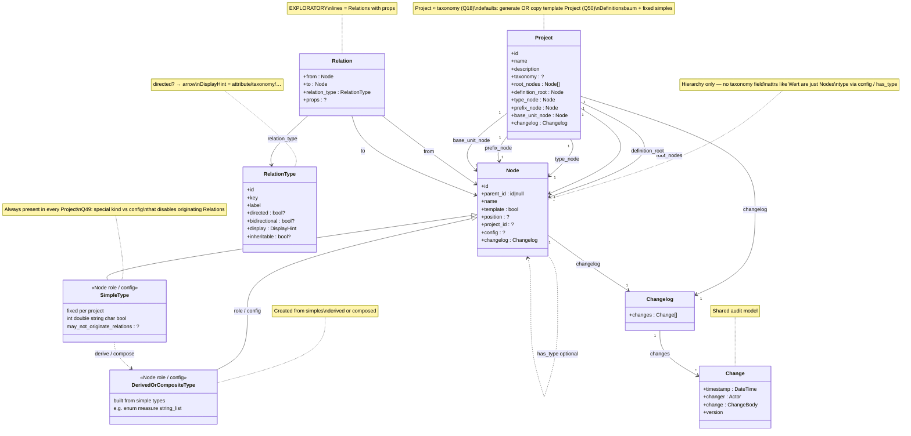
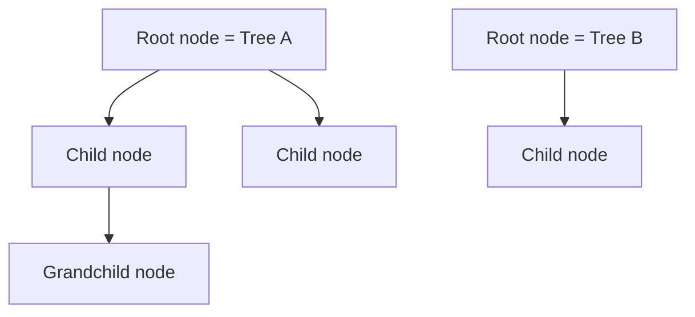
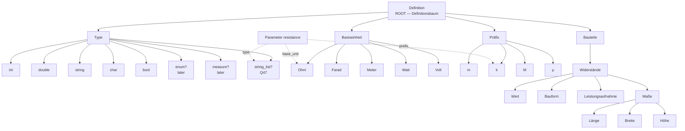
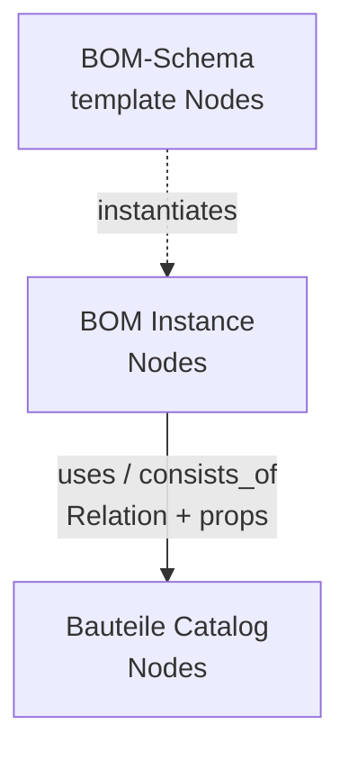
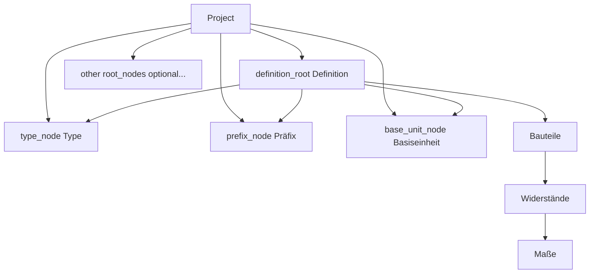

# Data structure: Project, Node, Parameter, Changelog

> Planning only. This document defines the conceptual data model. No plugin code yet.

## Current class diagram

> **Keep this section updated on every structure change.** After each change, also show this diagram in the chat reply.

**Decided (Q33/Q34):** there is **no Parameter class** and **no ParameterRole**. Attributes such as `Wert` / `Länge` are ordinary **Nodes** that bind a type via **configuration** and/or Relations (`has_type`).  
Every project has **fixed simple data-type Nodes**; further types are **derived or composed** from those simples.  
**Q49 open:** simples may be a special kind that cannot originate Relations, **or** config that disables Relations on simples.  
Typed edges remain exploratory (**Q35**).



**Legend:** `Relation` / `RelationType` are **exploratory**.  
Each RelationType has one **`label`** (no `forward`/`inverse` fields).  
Optional **`directed`** (unsicher — Q44): if true, graph UI shows an **arrow** `from → to`; if false, a plain **line**.  
`bidirectional` may overlap with undirected — clarify or drop (Q41/Q44).  
`DisplayHint` = how related nodes appear structurally (attribute / taxonomy / tree / reference).  
**Schema-as-Nodes spin (Q46):** domain structures such as **BOM** or **Recipe** may themselves be **Nodes + Relations** (templates), so host apps need fewer hard-coded classes (`BomList` / `BomLine` become optional views).  
**No Parameter / ParameterRole:** attribute Nodes are just Nodes; type binding via **config** and/or `has_type`. `SimpleType` / `DerivedOrCompositeType` remain **roles of type Nodes** (Q34), not separate stored classes.  
**Q49:** whether simples are a hard special kind or config that disables originating Relations — still open.

## Core objects

| # | Object | Role |
|---|--------|------|
| 1 | **Node** | Hierarchy; Definition choices; attributes (`Wert`, …); type Nodes; schema slots — all the same object |
| 2 | **Parameter / ParameterRole** | **Rejected / dropped** — leftover naming only; do not model |
| 3 | **Project** | **≈ taxonomy (Q18)**; trees + Definition anchors + fixed simples; defaults via generate or template copy (**Q50**) |
| 4 | **Changelog** | History container (`changes`) |
| 5 | **Change** | One audit entry (when, who, what, version) |
| 6 | **Relation** | **Exploratory:** edge between two Nodes with a RelationType |
| 7 | **RelationType** | **Exploratory:** type with one `label` (no inverse field) |

### Shared audit idea (recommended)

Give **every** main domain object the same field:

```text
changelog: Changelog
```

`Changelog` **consists of** many `Change` entries. One shared pattern for Project and Node (including nodes with parameter role) — do not invent different audit fields per entity.

In PHP (leaning): **composition**, not a deep inheritance tree.

```php
// Conceptual — not implemented
class Changelog {
	/** @var list<Change> */
	public array $changes;
}

class Change {
	public \DateTimeInterface $timestamp; // when (Zeitpunkt)
	public string $changer;               // who (Änderer) — exact type Q22
	public string $change;                // what (Änderung) — exact shape Q21
	public string $version;               // version — exact format Q23
}
```

Optional later: interface `Has_Changelog` with `changelog` so services can append entries uniformly.

### Not a separate object

| Concept | Status | Meaning |
|---------|--------|---------|
| **Tree** | **Not an object** | Defined by a **root node** (and all descendants reachable via child links) |
| **RootNode** | **Not an object** | Same as **Node** with parent `null` — only a role, not a type |
| **Template tree** | **Not a class** | A tree whose root (or node) has `template = true`; seeds project-specific trees |
| **ParameterType** (class) | **Not an object** | Parameter **type is a Node** (under Project.type_node) |
| **Unit** (class) | **Not an object** | Use **Präfix** + **Basiseinheit** Nodes instead |
| **Parameter / ParameterRole** | **Rejected / dropped** | No class and no formal role stereotype; attribute Nodes are just Nodes with type binding |
| **BomList / BomLine / Recipe as PHP classes** | **Under review (Q46)** | May be replaceable by **Nodes + Relations** configured like templates |
| **Relation / typed edge** | **Exploratory** | Edge + RelationType (Q35/Q41) |
| **RelationType** | **Exploratory** | One `label` only; display + inherit (Q42/Q43) |
| Forest | Derived view | Several trees (several roots) inside one project |


**Stored objects in this diagram:** `Project`, `Node` only  
**Derived only:** tree (from root node), root role (Node with `parent = null`); type roles via config

**Agreed / tentative relations:**

- One node can have one parent (or none) and several children (or none). — **agreed**
- A **root node** is the **same object as a node** where the parent is `null` (not a separate type/entity). — **agreed**
- A **tree** is identified by its **root node** (no extra Tree entity). — **agreed**
- A **project** can consist of **different trees** (different root nodes). — **agreed**
- Attribute Nodes (e.g. `Wert`) bind **`type`** (required) plus optional **`prefix`** / **`base_unit`** via config and/or Relations — **no ParameterRole**. — **agreed direction**
- A filled **measure** reading is **`value` + `prefix` + `base_unit`** (Einheit), e.g. `10` + `m` + `Meter` → `"10 mm"`. — **agreed** (where the value is stored: Q16)
- **Core types (Q33/Q36/Q48):** every Project has **fixed simple type Nodes** (`int`, `double`, `string`, `char`, `bool`); further types are **derived or composed** from those simples — **agreed direction**
- **`enum` is composite**: several option values of a **scalar** type; **`single` / `multiple` are selection methods**, not types — **leaning (Q38)**
- **`measure` is composite**: numeric leaf (`number` or `integer`) + optional Präfix + Basiseinheit — **leaning (Q36/Q37)**; not a rival scalar beside `number`
- Dimensions under **Maße** (`Länge` / `Breite` / `Höhe`) each carry such a measure; together e.g. `10 mm × 5 mm × 2 mm`. — **agreed**
- The planning **Definitionsbaum** is one tree with root **Definition**; **Bauteile** (and other branches) hang under that root — no separate catalog Root. — **agreed**
- Every **Project** must have a **Definitionsbaum** (Definition tree) and must store anchors for **Type**, **Präfix**, and **Basiseinheit**. — **agreed**
- **Project ≈ taxonomy** — **strong leaning (Q18)**; taxonomy not on Node
- How default Nodes appear in a new Project — **open (Q50):** generate **or** copy from a template Project
- Those required Definition nodes are **unique per project** and are **stored on the Project**. — **agreed**
- Some trees are **template trees**; `template` is a **flag on Node**. — **agreed**
- Template trees can serve as templates for **project-specific trees**. — **agreed** (copy/instantiate mechanics still open — Q30)
- **No Parameter class and no ParameterRole** — **decided (Q33/Q34)**; attribute nodes are ordinary Nodes with type binding via config/`has_type`
- Separate Parameter owner (`node_id`) — **dropped / entfällt (Q14)**; placement via `parent_id` and/or Relations
- Simple type Nodes typically **do not originate Relations** — **open (Q49):** special kind **or** config that disables Relations
- Every Project and Node has a **changelog**. — **agreed**
- Every **Change** has `timestamp`, `changer`, `change`, and **`version`**. — **agreed**
- **Typed edges** (`Relation` + `RelationType`) — **exploratory (Q35)**; each type has one `label` only; no `inverse` field (Q41)
- **Display** of related nodes depends on RelationType (part-of → attributes) — **leaning (Q42)**
- **`consists_of` attributes inheritable along `is_a`** — **leaning (Q43)**

```text
Project ──(several trees)──► Root Node
Node ──(optional)──► parent Node          # classic tree
Node ──(Relation?)──► Node                # exploratory typed edges
Node.config ──(capabilities / type binding)──►  # leaning Q34 — not a ParameterRole
SimpleType Nodes ──(derive/compose)──► further Type Nodes
# Q49: simples cannot originate Relations — special kind vs config
```

### Design decision: no Parameter and no ParameterRole

**Q33/Q34:** Names like `Wert` / `Länge` in the Definitionsbaum **are ordinary Nodes**.  
There is **no** Parameter class, **no** ParameterRole stereotype, and **no** PHP subclass.  
Type binding lives in **Node.config** and/or Relations (`has_type`). Optional measure fields (`prefix`, `base_unit`, `value`) are likewise config / Relations — not a parallel object model.  
**Q49 open:** simple data-type Nodes usually should not build Relations themselves — either a **special Node kind**, or config that **deactivates Relations** on simples.  
Typed edges (`besteht-aus`) may still *display* those Nodes as attributes of a parent — orthogonal (Q35/Q42).

---

## 1. Node

### Core idea

1. **One node can have a parent node** (or no parent).
2. **One node can have several child nodes** (or none).
3. **One node can have several parameters** (or none).
4. A **root node** is the **same object as a node** where the parent is `null` (not a different object type).
5. A **tree** is not stored as its own object: it is **defined by a root node** plus all descendants.



### Root node (definition)

| Term | Definition |
|------|------------|
| **Root node** | The **same Node object** with parent `null` (`parent_id = null`) |
| Non-root node | The **same Node object** with a non-null parent |

There is **no separate RootNode type**. “Root” is only a role/state of Node based on `parent_id`.
Being a root does not require children.

### Parent and children

| Rule | Meaning |
|------|---------|
| Optional parent | A node may have **one** parent node, or none |
| At most one parent | Never multiple parents |
| Several children | A node may have **zero or more** child nodes |
| Root | A root node is the same Node object with parent `null` (no separate type) |
| Child | A node whose parent is set is a child of that parent |

```text
Node ──(optional)──► parent Node
Node ◄──(many)────── child Nodes
Node ◄──(many)────── Parameters
```

### Tree (derived, not an object)

| Rule | Meaning |
|------|---------|
| No Tree table/entity | Do not model `Tree` as a first-class stored object |
| Defined by root | Tree = **root node** (node with no parent) + all descendants |
| Identity | Referring to a tree means referring to its **root node id** |
| Empty tree | A root with no children is still a tree of one node |

### Node fields

| Field | Required | Type (conceptual) | Meaning |
|-------|----------|-------------------|---------|
| `id` | yes | identifier | Stable identity of the node |
| `parent_id` | yes* | identifier \| `null` | Parent node; `null` = root (defines a tree) |
| `name` | yes | string | Display name of the node |
| `template` | yes | bool | `true` = this node heads/belongs to a **template** tree |
| `project_id` | ? | identifier | Optional reverse link — domain access is via `Project.root_nodes` (Q17) |
| `changelog` | yes | **Changelog** | History of changes on this node |

\* `parent_id` is always present as a value: either a valid parent id or `null`.

#### Planned optional Node fields (not decided yet)

| Field | Meaning | Status |
|-------|---------|--------|
| `slug` | URL/machine slug | open |
| `description` | Longer text | open |
| `count` | Assigned object count | open |
| `position` / `menu_order` | Explicit sibling order | open |
| `meta` | Extensible key/value bag | open |

### Node invariants

1. A node’s `parent_id`, when not `null`, must reference an existing node in the **same project** (taxonomy is on Project, not per Node — Q18).
2. A node must not be its own ancestor (no cycles).
3. Structure under each root remains a tree; a project’s roots form multiple trees.
4. Delete policies for children: **promote** or **cascade**.
5. Parameters related to a deleted node must follow a defined cleanup policy (TBD; parent/Relation cleanup, Q14 dropped).

### Example: trees from root nodes

```text
# Two trees inside one project — no Tree objects, only nodes:
{ id: 1, parent_id: null, name: "Passive Components", project_id: 100 }  # root → Tree A
{ id: 2, parent_id: 1,    name: "Resistors",          project_id: 100 }
{ id: 4, parent_id: null, name: "Semiconductors",     project_id: 100 }  # root → Tree B
```

- Tree A = node `1` + descendants.
- Tree B = node `4` + descendants.
- Nested `children` is a **view** derived from parent links, not a second source of truth.

---

## 2. Attribute Nodes (no Parameter / ParameterRole)

### Core idea

Configurable attributes (often measures) such as `Wert` or `Länge` are **ordinary Nodes**.  

**Decided (Q33/Q34):** **no Parameter class**, **no ParameterRole**, **no PHP subclass**.  
A Node becomes an “attribute” by binding a **type** (and optional prefix / base_unit / value) via **config** and/or Relations (`has_type`).

**Rejected:** Parameter as a separate object via `node_id`.  
**Dropped:** ParameterRole as a formal diagram/model stereotype (hinfällig without Parameter).

**Cardinality (decided direction):**

| From | To | Cardinality | Status |
|------|----|-------------|--------|
| Node → child attribute Nodes | several | `0..n` | **decided** (parent/child and/or Relations) |
| Attribute Node → parent | one | `0..1` | **via `parent_id`** (Q14 dropped) |

```text
Node (category) ──(children / besteht-aus)──► Node (e.g. Wert) ─[has_type]→ Type Node
```

### Config / bindings (initial — to refine)

| Field | Required | Type (conceptual) | Meaning |
|-------|----------|-------------------|---------|
| *(Node fields)* | — | — | Identity, parent, name, template, changelog, … |
| `type` | **yes** | **Node** (via config or Relation) | From Definition → **Type** (simple or derived/composed) |
| `prefix` | **optional** | **Node** \| `null` | From Definition → **Präfix** |
| `base_unit` | **optional** | **Node** \| `null` | From Definition → **Basiseinheit** |
| `value` | **?** | scalar / TBD | Filled reading for measures; storage Q16 |
| `key` | likely | string | Machine key if `name` is not enough |

```php
// Conceptual — not implemented
class Node {
	public ?array $config; // type binding / capabilities — shape TBD (Q34)
	// …
}
// e.g. node.config.type = <type Node id>; optional prefix / base_unit / value
// OR Relation has_type from this Node to a type Node
```

**Agreed for measure readings:** value + prefix + base unit (e.g. `10 mm`). Details Q24, Q29, Q16.

#### Fields still to define

| Topic | Status |
|-------|--------|
| Parameter class / ParameterRole | **rejected / dropped** |
| Config shape for type binding | open — Q34 |
| Separate owning `node_id` | **dropped** — Q14 |
| Simple types may originate Relations? | **open** — Q49 |
| Required / default / validation rules | open — Q47 |
| Inheritance to child nodes | open |
| Which types require prefix and/or base_unit | open — Q24 |
| May prefix exist without base_unit? | open — Q29 |
| Storage | same as Node — Q11/Q15 |
| Whether attribute *values* live in this plugin | open — Q16 |
| Cleanup when a related node is deleted | open |
| List / multi-value scalars (e.g. RefDes) | open — Q47 |

### Schema slot vs value shape (Reference / RefDes)

Concrete pressure from the prototype / BOM:

- Schema column renamed **Designator → Reference**: in practice a **comma-separated list** of board references (`R1,R2` or `C1…Cn`), not a single token.
- Temptation: hang a **validator** on that Node (“must look like RefDes list”). That feels wrong — and it is the Parameter↔Node tension again.

**Split (leaning):**

| Layer | Role | Example |
|-------|------|---------|
| **Schema Node** | Named *slot* in a line/form (`position`, label) | Node `Reference` under BOM-Zeile schema |
| **Type / Parameter** | *Shape* of the filled value + reusable rules | type ≈ `string_list` (or string + cardinality multiple); optional item pattern |
| **Instance value** | Actual data | canonical `["R1","R2"]`; CSV `R1,R2` only for UI/export |

Why not validator-on-Node:

- Rules would pile onto every schema leaf; no reuse across slots that share a shape.
- Mixes **identity of the slot** (“this column exists”) with **contract of the value** (“list of strings”).
- `enum` / `enum_multiple` needs a **fixed option set** (children) — RefDes is an **open** list, so it is closer to a **list-of-string** type than to enum.

This strengthens: schema-as-Nodes (Q46) for structure; Type/Parameter-Node (Q33/Q36/Q47) for how cells are interpreted — not ad-hoc Node meta.

### Datentypen as tree + Relation (Q33 / Q48)

**Decided direction:** types are **Nodes** in the tree. Every Project ships with a **fixed set of simple data-type Nodes**. Users (or host plugins) may create **further types** that are either **derived** or **composed** from those simples.

```text
Datentypen / Type             ← Project.type_node (fixed branch)
├── int                       ← simple (always available)
├── double                    ← simple
├── string                    ← simple
├── char                      ← simple
└── bool                      ← simple
# derived / composed from simples (examples):
├── enum          ← composed over a scalar option set
├── measure       ← composed: numeric simple + Präfix + Basiseinheit
└── string_list   ← derived/composed from string (Q47)
```

**Binding:** Parameter-Node / schema slot ─[Relation `has_type` or field `type`]→ type Node  
Example: `Menge` *has_type* `int` → table cell renders as integer field; `Stock` *has_type* `bool` → checkbox/switch.

| Idea | Note |
|------|------|
| **Simple types are fixed** | Present in every Project; not removed as a set (per-project hide may still apply — prototype) |
| **Derived / composed types** | Built from simples without inventing a parallel type system |
| Types are **Nodes** | Same storage/UI as everything else |
| Assignment is a **Relation or typed field** | Fits typed-edge exploration (Q35); reverse view “used by” possible |
| UI derives widget from type | Prototype: int→number, double→number step any, string→text, char→1 char, bool→checkbox |
| Name mapping | Simple scalars ≈ earlier catalog: int↔integer, double↔number, bool↔boolean; `char` = narrow string |
| **Relations from simples?** | Simples typically do **not** originate Relations — **Q49:** special kind **or** config that disables Relations |

**Still open (Q34/Q49):** config shape for Parameter role + whether simples are a hard special kind or config that blocks originating Relations. Binding to type remains `has_type` / `type` field (Q48).

### Definitionsbaum (canonical planning example)

From here on, this tree is always called the **Definitionsbaum**.  
Root = **Definition** (`parent_id = null`). Parameter picks Type / Präfix / Basiseinheit from this tree; catalog branches such as **Bauteile** hang under the same root (no extra Root node).



```text
Definition                                    ← Definitionsbaum root
├── Type                                      ← ≈ Datentypen (Q48); freely configurable Nodes
│   ├── int
│   ├── double
│   ├── string
│   ├── char
│   ├── bool
│   ├── enum?                   ← later: composite + selection_mode
│   ├── measure?                ← later: number|integer + prefix + unit
│   └── string_list?            ← later: open RefDes lists (Q47)
├── Basiseinheit
│   ├── Ohm
│   ├── Farad
│   ├── Meter
│   ├── Watt
│   ├── Volt
│   └── …
├── Präfix
│   ├── m
│   ├── k
│   ├── M
│   └── µ
└── Bauteile
    └── Widerstände
        ├── Wert
        ├── Bauform
        ├── Leistungsaufnahme
        └── Maße
            ├── Länge
            ├── Breite
            └── Höhe
```

**Parameter examples using this tree** (anchors also stored on Project):

```text
Project.definition_root = Definition
Project.type_node = Type
Project.prefix_node = Präfix
Project.base_unit_node = Basiseinheit

Parameter {
  key: "resistance",
  type: Node("measure"),      # under project.type_node
  prefix: Node("k"),          # under project.prefix_node
  base_unit: Node("Ohm")      # under project.base_unit_node
}
# with value 10  =>  "10 kOhm"

Parameter {
  key: "datasheet",
  type: Node("url"),
  prefix: null,
  base_unit: null
}
```

**Branch notes (not locked):**

| Node | Possible role |
|------|----------------|
| `Type` / `Basiseinheit` / `Präfix` | Required Definition anchors on Project |
| `Bauteile` | Domain branch under Definitionsbaum (not its own root) |
| `Widerstände` | Category node; children may be Parameter-Nodes |
| `Wert` | **Parameter-Node** — e.g. type=`measure`, prefix=`k`, base_unit=`Ohm` |
| `Bauform` | **Parameter-Node** — e.g. type=`text` or enum-like choices |
| `Leistungsaufnahme` | **Parameter-Node** — measure + Watt base unit |
| `Maße` | Group node; children are dimension Parameter-Nodes |
| `Länge` / `Breite` / `Höhe` | **Parameter-Nodes** (measure): **value + prefix + Einheit** |

**Dimension example (agreed direction):**

```text
Länge  { value: 10, prefix: m, base_unit: Meter }  =>  "10 mm"
Breite { value:  5, prefix: m, base_unit: Meter }  =>  "5 mm"
Höhe   { value:  2, prefix: m, base_unit: Meter }  =>  "2 mm"

Maße display:  10 mm × 5 mm × 2 mm
```

`mm` is **not** a single Definition node — it is Präfix `m` + Basiseinheit `Meter` (same pattern as `k` + `Ohm` → `kOhm`).

`Project.definition_root` points at **Definition**; that root is also in `root_nodes`.

Open: exact validation rules when type is `measure` vs `url` (Q24, Q29).  
Open: Node **configuration** shape for Parameter role (Q34 lean).  
Open: may simple types originate Relations — special kind vs config disable (**Q49**).  
**Closed (Q33):** Parameter *is* a tree Node (not a separate attached object).  
**Dropped (Q14):** no separate owner field.

### What we do not model

- No **Parameter** class and no **ParameterRole** stereotype.
- Attribute Nodes are not a separate stored kind beside Node (**Q33/Q34**).
- Not necessarily a filled-in value on a part/post (value still Q16).
- Not owned via a separate `node_id` field (**Q14 dropped**); use `parent_id` and/or Relations.
- Not a PHP subclass hierarchy (**Q34 leaning: configuration**).

---

## Design fork (partially resolved): inheritance vs besteht-aus

**Q33 closed** Parameter-as-Node. The remaining fork is how those Parameter-Nodes hang under categories: classic parent/child, typed `besteht-aus` edges, or both (display vs storage).

| Approach | Idea | Inheritance? | Selection / query feel |
|----------|------|--------------|------------------------|
| **A — Parameter definitions** | Parameter is a definition object (or specialized payload) that **points at** Type/Präfix/Basiseinheit Nodes | Easy to inherit attribute *definitions* down a taxonomy (`ist-ein` children reuse parent params) | Select node → load attached param defs; often fewer hops |
| **B — Nested nodes + typed edges** | Attributes are Nodes too; edges have **kinds** (`ist-ein`, `besteht-aus`) and may **point into another branch/tree** (e.g. Definitionsbaum) | Taxonomy uses `ist-ein`; composition uses `besteht-aus` (not inheritance) | Select node → walk edges by kind; more flexible, possibly more joins |

**User framing:**  
*Widerstand **ist ein** Passives Bauteil* (taxonomy / inheritance path).  
*Widerstand **besteht aus** Wert, Bauform, Maße, …* (composition — edges need properties/kind).  
Measure pieces (Maßzahl / Präfix / Unit) may live in the **Definitionsbaum** and be **referenced** from composition edges.

### Exploratory object: Relation (typed edge)

```text
Relation {
  from: Node
  to:   Node
  relation_type: RelationType
  props: ?   # optional edge metadata
}

RelationType {
  key:            string              # logical id, e.g. "consists_of"
  label:          string              # e.g. "besteht aus" / "consists of"
  directed:       bool?               # Q44 — true: arrow from→to; false: undirected line
  bidirectional:  bool?               # may overlap with !directed — clarify or drop (Q41/Q44)
  display:        DisplayHint         # structural UI: attribute / taxonomy / tree / reference
  inheritable:    bool?               # can child nodes inherit along ist-ein?
}
```

#### Labels and direction

| Idea | Meaning |
|------|---------|
| One `label` | Every RelationType has exactly one label — no `forward`/`inverse` fields |
| No `inverse` | Do not store a paired opposite RelationType on the type |
| **`directed`** (tentative) | **Gerichtet:** meaningful `from → to` → UI **arrow**. **Ungerichtet:** → UI **line** (Q44 — unsure) |
| `bidirectional` | Possibly redundant with undirected / reverse-as-view — do not lock yet |

**Leaning:** RelationType = **`label`** + display/inherit flags. Opposite wording like “ist Teil von” stays a **view** of the same edge (Q41).  
**Open:** whether `directed` (graph chrome: arrow vs line) is worth keeping beside `DisplayHint` (structural role) — they answer different questions (Q42 vs Q44).

#### Design spin: measure via Relation + unit group (exploratory)

Insight from examples (Rezepte amounts on edges; Widerstand Wert): a **value** can live on a **Relation**, while **Präfix + Basiseinheit form one group** (not a free chain of unrelated links).

**Avoid loose chain (awkward):**

```text
Widerstand ──Wert──► 100 ──► kilo ──► Ohm     # prefix and unit look like siblings in a path — misleading
```

**Prefer grouped unit + value on edge (spin):**

```text
Widerstand
   │
   │  RelationType e.g. "wert" / consists_of measure slot
   │  props: { value: 100 }
   │
   ▼
UnitGroup (logical) = Präfix "k"  +  Basiseinheit "Ohm"
         display: "100 kOhm"
```

Same pattern for recipe lines:

```text
Rezept ──uses──► Mehl
         props: { value: 200 }  +  UnitGroup(null/"", g)
         display: "200 g"
```

| Piece | Role |
|-------|------|
| `value` | Scalar on the **Relation** (`props`) — or on a measure Parameter; still open |
| **Unit group** | **Präfix + Basiseinheit always together** (pair / small structure); “kOhm”, “mm”, “mW” |
| Präfix alone | Incomplete for display of a measure (Q29) |
| Basiseinheit alone | Allowed as group with null prefix (e.g. `5 Ohm`, `200 g`) |

**Leaning (not locked):** treat **Präfix+Einheit as one unit group**; do not model measure as Widerstand→value→prefix→unit as three independent hops. Relation.props may carry `value` and point at / embed that group (Q45).

Aligns with existing composite **`measure`** = number\|integer + optional prefix + base_unit — the “group” is exactly that unit part of the composite.

#### Design spin: BOM / Recipe as Nodes (no dedicated domain classes) — Q46

Gap spotted on the concrete BOM: `BomList` / `BomLine` feel like **host classes**, but the same structure can be **configured from Nodes** — like a recipe, a PC build, or any other list.

**Idea:** the *definition of what a BOM is* lives in the tree (template / schema nodes). Instances are also nodes (or node graphs), not a separate PHP model.

```text
# Schema / template (Definitionsbaum or template tree, Node.template?)
BOM-Schema
├── [consists_of] Zeile          ← line shape
│     ├── [consists_of] Reference / Referenzen  (string_list — open RefDes; not enum)
│     ├── [consists_of] Menge          (measure | integer)
│     ├── [consists_of] Beschreibung   (string)
│     ├── [consists_of] Preis          (measure / money)
│     ├── [consists_of] Stock          (boolean)
│     └── [uses] CatalogPart           (→ Bauteile leaf)
└── [consists_of] Summe / Meta   (optional)

# Instance (a concrete BOM — also Nodes)
BOM "Platine XY"
├── Zeile "C1,C3,C4"
│     Reference=["C1","C3","C4"]  qty=3  price=0.30  stock=true
│     ─[uses]→ Node "C 100nF 0603 CC0603…"
├── Zeile "R1,R2"
│     Reference=["R1","R2"]
│     ─[uses]→ Node "R 1kΩ 0603"
├── Zeile "X2"
│     qty=0.5 m   ─[uses]→ Node "Datenkabel 4-Pol"
└── …
```



| Approach | Pros | Cons |
|----------|------|------|
| **A — Hard classes** `BomList`/`BomLine` | Fast to code for one app | Every domain reimplements lists |
| **B — Schema-as-Nodes** | Same engine for BOM, Recipe, PC build, shopping list; configure in tree | Heavier runtime; need good templates + Relation.props |

**Leaning:** treat **B as the strategic direction** for the taxonomy-tree environment; host UIs become *renderers* of node graphs. Hard classes may still appear as thin DTOs at API edges — not as the source of truth (Q46).

**Order / sequence (user insight):** if a BOM **Zeile** is a Node, the table display needs a **stable row order**. Name-sorting is wrong (`C2` before `C1,C3,C4` by string is accidental). Same for recipe **steps**.  
→ Requires explicit ordering: Node.`position` / `menu_order`, or ordered Relations (Q12/Q13). Schema-as-Nodes makes **sibling order first-class**, not optional cosmetics.

Same for **Rezept**: Rezept-Schema Nodes + instance Nodes + `uses` ingredients with measure props — no `Recipe`/`IngredientLine` core classes required.

#### Example RelationTypes

| Key | `label` | `directed`? (tentative) | Typical `DisplayHint` |
|-----|---------|-------------------------|------------------------|
| `consists_of` | besteht aus | yes (arrow) | `as_attribute` |
| `is_a` | ist ein | yes (arrow) | `as_taxonomy` |
| `child_of` | Kind von | yes (arrow) | `as_tree_child` |
| `uses` | verwendet | yes (arrow) | `as_reference` |
| *(symmetric?)* | verbunden mit | no (line) | TBD |

#### Display depends on RelationType (Q42)

Related nodes are **not** always shown the same way:

| RelationType | UI leaning |
|--------------|------------|
| `consists_of` / part-of | Nodes that **are part of** a parent appear as **attributes** of that parent (not as a peer branch in the main taxonomy tree) |
| `is_a` | Shown as taxonomy / subtype tree |
| `child_of` | Classic parent/child tree |
| `uses` | Reference list / “used by” reverse index |

#### Inheritance of composition attributes (Q43)

- Along **`is_a`** (e.g. NPN **ist ein** Transistor): attributes that the parent **besteht aus** (Wert, Maße, …) **can be inherited** by the child node.
- Inheritance mechanics still open (copy / live merge / override) — related to Q30.
- Only RelationTypes marked `inheritable` (leaning: composition/`consists_of`) participate.

```text
Transistor  ─[consists_of]→ Gehäuse, Uce, Ic, Maße, …
NPN         ─[is_a]→ Transistor
NPN UI      → shows Transistor's consists_of set as attributes (inherited)
              + any NPN-only consists_of overrides/additions
```

Not agreed — refine with Q35/Q41–Q43; Bauteile example below still uses informal `[ist-ein]` / `[besteht-aus]` labels.

### Example tree: Bauteile (typed edges)

Separate planning tree (root = **Bauteile**).  
Edge labels: **`[ist-ein]`** vs **`[besteht-aus]`**.  
Measure attributes **refer** into the Definitionsbaum (`measure` + Präfix + Basiseinheit), not duplicated as free text.

```text
Bauteile                                              ← ROOT of this example
│
├── [ist-ein] Passives Bauteil
│   │
│   ├── [ist-ein] Widerstand
│   │   ├── [besteht-aus] Wert
│   │   │                 └─ [referenziert] measure + Präfix + Unit(Ohm)
│   │   │                    Beispiel: 10 kOhm
│   │   ├── [besteht-aus] Bauform          (z.B. 0201, 0402, 0603, axial, …)
│   │   ├── [besteht-aus] Toleranz         (measure + Präfix + Unit(%) ?)
│   │   ├── [besteht-aus] Leistungsaufnahme
│   │   │                 └─ measure + Präfix + Unit(Watt)  z.B. 250 mW
│   │   ├── [besteht-aus] Temperaturkoeffizient
│   │   └── [besteht-aus] Maße
│   │       ├── [besteht-aus] Höhe         → measure + Präfix + Unit(Meter)
│   │       ├── [besteht-aus] Breite       → measure + Präfix + Unit(Meter)
│   │       └── [besteht-aus] Tiefe        → measure + Präfix + Unit(Meter)
│   │           Beispiel Maße: 10 mm × 5 mm × 2 mm
│   │
│   ├── [ist-ein] Kondensator
│   │   ├── [besteht-aus] Wert (Kapazität) → measure + Präfix + Unit(Farad)
│   │   ├── [besteht-aus] Nennspannung     → measure + Präfix + Unit(Volt)
│   │   ├── [besteht-aus] Bauform / Dielektrikum
│   │   ├── [besteht-aus] Polarität        (text / enum)
│   │   ├── [besteht-aus] Toleranz
│   │   └── [besteht-aus] Maße
│   │       ├── Höhe / Breite / Tiefe      → je measure + Präfix + Unit(Meter)
│   │
│   ├── [ist-ein] Spule
│   │   ├── [besteht-aus] Wert (Induktivität) → measure + Präfix + Unit(Henry)
│   │   ├── [besteht-aus] Nennstrom
│   │   ├── [besteht-aus] Gleichstromwiderstand (DCR)
│   │   ├── [besteht-aus] Kern / Bauform
│   │   └── [besteht-aus] Maße → Höhe / Breite / Tiefe
│   │
│   └── [ist-ein] Potentiometer
│       ├── [besteht-aus] Widerstandswert  → measure + Präfix + Unit(Ohm)
│       ├── [besteht-aus] Leistung
│       ├── [besteht-aus] Bauform (Dreh-/Schiebe-)
│       └── [besteht-aus] Maße → Höhe / Breite / Tiefe
│
└── [ist-ein] Aktives Bauteil
    │
    ├── [ist-ein] Transistor
    │   ├── [besteht-aus] Gehäuse
    │   ├── [besteht-aus] Uceo / Uce sat   → measure + Präfix + Unit(Volt)
    │   ├── [besteht-aus] Ic max           → measure + Präfix + Unit(Ampere)
    │   ├── [besteht-aus] hFE / Verstärkung
    │   ├── [besteht-aus] Verlustleistung  → measure + Präfix + Unit(Watt)
    │   ├── [besteht-aus] Maße → Höhe / Breite / Tiefe
    │   │
    │   ├── [ist-ein] NPN-Transistor
    │   │   └── (erbt / übernimmt besteht-aus vom Transistor — Mechanik offen)
    │   │
    │   └── [ist-ein] PNP-Transistor
    │       └── (dito)
    │
    ├── [ist-ein] IC
    │   ├── [besteht-aus] Versorgungsspannung → measure + Präfix + Unit(Volt)
    │   ├── [besteht-aus] Gehäuse / Pinzahl
    │   ├── [besteht-aus] Temperaturbereich
    │   ├── [besteht-aus] Maße → Höhe / Breite / Tiefe
    │   │
    │   ├── [ist-ein] Analog-IC
    │   │   ├── [besteht-aus] Bandbreite / Slew-Rate (je nach Typ)
    │   │   └── … weitere analoge Attribute
    │   │
    │   └── [ist-ein] Digital-IC
    │       ├── [besteht-aus] Logikfamilie (text / enum)
    │       ├── [besteht-aus] Taktfrequenz → measure + Präfix + Unit(Hertz)
    │       └── … weitere digitale Attribute
    │
    └── [ist-ein] Diode
        ├── [besteht-aus] Typ (Gleichrichter, Zener, Schottky, …)
        ├── [besteht-aus] Uf / Uz          → measure + Präfix + Unit(Volt)
        ├── [besteht-aus] If max           → measure + Präfix + Unit(Ampere)
        ├── [besteht-aus] Gehäuse
        └── [besteht-aus] Maße → Höhe / Breite / Tiefe
```


**Inheritance note:** `ist-ein` suggests attribute *reuse* (NPN inherits Transistor’s `besteht-aus` / `consists_of` set as **attributes**). Exact rule is open — copy on create, live inherit, or merge override (Q43; related to Q30/templates).

**Composition note:** `besteht-aus` is **not** inheritance. From the part’s side the same edge may read as “ist Teil von” (view only — no inverse type field). UI: part-of nodes render as **attributes of the parent** (Q42). Cross-branch `uses`/`referenziert` links measure slots to the Definitionsbaum.

### Implementation / selection tradeoff (planning only)

| Concern | A — Parameter definitions on nodes | B — Nested nodes + typed edges |
|---------|-------------------------------------|--------------------------------|
| Admin selection | Pick node → list params | Pick node → filter children/edges by kind |
| Query speed | Often 1 node + param rows | Edge walk / recursive CTE / multiple term metas |
| Reuse of Maße/Wert | Param templates / inheritance of defs | Shared subgraphs or reference edges |
| Modeling “ist ein” vs “besteht aus” | Taxonomy parent + separate param link | Explicit edge kinds (clearer semantically) |
| Risk | Params feel bolted on | Graph complexity; WP terms alone may not be enough |

**Status:** explore RelationType pairs + display/inherit rules — **do not lock** Q33/Q34/Q35/Q41–Q43 yet.

### Emerging core types (leaning — Q36)

What is filtering out of the examples: a small **Type** catalog in the Definitionsbaum.

#### Scalar / leaf types

| Type key | Meaning | Example use |
|----------|---------|-------------|
| `string` | Free text | Bezeichnung, Notiz |
| `number` | Floating-point scalar | generic numeric without unit |
| `integer` | Whole-number scalar | Pinzahl, Stück |
| `boolean` | true / false | RoHS, polarisiert |
| `url` | URL | Datenblatt-Link |
| `file` | Datei / attachment | PDF, Bild |

#### Composite types (not scalars)

| Type key | Meaning | Built from |
|----------|---------|------------|
| `measure` (*Wert mit Einheit*) | Displayable quantity with unit | **`number` or `integer`** + optional **Präfix** + **Basiseinheit** |
| `enum` | Choice from a defined option set | **Several values of one scalar** (leaning: `string`) + **selection method** |

```text
measure / Wert mit Einheit
├── numeric value     ← number  OR  integer   (open: fixed per param, or choosable — Q37)
├── prefix?           ← Node under Präfix    (e.g. k, m, µ)
└── base_unit         ← Node under Basiseinheit (e.g. Ohm, Meter, Watt)
         │
         └─► display: "10 kOhm", "10 mm", "250 mW"

enum
├── option values[]   ← each is a scalar (leaning: string)  e.g. 0201, 0402, 0603
└── selection_mode    ← single | multiple     ← NOT a type; UI/selection method (Q38)
         │
         └─► single: pick one (Bauform=0603)
             multiple: pick many (Features=… )
```

**Clarifications:**

- `measure` is **not** a rival scalar beside `number`/`integer` — it **reuses** a numeric leaf.
- Inside `measure`, **Präfix + Basiseinheit form a unit group** (Q45) — not a loose path `value → prefix → unit`.
- `enum` is **not** split into `enum_single` / `enum_multiple` types — **single/multiple are selection methods**.
- Option values of an enum are themselves scalar (typically `string`; whether other scalars are allowed is Q39).

```text
Type                          ← Project.type_node
├── string
├── number
├── integer
├── boolean
├── url
├── file
├── enum                      ← composite (scalar options + selection_mode)
└── measure                   ← composite (number|integer + prefix + unit)
```

Open: is `measure` / `enum` listed as Type-Nodes, or only composition rules? (Q36)  
Open: does each measure param fix `integer` vs `number`, or allow both? (Q37)  
Open: confirm selection_mode lives on the parameter/field, not in the Type name (Q38).  
Open: which scalar(s) may appear as enum option values? (Q39)

### Worked example: Widerstand — Approach A vs B

Same attributes, two structures. Taxonomy path shared:

```text
Bauteile ─[ist-ein]→ Passives Bauteil ─[ist-ein]→ Widerstand
```

> **Update (Q33):** Approach A’s “separate Parameter definitions attached via `parameters[]`” is **rejected**. Attributes such as `Wert` are **Parameter-Nodes**. Approach B (typed edges / child Parameter-Nodes) is the surviving direction; keep both sketches for history.

#### Shared attribute list for Widerstand

| Attribute | Core type | Composition / choices |
|-----------|-----------|------------------------|
| Wert | `measure` | number + Präfix + Unit(`Ohm`) → e.g. `10 kOhm` |
| Bauform | `enum` + selection `single` | options {0201, 0402, 0603, 0805, axial, …} |
| Toleranz | `measure` | number + Präfix? + Unit(`%`) → e.g. `1 %` |
| Leistungsaufnahme | `measure` | number + Präfix + Unit(`Watt`) → e.g. `250 mW` |
| Temperaturkoeffizient | `string` or `measure` | TBD |
| Maße | group | consists of Höhe, Breite, Tiefe |
| Höhe / Breite / Tiefe | `measure` | number + Präfix + Unit(`Meter`) → e.g. `10 mm` |
| Datenblatt | `url` or `file` | link or upload |
| RoHS | `boolean` | true/false |

---

#### Approach A — Parameter definitions on the node (rejected — Q33)

Widerstand is a taxonomy Node. Attributes were **Parameter definitions** attached to it (not child nodes). **Rejected:** Parameter is itself a tree Node.

```text
Node: Widerstand
parameters:
  - key: wert
    type: measure
    numeric_kind: number
    prefix: allowed (Präfix branch)
    base_unit: Ohm
    example_value: { value: 10, prefix: k, unit: Ohm }  => "10 kOhm"

  - key: bauform
    type: enum
    selection_mode: single
    option_scalar: string
    choices: [0201, 0402, 0603, 0805, axial]

  - key: toleranz
    type: measure
    numeric_kind: number
    base_unit: %

  - key: leistungsaufnahme
    type: measure
    numeric_kind: number
    prefix: allowed
    base_unit: Watt
    example_value: { value: 250, prefix: m, unit: Watt } => "250 mW"

  - key: hoehe / breite / tiefe   (or nested group "masse")
    type: measure
    base_unit: Meter
    example: 10 mm × 5 mm × 2 mm

  - key: datenblatt
    type: url          # or file

  - key: rohs
    type: boolean
```

**Inheritance (A):** `NPN-Transistor ist-ein Transistor` can **reuse/override** parent parameter definitions (copy or live inherit — open).

**Selection/query (A):**
1. Resolve taxonomy node id  
2. `SELECT parameters WHERE node_id = ?` (and maybe inherited from ancestors)  
3. Render editors by `type`

---

#### Approach B — Nested nodes + typed edges

Widerstand is a taxonomy Node. Attributes are **child nodes** linked with `besteht-aus`. Measure slots **referenzieren** Definitionsbaum types/units. Selection: select `Widerstand` → edges `kind=besteht-aus`.

```text
Node: Widerstand
  ─[besteht-aus]→ Node: Wert
        type hint: measure
        ─[referenziert]→ Type/measure
        ─[referenziert]→ Basiseinheit/Ohm
        ─[referenziert]→ (Präfix allowed)
        filled: value=10, prefix=k  => "10 kOhm"

  ─[besteht-aus]→ Node: Bauform
        type hint: enum
        selection_mode: single
        ─[referenziert]→ option set (scalar values)

  ─[besteht-aus]→ Node: Toleranz          (measure → %)
  ─[besteht-aus]→ Node: Leistungsaufnahme (measure → Watt)
  ─[besteht-aus]→ Node: Maße
        ─[besteht-aus]→ Höhe   (measure → Meter)
        ─[besteht-aus]→ Breite (measure → Meter)
        ─[besteht-aus]→ Tiefe  (measure → Meter)

  ─[besteht-aus]→ Node: Datenblatt        (url|file)
  ─[besteht-aus]→ Node: RoHS              (boolean)
```

**Inheritance (B):** `ist-ein` walks ancestors; `besteht-aus` sets may be merged from parent types (open). Composition is never “is-a”.

**Selection/query (B):**
1. Resolve taxonomy node id  
2. Load Relations where `from=id AND kind=besteht-aus` (recursive for Maße)  
3. Resolve `referenziert` targets in Definitionsbaum  
4. Render by resolved type

---

#### Side-by-side for one filled Widerstand

| Field | Filled reading | A (params on node) | B (nodes + edges) |
|-------|----------------|--------------------|-------------------|
| Wert | 10 kOhm | Param `wert` measure payload | Child node `Wert` + refs |
| Bauform | 0603 | Param `bauform` enum+single | Child node `Bauform` |
| Leistung | 250 mW | Param `leistungsaufnahme` | Child node `Leistungsaufnahme` |
| Maße | 10×5×2 mm | Three params or nested group | Node `Maße` → three children |
| Datenblatt | url | Param `datenblatt` | Child node `Datenblatt` |
| RoHS | true | Param `rohs` boolean | Child node `RoHS` |

**Early filter (not a decision):** both approaches need the **same core Type catalog**. The A/B fork is about *where attributes live*, not about inventing different types.

---

## 3. Project

### Core idea

**Project** holds:

1. All project trees via `root_nodes`
2. **Required Definitionsbaum anchors** (unique nodes that must exist so Parameters can be created)
3. Optional other roots (extra trees, template roots, etc.)

A **Definitionsbaum must always exist** (root = **Definition**). Inside it (or referenced from Project), these nodes **must** exist and are stored on the Project:

| Anchor on Project | Node meaning |
|-------------------|--------------|
| `definition_root` | Root of the Definitionsbaum (**Definition**) |
| `type_node` | **Type** branch node (children = selectable types) |
| `prefix_node` | **Präfix** branch node (children = prefixes) |
| `base_unit_node` | **Basiseinheit** branch node (children = base units) |



### Required vs other nodes

| Kind | Unique in project? | Must exist? | Stored where |
|------|--------------------|-------------|--------------|
| Definitionsbaum root | yes | yes | `Project.definition_root` |
| Type / Präfix / Basiseinheit anchors | yes each | yes | `Project.type_node` / `prefix_node` / `base_unit_node` |
| Type choices (measure, url, …) | no | as needed | children of `type_node` |
| Domain branches (e.g. Bauteile) | no | no | children of `definition_root` in the Definitionsbaum |
| Extra / template trees | no | no | other `root_nodes` with optional `Node.template = true` |

### Template trees

Some trees are **templates** for project-specific trees.

- `Node.template : bool` — flag on the node (typically set on the template root; whether children inherit is Q31)
- Template trees can be copied/instantiated into normal project trees
- Definition anchors may themselves come from a template (Q32)

### Project fields (agreed so far)

| Field | Required | Type (conceptual) | Meaning |
|-------|----------|-------------------|---------|
| `id` | yes | identifier | Stable identity of the project |
| `name` | yes | string | Display name of the project |
| `description` | yes* | string | Longer text describing the project |
| `taxonomy` | ? | string (WP taxonomy slug) | **Leaning (Q18):** Project ≈ taxonomy; slug on Project (or Project *is* the taxonomy wrapper) |
| `root_nodes` | yes | list of **Node** | All root nodes (Definition + others) |
| `definition_root` | yes | **Node** | Required Definitionsbaum root (**Definition**) |
| `type_node` | yes | **Node** | Required Type anchor |
| `prefix_node` | yes | **Node** | Required Präfix anchor |
| `base_unit_node` | yes | **Node** | Required Basiseinheit anchor |
| `changelog` | yes | **Changelog** | History of changes on this project |

\* `description` may be empty string, but the field exists on the class.

#### Conceptual PHP class (planning sketch — not implemented)

```php
class Project {
	public string $id;
	public string $name;
	public string $description;
	public ?string $taxonomy; // WP taxonomy slug — leaning Q18 (on Project, not Node)
	/** @var list<Node> */
	public array $root_nodes;
	public Node $definition_root; // must always exist
	public Node $type_node;       // must always exist
	public Node $prefix_node;     // must always exist
	public Node $base_unit_node;  // must always exist
	public Changelog $changelog;
}

class Node {
	public string $id;
	public ?string $parent_id;
	public string $name;
	public bool $template; // template tree marker
	public ?array $config; // type binding / capabilities — Q34
	public Changelog $changelog;
	// no taxonomy field — taxonomy lives on Project
}
```

Invariants (leaning):

1. `definition_root.parent_id === null`
2. `type_node`, `prefix_node`, `base_unit_node` are children of `definition_root` (Q26)
3. Attribute Nodes bind types via Project type anchors / Relations — no Parameter class
4. Bound type Nodes should live under `project.type_node` (same for prefix/base_unit)

### Default Nodes for a new Project (open — Q50)

Every Project needs at least: Definitionsbaum anchors + fixed simple types (`int`, `double`, `string`, `char`, `bool`).

Two main options (user direction — decide later):

| Option | Idea | Pros | Cons |
|--------|------|------|------|
| **A — Generate** | On Project create, code/seed creates the default Nodes | Deterministic; no extra “system” project | Defaults live in code; harder to customize globally |
| **B — Template Project** | One template Project holds the defaults; **copy** it for each new Project | Editable defaults without code; fits Q30 deep-copy | Need a protected template Project; copy semantics |

Hybrid possible (generate minimal anchors, copy optional catalog trees). Related: Q30, Q32.

#### Fields / topics still to define

| Topic | Status |
|-------|--------|
| Project ≈ taxonomy | strong leaning — Q18 |
| Storage for Project / anchors | open — Q19 (may collapse if Project≈taxonomy) |
| **How to seed default Nodes** | **open — Q50** (generate vs copy template Project) |
| Template copy/instantiate behavior | open — Q30 (feeds Q50-B) |
| Does `template` inherit to children? | open — Q31 |
| Is Definition itself a template tree? | open — Q32 (may be whole template Project) |
| id type (int vs string/UUID) | open |

### Example (conceptual)

```text
Project {
  id: 100,
  name: "Electronic parts catalog",
  description: "...",
  definition_root: Node(1, "Definition"),
  type_node: Node(10, "Type"),
  prefix_node: Node(30, "Präfix"),
  base_unit_node: Node(20, "Basiseinheit"),
  root_nodes: [
    Node(1, "Definition"),   # Definitionsbaum root (Bauteile hangs under it)
    # optional extra roots later, e.g. templates
  ]
}
# Under Definition: Type, Basiseinheit, Präfix, Bauteile → Widerstände → … → Maße
```

---

## 4. Changelog and Change

### Core idea

Every auditable domain object carries a **Changelog**.  
A Changelog **consists of** **Change** entries.

| Object | Field |
|--------|--------|
| Project | `changelog` |
| Node | `changelog` |
| Parameter | `changelog` |

### Change fields (agreed skeleton)

| Field | German intent | Required | Meaning |
|-------|---------------|----------|---------|
| `timestamp` | Zeitpunkt | yes | When the change happened |
| `changer` | Änderer | yes | Who made the change |
| `change` | Änderung | yes | What changed |
| `version` | Version | yes | Version associated with this change |

```php
// Conceptual — not implemented
class Changelog {
	/** @var list<Change> */
	public array $changes;
}

class Change {
	public \DateTimeInterface $timestamp;
	public string $changer; // refine type in Q22
	public string $change;  // refine payload in Q21
	public string $version; // refine format in Q23 (e.g. semver string vs int)
}
```

### Planning notes / open detail

| Topic | Status |
|-------|--------|
| Is `change` plain text, structured JSON diff, or both? | open — Q21 |
| Is `changer` WP user id, login, display name, or value object? | open — Q22 |
| Format of Change.`version` (semver string, integer, object version) | open — Q23 |
| Append-only history? | leaning yes |
| Store changelog embedded on the object vs central changes table | open — part of storage questions |
| System/automated changes (importer, migration) as changer | open |

### Example

```text
Node { id: 2, name: "Resistors", parent_id: 1, changelog: Changelog {
  changes: [
    Change { timestamp: "2026-07-23T10:00:00Z", changer: "admin", change: "Created node", version: "0.0.1" },
    Change { timestamp: "2026-07-23T11:15:00Z", changer: "admin", change: "Renamed to Resistors", version: "0.0.2" }
  ]
}}
```

---

## Object summary

| Object / concept | Stored object? | Primary job |
|------------------|----------------|-------------|
| **Project** | yes | Trees + required Definition anchors + changelog |
| **Node** | yes | Hierarchy; `template` flag; changelog |
| **Parameter** | yes | `type` + optional `prefix` + optional `base_unit`; changelog |
| **ParameterType** / **Unit** (classes) | **no** | Use Nodes under Project type/prefix/base_unit anchors |
| **Template tree** | **no class** | `Node.template = true` |
| **Changelog** | yes (embedded or related) | Container of `changes` |
| **Change** | yes (inside changelog) | timestamp + changer + change + version |
| **Tree** | **no** | Derived from a root node + descendants |
| **RootNode** | **no** | Role of Node when parent is null |

## PHP representation (planning)

Question: should domain objects be PHP **classes**, or is there a better fit?

### Options

| Approach | Pros | Cons | Fit for this project |
|----------|------|------|----------------------|
| **Typed PHP classes / DTOs** (`Project`, `Node`, `Parameter`) | Clear model, type hints, IDE support, matches modern PHP 8.x + OOP rules | Slightly more files | **Best default** |
| **Readonly classes** (PHP 8.2+) or readonly properties (8.1+) | Immutable data carriers; safe to pass around | Needs PHP 8.1+/8.2+ (already planned) | Excellent for DTOs |
| Associative arrays only | Familiar in older WP code; easy JSON | Weak typing; easy to misuse keys; hard to document invariants | Poor as primary model |
| `stdClass` | Quick | Almost no safety | Avoid |
| Use `WP_Term` (etc.) directly everywhere | Less mapping | Leaks storage into domain; awkward for Project/Parameter | Use only at storage boundary |

### Recommendation (leaning — Q20)

Use **small typed PHP classes** for the domain objects:

- `Project`
- `Node` (root = same class with `parent_id === null`; **no** `RootNode` class)
- `Parameter`
- `Changelog` / `Change` (shared audit DTOs composed into the objects above)

Prefer **immutable / readonly-style DTOs** for data carried between layers. Put behavior (load tree, delete promote/cascade, build children view) in **services** (e.g. `Tree_Service`, `Project_Repository`), not fat entity classes.

```text
HTTP / Admin UI
      ↓
  Services / Repositories   ← WordPress APIs, $wpdb, mapping
      ↓
  DTO classes: Project, Node, Parameter
```

Arrays/JSON remain fine at the **edge** (REST responses, `wp_localize_script`), mapped to/from these classes.

**Do not** introduce a `Tree` or `RootNode` class as a stored type; tree/root stay derived concepts on `Node`.

Final choice tracked as **Q20** until explicitly accepted.


| Conceptual field | Likely WordPress mapping |
|------------------|--------------------------|
| Node `id` | term id (leaning) or custom — Q11 |
| Node `parent_id` | term parent / custom parent |
| Project | custom post type, custom table, or taxonomy — **TBD Q19** |
| Parameter body | term meta / custom table / host — **TBD Q15** |

## Open points

See [`docs/OPEN-QUESTIONS.md`](../OPEN-QUESTIONS.md) (Q11–Q19).

## Next planning step

Clarify Project persistence for `root_nodes` (Q19) and taxonomy mapping (Q18). Still planning only — no implementation.
