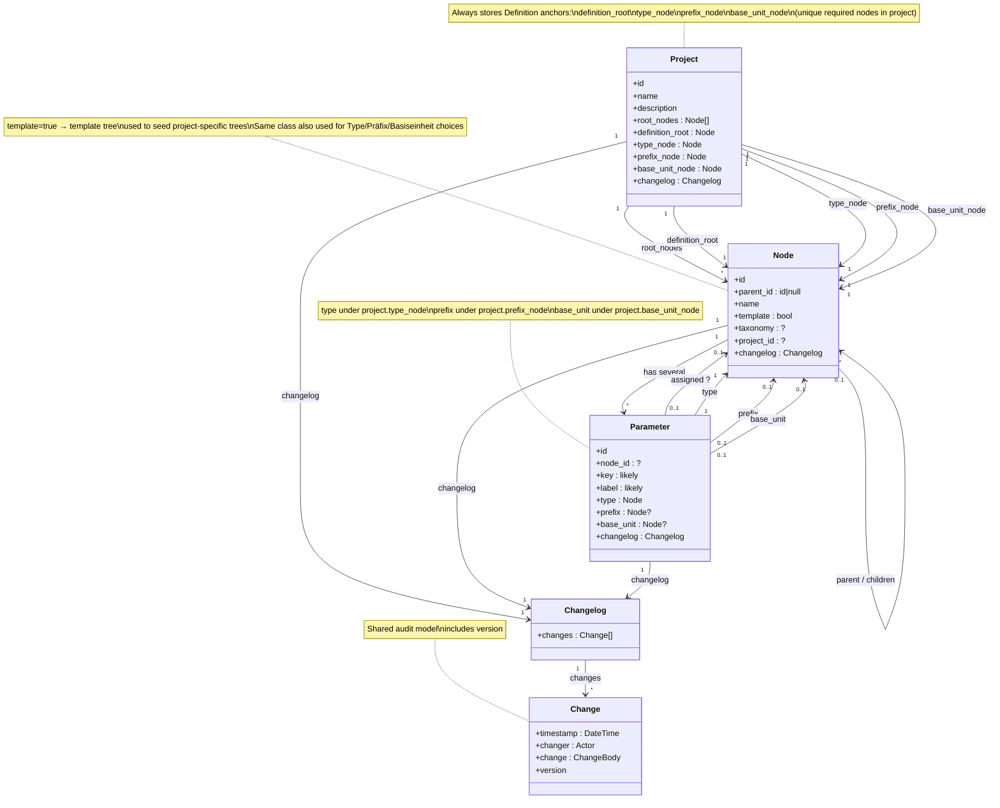
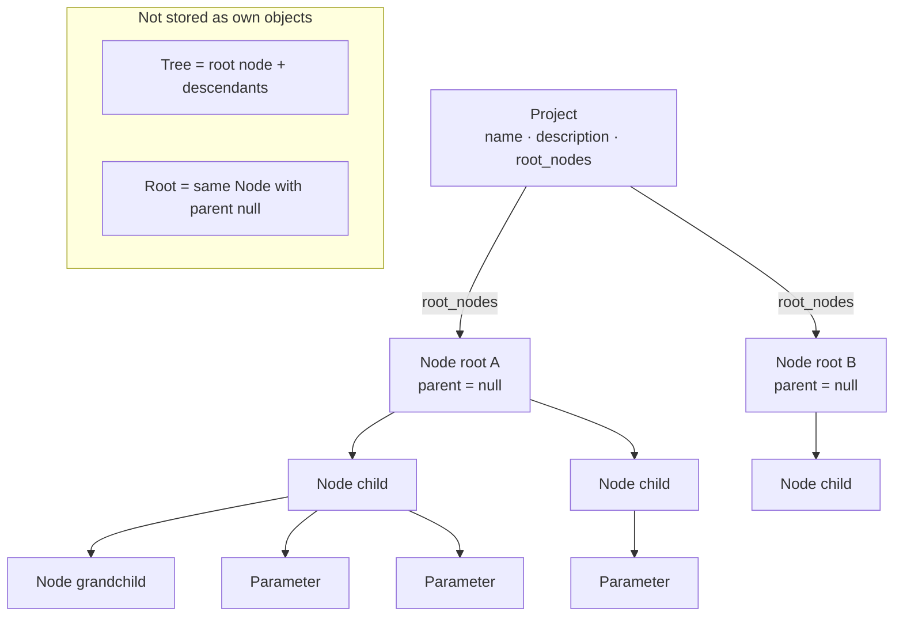
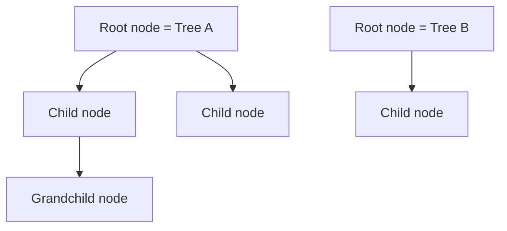
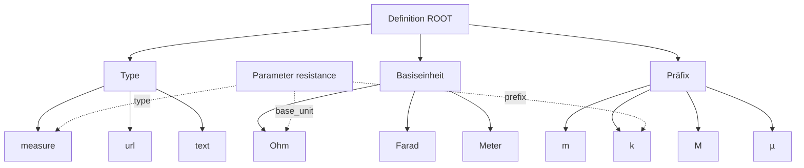
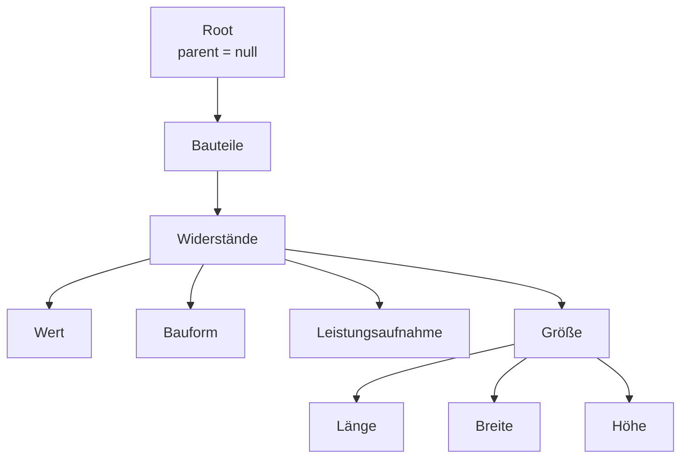
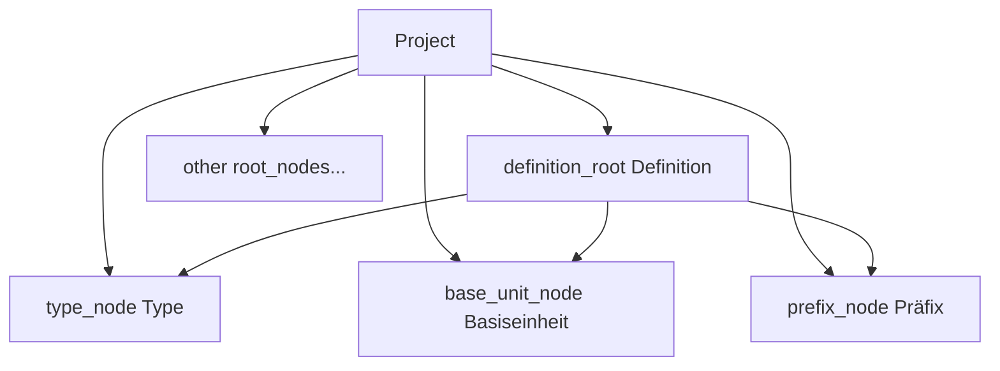

# Data structure: Project, Node, Parameter, Changelog

> Planning only. This document defines the conceptual data model. No plugin code yet.

## Current class diagram

> **Keep this section updated on every structure change.** After each change, also show this diagram in the chat reply.



**Legend:** Required Definition anchors live on **Project**. `Node.template` marks template trees. Parameter still picks concrete Type/Präfix/Basiseinheit **choice** nodes under those anchors.

## Core objects

| # | Object | Role |
|---|--------|------|
| 1 | **Node** | Hierarchy; Definition choices; may be marked `template` |
| 2 | **Parameter** | Built from `type`, optional `prefix`, optional `base_unit` (all Nodes) |
| 3 | **Project** | Holds trees + **required Definition anchors** |
| 4 | **Changelog** | History container (`changes`) |
| 5 | **Change** | One audit entry (when, who, what, version) |

### Shared audit idea (recommended)

Give **every** main domain object the same field:

```text
changelog: Changelog
```

`Changelog` **consists of** many `Change` entries. One shared pattern for Project, Node, and Parameter — do not invent different audit fields per entity.

In PHP (leaning): **composition**, not a deep inheritance tree.

```php
// Conceptual — not implemented
class Changelog {
	/** @var list<Change> */
	public array $changes;
}

class Change {
	public \DateTimeInterface $timestamp; // when (Zeitpunkt)
	public string $changer;               // who (Änderer) — exact type Q22
	public string $change;                // what (Änderung) — exact shape Q21
	public string $version;               // version — exact format Q23
}
```

Optional later: interface `Has_Changelog` with `changelog` so services can append entries uniformly.

### Not a separate object

| Concept | Status | Meaning |
|---------|--------|---------|
| **Tree** | **Not an object** | Defined by a **root node** (and all descendants reachable via child links) |
| **RootNode** | **Not an object** | Same as **Node** with parent `null` — only a role, not a type |
| **Template tree** | **Not a class** | A tree whose root (or node) has `template = true`; seeds project-specific trees |
| **ParameterType** (class) | **Not an object** | Parameter **type is a Node** (under Project.type_node) |
| **Unit** (class) | **Not an object** | Use **Präfix** + **Basiseinheit** Nodes instead |
| Forest | Derived view | Several trees (several roots) inside one project |



**Stored objects in this diagram:** `Project`, `Node`, `Parameter`  
**Derived only:** tree (from root node), root role (Node with `parent = null`)

**Agreed / tentative relations:**

- One node can have one parent (or none) and several children (or none). — **agreed**
- A **root node** is the **same object as a node** where the parent is `null` (not a separate type/entity). — **agreed**
- A **tree** is identified by its **root node** (no extra Tree entity). — **agreed**
- A **project** can consist of **different trees** (different root nodes). — **agreed**
- One node can have several parameters (or none). — **agreed**
- A **Parameter** is built from the Definition tree: **`type`** (required Node), optional **`prefix`**, optional **`base_unit`**. — **agreed**
- Every **Project** must have a **Definition tree** and must store anchors for **Type**, **Präfix**, and **Basiseinheit**. — **agreed**
- Those required Definition nodes are **unique per project** and are **stored on the Project**. — **agreed**
- Some trees are **template trees**; `template` is a **flag on Node**. — **agreed**
- Template trees can serve as templates for **project-specific trees**. — **agreed** (copy/instantiate mechanics still open — Q30)
- One parameter is always assigned to one node (?) — **tentative; decide later (Q14)**
- Every Project, Node, and Parameter has a **changelog**. — **agreed**
- Every **Change** has `timestamp`, `changer`, `change`, and **`version`**. — **agreed**

```text
Project ──(several trees)──► Root Node     # each tree = that root + descendants
Node ──(optional)──► parent Node
Node ──(several)──► child Nodes
Node ──(several)──► Parameter              # agreed
Parameter ──(one?)──► Node                 # unsure — Q14
```

---

## 1. Node

### Core idea

1. **One node can have a parent node** (or no parent).
2. **One node can have several child nodes** (or none).
3. **One node can have several parameters** (or none).
4. A **root node** is the **same object as a node** where the parent is `null` (not a different object type).
5. A **tree** is not stored as its own object: it is **defined by a root node** plus all descendants.



### Root node (definition)

| Term | Definition |
|------|------------|
| **Root node** | The **same Node object** with parent `null` (`parent_id = null`) |
| Non-root node | The **same Node object** with a non-null parent |

There is **no separate RootNode type**. “Root” is only a role/state of Node based on `parent_id`.
Being a root does not require children.

### Parent and children

| Rule | Meaning |
|------|---------|
| Optional parent | A node may have **one** parent node, or none |
| At most one parent | Never multiple parents |
| Several children | A node may have **zero or more** child nodes |
| Root | A root node is the same Node object with parent `null` (no separate type) |
| Child | A node whose parent is set is a child of that parent |

```text
Node ──(optional)──► parent Node
Node ◄──(many)────── child Nodes
Node ◄──(many)────── Parameters
```

### Tree (derived, not an object)

| Rule | Meaning |
|------|---------|
| No Tree table/entity | Do not model `Tree` as a first-class stored object |
| Defined by root | Tree = **root node** (node with no parent) + all descendants |
| Identity | Referring to a tree means referring to its **root node id** |
| Empty tree | A root with no children is still a tree of one node |

### Node fields

| Field | Required | Type (conceptual) | Meaning |
|-------|----------|-------------------|---------|
| `id` | yes | identifier | Stable identity of the node |
| `parent_id` | yes* | identifier \| `null` | Parent node; `null` = root (defines a tree) |
| `name` | yes | string | Display name of the node |
| `template` | yes | bool | `true` = this node heads/belongs to a **template** tree |
| `project_id` | ? | identifier | Optional reverse link — domain access is via `Project.root_nodes` (Q17) |
| `taxonomy` | ? | string | May map to WP taxonomy and/or align with project — confirm Q18 |
| `changelog` | yes | **Changelog** | History of changes on this node |

\* `parent_id` is always present as a value: either a valid parent id or `null`.

#### Planned optional Node fields (not decided yet)

| Field | Meaning | Status |
|-------|---------|--------|
| `slug` | URL/machine slug | open |
| `description` | Longer text | open |
| `count` | Assigned object count | open |
| `position` / `menu_order` | Explicit sibling order | open |
| `meta` | Extensible key/value bag | open |

### Node invariants

1. A node’s `parent_id`, when not `null`, must reference an existing node in the **same project** (and same taxonomy context if used).
2. A node must not be its own ancestor (no cycles).
3. Structure under each root remains a tree; a project’s roots form multiple trees.
4. Delete policies for children: **promote** or **cascade**.
5. Parameters related to a deleted node must follow a defined cleanup policy (TBD; depends on Q14).

### Example: trees from root nodes

```text
# Two trees inside one project — no Tree objects, only nodes:
{ id: 1, parent_id: null, name: "Passive Components", project_id: 100 }  # root → Tree A
{ id: 2, parent_id: 1,    name: "Resistors",          project_id: 100 }
{ id: 4, parent_id: null, name: "Semiconductors",     project_id: 100 }  # root → Tree B
```

- Tree A = node `1` + descendants.
- Tree B = node `4` + descendants.
- Nested `children` is a **view** derived from parent links, not a second source of truth.

---

## 2. Parameter

### Core idea

**Parameter** is a core object. Parameters describe configurable attributes related to nodes. Nodes form hierarchy; parameters describe attributes used with that hierarchy.

**Cardinality:**

| From | To | Cardinality | Status |
|------|----|-------------|--------|
| Node → Parameter | several | `0..n` | **agreed** |
| Parameter → Node | one? | `1` (?) | **tentative — decide later (Q14)** |

```text
Node ──(several)──► Parameter           # agreed
Parameter ──(one?)──► Node              # unsure
```

Do **not** hard-assume a single owning `node_id` until Q14 is closed.

### Parameter fields (initial — to refine)

| Field | Required | Type (conceptual) | Meaning |
|-------|----------|-------------------|---------|
| `id` | yes | identifier | Stable identity of the parameter |
| `node_id` | ? | identifier | Owning node — **only if** “one parameter → one node” is confirmed |
| `key` | likely | string | Machine key (stable in code/APIs) |
| `label` | likely | string | Human-readable name |
| `type` | **yes** | **Node** | From Definition → **Type** (e.g. `measure`, `url`) |
| `prefix` | **optional** | **Node** \| `null` | From Definition → **Präfix** (e.g. `k`, `m`) |
| `base_unit` | **optional** | **Node** \| `null` | From Definition → **Basiseinheit** (e.g. `Ohm`) |
| `changelog` | yes | **Changelog** | History of changes on this parameter |

**Rule:** A Parameter **uses** three kinds of definition nodes:

| Field | Source branch | Required? |
|-------|---------------|-----------|
| `type` | Type | yes |
| `prefix` | Präfix | no |
| `base_unit` | Basiseinheit | no |

```php
// Conceptual — not implemented
class Parameter {
	public string $id;
	public Node $type;           // e.g. measure / url
	public ?Node $prefix;        // e.g. k (kilo) — optional
	public ?Node $base_unit;     // e.g. Ohm — optional
	public Changelog $changelog;
}

// Display idea for a measure value (value storage still Q16):
// "10" + prefix "k" + base_unit "Ohm"  =>  "10 kOhm"
```

Whether `prefix`/`base_unit` are allowed or required depends on `type` (Q24).

#### Fields still to define

| Topic | Status |
|-------|--------|
| Whether every parameter has exactly one owning node | open (?) — Q14 |
| Required / default / validation rules | open |
| Inheritance to child nodes | open |
| Which types require prefix and/or base_unit | open — Q24 |
| May prefix exist without base_unit (or vice versa)? | open — Q29 |
| Storage | open — Q15 |
| Whether parameter *values* live in this plugin | open — Q16 |
| Parameter cleanup when a related node is deleted | open |

### Example thinking tree: Definition

Planning aid — Parameter picks Nodes from this tree.  
Root **Definition**; children **Type**, **Basiseinheit**, **Präfix**.



```text
Definition
├── Type
│   ├── measure
│   ├── url
│   └── text
├── Basiseinheit
│   ├── Ohm
│   ├── Farad
│   └── Meter
└── Präfix
    ├── m
    ├── k
    ├── M
    └── µ
```

**Parameter examples using this tree** (anchors also stored on Project):

```text
Project.definition_root = Definition
Project.type_node = Type
Project.prefix_node = Präfix
Project.base_unit_node = Basiseinheit

Parameter {
  key: "resistance",
  type: Node("measure"),      # under project.type_node
  prefix: Node("k"),          # under project.prefix_node
  base_unit: Node("Ohm")      # under project.base_unit_node
}
# with value 10  =>  "10 kOhm"

Parameter {
  key: "datasheet",
  type: Node("url"),
  prefix: null,
  base_unit: null
}
```

Open: exact validation rules when type is `measure` vs `url` (Q24, Q29).

### Example thinking tree: Bauteile / Widerstände

Second planning aid — a **project-specific catalog tree** (not the Definition tree).  
Shows hierarchy where leaf-ish nodes can carry Parameters (Wert, Bauform, …).



```text
Root                                    ← root node (defines this tree)
└── Bauteile
    └── Widerstände
        ├── Wert
        ├── Bauform
        ├── Leistungsaufnahme
        └── Größe
            ├── Länge
            ├── Breite
            └── Höhe
```

**Thinking notes (not locked):**

| Node | Possible role |
|------|----------------|
| `Widerstände` | Category node; may have several Parameters |
| `Wert` | Parameter on Widerstände — e.g. type=`measure`, prefix=`k`, base_unit=`Ohm` |
| `Bauform` | Parameter — e.g. type=`text` or enum-like choices |
| `Leistungsaufnahme` | Parameter — measure + Watt base unit |
| `Größe` | Group node for dimension Parameters |
| `Länge` / `Breite` / `Höhe` | Parameters under Größe — measure + Meter (+ optional prefix) |

`Root` / `Bauteile` would appear in `Project.root_nodes` (or Root alone if Bauteile is not a root).  
This tree is typically **not** `template` (unless reused as a template catalog).

### What a Parameter is not (until decided otherwise)

- Not a Node / not a Project.
- Not a Tree object.
- Not necessarily a filled-in value on a part/post.
- Not necessarily single-owner only — still **?** (Q14).

---

## 3. Project

### Core idea

**Project** holds:

1. All project trees via `root_nodes`
2. **Required Definition anchors** (unique nodes that must exist so Parameters can be created)
3. Optional other roots (catalog trees, template roots, etc.)

A **Definition tree must always exist**. Inside it (or referenced from Project), these nodes **must** exist and are stored on the Project:

| Anchor on Project | Node meaning |
|-------------------|--------------|
| `definition_root` | Root of the Definition tree |
| `type_node` | **Type** branch node (children = selectable types) |
| `prefix_node` | **Präfix** branch node (children = prefixes) |
| `base_unit_node` | **Basiseinheit** branch node (children = base units) |



### Required vs other nodes

| Kind | Unique in project? | Must exist? | Stored where |
|------|--------------------|-------------|--------------|
| Definition root | yes | yes | `Project.definition_root` |
| Type / Präfix / Basiseinheit anchors | yes each | yes | `Project.type_node` / `prefix_node` / `base_unit_node` |
| Type choices (measure, url, …) | no | as needed | children of `type_node` |
| Catalog / domain trees | no | no | `root_nodes` |
| Template trees | no | no | `root_nodes` with `Node.template = true` |

### Template trees

Some trees are **templates** for project-specific trees.

- `Node.template : bool` — flag on the node (typically set on the template root; whether children inherit is Q31)
- Template trees can be copied/instantiated into normal project trees
- Definition anchors may themselves come from a template (Q32)

### Project fields (agreed so far)

| Field | Required | Type (conceptual) | Meaning |
|-------|----------|-------------------|---------|
| `id` | yes | identifier | Stable identity of the project |
| `name` | yes | string | Display name of the project |
| `description` | yes* | string | Longer text describing the project |
| `root_nodes` | yes | list of **Node** | All root nodes (Definition + others) |
| `definition_root` | yes | **Node** | Required Definition tree root |
| `type_node` | yes | **Node** | Required Type anchor |
| `prefix_node` | yes | **Node** | Required Präfix anchor |
| `base_unit_node` | yes | **Node** | Required Basiseinheit anchor |
| `changelog` | yes | **Changelog** | History of changes on this project |

\* `description` may be empty string, but the field exists on the class.

#### Conceptual PHP class (planning sketch — not implemented)

```php
class Project {
	public string $id;
	public string $name;
	public string $description;
	/** @var list<Node> */
	public array $root_nodes;
	public Node $definition_root; // must always exist
	public Node $type_node;       // must always exist
	public Node $prefix_node;     // must always exist
	public Node $base_unit_node;  // must always exist
	public Changelog $changelog;
}

class Node {
	public string $id;
	public ?string $parent_id;
	public string $name;
	public bool $template; // template tree marker
	public Changelog $changelog;
}
```

Invariants (leaning):

1. `definition_root.parent_id === null`
2. `type_node`, `prefix_node`, `base_unit_node` are children of `definition_root` (Q26)
3. Creating a Parameter requires these anchors to exist on the Project
4. `Parameter.type` should be a descendant/child of `project.type_node` (same for prefix/base_unit)

#### Fields / topics still to define

| Topic | Status |
|-------|--------|
| Relation to WordPress taxonomy | open — Q18 |
| Storage for Project / anchors | open — Q19 |
| Template copy/instantiate behavior | open — Q30 |
| Does `template` inherit to children? | open — Q31 |
| Is Definition itself a template tree? | open — Q32 |
| id type (int vs string/UUID) | open |

### Example (conceptual)

```text
Project {
  id: 100,
  name: "Electronic parts catalog",
  description: "...",
  definition_root: Node(1, "Definition"),
  type_node: Node(10, "Type"),
  prefix_node: Node(30, "Präfix"),
  base_unit_node: Node(20, "Basiseinheit"),
  root_nodes: [
    Node(1, "Definition", template: true?),   # required definition tree
    Node(200, "Passive Components"),          # project-specific catalog tree
    Node(300, "Unit pack SI", template: true) # template tree for reuse
  ]
}
```

---

## 4. Changelog and Change

### Core idea

Every auditable domain object carries a **Changelog**.  
A Changelog **consists of** **Change** entries.

| Object | Field |
|--------|--------|
| Project | `changelog` |
| Node | `changelog` |
| Parameter | `changelog` |

### Change fields (agreed skeleton)

| Field | German intent | Required | Meaning |
|-------|---------------|----------|---------|
| `timestamp` | Zeitpunkt | yes | When the change happened |
| `changer` | Änderer | yes | Who made the change |
| `change` | Änderung | yes | What changed |
| `version` | Version | yes | Version associated with this change |

```php
// Conceptual — not implemented
class Changelog {
	/** @var list<Change> */
	public array $changes;
}

class Change {
	public \DateTimeInterface $timestamp;
	public string $changer; // refine type in Q22
	public string $change;  // refine payload in Q21
	public string $version; // refine format in Q23 (e.g. semver string vs int)
}
```

### Planning notes / open detail

| Topic | Status |
|-------|--------|
| Is `change` plain text, structured JSON diff, or both? | open — Q21 |
| Is `changer` WP user id, login, display name, or value object? | open — Q22 |
| Format of Change.`version` (semver string, integer, object version) | open — Q23 |
| Append-only history? | leaning yes |
| Store changelog embedded on the object vs central changes table | open — part of storage questions |
| System/automated changes (importer, migration) as changer | open |

### Example

```text
Node { id: 2, name: "Resistors", parent_id: 1, changelog: Changelog {
  changes: [
    Change { timestamp: "2026-07-23T10:00:00Z", changer: "admin", change: "Created node", version: "0.0.1" },
    Change { timestamp: "2026-07-23T11:15:00Z", changer: "admin", change: "Renamed to Resistors", version: "0.0.2" }
  ]
}}
```

---

## Object summary

| Object / concept | Stored object? | Primary job |
|------------------|----------------|-------------|
| **Project** | yes | Trees + required Definition anchors + changelog |
| **Node** | yes | Hierarchy; `template` flag; changelog |
| **Parameter** | yes | `type` + optional `prefix` + optional `base_unit`; changelog |
| **ParameterType** / **Unit** (classes) | **no** | Use Nodes under Project type/prefix/base_unit anchors |
| **Template tree** | **no class** | `Node.template = true` |
| **Changelog** | yes (embedded or related) | Container of `changes` |
| **Change** | yes (inside changelog) | timestamp + changer + change + version |
| **Tree** | **no** | Derived from a root node + descendants |
| **RootNode** | **no** | Role of Node when parent is null |

## PHP representation (planning)

Question: should domain objects be PHP **classes**, or is there a better fit?

### Options

| Approach | Pros | Cons | Fit for this project |
|----------|------|------|----------------------|
| **Typed PHP classes / DTOs** (`Project`, `Node`, `Parameter`) | Clear model, type hints, IDE support, matches modern PHP 8.x + OOP rules | Slightly more files | **Best default** |
| **Readonly classes** (PHP 8.2+) or readonly properties (8.1+) | Immutable data carriers; safe to pass around | Needs PHP 8.1+/8.2+ (already planned) | Excellent for DTOs |
| Associative arrays only | Familiar in older WP code; easy JSON | Weak typing; easy to misuse keys; hard to document invariants | Poor as primary model |
| `stdClass` | Quick | Almost no safety | Avoid |
| Use `WP_Term` (etc.) directly everywhere | Less mapping | Leaks storage into domain; awkward for Project/Parameter | Use only at storage boundary |

### Recommendation (leaning — Q20)

Use **small typed PHP classes** for the domain objects:

- `Project`
- `Node` (root = same class with `parent_id === null`; **no** `RootNode` class)
- `Parameter`
- `Changelog` / `Change` (shared audit DTOs composed into the objects above)

Prefer **immutable / readonly-style DTOs** for data carried between layers. Put behavior (load tree, delete promote/cascade, build children view) in **services** (e.g. `Tree_Service`, `Project_Repository`), not fat entity classes.

```text
HTTP / Admin UI
      ↓
  Services / Repositories   ← WordPress APIs, $wpdb, mapping
      ↓
  DTO classes: Project, Node, Parameter
```

Arrays/JSON remain fine at the **edge** (REST responses, `wp_localize_script`), mapped to/from these classes.

**Do not** introduce a `Tree` or `RootNode` class as a stored type; tree/root stay derived concepts on `Node`.

Final choice tracked as **Q20** until explicitly accepted.


| Conceptual field | Likely WordPress mapping |
|------------------|--------------------------|
| Node `id` | term id (leaning) or custom — Q11 |
| Node `parent_id` | term parent / custom parent |
| Project | custom post type, custom table, or taxonomy — **TBD Q19** |
| Parameter body | term meta / custom table / host — **TBD Q15** |

## Open points

See [`docs/OPEN-QUESTIONS.md`](../OPEN-QUESTIONS.md) (Q11–Q19).

## Next planning step

Clarify Project persistence for `root_nodes` (Q19) and taxonomy mapping (Q18). Still planning only — no implementation.
