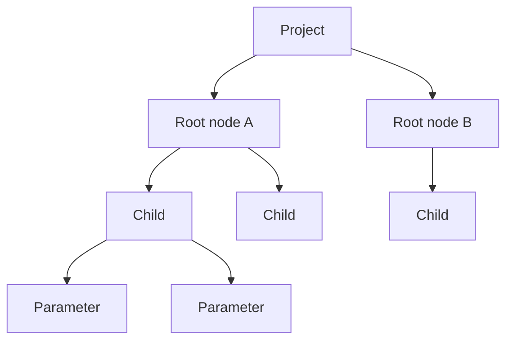
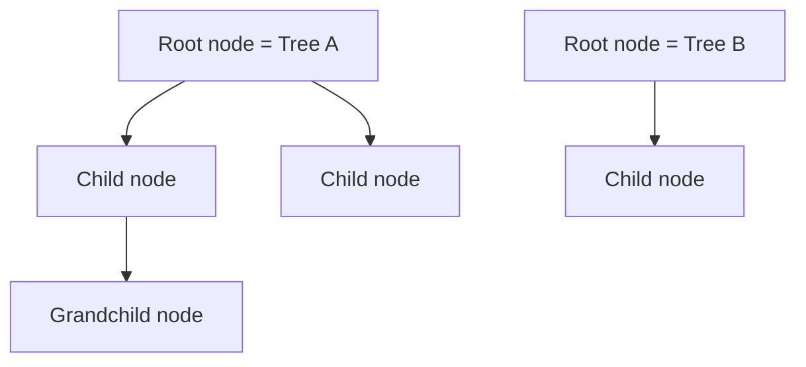
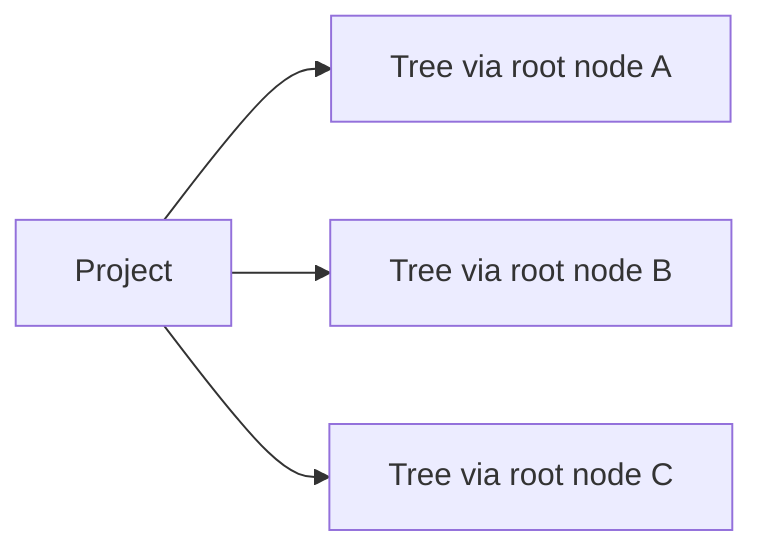

# Data structure: Project, Node, Parameter

> Planning only. This document defines the conceptual data model. No plugin code yet.

## Core objects

| # | Object | Role |
|---|--------|------|
| 1 | **Node** | Hierarchy unit (parent/children) |
| 2 | **Parameter** | Attribute definition related to nodes |
| 3 | **Project** | Container that can consist of different trees |

### Not a separate object

| Concept | Status | Meaning |
|---------|--------|---------|
| **Tree** | **Not an object** | Defined by a **root node** (and all descendants reachable via child links) |
| Forest | Derived view | Several trees (several roots), e.g. inside one project |



**Agreed / tentative relations:**

- One node can have one parent (or none) and several children (or none). — **agreed**
- A **tree** is identified by its **root node** (no extra Tree entity). — **agreed**
- A **project** can consist of **different trees** (different root nodes). — **agreed**
- One node can have several parameters (or none). — **agreed**
- One parameter is always assigned to one node (?) — **tentative; decide later (Q14)**

```text
Project ──(several trees)──► Root Node     # each tree = that root + descendants
Node ──(optional)──► parent Node
Node ──(several)──► child Nodes
Node ──(several)──► Parameter              # agreed
Parameter ──(one?)──► Node                 # unsure — Q14
```

---

## 1. Node

### Core idea

1. **One node can have a parent node** (or no parent).
2. **One node can have several child nodes** (or none).
3. **One node can have several parameters** (or none).
4. A node with **no parent** is a **root node**.
5. A **tree** is not stored as its own object: it is **defined by a root node** plus all descendants.



### Parent and children

| Rule | Meaning |
|------|---------|
| Optional parent | A node may have **one** parent node, or none |
| At most one parent | Never multiple parents |
| Several children | A node may have **zero or more** child nodes |
| Root | A node with **no parent** is a root (and thus defines a tree) |
| Child | A node whose parent is set is a child of that parent |

```text
Node ──(optional)──► parent Node
Node ◄──(many)────── child Nodes
Node ◄──(many)────── Parameters
```

### Tree (derived, not an object)

| Rule | Meaning |
|------|---------|
| No Tree table/entity | Do not model `Tree` as a first-class stored object |
| Defined by root | Tree = root node + all nodes that have that root as ancestor |
| Identity | Referring to a tree means referring to its **root node id** |
| Empty tree | A root with no children is still a tree of one node |

### Node fields

| Field | Required | Type (conceptual) | Meaning |
|-------|----------|-------------------|---------|
| `id` | yes | identifier | Stable identity of the node |
| `parent_id` | yes* | identifier \| `null` | Parent node; `null` = root (defines a tree) |
| `name` | yes | string | Display name of the node |
| `project_id` | likely | identifier | Project this node belongs to — confirm Q17 |
| `taxonomy` | ? | string | May map to WP taxonomy and/or align with project — confirm Q18 |

\* `parent_id` is always present as a value: either a valid parent id or `null`.

#### Planned optional Node fields (not decided yet)

| Field | Meaning | Status |
|-------|---------|--------|
| `slug` | URL/machine slug | open |
| `description` | Longer text | open |
| `count` | Assigned object count | open |
| `position` / `menu_order` | Explicit sibling order | open |
| `meta` | Extensible key/value bag | open |

### Node invariants

1. A node’s `parent_id`, when not `null`, must reference an existing node in the **same project** (and same taxonomy context if used).
2. A node must not be its own ancestor (no cycles).
3. Structure under each root remains a tree; a project’s roots form multiple trees.
4. Delete policies for children: **promote** or **cascade**.
5. Parameters related to a deleted node must follow a defined cleanup policy (TBD; depends on Q14).

### Example: trees from root nodes

```text
# Two trees inside one project — no Tree objects, only nodes:
{ id: 1, parent_id: null, name: "Passive Components", project_id: 100 }  # root → Tree A
{ id: 2, parent_id: 1,    name: "Resistors",          project_id: 100 }
{ id: 4, parent_id: null, name: "Semiconductors",     project_id: 100 }  # root → Tree B
```

- Tree A = node `1` + descendants.
- Tree B = node `4` + descendants.
- Nested `children` is a **view** derived from parent links, not a second source of truth.

---

## 2. Parameter

### Core idea

**Parameter** is a core object. Parameters describe configurable attributes related to nodes. Nodes form hierarchy; parameters describe attributes used with that hierarchy.

**Cardinality:**

| From | To | Cardinality | Status |
|------|----|-------------|--------|
| Node → Parameter | several | `0..n` | **agreed** |
| Parameter → Node | one? | `1` (?) | **tentative — decide later (Q14)** |

```text
Node ──(several)──► Parameter           # agreed
Parameter ──(one?)──► Node              # unsure
```

Do **not** hard-assume a single owning `node_id` until Q14 is closed.

### Parameter fields (initial — to refine)

| Field | Required | Type (conceptual) | Meaning |
|-------|----------|-------------------|---------|
| `id` | yes | identifier | Stable identity of the parameter |
| `node_id` | ? | identifier | Owning node — **only if** “one parameter → one node” is confirmed |
| `key` | likely | string | Machine key (stable in code/APIs) |
| `label` | likely | string | Human-readable name |
| `type` | likely | string / enum | Parameter type (exact type set TBD) |

#### Fields still to define

| Topic | Status |
|-------|--------|
| Whether every parameter has exactly one owning node | open (?) — Q14 |
| Required / default / validation rules | open |
| Inheritance to child nodes | open |
| Allowed type list (text, number, measure, …) | open |
| Storage | open — Q15 |
| Whether parameter *values* live in this plugin | open — Q16 |
| Parameter cleanup when a related node is deleted | open |

### Example (conceptual)

```text
Node { id: 2, name: "Resistors", parent_id: 1, project_id: 100 }
  ├─ Parameter { id: 10, key: "resistance", label: "Resistance", type: "measure" }
  └─ Parameter { id: 11, key: "tolerance",  label: "Tolerance",  type: "text" }
```

### What a Parameter is not (until decided otherwise)

- Not a Node / not a Project.
- Not a Tree object.
- Not necessarily a filled-in value on a part/post.
- Not necessarily single-owner only — still **?** (Q14).

---

## 3. Project

### Core idea

**Project** is a core object. A project can consist of **different trees**. Because a tree is not an extra object, that means a project groups **one or more root nodes** (each root defining a tree).



| Rule | Meaning |
|------|---------|
| Container | Project groups trees used together |
| Trees in a project | Different root nodes belonging to the project |
| No Tree entity | Project does not point to Tree ids; it relates to **root nodes** (directly or via nodes’ `project_id`) |

### Project fields (initial — to refine)

| Field | Required | Type (conceptual) | Meaning |
|-------|----------|-------------------|---------|
| `id` | yes | identifier | Stable identity of the project |
| `name` | yes | string | Display name of the project |

#### Fields still to define

| Topic | Status |
|-------|--------|
| How nodes/roots are assigned to a project | open — Q17 |
| Relation to WordPress taxonomy (1:1, many, none) | open — Q18 |
| Project description, slug, owner, status | open |
| Storage for Project | open — Q19 |

### Example (conceptual)

```text
Project { id: 100, name: "Electronic parts catalog" }
  ├─ Tree (root node 1 "Passive Components") → child "Resistors" → …
  └─ Tree (root node 4 "Semiconductors") → …
```

---

## Object summary

| Object / concept | Stored object? | Primary job |
|------------------|----------------|-------------|
| **Project** | yes | Groups different trees (via root nodes) |
| **Node** | yes | Hierarchy; root node defines a tree |
| **Parameter** | yes | Attribute definition related to nodes |
| **Tree** | **no** | Derived from a root node + descendants |

## Storage mapping (leaning, not final)

| Conceptual field | Likely WordPress mapping |
|------------------|--------------------------|
| Node `id` | term id (leaning) or custom — Q11 |
| Node `parent_id` | term parent / custom parent |
| Project | custom post type, custom table, or taxonomy — **TBD Q19** |
| Parameter body | term meta / custom table / host — **TBD Q15** |

## Open points

See [`docs/OPEN-QUESTIONS.md`](../OPEN-QUESTIONS.md) (Q11–Q19).

## Next planning step

Clarify how Project assigns/owns root nodes (Q17) and how Project maps to WordPress (Q18–Q19). Still planning only — no implementation.
