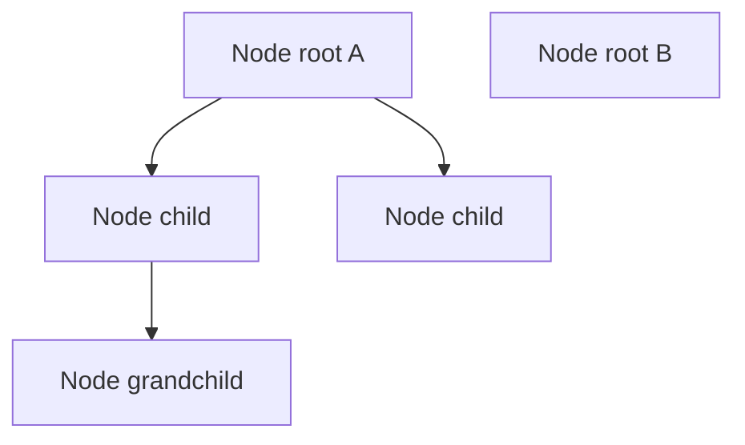

# Data structure: Nodes

> Planning only. This document defines the conceptual data model. No plugin code yet.

## Core idea

The taxonomy tree is a set of **nodes**.

- Every entry in the tree is a **Node**.
- Nodes form a **rooted forest** (one or more root nodes, each with optional descendants).
- A node may have **at most one parent**.
- A node may have **many children**.
- Cycles are forbidden.



## Entity: Node

Conceptual record (field names are planning English; final PHP/JS names TBD):

| Field | Required | Type (conceptual) | Meaning |
|-------|----------|-------------------|---------|
| `id` | yes | identifier | Stable identity of the node |
| `parent_id` | yes* | identifier \| `null` | Parent node; `null` = root |
| `name` | yes | string | Display name of the node |
| `taxonomy` | yes | string | Which hierarchical taxonomy this node belongs to |

\* `parent_id` is always present as a value: either a valid parent id or `null`.

### Planned optional fields (not decided yet)

| Field | Meaning | Status |
|-------|---------|--------|
| `slug` | URL/machine slug | open — likely yes for WP terms |
| `description` | Longer text | open |
| `count` | Assigned object count (WP term count or host-defined) | open |
| `position` / `menu_order` | Explicit sibling order | open — may be later than MVP |
| `meta` | Extensible key/value bag for hosts | open — prefer host-owned meta later |

## Relations

| Relation | Cardinality | Rules |
|----------|-------------|-------|
| Node → parent | 0..1 | Root has none; every non-root has exactly one parent |
| Node → children | 0..n | Ordered list of direct children (order rule TBD) |
| Node → ancestors | 0..n | Path from parent up to root; no duplicates |
| Node → descendants | 0..n | Full subtree excluding self |

### Invariants

1. A node’s `parent_id`, when not `null`, must reference an existing node in the **same** `taxonomy`.
2. A node must not be its own ancestor (no cycles).
3. Deleting a node must follow a defined policy for children:
   - **promote** — children get the deleted node’s `parent_id`
   - **cascade** — children (and their descendants) are deleted too
4. Moving/reparenting (if allowed later) must preserve invariants 1–2.

## Tree shapes used in the product

### Flat list (storage / transfer)

Useful for APIs and DB-like payloads:

```text
[
  { id: 1, parent_id: null, name: "Passive Components", taxonomy: "part_category" },
  { id: 2, parent_id: 1,    name: "Resistors",          taxonomy: "part_category" },
  { id: 3, parent_id: 2,    name: "SMD 0805",           taxonomy: "part_category" }
]
```

### Nested tree (UI)

Useful for rendering:

```text
[
  {
    id: 1,
    parent_id: null,
    name: "Passive Components",
    taxonomy: "part_category",
    children: [
      {
        id: 2,
        parent_id: 1,
        name: "Resistors",
        taxonomy: "part_category",
        children: [
          { id: 3, parent_id: 2, name: "SMD 0805", taxonomy: "part_category", children: [] }
        ]
      }
    ]
  }
]
```

The nested `children` array is a **view** of the same nodes, not a second source of truth.

## What a Node is not (MVP)

- Not a post/part record.
- Not a property schema (measure, enum, etc.).
- Not a user or capability object.
- Not an edge in a general graph (only tree parent/child).

Host plugins may attach extra data **to** a node (for example term meta on the underlying term) without putting domain fields into the core Node contract.

## Storage mapping (leaning, not final)

| Conceptual Node field | Likely WordPress mapping |
|-----------------------|--------------------------|
| `id` | term id (`wp_terms.term_id`) |
| `parent_id` | `wp_term_taxonomy.parent` (`0` in DB ↔ `null` in model) |
| `name` | `wp_terms.name` |
| `taxonomy` | `wp_term_taxonomy.taxonomy` |
| `slug` (if included) | `wp_terms.slug` |

MVP leaning: **no custom node table** — nodes are a model over hierarchical terms. Final decision tracked as open question **Q11**.

## Open points for this data structure

See also [`docs/OPEN-QUESTIONS.md`](../OPEN-QUESTIONS.md):

- Confirm required vs optional fields above.
- Sibling order: WordPress default order vs explicit `position`.
- Whether `count` belongs on the core Node DTO for the admin UI.
- Whether Node `id` is always the WP term id or a plugin-owned id (leaning: term id).

## Next planning step

Extend this document as we add more structure (for example selection state, delete requests, or host extension payloads). Still planning only — no implementation.
