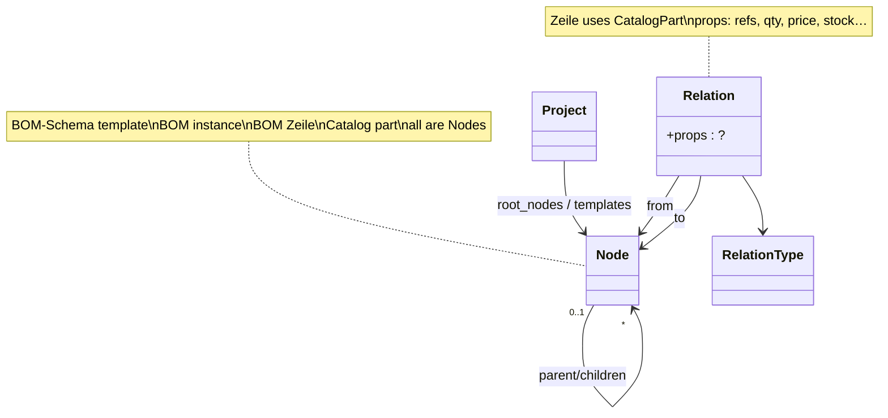
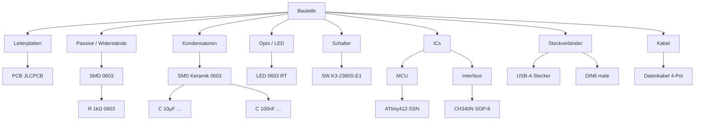

# Example projects (planning)

> Walk concrete host projects along the model.  
> **WP Taxonomy Tree** = tree environment + definitions (types, relations, …).  
> **Host plugin** = domain apps (BOM lists, hardware benchmarks, builds, stats, …).

Open questions stay open — examples only show **fit**, **host territory**, or **gaps**.

---

## Example A — BOM (Bill of Materials)

### Story (user wording, condensed)

Website with projects. A user wants to build **BOM lists** of electronic parts.

| Aspect | Detail |
|--------|--------|
| BOM line | 1…N **references** (designators on a board) + a chosen **part** (Widerstand, Kondensator, IC, Buchse, …) + **Bauform** (SMD, TH, …) + **quantity** (from reference count) + **description** + **price** + **in stock?** |
| Part pick | From a **category tree** of possible parts |
| Part data | Parts already carry properties: Größe, Wert, Datenblatt-Link, Leistung, … |
| BOM footer | Part count + **price sum** |
| Compare | Find/compare lists that share the same parts |
| Export | Request sheets / CSV for Digikey, Conrad, AliExpress, … |

### Fit vs current model

| Need | Fits in **WP Taxonomy Tree**? | Where it lives |
|------|-------------------------------|----------------|
| Category / part **tree** to browse and select | **Yes** | `Project` + Nodes (Bauteile tree / Definitionsbaum branches) |
| Part **properties** (Wert, Maße, Leistung, URL Datenblatt, Bauform enum, …) | **Mostly yes (definitions)** | Type catalog (`quantity`, `url`, `enum`, …); Relations `consists_of` / attributes; filled values still Q16 |
| Selecting a part from the tree into a BOM line | **Yes (extension)** | Tree selection + host listens (UC-07 style side panel / action) |
| BOM **list** entity (one list per project/board) | **No — host** | Host CPT/table (out of scope for early taxonomy-tree versions) |
| BOM **line**: references, qty, price, stock flag, description | **No — host** | Host line model; qty derived from reference count |
| Price sum / line totals | **No — host** | Host calculation |
| Compare lists by shared parts | **No — host** | Host search/query |
| Supplier CSV (Digikey, Conrad, …) | **No — host** | Host exporters / adapters |
| Definitionsbaum Type / Präfix / Basiseinheit for quantities | **Yes** | Required Project anchors |

### Boundary sketch

```text
┌─────────────────────────────────────────────┐
│ WP Taxonomy Tree (this plugin)              │
│  Project                                    │
│  └─ Definitionsbaum / Bauteile tree (Nodes) │
│  └─ Types, Präfix, Basiseinheit            │
│  └─ Part nodes + consists_of attributes     │
│  └─ Tree UI: browse / select / manage       │
│  └─ Hooks: “node selected” → host           │
└──────────────────┬──────────────────────────┘
                   │ selection / part id
                   ▼
┌─────────────────────────────────────────────┐
│ Host: BOM / electronic parts                │
│  BOM list(s) per website project            │
│  BOM lines: refs[], part→Node/part,         │
│             bauform, qty, desc, price, stock│
│  Totals, compare lists, supplier CSV        │
└─────────────────────────────────────────────┘
```

### What this example stresses (still open — do not decide here)

| Topic | Why BOM cares | Open ref |
|-------|---------------|----------|
| Part pick from tree | Core UX of the environment | UC-01, UC-04, UC-07 |
| Quantity + URL + enum on parts | Need Type catalog | Q36–Q39 |
| Attributes on part nodes | consists_of vs Parameter-as-Node | Q33–Q35, Q42 |
| Filled values on the part | BOM shows Wert/Maße already on the part | Q16 |
| Project vs WP taxonomy | One website “project” vs our Project | Q18–Q19 |
| Host extension contract | Add-to-BOM on select | Q8–Q9 |

### Verdict for Example A

**Still fits** the intended split: taxonomy-tree owns the **part tree + property definitions (+ selection UX)**; BOM lists, money, stock, compare, and supplier CSV stay in the **host**.  
**No model break yet** — confirms the plugin should stay a **tree environment**, not a BOM app.  
For “same 100 Ω, different package/shunt” confusion see [`part-identity-layers.md`](part-identity-layers.md).

### Concrete BOM sample (worked)

User-provided list (line prices sum to **6,00 €**; multi-ref lines use **line total** in Preis):

| Bauteil (refs) | Größe | Anzahl | Beschreibung | Preis € | Stock |
|----------------|-------|--------|--------------|---------|-------|
| Platine | 1 | 1 | Meine sind von JLCPCB | 1,50 | x |
| C2 | 10u, 0603 | 1 | Kondensator SMD CL10A106MA8NRNC | 0,10 | x |
| C1, C3, C4 | 100n, 0603 | 3 | Kondensator SMD CC0603KRX7R9BB104 | 0,30 | x |
| LED1 | LED0603 | 1 | Power LED Rot KT-0603R | 0,20 | x |
| R1, R2 | 1K, 0603 | 2 | Widerstand SMD | 0,20 | x |
| SW1 | SW-SMD_K3-2380S-E1 | 1 | SMD Schalter … | 0,20 | x LCSC |
| U1 | AT-Tiny 412-SSN, SOP-8_150MIL | 1 | Atmel-Tiny 412-SSN | 1,40 | x LCSC |
| U2 | CH430N, SOP-8_150MIL | 1 | USB – Serial Treiber | 0,40 | x LCSC |
| USB1 | USB A, Stecker | 1 | USB A Anschlussstecker | 0,20 | x |
| X1 | Din rund 6 Pol, male | 1 | DIN6 Rund Stecker | 1,00 | x |
| X2 | Kabel, 4 Pol | **0,5 m** | Datenkabel für Stecker X1 | 0,50 | x |
| | | **14*** | **Summe** | **6,00** | |

\* “14” is the user’s Bauteile-Gesamt; with length line X2 the host must define whether Gesamt counts lines, refs, or pieces only.

#### Host BOM — two views

**View 1 (earlier):** dedicated host classes `BomList` / `BomLine` (convenient for one app).

**View 2 (gap fill — preferred direction, Q46):** BOM is **configured as Nodes** — same as Recipe / other domains. No required `BomList` class in the core model.



Concrete sample still maps the same way — only the *carrier* changes:

| Sample line | As Nodes |
|-------------|----------|
| BOM whole | Node `BOM Platine XY` (instance of BOM-Schema) |
| C1,C3,C4 row | Child/related Node `Zeile` + Relation `uses` → cap leaf + props |
| X2 0.5 m | Zeile with quantity qty on Relation/props |
| Catalog leaf | Existing Bauteile tree node |

Schema template (configurable once):

```text
BOM-Schema (template)
└── Zeile   ← ordered siblings (position / Q13)
      ├── Referenzen, Menge, Beschreibung, Preis, Stock  (attribute slots)
      └── uses → CatalogPart
```

Row order in the user’s table is meaningful (Platine, then C2, then C1/C3/C4, …). With Zeilen as Nodes that order must be stored — **not** derived from name.

#### Mapping of the sample lines

| Line | references | quantity | catalog part (leaf idea) |
|------|------------|----------|---------------------------|
| Platine | `[]` or `["PCB"]` | count 1 | PCB / JLCPCB fabric panel |
| C2 | C2 | 1 | Cap 10 µF 0603 CL10A106MA8NRNC |
| C1,C3,C4 | C1,C3,C4 | 3 (= #refs) | Cap 100 nF 0603 CC0603KRX7R9BB104 |
| LED1 | LED1 | 1 | LED red 0603 KT-0603R |
| R1,R2 | R1,R2 | 2 | Resistor 1 kΩ 0603 (generic SMD) |
| SW1 | SW1 | 1 | Switch SW-SMD_K3-2380S-E1 |
| U1 | U1 | 1 | ATtiny412-SSN SOP-8 |
| U2 | U2 | 1 | CH340N SOP-8 (listed CH430N) |
| USB1 | USB1 | 1 | USB-A connector |
| X1 | X1 | 1 | DIN6 male circular |
| X2 | X2 | **0.5 m** | 4-pol data cable |

#### Catalog tree for this BOM (Bauteile)

One possible layout (kind → subtype/package → catalog leaf). Names illustrative:

```text
Bauteile
├── Leiterplatten
│   └── PCB JLCPCB (Fabric)          ← Platine
├── Passive
│   └── SMD
│       └── 0603
│           └── R 1kΩ 0603           ← R1,R2
├── Kondensatoren
│   └── SMD Keramik
│       └── 0603
│           ├── C 10µF 0603 CL10A…   ← C2
│           └── C 100nF 0603 CC0603… ← C1,C3,C4
├── Opto / LED
│   └── SMD
│       └── LED 0603 RT KT-0603R     ← LED1
├── Mechanik / Schalter
│   └── SMD
│       └── SW K3-2380S-E1           ← SW1
├── ICs
│   ├── MCU
│   │   └── ATtiny412-SSN SOP-8      ← U1
│   └── Interface
│       └── CH340N SOP-8             ← U2
├── Steckverbinder
│   ├── USB
│   │   └── USB-A Stecker            ← USB1
│   └── DIN
│       └── DIN6 rund male           ← X1
└── Kabel / Leitungen
    └── Datenkabel 4-Pol             ← X2 (qty as length)
```



#### Optional: tiny Definitionsbaum slice used by quantities

```text
Definition
├── Type → quantity, string, enum, …
├── Basiseinheit → Ohm, Farad, Meter, Stück, …
└── Präfix → m, k, µ, n, …
```

Examples: `1 kΩ` = value 1 + group `(k, Ohm)`; `100 nF` = 100 + `(n, Farad)`; X2 `0.5 m` = 0.5 + `(—, Meter)`.

Related use-case cards: UC-20… in [`use-cases.md`](use-cases.md).

---

## Example B — Hardware catalog, compare, tests, builds

### Story (user wording, condensed)

Hardware such as **graphics cards, sound cards, motherboards**, … Each family has **different properties**.

| Aspect | Detail |
|--------|--------|
| Properties | Per hardware type (GPU ≠ sound card ≠ motherboard) |
| Lists | Show hardware and its properties in lists |
| Compare | Compare two items of the same kind (e.g. sound card A vs B) |
| Component tests | Run/show tests (e.g. how fast a card is) with results |
| Build / combine | Combine hardware into a **computer** |
| System tests | Tests on the combined computer → results that can be compared |
| Stats | Aggregated / summary statistics from tests |

### Fit vs current model

| Need | Fits in **WP Taxonomy Tree**? | Where it lives |
|------|-------------------------------|----------------|
| Category tree (Grafikkarten, Soundkarten, Mainboards, …) | **Yes** | `Project` + Nodes |
| Different property sets per category | **Yes (definitions)** | `is_a` / category nodes + `consists_of` attribute sets (inherit Q43) |
| Property types (quantity, string, enum, url, …) | **Yes** | Type catalog + Präfix/Basiseinheit |
| List UI of hardware + properties | **Partial** | Tree/list of nodes = environment; rich list columns = **host** or later UI |
| Compare two sound cards | **Partial** | Shared attribute definitions from tree; **compare UI + result layout = host** |
| Benchmark / speed tests on one device | **No — host** | Test runs, scores, charts |
| Computer as combination of parts | **Maybe relations** | Logical `uses` / `consists_of` between Computer↔parts could be Relations; **build entity + UX = host** |
| Tests on a computer + compare systems | **No — host** | System under test, result sets |
| Summary statistics | **No — host** | Analytics / rollups |

### Boundary sketch

```text
┌──────────────────────────────────────────────┐
│ WP Taxonomy Tree                             │
│  Hardware category tree (Nodes)              │
│  Per-type attribute defs (consists_of / …)   │
│  Types: quantity, enum, url, …                │
│  Optional: Relation uses/consists_of for     │
│            “PC uses GPU / Mainboard / …”     │
│  Tree UI + selection hooks                   │
└──────────────────┬───────────────────────────┘
                   │ node ids + attribute defs/values
                   ▼
┌──────────────────────────────────────────────┐
│ Host: hardware review / lab                  │
│  Lists & compare views                       │
│  Component test runs + results               │
│  Computer builds (selected part nodes)       │
│  System tests + compare + statistics          │
└──────────────────────────────────────────────┘
```

### What this example stresses (still open)

| Topic | Why Hardware cares | Open ref |
|-------|--------------------|----------|
| Different attrs per branch | GPU vs Soundkarte property sets | Q42, Q43, `is_a` inherit |
| Compare needs same schema | Two sound cards share consists_of set | UC-04, UC-06 |
| Test results are not Nodes | Time-series / scores ≠ taxonomy | host |
| Computer composition | Relation `uses` vs host-only build table | Q35, Q41–Q44 |
| Stats | Aggregate over host result store | host |

### Verdict for Example B

**Still fits.** Same split as BOM: taxonomy-tree = **catalog tree + typed properties (+ optional composition relations)**; host = **lists/compare UX, benchmarks, builds, system tests, statistics**.  
Stronger pressure than BOM on **per-type attribute sets** and optional **`uses`/`consists_of` for builds** — not a break, but Relations become more useful.

Related use-case cards: UC-30… in [`use-cases.md`](use-cases.md).

---

## Example C — Rezepte (recipes)

### Story (planning walkthrough)

A cooking / recipe site. Users browse **recipes** and **ingredients**, cook with scaled amounts, plan meals, and shop.

| Aspect | Detail |
|--------|--------|
| Category tree | Rezepte by kind (Vorspeise, Hauptgericht, Dessert), cuisine, diet (vegan, …) |
| Ingredient catalog | Tree of ingredients (Gemüse, Gewürze, Milchprodukte, …) with properties |
| Recipe | Title, time, difficulty, portions; **consists of** ingredient lines (amount + unit + ingredient); steps (ordered text) |
| Amounts | Classic **quantity**: `200 g`, `1 EL`, `½ l` → number + Präfix? + Basiseinheit (or kitchen units) |
| Scale | Change portions → rescale all quantities |
| Lists | Recipe index; filter by category / diet / ingredient |
| Compare | Two recipes side by side (time, calories, shared ingredients) |
| Meal plan | Combine recipes into a week plan (composition of recipes) |
| Shopping list | Aggregate ingredient quantities across planned recipes |
| Stats | Popular recipes, average ratings, “most used ingredients” |

### Fit vs current model

| Need | Fits in **WP Taxonomy Tree**? | Where it lives |
|------|-------------------------------|----------------|
| Recipe / ingredient **category trees** | **Yes** | `Project` + Nodes |
| Ingredient properties (Allergen, Saison, …) | **Yes (definitions)** | Type catalog + `consists_of` |
| Recipe attributes (Zeit, Schwierigkeit, Portionen) | **Yes (definitions)** | quantity / enum / integer on recipe node |
| Ingredient line: amount + unit + ingredient ref | **Partial** | quantity types + `uses`/`consists_of` toward ingredient node; **line list UX = host** or rich editor |
| Ordered cooking steps | **Weak / host** | Ordered text/steps are content — host CPT or block editor, not core tree |
| Scale portions | **No — host** | Recalculate quantity values |
| Recipe index / filters | **Partial** | Tree browse = environment; faceted index = host |
| Compare two recipes | **Partial** | Shared schema from tree; compare UI = host |
| Meal plan (recipes → week) | **Like Hardware builds** | Optional Relations; **plan entity = host** |
| Shopping list aggregation | **No — host** | Sum quantities across recipes (needs unit conversion — host) |
| Ratings / popularity stats | **No — host** | Analytics |

### Boundary sketch

```text
┌──────────────────────────────────────────────┐
│ WP Taxonomy Tree                             │
│  Recipe category tree                        │
│  Ingredient catalog tree                     │
│  Types: quantity (g, ml, EL…), enum, integer  │
│  Recipe/ingredient attribute defs            │
│  Optional Relations: recipe uses ingredient  │
│  Tree UI + selection hooks                   │
└──────────────────┬───────────────────────────┘
                   │ node ids + quantities/attrs
                   ▼
┌──────────────────────────────────────────────┐
│ Host: recipes app                            │
│  Recipe content (steps, photos, portions)    │
│  Ingredient lines editor + scaling           │
│  Meal plans, shopping lists                  │
│  Compare, ratings, statistics                │
│  Unit conversion for aggregates              │
└──────────────────────────────────────────────┘
```

### What this example stresses (still open)

| Topic | Why Recipes care | Open ref |
|-------|------------------|----------|
| Kitchen units as Basiseinheit | g, ml, EL, TL, Stück, … | Definitionsbaum units |
| quantity everywhere | amounts, time, calories | Q36–Q37 |
| Recipe→ingredient links | `uses` / `consists_of` + amount on the edge? | Q35 — **edge props** for quantity |
| Unit conversion for shopping lists | 1 EL Butter → g | **host** (not tree core) |
| Steps as content | not taxonomy | host |
| Same pattern as BOM lines / PC builds | composition + quantities | A/B/C alignment |

### Special note: amount on the Relation?

Recipes push **`props` on Relation** harder than BOM/Hardware:  
`Rezept ─[uses]→ Mehl` may need `{ value: 200, unit_group: (prefix?, g) }` on the **edge**.

Same spin for parts: `Widerstand ─[wert]→` with `{ value: 100 }` + **unit group** `(k, Ohm)` → `"100 kOhm"`.  
**Präfix + Basiseinheit always form a group** — not a chain Widerstand→100→kilo→Ohm.

That does **not** break the model — we already sketched `Relation.props` as optional — and it strengthens keeping edge properties + the quantity composite (Q35, Q45).

### Verdict for Example C

**Still fits.** Tree + types + optional Relations for recipe/ingredient structure; host for steps, scaling, meal plans, shopping aggregation, ratings, stats.  
Closest cousin to **BOM lines** (quantity + referenced item) and **PC builds** (composition), with extra pressure on **quantity** and **Relation.props**.  
With **schema-as-Nodes (Q46)**, Recipe and BOM share the same mechanism: schema template Nodes + instance Nodes — no dedicated Recipe/BOM classes required in core.

Related use-case cards: UC-40… in [`use-cases.md`](use-cases.md).

---

## Cross-check: Example A + B + C

| Concern | BOM (A) | Hardware (B) | Rezepte (C) | Model still OK? |
|---------|---------|--------------|-------------|-----------------|
| Browse/select from tree | parts | hardware | recipes / ingredients | **Yes** |
| Typed properties | Wert, Maße | clocks, I/O | time, diet, allergens | **Yes** |
| quantity + units | Ohm, mm | MHz, W | g, ml, EL | **Yes** (kitchen units) |
| Domain lists / lines | BOM lines | hardware lists | ingredient lines | **Host** (+ optional Relations) |
| Quantity on link | refs→qty | — | amount on recipe↔ingredient | **Host** / **Relation.props?** |
| Compare | BOM lists | devices/systems | recipes | **Host** |
| Composition | board refs | PC from parts | meal plan from recipes | **Host** (+ Relations) |
| Aggregates | price sum | test stats | shopping list / ratings | **Host** |
| Exports / vendors | CSV | — | — | **Host** |
| Rich content | — | — | steps, photos | **Host** |

**Overall verdict:** Three different domains, **same boundary**. WP Taxonomy Tree stays a **reusable tree + definition (+ relation) environment**. Apps own lists, math, content, analytics.

---

## Example D — (optional later)

Add further examples only if they threaten the boundary.
